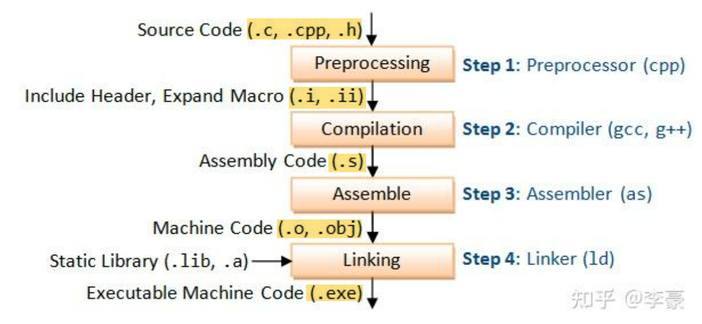
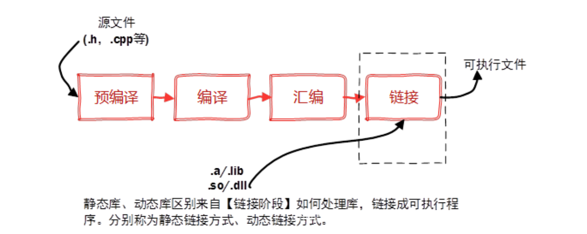
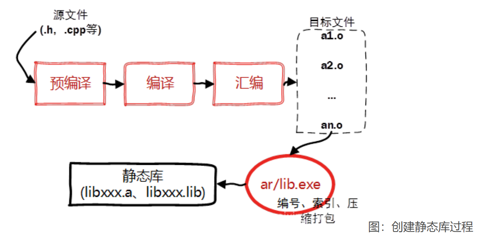
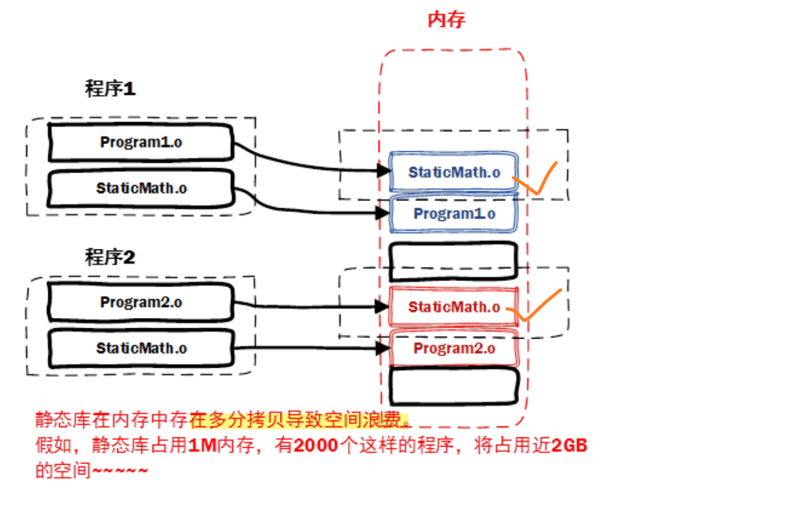
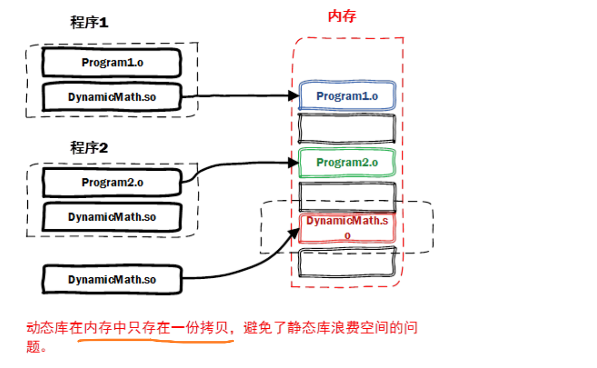
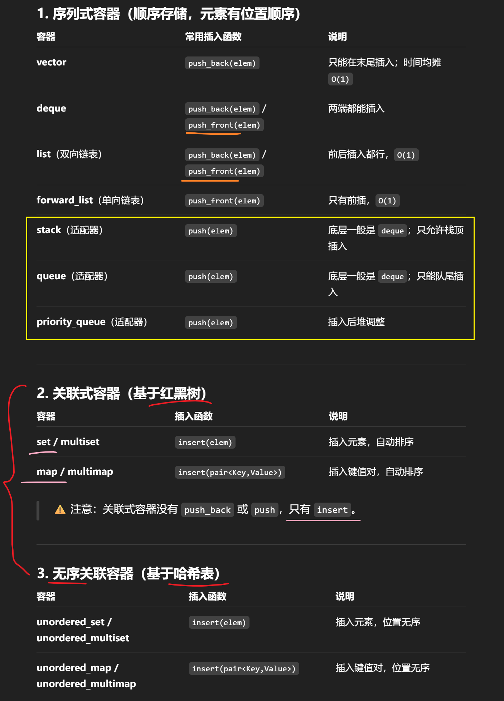

# C++ 项目目录结构

~~~shell
project_name
├── bin		# 可执行文件目录
├── build	# 编译生成的中间文件和可执行文件
├── lib		# 外部库
│
├── include # 头文件
│   └── project_name
│   	└── xxx.h
│   	└── xxx.h
│   	└── ......
├── src (project_name) # 源代码
│   └── main.cpp
│   └── xxx.cpp
│   └── xxx.cpp
│   └── CMakeLists.txt
│   └── ......
│
├── test	# 测试代码目录
│   └── test.cpp
│   └── xxx.cpp
│   └── ......
│
├── sample  # 样例
├── CMakeLists.txt # CMake 构建脚本（如果使用 CMake）
│
├── .gitignore # 指明git忽略规则
├── readme.md # 项目说明文件
├── LICENSE # 版权信息说明
└── doc # 相关文档
~~~

- **bin**：编译后的可执行文件

- **build**：项目编译目录，临时目录，存放build时cmake产生的中间文件，其包含子目录 release 和 debug

- **lib**：外部依赖库目录，任何由项目、第三方或开发所需的库

- **resources**：资源文件目录

- **include**：所有项目头文件，每个模块以及整个工程对外的头文件 `.h`

  > 在 include 目录中使用了另一个目录 project_name，更加规范
  >
  > `#include <project_name/xxx.h>`

- **src**：应用程序源文件 `.cpp`

- **test**：所有测试代码文件，通常会使用一些测试框架如Google Test

- **samples**：样例程序目录

- **CMakeList.txt**：配置文件，用于告诉**CMake**应该做什么

  > 顶层 `CMakeLists.txt` 只指定 `${CMAKE_SOURCE_DIR}\include` 和 `${CMAKE_SOURCE_DIR}`，以保证所有的包含规则都是从工程根目录开始包含。

  > **Makefile**：项目构建配置文件（也有可能是其他类型的构建配置文件），可以由CMakeLists.txt生成

- **.gitignore** ：指明git忽略规则，哪些文件不添加到git库，防止将二进制文件和临时文件添加到 git 存储库

- **doc**：项目各种文档

- **README**： 项目的总体说明文件

- **LICENSE :** 版权信息说明


## bin 和 build 的区别

### bin

- **用途**：`bin` 目录通常用于存放构建完成后生成的<span style="color:#0000FF;">可执行文件或脚本</span>。它是<span style="color:#0000FF;">最终</span>用户运行程序时所需的文件所在的目录。
- **特点**：
  - 可以包含在版本控制中，尤其是在发布可执行文件或脚本时。
  - 是一个相对稳定的目录，即使清空 `build` 目录，`bin` 目录中的文件也应保持不变。
  - 在一些项目中，`bin` 目录也可以包含开发工具或辅助脚本。

### build

- **用途**：`build` 目录通常用于存放<span style="color:#0000FF;">编译过程中</span>生成的中间文件和最终的可执行文件。它是一个<span style="color:#0000FF;">临时目录</span>，包含编译产物，如对象文件（`.o` 或 `.obj`）、依赖文件、生成的 Makefile 或其他构建系统的文件。
- **特点**：
  - 是一个临时目录，可以随时清空或删除而不会影响源代码。
  - 通常不包含在版本控制中（例如，通过 `.gitignore` 忽略）。
  - 有时不同的构建配置（如 Debug 和 Release）会有各自的子目录。


# C++ 程序编译过程

> [C/C++程序编译过程为什么要分为四个步骤？](C/C++程序编译过程为什么要分为四个步骤？)
>
> [C/C++编译完整过程](C/C++编译完整过程)

## 编译过程

从原始的CPP文件到最终的可执行文件：**预处理，编译，汇编，链接**

- **预处理(Preprocessing)：**➡️ `.i` 和 `.ii` 
  - 主要用于处理<span style="color:#0000FF;"> # 开头</span>的代码行，比如对宏做展开，对include的文件做展开，条件编译选项判断，清理注释等
  - 文件以 `.i` 和 `.ii` 结尾
- **编译(Compilation)：**➡️  `.s` 
  - 使用预处理的输出结果作为输入，生成文本格式的平台相关的<span style="color:#0000FF;">汇编代码</span>(assembly code)
  - 文件以 `.s` 结尾
- **汇编(Assemble)：**➡️  `.o` 或 `.obj` 
  - 将上一步的汇编代码转换成二进制的机器码，称为 object code。
  - 产生的文件叫做<span style="color:#0000FF;">目标文件</span>，是二进制格式，文件以 `.o` 或 `.obj` 结尾
- **链接(Linking)：**➡️ `.exe`
  - 链接多个目标文件和所需的库文件 ( `.so` 等) ，生成<span style="color:#0000FF;">最终的可执行文件</span> ( `.exe` )



| 步骤   | 命令         | 等价命令 | 输出文件   |
| ------ | ------------ | -------- | ---------- |
| 预处理 | cpp          | gcc -E   | .i, .ii    |
| 编译   | cc1, cc1plus | gcc -S   | .s         |
| 汇编   | as           | gcc -c   | .o, .obj   |
| 链接   | ld           | gcc      | 可执行文件 |


**注意：**

**每个.c和.cc文件是<span style="color:#0000FF;">分别单独的做预处理、编译、汇编</span>这三个步骤，然后<span style="color:#0000FF;">所有目标文件链接</span>成一个可执行文件。**


### 预处理

  (1)、将所有的注释以空格代替；

  (2)、将所有的#define删除，并且展开所有的宏定义；

  (3)、处理条件编译指令#if，#ifdef、#elif，#else、#endif；

  (4)、处理#include，展开文件包含；

  (5)、保留编译器需要使用的#pragma指令


### 编译

（1） 对预处理生成的文件进行语法分析、词法分析、语义分析            

- 语法分析：分析表达式是否遵循语法规则             
- 词法分析：分析关键字，标识符，立即数是否合法             
- 语义分析：在语法分析基础上进一步分析表达式是否合法     

（2）分析结束后进行【代码优化】生成相应的汇编代码文件


### 汇编

（1）汇编过程是用汇编器将汇编代码转变为机器可以执行的指令，也就是机器指令，也称为目标文件(.o)。      

（2）每条汇编指令几乎都对应一条机器指令


### 链接

链接多个目标文件和所需的库文件 ( `.so` 等) ，生成<span style="color:#0000FF;">最终的可执行文件</span> ( `.exe` )

一般在这个阶段，我们会提到<span style="color:#0000FF;">动态库</span>和<span style="color:#0000FF;">静态库</span>，本质上来说库也是一种可执行文件的二进制形式，可以被操作系统载入内存执行。




## 动态库和静态库

根据链接方式的不同，链接过程可以分为：

- **静态链接**：目标文件直接加入到可执行文件       
- **动态链接**：在程序启动后，才动态加载目标文件

静态库和动态库：

- **静态库**(.a、.lib）：<span style="color:#CC0000;">程序带着库走</span>，独立但体积大
- **动态库**(.so、.dll) ：程序<span style="color:#CC0000;">运行时找库</span>，共享但依赖


| 特性     | 静态库（.a / .lib）                                          | 动态库（.so / .dll）                                         |
| -------- | ------------------------------------------------------------ | ------------------------------------------------------------ |
| 打包方式 | 库代码在<span style="color:#0000FF;">编译时直接复制进可执行文件</span> | 库单独存在，程序只保存<span style="color:#0000FF;">引用</span> |
| 文件大小 | 可执行文件体积较大（包含库代码）                             | 可执行文件体积小（依赖外部库）                               |
| 运行依赖 | 运行时不需要额外库文件                                       | <span style="color:#0000FF;">运行时必须能找到对应库</span>   |
| 更新方式 | 库更新后<span style="color:#0000FF;">需重新编译</span>程序   | <span style="color:#0000FF;">库更新后可直接替换</span>，无需重编译 |
| 共享性   | 每个程序都有一份自己的库代码                                 | 多个程序<span style="color:#0000FF;">共享</span>一份库，节省内存和磁盘 |
| 执行效率 | 程序加载速度快（不需额外加载库）                             | 程序启动时需要动态加载，稍有开销                             |
| 典型用途 | 小工具、嵌入式系统，发布时希望“带库”                         | 大型系统、需要库升级维护方便的场景                           |


### 静态库(.a、.lib）

在链接阶段，会将汇编生成的目标文件`.o`与引用到的库**一起打包到可执行文件中**，对应静态链接。

其实一个静态库可以简单看成是一组目标文件（.o/.obj文件）的集合，即**很多目标文件经过压缩打包后**形成的一个文件。

> Linux下使用ar工具、Windows下vs使用lib.exe，将目标文件压缩到一起，并且对其进行编号和索引，以便于查找和检索。


**静态库特点**：<span style="color:#CC0000;">程序带着库走</span>，独立但体积大

- 静态库对函数库的链接是放在<span style="color:#0000FF;">编译时期完成</span>的。
- 程序在运行时与函数库再无瓜葛，移植方便
- <span style="color:#0000FF;">浪费空间和资源</span>，因为所有相关的目标文件与牵涉到的函数库被链接合成一个可执行文件


**一般创建静态库的步骤：**




**Linux 静态库命名规范**：`lib[library_name].a`，`lib`为前缀，中间是静态库名，扩展名为 `.a`

**Linux 创建静态库**

- 首先，将代码文件编译成目标文件.o（比如`StaticMath.cpp` –>`StaticMath.o`）

  ~~~shell
  g++ -c StaticMath.cpp  # 注意带参数-c，否则直接编译为可执行文件
  ~~~

- 然后，通过 ar工具将目标文件打包成 `.a `静态库文件（`libstaticmath.a`）

  ~~~shell
  ar -crv libstaticmath.a StaticMath.o  # 生成静态库libstaticmath.a
  ~~~


**Linux下使用静态库**

只需要在编译的时候，指定静态库的搜索路径（-L选项）、指定静态库名（-l选项, 不需要 `lib` 前缀和 `.a` 后缀）

~~~shell
g++ TestStaticLibrary.cpp -L../StaticLibrary -lstaticmath
~~~

- `-L`：表示要连接的库所在目录
- `-l`：指定链接时需要的动态库，编译器查找动态连接库时有隐含的命名规则（即在给出的名字前面加上lib，后面加上.a或.so来确定库的名称）


### 动态库(.so、.dll) 

> 静态库的问题：
>
> - 空间浪费
>
> - 静态库对程序的更新、部署和发布页会带来麻烦
>   - 如果静态库liba.lib更新了，所有使用它的应用程序都需要重新编译、发布给用户（对于玩家来说，可能是一个很小的改动，却<span style="color:#0000FF;">导致整个程序重新下载</span>，全量更新）
>
> 

**动态库**在程序编译时并不会被连接到目标代码中，**而是在<span style="color:#0000FF;">程序运行时</span>才被载入**。

- 不同的应用程序调用相同的库，在<span style="color:#0000FF;">内存里只需要一份该共享库的实例</span>，规避了空间浪费
- 动态库在程序运行时才被载入，用户<span style="color:#0000FF;">只需要更新动态库</span>，增量更新




**动态库特点**：程序<span style="color:#CC0000;">运行时找库</span>，共享但依赖

- 把对一些库函数的链接载入，推迟到程序<span style="color:#0000FF;">运行时期</span>
- 可以实现<span style="color:#0000FF;">进程之间的资源共享</span>（因此动态库也称为**共享库**）
- 将一些程序升级变得简单，只需要更新动态库


> Window与Linux执行文件格式不同，在创建动态库的时候有一些差异
>
> - 在Windows系统下的执行文件格式是**PE**格式，动态库需要一个**DllMain函数**做出初始化的入口，通常在导出函数的声明时需要有_declspec(dllexport)关键字。
> - Linux下gcc编译的执行文件默认是**ELF**格式，不需要初始化入口，亦不需要函数做特别的声明，编写比较方便。


> 而且与创建静态库不同的是，动态库**不需要打包工具（ar、lib.exe），直接使用编译器即可创建动态库**。


**linux动态库的命名规范**： `libxxx.so`，前缀是`lib`，后缀名为`.so`。

- 针对于实际库文件，<span style="color:#0000FF;">每个共享库都有个特殊的名字 `soname`</span>
  - 在程序启动后，程序通过这个名字，来告诉动态加载器该载入哪个共享库
  - 在文件系统中，`soname` 仅是一个链接到实际动态库的链接
- 对于动态库而言，每个库实际上都有另一个名字给编译器来用
  - 它是一个指向实际库镜像文件的链接文件（lib+soname+.so）


**Linux下创建动态库**

- 首先，生成目标文件，此时要加编译器选项 `-fpic`（比如 `DynamicMath.cpp` –> `DynamicMath.o` ）

  ~~~shell
  g++ -fPIC -c DynamicMath.cpp
  ~~~

  - `-fPIC` 创建与地址无关的编译程序（pic，position independent code），是为了能够在多个应用程序间共享
  - `-c `：只激活预处理、编译和汇编，也就是把程序做成目标文件(.o文件) 

- 然后，生成动态库，此时要加链接器选项 `-shared`（`libdynmath.so`）

  ~~~shell
  g++ -shared -o libdynmath.so DynamicMath.o
  ~~~

  - `-shared` 指定生成动态链接库

上面两个步骤可以合并为一个命令：

~~~shell
g++ -fPIC -shared -o libdynmath.so DynamicMath.cpp
~~~


**Linux下使用动态库**

引用动态库编译成可执行文件（跟静态库方式一样）：

```shell
g++ TestDynamicLibrary.cpp -L../DynamicLibrary -ldynmath
```

> 关于[在执行的时候是如何定位共享库文件的呢？](https://blog.csdn.net/weixin_38278334/article/details/113854362)


## 编译器 g++

GNU 是一个自由软件操作系统工程，提供了编译器、库和工具，是 Linux 生态的基础。

**GNU 项目**下有一整套开发工具，其中最核心的就是 **GCC (GNU Compiler Collection)**。

**GCC** 不是单纯的 C 编译器，而是一个 **编译器集合**，支持多种语言：C、C++、Fortran、Go 等。

> `gcc` 和 `g++` 都是 GNU 编译器集合（GNU Compiler Collection, GCC）中的前端命令，区别：
>
> - `gcc` 是 GNU C 编译器前端，适合编译纯 C 程序。
> - `g++` 是 GNU C++ 编译器前端，适合编译 C++ 程序，自动链接 `libstdc++`。

 **g++ 的作用**：

- 负责把 C++ 源码（`.cpp`）翻译成机器可执行程序。
- 在编译阶段处理 C++ 特有的语法（类、模板、异常、多态等）。
- 在链接阶段会自动加上 **C++ 标准库（libstdc++）**。


### 常用调试/辅助参数

- `-E` → 停在预处理

- `-S` → 停在汇编文件

- `-c` → 停在目标文件，只生成目标文件 `.o`（不链接）

  > 无参数 → 默认执行到连接，生成可执行文件

- `-o <file>`：指定输出名

- `-g `→ 生成调试信息（gdb 可用）

- `-save-temps` → 保留中间文件（`.ii`、`.s`、`.o`）

- `-v` → 显示编译过程调用的内部命令（cc1plus、as、ld 等）

- `-I dir` → 添加头文件搜索路径

- `-L dir` → 添加库文件搜索路径

- `-lxxx` → 链接名为 `libxxx.so` 或 `libxxx.a` 的库


## 示例

`add.h`

~~~C++
#pragma once
int add(int a, int b);
~~~

`add.cpp`

~~~C++
#include "add.h"
int add(int a, int b) { return a + b; }
~~~

`main.cpp`

~~~C++
#include <iostream>
#include "add.h"

int main() {
    std::cout << "2+3 = " << add(2, 3) << std::endl;
    return 0;
}
~~~


编译流程：

**1、预处理**

~~~shell
g++ -std=c++17 -E main.cpp -o main.ii
g++ -std=c++17 -E add.cpp -o add.ii
~~~

- g++ → C++ 编译器驱动程序
- -std=c++17 → 指定语言标准（C++17），影响语法和库特性
- -E → 只做预处理，不进入编译、汇编、链接
- main.cpp → 源文件
- -o main.ii → 指定输出文件名为 `main.ii`
- 输出：展开 `#include`、`#define` 后的纯 C++ 源码


**2、编译**

~~~shell
g++ -std=c++17 -S main.cpp -o main.s
g++ -std=c++17 -S add.cpp -o add.s
~~~

- -S → 生成汇编代码（`.s` 文件），不进入汇编器
- 输出：人类可读的汇编文件 `main.s`


**3、汇编**

~~~shell
g++ -std=c++17 -c main.cpp -o main.o
g++ -std=c++17 -c add.cpp -o add.o
~~~

- -c → 只编译到目标文件（object file，`.o`），不进行链接
-  输出：机器码的目标文件 `main.o`，包含符号表


**4、链接**

~~~shell
g++ main.o add.o -o myprog
~~~

- main.o    add.o → 输入的目标文件
- -o myprog → 输出文件名，指定为可执行程序 `myprog`
- （隐含）→ g++ 会自动加上 C++ 标准库（libstdc++） 和启动代码

-  输出：最终的可执行程序 `myprog`


**综合成一条命令**

~~~shell
g++ -std=c++17 main.cpp add.cpp -Wall -O2 -o myprog
~~~

- **main.cpp add.cpp** → 多个源文件，编译器会先分别处理为 `.o`，再自动链接
- **-Wall** → 打开常见警告。
- **-O2** → 优化等级 2（平衡性能与编译时间）。
- **-o myprog** → 输出可执行文件名。

- 相当于把预处理、编译、汇编、链接一条龙完成


# std命名空间

以下是常用 C++ 标准函数、容器与算法的 **命名空间、头文件和标准支持版本** 对照表


常用函数与算法

| 函数 / 算法            | 所属命名空间  | 头文件        | 支持标准版本 |
| ---------------------- | ------------- | ------------- | ------------ |
| `std::max(a, b)`       | `std`         | `<algorithm>` | C++98        |
| `std::min(a, b)`       | `std`         | `<algorithm>` | C++98        |
| `std::sort()`          | `std`         | `<algorithm>` | C++98        |
| `std::ranges::sort()`  | `std::ranges` | `<algorithm>` | C++20        |
| `std::swap()`          | `std`         | `<utility>`   | C++98        |
| `std::abs()`           | `std`         | `<cmath>`     | C++98        |
| `std::accumulate()`    | `std`         | `<numeric>`   | C++98        |
| `std::binary_search()` | `std`         | `<algorithm>` | C++98        |
| `std::clamp()`         | `std`         | `<algorithm>` | C++17        |


常用容器

| 容器名称             | 所属命名空间 | 头文件            | 支持标准版本 |
| -------------------- | ------------ | ----------------- | ------------ |
| `std::vector`        | `std`        | `<vector>`        | C++98        |
| `std::string`        | `std`        | `<string>`        | C++98        |
| `std::set`           | `std`        | `<set>`           | C++98        |
| `std::unordered_set` | `std`        | `<unordered_set>` | C++11        |
| `std::map`           | `std`        | `<map>`           | C++98        |
| `std::unordered_map` | `std`        | `<unordered_map>` | C++11        |
| `std::stack`         | `std`        | `<stack>`         | C++98        |
| `std::queue`         | `std`        | `<queue>`         | C++98        |


其他常用工具类函数

| 工具函数 / 类型   | 所属命名空间 | 头文件         | 支持标准版本 |
| ----------------- | ------------ | -------------- | ------------ |
| `std::pair`       | `std`        | `<utility>`    | C++98        |
| `std::make_pair`  | `std`        | `<utility>`    | C++98        |
| `std::tuple`      | `std`        | `<tuple>`      | C++11        |
| `std::make_tuple` | `std`        | `<tuple>`      | C++11        |
| `std::function`   | `std`        | `<functional>` | C++11        |
| `std::bind`       | `std`        | `<functional>` | C++11        |
| `std::move`       | `std`        | `<utility>`    | C++11        |


# 大顶堆，小顶堆

> 大顶堆小顶堆就是一棵完全二叉树，其中父节点大于或小于左右子节点。
>
> 在 C++ 中，大顶堆和小顶堆可以通过 `priority_queue` 容器非常方便地实现。

**大顶堆**：在 C++ STL 中，默认的 `priority_queue` 就是 大顶堆（**大的元素在top**）

~~~C++
priority_queue<int> maxHeap; // 默认是大顶堆

// priority_queue<int, vector<int>, less<int>> maxHeap; // 默认就是less
~~~


**小顶堆**（小的元素在top），必须让**比较函数“反过来”**

~~~C++
priority_queue<int, vector<int>, greater<int>> minHeap; // 小顶堆
~~~

定义一个**最小堆**类型的 `priority_queue`，元素类型为 `int`，底层容器为 `vector<int>`，排序规则由一个叫 `greater<>` 的比较函数（可以直接用）决定。


> 比较函数：
>
> ~~~C++
> auto cmp = [](int a, int b) { return a > b; }; // 小的优先
> std::priority_queue<int, std::vector<int>, decltype(cmp)> minHeap;
> ~~~
>
> 在 C++ STL 的 `priority_queue` 中，**比较函数 `cmp(a, b)` 的语义是**：
>
> “ 如果 `cmp(a, b)` 为 `true`，则认为 `a` 的优先级**低于** `b`，所以 `a` 会在 `b` 的**后面**。”
>
> 所以 `return a > b;` 表示 `a > b`时，返回true，大的数在后面，小的数在前（top）。
>
> `decltype(expr)` 是 C++11 中的一个**类型推导工具**，表示“**expr 的类型**”。
>
> 
>
> 力扣23，合并k个有序链表，按照节点值排序
>
> ~~~C++
> // 按照节点值排序，大的在后，小的在前
> auto cmp = [](const ListNode* a, const ListNode* b)
> {
>     return a->val > b->val; // 最小堆，大的排后面，每次取top取最小值
> }
> priority_queue<ListNode*, vector<ListNode*>, decltype(cmp)> pq;
> ~~~
>
> 


**自定义结构体的堆**

比如按 pair 的第二个元素升序（小顶堆），需要写仿函数

~~~C++
// 小顶堆：仿函数改变 priority_queue 排序
class mycomparison{
public:
    bool operator() (const pair<int, int>& lhs, const pair<int, int>& rhs)
    {
        return lhs.second > rhs.second; // 次序，较小的在top
    }
};

priority_queue<pair<int, int>, vector<pair<int, int>>, mycomparison> pri_que;
~~~


# C++20 `<ranges>` 

`std::ranges` 基本覆盖了 `<algorithm>` 里常用的函数，用法更简洁、安全，并且扩展了比较器 + 投影机制。

主要改进

1. **调用更简洁**：直接传容器，无需写 `.begin(), .end()`

   ```
   std::vector<int> v{3,1,4};
   auto it = std::ranges::max_element(v); // ✅ 更直观
   ```

2. **支持投影 (projection)**：直接指定比较属性

   ```
   struct Point { int x,y; };
   std::vector<Point> ps{{1,2},{3,1},{2,5}};
   auto p = *std::ranges::max_element(ps, {}, &Point::y); // 按 y 比较
   ```

3. **Concepts 约束**：参数类型检查更严格，编译期报错更清晰。


C++20 `std::ranges` 常用函数

| 类别         | 传统 `<algorithm>`                                           | C++20 `<ranges>`                                           | 用法区别与优势                                      |
| ------------ | ------------------------------------------------------------ | :--------------------------------------------------------- | --------------------------------------------------- |
| **最值**     | `max(a, b)` / `min(a, b)`                                    | `ranges::max(a, b)` `ranges::min(a, b) `                   | 可直接作用于整个 range ⭐<br />如 `ranges::max(vec)` |
|              | `minmax(a, b)`                                               | `ranges::minmax(a, b)`                                     | 同上，可直接处理容器。                              |
| **极值元素** | `max_element(vec.begin(), vec.end())`<br />`min_element(...)` | `ranges::max_element(vec)`<br />`ranges::min_element(...)` | 不需要 `.begin(), .end()`，更简洁、更安全。⭐        |
| **查找**     | `find(vec.begin(), vec.end(), value)`                        | `ranges::find(vec, value)`                                 | 直接传容器，不必写迭代器。⭐                         |
|              | `find_if(vec.begin(), vec.end(), pred)`                      | `ranges::find_if(vec, pred)`                               | 简化写法，更清晰。                                  |
| **计数**     | `count(vec.begin(), vec.end(), value)`                       | `ranges::count(vec, value)`                                | 免去 `.begin(), .end()`。⭐                          |
|              | `count_if(vec.begin(), vec.end(), pred)`                     | `ranges::count_if(vec, pred)`                              | 更简洁。                                            |
| **遍历**     | `for_each(vec.begin(), vec.end(), f)`                        | `ranges::for_each(vec, f)`                                 | 直接作用于容器。                                    |
| **排序**     | `sort(vec.begin(), vec.end())`                               | `ranges::sort(vec)`                                        | API 更直观，自动推断范围⭐                           |
|              | `stable_sort(...)`                                           | `ranges::stable_sort(...)`                                 | 同理。                                              |
|              | `is_sorted(vec.begin(), vec.end())`                          | `ranges::is_sorted(vec)`                                   | 写法更简洁。                                        |
| **拷贝**     | `copy(src.begin(), src.end(), dest.begin())`                 | `ranges::copy(src, dest.begin())`                          | 源区间可直接传容器。                                |
|              | `copy_if(...)`                                               | `ranges::copy_if(src, dest.begin(), pred)`                 | 同理，避免迭代器错误。                              |
| **比较区间** | `equal(a.begin(), a.end(), b.begin())`                       | `ranges::equal(a, b)`                                      | 不必传 `end()`，减少错误。                          |


# for(&…) 写法

> 力扣48 顺时针旋转矩阵90度

~~~C++
class Solution {
public:
    void rotate(vector<vector<int>>& matrix) {
        // 两次翻转：(i,j) --> (j,i) --> (j,n−1−i)
        // - 转置：按照主对角线翻转， (i,j) --> (j,i)
        // - 行翻转：每一行的内部元素对称翻转，(j,i) --> (j,n−1−i)

        int n = matrix.size();

        // 第一步：主对角线翻转 (i, j) --> (j, i)
        for (int i = 0; i < n; i++)
        {
            for (int j = 0; j < i; j++) // 找主对角线下方的元素
            {
                swap(matrix[i][j], matrix[j][i]);
            }
        }

        // 第二步：每一行行内对称翻转 (i, j) --> (i,n−1−j) 
        for (auto& row : matrix)	reverse(row.begin(), row.end());
    }
};
~~~


关于` for (auto& row : matrix)` 这里为什么用 `&` ？

**如果不用 `&`，操作只作用在副本上**，原矩阵完全不变。只有用 `&`，才能让 `reverse` 直接作用在 `matrix` 里。

> for 循环的三种写法区别
>
> (1) `for (auto row : matrix)`
>
> - `row` 是 **拷贝** 出来的一行（`vector<int>` 的副本）。
> - `ranges::reverse(row)` **只会反转副本**，不会影响 `matrix` 里的数据。整个操作对 `matrix` 无效。
>
> (2) `for (auto& row : matrix)` ✅
>
> - `row` 是对 `matrix` 中行的 **引用**。
> - `ranges::reverse(row)` 会**直接修改 `matrix` 里对应的那一行**。
>
> (3) `for (const auto& row : matrix)`
>
> - `row` 是常量引用，不允许修改。
> - 在这里会报错，因为 `reverse` 需要修改内容。


# 宏

## #ifdef  #endif 条件编译

有几个指令可以用来有选择的**对部分程序源代码进行编译**，这个过程称为**条件编译**。

~~~c++
#ifdef NULL
   #define NULL 0
#endif
~~~

可以只在调试时进行编译，调试开关可以使用一个宏来实现。

~~~c++
// 如果在指令 #ifdef DEBUG 之前已经定义了符号常量 DEBUG，则会对程序中的 cerr 语句进行编译
#ifdef DEBUG
	cerr << "Variable x = " << x << endl;
#endif
~~~

可以使用 `#if 0` 语句**注释**掉程序的一部分

~~~c++
#if 0
	不进行编译的代码
#endif
~~~

示例

~~~c++
#include <iostream>
using namespace std;
#define DEBUG // 定义常量DEBUG
 
#define MIN(a,b) (((a)<(b)) ? a : b) 
 
int main ()
{
   int i, j;
   i = 100;
   j = 30;
    
#ifdef DEBUG
   cerr <<"Trace: Inside main function" << endl; // 前面已经定义了常量DEBUG，这句会输出
#endif


#if 0
   /* 这是注释部分 */
   cout << MKSTR(HELLO C++) << endl; // 已经使用#if 0 注释掉了这部分
#endif
 
   cout <<"The minimum is " << MIN(i, j) << endl; // 调用参数宏 MIN()

#ifdef DEBUG
   cerr <<"Trace: Coming out of main function" << endl; // 前面已经定义了DEBUG，这句也会输出
#endif
    return 0;
}
~~~


## 头文件保护宏

头文件保护宏（include guard）利用 **预处理器的条件编译**指令，实现“**只定义一次**”的效果。

**宏定义是全局的**。预处理器在**编译阶段会全局记录宏是否已经定义**。利用这个特性，就能在第一次包含后“屏蔽掉”后续的重复包含。

### 标准写法

~~~C++
#ifndef 文件名全大写_H // 使用保护宏时，宏名要全局唯一，通常使用 文件名全大写 + _H 的形式。
#define 文件名全大写_H

// 头文件内容（类、函数声明等）

#endif  
~~~

例如，skiplist.h中

~~~C++
#ifndef SKIPLIST_H       // 如果没有定义 SKIPLIST_H（第一次进入）
#define SKIPLIST_H       // 那就定义它（防止之后再进来）

// 头文件的实际内容，如类定义
class SkipList {
    // ...
};

#endif  // 结束 ifndef
~~~

工作流程（假设你多次包含该头文件）：

- 第一次包含 `skiplist.h`：

  - `SKIPLIST_H` 还没有定义，`#ifndef` 成立。

  - 执行 `#define SKIPLIST_H`，并展开整个头文件内容。

  - **头文件被真正包含一次**。

- 第二次或更多次包含：

  - `SKIPLIST_H` 已经被定义了。

  - `#ifndef SKIPLIST_H` 不成立。

  - **预处理器直接跳过整个头文件内容，不会重复展开**。


### 替代方案 #pragma once

~~~C++
#pragma once
~~~

适用于大多数现代编译器，效果与保护宏相同。

**告诉编译器 “这个文件只编译一次”**，由编译器保证不会重复包含。

这种写法不是 C++ 标准的一部分，但几乎所有主流编译器（GCC、Clang、MSVC）都支持。

对于软链接或同一文件不同路径 include 的情况，某些老编译器可能会误判为不同文件。


### 对比

| 特性             | `#ifndef/#define/#endif`     | `#pragma once`                               |
| ---------------- | ---------------------------- | -------------------------------------------- |
| **是否标准**     | ✅ 属于 C/C++ 标准            | ❌ 非标准，但主流编译器都支持                 |
| **兼容性**       | ✅ 所有编译器都支持           | ⚠️ 极老编译器可能不支持                       |
| **书写简洁性**   | ❌ 需要写三行宏，宏名必须唯一 | ✅ 一行即可                                   |
| **命名冲突风险** | ⚠️ 宏名需小心，可能冲突       | ✅ 无命名冲突                                 |
| **可读性**       | 中等，需要检查宏名           | 高，可一眼看出作用                           |
| **编译速度**     | 稍慢（需检查宏定义）         | **稍快**（编译器直接标记文件已处理）         |
| **路径敏感问题** | 不受路径影响                 | 某些编译器可能因软链接/不同路径 include 误判 |
| **实际项目使用** | 常见于老代码库、跨平台库     | **新项目、现代 C++ 项目普遍采用**            |

- 如果项目 **要兼容非常老的编译器**（例如嵌入式场景），建议用 `#ifndef/#define/#endif`。
- 如果项目主要在 **现代 Linux/Windows 环境下开发**（RPC 项目大多如此），直接用 `#pragma once` 更简洁、错误率更低。

很多新项目（尤其是 C++20 之后）基本都统一用 `#pragma once`。


# 锁

当多个线程访问共享资源时，如果不加保护，可能会出现同时修改导致数据错乱，或者一个线程在写，另一个线程在读，导致读取的是中间状态的脏数据。

为了避免这种情况，通过加锁和解锁来控制访问，**防止多个线程同时访问共享资源**。


## `mutex`基本互斥锁

确保同一时刻只有一个线程可以访问共享资源

当一个线程需要访问共享资源时，它会尝试锁定互斥锁。**如果互斥锁已经被其他线程锁定，请求线程将被阻塞，直到互斥锁被释放。**

`<mutex>` 头文件是 C++11 引入的，它包含了用于互斥锁（mutex）的类和函数，用于在多线程程序中实现线程间的同步和互斥。

~~~C++
#include <mutex>

std::mutex mtx;

void threadSafeFunc() {
    mtx.lock();   // 加锁
    // 临界区：访问共享资源
    mtx.unlock(); // 解锁
}
~~~

假设多个线程同时对一个全局变量`counter`做自增操作，如果不加锁，多线程执行下面的函数，可能出现竞争：

~~~C++
int counter = 0;

void increment() {
    for (int i = 0; i < 10000; ++i) {
        ++counter;
    }
}
~~~

使用`std::mutex`加锁保护

~~~C++
#include <iostream>
#include <thread>
#include <mutex>

int counter = 0;
std::mutex mtx; // 全局互斥锁

void increment() {
    for (int i = 0; i < 10000; ++i) {
        mtx.lock();       // 加锁
        ++counter;        // 临界区
        mtx.unlock();     // 解锁
    }
}
~~~

加锁`mtx.lock();`

- 当前线程尝试获取 mutex 的 “**所有权**”。
- 内核检查mutex状态，如果 mutex **是未锁定**，当前线程将**成功获得锁**，进入临界区。
- 如果 mutex **已被其他线程锁定**，当前线程将被**挂起阻塞**，直到 mutex 被释放（解锁）。

解锁`mtx.unlock()`:

- 当前线程释放 mutex，**解除对资源的独占访问**。
- 如果有其他线程在等待这个 mutex，**其中一个会被唤醒**，继续获取锁。

注意：

- 每次锁定互斥锁后，**都要进行解锁，避免死锁**
- 避免在持有互斥锁的情况下调用可能抛出异常的函数，因为这可能导致死锁。
- 使用 `std::lock_guard` 或 `std::unique_lock` 可以**自动管理**互斥锁的锁定和解锁，减少出错的可能性。


##  `lock_guard`

`lock_guard` 是最简单的 RAII 锁，作用域结束时会自动解锁

使用 **RAII（资源获取即初始化）** 风格，**自动管理** `std::mutex` 的加锁与解锁，确保在**作用域结束时自动释放锁**。

~~~C++
std::mutex mtx; // 互斥锁

void func() {
    std::lock_guard<std::mutex> lock(mtx); // 构造时加锁
    
    // 临界区代码
    
} // 作用域结束，自动析构 -> 解锁
~~~

特点：

- 对象创建时自动加锁，对象生命周期结束（或作用域退出时）自动解锁
- 构造函数自动`lock()`，析构函数自动`unlock()`
- 不支持显式lock/unlock
- 不支持延迟加锁


## `unique_lock`：✅推荐

`unique_lock` 是 C++ 提供的比 `lock_guard` 更灵活的 RAII 锁

**`unique_lock<mutex>`**是一个封装类，用来管理 `mutex`。

支持更多操作，适用于复杂场景，支持延迟加锁、条件变量、手动 unlock()、移动构造

~~~C++
std::mutex mtx;

void func() {
    std::unique_lock<std::mutex> lock(mtx); // 构造时加锁
    
    // 临界区代码
    
} // 作用域结束自动解锁
~~~


延迟加锁：

~~~C++
std::unique_lock<std::mutex> lock(mtx, std::defer_lock);
// 一些前置逻辑
lock.lock();// 显示加锁
~~~

支持手动lock/unlock

```C++
std::unique_lock<std::mutex> lock(mtx);
// ...
lock.unlock(); // 提前释放锁
// ...
lock.lock();   // 再次加锁
```

尝试加锁 

~~~C++
unique_lock<mutex> lock_1(mtx_1, try_to_lock);
~~~

- **`try_to_lock`**是一个 **lock 标志（std::try_to_lock_t）**语义是“尝试去加锁，但如果失败不要阻塞”。

| 对比点                   | `lock_guard` | `unique_lock` |
| ------------------------ | ------------ | ------------- |
| 自动加解锁               | ✅            | ✅             |
| 支持显式 lock()/unlock() | ❌            | ✅             |
| 支持延迟加锁             | ❌            | ✅             |
| 支持与条件变量一起使用   | ❌（不兼容）  | ✅（推荐）     |
| 占用内存                 | 更小         | 略大          |
| 使用复杂度               | 简单         | 灵活但稍复杂  |

| 使用场景                     | 建议使用           |
| ---------------------------- | ------------------ |
| 简单保护共享数据（函数内部） | `std::lock_guard`  |
| 需要条件变量、复杂解锁控制   | `std::unique_lock` |


## condition_variable

`std::condition_variable` 是 C++ 标准库 `<condition_variable>` 头文件中提供的**线程间同步机制**。

允许一个或多个线程在**某个特定条件**满足之前进入阻塞等待状态，当条件满足后被唤醒，避免**忙等（busy waiting）**浪费CPU资源。

主要用于**多线程之间的等待/通知机制**，协调线程之间的执行顺序。它与互斥锁（`std::mutex`）配合使用，保证**条件检测和等待操作的原子性**，从而避免竞态条件。

使用 `std::condition_variable` 的**标准流程**可以概括为：

1. 等待方（通常是消费者线程）：
   - 持有互斥锁，检查某个条件是否满足；
   - 如果不满足，调用 `wait()`，线程挂起，**同时释放锁**；
   - 被唤醒后重新获得锁，并再次检查条件（防止虚假唤醒）。
2. 通知方（通常是生产者线程）：
   - 持有互斥锁，修改共享数据使得条件满足；
   - 调用 `notify_one()` 或 `notify_all()`，唤醒一个或所有等待线程。

**主要成员函数**

| 函数                                              | 功能描述                                                     |
| :------------------------------------------------ | :----------------------------------------------------------- |
| `void wait(std::unique_lock<std::mutex>& lock)`   | 挂起当前线程，直到被 `notify_one()` 或 `notify_all()` 唤醒。需要**关联互斥锁**。 |
| `template<class Predicate> void wait(lock, pred)` | 带条件检查的等待，**避免虚假唤醒**。只有当 `pred()` 返回 `true` 才继续执行。 |
| `void notify_one()`                               | 唤醒一个正在等待的线程。                                     |
| `void notify_all()`                               | 唤醒所有正在等待的线程。                                     |

示例：

~~~c++
std::mutex mtx;
std::condition_variable cv; // 条件
bool ready = false;

void worker() {
    std::unique_lock<std::mutex> lock(mtx);
    cv.wait(lock, []{ return ready; }); // 等待ready为true
    // 被唤醒且ready为true，继续执行
}

void master() {
    {
        std::lock_guard<std::mutex> lock(mtx);
        ready = true; // 修改条件
    }
    cv.notify_one(); // 通知worker线程
}

~~~

- **必须持锁**：`wait()` 必须持有一个 `std::unique_lock<std::mutex>`，因为条件变量需要自动释放和重新获得锁。
- **虚假唤醒（Spurious Wakeup）**：即使没有 `notify`，某些平台上的线程也可能自己醒来。所以一定要用带 **predicate** 的 `wait()` 或循环检查条件。
- **避免死锁**：通知线程必须在持锁、修改条件之后进行 `notify_one()` 或 `notify_all()`，确保被唤醒的线程能看到正确的状态。


### wait()

`wait` 用于 **阻塞当前线程**，直到满足特定**条件**或被其他线程**通知唤醒**

本质是：**等待 + 解锁 + 自动重新加锁**，必须**配合mutex互斥锁**使用

- 调用`wait()`前，当前线程必须持有锁（`std::unique_lock<std::mutex>`）
- 等待期间线程会**自动释放**所持有的互斥锁，防止阻塞其他线程。

- 唤醒后会**重新加锁**，保证数据一致性，再继续执行后序逻辑。

**基础使用：`wait(lock)`** 只等待通知，不管条件

~~~C++
std::mutex mtx;
std::condition_variable cv;

void thread_func() {
    std::unique_lock<std::mutex> lock(mtx); // 先加锁，保护共享资源

    cv.wait(lock);                          // 释放锁，挂起当前线程，等待被唤醒
    // 被唤醒后，重新抢锁，继续执行后续代码
}
~~~

- 加锁，保证接下来访问共享变量是线程安全的
- 调用`cv.wait(lock)`
  - 自动释放锁，线程进入等待状态（阻塞挂起），等待其他线程来唤醒自己
- 唤醒当前线程
  - 其他线程调用`cv.notify_one()` ，唤醒正在`wait()`的线程
  - 当前线程被唤醒，自动重新加锁，**加锁成功后才继续执行后序代码（无条件检查）**，从`wait()`返回，后序逻辑继续

存在的风险：

`cv.wait(lock)`只等待被唤醒，不会检查具体的业务条件，存在“**虚假唤醒**”，需要手动用循环判断条件

```C++
while (!condition) { // 手动循环检查条件
    cv.wait(lock); // 如果条件未满足，调用wait，释放锁，阻塞当前线程
}
// 当条件满足，退出循环，继续执行
```


**带谓词版：`wait(lock, predicate)`** 既等通知，也检查**条件**

~~~C++
std::mutex mtx;
std::condition_variable cv;
bool ready = false;

void thread_func() {
    std::unique_lock<std::mutex> lock(mtx); // 先加锁

    cv.wait(lock, [] { return ready; });    // 等待 ready==true
    // ready为true后继续执行
}

~~~

`cv.wait(lock, pred)`：若 `pred` 假就**原子释放锁并阻塞**，被唤醒后**重获锁并重新评估 `pred`**；返回时仍持锁。

- 加锁
- 调用`cv(lock, []{return ready})`
  - 判断`ready == false`？是，则进入阻塞等待
  - 并自动释放锁

- 被唤醒
  - 其他线程修改共享状态并调用`cv.notify_one()`
  - 当前线程**被唤醒**，**重新加锁**
  - **唤醒后再次检查条件`ready`**
    - 如果`readu == false` 虚假唤醒，继续等待
    - 如果`ready == true` 直接返回

✅ **唤醒后不是立即执行，而是先加锁再检查条件，<span style="color:#CC0000;">只有在“被唤醒且条件满足”时，`wait()` 才真正返回</span>**

实际等价代码：`wait(lock, predicate)` = 不断 wait+检查条件的组合，只是被封装好了

~~~C++
cv.wait(lock, []{ return 条件为真; });

// ===》 等价于
while(!条件) {
    cv.wait(lock);
}
~~~


### notify_one()和notify_all()

**notify_one()**

- 唤醒等待在该条件变量上的**某一个线程**（如果有的话）从 `wait` 状态中返回，继续执行后续代码。
- `notify_one()` 只唤醒**一个**等待线程（如果有多个线程等待，具体唤醒哪一个是由操作系统调度器决定的，通常是随机）。
- 过程：
  - **线程A**调用 `wait(lock)`，自动释放 `mutex_`，挂起自己。
  - **线程B**完成某些准备工作后，调用 `notify_one()`，发出唤醒信号。
  - **线程A**收到信号，重新竞争锁，拿到 `mutex_` 后，从 `wait()` 返回，继续执行后续逻辑。

**notify_all()**

- 唤醒**所有**当前在该条件变量上等待的线程，使它们从 `wait()` 返回，竞争继续执行。
- 过程：
  - 某些线程调用 `wait(lock)` 挂起自己，等待某个条件成立
  - 某线程在条件成立后，调用 `notify_all()`。
  - 所有因 `wait` 而阻塞的线程**都会被唤醒**，进入**锁竞争**阶段。
  - **拿到锁的线程**才能继续执行；没抢到锁的线程会继续等待锁可用。

**注意：**

- 被 `notify_all()` 唤醒的线程，不会立刻执行，而是**需要重新竞争 `mutex`**，竞争到锁的线程才能真正从 `wait()` 返回，继续后续逻辑

| 特点     | notify_one                 | notify_all                       |
| -------- | -------------------------- | -------------------------------- |
| 唤醒数量 | 1个等待线程                | 所有等待线程                     |
| 使用场景 | 只有一个线程需要响应的情形 | 所有线程都需要知道的情形         |
| 性能开销 | 较低                       | 较高（大量线程同时唤醒 + 竞争）  |
| 风险     | 可能遗漏某些等待线程       | 可能导致竞争激烈、短时内资源紧张 |


## 信号量sem

**什么是信号量？**

是一个用来**控制协调多个线程访问共享资源**（同步和互斥）的 **“计数器” 机制**，防止出现数据竞争和资源冲突。

可以理解为线程之间用来同步的一种工具，资源计数器。所以其实是 “**信号计数量**”。

>  **首先是一个变量，其次是计数器。**

信号量在**创建时需要设置一个初始值**，表示**同时可以有几个任务（线程）可以访问**某一块共享资源。

- 一个任务要想访问共享资源，需要信号量大于0；
- 当该任务成功获得资源后，将信号量的值减 1；
- 当任务执行完之后，必须释放信号量，对应操作就是信号量的值加 1。

- 若当前信号量的值小于 0，表明无法获得信号量，该任务必须被挂起，等待信号量恢复为正值的那一刻；

另外，对信号量的操作（加、减）都是原子的。

**声明信号量**

`sem_t` 是 POSIX 信号量的数据类型，用于表示一个信号量对象（适用于Linux/UNIX下的多线程）

包含在头文件`<semaphore.h>`中。

~~~C++
#include <semaphore.h>
sem_t sem;// 声明一个信号量
~~~

**初始化信号量 `sem_init()`**

~~~C++
int sem_init(sem_t* sem, int pshared, unsigned int value);

// sem		信号量变量（的地址）
// pshared	是否在进程间共享，
// 			设为 0 表示仅用于线程间共享（同一个进程内）；1 表示可以进程间共享(需要放在共享内存中)
// value	信号量的初始值（比如资源数量、允许进入线程数）
~~~

**等待信号量（P 操作）`sem_wait()`**

~~~C++
int sem_wait(sem_t* sem);

// 用于等待某个资源或条件就绪
// 如果信号量的值 > 0，执行成功，同时信号量减 1；
// 如果值 = 0，当前线程阻塞，等待别人释放信号量。
~~~

**释放信号量（V 操作）`sem_post()`**

~~~C++
int sem_post(sem_t* sem);

// 信号量的值加 1；
// 如果有线程在 sem_wait 阻塞，它会被唤醒
~~~

**销毁信号量`sem_destory()`**

~~~C++
int sem_destory(sem_t* sem);

// 清理资源
// 一般在线程退出、或程序结束前调用
~~~


# 关键字

## constexpr

`constexpr`是 C++11 引入的一个关键字，用来声明“常量表达式”。它的核心作用是：**在编译期就能确定结果**。

- `constexpr` 修饰 **变量**：变量的值必须在编译期就能确定（常量）。
- `constexpr` 修饰 **函数**：函数在编译期可以被计算（如果传入的参数也是编译期常量）。
- `constexpr` 修饰 **构造函数/成员函数**：允许类在编译期完成常量计算和初始化。


与 `const` 的区别

| 特性       | `const`        | `constexpr`            |
| ---------- | -------------- | ---------------------- |
| 编译期常量 | 不保证         | 保证（如果表达式有效） |
| 运行期     | 可以           | 可以                   |
| 修饰函数   | 不允许         | 允许                   |
| 用途       | 只表示不可修改 | 表示“必须是编译期常量” |

例子：

```
const int a = 10;       // a 是常量，但编译器可能不要求它是编译期常量
constexpr int b = 10;   // b 一定是【编译期常量】
```


**`constexpr` 函数在编译期能被执行**，如果输入参数是常量表达式，就在编译期计算；否则退化为普通函数，在运行时计算。

```C++
constexpr int square(int x) {
    return x * x;
}

int main() {
    constexpr int a = square(5); // 输入参数是常量，编译期计算
    int n = 10;
    int b = square(n);          // 运行期计算
}
```


 C++14/17/20 的增强：

- **C++11**：`constexpr` 函数只能有一个 `return`，非常受限。
- **C++14**：放宽限制，可以有局部变量、分支、循环。
- **C++17**：`if constexpr`（编译期条件判断）引入。
- **C++20**：支持 `constexpr` 动态分配（`new`）、虚函数、甚至更复杂的 STL 算法。


使用场景：

1. **数组大小、模板参数**：

   ```C++
   constexpr int N = 16;
   int arr[N]; // OK
   ```

2. **编译期计算**（减少运行时开销）：

   ```C++
   constexpr int fact(int n) {
       return (n <= 1) ? 1 : (n * fact(n - 1));
   }
   int arr[fact(5)]; // 数组大小在编译期确定
   ```

3. **类型安全的常量定义**：避免用宏 `#define`。

4. **泛型编程与模板元编程**：结合 `if constexpr` 优化分支裁剪。


# STL

## 容器插入 push/push_back/insert




**总结**

- **`push_back`** → 顺序容器（`vector`、`deque`、`list`），往后加。
- **`push_front`** → 双端容器（`deque`、`list`、`forward_list`）。
- **`push`** → 容器适配器（`stack`、`queue`、`priority_queue`）。
- **`insert`** → 关联容器（有序的 `map/set`，无序的 `unordered_map/set`）。


## string


### **关于 `stringstream` 与 `getline`** 

`stringstream` C++ 标准库中的一种**字符串流对象**，属于 `<iostream>` 的扩展。

让字符串可以像文件流、输入流那样被逐段读取

~~~C++
string ver = "1.0.3";
stringstream ss(ver);
~~~

此时 `ss` 就像一个“输入流”，内容为 `"1.0.3"`。

`getline()` 函数原型：

~~~C++
istream& getline(istream& is, string& str, char delim);
// 					输入流is					分隔符
~~~

- 从输入流 `is`（这里是 `stringstream ss`）中读取字符；
- 遇到分隔符 `delim`（这里是 `'.'`）或文件结束符就停止；
- 把读到的内容放入 `str`；不会把分隔符本身写入 `str`。

例如：

~~~C++
string ver = "1.10.3";
stringstream ss(ver);
string num;

while (getline(ss, num, '.')) { // 把读到的以'.'为分隔的数，放进num
    cout << num << endl;
}
~~~


# end
