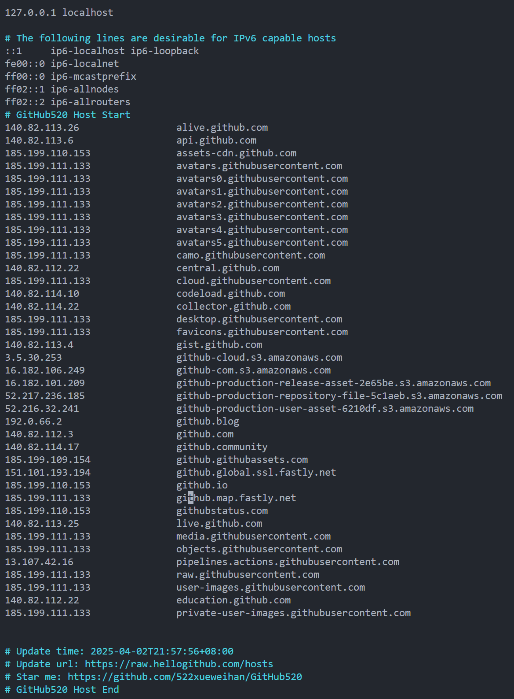

# git及GitHub基础操作

> 安装git    https://git-scm.com/downloads
>


## git clone远程仓库到本地

GitHub上找到仓库或者新建仓库，复制clone地址

本地 git bash 输入 clone地址，如

~~~ shell
git clone https://github.com/your-username/MyWebServer.git
~~~

本地添加或修改代码

~~~shell
git add test.cpp
git commit -m "提交信息"
~~~

推送到远程仓库

~~~shell
git push
git push -u origin main # 如果是第一次推送，没有自动关联，需要关联
~~~

拉取远程最新代码

~~~shell
git pull
~~~


## 本地新建仓库 —— 再关联远程仓库remote（GitHub - repository）

**本地仓库**

本地创建文件夹，作为本地仓库，在该文件夹中打开git bash，初始化本地仓库

~~~shell
git init
~~~

本地仓库操作可添加文件或代码

-   `git add .`添加文件到暂存区
  （可以先用 git status 查看状态，会提示哪些文件未添加到仓库）


   -   `git commit -m "提交信息"`，暂存区提交到本地仓库

~~~shell
git init
git status
git add .  
# 或者 git add <filename>
git commit -m "提交信息"
~~~

**关联远程仓库**

先在GitHub新建repository，获取仓库clone地址（Code - HTTPS/SSH）

本地仓库关联远程仓库

~~~shell
# git remote add <远程仓库名称> <远程仓库URL>   远程仓库名称默认是origin
git remote add origin https://github.com/LionZhY/MyNote-ZZZZH.git #https
git remote add origin git@github.com:LionZhY/MyNote-ZZZZH.git #ssh推荐

# 验证是否关联成功
git remote -v

# 如果一开始设置的是https连接，可以修改为ssh远程 （推荐）
git remote set-url origin git@github.com:LionZhY/MyNote-ZZZZH.git
~~~

**git推送到远程仓库**

~~~shell
git branch -M main # 重命名当前分支为main（更符合新的标准）（可省略）

#将本地分支 main 推送到远程仓库 origin，并关联远程的 main 分支
git push -u origin main 

# 以后再push/pull
# 直接
git push  
git pull
~~~

`git branch -M main` 重命名当前分支为main，也可以不改（更符合新的标准，可以查一下，现在好像都是main了）

`git push -u origin main`     

- `-u` 会建立本地分支和远程分支的关联，以后只需要  `git push` `git pull` 不用指明分支


## 利用ssh和GitHub绑定

~~~shell
#生成ssh key
ssh-keygen -t rsa 

#连敲三次回车，生成两个文件 id_rsa   id_rsa.pub
#默认在 ~/.ssh

#把公钥id_rsa.pub的内容添加到 GitHub
#将公钥id_rsa.pub的内容粘贴到Key处的位置(github--Settings--SSH keys--New SSH key)

#验证
ssh -T git@github.com
#返回 Hi LionZhY! You've successfully authenticated, but GitHub does not provide shell access.
~~~


## 服务器连不上GitHub

https://blog.csdn.net/PARIS9394/article/details/135913520

https://raw.hellogithub.com/hosts 生成文件，把这个文件内容复制到hosts中

~~~shell
sudo vim /etc/hosts
~~~




## commit每个文件不同的提交信息

**方法 1：逐个 `git add` 并 `git commit`**

你可以分别 `add` 每个文件，并使用 `git commit -m` 指定不同的提交信息：

```shell
git add include/CurrentThread.h
git commit -m "Fix thread ID caching in CurrentThread.h"

git add src/CurrentThread.cpp
git commit -m "Optimize thread initialization logic in CurrentThread.cpp"
```

**方法 2：使用 `git commit -p`（交互式提交部分修改）**

如果你在一个文件里做了多个修改，但想分开提交，`git commit -p` 允许你选择具体的修改部分提交：

```shell
git add -p include/CurrentThread.h
git commit -m "Refactor thread ID handling in CurrentThread.h"

git add -p src/CurrentThread.cpp
git commit -m "Improve thread synchronization in CurrentThread.cpp"
```

它会逐个展示修改，并询问是否提交，你可以选择 `y`（提交）或 `n`（跳过）。

**方法 3：一次性 `add` 所有文件，然后 `git commit` 时逐个提交**

你可以先 `add` 所有修改的文件：

```shell
git add -A
```

然后在 `git commit` 时使用 `--only` 选项提交指定文件：

```shell
git commit --only include/CurrentThread.h -m "Update CurrentThread.h"
git commit --only src/CurrentThread.cpp -m "Update CurrentThread.cpp"
```


# git基础命令


## 初始化本地仓库

`git init`


## add commit 文件

添加文件到暂存区

`git add <file name>`

暂存区提交到仓库

`git commit -m “提交信息”`

如果只是修改了一些已有的文件（已经add过的）

~~~shell
git commit -a
~~~


## 分支

列出本地分支

`git branch`

列出远程分支

`git branch -r`

列出本地和远程分支

`git branch -a`

新建分支

`git branch <新分支名称>`

新建分支并切换到该分支

`git branch -b <新分支名称>`

切换到上一个分支

`git checkout`

切换到指定分支

`git checkout <指定分支名称>`

合并指定分支到当前分支

`git merge <分支名称>`

删除分支

`git branch -d <分支名称>`


## 远程

clone远程仓库

`git clone <远程仓库url>`

显示远程仓库

`git remote -v`

本地连接远程

`git remote add <远程仓库名称，默认origin> <远程仓库URL>`

推送到远程

`git push <远程仓库名称><分支>`

拉取到本地

`git pull <远程仓库名称><分支>`


## 查看信息

查看状态

`git status`

查看日志

`git log`

列出标签

`git tag`


## 回到之前的版本

**查看提交历史**

~~~shell
git log --oneline  # 内容太多 按q退出
# 需要详细信息用
git log
~~~

~~~shell
# 输出示例
# 提交 id           提交信息
a1b2c3d 第三次提交 - 修复bug
9f8e7d6 第二次提交 - 增加模块
1234567 第一次提交 - 初始化项目
~~~

**临时查看之前的版本** 

~~~SHELL
git checkout <commit-id>
~~~

再回来

~~~SHELL
git checkout main # 原来的分支名
~~~

**永久退回，让当前分支回退到历史版本**

~~~shell
git reset --soft <commit-id> # 软退回，保留文件改动（文件和暂存区内容仍保留）
git reset --hard <commit-id> # 硬退回，彻底退回，丢弃改动，慎用！！！
~~~

**查看所有提交的文件差异**

~~~shell
git show <commit-id>
~~~


结合使用

~~~shell
# 先查看提交历史
git log --oneline

# 临时切换查看
git checkout <commit-id>

# 确定退回 reset
git reset --soft <commit-id>
~~~


**如果经常需要回到某个版本查看，建议使用 `git tag`：**

~~~shell
git tag v1.0 1234567   # 给某个提交打标签
git checkout v1.0      # 以后可直接切换到该版本 v1.0
~~~

