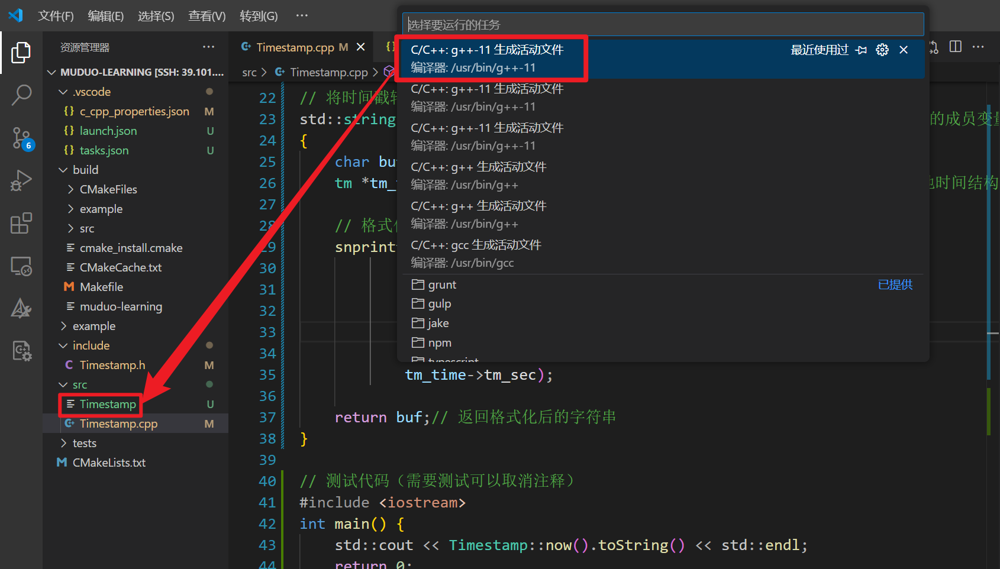

# vscode配置相关

> [vscode+ Cpp配置相关](https://blog.csdn.net/weixin_52159554/article/details/134406628#:~:text=VSCode%20%E5%AE%89%E8%A3%85%E5%A5%BD%E4%B9%8B%E5%90%8E%EF%BC%8C%E6%88%91%E4%BB%AC,%E5%BF%85%E9%A1%BB%E6%9C%89%E7%BC%96%E8%AF%91%E5%99%A8%E4%BD%BF%E7%94%A8%E3%80%82)

## **配置编译器**


## 编译运行**cpp**

### **配置 `tasks.json` **【终端–配置任务】

- **按 `Ctrl+Shift+P`**，输入 `tasks: Configure Tasks` 并选择 `Create tasks.json file from template`，然后选择 `Others`。（或者直接**终端–配置任务**）

  

  

  

### **编译**【终端–运行任务】





**注意修改tasks.json，添加`"-I${workspaceFolder}/include" `不然找不到头文件**

```c++
{
	"version": "2.0.0",
	"tasks": [
		{
			"type": "cppbuild",
			"label": "C/C++: g++-11 生成活动文件",
			"command": "/usr/bin/g++-11",
			"args": [
				"-fdiagnostics-color=always",
				"-g",
				"${file}",
				"-o",
				"${fileDirname}/${fileBasenameNoExtension}",
				"-I${workspaceFolder}/include" // 添加头文件路径!!!
			],
			"options": {
				"cwd": "${fileDirname}"
			},
			"problemMatcher": [
				"$gcc"
			],
			"group": "build",
			"detail": "编译器: /usr/bin/g++-11"
		}
	]
}
```


### 执行

打开vscode自带的终端【ctrl + `】，输入 【  ./ 可执行程序的名字 】


### 重新编译 Ctrl + Shift + B

后面修改了代码之后，只需要重新编译【终端–运行任务】，不需要重写tasks.json


### 配置文件可以复用

如果在新文件夹里写新的代码，可以直接.vscode文件夹拷贝到新文件夹下，配置文件可以复用，直接【终端–运行任务】即可


## 调试

### vscode

创建launch.json文件


```c++
//可执行文件应该和源码在 同一目录
"program": "${fileDirname}/${fileBasenameNoExtension}",

// 或者直接写明需要调试的文件（.exe）位置
"program": "/home/zhangyan/projects/muduo-learning/src/Timestamp",
```


回到.cpp文件，

F9 - 打断点/取消断点

F5 - 启动调试

F11 - 逐语句调试

F10 - 逐过程调试


### 手动调试

例如

```shell
gdb /home/zhangyan/projects/muduo-learning/src/Timestamp
```


## 头文件包含问题


**更新 VS Code 的 `c_cpp_properties.json`**

1. 在 VS Code 里，打开 `.vscode/c_cpp_properties.json` 文件（如果没有，创建一个）。

2. 确保 `includePath` 包含 `include` 目录，例如：

   ~~~c++
   {
       "configurations": [
           {
               "name": "Linux",
               "includePath": [ // 头文件搜索路径
                   // "${workspaceFolder}/**"
                   "${workspaceFolder}/include", // 项目include目录
                   "${workspaceFolder}/src",     // 项目src目录
                   "/usr/include",               // 系统标准头文件路径
                   "/usr/local/include"          // 额外安装的库的头文件路径
               ],
               "defines": [], // 预处理定义宏
               "compilerPath": "/usr/bin/g++-11", // 编译器路径
               "cStandard": "c17",
               "cppStandard": "gnu++17",
               "intelliSenseMode": "linux-gcc-x64"
           }
       ],
       "version": 4
   }
   ~~~

   


## vscode + clangd + c++23

### clangd [安装](https://blog.csdn.net/qq_42764906/article/details/135541847)

> [关于在Vscode安装clangd的教程](https://blog.csdn.net/qq_42764906/article/details/135541847) 
>
> [clang 在 Windows 下的安装教学](https://zhuanlan.zhihu.com/p/663843824) 

**配置vscode使用clangd，而非默认插件**

`.\vscode\settings.json`


win

~~~json
{
  "C_Cpp.intelliSenseEngine": "disabled", // 禁用微软自带的 C++ IntelliSense 引擎
  "C_Cpp.autocomplete": "disabled", // 屏蔽默认 C++ 插件的自动补全
  "clangd.arguments": [
    "--compile-commands-dir=.", // 指定 compile_commands.json 的目录为当前工作目录（项目根目录）
    "--header-insertion=never"  // 禁止 clangd 自动插入 #include 头文件
  ],
  "clangd.path": "D:\\clangd llvm install\\LLVM\\bin\\clangd.exe",  // 指定 clangd 的路径
  "files.associations": { // 将 .tcc 和 .ipp 这些扩展名文件视作 C++ 文件处理
    "*.tcc": "cpp",
    "*.ipp": "cpp"
  }
}
~~~


Ubuntu

~~~json
{
    "C_Cpp.intelliSenseEngine": "disabled", // 禁用微软自带的 C++ IntelliSense 引擎
    "C_Cpp.autocomplete": "disabled", // 屏蔽默认 C++ 插件的自动补全
    "clangd.arguments": [
      "--compile-commands-dir=.", // 指定 compile_commands.json 的目录为当前工作目录（项目根目录）
      "--header-insertion=never"  // 禁止 clangd 自动插入 #include 头文件
    ],
    "clangd.path": "/usr/bin/clangd-14",  // 指定 clangd 的路径
    "files.associations": { // 将 .tcc 和 .ipp 这些扩展名文件视作 C++ 文件处理
      "*.tcc": "cpp",
      "*.ipp": "cpp"
    }   

}
~~~


### clangd 配置compile_commands.json

配置 `compile_commands.json`（需要使用 **CMake** 来构建项目）

> `compile_commands.json`是一个 由 CMake 或其他构建系统生成的 JSON 文件，内容是该项目中每个 `.cpp` 文件的具体编译命令。当你打开 VS Code，并且启用了 `clangd` 插件时，Clangd 会：
>
> 1. 自动在当前目录或父目录中查找 `compile_commands.json`；
> 2. 解析出每个 `.cpp` 对应的 `-I` 参数、宏、标准等；
> 3. 用这些真实的参数来进行语法分析、补全、跳转、诊断。

**创建构建目录：**

~~~shell
# 在项目根目录下
mkdir build
cd build
~~~

**使用 CMake 配置工程，生成 `compile_commands.json`**

~~~shell
# 在 build/ 目录中
cmake .. -DCMAKE_EXPORT_COMPILE_COMMANDS=ON
~~~

此时，`build/` 目录中会生成一个文件：`build/compile_commands.json` 

**（可选）将 `compile_commands.json` 复制到项目根目录**

~~~shell
cp build/compile_commands.json .
~~~

Clangd 默认只会在“当前工作目录”或上层目录查找该文件。

**重启 Clangd 服务**

Ctrl + Shift + P → Clangd: Restart Language Server


### c++23

**项目根目录下 CMakeLists**


~~~
cmake_minimum_required(VERSION 3.15)
project(Dummy)

set(CMAKE_CXX_STANDARD 23)
set(CMAKE_EXPORT_COMPILE_COMMANDS ON)

# 仅用来生成编译信息
add_executable(dummy hot100/lc01.cpp)
~~~


**终端执行**

~~~shell
cmake -S . -B build
# 或者
cmake -S . -B build -DCMAKE_EXPORT_COMPILE_COMMANDS=ON
~~~

会在build下生成 `compile_commands.json`，并复制到项目根目录下：


**根目录下 添加 `.clangd` 配置文件**

会强制 `clangd` 以 C++23 模式解析你所有的 `.cpp` 文件


~~~
CompileFlags:
  Add: [-std=c++23]
~~~

