# 计算机系统分层结构

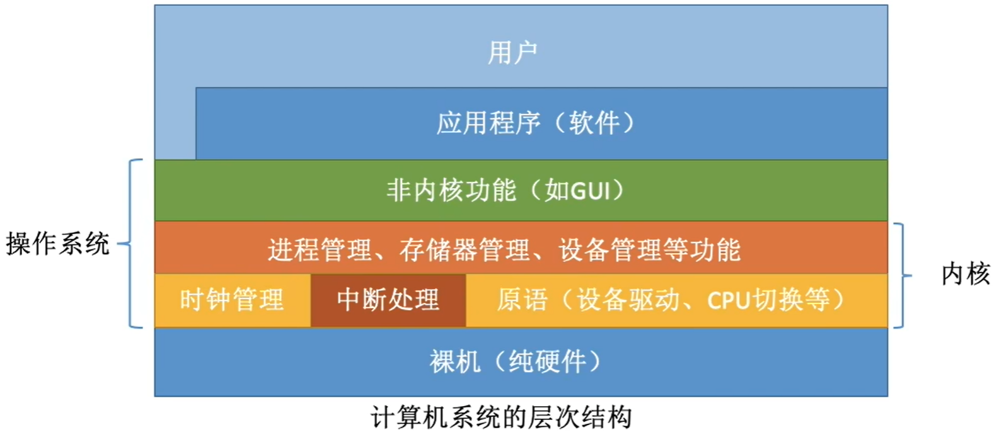

操作系统是最基本的系统软件，是计算机系统各类软硬件资源的管理者；它位于用户层和硬件层之间，**向上提供服务、向下管理资源**。

# 内核

## 什么是内核？

内核就是**应用程序连接硬件设备的桥梁**，应用程序只需关心与内核交互，不用关心硬件的细节

进程间的切换无法直接通过硬件实现，因此还需要一层系统软件来对处理器和硬件资源进行抽象改造，这一层系统软件即为操作系统内核，内核是一组运行在内核态的程序模块。

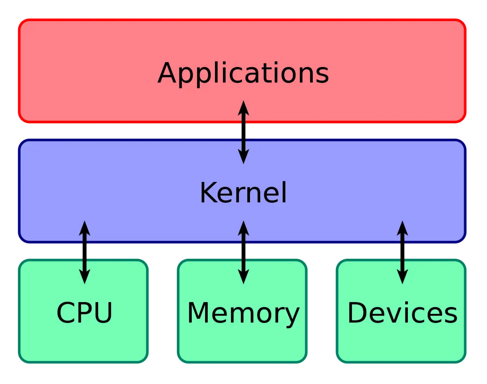

## 内核架构

对于内核的架构一般有这三种类型：

- 宏内核，包含多个模块，整个内核像一个完整的程序；
- 微内核，有一个最小版本的内核，一些模块和服务则由用户态管理；
- 混合内核，是宏内核和微内核的结合体，内核中抽象出了微内核的概念，也就是内核中会有一个小型的内核，其他模块就在这个基础上搭建，整个内核是个完整的程序；

Linux 的内核设计是采用了宏内核，Window 的内核设计则是采用了混合内核。

**大内核（宏内核、单内核）**：将操作系统的所有功能模块作为系统内核，运行在内核态

- 性能高，内核内部各种功能都可以直接相互调用；内核代码庞大、结构混乱、难以维护
- 典型大内核：Linux、UNIX

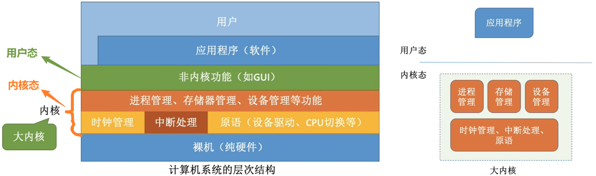

**微内核：**只把最基本的功能保留在内核（时钟管理、中断处理、原语）

- 缺点：需要频繁在内核态和用户态之间切换、性能低

- 典型微内核：Windows NT

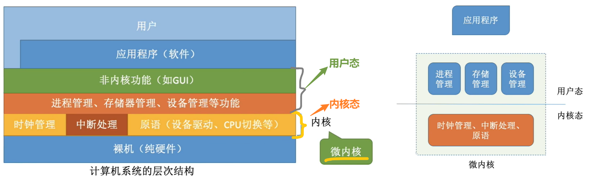

## 内核程序和用户程序 ✅

**内核程序**

- 负责开发操作系统的程序员写的程序

- 很多内核程序组成了 “操作系统内核”，简称“ 内核（Kernel）”

- 内核是操作系统最重要最核心的部分，整个系统的管理者，也是最接近硬件的部分

- 操作系统的功能未必都在内核中

- 包含特权指令，特权指令只允许内核使用

**应用程序**

- 跑在操作系统之上的，普通程序员写的程序（微信、qq等）

- 只能使用非特权指令

## 内核空间和用户空间 ✅

内核具有很高的权限，可以控制 cpu、内存、硬盘等硬件，而应用程序具有的权限很小，因此大多数操作系统把内存分成了两个区域：

- 内核空间
  - 只有内核程序可以访问；
  - 内核空间的代码可以访问所有内存空间
- 用户空间
  - 专门给应用程序使用；
  - 用户空间的代码只能访问一个局部的内存空间，也就是用户空间

当程序使用用户空间时，我们常说该程序在**用户态**执行，而当程序使内核空间时，程序则在**内核态**执行。

## 内核态和用户态 ✅

用户态和内核态是操作系统中的两种运行模式或特权级别：

- **内核态（核心态）（管态）**：正在运行的是**内核程序**，可以执行**特权指令**
  - 具有最高权限，可以执行特权指令，直接访问硬件设备，可以访问内存的所有数据，包括外围设备
  - CPU也可以将自己从一个程序切换到另一个程序
  - 内核态不直接运行用户程序（即便内核态可以访问用户空间），而是通过系统调用机制安全地与用户空间交互
- **用户态 （目态）**：正在运行的是**应用程序**，只能执行**非特权指令**
  - 在用户空间，执行应用程序自己的代码
  - 权限低，不能直接访问底层系统资源和执行特权操作；只能受限地访问内存，不允许访问外围设备
  - 需要通过系统调用，请求内核态的服务

> **内核态，拥有更高的特权级别，因此能够执行更底层的操作**
>
> 不过，由于**进入内核态需要付出较高的开销**（需要进行一系列的上下文切换和权限检查），应该**尽量减少进入内核态的次数**，以提高系统的性能和稳定性。

**如何区分处于何种状态？**—— **程序状态字寄存器 PSW**，其中有个二进制位

- 1 -- 内核态

- 0 -- 用户态  

### 内核态和用户态的切换？✅

- 内核态 → 用户态：

  - 执行特权指令，修改 PSW 标志位为用户态

  - 意味着操作系统主动让出CPU使用权

- 用户态 → 内核态：

  - 由 “中断” 引发，硬件自动完成变态过程

  - 停止正在执行的应用程序，开始执行处理这个中断信号相关的内核程序

  - 触发中断信号意味着操作系统将强行夺回CPU的使用权

### 什么是系统调用？✅

应用程序可以通过系统调用来**请求获得内核的服务**

系统调用是OS提供给应用程序（程序员/编程人员）使用的接口，可以理解为**应用程序调用的特殊函数**

凡是与**共享资源**有关的操作，都必须通过系统调用的方式向内核提出服务请求

### 系统调用过程

应用程序如果**需要进入内核空间**，就需要通过系统调用，下面来看看系统调用的过程：

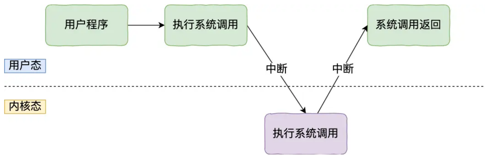

- 当应用程序使用系统调用时，会产生一个中断。
- 发生中断后， CPU 会中断当前在执行的用户程序，转而跳转到中断处理程序，也就是开始执行内核程序。
- 内核处理完后，主动触发中断，把 CPU 执行权限交回给用户程序，回到用户态继续工作。

> 发出系统调用请求在用户态，对系统调用的相应处理在内核态

这种设计确保了系统的安全性与稳定性，同时实现了用户程序与内核的隔离。

## 中断 ✅

中断是操作系统内核夺回CPU使用权的唯一途径，使CPU从用户态变为内核态

**分类：**

- **内中断（异常）**

  - 与当前执行的指令有关，中断信号来源于CPU内部

  - 当前执行的指令是非法的，会引发一个中断信号

  - 陷阱、陷入 trap 、故障 fault、终止 abort 

- **外中断（狭义的中断）**

  - 与当前执行的指令无关，中断信号来源于CPU外部

  - CPU在每一个指令执行结束的时候，都会例行检查是否有外部中断信号

  - 时钟中断、IO终端

**中断机制的基本原理**

- 检查中断信号

  - 内中断：CPU在执行指令时会检查是否有异常发生

  - 外中断：每个指令周期末尾，CPU会检查是否有外中断信号需要处理

- 找到相应的中断处理程序：当CPU检测到中断信号后，会根据中断信号的类型去查询“中断向量表”，来找到相应的中断处理程序在内存中的存放位置

- 中断处理程序一定是内核程序，需要运行在内核态

# 线程进程

## 进程、线程、协程 ✅

**进程：**

- 进程是程序**资源分配**的最小单位

- 进程就是运行起来的可执行程序，是程序的一次执行过程，同一个程序多次执行会对应多个进程

- 每个进程都有自己的独立内存空间和系统资源

**线程：**

- 线程是**资源调度**的最小单位，程序执行的基本单位
- 线程是进程中的一个执行单元，可以理解为 “轻量级进程”
- 一个进程可以包含多个线程，每个进程中都有唯一的主线程，所有线程共享进程的资源，如内存空间和文件描述符等
- 线程之间可以并发运行，共享相同的地址空间。

**协程：**

- 协程是一种用户态的轻量级线程，协程的调度完全由用户控制

- 协程能保留上一次调用时的状态，每次过程重入时，就相当于进入上一次调用的状态

## 进程、线程的区别 ✅

主要区别在于进程相互隔离，线程共享

- 进程有自己独立的地址空间，每启动一个进程，系统就会为它分配地址空间，一个进程无法直接访问另一个进程的变量和数据结构，需要通过进程间通信机制（如管道、信号、套接字等）来实现

- 而同一进程下的所有线程共享同一地址空间和系统资源

其他：

- 进程创建销毁和切换的开销较大，线程的开销较小，启动快
- 进程之间相互隔离
  - 线程之间相互共享同属进程的内存空间，通信更加方便
  - 进程不会影响其他进程的稳定性，但线程之间共享内存，会影响其他线程

## 线程、协程的主要区别 ✅

- 协程的调度由用户自己控制

- 而线程的调度由操作系统内核负责

## 进程的状态转换 ✅

**进程的状态：创建，就绪，运行，阻塞，终止**

- 运行态 —> 阻塞态，是进程的主动行为
- 阻塞态 —> 运行态，是被动行为
- 不能由就绪态直接转换为阻塞态，必须在进程运行时，进程才能主动请求进入阻塞态

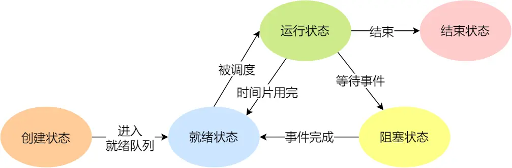

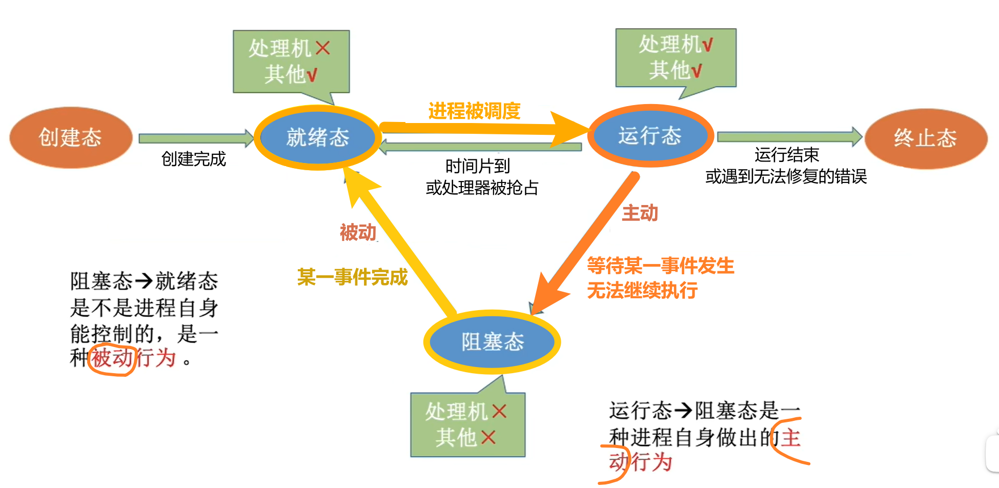

**活动期间：**

- 运行状态 Running
  - 该时刻进程占用CPU
- 就绪状态 Ready
  - 可运行，由于其他程序处于运行状态，而暂时停止运行

- 阻塞状态 
  - 该进程正在等待某一事件发生（比如等待输入输出的完成），而暂时停止运行
  - 这时即使给它CPU的控制权，也无法运行

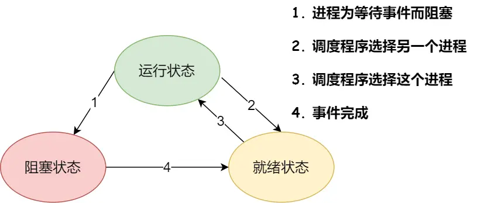

**加上 “ 挂起 ”：**

暂时调到外存等待的进程状态为挂起状态 suspend，分为就绪挂起，阻塞挂起

挂起和阻塞的区别

- 挂起，是将进程映像调到外存

- 阻塞，是进程映像还在内存

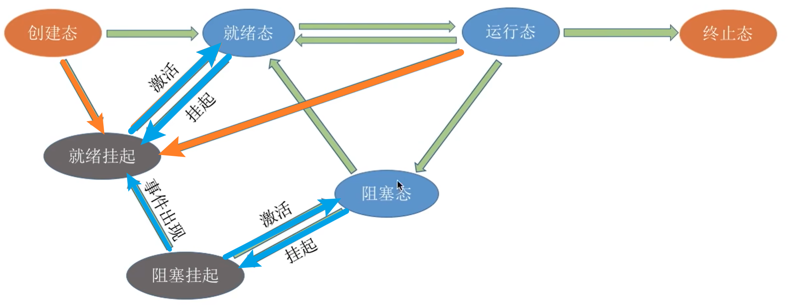

## 进程间通信方式？

**进程间通信 IPC：（Intern-Process Communication）**

进程之间通信必须通过内核

- 每个进程的用户地址空间都是独立的，一般而言不可相互访问

- 但内核空间是每个进程都共享的，所以进程间通信必须通过内核

  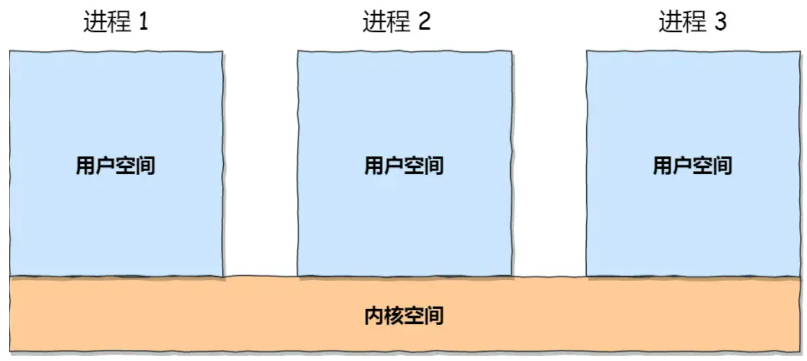

**方式**：

- **共享内存**
  - 设置一个共享内存区域，映射到进程的虚拟地址空间
  - 互斥的访问共享空间（通信进程自己负责实现互斥）
- **消息队列**
- **管道通信**
- **信号量**
- **Socket**
  - 跨网络和不同的主机上的进程之间通信

## 线程间通信方式？

临界区

互斥量

信号量

条件变量

读写锁

## 进程调度算法？

先来先服务 FCFS

短作业优先 SJF

最短剩余时间优先 SRTN

时间片流转

优先级调度

多级反馈队列

## 线程同步方法

互斥两

读写锁

条件变量

信号量

## 进程同步方法

信号量

管程

消息传递

## Linux信号是？

是Linux进程通信的一种方式，用于通知接收进程，某个事件已经发生，比如按下Ctrl + C就是信号。

## 信号量的处理

信号量是Linux进程通信的一种方式。

信号量是一个计数器，可以用来控制多个仅对共享资源的访问。

常作为一种锁机制，实现进程、线程对临界区的同步及互斥访问

## 消息队列的原理，工作过程

## Socket只能用于不同主机间通信吗？

## Gil锁  Global Interpreter Lock

是一种在解释器中使用的机制，作用是在任何时刻限制解释器在一个进程中只能执行一个线程。

作用：

- 线程安全

  - GIL确保了在任何给定时间点，只有一个线程可以执行Python字节码。

  - 这简化了解释器的实现，因为开发者不需要担心多个线程同时操作Python对象时的线程安全问题。

- 简化内存管理
  - 特别是对于垃圾收集和引用计数，GIL减少了并发执行时复杂的同步和锁定需求。

局限：多核利用不足，性能问题

应对策略：使用多进程

## 多线程库有哪些？

POSIX Threads（Pthreads）

C++ 11 （及以上版本）标准线程库

OpenMP（Open Multi-Processing）

Intel Threading Building Blocks（TBB）

Boost.Thread

# 并行和并发的区别 ✅

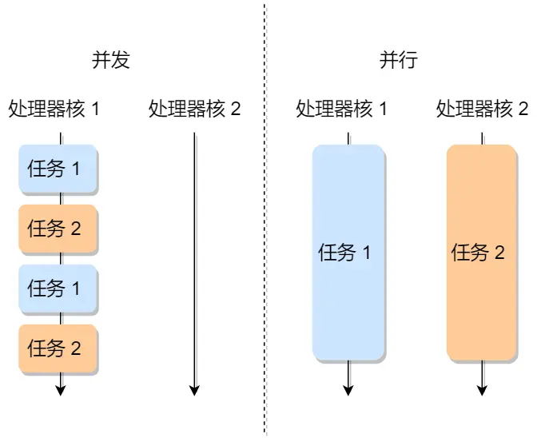

> 并发：多个事件在**同一时间间隔**内发生
>
> 并行：多个事件在**同一时刻**同时发生

**并发**：

- 多个事件在同一时间间隔内发生，宏观上同时，微观上交替

- 对于一个单核处理器，计算机能在同一时间段内执行多个任务，主要是通过分配时间片的方式

  > 让一个任务执行一段时间，然后切换到另一个任务，再运行一段时间，不同任务会这样交替往复地一直执行下去，这个过程也称为进程或线程的上下文切换

- 并发通常与任务之间的交替执行和任务调度有关

  

**并行**：

- 同一时刻执行多个任务
- 对于CPU来说，指的是在CPU的多个核心上同时执行不同的任务，而不用通过分配时间片的方式进行运行。
- 在并行系统中，多个处理单元可以同时处理独立的子任务，从而加速整体任务的完成。

# 上下文切换

# Linux内核

# 操作系统装在进程时发生了什么？

# SSL握手过程

# 锁

## 几种典型的锁

互斥

- 在抢锁失败的情况下主动放弃CPU，进入睡眠状态直到锁的状态改变时再唤醒
- 而操作系统负责线程调度，为了实现锁的状态发生改变时唤醒阻塞的线程或者进程，需要把锁交给操作系统管理，所以互斥锁在加锁操作时涉及上下文的切换

读写

- 多个读者可以同时进行读
- 写者必须互斥（只允许一个写者写，也不能读者写者同时进行）
- 写者优先于读者（一旦有写者，则后续读者必须等待，唤醒时优先考虑写者）

条件变量

- 条件变量通过允许线程阻塞和等待另一个线程发送信号的方法弥补了互斥锁的不足，他常和互斥锁一起使用，以免出现竞态条件

自旋

- 如果进线程无法取得锁，进线程不会立刻放弃CPU时间片，而是一直循环尝试获取锁，直到获取为止。
- 如果别的线程长时期占有锁，那么自旋就是在浪费CPU做无用功，但是自旋锁一般应用于加锁时间很短的场景，这个时候效率比较高

## 乐观锁 悲观锁

## 死锁？怎么判断？死锁的条件？

- 死锁

  - 是指两个或多个事务在同一资源上相互占用，并请求锁定对方的资源，从而导致恶性循环的现象。

  - 当多个进程因竞争资源而造成的一种僵局（互相等待），若无外力作用，这些进程都将无法向前推进，这种情况就是死锁。

- 死锁产生的四个必要条件：

  - 互斥条件：一个资源每次只能被一个进程使用。

  - 请求与保持条件：一个进程因请求资源而阻塞时，对已获得的资源保持不放。

  - 不剥夺条件：进程已获得的资源，在末使用完之前，不能强行剥夺。

  - 循环等待条件：存在一个进程资源的循环等待链，链中每一个进程已获得的资源同时被链中下一个进程所请求。

- 解决死锁的方法主要有以下几种：

  - 按照顺序加锁：尝试让所有线程按照同一顺序获取锁，从而避免死锁。

  - 设置获取锁的超时时间：尝试获取锁的线程在规定时间内没有获取到锁，就放弃获取锁，避免因为长时间等待锁而引起的死锁。

  - 银行家算法：在程序运行时避免发生死锁。

  - 检测死锁并恢复：死锁发生时对其进行检测，一旦发生死锁后，采取行动解决问题。

  - 通过仔细分配资源来避免死锁。

  - 通过破坏死锁产生的四个条件之一来避免死锁。

# 内存

## 操作系统内存管理

## 操作系统虚拟内存

## 段页式内存管理流程

# CPU缓存？几级？存多大？怎么换？

- 一级缓存（L1 Cache）：

  - 速度最快，但容量最小，通常每个核心有自己的L1缓存。

  - 分为数据缓存（L1d）和指令缓存（L1i）。

  - 容量范围：大约几十KB。

- 二级缓存（L2 Cache）：

  - 比L1慢，但比L2快，容量比L1大。

  - 通常每个核心有自己的L2缓存，但也可能在某些设计中为多个核心共享。

  - 容量范围：几百KB到几MB。

- 三级缓存（L3 Cache）：

  - 速度比L1和L2慢，但容量更大。

  - 通常为所有核心共享。

  - 容量范围：几MB到几十MB，甚至更大。

# 硬件

## 计算机结构

**冯诺依曼模型**：**运算器、控制器、存储器、输入设备、输出设备**

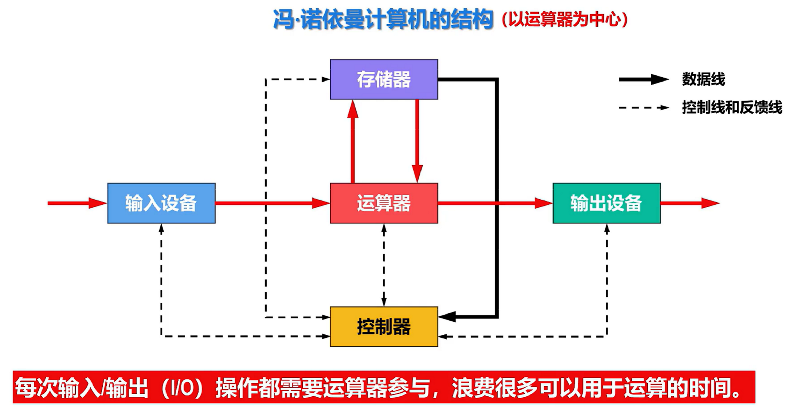

**现代计算机结构**

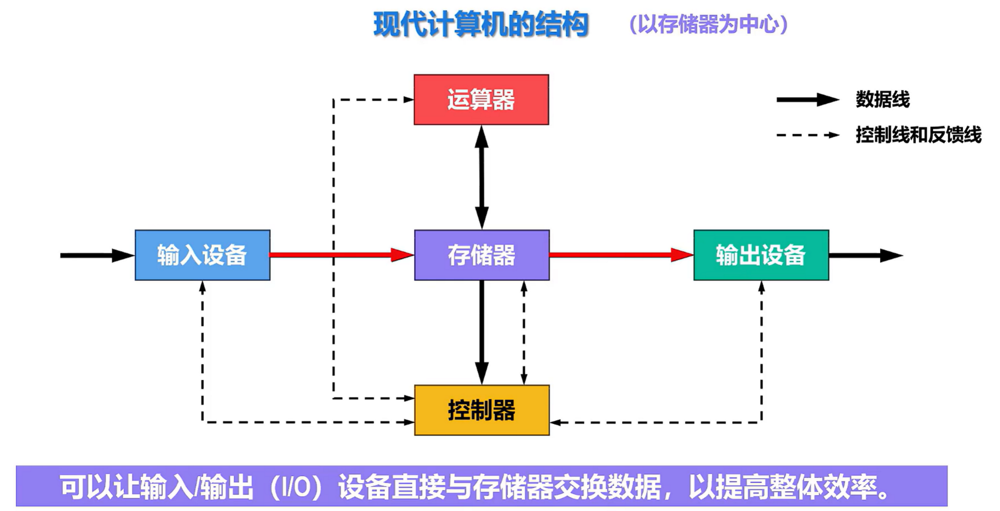

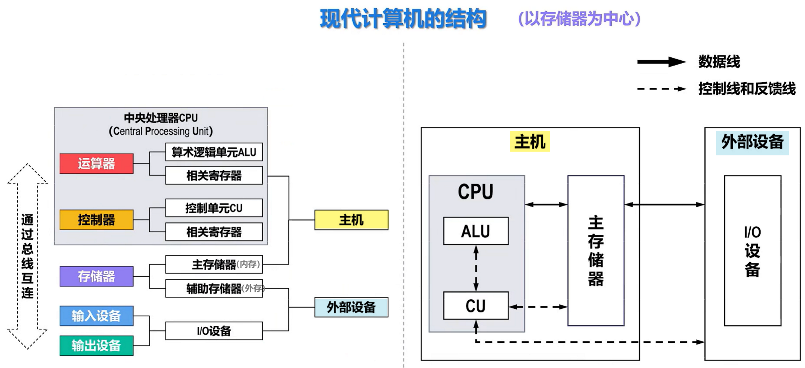

## 常见寄存器种类

CPU 中的寄存器主要作用是存储计算时的数据

- **通用寄存器**，用来存放需要进行运算的数据，比如需要进行加和运算的两个数据。
- **程序计数器**，用来存储 CPU 要执行下一条指令「所在的内存地址」，注意不是存储了下一条要执行的指令，此时指令还在内存中，程序计数器只是存储了下一条指令「的地址」。
- **指令寄存器**，用来存放当前正在执行的指令，也就是指令本身，指令被执行完成之前，指令都存储在这里。

## 总线类型

总线是用于 CPU 和内存以及其他设备之间的通信，总线可分为 3 种：

- **地址总线**，用于指定 CPU 将要操作的内存地址；
- **数据总线**，用于读写内存的数据；
- **控制总线**，用于发送和接收信号，比如中断、设备复位等信号，CPU 收到信号后自然进行响应，这时也需要控制总线；

当 CPU 要读写内存数据的时候，一般需要通过下面这三个总线：

- 首先要通过「地址总线」来指定内存的地址；
- 然后通过「控制总线」控制是读或写命令；
- 最后通过「数据总线」来传输数据
