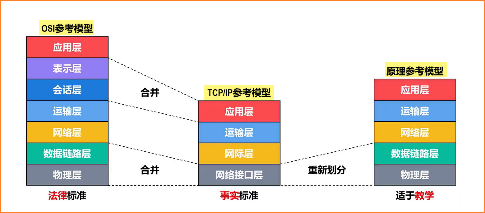
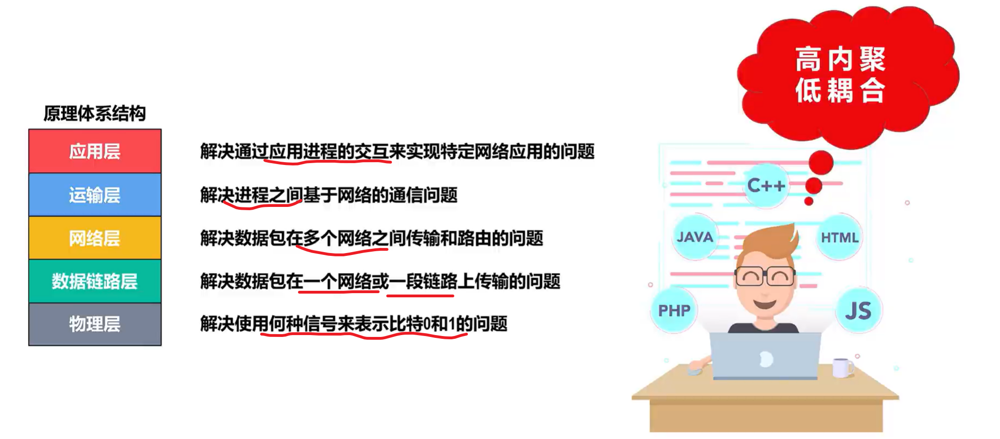

> [小林coding](https://xiaolincoding.com/network/1_base/tcp_ip_model.html)
>
> [卡码笔记八股文](https://notes.kamacoder.com/bagu/2JZIxQW22hU)
>
> [B站 湖科大教书匠《深入浅出计算机网络》](https://www.bilibili.com/video/BV1NT411g7n6/?spm_id_from=333.788.videopod.episodes&vd_source=7369d5f08520f2fc3601caee93963ffa&p=2)

# 网络基础

## TCP/IP 模型和 OSI 模型分别是什么？

### OSI 的七层结构

| **层次**       | **功能**                                                     | **常见协议/技术**            |
| -------------- | ------------------------------------------------------------ | ---------------------------- |
| **应用层**     | 提供用户和网络之间的接口，支持各种网络服务。                 | HTTP、FTP、SMTP、DNS、Telnet |
| **表示层**     | 负责数据的格式化、加密和解密，确保发送方和接收方能正确理解数据。 | TLS/SSL、JPEG、MPEG、ASCII   |
| **会话层**     | 负责建立、管理和终止会话，支持多用户之间的连接。             | TLS/SSL、NetBIOS             |
| **传输层**     | 负责端到端的传输，确保数据的可靠性、完整性和顺序。           | TCP、UDP、SCTP               |
| **网络层**     | 负责逻辑地址（IP 地址）的分配，提供路由选择功能，支持跨网段通信。 | IP（IPv4、IPv6）、ICMP、ARP  |
| **数据链路层** | 负责数据帧的传输和错误检测，管理物理地址（MAC 地址）。       | Ethernet、PPP、HDLC          |
| **物理层**     | 负责硬件信号的传输，包括电缆、光纤、无线信号等。             | Ethernet、Wi-Fi、Bluetooth   |

> 例如osi模型，用电脑软件给朋友发送一条信息；
>
> - 首先**应用层**为聊天界面
> - **表示层**翻译为网络可以识别的格式
> - 建立**会话和传输**，在传输的过程中有tcp和udp两种，tcp完整有序，udp不会保证这个
> - **网络层**在这层会根据**ip**找到对方路由器
> - **数据链路层**会根据mac地址找到具体的电脑，最后再物理层进行光纤信息的传输。对方想要读取的话就反过来进行剥离。
> -  **会话层的工作依赖于传输层和网络层的支持**，而这些底层功能在实际操作中先于会话层发生。

### TCP/IP 的四层结构

TCP/IP 模型是互联网的实际标准，其 **四层结构** 和 OSI 模型的关系如下：

| **TCP/IP层** |       **OSI层**        |                      **功能**                      |
| :----------: | :--------------------: | :------------------------------------------------: |
|  **应用层**  | 应用层、表示层、会话层 | 提供**用户应用接口**，支持数据的表示、加密和解密。 |
|  **传输层**  |         传输层         |      提供**端到端**的可靠或快速数据传输服务。      |
|  **网络层**  |         网络层         |   提供**逻辑地址**的分配和**跨网段的数据传输**。   |
|  **链路层**  |   数据链路层、物理层   |    管理数据帧传输，处理**硬件信号**的物理传输。    |

## 什么是网络协议？各层协议

网络协议是一组规则和标准，用于确定计算机之间如何进行通信。它定义了数据的格式、传输方式和错误处理等方面。

它确保不同设备和系统之间可以互相理解并正确交换数据，是实现网络通信的基础。没有协议，设备之间无法有效地交换信息。

**网络各层协议**

- 物理层：Ethernet、RJ45、V.35、EIA/TIA-232
  - 底层数据传输，如网线；网卡标准。
- 数据链路层：Ethernet、PPP、STP、IEEE 802.1Q（VLAN）
  - 定义数据的基本格式，如何传输，如何标识；如网卡MAC地址。
- 网络层：IP（IPv4、IPv6）、ICMP、ARP、RARP、OSPF、BGP
  - 定义IP编址，定义路由功能；如不同设备的数据转发。
- 传输层：TCP、UDP、SCTP
  - 端到端传输数据的基本功能；如 TCP、UDP。
- 会话层：NetBIOS、SMB、RPC
  - 控制应用程序之间会话能力；如不同软件数据分发给不同软件。
- 表示层：ASCII、EBCDIC、JPEG、MPEG、TLS
  - 数据格式标识，基本压缩加密功能。
- 应用层：HTTP、HTTPS、FTP、DNS、SMTP、POP3、IMAP、Telnet、SSH
  - 各种应用软件，包括 Web 应用。

# 传输协议 TCP、UDP

## TCP 和 UDP 的区别是什么？⭐⭐⭐

- 连接性：

  - TCP是面向连接，数据传输前需要与对方建立连接。

  - UDP是无连接，发送数据前不需要建立连接。

- 可靠性：

  - TCP提供可靠的数据传输，能保证数据无差错、不丢失、不重复、且按序到达。

  - UDP尽最大努力交付，不保证可靠交付。

- 传输方式：

  - TCP是面向字节流的，数据传输时没有明显的边界。

  - UDP是面向报文的，每个UDP包都是独立的，具有明显的边界。

- 服务对象：

  - TCP是一对一的服务

  - UDP支持一对一、一对多、多对一、多对多的交互通信。

- 首部开销：

  - TCP的首部长度较长，至少20字节

  - UDP的首部固定为8字节。

- 拥塞控制：

  - TCP有拥塞控制机制，可以防止数据传输过快导致网络拥塞

  - UDP没有拥塞控制，即使网络非常拥堵，也不会影响UDP的发送速率。

  

### 简要回答

TCP 和 UDP的概念：

- **TCP**（传输控制协议）：**面向连接**的**可靠**传输协议，保证数据完整有序到达。
- **UDP**（用户数据报协议）：**无连接**的**不可靠**传输协议，注重传输速度和简单性。

TCP 和 UDP的区别：

- 如下表所示：

## TCP 如何确保可靠传输⭐⭐⭐

## 常见的TCP连接状态

- CLOSED：初始状态，表示没有任何连接状态。
- LISTEN：服务器处于监听状态，可以接受客户端的连接。
- SYN-SENT：客户端发送连接请求后等待匹配的连接请求。
- SYN-RECEIVED：服务器在收到和发送一个连接请求后等待对方对连接请求的确认。
- ESTABLISHED：代表一个打开的连接，数据可以传送给用户。
- FIN-WAIT-1：等待远程TCP连接中断请求，或先前的连接中断请求的确认。
- FIN-WAIT-2：从远程TCP等待连接中断请求。
- CLOSE-WAIT：等待从本地用户发来的连接中断请求。
- CLOSING：等待远程TCP对连接中断的确认。
- LAST-ACK：等待原来发向远程TCP的连接中断请求的确认。
- TIME-WAIT：等待足够的时间以确保远程TCP接收到连接中断请求的确认。

## TCP三次握手和四次挥手⭐⭐⭐

### 三次握手（建立一个TCP连接）

- 第一次握手：客户端发送一个SYN包（seq=x）到服务器，并进入SYN_SEND状态，等待服务器确认。

- 第二次握手：服务器收到SYN包后，返回一个SYN+ACK包，其中SYN和ACK标志位都被设置为，表示确认客户端的SYN有效并同意建立新连接。同时，服务器生成一个序列号（seq=y），并将确认号（ack）设置为x+1。

- 第三次握手：客户端收到SYN+ACK包后，向服务器发送一个ACK包（ack=y+1），此时客户端和服务器都进入ESTABLISHED状态，完成三次握手，可以开始传输数据

###  四次挥手（断开一个TCP连接）

- 第一次挥手：客户端向服务器发送一个FIN包（FIN=1，seq=u），主动断开连接，报文中会指定一个序列号。此时客户端进入FIN_WAIT1状态。
- 第二次挥手：服务器收到FIN包后，向客户端发送确认包（ACK=1, ack=u+1），确认收到了客户端的断开连接请求，此时服务器进入CLOSE_WAIT状态。
- 第三次挥手：服务器向客户端发送一个FIN包（FIN=1，seq=v），请求断开连接。同时，服务器将确认号（ack）设置为u+1，此时服务器进入LAST_ACK状态。
- 第四次挥手：客户端收到FIN包后，向服务器发送一个ACK包（ACK=1，ack=v+1），确认收到了服务器的断开连接请求，此时客户端进入TIME_WAIT状态。等待一段时间后，如果没有收到服务器的再次请求，客户端进入CLOSED状态，完成四次挥手。

## 两次握手行吗？

- 为了实现可靠数据传输，TCP协议的通信双方，都必须维护一个序列号，以标识发送出去的数据包中，哪些是已经被对方收到的。三次握手的过程即是通信双方相互告知序列号起始值，并确认对方已经收到了序列号起始值的必经步骤。

- 防止历史连接的初始化：三次握手可以防止旧的重复连接初始化造成混乱。例如，如果客户端的SYN请求连接在网络中阻塞，客户端没有接收到ACK报文，就会重新发送SYN。由于没有第三次握手，服务器不清楚客户端是否收到了自己发送的建立连接的ACK确认信号，所以每收到一个SYN就只能先主动建立一个连接。这可能会导致服务器建立多个冗余的无效链接，造成不必要的资源开销。

- 同步双方初始序列号：TCP协议的通信双方，都必须维护一个序列号，以标识发送出去的数据包中，哪些是已经被对方收到的。三次握手的过程即是通信双方相互告知序列号起始值，并确认对方已经收到了序列号起始值的必经步骤。如果只是两次握手，至多只有连接发起方的起始序列号能被确认，另一方选择的序列号则得不到确认。

- 避免资源浪费：如果只有两次握手，当客户端的SYN请求连接在网络中阻塞，客户端没有接收到ACK报文，就会重新发送SYN。由于没有第三次握手，服务器不清楚客户端是否收到了自己发送的建立连接的ACK确认信号，所以每收到一个SYN就只能先主动建立一个连接。这可能会导致服务器建立多个冗余的无效链接，造成不必要的资源开销。

## 三次握手期间可以传输数据吗

**在TCP三次握手过程中，第三次握手是可以携带数据的**

在第三次握手时，客户端已经处于ESTABLISHED状态，已经确认了服务器的接收、发送能力是正常的，所以可以携带数据

# 应用层协议 HTTP

## HTTP

### HTTP 请求过程

- DNS解析：浏览器首先会进行DNS解析，获取服务器的IP地址。
- TCP三次握手：浏览器与服务器建立TCP连接，进行三次握手。三次握手的目的是同步连接双方的序列号和确认号并交换TCP窗口大小信息。
- 发起HTTP请求：建立TCP连接后，浏览器会向服务器发起HTTP请求。一个HTTP请求报文由请求行（request line）、请求头部（header）、空行和请求数据4个部分组成。
- 服务器响应HTTP请求：服务器接收到HTTP请求后，会返回一个响应，该响应包含状态行、响应头部、空行以及响应数据。
- 浏览器解析HTML代码：浏览器接收到服务器返回的HTML代码后，开始解析代码，并请求HTML代码中的资源（如js、css、图片等）。
- 浏览器进行页面渲染：浏览器解析完HTML代码和相关资源后，会对页面进行渲染，呈现给用户。
- 服务器关闭TCP连接：最后，服务器会关闭TCP连接。

### HTTP请求方式，队头阻塞

- GET    请求指定的页面信息，并返回实体主体。
-  HEAD    类似于 GET 请求，只不过返回的响应中没有具体的内容，用于获取报头
- POST    向指定资源提交数据进行处理请求（例如提交表单或者上传文件）。数据被包含在请求体中。POST 请求可能会导致新的资源的建立和/或已有资源的修改。
- PUT    从客户端向服务器传送的数据取代指定的文档的内容。
- DELETE    请求服务器删除指定的页面。
- CONNECT    HTTP/1.1 协议中预留给能够将连接改为管道方式的代理服务器。
- OPTIONS    允许客户端查看服务器的性能。
- TRACE    回显服务器收到的请求，主要用于测试或诊断。
- PATCH    是对 PUT 方法的补充，用来对已知资源进行局部更新 。

### HTTP缓存，请求头

- HTTP 缓存会存储与请求关联的响应，并将存储的响应复用于后续请求。
- 私有缓存
  - 私有缓存是绑定到特定客户端的缓存——通常是浏览器缓存。由于存储的响应不与其他客户端共享，因此私有缓存可以存储该用户的个性化响应。
- 共享缓存
  - 共享缓存位于客户端和服务器之间，可以存储能在用户之间共享的响应。共享缓存可以进一步细分为代理缓存和托管缓存。

### HTTPS是什么实现的

- HTTP 先和 SSL（Secure Sockets Layer）通信，

- 再由 SSL 和 TCP 通信，也就是说 HTTPS 使用了隧道进行通信

### HTTPS协议加密流程

HTTPS 采用混合的加密机制

- 使用非对称密钥加密用于传输对称密钥来保证传输过程的安全性，

- 之后使用对称密钥加密进行通信来保证通信过程的效率。

### HTTP和HTTPS的区别⭐⭐⭐⭐⭐⭐

- 协议安全性：HTTPS更安全

  - HTTP是超文本传输协议，信息是明文传输，存在安全风险。

  - HTTPS则是具有安全性的SSL/TLS加密传输协议，信息传输过程是加密的，提供了对网站服务器的身份认证，保护交换数据的隐私与完整性。

- 证书：
  - HTTPS协议需要到CA（Certificate Authority，数字证书认证机构）申请证书，一般免费证书较少，因而需要一定费用。

- 连接方式和端口：

  - HTTP是80

  - HTTPS是443。

- 性能：
  - 由于HTTPS需要进行加密和解密操作，因此会消耗更多的CPU和内存资源，相比HTTP，HTTPS的连接速度会稍慢一些。

### HTTPS安全在哪里？好在哪里？⭐⭐⭐

- SSL/TLS协议：HTTPS是在HTTP上建立SSL加密层，并对传输数据进行加密，是HTTP协议的安全版。SSL（Secure Sockets Layer）译为「安全套接字协议」，TLS（Transport Layer Security）译为「传输层安全性协议」。SSL/TLS协议处于「传输层」和「应用层」之间，主要作用是对网络连接进行加解密。

- 对称加密：HTTPS使用对称加密算法提供高效的数据加密传输。对称加密即使用同一个密钥对数据进行加密解密，算法速度快，常用来加密大量内容。

- 非对称加密：非对称加密即：解密和加密用不同的密钥。使用非对称加密时用户拥有两个密钥：公开密钥（publickey:简称公钥）和私有密钥（privatekey:简称私钥）。公钥与私钥是一对，如果用公钥对数据进行加密，只有用对应的私钥才能解密。

- 数字证书与认证中心：HTTPS使用数字证书和认证中心来保证公钥的传输安全。一个证书上包含一些公开的明文信息以及证书颁发者对该信息的签名（私钥加密）。任何人想验证证书信息的真伪，只需要证书颁发者的公钥对签名进行解密，在和证书上的明文信息做对比即可。

- 消息认证码：消息认证码是带密钥的散列函数，它具备以下特点：大量信息经过处理变成短小固定长度值；消息不同或者密钥不同会导致结果不同；无法从结果“解密”解密出原始信息。

# 网络层 ARP、IP

## ARP协议

- 当一个网络设备（如计算机）需要与同一局域网内的另一个设备通信时，它首先检查自己的ARP缓存，这是一个表，里面包含了IP地址到MAC地址的映射。如果所需的映射存在于ARP缓存中，则直接使用这个映射进行通信。如果没有找到，设备将使用ARP来发现目标设备的物理地址：

- ARP请求： 发送设备广播一个ARP请求包到网络上，请求包含了目标设备的IP地址和发送设备自己的IP和MAC地址。

- ARP响应： 网络上的所有设备都会收到这个请求，但只有IP地址与请求中的目标IP地址匹配的设备会回应。该设备会发送一个ARP响应，其中包含其IP地址和相应的MAC地址。

- 更新ARP缓存： 发送设备接收到响应后，会更新其ARP缓存，添加新的IP到MAC的映射，然后使用这个映射通过物理网络发送数据。

## IP协议和应用场景

- IP 则负责在「没有直连」的两个网络之间进行通信传输

# 加解密

## 讲讲对称加密？

- 对称加密：加密解密使用同一密钥

  - 优点：运算速度快

  - 缺点：无法安全的将密钥传输给通信方

- 非对称加密：又称公开密钥加密（Public-Key Encryption），加密和解密使用不同的密钥

  - 优点：可以更安全地将公开密钥传输给通信发送方；

  - 缺点：运算速度慢。

# Socket只能用于不同主机间通信吗？

# end
