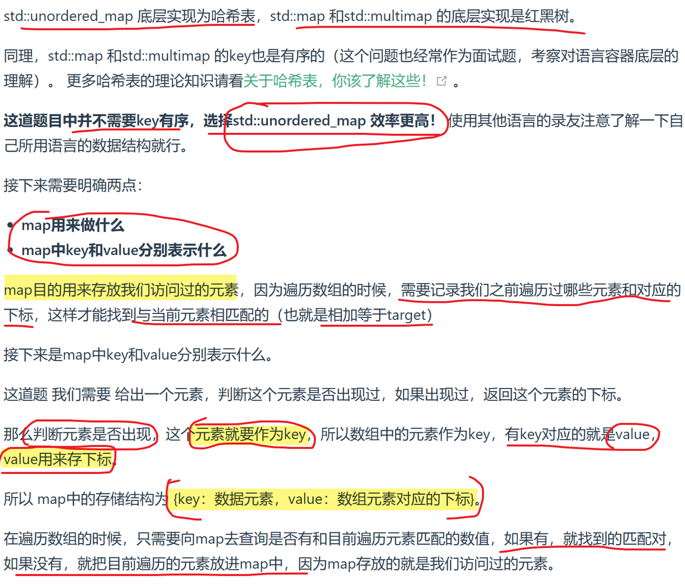

> 力扣刷题总结，主要参考[代码随想录](https://programmercarl.com/)和力扣题解区各位大神的题解以及gpt，总结力扣核心代码模式和acm两种模式。

# 力扣hot100

## 哈希

### [1 两数之和](https://leetcode.cn/problems/two-sum/description/?envType=study-plan-v2&envId=top-100-liked)

@哈希 @数组

# 代码随想录分块总结

## 数组

## 链表

## 哈希

## 字符串

## 滑动窗口

## 双指针

## 栈和队列

## 二叉树

## 回溯

## 贪心

## 动态规划DP

## 单调栈

