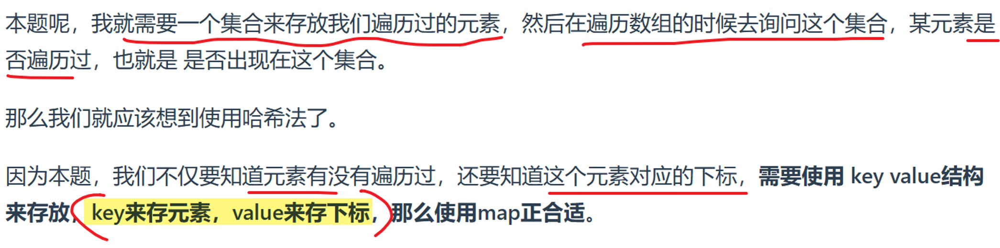

> 力扣刷题总结，主要参考[代码随想录](https://programmercarl.com/)和力扣题解区各位大神的题解以及gpt，总结力扣核心代码模式和acm两种模式。

# 力扣hot100

## 哈希

### 1 两数之和

哈希、#数组

**需要查询一个元素是否出现过，或者一个元素是否在集合里的时候，就要第一时间想到哈希法**

# 代码随想录分块总结

## 数组

## 链表

## 哈希

## 字符串

## 滑动窗口

## 双指针

## 栈和队列

## 二叉树

## 回溯

## 贪心

## 动态规划DP

## 单调栈

