> 力扣刷题总结，主要参考[代码随想录](https://programmercarl.com/)和力扣题解区各位大神的题解以及gpt，总结力扣核心代码模式和acm两种模式。

# 力扣hot100

## 哈希

> ***需要查询一个元素是否出现过，或者一个元素是否在集合里的时候，就要第一时间想到哈希法***

### [1 两数之和](https://leetcode.cn/problems/two-sum/description/?envType=study-plan-v2&envId=top-100-liked)

@哈希 @数组

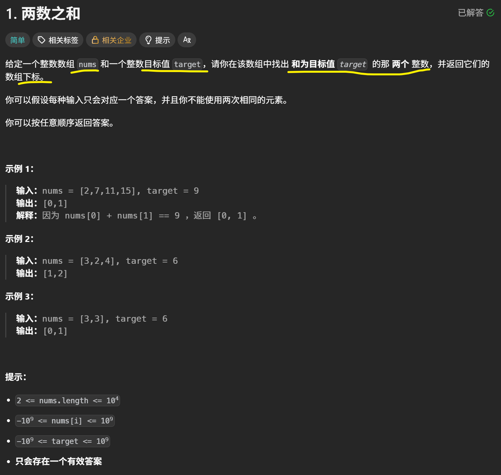

遍历数组，需要一个集合存放【遍历过的元素】，在遍历数组nums的时候，同时去这个组合中寻找，某元素【 target - 当前遍历元素 nums[i] 】是否出现过。

因为最后要找到这个元素是否出现过，还需要得到这个元素的下标，需要使用key-value结构存放：

**< key: 元素nums[i]， value：下标 i >**

判断元素是否出现过，那么元素就要作为key，通过元素找下标，下标作为value。

> std::unordered_map 底层实现为哈希表，std::map 和std::multimap 的底层实现是红黑树。
>
> std::map 和std::multimap 的key也是有序的,**这道题目中并不需要key有序，选择std::unordered_map 效率更高！** 

整体遍历数组nums，遍历过的元素存到map中，**对每一个nums[i]去判断 【target - nums[i]】是否在map中**

- 如果在，说明在前面出现了满足【和nums[i]相加为target】的元素，即找到符合条件的一对元素组合。
- 如果不在，说明前面没有出现【和nums[i]相加为target】的元素，就把nums[i]放进map，等待下面的元素

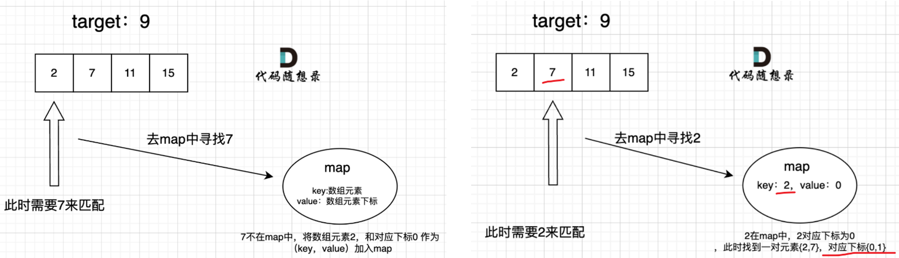

~~~C++
class Solution {
public:
    vector<int> twoSum(vector<int>& nums, int target) {
        
        // unordered_map 不重复 无序key 存放遍历过的元素
        unordered_map<int, int> umap; // < nums[i], 下标 i>

        for (int i = 0; i < nums.size(); i++)
        {
            //find 查找 target - nums[i] 在不在 umap中
            if (umap.find(target - nums[i]) != umap.end()) 
            {
                return {umap[target - nums[i]], i}; // 找到，直接返回下标数组
            }
            umap.insert(pair<int, int>(nums[i], i));// 没找到，就存到umap里
        }

        return {}; // 没符合条件的，返回空数组
        
    }
};
~~~

acm模式：

~~~C++
#include <iostream>
#include <vector>
#include <unordered_map>

using namespace std;

vector<int> twoSum(vector<int>& nums, int target)
{
	unordered_map<int, int> umap;
	for (int i = 0; i < nums.size(); i++)
	{
		if (umap.find(target - nums[i]) != umap.end())
		{
			return { umap[target - nums[i]], i };
		}
		umap.insert(pair<int, int>(nums[i], i));
	}
	
	return {};
}

int main() {
	int n, target; // 数组长度n，目标值target
	cin >> n >> target;
	vector<int> nums(n);

	for (int i = 0; i < n; i++) {
		cin >> nums[i]; // 输入数组元素
	}

	vector<int> result = twoSum(nums, target);

	if (!result.empty()) {
		cout << result[0] << " " << result[1] << endl;
	}
	else {
		cout << "No result" << endl;
	}

	return 0;

}
~~~

 示例输入：

~~~C++
4 9
2 7 11 15
~~~

示例输出：

~~~C++
0 1
~~~

### [49 字母异位词分组](https://leetcode.cn/problems/group-anagrams/description/?envType=study-plan-v2&envId=top-100-liked)

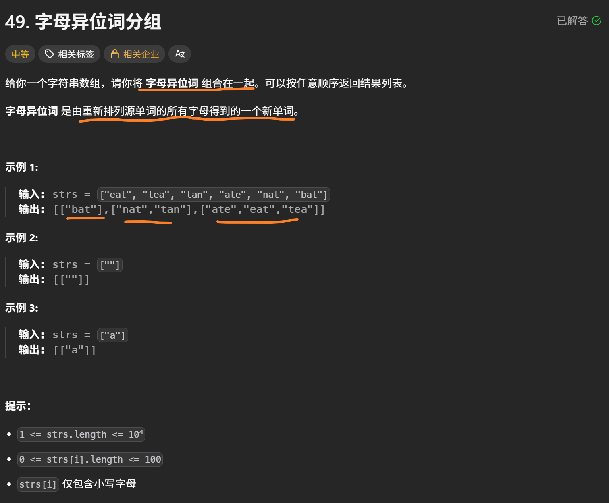

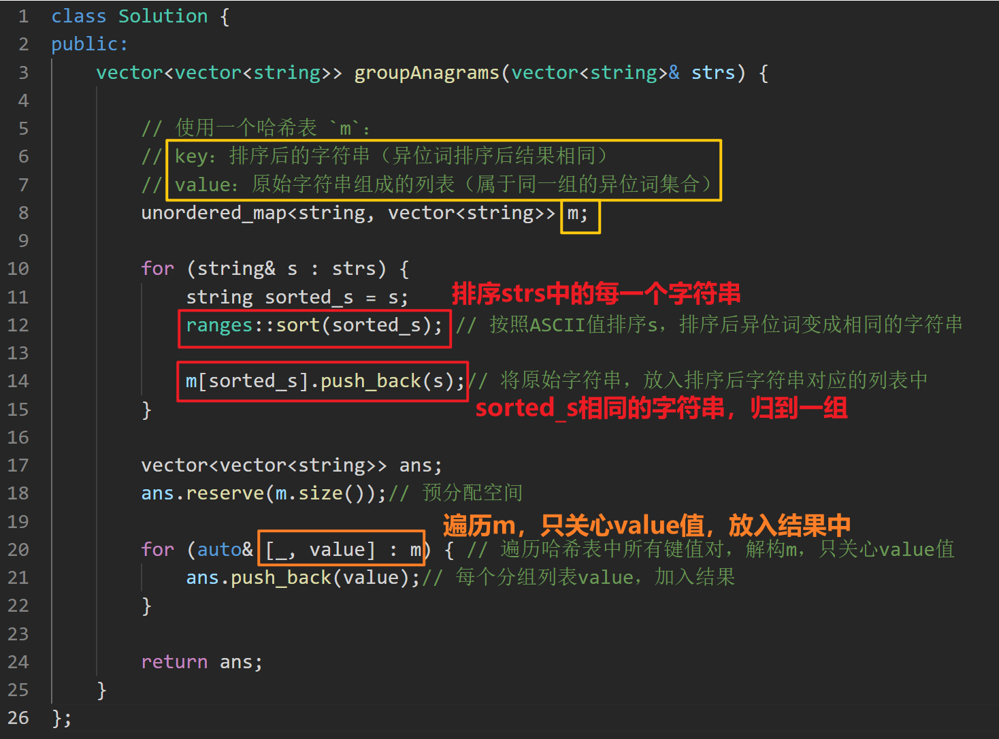

~~~C++
class Solution {
public:
    vector<vector<string>> groupAnagrams(vector<string>& strs) {

        // 哈希 
        // key: 排序后的字符串（异位词排序后结果相同）
        // value: 原始字符串组成的列表（属于同一组的异位词组合）--> 即答案

        unordered_map<string, vector<string>> umap;

        for (string& s : strs)
        {
            // 排序strs中每一个字符串
            string sorted_s = s;
            ranges::sort(sorted_s);// 按照ASCII值排序s，排序后异位词会变成相同的字符串

            // sorted_s 相同的原字符串，归到一组
            umap[sorted_s].push_back(s);
        }

        // 整理返回的字符串数组
        vector<vector<string>> ans;
        ans.reserve(umap.size()); // 预分配空间

        for (auto& [_, value] : umap) // 遍历umap，解构umap，只关心value的值
        {
            ans.push_back(value); // 每个分组列表加入结果
        }

        return ans;    
    }
};
~~~

ACM

~~~C++
#include <iostream>
#include <vector>
#include <string>
#include <unordered_map>
#include <algorithm>

using namespace std;

vector<vector<string>> groupAnagrams(const vector<string>& strs)
{
    unordered_map<string, vector<string>> umap;

    for (const string& s : strs)
    {
        string sorted_s = s;
        // 排序 分组
        sort(sorted_s.begin(), sorted_s.end()); // 或者ranges::sort(sorted_s);
        umap[sorted_s].push_back(s);
    }

    vector<vector<string>> ans;
    ans.reserve(umap.size());
    for (auto& [_, value] : umap) 
    {
        ans.push_back(value);
    }

    return ans;
}

int main()
{
    int n; // 字符串数量
    cin >> n;
    vector<string> inputStr(n); // 字符串
    for (int i = 0; i < n; i++)
    {
        cin >> inputStr[i];
    }

    // 调用函数
    vector<vector<string>> result = groupAnagrams(inputStr);

    // 输出
    for (const auto& group : result)
    {
        for (const string& word : group)
        {
            cout << word << " ";
        }
        cout << endl;
    }

    return 0;
}
~~~

示例输入：

~~~C++
6
eat tea tan ate nat bat
~~~

示例输出：

~~~C++
eat tea ate 
tan nat 
bat 
~~~

### [128 最长连续序列](https://leetcode.cn/problems/longest-consecutive-sequence/?envType=study-plan-v2&envId=top-100-liked)

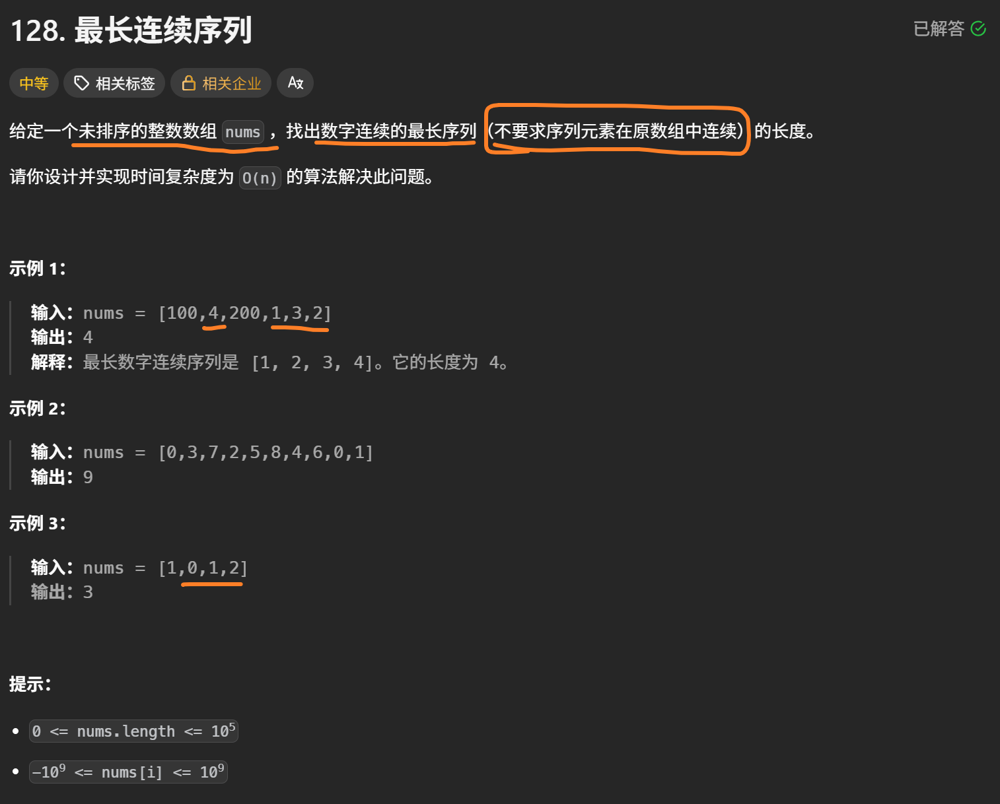

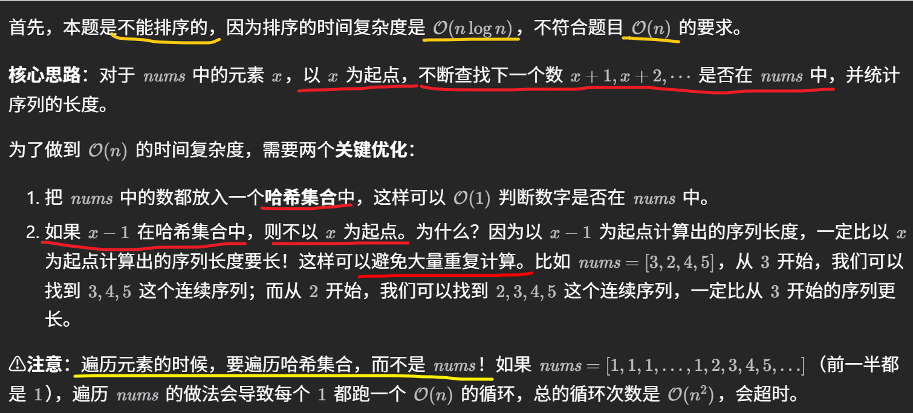

`contains()` 是 C++20 引入的成员函数，用于判断某个元素是否存在于关联容器中。

将数组 nums 中的所有元素存入一个哈希集合 st，这样可以在 **O(1)** 时间内判断某个数是否存在。

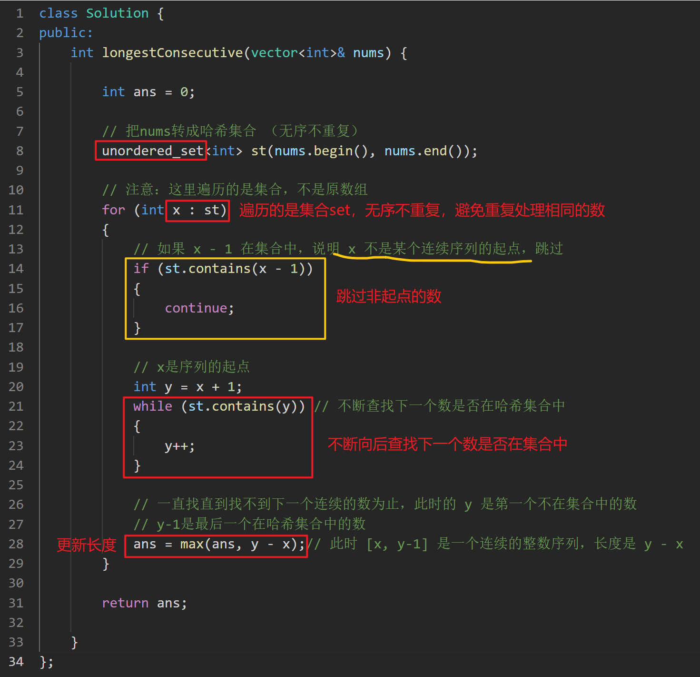

~~~C++
class Solution {
public:
    int longestConsecutive(vector<int>& nums) {

        int ans = 0;

        // 把nums转成哈希集合 （无序不重复）
        unordered_set<int> st(nums.begin(), nums.end());

        // 注意：这里遍历的是集合，不是原数组
        for (int x : st)
        {
            // 如果 x-1 在集合中，说明 x 不是某个连续序列的起点，跳过
            if (st.contains(x - 1))
            {
                continue;
            }

            // x 是序列的起点
            int y = x + 1;
            while (st.contains(y)) // 不断向后查找下一个数是否在哈希集合中
            {
                y++;
            }

            // 一直找知道找不到下一个连续的数为止，此时的 y 是第一个不在集合中的数
            // y - 1 就是最后一个在哈希集合中的数

            // 更新长度
            ans = max(ans, y - x); // [x, y-1]是一个连续序列，长度是 y - x
        }

        return ans;
    }
};
~~~

ACM 模式：

~~~C++
#include <vector>
#include <unordered_set>
#include <iostream>
#include <algorithm>

int longestConsecutive(const std::vector<int>& nums)
{
    int ans = 0;

    std::unordered_set<int> st(nums.begin(), nums.end()); // 无序不重复
    for (int x : st)
    {
        // 如果 x 不是连续序列的起点，跳过
        if (st.find(x - 1) != st.end())
        {
            continue;
        }
        // x 是连续序列的起点，不断向后寻找下一个数
        int y = x + 1;
        while (st.find(y) != st.end())
        {
            y++;
        }

        ans = std::max(ans, y - x); // 更新连续序列最大长度
    }

    return ans;
}

int main()
{
    int n;
    std::cin >> n; // 输入数字个数

    std::vector<int> nums(n);
    for (int i = 0; i < n; i++)
    {
        std::cin >> nums[i]; // 输入数组 nums
    }

    int result = longestConsecutive(nums);
    std::cout << result << std::endl;

    return 0;
}
~~~

## 双指针

### [283 移动零（快慢指针）](https://leetcode.cn/problems/move-zeroes/?envType=study-plan-v2&envId=top-100-liked)

@快慢指针

**和 27、移除元素 相同，多一步slow及slow之后置零**

~~~C++
class Solution {
public:
    void moveZeroes(vector<int>& nums) {
        // 快慢指针

        int slowIndex = 0;
        int fastIndex = 0;

        for (fastIndex = 0; fastIndex < nums.size(); fastIndex++)
        {
            if (nums[fastIndex] != 0)
            {
                nums[slowIndex++] = nums[fastIndex]; // 覆盖 0
            }
        }

        // 将slowIndex及slowIndex之后的元素都置零
        for (int i = slowIndex; i < nums.size(); i++)
        {
            nums[i] = 0;
        }

    }
};
~~~

ACM

~~~C++
#include <iostream>
#include <vector>

using namespace std;

void moveZero(vector<int>& nums)
{
    int slowIndex = 0;
    int fastIndex = 0;

    for (fastIndex = 0; fastIndex < nums.size(); fastIndex++)
    {
        if (nums[fastIndex] != 0)
        {
            nums[slowIndex++] = nums[fastIndex]; // 原地向前覆盖0
        }
    }

    for (int i = slowIndex; i < nums.size(); i++)
    {
        nums[i] = 0;
    }
}

int main() 
{
    int n;
    cin >> n; // 输入数组个数

    vector<int> nums(n);
    for (int i = 0; i < n; i++)
    {
        cin >> nums[i]; // 输入数组元素
    }

    moveZero(nums); // 移动 0

    for (int i = 0; i < n; i++)
    {
        cout << nums[i] << " "; // 输出移动0后的nums
    }
    cout << endl;

    return 0;
}
~~~

示例输入：

~~~C++
6
0 1 0 3 12 0
~~~

输出：

~~~C++
1 3 12 0 0 0
~~~

### [11 盛最多水的容器（收缩）](https://leetcode.cn/problems/container-with-most-water/description/?envType=study-plan-v2&envId=top-100-liked)

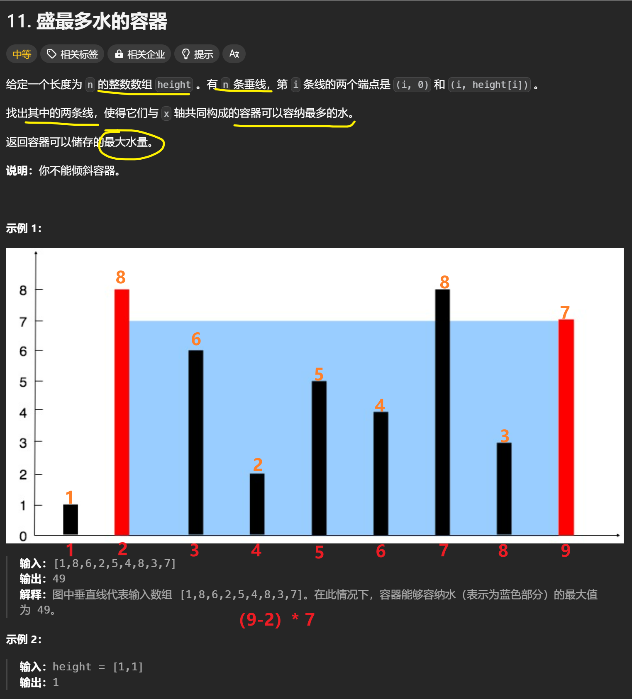

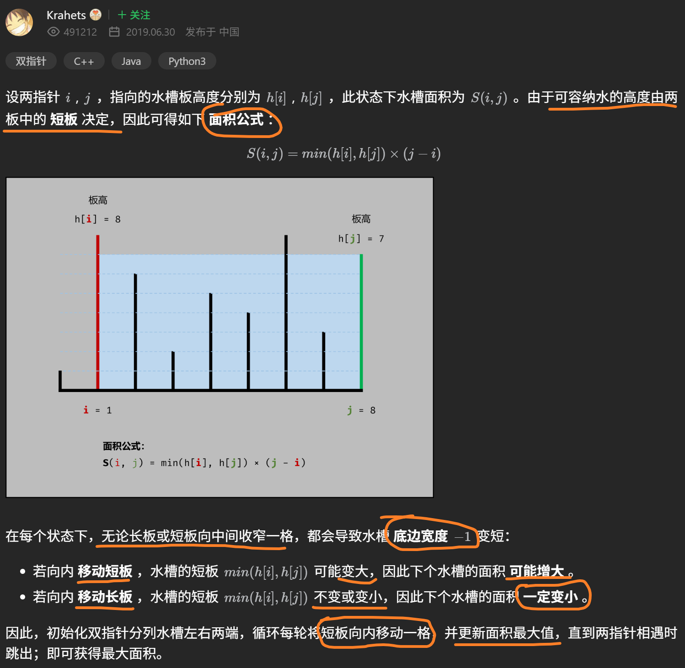

~~~C++
class Solution {
public:
    int maxArea(vector<int>& height) {

        // 双指针 收缩
        
        int ans = 0;

        int left = 0;
        int right = height.size() - 1;

        while(left < right) // 只要 left < right 就还能构成矩形面积
        {
            int area = (right - left) * min(height[left], height[right]); // 矩形面积
            ans = max(ans, area); // ans保持最大值

            // 移动短边
            height[left] < height[right] ? left++ : right--;

            // 因为短边能构成的最大的面积，就是area
        }
        
        return ans;
    }
};
~~~

ACM

~~~C++
#include <iostream>
#include <vector>

using namespace std;

int maxArea(vector<int>& height)
{
    int ans = 0;

    int left = 0;
    int right = height.size() - 1;

    while (left < right)
    {
        int area = (right - left) * min(height[left], height[right]);
        ans = max(ans, area);

        // 移动短边
        height[left] < height[right] ? left++ : right--;
    }

    return ans;
}

int main()
{
    int n;
    cin >> n; // height数组长度（柱子数量）

    vector<int> height(n);
    for (int i = 0; i < n; i++)
    {
        cin >> height[i]; // 输入每根柱子的高度
    }

    int result = maxArea(height);
    cout << result << endl; // 输出最大盛水面积

    return 0;
}
~~~

示例输入：

~~~C++
9
1 8 6 2 5 4 8 3 7
~~~

输出：

~~~C++
49
~~~

### [15 三数之和（收缩）](https://leetcode.cn/problems/3sum/description/?envType=study-plan-v2&envId=top-100-liked)

@双指针收缩

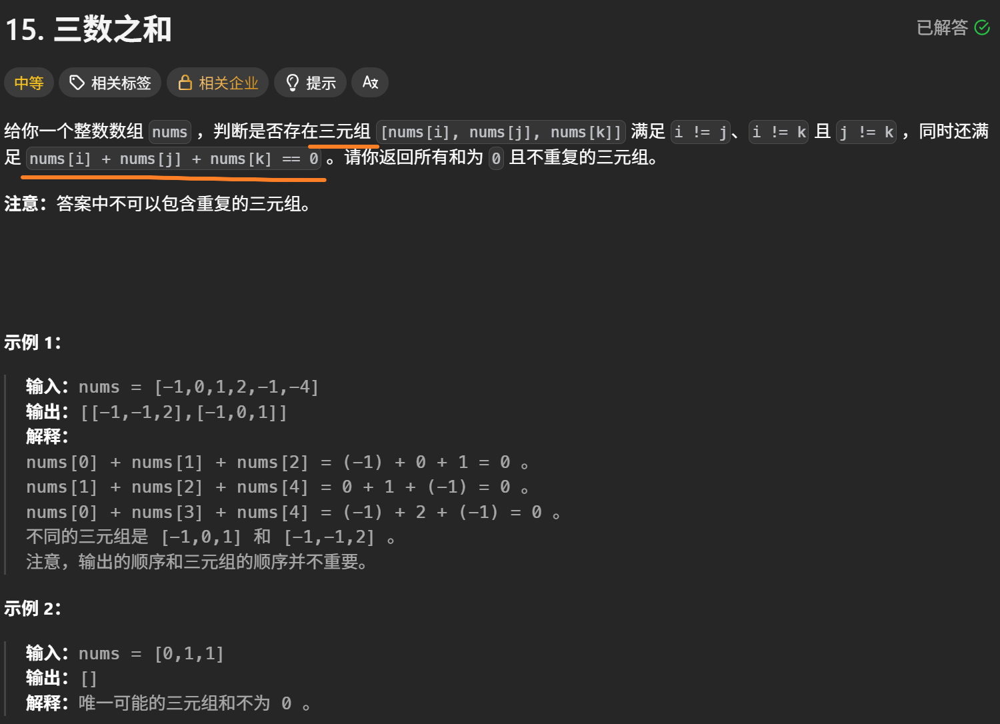

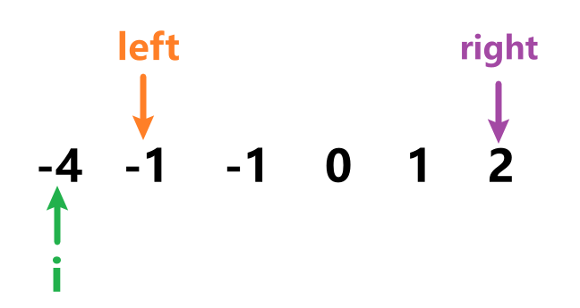

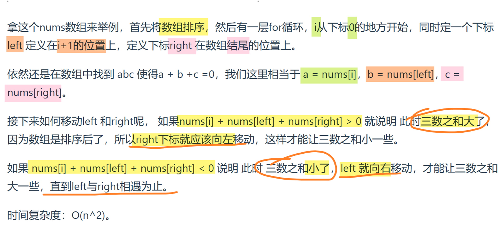

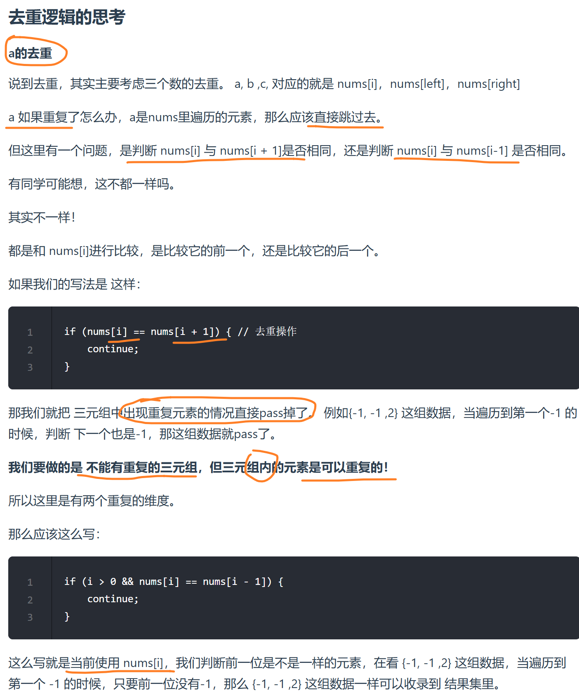

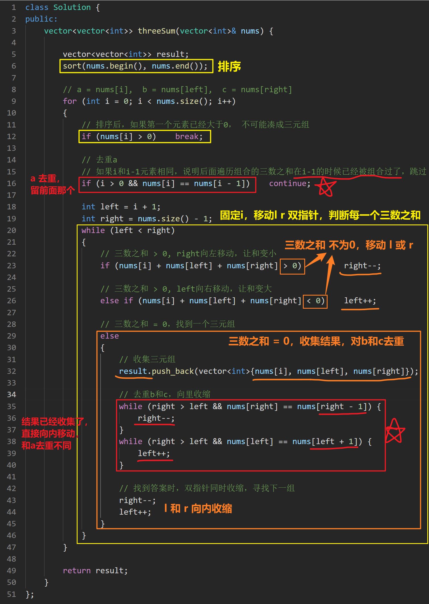

~~~C++
class Solution {
public:
    vector<vector<int>> threeSum(vector<int>& nums) {

        // 双指针 收缩

        vector<vector<int>> result;

        // 排序nums
        sort(nums.begin(), nums.end());

        // a = nums[i]  b = nums[left]   c = nums[right]
        for (int i = 0; i < nums.size(); i++)
        {
            // 排序后第一个元素已经大于0，不可能凑成三元组
            if (nums[i] > 0)    break;
            
            // 去重 a
            // 如果i和i-1元素相同，说明后面遍历组合的三数之和在nums[i-1]的时候被组合过了，跳过
            if (i > 0 && nums[i] == nums[i - 1])    continue;

            // 移动left right 判断三数之和
            int left = i + 1;
            int right = nums.size() - 1;
            while(left < right)
            {
                // 三数之和 > 0，right向左移动，让和变小
                if (nums[i] + nums[left] + nums[right] > 0) right--;
                // 三数之和 < 0，left向右移动，让和变大
                else if (nums[i] + nums[left] + nums[right] < 0) left++;
                // 三数之和 = 0，找到一个三元组
                else 
                {
                    // 收集三元组
                    result.push_back(vector<int>{nums[i], nums[left], nums[right]});
                    // 去重b和c，向里收缩
                    while (right > left && nums[right] == nums[right - 1])
                    {
                        right--;
                    }
                    while (right > left && nums[left] == nums[left + 1])
                    {
                        left++;
                    }
                    
                    // 找到一组三元组后，left和right同时向里收缩，寻找下一组
                    right--;
                    left++;

                }
            }
        }

        return result;        
    }
};
~~~

ACM

~~~C++
#include <iostream>
#include <vector>
#include <algorithm>

using namespace std;

vector<vector<int>> threeSum(vector<int>& nums) 
{
    vector<vector<int>> result;
    
    // 排序nums
    sort(nums.begin(), nums.end());

    // a = nums[i]  b = nums[left]   c = nums[right]
    for (int i = 0; i < nums.size(); i++)
    {
        // 排序后第一个元素已经大于0，不可能凑成三元组
        if (nums[i] > 0)    break;
        
        // 去重 a
        if (i > 0 && nums[i] == nums[i - 1])    continue;

        // 移动left right 判断三数之和
        int left = i + 1;
        int right = nums.size() - 1;
        while(left < right)
        {
            if (nums[i] + nums[left] + nums[right] > 0) right--;
            else if (nums[i] + nums[left] + nums[right] < 0) left++;
            else // 三数之和 = 0，找到一个三元组
            {
                // 收集三元组
                result.push_back(vector<int>{nums[i], nums[left], nums[right]});
                // 去重b和c，向里收缩
                while (right > left && nums[right] == nums[right - 1])
                {
                    right--;
                }
                while (right > left && nums[left] == nums[left + 1])
                {
                    left++;
                }
                // 找到一组三元组后，left和right同时向里收缩，寻找下一组
                right--;
                left++;
            }
        }
    }
    return result;        
}

int main()
{
    int n;
    cin >> n; // nums数组长度

    vector<int> nums(n);
    for (int i = 0; i < n; i++)
    {
        cin >> nums[i]; // 输入nums数组
    }

    vector<vector<int>> result = threeSum(nums);

    for (int i = 0; i < result.size(); i++)
    {
        for (int j = 0; j < result[i].size(); j++)
        {
            cout << result[i][j] << " ";
        }
        cout << endl;
    }
    
    return 0;
}
~~~

### [42 接雨水](https://leetcode.cn/problems/trapping-rain-water/description/?envType=study-plan-v2&envId=top-100-liked)

@前缀和 @双指针收缩

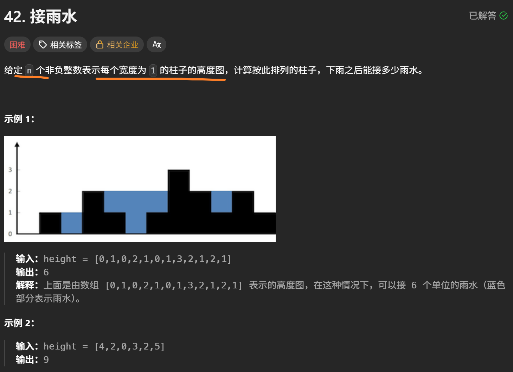

#### 方法一、前后缀分离

分割成每个height[i]一块，把每块看成是宽度是1，高度为height[i] 的水桶，能盛多少水，**取决于左右两边挡板的短板有多高**，也就是当前height[i]前后的最高高度取小值。

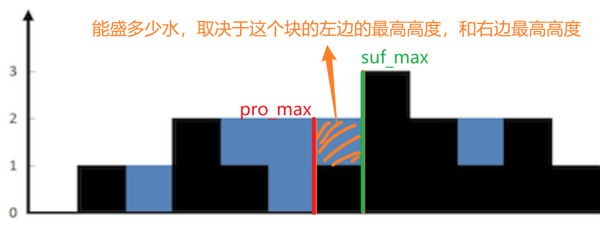

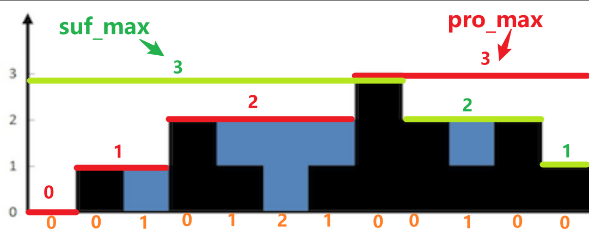

height[i] 的【左边最高高度，右边最高高度】取最小值，再减去height[i] 就是当前这个块能盛的水的高度，也即面积（底部宽度为1）。

~~~C++
ans += min(pre_max[i], suf_max[i]) - height[i]; // 每块的面积，宽度是1
~~~

~~~C++
class Solution {
public:
    int trap(vector<int>& height) {
        
        // 前后缀分离
		// 时间复杂度 O(n)   空间复杂度 O(n)
        int n = height.size();

        vector<int> pre_max(n); // 从 height[0] 到 height[i] 的最大值，从前向后
        pre_max[0] = height[0];
        for (int i = 1; i < n; i++)
        {
            pre_max[i] = max(pre_max[i - 1], height[i]);
        }

        vector<int> suf_max(n); // 从 height[n-1] 到 height[i] 的最大值，从后向前
        suf_max[n - 1] = height[n - 1];
        for (int i = n - 2; i >= 0; i--)
        {
            suf_max[i] = max(suf_max[i + 1], height[i]);
        }

        int ans = 0;
        for (int i = 0; i < n; i++)
        {
            // 取 前缀后缀的较小值 - height[i] 作为当前盛水的高度
            ans += min(pre_max[i], suf_max[i]) - height[i]; // 每块的面积，宽度是1
        }

        return ans;
    }
};
~~~

ACM：

~~~C++
#include <iostream>
#include <vector>
#include <algorithm>

using namespace std;

int trap(vector<int>& height) 
{
    int n = height.size();

    // 前缀最大值
    vector<int> pre_max(n);
    pre_max[0] = height[0];
    for (int i = 1; i < n; i++)
    {
        pre_max[i] = max(pre_max[i - 1], height[i]);
    }
    // 后缀最大值
    vector<int> suf_max(n);
    suf_max[n - 1] = height[n - 1];
    for (int i = n - 2; i >= 0; i--)
    {
        suf_max[i] = max(suf_max[i + 1], height[i]);
    }

    int ans = 0;
    for (int i = 0; i < n; i++)
    {
        ans += min(suf_max[i], pre_max[i]) - height[i]; // 累加面积
    }
    return ans;
    
}

int main()
{
    int n;
    cin >> n; // 输入height长度

    vector<int> height(n);
    for (int i = 0; i < n; i++)
    {
        cin >> height[i]; // 输入height数组
    }

    int result = trap(height);
    cout << result << endl;

    return 0;
}
~~~

示例输入：

~~~C++
12
0 1 0 2 1 0 1 3 2 1 2 1
~~~

输出：

~~~C++
6
~~~

#### 方法二、相向双指针

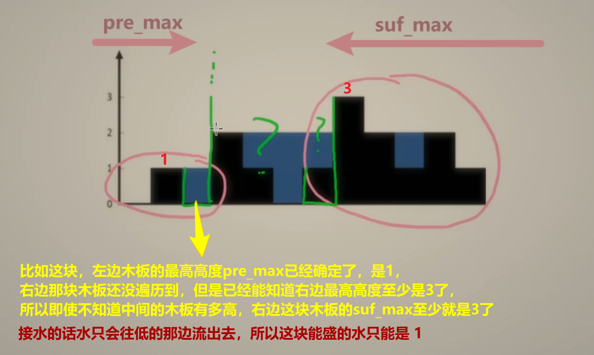

**总结：**接水多少由短的木板决定，left right指针向中间收缩

接水的高度由前缀最大值和后缀最大值中的**较小值**决定，左右指针谁小谁移动，相遇位置会是最高

- 如果**前缀最大值 < 后缀最大值**，这个木桶的容量就是**前缀最大值-height[left]**，算完之后left指针**向右**；
- 如果**后缀最大值 < 前缀最大值**，这个木桶的容量就是**后缀最大值-height[right]**，算完之后right指针**向左**

~~~C++
class Solution {
public:
    int trap(vector<int>& height) {

        // 相向双指针
        // 时间复杂度 O(n)   空间复杂度 O(1)
        int ans = 0;

        int left = 0, right = height.size() - 1; // 左右指针，向中间移动

        int pre_max = 0, suf_max = 0; // 前后缀最大值

        while (left < right) // 可以不加等号，因为在「谁小移动谁」的规则下，相遇的位置一定是最高的柱子，这个柱子是无法接水的
        {
            pre_max = max(pre_max, height[left]);
            suf_max = max(suf_max, height[right]);

            // 找能确定的较短的柱子
            if (pre_max < suf_max)
            {
                ans += pre_max - height[left];
                left++; 
            }
            else
            {
                ans += suf_max - height[right];
                right--;
            }
        }

        return ans;        
    }
};
~~~

## 滑动窗口

### [3 无重复字符的最长子串](https://leetcode.cn/problems/longest-substring-without-repeating-characters/description/?envType=study-plan-v2&envId=top-100-liked)

@滑动窗口

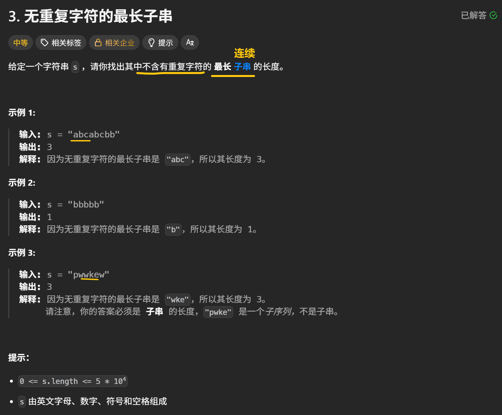

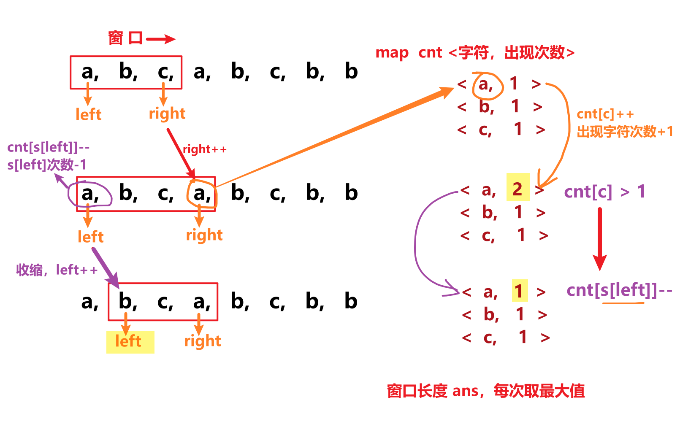

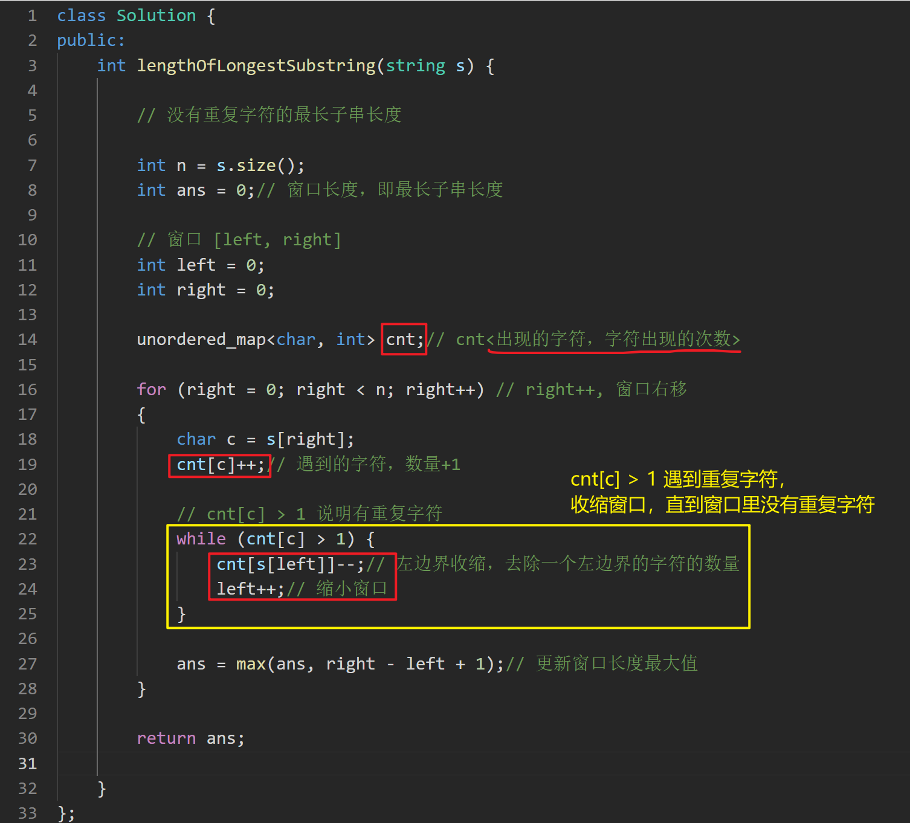

~~~C++
class Solution {
public:
    int lengthOfLongestSubstring(string s) {

        int n = s.size();
        int ans = 0; // 窗口长度，即最长不重复子串长度

        // 窗口 [left, right]
        int left = 0;
        int right = 0;

        unordered_map<char, int> cnt; // cnt <出现的字符，字符出现的次数>

        for (right = 0; right < n; right++) // right++, 窗口右移
        { 
            char c = s[right];
            cnt[c]++; // 遇到的字符，次数+1

            // cnt[c] > 1 说明有重复字符
            while (cnt[c] > 1)
            {
                cnt[s[left]]--; // 左边界收缩，去除一个左边界字符的数量
                left++; // 缩小窗口
            }

            ans = max(ans, right - left + 1); // 更新窗口长度最大值
        }

        return ans;    
    }
};
~~~

ACM 

~~~C++
#include <iostream>
#include <string>
#include <unordered_map>

using namespace std;

int lengthOfLongestSubstring(const string& s)
{
    int ans = 0;

    int left = 0; 
    int right = 0;

    unordered_map<char, int> cnt; // <字符，字符出现次数>

    for (right = 0; right < s.size(); right++)
    {
        char c = s[right];
        cnt[c]++; // 统计字符出现次数

        while (cnt[c] > 1)
        {
            cnt[s[left]]--;
            left++;
        }

        ans = max(ans, right - left + 1);
    }

    return ans;
}

int main()
{
    string s;
    cin >> s; // 输入字符串

    int result = lengthOfLongestSubstring(s);
    cout << result << endl;

    return 0;
}
~~~

示例输入：

~~~C++
abcabcbb
~~~

输出：

~~~C++
3
~~~

### [438 找到字符串中所有的字母异位词](https://leetcode.cn/problems/find-all-anagrams-in-a-string/description/?envType=study-plan-v2&envId=top-100-liked)

@滑动窗口

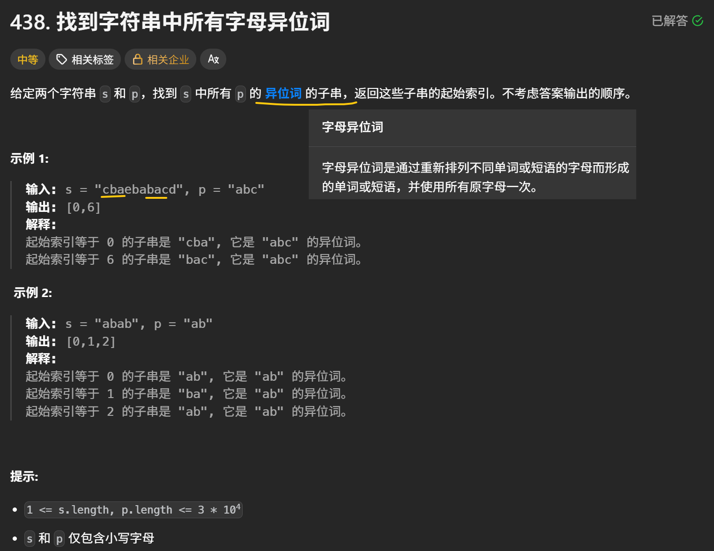

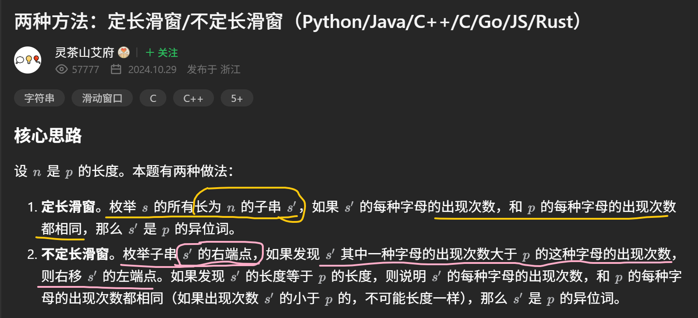

#### 方法一、定长窗口（推荐）

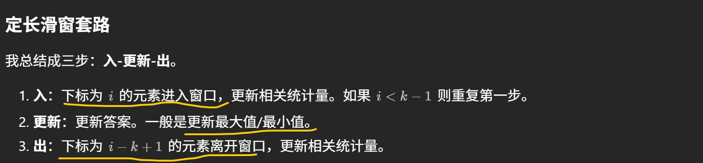

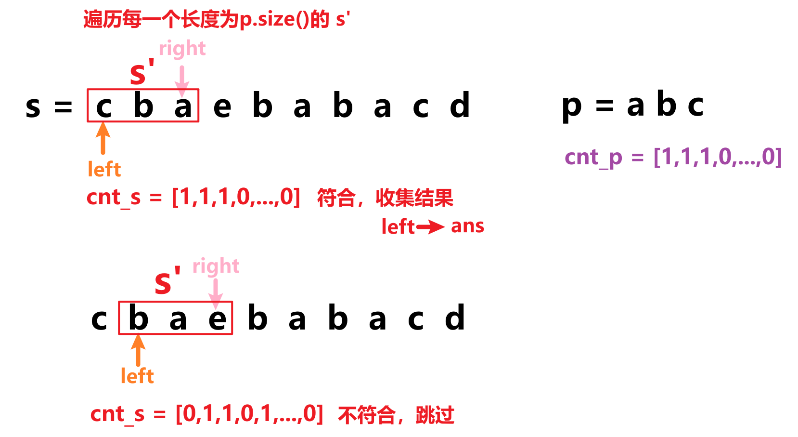

~~~C++
class Solution {
public:
    vector<int> findAnagrams(string s, string p) { // s = "cbaebabacd", p = "abc"

        // 定长滑动窗口s'  窗口长度是p.size()

        vector<int> ans;

        vector<int> cnt_p(26); // p 中的每个字母出现次数
        vector<int> cnt_s(26); // 窗口子串 s'的每个字母出现次数

        for (char c : p)
        {
            cnt_p[c - 'a']++; // 字母对应下标位置的数++
        }

        for (int right = 0; right < s.size(); right++) // 右边界++
        {
            cnt_s[s[right] - 'a']++; // 右边界字母进入窗口 s'
            int left = right - p.size() + 1;// 左边界 窗口长度是p.size()

            // 窗口长度不够p.size() 跳过
            if (left < 0)   continue; 

            // s'和 p 的每种字母出现次数相同，收集结果
            if (cnt_s == cnt_p)
            {
                ans.push_back(left); // s'的左边界下标加入结果
            }

            cnt_s[s[left] - 'a']--; // 接下来进入下一组s', 左边界字母离开窗口，次数--
        }

        return ans;  
    }
};
~~~

ACM

~~~C++
#include <vector>
#include <string>
#include <iostream>

using namespace std;

// s = "cbaebabacd", p = "abc"
vector<int> findAnagrams(const string& s, const string& p)
{
    vector<int> ans;

    vector<int> cnt_s(26);
    vector<int> cnt_p(26);

    for (char c : p)
    {
        cnt_p[c - 'a']++;
    }

    for (int right = 0; right < s.size(); right++)
    {
        cnt_s[s[right] - 'a']++;
        int left = right - p.size() + 1;

        if(left < 0)    continue;

        if (cnt_s == cnt_p)
        {
            ans.push_back(left);
        }

        cnt_s[s[left] - 'a']--;
    }

    return ans;
}

int main()
{
    string s;
    string p;
    cin >> s >> p; // 输入字符串 s p

    vector<int> result = findAnagrams(s, p);
    for (int idx : result)
    {
        cout << idx << " ";
    }
    cout << endl;
    
    return 0;
}
~~~

示例输入：

~~~C++
cbaebabacd abc
~~~

输出：

~~~C++
0 6
~~~

#### 方法二、变长窗口

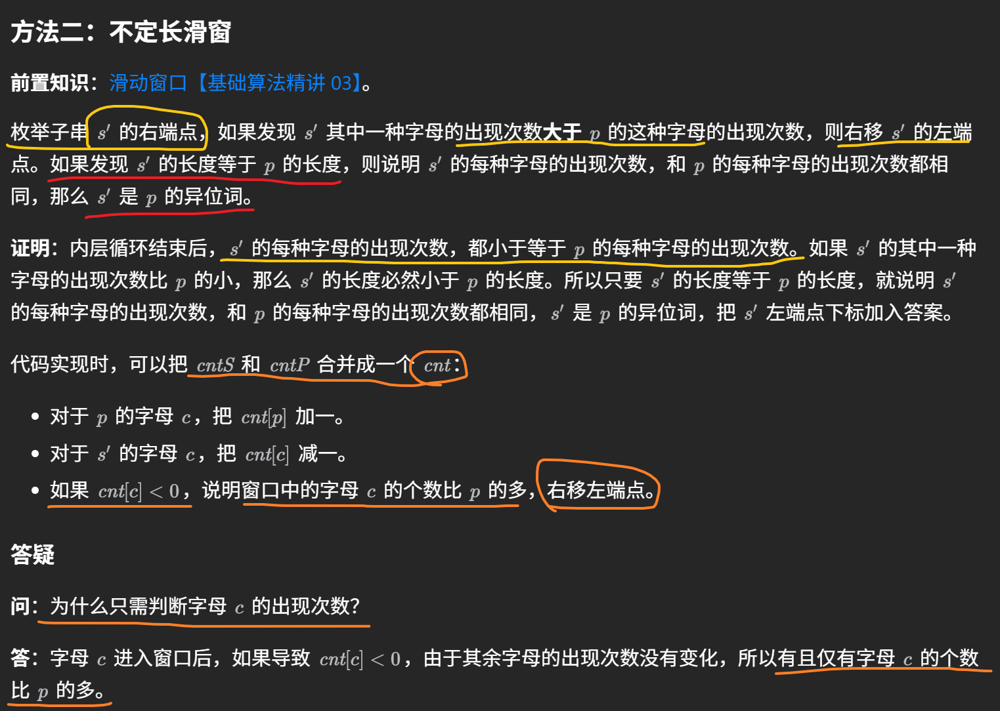

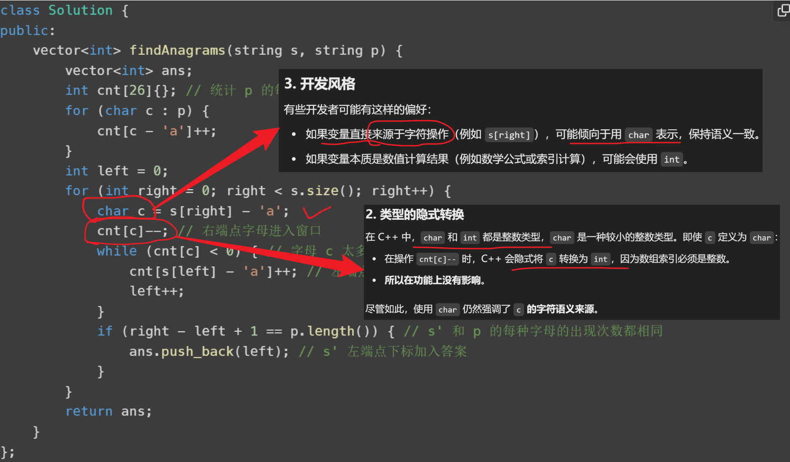

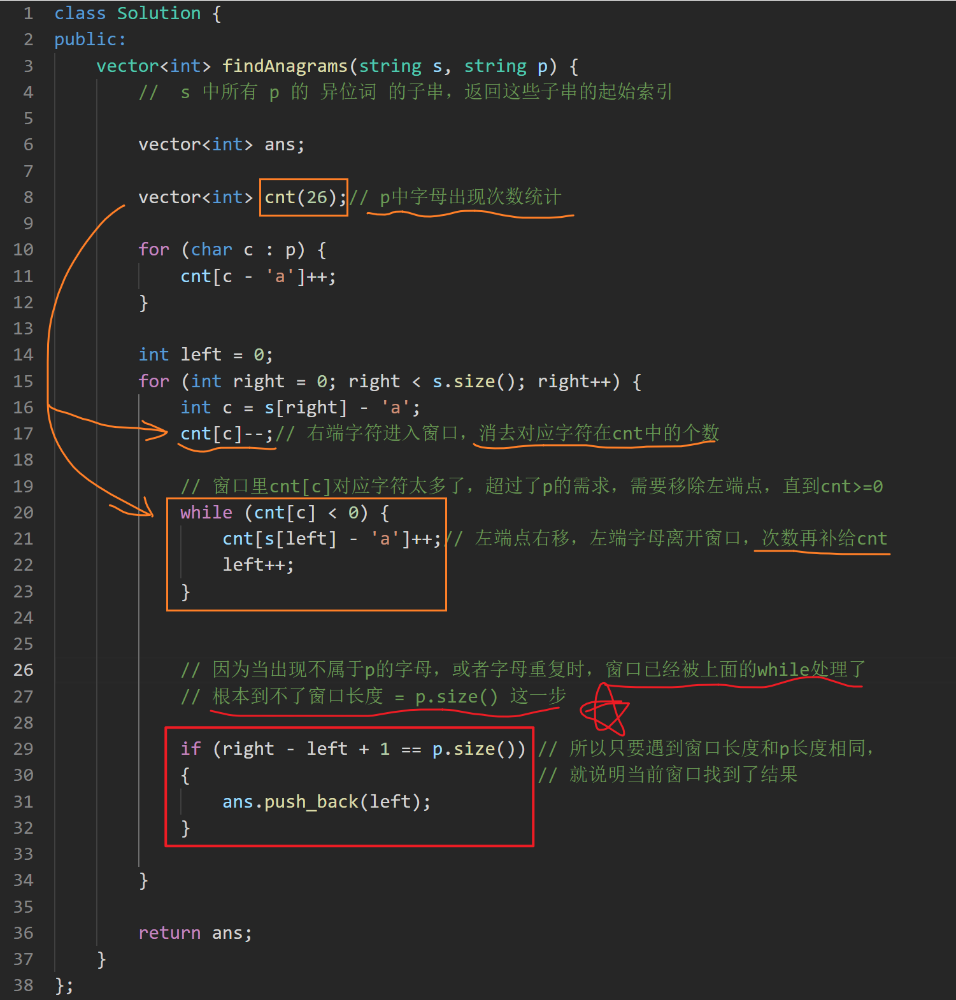

~~~C++
class Solution {
public:
    vector<int> findAnagrams(string s, string p) { // s = "cbaebabacd", p = "abc"

        // 不定长窗口

        vector<int> ans;

        vector<int> cnt(26); // 统计字母，合并了 cnt_s 和 cnt_p

        for (char c : p)
        {
            cnt[c - 'a']++;
        }

        int left = 0;
        for (int right = 0; right < s.size(); right++)
        {
            int c = s[right] - 'a';
            cnt[c]--; // 右端字符进入窗口，消去对应字符在cnt中的个数

            // 窗口里cnt[c]对应字符消去太多了，超过了p的需求，收缩左边界，直到cnt>=0
            while (cnt[c] < 0)
            {
                cnt[s[left] - 'a']++; // 左端点离开，次数再补给cnt
                left++;
            }

            // 因为当出现不属于p的字符，或者字符重复时，窗口已经被上面的while处理了
            // 根本到不了 窗口长度 = p.size() 这一步

            // 所以只要遇到 窗口长度 = p.size()，就说明当前窗口找到了结果
            if (right - left + 1 == p.size())
            {
                ans.push_back(left);
            }
        }

        return ans;
    }
};
~~~

## 子串

### [560 和为k的子数组](https://leetcode.cn/problems/subarray-sum-equals-k/description/?envType=study-plan-v2&envId=top-100-liked)

@前缀和

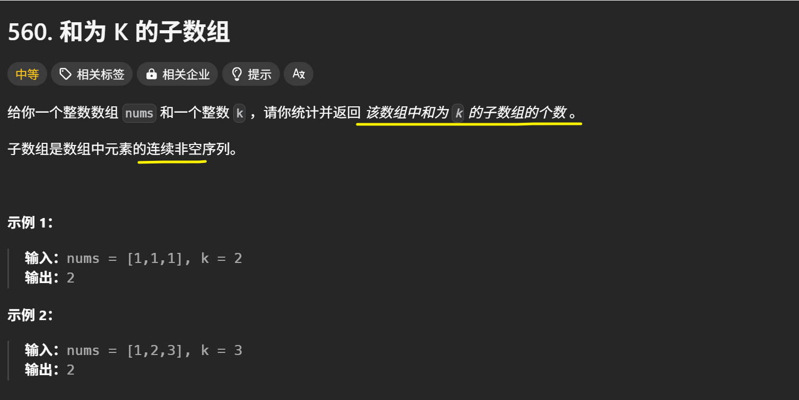

**子数组的和可以由两个前缀和之差表示**

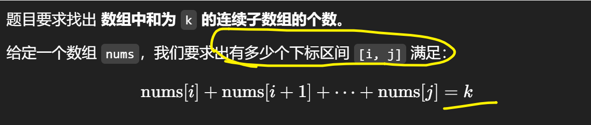

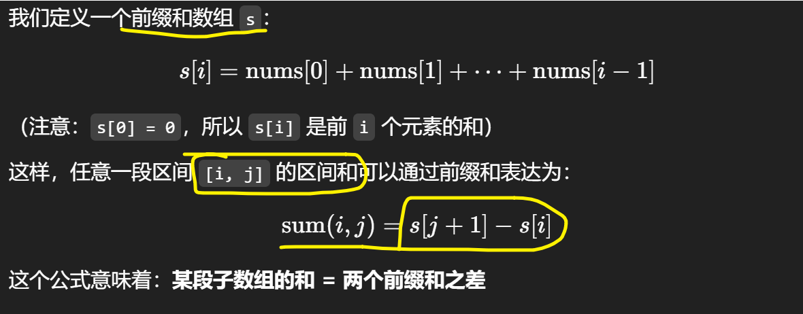

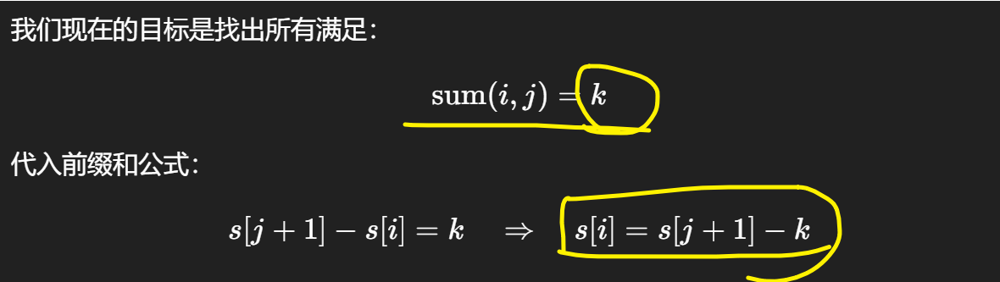

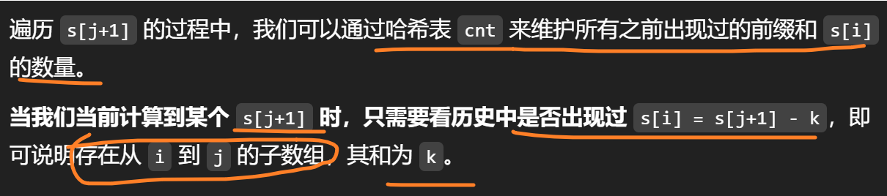

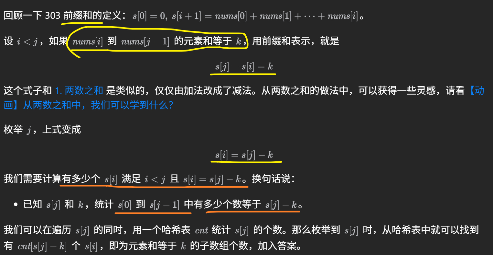

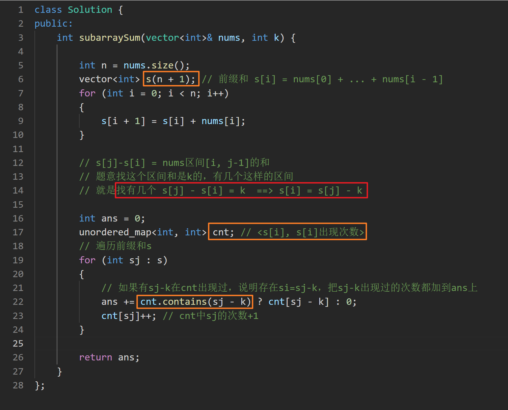

~~~C++
class Solution {
public:
    int subarraySum(vector<int>& nums, int k) {

        int n = nums.size();
        vector<int> s(n + 1); // 前缀和 s[i] = nums[0] + ... + nums[i - 1]
        for (int i = 0; i < n; i++)
        {
            s[i + 1] = s[i] + nums[i];
        }

        // s[j] - s[i] = nums区间[i, j-1]的和
        // 题意找这个区间和是k的，有几个这样的区间
        // 就是找有几个 s[j] - s[i] = k ==> s[i] = s[j] - k

        int ans = 0;
        unordered_map<int, int> cnt; // <s[i], s[i]出现次数>

        // 注意！！！遍历的是前缀和 s
        for (int sj : s)
        {
            // 如果有 sj - k 在cnt出现过，说明存在 si = sj - k，把 sj - k 出现过的次数都加到ans上
            ans += cnt.contains(sj - k) ? cnt[sj - k] : 0;
            cnt[sj]++; // cnt中当前sj的次数+1
        }
        
        return ans;
    }
};
~~~

ACM

~~~C++
#include <vector>
#include <unordered_map>
#include <iostream>

using namespace std;

int subarraySum(const vector<int>& nums, int k)
{
    int n = nums.size();

    vector<int> s(n + 1, 0); // 前缀和
    for (int i = 0; i < n; i++)
    {
        s[i + 1] = s[i] + nums[i];
    }

    // s[j] - s[i] = k => s[i] = s[j] - k

    int ans = 0;
    unordered_map<int, int> cnt; // <s[i], s[i]出现的次数>
    for (int sj : s)
    {
        if (cnt.count(sj - k))
        {
            ans += cnt[sj - k];
        }
        cnt[sj]++;
    }
    
    return ans;
}

int main() 
{
    int n, k;
    cin >> n >> k; // 输入nums长度 和 k

    vector<int> nums(n);
    for (int i = 0; i < n; i++)
    {
        cin >> nums[i]; // 输入nums
    }

    int result = subarraySum(nums, k);
    cout << result << endl;

    return 0;
}
~~~

示例输入：

~~~C++
3 2
1 1 1
~~~

输出：

~~~C++
2
~~~

### [239 滑动窗口最大值](https://leetcode.cn/problems/sliding-window-maximum/description/?envType=study-plan-v2&envId=top-100-liked)

@单调队列

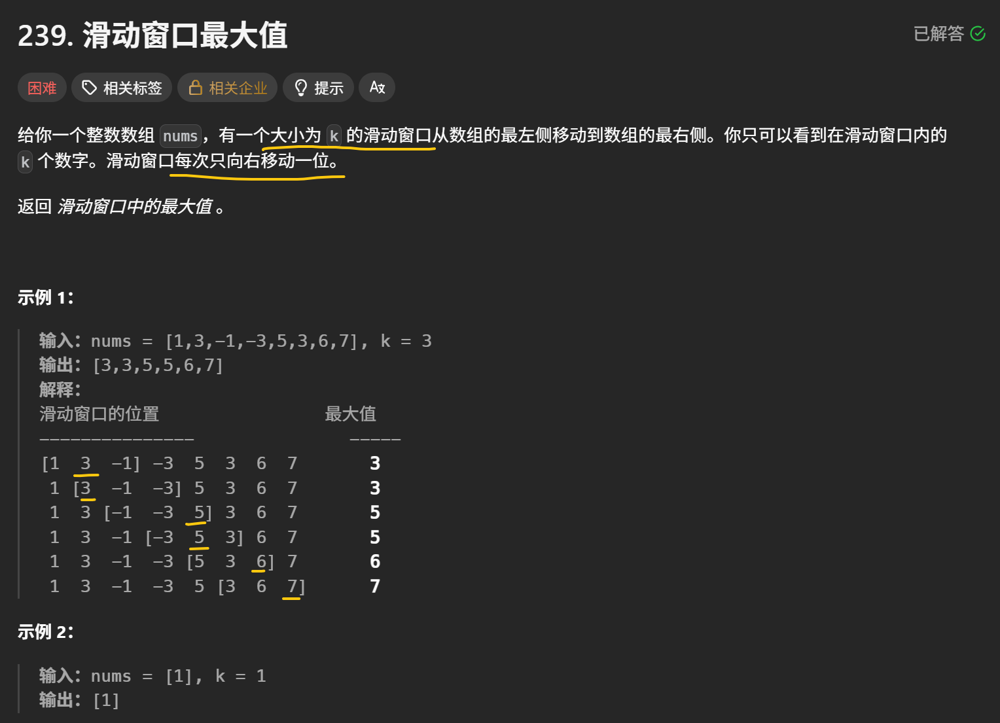

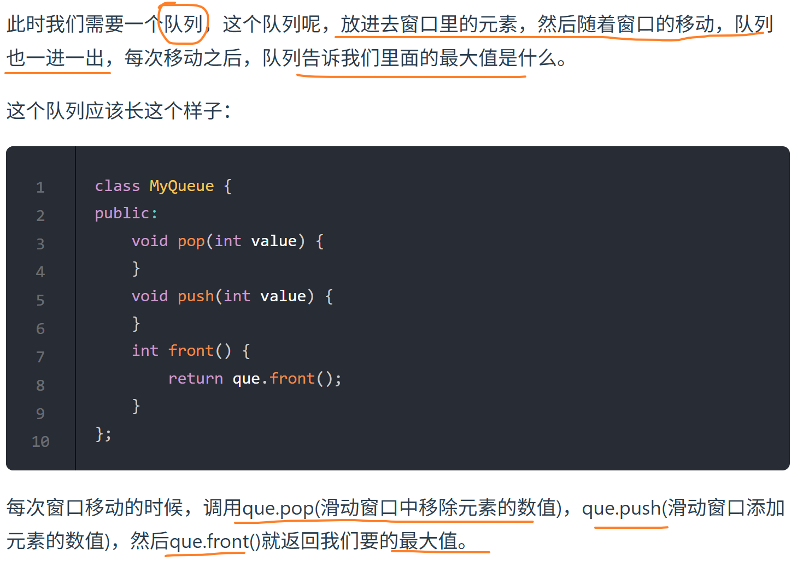

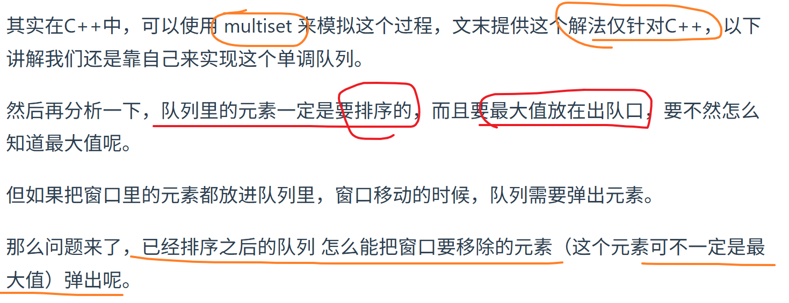

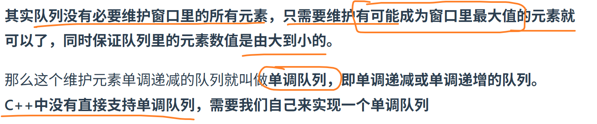

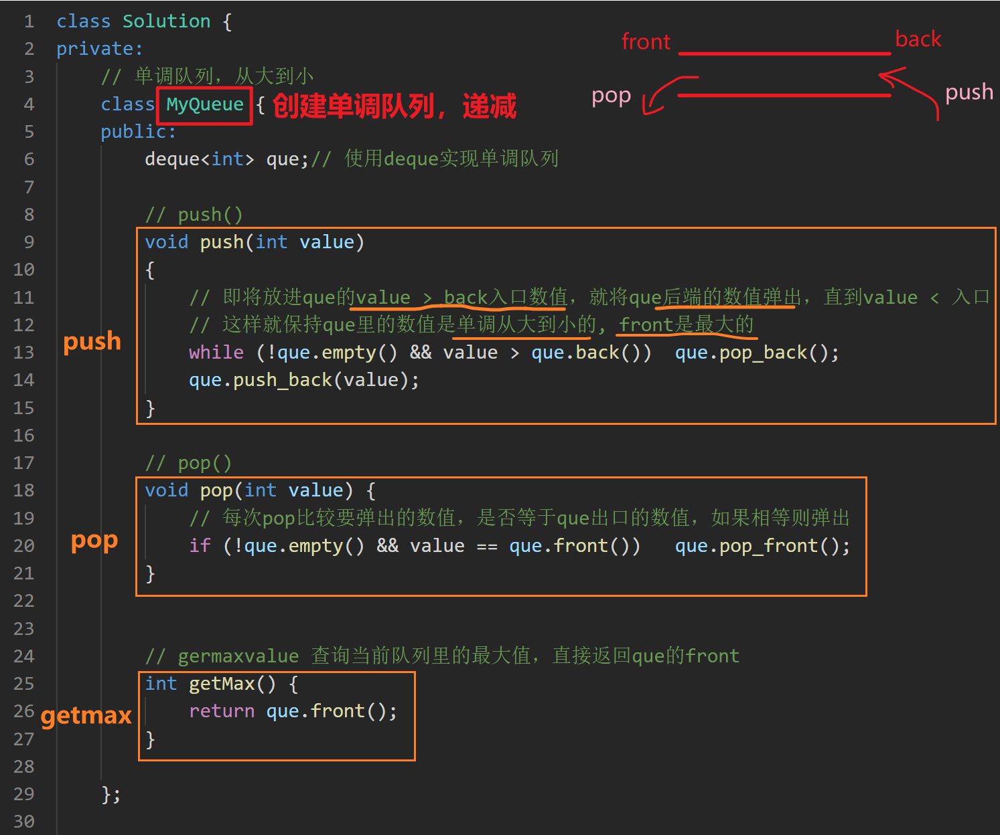

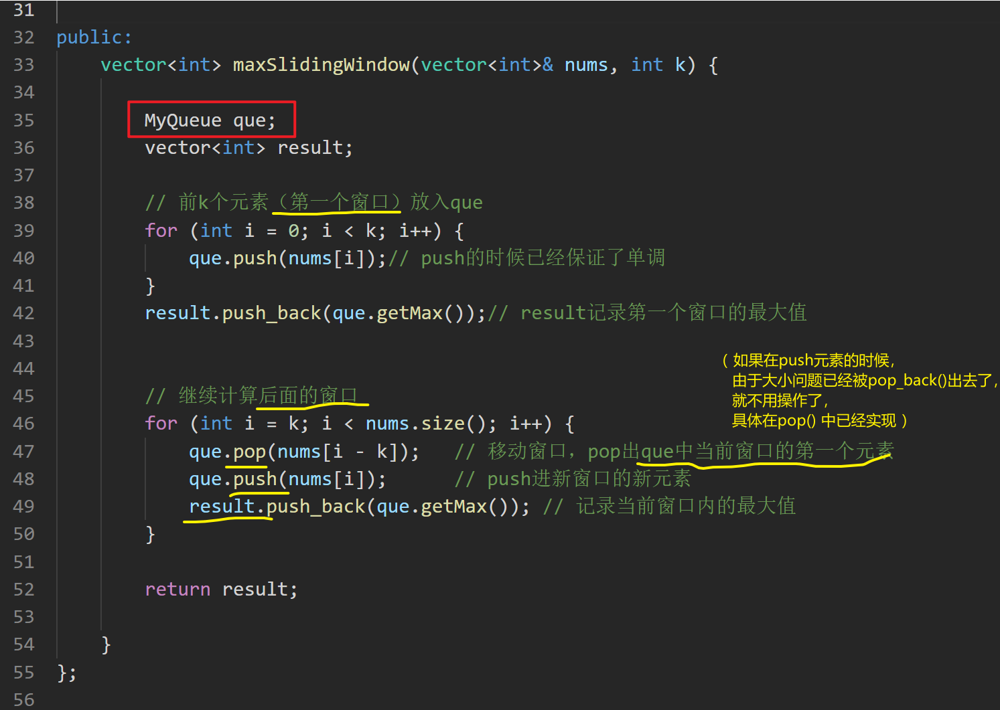

~~~C++
class Solution {
private:
    // deque实现单调队列 从大到小
    class MyQueue
    {
    public:
        deque<int> que; // 使用deque实现单调队列

        // push
        void push(int value)
        {
            // 即将放进que的value > back入口数值，就将que后端的数值弹出，直到value < 入口
            // 保证队列前面都是比value大的值，才能从大到小
            while (!que.empty() && value > que.back())  que.pop_back();
            que.push_back(value);
        }

        // pop
        void pop(int value)
        {
            // 每次pop比较要弹出的数值，是否等于que出口的数值，如果相等则弹出
            if (!que.empty() && value == que.front())   que.pop_front();
        }

        // getMaxvalue 查询当前队列里的最大值，直接返回que的front
        int getMax()
        {
            return que.front();
        }
    };

public:
    vector<int> maxSlidingWindow(vector<int>& nums, int k) {

        vector<int> result;

        MyQueue que; // 创建单调队列
        
        // 前k个元素（第一个窗口）放入que
        for (int i = 0; i < k; i++)
        {
            que.push(nums[i]); // push的时候已经保证了单调
        }
        result.push_back(que.getMax()); // result 记录第一个窗口最大值

        // 继续计算后面的窗口
        for (int i = k; i < nums.size(); i++)
        {
            que.pop(nums[i - k]); // 移动窗口，pop出que中当前窗口的第一个元素
            que.push(nums[i]); // 新元素push进新窗口

            result.push_back(que.getMax()); // 记录当前窗口内的最大值
        }
        
        return result;
        
    }
};
~~~

ACM

~~~C++
#include <iostream>
#include <deque>
#include <vector>

using namespace std;

// 单调队列类
class MyQueue
{
public:
    deque<int> que;
    
    // push 保证从大到小
    void push(int value)
    {
        while (!que.empty() && value > que.back()) // 如果value > que.back() 就弹出原来较小的back
        {
            que.pop_back();
        }
        que.push_back(value); // 新值放进去，队列前面是比value大的值，才能从大到小
    }

    // pop 窗口滑出元素与队头相等时弹出
    void pop(int value)
    {
        if (!que.empty() && value == que.front())
        {
            que.pop_front();
        }
    }

    // getMax 返回当前窗口的最大值（就是队列的front）
    int getMax()
    {
        return que.front();
    }

};

// 返回滑动窗口中的最大值
vector<int> maxSlidingWindow(const vector<int>& nums, int k)
{
    vector<int> result;
    MyQueue que;

    // 初始化前k个元素（第一个窗口）
    for (int i = 0; i < k; i++)
    {
        que.push(nums[i]);
    }
    result.push_back(que.getMax());

    // 开始滑动窗口
    for (int i = k; i < nums.size(); i++)
    {
        que.pop(nums[i - k]);
        que.push(nums[i]);
        result.push_back(que.getMax());
    }

    return result;
}

int main()
{
    int n, k;
    cin >> n >> k; // 输入nums元素个数，和窗口大小k

    vector<int> nums(n);
    for (int i = 0; i < n; i++)
    {
        cin >> nums[i]; // 输入nums元素
    }

    vector<int> ans = maxSlidingWindow(nums, k);
    for (int x : ans)
    {
        cout << x << " ";
    }
    cout << endl;

    return 0;
}
~~~

示例输入：

~~~C++
8 3 
1 3 -1 -3 5 3 6 7
~~~

输出：

~~~C++
3 3 5 5 6 7 
~~~

### [76 最小覆盖子串](https://leetcode.cn/problems/minimum-window-substring/?envType=study-plan-v2&envId=top-100-liked)

@滑动窗口

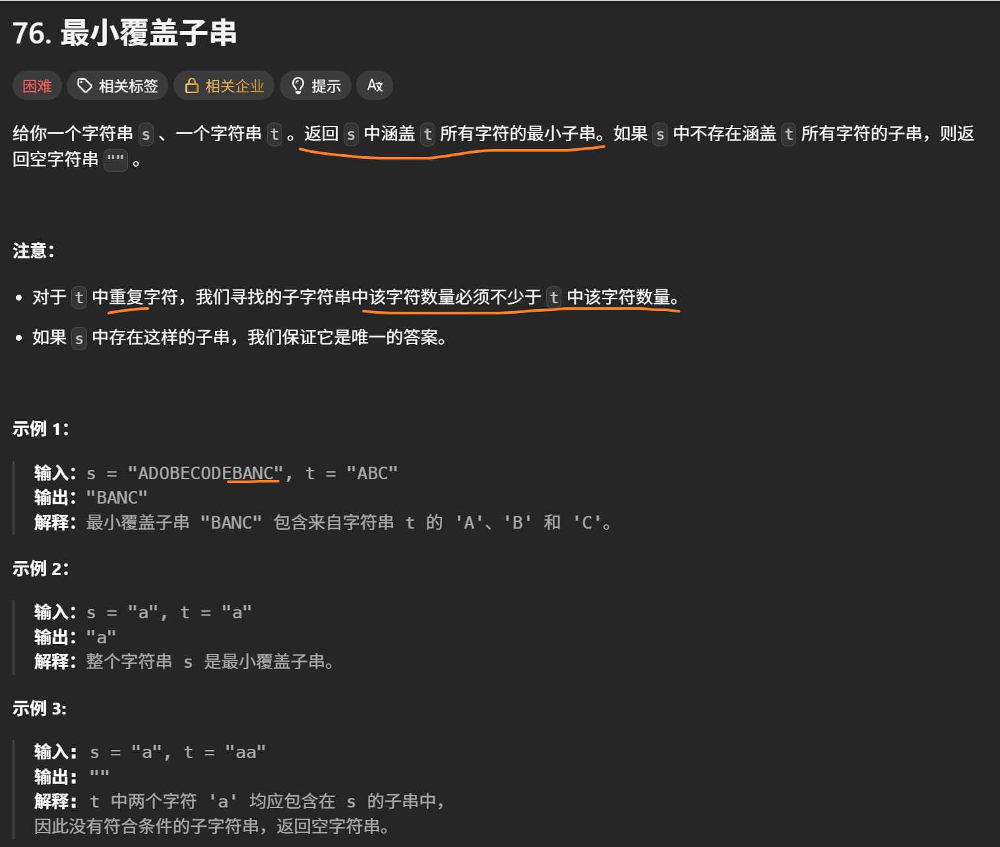		

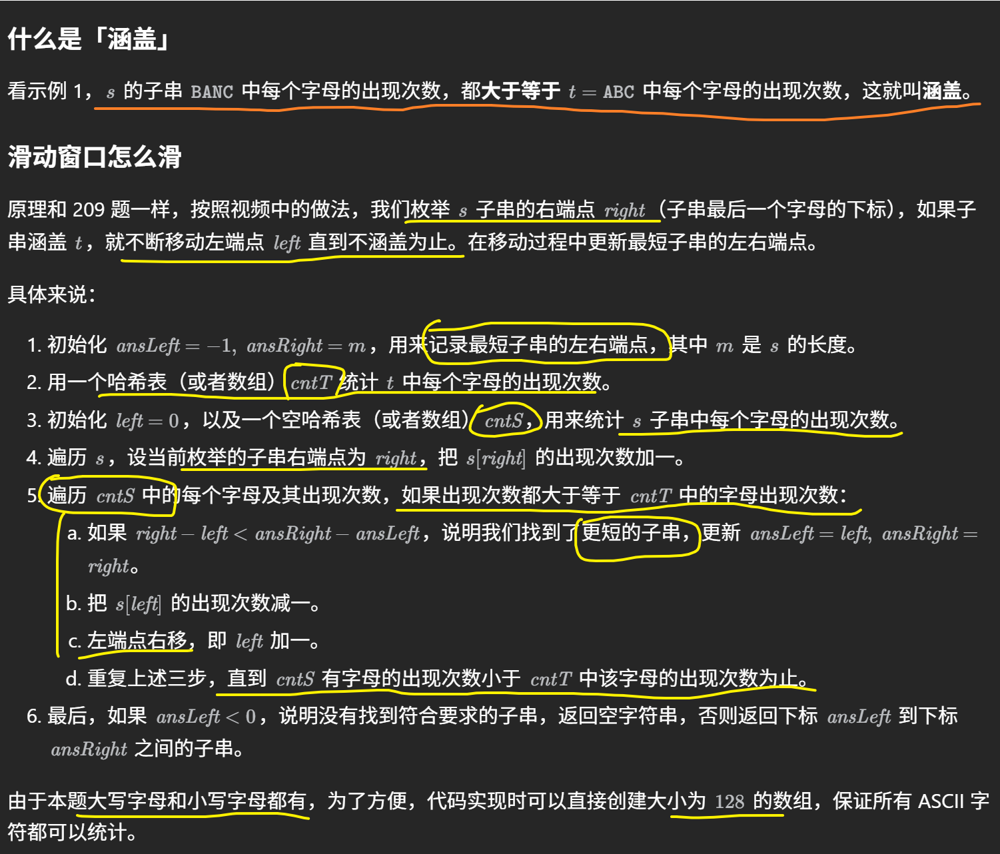

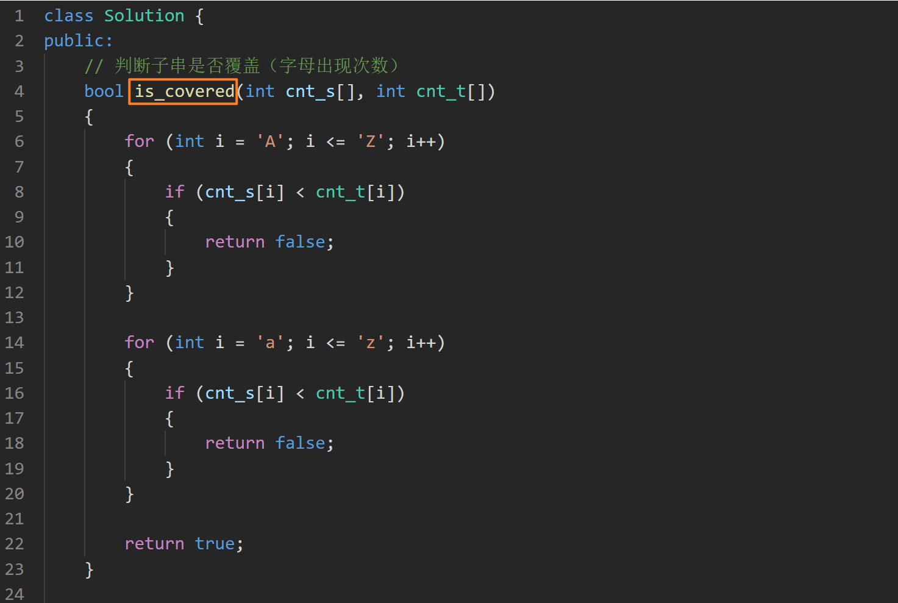

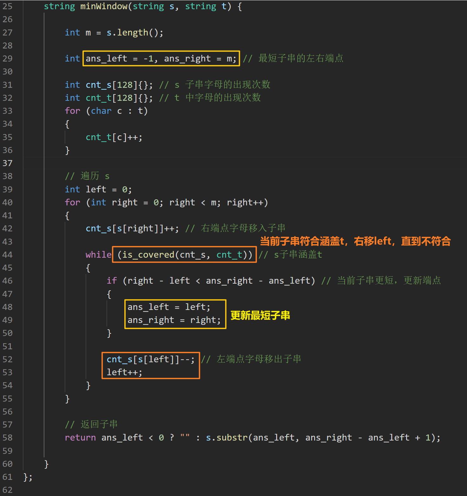

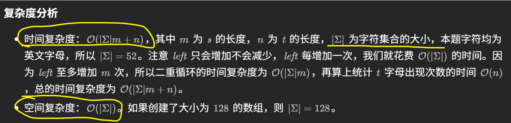

~~~C++
class Solution {
public:
    // 判断子串是否覆盖（字母出现次数）
    bool is_covered(int cnt_s[], int cnt_t[]) 
    {
        for (int i = 'A'; i <= 'Z'; i++)
        {
            if (cnt_s[i] < cnt_t[i])
            {
                return false;
            }
        }

        for (int i = 'a'; i <= 'z'; i++)
        {
            if (cnt_s[i] < cnt_t[i])
            {
                return false;
            }
        }
        
        return true;
    }

    string minWindow(string s, string t) {
        
        int m = s.length();

        int ans_left = -1, ans_right = m; // 最短子串的左右端点

        int cnt_s[128]{}; // s 子串字母的出现次数
        int cnt_t[128]{}; // t 中字母的出现次数
        for (char c : t)
        {
            cnt_t[c]++;
        }

        // 遍历 s
        int left = 0;
        for (int right = 0; right < m; right++)
        {
            cnt_s[s[right]]++; // 右端点字母移入子串
            
            while (is_covered(cnt_s, cnt_t)) // s子串涵盖t
            {
                if (right - left < ans_right - ans_left) // 当前子串更短，更新端点
                {
                    ans_left = left;
                    ans_right = right; 
                }

                cnt_s[s[left]]--; // 左端点字母移出子串
                left++;
            }
        }

        // 返回子串
        return ans_left < 0 ? "" : s.substr(ans_left, ans_right - ans_left + 1);
        
    }
};
~~~

ACM

~~~C++
#include <string>
#include <iostream>

using namespace std;

// 判断子串是否覆盖 t 中所有字符
bool is_covered(int cnt_s[], int cnt_t[])
{
    for (int i = 'A'; i <= 'Z'; i++) 
    {
        if (cnt_s[i] < cnt_t[i]) return false;
    }

    for (int i = 'a'; i <= 'z'; i++) 
    {
        if (cnt_s[i] < cnt_t[i]) return false;
    }

    return true;
}

// 求最小覆盖子串
string minWindow(const string& s, const string& t)
{
    int m = s.length();

    int ans_left = -1, ans_right = m;

    int cnt_s[128] = {0};
    int cnt_t[128] = {0};
    for (char c : t)
    {
        cnt_t[c]++;
    }

    // 遍历 s
    int left = 0;
    for (int right = 0; right < m; right++)
    {
        cnt_s[s[right]]++;

        // 如果符合覆盖，更新最短子串端点，左移left
        while (is_covered(cnt_s, cnt_t))
        {
            if (right - left < ans_right - ans_left)
            {
                ans_left = left;
                ans_right = right;
            }

            cnt_s[s[left]]--;
            left++;
        }
    }

    return (ans_left < 0) ? "" : s.substr(ans_left, ans_right - ans_left + 1);
}

int main()
{
    string s, t;
    cin >> s >> t;

    string result = minWindow(s, t);
    cout << result << endl;

    return 0;
}
~~~

示例输入：

~~~C++
ADOBECODEBANC ABC
~~~

输出：

~~~C++
BANC
~~~

## 普通数组

### 53 [最大子数组和](https://leetcode.cn/problems/maximum-subarray/description/?envType=study-plan-v2&envId=top-100-liked)

@动态规划 @贪心

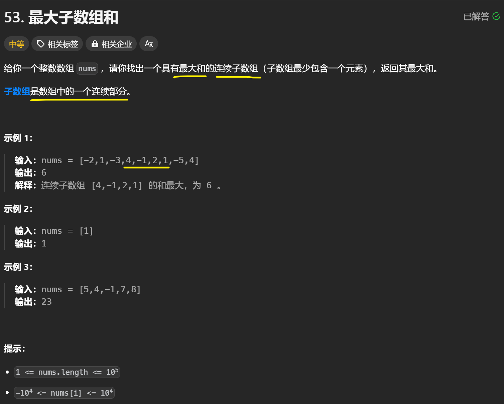

#### 贪心

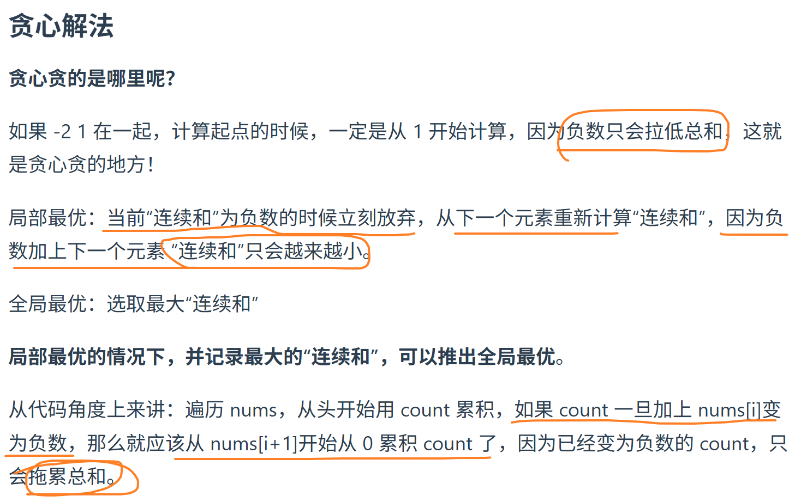

~~~C++
class Solution {
public:
    int maxSubArray(vector<int>& nums) {

        // 贪心

        // 注意找的只是 【最大和】，没让找子数组

        // 主要思路：负数只会拖累加和，所以遇到和变成负的，舍弃，负的只会减小后面的加和
        
        int result = INT32_MIN;
        int count = 0;

        // 记录连续和count，如果count < 0，舍弃，再从下一个数开始计和
        for (int i = 0; i < nums.size(); i++)
        {
            count += nums[i];
            if (result < count)
            {
                result = count; // 更新result，取大的count
            }
            if (count <= 0)
            {
                count = 0; // 舍弃，从下一个数nums[i + 1]重新加和
            }
        }

        return result;
    }
};
~~~

#### 动态规划

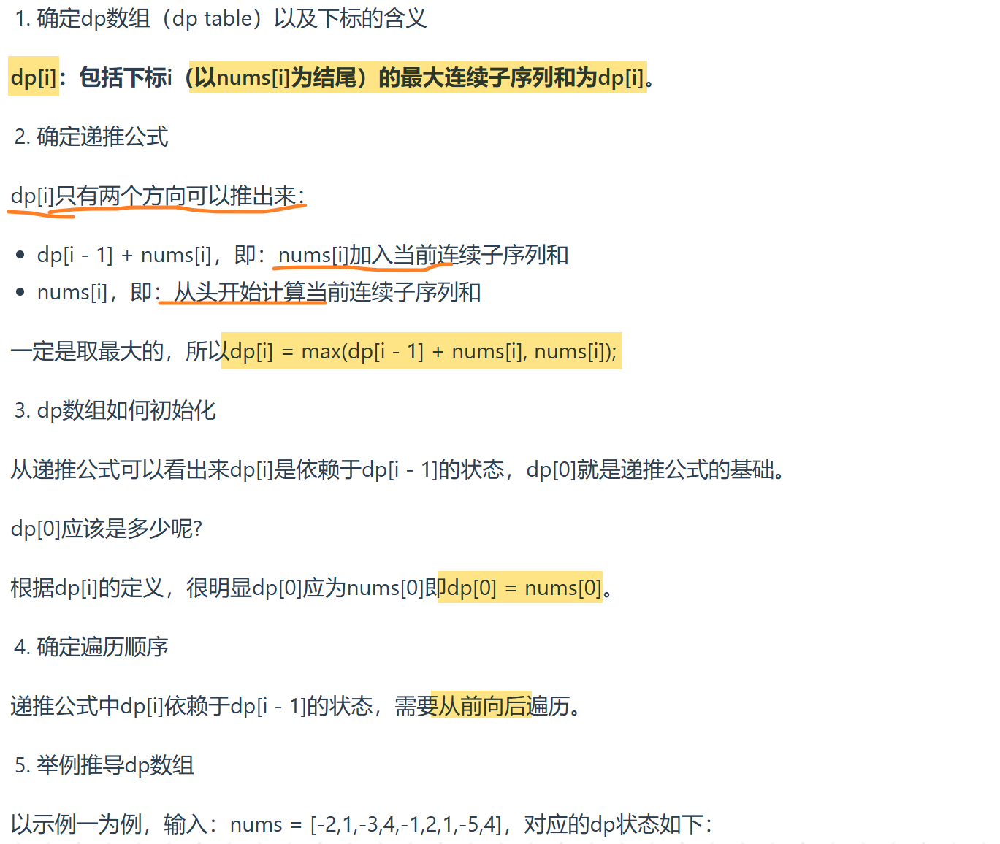

~~~C++
class Solution {
public:
    int maxSubArray(vector<int>& nums) {
        
        // 动态规划 dp[i] - 以nums[i]结尾(包括)的最大连续子序列和为dp[i]

        if (nums.size() == 0)   return 0;

        // dp[]
        vector<int> dp(nums.size());

        // 初始化
        dp[0] = nums[0];

        int result = dp[0];

        // 递推
        for (int i = 1; i < nums.size(); i++)
        {
            dp[i] = max(dp[i - 1] + nums[i], nums[i]);// 两种推出dp[i]的方式，取max

            if (dp[i] > result) result = dp[i]; // 取dp[i]的最大值返回
        }

        return result;
        
    }
};
~~~

ACM

~~~C++
#include <iostream>
#include <vector>
#include <algorithm>
#include <cstdint>

using namespace std;

// 力扣53 最大子数组和

/**************  动态规划 *****************/ 
// int maxSubArray(const vector<int>& nums)
// {
//     if (nums.size() == 0)   return 0;

//     // 动态规划
//     vector<int> dp(nums.size()); // 以nums[i]结尾(包括)的最大连续子序列和为dp[i]
//     dp[0] = nums[0];

//     int result = dp[0];

//     for (int i = 1; i < nums.size(); i++)
//     {
//         dp[i] = max(dp[i - 1] + nums[i], nums[i]);
//         result = max(result, dp[i]);
//     }

//     return result;
// }

/**************  贪心 *****************/ 
int maxSubArray(const vector<int>& nums)
{
    int result = INT32_MIN;
    int count = 0;

    // 记录连续和count，如果count < 0，舍弃，再从下一个数开始计和 (负的只会减小后面的加和)
    for (int i = 0; i < nums.size(); i++)
    {
        count += nums[i];
        if (result < count) result = count;
        if (count <= 0)  count = 0; // 舍弃，从下一个数nums[i + 1]重新加和
    }

    return result;
}

int main()
{
    int n;
    cin >> n; // 输入数组元素个数

    vector<int> nums(n);
    for (int i = 0; i < n; i++)
    {
        cin >> nums[i]; // 输入数组
    }

    int result = maxSubArray(nums);
    cout << result << endl;

    return 0;
}

~~~

示例输入：

~~~shell
9
-2 1 -3 4 -1 2 1 -5 4
~~~

输出：

~~~shell
6 #对应 [4, -1, 2, 1]
~~~

### [56 合并区间](https://leetcode.cn/problems/merge-intervals/description/?envType=study-plan-v2&envId=top-100-liked)

@贪心

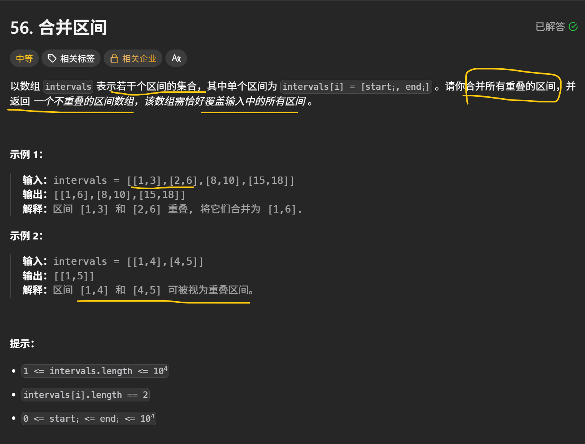

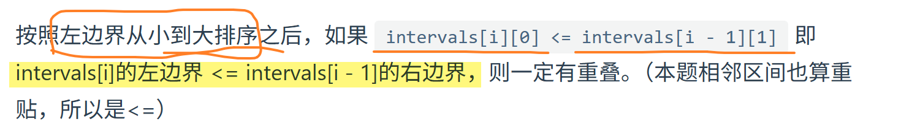

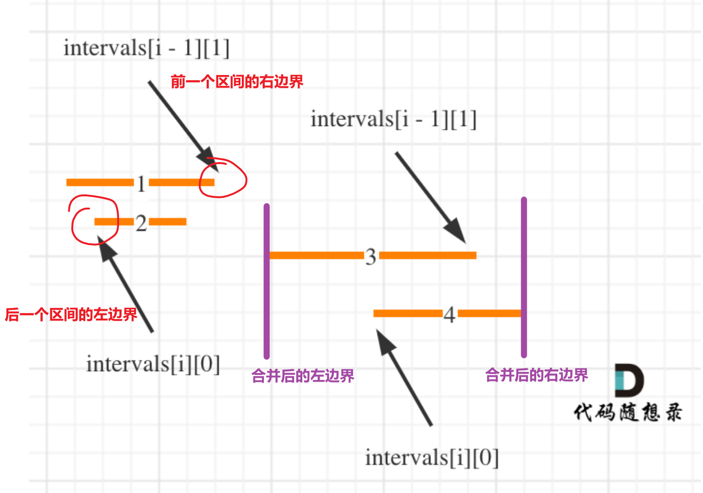

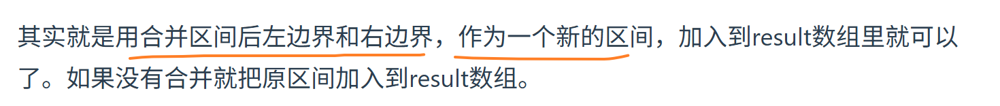

~~~C++
class Solution {
public:
    vector<vector<int>> merge(vector<vector<int>>& intervals) {

        if (intervals.size() == 0)  return intervals;

        // 先按左边界排序，从小到大 (lambda)
        sort(intervals.begin(), intervals.end(),
                 {return a[0] < b[0];} );

        vector<vector<int>> result;
        result.push_back(intervals[0]); // 第一个区间放进result
        for (int i = 1; i < intervals.size(); i++)
        {
            // 有重叠，更新前一个范围的右边界 
            if (intervals[i][0] <= result.back()[1]) // 需要<=，边界重叠也算
            {
                result.back()[1] = max(result.back()[1], intervals[i][1]); // 更新右边界，取较大值
            }
            // 无重叠，直接放进result
            else 
            {
                result.push_back(intervals[i]);
            }
        }

        return result;  
    }
};
~~~

lambda表达式：

~~~C++
  // 先按左边界排序，从小到大 (lambda)
  sort(intervals.begin(), intervals.end(),
           {return a[0] < b[0];});
~~~

如果用仿函数：

~~~C++
class Solution {
public:
    // 仿函数
    static bool cmp (const vector<int>& a, const vector<int>& b)
    {
        return a[0] < b[0];
    }

    vector<vector<int>> merge(vector<vector<int>>& intervals) {

        if (intervals.size() == 0)  return intervals;

        // 先按左边界排序，从小到大 (lambda)
        sort(intervals.begin(), intervals.end(), cmp); // 替换成 cmp
		
        // ...
    }
};
~~~

ACM

~~~C++
#include <iostream>
#include <vector>
#include <algorithm>

using namespace std;

vector<vector<int>> merge(vector<vector<int>>& intervals)
{
    if (intervals.size() == 0)  return intervals;

    // 按左边界排序 从小到大
    sort(intervals.begin(), intervals.end(),
         {return a[0] < b[0];} );

    vector<vector<int>> result;
    result.push_back(intervals[0]);
    for (int i = 1; i < intervals.size(); i++)
    {
        if (result.back()[1] >= intervals[i][0]) // 有重叠，更新右边界
        {
            result.back()[1] = max(result.back()[1], intervals[i][1]);
        }
        else // 无重叠，直接放进result
        {
            result.push_back(intervals[i]);
        }
    }

    return result;
}

int main()
{
    int n;
    cin >> n; // intervals数组元素个数 (区间个数)

    vector<vector<int>> intervals(n, vector<int>(2));
    for (int i = 0; i < n; i++)
    {
        cin >> intervals[i][0] >> intervals[i][1];// 输入每个区间左右端点
    }

    vector<vector<int>> result = merge(intervals);
    for (const auto& interval : result)
    {
        cout << interval[0] << " " << interval[1] << endl;
    }

    return 0;
}
~~~

示例输入：

~~~C++
4
1 3
2 6
8 10
15 18
~~~

输出：

~~~C++
1 6
8 10
15 18
~~~

### [189 轮转数组](https://leetcode.cn/problems/rotate-array/description/?envType=study-plan-v2&envId=top-100-liked)

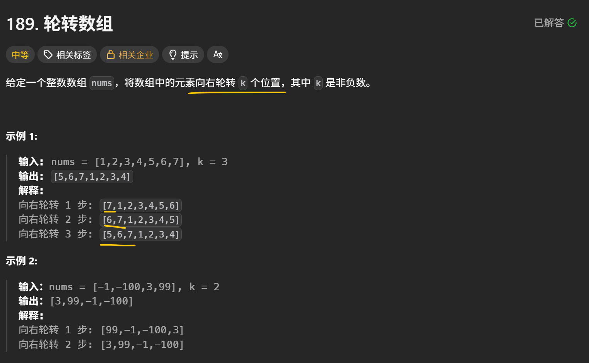

~~~C++
class Solution {
public:
    void rotate(vector<int>& nums, int k) {
        // [1,2,3,4,5,6,7] k = 3

        k = k % nums.size(); // 如果 k 超过nums.size()的话

        reverse(nums.begin(), nums.end());      // 整体反转      [7,6,5,4,3,2,1]
        reverse(nums.begin(), nums.begin() + k);// 反转前k个     [5,6,7,4,3,2,1]
        reverse(nums.begin() + k, nums.end());  // 反转k+1到最后 [5,6,7,1,2,3,4]
        
    }
};
~~~

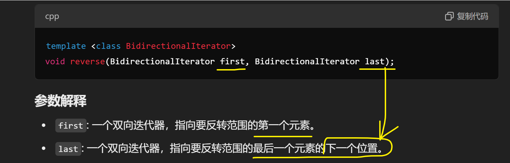

ACM

~~~c++
#include <iostream>
#include <vector>
#include <algorithm>

using namespace std;

// 轮转数组函数
void rotate(vector<int>& nums, int k)
{
    if (nums.size() == 0)   return;

    k = k % nums.size();

    // 三次反转
    reverse(nums.begin(), nums.end());
    reverse(nums.begin(), nums.begin() + k);
    reverse(nums.begin() + k, nums.end());
}

int main()
{
    int n, k;
    cin >> n >> k; // 输入数组长度 和轮转步数k

    vector<int> nums(n);
    for (int i = 0; i < n; i++)
    {
        cin >> nums[i]; // 输入数组元素
    }

    rotate(nums, k);

    for (int x : nums)
    {
        cout << x << " ";
    }
    cout << endl;

    return 0;
}
~~~

示例输入：

~~~c++
7 3
1 2 3 4 5 6 7
~~~

输出：
~~~
5 6 7 1 2 3 4
~~~

### [238 除自身以外数组的乘积](https://leetcode.cn/problems/product-of-array-except-self/description/?envType=study-plan-v2&envId=top-100-liked)

@前缀@后缀乘积

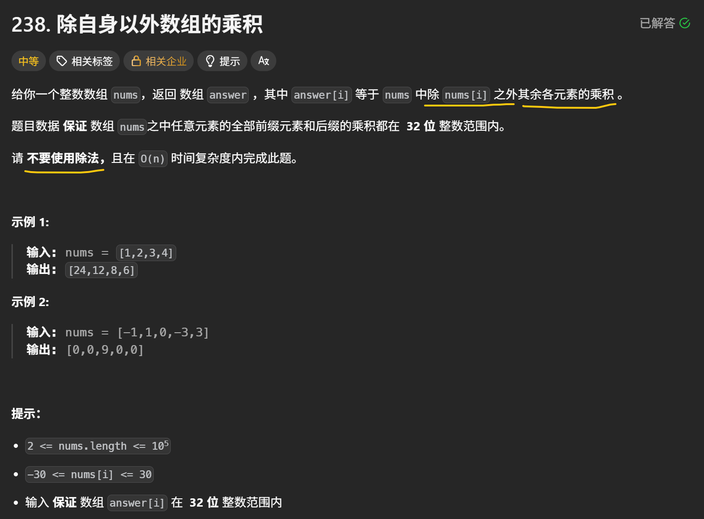

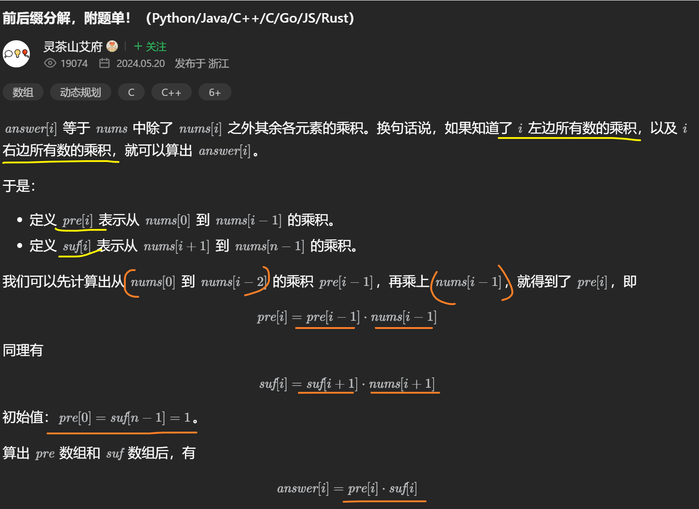

~~~C++
class Solution {
public:
    vector<int> productExceptSelf(vector<int>& nums) {

        // nums[i]前的乘积 * nums[i]后的乘积

        int n = nums.size();

        // nums[i]前的乘积  nums[0]*nums[1]*...*nums[i-1]
        vector<int> pre(n, 1);
        for (int i = 1; i < n; i++)
        {
            pre[i] = pre[i - 1] * nums[i - 1];
        }

        // nums[i]后的乘积 nums[i+1]*nums[i+2]*...*nums[n-1]
        vector<int> suf(n, 1);
        for (int i = n - 2; i >= 0; i--)
        {
            suf[i] = suf[i + 1] * nums[i + 1]; // 从后向前乘
        }

        vector<int> ans(n);
        for (int i = 0; i < n; i++)
        {
            ans[i] = pre[i] * suf[i];
        }

        return ans;
    }
};
~~~

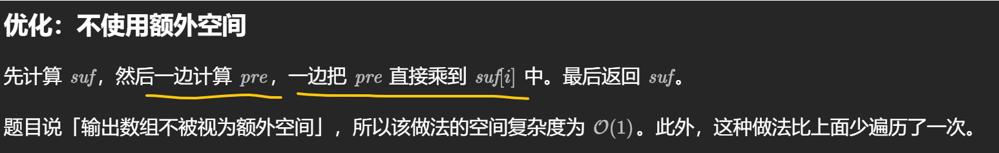

~~~C++
class Solution {
public:
    vector<int> productExceptSelf(vector<int>& nums) {

        // nums[i]前的乘积 * nums[i]后的乘积

        // 优化

        int n = nums.size();

        vector<int> suf(n);
        suf[n - 1] = 1;
        for (int i = n - 2; i >= 0; i--)
        {
            suf[i] = suf[i + 1] * nums[i + 1];
        }

        int pre = 1;
        for (int i = 0; i < n; i++)
        {
            // 此时 pre 为 nums[0] 到 nums[i-1] 的乘积，直接乘到 suf[i] 中
            suf[i] *= pre;
            pre *= nums[i];
        }

        return suf; // suf已经乘上了pre，就是ans
    }
};
~~~

ACM

~~~C++
#include <iostream>
#include <vector>

using namespace std;

vector<int> productExceptSelf(const vector<int>& nums)
{
    int n = nums.size();

    // nums[i]前的乘积 * nums[i]后的乘积

    // pre[i] = nums[0]*nums[1]*...*nums[i-1]
    vector<int> pre(n, 1);
    for (int i = 1; i < n; i++)
    {
        pre[i] = pre[i - 1] * nums[i - 1];
    }

    // suf[i] = nums[i+1]*nums[i+2]*...*nums[n-1]
    vector<int> suf(n, 1);
    for (int i = n - 2; i >= 0; i--)
    {
        suf[i]  = suf[i + 1] * nums[i + 1]; // 从后向前乘
    }

    vector<int> ans(n);
    for (int i = 0; i < n; i++)
    {
        ans[i] = pre[i] * suf[i];
    }

    return ans;
}

int main()
{
    int n;
    cin >> n;// nums元素个数

    vector<int> nums(n);
    for (int i = 0; i < n; i++)
    {
        cin >> nums[i];// 输入数组
    }

    vector<int> result = productExceptSelf(nums);
    for (int x : result)
    {
        cout << x << " ";
    }
    cout << endl;

    return 0;
}
~~~

示例输入：

~~~C++
4
1 2 3 4
~~~

输出：

~~~C++
24 12 8 6
~~~

# 代码随想录和其他

## 数组

### [704、二分查找](https://leetcode.cn/problems/binary-search/)

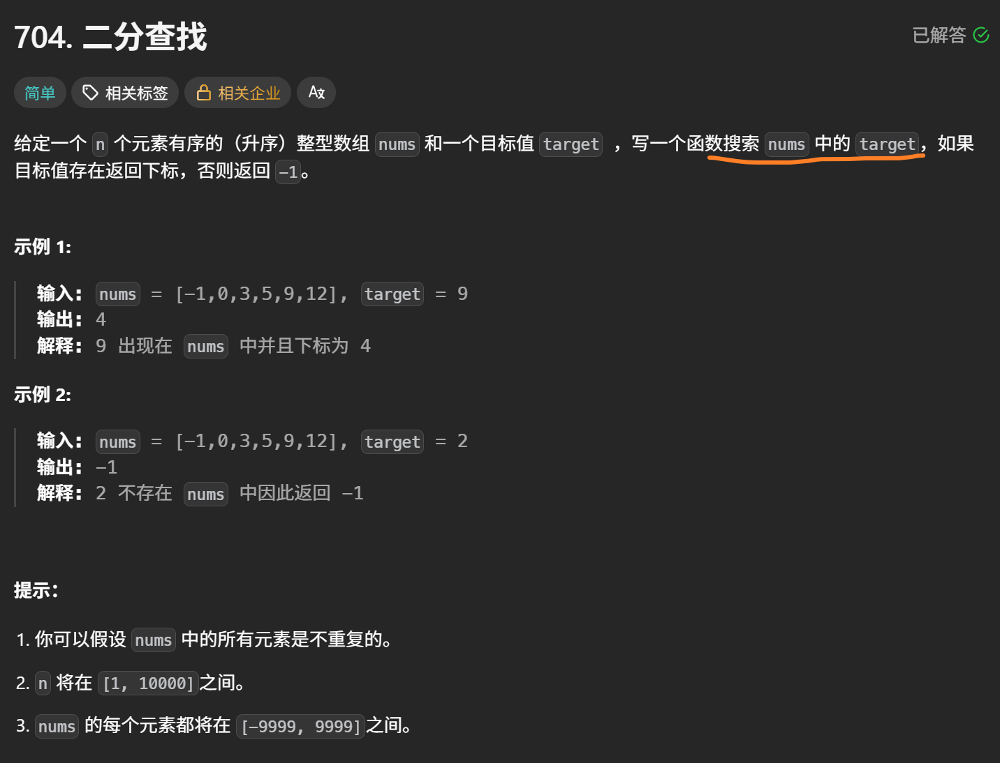

注意区间的开闭！

~~~C++
class Solution {
public:
    int search(vector<int>& nums, int target) {
        int left = 0;
        int right = nums.size() - 1;// 定义target在左闭右闭的区间里 [left, right]

        while (left <= right) {
            int mid = left + ((right - left) / 2);// 防止溢出，等同于(left + right)/2
            // target在左区间
            if (nums[mid] > target) {
                right = mid - 1; // [left, mid - 1]
            }
            // target在右区间
            else if (nums[mid] < target) {
                left = mid + 1; // [mid + 1, right]
            }
            // nums[mid] = target 找到目标值
            else {
                return mid;
            }
        }

        return -1; // 未找到目标值
    }
};
~~~

acm模式：

~~~C++
#include <iostream>
#include <vector>
using namespace std;

int search(vector<int>& nums, int target)
{
	int left = 0;
	int right = nums.size();

	while (left <= right)
	{
		int mid = left + ((right - left) / 2);
		if (nums[mid] > target) {
			right = mid - 1; // [left, mid - 1]
		}
		else if (nums[mid] < target) {
			left = mid + 1; // [mid + 1, right]
		} 
		else {
            return mid;
		}
	}

	return -1;

} 

int main() 
{ 
	int n, target; // 数组长度n， 目标值target
	// 输入数组长度，目标值
	cin >> n >> target; 

	vector<int> nums(n);
	// 输入数组
    for (int i = 0; i < n; i++) {
		cin >> nums[i];
	}

	int result = search(nums, target);
    cout << result << endl;

	return 0;
}
~~~

示例输入：

~~~C++
6 9
-1 0 3 5 9 12
~~~

示例输出：

~~~C++
4
~~~

### [27 移除元素（双指针）](https://leetcode.cn/problems/remove-element/description/)

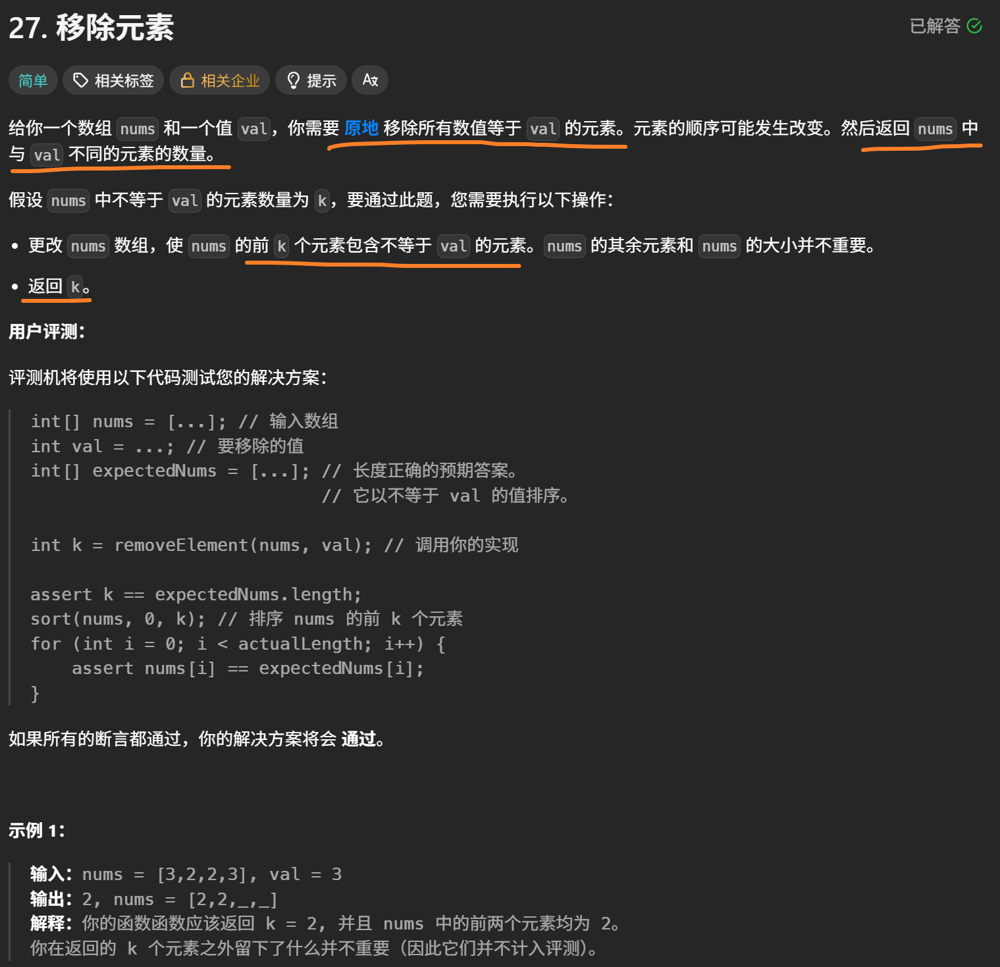

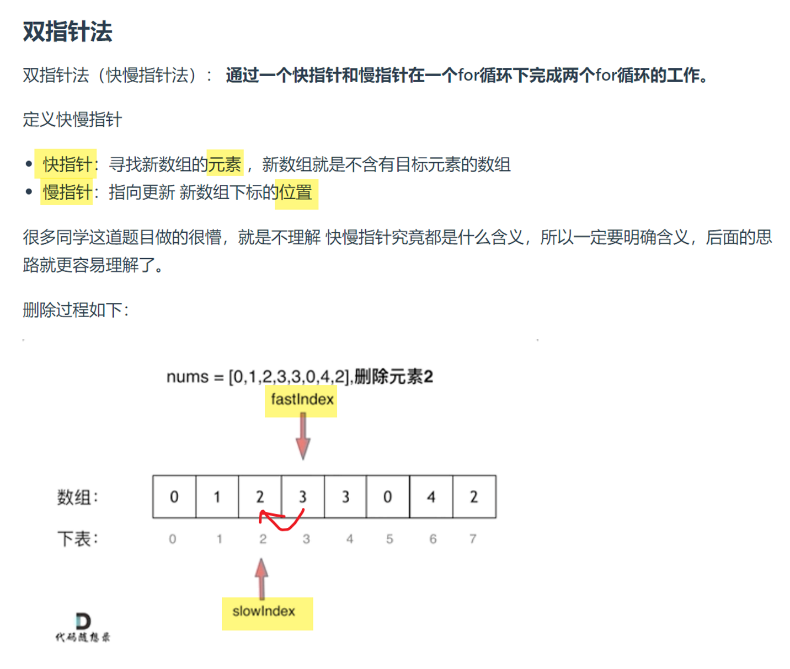

~~~C++
class Solution {
public:
    int removeElement(vector<int>& nums, int val) {

        // 快慢指针

        int slow = 0;
        for (int fast = 0; fast < nums.size(); fast++)
        {
            if (nums[fast] != val)
            {
                // fast 对应的值 不等于val时，赋值给slow对应的位置
                nums[slow] = nums[fast];
                slow++;
            }
            // fast对应位置 = val时，不更新，slow不懂，fast++
        }

        return slow; // nums中不等于val的元素个数
    }
};
~~~

ACM

~~~C++
#include <iostream>
#include <vector>
using namespace std;

// 功能函数：移除元素 val，返回新长度
int removeElement(vector<int>& nums, int val) {
    int slow = 0;
    for (int fast = 0; fast < nums.size(); ++fast) {
        if (nums[fast] != val) {
            nums[slow++] = nums[fast];
        }
    }
    return slow;
}

int main() {
    int n, val;
    cin >> n >> val; // 输入数组大小和目标值
    vector<int> nums(n);

    for (int i = 0; i < n; ++i) {
        cin >> nums[i]; // 输入数组元素
    }

    int newLength = removeElement(nums, val);

    // 输出结果：移除目标值后的前 newLength 项
    for (int i = 0; i < newLength; ++i) {
        cout << nums[i] << " ";
    }
    cout << endl;

    return 0;
}

~~~

示例输入：

~~~C++
6 3
3 2 2 3 4 5
~~~

输出：

~~~C++
2 2 4 5
~~~

## 前缀和

### [303 区域和检索 - 数组不可变](https://leetcode.cn/problems/range-sum-query-immutable/description/)

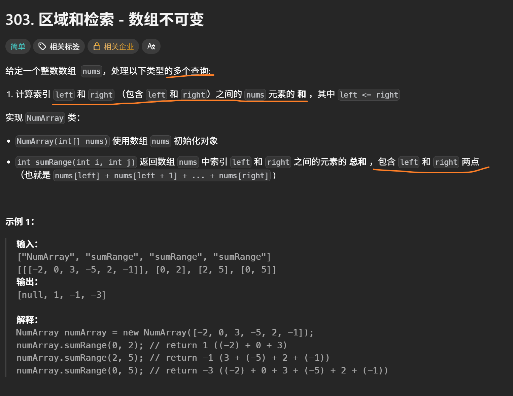

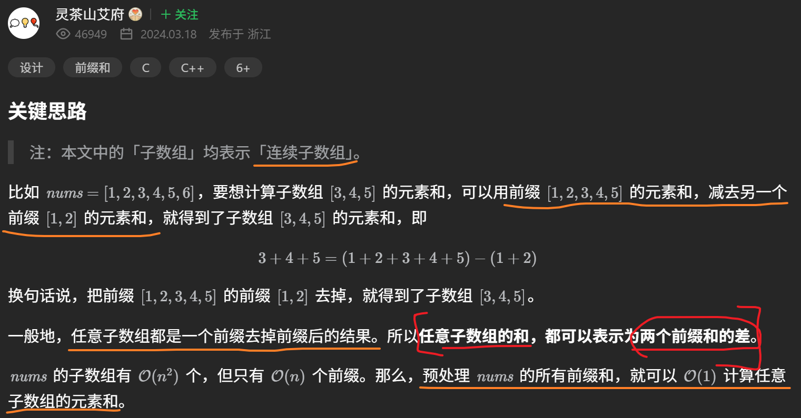

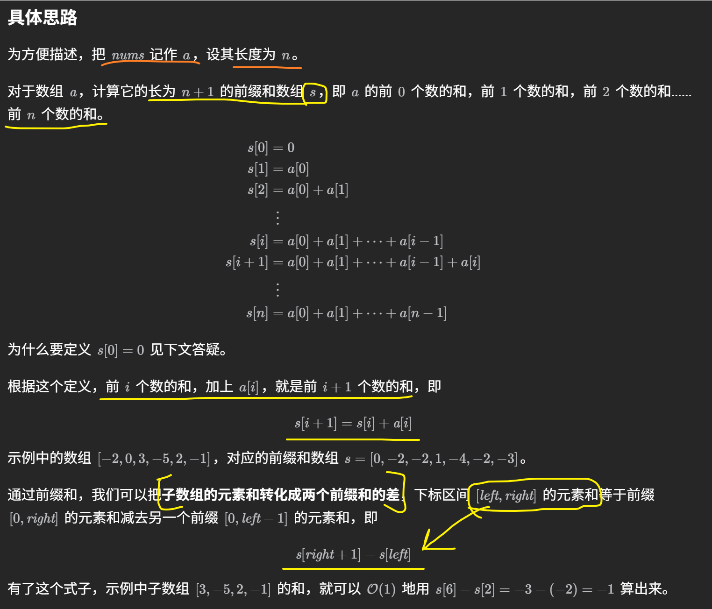

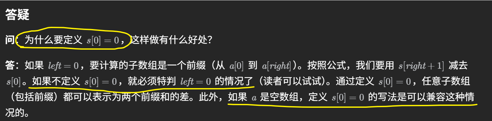

~~~C++
class NumArray {
    vector<int> s;

public:
    NumArray(vector<int>& nums) {
        s.resize(nums.size() + 1);
        for (int i = 0; i < nums.size(); i++)
        {
            s[i + 1] = s[i] + nums[i]; // 前缀和
        }
    }
    
    int sumRange(int left, int right) {
        return s[right + 1] - s[left];// nums中 [left, right] 部分的和        
    }
};

/**
 * Your NumArray object will be instantiated and called as such:
 * NumArray* obj = new NumArray(nums);
 * int param_1 = obj->sumRange(left,right);
 */
~~~

## 链表

## 哈希

## 字符串

## 滑动窗口

## 双指针

## 栈和队列

### [239 滑动窗口最大值](https://leetcode.cn/problems/sliding-window-maximum/description/?envType=study-plan-v2&envId=top-100-liked)

@单调队列

~~~C++
class Solution {
private:
    // deque实现单调队列 从大到小
    class MyQueue
    {
    public:
        deque<int> que; // 使用deque实现单调队列

        // push
        void push(int value)
        {
            // 即将放进que的value > back入口数值，就将que后端的数值弹出，直到value < 入口
            // 保证队列前面都是比value大的值，才能从大到小
            while (!que.empty() && value > que.back())  que.pop_back();
            que.push_back(value);
        }

        // pop
        void pop(int value)
        {
            // 每次pop比较要弹出的数值，是否等于que出口的数值，如果相等则弹出
            if (!que.empty() && value == que.front())   que.pop_front();
        }

        // getMaxvalue 查询当前队列里的最大值，直接返回que的front
        int getMax()
        {
            return que.front();
        }
    };

public:
    vector<int> maxSlidingWindow(vector<int>& nums, int k) {

        vector<int> result;

        MyQueue que; // 创建单调队列
        
        // 前k个元素（第一个窗口）放入que
        for (int i = 0; i < k; i++)
        {
            que.push(nums[i]); // push的时候已经保证了单调
        }
        result.push_back(que.getMax()); // result 记录第一个窗口最大值

        // 继续计算后面的窗口
        for (int i = k; i < nums.size(); i++)
        {
            que.pop(nums[i - k]); // 移动窗口，pop出que中当前窗口的第一个元素
            que.push(nums[i]); // 新元素push进新窗口

            result.push_back(que.getMax()); // 记录当前窗口内的最大值
        }
        
        return result;
        
    }
};
~~~

ACM

~~~C++
#include <iostream>
#include <deque>
#include <vector>

using namespace std;

// 单调队列类
class MyQueue
{
public:
    deque<int> que;
    
    // push 保证从大到小
    void push(int value)
    {
        while (!que.empty() && value > que.back()) // 如果value > que.back() 就弹出原来较小的back
        {
            que.pop_back();
        }
        que.push_back(value); // 新值放进去，队列前面是比value大的值，才能从大到小
    }

    // pop 窗口滑出元素与队头相等时弹出
    void pop(int value)
    {
        if (!que.empty() && value == que.front())
        {
            que.pop_front();
        }
    }

    // getMax 返回当前窗口的最大值（就是队列的front）
    int getMax()
    {
        return que.front();
    }

};

// 返回滑动窗口中的最大值
vector<int> maxSlidingWindow(const vector<int>& nums, int k)
{
    vector<int> result;
    MyQueue que;

    // 初始化前k个元素（第一个窗口）
    for (int i = 0; i < k; i++)
    {
        que.push(nums[i]);
    }
    result.push_back(que.getMax());

    // 开始滑动窗口
    for (int i = k; i < nums.size(); i++)
    {
        que.pop(nums[i - k]);
        que.push(nums[i]);
        result.push_back(que.getMax());
    }

    return result;
}

int main()
{
    int n, k;
    cin >> n >> k; // 输入nums元素个数，和窗口大小k

    vector<int> nums(n);
    for (int i = 0; i < n; i++)
    {
        cin >> nums[i]; // 输入nums元素
    }

    vector<int> ans = maxSlidingWindow(nums, k);
    for (int x : ans)
    {
        cout << x << " ";
    }
    cout << endl;

    return 0;
}
~~~

示例输入：

~~~C++
8 3 
1 3 -1 -3 5 3 6 7
~~~

输出：

~~~C++
3 3 5 5 6 7 
~~~

## 二叉树

## 回溯

## 贪心

## 动态规划DP

## 单调栈

