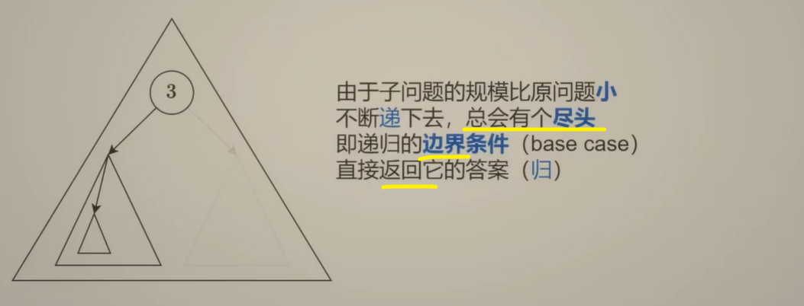
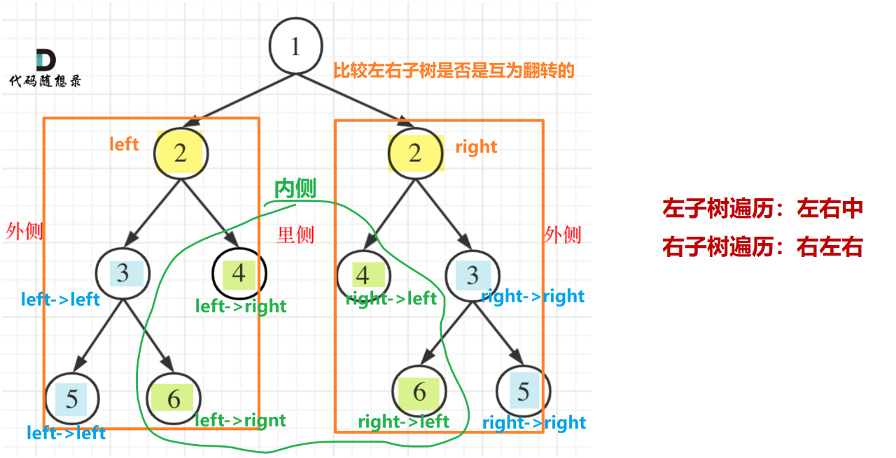

> 力扣刷题总结，主要参考[代码随想录](https://programmercarl.com/)和力扣题解区各位大神的题解以及gpt，总结力扣核心代码模式和acm两种模式。

# 力扣hot100

## 哈希 ✅

> ***需要查询一个元素是否出现过，或者一个元素是否在集合里的时候，就要第一时间想到哈希法***

### [1 两数之和](https://leetcode.cn/problems/two-sum/description/?envType=study-plan-v2&envId=top-100-liked)

@哈希 @数组


遍历数组，需要一个集合存放【遍历过的元素】，在遍历数组nums的时候，同时去这个组合中寻找，某元素【 target - 当前遍历元素 nums[i] 】是否出现过。

因为最后要找到这个元素是否出现过，还需要得到这个元素的下标，需要使用key-value结构存放：

**< key: 元素nums[i]， value：下标 i >**

判断元素是否出现过，那么元素就要作为key，通过元素找下标，下标作为value。

> std::unordered_map 底层实现为哈希表，std::map 和std::multimap 的底层实现是红黑树。
>
> std::map 和std::multimap 的key也是有序的,**这道题目中并不需要key有序，选择std::unordered_map 效率更高！** 

整体遍历数组nums，遍历过的元素存到map中，**对每一个nums[i]去判断 【target - nums[i]】是否在map中**

- 如果在，说明在前面出现了满足【和nums[i]相加为target】的元素，即找到符合条件的一对元素组合。
- 如果不在，说明前面没有出现【和nums[i]相加为target】的元素，就把nums[i]放进map，等待下面的元素


~~~C++
class Solution {
public:
    vector<int> twoSum(vector<int>& nums, int target) {
        
        // unordered_map 不重复 无序key 存放遍历过的元素
        unordered_map<int, int> umap; // < nums[i], 下标 i>

        for (int i = 0; i < nums.size(); i++)
        {
            //find 查找 target - nums[i] 在不在 umap中
            if (umap.find(target - nums[i]) != umap.end()) 
            {
                return {umap[target - nums[i]], i}; // 找到，直接返回下标数组
            }
            umap.insert(pair<int, int>(nums[i], i));// 没找到，就存到umap里
        }

        return {}; // 没符合条件的，返回空数组
        
    }
};
~~~


acm模式：

~~~C++
#include <iostream>
#include <vector>
#include <unordered_map>

using namespace std;

vector<int> twoSum(vector<int>& nums, int target)
{
	unordered_map<int, int> umap;
	for (int i = 0; i < nums.size(); i++)
	{
		if (umap.find(target - nums[i]) != umap.end())
		{
			return { umap[target - nums[i]], i };
		}
		umap.insert(pair<int, int>(nums[i], i));
	}
	
	return {};
}

int main() {
	int n, target; // 数组长度n，目标值target
	cin >> n >> target;
	vector<int> nums(n);

	for (int i = 0; i < n; i++) {
		cin >> nums[i]; // 输入数组元素
	}

	vector<int> result = twoSum(nums, target);

	if (!result.empty()) {
		cout << result[0] << " " << result[1] << endl;
	}
	else {
		cout << "No result" << endl;
	}

	return 0;

}
~~~

 示例输入：

~~~C++
4 9
2 7 11 15
~~~

示例输出：

~~~C++
0 1
~~~


### [49 字母异位词分组](https://leetcode.cn/problems/group-anagrams/description/?envType=study-plan-v2&envId=top-100-liked)


~~~C++
class Solution {
public:
    vector<vector<string>> groupAnagrams(vector<string>& strs) {

        // 哈希 
        // key: 排序后的字符串（异位词排序后结果相同）
        // value: 原始字符串组成的列表（属于同一组的异位词组合）--> 即答案

        unordered_map<string, vector<string>> umap;

        for (string& s : strs)
        {
            // 排序strs中每一个字符串
            string sorted_s = s;
            ranges::sort(sorted_s);// 按照ASCII值排序s，排序后异位词会变成相同的字符串

            // sorted_s 相同的原字符串，归到一组
            umap[sorted_s].push_back(s);
        }

        // 整理返回的字符串数组
        vector<vector<string>> ans;
        ans.reserve(umap.size()); // 预分配空间

        for (auto& [_, value] : umap) // 遍历umap，解构umap，只关心value的值
        {
            ans.push_back(value); // 每个分组列表加入结果
        }

        return ans;    
    }
};
~~~


ACM

~~~C++
#include <iostream>
#include <vector>
#include <string>
#include <unordered_map>
#include <algorithm>

using namespace std;

vector<vector<string>> groupAnagrams(const vector<string>& strs)
{
    unordered_map<string, vector<string>> umap;

    for (const string& s : strs)
    {
        string sorted_s = s;
        // 排序 分组
        sort(sorted_s.begin(), sorted_s.end()); // 或者ranges::sort(sorted_s);
        umap[sorted_s].push_back(s);
    }

    vector<vector<string>> ans;
    ans.reserve(umap.size());
    for (auto& [_, value] : umap) 
    {
        ans.push_back(value);
    }

    return ans;
}

int main()
{
    int n; // 字符串数量
    cin >> n;
    vector<string> inputStr(n); // 字符串
    for (int i = 0; i < n; i++)
    {
        cin >> inputStr[i];
    }

    // 调用函数
    vector<vector<string>> result = groupAnagrams(inputStr);

    // 输出
    for (const auto& group : result)
    {
        for (const string& word : group)
        {
            cout << word << " ";
        }
        cout << endl;
    }

    return 0;
}
~~~

示例输入：

~~~C++
6
eat tea tan ate nat bat
~~~

示例输出：

~~~C++
eat tea ate 
tan nat 
bat 
~~~


### [128 最长连续序列](https://leetcode.cn/problems/longest-consecutive-sequence/?envType=study-plan-v2&envId=top-100-liked)


`contains()` 是 C++20 引入的成员函数，用于判断某个元素是否存在于关联容器中。

将数组 nums 中的所有元素存入一个哈希集合 st，这样可以在 **O(1)** 时间内判断某个数是否存在。


~~~C++
class Solution {
public:
    int longestConsecutive(vector<int>& nums) {

        int ans = 0;

        // 把nums转成哈希集合 （无序不重复）
        unordered_set<int> st(nums.begin(), nums.end());

        // 注意：这里遍历的是集合，不是原数组
        for (int x : st)
        {
            // 如果 x-1 在集合中，说明 x 不是某个连续序列的起点，跳过
            if (st.contains(x - 1))
            {
                continue;
            }

            // x 是序列的起点
            int y = x + 1;
            while (st.contains(y)) // 不断向后查找下一个数是否在哈希集合中
            {
                y++;
            }

            // 一直找知道找不到下一个连续的数为止，此时的 y 是第一个不在集合中的数
            // y - 1 就是最后一个在哈希集合中的数

            // 更新长度
            ans = max(ans, y - x); // [x, y-1]是一个连续序列，长度是 y - x
        }

        return ans;
    }
};
~~~

ACM 模式：

~~~C++
#include <vector>
#include <unordered_set>
#include <iostream>
#include <algorithm>


int longestConsecutive(const std::vector<int>& nums)
{
    int ans = 0;

    std::unordered_set<int> st(nums.begin(), nums.end()); // 无序不重复
    for (int x : st)
    {
        // 如果 x 不是连续序列的起点，跳过
        if (st.find(x - 1) != st.end())
        {
            continue;
        }
        // x 是连续序列的起点，不断向后寻找下一个数
        int y = x + 1;
        while (st.find(y) != st.end())
        {
            y++;
        }

        ans = std::max(ans, y - x); // 更新连续序列最大长度
    }

    return ans;
}


int main()
{
    int n;
    std::cin >> n; // 输入数字个数

    std::vector<int> nums(n);
    for (int i = 0; i < n; i++)
    {
        std::cin >> nums[i]; // 输入数组 nums
    }

    int result = longestConsecutive(nums);
    std::cout << result << std::endl;

    return 0;
}
~~~


## 双指针 ✅

### [283 移动零（快慢指针）](https://leetcode.cn/problems/move-zeroes/?envType=study-plan-v2&envId=top-100-liked)

@快慢指针


**和 27、移除元素 相同，多一步slow及slow之后置零**

~~~C++
class Solution {
public:
    void moveZeroes(vector<int>& nums) {
        // 快慢指针

        int slowIndex = 0;
        int fastIndex = 0;

        for (fastIndex = 0; fastIndex < nums.size(); fastIndex++)
        {
            if (nums[fastIndex] != 0)
            {
                nums[slowIndex++] = nums[fastIndex]; // 覆盖 0
            }
        }

        // 将slowIndex及slowIndex之后的元素都置零
        for (int i = slowIndex; i < nums.size(); i++)
        {
            nums[i] = 0;
        }

    }
};
~~~


ACM

~~~C++
#include <iostream>
#include <vector>

using namespace std;

void moveZero(vector<int>& nums)
{
    int slowIndex = 0;
    int fastIndex = 0;

    for (fastIndex = 0; fastIndex < nums.size(); fastIndex++)
    {
        if (nums[fastIndex] != 0)
        {
            nums[slowIndex++] = nums[fastIndex]; // 原地向前覆盖0
        }
    }

    for (int i = slowIndex; i < nums.size(); i++)
    {
        nums[i] = 0;
    }
}


int main() 
{
    int n;
    cin >> n; // 输入数组个数

    vector<int> nums(n);
    for (int i = 0; i < n; i++)
    {
        cin >> nums[i]; // 输入数组元素
    }

    moveZero(nums); // 移动 0

    for (int i = 0; i < n; i++)
    {
        cout << nums[i] << " "; // 输出移动0后的nums
    }
    cout << endl;

    return 0;
}
~~~

示例输入：

~~~C++
6
0 1 0 3 12 0
~~~

输出：

~~~C++
1 3 12 0 0 0
~~~


### [11 盛最多水的容器（收缩）](https://leetcode.cn/problems/container-with-most-water/description/?envType=study-plan-v2&envId=top-100-liked)


~~~C++
class Solution {
public:
    int maxArea(vector<int>& height) {

        // 双指针 收缩
        
        int ans = 0;

        int left = 0;
        int right = height.size() - 1;

        while(left < right) // 只要 left < right 就还能构成矩形面积
        {
            int area = (right - left) * min(height[left], height[right]); // 矩形面积
            ans = max(ans, area); // ans保持最大值

            // 移动短边
            height[left] < height[right] ? left++ : right--;

            // 因为短边能构成的最大的面积，就是area
        }
        
        return ans;
    }
};
~~~


ACM

~~~C++
#include <iostream>
#include <vector>

using namespace std;

int maxArea(vector<int>& height)
{
    int ans = 0;

    int left = 0;
    int right = height.size() - 1;

    while (left < right)
    {
        int area = (right - left) * min(height[left], height[right]);
        ans = max(ans, area);

        // 移动短边
        height[left] < height[right] ? left++ : right--;
    }

    return ans;
}

int main()
{
    int n;
    cin >> n; // height数组长度（柱子数量）

    vector<int> height(n);
    for (int i = 0; i < n; i++)
    {
        cin >> height[i]; // 输入每根柱子的高度
    }

    int result = maxArea(height);
    cout << result << endl; // 输出最大盛水面积

    return 0;
}
~~~

示例输入：

~~~C++
9
1 8 6 2 5 4 8 3 7
~~~

输出：

~~~C++
49
~~~


### [15 三数之和（收缩）](https://leetcode.cn/problems/3sum/description/?envType=study-plan-v2&envId=top-100-liked)

@双指针收缩


~~~C++
class Solution {
public:
    vector<vector<int>> threeSum(vector<int>& nums) {

        // 双指针 收缩

        vector<vector<int>> result;

        // 排序nums
        sort(nums.begin(), nums.end());

        // a = nums[i]  b = nums[left]   c = nums[right]
        for (int i = 0; i < nums.size(); i++)
        {
            // 排序后第一个元素已经大于0，不可能凑成三元组
            if (nums[i] > 0)    break;
            
            // 去重 a
            // 如果i和i-1元素相同，说明后面遍历组合的三数之和在nums[i-1]的时候被组合过了，跳过
            if (i > 0 && nums[i] == nums[i - 1])    continue;

            // 移动left right 判断三数之和
            int left = i + 1;
            int right = nums.size() - 1;
            while(left < right)
            {
                // 三数之和 > 0，right向左移动，让和变小
                if (nums[i] + nums[left] + nums[right] > 0) right--;
                // 三数之和 < 0，left向右移动，让和变大
                else if (nums[i] + nums[left] + nums[right] < 0) left++;
                // 三数之和 = 0，找到一个三元组
                else 
                {
                    // 收集三元组
                    result.push_back(vector<int>{nums[i], nums[left], nums[right]});
                    // 去重b和c，向里收缩
                    while (right > left && nums[right] == nums[right - 1])
                    {
                        right--;
                    }
                    while (right > left && nums[left] == nums[left + 1])
                    {
                        left++;
                    }
                    
                    // 找到一组三元组后，left和right同时向里收缩，寻找下一组
                    right--;
                    left++;

                }
            }
        }

        return result;        
    }
};
~~~


ACM

~~~C++
#include <iostream>
#include <vector>
#include <algorithm>

using namespace std;

vector<vector<int>> threeSum(vector<int>& nums) 
{
    vector<vector<int>> result;
    
    // 排序nums
    sort(nums.begin(), nums.end());

    // a = nums[i]  b = nums[left]   c = nums[right]
    for (int i = 0; i < nums.size(); i++)
    {
        // 排序后第一个元素已经大于0，不可能凑成三元组
        if (nums[i] > 0)    break;
        
        // 去重 a
        if (i > 0 && nums[i] == nums[i - 1])    continue;

        // 移动left right 判断三数之和
        int left = i + 1;
        int right = nums.size() - 1;
        while(left < right)
        {
            if (nums[i] + nums[left] + nums[right] > 0) right--;
            else if (nums[i] + nums[left] + nums[right] < 0) left++;
            else // 三数之和 = 0，找到一个三元组
            {
                // 收集三元组
                result.push_back(vector<int>{nums[i], nums[left], nums[right]});
                // 去重b和c，向里收缩
                while (right > left && nums[right] == nums[right - 1])
                {
                    right--;
                }
                while (right > left && nums[left] == nums[left + 1])
                {
                    left++;
                }
                // 找到一组三元组后，left和right同时向里收缩，寻找下一组
                right--;
                left++;
            }
        }
    }
    return result;        
}


int main()
{
    int n;
    cin >> n; // nums数组长度

    vector<int> nums(n);
    for (int i = 0; i < n; i++)
    {
        cin >> nums[i]; // 输入nums数组
    }

    vector<vector<int>> result = threeSum(nums);

    for (int i = 0; i < result.size(); i++)
    {
        for (int j = 0; j < result[i].size(); j++)
        {
            cout << result[i][j] << " ";
        }
        cout << endl;
    }
    
    return 0;
}
~~~


### [42 接雨水](https://leetcode.cn/problems/trapping-rain-water/description/?envType=study-plan-v2&envId=top-100-liked)

@前缀和 @双指针收缩


#### 方法一、前后缀分离

分割成每个height[i]一块，把每块看成是宽度是1，高度为height[i] 的水桶，能盛多少水，**取决于左右两边挡板的短板有多高**，也就是当前height[i]前后的最高高度取小值。


height[i] 的【左边最高高度，右边最高高度】取最小值，再减去height[i] 就是当前这个块能盛的水的高度，也即面积（底部宽度为1）。

~~~C++
ans += min(pre_max[i], suf_max[i]) - height[i]; // 每块的面积，宽度是1
~~~

~~~C++
class Solution {
public:
    int trap(vector<int>& height) {
        
        // 前后缀分离
		// 时间复杂度 O(n)   空间复杂度 O(n)
        int n = height.size();

        vector<int> pre_max(n); // 从 height[0] 到 height[i] 的最大值，从前向后
        pre_max[0] = height[0];
        for (int i = 1; i < n; i++)
        {
            pre_max[i] = max(pre_max[i - 1], height[i]);
        }

        vector<int> suf_max(n); // 从 height[n-1] 到 height[i] 的最大值，从后向前
        suf_max[n - 1] = height[n - 1];
        for (int i = n - 2; i >= 0; i--)
        {
            suf_max[i] = max(suf_max[i + 1], height[i]);
        }

        int ans = 0;
        for (int i = 0; i < n; i++)
        {
            // 取 前缀后缀的较小值 - height[i] 作为当前盛水的高度
            ans += min(pre_max[i], suf_max[i]) - height[i]; // 每块的面积，宽度是1
        }

        return ans;
    }
};
~~~


ACM：

~~~C++
#include <iostream>
#include <vector>
#include <algorithm>

using namespace std;

int trap(vector<int>& height) 
{
    int n = height.size();

    // 前缀最大值
    vector<int> pre_max(n);
    pre_max[0] = height[0];
    for (int i = 1; i < n; i++)
    {
        pre_max[i] = max(pre_max[i - 1], height[i]);
    }
    // 后缀最大值
    vector<int> suf_max(n);
    suf_max[n - 1] = height[n - 1];
    for (int i = n - 2; i >= 0; i--)
    {
        suf_max[i] = max(suf_max[i + 1], height[i]);
    }

    int ans = 0;
    for (int i = 0; i < n; i++)
    {
        ans += min(suf_max[i], pre_max[i]) - height[i]; // 累加面积
    }
    return ans;
    
}

int main()
{
    int n;
    cin >> n; // 输入height长度

    vector<int> height(n);
    for (int i = 0; i < n; i++)
    {
        cin >> height[i]; // 输入height数组
    }

    int result = trap(height);
    cout << result << endl;

    return 0;
}
~~~

示例输入：

~~~C++
12
0 1 0 2 1 0 1 3 2 1 2 1
~~~

输出：

~~~C++
6
~~~


#### 方法二、相向双指针


**总结：**接水多少由短的木板决定，left right指针向中间收缩

接水的高度由前缀最大值和后缀最大值中的**较小值**决定，左右指针谁小谁移动，相遇位置会是最高

- 如果**前缀最大值 < 后缀最大值**，这个木桶的容量就是**前缀最大值-height[left]**，算完之后left指针**向右**；
- 如果**后缀最大值 < 前缀最大值**，这个木桶的容量就是**后缀最大值-height[right]**，算完之后right指针**向左**

~~~C++
class Solution {
public:
    int trap(vector<int>& height) {

        // 相向双指针
        // 时间复杂度 O(n)   空间复杂度 O(1)
        int ans = 0;

        int left = 0, right = height.size() - 1; // 左右指针，向中间移动

        int pre_max = 0, suf_max = 0; // 前后缀最大值

        while (left < right) // 可以不加等号，因为在「谁小移动谁」的规则下，相遇的位置一定是最高的柱子，这个柱子是无法接水的
        {
            pre_max = max(pre_max, height[left]);
            suf_max = max(suf_max, height[right]);

            // 找能确定的较短的柱子
            if (pre_max < suf_max)
            {
                ans += pre_max - height[left];
                left++; 
            }
            else
            {
                ans += suf_max - height[right];
                right--;
            }
        }

        return ans;        
    }
};
~~~


## 滑动窗口 ✅

### [3 无重复字符的最长子串](https://leetcode.cn/problems/longest-substring-without-repeating-characters/description/?envType=study-plan-v2&envId=top-100-liked)

@滑动窗口


~~~C++
class Solution {
public:
    int lengthOfLongestSubstring(string s) {

        int n = s.size();
        int ans = 0; // 窗口长度，即最长不重复子串长度

        // 窗口 [left, right]
        int left = 0;
        int right = 0;

        unordered_map<char, int> cnt; // cnt <出现的字符，字符出现的次数>

        for (right = 0; right < n; right++) // right++, 窗口右移
        { 
            char c = s[right];
            cnt[c]++; // 遇到的字符，次数+1

            // cnt[c] > 1 说明有重复字符
            while (cnt[c] > 1)
            {
                cnt[s[left]]--; // 左边界收缩，去除一个左边界字符的数量
                left++; // 缩小窗口
            }

            ans = max(ans, right - left + 1); // 更新窗口长度最大值
        }

        return ans;    
    }
};
~~~


ACM 

~~~C++
#include <iostream>
#include <string>
#include <unordered_map>

using namespace std;

int lengthOfLongestSubstring(const string& s)
{
    int ans = 0;

    int left = 0; 
    int right = 0;

    unordered_map<char, int> cnt; // <字符，字符出现次数>

    for (right = 0; right < s.size(); right++)
    {
        char c = s[right];
        cnt[c]++; // 统计字符出现次数

        while (cnt[c] > 1)
        {
            cnt[s[left]]--;
            left++;
        }

        ans = max(ans, right - left + 1);
    }

    return ans;
}

int main()
{
    string s;
    cin >> s; // 输入字符串

    int result = lengthOfLongestSubstring(s);
    cout << result << endl;

    return 0;
}
~~~

示例输入：

~~~C++
abcabcbb
~~~

输出：

~~~C++
3
~~~


### [438 找到字符串中所有的字母异位词](https://leetcode.cn/problems/find-all-anagrams-in-a-string/description/?envType=study-plan-v2&envId=top-100-liked)

@滑动窗口


#### 方法一、定长窗口（推荐）


~~~C++
class Solution {
public:
    vector<int> findAnagrams(string s, string p) { // s = "cbaebabacd", p = "abc"

        // 定长滑动窗口s'  窗口长度是p.size()

        vector<int> ans;

        vector<int> cnt_p(26); // p 中的每个字母出现次数
        vector<int> cnt_s(26); // 窗口子串 s'的每个字母出现次数

        for (char c : p)
        {
            cnt_p[c - 'a']++; // 字母对应下标位置的数++
        }

        for (int right = 0; right < s.size(); right++) // 右边界++
        {
            cnt_s[s[right] - 'a']++; // 右边界字母进入窗口 s'
            int left = right - p.size() + 1;// 左边界 窗口长度是p.size()

            // 窗口长度不够p.size() 跳过
            if (left < 0)   continue; 

            // s'和 p 的每种字母出现次数相同，收集结果
            if (cnt_s == cnt_p)
            {
                ans.push_back(left); // s'的左边界下标加入结果
            }

            cnt_s[s[left] - 'a']--; // 接下来进入下一组s', 左边界字母离开窗口，次数--
        }

        return ans;  
    }
};
~~~


ACM

~~~C++
#include <vector>
#include <string>
#include <iostream>

using namespace std;

// s = "cbaebabacd", p = "abc"
vector<int> findAnagrams(const string& s, const string& p)
{
    vector<int> ans;

    vector<int> cnt_s(26);
    vector<int> cnt_p(26);

    for (char c : p)
    {
        cnt_p[c - 'a']++;
    }

    for (int right = 0; right < s.size(); right++)
    {
        cnt_s[s[right] - 'a']++;
        int left = right - p.size() + 1;

        if(left < 0)    continue;

        if (cnt_s == cnt_p)
        {
            ans.push_back(left);
        }

        cnt_s[s[left] - 'a']--;
    }

    return ans;
}


int main()
{
    string s;
    string p;
    cin >> s >> p; // 输入字符串 s p

    vector<int> result = findAnagrams(s, p);
    for (int idx : result)
    {
        cout << idx << " ";
    }
    cout << endl;
    
    return 0;
}
~~~

示例输入：

~~~C++
cbaebabacd abc
~~~

输出：

~~~C++
0 6
~~~


#### 方法二、变长窗口


~~~C++
class Solution {
public:
    vector<int> findAnagrams(string s, string p) { // s = "cbaebabacd", p = "abc"

        // 不定长窗口

        vector<int> ans;

        vector<int> cnt(26); // 统计字母，合并了 cnt_s 和 cnt_p

        for (char c : p)
        {
            cnt[c - 'a']++;
        }

        int left = 0;
        for (int right = 0; right < s.size(); right++)
        {
            int c = s[right] - 'a';
            cnt[c]--; // 右端字符进入窗口，消去对应字符在cnt中的个数

            // 窗口里cnt[c]对应字符消去太多了，超过了p的需求，收缩左边界，直到cnt>=0
            while (cnt[c] < 0)
            {
                cnt[s[left] - 'a']++; // 左端点离开，次数再补给cnt
                left++;
            }

            // 因为当出现不属于p的字符，或者字符重复时，窗口已经被上面的while处理了
            // 根本到不了 窗口长度 = p.size() 这一步

            // 所以只要遇到 窗口长度 = p.size()，就说明当前窗口找到了结果
            if (right - left + 1 == p.size())
            {
                ans.push_back(left);
            }
        }

        return ans;
    }
};
~~~


## 子串 ✅

### [560 和为k的子数组](https://leetcode.cn/problems/subarray-sum-equals-k/description/?envType=study-plan-v2&envId=top-100-liked)

@前缀和


**子数组的和可以由==两个前缀和之差==表示**


~~~C++
class Solution {
public:
    int subarraySum(vector<int>& nums, int k) {

        int n = nums.size();
        vector<int> s(n + 1); // 前缀和 s[i] = nums[0] + ... + nums[i - 1]
        for (int i = 0; i < n; i++)
        {
            s[i + 1] = s[i] + nums[i];
        }

        // s[j] - s[i] = nums区间[i, j-1]的和
        // 题意找这个区间和是k的，有几个这样的区间
        // 就是找有几个 s[j] - s[i] = k ==> s[i] = s[j] - k

        int ans = 0;
        unordered_map<int, int> cnt; // <s[i], s[i]出现次数>

        // 注意！！！遍历的是前缀和 s
        for (int sj : s)
        {
            // 如果有 sj - k 在cnt出现过，说明存在 si = sj - k，把 sj - k 出现过的次数都加到ans上
            ans += cnt.contains(sj - k) ? cnt[sj - k] : 0;
            cnt[sj]++; // cnt中当前sj的次数+1
        }
        
        return ans;
    }
};
~~~


ACM

~~~C++
#include <vector>
#include <unordered_map>
#include <iostream>

using namespace std;

int subarraySum(const vector<int>& nums, int k)
{
    int n = nums.size();

    vector<int> s(n + 1, 0); // 前缀和
    for (int i = 0; i < n; i++)
    {
        s[i + 1] = s[i] + nums[i];
    }

    // s[j] - s[i] = k => s[i] = s[j] - k

    int ans = 0;
    unordered_map<int, int> cnt; // <s[i], s[i]出现的次数>
    for (int sj : s)
    {
        if (cnt.count(sj - k))
        {
            ans += cnt[sj - k];
        }
        cnt[sj]++;
    }
    
    return ans;
}


int main() 
{
    int n, k;
    cin >> n >> k; // 输入nums长度 和 k

    vector<int> nums(n);
    for (int i = 0; i < n; i++)
    {
        cin >> nums[i]; // 输入nums
    }

    int result = subarraySum(nums, k);
    cout << result << endl;

    return 0;
}
~~~

示例输入：

~~~C++
3 2
1 1 1
~~~

输出：

~~~C++
2
~~~


### [239 滑动窗口最大值](https://leetcode.cn/problems/sliding-window-maximum/description/?envType=study-plan-v2&envId=top-100-liked)

@单调队列


~~~C++
class Solution {
private:
    // deque实现单调队列 从大到小
    class MyQueue
    {
    public:
        deque<int> que; // 使用deque实现单调队列

        // push
        void push(int value)
        {
            // 即将放进que的value > back入口数值，就将que后端的数值弹出，直到value < 入口
            // 保证队列前面都是比value大的值，才能从大到小
            while (!que.empty() && value > que.back())  que.pop_back();
            que.push_back(value);
        }

        // pop
        void pop(int value)
        {
            // 每次pop比较要弹出的数值，是否等于que出口的数值，如果相等则弹出
            if (!que.empty() && value == que.front())   que.pop_front();
        }

        // getMaxvalue 查询当前队列里的最大值，直接返回que的front
        int getMax()
        {
            return que.front();
        }
    };


public:
    vector<int> maxSlidingWindow(vector<int>& nums, int k) {

        vector<int> result;

        MyQueue que; // 创建单调队列
        
        // 前k个元素（第一个窗口）放入que
        for (int i = 0; i < k; i++)
        {
            que.push(nums[i]); // push的时候已经保证了单调
        }
        result.push_back(que.getMax()); // result 记录第一个窗口最大值

        // 继续计算后面的窗口
        for (int i = k; i < nums.size(); i++)
        {
            que.pop(nums[i - k]); // 移动窗口，pop出que中当前窗口的第一个元素
            que.push(nums[i]); // 新元素push进新窗口

            result.push_back(que.getMax()); // 记录当前窗口内的最大值
        }
        
        return result;
        
    }
};
~~~


ACM

~~~C++
#include <iostream>
#include <deque>
#include <vector>

using namespace std;

// 单调队列类
class MyQueue
{
public:
    deque<int> que;
    
    // push 保证从大到小
    void push(int value)
    {
        while (!que.empty() && value > que.back()) // 如果value > que.back() 就弹出原来较小的back
        {
            que.pop_back();
        }
        que.push_back(value); // 新值放进去，队列前面是比value大的值，才能从大到小
    }

    // pop 窗口滑出元素与队头相等时弹出
    void pop(int value)
    {
        if (!que.empty() && value == que.front())
        {
            que.pop_front();
        }
    }

    // getMax 返回当前窗口的最大值（就是队列的front）
    int getMax()
    {
        return que.front();
    }

};

// 返回滑动窗口中的最大值
vector<int> maxSlidingWindow(const vector<int>& nums, int k)
{
    vector<int> result;
    MyQueue que;

    // 初始化前k个元素（第一个窗口）
    for (int i = 0; i < k; i++)
    {
        que.push(nums[i]);
    }
    result.push_back(que.getMax());

    // 开始滑动窗口
    for (int i = k; i < nums.size(); i++)
    {
        que.pop(nums[i - k]);
        que.push(nums[i]);
        result.push_back(que.getMax());
    }

    return result;
}

int main()
{
    int n, k;
    cin >> n >> k; // 输入nums元素个数，和窗口大小k

    vector<int> nums(n);
    for (int i = 0; i < n; i++)
    {
        cin >> nums[i]; // 输入nums元素
    }

    vector<int> ans = maxSlidingWindow(nums, k);
    for (int x : ans)
    {
        cout << x << " ";
    }
    cout << endl;

    return 0;
}
~~~

示例输入：

~~~C++
8 3 
1 3 -1 -3 5 3 6 7
~~~

输出：

~~~C++
3 3 5 5 6 7 
~~~


### [76 最小覆盖子串](https://leetcode.cn/problems/minimum-window-substring/?envType=study-plan-v2&envId=top-100-liked)

@滑动窗口

		


~~~C++
class Solution {
public:
    // 判断子串是否覆盖（字母出现次数）
    bool is_covered(int cnt_s[], int cnt_t[]) 
    {
        for (int i = 'A'; i <= 'Z'; i++)
        {
            if (cnt_s[i] < cnt_t[i])
            {
                return false;
            }
        }

        for (int i = 'a'; i <= 'z'; i++)
        {
            if (cnt_s[i] < cnt_t[i])
            {
                return false;
            }
        }
        
        return true;
    }

    string minWindow(string s, string t) {
        
        int m = s.length();

        int ans_left = -1, ans_right = m; // 最短子串的左右端点

        int cnt_s[128]{}; // s 子串字母的出现次数
        int cnt_t[128]{}; // t 中字母的出现次数
        for (char c : t)
        {
            cnt_t[c]++;
        }

        // 遍历 s
        int left = 0;
        for (int right = 0; right < m; right++)
        {
            cnt_s[s[right]]++; // 右端点字母移入子串
            
            while (is_covered(cnt_s, cnt_t)) // s子串涵盖t
            {
                if (right - left < ans_right - ans_left) // 当前子串更短，更新端点
                {
                    ans_left = left;
                    ans_right = right; 
                }

                cnt_s[s[left]]--; // 左端点字母移出子串
                left++;
            }
        }

        // 返回子串
        return ans_left < 0 ? "" : s.substr(ans_left, ans_right - ans_left + 1);
        
    }
};
~~~


ACM

~~~C++
#include <string>
#include <iostream>

using namespace std;

// 判断子串是否覆盖 t 中所有字符
bool is_covered(int cnt_s[], int cnt_t[])
{
    for (int i = 'A'; i <= 'Z'; i++) 
    {
        if (cnt_s[i] < cnt_t[i]) return false;
    }

    for (int i = 'a'; i <= 'z'; i++) 
    {
        if (cnt_s[i] < cnt_t[i]) return false;
    }

    return true;
}

// 求最小覆盖子串
string minWindow(const string& s, const string& t)
{
    int m = s.length();

    int ans_left = -1, ans_right = m;

    int cnt_s[128] = {0};
    int cnt_t[128] = {0};
    for (char c : t)
    {
        cnt_t[c]++;
    }

    // 遍历 s
    int left = 0;
    for (int right = 0; right < m; right++)
    {
        cnt_s[s[right]]++;

        // 如果符合覆盖，更新最短子串端点，左移left
        while (is_covered(cnt_s, cnt_t))
        {
            if (right - left < ans_right - ans_left)
            {
                ans_left = left;
                ans_right = right;
            }

            cnt_s[s[left]]--;
            left++;
        }
    }

    return (ans_left < 0) ? "" : s.substr(ans_left, ans_right - ans_left + 1);
}


int main()
{
    string s, t;
    cin >> s >> t;

    string result = minWindow(s, t);
    cout << result << endl;

    return 0;
}
~~~

示例输入：

~~~C++
ADOBECODEBANC ABC
~~~

输出：

~~~C++
BANC
~~~


## 普通数组 ✅


### 53 [最大子数组和](https://leetcode.cn/problems/maximum-subarray/description/?envType=study-plan-v2&envId=top-100-liked)

@动态规划 @贪心


#### 贪心


~~~C++
class Solution {
public:
    int maxSubArray(vector<int>& nums) {

        // 贪心

        // 注意找的只是 【最大和】，没让找子数组

        // 主要思路：负数只会拖累加和，所以遇到和变成负的，舍弃，负的只会减小后面的加和
        
        int result = INT32_MIN;
        int count = 0;

        // 记录连续和count，如果count < 0，舍弃，再从下一个数开始计和
        for (int i = 0; i < nums.size(); i++)
        {
            count += nums[i];
            if (result < count)
            {
                result = count; // 更新result，取大的count
            }
            if (count <= 0)
            {
                count = 0; // 舍弃，从下一个数nums[i + 1]重新加和
            }
        }

        return result;
    }
};
~~~


#### 动态规划


~~~C++
class Solution {
public:
    int maxSubArray(vector<int>& nums) {
        
        // 动态规划 dp[i] - 以nums[i]结尾(包括)的最大连续子序列和为dp[i]

        if (nums.size() == 0)   return 0;

        // dp[]
        vector<int> dp(nums.size());

        // 初始化
        dp[0] = nums[0];

        int result = dp[0];

        // 递推
        for (int i = 1; i < nums.size(); i++)
        {
            dp[i] = max(dp[i - 1] + nums[i], nums[i]);// 两种推出dp[i]的方式，取max

            if (dp[i] > result) result = dp[i]; // 取dp[i]的最大值返回
        }

        return result;
        
    }
};
~~~


ACM

~~~C++
#include <iostream>
#include <vector>
#include <algorithm>
#include <cstdint>

using namespace std;

// 力扣53 最大子数组和

/**************  动态规划 *****************/ 
// int maxSubArray(const vector<int>& nums)
// {
//     if (nums.size() == 0)   return 0;

//     // 动态规划
//     vector<int> dp(nums.size()); // 以nums[i]结尾(包括)的最大连续子序列和为dp[i]
//     dp[0] = nums[0];

//     int result = dp[0];

//     for (int i = 1; i < nums.size(); i++)
//     {
//         dp[i] = max(dp[i - 1] + nums[i], nums[i]);
//         result = max(result, dp[i]);
//     }

//     return result;
// }


/**************  贪心 *****************/ 
int maxSubArray(const vector<int>& nums)
{
    int result = INT32_MIN;
    int count = 0;

    // 记录连续和count，如果count < 0，舍弃，再从下一个数开始计和 (负的只会减小后面的加和)
    for (int i = 0; i < nums.size(); i++)
    {
        count += nums[i];
        if (result < count) result = count;
        if (count <= 0)  count = 0; // 舍弃，从下一个数nums[i + 1]重新加和
    }

    return result;
}


int main()
{
    int n;
    cin >> n; // 输入数组元素个数

    vector<int> nums(n);
    for (int i = 0; i < n; i++)
    {
        cin >> nums[i]; // 输入数组
    }

    int result = maxSubArray(nums);
    cout << result << endl;

    return 0;
}

~~~

示例输入：

~~~shell
9
-2 1 -3 4 -1 2 1 -5 4
~~~

输出：

~~~shell
6 #对应 [4, -1, 2, 1]
~~~


### [56 合并区间](https://leetcode.cn/problems/merge-intervals/description/?envType=study-plan-v2&envId=top-100-liked)

@贪心


~~~C++
class Solution {
public:
    vector<vector<int>> merge(vector<vector<int>>& intervals) {

        if (intervals.size() == 0)  return intervals;

        // 先按左边界排序，从小到大 (lambda)
        sort(intervals.begin(), intervals.end(),
                [](const vector<int>& a, const vector<int>& b) {return a[0] < b[0];} );

        vector<vector<int>> result;
        result.push_back(intervals[0]); // 第一个区间放进result
        for (int i = 1; i < intervals.size(); i++)
        {
            // 有重叠，更新前一个范围的右边界 
            if (intervals[i][0] <= result.back()[1]) // 需要<=，边界重叠也算
            {
                result.back()[1] = max(result.back()[1], intervals[i][1]); // 更新右边界，取较大值
            }
            // 无重叠，直接放进result
            else 
            {
                result.push_back(intervals[i]);
            }
        }

        return result;  
    }
};
~~~


lambda表达式：

~~~C++
  // 先按左边界排序，从小到大 (lambda)
  sort(intervals.begin(), intervals.end(),
          [](const vector<int>& a, const vector<int>& b) {return a[0] < b[0];});
~~~

如果用仿函数：

~~~C++
class Solution {
public:
    // 仿函数
    static bool cmp (const vector<int>& a, const vector<int>& b)
    {
        return a[0] < b[0];
    }

    vector<vector<int>> merge(vector<vector<int>>& intervals) {

        if (intervals.size() == 0)  return intervals;

        // 先按左边界排序，从小到大 (lambda)
        sort(intervals.begin(), intervals.end(), cmp); // 替换成 cmp
		
        // ...
    }
};
~~~


ACM

~~~C++
#include <iostream>
#include <vector>
#include <algorithm>

using namespace std;

vector<vector<int>> merge(vector<vector<int>>& intervals)
{
    if (intervals.size() == 0)  return intervals;

    // 按左边界排序 从小到大
    sort(intervals.begin(), intervals.end(),
        [](const vector<int>& a, const vector<int>& b) {return a[0] < b[0];} );

    vector<vector<int>> result;
    result.push_back(intervals[0]);
    for (int i = 1; i < intervals.size(); i++)
    {
        if (result.back()[1] >= intervals[i][0]) // 有重叠，更新右边界
        {
            result.back()[1] = max(result.back()[1], intervals[i][1]);
        }
        else // 无重叠，直接放进result
        {
            result.push_back(intervals[i]);
        }
    }

    return result;
}


int main()
{
    int n;
    cin >> n; // intervals数组元素个数 (区间个数)

    vector<vector<int>> intervals(n, vector<int>(2));
    for (int i = 0; i < n; i++)
    {
        cin >> intervals[i][0] >> intervals[i][1];// 输入每个区间左右端点
    }

    vector<vector<int>> result = merge(intervals);
    for (const auto& interval : result)
    {
        cout << interval[0] << " " << interval[1] << endl;
    }

    return 0;
}
~~~

示例输入：

~~~C++
4
1 3
2 6
8 10
15 18
~~~

输出：

~~~C++
1 6
8 10
15 18
~~~


### [189 轮转数组](https://leetcode.cn/problems/rotate-array/description/?envType=study-plan-v2&envId=top-100-liked)


~~~C++
class Solution {
public:
    void rotate(vector<int>& nums, int k) {
        // [1,2,3,4,5,6,7] k = 3

        k = k % nums.size(); // 如果 k 超过nums.size()的话

        reverse(nums.begin(), nums.end());      // 整体反转      [7,6,5,4,3,2,1]
        reverse(nums.begin(), nums.begin() + k);// 反转前k个     [5,6,7,4,3,2,1]
        reverse(nums.begin() + k, nums.end());  // 反转k+1到最后 [5,6,7,1,2,3,4]
        
    }
};
~~~


ACM

~~~c++
#include <iostream>
#include <vector>
#include <algorithm>

using namespace std;


// 轮转数组函数
void rotate(vector<int>& nums, int k)
{
    if (nums.size() == 0)   return;

    k = k % nums.size();

    // 三次反转
    reverse(nums.begin(), nums.end());
    reverse(nums.begin(), nums.begin() + k);
    reverse(nums.begin() + k, nums.end());
}


int main()
{
    int n, k;
    cin >> n >> k; // 输入数组长度 和轮转步数k

    vector<int> nums(n);
    for (int i = 0; i < n; i++)
    {
        cin >> nums[i]; // 输入数组元素
    }

    rotate(nums, k);

    for (int x : nums)
    {
        cout << x << " ";
    }
    cout << endl;

    return 0;
}
~~~

示例输入：

~~~c++
7 3
1 2 3 4 5 6 7
~~~

输出：
~~~
5 6 7 1 2 3 4
~~~


### [238 除自身以外数组的乘积](https://leetcode.cn/problems/product-of-array-except-self/description/?envType=study-plan-v2&envId=top-100-liked)

@前缀@后缀乘积


~~~C++
class Solution {
public:
    vector<int> productExceptSelf(vector<int>& nums) {

        // nums[i]前的乘积 * nums[i]后的乘积

        int n = nums.size();

        // nums[i]前的乘积  nums[0]*nums[1]*...*nums[i-1]
        vector<int> pre(n, 1);
        for (int i = 1; i < n; i++)
        {
            pre[i] = pre[i - 1] * nums[i - 1];
        }

        // nums[i]后的乘积 nums[i+1]*nums[i+2]*...*nums[n-1]
        vector<int> suf(n, 1);
        for (int i = n - 2; i >= 0; i--)
        {
            suf[i] = suf[i + 1] * nums[i + 1]; // 从后向前乘
        }

        vector<int> ans(n);
        for (int i = 0; i < n; i++)
        {
            ans[i] = pre[i] * suf[i];
        }

        return ans;
    }
};
~~~


~~~C++
class Solution {
public:
    vector<int> productExceptSelf(vector<int>& nums) {

        // nums[i]前的乘积 * nums[i]后的乘积

        // 优化

        int n = nums.size();

        vector<int> suf(n);
        suf[n - 1] = 1;
        for (int i = n - 2; i >= 0; i--)
        {
            suf[i] = suf[i + 1] * nums[i + 1];
        }

        int pre = 1;
        for (int i = 0; i < n; i++)
        {
            // 此时 pre 为 nums[0] 到 nums[i-1] 的乘积，直接乘到 suf[i] 中
            suf[i] *= pre;
            pre *= nums[i];
        }

        return suf; // suf已经乘上了pre，就是ans
    }
};
~~~


ACM

~~~C++
#include <iostream>
#include <vector>

using namespace std;


vector<int> productExceptSelf(const vector<int>& nums)
{
    int n = nums.size();

    // nums[i]前的乘积 * nums[i]后的乘积

    // pre[i] = nums[0]*nums[1]*...*nums[i-1]
    vector<int> pre(n, 1);
    for (int i = 1; i < n; i++)
    {
        pre[i] = pre[i - 1] * nums[i - 1];
    }

    // suf[i] = nums[i+1]*nums[i+2]*...*nums[n-1]
    vector<int> suf(n, 1);
    for (int i = n - 2; i >= 0; i--)
    {
        suf[i]  = suf[i + 1] * nums[i + 1]; // 从后向前乘
    }

    vector<int> ans(n);
    for (int i = 0; i < n; i++)
    {
        ans[i] = pre[i] * suf[i];
    }

    return ans;
}


int main()
{
    int n;
    cin >> n;// nums元素个数

    vector<int> nums(n);
    for (int i = 0; i < n; i++)
    {
        cin >> nums[i];// 输入数组
    }

    vector<int> result = productExceptSelf(nums);
    for (int x : result)
    {
        cout << x << " ";
    }
    cout << endl;

    return 0;
}
~~~

示例输入：

~~~C++
4
1 2 3 4
~~~

输出：

~~~C++
24 12 8 6
~~~


### [41 缺失的第一个正数](https://leetcode.cn/problems/first-missing-positive/description/?envType=study-plan-v2&envId=top-100-liked)

@哈希


https://leetcode.cn/problems/first-missing-positive/solutions/7703/tong-pai-xu-python-dai-ma-by-liweiwei1419

本题的难点在：只能使用常数级别的额外空间，在这个限制下本题的思路有一个非正式的名称：**原地哈希**。


~~~C++
class Solution {
public:
    int firstMissingPositive(vector<int>& nums) {

        // 如果不缺失正数：下标i的位置，放的应该是i+1，即nums[i] = i + 1
        // nums = [1, 2, 3, 4, ...]
        // 下标    0  1  2  3 ...

        // 当下标 i 位置的数，不是 i+1 时(nums[i] != i + 1)，i+1 就是缺失的最小正数

        // 注意是把数放到正确位置，数找位置，而不是位置找数！！！


        // 遍历nums，给每个nums[i]找正确的位置
        for (int i = 0; i < nums.size(); i++)
        {
            // 给nums[i]找位置，交换后的nums[i]可能位置也不对，所以while直到位置正确
            while (nums[i] != i + 1)
            {
                if (nums[i] <= 0 ||               // 负数或0
                    nums[i] > nums.size() ||      // 超过数组长度的数
                    nums[i] == nums[nums[i] - 1]) // nums[i]重复，nums[i]该在的位置已经有正确的数了
                {
                    break; // 这三种情况不移动
                }

                // 将nums[i]放到对应位置（即交换 nums[i] 与 nums[nums[i] - 1]）
                int idx = nums[i] - 1;
                swap(nums[i], nums[idx]); 
            }
        }


        // 查找第一个不满足 nums[i] == i + 1 的位置
        for (int i = 0; i < nums.size(); i++)
        {
            if (nums[i] != i + 1)   return i + 1;
        }

        // 如果所有都相符，缺少的就是最后一个数的下一个 [1, 2, 3, 4, ..., n-1]  n = nums.size()
        return (nums.size() + 1);
        
    }
};
~~~


ACM

~~~C++
#include <iostream>
#include <vector>

using namespace std;


int firstMissingPositive(vector<int>& nums)
{
    int n = nums.size();

    // 把每个数放到正确的位置上（即 nums[i] 应该在 下标为nums[i] - 1 位置上）
    for (int i = 0; i < n; i++)
    {
        while (nums[i] != i + 1)
        {
            if (nums[i] < 0 || nums[i] > n || nums[i] == nums[nums[i] - 1]) 
            {
                break; // 非法数字或重复，不处理
            }

            // 把nums[i]交换到正确位置
            int idx = nums[i] - 1;
            swap(nums[i], nums[idx]);
        }
    }

    // 查找第一个不满足 nums[i] == i + 1 的位置
    for (int i = 0; i < n; i++)
    {
        if (nums[i] != i + 1)   return i + 1;
    }

    // 所有都满足，返回 n + 1
    return n + 1;
}

int main()
{
    int n;
    cin >> n; // 输入nums元素个数

    vector<int> nums(n);
    for (int i = 0; i < n; i++)
    {
        cin >> nums[i]; // 输入数组
    }

    int result = firstMissingPositive(nums);
    cout << result << endl;

}
~~~

示例输入：

~~~C++
5
3 4 -1 1 2
~~~

输出：

~~~C++
5
~~~


## 矩阵 ✅


### [73 矩阵置零](https://leetcode.cn/problems/set-matrix-zeroes/description/?envType=study-plan-v2&envId=top-100-liked)


~~~C++
class Solution {
public:
    void setZeroes(vector<vector<int>>& matrix) {

        if (matrix.size() == 0) return;

        const int m = matrix.size();    // 有几行
        const int n = matrix[0].size(); // 有几列

        bool firstRow = false; // 记录第一行是否有0
        bool firstCol = false; // 记录第一列是否有0

        // 遍历所有元素，将 0 所在行列的第一个元素（即第一行和第一列的元素置零）
        for (int i = 0; i < m; i++) // 行
        {
            for (int j = 0; j < n; j++)
            {
                const int item = matrix[i][j];
                if (item == 0) 
                {
                    if (i == 0) firstRow = true; // 如果是第一行的元素是0，记录
                    if (j == 0) firstCol = true; // 如果是第一列的元素是0，记录

                    // 将对应第一行第一列的元素置零，作为修改其他行列的标志
                    matrix[0][j] = 0;
                    matrix[i][0] = 0;
                }
            }
        }

        // 再根据第一行和第一列的数，置零其他行列的元素
        for (int i = 1; i < m; i++)
        {
            for (int j = 1; j < n; j++)
            {
                const int item = matrix[i][j];
                // 如果当前元素所在行列的第一行或第一列中有0，则置零当前元素
                if (matrix[0][j] == 0 || matrix[i][0] == 0)
                {
                    matrix[i][j] = 0;
                }
            }
        }

        
        // 最后修改第一行 第一列（如果第一行或第一列中有0）
        if (firstRow) 
        {
            for (int j = 0; j < n; j++)
            {
                matrix[0][j] = 0; // 第一行全部置零
            }
        }
        if (firstCol)
        {
            for (int i = 0; i < m; i++)
            {
                matrix[i][0] = 0; // 第一列全部置零
            }
        }

    }
};
~~~


ACM 

~~~C++
#include <vector>
#include <iostream>

using namespace std;


// 原地将矩阵中包含0的行列全置0
void setZeroes(vector<vector<int>>& matrix)
{
    if (matrix.size() == 0) return;

    const int m = matrix.size();    // 行数
    const int n = matrix[0].size(); // 列数

    bool firstRow = false; // 第一行是否包含0
    bool firstCol = false; // 第一列是否包含0

    // 标记行列
    for (int i = 0; i < m; i++)
    {
        for (int j = 0; j < n; j++)
        {
            if (matrix[i][j] == 0)
            {
                if (i == 0) firstRow = true; // 第一行的元素
                if (j == 0) firstCol = true; // 第一列的元素
                matrix[0][j] = 0; // 标记列
                matrix[i][0] = 0; // 标记行
            }
        }
    }

     // 遍历非首行首列，使用首行首列的0标记清零
     for (int i = 1; i < m; i++)
     {
        for (int j = 1; j < n; j++)
        {
            if (matrix[0][j] == 0 || matrix[i][0] == 0)     matrix[i][j] = 0;
        }
     }

     // 根据 firstRow firstCol 处理第一行和第一列
     if (firstRow)
     {
        for (int j = 0; j < n; j++)
        {
            matrix[0][j] = 0;
        }
     }
     if (firstCol)
     {
        for (int i = 0; i < m; i++)
        {
            matrix[i][0] = 0;
        }
     }

}


int main()
{
    int m, n;
    cin >> m >> n; // 输入行列数

    vector<vector<int>> matrix(m, vector<int>(n));
    for (int i = 0; i < m; i++)
    {
        for (int j = 0; j < n; j++)
        {
            cin >> matrix[i][j]; // 输入矩阵
        }
    }

    cout << endl;
    
    setZeroes(matrix);
    for (int i = 0; i < m; i++) {
        for (int j = 0; j < n; j++) {
            cout << matrix[i][j] << " "; // 输出结果
        }
        cout << endl;
    }

    return 0;
}
~~~


示例输入：

~~~C++
3 4
1 1 1 0
1 0 1 1
1 1 1 1
~~~

输出

~~~C++
0 0 0 0
0 0 0 0
1 0 1 0
~~~


### [54 螺旋矩阵](https://leetcode.cn/problems/spiral-matrix/description/?envType=study-plan-v2&envId=top-100-liked)

 


#### 方法一、标记 + 方向数组


~~~C++
class Solution {
	// 方向数组
    static constexpr int DIRS[4][2] = {
        {0, 1},   // 向右
        {1, 0},   // 向下
        {0, -1},  // 向左
        {-1, 0}   // 向上
	};

public:
    vector<int> spiralOrder(vector<vector<int>>& matrix) {
        int m = matrix.size();    // 行数
        int n = matrix[0].size(); // 列数

        vector<int> ans(m * n);

        int i = 0, j = 0, di = 0; // 初始行号，列号，前进方向

        for (int k = 0 ; k < m * n; k++) // 一共走m*n步，收集m*n个数据为止
        {
            ans[k] = matrix[i][j];  // 收集
            matrix[i][j] = INT_MAX; // 标记，表示已经访问过，加入到ans里

            // (x, y) 是下一步的位置，前进方向是 DIRS[i]
            int x = i + DIRS[di][0]; // 移动，行号 + DIRS[di][0]
            int y = j + DIRS[di][1]; // 移动，列号 + DIRS[di][1]

            // 判断 (x, y) 是否出界或者已经访问过，要右转
            if (x < 0 || x >= m || y < 0 || y >= n || matrix[x][y] == INT_MAX)
            {
                di = (di + 1) % 4; // 右转90度
            }

            i += DIRS[di][0];
            j += DIRS[di][1];
        }

        return ans;       
    }
};
~~~


#### 方法二、收缩边界


~~~C++
class Solution {
public:
    vector<int> spiralOrder(vector<vector<int>>& matrix) {

        vector <int> ans;
        if(matrix.empty()) return ans; //若数组为空，直接返回答案

        int u = 0; //赋值上下左右边界
        int d = matrix.size() - 1;
        int l = 0;
        int r = matrix[0].size() - 1;

        while(true)
        {
            // 向右移动直到最右
            for(int i = l; i <= r; ++i) ans.push_back(matrix[u][i]);
            if(++ u > d) break; //重新设定上边界，若上边界大于下边界，则遍历完成，下同
            
            // 向下
            for(int i = u; i <= d; ++i) ans.push_back(matrix[i][r]); 
            if(-- r < l) break; //重新设定右边界

            // 向左
            for(int i = r; i >= l; --i) ans.push_back(matrix[d][i]); 
            if(-- d < u) break; //重新设定下边界

            // 向上
            for(int i = d; i >= u; --i) ans.push_back(matrix[i][l]); 
            if(++ l > r) break; //重新设定左边界
        }


        return ans;
    }
};
~~~

**`++u` 先自增，再比较**

~~~C++
if (++u > d) 
~~~


ACM 

~~~C++
#include <iostream>
#include <vector>
#include <climits>

using namespace std;

static constexpr int DIRS[4][2] = {
    {0, 1},   // 向右
    {1, 0},   // 向下
    {0, -1},  // 向左
    {-1, 0}   // 向上
};

// 返回矩阵的螺旋遍历顺序
vector<int> spiralOrder(vector<vector<int>>& matrix) {
    int m = matrix.size();        // 行数
    int n = matrix[0].size();     // 列数
    vector<int> ans(m * n);

    int i = 0, j = 0, di = 0;     // 当前坐标 (i, j)，方向索引 di

    for (int k = 0; k < m * n; k++) {
        ans[k] = matrix[i][j];      // 收集当前元素
        matrix[i][j] = INT_MAX;     // 标记访问

        int x = i + DIRS[di][0];    // 下一行
        int y = j + DIRS[di][1];    // 下一列

        // 出界或已访问，右转
        if (x < 0 || x >= m || y < 0 || y >= n || matrix[x][y] == INT_MAX) {
            di = (di + 1) % 4;
        }

        i += DIRS[di][0];
        j += DIRS[di][1];
    }

    return ans;
}

int main() {
    int m, n;
    cin >> m >> n; // 输入矩阵行列数

    vector<vector<int>> matrix(m, vector<int>(n));
    for (int i = 0; i < m; ++i) {
        for (int j = 0; j < n; ++j) {
            cin >> matrix[i][j];
        }
    }

    vector<int> result = spiralOrder(matrix);
    for (int x : result) {
        cout << x << " ";
    }
    cout << endl;

    return 0;
}
~~~

示例输入：

~~~C++
3 3
1 2 3
4 5 6
7 8 9
~~~

输出：

~~~C++
1 2 3 6 9 8 7 4 5
~~~


### [48 旋转图像](https://leetcode.cn/problems/rotate-image/description/?envType=study-plan-v2&envId=top-100-liked)


~~~C++
class Solution {
public:
    void rotate(vector<vector<int>>& matrix) {

        // 两次翻转：(i,j) --> (j,i) --> (j,n−1−i)
        // - 转置：按照主对角线翻转， (i,j) --> (j,i)
        // - 行翻转：每一行的内部元素对称翻转，(j,i) --> (j,n−1−i)

        int n = matrix.size();

        // 第一步：主对角线翻转 (i, j) --> (j, i)
        for (int i = 0; i < n; i++)
        {
            for (int j = 0; j < i; j++) // 找主对角线下方的元素
            {
                swap(matrix[i][j], matrix[j][i]);
            }
        }

        // 第二步：行内对称翻转 (i, j) --> (i,n−1−j) 注意下标是i还是j！！！
        for (auto& row : matrix)
        {
            ranges::reverse(row); // 或者reverse(row.begin(), row.end());
        }
   
    }
};

        // 第二步如果直接写普通循环  （注意下标是i还是j！！！）
        // for (int i = 0; i < n; i++)
        // {
        //     for (int j = 0; j < (n/2); j++)
        //     {
        //         swap(matrix[i][j], matrix[i][n - 1 -j]);
        //     }
        // }
        // 
        // 或者 （推荐）
        // for (int i = 0; i < matrix.size(); i++) 
        // {
        //     int left = 0;
        //     int right = matrix[i].size() - 1;
        //     while (left < right) 
        //     {
        //         swap(matrix[i][left], matrix[i][right]);
        //         left++;
        //         right--;
        //     }
        // }


~~~


ACM：

~~~C++
#include <iostream>
#include <vector>
#include <algorithm> // for std::swap, std::ranges::reverse

using namespace std;

// 将矩阵原地顺时针旋转90度
void rotate(vector<vector<int>>& matrix) {
    int n = matrix.size();

    // 第一步：主对角线翻转 (i, j) -> (j, i)
    for (int i = 0; i < n; i++) {
        for (int j = 0; j < i; j++) {
            swap(matrix[i][j], matrix[j][i]);
        }
    }

    // 第二步：每行左右翻转 (j, i) -> (j, n-1-i)
    for (auto& row : matrix) {
        reverse(row.begin(), row.end());  // 使用 std::reverse 替代 ranges::reverse
    }
}

int main() {
    int n;
    cin >> n; // 输入矩阵大小（n x n）

    vector<vector<int>> matrix(n, vector<int>(n));
    for (int i = 0; i < n; i++) 
    {
        for (int j = 0; j < n; j++) 
        {
            cin >> matrix[i][j]; // 输入矩阵
        }
    }

    rotate(matrix);

    // 输出旋转后的矩阵
    for (const auto& row : matrix) 
    {
        for (int x : row) 
        {
            cout << x << " ";
        }
        cout << endl;
    }

    return 0;
}

~~~

输入：

~~~C++
3
1 2 3
4 5 6
7 8 9
~~~

输出：

~~~C++
7 4 1
8 5 2
9 6 3
~~~


### 240 搜索二维矩阵II


依旧是灵神！！！


~~~C++
class Solution {
public:
    bool searchMatrix(vector<vector<int>>& matrix, int target) {

        // 比较右上角，target大删行，target小删列

        int m = matrix.size(), n = matrix[0].size();
        
        int i = 0, j = n - 1; // 右上角

        while (i < m && j >= 0)
        {
            if (target == matrix[i][j]) return true; // 找到
            
            if (target > matrix[i][j])  i++; // target大，去下一行
            else                        j--; // target小，去前一列
        }
        
        return false;
    }
};
~~~


ACM

~~~C++
#include <iostream>
#include <ratio>
#include <vector>

using namespace std;


bool searchMatrix(vector<vector<int>>& matrix, int target) {

    // 比较右上角，target大删行，target小删列

    int m = matrix.size(), n = matrix[0].size();
    
    int i = 0, j = n - 1; // 右上角

    while (i < m && j >= 0)
    {
        if (target == matrix[i][j]) return true; // 找到
        
        if (target > matrix[i][j])  i++; // target大，去下一行
        else                        j--; // target小，去前一列
    }
    
    return false;
}


int main()
{
    int m, n, target;
    cin >> m >> n >> target; // 输入矩阵行数，列数，目标值

    vector<vector<int>> matrix(m, vector<int>(n));
    for (int i = 0; i < m; i++)
    {
        for (int j = 0; j < n; j++)
        {
            cin >> matrix[i][j]; // 输入矩阵元素
        }
    }

    bool found = searchMatrix(matrix, target);
    cout << (found ? "true" : "false") << endl;


    return 0;
}
~~~

输入：

~~~C++
3 4 5
1 4 7 11
2 5 8 12
3 6 9 16
~~~

输出：

~~~C++
true
~~~


## 链表 ✅

### 基本ACM结构

~~~C++
#include <iostream>
using namespace std;

// 定义单链表结构体
struct ListNode {
    int val;
    ListNode *next;
    ListNode(int x) : val(x), next(nullptr) {}
};


// 工具函数：尾插法构建链表（从 vector<int>）
ListNode* buildList(const vector<int>& nums) 
{
    if (nums.empty()) return nullptr;
    ListNode* head = new ListNode(nums[0]);
    ListNode* cur = head;
    for (int i = 1; i < nums.size(); i++) 
    {
        cur->next = new ListNode(nums[i]);
        cur = cur->next;
    }
    return head;
}

// 工具函数：打印链表
void printList(ListNode* head) 
{
    while (head) {
        cout << head->val;
        if (head->next) cout << " -> ";
        head = head->next;
    }
    cout << endl;
}


// 根据题目需求定义函数，比如反转链表
ListNode* solve(ListNode* head) {
   
}


// 主函数：读取输入，调用逻辑，输出结果
int main() {
    int n;
    cin >> n;  // 输入链表长度
    
    vector<int> nums(n);
    for (int i = 0; i < n; i++) {
        cin >> nums[i]; // 输入每个节点值
    }
    ListNode* head = buildList(nums); // 构建链表

    ListNode* result = solve(head); // 调用题解逻辑
    printList(result); // 输出结果链表

    return 0;
}

~~~

如果不构建工具函数：

~~~C++
#include <iostream>
using namespace std;

// 定义单链表结构体
struct ListNode {
    int val;
    ListNode *next;
    ListNode(int x) : val(x), next(nullptr) {}
};


// 根据题目需求定义函数
ListNode* solve(ListNode* head) {
    
}


int main()
{
    // 直接构建链表
    ListNode* head = new ListNode(1);
    head->next = new ListNode(2);
    head->next->next = new ListNode(3);
    ...
    // 执行题目逻辑
    ListNode* result = solve(head);
    
    // 打印
    while (head)
    {
        cout << result->val << endl;
        result = result->next;
    }
    
    return 0;
}
~~~


### [160 相交链表](https://leetcode.cn/problems/intersection-of-two-linked-lists/description/?envType=study-plan-v2&envId=top-100-liked)


==**注意是指针相等！！！** **不是数值相等！！**==

#### 方法1、对齐尾部


==**注意最后比较的一定是 `curA == curB` ，节点相等，节点相交，包括数值相等，内存位置相同**==


~~~C++
/**
 * Definition for singly-linked list.
 * struct ListNode {
 *     int val;
 *     ListNode *next;
 *     ListNode(int x) : val(x), next(NULL) {}
 * };
 */
class Solution {
public:
    ListNode *getIntersectionNode(ListNode *headA, ListNode *headB) {

        ListNode* curA = headA;
        ListNode* curB = headB;

        // 求链表A和链表B的长度
        int lenA = 0, lenB = 0;
        while (curA != nullptr)
        {
            lenA++;
            curA = curA->next;
        }
        while (curB != nullptr)
        {
            lenB++;
            curB = curB->next;
        }

        // cur再移回头节点
        curA = headA;
        curB = headB;

        // 让curA称为较长链表的头，lenA为其长度
        if (lenB > lenA)
        {
            swap(lenA, lenB);
            swap(curA, curB);
        }

        // 末尾对齐，移动curA到与curB相对应的位置
        int gap = lenA - lenB;
        while (gap--)
        {
            curA = curA->next;
        }

        // 然后 curA curB 同时向后移动，遇到相同节点即相交节点
        while (curA != nullptr)
        {
            if (curA == curB)   return curA; // 注意是指针相等，不是数值相等！！！

            curA = curA->next;
            curB = curB->next;
        }

        return nullptr; // 无相交节点
        
    }
};
~~~


#### 方法2、拼接两个链表（思路！！！）

> [Krahets 题解](https://leetcode.cn/problems/intersection-of-two-linked-lists/solutions/12624/intersection-of-two-linked-lists-shuang-zhi-zhen-l/?envType=study-plan-v2&envId=top-100-liked)

- 假设拼接两个链表 分别**BA拼接，AB拼接**，拼接后两链表长度肯定相同
- 如果A和B有相交，则BA和AB的**末尾几位肯定是相同的**
- 这样的两个叠加链表同时遍历到有相同节点的时候，一定一边是A 链表一边是 B 链表
- 相交节点开始到结尾的节点都相同，所以**第一个相同的节点**就是 A 链表和 B 链表的交点

 


~~~C++
/**
 * Definition for singly-linked list.
 * struct ListNode {
 *     int val;
 *     ListNode *next;
 *     ListNode(int x) : val(x), next(NULL) {}
 * };
 */
class Solution {
public:
    ListNode *getIntersectionNode(ListNode *headA, ListNode *headB) {

        ListNode* curA = headA;
        ListNode* curB = headB;
        
        // curA 走 A->B, curB 走 B->A，直到 curA = curB
        while (curA != curB)
        {  
            curA = (curA != nullptr) ? curA->next : headB;// curA走到null，再继续走B，相当于拼接 A->B           
            curB = (curB != nullptr) ? curB->next : headA;// curB走到null，再继续走A，相当于拼接 B->A
        }
        
        return curA; // 最后两个指针重合 curA = curB
        
        // 有交点，返回交点
        // 无交点，curA 和 curB 会一起走到nullptr，返回的也就是 curA = nullptr  
    }
};
~~~


#### ACM

~~~C++
#include <iostream>

using namespace std;

struct ListNode
{
    int val;
    ListNode* next;
    ListNode(int x) : val(x), next(nullptr) {}
};

ListNode* getIntersectionNode(ListNode* headA, ListNode* headB)
{
    
    ListNode* curA = headA;
    ListNode* curB = headB;

    // 求链表A和链表B的长度
    int lenA = 0, lenB = 0;
    while (curA != nullptr)
    {
        lenA++;
        curA = curA->next;
    }
    while (curB != nullptr)
    {
        lenB++;
        curB = curB->next;
    }

    // cur再移回头节点
    curA = headA;
    curB = headB;

    // 让curA称为较长链表的头，lenA为其长度
    if (lenB > lenA)
    {
        swap(lenA, lenB);
        swap(curA, curB);
    }

    // 末尾对齐，移动curA到与curB相对应的位置
    int gap = lenA - lenB;
    while (gap--)
    {
        curA = curA->next;
    }

    // 然后 curA curB 同时向后移动，遇到相同节点即相交节点
    while (curA != nullptr)
    {
        if (curA == curB)   return curA; // 注意是指针相等，不是数值相等！！！

        curA = curA->next;
        curB = curB->next;
    }

    return nullptr; // 无相交节点
        
}


int main()
{
    // 构建链表 A: 4 -> 1 -> [8 -> 4 -> 5]
    ListNode* a1 = new ListNode(4);
    ListNode* a2 = new ListNode(1);
    ListNode* a3 = new ListNode(8);
    ListNode* a4 = new ListNode(4);
    ListNode* a5 = new ListNode(5);
    a1->next = a2;
    a2->next = a3;
    a3->next = a4;
    a4->next = a5;


    // 构建链表 B: 5 -> 0 -> 1 -> [8 -> 4 -> 5]
    ListNode* b1 = new ListNode(5);
    ListNode* b2 = new ListNode(0);
    ListNode* b3 = new ListNode(1);
    b1->next = b2;
    b2->next = b3;
    b3->next = a3; // 直接连在A中的节点 与链表 A 相交于节点值 8

    ListNode* result = getIntersectionNode(a1, b1);

    if (result) cout << result->val << endl; // 输出相交节点值
    else        cout << "null" << endl;

    
    return 0;
}
~~~

输出：

~~~C++
8
~~~


### [206 反转链表](https://leetcode.cn/problems/reverse-linked-list/description/?envType=study-plan-v2&envId=top-100-liked)


#### 1、双指针


~~~C++
class Solution {
public:
    ListNode* reverseList(ListNode* head) {
        
        // 双指针

        ListNode* tmp;
        ListNode* cur = head;
        ListNode* pre = nullptr;

        while (cur)
        {
            tmp = cur->next;
            cur->next = pre; // 断开cur和cur->next，反转

            // 后移pre和cur
            pre = cur;
            cur = tmp;
        }

        return pre;// 新的头节点
        
    }
};
~~~


#### 2、递归


~~~C++
/**
 * Definition for singly-linked list.
 * struct ListNode {
 *     int val;
 *     ListNode *next;
 *     ListNode() : val(0), next(nullptr) {}
 *     ListNode(int x) : val(x), next(nullptr) {}
 *     ListNode(int x, ListNode *next) : val(x), next(next) {}
 * };
 */
class Solution {
public:
    // 递归 构建reverse函数
    ListNode* reverse(ListNode* pre, ListNode* cur)
    {
        if (cur == nullptr) return pre; // 直到cur = nullptr，返回pre就是新的头节点

        ListNode* tmp = cur->next;
        cur->next = pre; // 反转

        return reverse(cur, tmp); // 相当于 pre = cur, cur = tmp
    }


    ListNode* reverseList(ListNode* head) {
        return reverse(nullptr, head); // 初始 cur = head, pre = nullpt  
    }
};
~~~


#### ACM

~~~C++
#include <cstddef>
#include <iostream>
using namespace std;

// 链表结构
struct ListNode
{
    int val;
    ListNode* next;
    ListNode(int x) : val(x), next(nullptr) {}
};

// 反转链表
ListNode* reverseList(ListNode* head)
{
    // 双指针
    ListNode* tmp;
    ListNode* cur = head;
    ListNode* pre = nullptr;

    while (cur)
    {
        tmp = cur->next;
        cur->next = pre;

        pre = cur;
        cur = tmp;
    }

    return pre;
}


int main()
{
    ListNode* head = new ListNode(1);
    head->next = new ListNode(2);
    head->next->next = new ListNode(3);
    head->next->next->next = new ListNode(4);

    ListNode* result = reverseList(head);

    while (result)
    {
        cout << result->val << endl;
        result = result->next;
    }


    return 0;

}
~~~

输出：

~~~C++
4
3
2
1
~~~


### [234 回文链表](https://leetcode.cn/problems/palindrome-linked-list/description/?envType=study-plan-v2&envId=top-100-liked)


#### 1、利用数组

~~~C++
/**
 * Definition for singly-linked list.
 * struct ListNode {
 *     int val;
 *     ListNode *next;
 *     ListNode() : val(0), next(nullptr) {}
 *     ListNode(int x) : val(x), next(nullptr) {}
 *     ListNode(int x, ListNode *next) : val(x), next(next) {}
 * };
 */
class Solution {
public:
    bool isPalindrome(ListNode* head) {
        
        // 链表值放入数组，再判断数组是否回文
        vector<int> vec;
        ListNode* cur = head;
        while (cur)
        {
            vec.push_back(cur->val);
            cur = cur->next;
        }

        for (int i = 0, j = vec.size() - 1; i < j; i++, j--)
        {
            if (vec[i] != vec[j])   return false;
        }

        return true;    
    }
};
~~~

时间复杂度：*O*(*n*)，其中 *n* 指的是链表的元素个数。

空间复杂度：*O*(*n*)，其中 *n* 指的是链表的元素个数，使用了一个数组列表存放链表的元素值。


#### 2、*O*(*1*)空间做法：

> [**灵茶山艾府 O(1) 空间做法：寻找中间节点+反转链表**](https://leetcode.cn/problems/palindrome-linked-list/solutions/2952645/o1-kong-jian-zuo-fa-xun-zhao-zhong-jian-rv0f3/?envType=study-plan-v2&envId=top-100-liked) 


时间复杂度：O(*n*)，其中 *n* 是链表的长度（节点个数）。

空间复杂度：O(1)。

~~~C++
/**
 * Definition for singly-linked list.
 * struct ListNode {
 *     int val;
 *     ListNode *next;
 *     ListNode() : val(0), next(nullptr) {}
 *     ListNode(int x) : val(x), next(nullptr) {}
 *     ListNode(int x, ListNode *next) : val(x), next(next) {}
 * };
 */
class Solution {
public:
    // 876 链表的中间节点
    ListNode* middleNode(ListNode* head)
    {
        ListNode* slow = head, *fast = head;
        while (fast && fast->next)
        {
            slow = slow->next;
            fast = fast->next->next;
        }
        return slow;
    }

    // 206 反转链表
    ListNode* reverseList(ListNode* head)
    {
        ListNode* tmp;
        ListNode* cur = head;
        ListNode* pre = nullptr;
        while (cur)
        {
            tmp = cur->next;
            cur->next = pre;

            pre = cur;
            cur = tmp;
        }
        return pre;
    }


    bool isPalindrome(ListNode* head) {

        // 找中间节点，反转比较

        ListNode* mid = middleNode(head);
        ListNode* head2 = reverseList(mid); // 注意，mid和原链表前面的节点没有断开

        //                                  head                 head2
        // 1 -> 2 -> 3 -> 4 -> 5        =>  1 -> 2 -> 3          5 -> 4 -> 3
        // 1 -> 2 -> 3 -> 4 -> 5 -> 6   =>  1 -> 2 -> 3 - > 4    6 -> 5 -> 4 

        while (head2) // 偶数节点时，head2要比head少一个节点
        {
            if (head->val != head2->val)    return false;

            head = head->next;
            head2 = head2->next;
        }

        return true;     
    }
};
~~~


#### ACM

~~~C++
#include <cstddef>
#include <iostream>
using namespace std;

// 234 回文链表：中间节点 + 反转
// 时间复杂度: O(n)
// 空间复杂度: O(1)

// 链表结构定义
struct ListNode
{
    int val;
    ListNode* next;
    ListNode(int x) : val(x), next(nullptr) {};
};


// 876 找中间节点
ListNode* middleNode(ListNode* head)
{
    ListNode* slow = head;
    ListNode* fast = head;
    while (fast && fast->next)
    {
        slow = slow->next;
        fast = fast->next->next;
    }

    return slow;
}

// 206 反转链表
ListNode* reverseList(ListNode* head)
{
    ListNode* tmp;
    ListNode* cur = head;
    ListNode* pre = nullptr;

    while (cur)
    {
        tmp = cur->next;
        cur->next = pre;

        pre = cur;
        cur = tmp;
    }

    return pre;
}


// 回文
bool isPalindrome(ListNode* head)
{
    ListNode* mid = middleNode(head);
    ListNode* head2 = reverseList(mid);

    while(head2)
    {
        if (head->val != head2->val)    return false;
        head = head->next;
        head2 = head2->next;
    }

    return true;
}


int main()
{
    int n;
    cin >> n; // 链表长度
    if (n <= 0)
    {
        cout << "false" << endl;
        return 0;
    }

    // 构建链表
    int x;
    cin >> x;
    ListNode* head = new ListNode(x);
    ListNode* cur = head;
    for (int i = 1; i < n; i++)
    {
        cin >> x;
        cur->next = new ListNode(x);
        cur = cur->next;
    }

    bool result = isPalindrome(head);
    cout << (result ? "true" : "false") << endl;

    
    return 0;
}
~~~

输入：

~~~C++
5
1 2 3 2 1
~~~

输出：

~~~C++
true
~~~


### [141 环形链表](https://leetcode.cn/problems/linked-list-cycle/description/?envType=study-plan-v2&envId=top-100-liked)

@快慢指针


- 时间复杂度：O(*n*)，其中 *n* 为链表的长度。
- 空间复杂度：O(1)，仅用到若干额外变量。

~~~C++
/**
 * Definition for singly-linked list.
 * struct ListNode {
 *     int val;
 *     ListNode *next;
 *     ListNode(int x) : val(x), next(NULL) {}
 * };
 */
class Solution {
public:
    bool hasCycle(ListNode *head) {

        // 快慢指针
        ListNode* fast = head;
        ListNode* slow = head;

        while (fast && fast->next)
        {
            slow = slow->next;      // slow 走一步
            fast = fast->next->next;// fast 走两步

            if (slow == fast)   return true; // 相遇，说明有环
        }

        return false;
        
    }
};
~~~


ACM

~~~C++
#include <iostream>
using namespace std;

// 141 环形链表 （快慢指针相遇）
// 时间复杂度: O(n)
// 空间复杂度: O(1)

// 定义链表节点结构
struct ListNode {
    int val;
    ListNode* next;
    ListNode(int x) : val(x), next(nullptr) {}
};

// 判断链表是否有环
bool hasCycle(ListNode* head) 
{
    ListNode* fast = head;
    ListNode* slow = head;
    while (fast && fast->next) 
    {
        slow = slow->next;       // slow 走一步
        fast = fast->next->next; // fast 走两步
        if (slow == fast) return true; // 快慢指针相遇说明有环
    }

    return false;
}


int main() {
    // 构建链表 3 -> 2 -> 0 -> -4
    ListNode* n1 = new ListNode(3);
    ListNode* n2 = new ListNode(2);
    ListNode* n3 = new ListNode(0);
    ListNode* n4 = new ListNode(4);

    n1->next = n2;
    n2->next = n3;
    n3->next = n4;
    n4->next = n2;  // 制造环，使得 -4 指向 2，形成环

    if (hasCycle(n1)) {
        cout << "true" << endl;
    } else {
        cout << "false" << endl;
    }

    return 0;
}
~~~

输出：

~~~C++
true
~~~


### [142 环形链表II](https://leetcode.cn/problems/linked-list-cycle-ii/description/?envType=study-plan-v2&envId=top-100-liked)


**1、判断是否有环**

- slow走1，fast走2
- 如果有环，slow会和fast相遇（并相遇在环中）
- 无环，fast走到nullptr即结束

**2、slow = fast有环，查找入口**

- index1 从相遇点走，走z + n圈
- index2 从head走，走x
- 会在入口相遇


~~~C++
/**
 * Definition for singly-linked list.
 * struct ListNode {
 *     int val;
 *     ListNode *next;
 *     ListNode(int x) : val(x), next(NULL) {}
 * };
 */
class Solution {
public:
    ListNode *detectCycle(ListNode *head) {

        // 1 是否有环
        ListNode* slow = head;
        ListNode* fast = head;
        while (fast && fast->next)
        {
            slow = slow->next;
            fast = fast->next->next;

            // 如果没环，fast走到null结束
            // 有环，fast = slow
            
            // 2 查找入口
            if (slow == fast)
            {
                ListNode* index1 = fast; // 从相遇点开始
                ListNode* index2 = head; // 从头开始

                // index1 和 index2 每次走一步，直到相遇，即入环口
                while (index1 != index2)
                {
                    index1 = index1->next;// 只不过index1会比index2多走几圈
                    index2 = index2->next; 
                }

                return index2; // 返回相遇点，即入口
            }
        }

        return nullptr;
    }
};
~~~

~~~C++
class Solution {
public:
    ListNode *detectCycle(ListNode *head) {

        // 1 是否有环
        ListNode* slow = head;
        ListNode* fast = head;
        while (fast && fast->next)
        {
            slow = slow->next;
            fast = fast->next->next;
            
            // 2 查找入口 或者直接用slow和head
            if (slow == fast)
            {
                while (slow != head)
                {
                    slow = slow->next;
                    head = head->next;
                }
                return slow;            
            }
        }

        return nullptr;
    }
};
~~~


### [21 合并两个有序链表](https://leetcode.cn/problems/merge-two-sorted-lists/description/?envType=study-plan-v2&envId=top-100-liked)


~~~C++
/**
 * Definition for singly-linked list.
 * struct ListNode {
 *     int val;
 *     ListNode *next;
 *     ListNode() : val(0), next(nullptr) {}
 *     ListNode(int x) : val(x), next(nullptr) {}
 *     ListNode(int x, ListNode *next) : val(x), next(next) {}
 * };
 */
class Solution {
public:
    ListNode* mergeTwoLists(ListNode* list1, ListNode* list2) {

        ListNode* dummyHead = new ListNode(0);
        ListNode* cur = dummyHead;
        while (list1 && list2)
        {
            if (list1->val < list2->val)
            {
                cur->next = list1; // 取小的节点拼接在cur后面
                list1 = list1->next;
            }
            else
            {
                cur->next = list2;
                list2 = list2->next;
            }

            cur = cur->next;
        }

        // 上面while终止，是由于list1或list2为nullptr
        // 判断是哪个终止了，将另一个链表的剩下部分也拼接上
        cur->next = (list1 != nullptr) ? list1 : list2;

        return dummyHead->next; // 返回真正的头节点
        
    }
};
~~~

时间复杂度 O(M+N) ：M，N是两个链表的长度，合并操作需要操作两链表

空间复杂度 O(1)：节点引用dummyHead，cur使用常数大小的额外空间


ACM

~~~C++
#include <iostream>
using namespace std;

// 21 合并两个有序链表
// 时间复杂度：O(n + m)
// 空间复杂度：O(1)

struct ListNode
{
    int val;
    ListNode* next;
    ListNode(int x) : val(x), next(nullptr) {}
};

// 合并
ListNode* mergeTwoLists(ListNode* list1, ListNode* list2)
{
    ListNode* dummyHead = new ListNode(0);
    ListNode* cur = dummyHead;

    while (list1 && list2)
    {
        if (list1->val < list2->val)
        {
            cur->next = list1;
            list1 = list1->next;
        }
        else 
        {
            cur->next = list2;
            list2 = list2->next;
        }
        
        cur = cur->next;
    }

    cur->next = (list1 != nullptr) ? list1 : list2;

    return dummyHead->next;
}


int main()
{
    // 构建链表 list1: 1 -> 2 -> 4
    ListNode* list1 = new ListNode(1);
    list1->next = new ListNode(2);
    list1->next->next = new ListNode(4);

    // 构建链表 list2: 1 -> 3 -> 4
    ListNode* list2 = new ListNode(1);
    list2->next = new ListNode(3);
    list2->next->next = new ListNode(4);

    // 合并链表
    ListNode* mergeNode = mergeTwoLists(list1, list2);

    // 打印
    while (mergeNode)
    {
        cout << mergeNode->val << " ";
        mergeNode = mergeNode->next;
    }
    cout << endl;

    return 0;
}
~~~


### [2 两数相加](https://leetcode.cn/problems/add-two-numbers/description/?envType=study-plan-v2&envId=top-100-liked)


题解：[将链表反过来看](https://leetcode.cn/problems/add-two-numbers/solutions/2826226/jiang-lian-biao-fan-guo-lai-kan-jiu-bu-b-mfhh/?envType=study-plan-v2&envId=top-100-liked)


~~~C++
/**
 * Definition for singly-linked list.
 * struct ListNode {
 *     int val;
 *     ListNode *next;
 *     ListNode() : val(0), next(nullptr) {}
 *     ListNode(int x) : val(x), next(nullptr) {}
 *     ListNode(int x, ListNode *next) : val(x), next(next) {}
 * };
 */
class Solution {
public:
    ListNode* addTwoNumbers(ListNode* l1, ListNode* l2) {

        ListNode* dummyHead = new ListNode(0);
        ListNode* node = dummyHead;

        int carrier = 0; // 进位

        // 只要2个链表中有没走到尽头的，或者进位不为0，就一直前进
        while (l1 || l2 || carrier)
        {
            // 求和 
            int sum = (l1 ? l1->val : 0) + (l2 ? l2->val : 0) + carrier;

            // 在尾部添加新节点
            node->next = new ListNode(sum % 10); // 对10取余（取个位）
            
            // 更新进位
            carrier = sum / 10;

            // 往下走，加下一位
            node = node->next;
            if (l1) l1 = l1->next;
            if (l2) l2 = l2->next;
        }

        return dummyHead->next;        
    }
};
~~~


ACM

~~~C++
#include <iostream>
using namespace std;

// 2 两数之和
// 时间复杂度：O(m + n)
// 空间复杂度：O(1)

struct ListNode
{
    int val;
    ListNode* next;
    ListNode(int x) : val(x), next(nullptr) {}
};


ListNode* addTwoNumbers(ListNode* l1, ListNode* l2)
{
    ListNode* dummyHead = new ListNode(0);
    ListNode* node = dummyHead;

    int carrier = 0;
    while (l1 || l2 || carrier)
    {
        int sum = (l1 ? l1->val : 0) + (l2 ? l2->val : 0) + carrier;

        node->next = new ListNode(sum % 10);
        carrier = sum / 10;

        node = node->next;
        if (l1)     l1 = l1->next;
        if (l2)     l2 = l2->next;
    }

    return dummyHead->next;
}


int main()
{
    // 构建链表 l1: 2 -> 4 -> 3 （表示数字342）注意顺序
    ListNode* l1 = new ListNode(2);
    l1->next = new ListNode(4);
    l1->next->next = new ListNode(3);

    // 构建链表 l2: 5 -> 6 -> 4 （表示数字465）
    ListNode* l2 = new ListNode(5);
    l2->next = new ListNode(6);
    l2->next->next = new ListNode(4);

    // 相加 
    //      3 <- 4 <- 2 
    // +    4 <- 6 <- 5
    // =    8 <- 0 <- 7
    ListNode* result = addTwoNumbers(l1, l2);

    // 输出
    while (result)
    {
        cout << result->val;
        if (result->next)   cout << "->";
        result = result->next;
    }

    cout << endl;


    return  0;
}
~~~

输出：

~~~C++
7->0->8
~~~


### [19 删除链表的倒数第N个节点](https://leetcode.cn/problems/remove-nth-node-from-end-of-list/description/?envType=study-plan-v2&envId=top-100-liked)


~~~C++
/**
 * Definition for singly-linked list.
 * struct ListNode {
 *     int val;
 *     ListNode *next;
 *     ListNode() : val(0), next(nullptr) {}
 *     ListNode(int x) : val(x), next(nullptr) {}
 *     ListNode(int x, ListNode *next) : val(x), next(next) {}
 * };
 */
class Solution {
public:
    ListNode* removeNthFromEnd(ListNode* head, int n) {

        // 双指针

        ListNode* dummyHead = new ListNode(0);
        dummyHead->next = head;

        ListNode* slow = dummyHead;
        ListNode* fast = dummyHead;

        // fast 先走 n+1 步，为了保证 fast 和 slow 之间隔着 n 个节点
        while (n-- && fast != nullptr)
        {
            fast = fast->next;
        }
        fast = fast->next;

        // slow 和 fast 一起后移，fast 指向null，slow正好指向倒数第n个节点的前一个
        while (fast != nullptr)
        {
            slow = slow->next;
            fast = fast->next;
        }

        // 跳过原来的slow->next (即倒数第n个节点)
        ListNode* tmp = slow->next;
        slow->next = tmp->next;
        delete tmp;

        return dummyHead->next;
    }
};
~~~

时间复杂度：O(N) N为链表长度
空间复杂度：O(1)


ACM

~~~C++
#include <iostream>
using namespace std;

// 19 删除链表的倒数第n个节点
// 时间复杂度：O(N) N为链表长度
// 空间复杂度：O(1)

struct ListNode
{
    int val;
    ListNode* next;
    ListNode(int x) : val(x), next(nullptr) {}
};


ListNode* removeNthFromEnd(ListNode* head, int n)
{
    ListNode* dummyHead = new ListNode(0);
    dummyHead->next = head;

    ListNode* slow = dummyHead;
    ListNode* fast = dummyHead;

    // fast 先走 n + 1 步
    while (n-- && fast)
    {
        fast = fast->next;
    }
    fast = fast->next;
    // for (int i = 0; i <= n; ++i) {
    //    fast = fast->next;
    // }

    // slow 和 fast 一起移动
    while (fast)
    {
        slow = slow->next;
        fast = fast->next;
    }

    // 删除 slow->next
    ListNode* tmp = slow->next;
    slow->next = tmp->next;
    delete tmp;

    return dummyHead->next;
}


int main()
{
    // 构建链表：1 -> 2 -> 3 -> 4 -> 5
    ListNode* head = new ListNode(1);
    head->next = new ListNode(2);
    head->next->next = new ListNode(3);
    head->next->next->next = new ListNode(4);
    head->next->next->next->next = new ListNode(5);

    int n = 2;// 删除倒数第2个

    ListNode* result = removeNthFromEnd(head, n);

    // 输出
    while (result)
    {
        cout << result->val;
        if (result->next)   cout << "->";
        result = result->next;
    }
    cout << endl;


    return 0;
}
~~~

输出：

~~~C++
1->2->3->5
~~~


### [24 两两交换链表中的节点](https://leetcode.cn/problems/swap-nodes-in-pairs/description/?envType=study-plan-v2&envId=top-100-liked)


~~~C++
/**
 * Definition for singly-linked list.
 * struct ListNode {
 *     int val;
 *     ListNode *next;
 *     ListNode() : val(0), next(nullptr) {}
 *     ListNode(int x) : val(x), next(nullptr) {}
 *     ListNode(int x, ListNode *next) : val(x), next(next) {}
 * };
 */
class Solution {
public:
    ListNode* swapPairs(ListNode* head) {

        ListNode* dummyHead = new ListNode(0);
        dummyHead->next = head;

        ListNode* cur = dummyHead; 

        while (cur->next && cur->next->next)
        {
            ListNode* tmp = cur->next; // 保存原 cur->next
            ListNode* tmp1 = cur->next->next->next; // 保存原cur->next->next->next

            // 交换cur后的两个节点
            cur->next = cur->next->next;
            cur->next->next = tmp;
            cur->next->next->next = tmp1;

            // cur 后移两位
            cur = cur->next->next;
        }

        return dummyHead->next;
        
    }
};
~~~

时间复杂度：O(N) N为链表长度
空间复杂度：O(1)


ACM

~~~C++
#include <iostream>
using namespace std;

// 24 两两交换链表中的节点
// 时间复杂度：O(N) N为链表长度
// 空间复杂度：O(1)

struct ListNode
{
    int val;
    ListNode* next;
    ListNode(int x) : val(x), next(nullptr) {}
};


ListNode* swapPairs(ListNode* head)
{
    ListNode* dummyHead = new ListNode(0);
    dummyHead->next = head;

    ListNode* cur = dummyHead;

    while (cur->next && cur->next->next)
    {
        ListNode* tmp = cur->next;
        ListNode* tmp1 = cur->next->next->next;

        // 交换cur后的两个节点
        cur->next = cur->next->next;
        cur->next->next = tmp;
        cur->next->next->next = tmp1;

        // cur 后移两个位置
        cur = cur->next->next;
    }

    return dummyHead->next;
}


int main()
{
    // 构建链表: 1 -> 2 -> 3 -> 4
    ListNode* head = new ListNode(1);
    head->next = new ListNode(2);
    head->next->next = new ListNode(3);
    head->next->next->next = new ListNode(4);

    ListNode* newHead = swapPairs(head);

    while (newHead)
    {
        cout << newHead->val << " ";
        newHead = newHead->next;
    }
    cout << endl;

    return 0;
}
~~~

输出：
~~~
2 1 4 3 
~~~


### [25 K个一组翻转链表](https://leetcode.cn/problems/reverse-nodes-in-k-group/description/?envType=study-plan-v2&envId=top-100-liked)


[题解：灵茶山艾府](https://www.bilibili.com/video/BV1sd4y1x7KN/?vd_source=7369d5f08520f2fc3601caee93963ffa)


~~~C++
/**
 * Definition for singly-linked list.
 * struct ListNode {
 *     int val;
 *     ListNode *next;
 *     ListNode() : val(0), next(nullptr) {}
 *     ListNode(int x) : val(x), next(nullptr) {}
 *     ListNode(int x, ListNode *next) : val(x), next(next) {}
 * };
 */
class Solution {
public:
    ListNode* reverseKGroup(ListNode* head, int k) {

        // 统计节点个数
        int n = 0;
        ListNode* node = head;
        while (node)
        {
            n++;
            node = node->next;
        }
        
        ListNode* dummyHead = new ListNode(0);
        dummyHead->next = head;
        
        ListNode* p0 = dummyHead; // p0 作为 [下一组要反转的k个节点的] 上一个节点
        ListNode* pre = nullptr;
        ListNode* cur = head;

        // 剩余节点足够 k 个
        while (n >= k)
        {
            // k 个一组处理
            for (int i = 0; i < k; i++) // 206 普通反转链表
            {
                ListNode* tmp = cur->next;
                cur->next = pre;
                pre = cur;
                cur = tmp;
            }

            // 连接头尾
            ListNode* nxt = p0->next;
            p0->next->next = cur;
            p0->next = pre;
            p0 = nxt;

            // n 更新
            n -= k;
        }

        return dummyHead->next;

    }
};
~~~

- 时间复杂度：O(*n*)，其中 *n* 为链表节点个数。
- 空间复杂度：O(1)，仅用到若干额外变量。


ACM

~~~C++
#include <iostream>
using namespace std;

// 25 k个一组翻转链表
// 时间复杂度：O(n)，其中 n 为链表节点个数。
// 空间复杂度：O(1)，仅用到若干额外变量。

struct ListNode
{
    int val;
    ListNode* next;
    ListNode(int x) : val(x), next(nullptr) {}
};


ListNode* reverseKGroup(ListNode* head, int k)
{
    // 统计链表长度
    int n = 0;
    ListNode* node = head;
    while (node)
    {
        n++;
        node = node->next;
    }

    ListNode* dummyHead = new ListNode(0);
    dummyHead->next = head;

    ListNode* p0 = dummyHead; // p0 作为 [下一组要反转的k个节点的] 上一个节点
    ListNode* pre = nullptr;
    ListNode* cur = head;

    while (n >= k)
    {
        // 反转当前这k个节点
        for (int i = 0; i < k; i++)
        {
            ListNode* tmp = cur->next;
            cur->next = pre;
            pre = cur;
            cur = tmp;
        }

        // 连接前后
        ListNode* nxt = p0->next;
        p0->next->next = cur;
        p0->next = pre;
        p0 = nxt; // 更新p0

        // 更新 n
        n -= k;

        pre = nullptr; // 可以不重置，重置好理解一些
    
    }

    return dummyHead->next;
}


int main()
{
    // 构建链表: 1 -> 2 -> 3 -> 4 -> 5
    ListNode* head = new ListNode(1);
    head->next = new ListNode(2);
    head->next->next = new ListNode(3);
    head->next->next->next = new ListNode(4);
    head->next->next->next->next = new ListNode(5);

    int k = 2;

    // 执行K个一组翻转
    ListNode* newHead = reverseKGroup(head, k);

    // 输出结果链表
    while (newHead) {
        cout << newHead->val << " ";
        newHead = newHead->next;
    }
    cout << endl;


    return 0;
}
~~~

输出：

~~~C++
2 1 4 3 5 
~~~


### [138 随机链表的复制](https://leetcode.cn/problems/copy-list-with-random-pointer/description/?envType=study-plan-v2&envId=top-100-liked)


[题解：Krahets](https://leetcode.cn/problems/copy-list-with-random-pointer/solutions/2361362/138-fu-zhi-dai-sui-ji-zhi-zhen-de-lian-b-6jeo/?envType=study-plan-v2&envId=top-100-liked)

#### 1、哈希 <原节点，新节点>


~~~C++
/*
// Definition for a Node.
class Node {
public:
    int val;
    Node* next;
    Node* random;
    
    Node(int _val) {
        val = _val;
        next = NULL;
        random = NULL;  // random_index：随机指针指向的节点索引
    }
};
*/

class Solution {
public:
    Node* copyRandomList(Node* head) {

        if (head == nullptr)    return nullptr;

        Node* cur = head;
        unordered_map<Node*, Node*> umap; // <原节点，新节点>

        // 复制各节点，并建立 “原节点 -> 新节点” 的 Map 映射
        while (cur)
        {
            umap[cur] = new Node(cur->val);
            cur = cur->next;
        }

        // 构建新链表的 next 和 random 指向
        cur = head;
        while (cur)
        {
            umap[cur]->next = umap[cur->next];
            umap[cur]->random = umap[cur->random];
            cur = cur->next;
        }

        // 新的头结点
        return umap[head];
    }
};
~~~

时间复杂度 O(N) ： 两轮遍历链表，使用 O(N) 时间。

空间复杂度 O(N) ： 哈希表 dic 使用线性大小的额外空间。


#### 2、拼接 + 拆分


~~~C++
/*
// Definition for a Node.
class Node {
public:
    int val;
    Node* next;
    Node* random;
    
    Node(int _val) {
        val = _val;
        next = NULL;
        random = NULL;  // random_index：随机指针指向的节点索引
    }
};
*/

class Solution {
public:
    Node* copyRandomList(Node* head) {

        if (head == nullptr)    return nullptr;

        // 拼接链表 原节点 1 -> 新节点 1 -> 原节点 2 -> 新节点 2 -> ……
        Node* cur = head;
        while (cur)
        {
            Node* tmp = new Node(cur->val);
            tmp->next = cur->next;
            cur->next = tmp;

            cur = tmp->next;
        }

        // 构建各新节点的 random 指向
        cur = head;
        while (cur)
        {
            if (cur->random)
            {
                // 新节点random = 原节点random->next
                cur->next->random = cur->random->next;
            }
            cur = cur->next->next; 
        }

        // 拆分
        Node* pre = head;
        Node* nhead = head->next;
        cur = nhead;
        while (cur->next)
        {
            pre->next = pre->next->next;
            cur->next = cur->next->next;
            pre = pre->next;
            cur = cur->next;
        }

        pre->next = nullptr; // 单独处理原链表尾节点
        return nhead;
    }
};
~~~

时间复杂度 O(N) ： 三轮遍历链表，使用 O(N) 时间。
空间复杂度 O(1) ： 节点引用变量使用常数大小的额外空间。


#### ACM

~~~C++
#include <iostream>
#include <unordered_map>
using namespace std;

// 链表节点定义
struct Node {
    int val;
    Node* next;
    Node* random; // random_index：随机指针指向的节点索引

    Node(int _val) : val(_val), next(nullptr), random(nullptr) {}
};


Node* copyRandomList(Node* head)
{
    if (head == nullptr)    return nullptr;

    // umap <原节点，新节点>
    unordered_map<Node*, Node*> umap;
    Node* cur = head;
    while (cur)
    {
        umap[cur] = new Node(cur->val);
        cur = cur->next;
    }

    // 复制 next 和 random 指针
    cur = head;
    while (cur)
    {
        umap[cur]->next = umap[cur->next];
        umap[cur]->random = umap[cur->random];
        cur = cur->next;
    }

    return umap[head];
}


int main()
{
    // 构建链表: 1 -> 2 -> 3
    Node* node1 = new Node(1);
    Node* node2 = new Node(2);
    Node* node3 = new Node(3);
    node1->next = node2;
    node2->next = node3;

    // 设置 random 指针
    node1->random = node3; // 1->random->3
    node2->random = node1; // 2->random->1
    node3->random = node2; // 3->random->2

    Node* copiedHead = copyRandomList(node1);


    // 打印结果（val 和 random->val）
    Node* p = copiedHead;
    while (p) 
    {
        cout << "val: " << p->val;
        if (p->random)
        {
            cout << ", random: " << p->random->val << endl;
        }
        else
        {
            cout << ", random: NULL" << endl;
        }
        p = p->next;
    }

    return 0;
}
~~~

输出：

~~~C++
val: 1, random: 3
val: 2, random: 1
val: 3, random: 2
~~~


### [148 排序链表](https://leetcode.cn/problems/sort-list/description/?envType=study-plan-v2&envId=top-100-liked)


灵神题解：[两种方法：分治/迭代，模块化设计，代码可读性高（Python/Java/C++/C/Go/JS/Rust）](https://leetcode.cn/problems/sort-list/solutions/2993518/liang-chong-fang-fa-fen-zhi-die-dai-mo-k-caei/?envType=study-plan-v2&envId=top-100-liked)


#### 1、归并排序-分治递归

推荐


~~~C++
/**
 * Definition for singly-linked list.
 * struct ListNode {
 *     int val;
 *     ListNode *next;
 *     ListNode() : val(0), next(nullptr) {}
 *     ListNode(int x) : val(x), next(nullptr) {}
 *     ListNode(int x, ListNode *next) : val(x), next(next) {}
 * };
 */
class Solution {
public:
    // 876. 找链表中间节点断开（快慢指针）
    ListNode* middleNode(ListNode* head)
    {
        ListNode* slow = head;
        ListNode* fast = head;
        while (fast->next && fast->next->next)
        {
            slow = slow->next;// 中间节点的前一个
            fast = fast->next->next;
        }

        ListNode* mid = slow->next;
        slow->next = nullptr; // 断开
        return mid;
    }

    // 21 合并两个有序链表（快慢指针）
    ListNode* mergerTwoLists(ListNode* list1, ListNode* list2)
    {
        ListNode* dummy = new ListNode(0);
        ListNode* cur = dummy;
        while (list1 && list2)
        {
            if (list1->val < list2->val)
            {
                cur->next = list1;
                list1 = list1->next;
            }
            else
            {
                cur->next = list2;
                list2 = list2->next;
            }

            cur = cur->next;
        }

        cur->next = (list1 != nullptr) ? list1 : list2;
        return dummy->next;
    }


    ListNode* sortList(ListNode* head) {

        if (head == nullptr || head->next == nullptr)   return head;

        // 找中点断开
        // 比如 head=[4,2,1,3]，那么 middleNode 调用结束后 head=[4,2] head2=[1,3]
        ListNode* head2 = middleNode(head);

        // 分治 递归 分别排序 head和head2
        head = sortList(head);
        head2 = sortList(head2);
        
        // 合并
        return mergerTwoLists(head, head2);
       
    }
};
~~~

时间复杂度：O(nlogn)，其中 n 是链表长度。递归式 T(n)=2T(n/2)+O(n)，由主定理可得时间复杂度为 O(nlogn)。
空间复杂度：O(logn)。递归需要 O(logn) 的栈开销。


#### 2、归并排序-迭代


两两合并，四四合并，八八合并……

**不好理解！！！！！画图吧**


~~~C++
class Solution {
public:
    int getListLength(ListNode* head)
    {
        int length = 0;
        while (head)
        {
            length++;
            head = head->next;
        }

        return length;
    }

    // 分割链表，分割前size个
    // 如果链表长度 <= size，不操作，返回null
    // 如果链表长度 >  size，把链表的前size个节点分割出来（断开），返回剩余链表的头结点
    ListNode* splitList(ListNode* head, int size)
    {
        ListNode* cur = head;
        for (int i = 0; i < size - 1 && cur; i++)
        {
            cur = cur->next;// cur走size步，停在前size个节点的最后一个
        }

        // 链表长度 <= size
        if (cur == nullptr || cur->next == nullptr)     return nullptr;

        // 链表长度 >  size，分割
        ListNode* next_head = cur->next;
        cur->next = nullptr; 

        return next_head;
    }


    // 21 合并两个有序链表（快慢指针）
    ListNode* mergerTwoLists(ListNode* list1, ListNode* list2)
    {
        ListNode* dummy = new ListNode(0);
        ListNode* cur = dummy;
        while (list1 && list2)
        {
            if (list1->val < list2->val)
            {
                cur->next = list1;
                list1 = list1->next;
            }
            else
            {
                cur->next = list2;
                list2 = list2->next;
            }

            cur = cur->next;
        }

        cur->next = (list1 != nullptr) ? list1 : list2;

        // 移动cur到尾节点
        while (cur->next)   cur = cur->next;

        // 返回合并后的 <头结点，尾节点>
        return {dummy->next, cur};
    }


    ListNode* sortList(ListNode* head) {

        // 获取链表长度
        int length = getListLength(head);

        ListNode* dummy = new ListNode(0);
        dummy->next = head;

        // step 为步长，即参与合并的链表长度
        for (int step = 1; step < length; step *= 2) // step = 1, 2, 4, 8, ...
        {
            ListNode* new_list_tail = dummy; // 新链表的末尾
            ListNode* cur = dummy->next;

            while (cur)
            {
                // 从cur开始，分割出两段长为step的链表
                ListNode* head1 = cur;
                ListNode* head2 = splitList(head1, step);

                cur = splitList(head2, step); // 下一轮循环的起点，head2也断开了

                // 合并两段长为step的链表
                auto [head, tail] = mergerTwoLists(head1, head2);

                // 合并后的头结点head，插到new_list_tail的后面
                new_list_tail->next = head;
                new_list_tail = tail; // 移到末尾
            }

        }
    }
};
~~~

- 时间复杂度：O(*n*log*n*)，其中 *n* 是链表长度。
- 空间复杂度：O(1)。


#### ACM

~~~C++
#include <iostream>
using namespace std;

// 148 排序链表
// 时间复杂度：O(nlogn)
// 空间复杂度：O(logn)


struct ListNode 
{
    int val;
    ListNode *next;
    ListNode(int x) : val(x), next(nullptr) {}
};


// 找链表的中间节点并断开，返回后一半的头节点
ListNode* middleNode(ListNode* head) 
{
    ListNode* slow = head;
    ListNode* fast = head;
    while (fast->next && fast->next->next) 
    {
        slow = slow->next;
        fast = fast->next->next;
    }

    ListNode* mid = slow->next;
    slow->next = nullptr; // 断开前半部分
    return mid;
}

// 合并两个有序链表
ListNode* mergerTwoLists(ListNode* list1, ListNode* list2) 
{
    ListNode* dummy = new ListNode(0);
    ListNode* cur = dummy;
    while (list1 && list2) 
    {
        if (list1->val < list2->val) 
        {
            cur->next = list1;
            list1 = list1->next;
        } 
        else 
        {
            cur->next = list2;
            list2 = list2->next;
        }
        cur = cur->next;
    }

    cur->next = list1 ? list1 : list2;
    return dummy->next;
}


// 排序链表
ListNode* sortList(ListNode* head) 
{
    if (!head || !head->next) return head;

    ListNode* head2 = middleNode(head);
    head = sortList(head);
    head2 = sortList(head2);

    return mergerTwoLists(head, head2);
}


int main() 
{
    // 构建链表：4 -> 2 -> 1 -> 3
    ListNode* head = new ListNode(4);
    head->next = new ListNode(2);
    head->next->next = new ListNode(1);
    head->next->next->next = new ListNode(3);

    // 排序
    head = sortList(head);

    // 输出结果
    while (head) 
    {
        cout << head->val << " ";
        head = head->next;
    }
    cout << endl;

    return 0;
}

~~~

输出：

~~~C++
1 2 3 4 
~~~


### 23 合并K个升序链表


#### 1、最小堆


~~~C++
/**
 * Definition for singly-linked list.
 * struct ListNode {
 *     int val;
 *     ListNode *next;
 *     ListNode() : val(0), next(nullptr) {}
 *     ListNode(int x) : val(x), next(nullptr) {}
 *     ListNode(int x, ListNode *next) : val(x), next(next) {}
 * };
 */
class Solution {
public:
    ListNode* mergeKLists(vector<ListNode*>& lists) {

        auto cmp = [](const ListNode* a, const ListNode* b)
        {
            return a->val > b->val; // 最小堆
        };

        priority_queue<ListNode*, vector<ListNode*>, decltype(cmp)> pq;
        for (auto head : lists)
        {
            if (head)   pq.push(head); // 把所有非空链表的头节点入堆
        }
        


        ListNode dummy; // 哨兵节点，作为合并后链表头结点的前一个节点
        auto cur = &dummy;
        
        while (!pq.empty()) // 循环直到堆为空
        {
            auto node = pq.top(); // 剩余节点中的最小节点
            pq.pop();
            
            if (node->next) // 如果下一个节点不为空，有可能是最小节点，入堆
            {
                pq.push(node->next); 
            }

            cur->next = node; // node添加到新链表的末尾
            cur = cur->next; // 准备合并下一个节点
        }

        return dummy.next;
    }
};
~~~

- 时间复杂度：O(*L*log*m*)，其中 *m* 为 *lists* 的长度，*L* 为所有链表的长度之和。
- 空间复杂度：O(*m*)。堆中至多有 *m* 个元素。


##### 小顶堆

~~~C++
auto cmp = [](const ListNode* a, const ListNode* b) {
    return a->val > b->val;  // 小的优先
};
~~~

`cmp` 是一个 lambda表达式，它接受两个 `ListNode*` 类型的参数 `a` 和 `b`。

返回 `a->val > b->val`，意思是：

> **如果 `a` 比 `b` 大，返回true，就认为 `a` 的优先级更低**（即a排在 `b` 后），即大的数排在后面，小的在前

对于自定义类型如 `ListNode*`，我们用 lambda 来定制比较逻辑：

~~~C++
priority_queue<ListNode*, vector<ListNode*>, decltype(cmp)> pq(cmp);
~~~

当你向 `pq` 插入多个 `ListNode*` 时，它会根据 `cmp(a, b)` 的值来维护堆序：

- 若 `a->val > b->val` 返回 `true` → `a` 比 `b` 优先级低（即 `a` 应该在后，即大的节点在后）
- 最终堆顶就是 **当前最小的节点**


##### dummy 节点的创建

~~~C++
ListNode dummy;           // 哨兵节点，作为合并后链表头结点的前一个节点
auto cur = &dummy;        // 指针 cur 指向 dummy 
~~~

`ListNode* dummy`：声明一个**指针变量 `dummy`，类型是 `ListNode*`**，即指向 `ListNode` 类型的指针。

`{}`：这是 C++11 引入的值初始化语法，表示将指针初始化为 `nullptr`（空指针）。

| 写法              | 说明                                                         |
| ----------------- | ------------------------------------------------------------ |
| `ListNode dummy;` | 创建了一个实际的 **`ListNode` 实例**（默认值为0, nullptr） ✅<br />`dummy` 是一个实际存在于**栈上**的 `ListNode` 实例<br />访问：`dummy.next`  `dummy.val` |


和常见写法的区别：

~~~C++
ListNode* dummy = new ListNode(0); // 使用 new 在堆上创建了一个值为 0 的 ListNode 节点
ListNode* cur = dummy;
~~~

功能等价：**逻辑上等价**

- 两者最终目的完全一致：使用一个“哨兵节点”作为合并后链表的起点（占位头结点），便于构造和返回。
- 后续都是操作 `cur` 指针，无论它指向栈上的 `dummy` 还是堆上的 `*dummy`，逻辑无差别。

但**语义和内存管理上不完全等价**：

| 写法                                 | 存储位置 | 是否需要手动释放      | 是否更推荐   |
| ------------------------------------ | -------- | --------------------- | ------------ |
| `ListNode dummy;`                    | 栈内存   | ❌ 不需要              | ✅ 推荐       |
| `ListNode* dummy = new ListNode(0);` | 堆内存   | ✅ 需要 `delete dummy` | ⚠️ 易内存泄漏 |

如果你是在函数体内部构造链表，不跨作用域、不需要共享链表头，推荐使用 **栈上 dummy 节点写法**：

```
ListNode dummy;
ListNode* cur = &dummy;
```

更安全，不需要考虑 `delete`，不会造成内存泄漏，语义清晰。


#### 2、分治递归


~~~C++
class Solution {
public:

    // 21 合并两个有序链表(升序)
    ListNode* mergeTwoLists(ListNode* list1, ListNode* list2)
    {
        ListNode* dummy = new ListNode(0);
        ListNode* cur = dummy;
        while (list1 && list2)
        {
            if (list1->val < list2->val)  
            {
                cur->next = list1;
                list1 = list1->next;
            }
            else
            {
                cur->next = list2;
                list2 = list2->next;
            }

            cur = cur->next;
        }

        cur->next = list1 ? list1 :  list2;
        return dummy->next;
    }


    // 合并从 lists[i] 到 lists[j-1] 的链表
    ListNode* mergeRange(vector<ListNode*>& lists, int i, int j) 
    {
        int m = j - i; // [i, j)
        if (m == 0) return nullptr;  // 输入的 lists 可能是空的
        if (m == 1) return lists[i]; // 无需合并，直接返回
        
        auto left  = mergeRange(lists, i, i + m / 2); // 合并左半部分
        auto right = mergeRange(lists, i + m / 2, j); // 合并右半部分

        return mergeTwoLists(left, right); // 最后把左半和右半合并
    }


    ListNode* mergeKLists(vector<ListNode*>& lists) {

        return mergeRange(lists, 0, lists.size()); // 递归合并
    }
};
~~~

时间复杂度：O(Llogm)

- 其中 m 为 lists 的长度，L 为所有链表的长度之和。每个节点参与链表合并的次数为 O(logm) 次，一共有 L 个节点，所以总的时间复杂度为 O(Llogm)。

空间复杂度：O(logm)

- 递归深度为 O(logm)，需要 O(logm) 的栈空间。Python 忽略切片产生的额外空间。


#### ACM

~~~C++
#include <iostream>
#include <vector>
using namespace std;

// 23 合并k个有序链表
// 最小堆：
//      时间复杂度：O(Llogm)，其中 m 为 lists 的长度，L 为所有链表的长度之和。
//      空间复杂度：O(m)。堆中至多有 m 个元素
// 分治递归：
//      时间复杂度：O(Llogm)，其中 m 为 lists 的长度，L 为所有链表的长度之和。
//      空间复杂度：O(logm)。递归深度为 O(logm)，需要 O(logm) 的栈空间。


struct ListNode {
    int val;
    ListNode *next;
    ListNode(int x) : val(x), next(nullptr) {}
};

// 21 合并两个有序链表(升序)
ListNode* mergeTwoLists(ListNode* list1, ListNode* list2)
{
    ListNode* dummy = new ListNode(0);
    ListNode* cur = dummy;
    while (list1 && list2)
    {
        if (list1->val < list2->val)  
        {
            cur->next = list1;
            list1 = list1->next;
        }
        else
        {
            cur->next = list2;
            list2 = list2->next;
        }

        cur = cur->next;
    }

    cur->next = list1 ? list1 :  list2;
    return dummy->next;
}

// 合并从 lists[i] 到 lists[j-1] 的链表
ListNode* mergeRange(vector<ListNode*>& lists, int i, int j) 
{
    int m = j - i; // [i, j)
    if (m == 0) return nullptr;  // 输入的 lists 可能是空的
    if (m == 1) return lists[i]; // 无需合并，直接返回
    
    auto left  = mergeRange(lists, i, i + m / 2); // 合并左半部分
    auto right = mergeRange(lists, i + m / 2, j); // 合并右半部分

    return mergeTwoLists(left, right); // 最后把左半和右半合并
}


// 合并k个升序链表
ListNode* mergeKLists(vector<ListNode*>& lists) 
{
    return mergeRange(lists, 0, lists.size()); // 递归合并
}


int main() 
{
    // 构建三个有序链表
    ListNode* l1 = new ListNode(1); // 1->4->5
    l1->next = new ListNode(4);
    l1->next->next = new ListNode(5);

    ListNode* l2 = new ListNode(1); // 1->3->4
    l2->next = new ListNode(3);
    l2->next->next = new ListNode(4);

    ListNode* l3 = new ListNode(2); // 2->6
    l3->next = new ListNode(6);

    vector<ListNode*> lists = {l1, l2, l3};
    ListNode* merged = mergeKLists(lists); // 合并

    while (merged)
    {
        cout << merged->val;
        if (merged->next)   cout << "->";
        merged = merged->next;
    }
    cout << endl;

    return 0;
}
~~~

输出：

~~~C++
1->1->2->3->4->4->5->6
~~~


### [146 LRU缓存](https://leetcode.cn/problems/lru-cache/description/?envType=study-plan-v2&envId=top-100-liked)


~~~C++
// 构造双向链表（存key，value，前后向指针）
// 删除节点 remove() + 最上面添加节点 push_front() + 抽出key节点，移到头部 get_node()

class Node // 构造双向链表
{
public:
    int key;
    int value;
    Node* prev;
    Node* next;

    Node(int k = 0, int v = 0) : key(k), value(v) {}
};


class LRUCache {
private:
    int capacity;
    Node* dummy; 
    unordered_map<int, Node*> key_to_node; // <key, node>

    // 删除一个节点（抽出一本书）
    void remove(Node* x)
    {
        x->prev->next = x->next;
        x->next->prev = x->prev; 
    }


    // 插入节点到链表头部（dummy后面）（把一本书放在最上面）
    void push_front(Node* x)
    {
        x->prev = dummy;
        x->next = dummy->next;
        x->prev->next = x;
        x->next->prev = x;
    }


    // 获取 key 对应的节点返回，并移到链表头部（抽出一本书放在最上面）
    Node* get_node(int key)
    {
        auto it = key_to_node.find(key);

        // 没有这本书
        if (it == key_to_node.end())    return nullptr; 

        // 有这本书
        Node* node = it->second; 
        remove(node);     // 抽出这本书
        push_front(node); // 放在最上面

        return node;
    }


public:
    LRUCache(int capacity) 
        : capacity(capacity), dummy(new Node())
    {
        dummy->prev = dummy;
        dummy->next = dummy;// 初始都指向自己
    }
    

    int get(int key) {
        // 如果关键字 key 存在于缓存中，则返回关键字的值，否则返回 -1 
        Node* node = get_node(key);
        return node ? node->value : -1;
    }
    
    
    void put(int key, int value) {
        // 如果关键字 key 已经存在，则变更其数据值 value 
        // 如果不存在，则向缓存中插入该组 key-value 
        // 如果插入操作导致关键字数量超过 capacity ，则应该 逐出 最久未使用的关键字
        
        Node* node = get_node(key);// get_node 会把对应节点移到链表头部
        // 节点存在，更新value，移到头部（有这本书）
        if (node) 
        {
            node->value = value; 
            return;
        }

        // 节点不存在，创建新节点插入头部（新书）
        Node* newnode = new Node(key, value);
        key_to_node[key] = newnode;
        push_front(newnode); 

        // 节点插入后，容量爆了，移除最后节点（移除最下面的书）
        if (key_to_node.size() > capacity) 
        {
            Node* back_node = dummy->prev; // 环形双向链表，直接找到最下面节点
            
            key_to_node.erase(back_node->key); // map中删除 <key, back_node>
            remove(back_node); 				   // 链表删除节点
            
            delete back_node; // 释放内存
        }
    }
    
};

/**
 * Your LRUCache object will be instantiated and called as such:
 * LRUCache* obj = new LRUCache(capacity);
 * int param_1 = obj->get(key);
 * obj->put(key,value);
 */
~~~

- 时间复杂度：所有操作均为 O(1)。
- 空间复杂度：O(min(*p*,*capacity*))，其中 *p* 为 put 的调用次数。


ACM

~~~C++
#include <iostream>
#include <unordered_map>
using namespace std;

// 146 LRU缓存
// 时间复杂度：所有操作均为 O(1)
// 空间复杂度：O(min(p,capacity))，其中 p 为 put 的调用次数


// 双向链表结构
class Node
{
public:
    int key;
    int value;
    Node* prev;
    Node* next;

    Node(int k = 0, int v = 0) : key(k), value(v), prev(nullptr), next(nullptr) {}
};


class LRUCache
{
private:
    int capacity; // 容量
    unordered_map<int, Node*> key_to_node; // <key, node>
    Node* dummy;


    // 删除一个节点（抽出一本书）
    void removeNode(Node* x)
    {
        x->prev->next = x->next;
        x->next->prev = x->prev;
    }

    // 插入节点到链表头部（dummy后面）（把一本书放在最上面）
    void push_front(Node* x)
    {
        x->prev = dummy;
        x->next = dummy->next;
        x->prev->next = x;
        x->next->prev = x;
    }

    // 获取 key 节点返回，并移动到头部（抽出一本书放在最上面）
    Node* get_node_push(int key)
    {
        auto it = key_to_node.find(key);

        if (it == key_to_node.end())   return nullptr;

        Node* node = it->second;
        removeNode(node);
        push_front(node);
        return node;
    }


public:
    LRUCache(int capacity) 
        : capacity(capacity), dummy(new Node()) // 初始化列表
    {
        dummy->prev = dummy;
        dummy->next = dummy;
    }


    // get() 如果关键字 key 存在于缓存中，则返回关键字的值，否则返回 -1 
    int get(int key)
    {
        Node* node = get_node_push(key);
        return node ? node->value : -1;
    }


    // 如果关键字 key 已经存在，则变更其数据值 value 
    // 如果不存在，则向缓存中插入该组 key-value 
    // 如果插入操作导致关键字数量超过 capacity ，则应该 逐出 最久未使用的关键字
    void put(int key, int value)
    {
        Node* node = get_node_push(key);

        // 节点存在
        if (node)
        {
            node->value = value;
            return;
        }

        // 节点不存在，创建新节点插入头部
        Node* new_node = new Node(key, value);
        push_front(new_node);
        key_to_node[key] = new_node;

        // 节点插入后，容量爆了，移除最后节点
        if (key_to_node.size() > capacity)
        {
            Node* back_node = dummy->prev;
            key_to_node.erase(back_node->key); // 在map删除
            removeNode(back_node);             // 在链表删除

            delete back_node; // 释放内存
        }
    }

};


int main()
{
    LRUCache lru(2); // capacity = 2

    lru.put(1, 1); // {1=1}
    lru.put(2, 2); // {1=1, 2=2}

    cout << "get(1)" << lru.get(1) << endl; // 输出1  {2=2，1=1}

    lru.put(3, 3); // 超出capacity，淘汰key=2  {1=1，3=3}

    cout << "get(2)" << lru.get(2) << endl; // 输出-1

    lru.put(4, 4); // 超出capacity，淘汰key=1  {3=3, 4=4}
    
    cout << "get(1)" << lru.get(1) << endl; // 输出-1
    cout << "get(3)" << lru.get(3) << endl; // 输出 3
    cout << "get(4)" << lru.get(4) << endl; // 输出 4


    return 0;
}
~~~


## 二叉树 ✅

### [94 中序遍历](https://leetcode.cn/problems/binary-tree-inorder-traversal/description/?envType=study-plan-v2&envId=top-100-liked)


#### 递归

~~~C++
/**
 * Definition for a binary tree node.
 * struct TreeNode {
 *     int val;
 *     TreeNode *left;
 *     TreeNode *right;
 *     TreeNode() : val(0), left(nullptr), right(nullptr) {}
 *     TreeNode(int x) : val(x), left(nullptr), right(nullptr) {}
 *     TreeNode(int x, TreeNode *left, TreeNode *right) : val(x), left(left), right(right) {}
 * };
 */
class Solution {
public:
    // 递归
    void traversal(TreeNode* cur, vector<int>& vec)
    {
        if (cur == nullptr) return;

        traversal(cur->left, vec);  // 左
        vec.push_back(cur->val);    // 中
        traversal(cur->right, vec); // 右
    }


    vector<int> inorderTraversal(TreeNode* root) {
        
        vector<int> result;
        traversal(root, result);

        return result;
        
    }
};
~~~


#### 迭代


画图吧！！！

~~~C++
class Solution {
public:
    vector<int> inorderTraversal(TreeNode* root) {

        vector<int> result;

        stack<TreeNode*> st;
        TreeNode* cur = root;

        while (cur || !st.empty())
        {
            if (cur)
            {
                // 指针来访问节点，节点放入栈，先左边，一直到左边最底层
                st.push(cur);
                cur = cur->left;
            }
            else // cur = nullptr 走到左边最低
            {
                cur = st.top(); // 要处理的节点
                st.pop();

                // 当前节点值放进result
                result.push_back(cur->val); // 中
                
                // 转向当前节点的右节点
                cur = cur->right;           // 右
            }
        }

        return result;        
    }
};
~~~


#### ACM

~~~C++
#include <iostream>
#include <vector>
using namespace std;

// 93 二叉树中序遍历

// 结构树
struct TreeNode
{
    int val;
    TreeNode* left;
    TreeNode* right;
    TreeNode(int x) : val(x), left(nullptr), right(nullptr) {}
};

// 递归中序遍历 左-中-右
void inorderTraversal(TreeNode* cur, vector<int>& vec)
{
    if (!cur)   return;

    inorderTraversal(cur->left, vec);  // 左
    vec.push_back(cur->val);           // 中
    inorderTraversal(cur->right, vec); // 右
}


int main()
{
    // 构建如下二叉树：
    //           1
    //         /   \
    //        2     3
    //       / \     \
    //      4   5     8
    //         / \   /
    //        6   7 9

    TreeNode* root = new TreeNode(1);
    root->left = new TreeNode(2);
    root->right = new TreeNode(3);

    root->left->left = new TreeNode(4);
    root->left->right = new TreeNode(5);
    root->left->right->left = new TreeNode(6);
    root->left->right->right = new TreeNode(7);

    root->right->right = new TreeNode(8);
    root->right->right->left = new TreeNode(9);

    vector<int> result;
    inorderTraversal(root, result); // 4 2 6 5 7 1 3 9 8

    // 输出
    for (int val : result)
    {
        cout << val << " ";
    }
    cout << endl;


    return 0;
}

~~~


### [104 二叉树的最大深度](https://leetcode.cn/problems/maximum-depth-of-binary-tree/description/?envType=study-plan-v2&envId=top-100-liked)


#### 自底向上（递归）





~~~C++
class Solution {
public:

    // 递归 
    int getdepth(TreeNode* node)
    {
        if (node == nullptr)    return 0;

        int leftdepth = getdepth(node->left); // 左
        int rightdepth = getdepth(node->right); // 右

        // 取左右子树深度的最大值 + 1
        int depth = max(leftdepth, rightdepth) + 1; // 加上自己
        return depth;
    }


    int maxDepth(TreeNode* root) {
        return getdepth(root);
    }
};
~~~

精简：

~~~C++
class Solution {
public:
    int maxDepth(TreeNode* root) {
        // 自底向上
        if (!root)  return 0;
        return 1 + max(maxDepth(root->left), maxDepth(root->right));
    }
};
~~~


#### 自顶向下（递归）

把经过的节点数传下去（也就是深度 depth），往下走，+1

~~~C++
class Solution {
public:
    int maxDepth(TreeNode* root) {

        // 自顶向下
        int ans = 0;

        auto dfs = [&](this auto&& dfs, TreeNode* node, int depth)->void 
        {
            if (node == nullptr)     return;

            depth++; // 从上往下带参数（节点数）
            
            ans = max(ans, depth); // 每往下走一层，更新深度

            dfs(node->left, depth);
            dfs(node->right, depth);  
        };

        dfs(root, 0);
        return ans;        
    }
};
~~~

> 这里 `auto dfs = [&](this auto&& dfs, TreeNode* node, int depth)->void {}`传的是 `int depth`，**值传递，而不是引用传递，为什么？**
>
> 值传递：
>
> - 每次 `dfs` 被调用时，`depth` 是**一份新的值**
>
> - `depth++` 是在当前路径中修改，不影响兄弟节点；
>
> - 例如 `left` 分支的递归 `depth++` 后，`right` 分支仍然是原来的 `depth+1`；
>
>   
>
> 引用传递：
>
> - 如果改成引用传递，每次递归都是对同一个变量 `depth` 的引用，每次 `depth++`都会永久修改这个变量
>
>   
>
> - 引用传递会让所有递归路径共享一个变量，一旦在某一支中被修改，后续所有路径都会“继承”这个值，无法反映每条路径本应有的独立深度。


#### 层序

最大深度，就是最大层数，每走一层深度 + 1

~~~C++	
/**
 * Definition for a binary tree node.
 * struct TreeNode {
 *     int val;
 *     TreeNode *left;
 *     TreeNode *right;
 *     TreeNode() : val(0), left(nullptr), right(nullptr) {}
 *     TreeNode(int x) : val(x), left(nullptr), right(nullptr) {}
 *     TreeNode(int x, TreeNode *left, TreeNode *right) : val(x), left(left), right(right) {}
 * };
 */
class Solution {
public:
    int maxDepth(TreeNode* root) {

        if (root == nullptr)   return 0;
        int depth = 0;

        queue<TreeNode*> que;
        que.push(root);

        while (!que.empty())
        {
            int size = que.size();
            depth++; // 每走一层，深度+1

            for (int i = 0; i < size; i++)
            {
                TreeNode* node = que.front();
                que.pop(); // 求深度，不用收集节点值了

                if (node->left)     que.push(node->left);
                if (node->right)    que.push(node->right);
            }
        }

        return depth;        
    }
};
~~~


#### ACM

~~~C++	
#include <iostream>
#include <vector>
#include <queue>

using namespace std;

// 104 二叉树的最大深度
// 时间复杂度：O(n)
// 空间复杂度：O(n)


struct TreeNode
{
    int val;
    TreeNode* left;
    TreeNode* right;
    TreeNode(int x) : val(x), left(nullptr), right(nullptr) {}
};


int maxDepth(TreeNode* root)
{
    if (!root)  return 0;

    queue<TreeNode*> que;
    que.push(root);

    int depth = 0;

    while (!que.empty())
    {
        int size = que.size();
        depth++;

        for (int i = 0; i < size; i++)
        {
            TreeNode* node = que.front();
            que.pop();
            if (node->left)     que.push(node->left);
            if (node->right)    que.push(node->right);
        }
    }

    return depth;
}


int main()
{
    TreeNode* root = new TreeNode(3);
    root->left = new TreeNode(9);
    root->right = new TreeNode(20);

    root->right->left = new TreeNode(15);
    root->right->right = new TreeNode(7);


    int depth = maxDepth(root); // 3
    cout << depth << endl;


    return 0;
}
~~~


### [226 翻转二叉树](https://leetcode.cn/problems/invert-binary-tree/description/?envType=study-plan-v2&envId=top-100-liked)


**注意交换的是节点，不是值**


#### 1、递归（前序）推荐

swap 直接交换当前节点的左右子树

~~~C++
/**
 * Definition for a binary tree node.
 * struct TreeNode {
 *     int val;
 *     TreeNode *left;
 *     TreeNode *right;
 *     TreeNode() : val(0), left(nullptr), right(nullptr) {}
 *     TreeNode(int x) : val(x), left(nullptr), right(nullptr) {}
 *     TreeNode(int x, TreeNode *left, TreeNode *right) : val(x), left(left), right(right) {}
 * };
 */
class Solution {
public:
    TreeNode* invertTree(TreeNode* root) {

        if (root == nullptr)    return root;

        // 直接交换当前节点的左右子树
        swap(root->left, root->right);  // 中
        invertTree(root->left);         // 左
        invertTree(root->right);        // 右

        // 交换左右语句的顺序，就是后序

        return root;
    }
};
~~~


#### 2、迭代（前序）

~~~C++
class Solution {
public:
    TreeNode* invertTree(TreeNode* root) {

        // 迭代 前序
        if (root == nullptr)    return root;

        stack<TreeNode*> st;
        st.push(root);
        while (!st.empty())
        {
            TreeNode* node = st.top();                // 中
            st.pop();
            swap(node->left, node->right);

            if (node->right)    st.push(node->right); // 右
            if (node->left)     st.push(node->left);  // 左
        }

        return root;
    }
};
~~~


#### 3、层序

~~~C++
class Solution {
public:
    TreeNode* invertTree(TreeNode* root) {

        // 层序
        queue<TreeNode*> que;
        if (root)  que.push(root);

        while (!que.empty())
        {
            int size = que.size();

            for (int i = 0; i < size; i++)
            {
                TreeNode* node = que.front();
                que.pop();
                swap(node->left, node->right); // 交换

                if (node->left)     que.push(node->left);
                if (node->right)    que.push(node->right);
            }
        }

        return root;
    }
};
~~~


#### ACM 

~~~C++
#include <iostream>
#include <vector>
#include <queue>
using namespace std;

// 226 反转二叉树
// 时间复杂度： O(n)
// 空间复杂度： O(h)，最坏情况下递归栈深度为树高 h，最坏 O(n)，平均 O(log n)（平衡树）。

struct TreeNode {
    int val;
    TreeNode* left;
    TreeNode* right;
    TreeNode(int x) : val(x), left(nullptr), right(nullptr) {}
};


// 递归 前序
TreeNode* invertTree(TreeNode* root) 
{
    if (root == nullptr)    return root;

    swap(root->left, root->right);      // 中
    invertTree(root->left);             // 左
    invertTree(root->right);            // 右

    return root;
}


// 层序遍历（用于输出）
vector<int> levelOrder(TreeNode* root) 
{
    vector<int> result;
    if (!root) return result;

    queue<TreeNode*> q;
    q.push(root);

    while (!q.empty()) {
        TreeNode* node = q.front(); 
        q.pop();
        result.push_back(node->val);

        if (node->left)  q.push(node->left);
        if (node->right) q.push(node->right);
    }

    return result;
}


int main()
{
    // 构建测试树结构
    TreeNode* root = new TreeNode(4);
    root->left = new TreeNode(2);
    root->right = new TreeNode(7);

    root->left->left = new TreeNode(1);
    root->left->right = new TreeNode(3);

    root->right->left = new TreeNode(6);
    root->right->right = new TreeNode(9);

    invertTree(root); // 反转
    vector<int> output = levelOrder(root);

    // 输出
    for (auto val : output)
    {
        cout << val << " ";
    }

    cout << endl;


    return 0;
}
~~~


输出

~~~C++
4 7 2 9 6 3 1 
~~~


### 101 对称二叉树





#### 递归


~~~C++
/**
 * Definition for a binary tree node.
 * struct TreeNode {
 *     int val;
 *     TreeNode *left;
 *     TreeNode *right;
 *     TreeNode() : val(0), left(nullptr), right(nullptr) {}
 *     TreeNode(int x) : val(x), left(nullptr), right(nullptr) {}
 *     TreeNode(int x, TreeNode *left, TreeNode *right) : val(x), left(left), right(right) {}
 * };
 */
class Solution {
public:
    // 递归
    bool compare(TreeNode* left, TreeNode* right)
    {
        // 排除节点空的情况
        if      (left == nullptr && right == nullptr)       return true;
    	else if (left == nullptr || right == nullptr)       return false;
        // 排除节点不空，但值不同的情况
        else if (left->val != right->val)   return false;

        // 左右都不空，且值相同，再做递归下一层        
        // 内外层都相同，才对称
        return compare(left->left, right->right) && // 外层比较，左树->左，右树->右
               compare(left->right, right->left);	// 内层比较：左树->右，右树->左      
    }

    bool isSymmetric(TreeNode* root) {
        if (root == nullptr)    return true;
        return compare(root->left, root->right); // 左右节点传入compare，进行递归比较
    }
};
~~~


#### ACM

~~~C++
#include <iostream>

using namespace std;


// 101 对称二叉树
// 时间复杂度： O(n)
// 空间复杂度：
// 		最坏情况下为递归栈深度 O(h)，h 为树高；
// 		平衡二叉树时 O(log n)，最坏退化为 O(n)。

struct TreeNode
{
    int val;
    TreeNode* left;
    TreeNode* right;
    TreeNode(int x) : val(x), left(nullptr), right(nullptr) {}
};


// 递归比较两棵子树是否镜像对称
bool compare(TreeNode* left, TreeNode* right)
{
    // 排除节点空
    if      (left == nullptr && right == nullptr)       return true;
    else if (left == nullptr || right == nullptr)       return false;
    // 排除节点不空，但值不同的情况
    else if (left->val != right->val)                   return false;

    // 比较外侧和内侧
    return compare(left->left, right->right) && compare(left->right, right->left);
}

// 判断整棵树是否对称
bool isSymmetric(TreeNode* root) 
{
    if (!root) return true;
    return compare(root->left, root->right);
}


int main()
{
    // 构建对称二叉树：
    //         1
    //       /   \
    //      2     2
    //     / \   / \
    //    3   4 4   3
    TreeNode* root = new TreeNode(1);
    root->left = new TreeNode(2);
    root->right = new TreeNode(2);

    root->left->left = new TreeNode(3);
    root->left->right = new TreeNode(4);

    root->right->left = new TreeNode(4);
    root->right->right = new TreeNode(3);

    bool result = isSymmetric(root);
    cout << (result ? "true" : "false") << endl;

    return 0;
}
~~~


### [543 二叉树的直径](https://leetcode.cn/problems/diameter-of-binary-tree/description/?envType=study-plan-v2&envId=top-100-liked)


[树形 DP：树的直径【基础算法精讲 23】](https://www.bilibili.com/video/BV17o4y187h1/?vd_source=7369d5f08520f2fc3601caee93963ffa)


~~~C++
/**
 * Definition for a binary tree node.
 * struct TreeNode {
 *     int val;
 *     TreeNode *left;
 *     TreeNode *right;
 *     TreeNode() : val(0), left(nullptr), right(nullptr) {}
 *     TreeNode(int x) : val(x), left(nullptr), right(nullptr) {}
 *     TreeNode(int x, TreeNode *left, TreeNode *right) : val(x), left(left), right(right) {}
 * };
 */
class Solution {
public:
    int diameterOfBinaryTree(TreeNode* root) {

        int ans = 0;

        // 递归
        auto dfs = [&](this auto&& dfs, TreeNode* node) ->int {
            if (node == nullptr)    return -1; // 叶子节点，链长就是-1 + 1 = 0
            
            int l_len = dfs(node->left) + 1;  // 左子树最大链长 + 1 （加1连到自己）
            int r_len = dfs(node->right) + 1; // 右子树最大链长 + 1

            // 两条链拼成路径（直径）
            ans = max(ans, l_len + r_len); 
            
            return max(l_len, r_len); // 递归返回的是当前子树的最大链长
        };

        dfs(root);
        return ans;
    }
};
~~~

 `this auto&& dfs`

- **C++20 起支持**：lambda 参数中使用 `this auto&&` 允许 lambda **递归调用自身**。
- `dfs` 是 lambda 的“自身引用”，相当于给自己起了个名字，可以在内部递归调用。

~~~C++
auto dfs = [&](this auto&& dfs, TreeNode* node) -> int
~~~

定义了一个**可以递归调用自身的深度优先搜索函数**，在函数体中递归地访问左右子树，并计算“以该节点为中心的最长路径”。


普通写法：

~~~C++
class Solution {
public:
    int maxDiameter = 0;

    int dfs(TreeNode* node) {
        if (node == nullptr) return -1;

        int left = dfs(node->left) + 1;
        int right = dfs(node->right) + 1;

        maxDiameter = max(maxDiameter, left + right); // 两条链拼成路径（直径）

        return max(left, right); // 递归返回的是当前子树的最大链长
    }


    int diameterOfBinaryTree(TreeNode* root) {

        dfs(root);
        return maxDiameter;
    }
};
~~~


ACM

~~~C++
#include <iostream>
#include <algorithm>
using namespace std;

// 543 二叉树的直径


struct TreeNode
{
    int val;
    TreeNode* left;
    TreeNode* right;
    TreeNode(int x) : val(x), left(nullptr), right(nullptr) {}
};


int diameterOfBinaryTree(TreeNode* root)
{
    int ans = 0;

    // 递归 lambda写法，this auto&& 允许递归调用自身 （需要 C++23 支持）
    auto dfs = [&](this auto&& dfs, TreeNode* node) ->int {
        if (node == nullptr)    return -1; // 叶子节点，链长就是 -1 + 1 = 0
        
        int l_len = dfs(node->left) + 1;  // 左树最大链长 + 1
        int r_len = dfs(node->right) + 1; // 右树最大链长 + 1

        // 最大左链 + 最大右链
        ans = max(ans, l_len + r_len);

        return max(l_len, r_len); // 递归返回的是当前子树的最大链长
    };

    dfs(root);
    return ans;
}


int main()
{
    // 构建如下二叉树：
    //           1
    //         /   \
    //        2     3
    //       / \     
    //      4   5     

    TreeNode* root = new TreeNode(1);
    root->left = new TreeNode(2);
    root->right = new TreeNode(3);

    root->left->left = new TreeNode(4);
    root->left->right = new TreeNode(5);

    int ans = diameterOfBinaryTree(root); // 3
    cout << ans << endl;


    return 0;
}
~~~


普通写法：

~~~C++
#include <iostream>
#include <algorithm>
using namespace std;

// 543 二叉树的直径


struct TreeNode
{
    int val;
    TreeNode* left;
    TreeNode* right;
    TreeNode(int x) : val(x), left(nullptr), right(nullptr) {}
};


int dfs (TreeNode* node, int& maxDiameter)
{
    if (node == nullptr) return -1;
    int left = dfs(node->left, maxDiameter) + 1;
    int right = dfs(node->right, maxDiameter) + 1;

    maxDiameter = max(maxDiameter, left + right); // 两条链拼成路径（直径）

    return max(left, right); // 递归返回的是当前子树的最大链长
}


int main()
{
    // 构建如下二叉树：
    //           1
    //         /   \
    //        2     3
    //       / \     
    //      4   5     

    TreeNode* root = new TreeNode(1);
    root->left = new TreeNode(2);
    root->right = new TreeNode(3);

    root->left->left = new TreeNode(4);
    root->left->right = new TreeNode(5);

    int maxDiameter = 0;
    dfs(root, maxDiameter);

    cout << maxDiameter << endl;

    return 0;
}
~~~


### [124 二叉树中的最大路径和](https://leetcode.cn/problems/binary-tree-maximum-path-sum/description/?envType=study-plan-v2&envId=top-100-liked)


在 【543 二叉树的直径】的基础上，改成求节点和


~~~C++
/**
 * Definition for a binary tree node.
 * struct TreeNode {
 *     int val;
 *     TreeNode *left;
 *     TreeNode *right;
 *     TreeNode() : val(0), left(nullptr), right(nullptr) {}
 *     TreeNode(int x) : val(x), left(nullptr), right(nullptr) {}
 *     TreeNode(int x, TreeNode *left, TreeNode *right) : val(x), left(left), right(right) {}
 * };
 */
class Solution {
public:
    int maxPathSum(TreeNode* root) {

        int ans = INT_MIN;
        auto dfs = [&] (this auto&& dfs, TreeNode* node) ->int {
            if (node == nullptr)    return 0;// 没有节点，和为0

            int l_val = dfs(node->left); // 左树最大链和
            int r_val = dfs(node->right); // 右树最大链和

            ans = max(ans, l_val + r_val + node->val); // 两条链拼成路径（加上当前节点）
            
            return max( max(l_val, r_val) + node->val, 0 ); // 当前子树最大链和
                                                            // 和0比较，不取负数
        };

        dfs(root);
        return ans;
        
    }
};
~~~


~~~C++
/**
 * Definition for a binary tree node.
 * struct TreeNode {
 *     int val;
 *     TreeNode *left;
 *     TreeNode *right;
 *     TreeNode() : val(0), left(nullptr), right(nullptr) {}
 *     TreeNode(int x) : val(x), left(nullptr), right(nullptr) {}
 *     TreeNode(int x, TreeNode *left, TreeNode *right) : val(x), left(left), right(right) {}
 * };
 */
class Solution {
public:
    int ans = INT_MIN;

    int dfs(TreeNode* node) 
    {
        if (node == nullptr)    return 0;// 没有节点，和为0

        int l_val = dfs(node->left);  // 左树最大链和
        int r_val = dfs(node->right); // 右树最大链和

        ans = max(ans, l_val + r_val + node->val); // 两条链拼成路径（加上当前节点）
        
        return max( max(l_val, r_val) + node->val, 0 ); // 当前子树最大链和
                                                      // 和0比较，不取负数
    };

    int maxPathSum(TreeNode* root) {
        dfs(root);
        return ans; 
    }
};
~~~


~~~C++
#include <iostream>
#include <algorithm>
using namespace std;

// 124 二叉树中的最大路径和


struct TreeNode
{
    int val;
    TreeNode* left;
    TreeNode* right;
    TreeNode(int x) : val(x), left(nullptr), right(nullptr) {}
};


int maxPathSum(TreeNode* root) 
{
    int ans = INT_MIN;

    auto dfs = [&] (this auto&& dfs, TreeNode* node) ->int {

        if (node == nullptr)    return 0;// 没有节点，和为0

        int l_val = dfs(node->left); // 左树最大链和
        int r_val = dfs(node->right); // 右树最大链和

        ans = max(ans, l_val + r_val + node->val); // 两条链拼成路径（加上当前节点）
        return max(max(l_val, r_val) + node->val, 0); // 当前子树最大链和
                                                        // 和0比较，不取负数
    };

    dfs(root);
    return ans;
}


int main()
{
    /* 构建如下二叉树：  
        -10
        /   \
       9     20
             / \     
           15    7    
    */ 
    

    TreeNode* root = new TreeNode(-10);
    root->left = new TreeNode(9);
    root->right = new TreeNode(20);

    root->right->left = new TreeNode(15);
    root->right->right = new TreeNode(7);

    int ans = maxPathSum(root); // 42
    cout << ans << endl;


    return 0;
}
~~~


### [108 将有序数组转为二叉搜索树](https://leetcode.cn/problems/convert-sorted-array-to-binary-search-tree/description/?envType=study-plan-v2&envId=top-100-liked)


~~~C++
/**
 * Definition for a binary tree node.
 * struct TreeNode {
 *     int val;
 *     TreeNode *left;
 *     TreeNode *right;
 *     TreeNode() : val(0), left(nullptr), right(nullptr) {}
 *     TreeNode(int x) : val(x), left(nullptr), right(nullptr) {}
 *     TreeNode(int x, TreeNode *left, TreeNode *right) : val(x), left(left), right(right) {}
 * };
 */
class Solution {
public:
    // nums[left] 到 nums[right] 转成平衡二叉搜索树 (左闭右闭)
    TreeNode* traversal(vector<int>& nums, int left, int right)
    {
        if (left > right)   return nullptr;

        int mid = left + ((right - left) / 2); 
        TreeNode* root = new TreeNode(nums[mid]); // 取中间值作为root

        root->left = traversal(nums, left, mid - 1);  // root->left 接左区间构造的下一层root
        root->right = traversal(nums, mid + 1, right);// root->right 接右区间构造的下一层root
        
        return root;
    }


    TreeNode* sortedArrayToBST(vector<int>& nums) {

        TreeNode* root = traversal(nums, 0, nums.size() - 1);
        return root;
        
    }
};
~~~


ACM

~~~C++
#include <vector>
#include <queue>
#include <iostream>

using namespace std;

// 108 将有序数组转换为二叉搜索树

struct TreeNode
{
    int val;
    TreeNode* left;
    TreeNode* right;
    TreeNode() : val(0), left(nullptr), right(nullptr) {}
    TreeNode(int x) : val(x), left(nullptr), right(nullptr) {}
    TreeNode(int x, TreeNode* left, TreeNode* right) : val(x), left(left), right(right) {}
};

TreeNode* ArrayToBstTraversal(vector<int>& nums, int left, int right)
{
    if (left > right)   return nullptr;

    int mid = left + ((right - left) / 2);
    TreeNode* root = new TreeNode(nums[mid]);

    root->left = ArrayToBstTraversal(nums, left, mid - 1);
    root->right = ArrayToBstTraversal(nums, mid + 1, right);

    return root;
}


// 层序遍历（用于输出）
vector<int> levelOrder(TreeNode* root) 
{
    vector<int> result;
    if (!root)  return result;

    queue<TreeNode*> q;
    q.push(root);
    while (!q.empty())
    {
        TreeNode* node = q.front();
        q.pop();
        result.push_back(node->val);

        if (node->left)     q.push(node->left);
        if (node->right)    q.push(node->right);

    }

    return result;
}


int main()
{
    // nums = [-10,-3,0,5,9]
    vector<int> nums = {-10, -3, 0, 5, 9};

    TreeNode* root = ArrayToBstTraversal(nums, 0, nums.size() - 1);

    // 层序输出
    vector<int> output = levelOrder(root);
    for (auto val : output) 
    {
        cout << val << " "; // 0 -10 5 -3 9
    }
    cout << endl;


    return 0;
}
~~~


### [98 验证二叉搜索树](https://leetcode.cn/problems/validate-binary-search-tree/description/?envType=study-plan-v2&envId=top-100-liked)


**注意：**

- 要比较的是 **左子树**所有节点小于中间节点，**右子树**所有节点大于中间节点

- 不能单纯的比较左节点小于中间节点，右节点大于中间节点


#### 1、中序递归 + 数组

搜索树，左小右大，中序存下来的值应该是升序

~~~C++
/**
 * Definition for a binary tree node.
 * struct TreeNode {
 *     int val;
 *     TreeNode *left;
 *     TreeNode *right;
 *     TreeNode() : val(0), left(nullptr), right(nullptr) {}
 *     TreeNode(int x) : val(x), left(nullptr), right(nullptr) {}
 *     TreeNode(int x, TreeNode *left, TreeNode *right) : val(x), left(left), right(right) {}
 * };
 */
class Solution {
private:

    // 存储节点值 (递归中序)
    vector<int> vec; 
    void traversal(TreeNode* root)
    {
        if (root == nullptr)    return;
        traversal(root->left);      // 左
        vec.push_back(root->val);   // 中
        traversal(root->right);     // 右
    }

    // 搜索树，左小右大，中序存下来的值应该是升序

public:
    bool isValidBST(TreeNode* root) {
        vec.clear();
        traversal(root);

        // 判断vec是不是升序
        for (int i = 1; i < vec.size(); i++)
        {
            // 搜索树里不能有相等的元素，所以要 <=
            if (vec[i] <= vec[i - 1])   return false;
        }

        return true;
        
    }
};
~~~


#### 2、中序递归 +  pre保存前一个节点，比较是否升序

~~~C++
class Solution {
public:

    TreeNode* pre = nullptr; // pre 记录前一个节点

    bool isValidBST(TreeNode* root) {

        if (root == nullptr)    return true;

        bool left = isValidBST(root->left);     // 左

        if (pre != nullptr && pre->val >= root->val)    return false;
        pre = root; // 记录前一个节点            // 中

        bool right = isValidBST(root->right);   // 右
        
        return left && right;
    }
};
~~~


#### 3、前序 + 判断节点范围 

> [灵神](https://leetcode.cn/problems/validate-binary-search-tree/solutions/2020306/qian-xu-zhong-xu-hou-xu-san-chong-fang-f-yxvh/?envType=study-plan-v2&envId=top-100-liked)，这怎么能想出来的？


**前序：先访问节点值，再递归子树**

**根据上一层来更新下一层的节点值应该在的范围，走到下一层判断是否合法**

**往左走，更新右边界，往右走，更新左边界**


~~~C++
class Solution {
public:
    bool isValidBST(TreeNode* root, long long left = LLONG_MIN, long long right = LLONG_MAX) {

        // 前序 + 边界 
        // 最开始root所处范围是 （-无穷，+无穷）

        if (root == nullptr)    return true;

        long long x = root->val; // 前序，先访问节点值，再递归子树

        return left < x && x < right && // 判断节点值要处于正确的边界范围内
               isValidBST(root->left, left, x) && // 更新右边界
               isValidBST(root->right, x, right); // 更新左边界
    }
};
~~~


#### ACM

~~~C++
#include <iostream>
#include <algorithm>
using namespace std;

// 98 验证二叉搜索树

struct TreeNode
{
    int val;
    TreeNode* left;
    TreeNode* right;
    TreeNode(int x) : val(x), left(nullptr), right(nullptr) {}
};


// 判断是否为合法 BST
bool isValidBST(TreeNode* root, TreeNode* pre) 
{
    if (!root) return true;

    if (!isValidBST(root->left, pre)) return false;

    if (pre && pre->val >= root->val) return false;
    pre = root;

    if (!isValidBST(root->right, pre)) return false;

    return true;
}


int main()
{
    /* 构建如下二叉树：  
          5
        /   \
       1     4
            / \     
           3   6    
    */ 
    

    TreeNode* root = new TreeNode(5);
    root->left = new TreeNode(1);
    root->right = new TreeNode(4);

    root->right->left = new TreeNode(3);
    root->right->right = new TreeNode(6);

    TreeNode* pre = nullptr;
    cout << (isValidBST(root, pre) ? "true" : "false") << endl;

    return 0;
}
~~~


### [230 二叉搜索树种第k小的元素](https://leetcode.cn/problems/kth-smallest-element-in-a-bst/description/?envType=study-plan-v2&envId=top-100-liked)


#### 1、中序递归 + 数组

中序存下来 `vec` 正好是升序，第k小的数，就是 vec 第 [k-1] 个数 `vec[k-1]`

~~~C++
/**
 * Definition for a binary tree node.
 * struct TreeNode {
 *     int val;
 *     TreeNode *left;
 *     TreeNode *right;
 *     TreeNode() : val(0), left(nullptr), right(nullptr) {}
 *     TreeNode(int x) : val(x), left(nullptr), right(nullptr) {}
 *     TreeNode(int x, TreeNode *left, TreeNode *right) : val(x), left(left), right(right) {}
 * };
 */
class Solution {
public:

    // 存储节点值 (递归中序)
    vector<int> vec; 
    void traversal(TreeNode* root)
    {
        if (root == nullptr)    return;
        traversal(root->left);      // 左
        vec.push_back(root->val);   // 中
        traversal(root->right);     // 右
    }

    int kthSmallest(TreeNode* root, int k) {

        vec.clear();
        traversal(root); // 中序存下来正好是升序，第k小的数，就是 vec 第 [k-1] 个数

        return vec[k - 1];
        
    }
};
~~~


#### 2、中序递归 + 直接找第k个


~~~C++
class Solution {
public:

    int ans = 0;
    int k = 1; // 直接用 k 计数

    // 中序递归
    void dfs(TreeNode* root)
    {
        if (root == nullptr)    return;

        dfs(root->left);
        
        if (k == 0)     return; // 已经走过k个，后面不用遍历了，直接return
        if (--k == 0)   ans = root->val; // 记录递归到的第k个，且 k-- 计数

        dfs(root->right);
    }


    int kthSmallest(TreeNode* root, int k) {

        this->k = k;
        dfs(root);
        return ans;  
    }
};
~~~


#### ACM

~~~C++
#include <iostream>
using namespace std;

// 230 二叉搜索树中第 K 小的元素

struct TreeNode
{
    int val;
    TreeNode* left;
    TreeNode* right;
    TreeNode(int x) : val(x), left(nullptr), right(nullptr) {}
};


// 中序递归
void dfs(TreeNode* root, int& k, int& ans)
{
    if (root == nullptr)    return;

    dfs(root->left, k, ans);
    
    if (k == 0)     return; // 已经走过k个，后面不用遍历了，直接return
    if (--k == 0)   ans = root->val; // 记录递归到的第k个，且 k-- 计数

    dfs(root->right, k, ans);
}


int main()
{
    /* 构建如下二叉树：  
                    5
                  /   \
                 3     6
                / \        
               2   4   
              /
             1   
    */ 
    

    TreeNode* root = new TreeNode(5);
    root->left = new TreeNode(3);
    root->right = new TreeNode(6);

    root->left->left = new TreeNode(2);
    root->left->right = new TreeNode(4);

    root->left->left->left = new TreeNode(1);

    int k = 3;
    int ans = 0;
    dfs(root, k, ans);

    cout << ans << endl; // 3

    return 0;
}
~~~


### [199 二叉树的右视图](https://leetcode.cn/problems/binary-tree-right-side-view/description/?envType=study-plan-v2&envId=top-100-liked)


~~~C++
/**
 * Definition for a binary tree node.
 * struct TreeNode {
 *     int val;
 *     TreeNode *left;
 *     TreeNode *right;
 *     TreeNode() : val(0), left(nullptr), right(nullptr) {}
 *     TreeNode(int x) : val(x), left(nullptr), right(nullptr) {}
 *     TreeNode(int x, TreeNode *left, TreeNode *right) : val(x), left(left), right(right) {}
 * };
 */
class Solution {
public:
    vector<int> rightSideView(TreeNode* root) {
        
        vector<int> result;

        // 层序
        queue<TreeNode*> que;
        if (root != nullptr)    que.push(root);
        while (!que.empty())
        {
            int size = que.size();
            for (int i = 0; i < size; i++)
            {
                TreeNode* node = que.front();
                que.pop();

                // 将每层的最后一个元素放入result
                if (i == (size - 1))    result.push_back(node->val);

                if (node->left)     que.push(node->left);
                if (node->right)    que.push(node->right);

            }
        }

        return result;
    }
};
~~~


ACM

~~~C++
#include <vector>
#include <queue>
#include <iostream>

using namespace std;


struct TreeNode
{
    int val;
    TreeNode* left;
    TreeNode* right;

    TreeNode(int x) : val(x), left(nullptr), right(nullptr) {}
};


vector<int> rightSideView(TreeNode* root)
{
    vector<int> result;

    queue<TreeNode*> que;
    if (root != nullptr)    que.push(root);
    while (!que.empty())
    {
        int size = que.size();
        for (int i = 0; i < size; i++)
        {
            TreeNode* node = que.front();
            que.pop();

            // 将每层最后一个元素放进result
            if (i == (size - 1))    result.push_back(node->val);

            if (node->left)     que.push(node->left);
            if (node->right)    que.push(node->right);
        }
    }

    return result;
}


int main()
{
    /* 构建如下二叉树：  
                1
              /   \
             2     3
            /        
           4      
          /
         5   
    */

    TreeNode* root = new TreeNode(1);
    root->left = new TreeNode(2);
    root->right = new TreeNode(3);

    root->left->left = new TreeNode(4);
    root->left->left->left = new TreeNode(5);

    vector<int> result = rightSideView(root); // 1 3 4 5
    for (int val : result)
    {
        cout << val << " ";
    }

    cout << endl;


    return 0;
}
~~~


### [114 二叉树展开为链表](https://leetcode.cn/problems/flatten-binary-tree-to-linked-list/description/?envType=study-plan-v2&envId=top-100-liked)


#### 1、头插法


~~~C++
/**
 * Definition for a binary tree node.
 * struct TreeNode {
 *     int val;
 *     TreeNode *left;
 *     TreeNode *right;
 *     TreeNode() : val(0), left(nullptr), right(nullptr) {}
 *     TreeNode(int x) : val(x), left(nullptr), right(nullptr) {}
 *     TreeNode(int x, TreeNode *left, TreeNode *right) : val(x), left(left), right(right) {}
 * };
 */
class Solution {
public:

    TreeNode* head;

    void flatten(TreeNode* root) {

        if (root == nullptr)    return;
        
        // 遍历顺序是 右 - 左 - 中
        flatten(root->right); 
        flatten(root->left);

        // 中：处理节点，左置空，右接上一个head
        root->left = nullptr;
        root->right = head; // 头插法，相当于链表的 root->next = head

        head = root; // 更新head，现在链表头节点是 root

        
    }
};
~~~


#### 2、分治


~~~C++
class Solution {
public:

    TreeNode* dfs(TreeNode* root)
    {
        if (root == nullptr)    return nullptr;

        TreeNode* left_tail = dfs(root->left);   // 左树链表尾节点
        TreeNode* right_tail = dfs(root->right); // 右树链表尾节点

        if (left_tail)
        {
            left_tail->right = root->right; // 左子树链表 -> 右子树链表
            root->right = root->left; // 当前节点 -> 左右合并后的链表

            root->left = nullptr; // root->left 置空
        }

        // 返回的是尾节点
        if (right_tail)     return right_tail;
        else if (left_tail) return left_tail;
        else                return root;
    }

    void flatten(TreeNode* root) {
        dfs(root);
    }
};
~~~


#### ACM

~~~C++
#include <iostream>

using namespace std;

// 114 二叉树展开为链表

struct TreeNode
{
    int val;
    TreeNode* left;
    TreeNode* right;

    TreeNode(int x) : val(x), left(nullptr), right(nullptr) {}
};


void flatten(TreeNode* root, TreeNode*& head) {

    if (root == nullptr)    return;
    
    // 遍历顺序是 右 - 左 - 中
    flatten(root->right, head); 
    flatten(root->left, head);

    // 中：处理节点，左置空，右接上一个head
    root->left = nullptr;
    root->right = head; // 头插法，相当于链表的 root->next = head

    head = root; // 更新head，现在链表头节点是 root
}

int main()
{
    /* 构建如下二叉树：  
                1
              /   \
             2     5
            / \     \   
           3   4     6
   
    */

    TreeNode* root = new TreeNode(1);
    root->left = new TreeNode(2);
    root->right = new TreeNode(5);

    root->left->left = new TreeNode(3);
    root->left->right = new TreeNode(4);

    root->right->right = new TreeNode(6);


    TreeNode* head = nullptr;
    flatten(root, head); // 1 2 3 4 5 6
    while (root)
    {
        cout << root->val << " ";
        root = root->right;
    }
    cout << endl;


    return 0;
}

~~~


### [105 从前序与中序遍历序列构造二叉树](https://leetcode.cn/problems/construct-binary-tree-from-preorder-and-inorder-traversal/description/?envType=study-plan-v2&envId=top-100-liked)

参考[106 从中序与后序遍历构造二叉树](https://leetcode.cn/problems/construct-binary-tree-from-inorder-and-postorder-traversal/description/)


和106 从中序与后序遍历构造二叉树 一个意思


~~~C++
/**
 * Definition for a binary tree node.
 * struct TreeNode {
 *     int val;
 *     TreeNode *left;
 *     TreeNode *right;
 *     TreeNode() : val(0), left(nullptr), right(nullptr) {}
 *     TreeNode(int x) : val(x), left(nullptr), right(nullptr) {}
 *     TreeNode(int x, TreeNode *left, TreeNode *right) : val(x), left(left), right(right) {}
 * };
 */
class Solution {
private:
    TreeNode* traversal(vector<int>& inorder, int inorderBegin, int inorderEnd, 
                        vector<int>& preorder, int preorderBegin, int preorderEnd) {
        
        if (preorderBegin == preorderEnd)   return nullptr;

        // 根节点
        int rootValue = preorder[preorderBegin]; // 注意用preorderBegin，不要用0
        TreeNode* root = new TreeNode(rootValue);

        if (preorderEnd - preorderBegin == 1)   return root; // 叶子节点

        // 找中序的切割点
        int delimiterIndex = inorderBegin;
        for (delimiterIndex = inorderBegin; delimiterIndex < inorderEnd; delimiterIndex++)
        {
            if (inorder[delimiterIndex] == rootValue)   break;
        }

        // 中序切割 左闭右开
        // 左中序 [inorderBegin, delimiterIndex)
        int leftInorderBegin = inorderBegin, leftInorderEnd = delimiterIndex;
        // 右中序 [delimiterIndex, inorderEnd]
        int rightInorderBegin = delimiterIndex + 1, rightInorderEnd = inorderEnd;

        // 前序切割 左闭右开
        // 左前序
        int leftPreorderBegin = preorderBegin + 1; // 分离出root
        int leftPreorderEnd = preorderBegin + 1 + (delimiterIndex - inorderBegin);
        // 右前序
        int rightPreorderBegin = preorderBegin + 1 + (delimiterIndex - inorderBegin);
        int rightPreorderEnd = preorderEnd;
        
        
        // 递归 更新区间索引
        root->left = traversal(inorder, leftInorderBegin, leftInorderEnd,
                               preorder, leftPreorderBegin, leftPreorderEnd);
        root->right = traversal(inorder, rightInorderBegin, rightInorderEnd,
                                preorder, rightPreorderBegin, rightPreorderEnd);

        return root;
    }


public:
    TreeNode* buildTree(vector<int>& preorder, vector<int>& inorder) {
        if (inorder.size() == 0 || preorder.size() == 0)    return nullptr;
        // 左闭右开
        return traversal(inorder, 0, inorder.size(),  
                         preorder, 0, preorder.size());
    }
};
~~~


ACM

~~~C++
#include <iostream>
#include <vector>
#include <queue>

using namespace std;

// 105 从前序与中序遍历序列构造二叉树

struct TreeNode
{
    int val;
    TreeNode* left;
    TreeNode* right;

    TreeNode(int x) : val(x), left(nullptr), right(nullptr) {}
};


TreeNode* traversal(vector<int>& inorder, int inorderBegin, int inorderEnd, 
                    vector<int>& preorder, int preorderBegin, int preorderEnd) 
{
    
    if (preorderBegin == preorderEnd)   return nullptr;

    // 根节点
    int rootValue = preorder[preorderBegin]; // 注意用preorderBegin，不要用0
    TreeNode* root = new TreeNode(rootValue);

    if (preorderEnd - preorderBegin == 1)   return root; // 叶子节点

    // 找中序的切割点
    int delimiterIndex = inorderBegin;
    for (delimiterIndex = inorderBegin; delimiterIndex < inorderEnd; delimiterIndex++)
    {
        if (inorder[delimiterIndex] == rootValue)   break;
    }

    // 中序切割 左闭右开
    // 左中序 [inorderBegin, delimiterIndex)
    int leftInorderBegin = inorderBegin, leftInorderEnd = delimiterIndex;
    // 右中序 [delimiterIndex, inorderEnd]
    int rightInorderBegin = delimiterIndex + 1, rightInorderEnd = inorderEnd;

    // 前序切割 左闭右开
    // 左前序
    int leftPreorderBegin = preorderBegin + 1; // 分离出root
    int leftPreorderEnd = preorderBegin + 1 + (delimiterIndex - inorderBegin);
    // 右前序
    int rightPreorderBegin = preorderBegin + 1 + (delimiterIndex - inorderBegin);
    int rightPreorderEnd = preorderEnd;
    
    
    // 递归 更新区间索引
    root->left = traversal(inorder, leftInorderBegin, leftInorderEnd,
                            preorder, leftPreorderBegin, leftPreorderEnd);
    root->right = traversal(inorder, rightInorderBegin, rightInorderEnd,
                            preorder, rightPreorderBegin, rightPreorderEnd);

    return root;
}


TreeNode* buildTree(vector<int>& preorder, vector<int>& inorder) 
{
    if (inorder.size() == 0 || preorder.size() == 0)    return nullptr;
    // 左闭右开
    return traversal(inorder, 0, inorder.size(),  
                        preorder, 0, preorder.size());
}


// 层序遍历（用于输出）
vector<int> levelOrder(TreeNode* root) 
{
    vector<int> result;
    if (!root) return result;

    queue<TreeNode*> q;
    q.push(root);

    while (!q.empty()) {
        TreeNode* node = q.front(); 
        q.pop();
        result.push_back(node->val);

        if (node->left)  q.push(node->left);
        if (node->right) q.push(node->right);
    }

    return result;
}


int main()
{
    vector<int> preorder = {3, 9, 20, 15, 7};
    vector<int> inorder = {9, 3, 15, 20, 7};

    TreeNode* root = buildTree(preorder, inorder);

    // 输出打印
    vector<int> output = levelOrder(root); // 3 9 20 15 7
    for (auto val : output)
    {
        cout << val << " ";
    }


    return 0;
}

~~~


### [437 路径总和III](https://leetcode.cn/problems/path-sum-iii/description/?envType=study-plan-v2&envId=top-100-liked)


~~~C++
/**
 * Definition for a binary tree node.
 * struct TreeNode {
 *     int val;
 *     TreeNode *left;
 *     TreeNode *right;
 *     TreeNode() : val(0), left(nullptr), right(nullptr) {}
 *     TreeNode(int x) : val(x), left(nullptr), right(nullptr) {}
 *     TreeNode(int x, TreeNode *left, TreeNode *right) : val(x), left(left), right(right) {}
 * };
 */
class Solution {
public:
    int pathSum(TreeNode* root, int targetSum) {

        int ans = 0;
        unordered_map<long long, int> cntmap{{0, 1}}; // <路径和，出现次数>

        auto dfs = [&](this auto&& dfs, TreeNode* node, long long s)
        {
            if (node == nullptr)    return;

            s += node->val; // 当前节点的路径和（前缀和）

            // 把node当做路径终点，统计有多少个起点 (560里的si = sj - k出现的次数)
            ans += cntmap[s - targetSum]; 

            cntmap[s]++; // 路径和s出现次数++
            dfs(node->left, s);
            dfs(node->right, s);

            // 回溯 恢复现场（去掉当前节点自身的信息）
            cntmap[s]--; 
            // 当前节点只能影响它下层的节点，这些情况在上面的递归中已经处理完毕
            // 在退出本层递归时，当前节点前缀和与其他分支无关，删除记录消除对其他分支的影响

            return;
        };

        dfs(root, 0);// 传入当前node = root, 前缀和 0
        return ans;
    }
};
~~~

关于最后的回溯： `cntmap[s]--; `

当前层递归是以当前node作为root的，退出本层递归的时候，当前节点及其以下的节点都在本层递归完成了。

接下来要转向的是node上一层的其他分支，自然要去除node的信息。

为什么要在递归完右子树后才能恢复现场？能否在递归完左子树后就恢复现场呢？

不可以，因为递归左右子树都是node作为root的部分，递归node右子树也需要node的信息。


ACM

~~~C++
#include <iostream>
#include <unordered_map>
using namespace std;

// 437 路径总和III

struct TreeNode
{
    int val;
    TreeNode* left;
    TreeNode* right;

    TreeNode(int x) : val(x), left(nullptr), right(nullptr) {}
};


// 路径和
int pathSum(TreeNode* root, int targetSum) {

    int ans = 0;
    unordered_map<long long, int> cntmap{{0, 1}}; // <路径和，出现次数>

    // 递归
    auto dfs = [&](this auto&& dfs, TreeNode* node, long long s)
    {
        if (node == nullptr)    return;

        s += node->val; // 当前节点的路径和（前缀和）

        // 把node当做路径终点，统计有多少个起点 (560里的si = sj - k出现的次数)
        ans += cntmap[s - targetSum]; 

        cntmap[s]++; // 路径和s出现次数++

        // 递归左右
        dfs(node->left, s);
        dfs(node->right, s);


        // 回溯 恢复现场（去掉当前节点自身的信息）
        cntmap[s]--; 
        // 当前节点只能影响它下层的节点，这些情况在上面的递归中已经处理完毕
        // 在退出本层递归时，当前节点前缀和与其他分支无关，删除记录消除对其他分支的影响

        return;
    };


    dfs(root, 0);// 传入当前node = root, 前缀和 0
    return ans;
}


int main()
{
    /* 构建如下二叉树：  
                 10
               /    \
              5      -3
            /   \      \   
           3     2      11
          / \     \
         3  -2     1   
    */

    TreeNode* root = new TreeNode(10);
    root->left = new TreeNode(5);
    root->right = new TreeNode(-3);

    root->left->left = new TreeNode(3);
    root->left->right = new TreeNode(2);
    root->right->right = new TreeNode(11);
 
    root->left->left->left = new TreeNode(3);
    root->left->left->right = new TreeNode(-2);
    root->left->right->right = new TreeNode(1);

    int targetSum = 8;
    int ans = pathSum(root, targetSum);
    cout << ans << endl;

    return 0;
}

~~~


### [236 二叉树的最近公共祖先](https://leetcode.cn/problems/lowest-common-ancestor-of-a-binary-tree/description/?envType=study-plan-v2&envId=top-100-liked)


两种情况：

1、找到一个节点，其左树出现p，右树出现q，或者反过来，那么这个节点就是q p 最近公共祖先，返回这个节点

- 递归遍历，如果子树遇到p，就返回p，遇到q，就返回q
- 正好左右树各自遇到q p，就返回当时的root，即最近公共祖先；


2、遍历的时候，找到节点就是p 或 q 本身，遇到就直接返回这个节点（其实也包含在情况1里面）


~~~C++
/**
 * Definition for a binary tree node.
 * struct TreeNode {
 *     int val;
 *     TreeNode *left;
 *     TreeNode *right;
 *     TreeNode(int x) : val(x), left(NULL), right(NULL) {}
 * };
 */
class Solution {
public:
    TreeNode* lowestCommonAncestor(TreeNode* root, TreeNode* p, TreeNode* q) {

        if (root == p || root == q || root == nullptr)  return root;

        TreeNode* left = lowestCommonAncestor(root->left, p, q);   // 往左找
        TreeNode* right = lowestCommonAncestor(root->right, p, q); // 往右找

        // 返回
        if (left && right)  return root;          // 左右树都找到，返回当前的root
        else if (!left && right)    return right; // 只有右树找到
        else if (left && !right)    return left;  // 只有左树找到
        else                        return nullptr; // 都没找到
        // return left ? left : right;
        
    }
};
~~~


> **如果递归函数有返回值，如何区分要搜索一条边，还是整棵树？？**
>
> 
>
> 


ACM

~~~C++
#include <iostream>
#include <unordered_map>
using namespace std;

// 236 二叉树的最近公共祖先

struct TreeNode
{
    int val;
    TreeNode* left;
    TreeNode* right;

    TreeNode(int x) : val(x), left(nullptr), right(nullptr) {}
};


TreeNode* lowestCommonAncestor(TreeNode* root, TreeNode* p, TreeNode* q) 
{
    if (root == p || root == q || root == nullptr)  return root;

    TreeNode* left = lowestCommonAncestor(root->left, p, q);   // 往左找
    TreeNode* right = lowestCommonAncestor(root->right, p, q); // 往右找

    // 返回
    if (left && right)  return root;          // 左右树都找到，返回当前的root
    else if (!left && right)    return right; // 只有右树找到
    else if (left && !right)    return left;  // 只有左树找到
    else                        return nullptr; // 都没找到
    // return left ? left : right;
}


int main()
{
    /* 构建如下二叉树：  
                  3
                /    \
              5        1
            /  \      /  \   
           6    2    0    8
               / \    
              7   4        
    */

    TreeNode* root = new TreeNode(3);
    root->left = new TreeNode(5);
    root->right = new TreeNode(1);

    root->left->left = new TreeNode(6);
    root->left->right = new TreeNode(2);
    root->right->left = new TreeNode(0);
    root->right->right = new TreeNode(8);
 
    root->left->right->left = new TreeNode(7);
    root->left->right->right = new TreeNode(4);


    TreeNode* p = root->left;  // 5
    TreeNode* q = root->right; // 1

    TreeNode* node = lowestCommonAncestor(root, p, q);
    cout << node->val << endl;

    return 0;
}

~~~


## 图论


## 回溯


## 二分查找


## 栈

### [20 有效的括号](https://leetcode.cn/problems/valid-parentheses/description/?envType=study-plan-v2&envId=top-100-liked)


> **注意看给的示例，题目描述不清楚**
>
> **必须是 “ ( [ { } ] )  [ ] ” 这种成对的顺序，不能交叉放不同类型的括号  “ [ ( ] ) ”**

**栈来存储字符串s里的括号：**

遍历s

- 根据s里的左括号，往栈里放对应的右括号；

- 遇到s里的右括号，能对应上栈顶元素，就弹出栈顶


不匹配的情况：

- 左括号多余 —— 遍历完字符串，但是栈不为空
- 括号类型不对应 —— 发现栈里没有要匹配的字符
- 遍历字符串匹配的过程中，栈已经为空了

匹配的表现：

- **字符串遍历完，栈也是空的**


~~~C++
class Solution {
public:
    bool isValid(string s) {

        if (s.size() % 2 != 0)  return false; // 如果 s 的长度是奇数，一定不匹配

        stack<char> st; // 根据 s 的左括号，放入相应的右括号
        
        // 三种情况：
        // 1 左括号多余 -- s遍历完，栈不为空
        // 2 括号不匹配 -- s遍历过程中，栈顶括号不匹配
        // 3 右括号多余 -- s遍历过程中，栈已经空

        for (int i = 0; i < s.size(); i++)
        {
            // 根据 s 里的左括号，往栈里加入对应的右括号
            if (s[i] == '(')        st.push(')');
            else if (s[i] == '[')   st.push(']');
            else if (s[i] == '{')   st.push('}');

            // 第3种 和 第2种 情况，直接false （注意if里顺序不能换）
            else if (st.empty() || st.top() != s[i])    return false; 

            // st.top() == s[i] 遍历到对应的右括号就弹出栈顶
            else    st.pop();
        }

        // 第1种 情况，遍历完s，但栈不为空，这里就返回false
        // 如果为空，说明符合要求，返回的是true
        return st.empty();
        
    }
};
~~~


ACM 

~~~C++
#include <string>
#include <iostream>
#include <stack>
using namespace std;

// 20 有效的括号


bool isValid(string s) 
{
    if (s.size() % 2 != 0)  return false; // 如果 s 的长度是奇数，一定不匹配

    stack<char> st; // 根据 s 的左括号，放入相应的右括号
    
    // 三种情况：
    // 1 左括号多余 -- s遍历完，栈不为空
    // 2 括号不匹配 -- s遍历过程中，栈顶括号不匹配
    // 3 右括号多余 -- s遍历过程中，栈已经空

    for (int i = 0; i < s.size(); i++)
    {
        // 根据 s 里的左括号，往栈里加入对应的右括号
        if (s[i] == '(')        st.push(')');
        else if (s[i] == '[')   st.push(']');
        else if (s[i] == '{')   st.push('}');

        // 第3种 和 第2种 情况，直接false （注意if里顺序不能换）
        else if (st.empty() || st.top() != s[i])    return false; 

        // st.top() == s[i] 遍历到对应的右括号就弹出栈顶
        else    st.pop();
    }

    // 第1种 情况，遍历完s，但栈不为空，这里就返回false
    // 如果为空，说明符合要求，返回的是true
    return st.empty();
}


int main()
{
    string s = "()[]{(}";
    bool result = isValid(s);
    cout << (result ? "true" : "false") << endl;

    return 0;
}
~~~


## 堆


## 贪心 ✅

### [121 买卖股票的最佳时机](https://leetcode.cn/problems/best-time-to-buy-and-sell-stock/description/?envType=study-plan-v2&envId=top-100-liked)


~~~C++
class Solution {
public:
    int maxProfit(vector<int>& prices) {

        // prices[i] 股票第 i 天的价格
        int low = prices[0];
        int result = 0;
        for (int i = 0; i < prices.size(); i++)
        {
            low = min(low, prices[i]); // 取最左最小价格
            result = max(result, prices[i] - low); // 直接取最大差
        }

        return result;
    }
};
~~~


ACM 

~~~C++
#include <vector>
#include <iostream>
using namespace std;

// 121 买卖股票的最佳时机


int maxProfit(vector<int>& prices)  // prices[i] 股票第 i 天的价格
{ 
    int result = 0;
    int low = prices[0];
    
    for (int i = 0; i < prices.size(); i++)
    {
        low = min(low, prices[i]); // 取最左最小价格
        result = max(result, prices[i] - low); // 直接取最大差
    }
    return result;
    
}


int main()
{
    vector<int> prices = {7, 1, 5, 3, 6, 4};
    int result = maxProfit(prices);
    cout << result << endl;

    return 0;
}
~~~


### [55 跳跃游戏](https://leetcode.cn/problems/jump-game/description/?envType=study-plan-v2&envId=top-100-liked)


~~~C++
class Solution {
public:
    bool canJump(vector<int>& nums) {

        // 转换为跳跃范围能否覆盖到终点
        
        if (nums.size() == 1)   return true;

        int cover = 0; // 最右边界
        for (int i = 0; i <= cover; i++)  // 注意是在cover里往后取
        {
            cover = max(i + nums[i], cover); // 更新最大覆盖范围（最大右边界）
            if (cover >= nums.size() - 1) // 覆盖到终点了，返回true
            {
                return true; 
            }  
        }

        return false;       
    }
};
~~~


ACM

~~~C++
#include <vector>
#include <iostream>
using namespace std;

// 55 跳跃游戏

bool canJump(vector<int>& nums)
{
    if (nums.size() == 1) return true;

    int cover = 0;
    for (int i = 0; i <= cover; i++)
    {
        cover = max(cover, i + nums[i]); // 更新最大覆盖范围
        if (cover >= nums.size() - 1)   return true;
    }

    return false;
}


int main()
{
    vector<int> nums = {2, 3, 1, 1, 4};
    bool ans = canJump(nums);
    cout << (ans ? "true" : "false") << endl;

    return 0;
}
~~~


### 45 跳跃游戏II


在 55 的基础上求最小跳跃次数

题目保证可以跳到最后，也就是以最小的步数，增加覆盖范围，直到终点。


覆盖范围已经能到终点了，最多两步肯定能跳到终点，**不用求具体怎么跳**。

移动下标达到了当前覆盖的最远距离下标时，**如果没覆盖终点，步数就要加一**，来增加覆盖距离，再走下一个的最大覆盖范围。

所以就是求**更新了几次覆盖范围**。

~~~C++
class Solution {
public:
    int jump(vector<int>& nums) {

        // 求更新几次覆盖范围

        if (nums.size() == 1)   return 0;

        int ans = 0; // 记录跳跃次数（更新几次覆盖范围）

        int curDistance = 0;  // 当前最远覆盖的下标
        int nextDistance = 0; // 下一步最远覆盖的下标

        for (int i = 0; i < nums.size(); i++)
        {
            nextDistance = max(nextDistance, i + nums[i]);

            // i 已经走到了当前能走的最远位置，必须要再走一步了
            if (i == curDistance) 
            {
                ans++; // 跳跃次数 + 1 (更新覆盖范围次数 + 1)
                curDistance = nextDistance; // 更新当前覆盖

                // 更新完cur已经能覆盖了，这次的步数也加上了，不用再跳下一次，直接结束
                if (curDistance >= nums.size() - 1) break; 
            }
        }

        return ans;        
    }
};
~~~


ACM

~~~C++
#include <vector>
#include <iostream>
using namespace std;

// 45 跳跃游戏 II (最小跳跃次数)

int jumpCount(vector<int>& nums)
{
    if (nums.size() == 1)   return 0;

    int ans = 0;
    int curDistance = 0;
    int nextDistance = 0;

    for (int i = 0; i < nums.size(); i++)
    {
        nextDistance = max(nextDistance, i + nums[i]);

        if (i == curDistance)
        {
            ans++;
            curDistance = nextDistance;

            if (curDistance >= nums.size() - 1) break;
        }
    }

    return ans;
}


int main()
{
    vector<int> nums = {2, 3, 1, 1, 4};
    int ans = jumpCount(nums);
    cout << ans << endl;

    return 0;
}
~~~


### [763 划分字母区间](https://leetcode.cn/problems/partition-labels/description/?envType=study-plan-v2&envId=top-100-liked)


**找每个字母的最远出现的下标，分割**


~~~C++
class Solution {
public:
    vector<int> partitionLabels(string s) {

        // 统计每个字母的下标

        // hash[i] - 每个字母最后出现的位置
        int hash[27] = {0};
        for (int i = 0; i < s.size(); i++) // 遍历s，i 是 s 中的下标
        {
            hash[s[i] - 'a'] = i; // 存的内容是 s 中的下标
        }

        //  直接用ASCII码, 
        //  hash[s[0] - 'a'] = hash['a' - 'a'] = hash[0] 最后更新为 8，即a最远下标是8 

        //  hash[0] = 8 --- a  
        //  hash[1] = 5 --- b
        //  hash[2] = 7 --- c
        //  hash[3] = 14 -- d
        //  ...
        
        //          a, b, c, d,  e,  f,  g,  h,  i,  j,  k,  l,  m, n, o, ...
        //  hash = {8, 5, 7, 14, 15, 11, 13, 19, 22, 23, 20, 21, 0, 0, 0, ...}

        vector<int> result;
        int left = 0;
        int right = 0;
        for (int i = 0; i < s.size(); i++) // 遍历的还是 s
        {
            right = max(right, hash[s[i] - 'a']); // 始终是i之前字母最远边界中的最大值

            if (i == right) // i 正好走到了 i 之前所有字母中的最远下标
            {
                result.push_back(right - left + 1); // 收集该距离
                left = i + 1; // 更新left，开始下一组
            }
        }

        return result;

    }
};
~~~


ACM

~~~C++
#include <vector>
#include <iostream>
#include <string>
using namespace std;


vector<int> partitionLabels(string s) {
    // 统计每个字母的下标
    // hash[i] - 每个字母最后出现的位置
    int hash[27] = {0};
    for (int i = 0; i < s.size(); i++) // 遍历s，i 是 s 中的下标
    {
        hash[s[i] - 'a'] = i; // 存的内容是 s 中的下标
    }
    //  直接用ASCII码, 
    //  hash[s[0] - 'a'] = hash['a' - 'a'] = hash[0] 最后更新为 8，即a最远下标是8 
    //  hash[0] = 8 --- a  
    //  hash[1] = 5 --- b
    //  hash[2] = 7 --- c
    //  hash[3] = 14 -- d
    //  ...
    
    //          a, b, c, d,  e,  f,  g,  h,  i,  j,  k,  l,  m, n, o, ...
    //  hash = {8, 5, 7, 14, 15, 11, 13, 19, 22, 23, 20, 21, 0, 0, 0, ...}


    vector<int> result;

    int left = 0;
    int right = 0;
    for (int i = 0; i < s.size(); i++) // 遍历的还是 s
    {
        right = max(right, hash[s[i] - 'a']); // 始终是i之前字母最远边界中的最大值

        if (i == right) // i 正好走到了 i 之前所有字母中的最远下标
        {
            result.push_back(right - left + 1); // 收集该距离
            left = i + 1; // 更新left，开始下一组
        }
    }
 

    return result;
}


int main()
{
    string s = "ababcbacadefegdehijhklij";
    vector<int> result = partitionLabels(s);

    for (int val : result)
    {
        cout << val << " "; // 9 7 8
    }
    cout << endl;

    return 0;
}
~~~


## 动态规划


## 多维动态规划


## 技巧


# 代码随想录和其他

## 数组

### [704、二分查找](https://leetcode.cn/problems/binary-search/)


注意区间的开闭！

~~~C++
class Solution {
public:
    int search(vector<int>& nums, int target) {
        int left = 0;
        int right = nums.size() - 1;// 定义target在左闭右闭的区间里 [left, right]

        while (left <= right) {
            int mid = left + ((right - left) / 2);// 防止溢出，等同于(left + right)/2
            // target在左区间
            if (nums[mid] > target) {
                right = mid - 1; // [left, mid - 1]
            }
            // target在右区间
            else if (nums[mid] < target) {
                left = mid + 1; // [mid + 1, right]
            }
            // nums[mid] = target 找到目标值
            else {
                return mid;
            }
        }

        return -1; // 未找到目标值
    }
};
~~~


acm模式：

~~~C++
#include <iostream>
#include <vector>
using namespace std;

int search(vector<int>& nums, int target)
{
	int left = 0;
	int right = nums.size();

	while (left <= right)
	{
		int mid = left + ((right - left) / 2);
		if (nums[mid] > target) {
			right = mid - 1; // [left, mid - 1]
		}
		else if (nums[mid] < target) {
			left = mid + 1; // [mid + 1, right]
		} 
		else {
            return mid;
		}
	}

	return -1;

} 


int main() 
{ 
	int n, target; // 数组长度n， 目标值target
	// 输入数组长度，目标值
	cin >> n >> target; 

	vector<int> nums(n);
	// 输入数组
    for (int i = 0; i < n; i++) {
		cin >> nums[i];
	}

	int result = search(nums, target);
    cout << result << endl;


	return 0;
}
~~~

示例输入：

~~~C++
6 9
-1 0 3 5 9 12
~~~

示例输出：

~~~C++
4
~~~


### [27 移除元素（双指针）](https://leetcode.cn/problems/remove-element/description/)


~~~C++
class Solution {
public:
    int removeElement(vector<int>& nums, int val) {

        // 快慢指针

        int slow = 0;
        for (int fast = 0; fast < nums.size(); fast++)
        {
            if (nums[fast] != val)
            {
                // fast 对应的值 不等于val时，赋值给slow对应的位置
                nums[slow] = nums[fast];
                slow++;
            }
            // fast对应位置 = val时，不更新，slow不懂，fast++
        }

        return slow; // nums中不等于val的元素个数
    }
};
~~~


ACM

~~~C++
#include <iostream>
#include <vector>
using namespace std;

// 功能函数：移除元素 val，返回新长度
int removeElement(vector<int>& nums, int val) {
    int slow = 0;
    for (int fast = 0; fast < nums.size(); ++fast) {
        if (nums[fast] != val) {
            nums[slow++] = nums[fast];
        }
    }
    return slow;
}

int main() {
    int n, val;
    cin >> n >> val; // 输入数组大小和目标值
    vector<int> nums(n);

    for (int i = 0; i < n; ++i) {
        cin >> nums[i]; // 输入数组元素
    }

    int newLength = removeElement(nums, val);

    // 输出结果：移除目标值后的前 newLength 项
    for (int i = 0; i < newLength; ++i) {
        cout << nums[i] << " ";
    }
    cout << endl;

    return 0;
}


~~~

示例输入：

~~~C++
6 3
3 2 2 3 4 5
~~~

输出：

~~~C++
2 2 4 5
~~~


## 前缀和

### [303 区域和检索 - 数组不可变](https://leetcode.cn/problems/range-sum-query-immutable/description/)


~~~C++
class NumArray {
    vector<int> s;

public:
    NumArray(vector<int>& nums) {
        s.resize(nums.size() + 1);
        for (int i = 0; i < nums.size(); i++)
        {
            s[i + 1] = s[i] + nums[i]; // 前缀和
        }
    }
    
    int sumRange(int left, int right) {
        return s[right + 1] - s[left];// nums中 [left, right] 部分的和        
    }
};

/**
 * Your NumArray object will be instantiated and called as such:
 * NumArray* obj = new NumArray(nums);
 * int param_1 = obj->sumRange(left,right);
 */
~~~


## 链表

### 链表结构

~~~C++
struct ListNode {
    int val;
    ListNode *next;
    ListNode(int x) : val(x), next(nullptr) {}
};
~~~


### [92 反转链表II](https://leetcode.cn/problems/reverse-linked-list-ii/description/)


~~~C++
/**
 * Definition for singly-linked list.
 * struct ListNode {
 *     int val;
 *     ListNode *next;
 *     ListNode() : val(0), next(nullptr) {}
 *     ListNode(int x) : val(x), next(nullptr) {}
 *     ListNode(int x, ListNode *next) : val(x), next(next) {}
 * };
 */
class Solution {
public:
    ListNode* reverseBetween(ListNode* head, int left, int right) {

        ListNode* dummyHead = new ListNode(0);
        dummyHead->next = head;

        // p0 指向 left 前一个
        ListNode* p0 = dummyHead;
        for (int i = 0; i < left - 1; i++)
        {
            p0 = p0->next; // 移动到left前一个
        }

        // 反转 [left, right] 部分 
        ListNode* pre = nullptr;
        ListNode* cur = p0->next;
        for (int i = 0; i < right - left + 1; i++) // 206 普通反转
        {
            ListNode* tmp = cur->next;
            cur->next = pre;
            pre = cur;
            cur = tmp;
        }

        // 最后 cur 指向反转部分的下一个节点（尾部）
        // pre 指向反转部分的头节点，即原right

        // 连接头尾
        p0->next->next = cur;
        p0->next = pre;

        return dummyHead->next;
        
    }
};
~~~

- 时间复杂度：O(*right*)
- 空间复杂度：O(1)


### [876 链表的中间结点](https://leetcode.cn/problems/middle-of-the-linked-list/description/)

@快慢指针


~~~C++
/**
 * Definition for singly-linked list.
 * struct ListNode {
 *     int val;
 *     ListNode *next;
 *     ListNode() : val(0), next(nullptr) {}
 *     ListNode(int x) : val(x), next(nullptr) {}
 *     ListNode(int x, ListNode *next) : val(x), next(next) {}
 * };
 */
class Solution {
public:
    ListNode* middleNode(ListNode* head) {

        ListNode* slow = head;
        ListNode* fast = head;

        while (fast && fast->next) 
        {
            // fast走2步，slow走1步
            fast = fast->next->next;
            slow = slow->next; // slow 停在中间节点
        }

        return slow;
        
    }
};
~~~


如果最后while条件是

~~~C++
while (fast->next && fast->next->next)
~~~

slow会停在mid的前一个


## 哈希


## 字符串


## 滑动窗口


## 双指针


## 栈和队列


### [239 滑动窗口最大值](https://leetcode.cn/problems/sliding-window-maximum/description/?envType=study-plan-v2&envId=top-100-liked)

@单调队列


~~~C++
class Solution {
private:
    // deque实现单调队列 从大到小
    class MyQueue
    {
    public:
        deque<int> que; // 使用deque实现单调队列

        // push
        void push(int value)
        {
            // 即将放进que的value > back入口数值，就将que后端的数值弹出，直到value < 入口
            // 保证队列前面都是比value大的值，才能从大到小
            while (!que.empty() && value > que.back())  que.pop_back();
            que.push_back(value);
        }

        // pop
        void pop(int value)
        {
            // 每次pop比较要弹出的数值，是否等于que出口的数值，如果相等则弹出
            if (!que.empty() && value == que.front())   que.pop_front();
        }

        // getMaxvalue 查询当前队列里的最大值，直接返回que的front
        int getMax()
        {
            return que.front();
        }
    };


public:
    vector<int> maxSlidingWindow(vector<int>& nums, int k) {

        vector<int> result;

        MyQueue que; // 创建单调队列
        
        // 前k个元素（第一个窗口）放入que
        for (int i = 0; i < k; i++)
        {
            que.push(nums[i]); // push的时候已经保证了单调
        }
        result.push_back(que.getMax()); // result 记录第一个窗口最大值

        // 继续计算后面的窗口
        for (int i = k; i < nums.size(); i++)
        {
            que.pop(nums[i - k]); // 移动窗口，pop出que中当前窗口的第一个元素
            que.push(nums[i]); // 新元素push进新窗口

            result.push_back(que.getMax()); // 记录当前窗口内的最大值
        }
        
        return result;
        
    }
};
~~~


ACM

~~~C++
#include <iostream>
#include <deque>
#include <vector>

using namespace std;

// 单调队列类
class MyQueue
{
public:
    deque<int> que;
    
    // push 保证从大到小
    void push(int value)
    {
        while (!que.empty() && value > que.back()) // 如果value > que.back() 就弹出原来较小的back
        {
            que.pop_back();
        }
        que.push_back(value); // 新值放进去，队列前面是比value大的值，才能从大到小
    }

    // pop 窗口滑出元素与队头相等时弹出
    void pop(int value)
    {
        if (!que.empty() && value == que.front())
        {
            que.pop_front();
        }
    }

    // getMax 返回当前窗口的最大值（就是队列的front）
    int getMax()
    {
        return que.front();
    }

};

// 返回滑动窗口中的最大值
vector<int> maxSlidingWindow(const vector<int>& nums, int k)
{
    vector<int> result;
    MyQueue que;

    // 初始化前k个元素（第一个窗口）
    for (int i = 0; i < k; i++)
    {
        que.push(nums[i]);
    }
    result.push_back(que.getMax());

    // 开始滑动窗口
    for (int i = k; i < nums.size(); i++)
    {
        que.pop(nums[i - k]);
        que.push(nums[i]);
        result.push_back(que.getMax());
    }

    return result;
}

int main()
{
    int n, k;
    cin >> n >> k; // 输入nums元素个数，和窗口大小k

    vector<int> nums(n);
    for (int i = 0; i < n; i++)
    {
        cin >> nums[i]; // 输入nums元素
    }

    vector<int> ans = maxSlidingWindow(nums, k);
    for (int x : ans)
    {
        cout << x << " ";
    }
    cout << endl;

    return 0;
}
~~~

示例输入：

~~~C++
8 3 
1 3 -1 -3 5 3 6 7
~~~

输出：

~~~C++
3 3 5 5 6 7 
~~~


## 二叉树

### 二叉树结构

~~~C++
struct TreeNode
{
    int val;
    TreeNode* left;
    TreeNode* right;
    TreeNode(int x) : val(x), left(nullptr), right(nullptr) {}
};


// 层序遍历（用于输出）
vector<int> levelOrder(TreeNode* root) 
{
    vector<int> result;
    if (!root) return result;

    queue<TreeNode*> q;
    q.push(root);

    while (!q.empty()) {
        TreeNode* node = q.front(); 
        q.pop();
        result.push_back(node->val);

        if (node->left)  q.push(node->left);
        if (node->right) q.push(node->right);
    }

    return result;
}


int main()
{
    // 构造树
    TreeNode* root = new TreeNode(-10);
    root->left = new TreeNode(9);
    root->right = new TreeNode(20);

    root->right->left = new TreeNode(15);
    root->right->right = new TreeNode(7);
    
    
    // ... 题目函数处理
    
    
    vector<int> output = levelOrder(root);
    // 输出
    for (auto val : output)
    {
        cout << val << " ";
    }
    
    return 0;    
}
~~~


### [144 前序遍历](https://leetcode.cn/problems/binary-tree-preorder-traversal/description/)


#### 递归


~~~C++
/**
 * Definition for a binary tree node.
 * struct TreeNode {
 *     int val;
 *     TreeNode *left;
 *     TreeNode *right;
 *     TreeNode() : val(0), left(nullptr), right(nullptr) {}
 *     TreeNode(int x) : val(x), left(nullptr), right(nullptr) {}
 *     TreeNode(int x, TreeNode *left, TreeNode *right) : val(x), left(left), right(right) {}
 * };
 */
class Solution {
public:
    // 递归
    void traversal(TreeNode* cur, vector<int>& vec)
    {
        // 终止条件
        if (cur == nullptr) return;

        // 单层逻辑
        vec.push_back(cur->val);    // 中
        traversal(cur->left, vec);  // 左
        traversal(cur->right, vec); // 右
    }


    vector<int> preorderTraversal(TreeNode* root) {

        vector<int> result;
        traversal(root, result);

        return result;    
    }
};
~~~

时间复杂度：O(n)，其中 n 是二叉树的节点数。每一个节点恰好被遍历一次。

空间复杂度：O(n)，为递归过程中栈的开销，平均情况下为 O(logn)，最坏情况下树呈现链状，为 O(n)。


#### 迭代


~~~C++
class Solution {
public:
    vector<int> preorderTraversal(TreeNode* root) {
        vector<int> result;
        if (root == nullptr)    return result;

        stack<TreeNode*> st;
        st.push(root);
        while (!st.empty())
        {
            TreeNode* node = st.top(); // 中
            st.pop();
            result.push_back(node->val); // 收集

            // 先入右，后入左，这样出栈正好是 中-左-右
            if (node->right)    st.push(node->right);   // 右
            if (node->left)     st.push(node->left);    // 左
        }

        return result;     
    }
};
~~~


#### ACM

~~~C++
#include <iostream>
#include <vector>
using namespace std;

// 144 二叉树前序遍历

// 结构树
struct TreeNode
{
    int val;
    TreeNode* left;
    TreeNode* right;
    TreeNode(int x) : val(x), left(nullptr), right(nullptr) {}
};

// 递归前序遍历 中-左-右
void preorderTraversal(TreeNode* cur, vector<int>& vec)
{
    if (!cur)   return;

    vec.push_back(cur->val);            // 中
    preorderTraversal(cur->left, vec);  // 左
    preorderTraversal(cur->right, vec); // 右
}


int main()
{
    // 构建如下二叉树：
    //           1
    //         /   \
    //        2     3
    //       / \     \
    //      4   5     8
    //         / \   /
    //        6   7 9

    TreeNode* root = new TreeNode(1);
    root->left = new TreeNode(2);
    root->right = new TreeNode(3);

    root->left->left = new TreeNode(4);
    root->left->right = new TreeNode(5);
    root->left->right->left = new TreeNode(6);
    root->left->right->right = new TreeNode(7);

    root->right->right = new TreeNode(8);
    root->right->right->left = new TreeNode(9);

    vector<int> result;
    preorderTraversal(root, result); // 1 2 4 5 6 7 3 8 9 

    // 输出
    for (int val : result)
    {
        cout << val << " ";
    }
    cout << endl;


    return 0;
}

~~~


### 145 后序遍历


#### 递归

~~~C++
/**
 * Definition for a binary tree node.
 * struct TreeNode {
 *     int val;
 *     TreeNode *left;
 *     TreeNode *right;
 *     TreeNode() : val(0), left(nullptr), right(nullptr) {}
 *     TreeNode(int x) : val(x), left(nullptr), right(nullptr) {}
 *     TreeNode(int x, TreeNode *left, TreeNode *right) : val(x), left(left), right(right) {}
 * };
 */
class Solution {
public:
    // 递归
    void traversal(TreeNode* cur, vector<int>& vec)
    {
        if (cur == nullptr) return;

        traversal(cur->left, vec);  // 左
        traversal(cur->right, vec); // 右
        vec.push_back(cur->val);    // 中
    }


    vector<int> postorderTraversal(TreeNode* root) {
        vector<int> result;
        traversal(root, result);

        return result;
        
    }
};
~~~


#### 迭代


~~~C++
class Solution {
public:
    vector<int> postorderTraversal(TreeNode* root) {

        vector<int> result;
        if (root == nullptr)    return result;

        stack<TreeNode*> st;
        st.push(root);
        while (!st.empty())
        {
            TreeNode* node = st.top(); // 中
            st.pop();
            result.push_back(node->val);

            // 先入左，后入右，出栈正好是 中--右--左
            if (node->left)     st.push(node->left);
            if (node->right)    st.push(node->right);
        }

        // 出栈是 中--右--左，反转是 左--右--中
        reverse(result.begin(), result.end());
        
        return result;
    }
};
~~~


#### ACM 

~~~C++
#include <iostream>
#include <vector>
using namespace std;

// 145 二叉树后序遍历

// 结构树
struct TreeNode
{
    int val;
    TreeNode* left;
    TreeNode* right;
    TreeNode(int x) : val(x), left(nullptr), right(nullptr) {}
};

// 递归后序遍历 左-右-中
void postorderTraversal(TreeNode* cur, vector<int>& vec)
{
    if (cur == nullptr) return;

    postorderTraversal(cur->left, vec);  // 左
    postorderTraversal(cur->right, vec); // 右
    vec.push_back(cur->val);             // 中
}


int main()
{
    // 构建如下二叉树：
    //           1
    //         /   \
    //        2     3
    //       / \     \
    //      4   5     8
    //         / \   /
    //        6   7 9

    TreeNode* root = new TreeNode(1);
    root->left = new TreeNode(2);
    root->right = new TreeNode(3);

    root->left->left = new TreeNode(4);
    root->left->right = new TreeNode(5);
    root->left->right->left = new TreeNode(6);
    root->left->right->right = new TreeNode(7);

    root->right->right = new TreeNode(8);
    root->right->right->left = new TreeNode(9);

    vector<int> result;
    postorderTraversal(root, result); // 4 6 7 5 2 9 8 3 1 

    // 输出
    for (int val : result)
    {
        cout << val << " ";
    }
    cout << endl;


    return 0;
}
~~~


### [94 中序遍历](https://leetcode.cn/problems/binary-tree-inorder-traversal/?envType=study-plan-v2&envId=top-100-liked)


#### 递归

~~~C++
/**
 * Definition for a binary tree node.
 * struct TreeNode {
 *     int val;
 *     TreeNode *left;
 *     TreeNode *right;
 *     TreeNode() : val(0), left(nullptr), right(nullptr) {}
 *     TreeNode(int x) : val(x), left(nullptr), right(nullptr) {}
 *     TreeNode(int x, TreeNode *left, TreeNode *right) : val(x), left(left), right(right) {}
 * };
 */
class Solution {
public:
    // 递归
    void traversal(TreeNode* cur, vector<int>& vec)
    {
        if (cur == nullptr) return;

        traversal(cur->left, vec);  // 左
        vec.push_back(cur->val);    // 中
        traversal(cur->right, vec); // 右
    }


    vector<int> inorderTraversal(TreeNode* root) {
        
        vector<int> result;
        traversal(root, result);

        return result;
        
    }
};
~~~


#### 迭代


画图吧！！！

~~~C++
class Solution {
public:
    vector<int> inorderTraversal(TreeNode* root) {

        vector<int> result;

        stack<TreeNode*> st;
        TreeNode* cur = root;

        while (cur || !st.empty())
        {
            if (cur)
            {
                // 指针来访问节点，节点放入栈，先左边，一直到左边最底层
                st.push(cur);
                cur = cur->left;
            }
            else // cur = nullptr 走到左边最低
            {
                cur = st.top(); // 要处理的节点
                st.pop();

                // 当前节点值放进result
                result.push_back(cur->val); // 中
                
                // 转向当前节点的右节点
                cur = cur->right;           // 右
            }
        }

        return result;        
    }
};
~~~


#### ACM

~~~C++
#include <iostream>
#include <vector>
using namespace std;

// 93 二叉树中序遍历

// 结构树
struct TreeNode
{
    int val;
    TreeNode* left;
    TreeNode* right;
    TreeNode(int x) : val(x), left(nullptr), right(nullptr) {}
};

// 递归中序遍历 左-中-右
void inorderTraversal(TreeNode* cur, vector<int>& vec)
{
    if (!cur)   return;

    inorderTraversal(cur->left, vec);  // 左
    vec.push_back(cur->val);           // 中
    inorderTraversal(cur->right, vec); // 右
}


int main()
{
    // 构建如下二叉树：
    //           1
    //         /   \
    //        2     3
    //       / \     \
    //      4   5     8
    //         / \   /
    //        6   7 9

    TreeNode* root = new TreeNode(1);
    root->left = new TreeNode(2);
    root->right = new TreeNode(3);

    root->left->left = new TreeNode(4);
    root->left->right = new TreeNode(5);
    root->left->right->left = new TreeNode(6);
    root->left->right->right = new TreeNode(7);

    root->right->right = new TreeNode(8);
    root->right->right->left = new TreeNode(9);

    vector<int> result;
    inorderTraversal(root, result); // 4 2 6 5 7 1 3 9 8

    // 输出
    for (int val : result)
    {
        cout << val << " ";
    }
    cout << endl;


    return 0;
}

~~~


### [102 二叉树的层序遍历](https://leetcode.cn/problems/binary-tree-level-order-traversal/description/?envType=study-plan-v2&envId=top-100-liked)


~~~c++
/**
 * Definition for a binary tree node.
 * struct TreeNode {
 *     int val;
 *     TreeNode *left;
 *     TreeNode *right;
 *     TreeNode() : val(0), left(nullptr), right(nullptr) {}
 *     TreeNode(int x) : val(x), left(nullptr), right(nullptr) {}
 *     TreeNode(int x, TreeNode *left, TreeNode *right) : val(x), left(left), right(right) {}
 * };
 */
class Solution {
public:
    vector<vector<int>> levelOrder(TreeNode* root) {

        queue<TreeNode*> que; // 存放每层的节点

        vector<vector<int>> result;

        if (root)   que.push(root);
        while (!que.empty())
        {
            int size = que.size(); // 记录每层节点数，控制que里弹出的节点数
                                   // 一定用固定的size，因为que.size()是变化的
            
            vector<int> vec; // 存放当前层的数据

            // 开始输出这一层，以及传入新的左右节点
            for (int i = 0; i < size; i++)
            {
                // 当前节点处理，值放进vec
                TreeNode* node = que.front();
                que.pop();
                vec.push_back(node->val);

                // 传入当前node的左右节点
                if (node->left)     que.push(node->left);
                if (node->right)    que.push(node->right);
            }

            // 每层vec存入result
            result.push_back(vec);
        }

        return result;      
    }
};
~~~


ACM 

~~~c++
#include <iostream>
#include <vector>
#include <queue>

using namespace std;

// 102 二叉树的层序遍历
// 时间复杂度：O(n)
// 空间复杂度：O(n)


struct TreeNode
{
    int val;
    TreeNode* left;
    TreeNode* right;
    TreeNode(int x) : val(x), left(nullptr), right(nullptr) {}
};


vector<vector<int>> levelOrder(TreeNode* root)
{
    vector<vector<int>> result;

    queue<TreeNode*> que;
    if (root)   que.push(root);
    while (!que.empty())
    {
        int size = que.size();
        vector<int> vec;

        for (int i = 0; i < size; i++)
        {
            TreeNode* node = que.front();
            que.pop();
            vec.push_back(node->val);

            if (node->left)     que.push(node->left);
            if (node->right)    que.push(node->right);
        }

        result.push_back(vec);
    }

    return result;
}


int main()
{
    TreeNode* root = new TreeNode(3);
    root->left = new TreeNode(9);
    root->right = new TreeNode(20);

    root->right->left = new TreeNode(15);
    root->right->right = new TreeNode(7);


    vector<vector<int>> result = levelOrder(root);
    for (const auto& level : result)
    {
        for (int val : level)
        {
            cout << val << " ";
        }
        cout << endl;
    }

    return 0;
}
~~~

输出：

~~~c++
3
9 20
15 7
~~~


### 二叉搜索树

左小右大


### [106 从中序与后序遍历构造二叉树](https://leetcode.cn/problems/construct-binary-tree-from-inorder-and-postorder-traversal/description/)


**构造树一般采用的是前序遍历**，先构造中间节点，然后递归构造左子树和右子树


~~~C++
/**
 * Definition for a binary tree node.
 * struct TreeNode {
 *     int val;
 *     TreeNode *left;
 *     TreeNode *right;
 *     TreeNode() : val(0), left(nullptr), right(nullptr) {}
 *     TreeNode(int x) : val(x), left(nullptr), right(nullptr) {}
 *     TreeNode(int x, TreeNode *left, TreeNode *right) : val(x), left(left), right(right) {}
 * };
 */
class Solution {
public:

    TreeNode* traversal(vector<int>& inorder, vector<int>& postorder)
    {
        if (postorder.size() == 0)  return nullptr;

        // 后序数组的最后一个数字，就是当前根节点
        int rootValue = postorder[postorder.size() - 1];
        TreeNode* root = new TreeNode(rootValue);

        if (postorder.size() == 1)  return root; // 叶子节点

        
        int delimiterIndex = 0; // 找中序数组的切割点
        for (delimiterIndex = 0; delimiterIndex < inorder.size(); delimiterIndex++)
        {
            if (inorder[delimiterIndex] == rootValue)   break;
        }

        // 切割中序 —— 左树数组 | 中 | 右树数组
        // 左闭右开 [0, delimiterIndex)
        vector<int> leftInorder(inorder.begin(), inorder.begin() + delimiterIndex);
        vector<int> rightInorder(inorder.begin() + delimiterIndex + 1, inorder.end());

        
        postorder.resize(postorder.size() - 1); // postorder 舍弃末尾数字

        // 切割后序 —— 左树数组 | 右树数组
        // 使用 左中序 数组大小作为切割点 [0, delimiterIndex)
        vector<int> leftPostorder(postorder.begin(), postorder.begin() + leftInorder.size());
        vector<int> rightPostorder(postorder.begin() + leftInorder.size(), postorder.end());

        // 递归
        root->left = traversal(leftInorder, leftPostorder);
        root->right = traversal(rightInorder, rightPostorder);

        return root;
    }


    TreeNode* buildTree(vector<int>& inorder, vector<int>& postorder) {

        if (inorder.size() == 0 || postorder.size() == 0)   return nullptr;
        return traversal(inorder, postorder);
        
    }
};
~~~


~~~C++
class Solution {
private:
    // 中序区间 [inorderBegin, inorderEnd]   后序区间 [postorderBegin, postorderEnd]
    // 递归更新区间
    TreeNode* traversal(vector<int>& inorder, int inorderBegin, int inorderEnd,
                        vector<int>& postorder, int postorderBegin, int postorderEnd) {
        
        if (postorderBegin == postorderEnd)  return nullptr;
        
        // 后序遍历数组中最后一个数字，就是当前的根节点
        int rootValue = postorder[postorderEnd - 1];
        TreeNode* root = new TreeNode(rootValue);// 根节点

        if (postorderEnd - postorderBegin == 1)  return root; // 叶子节点

        // 找中序的切割点
        int delimiterIndex;
        for (delimiterIndex = inorderBegin; delimiterIndex < inorderEnd; delimiterIndex++) {
            if (inorder[delimiterIndex] == rootValue)   break;
        }
        
        // 切割中序 —— 左树数组 | 中 | 右树数组
        // 左中序   [leftInorderBegin, leftInorderEnd)
        int leftInorderBegin = inorderBegin;
        int leftInorderEnd = delimiterIndex;
        // 右中序   [rightInorderBegin, rightInorderEnd)
        int rightInorderBegin = delimiterIndex + 1;
        int rightInorderEnd = inorderEnd;


        // 切割后序 —— 左树数组 | 右树数组 | 中
        // 使用 左中序 数组大小作为切割点
        // 左后序  [leftPostorderBegin, leftPostorderEnd)
        int leftPostorderBegin = postorderBegin;
        int leftPostorderEnd = postorderBegin + (delimiterIndex - inorderBegin);
        // 右后序  [rightPostorderBegin, rightPostorderEnd)
        int rightPostorderBegin = postorderBegin + (delimiterIndex - inorderBegin);
        int rightPostorderEnd = postorderEnd - 1;// 排除最后一个元素，已经作为节点了

        // 递归
        root->left = traversal(inorder, leftInorderBegin, leftInorderEnd, 
                               postorder, leftPostorderBegin, leftPostorderEnd);
        root->right = traversal(inorder, rightInorderBegin, rightInorderEnd,
                                postorder, rightPostorderBegin, rightPostorderEnd);

        return root;
    }
    
public:
    TreeNode* buildTree(vector<int>& inorder, vector<int>& postorder) {
        
        if (inorder.size() == 0 || postorder.size() == 0)   return nullptr;
        // 左闭右开
        return traversal(inorder, 0, inorder.size(), postorder, 0, postorder.size());
    }
};
~~~


## 回溯


## 贪心

### 买卖股票

#### [121 买卖股票的最佳时机](https://leetcode.cn/problems/best-time-to-buy-and-sell-stock/description/?envType=study-plan-v2&envId=top-100-liked)


**只能买卖一次，一次交易**

~~~C++
class Solution {
public:
    int maxProfit(vector<int>& prices) {

        // prices[i] 股票第 i 天的价格
        int low = prices[0];
        int result = 0;
        for (int i = 0; i < prices.size(); i++)
        {
            low = min(low, prices[i]); // 取最左最小价格
            result = max(result, prices[i] - low); // 直接取最大差
        }

        return result;
    }
};
~~~


#### [122 买卖股票的最佳时机 II](https://leetcode.cn/problems/best-time-to-buy-and-sell-stock-ii/description/)


> **121 是只能买卖一次，122 是可以买卖多次，获取多次利润**


~~~C++
class Solution {
public:
    int maxProfit(vector<int>& prices) {
        // 利润拆成每天减前一天的差值，只收集正利润 
        
        // 只需要最终利润，不需要知道具体哪天买卖的

        int result = 0;
        for (int i = 1; i < prices.size(); i++)
        {
            result += max(prices[i] - prices[i - 1], 0); // 只加正利润
        }

        return result;   
    }
};
~~~


## 动态规划DP


## 单调栈


