> 来自 [codetop](https://codetop.cc/home)，按频度排序


# 3 - [无重复字符的最长子串](https://leetcode.cn/problems/longest-substring-without-repeating-characters/description/?envType=study-plan-v2&envId=top-100-liked)

@滑动窗口 + map


滑动窗口 + unordered_map计数字符次数

滑动窗口向后移动（right++），遇到重复字符，收缩窗口（left++）


~~~C++
class Solution {
public:
    int lengthOfLongestSubstring(string s) {

        int n = s.size();
        int ans = 0; // 窗口长度，即最长不重复子串长度

        // 窗口 [left, right]
        int left = 0;
        int right = 0;

        unordered_map<char, int> cnt; // cnt <出现的字符，字符出现的次数>

        for (right = 0; right < n; right++) // right++, 窗口右移
        { 
            char c = s[right];
            cnt[c]++; // 遇到的字符，次数+1

            // cnt[c] > 1 说明有重复字符
            while (cnt[c] > 1)
            {
                cnt[s[left]]--; // 左边界收缩，去除一个左边界字符的数量
                left++; // 缩小窗口
            }

            ans = max(ans, right - left + 1); // 更新窗口长度最大值
        }

        return ans;    
    }
};
~~~


# 146 - [LRU缓存](https://leetcode.cn/problems/lru-cache/description/?envType=study-plan-v2&envId=top-100-liked)

@ 双向环形链表


**双向环形链表：**

- <key, value>
- prev，next

**LRUcache 需要的成员变量：**

- dummy head
- capacity
- unordered_map <key, Node*> 

**LRUcache 三个辅助函数：**

- 移除一本书`remove(node)` 
- 把一本新书放在最上面 `push_front(newNode)`
- 抽出一本书放在最上面 `get_node(key)`

**LRUcache 题目要求的函数：**

- 构造函数 `LRUCache()`，初始化虚拟节点，cache容量
- 把一本书抽出来放在最上面 `get(key)`
- 放入一本新书 `put(key, value)`
  - 覆盖性插入，如果有这个node，修改值；
  - 如果没有，放在最上面（超过容量的话，移除最下面的书 `dummy->prev`）


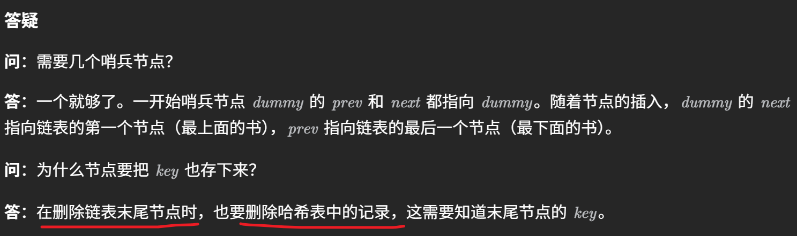

~~~C++
// 构造双向链表（存key，value，前后向指针）
// 删除节点 remove() + 最上面添加节点 push_front() + 抽出key节点，移到头部 get_node()

class Node // 构造双向链表
{
public:
    int key;
    int value;
    Node* prev;
    Node* next;

    Node(int k = 0, int v = 0) : key(k), value(v), prev(nullptr), next(nullptr) {}
};


class LRUCache {
private:
    int capacity;
    Node* dummy; 
    unordered_map<int, Node*> key_to_node; // <key, node>

    // 删除一个节点（抽出一本书）
    void remove(Node* x)
    {
        x->prev->next = x->next;
        x->next->prev = x->prev; 
    }


    // 插入新节点到链表头部（dummy后面）（把一本新书放在最上面）
    void push_front(Node* x)
    {
        x->prev = dummy;
        x->next = dummy->next;
        x->prev->next = x;
        x->next->prev = x;
    }


    // 获取 key 对应的节点返回，并移到链表头部（抽出一本书放在最上面）
    Node* get_node_to_front(int key)
    {

        // 没有这本书
        if (key_to_node.find(key) == key_to_node.end())    return nullptr;

        // 有这本书
        Node* node = key_to_node[key];
        remove(node);     // 抽出这本书
        push_front(node); // 放在最上面

        return node;
    }


public:
    LRUCache(int capacity) : capacity(capacity), dummy(new Node()) {
        dummy->prev = dummy;
        dummy->next = dummy;// 初始都指向自己
    }
    
    ~LRUCache() { // 加个析构，释放资源
        Node* cur = dummy->next;
        while (cur != dummy) {
            Node* nxt = cur->next;
            delete cur; 
            cur = nxt;
        }
        delete dummy;
    }
    

    // 如果关键字 key 存在于缓存中，则返回关键字的值，否则返回 -1 
    int get(int key) {
        Node* node = get_node_to_front(key); // 有就返回这个节点，并放在开头
        return node ? node->value : -1;
    }
    
   
    
    // 如果关键字 key 已经存在，则变更其数据值 value ；如果不存在，则向缓存中插入该组 key-value 
    // 如果插入操作导致关键字数量超过 capacity ，则应该 逐出 最久未使用的关键字
    void put(int key, int value) {     
        
        Node* node = get_node_to_front(key);
        
        // 节点存在，更新value，并且get_node()会把对应节点移到头部
        if (node) 
        {
            node->value = value; 
            return;
        }

        // 节点不存在，创建新节点插入头部（新书）
        Node* newnode = new Node(key, value);
        key_to_node[key] = newnode;
        push_front(newnode); 

        // 节点插入后，容量爆了，移除最后节点（移除最下面的书）
        if (key_to_node.size() > capacity) 
        {
            Node* back_node = dummy->prev; // 环形双向链表，直接找到最下面节点
            key_to_node.erase(back_node->key); // map中删除 <key, back_node>
            remove(back_node); 				   // 链表删除节点
            
            delete back_node; // 释放内存
        }
    }
    
};

/**
 * Your LRUCache object will be instantiated and called as such:
 * LRUCache* obj = new LRUCache(capacity);
 * int param_1 = obj->get(key);
 * obj->put(key,value);
 */
~~~

- 时间复杂度：所有操作均为 O(1)。
- 空间复杂度：O(min(*p*,*capacity*))，其中 *p* 为 put 的调用次数。


# 206 - [反转链表](https://leetcode.cn/problems/reverse-linked-list/description/?envType=study-plan-v2&envId=top-100-liked)


## 1、双指针

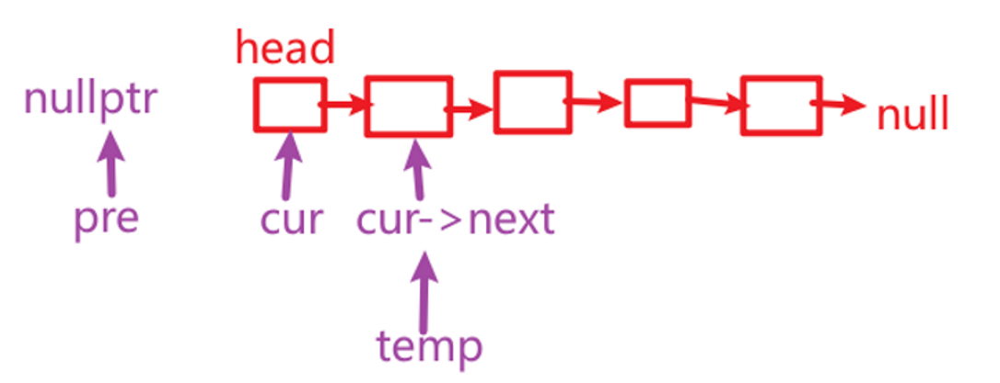

~~~C++
class Solution {
public:
    ListNode* reverseList(ListNode* head) {
        
        // 双指针

        ListNode* tmp;
        ListNode* cur = head;
        ListNode* pre = nullptr;

        while (cur)
        {
            tmp = cur->next;
            cur->next = pre; // 断开cur和cur->next，反转

            // 后移pre和cur
            pre = cur;
            cur = tmp;
        }

        return pre;// 新的头节点
        
    }
};
~~~


## 2、递归


~~~C++
/**
 * Definition for singly-linked list.
 * struct ListNode {
 *     int val;
 *     ListNode *next;
 *     ListNode() : val(0), next(nullptr) {}
 *     ListNode(int x) : val(x), next(nullptr) {}
 *     ListNode(int x, ListNode *next) : val(x), next(next) {}
 * };
 */
class Solution {
public:
    // 递归 构建reverse函数
    ListNode* reverse(ListNode* pre, ListNode* cur)
    {
        if (cur == nullptr) return pre; // 直到cur = nullptr，返回pre就是新的头节点

        ListNode* tmp = cur->next;
        cur->next = pre; // 反转

        return reverse(cur, tmp); // 相当于 pre = cur, cur = tmp
    }


    ListNode* reverseList(ListNode* head) {
        return reverse(nullptr, head); // 初始 cur = head, pre = nullpt  
    }
};
~~~


# 215 [数组中的第K个最大元素](https://leetcode.cn/problems/kth-largest-element-in-an-array/submissions/649625107/?envType=study-plan-v2&envId=top-100-liked)

@ 快排


~~~C++
class Solution {
public:
    // 基于快排的快速选择
    int quickSelect(vector<int>& nums, int k)
    {        
        // 随机选择基准数字
        int p = nums[rand() % nums.size()];

        // 将大于等于小于基准的元素，分别放入三个数组
        vector<int> big, equal, small;
        for (int a : nums)
        {
            if (a < p)      small.push_back(a);
            else if (a > p) big.push_back(a);
            else            equal.push_back(a);
        }

        // 第 k 大元素在big 中，按递归划分
        if (k <= big.size())    return quickSelect(big, k);

        // 第 k 大元素在 small 中，递归划分
        if (k > big.size() + equal.size())
        {
            return quickSelect(small, k - (big.size() + equal.size()));
            // 在small里面就是第 [k - (big.size() + equal.size())] 个大的元素
        }

        // 第 k 大元素在 equal 中，找到，返回p
        return p;
    }


    int findKthLargest(vector<int>& nums, int k) {

        return quickSelect(nums, k);        
    }
};
~~~


# 25 [K个一组翻转链表](https://leetcode.cn/problems/reverse-nodes-in-k-group/description/?envType=study-plan-v2&envId=top-100-liked)

@ 反转链表


**计数节点数count —— dummy，pre，cur，p0(当前反转组的前一个)**

**普通反转链表，成组反转 + 连接头尾**


[题解：灵茶山艾府](https://www.bilibili.com/video/BV1sd4y1x7KN/?vd_source=7369d5f08520f2fc3601caee93963ffa)


~~~C++
/**
 * Definition for singly-linked list.
 * struct ListNode {
 *     int val;
 *     ListNode *next;
 *     ListNode() : val(0), next(nullptr) {}
 *     ListNode(int x) : val(x), next(nullptr) {}
 *     ListNode(int x, ListNode *next) : val(x), next(next) {}
 * };
 */
class Solution {
public:
    ListNode* reverseKGroup(ListNode* head, int k) {

        // 统计节点个数
        int n = 0;
        ListNode* node = head;
        while (node)
        {
            n++;
            node = node->next;
        }
        
        ListNode* dummyHead = new ListNode(0);
        dummyHead->next = head;
        
        ListNode* p0 = dummyHead; // p0 作为 [下一组要反转的k个节点的] 上一个节点
        ListNode* pre = nullptr;
        ListNode* cur = head;

        // 剩余节点足够 k 个
        while (n >= k)
        {
            // k 个一组处理
            for (int i = 0; i < k; i++) // 206 普通反转链表
            {
                ListNode* tmp = cur->next;
                cur->next = pre;
                pre = cur;
                cur = tmp;
            }

            // 连接头尾
            ListNode* nxt = p0->next;
            p0->next->next = cur;
            p0->next = pre;
            
            // 更新p0
            p0 = nxt; 

            // n 更新
            n -= k;
            
            pre = nullptr; // 可以不重置，重置好理解一些
        }

        return dummyHead->next;

    }
};
~~~

- 时间复杂度：O(*n*)，其中 *n* 为链表节点个数。
- 空间复杂度：O(1)，仅用到若干额外变量。


# 15 [三数之和](https://leetcode.cn/problems/3sum/description/?envType=study-plan-v2&envId=top-100-liked)

@双指针收缩


**双指针收缩，大了往左，小了往右 + 去重**


~~~C++
class Solution {
public:
    vector<vector<int>> threeSum(vector<int>& nums) {

        // 先排序nums
        sort(nums.begin(), nums.end());
        
        vector<vector<int>> result;
        
        for (int i = 0; i < nums.size(); i++)
        {
            // 排序后第一个元素已经大于0，不可能凑成三元组
            if (nums[i] > 0)    break;
            
            // 去重 a
            // 如果i和i-1元素相同，说明后面遍历组合的三数之和在nums[i-1]的时候被组合过了，跳过
            if (i > 0 && nums[i] == nums[i - 1])    continue;

            // a = nums[i]  b = nums[left]  c = nums[right]   固定i，移动left right
            int left = i + 1;
            int right = nums.size() - 1;
            while(left < right) 
            {
                // 三数之和 > 0，right向左移动，让和变小
                if (nums[i] + nums[left] + nums[right] > 0) right--;
                
                // 三数之和 < 0，left向右移动，让和变大
                else if (nums[i] + nums[left] + nums[right] < 0) left++;
                
                // 三数之和 = 0，找到一个三元组
                else 
                {
                    // 收集三元组
                    result.push_back(vector<int>{nums[i], nums[left], nums[right]});
                    
                    // 去重b和c，向里收缩
                    while (right > left && nums[right] == nums[right - 1])	right--;
                    while (right > left && nums[left] == nums[left + 1])	left++;
                    
                    // 找到一组三元组后，left和right同时向里收缩，寻找下一组
                    right--;
                    left++;
                }
                
            }
        }

        return result;        
    }
};
~~~

时间复杂度：*O*(*n*2)

空间复杂度：O(1)


# 53 [最大子数组和](https://leetcode.cn/problems/maximum-subarray/description/?envType=study-plan-v2&envId=top-100-liked)

@贪心 @动态规划 


## 贪心


~~~C++
class Solution {
public:
    int maxSubArray(vector<int>& nums) {

        // 贪心

        // 注意找的只是 【最大和】，没让找子数组
        // 主要思路：负数只会拖累加和，所以遇到和变成负的，舍弃，负的只会减小后面的加和
        
        int result = INT32_MIN;
        int count = 0;

        // 记录连续和count，如果count < 0，舍弃，再从下一个数开始计和
        for (int i = 0; i < nums.size(); i++)
        {
            count += nums[i];
            result = max(count, result); // 更新result，取大的count
            
            if (count <= 0)	count = 0; // 舍弃，从下一个数nums[i + 1]重新加和
        }

        return result;
    }
};
~~~


## 动态规划


~~~C++
class Solution {
public:
    int maxSubArray(vector<int>& nums) {
        
        if (nums.size() == 0)   return 0;
        
        // 动态规划

        // dp[i] - 以nums[i]结尾(包括)的最大连续子序列和为dp[i]
        vector<int> dp(nums.size());

        // 初始化
        dp[0] = nums[0];

        int result = dp[0];

        // 递推
        for (int i = 1; i < nums.size(); i++)
        {
            dp[i] = max(dp[i - 1] + nums[i], nums[i]);// 两种推出dp[i]的方式，取max

            if (dp[i] > result) result = dp[i]; // 取dp[i]的最大值返回
        }

        return result;  
    }
};
~~~


# 912  [排序数组](https://leetcode.cn/problems/sort-an-array/description/)

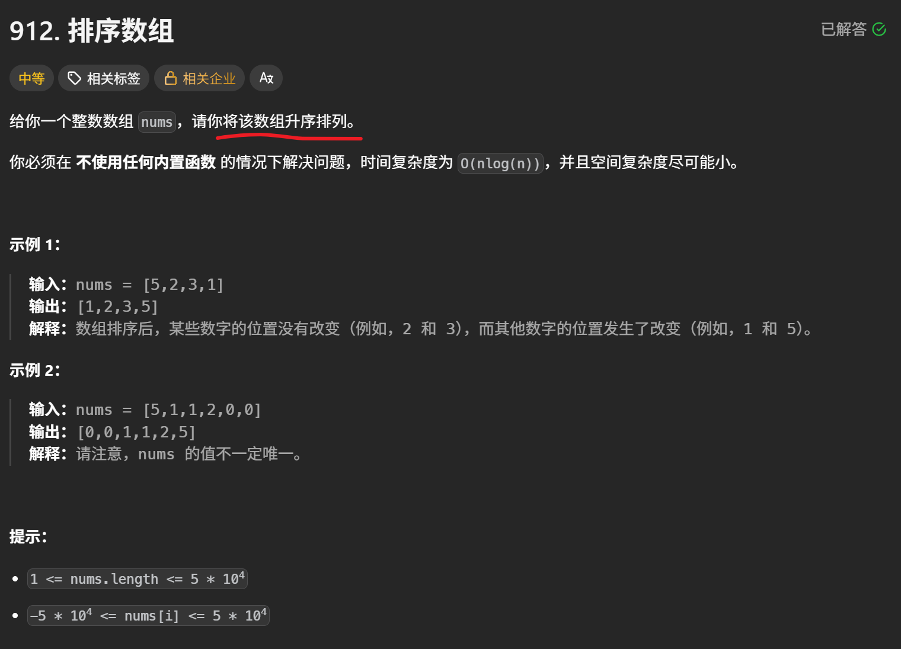

## 快排

选基准pivot，划分左右，递归左右划分

~~~C++
class Solution {
public:

    // 划分子数组 [left, right]，<= pivot 的元素都在左侧，>= pivot 的元素都在右侧
    // [ <=pivot | pivot | >=pivot ] 返回 pivot坐标
    int partition(vector<int>& nums, int left, int right) 
    {
        int k = left + rand() % (right - left + 1);
        int pivot = nums[k]; // 基准


        // 把 pivot 换到第一个，避免 pivot 干扰后续划分，从而简化实现逻辑
        swap(nums[k], nums[left]);

        // 相向双指针遍历 [left + 1, right]，开始按照大小左右分组
        // [ pivot | <=pivot | 尚未遍历 | >=pivot ]
        //   ^                 ^     ^         ^
        //   left              i     j         right
        int i = left + 1;
        int j = right;
        while (true)
        {
            // 跳过符合的
            while (i <= j && nums[i] < pivot)   i++; // 此时 nums[i] >= pivot
            while (i <= j && nums[j] > pivot)   j--; // 此时 nums[j] <= pivot

            if (i >= j) break;

            swap(nums[i], nums[j]); // 交换不符合的，再继续循环，直到i >= j
            i++;
            j--;
        }


        // 循环结束后
        // [ pivot | <=pivot | >=pivot ]
        //   ^             ^   ^     ^
        //   left          j   i     right
        
        // pivot 交换 j 
        // [ <=pivot | pivot | >=pivot ]
        //               ^
        //               j
        
        swap(nums[left], nums[j]); // 把 pivot 与 nums[j] 交换，完成划分（partition）
        return j; // 返回 pivot 的下标
    }


    // 快排子数组 [left, right]，递归排序左右两部分
    void quick_sort(vector<int>& nums, int left, int right)
    {
        // 优化：如果子数组已经是升序，直接返回
        // STL 写法：is_sorted(nums.begin() + left, nums.begin() + right + 1);

        // 普通写法
        bool ordered = true;
        for (int i = left; i < right; i++)
        {
            if (nums[i] > nums[i + 1])
            {
                ordered = false;
                break;
            }
        }

        if (ordered)    return;

        int i = partition(nums, left, right); // 划分子数组
        quick_sort(nums, left, i - 1); // 排序左边
        quick_sort(nums, i + 1, right);// 排序右边

    }

    vector<int> sortArray(vector<int>& nums) {

        srand(time(NULL));
        quick_sort(nums, 0, (int)nums.size() - 1);
        return nums;
        
    }
};
~~~


期望时间复杂度：O(nlogn)

- 其中 n 是 nums 的长度。在平均情况下，可以视作均匀划分（partition）。
- 递归深度为 O(logn)，每一层会涉及 O(n) 个元素的比较和交换，所以时间复杂度等于一个高为 O(logn)，底边长为 O(n) 的矩形的面积，即 O(nlogn)。

期望空间复杂度：O(logn)。

- 递归需要期望 O(logn) 的栈开销。


## 冒泡（超时）

比较相邻元素，如果第一个比第二个大，则交换。

时间复杂度n^2，空间复杂度1

~~~C++
class Solution {
public:
    vector<int> sortArray(vector<int>& nums) {

        for (int i = 0; i < nums.size() - 1; i++)
        {
            for (int j = 0; j < nums.size() - 1 - i; j++)
            {
                if (nums[j] > nums[j + 1])  swap(nums[j], nums[j + 1]);
            }
        }

        return nums;
    }
};
~~~


## 归并

分治，nums分成两部分，递归排序

时间复杂度：*O*(*n*log*n*)

~~~C++
class Solution {
public:
    vector<int> tmp; 
    void mergeSort(vector<int>& nums, int left, int right)
    {
        if (left >= right) return;
        int mid = (left + right) >> 1;

        mergeSort(nums, left, mid);      // 左半部分
        mergeSort(nums, mid + 1, right); // 右半部分

        int i = left, j = mid + 1;
        int cnt = 0;
        while (i <= mid && j <= right) // 取较小的数放进tmp
        {
            if (nums[i] <= nums[j]) tmp[cnt++] = nums[i++];
            else                    tmp[cnt++] = nums[j++];
        }
        // 填上剩余部分
        while (i <= mid)    tmp[cnt++] = nums[i++];
        while (j <= right)  tmp[cnt++] = nums[j++];

        // tmp 搬到 nums
        for (int i = 0; i < right - left + 1; i++)  nums[left + i] = tmp[i];
    }

    vector<int> sortArray(vector<int>& nums) {

        tmp.resize((int)nums.size(), 0);
        mergeSort(nums, 0, (int)nums.size() - 1);
        return nums;
        
    }
};
~~~


# 21 [合并两个有序链表](https://leetcode.cn/problems/merge-two-sorted-lists/description/?envType=study-plan-v2&envId=top-100-liked)

@ dummyHead 常规


~~~C++
/**
 * Definition for singly-linked list.
 * struct ListNode {
 *     int val;
 *     ListNode *next;
 *     ListNode() : val(0), next(nullptr) {}
 *     ListNode(int x) : val(x), next(nullptr) {}
 *     ListNode(int x, ListNode *next) : val(x), next(next) {}
 * };
 */
class Solution {
public:
    ListNode* mergeTwoLists(ListNode* list1, ListNode* list2) {

        ListNode* dummyHead = new ListNode(0);
        ListNode* cur = dummyHead;
        while (list1 && list2)
        {
            if (list1->val < list2->val)
            {
                cur->next = list1; // 取小的节点拼接在cur后面
                list1 = list1->next;
            }
            else
            {
                cur->next = list2;
                list2 = list2->next;
            }

            cur = cur->next;
        }

        // 上面while终止，是由于list1或list2为nullptr
        // 判断是哪个终止了，将另一个链表的剩下部分也拼接上
        cur->next = (list1 != nullptr) ? list1 : list2;

        return dummyHead->next; // 返回真正的头节点
        
    }
};
~~~

时间复杂度 O(M+N) ：M，N是两个链表的长度，合并操作需要操作两链表

空间复杂度 O(1)：节点引用dummyHead，cur使用常数大小的额外空间


# 5 [最长回文子串](https://leetcode.cn/problems/longest-palindromic-substring/description/?envType=study-plan-v2&envId=top-100-liked)

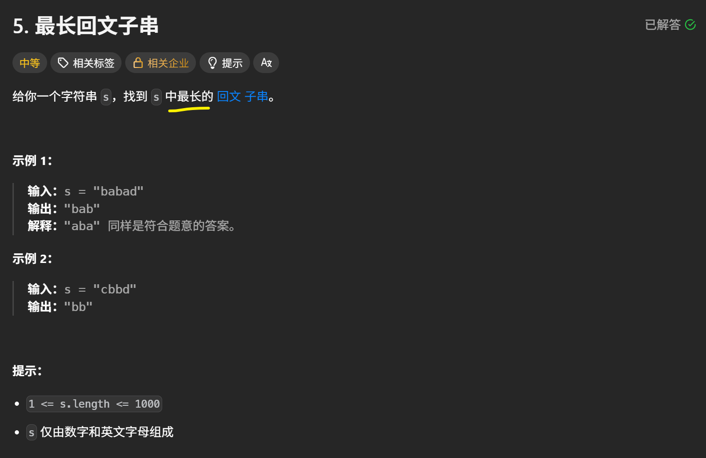

## 动态规划

> 647 回文子串是求个数，5 是求最长长度

`dp[i][j]` —【i, j】范围的s是否为回文子串 +  记录最长回文子串范围 

~~~C++
class Solution {
public:
    string longestPalindrome(string s) {

        // dp[i][j] - 范围[i, j]的s子串是否是回文子串
        vector<vector<bool>> dp(s.size(), vector<bool>(s.size(), false));

        int maxLength = 0; // 记录最长回文子串长度
        int left = 0;
        int right = 0;

        for (int i = s.size(); i >= 0; i--)
        {
            for (int j = i; j < s.size(); j++)
            {
                if (s[i] == s[j])
                {
                    if (j - i <= 1)             dp[i][j] = true; // 'a' 或 'aa'
                    else if (dp[i + 1][j - 1])  dp[i][j] = true; // 'a _ _ _ a'
                }

                if (dp[i][j] && j - i + 1 > maxLength) // 更新最长长度
                {
                    maxLength = j - i + 1;
                    left = i;
                    right = j;
                }
            }
        }

        return s.substr(left, maxLength); // 截取子串        
    }
};
~~~

时间复杂度：$O(N^2)$ 

空间复杂度：$O(N^2)$ 


## 回文扩展

以 s 的每个字符为中心，向两边进行扩展 extend()，得到最长回文范围

但是要注意在遍历中心点的两种情况：一个元素可以作为中心点，两个元素也可以作为中心点。

比如 ：`___b a b___`  `___b a a b___`

~~~C++
class Solution {
public:

    int left = 0;
    int right = 0;
    int maxLength = 0;

    // 回文扩展：从给定的中心 [i, j] 向两边扩展，直到遇到不同的字符为止，记录最长扩展长度
    void extend(const string& s, int i, int j)
    {
        int n = s.size();
        
        while (i >= 0 && j < n && s[i] == s[j])
        {
            if (j - i + 1 > maxLength)
            {
                left = i;
                right = j;
                maxLength = j - i + 1;
            }
            i--;
            j++; // 向两边扩展
        }
    }


    string longestPalindrome(string s) {
        
        // 将s的每个字符，作为回文中心，向两边扩展，记录每个s[i]能扩展的长度
        for (int i = 0; i < s.size(); i++)
        {
            // 注意中心点的两种情况
            extend(s, i, i);     // 以 i 为中心          '__ b a b __'
            extend(s, i, i + 1); // 以 i 和 i + 1 为中心 '__ b a a b __'
        }
        return s.substr(left, maxLength);        
    }
    
};
~~~

时间复杂度：$O(N^2)$ 

空间复杂度：O(1)


# 1 [两数之和](https://leetcode.cn/problems/two-sum/description/?envType=study-plan-v2&envId=top-100-liked)

@哈希 @数组


遍历数组，需要一个集合**存放【遍历过的元素】**，在遍历数组nums的时候，同时去这个组合中寻找，某元素【 target - 当前遍历元素 nums[i] 】是否出现过。

因为最后要找到这个元素是否出现过，还需要得到这个元素的下标，需要使用key-value结构存放：

**< key: 元素nums[i]， value：下标 i >**

判断元素是否出现过，那么元素就要作为key，通过元素找下标，下标作为value。

> std::unordered_map 底层实现为哈希表，std::map 和std::multimap 的底层实现是红黑树。
>
> std::map 和std::multimap 的key也是有序的,**这道题目中并不需要key有序，选择std::unordered_map 效率更高！** 


~~~C++
class Solution {
public:
    vector<int> twoSum(vector<int>& nums, int target) {
        
        // unordered_map 不重复 无序key 存放遍历过的元素
        unordered_map<int, int> umap; // < nums[i], 下标 i>

        for (int i = 0; i < nums.size(); i++)
        {
            //find 查找 target - nums[i] 在不在 umap中
            if (umap.find(target - nums[i]) != umap.end()) 
            {
                return {umap[target - nums[i]], i}; // 找到，直接返回下标数组
            }
            
            umap[nums[i]] = i; // 没找到，就存到umap里
            // umap.insert(pair<int, int>(nums[i], i));
        }

        return {}; // 没符合条件的，返回空数组
        
    }
};
~~~

时间复杂度：O(N)

空间复杂度：O(N)


# 102 [二叉树的层序遍历](https://leetcode.cn/problems/binary-tree-level-order-traversal/description/?envType=study-plan-v2&envId=top-100-liked)

@ 队列


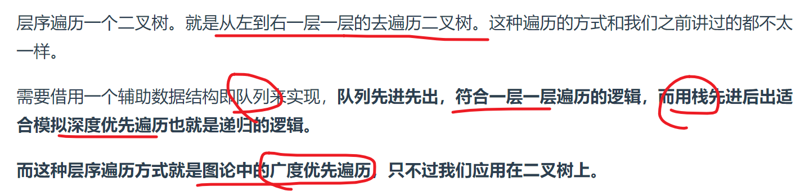


~~~c++
/**
 * Definition for a binary tree node.
 * struct TreeNode {
 *     int val;
 *     TreeNode *left;
 *     TreeNode *right;
 *     TreeNode() : val(0), left(nullptr), right(nullptr) {}
 *     TreeNode(int x) : val(x), left(nullptr), right(nullptr) {}
 *     TreeNode(int x, TreeNode *left, TreeNode *right) : val(x), left(left), right(right) {}
 * };
 */
class Solution {
public:
    vector<vector<int>> levelOrder(TreeNode* root) {

        queue<TreeNode*> que; // 存放每层的节点

        vector<vector<int>> result;

        if (root)   que.push(root);
        while (!que.empty())
        {
            int size = que.size(); // 记录每层节点数，控制que里弹出的节点数
                                   // 一定用固定的size，因为que.size()是变化的
            
            vector<int> vec; // 存放当前层的数据，每层处理完到这vec更新

            // 开始输出这一层，以及传入新的左右节点
            for (int i = 0; i < size; i++)
            {
                // 当前节点处理，值放进vec
                TreeNode* node = que.front();
                que.pop();
                vec.push_back(node->val);

                // 传入当前node的左右节点
                if (node->left)     que.push(node->left);
                if (node->right)    que.push(node->right);
            }

            // 每层vec存入result
            result.push_back(vec);
        }

        return result;      
    }
};
~~~

时间复杂度：O(N)

空间复杂度：O(N)


# 33 [搜索旋转排序数组](https://leetcode.cn/problems/search-in-rotated-sorted-array/description/?envType=study-plan-v2&envId=top-100-liked)

@ 分段二分  @153 旋转数组最小值 + 普通找target二分


> 前提题目：可以先看 162 峰值，153 寻找旋转排序数组的最小值

## 1、两次二分


~~~C++
class Solution {
public:
    // 找旋转排序数组的最小值下标（153）
    int findMin(vector<int>& nums) {
        int n = nums.size();
        int left = 0;
        int right = n - 1;
        while (left <= right)
        {
            int mid = left + ((right - left) / 2);
            if (nums[mid] > nums[n - 1])    left = mid + 1;// mid在第一段，min在第二段
            else    right = mid - 1; // mid 和 min 在同一段，且 min 在左
        }
        return left; 
    }

    // [left, right]二分，找target下标
    int searchTarget(vector<int>& nums, int target, int left, int right) {
        while (left <= right)
        {
            int mid = left + ((right - left) / 2); 
            if      (nums[mid] > target)    right = mid - 1;
            else if (nums[mid] < target)    left = mid + 1;
            else    return mid;
        }
        return -1; // 没找到返回-1  
    }

    
    int search(vector<int>& nums, int target) {
        int n = nums.size();
        int ans = 0;
        int left = 0;
        int right = n - 1;

        int min_index = findMin(nums); // 找到最小值，区分第一段第二段

        if (target > nums[n - 1])  // target 在第一段，[0, min_index-1], 向左收缩 
        { 
            right = min_index - 1;
            ans = searchTarget(nums, target, left, right);         
        }
        else // target <= nums[n - 1] target 在第二段，[min_index, n-1]，向右收缩  
        {
            left = min_index;
            ans = searchTarget(nums, target, left, right);

            // 注意这里要带着min判断, target有可能就是min
        }

        return ans;        
    }
};
~~~


## 2、一次二分(推荐)

直接判断 target 和 mid 的左右关系，分成target和mid在不在同一段两种情况

- 不在同一段，分 mid 在 target 左还是右
- 在同一段，就是普通二分查找了

~~~C++
class Solution {
public:
    int search(vector<int>& nums, int target) {

        int n = nums.size();
        int end = nums[n - 1]; // 还是和最后一个数比较，判断在哪一段
        
        int left = 0;
        int right = n - 1;

        while (left <= right)
        {
            int mid = left + (right - left) / 2;

            // target 和 mid 不在同一段
            if (nums[mid] > end && target <= end) 	   // target在右半部分，mid在左
            {
                left = mid + 1;
            }
            else if (target > end && nums[mid] <= end) // target在左半部分，mid在右
            {
                right = mid - 1;
            }
            else // target 和 mid 在同一段（也包括了只有一段的情况） 普通二分
            {
                if (target < nums[mid])         right = mid - 1;
                else if (target > nums[mid])    left = mid + 1;
                else    return mid;
            }
        }
        
        return -1;        
    }
};
~~~


# 200 [岛屿数量](https://leetcode.cn/problems/number-of-islands/description/)


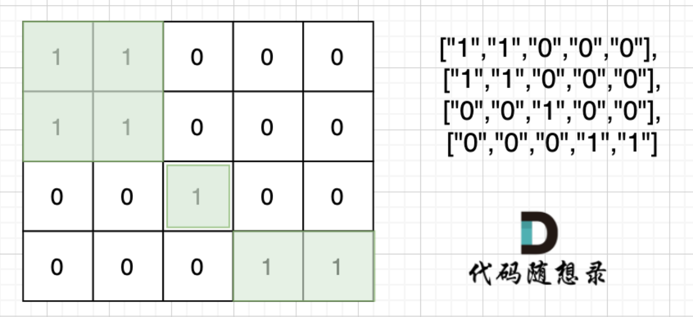

**思路**：

<span style="color:#CC0000;">**result 记录遇到的符合的新岛屿的个数，dfs 用来标记（插旗）这块岛屿能连接上的所有陆地**</span>

**遇到一个没有遍历过的新陆地，计数器就加一**，然后把**该新陆地所能连接到的陆地都标记**上。

在遇到标记过的陆地节点和海洋节点的时候直接跳过。 这样**计数器就是最终岛屿的数量**。


### dfs 直接标记（灵神）

直接在原 grid 上标记

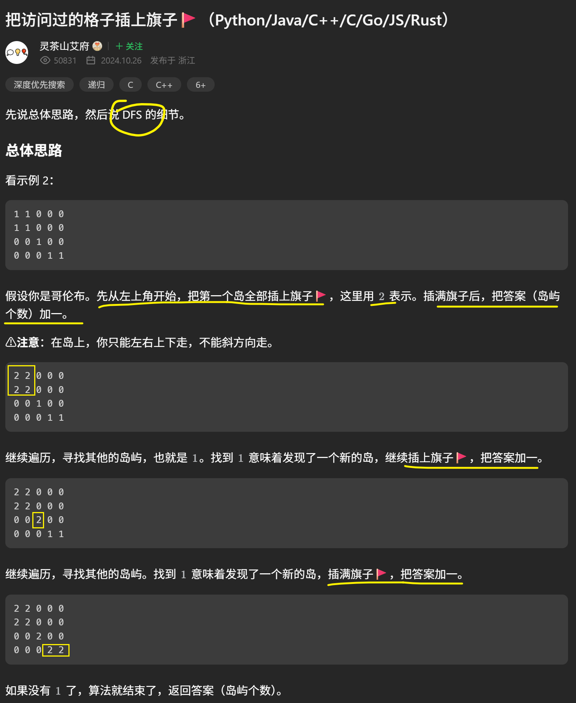

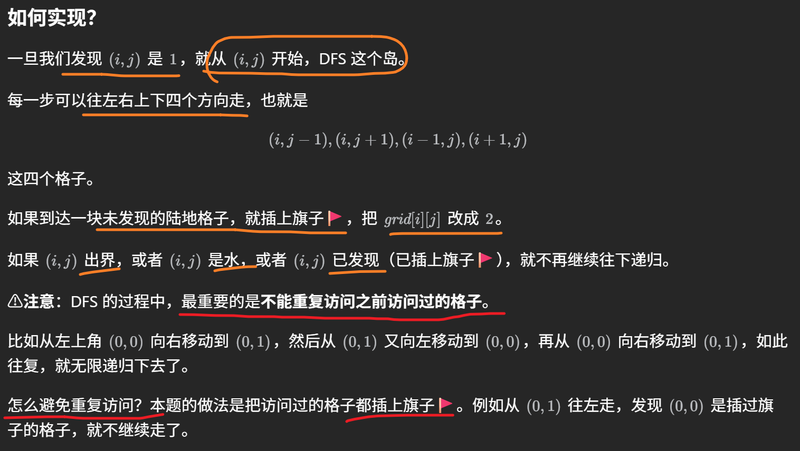


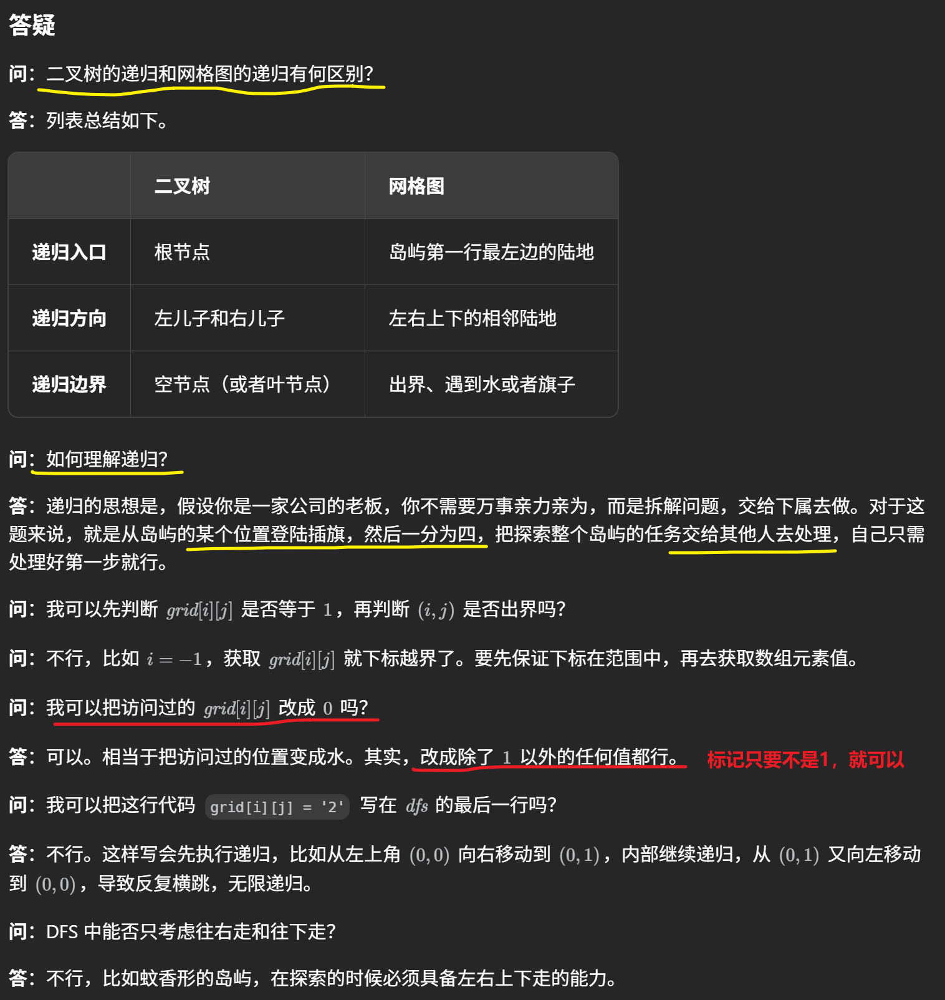

~~~C++
class Solution {
public:
    int numIslands(vector<vector<char>>& grid) {

        int m = grid.size();
        int n = grid[0].size();

        // dfs 负责把陆地(i,j)能连接的陆地，都插上旗子，也就是这块岛屿
        auto dfs = [&](this auto&& dfs, int i, int j) -> void 
        {
            // 出界，或者不是'1'，就终止 (注意if里的顺序)
            if (i < 0 || i >= m || j < 0 || j >= n || grid[i][j] != '1')    return;
            
            // 先插旗！只要改成不是'1'就行
            grid[i][j] = '2';

            // 四个方向走，递归插旗
            dfs(i, j - 1);
            dfs(i, j + 1);
            dfs(i - 1, j);
            dfs(i + 1, j);
        };


        int ans = 0; // 岛屿计数
        for (int i = 0; i < m; i++)
        {
            for (int j = 0; j < n; j++)
            {
                if (grid[i][j] == '1') // 如果是新陆地
                {
                    dfs(i, j); // 把(i,j)能连接上的陆地都插旗，这样再遍历到的'1'一定是新的岛屿
                    ans++; // 这块岛屿插完旗子了，计数
                }
            }
        }
        return ans;
    }
};
~~~


- 时间复杂度：O(*mn*)，其中 *m* 和 *n* 分别为 *grid* 的行数和列数。
- 空间复杂度：O(*mn*)。最坏情况下，递归需要 O(*mn*) 的栈空间。


### 另外使用 visited（随想录）

#### 深搜dfs

**`result` 作为岛屿计数器。遍历`grid`每个节点：每个未标记新陆地都是新岛屿起点**

- 遇到新的未标记陆地，先标记`visited`，然后计数`result + 1`，表示遇到了新岛屿的起始点

- dfs 主要用来<span style="color:#CC0000;">标记这块新岛屿能连接上的所有陆地 </span>`visited[][]`，走完这一层dfs，也就标记完了这块岛屿

- 这样在下一轮，再遇到新的未标记陆地，又可以作为新岛屿的起始，`result + 1`

~~~C++
class Solution {
public:
    int dir[4][2] = {0,1, 1,0, -1,0, 0,-1}; // 四个方向

    // dfs 标记(x, y)位置作为起点的，能连接的所有陆地
    void dfs(vector<vector<char>>& grid, vector<vector<bool>>& visited, int x, int y)
    { 
        // 终止：节点访问过，或者是海水
        if (visited[x][y] || grid[x][y] == '0') return; 

        visited[x][y] = true; // 标记     

        for (int i = 0; i < 4; i++)
        {
            int nextx = x + dir[i][0];
            int nexty = y + dir[i][1];

            if (nextx < 0 || nextx >= grid.size() ||
                nexty < 0 || nexty >= grid[0].size())
            {
                continue; // 超出界限，直接跳过
            }

            dfs(grid, visited, nextx, nexty); // 判断条件放到前面去了，这里直接递归
        }
    }

    int numIslands(vector<vector<char>>& grid) {
        int n = grid.size();   // n行
        int m = grid[0].size();// m列

        vector<vector<bool>> visited(n, vector<bool>(m, false)); // 标记是否访问过

        int result = 0;
        // result记录遇到的符合的新岛屿的个数，dfs用来标记这块岛屿能连接上的所有陆地
        
        // 遍历grid每个节点，每个未标记陆地都是新岛屿起始点
        for (int i = 0; i < n; i++)
        {
            for (int j = 0; j < m; j++)
            {
                if (!visited[i][j] && grid[i][j] == '1')
                {
                    visited[i][j] = true;
                    result++; // 遇到新岛屿起始点[i, j]，岛屿数量+1

                    dfs(grid, visited, i, j); // 将与 [i, j] 连接上的陆地都标记上
                }
            }
        }

        return result;
    }
    
};
~~~


#### 广搜bfs

**dfs 换成 bfs，queue存放走过的节点坐标**

- 遇到新的未标记陆地，就是新的岛屿，直接计数`result + 1`

- <span style="color:#CC0000;">进入 bfs 标记这块新岛屿能连接上的所有陆地 </span>`visited[][]`
  - 取出que中节点，标记4个方向，符合的陆地节点**加入队列，代表走过，需要标记**（而不是从队列拿出来的时候再去标记走过）
  - 循环这个过程，直到que中没有节点（当前这块岛屿标记完成）
- 再遍历遇到新的未标记陆地，再 `result + 1`，再bfs标记这块新岛屿

~~~C++
class Solution {
public:
    int dir[4][2] = {0,1, 1,0, -1,0, 0,-1}; // 四个方向

    void bfs(vector<vector<char>>& grid, vector<vector<bool>>& visited, int x, int y)
    {
        queue<pair<int, int>> que; // 存放已经走过的坐标 {x, y}
        
        // 先加入que，并标记（只要加入队列，就标记，避免重复处理）
        que.push({x, y});
        visited[x][y] = true; 

        // 取出队列中已经走过的每个节点，处理其四个方向
        while (!que.empty())
        {
            pair<int, int> cur = que.front(); 
            que.pop();
            int curx = cur.first;
            int cury = cur.second;

            // 处理cur的4个方向
            for (int i = 0; i < 4; i++)
            {
                int nextx = curx + dir[i][0];
                int nexty = cury + dir[i][1];
                if (nextx < 0 || nextx >= grid.size() ||
                    nexty < 0 || nexty >= grid[0].size())
                {
                    continue;
                }

                if (!visited[nextx][nexty] && grid[nextx][nexty] == '1')
                {
                    que.push({nextx, nexty});     // 加入队列
                    visited[nextx][nexty] = true; // 标记
                }
            }
        }
    }

    int numIslands(vector<vector<char>>& grid) {
        int n = grid.size();   // n行
        int m = grid[0].size();// m列
        vector<vector<bool>> visited(n, vector<bool>(m, false)); 
        int result = 0;
        
        for (int i = 0; i < n; i++)
        {
            for (int j = 0; j < m; j++)
            {
                if (!visited[i][j] && grid[i][j] == '1')
                {
                    result++; 
                    bfs(grid, visited, i, j); // 换成 bfs 来标记这块岛屿能连接上的所有陆地
                }
            }
        }

        return result;       
    }
};
~~~


**注意：标记的时机**

如果从队列拿出节点，再去标记这个节点走过，就会发生下图所示的结果，会导致很多节点重复加入队列。


# 46 [全排列](https://leetcode.cn/problems/permutations/description/?envType=study-plan-v2&envId=top-100-liked)

@回溯  @排列（有顺序）

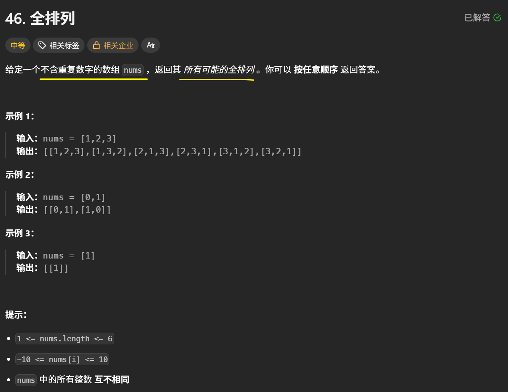


~~~C++
class Solution {
public:
    vector<int> path;
    vector<vector<int>> result;

    // used[i]: 往下走，used 记录这条之路上nums[i]已经取过

    void backtracking(vector<int>& nums, vector<bool>& used) 
    {
        if (path.size() == nums.size()) // 全排列，所有数字都要取到
        {
            result.push_back(path);
            return;
        }

        for (int i = 0; i < nums.size(); i++) // 每次都从0开始取
        {
            // 先判断当前nums[i]是否已经取过了，取过了就跳过
            if (used[i] == true)    continue;

            path.push_back(nums[i]);
            used[i] = true; 

            backtracking(nums, used);

            path.pop_back();
            used[i] = false; // used也要回溯
        }
    }


    vector<vector<int>> permute(vector<int>& nums) {

        vector<bool> used(nums.size(), false);
        backtracking(nums, used);
        return result;        
    }
};
~~~


# 88 [合并两个有序数组](https://leetcode.cn/problems/merge-sorted-array/description/?envType=study-plan-v2&envId=top-interview-150)


主要思路：

- 从后往前确定两组中该用哪个数字
- 结束条件是第二组数全都插入 `j < 0`


~~~C++
class Solution {
public:
    void merge(vector<int>& nums1, int m, vector<int>& nums2, int n) {

        int i = m - 1; // nums1最后一个数
        int j = n - 1; // nums2最后一个数

        int k = m + n - 1; // 合并后的末尾

        while (j >= 0)
        {
            // 取大的数放在 k
            if (i >= 0 && nums1[i] > nums2[j])  
            {
                nums1[k] = nums1[i];
                k--;
                i--;
            }
            else 
            {
                nums1[k] = nums2[j];
                k--;
                j--;
            }

        }  

    }
};
~~~

- 时间复杂度：O(*m*+*n*)。最坏情况形如 *nums*1=[4,5,6,∗,∗,∗],*nums*2=[1,2,3]，每个数都需要移动一次。
- 空间复杂度：O(1)。仅用到若干额外变量


# 20 [有效的括号](https://leetcode.cn/problems/valid-parentheses/description/?envType=study-plan-v2&envId=top-100-liked)

@ 栈


> **注意看给的示例，题目描述不清楚**
>
> **必须是 “ ( [ { } ] )  [ ] ” 这种成对的顺序，不能交叉放不同类型的括号  “ [ ( ] ) ”**

**栈来存储字符串s里的括号：**

遍历s

- 根据s里的左括号，往栈里放对应的右括号；

- 遇到s里的右括号，能对应上栈顶元素，就弹出栈顶

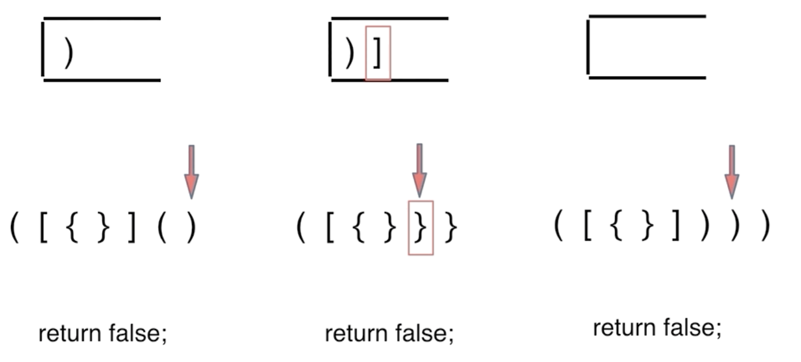

不匹配的情况：

- 左括号多余 —— 遍历完字符串，但是栈不为空
- 括号不匹配 —— 发现栈里没有要匹配的字符
- 右括号多余 —— 遍历字符串匹配的过程中，栈已经为空了

匹配的表现：

- **字符串遍历完，栈也是空的**


~~~C++
class Solution {
public:
    bool isValid(string s) {

        if (s.size() % 2 != 0)  return false; // 如果 s 的长度是奇数，一定不匹配

        stack<char> st; // 根据 s 的左括号，放入相应的右括号
        
        // 三种情况：
        // 1 左括号多余 -- s遍历完，栈不为空
        // 2 括号不匹配 -- s遍历过程中，栈顶括号不匹配
        // 3 右括号多余 -- s遍历过程中，栈已经空

        for (int i = 0; i < s.size(); i++)
        {
            // 根据 s 里的左括号，往栈里加入对应的右括号
            if (s[i] == '(')        st.push(')');
            else if (s[i] == '[')   st.push(']');
            else if (s[i] == '{')   st.push('}');

            // 第3种 和 第2种 情况，直接false （注意if里顺序不能换）
            else if (st.empty() || st.top() != s[i])    return false; 

            // st.top() == s[i] 遍历到对应的右括号就弹出栈顶
            else    st.pop();
        }

        // 第1种 情况，遍历完s，但栈不为空，这里就返回false
        // 如果为空，说明符合要求，返回的是true
        return st.empty();
        
    }
};
~~~


# 121 [买卖股票的最佳时机](https://leetcode.cn/problems/best-time-to-buy-and-sell-stock/description/?envType=study-plan-v2&envId=top-100-liked)

@ 贪心 @ 动规


## 贪心


~~~C++
class Solution {
public:
    int maxProfit(vector<int>& prices) {

        // prices[i] 股票第 i 天的价格
        int low = prices[0];
        int result = 0;
        for (int i = 0; i < prices.size(); i++)
        {
            low = min(low, prices[i]); // 取最左最小价格
            result = max(result, prices[i] - low); // 直接取最大差
        }

        return result;
    }
};
~~~


ACM 

~~~C++
#include <vector>
#include <iostream>
using namespace std;

// 121 买卖股票的最佳时机


int maxProfit(vector<int>& prices)  // prices[i] 股票第 i 天的价格
{ 
    int result = 0;
    int low = prices[0];
    
    for (int i = 0; i < prices.size(); i++)
    {
        low = min(low, prices[i]); // 取最左最小价格
        result = max(result, prices[i] - low); // 直接取最大差
    }
    return result;
    
}


int main()
{
    vector<int> prices = {7, 1, 5, 3, 6, 4};
    int result = maxProfit(prices);
    cout << result << endl;

    return 0;
}
~~~


## 动规


~~~C++
class Solution {
public:
    int maxProfit(vector<int>& prices) {

        int len = prices.size();

        // dp[i][0] - 第i天持有股票所得最多现金   
        // dp[i][1] - 第i天不持有股票所得最多现金
        vector<vector<int>> dp(len, vector<int>(2, 0));

        dp[0][0] = -prices[0];
        dp[0][1] = 0;

        for (int i = 1; i < prices.size(); i++)
        {
            dp[i][0] = max(dp[i - 1][0], -prices[i]);
            dp[i][1] = max(dp[i - 1][1], dp[i - 1][0] + prices[i]);
        }

        return dp[len - 1][1]; // 一定是最后不持有，钱多   
    }
};
~~~

时间复杂度：O(n)

空间复杂度：O(n)


**优化空间复杂度**


# 103 [二叉树的锯齿形层序遍历](https://leetcode.cn/problems/binary-tree-zigzag-level-order-traversal/description/)

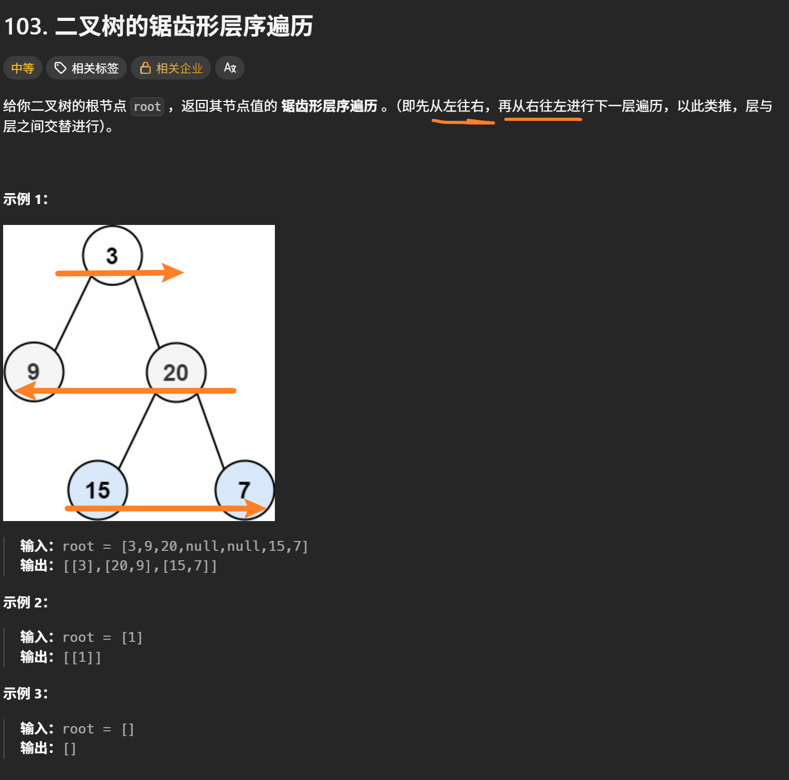

层序，但是每层换一个方向，从上往下，第一层向右，第二层向左……..

每层 vec 存到 result 时，注意方向

~~~C++
/**
 * Definition for a binary tree node.
 * struct TreeNode {
 *     int val;
 *     TreeNode *left;
 *     TreeNode *right;
 *     TreeNode() : val(0), left(nullptr), right(nullptr) {}
 *     TreeNode(int x) : val(x), left(nullptr), right(nullptr) {}
 *     TreeNode(int x, TreeNode *left, TreeNode *right) : val(x), left(left), right(right) {}
 * };
 */
class Solution {
public:
    vector<vector<int>> zigzagLevelOrder(TreeNode* root) {

        vector<vector<int>> result;

        queue<TreeNode*> que; 
        if (root)   que.push(root);

        int level_num = 1; // 记录层数

        while (!que.empty())
        {
            int level_size = que.size();
            vector<int> level_vec;
            
            for (int i = 0; i < level_size; i++)
            {
                TreeNode* node = que.front();
                que.pop();
                level_vec.push_back(node->val);

                if (node->left)     que.push(node->left);
                if (node->right)    que.push(node->right);
            }

            if (level_num % 2 == 1) // 奇数层  左到右
            {
                result.push_back(level_vec);
            }
            else // 偶数层，右到左
            {
                reverse(level_vec.begin(), level_vec.end());
                result.push_back(level_vec);
            }

            level_num++; // 层数更新         
        }


        return result;  
    }
};
~~~


# 236 [二叉树的最近公共祖先](https://leetcode.cn/problems/lowest-common-ancestor-of-a-binary-tree/description/?envType=study-plan-v2&envId=top-100-liked)

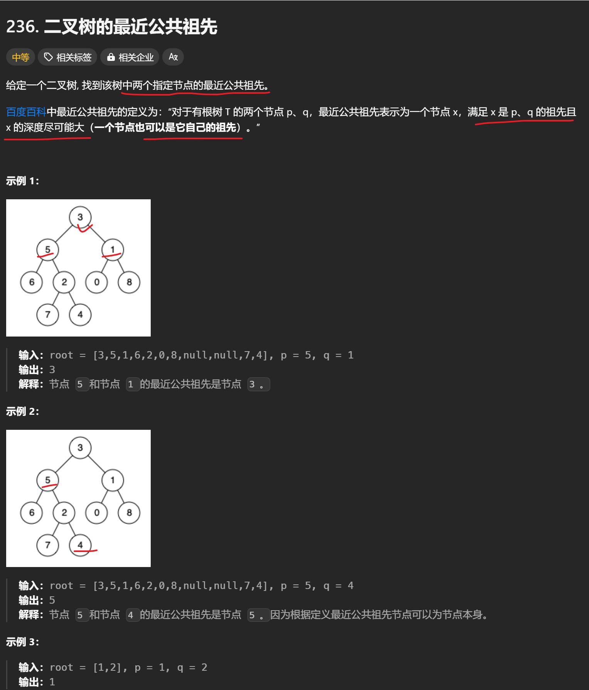

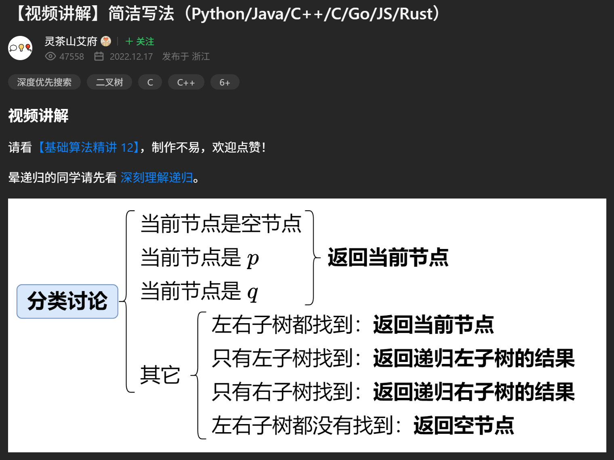

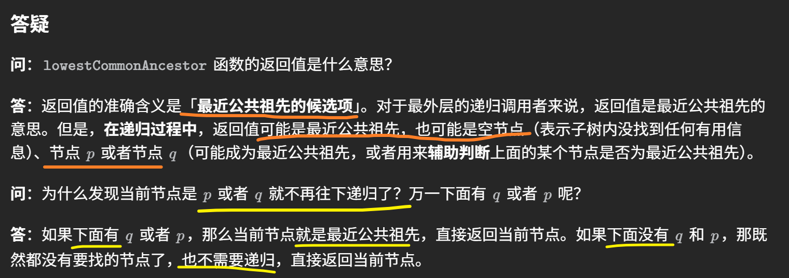

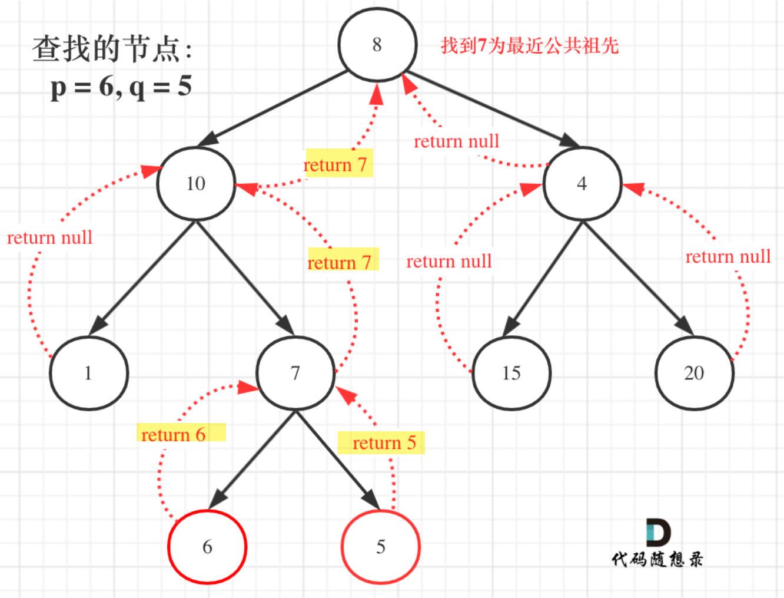

两种情况：

1、找到一个节点，**其左树出现p，右树出现q**，或者反过来，那么这个节点就是q p 最近公共祖先，返回这个节点

- 递归遍历，如果子树遇到p，就返回p，遇到q，就返回q
- 正好左右树各自遇到q p，就返回当时的root，即最近公共祖先；

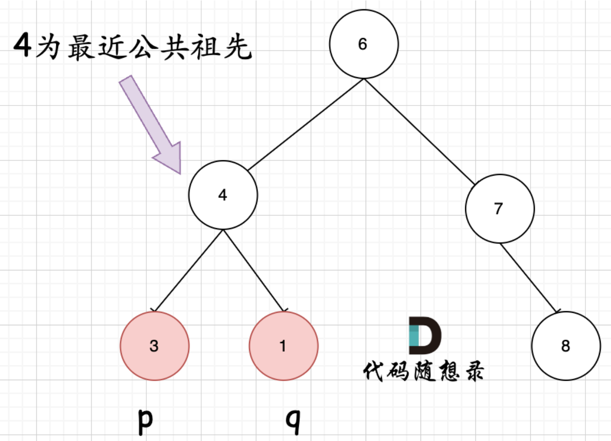

2、遍历的时候，**找到节点就是p 或 q 本身，遇到就直接返回这个节点**（其实也包含在情况1里面）

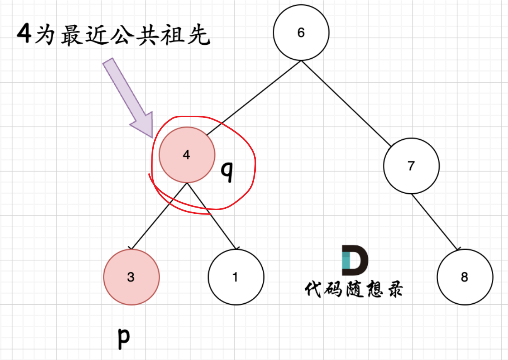


~~~C++
/**
 * Definition for a binary tree node.
 * struct TreeNode {
 *     int val;
 *     TreeNode *left;
 *     TreeNode *right;
 *     TreeNode(int x) : val(x), left(NULL), right(NULL) {}
 * };
 */
class Solution {
public:
    TreeNode* lowestCommonAncestor(TreeNode* root, TreeNode* p, TreeNode* q) {

        if (root == p || root == q || root == nullptr)  return root;

        TreeNode* left = lowestCommonAncestor(root->left, p, q);   // 往左找
        TreeNode* right = lowestCommonAncestor(root->right, p, q); // 往右找

        // 返回
        if (left && right)  return root;          // 左右树都找到，返回当前的root
        else if (!left && right)    return right; // 只有右树找到
        else if (left && !right)    return left;  // 只有左树找到
        else                        return nullptr; // 都没找到
        // return left ? left : right;
        
    }
};
~~~


> **如果递归函数有返回值，如何区分要搜索一条边，还是整棵树？？**
>
> 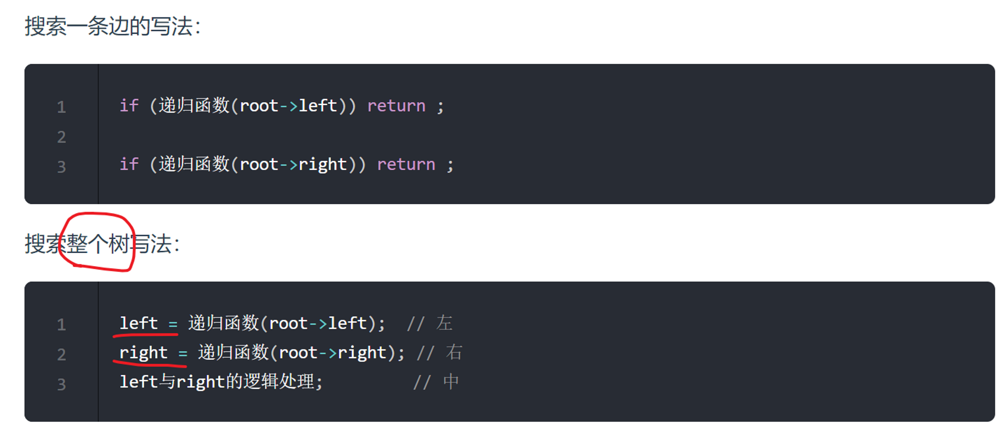
>
> 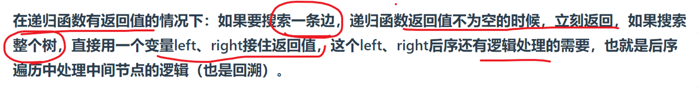


# 92 [反转链表II](https://leetcode.cn/problems/reverse-linked-list-ii/description/)


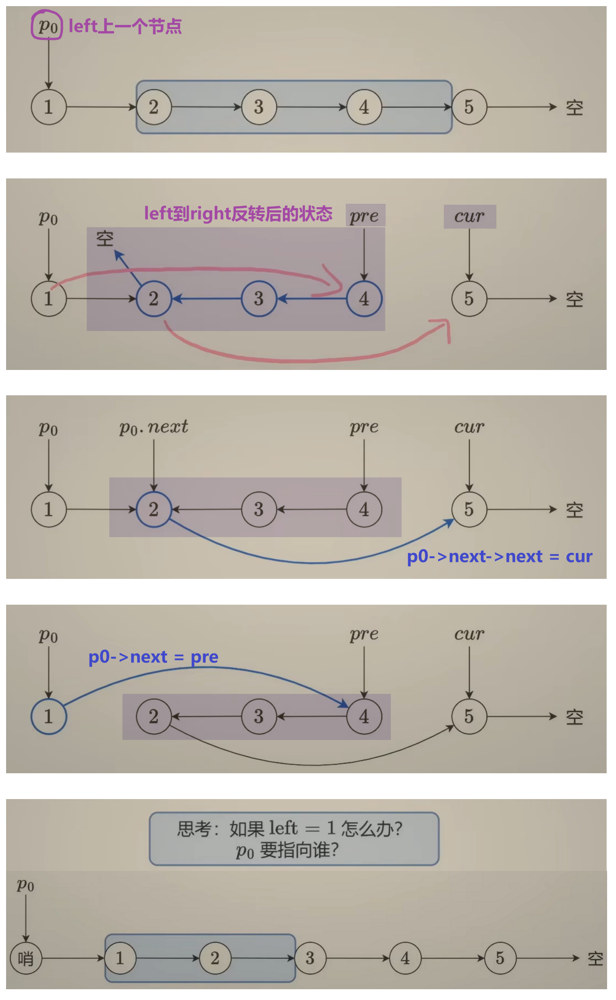

~~~C++
/**
 * Definition for singly-linked list.
 * struct ListNode {
 *     int val;
 *     ListNode *next;
 *     ListNode() : val(0), next(nullptr) {}
 *     ListNode(int x) : val(x), next(nullptr) {}
 *     ListNode(int x, ListNode *next) : val(x), next(next) {}
 * };
 */
class Solution {
public:
    ListNode* reverseBetween(ListNode* head, int left, int right) {

        ListNode* dummyHead = new ListNode(0);
        dummyHead->next = head;

        // p0 指向 left 前一个
        ListNode* p0 = dummyHead;
        for (int i = 0; i < left - 1; i++)
        {
            p0 = p0->next; // 移动到left前一个
        }

        // 反转 [left, right] 部分 
        ListNode* pre = nullptr;
        ListNode* cur = p0->next;
        for (int i = 0; i < right - left + 1; i++) // 206 普通反转
        {
            ListNode* tmp = cur->next;
            cur->next = pre;
            pre = cur;
            cur = tmp;
        }

        // 最后 cur 指向反转部分的下一个节点（尾部）
        // pre 指向反转部分的头节点，即原right

        // 连接头尾
        p0->next->next = cur;
        p0->next = pre;

        return dummyHead->next;
        
    }
};
~~~

- 时间复杂度：O(*right*)
- 空间复杂度：O(1)


# 141 [环形链表](https://leetcode.cn/problems/linked-list-cycle/description/?envType=study-plan-v2&envId=top-100-liked)

@快慢指针

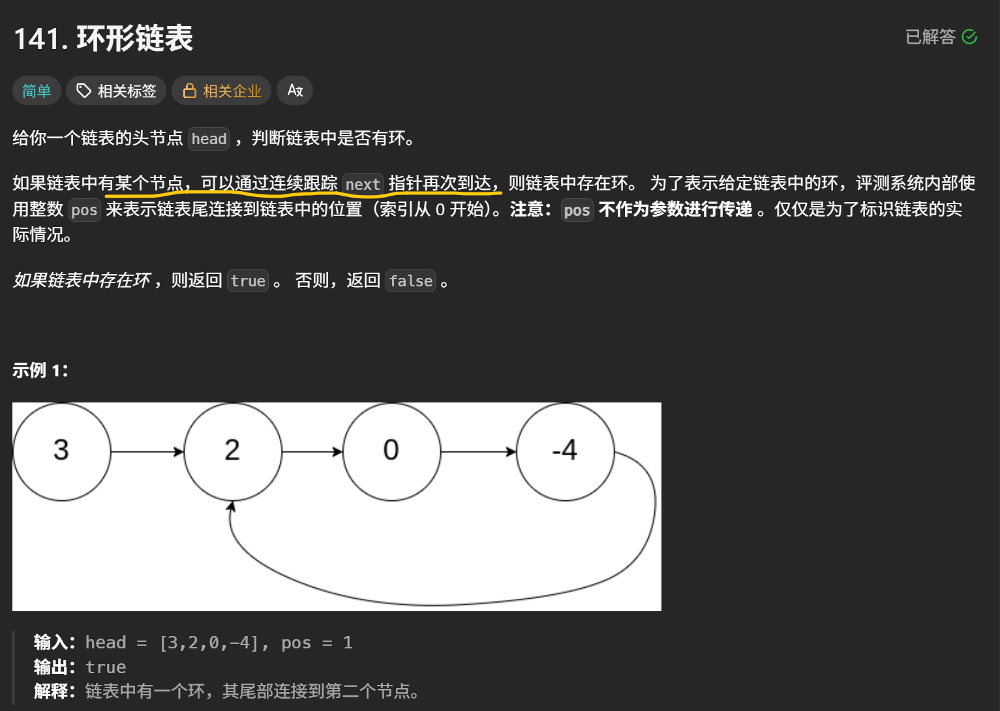

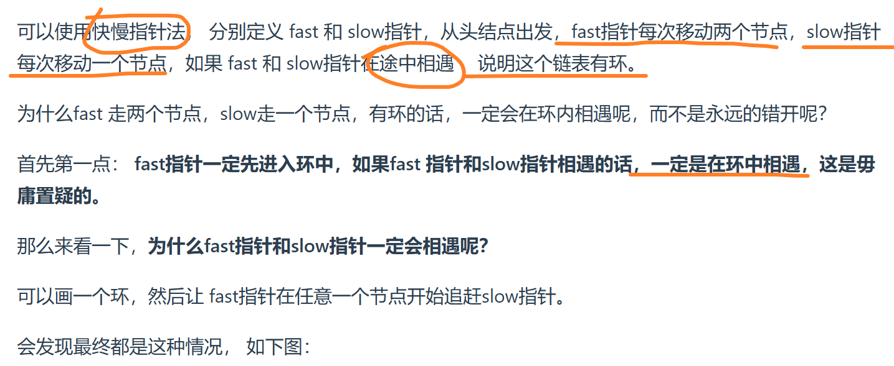

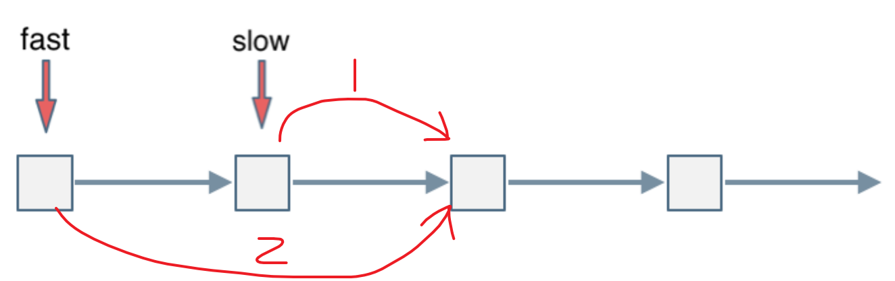


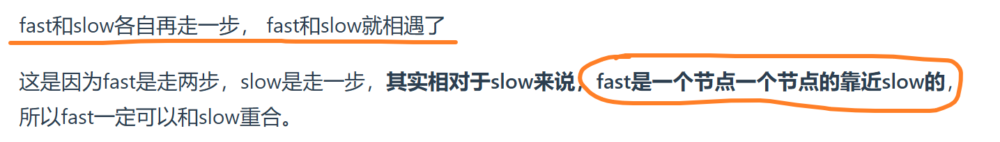

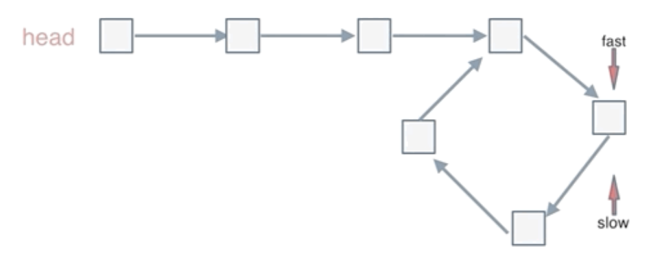


- 时间复杂度：O(*n*)，其中 *n* 为链表的长度。
- 空间复杂度：O(1)，仅用到若干额外变量。

~~~C++
/**
 * Definition for singly-linked list.
 * struct ListNode {
 *     int val;
 *     ListNode *next;
 *     ListNode(int x) : val(x), next(NULL) {}
 * };
 */
class Solution {
public:
    bool hasCycle(ListNode *head) {

        // 快慢指针
        ListNode* fast = head;
        ListNode* slow = head;

        while (fast && fast->next)
        {
            slow = slow->next;      // slow 走一步
            fast = fast->next->next;// fast 走两步

            if (slow == fast)   return true; // 相遇，说明有环
        }

        return false;
        
    }
};
~~~


# 54 [螺旋矩阵](https://leetcode.cn/problems/spiral-matrix/description/?envType=study-plan-v2&envId=top-100-liked)

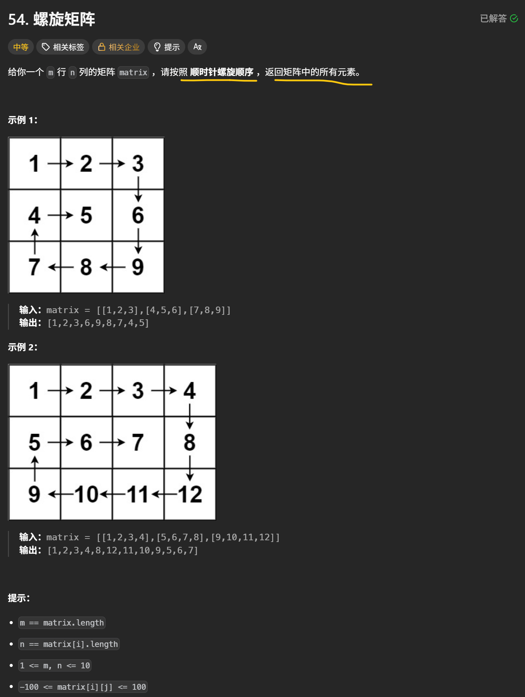


### 1、标记 + 方向数组

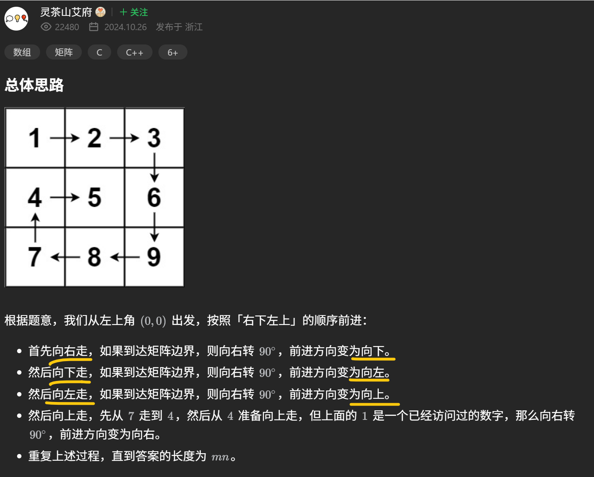

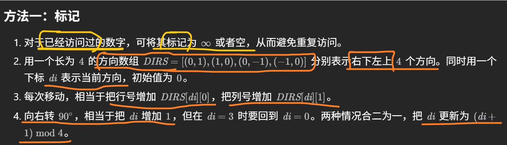

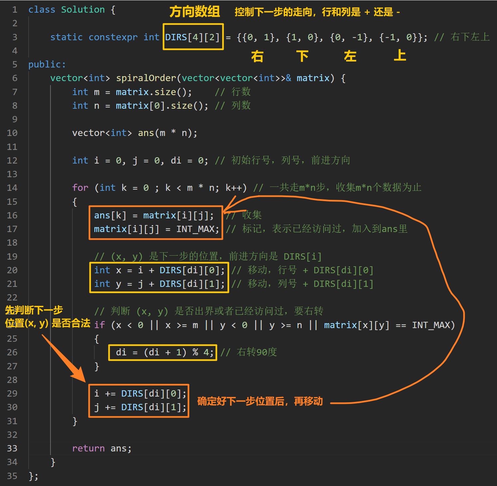

~~~C++
class Solution {
	// 方向数组，注意顺序！！！！
    static constexpr int DIRS[4][2] = {
        {0, 1},   // 向右
        {1, 0},   // 向下
        {0, -1},  // 向左
        {-1, 0}   // 向上
	};

public:
    vector<int> spiralOrder(vector<vector<int>>& matrix) {
        int m = matrix.size();    // 行数
        int n = matrix[0].size(); // 列数

        vector<int> ans(m * n);

        int i = 0, j = 0, di = 0; // 初始行号，列号，前进方向
        for (int k = 0 ; k < m * n; k++) // 一共走m*n步，收集m*n个数据为止
        {
            ans[k] = matrix[i][j];  // 收集
            matrix[i][j] = INT_MAX; // 标记，表示已经访问过，加入到ans里

            // (x, y) 是下一步的位置，前进方向是 DIRS[i]
            int x = i + DIRS[di][0]; // 移动，行号 + DIRS[di][0]
            int y = j + DIRS[di][1]; // 移动，列号 + DIRS[di][1]

            // 先判断 (x, y) 是否出界或者已经访问过
            if (x < 0 || x >= m || y < 0 || y >= n || matrix[x][y] == INT_MAX)
            {
                di = (di + 1) % 4; // 右转90度
            }

            // 确定下一个位置
            i += DIRS[di][0]; 
            j += DIRS[di][1];
        }

        return ans;       
    }
};
~~~


`constexpr`是 C++11 引入的一个关键字，用来声明“常量表达式”。它的核心作用是：**在编译期就能确定结果**。


### 2、收缩边界

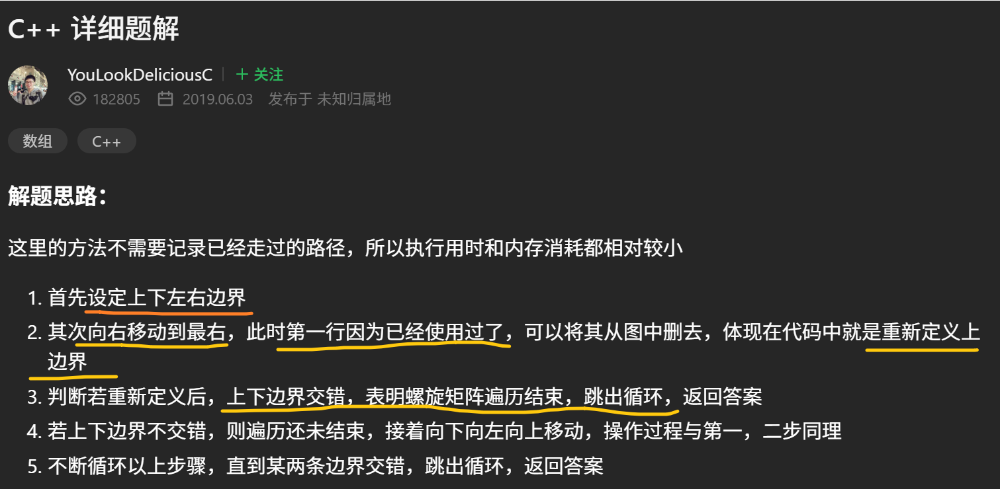


~~~C++
class Solution {
public:
    vector<int> spiralOrder(vector<vector<int>>& matrix) {

        vector <int> ans;
        if(matrix.empty()) return ans; //若数组为空，直接返回答案

        int u = 0; //赋值上下左右边界
        int d = matrix.size() - 1;
        int l = 0;
        int r = matrix[0].size() - 1;

        while(true)
        {
            // 向右移动直到最右
            for(int i = l; i <= r; ++i) ans.push_back(matrix[u][i]);
            if(++ u > d) break; //重新设定上边界，若上边界大于下边界，则遍历完成，下同
            
            // 向下
            for(int i = u; i <= d; ++i) ans.push_back(matrix[i][r]); 
            if(-- r < l) break; //重新设定右边界

            // 向左
            for(int i = r; i >= l; --i) ans.push_back(matrix[d][i]); 
            if(-- d < u) break; //重新设定下边界

            // 向上
            for(int i = d; i >= u; --i) ans.push_back(matrix[i][l]); 
            if(++ l > r) break; //重新设定左边界
        }


        return ans;
    }
};
~~~

**`++u` 先自增，再比较**

~~~C++
if (++u > d) 
~~~


# 300 [最长递增子序列](https://leetcode.cn/problems/longest-increasing-subsequence/description/)

@动规 @子序列

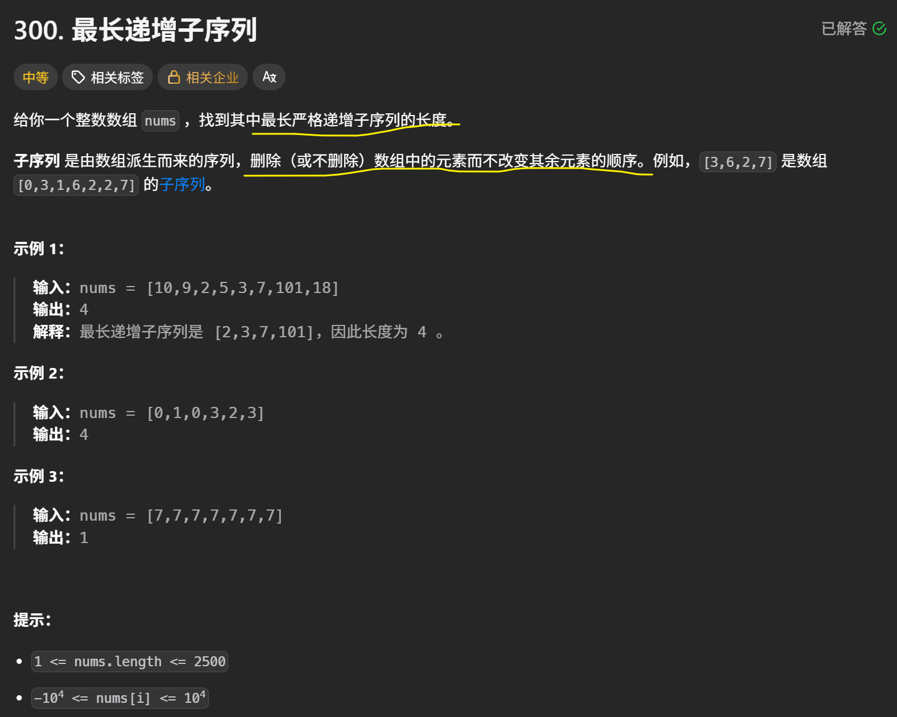

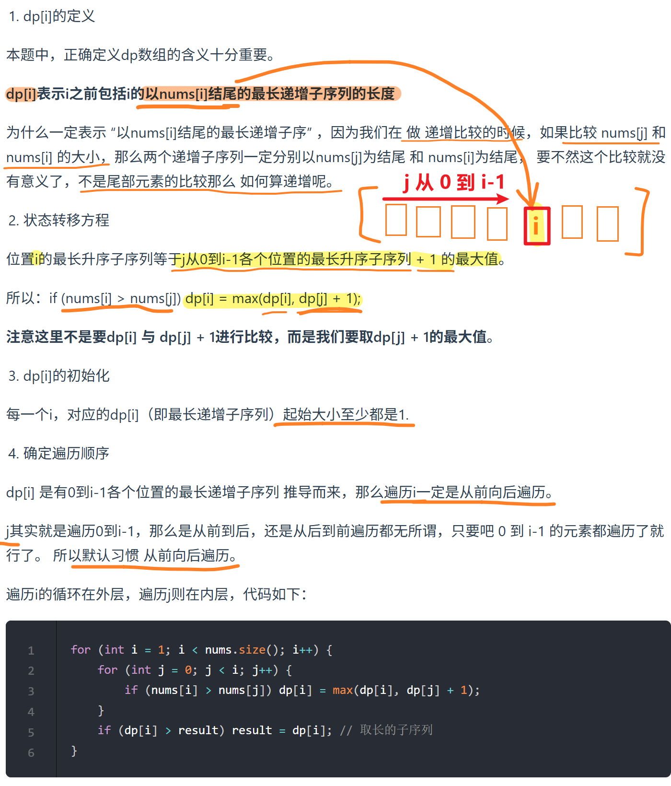


~~~C++
class Solution {
public:
    int lengthOfLIS(vector<int>& nums) {

        if (nums.size() <= 1)   return nums.size();

        // dp[i] - nums中，以nums[i]结尾的最长递增子序列的长度
        vector<int> dp(nums.size(), 1);

        int result = 0;
        for (int i = 1; i < nums.size(); i++) // 以nums[i]结尾
        {
            for (int j = 0; j < i; j++) // j 从 0 到 i-1
            {
                if(nums[i] > nums[j])   dp[i] = max(dp[i], dp[j] + 1);
            }

            if (dp[i] > result) result = dp[i]; // 取dp最大值
                                                // 注意最大值不一定是dp[最后一个]
        }

        return result;
    }
};
~~~

时间复杂度：*O*(*N*2)

空间复杂度：*O*(*N*)


# 143 [重排链表](https://leetcode.cn/problems/reorder-list/description/)

@链表中点 @反转链表 @合并链表

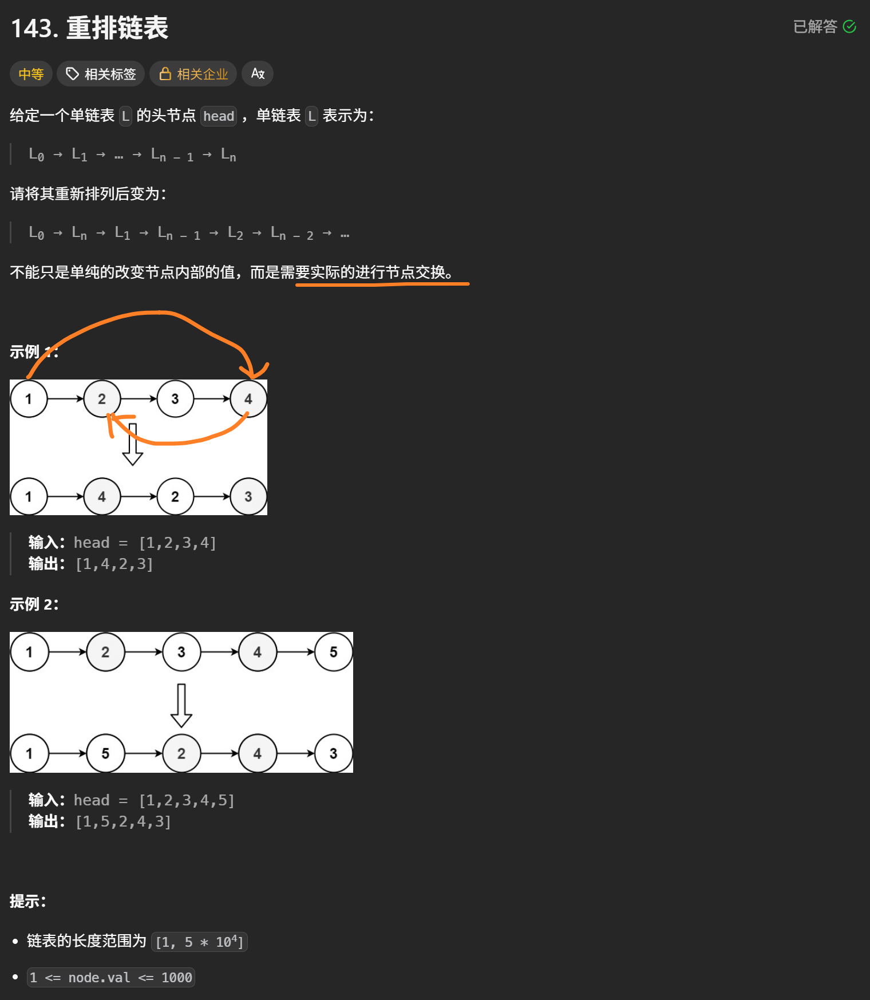

### 1、数组存链表节点

链表节点存入数组中，双指针一前一后遍历数组，重新构造链表

~~~C++
/**
 * Definition for singly-linked list.
 * struct ListNode {
 *     int val;
 *     ListNode *next;
 *     ListNode() : val(0), next(nullptr) {}
 *     ListNode(int x) : val(x), next(nullptr) {}
 *     ListNode(int x, ListNode *next) : val(x), next(next) {}
 * };
 */
class Solution {
public:
    void reorderList(ListNode* head) {

        // 节点存入数组
        vector<ListNode*> vec; // 注意存的是节点，不是值
        ListNode* node = head;
        while (node)
        {
            vec.push_back(node);
            node = node->next;
        }

        // 交替前后取数组的元素
        int i = 0, j = vec.size() - 1; 
        while (i < j)
        {
            vec[i]->next = vec[j]; // 前接后，i后移
            i++;

            if (i == j) break;

            vec[j]->next = vec[i]; // 后接前，j前移
            j--;
        }

        vec[i]->next = nullptr; // 末尾        
    }
};
~~~


### 2、中间节点+反转+合并

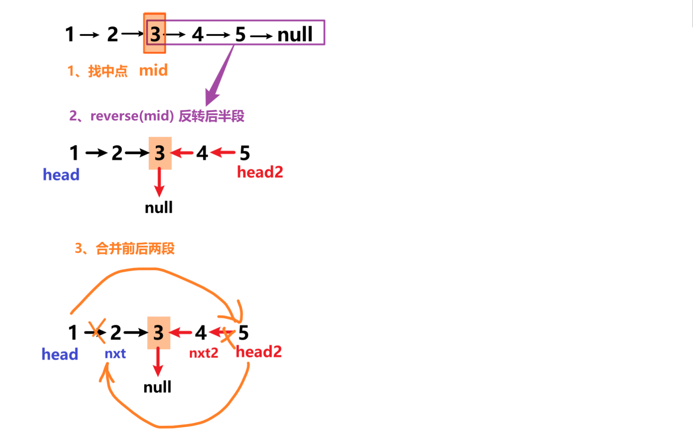


~~~C++
/**
 * Definition for singly-linked list.
 * struct ListNode {
 *     int val;
 *     ListNode *next;
 *     ListNode() : val(0), next(nullptr) {}
 *     ListNode(int x) : val(x), next(nullptr) {}
 *     ListNode(int x, ListNode *next) : val(x), next(next) {}
 * };
 */
class Solution {
public:
    // 876 链表的中间节点
    ListNode* midNode(ListNode* head)
    {
        ListNode* slow = head;
        ListNode* fast = head;
        while (fast && fast->next)
        {
            slow = slow->next; // 和876相同，奇数个就停在mid，偶数个就停在后面那个mid
            fast = fast->next->next;
        }
        return slow;
    }

    // 206 反转链表
    ListNode* reverseList(ListNode* head)
    {
        ListNode* pre = nullptr;
        ListNode* cur = head;
        while (cur)
        {
            ListNode* tmp = cur->next;
            cur->next = pre;
            pre = cur;
            cur = tmp;
        }
        return pre;
    }

    void reorderList(ListNode* head) {
        // 1->2->3->4->5->null

        ListNode* mid = midNode(head); // 找中点断开 mid - 3
        ListNode* head2 = reverseList(mid); // 后半段反转 5->4->3->null
        
        // head: 1-> 2-> 3 <- 4 <-5 head2
        //               |
        //              null

        // 合并head和head2
        while (head2->next)        
        {
            ListNode* nxt = head->next;
            ListNode* nxt2 = head2->next;

            head->next = head2; // 前后交替连接
            head2->next = nxt;
            
            head = nxt;
            head2 = nxt2;
        }

    }
};
~~~


# 23 [合并K个升序链表](https://leetcode.cn/problems/merge-k-sorted-lists/description/?envType=study-plan-v2&envId=top-100-liked)

@最小堆

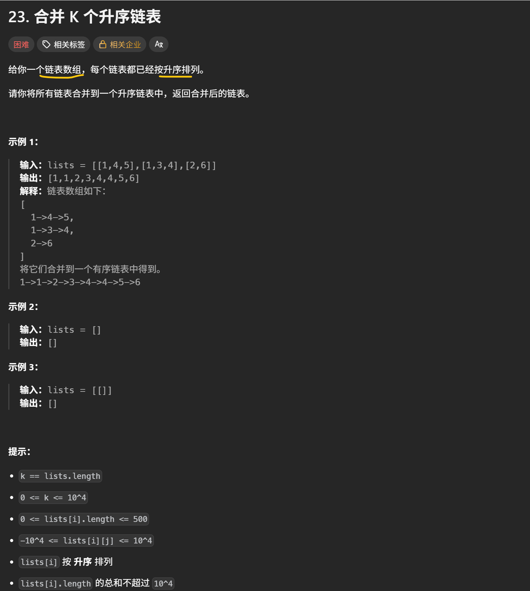

### 1、最小堆（推荐）

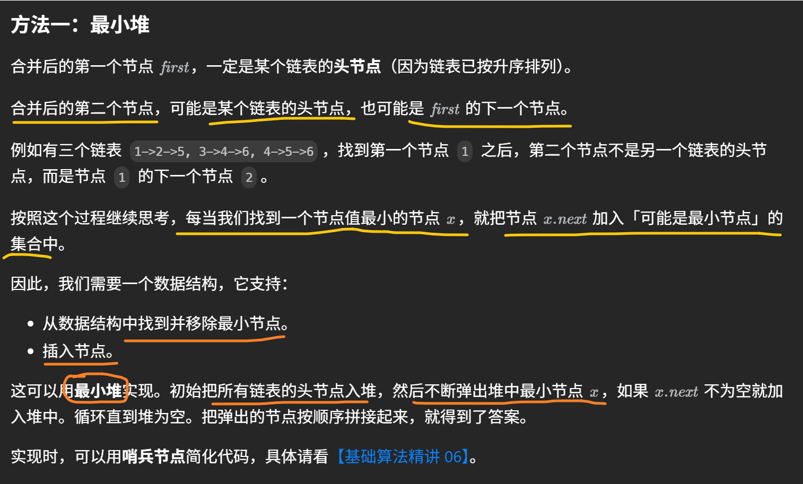


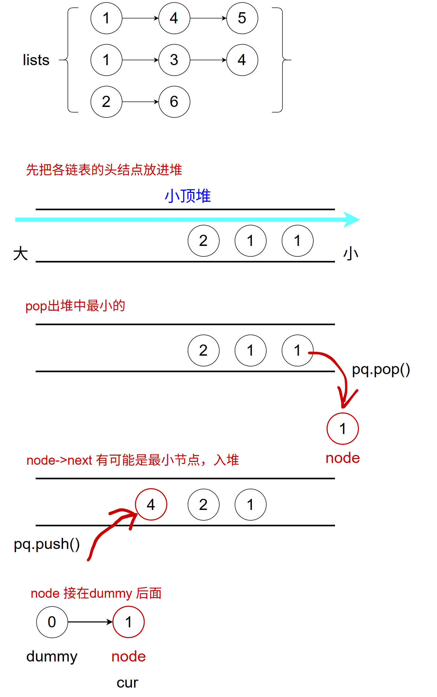

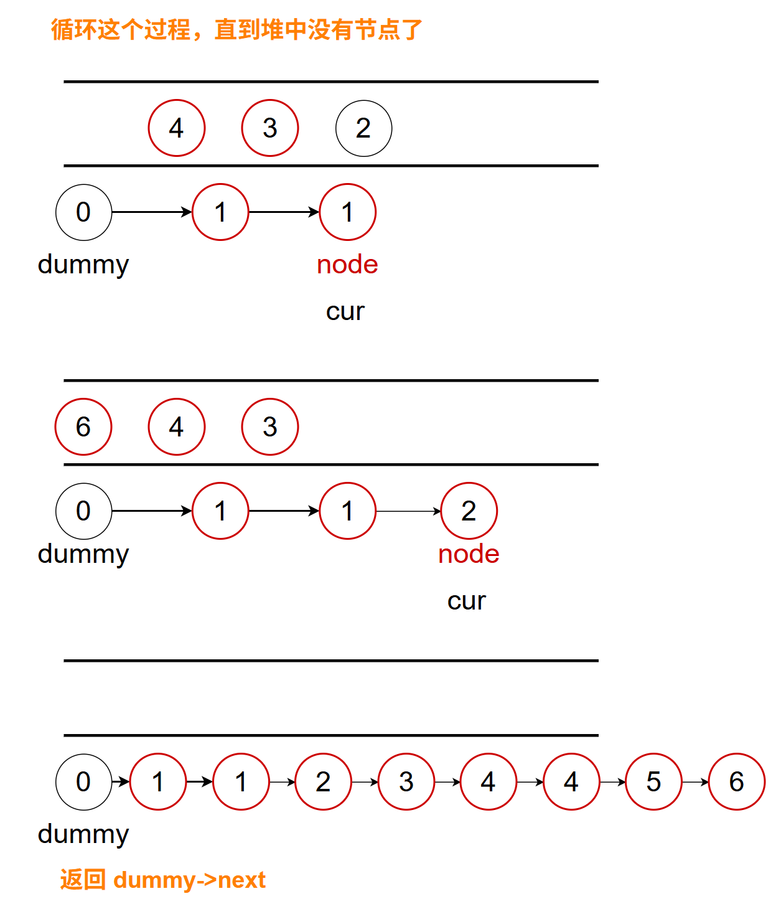


~~~C++
/**
 * Definition for singly-linked list.
 * struct ListNode {
 *     int val;
 *     ListNode *next;
 *     ListNode() : val(0), next(nullptr) {}
 *     ListNode(int x) : val(x), next(nullptr) {}
 *     ListNode(int x, ListNode *next) : val(x), next(next) {}
 * };
 */
class Solution {
public:
    ListNode* mergeKLists(vector<ListNode*>& lists) {

        auto cmp = [](const ListNode* a, const ListNode* b)
        {
            return a->val > b->val; // 最小堆
            
            // 如果 cmp(a, b) 为 true，则认为 a 的优先级低于 b，所以 a 会在 b 的后面。
            // return a->val > b->val; 即大的数排在后面，小的在前
        };

        priority_queue<ListNode*, vector<ListNode*>, decltype(cmp)> pq;
        for (auto head : lists)
        {
            if (head)   pq.push(head); // 先把所有非空链表的头节点入堆
        }
        

        ListNode* dummy = new ListNode(0);// 哨兵节点，作为合并后链表头结点的前一个节点
        ListNode* cur = dummy;
        
        while (!pq.empty()) // 循环直到堆为空
        {
            auto node = pq.top(); // 弹出剩余节点中的最小节点
            pq.pop();
            
            if (node->next) // 如果下一个节点不为空，有可能是最小节点，入堆自动排序
            {
                pq.push(node->next); 
            }

            cur->next = node; // node添加到新链表的末尾
            cur = cur->next;  // 准备合并下一个节点
        }

        return dummy->next;
    }
};
~~~

- 时间复杂度：O(*L*log*m*)，其中 *m* 为 *lists* 的长度，*L* 为所有链表的长度之和。
- 空间复杂度：O(*m*)。堆中至多有 *m* 个元素。


##### 小顶堆

~~~C++
auto cmp = [](const ListNode* a, const ListNode* b) {
    return a->val > b->val;  // 小的优先
};
~~~

`cmp` 是一个 lambda表达式，它接受两个 `ListNode*` 类型的参数 `a` 和 `b`。

返回 `a->val > b->val`，意思是：

> 在 C++ STL 的 `priority_queue` 中，**比较函数 `cmp(a, b)` 的语义是**：
>
> ​	“ 如果 `cmp(a, b)` 为 `true`，则认为 `a` 的优先级**低于** `b`，所以 `a` 会在 `b` 的**后面**。”
>
> 所以 `return a > b;` 表示 `a > b`时，返回true，大的数在后面，小的数在前（top）。


对于自定义类型如 `ListNode*`，我们用 lambda 来定制比较逻辑：

~~~C++
priority_queue<ListNode*, vector<ListNode*>, decltype(cmp)> pq(cmp);
~~~

当你向 `pq` 插入多个 `ListNode*` 时，它会根据 `cmp(a, b)` 的值来维护堆序：

- 若 `a->val > b->val` 返回 `true` → `a` 比 `b` 优先级低（ `a` 应该在后，即大的节点在后）
- 最终堆顶就是 **当前最小的节点**


##### dummy 节点的创建

~~~C++
ListNode dummy{};           // 哨兵节点，作为合并后链表头结点的前一个节点
auto cur = &dummy;        // 指针 cur 指向 dummy 
~~~

`{}`：这是 C++11 引入的值初始化语法，表示将指针初始化为 `nullptr`（空指针）。

| 写法              | 说明                                                         |
| ----------------- | ------------------------------------------------------------ |
| `ListNode dummy;` | 创建了一个实际的 **`ListNode` 实例**（默认值为0, nullptr） ✅<br />`dummy` 是一个实际存在于**栈上**的 `ListNode` 实例<br />访问：`dummy.next`  `dummy.val` |


和常见写法的区别：

~~~C++
ListNode* dummy = new ListNode(0); // 使用 new 在堆上创建了一个值为 0 的 ListNode 节点
ListNode* cur = dummy;
~~~

`ListNode* dummy`：声明一个**指针变量 `dummy`，类型是 `ListNode*`**，即指向 `ListNode` 类型的指针。

功能等价：**逻辑上等价**

- 两者最终目的完全一致：使用一个“哨兵节点”作为合并后链表的起点（占位头结点），便于构造和返回。
- 后续都是操作 `cur` 指针，无论它指向栈上的 `dummy` 还是堆上的 `*dummy`，逻辑无差别。

但**语义和内存管理上不完全等价**：

| 写法                                 | 存储位置 | 是否需要手动释放      | 是否更推荐   |
| ------------------------------------ | -------- | --------------------- | ------------ |
| `ListNode dummy;`                    | 栈内存   | ❌ 不需要              | ✅ 推荐       |
| `ListNode* dummy = new ListNode(0);` | 堆内存   | ✅ 需要 `delete dummy` | ⚠️ 易内存泄漏 |

如果你是在函数体内部构造链表，不跨作用域、不需要共享链表头，推荐使用 **栈上 dummy 节点写法**：

```
ListNode dummy;
ListNode* cur = &dummy;
```

更安全，不需要考虑 `delete`，不会造成内存泄漏，语义清晰。


### 2、分治递归

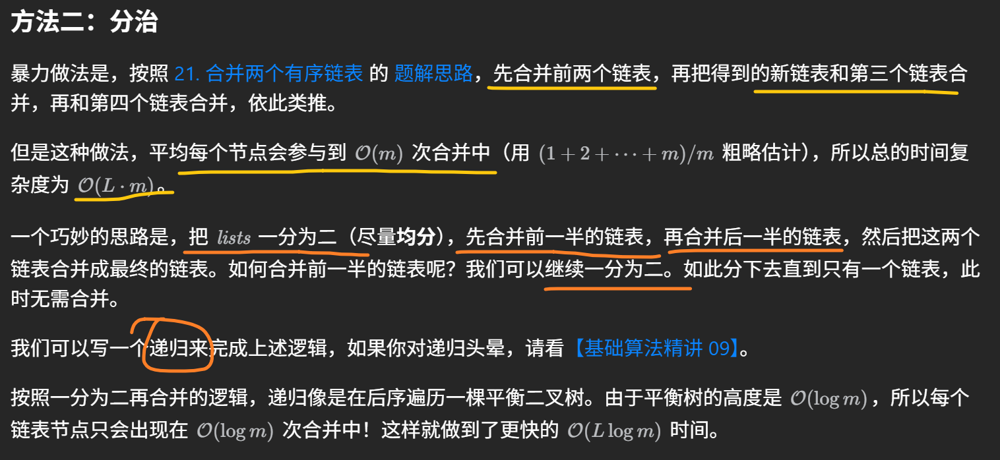

~~~C++
class Solution {
public:

    // 21 合并两个有序链表(升序)
    ListNode* mergeTwoLists(ListNode* list1, ListNode* list2)
    {
        ListNode* dummy = new ListNode(0);
        ListNode* cur = dummy;
        while (list1 && list2)
        {
            if (list1->val < list2->val)  
            {
                cur->next = list1;
                list1 = list1->next;
            }
            else
            {
                cur->next = list2;
                list2 = list2->next;
            }

            cur = cur->next;
        }

        cur->next = list1 ? list1 :  list2;
        return dummy->next;
    }


    // 合并从 lists[i] 到 lists[j-1] 的链表，左闭右开
    ListNode* mergeRange(vector<ListNode*>& lists, int i, int j) 
    {
        int m = j - i; // [i, j)
        if (m == 0) return nullptr;  // 输入的 lists 可能是空的
        if (m == 1) return lists[i]; // 无需合并，直接返回
        
        auto left  = mergeRange(lists, i, i + m / 2); // 递归合并左半部分
        auto right = mergeRange(lists, i + m / 2, j); // 递归合并右半部分

        return mergeTwoLists(left, right); // 最后把左和右两半合并
    }


    ListNode* mergeKLists(vector<ListNode*>& lists) {

        return mergeRange(lists, 0, lists.size()); // 递归合并
    }
};
~~~

时间复杂度：O(Llogm)

- 其中 m 为 lists 的长度，L 为所有链表的长度之和。每个节点参与链表合并的次数为 O(logm) 次，一共有 L 个节点，所以总的时间复杂度为 O(Llogm)。

空间复杂度：O(logm)

- 递归深度为 O(logm)，需要 O(logm) 的栈空间。Python 忽略切片产生的额外空间。


# 415 [字符串相加](https://leetcode.cn/problems/add-strings/description/)

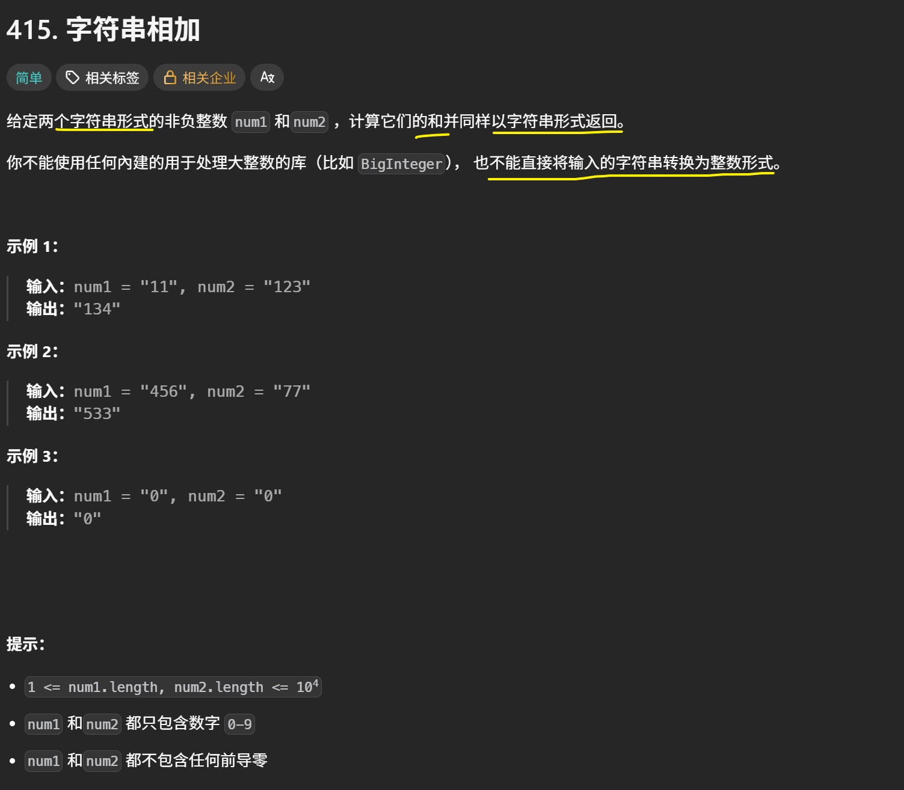


逆序相加，转字符串拼接成和，最后反转

注意进位

~~~C++
class Solution {
public:
    string addStrings(string num1, string num2) {
        // num1 = "11", num2 = "123"

        string ans;

        int cur = 0; // 记录每一位对应数字的相加和
        
        // 双指针，从字符串最低位开始
        int i = num1.size() - 1;
        int j = num2.size() - 1; 

        while (i >= 0 || j >= 0 || cur > 0)
        {
           if (i >= 0)   cur += num1[i--] - '0';
           if (j >= 0)   cur += num2[j--] - '0';

           ans += to_string(cur % 10); // 现在拼起来的和是逆序的 "431"
           
           cur = cur / 10; // 保留进位进入下次运算
        }

        reverse(ans.begin(), ans.end()); // 反转 "134"

        return ans;        
    }
};
~~~


# 56 [合并区间](https://leetcode.cn/problems/merge-intervals/description/?envType=study-plan-v2&envId=top-100-liked)

@贪心

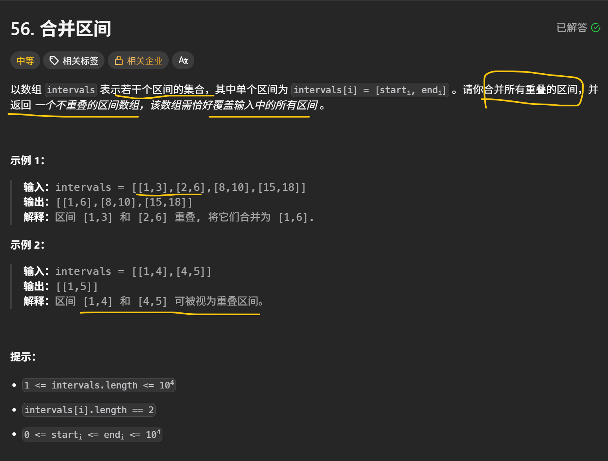

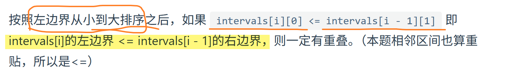


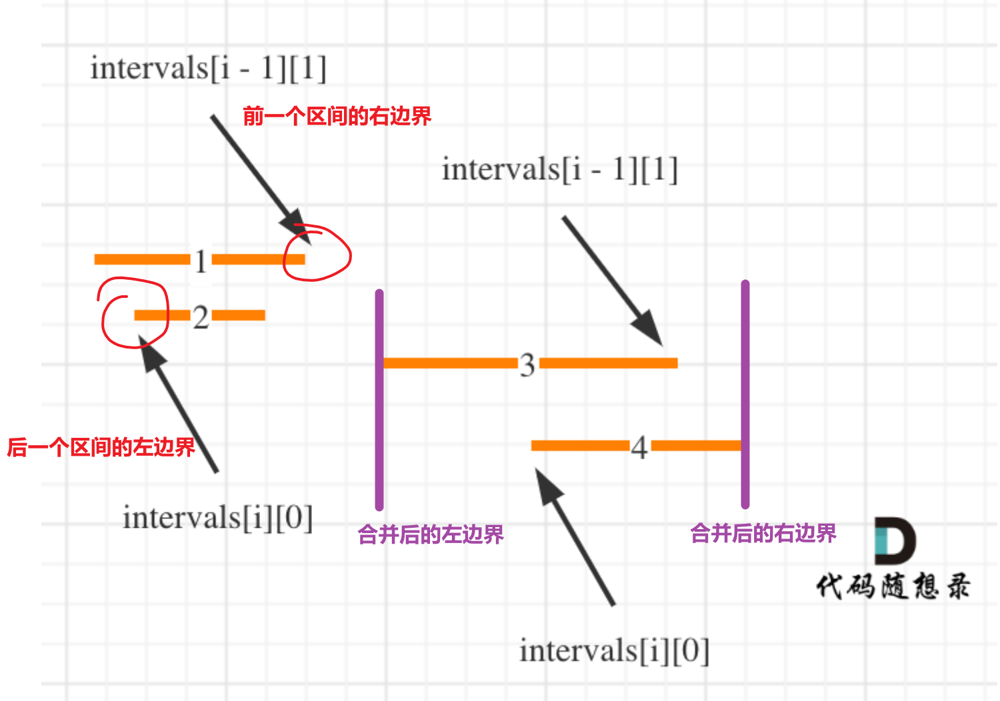


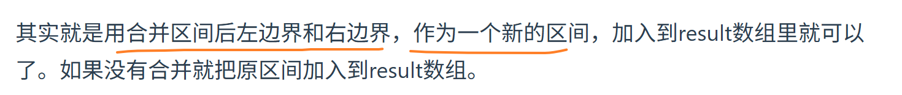

~~~C++
class Solution {
public:
    vector<vector<int>> merge(vector<vector<int>>& intervals) {

        if (intervals.size() == 0)  return intervals;

        // 先按左边界排序，从小到大 (lambda)
        sort(intervals.begin(), intervals.end(),
                [](const vector<int>& a, const vector<int>& b) {return a[0] < b[0];} );

        vector<vector<int>> result;
        result.push_back(intervals[0]); // 第一个区间放进result
        for (int i = 1; i < intervals.size(); i++)
        {
            // 有重叠，更新前一个范围的右边界 
            if (intervals[i][0] <= result.back()[1]) // 需要<=，边界重叠也算
            {
                // 更新右边界，要比较取较大值，不能直接取新的intervals[i][1]
                result.back()[1] = max(result.back()[1], intervals[i][1]); 
            }
            // 无重叠，直接放进result
            else 
            {
                result.push_back(intervals[i]);
            }
        }

        return result;  
    }
};
~~~


lambda表达式：

~~~C++
  // 先按左边界排序，从小到大 (lambda)
  sort(intervals.begin(), intervals.end(),
          [](const vector<int>& a, const vector<int>& b) {return a[0] < b[0];});
~~~

如果用仿函数：

~~~C++
class Solution {
public:
    // 仿函数
    static bool cmp (const vector<int>& a, const vector<int>& b)
    {
        return a[0] < b[0];
    }

    vector<vector<int>> merge(vector<vector<int>>& intervals) {

        if (intervals.size() == 0)  return intervals;

        // 先按左边界排序，从小到大 (lambda)
        sort(intervals.begin(), intervals.end(), cmp); // 替换成 cmp
		
        // ...
    }
};
~~~


# 160 [相交链表](https://leetcode.cn/problems/intersection-of-two-linked-lists/description/?envType=study-plan-v2&envId=top-100-liked)

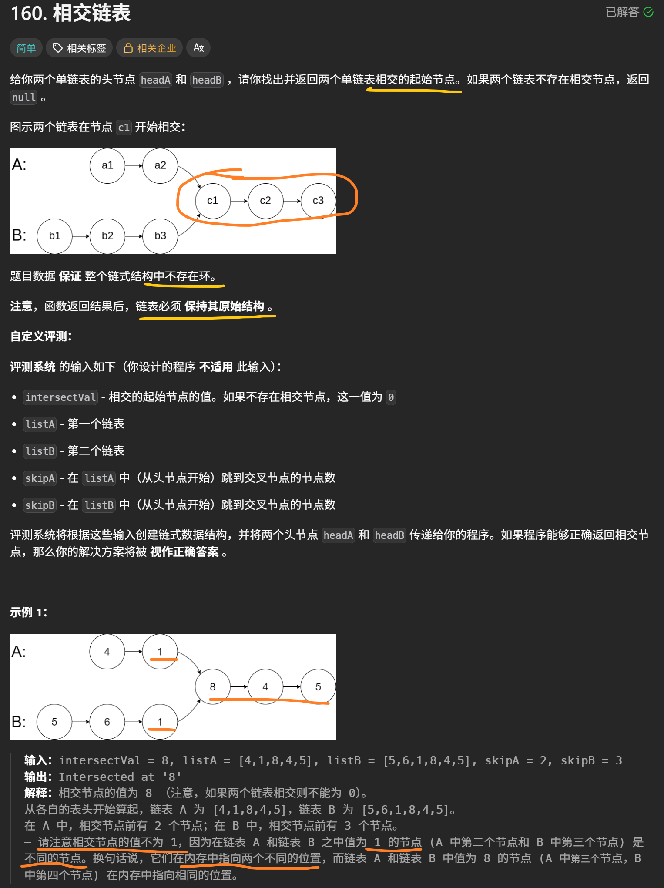

==**注意是指针相等！！！** **不是数值相等！！**==


## 1、拼接链表（推荐！）

> [Krahets 题解](https://leetcode.cn/problems/intersection-of-two-linked-lists/solutions/12624/intersection-of-two-linked-lists-shuang-zhi-zhen-l/?envType=study-plan-v2&envId=top-100-liked)

- 假设拼接两个链表 分别**BA拼接，AB拼接**，拼接后两链表长度肯定相同
- 如果A和B有相交，则 **BA 和 AB** 的**末尾几位肯定是相同的**
- 这样的两个叠加链表同时遍历到有相同节点的时候，一定一边是A 链表一边是 B 链表
- 相交节点开始到结尾的节点都相同，所以**第一个相同的节点**就是 A 链表和 B 链表的交点

 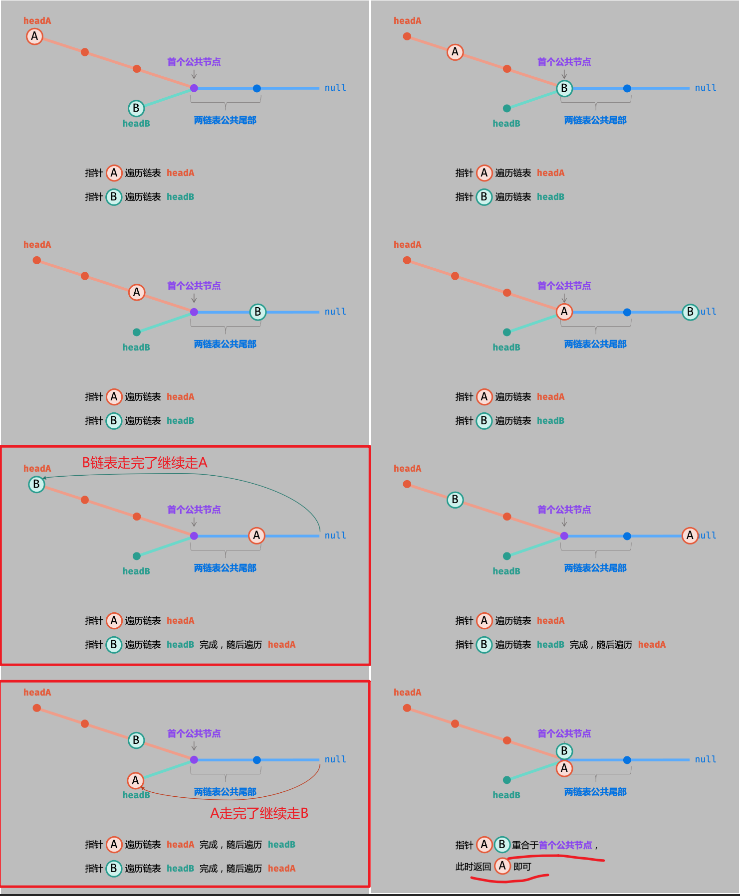


~~~C++
/**
 * Definition for singly-linked list.
 * struct ListNode {
 *     int val;
 *     ListNode *next;
 *     ListNode(int x) : val(x), next(NULL) {}
 * };
 */
class Solution {
public:
    ListNode *getIntersectionNode(ListNode *headA, ListNode *headB) {

        ListNode* curA = headA;
        ListNode* curB = headB;
        
        // curA 走 A->B, curB 走 B->A，直到 curA = curB
        while (curA != curB)
        {  
            curA = curA  ? curA->next : headB;// curA走到null，再继续走B，相当于拼接 A->B           
            curB = curB  ? curB->next : headA;// curB走到null，再继续走A，相当于拼接 B->A
        }
        
        return curA; // 最后两个指针重合 curA = curB
        
        // 有交点，返回交点
        // 无交点，curA 和 curB 会一起走到nullptr，返回的也就是 curA = nullptr  
    }
};
~~~


## 2、对齐尾部（常规）

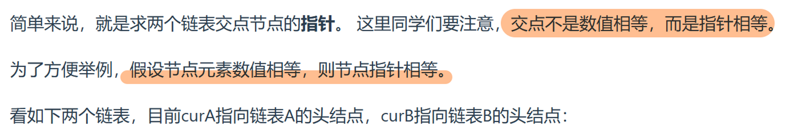

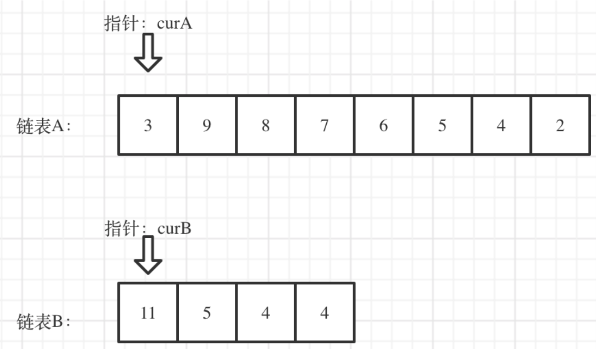

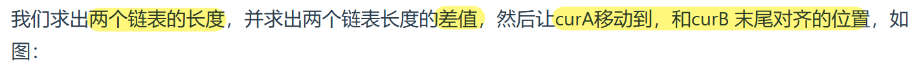

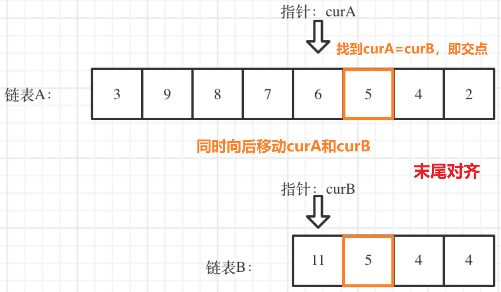

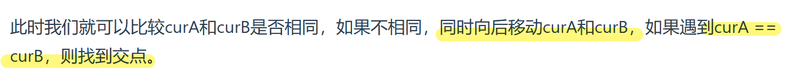


**注意最后比较的一定是 `curA == curB` ，<span style="color:#CC0000;">节点相等，包括数值相等，内存位置相同</span>**

~~~C++
/**
 * Definition for singly-linked list.
 * struct ListNode {
 *     int val;
 *     ListNode *next;
 *     ListNode(int x) : val(x), next(NULL) {}
 * };
 */
class Solution {
public:
    ListNode *getIntersectionNode(ListNode *headA, ListNode *headB) {

        ListNode* curA = headA;
        ListNode* curB = headB;

        // 求链表A和链表B的长度
        int lenA = 0, lenB = 0;
        while (curA != nullptr)
        {
            lenA++;
            curA = curA->next;
        }
        while (curB != nullptr)
        {
            lenB++;
            curB = curB->next;
        }

        // cur再移回头节点
        curA = headA;
        curB = headB;

        // 让curA称为较长链表的头，lenA为其长度
        if (lenB > lenA)
        {
            swap(lenA, lenB);
            swap(curA, curB);
        }

        // 末尾对齐，移动curA到与curB相对应的位置
        int gap = lenA - lenB;
        while (gap--)	curA = curA->next;

        // 然后 curA curB 同时向后移动，遇到相同节点即相交节点
        while (curA != nullptr)
        {
            if (curA == curB)   return curA; // 注意是指针相等，不是数值相等！！！

            curA = curA->next;
            curB = curB->next;
        }

        return nullptr; // 无相交节点
    }
};
~~~


# 42 [接雨水](https://leetcode.cn/problems/trapping-rain-water/description/?envType=study-plan-v2&envId=top-100-liked)

@前缀和 @双指针收缩

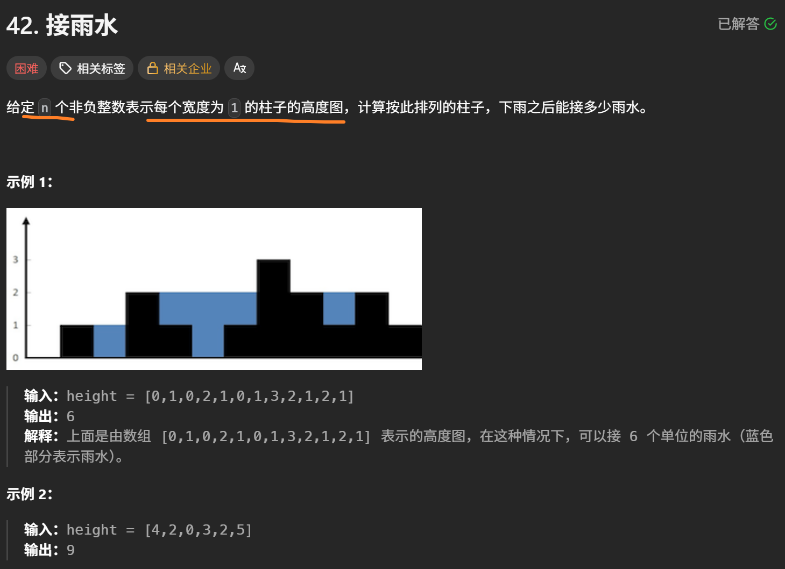

### 1、前后缀分离

分割成每个 height[i] 一块，把每块看成是宽度是1，高度为 height[i] 的水桶，能盛多少水，**取决于左右两边挡板的短板有多高**，也就是当前height[i]**前后的最高高度取较小值**。

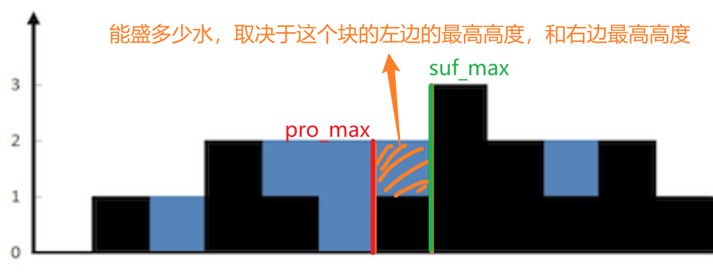

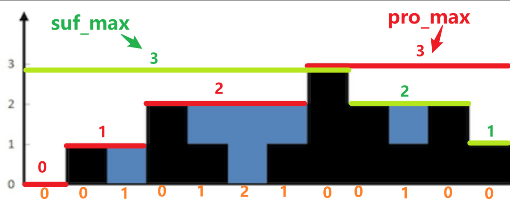

height[i] 的**【左边最高高度，右边最高高度】取最小值**，再**减去 height[i]** 就是当前这个块能盛的水的高度，也即面积（底部宽度为1）。

~~~C++
ans += min(pre_max[i], suf_max[i]) - height[i]; // 每块的面积，宽度是1
~~~

~~~C++
class Solution {
public:
    int trap(vector<int>& height) {
        
        // 前后缀分离
		// 时间复杂度 O(n)   空间复杂度 O(n)
        int n = height.size();

        // 从 height[0] 到 height[i] 的最大值，从前向后
        vector<int> pre_max(n); 
        pre_max[0] = height[0];
        for (int i = 1; i < n; i++)	pre_max[i] = max(pre_max[i - 1], height[i]);
        
        // 从 height[n-1] 到 height[i] 的最大值，从后向前
        vector<int> suf_max(n); 
        suf_max[n - 1] = height[n - 1];
        for (int i = n - 2; i >= 0; i--)	suf_max[i] = max(suf_max[i + 1], height[i]);
        

        int ans = 0;
        for (int i = 0; i < n; i++)
        {
            // 取 前缀后缀的较小值 - height[i] 作为当前盛水的高度
            ans += min(pre_max[i], suf_max[i]) - height[i]; // 每块的面积，宽度是1
        }

        return ans;
    }
};
~~~


ACM：

~~~C++
#include <iostream>
#include <vector>
#include <algorithm>

using namespace std;

int trap(vector<int>& height) 
{
    int n = height.size();

    // 前缀最大值
    vector<int> pre_max(n);
    pre_max[0] = height[0];
    for (int i = 1; i < n; i++)
    {
        pre_max[i] = max(pre_max[i - 1], height[i]);
    }
    // 后缀最大值
    vector<int> suf_max(n);
    suf_max[n - 1] = height[n - 1];
    for (int i = n - 2; i >= 0; i--)
    {
        suf_max[i] = max(suf_max[i + 1], height[i]);
    }

    int ans = 0;
    for (int i = 0; i < n; i++)
    {
        ans += min(suf_max[i], pre_max[i]) - height[i]; // 累加面积
    }
    return ans;
    
}

int main()
{
    int n;
    cin >> n; // 输入height长度

    vector<int> height(n);
    for (int i = 0; i < n; i++)
    {
        cin >> height[i]; // 输入height数组
    }

    int result = trap(height);
    cout << result << endl;

    return 0;
}
~~~

示例输入：

~~~C++
12
0 1 0 2 1 0 1 3 2 1 2 1
~~~

输出：

~~~C++
6
~~~


### 2、相向双指针

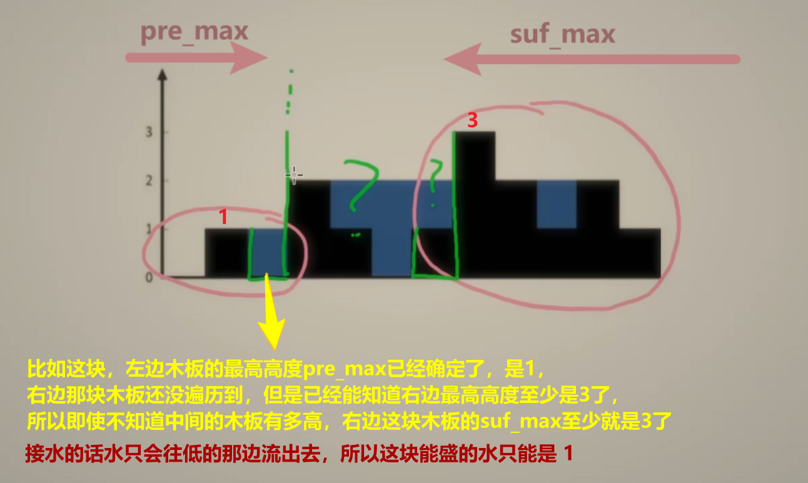

**总结：**接水多少由**短的木板**决定，left right指针向中间收缩

接水的高度由前缀最大值和后缀最大值中的**较小值**决定，左右指针谁小谁移动，相遇位置会是最高

- 如果**前缀最大值 < 后缀最大值**，这个木桶的容量就是**前缀最大值-height[left]**，算完之后left指针**向右**；
- 如果**后缀最大值 < 前缀最大值**，这个木桶的容量就是**后缀最大值-height[right]**，算完之后right指针**向左**

~~~C++
class Solution {
public:
    int trap(vector<int>& height) {

        // 相向双指针
        // 时间复杂度 O(n)   空间复杂度 O(1)
        int ans = 0;

        int left = 0, right = height.size() - 1; // 左右指针，向中间移动

        int pre_max = 0, suf_max = 0; // 前后缀最大值

        while (left < right) // 可以不加等号，因为在「谁小移动谁」的规则下，相遇的位置一定是最高的柱子，这个柱子是无法接水的
        {
            pre_max = max(pre_max, height[left]);
            suf_max = max(suf_max, height[right]);

            // 找能确定的较短的柱子
            if (pre_max < suf_max)
            {
                ans += pre_max - height[left];
                left++; 
            }
            else
            {
                ans += suf_max - height[right];
                right--;
            }
        }

        return ans;        
    }
};
~~~


# 72 [编辑距离](https://leetcode.cn/problems/edit-distance/description/?envType=study-plan-v2&envId=top-100-liked)

@ 动规 @dp最左最上扩充

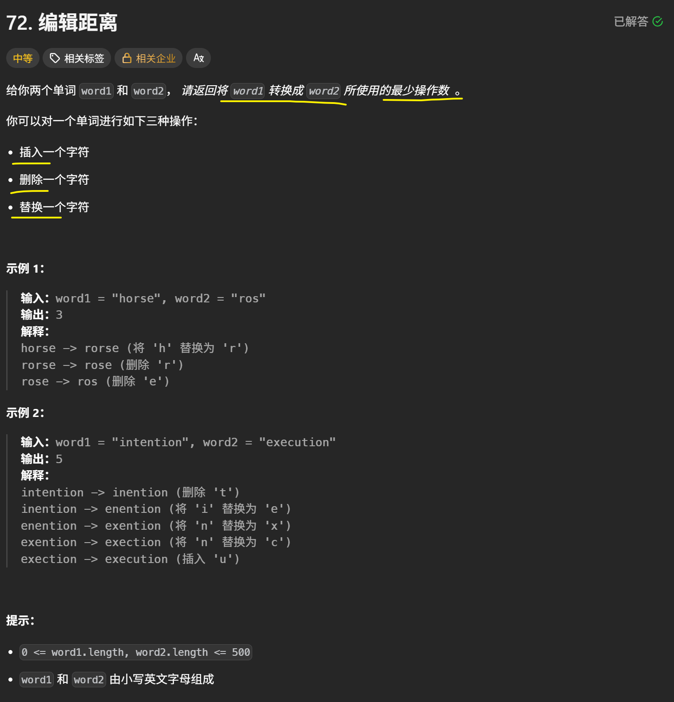

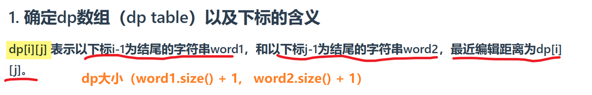

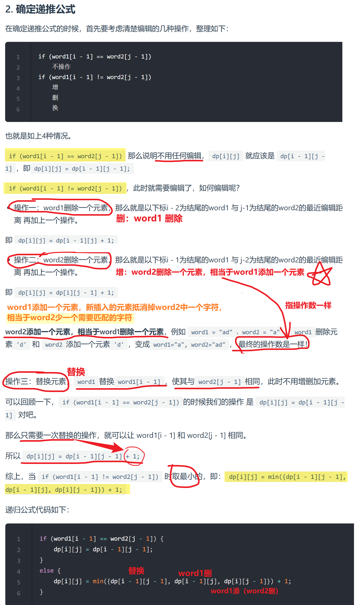

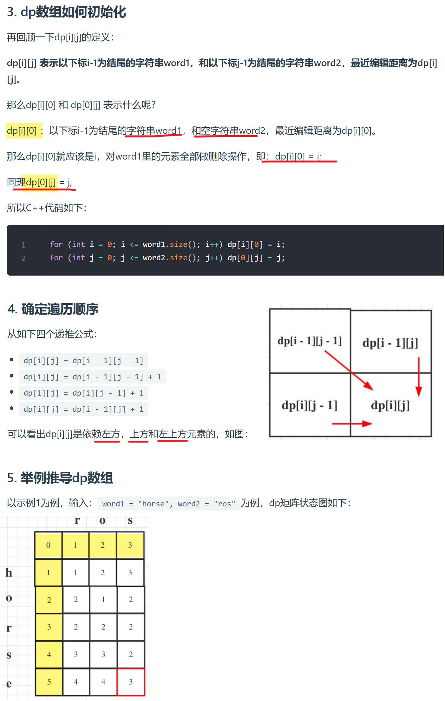


~~~C++
class Solution {
public:
    int minDistance(string word1, string word2) {

        // word1 = "horse", word2 = "ros"

        // dp[i][j] - 以word1[i-1]结尾，和以word2[j-1]结尾的部分，最近编辑距离为dp[i][j]
        vector<vector<int>> dp(word1.size() + 1, vector<int>(word2.size() + 1, 0));

        // 初始化
        for (int i = 0; i <= word1.size(); i++)  dp[i][0] = i; // word1 和 空word2
        for (int j = 0; j <= word2.size(); j++)  dp[0][j] = j; // 空word1 和 word1


        for (int i = 1; i <= word1.size(); i++)
        {
            for (int j = 1; j <= word2.size(); j++)
            {
                // 相同，不需要操作，延续上一个结果 
                if (word1[i - 1] == word2[j - 1])  
                {
                    dp[i][j] = dp[i - 1][j - 1]; 
                }
                else // word1[i - 1] != word2[j - 1]  固定对 word1 增 删 改
                {
                    dp[i][j] = min({dp[i - 1][j] + 1,  // word1删一个
                                    dp[i][j - 1] + 1,  // word2删一个 <==> word1增加
                                    dp[i - 1][j - 1] + 1}); // 替换word1[i-1]
                }
            }
        }

        return dp[word1.size()][word2.size()];
    }
};
~~~


# 124 [二叉树中的最大路径和](https://leetcode.cn/problems/binary-tree-maximum-path-sum/description/?envType=study-plan-v2&envId=top-100-liked)

@ 递归

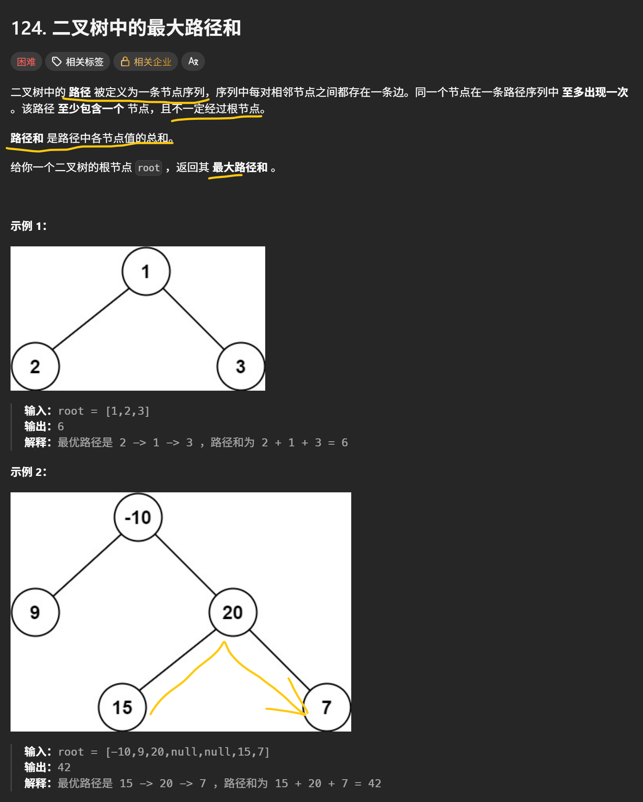


在 【543 二叉树的直径】的基础上，改成求节点和

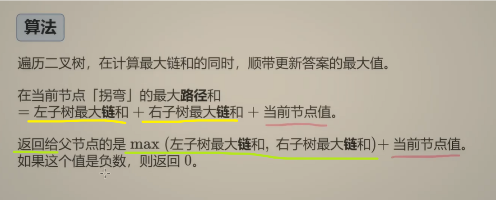

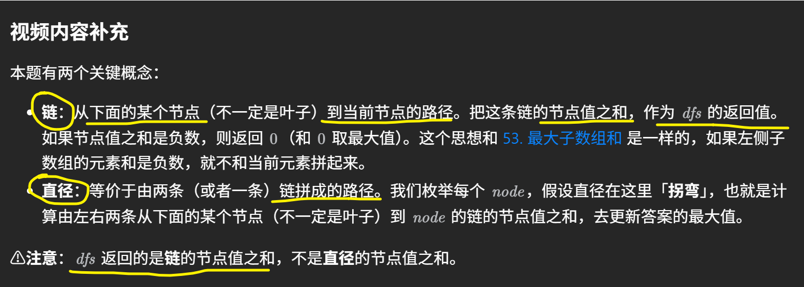

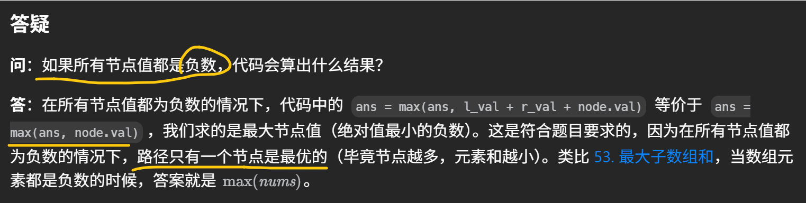


~~~C++
/**
 * Definition for a binary tree node.
 * struct TreeNode {
 *     int val;
 *     TreeNode *left;
 *     TreeNode *right;
 *     TreeNode() : val(0), left(nullptr), right(nullptr) {}
 *     TreeNode(int x) : val(x), left(nullptr), right(nullptr) {}
 *     TreeNode(int x, TreeNode *left, TreeNode *right) : val(x), left(left), right(right) {}
 * };
 */
class Solution {
public:
    int maxPathSum(TreeNode* root) {

        int ans = INT_MIN;
        
        // 返回当前子树最大链和，不取负数
        auto dfs = [&] (this auto&& dfs, TreeNode* node) ->int {
            if (node == nullptr)    return 0;// 没有节点，和为0

            int l_val = dfs(node->left); // 左树最大链和
            int r_val = dfs(node->right); // 右树最大链和

            ans = max(ans, l_val + r_val + node->val); // 两条链拼成路径（加上当前节点）
            
            return max( max(l_val, r_val) + node->val, 0 ); // 当前子树最大链和
                                                            // 和0比较，不取负数
        };

        dfs(root);
        return ans;
        
    }
};
~~~

时间复杂度：O(N)

空间复杂度：O(N)


不用lambda的写法

~~~C++
/**
 * Definition for a binary tree node.
 * struct TreeNode {
 *     int val;
 *     TreeNode *left;
 *     TreeNode *right;
 *     TreeNode() : val(0), left(nullptr), right(nullptr) {}
 *     TreeNode(int x) : val(x), left(nullptr), right(nullptr) {}
 *     TreeNode(int x, TreeNode *left, TreeNode *right) : val(x), left(left), right(right) {}
 * };
 */
class Solution {
public:
    int ans = INT_MIN;

    int dfs(TreeNode* node) 
    {
        if (node == nullptr)    return 0;// 没有节点，和为0

        int l_val = dfs(node->left);  // 左树最大链和
        int r_val = dfs(node->right); // 右树最大链和

        ans = max(ans, l_val + r_val + node->val); // 两条链拼成路径（加上当前节点）
        
        return max( max(l_val, r_val) + node->val, 0 ); // 当前子树最大链和
                                                      // 和0比较，不取负数
    };

    int maxPathSum(TreeNode* root) {
        dfs(root);
        return ans; 
    }
};
~~~


# 1143 [最长公共子序列](https://leetcode.cn/problems/longest-common-subsequence/description/?envType=study-plan-v2&envId=top-100-liked)

@ dp 最左最上扩充

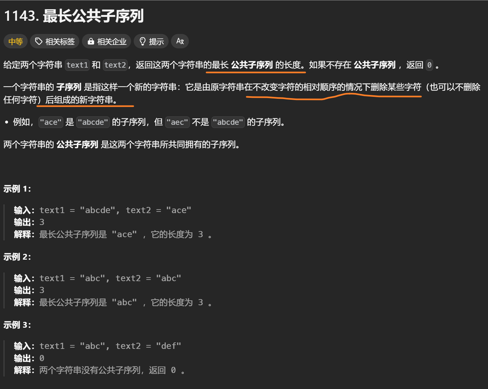

**dp 最左和最上扩充，避免单独处理首行首列，和 718 类似**

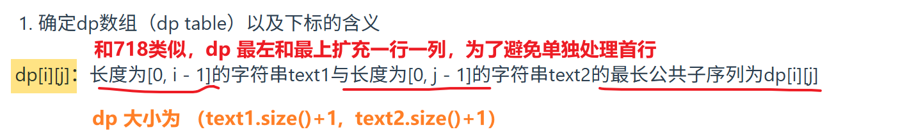

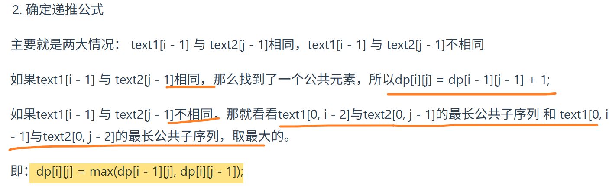

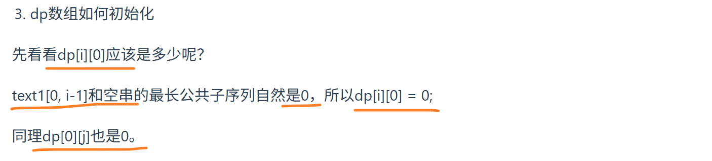

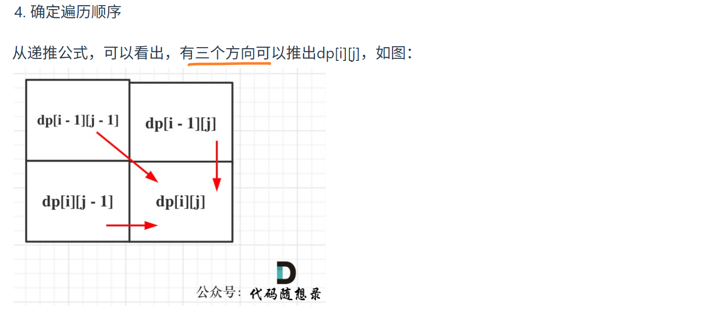

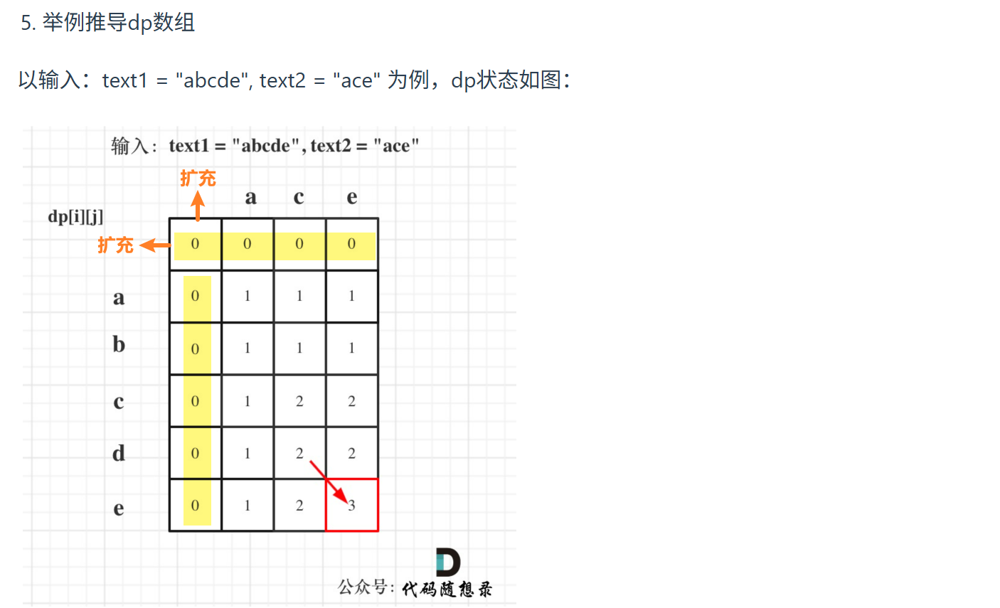

~~~C++
class Solution {
public:
    int longestCommonSubsequence(string text1, string text2) {

        // dp[i][j] - text1的[0, i-1]范围 和 text2的[0, j-1]范围 的最长公共子序列的长度
        vector<vector<int>> dp(text1.size() + 1, vector<int>(text2.size() + 1, 0));

        for (int i = 1; i <= text1.size(); i++)
        {
            for (int j = 1; j <= text2.size(); j++)
            {
                if (text1[i - 1] == text2[j - 1]) dp[i][j] = dp[i - 1][j - 1] + 1;
                else	dp[i][j] = max(dp[i - 1][j], dp[i][j - 1]);
            }
        }

        return dp[text1.size()][text2.size()];
    }
};
~~~

时间复杂度：O(N*M)

空间复杂度：O(N*M)


如果定义dp数组：

`dp[i][j] ` 表示 **text1[0, i] 和 text2[0, j]** 范围的最长公共子序列，**dp大小为（text1.size(), test2.size()）**

**需要单独处理首行首列**，**或者对第一行第一列初始化**


# 93 [复原IP地址](https://leetcode.cn/problems/restore-ip-addresses/description/)

@ 回溯 @分割 startIndex

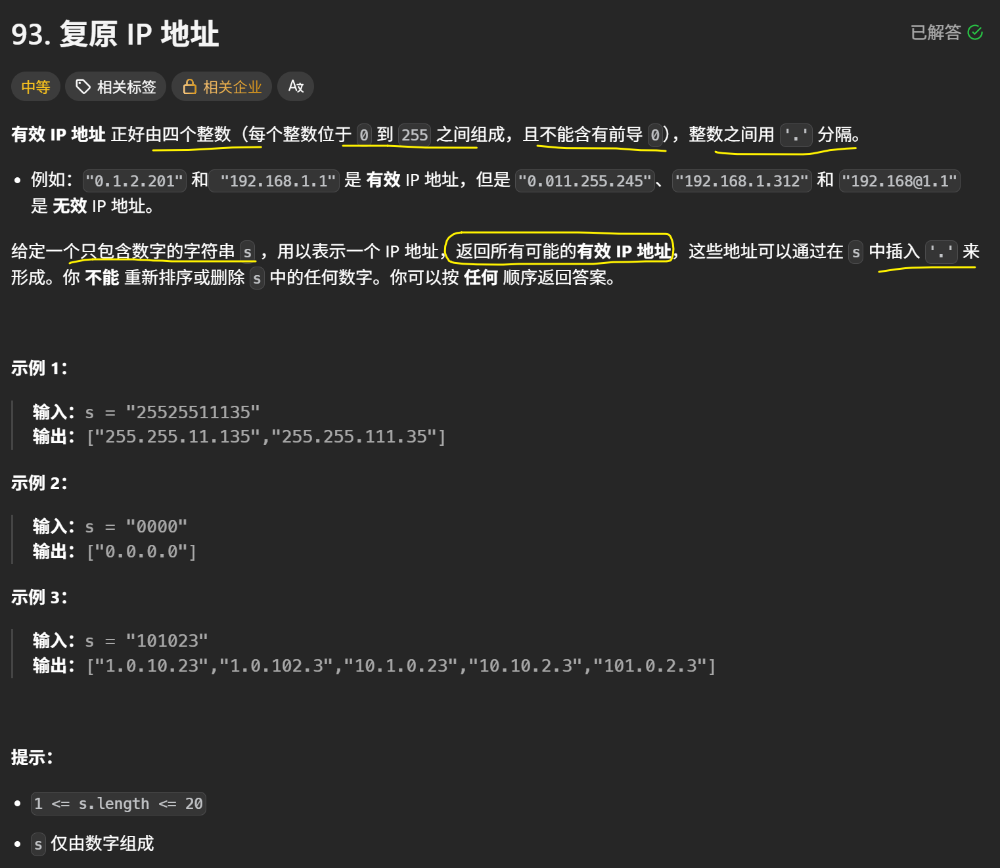

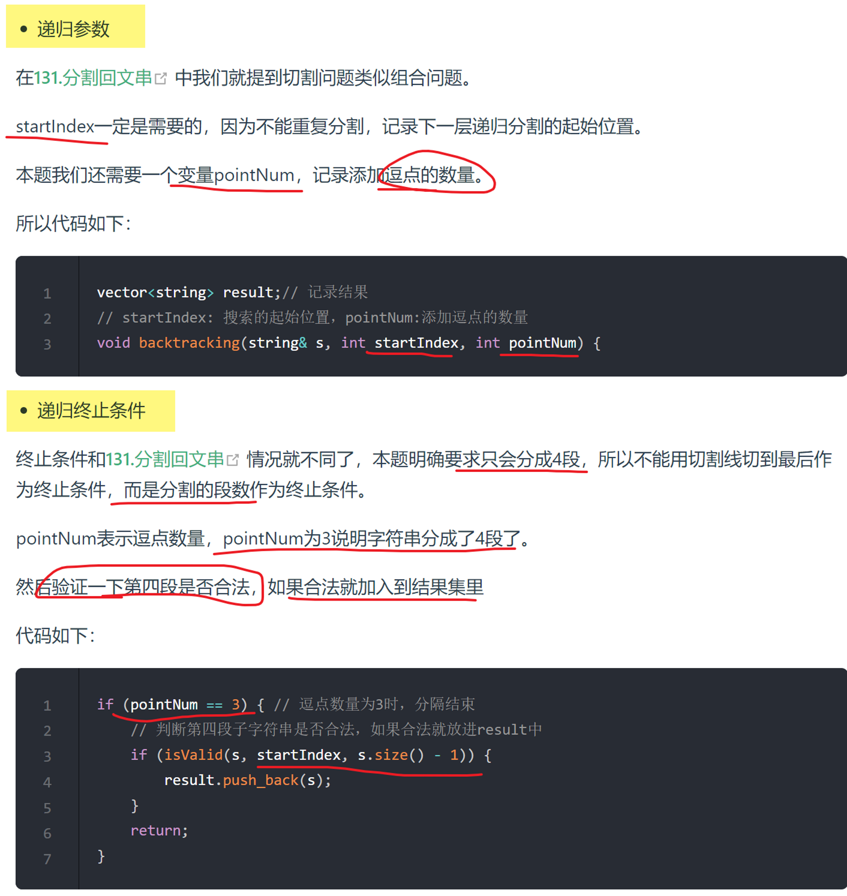

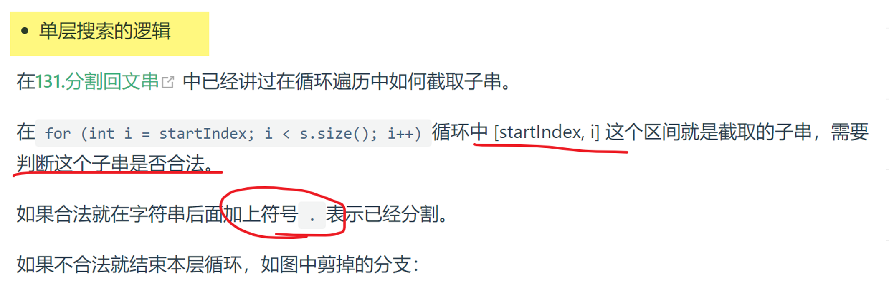

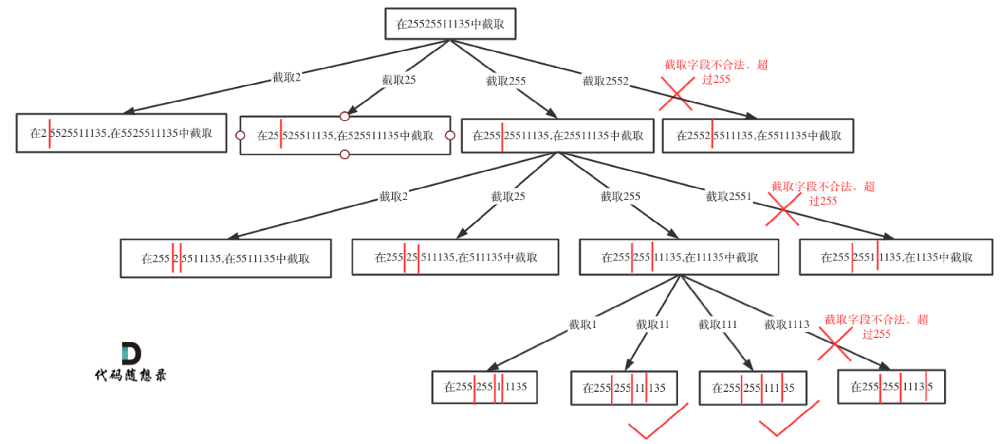

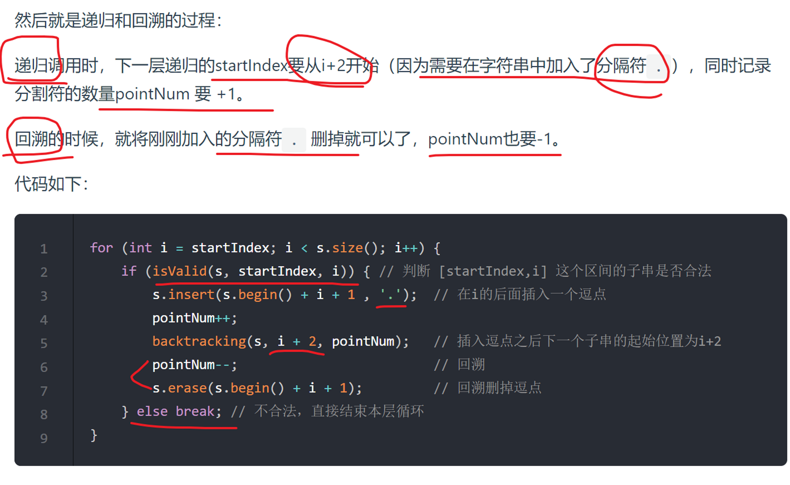

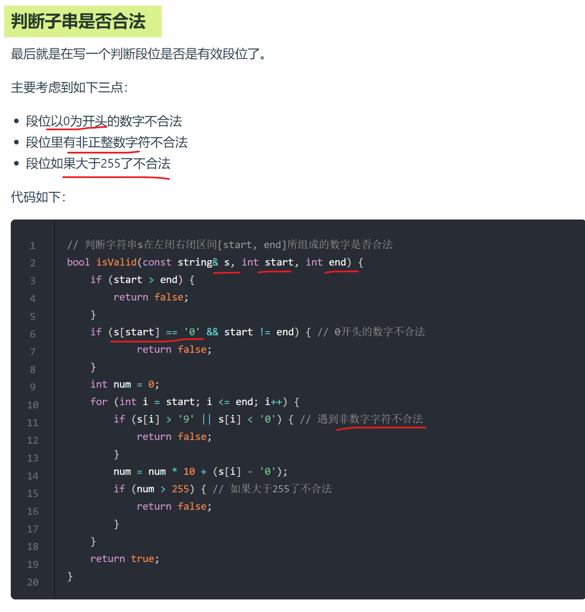


~~~C++
class Solution {
public:

    vector<string> result;

    // 判断是否合法 s 的 [start, end] 范围是否合法（左闭右闭）
    bool isvalid(const string& s, int start, int end)
    {
        if (start > end)    return false;

        if (s[start] == '0' && start != end)    return false; // 0 开头，不合法

        int num = 0;
        for (int i = start; i <= end; i++)
        {
            if (s[i] > '9' || s[i] < '0')   return false; // 非正整数数字，本题不涉及
            
            num = num * 10 + (s[i] - '0');
            if (num > 255)  return false; // 超过255，不合法
        }

        return true;
    }


    void backtracking(string& s, int startIndex, int pointNum)
    {
        // 终止，逗点为3
        if (pointNum == 3)
        {
            // 判断第四段是否合法，合法再收集
            if (isvalid(s, startIndex, s.size() - 1))   result.push_back(s);

            return;
        }

        // 单层递归
        for (int i = startIndex; i < s.size(); i++)
        {
            // 判断[startIndex, i]区间的子串是否合法（point前面的子串）
            if (isvalid(s, startIndex, i)) 
            {
                s.insert(s.begin() + i + 1, '.'); // 合法就在 s[i] 后面插入 '.'
                pointNum++;

                // 递归
                backtracking(s, i + 2, pointNum); // 插入point后，下一个子串起始是i+2

                // 回溯
                pointNum--;
                s.erase(s.begin() + i + 1); // 删除插入的point
            }

            else    break; // 不合法，直接结束本层循环
        }

    }


    vector<string> restoreIpAddresses(string s) {

        result.clear();

        if (s.size() < 4 || s.size() > 12)  return result; // 剪枝

        backtracking(s, 0, 0);
        return result;      
        
    }
};
~~~


# 82 [删除排序链表中的重复元素 II](https://leetcode.cn/problems/remove-duplicates-from-sorted-list-ii/description/)

83是保留一个，82是删除所有

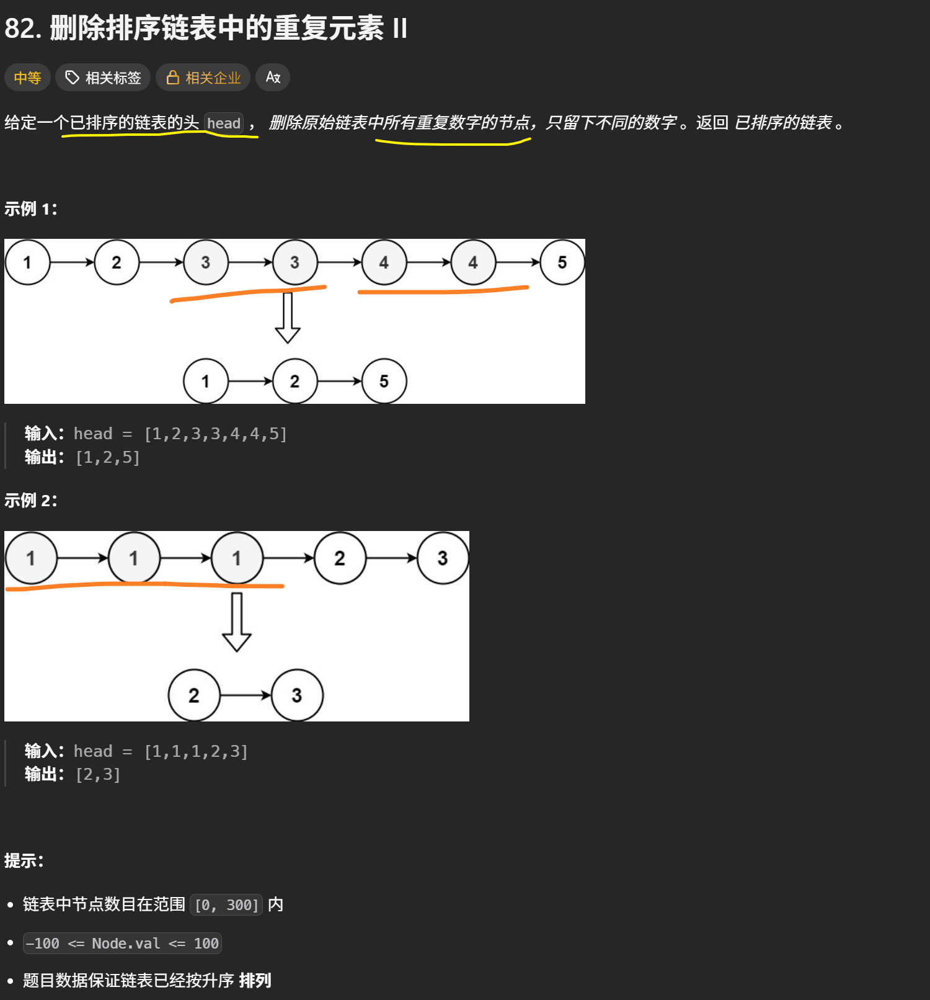


比 83 要多一个删除的循环

~~~C++
/**
 * Definition for singly-linked list.
 * struct ListNode {
 *     int val;
 *     ListNode *next;
 *     ListNode() : val(0), next(nullptr) {}
 *     ListNode(int x) : val(x), next(nullptr) {}
 *     ListNode(int x, ListNode *next) : val(x), next(next) {}
 * };
 */
class Solution {
public:
    ListNode* deleteDuplicates(ListNode* head) {

        ListNode* dummy = new ListNode(0);
        dummy->next = head;

        ListNode* cur = dummy;

        while (cur->next && cur->next->next) // 要比较cur后的两个值
        {
            int val = cur->next->val;

            if (cur->next->next->val == val) // cur后面的两个节点值相同，开始删除
            {
                // 值等于val的节点全部删掉
                while (cur->next && cur->next->val == val)  
                {
                    // cur->next = cur->next->next; 下面是回收内存的写法
                    ListNode* tmp = cur->next;
                    cur->next = tmp->next;
                    delete tmp;
                }
            }
            else
            {
                cur = cur->next;
            }
        }

        return dummy->next;

        delete dummy;
    }
};
~~~


# 142 [环形链表II](https://leetcode.cn/problems/linked-list-cycle-ii/description/?envType=study-plan-v2&envId=top-100-liked)

@ 找到入环的节点

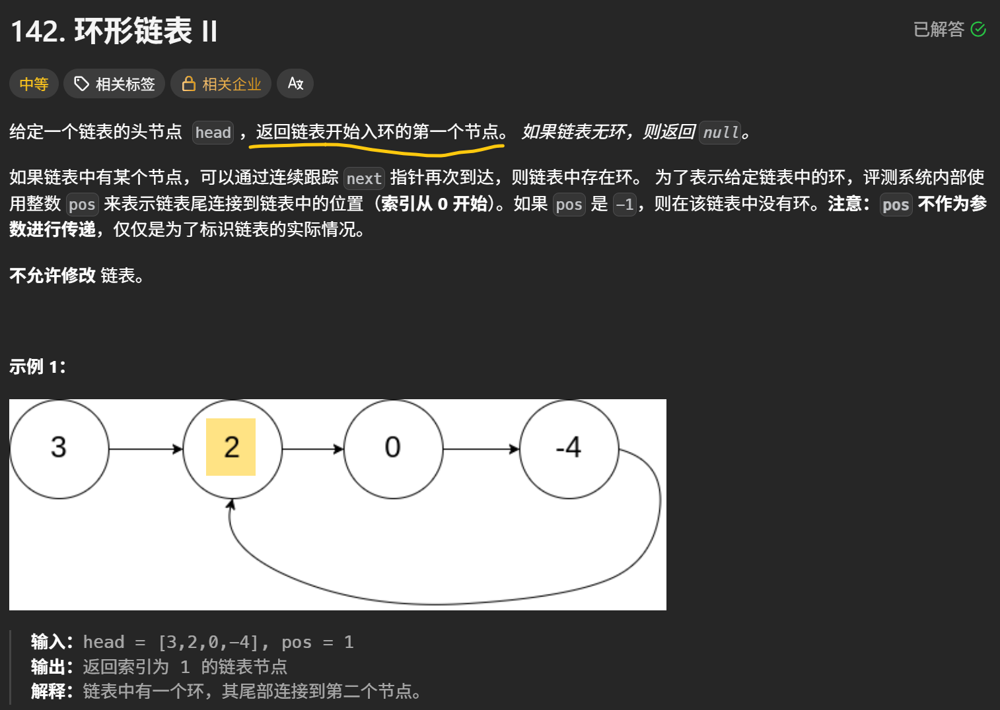

**1、判断是否有环 slow fast**

- slow走1，fast走2
- 如果有环，slow会和fast相遇（并相遇在环中）
- 无环，fast走到nullptr即结束

**2、slow = fast有环，查找入口**

- index1 从相遇点走，走z + n圈
- index2 从head走，走x
- 会在入口相遇

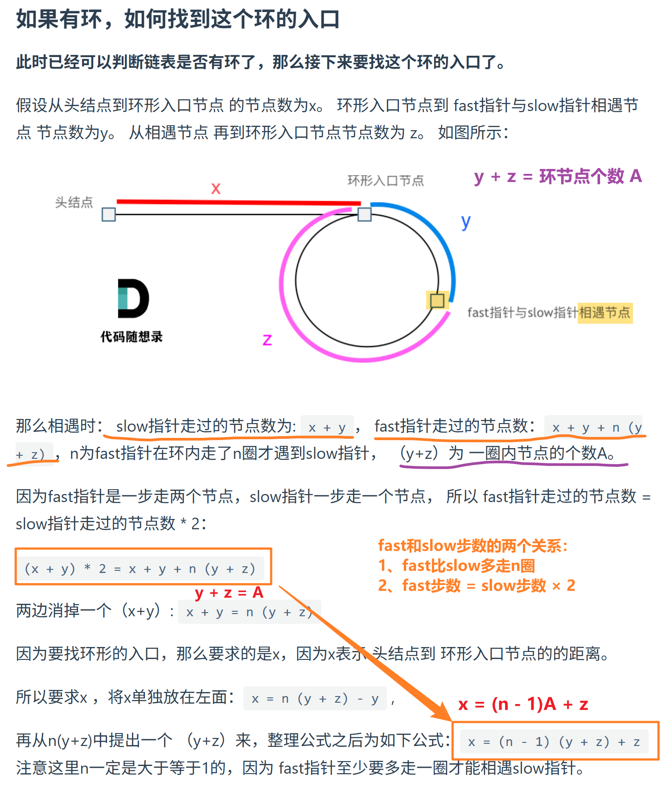

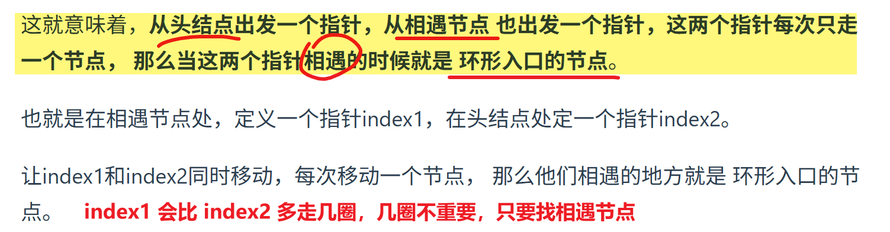

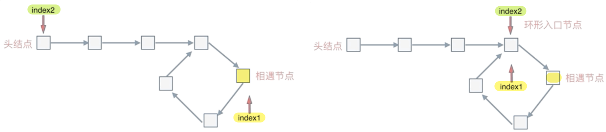


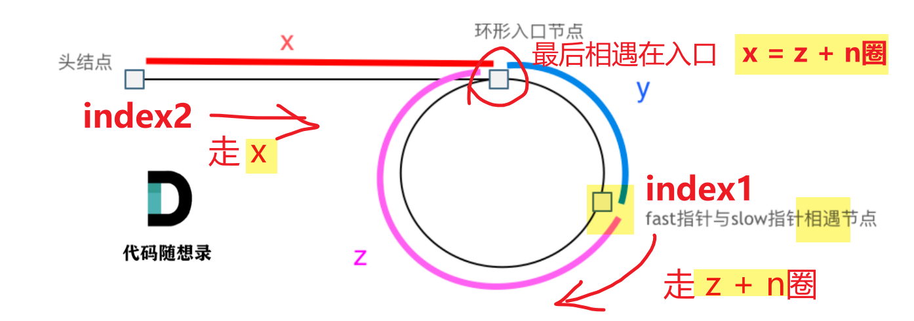


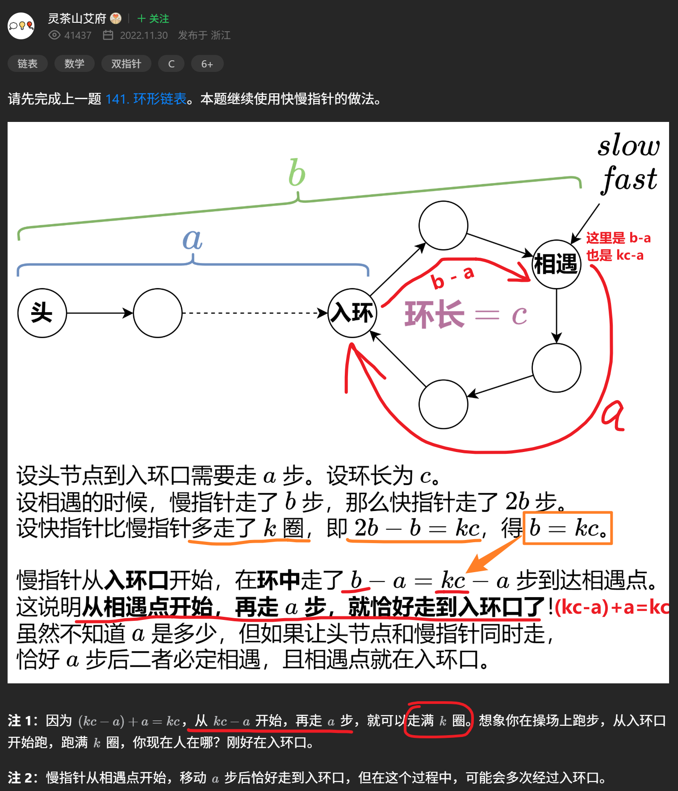


~~~C++
/**
 * Definition for singly-linked list.
 * struct ListNode {
 *     int val;
 *     ListNode *next;
 *     ListNode(int x) : val(x), next(NULL) {}
 * };
 */
class Solution {
public:
    ListNode *detectCycle(ListNode *head) {

        // 1 是否有环
        ListNode* slow = head;
        ListNode* fast = head;
        while (fast && fast->next)
        {
            slow = slow->next;
            fast = fast->next->next;

            // 如果没环，fast走到null结束

            // 2 有环，fast = slow  查找入口
            if (slow == fast)
            {
                ListNode* index1 = fast; // 从相遇点开始
                ListNode* index2 = head; // 从头开始

                // index1 和 index2 每次走一步，直到相遇，即入环口
                while (index1 != index2)
                {
                    index1 = index1->next;// 只不过index1会比index2多走几圈
                    index2 = index2->next; 
                }

                return index2; // 返回相遇点，即入口
            }
        }

        return nullptr;
    }
};
~~~


# 19 [删除链表的倒数第N个节点](https://leetcode.cn/problems/remove-nth-node-from-end-of-list/description/?envType=study-plan-v2&envId=top-100-liked)

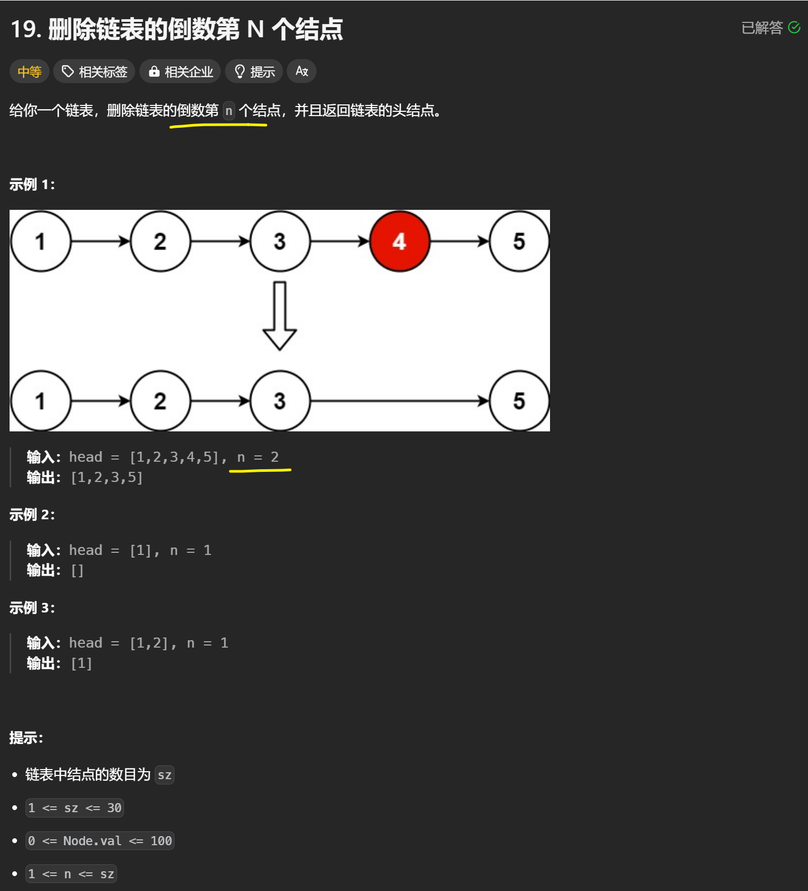

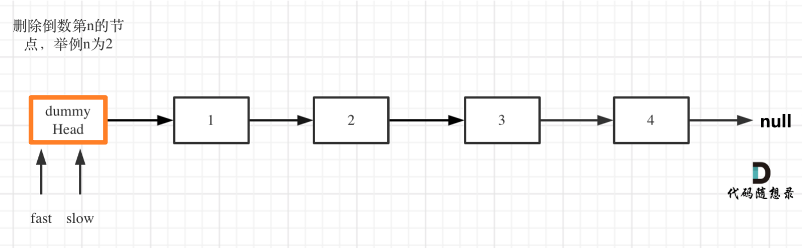

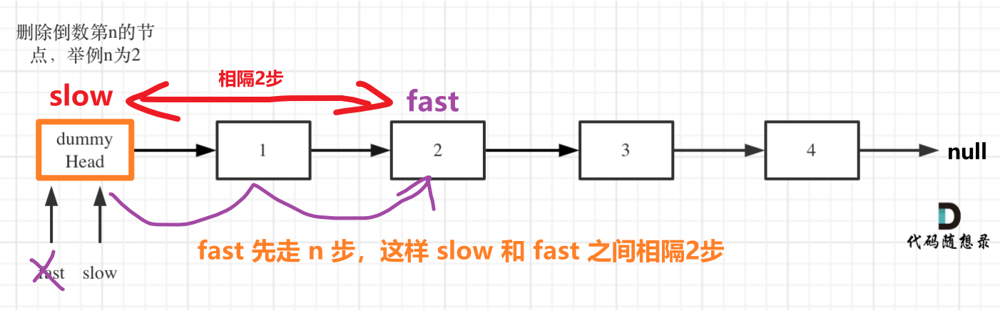

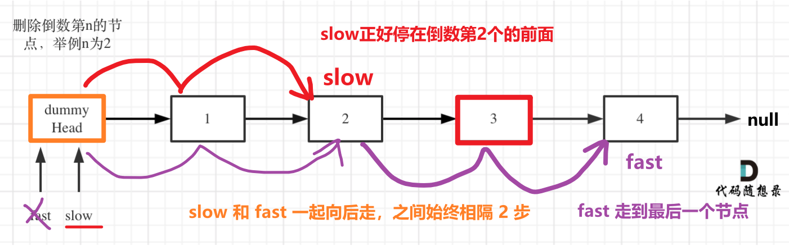


~~~C++
/**
 * Definition for singly-linked list.
 * struct ListNode {
 *     int val;
 *     ListNode *next;
 *     ListNode() : val(0), next(nullptr) {}
 *     ListNode(int x) : val(x), next(nullptr) {}
 *     ListNode(int x, ListNode *next) : val(x), next(next) {}
 * };
 */
class Solution {
public:
    ListNode* removeNthFromEnd(ListNode* head, int n) {

        ListNode* dummyHead = new ListNode(0);
        dummyHead->next = head;

        ListNode* slow = dummyHead;
        ListNode* fast = dummyHead;

        // fast 先走 n 步，为了保证 fast 和 slow 之间隔着 n 步
        while (n--)	fast = fast->next;
            

        // slow 和 fast 一起后移，fast->next 指向null，slow正好指向倒数【第n个节点的前一个】
        while (fast->next != nullptr)
        {
            slow = slow->next;
            fast = fast->next;
        }

        // 跳过原来的slow->next (即倒数第n个节点)
        ListNode* tmp = slow->next;
        slow->next = tmp->next;
        delete tmp;

        return dummyHead->next;
    }
};
~~~

时间复杂度：O(N) N为链表长度
空间复杂度：O(1)


# 4


# 199 [二叉树的右视图](https://leetcode.cn/problems/binary-tree-right-side-view/description/?envType=study-plan-v2&envId=top-100-liked)

@ 层序遍历收集每层最后一个元素

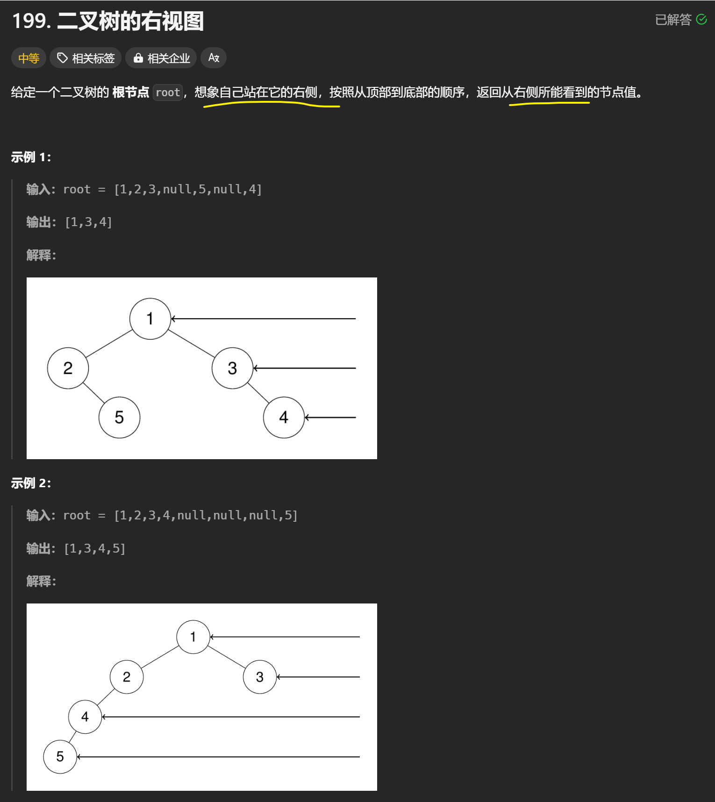

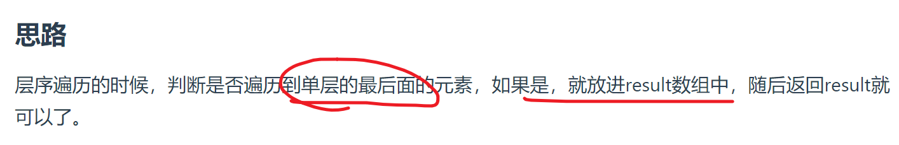

~~~C++
/**
 * Definition for a binary tree node.
 * struct TreeNode {
 *     int val;
 *     TreeNode *left;
 *     TreeNode *right;
 *     TreeNode() : val(0), left(nullptr), right(nullptr) {}
 *     TreeNode(int x) : val(x), left(nullptr), right(nullptr) {}
 *     TreeNode(int x, TreeNode *left, TreeNode *right) : val(x), left(left), right(right) {}
 * };
 */
class Solution {
public:
    vector<int> rightSideView(TreeNode* root) {
        
        vector<int> result;

        // 层序
        queue<TreeNode*> que;
        if (root != nullptr)    que.push(root);
        while (!que.empty())
        {
            int size = que.size();
            for (int i = 0; i < size; i++)
            {
                TreeNode* node = que.front();
                que.pop();

                // 将每层的最后一个元素放入result
                if (i == (size - 1))    result.push_back(node->val);

                if (node->left)     que.push(node->left);
                if (node->right)    que.push(node->right);

            }
        }

        return result;
    }
};
~~~


# 165 [比较版本号](https://leetcode.cn/problems/compare-version-numbers/description/)

@ 字符串 @ 双指针

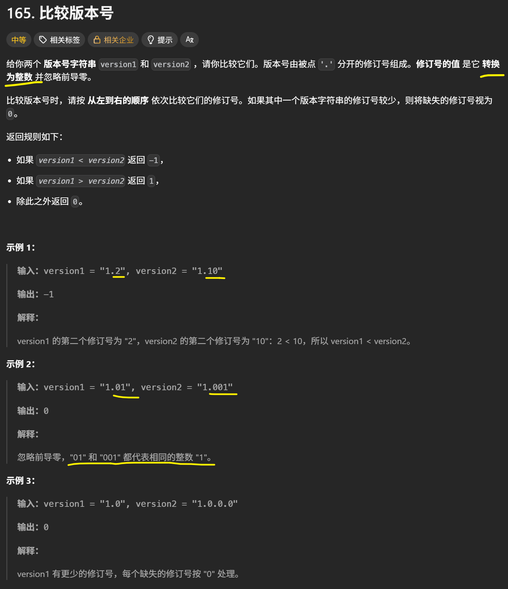

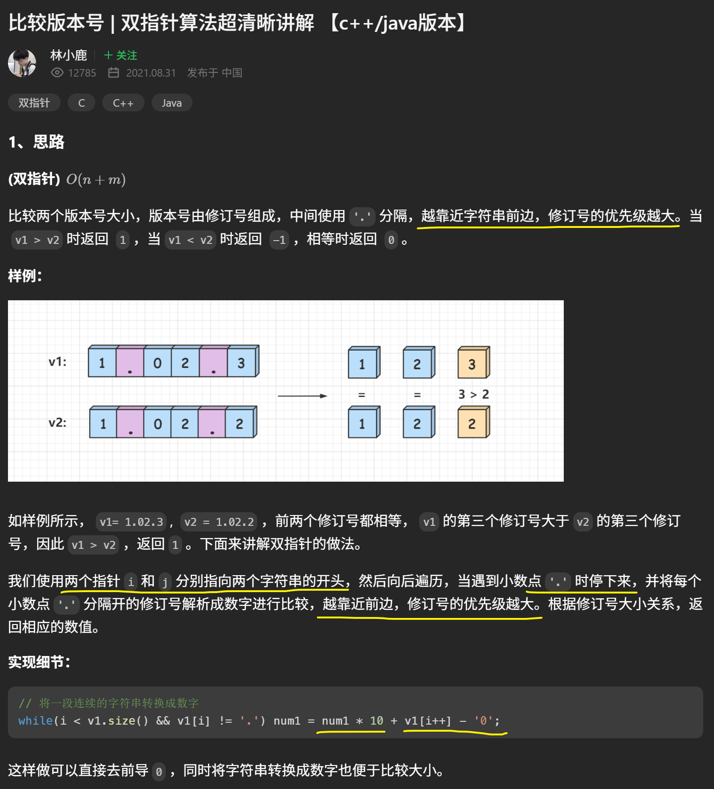

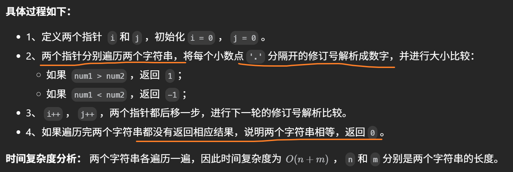


~~~C++
class Solution {
public:
    int compareVersion(string version1, string version2) {
        
        // version1 = "1.2", version2 = "1.10"

        int i = 0, j = 0;
        while (i < version1.size() || j < version2.size())
        {
            long long num1 = 0, num2 = 0;
            
            // 从左到右 拆出每个修订号 num1 num2
            while (i < version1.size() && version1[i] != '.')
            {
                num1 = num1 * 10 + version1[i] - '0';
                i++;
            }
            while (j < version2.size() && version2[j] != '.')   
            {
                num2 = num2 * 10 + version2[j] - '0';
                j++;
            }

            if (num1 > num2)        return 1;
            else if (num1 < num2)   return -1;

            // else num1 == num2 继续比较下一个修订号
            i++;
            j++;
        }

        return 0;
        
    }
};
~~~

为什么用 `long long`？

C++ 中，用 `int` 可能溢出，用 `long long` 提供更大范围，保证正确性：

- `int` 一般是 32 位，范围大约是 `-2^31 ~ 2^31-1`（约 -21 亿 ~ 21 亿）。

  - 题目虽然没规定修订号的大小上限，但很多测试数据可能超出 `int` 范围。

- `long long` 是 **64 位整数**，范围大约是 `-9e18 ~ 9e18`，比 `int` 大很多。

  可以安全存下绝大多数修订号，即使版本号里有十几位数的整数。


## 字节手撕

从小到大排序版本号 ["1.0.1", "1", "1.0.0", "0.9", "1.2.3"] 

思路，拆分成整数数组，从前往后比较，cmp两两比较，sort修改排序规则

~~~C++
#include <iostream>
#include <vector>
#include <string>
#include <sstream>
#include <algorithm>

using namespace std;

// ["1.0.1", "1", "1.10.3", "0.9", "1.2.3"] 

// 将版本号字符串分割成整数数组
// 版本号字符串（例如 "1.10.3"）分割成整数段 [1, 10, 3]
vector<int> splitVersion(const string& ver)
{
    vector<int> parts;
    stringstream ss(ver);
    string num;
    
    // getline 从 ss 中以 '.' 为分隔符读取下一段字符串，存入 num（转成int）
    while (getline(ss, num, ','))	parts.push_back(stoi(num));
    return parts;
}


bool cmpVersion(const string& a, const string& b)
{
    // 两个版本号转换到整数数组里
    vector<int> va = splitVersion(a); // [1, 10, 3]
    vector<int> vb = splitVersion(b); // [1,  0, 1]
    
    int n = max(va.size(), vb.size());
    for (int i = 0; i < n; i++)
    {
        // 取出对应版本号的其中一段比较（较短的那个超出就取0）
        int x = i < va.size() ? va[i] : 0;
        int y = i < vb.size() ? vb[i] : 0;
        
        if (x != y)	return x < y; // 版本号a < b返回true，小的版本号排在前面
    }
    return false; // 相等
}


int main()
{
    vector<string> versions = {"1.0.1",  "1", "1.0.0", "0.9", "1.2.3", "1.10"};
	
    // 按 cmpVersion 定义的顺序排序整个数组
    sort(versions.begin(), versions.end(), cmpVersion);
    
    for (auto& v : versions)	cout << v << " "        ;
    cout << endl;
    
    return 0;
}
~~~


**关于 sort**

~~~C++
sort(versions.begin(), versions.end(), cmpVersion);
~~~

`cmpVersion`：是一个**自定义比较函数**，定义了“谁更小”的规则。

在排序时，`std::sort` 会多次调用：

~~~C++
cmpVersion(a, b)
~~~

来判断元素 `a` 是否应该排在 `b` 前面。版本号a < b时，返回true，所以小的版本号排在前面。

例如：

- 如果 `cmpVersion("1.0", "1.2")` 返回 `true`， `"1.0"` < `"1.2"`；1.0 排在前面
- 如果 `cmpVersion("1.3", "1.2")`， `"1.3"` ≥ `"1.2"`就会返回 `false`，1.2就会排在前面

最终，`sort` 根据比较结果不断交换位置，直到整个 `versions` 数组有序。


**关于 `stringstream` 与 `getline`** 

`stringstream` C++ 标准库中的一种**字符串流对象**，属于 `<iostream>` 的扩展。

让字符串可以像文件流、输入流那样被逐段读取

~~~C++
string ver = "1.0.3";
stringstream ss(ver);
~~~

此时 `ss` 就像一个“输入流”，内容为 `"1.0.3"`。

`getline()` 函数原型：

~~~C++
istream& getline(istream& is, string& str, char delim);
// 					输入流is					分隔符
~~~

- 从输入流 `is`（这里是 `stringstream ss`）中读取字符；
- 遇到分隔符 `delim`（这里是 `'.'`）或文件结束符就停止；
- 把读到的内容放入 `str`；不会把分隔符本身写入 `str`。

例如：

~~~C++
string ver = "1.10.3";
stringstream ss(ver);
string num;

while (getline(ss, num, '.')) { // 把读到的以'.'为分隔的数，放进num
    cout << num << endl;
}
~~~


# 94 [中序遍历](https://leetcode.cn/problems/binary-tree-inorder-traversal/?envType=study-plan-v2&envId=top-100-liked)


### 递归

~~~C++
/**
 * Definition for a binary tree node.
 * struct TreeNode {
 *     int val;
 *     TreeNode *left;
 *     TreeNode *right;
 *     TreeNode() : val(0), left(nullptr), right(nullptr) {}
 *     TreeNode(int x) : val(x), left(nullptr), right(nullptr) {}
 *     TreeNode(int x, TreeNode *left, TreeNode *right) : val(x), left(left), right(right) {}
 * };
 */
class Solution {
public:
    // 递归
    void traversal(TreeNode* cur, vector<int>& vec)
    {
        if (cur == nullptr) return;

        traversal(cur->left, vec);  // 左
        vec.push_back(cur->val);    // 中
        traversal(cur->right, vec); // 右
    }


    vector<int> inorderTraversal(TreeNode* root) {
        
        vector<int> result;
        traversal(root, result);

        return result;
        
    }
};
~~~


### 迭代

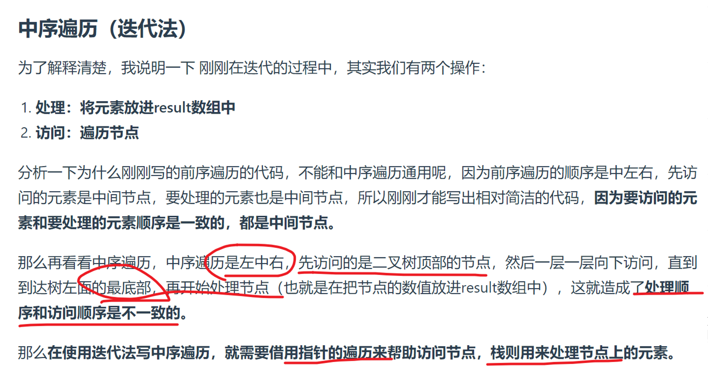

画图吧！！！

~~~C++
class Solution {
public:
    vector<int> inorderTraversal(TreeNode* root) {

        vector<int> result;

        stack<TreeNode*> st;
        TreeNode* cur = root;

        while (cur || !st.empty())
        {
            if (cur)
            {
                // 指针来访问节点，节点放入栈，先左边，一直到左边最底层
                st.push(cur);
                cur = cur->left;
            }
            else // cur = nullptr 走到左边最低
            {
                cur = st.top(); // 要处理的节点
                st.pop();

                // 当前节点值放进result
                result.push_back(cur->val); // 中
                
                // 转向当前节点的右节点
                cur = cur->right;           // 右
            }
        }

        return result;        
    }
};
~~~


# 704 [二分查找](https://leetcode.cn/problems/binary-search/)


注意区间的开闭！

~~~C++
class Solution {
public:
    int search(vector<int>& nums, int target) {
        int left = 0;
        int right = nums.size() - 1;// 定义target在左闭右闭的区间里 [left, right]

        while (left <= right) {
            int mid = left + ((right - left) / 2);// 防止溢出，等同于(left + right)/2
            // target在左区间
            if (nums[mid] > target) {
                right = mid - 1; // [left, mid - 1]
            }
            // target在右区间
            else if (nums[mid] < target) {
                left = mid + 1; // [mid + 1, right]
            }
            // nums[mid] = target 找到目标值
            else {
                return mid;
            }
        }

        return -1; // 未找到目标值
    }
};
~~~


# 232 [用栈实现队列](https://leetcode.cn/problems/implement-queue-using-stacks/description/)

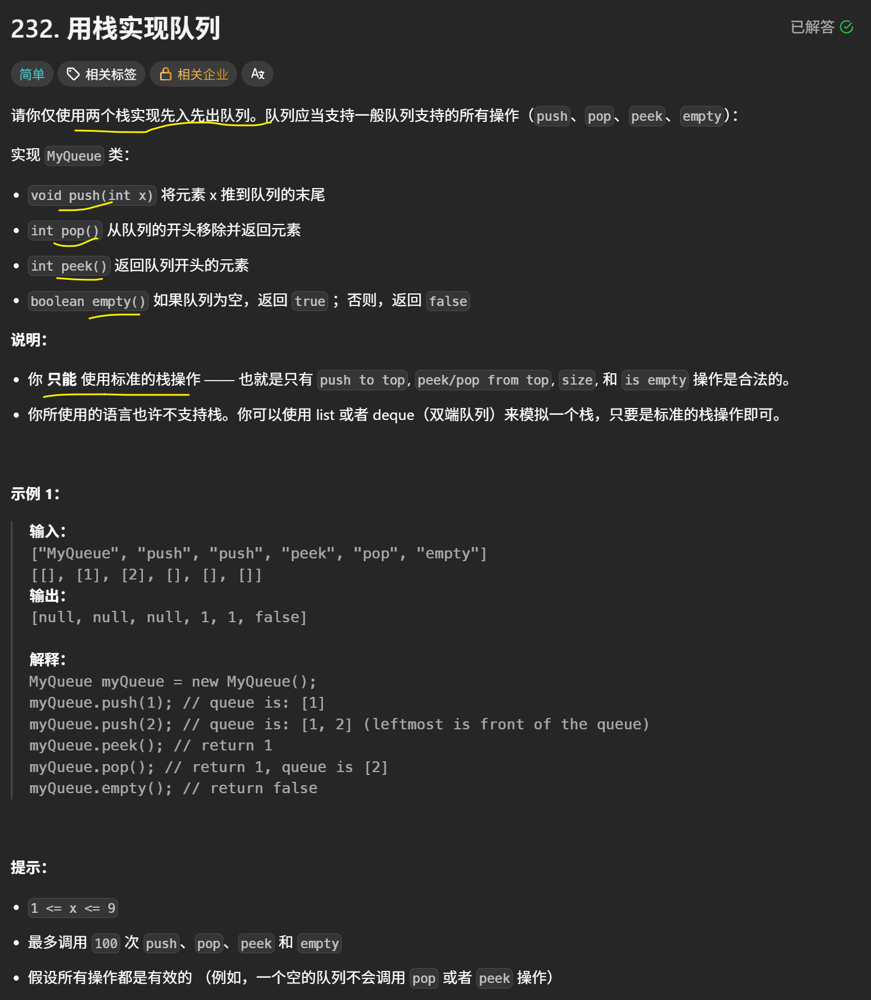


- 一个输入栈，一个输出栈
- push 只需要数据放入输入栈
- pop 需要把输入栈的数据先全部导入输出栈，再用top返回栈顶元素，再pop移除栈顶元素


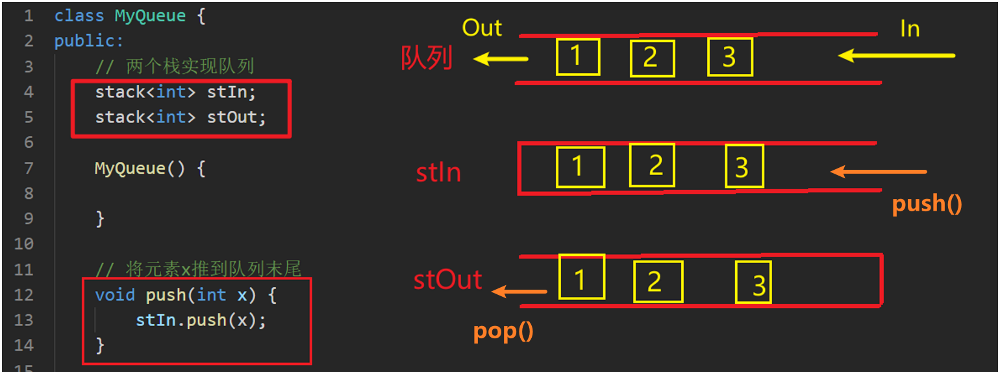

~~~C++
class MyQueue {
public:

    // 两个栈实现队列
    stack<int> stIn;    // 输入栈
    stack<int> stOut;   // 输出栈

    MyQueue() {
        
    }
    
    // 将 x 推到队列末尾（输入栈的末尾）
    void push(int x) {
        stIn.push(x);
    }
    
    // 队列开头的元素移除，并返回该元素
    int pop() {
        
        if (stOut.empty())// 只有当stOut为空的时候，再从stIn里导入全部数据
        {
            while (!stIn.empty())
            {
                stOut.push(stIn.top());
                stIn.pop();
            }
        }

        int result = stOut.top(); // 返回输出栈的栈顶
        stOut.pop();
        return result;
    }


    // 返回队列开头元素，只查询，不弹出
    int peek() {
        int res = this->pop(); // 弹出并返回
        
        // 这一步先stIn->stOut，可能本来stOut是空的，但stIn里有元素

        stOut.push(res); // 再把栈顶放回去
        return res;        
    }
    

    // 返回队列是否为空（输入输出栈都空）
    bool empty() {
        return stIn.empty() && stOut.empty();
    }
};

/**
 * Your MyQueue object will be instantiated and called as such:
 * MyQueue* obj = new MyQueue();
 * obj->push(x);
 * int param_2 = obj->pop();
 * int param_3 = obj->peek();
 * bool param_4 = obj->empty();
 */
~~~

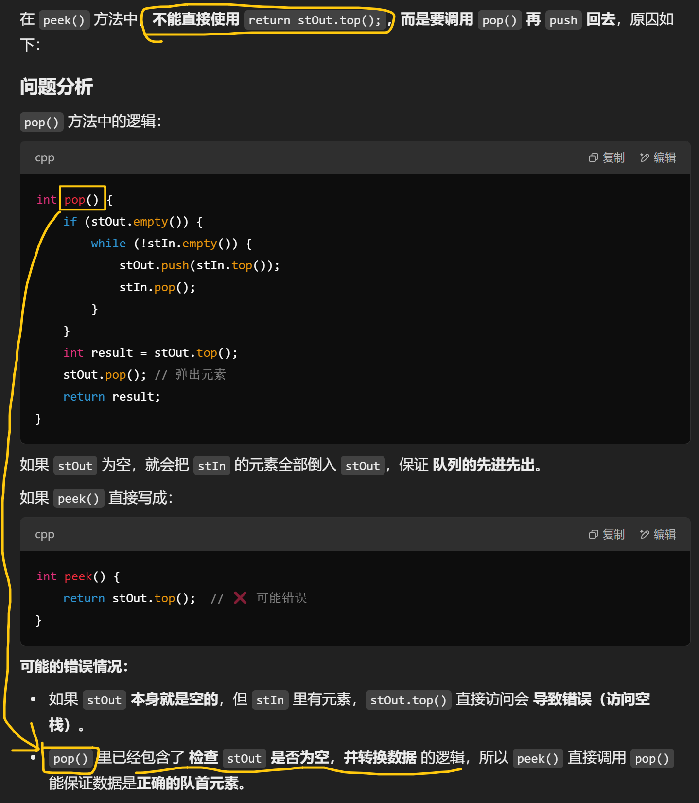


# 22 [括号生成](https://leetcode.cn/problems/generate-parentheses/description/?envType=study-plan-v2&envId=top-100-liked)

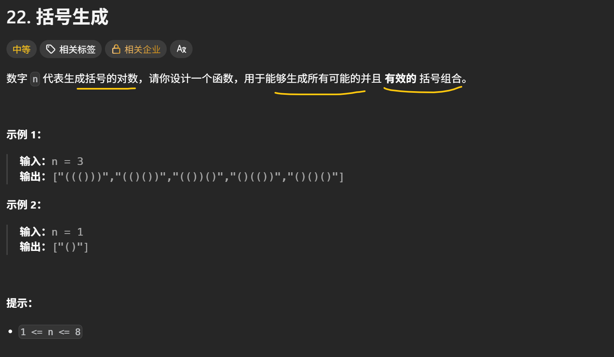


==**重点：右括号个数 <= 左括号个数 ！！！！！！**==


## 1、选或不选

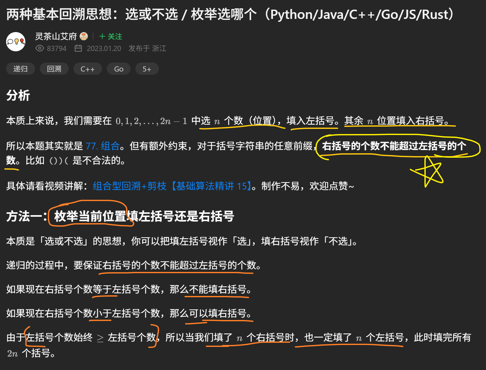


这里是**直接覆盖旧值**的，相当于原来的【**撤销 + 插入新值**】了。


~~~C++
class Solution {
public:
    vector<string> generateParenthesis(int n) {
        vector<string> ans;
        string path(n * 2, 0); // n对括号

        // left right 是左右括号的数量
        auto dfs = [&](this auto&& dfs, int left, int right) ->void
        {
            // 终止：右括号填了n个，左括号一定也填了n个，所以此时填完2n个括号
            if (right == n) 
            {
                ans.emplace_back(path);
                return;
            }
            
            if (left < n) // 左括号少于n个，可以填左括号
            {
                path[left + right] = '('; // 直接覆盖
                dfs(left + 1, right);
            }
            if (right < left) // 可以填右括号
            {
                path[left + right] = ')'; // 直接覆盖
                dfs(left, right + 1);
            }
        };

        dfs(0, 0);
        return ans;
    }
};
~~~


## 2、枚举右括号个数，确定下一个左括号位置

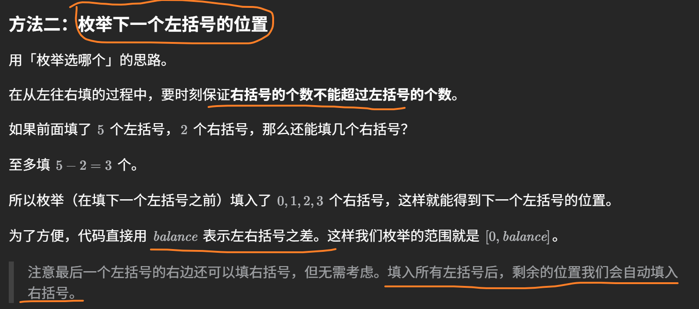

**重点：右括号个数 <= 左括号个数 ！！！！！！**

**balance =  已填的左括号的个数 - 右括号的个数 **，为了保证**【右括号个数 <= 左括号个数】**


~~~C++
class Solution {
public:
    vector<string> generateParenthesis(int n) {

        vector<string> ans;
        vector<int> leftIndex; // 记录左括号的下标

        // i:       目前填了 i 个括号
        // balance: 这 i 个括号中, 左括号个数 - 右括号个数 = balance，为了保证左括号 > 右
        auto dfs = [&](this auto&& dfs, int i, int balance)
        {
            // 终止：左括号下标的个数 = n，左括号确定了 n 个位置，填充左括号
            if (leftIndex.size() == n) 
            {
                string s(n * 2, ')');
                for (int j : leftIndex)  s[j] = '('; // 左括号下标处改成 '('

                ans.emplace_back(s); // 收集
                return;
            }


            // 枚举填 right = 0,1,2,3...,balance 个右括号
            // balance 约束  右括号的个数，一定要 <= 左括号，
            // 在 balance 的约束下，枚举填 1 个 ')'，填 2 个 ')', ... 之后，左括号的下标
            for (int right = 0; right <= balance; right++)
            {
                // 先填 right 个右括号，然后填 1 个左括号，记录左括号的下标 i + right
                leftIndex.push_back(i + right);
                
                dfs(i + right + 1, balance + (1 - right)); // 往下一个递归
                // balance + (1 - right) 是指插入了1个左，right个右，之后的新的个数差
                
                leftIndex.pop_back(); // 回溯
            }
        };

        dfs(0, 0);
        return ans;        
    }
};
~~~


# 239 [滑动窗口最大值](https://leetcode.cn/problems/sliding-window-maximum/description/?envType=study-plan-v2&envId=top-100-liked)

@单调队列


## 1、单调队列

> [Krahets 题解](https://leetcode.cn/problems/sliding-window-maximum/solutions/2361228/239-hua-dong-chuang-kou-zui-da-zhi-dan-d-u6h0)

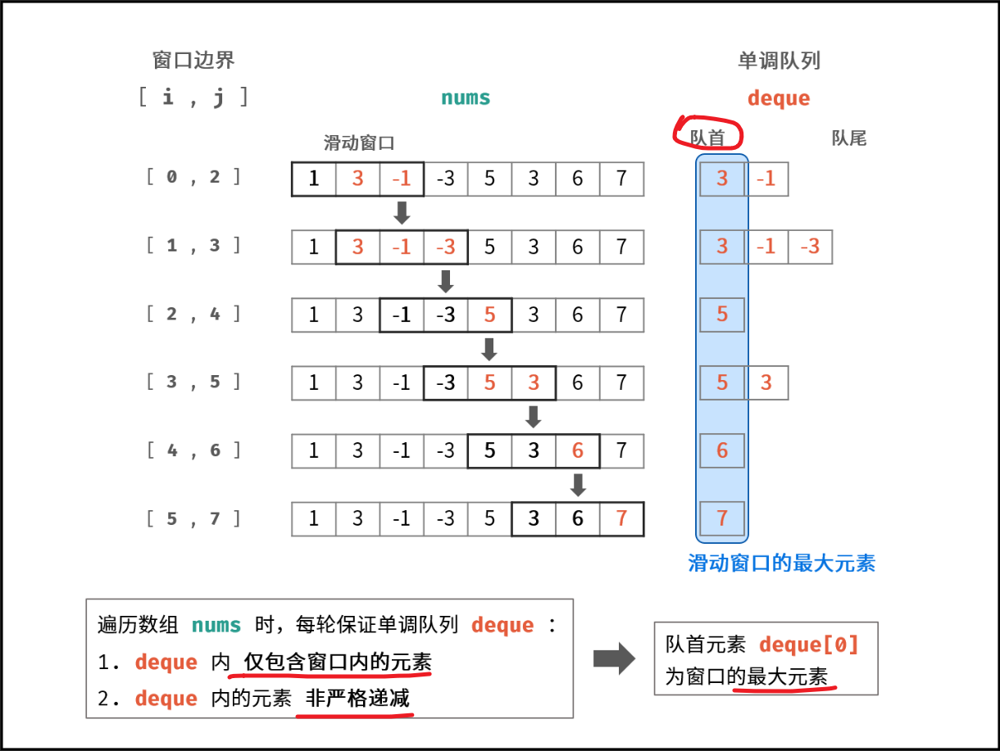

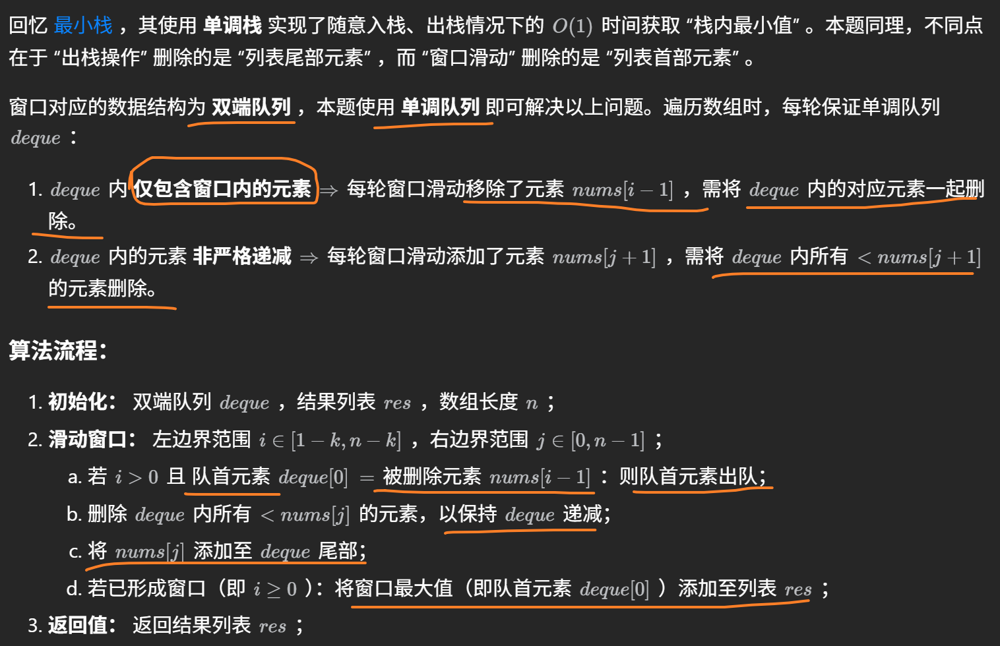

~~~C++
class Solution {
public:
    vector<int> maxSlidingWindow(vector<int>& nums, int k) {

        if (nums.size() == 0 || k == 0)  return {};

        deque<int> deque; // 队列，要保证back->front是从小到大的，front最大

        vector<int> res(nums.size() - k + 1); // 一共有这么多个窗口，也就这么多最大值

        // 未形成窗口
        for (int i = 0; i < k; i++)
        {
            // 删除队列里所有<nums[i]的元素
            while (!deque.empty() && deque.back() < nums[i])    deque.pop_back();
            deque.push_back(nums[i]);
        }
        res[0] = deque.front(); // 收集第一个窗口最大值

        // 形成窗口后
        for (int i = k; i < nums.size(); i++)
        {
            // 如果队列的front最大值，恰好是马上要移除窗口的值，那队列里的front也要弹出去
            if (deque.front() == nums[i - k])   deque.pop_front();  

            // 从后向前，pop出所有小于nums[i]的
            while (!deque.empty() && deque.back() < nums[i])    deque.pop_back();
            deque.push_back(nums[i]);

            // 收集当前窗口的最大值
            res[i - k + 1] = deque.front(); 
        }

        return res;
    }
};
~~~


## 2、单独写单调队列

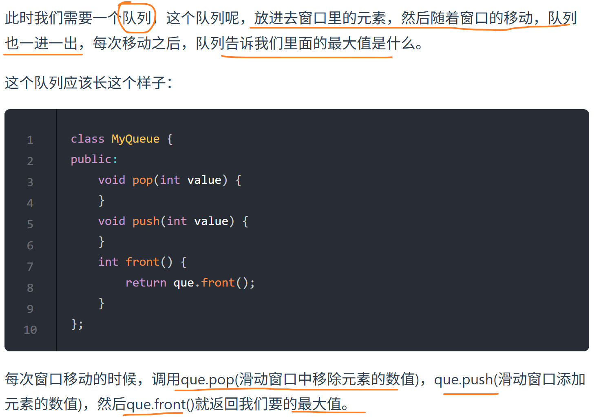


~~~C++
class Solution {
private:
    // deque实现单调队列 从大到小
    class MyQueue
    {
    public:
        deque<int> que; // 使用deque实现单调队列

        // push
        void push(int value)
        {
            // 即将放进que的value > back入口数值，就将que后端的数值弹出，直到value < 入口
            // 保证队列前面都是比value大的值，才能从大到小
            while (!que.empty() && value > que.back())  que.pop_back();
            que.push_back(value);
        }

        // pop
        void pop(int value)
        {
            // 每次pop比较要弹出的数值，是否等于que出口的数值，如果相等则弹出
            if (!que.empty() && value == que.front())   que.pop_front();
        }

        // getMaxvalue 查询当前队列里的最大值，直接返回que的front
        int getMax()
        {
            return que.front();
        }
    };


public:
    vector<int> maxSlidingWindow(vector<int>& nums, int k) {

        vector<int> result;

        MyQueue que; // 创建单调队列
        
        // 前k个元素（第一个窗口）放入que
        for (int i = 0; i < k; i++)
        {
            que.push(nums[i]); // push的时候已经保证了单调
        }
        result.push_back(que.getMax()); // result 记录第一个窗口最大值

        // 继续计算后面的窗口
        for (int i = k; i < nums.size(); i++)
        {
            que.pop(nums[i - k]); // 移动窗口，pop出que中当前窗口的第一个元素
            que.push(nums[i]); // 新元素push进新窗口

            result.push_back(que.getMax()); // 记录当前窗口内的最大值
        }
        
        return result;
        
    }
};
~~~


# 148 [排序链表](https://leetcode.cn/problems/sort-list/description/?envType=study-plan-v2&envId=top-100-liked)

@递归，从上到下    @迭代，从下到上

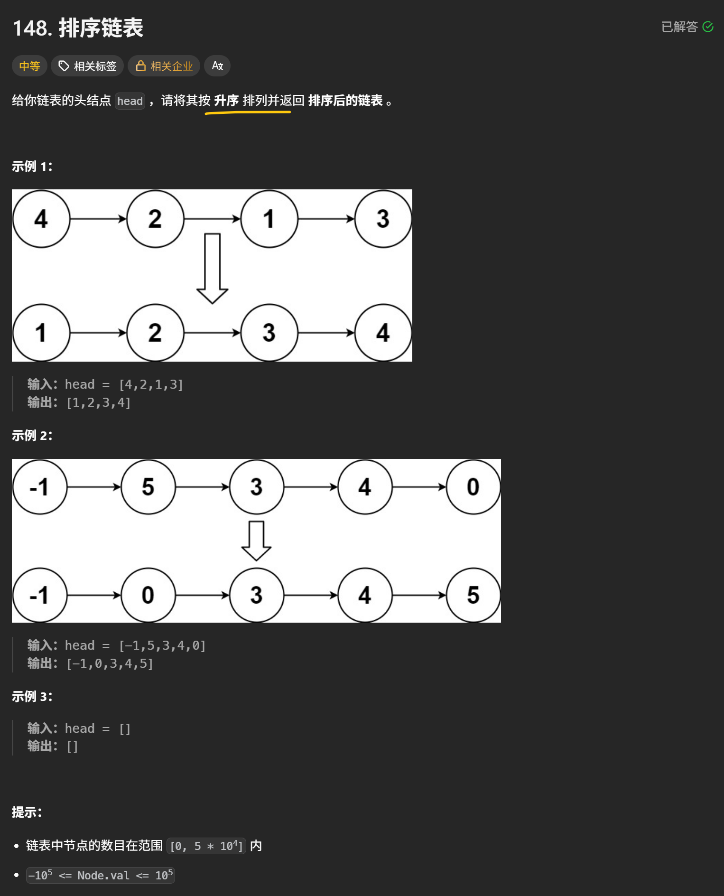

灵神题解：[两种方法：分治/迭代，模块化设计，代码可读性高（Python/Java/C++/C/Go/JS/Rust）](https://leetcode.cn/problems/sort-list/solutions/2993518/liang-chong-fang-fa-fen-zhi-die-dai-mo-k-caei/?envType=study-plan-v2&envId=top-100-liked)


## 1、归并排序-分治递归

推荐

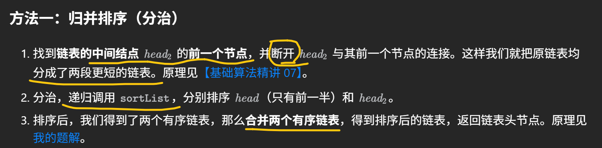

~~~C++
/**
 * Definition for singly-linked list.
 * struct ListNode {
 *     int val;
 *     ListNode *next;
 *     ListNode() : val(0), next(nullptr) {}
 *     ListNode(int x) : val(x), next(nullptr) {}
 *     ListNode(int x, ListNode *next) : val(x), next(next) {}
 * };
 */
class Solution {
public:
    // 876. 找链表中间节点断开（快慢指针）
    ListNode* middleNode(ListNode* head)
    {
        ListNode* slow = head;
        ListNode* fast = head;
        while (fast->next && fast->next->next)
        {
            slow = slow->next;// 中间节点的前一个
            fast = fast->next->next;
        }

        ListNode* mid = slow->next;
        slow->next = nullptr; // 断开
        return mid;
    }

    // 21 合并两个有序链表（快慢指针）
    ListNode* mergerTwoLists(ListNode* list1, ListNode* list2)
    {
        ListNode* dummy = new ListNode(0);
        ListNode* cur = dummy;
        while (list1 && list2)
        {
            if (list1->val < list2->val)
            {
                cur->next = list1;
                list1 = list1->next;
            }
            else
            {
                cur->next = list2;
                list2 = list2->next;
            }

            cur = cur->next;
        }

        cur->next = (list1 != nullptr) ? list1 : list2;
        return dummy->next;
    }


    ListNode* sortList(ListNode* head) {

        if (head == nullptr || head->next == nullptr)   return head;

        // 找中点断开
        // 比如 head=[4,2,1,3]，那么 middleNode 调用结束后 head=[4,2] head2=[1,3]
        ListNode* head2 = middleNode(head);

        // 分治 递归 分别排序 head和head2
        head = sortList(head);
        head2 = sortList(head2);
        
        // 合并
        return mergerTwoLists(head, head2);
       
    }
};
~~~

时间复杂度：O(nlogn)，其中 n 是链表长度。递归式 T(n)=2T(n/2)+O(n)，由主定理可得时间复杂度为 O(nlogn)。
空间复杂度：O(logn)。递归需要 O(logn) 的栈开销。


## 2、归并排序-迭代

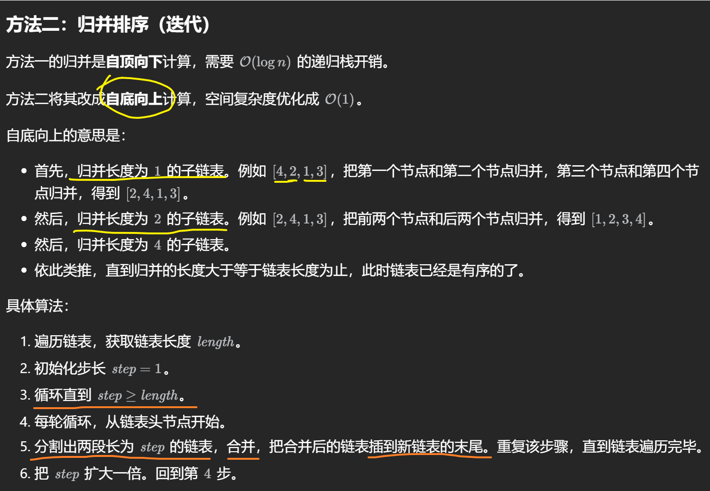

两两合并，四四合并，八八合并……

**画图吧**


~~~C++
/**
 * Definition for singly-linked list.
 * struct ListNode {
 *     int val;
 *     ListNode *next;
 *     ListNode() : val(0), next(nullptr) {}
 *     ListNode(int x) : val(x), next(nullptr) {}
 *     ListNode(int x, ListNode *next) : val(x), next(next) {}
 * };
 */
class Solution {
public:
    // 获取链表长度
    int getLength(ListNode* head)
    {
        int length = 0;
        while (head)
        {
            length++;
            head = head->next;
        }
        return length;
    }

    // 分割链表，分割前size个，返回剩余链表的头结点
    ListNode* splitList(ListNode* head, int size)
    {
        ListNode* cur = head;

        // cur走size步，停在前size个节点的最后一个
        for (int i = 0; i < size - 1 && cur; i++)   cur = cur->next;

        // 链表长度 <= size, 不操作，返回null
        if (cur == nullptr || cur->next == nullptr) return nullptr;

        // 链表长度 >  size，把链表的前size个节点分割出来（断开），返回剩余链表的头结点
        ListNode* next_head = cur->next;
        cur->next = nullptr; // 断开

        return next_head; 
    }

    
    // 21.合并两个有序链表，返回合并后的 <头结点，尾节点>
    pair<ListNode*, ListNode*> mergeTwoLists(ListNode* l1, ListNode* l2)
    {
        ListNode* dummy = new ListNode(0);
        ListNode* cur = dummy;
        while (l1 && l2)
        {
            if (l1->val < l2->val)
            {
                cur->next = l1;
                l1 = l1->next;
            }
            else 
            {
                cur->next = l2;
                l2 = l2->next;
            }
            cur = cur->next;
        }
        cur->next = l1 ? l1 : l2;

        while (cur->next)   cur = cur->next; // 移动cur到尾节点
        return {dummy->next, cur}; // 返回合并后的 <头结点，尾节点>
    }


    ListNode* sortList(ListNode* head) {

        int length = getLength(head);

        ListNode* dummy = new ListNode(0);
        dummy->next = head;

        // step 为步长，即参与合并的链表长度，step = 1, 2, 4, 8, ...
        for (int step = 1; step < length; step *= 2)
        {
            // 从 step = 1 开始：step = 1, 2, 4, 8, ...
            // 每2个【1节点】一组合并，到每2个【2节点】一组合并，再到每2个【4节点】...

            ListNode* new_list_tail = dummy; // 新链表的末尾
            ListNode* cur = dummy->next;

            // 链表每2个step长的部分，分别合并，再拼接，直到cur=null
            while (cur) 
            {
                // 从cur开始，分割出两段长为step的链表
                ListNode* head1 = cur;
                ListNode* head2 = splitList(head1, step);
                cur = splitList(head2, step); // 下一轮循环的起点，head2也断开了

                // 合并两段长为step的链表
                auto [merge_head, merge_tail] = mergeTwoLists(head1, head2);

                // 合并后的头结点head，接到new_list_tail的后面，更新末尾
                new_list_tail->next = merge_head; 
                new_list_tail = merge_tail;
            }

            // cur == nullptr，step = 2 * step，开始下一轮合并            
        }
        

        return dummy->next;
    }
};
~~~

- 时间复杂度：O(*n*log*n*)，其中 *n* 是链表长度。
- 空间复杂度：O(1)。


# 69 [x的平方根](https://leetcode.cn/problems/sqrtx/description/)

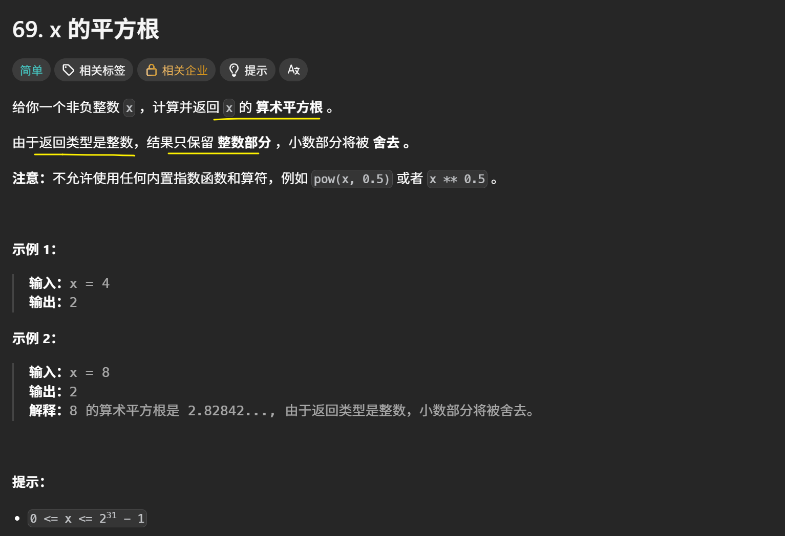

## 1、二分

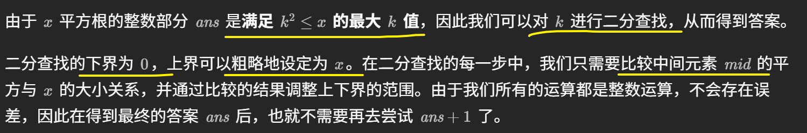

~~~C++
class Solution {
public:
    int mySqrt(int x) {
        
        // 在中间过程计算平方的时候可能出现溢出，所以用long long
        
        // x 平方根的整数部分 ans 是满足 k^2 ≤x 的最大 k 值

        // 二分 0 ~ x，找到最大的 k
        int l = 0, r = x;
        int ans = -1;

        while (l <= r)
        {
            int mid = l + (r - l) / 2;
            if ((long long)mid * mid <= x)
            {
                ans = mid;
                l = mid + 1;
            }
            else 
            {
                r = mid - 1;
            }
        }

        return ans;        
    }
};
~~~


## 2、牛顿迭代法

利用切线逼近曲线的方程的解   [题解 仗剑骑士](https://leetcode.cn/problems/sqrtx/solutions/1408932/by-zhang-jian-qi-shi-kaxt)

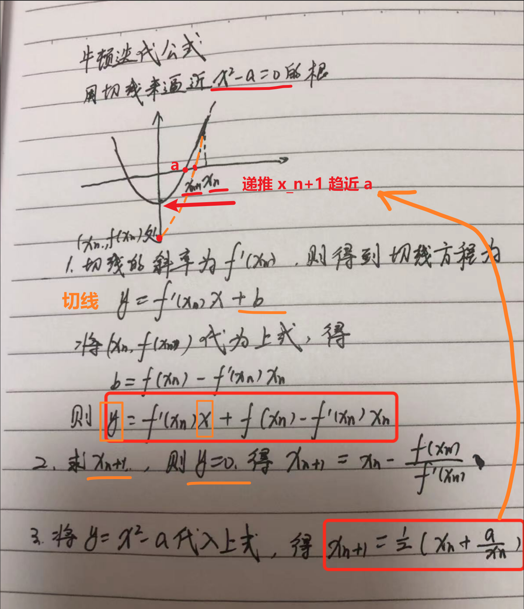


~~~C++
class Solution {
public:
    int mySqrt(int x) {

        int a = x;
        long long ans = x;

        while (ans * ans > x) // 推出来的 x_n+1 的递推公式，递推直到ans*ans<=x
        {
            ans = (ans + a / ans) / 2; 
        }

        return ans;
    }
};
~~~


# 31 [下一个排列](https://leetcode.cn/problems/next-permutation/description/?envType=study-plan-v2&envId=top-100-liked)


垃圾题目描述

评论区给的示例：[1, 2, 3] 排列组合，从小到大

[1, 2, 3] 123
[1, 3, 2] 132
[2, 1, 3] 213
[2, 3, 1] 231
[3, 1, 2] 312
[3, 2, 1] 321

[1,2, 3 ]下一个就是[1, 3, 2]
[2, 3, 1]下一个就是[3, 1, 2]
[3, 2, 1]下一个是[1, 2, 3] 回到起点


直接看代码

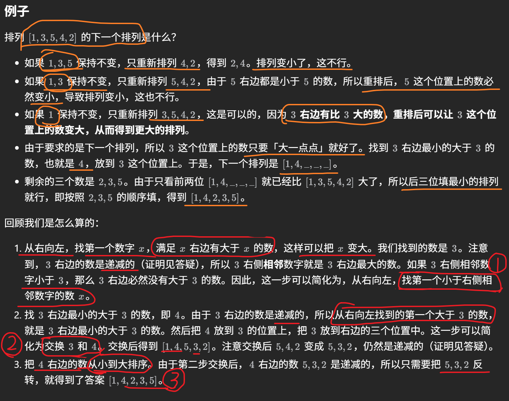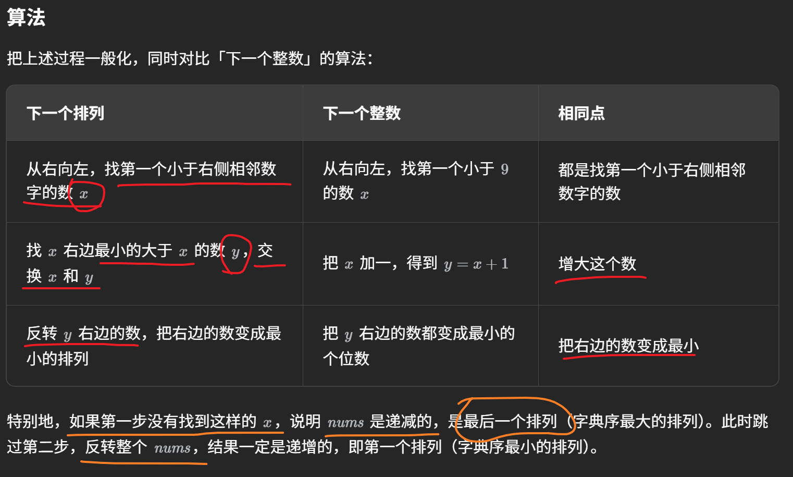


~~~C++
class Solution {
public:
    void nextPermutation(vector<int>& nums) {
        // [1, 3, 5, 4, 2] 排列组合里面的数字，找下一个比13542大的组合

        // 1. 从右向左找到第一个小于右侧相邻数字的数 nums[i] (3) 3 < 5
        int n = nums.size();
        int i = n - 2;
        while (i >=0 && nums[i] >= nums[i + 1]) i--;


        // 找到，进入第2步；否则(i < 0)跳过第2步，说明现在排列递减，是最大数 
        
        if (i >= 0) 
        {
            // 2. 从右向左，找到 i 右侧第一个大于 nums[i](3) 的数 nums[j](4)，交换
            int j = n - 1;
            while (j > i && nums[i] >= nums[j])  j--;
  
            swap(nums[i], nums[j]); // [1, 4, 5, 3, 2]
        }


        // 3 反转 新nums[i] 后面的数 -  [1, 4, 2, 3, 5]
        reverse(nums.begin() + i + 1, nums.end());
        
    }
};
~~~

复杂度分析

- 时间复杂度：O(*n*)，其中 *n* 是 *nums* 的长度。最坏情况下需要遍历整个 *nums* 数组。
- 空间复杂度：O(1)。


# 8 [字符串转换整数（atoi）](https://leetcode.cn/problems/string-to-integer-atoi/description/)


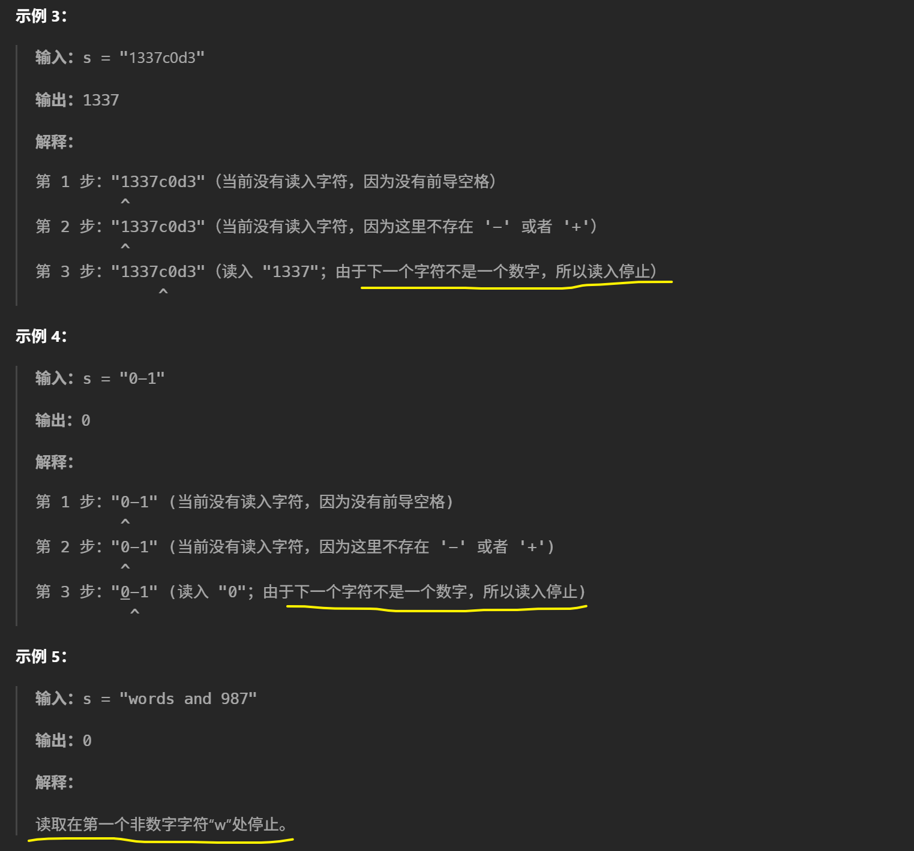

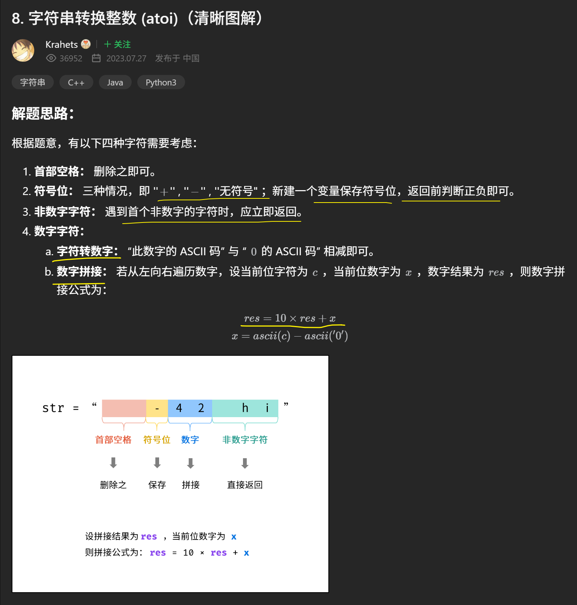

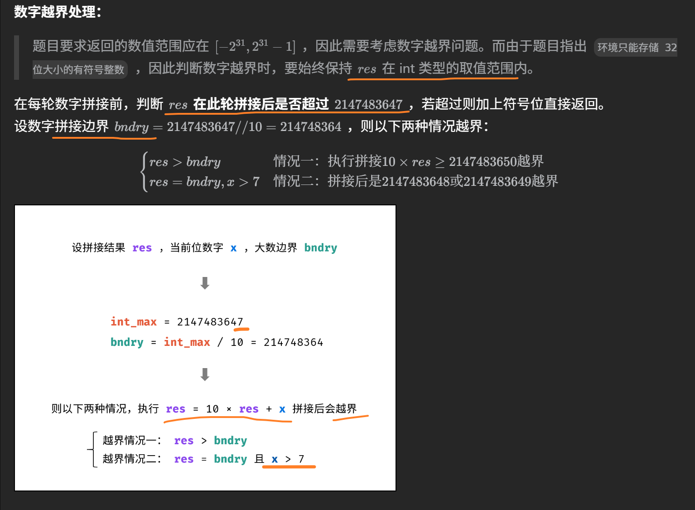

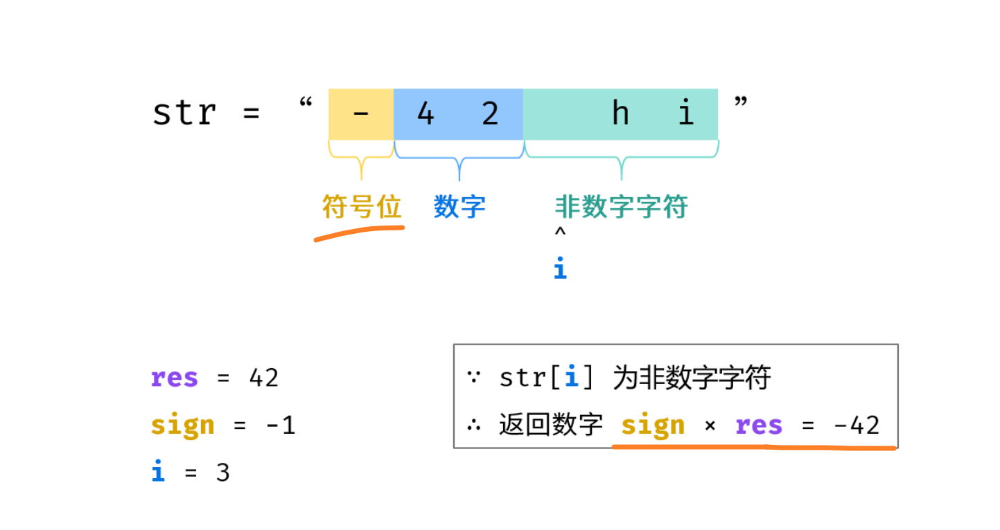

~~~C++
class Solution {
public:
    int myAtoi(string s) {

        int res = 0; // 拼接后的数字
        int bndry = INT_MAX / 10; // 边界

        int i = 0; // 遍历s下标
        int sign = 1; // 符号
        int length = s.size();

        if (length == 0)    return 0;

        // 跳过空格
        while (s[i] == ' ')
        {
            i++; // 遇到首部空格，直接i++ 跳过
            if (i == length)  return 0; // 如果直到尾部都是空格，返回0
        }

        // 符号位，记录负号，正号跳过
        if (s[i] == '-')                sign = -1; 
        if (s[i] == '-' || s[i] == '+') i++;

        // 拼接数字位，并处理非数字字符和越界
        for (int j = i; j < length; j++)
        {
            if (s[j] < '0' || s[j] > '9')   break; // 非数字字符，直接返回当前res

            if (res > bndry || res == bndry && s[j] > '7') // 拼接新s[j]后越界
            {
                return sign == 1 ? INT_MAX : INT_MIN;
            }

            res = res * 10 + (s[j] - '0'); // 拼接数字
        }

        // 返回 符号位 * 拼接后的数字
        return sign * res; 
        
    }
};
~~~


# 32 [最长有效括号](https://leetcode.cn/problems/longest-valid-parentheses/description/?envType=study-plan-v2&envId=top-100-liked)

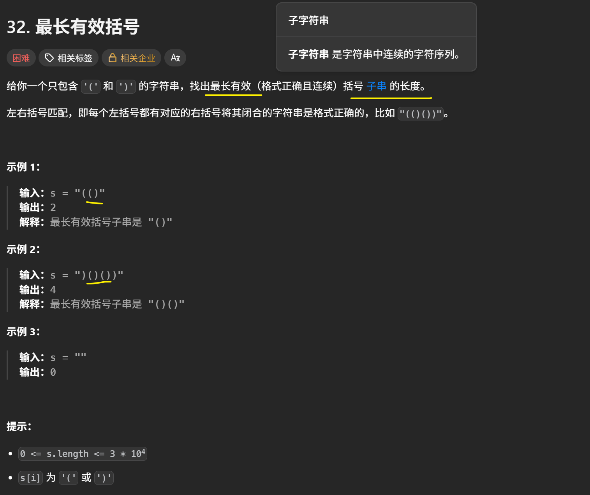

## 动规

[原题解](https://leetcode.cn/problems/longest-valid-parentheses/solutions/206995/dong-tai-gui-hua-si-lu-xiang-jie-c-by-zhanganan042)  大神 。。。

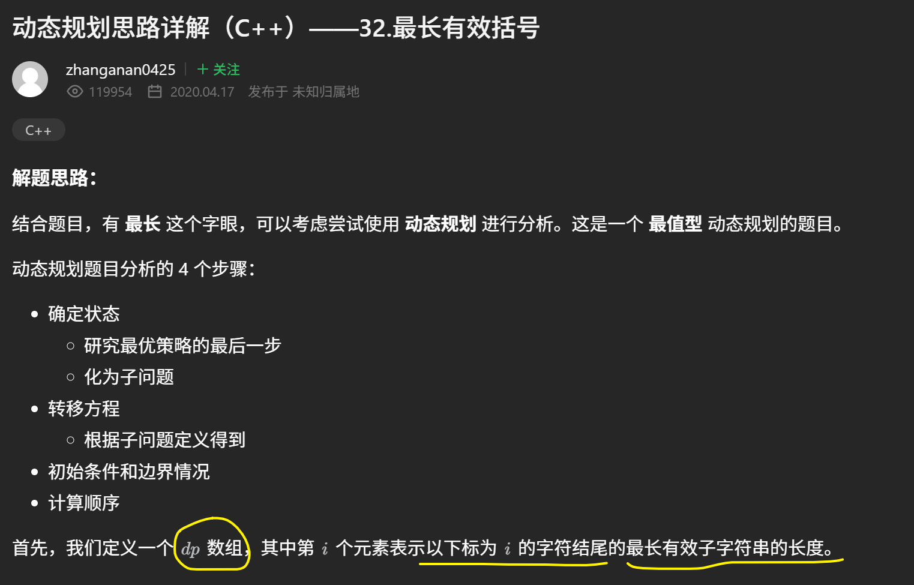

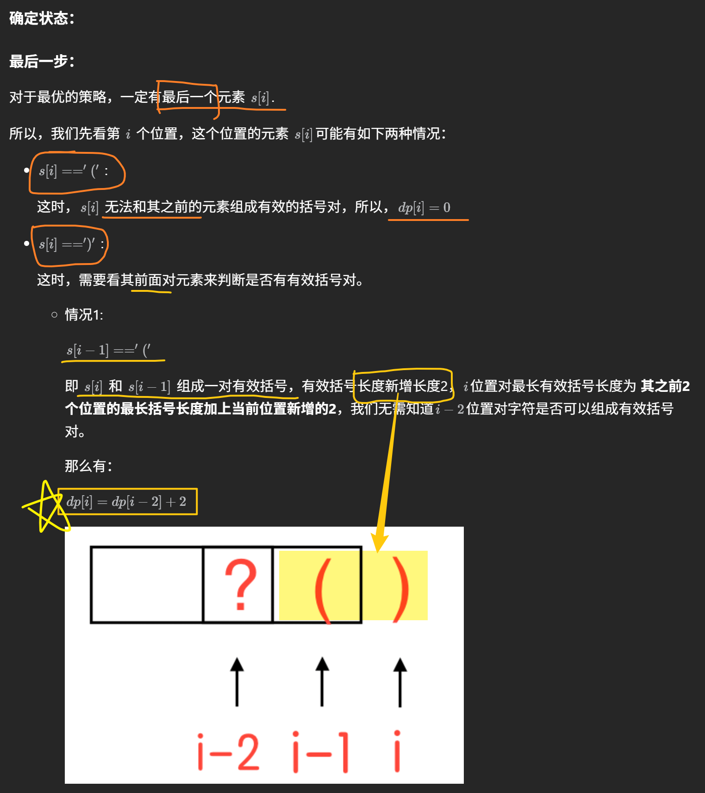

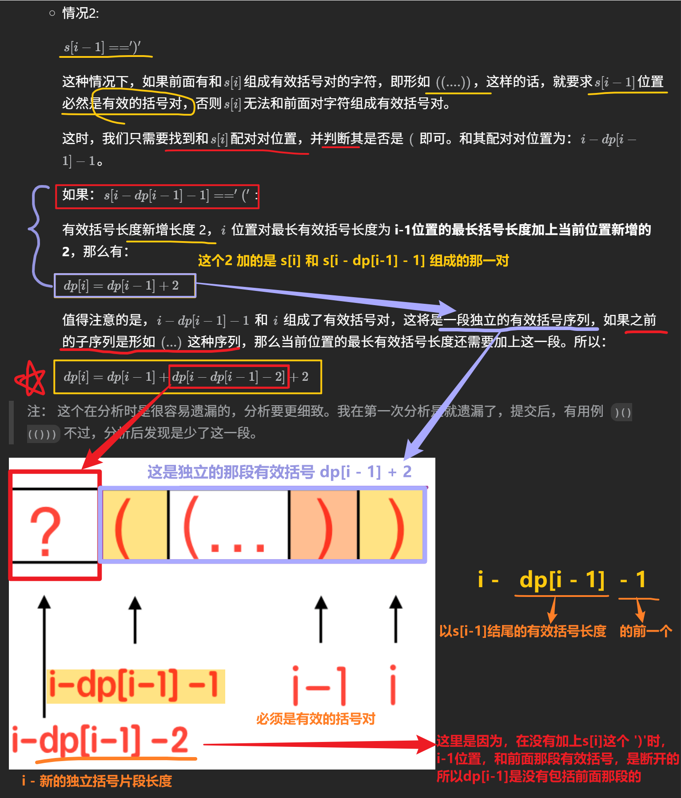

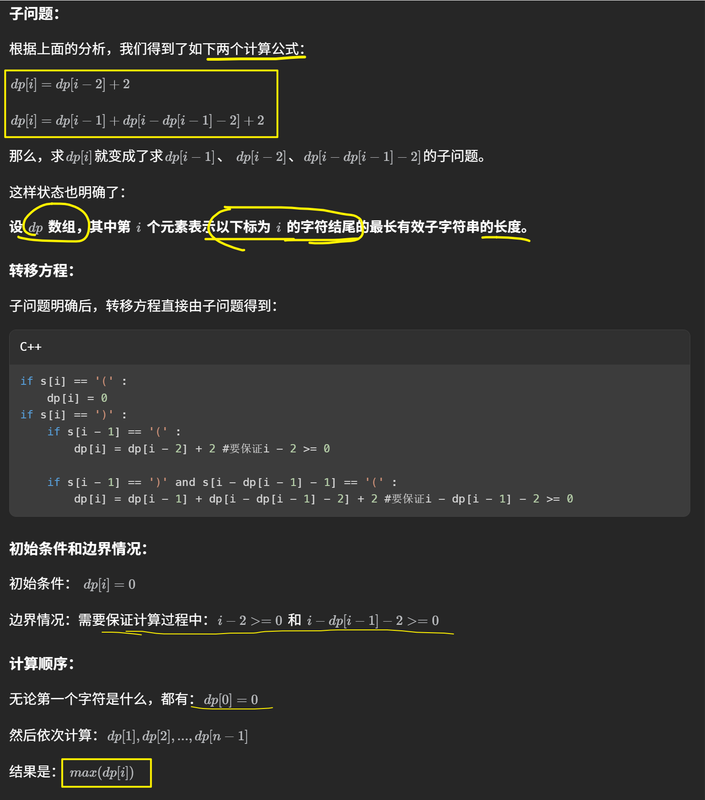

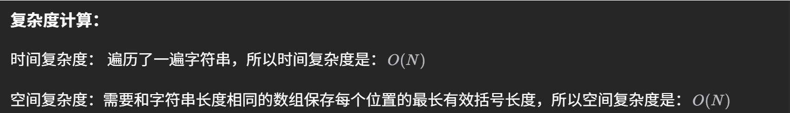


~~~C++
class Solution {
public:
    int longestValidParentheses(string s) {

        // dp[i] - 以s[i]结尾的最长有效括号的长度
        vector<int> dp(s.size(), 0);

        int maxLength = 0;
        for (int i = 1; i < s.size(); i++)
        {
            // 以'('结尾，组不成有效括号 (可以不特意写出来)
            if (s[i] == '(')  dp[i] = 0; 

            // 以')'结尾，考虑前一个括号 s[i-1]
            else if (s[i] == ')') 
            {
                if (s[i - 1] == '(') // 最后两个就能组成一对括号 ____ ()
                {
                    if (i - 2 >= 0) dp[i] = dp[i - 2] + 2; // _____ ()
                    else            dp[i] = 2;             // ()
                }
                else // s[i - 1] == ')'   ____ )) 往前找和i位置的')'对应的
                {
                    // 以s[i-1]结尾的必须是有效括号对，___(__))  才能再往前找和i对应的
                    if (dp[i - 1] > 0)   
                    {
                        // 和 i 的')'对应的位置s[i - dp[i-1] - 1] 必须是'('   ___((_))
                        if ((i - dp[i-1]-1) >= 0 && s[i - dp[i-1] - 1] == '(')
                        {
                            if (i - dp[i - 1] - 2 >= 0) // 新片段前面还有(______)((_))
                            {
                                dp[i] = dp[i-1] + 2 + dp[i - dp[i-1] - 2];
                            }
                            else // 新片段前面没有了 ((_))
                            {
                                dp[i] = dp[i - 1] + 2;
                            } 
                        }
                    }
                }
            }

            maxLength = max(maxLength, dp[i]); // 取最大长度
        }

        return maxLength;  
    }
};
~~~


去掉注释版

~~~C++
class Solution {
public:
    int longestValidParentheses(string s) {

        int maxLength = 0;
        vector<int> dp(s.size(), 0);

        for (int i = 1; i < s.size(); i++)
        {
            if (s[i] == '(')    dp[i] = 0; // ____(
            
            else // ____)  看 s[i - 1]
            {
                if (s[i - 1] == '(') // ____()
                {
                    if (i - 2 >= 0) dp[i] = dp[i - 2] + 2; // ____()
                    else            dp[i] = 2; 			   // ()
                }
                else // ___))
                {
                    if (dp[i - 1] > 0) // ____(_))
                    {
                        // ____((_))
                        if (i - dp[i-1] - 1 >= 0 && s[i - dp[i-1] - 1] == '(') 
                        {
                            // (____)((__))
                            if (i-dp[i-1]-2 >= 0) dp[i] = dp[i-1]+2 + dp[i-dp[i-1]-2];
                            else 				  dp[i] = dp[i-1] + 2; // ((__))
                        }
                    }
                }

            }
            maxLength = max(maxLength, dp[i]);
        }

        return maxLength; 
    }
};
~~~

时间：O(N)

空间：O(N)


## 栈

> 参考 ： [林小鹿](https://leetcode.cn/u/lin-shen-shi-jian-lu-k/)     [我要出去乱说](https://leetcode.cn/u/wo-yao-chu-qu-luan-shuo/)

可以举例子看一下

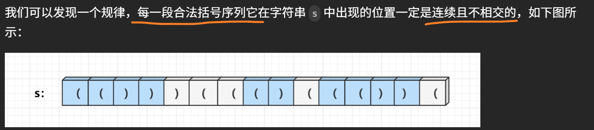

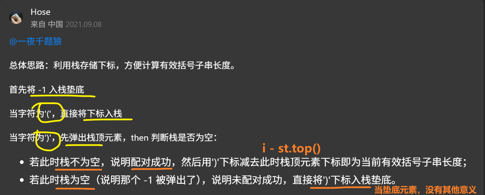

~~~C++
class Solution {
public:
    int longestValidParentheses(string s) {

        stack<int> st; // 存 '(' 的下标
        st.push(-1);   // -1 放进去垫底

        int maxLen = 0;

        for (int i = 0; i < s.size(); i++)
        {
            if (s[i] == '(')    st.push(i); // 遇到 '(' 直接把下标放进去
            else // s[i] == ')'
            {
                st.pop(); // 弹出栈顶，即和当前这个 ')' 配对的 '(' 下标

                if (!st.empty()) // 栈没空，配对有效，取有效括号长度的最大值   
                {
                    maxLen = max(maxLen, i - st.top()); // 此时top是-1或上次放进的右括号的下标
                } 
                else // 栈空，说明垫底元素被弹出了，未配对，把当前i放进去当新的垫底
                {
                    st.push(i); 
                }                
            }
        }

        return maxLen;        
    }
};
~~~

时间：O(N)

空间：O(N)


# 2 [两数相加](https://leetcode.cn/problems/add-two-numbers/description/?envType=study-plan-v2&envId=top-100-liked)

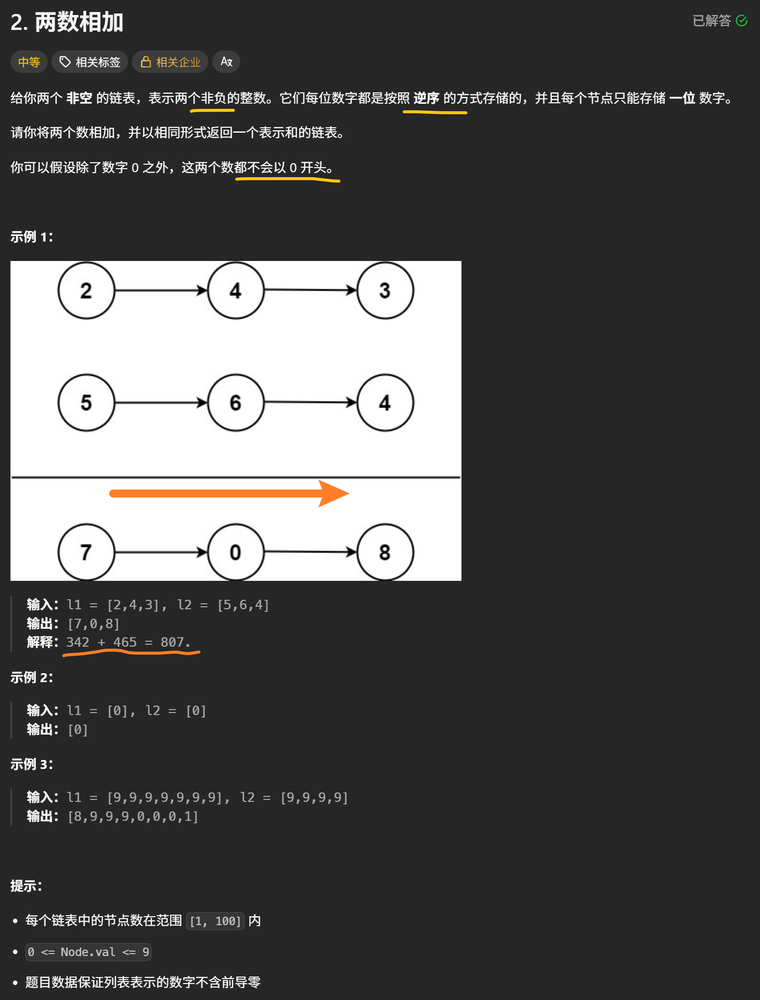

题解：[将链表反过来看](https://leetcode.cn/problems/add-two-numbers/solutions/2826226/jiang-lian-biao-fan-guo-lai-kan-jiu-bu-b-mfhh/?envType=study-plan-v2&envId=top-100-liked)

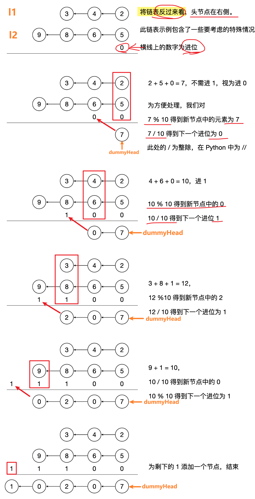

~~~C++
/**
 * Definition for singly-linked list.
 * struct ListNode {
 *     int val;
 *     ListNode *next;
 *     ListNode() : val(0), next(nullptr) {}
 *     ListNode(int x) : val(x), next(nullptr) {}
 *     ListNode(int x, ListNode *next) : val(x), next(next) {}
 * };
 */
class Solution {
public:
    ListNode* addTwoNumbers(ListNode* l1, ListNode* l2) {

        ListNode* dummyHead = new ListNode(0);
        ListNode* node = dummyHead;

        int carrier = 0; // 进位

        // 只要2个链表中有没走到尽头的，或者进位不为0，就一直前进
        while (l1 || l2 || carrier)
        {
            // 求和 
            int sum = (l1 ? l1->val : 0) + (l2 ? l2->val : 0) + carrier;

            // 在尾部添加新节点
            node->next = new ListNode(sum % 10); // 对10取余（取个位）
            
            // 更新进位
            carrier = sum / 10;

            // 往下走，加下一位
            node = node->next;
            if (l1) l1 = l1->next;
            if (l2) l2 = l2->next;
        }

        return dummyHead->next;        
    }
};
~~~


# 70 [爬楼梯](https://leetcode.cn/problems/climbing-stairs/description/?envType=study-plan-v2&envId=top-100-liked)

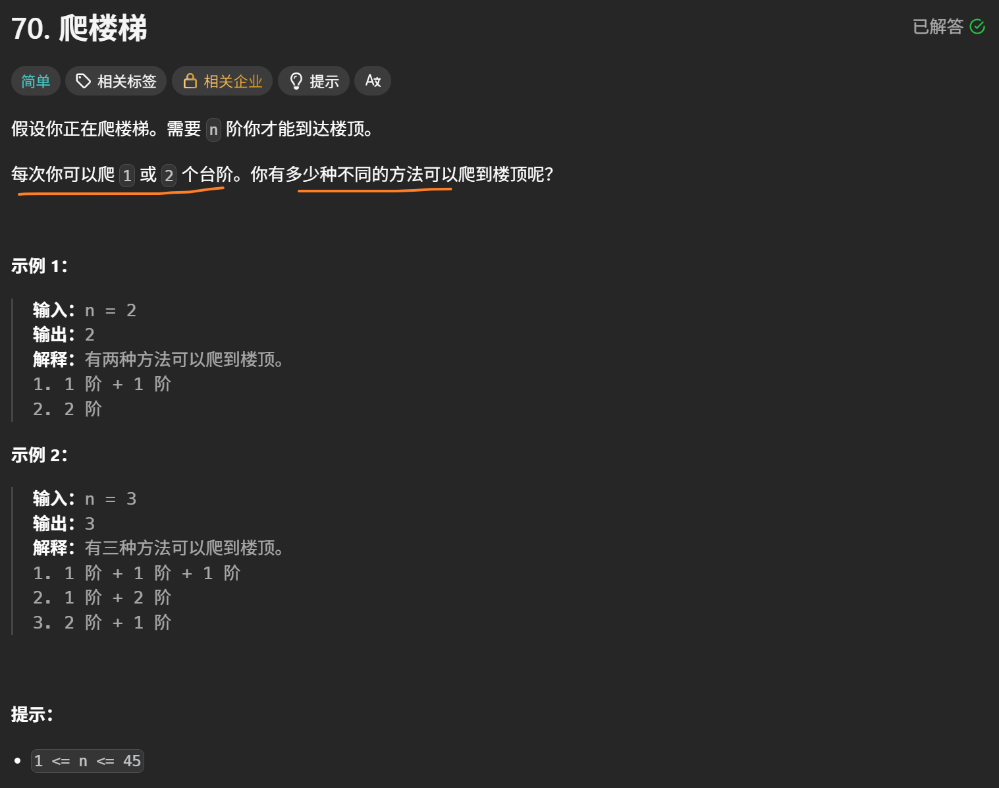


## 基本


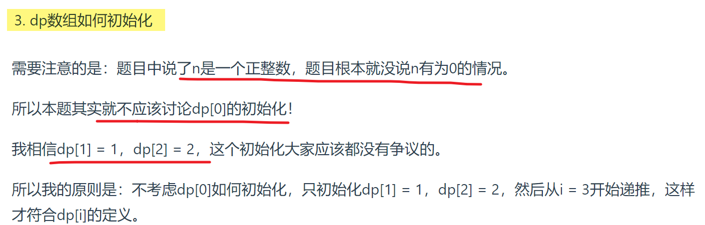

~~~C++
class Solution {
public:
    int climbStairs(int n) {
        
        if (n <= 1) return n;
        
        vector<int> dp(n + 1); // dp[i] 爬到第i个台阶，有多少种方法

        dp[1] = 1;
        dp[2] = 2;

        for (int i = 3; i <= n; i++)
        {
            dp[i] = dp[i - 1] + dp[i - 2];
        }

        return dp[n];
        
    }
};
~~~

时间复杂度 O(n)


优化：dp[3]

~~~C++
class Solution {
public:
    int climbStairs(int n) {
        
        if (n <= 1) return n;
        
        int dp[3]; // 只维护3个

        dp[1] = 1;
        dp[2] = 2;

        for (int i = 3; i <= n; i++)
        {
            int sum = dp[1] + dp[2];
            dp[1] = dp[2];
            dp[2] = sum;
        }

        return dp[2];
        
    }
};
~~~

时间复杂度 O(n) ： 计算 f(n) 需循环 n 次，每轮循环内计算操作使用 O(1) 。
空间复杂度 O(1) ： 几个标志变量使用常数大小的额外空间。


## 进阶（377 组合总和IV）


# 322 [零钱兑换](https://leetcode.cn/problems/coin-change/)

@ 完全背包

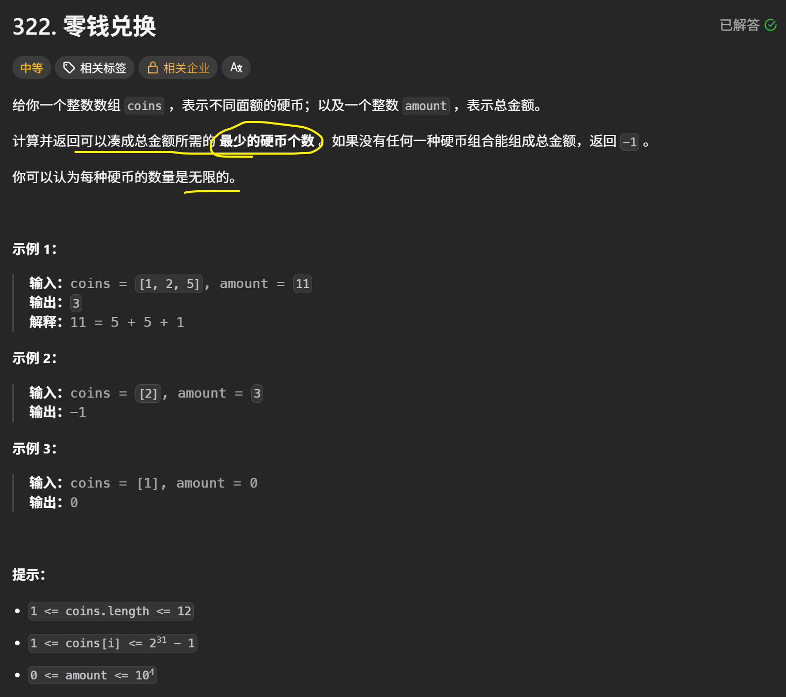

**物品——硬币；背包重量——总金额；完全背包——硬币无限**


~~~C++
class Solution {
public:
    int coinChange(vector<int>& coins, int amount) {

        // dp[j] 凑足总额为 j，所需最少硬币个数为 dp[j]
        vector<int> dp(amount + 1, INT_MAX);
        dp[0] = 0;

        // 先物品，后背包（可调换）
        for (int i = 0; i < coins.size(); i++)
        {
            for (int j = coins[i]; j <= amount; j++) // 完全背包，正序
            {
                if (dp[j - coins[i]] != INT_MAX)// 如果dp[j - coins[i]]是初始值，跳过
                {
                    dp[j] = min(dp[j], dp[j - coins[i]] + 1);
                }
            }
        }

        if (dp[amount] == INT_MAX)  return -1; // 没有组合

        return dp[amount];
        
    }
};
~~~


关于条件：`if (dp[j - coins[i]] != INT_MAX)// 如果dp[j - coins[i]]是初始值，跳过` 

比如：

```
输入：coins = [2], amount = 3
输出：-1
```

计算 dp[3] :

~~~C++
i = 0, coins[0] = 2

   j =  0   1   2   3
dp[] =  0  max  1  ___
~~~

`dp[3] = min(dp[3], dp[3 - 2] + 1)`  这是的  `dp[1] = INT_MAX` ，要直接跳过，不然就溢出了

加上条件之后，这步`dp[3]`计算就跳过，最后应该 `dp[3] = INT_MAX` ，返回的应该是 `-1`


# 43 [字符串相乘](https://leetcode.cn/problems/multiply-strings/description/)

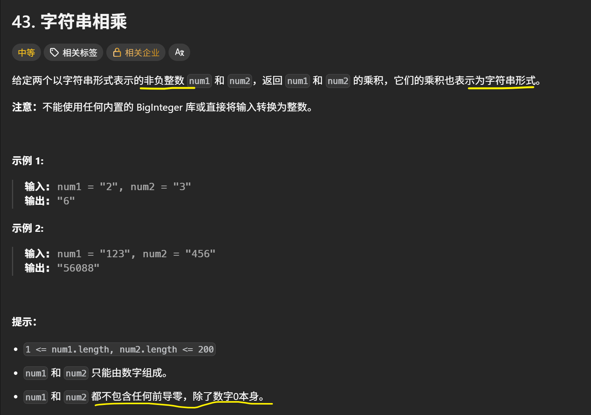

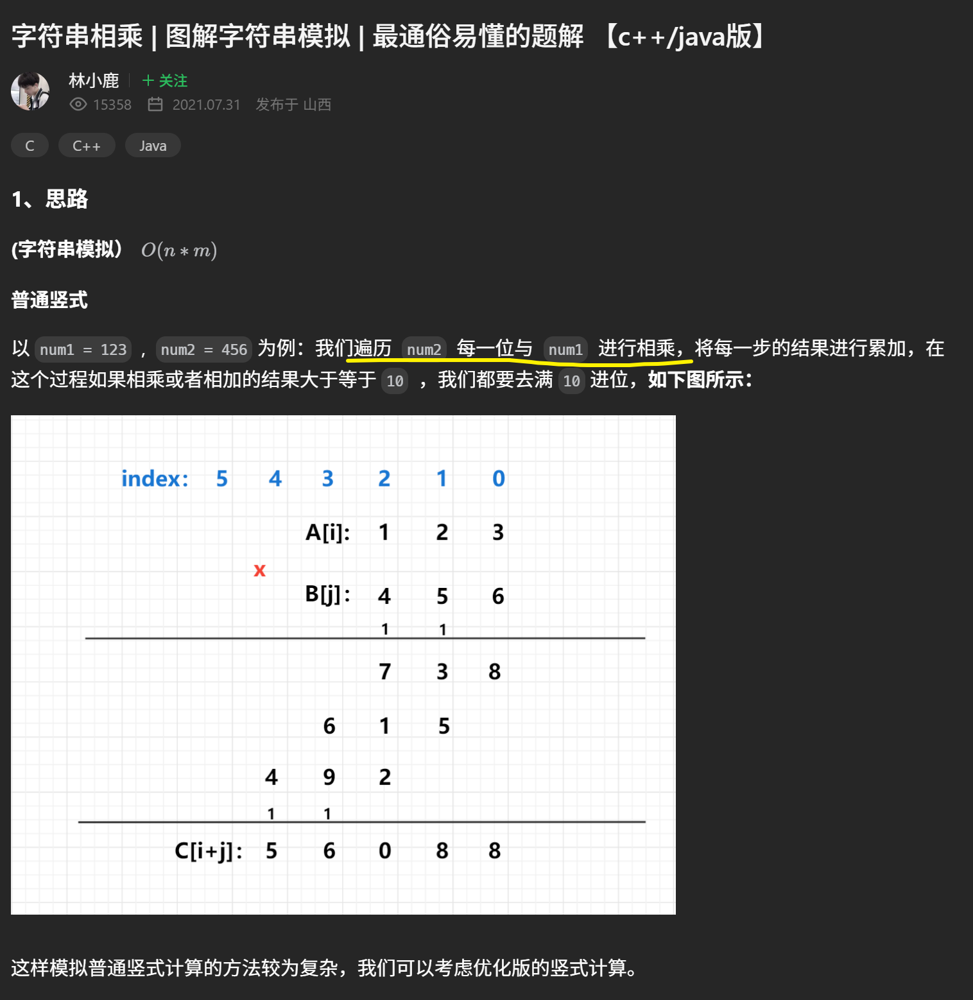

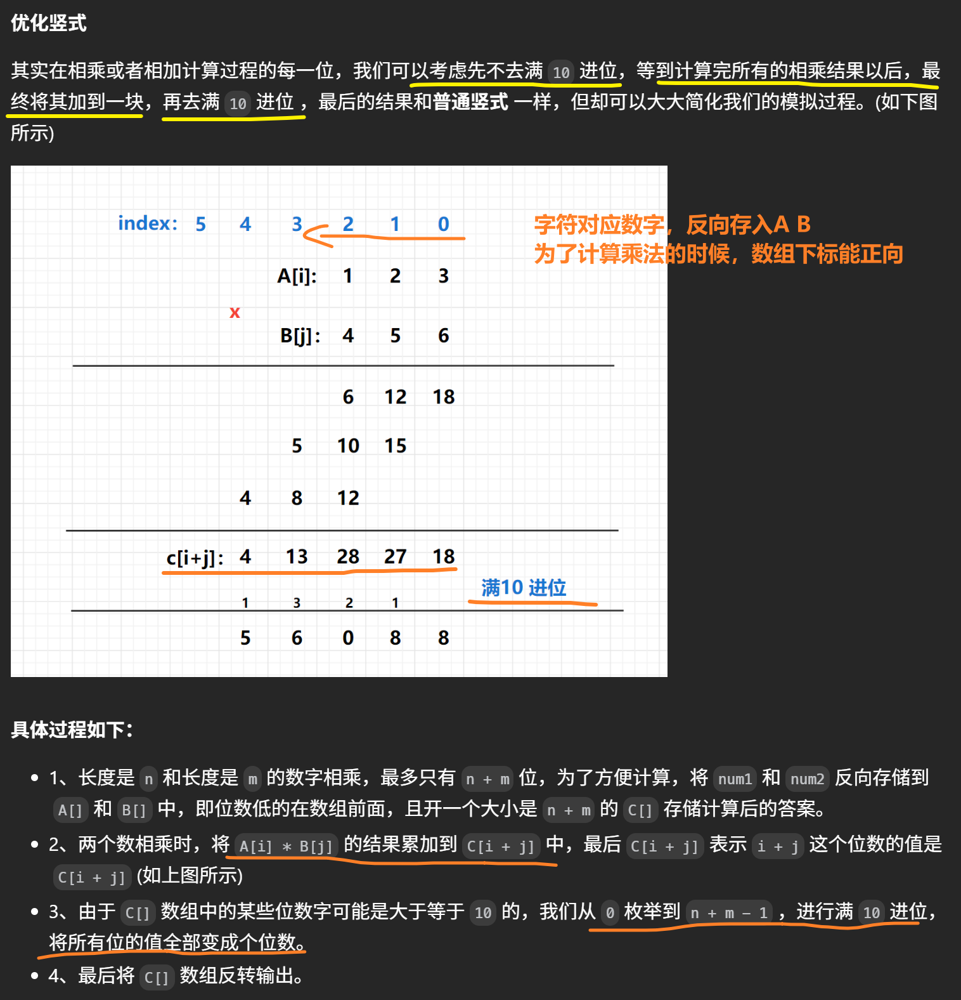

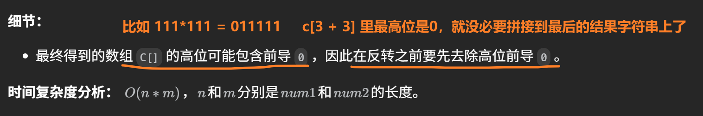

~~~C++
class Solution {
public:
    string multiply(string num1, string num2) {
        
        // 反向存数字到数组 A B
        vector<int> A, B;
        int n = num1.size(), m = num2.size();
        for (int i = n - 1; i >= 0; i--)    A.push_back(num1[i] - '0'); // 反向存数字
        for (int i = m - 1; i >= 0; i--)    B.push_back(num2[i] - '0');

        // C(n + m) 存放单独的每位的乘积
        vector<int> C(n + m);
        for (int i = 0; i < n; i++)
        {
            for (int j = 0; j < m; j++)
            {
                C[i + j] += A[i] * B[j];
            }
        }

        // 考虑进位，把 C 的每一位变成个位数
        int t = 0; // 进位
        for (int i = 0; i < C.size(); i++)
        {
            t += C[i];
            C[i] = t % 10;
            t /= 10;
        }


        int k = C.size() - 1;
        while (k > 0 && !C[k])  k--; // 去除前导0（倒序，可能乘完的结果没有占满C所有位）

        // 把C的每一位拼接成结果字符串，注意要倒序
        string res;
        while (k >= 0)  res += C[k--] + '0'; // 反转拼接

        return res;
    }
};
~~~


# 76 [最小覆盖子串](https://leetcode.cn/problems/minimum-window-substring/?envType=study-plan-v2&envId=top-100-liked)

@滑动窗口

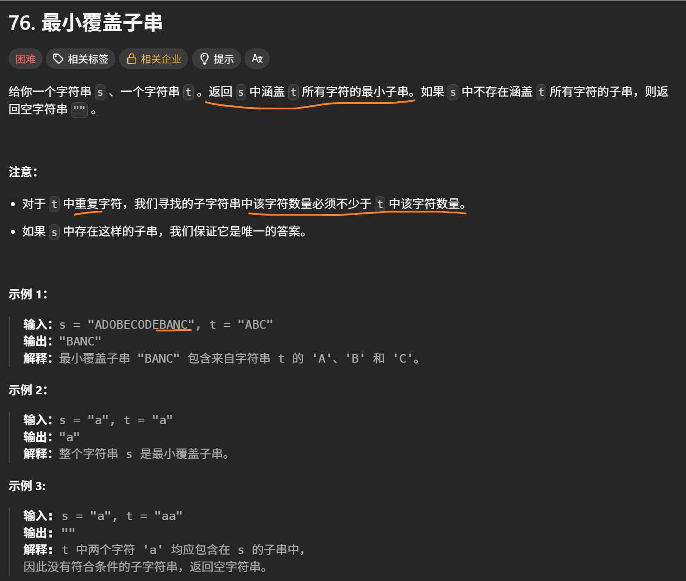		

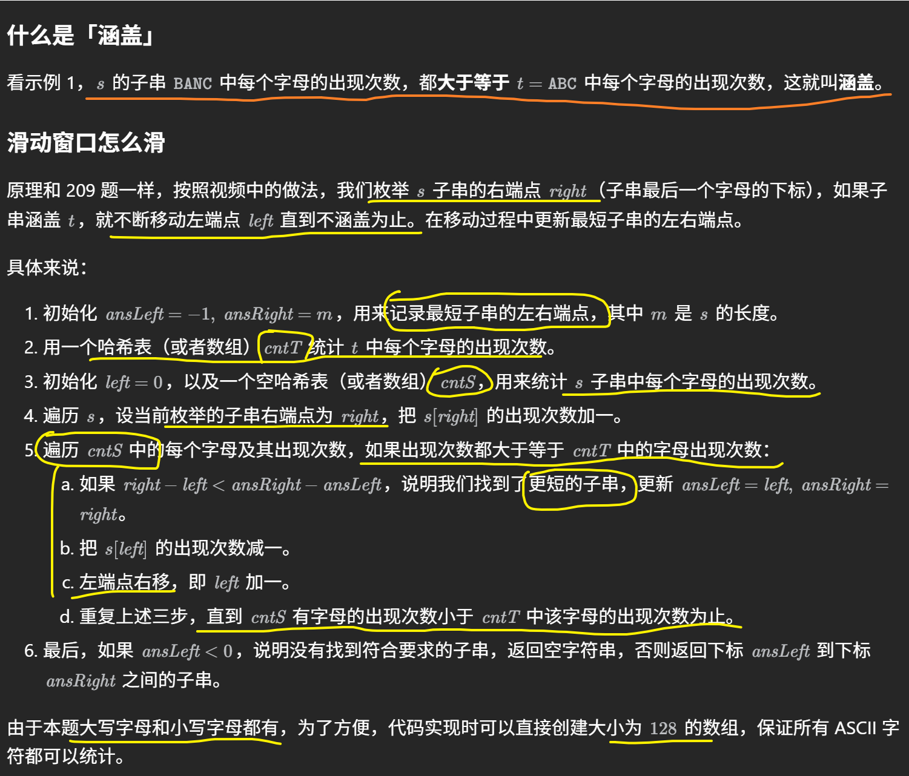

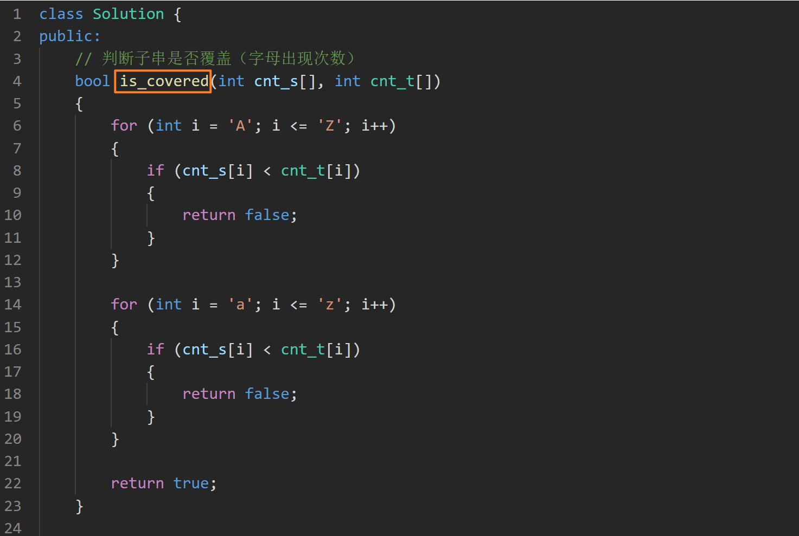

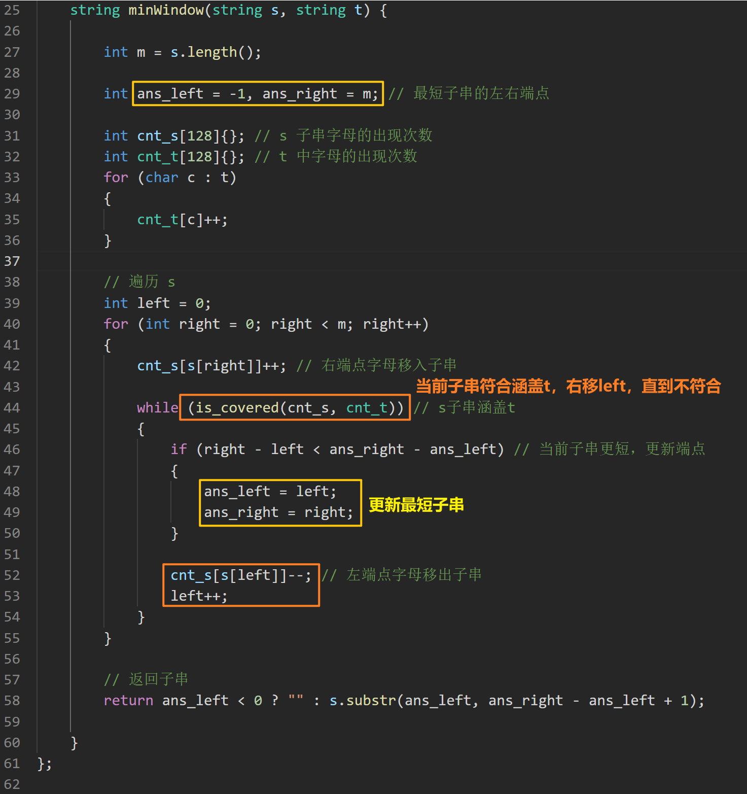

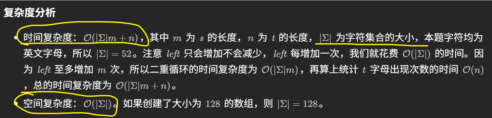


~~~C++
class Solution {
public:
    // 判断子串是否覆盖（字母出现次数）
    bool is_covered(int cnt_s[], int cnt_t[]) 
    {
        for (int i = 'A'; i <= 'Z'; i++)
        {
            if (cnt_s[i] < cnt_t[i])	return false;
        }
        for (int i = 'a'; i <= 'z'; i++)
        {
            if (cnt_s[i] < cnt_t[i])	return false;
        }
        
        return true;
    }

    string minWindow(string s, string t) {
        
        int m = s.length();

        int cnt_s[128]{}; // s 子串字母的出现次数
        int cnt_t[128]{}; // t 中字母的出现次数
        for (char c : t)	cnt_t[c]++;
        
        int ans_left = -1, ans_right = m; // 最短子串的左右端点
        
        // 遍历 s
        int left = 0;
        for (int right = 0; right < m; right++)
        {
            cnt_s[s[right]]++; // 右端点字母移入子串
            
            while (is_covered(cnt_s, cnt_t)) // s子串涵盖t
            {
                if (right - left < ans_right - ans_left) // 当前子串更短，更新端点
                {
                    ans_left = left;
                    ans_right = right; 
                }

                cnt_s[s[left]]--; // 左端点字母移出子串
                left++;
            }
        }

        // 返回子串
        return ans_left < 0 ? "" : s.substr(ans_left, ans_right - ans_left + 1);
        
    }
};
~~~


# 41 [缺失的第一个正数](https://leetcode.cn/problems/first-missing-positive/description/?envType=study-plan-v2&envId=top-100-liked)

@哈希

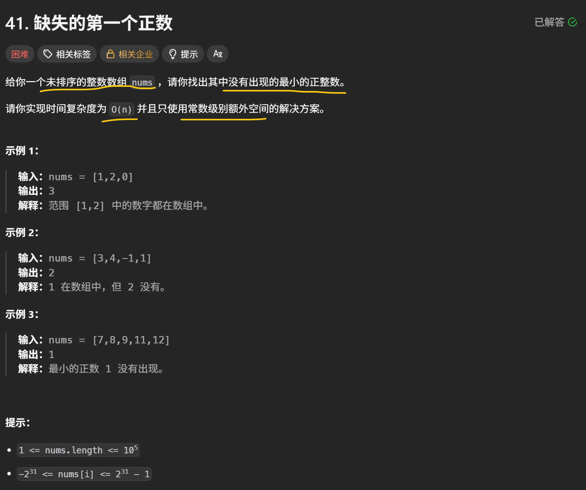


https://leetcode.cn/problems/first-missing-positive/solutions/7703/tong-pai-xu-python-dai-ma-by-liweiwei1419

本题的难点在：只能使用**常数级别的额外空间**，在这个限制下本题的思路有一个非正式的名称：**原地哈希**。

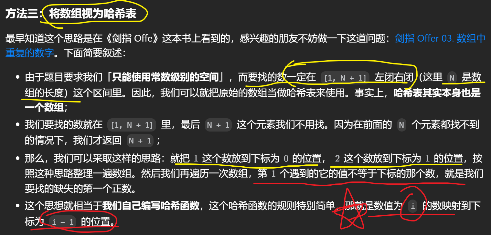

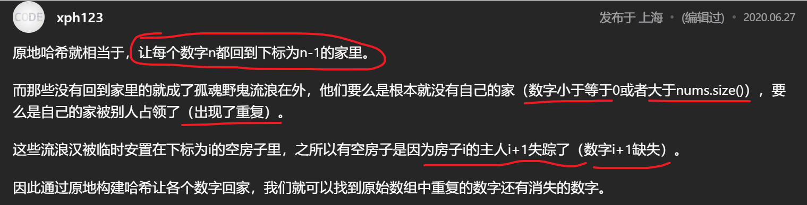

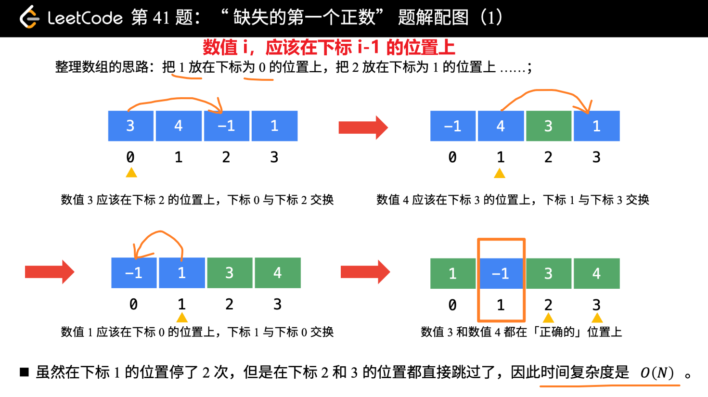

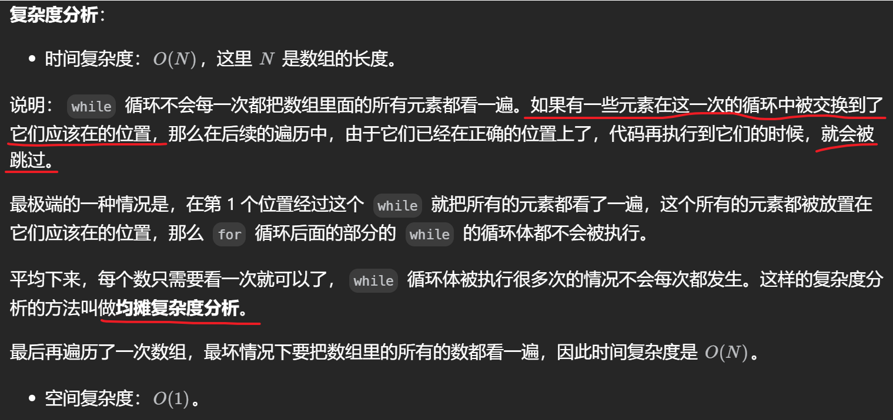


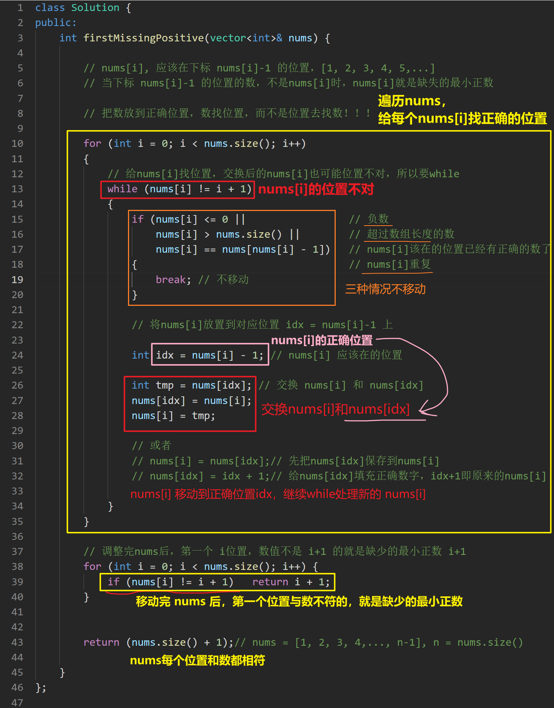

~~~C++
class Solution {
public:
    int firstMissingPositive(vector<int>& nums) {

        // 如果不缺失正数：下标i的位置，放的应该是i+1，即nums[i] = i + 1
        // nums = [1, 2, 3, 4, ...]
        // 下标    0  1  2  3 ...

        // 当下标 i 位置的数，不是 i+1 时(nums[i] != i + 1)，i+1 就是缺失的最小正数

        // 注意是把数放到正确位置，数找位置，而不是位置找数！！！


        // 遍历nums，给每个nums[i]找正确的位置
        for (int i = 0; i < nums.size(); i++)
        {
            // 给nums[i]找位置，交换后的nums[i]可能位置也不对，所以while直到位置正确
            while (nums[i] != i + 1)
            {
                if (nums[i] <= 0 ||               // 负数或0
                    nums[i] > nums.size() ||      // 超过数组长度的数
                    nums[i] == nums[nums[i] - 1]) // nums[i]重复，nums[i]该在的位置已经有正确的数了
                {
                    break; // 这三种情况不移动
                }

                // 将nums[i]放到对应位置（即交换 nums[i] 与 nums[nums[i] - 1]）
                int idx = nums[i] - 1;
                swap(nums[i], nums[idx]); 
            }
        }


        // 查找第一个不满足 nums[i] == i + 1 的位置
        for (int i = 0; i < nums.size(); i++)
        {
            if (nums[i] != i + 1)   return i + 1;
        }

        // 如果所有都相符，缺少的就是最后一个数的下一个 [1, 2, 3, 4, ..., n-1]  n = nums.size()
        return (nums.size() + 1);
        
    }
};
~~~


# 105 [从前序与中序遍历序列构造二叉树](https://leetcode.cn/problems/construct-binary-tree-from-preorder-and-inorder-traversal/description/?envType=study-plan-v2&envId=top-100-liked)

参考[106 从中序与后序遍历构造二叉树](https://leetcode.cn/problems/construct-binary-tree-from-inorder-and-postorder-traversal/description/)

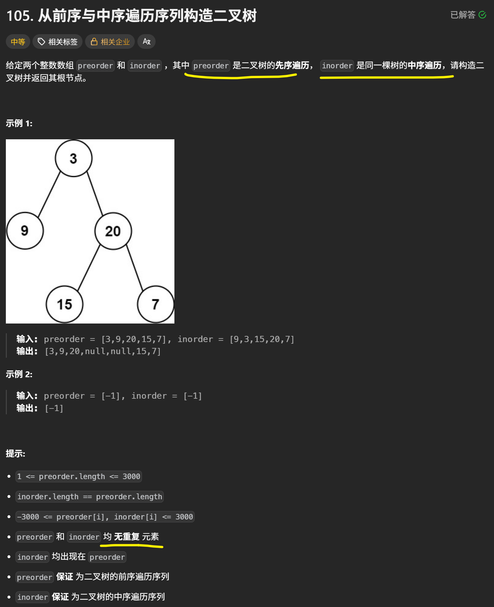

和106 从中序与后序遍历构造二叉树 一个意思

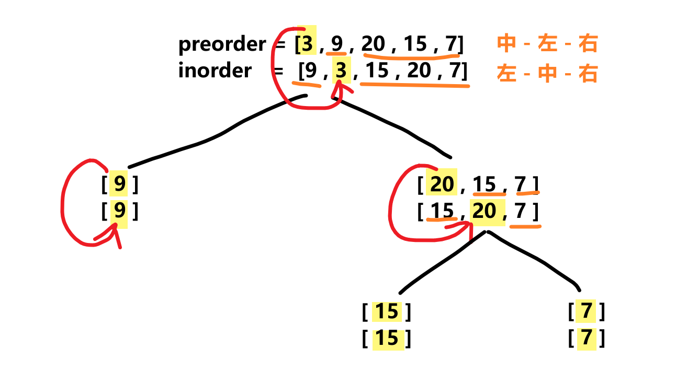


[灵神](https://leetcode.cn/problems/construct-binary-tree-from-preorder-and-inorder-traversal/solutions/2646359/tu-jie-cong-on2-dao-onpythonjavacgojsrus-aob8)

~~~C++
/**
 * Definition for a binary tree node.
 * struct TreeNode {
 *     int val;
 *     TreeNode *left;
 *     TreeNode *right;
 *     TreeNode() : val(0), left(nullptr), right(nullptr) {}
 *     TreeNode(int x) : val(x), left(nullptr), right(nullptr) {}
 *     TreeNode(int x, TreeNode *left, TreeNode *right) : val(x), left(left), right(right) {}
 * };
 */
class Solution {
public:
    TreeNode* buildTree(vector<int>& preorder, vector<int>& inorder) {

        if (preorder.empty())   return nullptr;

        // 左子树大小
        int left_size = ranges::find(inorder, preorder[0]) - inorder.begin();

        // 分割前序
        vector<int> prel(preorder.begin() + 1, preorder.begin() + 1 + left_size);
        vector<int> prer(preorder.begin() + 1 + left_size, preorder.end());

        // 分割中序
        vector<int> inl(inorder.begin(), inorder.begin() + left_size);
        vector<int> inr(inorder.begin() + left_size + 1, inorder.end());

        // 递归
        TreeNode* left = buildTree(prel, inl);
        TreeNode* right = buildTree(prer, inr);

        return new TreeNode(preorder[0], left, right);
    }
};
~~~


# LCR 140 [链表倒数第k个节点](https://leetcode.cn/problems/lian-biao-zhong-dao-shu-di-kge-jie-dian-lcof/description/)

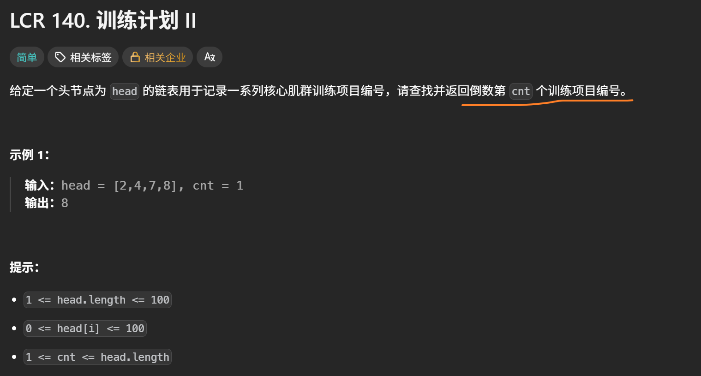

~~~C++
/**
 * Definition for singly-linked list.
 * struct ListNode {
 *     int val;
 *     ListNode *next;
 *     ListNode() : val(0), next(nullptr) {}
 *     ListNode(int x) : val(x), next(nullptr) {}
 *     ListNode(int x, ListNode *next) : val(x), next(next) {}
 * };
 */
class Solution {
public:
    ListNode* trainingPlan(ListNode* head, int cnt) {

        // 返回链表倒数第 cnt 个节点

        ListNode* dummy = new ListNode(0);
        dummy->next = head;
        ListNode* slow = dummy;
        ListNode* fast = dummy;

        while (cnt--)   fast = fast->next;

        while (fast->next)
        {
            slow = slow->next;
            fast = fast->next;
        }

        return slow->next; 
    }
};
~~~


# 151 [反转字符串中的单词](https://leetcode.cn/problems/reverse-words-in-a-string/description/)

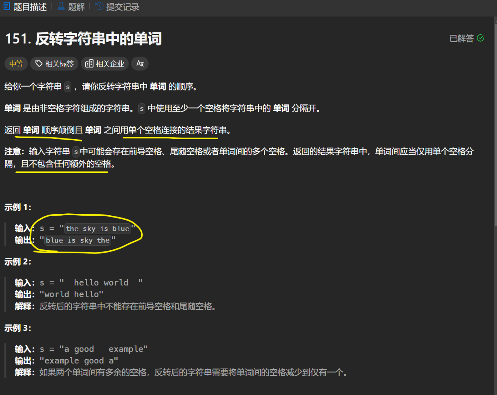

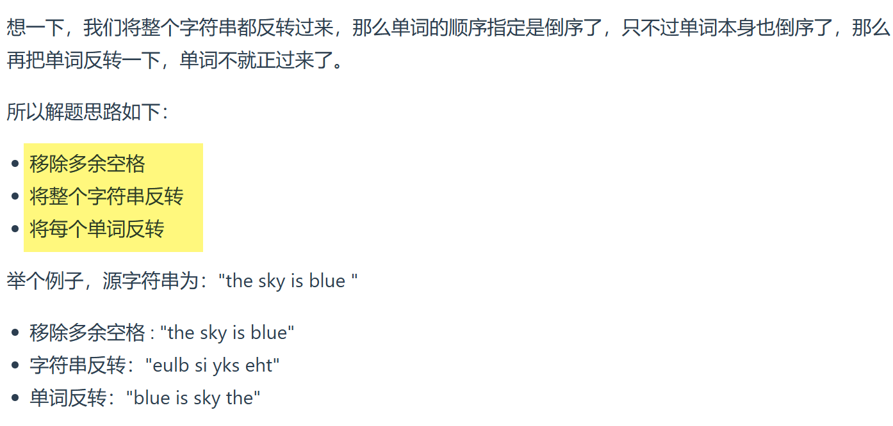


~~~C++
class Solution {
public:
    // 思路：去除多余空格 - 整体反转 - 反转单个单词

    // 去除多余空格，并在相邻单词之间添加空格
    void removeExtraSpace(string& s)
    {
        int slow = 0;
        for (int fast = 0; fast < s.size(); fast++)
        {
            // 遇到非空格就处理，删除所有空格
            if (s[fast] != ' ') 
            {
                // 如果 slow 不是首个字符，遇到新单词就给新单词前加上空格
                if (slow != 0)  s[slow++] = ' '; 
                
                // 把这个新单词，赋给slow对应的位置，移动指针，遇到空格说明这个单词结束
                while (fast < s.size() && s[fast] != ' ')   s[slow++] = s[fast++];
            }
        }

        s.resize(slow);// slow停在最后一个有效字符的下一个，对应最后去除多余空格的大小
    }


    // 反转 s 的 [start, end] 部分
    void reverse(string& s, int start, int end) 
    {
        for (int i = start, j = end; i < j; i++, j--)   swap(s[i], s[j]);
    }


    string reverseWords(string s) {

        // 1 去除多余空格，保证首尾没有空格，每个单词之间只有一个空格
        removeExtraSpace(s);

        // 2 整体反转 s
        reverse(s, 0, s.size() - 1);

        // 3 单个反转
        int start = 0;
        for (int i = 0; i <= s.size(); i++)
        {
            // 达到空格或者串尾，说明一个单词结束，进行反转
            if (i == s.size() || s[i] == ' ')
            {
                reverse(s, start, i - 1); // 反转当前这个单词
                start = i + 1; // 更新到下一个单词的开始下标
            }
        }

        return s;        
    }
};
~~~


# 78 [子集](https://leetcode.cn/problems/subsets/description/?envType=study-plan-v2&envId=top-100-liked)

@ 回溯

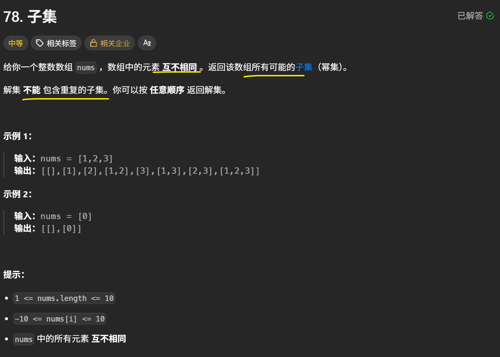

数组的 **子集** 是从数组中选择一些元素（可能为空）。

如果把 子集问题、组合问题、分割问题都抽象为一棵树的话，那么**组合问题和分割问题都是收集树的叶子节点**，而**子集问题是找树的所有节点**

路径上所有节点都是子集。

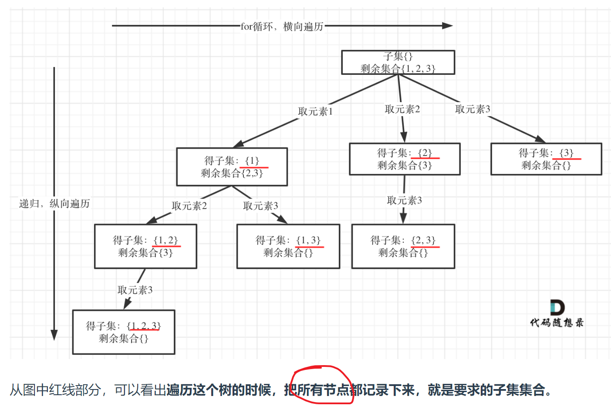

~~~C++
class Solution {
public:
    vector<int> path;
    vector<vector<int>> result;

    void backtracking(vector<int>& nums, int startIndex)
    {
        if (startIndex > nums.size())  return;

        for (int i = startIndex; i < nums.size(); i++)
        {
            path.push_back(nums[i]);
            result.push_back(path); // 处理节点的时候直接放进result

            backtracking(nums, i + 1);

            path.pop_back();
        }
    }


    vector<vector<int>> subsets(vector<int>& nums) {

        result.push_back(path); // 提前放一个空path进去
        backtracking(nums, 0);
        return result; 
    }
};
~~~


或者在 backtracking 里先收集path再结束，不会漏掉结果，也不用提前放一个空path了（好像第一种好理解）

~~~C++
class Solution {
public:
    vector<int> path;
    vector<vector<int>> result;

    void backtracking(vector<int>& nums, int startIndex)
    {
        result.push_back(path); // 进下一层的时候，先收集path
        
        if (startIndex > nums.size())   return;

        for (int i = startIndex; i < nums.size(); i++)
        {
            path.push_back(nums[i]);
            backtracking(nums, i + 1);
            path.pop_back();
        }
    }

    vector<vector<int>> subsets(vector<int>& nums) {

        backtracking(nums, 0);
        return result;     
    }
};
~~~


# 129 [求根节点到叶节点数字之和](https://leetcode.cn/problems/sum-root-to-leaf-numbers/description/)

@ 递归

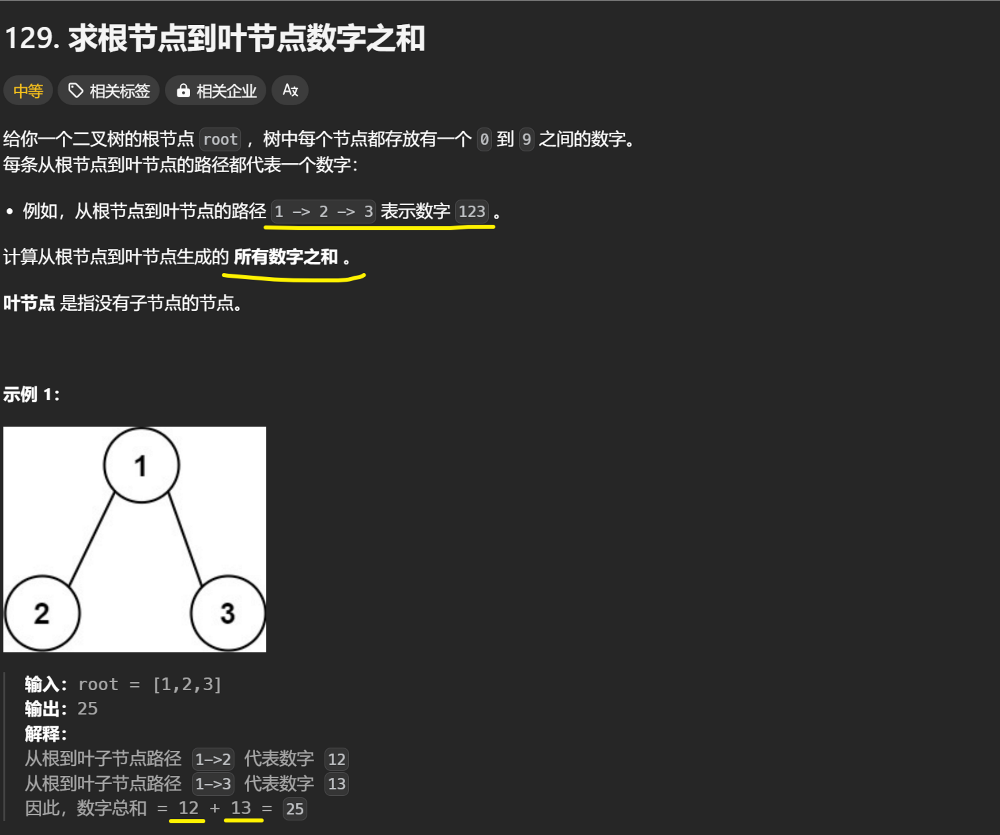

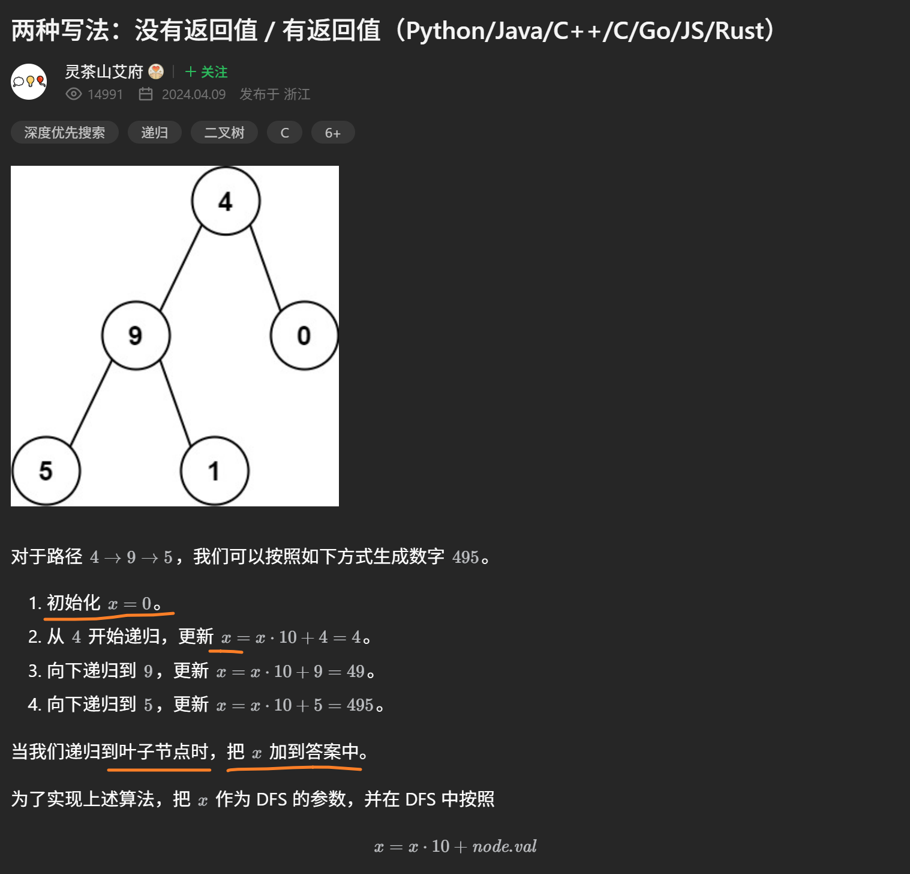

## 1、没有返回值（推荐）

~~~C++
/**
 * Definition for a binary tree node.
 * struct TreeNode {
 *     int val;
 *     TreeNode *left;
 *     TreeNode *right;
 *     TreeNode() : val(0), left(nullptr), right(nullptr) {}
 *     TreeNode(int x) : val(x), left(nullptr), right(nullptr) {}
 *     TreeNode(int x, TreeNode *left, TreeNode *right) : val(x), left(left), right(right) {}
 * };
 */
class Solution {
public:
    int sumNumbers(TreeNode* root) {

        int ans = 0;

        auto dfs = [&](this auto&& dfs, TreeNode* node, int x) -> void 
        {
            if (node == nullptr)    return;

            x = x * 10 + node->val; // 拼接数字
            
            if (node->left == nullptr && node->right == nullptr) // 叶子节点
            {
                ans += x; // 已经收集到一个完整的数字了，加到ans
                return;
            }

            dfs(node->left, x);  // 递归左
            dfs(node->right, x); // 递归右
        };

        dfs(root, 0); // 最初 x = 0
        
        return ans;
    }
};
~~~


## 2、有返回值

~~~C++
class Solution {
public:
    int sumNumbers(TreeNode* root, int x = 0) { // 参数加上 x

        if (root == nullptr)    return 0;

        x = x * 10 + root->val;
        if (root->left == nullptr && root->right == nullptr)    return x; // 返回当前x

        return sumNumbers(root->left, x) + sumNumbers(root->right, x);        
    }
};
~~~


## 常规递归

~~~C++
/**
 * Definition for a binary tree node.
 * struct TreeNode {
 *     int val;
 *     TreeNode *left;
 *     TreeNode *right;
 *     TreeNode() : val(0), left(nullptr), right(nullptr) {}
 *     TreeNode(int x) : val(x), left(nullptr), right(nullptr) {}
 *     TreeNode(int x, TreeNode *left, TreeNode *right) : val(x), left(left), right(right) {}
 * };
 */
class Solution {
public:
    int result = 0;
    vector<int> path;

    // 收集的节点值 [1,2,3] 拼成数值 123
    int vectorToInt(const vector<int>& vec)
    {
        int sum = 0;
        // [1,2,3] --> 123
        for (int i = 0; i < vec.size(); i++)    sum = sum * 10 + vec[i];
        return sum;
    }


    // 递归 path收集节点
    void traversal(TreeNode* cur)
    {    
        if (cur->left == nullptr && cur->right == nullptr) // 终止 叶子节点
        {
            result += vectorToInt(path); // 直接转成数值，加到result
            return;
        }
  
        if (cur->left) // 递归 左树
        {
            path.push_back(cur->left->val);
            traversal(cur->left);
            path.pop_back();
        }

        if (cur->right) // 递归 右树
        {
            path.push_back(cur->right->val);
            traversal(cur->right);
            path.pop_back();
        }

        return;
    }

    int sumNumbers(TreeNode* root) {

        path.clear();
        if (root == nullptr)    return 0;

        path.push_back(root->val); // 先放入root
        traversal(root);
        
        return result;
    }
};
~~~


# 155 [最小栈](https://leetcode.cn/problems/min-stack/description/?envType=study-plan-v2&envId=top-100-liked)

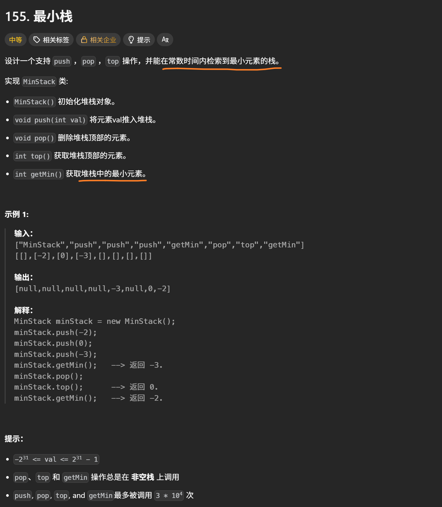

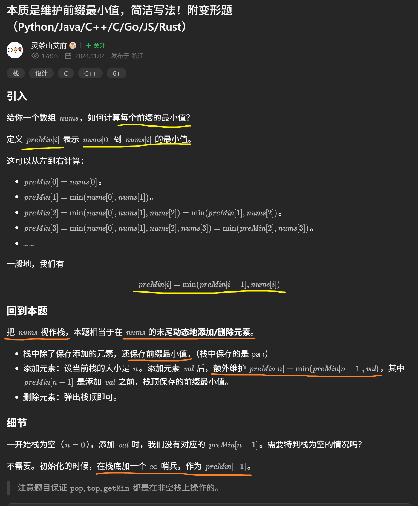


~~~C++
class MinStack {

    stack<pair<int, int>> st; // <val, 前缀最小值> 

public:
    // 初始化
    MinStack() {
        // 添加栈底哨兵 INT_MAX
        // 这里的 0 写成任意数都可以，反正用不到
        st.emplace(0, INT_MAX); 
    }
    
    void push(int val) {
        st.emplace(val, min(getMin(), val)); // <val, 前缀最小值> 维护前缀最小值      
    }
    
    void pop() {
        st.pop();
    }
    
    int top() {
        return st.top().first;
    }
    
    // 最小值
    int getMin() {
        return st.top().second;        
    }
};

/**
 * Your MinStack object will be instantiated and called as such:
 * MinStack* obj = new MinStack();
 * obj->push(val);
 * obj->pop();
 * int param_3 = obj->top();
 * int param_4 = obj->getMin();
 */
~~~


时间复杂度：所有操作均为 O(1)。
空间复杂度：O(q)。其中 q 是 push 调用的次数。最坏情况下，只有 push 操作，需要 O(q) 的空间保存元素。


# 34 [在排序数组中查找第一个和最后一个位置](https://leetcode.cn/problems/find-first-and-last-position-of-element-in-sorted-array/?envType=study-plan-v2&envId=top-100-liked)

@ 二分

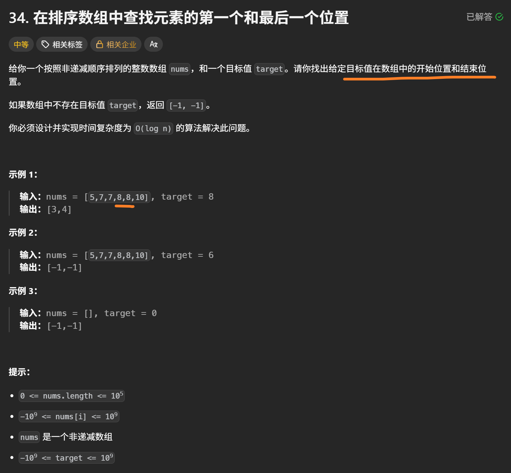

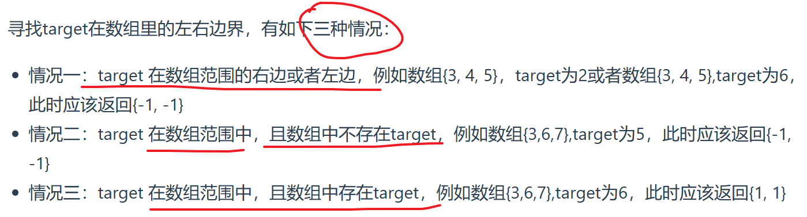

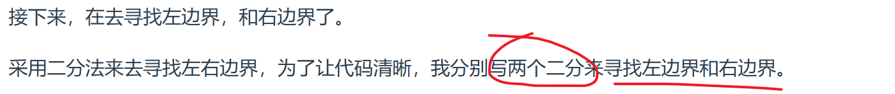

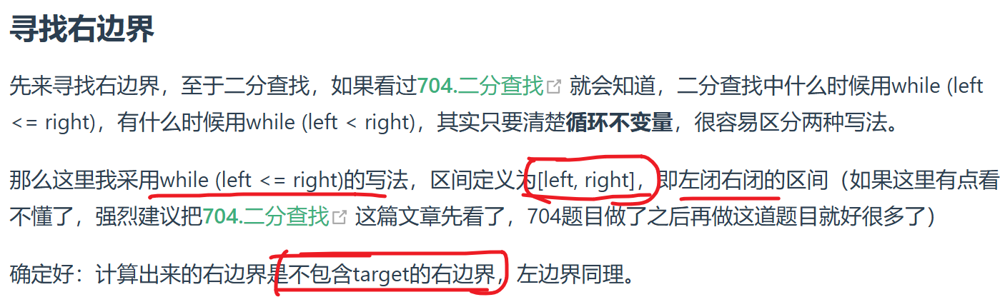

~~~C++
class Solution {
public:

    // nums = [5,  7,  7,  8,  8,  10], target = 8
    //                 |            |
    //            leftBorder     rightBorder


    // 找第一个比 target 大的位置
    int getRightBorder(vector<int>& nums, int target)
    {
        int left = 0;
        int right = nums.size() - 1;
        
        // 当前第一个大于 target 的位置
        int rightBorder = -2; // -2 记录rightBorder没有被赋值的情况
        while (left <= right)
        {
            int mid = left + ((right - left) / 2);
            if (nums[mid] <= target) // 向右缩小范围
            {
                left = mid + 1;
                rightBorder = left;// 新的left就是下一个可能大于target的位置
            }
            else 
            {
                right = mid - 1; 
            }
        }
        return rightBorder;
    }

    // 找最后一个比 target 小的位置
    int getLeftBorder(vector<int>& nums, int target)
    {
        int left = 0;
        int right = nums.size() - 1;
        
        // 最后一个比 target 小的位置
        int leftBorder = -2; 
        while (left <= right)
        {
            int mid = left + ((right - left) / 2); 
            if (target <= nums[mid]) // 向左缩小范围
            {
                right = mid - 1;
                leftBorder = right; // 新right 就是下一个可能小于 target 的位置
            }
            else 
            {
                left = mid + 1;
            }
        }
        return leftBorder;
    }


    vector<int> searchRange(vector<int>& nums, int target) {

        int leftBorder = getLeftBorder(nums, target);
        int rightBorder = getRightBorder(nums, target);


        // 情况一：target 在数组范围的右边或者左边，不再数组范围中 （必须写，不能省略！会和情况三有重叠部分）
        if (leftBorder == -2 || rightBorder== -2)   return {-1, -1};

        
        // 情况三：target 在数组范围中，且数组中存在target
        if (rightBorder - leftBorder > 1)   return {leftBorder + 1, rightBorder - 1};
        
        
        // 情况二：target 在数组范围中，但数组中不存在target
        return {-1, -1};
    }
};
~~~


# 101 [对称二叉树](https://leetcode.cn/problems/symmetric-tree/description/?envType=study-plan-v2&envId=top-100-liked)

@递归

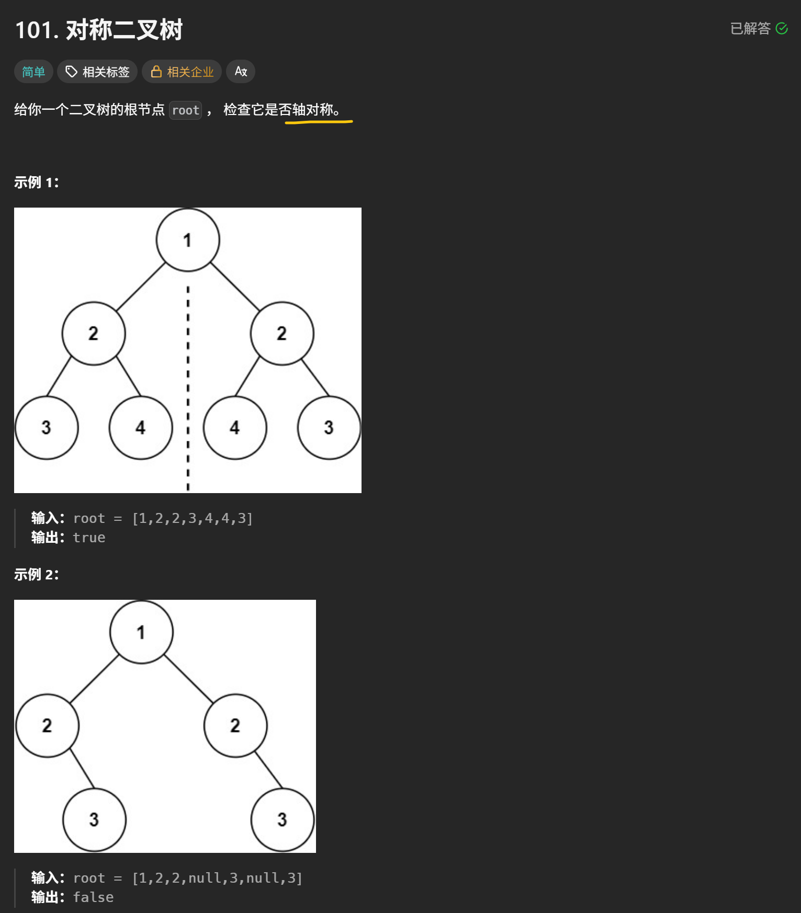

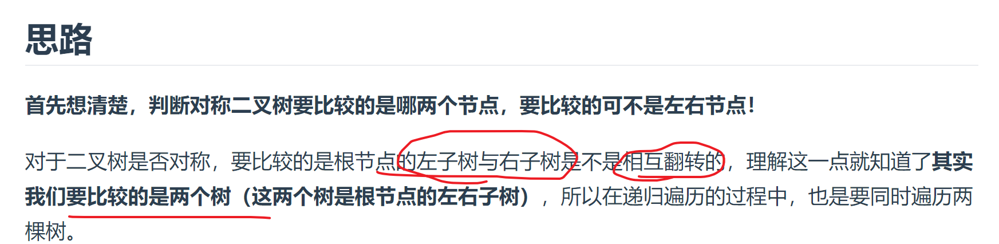


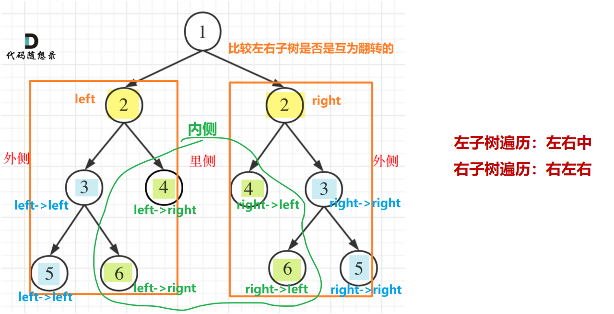


### 递归

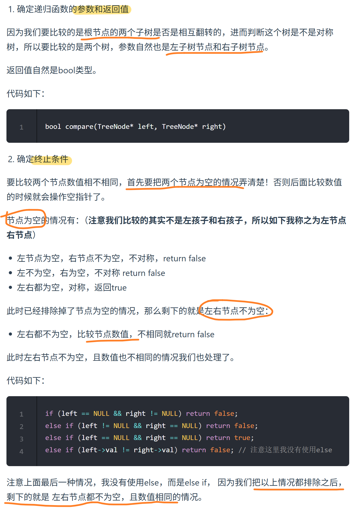

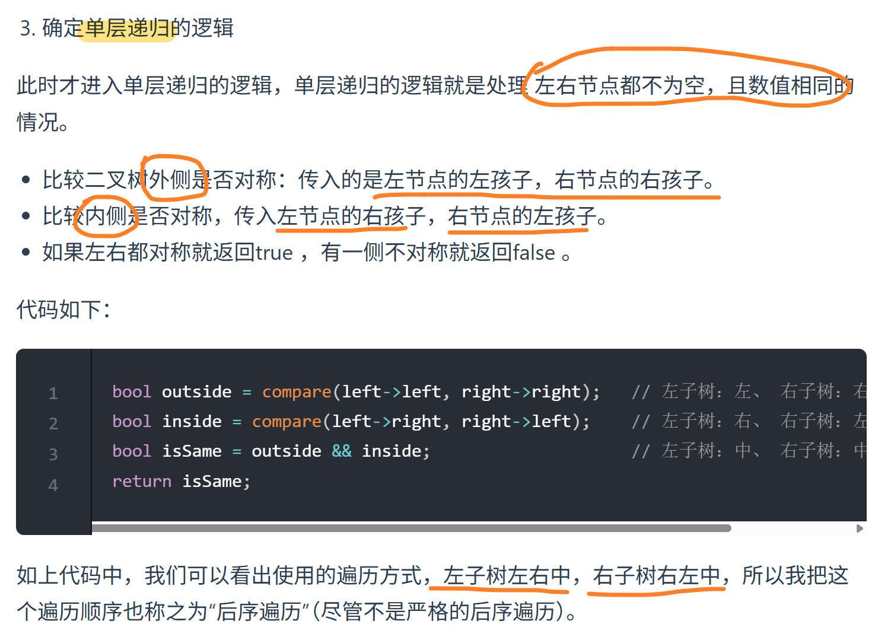

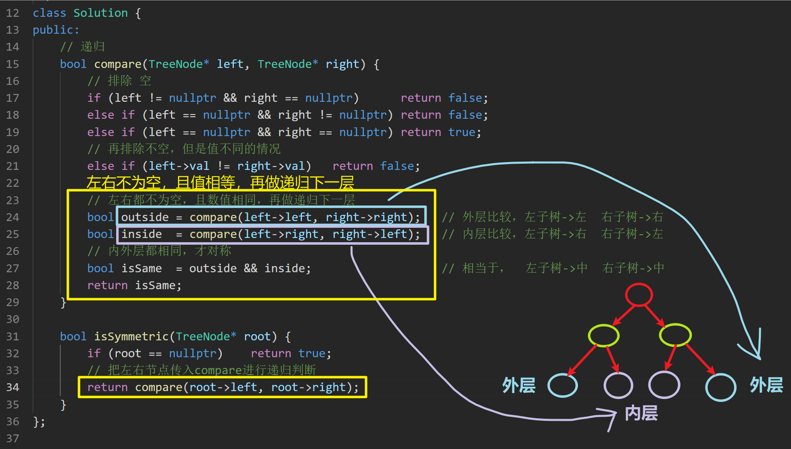


~~~C++
/**
 * Definition for a binary tree node.
 * struct TreeNode {
 *     int val;
 *     TreeNode *left;
 *     TreeNode *right;
 *     TreeNode() : val(0), left(nullptr), right(nullptr) {}
 *     TreeNode(int x) : val(x), left(nullptr), right(nullptr) {}
 *     TreeNode(int x, TreeNode *left, TreeNode *right) : val(x), left(left), right(right) {}
 * };
 */
class Solution {
public:
    // 递归
    bool compare(TreeNode* left, TreeNode* right)
    {
        // 排除节点空的情况
        if      (left == nullptr && right == nullptr)       return true;
    	else if (left == nullptr || right == nullptr)       return false;
        // 排除节点不空，但值不同的情况
        else if (left->val != right->val)   return false;

        // 左右都不空，且值相同，再做递归下一层        
        // 内外层都相同，才对称
        return compare(left->left, right->right) && // 外层比较，左树->左，右树->右
               compare(left->right, right->left);	// 内层比较：左树->右，右树->左      
    }

    bool isSymmetric(TreeNode* root) {
        if (root == nullptr)    return true;
        return compare(root->left, root->right); // 左右节点传入compare，进行递归比较
    }
};
~~~


# 394 [字符串解码](https://leetcode.cn/problems/decode-string/description/?envType=study-plan-v2&envId=top-100-liked)

@ 栈 @ 递归

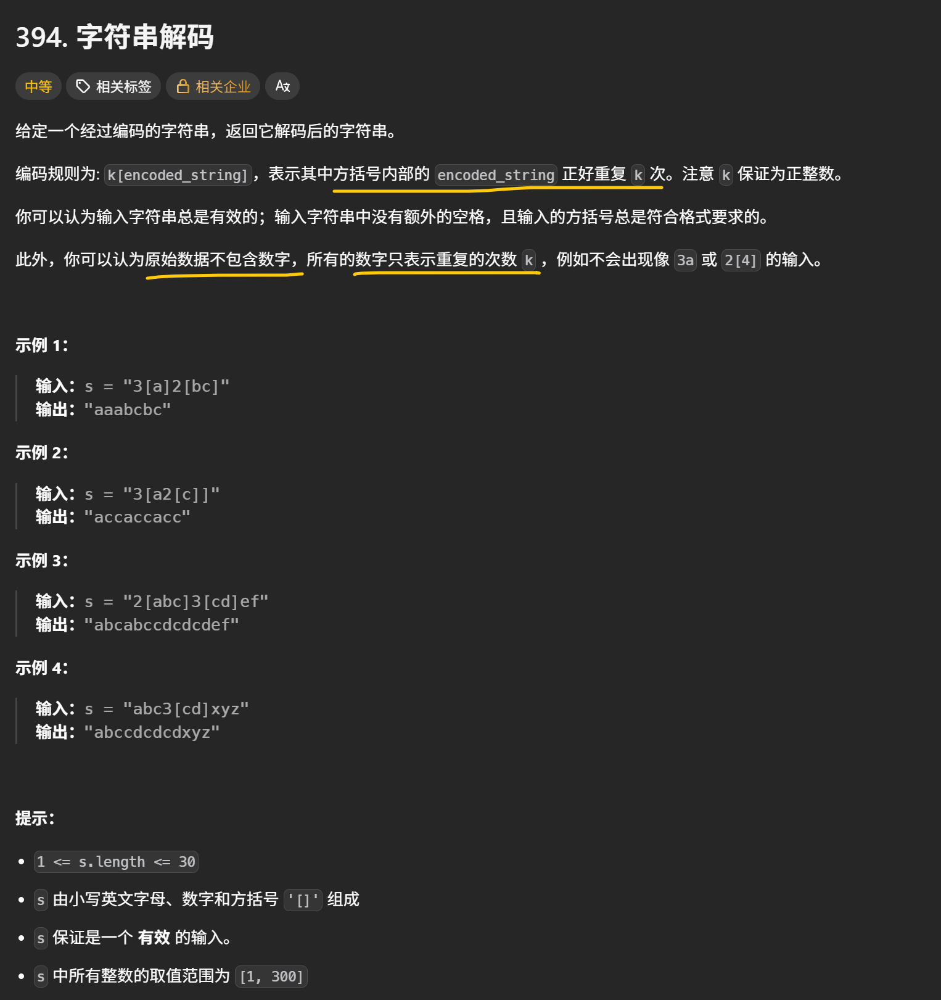

### 1、[两个栈](https://leetcode.cn/problems/decode-string/solutions/6274/ti-jie-czhan-by-youlookdeliciousc)

**主要思路：两个栈存左括号前的数字，字符，遇到右括号的时候取出来拼接**

举个例子看吧	

~~~C++
class Solution {
public:
    string decodeString(string s) {
        
        int num = 0;
        stack<int> numStack;    // 存数字

        string res = ""; 
        stack<string> strStack; // 存拼接的结果

        for (int i = 0; i < s.size(); i++)
        {
            // 遇到数字，存在num
            if (s[i] >= '0' && s[i] <= '9') 
            {
                num = num * 10 + s[i] - '0';// 考虑数字可能不只是个位数，比如150[a]
            }
            // 字母直接拼到res
            else if ((s[i] >= 'a' && s[i] <= 'z') || (s[i] >= 'A' && s[i] <= 'Z'))
            {
                res = res + s[i]; // 当前[]中的字母，用于拼接
            }
            
            // 遇到'['，将 '[' 前的数字放进numStack，字母字符放入strStack
            else if (s[i] == '[') 
            {
                numStack.push(num);
                num = 0;
                strStack.push(res); // 放进去的是上一组拼接后的结果，然后res清空
                res = "";
            }
            // 遇到 ']' 开始处理这一组 [] 拼接
            else 
            {
                int times = numStack.top(); // 拼接几次res
                numStack.pop();

                for (int j = 0; j < times; j++)
                {
                    strStack.top() += res; // strStack顶的字符，拼接res
                }

                res = strStack.top(); // 这里res就是暂时拼接完的这一组字符了，下次遇到'['放进strstack
                strStack.pop();
            }
        }

        return res; 
    }
};
~~~


### 2、[递归](https://leetcode.cn/problems/decode-string/solutions/19447/decode-string-fu-zhu-zhan-fa-di-gui-fa-by-jyd)

将 `[` 和 `]` 分别作为递归的开启与终止条件

-  `s[i] == '['` 时，进入新一层递归，res拼接新内层子串

-  `s[i] == ']'` 时，结束本层递归，返回res
-  普通字符直接拼接res
-  遍历完毕后返回 `res`

~~~C++
class Solution {
public:
    // 负责解码从当前 index 开始的子字符串
    string dfs(const string& s, int& index)
    {
        string res; 	// 当前层解码后的字符串
        int multi = 0;  // 记录数字，[]中的内容的重复次数

        while (index < s.size())
        {
			// 当前字符是数字，累计multi
            if (s[index] >= '0' && s[index] <= '9')
            {
                multi = multi * 10 + (s[index] - '0');
            }
            // 遇到 [ 就进入递归，开始一个新的被重复的子串
            else if (s[index] == '[') 
            {
                index++; // 跳过 [
                string tmp = dfs(s, index); // 递归解析 '[' 之后的内容
                while (multi--) res += tmp; // 拼接解析出的子串，重复拼接multi次
                multi = 0;
            }
            else if (s[index] == ']') // 遇到 ]，表示本次递归结束，返回当前拼接结果
            {
                return res;
            }
            else // s[i] == 普通字符
            {
                res += s[index]; // 直接加入结果
            }

            index++;            
        }

        return res;
    }


    string decodeString(string s) {
        int index = 0;
        return dfs(s, index);
        
    }
};
~~~


用 lambda

~~~C++
class Solution {
public:
    string decodeString(string s) {

        auto dfs = [&](this auto&& dfs, const string& s, int& index) ->string
        {
            string res;
            int multi = 0;
            while (index < s.size())
            {
                if (s[index] >= '0' && s[index] <= '9')
                {
                    multi = multi * 10 + (s[index] - '0');
                }
                else if (s[index] == '[')
                {
                    index++;
                    string tmp = dfs(s, index); // 递归解析 新'['之后的内容
                    while (multi--) res += tmp; // 拼接解析出的子串
                    multi = 0;
                }
                else if (s[index] == ']')
                {
                    return res;
                }
                else // 普通字符，直接拼接res
                {
                    res += s[index];
                }

                index++;
            }
            return res;
        };

        int index = 0;
        return dfs(s, index);
    }
};
~~~


# 64 [最小路径和](https://leetcode.cn/problems/minimum-path-sum/description/?envType=study-plan-v2&envId=top-100-liked)

@递归  @ 动规

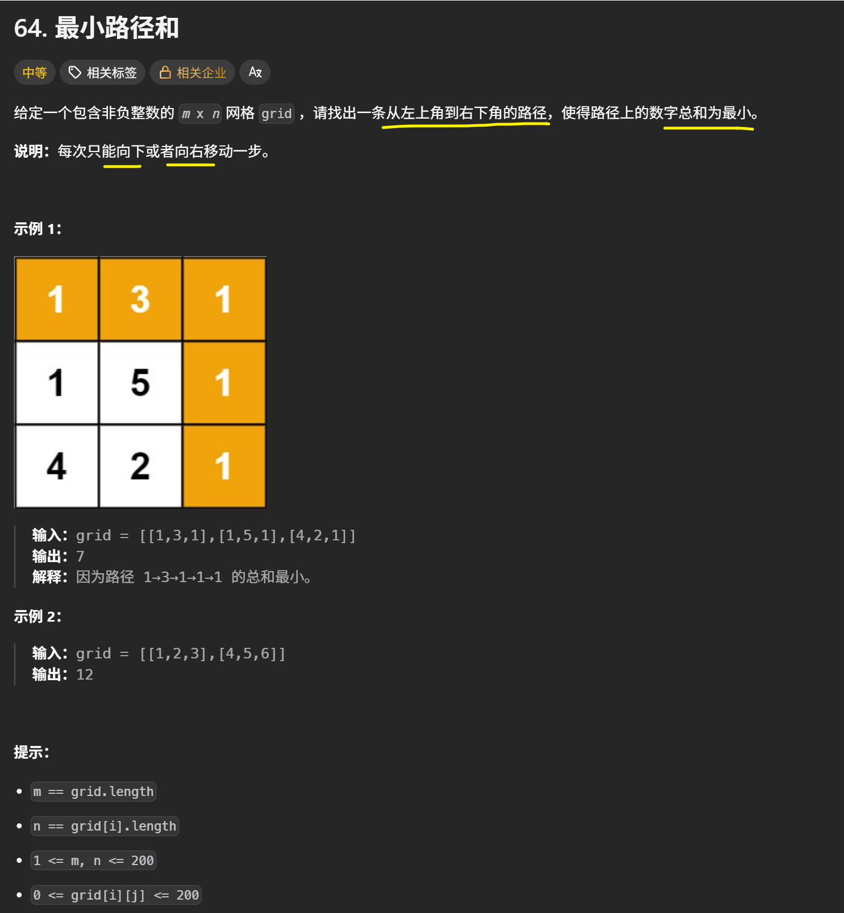


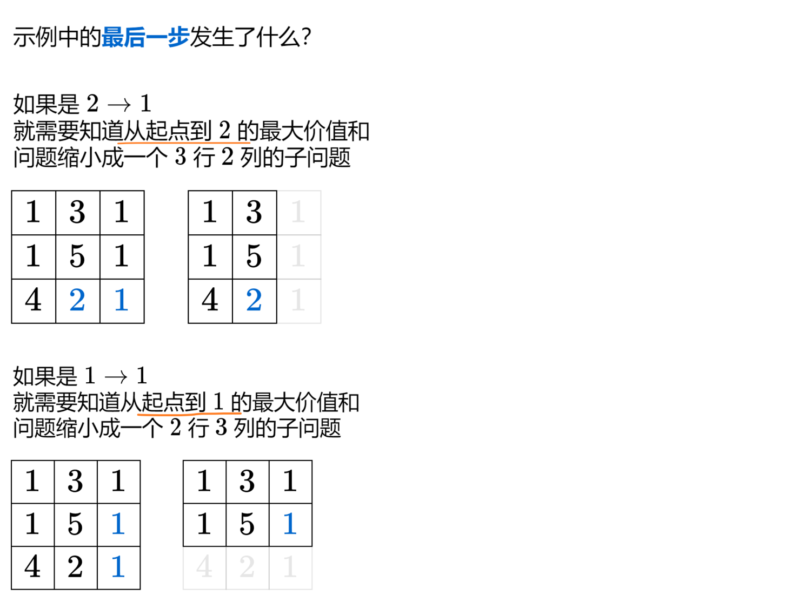

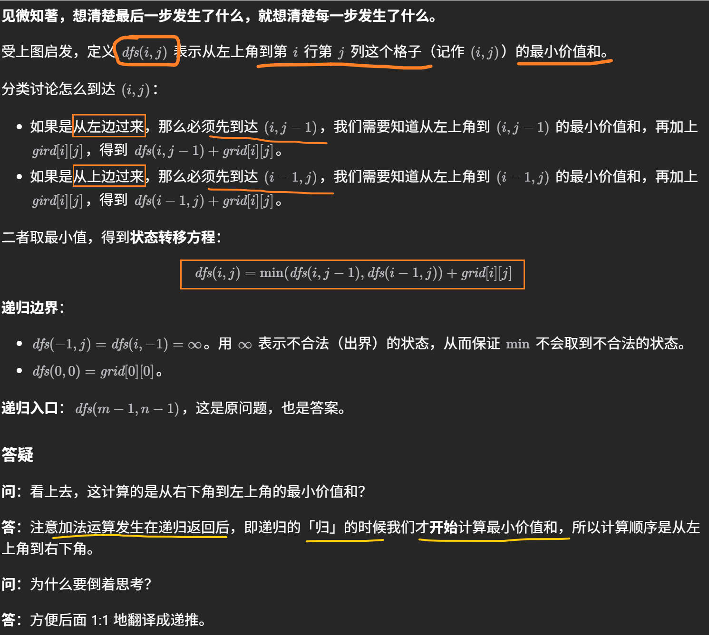

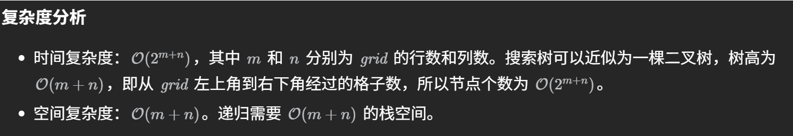

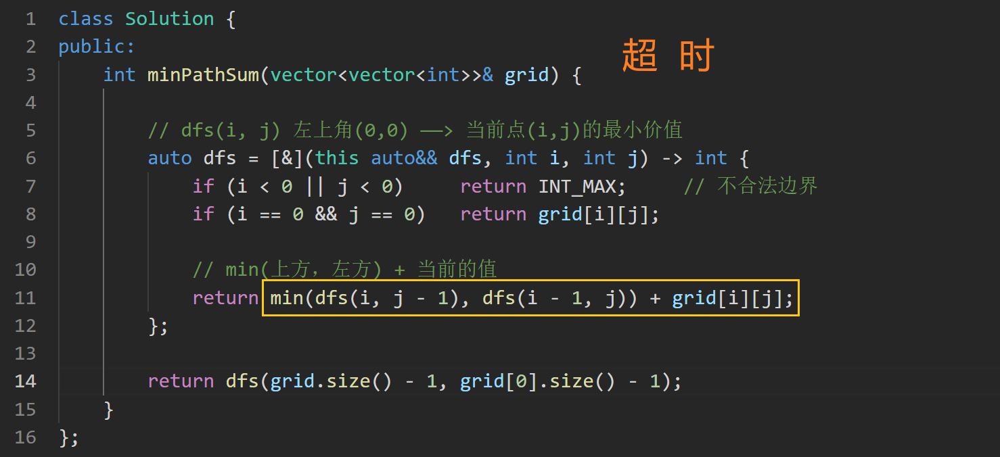


## 递归（推荐）

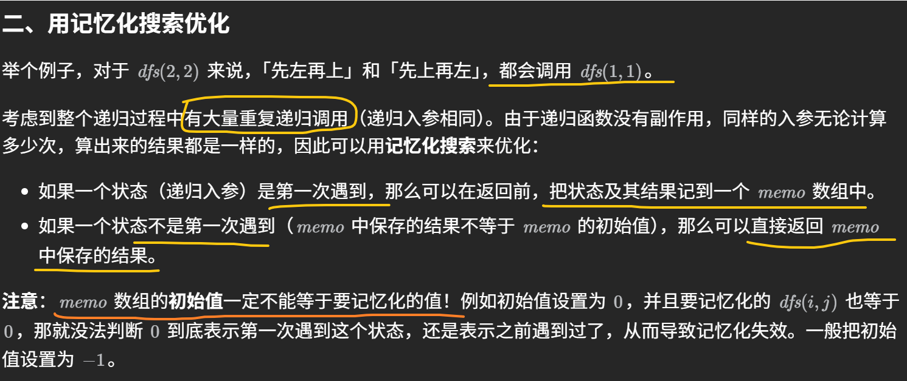

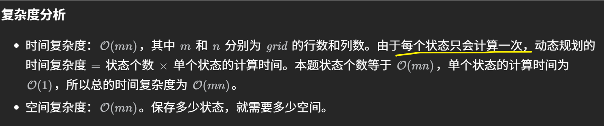

~~~C++
class Solution {
public:
    int minPathSum(vector<vector<int>>& grid) {

        int m = grid.size();
        int n = grid[0].size();

        // 记录当前dfs(i,j)是不是调用过，初始 -1 表示未调用
        vector<vector<int>> memo(m, vector<int>(n, -1)); 

        // dfs(i, j) 左上角(0,0) ——> 当前点(i,j)的最小价值
        auto dfs = [&](this auto&& dfs, int i, int j) -> int {
            if (i < 0 || j < 0)     return INT_MAX;   // 不合法边界
            if (i == 0 && j == 0)   return grid[i][j];// 走到(0,0)结束  

            if (memo[i][j] != -1)  return memo[i][j]; // 之前计算过，直接返回结果
            memo[i][j] = min(dfs(i, j - 1), dfs(i - 1, j)) + grid[i][j]; // 未计算过，dfs(i, j) 存入 memo
            
            return memo[i][j];
        };

        return dfs(m - 1, n - 1);
    }
};
~~~


## 动规（也推荐）

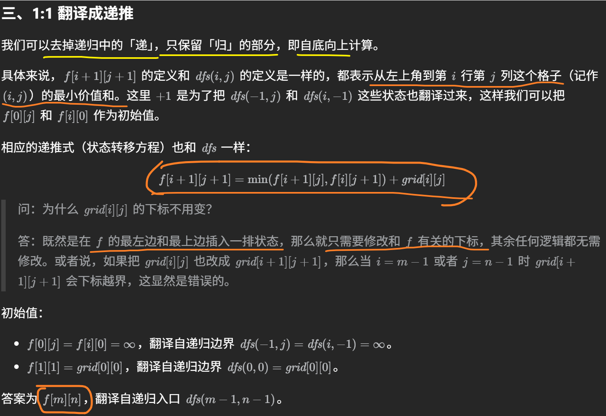

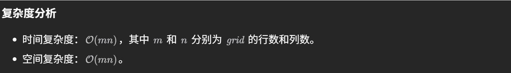


~~~C++
class Solution {
public:
    int minPathSum(vector<vector<int>>& grid) {

        int m = grid.size();
        int n = grid[0].size();

        // dp[i+1][j+1] - 从左上角到(i,j)的最小和
        vector<vector<int>> dp(m + 1, vector<int>(n + 1, INT_MAX));

        // +1 相当于 dp 在原grid范围上最左和最上加了一层，把越界的无穷情况直接加进来了
        // 但是 +1，只是在dp上加的，不影响原grid，加的还是遍历到的原(i,j)位置的值

        for (int i = 0; i < m; i++)
        {
            for (int j = 0; j < n; j++)
            {
                if (i == 0 && j == 0)   dp[1][1] = grid[i][j];
                else 
                {
                    dp[i + 1][j + 1] = min(dp[i+1][j], dp[i][j+1]) + grid[i][j];
                }
            }
        }

        return dp[m][n];
    }
};
~~~


把 `dp[0][1]` 或者  `dp[1][0]` 初始化成0，这样 `dp[1][1]` 可以用递推式计算了，无需特判。

只能初始化一个，因为要取 min，取`0 + grid[0][0] = dp[1][1]`

**最终版**

~~~C++
class Solution {
public:
    int minPathSum(vector<vector<int>>& grid) {

        int m = grid.size();
        int n = grid[0].size();

        // dp[i+1][j+1] - 从左上角到(i,j)的最小和
        vector<vector<int>> dp(m + 1, vector<int>(n + 1, INT_MAX));
        dp[0][1] = 0;

        // +1 相当于 dp 在原grid范围上最左和最上加了一层，把越界的无穷情况直接加进来了
        // 但是 +1，只是在dp上加的，不影响原grid，加的还是遍历到的原(i,j)位置的值

        for (int i = 0; i < m; i++)
        {
            for (int j = 0; j < n; j++)
            {
                dp[i + 1][j + 1] = min(dp[i+1][j], dp[i][j+1]) + grid[i][j];
            }
        }

        return dp[m][n];
    }
};
~~~


# 39 [组合总和](https://leetcode.cn/problems/combination-sum/description/?envType=study-plan-v2&envId=top-100-liked)

@ 回溯

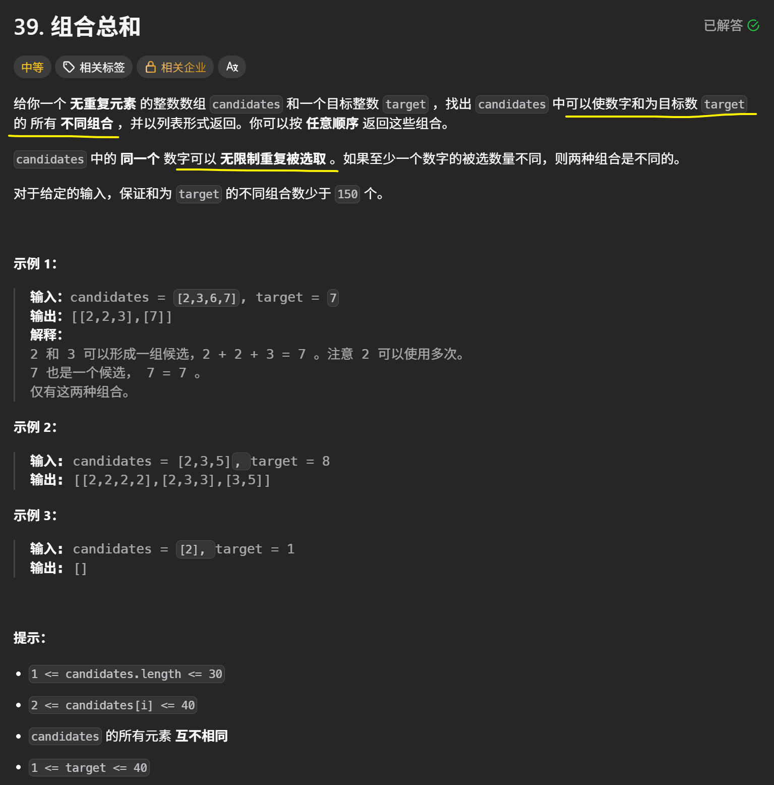

数组中数字都不同，但是可以重复选，**每一层树往下走，遍历的数组都是一样的**

**返回条件就是取到的和，达到target直接返回**

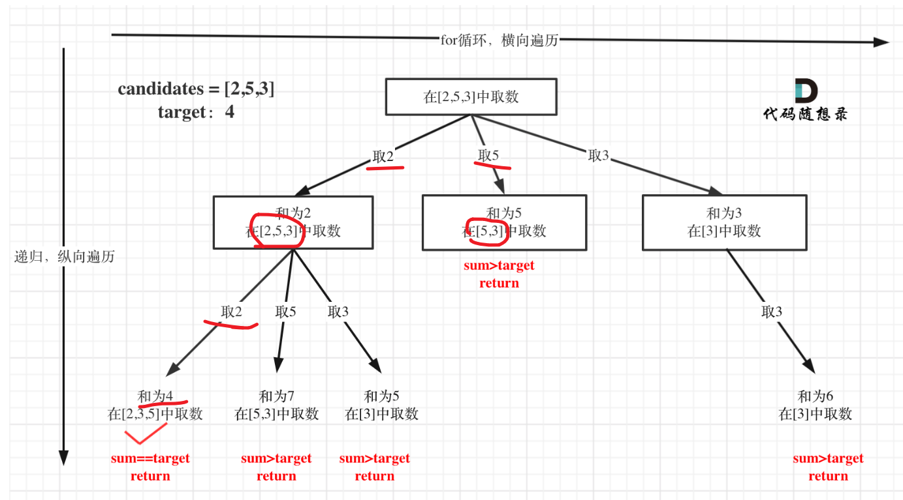

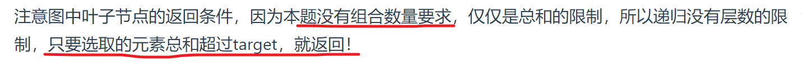

~~~C++
class Solution {
public:
    vector<int> path;
    vector<vector<int>> result;
    void backtracking(vector<int>& candidates, int target, int sum, int startIndex)
    {
        if (sum > target)   return;
        if (sum == target)
        {
            result.push_back(path);
            return;
        }

        for (int i = startIndex; i < candidates.size(); i++)
        {
            sum += candidates[i];
            path.push_back(candidates[i]);

            backtracking(candidates, target, sum, i); // 注意可以重复取当前的数

            sum -= candidates[i];
            path.pop_back();
        }
    }

    vector<vector<int>> combinationSum(vector<int>& candidates, int target) {
        // candidates = [2,3,6,7], target = 7
        // [[2,2,3],[7]]

        backtracking(candidates, target, 0, 0);
        return result;  
    }
};
~~~


**剪枝：**

> **在求和问题中，排序之后加剪枝是常见的套路！**

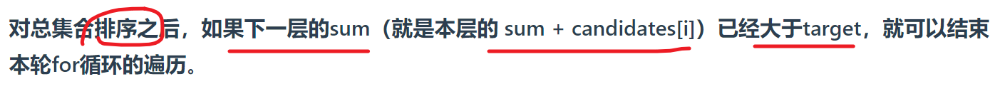

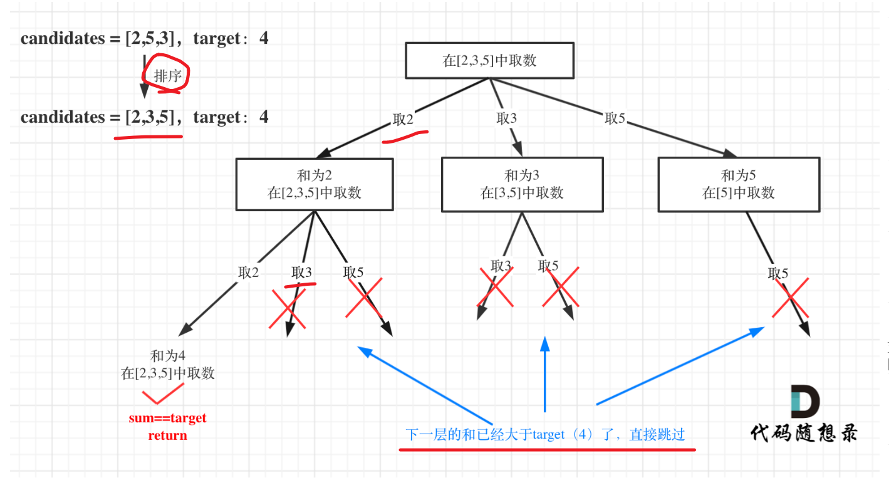

~~~C++
class Solution {
public:
    vector<int> path;
    vector<vector<int>> result;
    void backtracking(vector<int>& candidates, int target, int sum, int startIndex)
    {
        if (sum > target)   return;
        if (sum == target)
        {
            result.push_back(path);
            return;
        }

        for (int i = startIndex; 
             i < candidates.size() && sum + candidates[i] <= target; // 剪枝
             i++)
        {
            sum += candidates[i];
            path.push_back(candidates[i]);

            backtracking(candidates, target, sum, i);

            sum -= candidates[i];
            path.pop_back();
        }
    }

    vector<vector<int>> combinationSum(vector<int>& candidates, int target) {

        sort(candidates.begin(), candidates.end()); // 先排序

        backtracking(candidates, target, 0, 0);
        return result;
        
    }
};
~~~


# 104 [二叉树的最大深度](https://leetcode.cn/problems/maximum-depth-of-binary-tree/description/?envType=study-plan-v2&envId=top-100-liked)

@递归  @层序

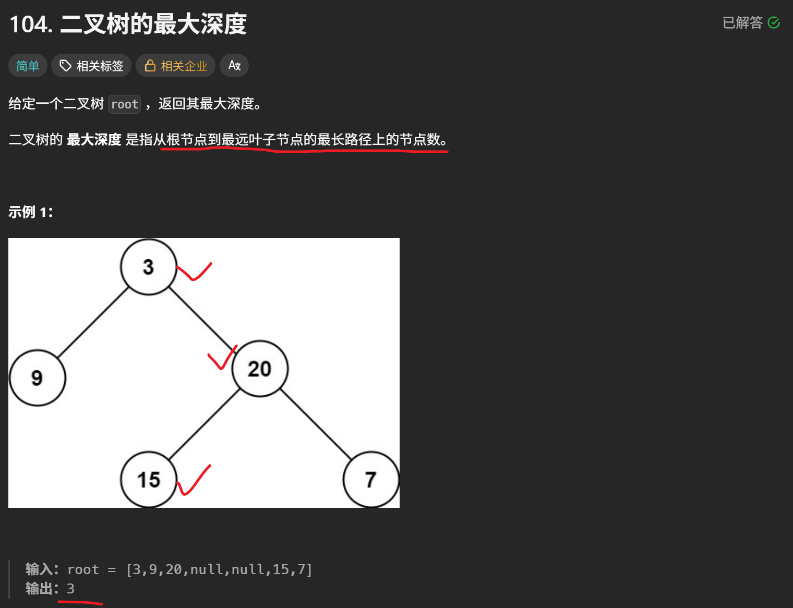


### 自底向上（递归）


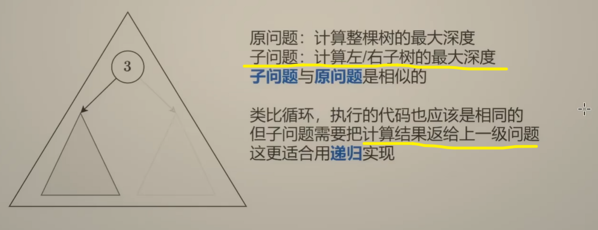

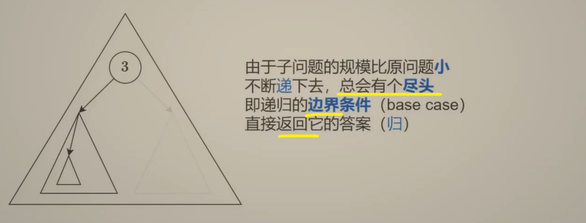


~~~C++
class Solution {
public:

    // 递归 
    int getdepth(TreeNode* node)
    {
        if (node == nullptr)    return 0;

        int leftdepth = getdepth(node->left); // 左
        int rightdepth = getdepth(node->right); // 右

        // 取左右子树深度的最大值 + 1
        int depth = max(leftdepth, rightdepth) + 1; // 加上自己
        return depth;
    }


    int maxDepth(TreeNode* root) {
        return getdepth(root);
    }
};
~~~

精简：

~~~C++
class Solution {
public:
    int maxDepth(TreeNode* root) {
        // 自底向上
        if (!root)  return 0;
        return 1 + max(maxDepth(root->left), maxDepth(root->right));
    }
};
~~~


### 自顶向下（递归）

把经过的节点数传下去（也就是深度 depth），往下走，+1

~~~C++
class Solution {
public:
    int maxDepth(TreeNode* root) {

        // 自顶向下
        int ans = 0;

        auto dfs = [&](this auto&& dfs, TreeNode* node, int depth)->void 
        {
            if (node == nullptr)     return;

            depth++; // 从上往下带参数（节点数）
            
            ans = max(ans, depth); // 每往下走一层，更新深度

            dfs(node->left, depth);
            dfs(node->right, depth);  
        };

        dfs(root, 0);
        return ans;        
    }
};
~~~

> 这里 `auto dfs = [&](this auto&& dfs, TreeNode* node, int depth)->void {}`传的是 `int depth`，**值传递，而不是引用传递，为什么？**
>
> **值传递**：
>
> - 每次 `dfs` 被调用时，`depth` 是**一份新的值**
>
> - `depth++` 是在当前路径中修改，不影响兄弟节点；
>
> - 例如 `left` 分支的递归 `depth++` 后，`right` 分支仍然是原来的 `depth+1`；
>
>   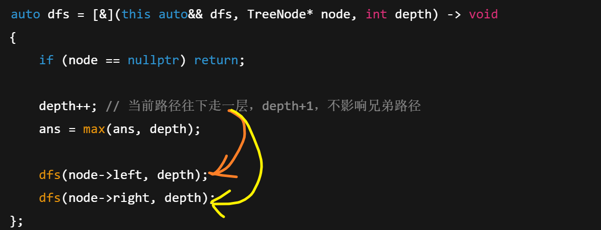
>
> **引用传递**：
>
> - 如果改成引用传递，每次递归都是对同一个变量 `depth` 的引用，每次 `depth++`都会永久修改这个变量
>
>   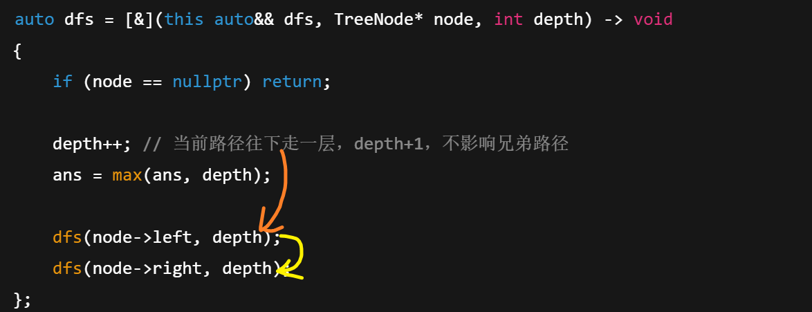
>
> - **引用传递会让所有递归路径共享一个变量**，一旦在某一支中被修改，**后续所有路径都会“继承”这个值**，无法反映每条路径本应有的独立深度。


### 层序

最大深度，就是最大层数，每走一层深度 + 1

~~~C++	
/**
 * Definition for a binary tree node.
 * struct TreeNode {
 *     int val;
 *     TreeNode *left;
 *     TreeNode *right;
 *     TreeNode() : val(0), left(nullptr), right(nullptr) {}
 *     TreeNode(int x) : val(x), left(nullptr), right(nullptr) {}
 *     TreeNode(int x, TreeNode *left, TreeNode *right) : val(x), left(left), right(right) {}
 * };
 */
class Solution {
public:
    int maxDepth(TreeNode* root) {

        if (root == nullptr)   return 0;
        int depth = 0;

        queue<TreeNode*> que;
        que.push(root);

        while (!que.empty())
        {
            depth++; // 每走一层，深度+1
			
            int size = que.size();
            for (int i = 0; i < size; i++)
            {
                TreeNode* node = que.front();
                que.pop(); // 求深度，不用收集节点值了

                if (node->left)     que.push(node->left);
                if (node->right)    que.push(node->right);
            }
        }

        return depth;        
    }
};
~~~


### ACM

~~~C++	
#include <iostream>
#include <vector>
#include <queue>

using namespace std;

// 104 二叉树的最大深度
// 时间复杂度：O(n)
// 空间复杂度：O(n)


struct TreeNode
{
    int val;
    TreeNode* left;
    TreeNode* right;
    TreeNode(int x) : val(x), left(nullptr), right(nullptr) {}
};


int maxDepth(TreeNode* root)
{
    if (!root)  return 0;

    queue<TreeNode*> que;
    que.push(root);

    int depth = 0;

    while (!que.empty())
    {
        int size = que.size();
        depth++;

        for (int i = 0; i < size; i++)
        {
            TreeNode* node = que.front();
            que.pop();
            if (node->left)     que.push(node->left);
            if (node->right)    que.push(node->right);
        }
    }

    return depth;
}


int main()
{
    TreeNode* root = new TreeNode(3);
    root->left = new TreeNode(9);
    root->right = new TreeNode(20);

    root->right->left = new TreeNode(15);
    root->right->right = new TreeNode(7);


    int depth = maxDepth(root); // 3
    cout << depth << endl;


    return 0;
}
~~~


# 470 [用 Rand7() 实现 Rand10()](https://leetcode.cn/problems/implement-rand10-using-rand7/description/)

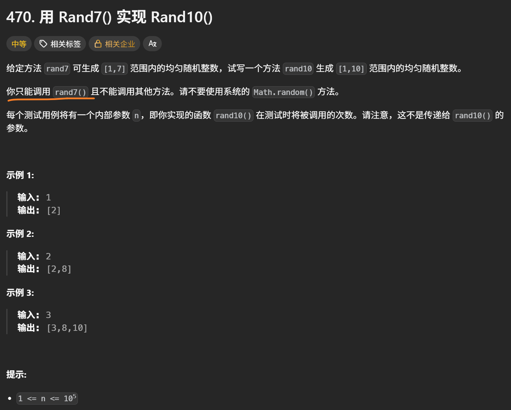

## 概率问题

**<span style="color:#CC0000;">重复抛硬币 k 次，对应生成 $2^k$ 个数</span>，选其中的部分作为计算概率的 “0” 和 ”1” ，多余的舍弃（继续抛）**

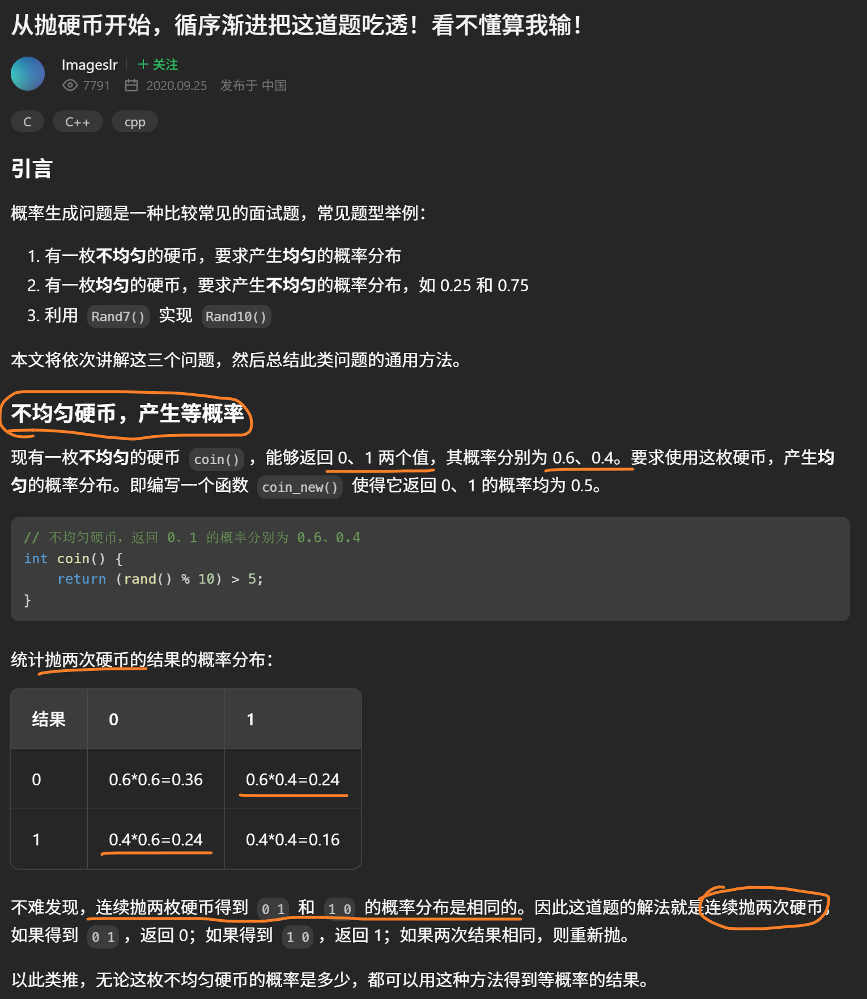

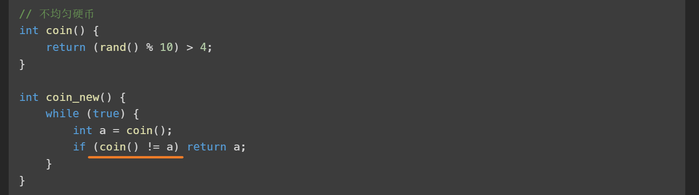

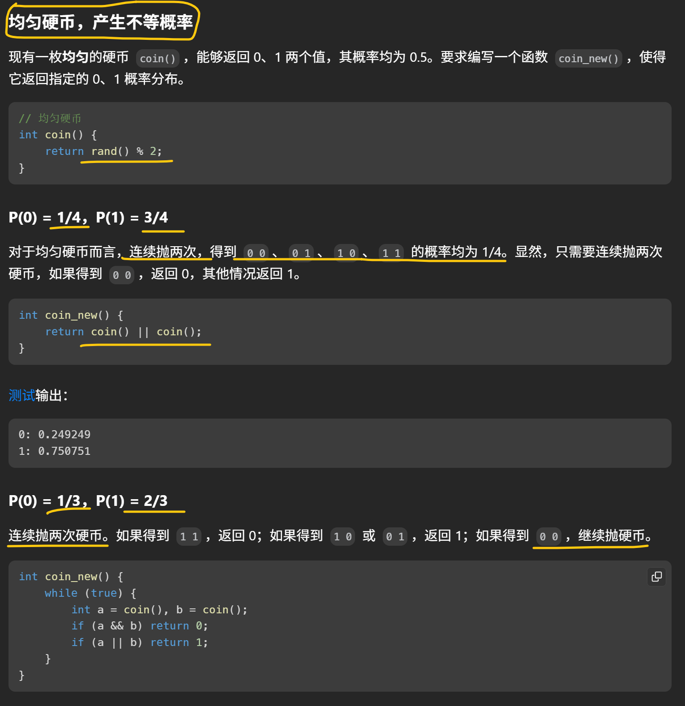

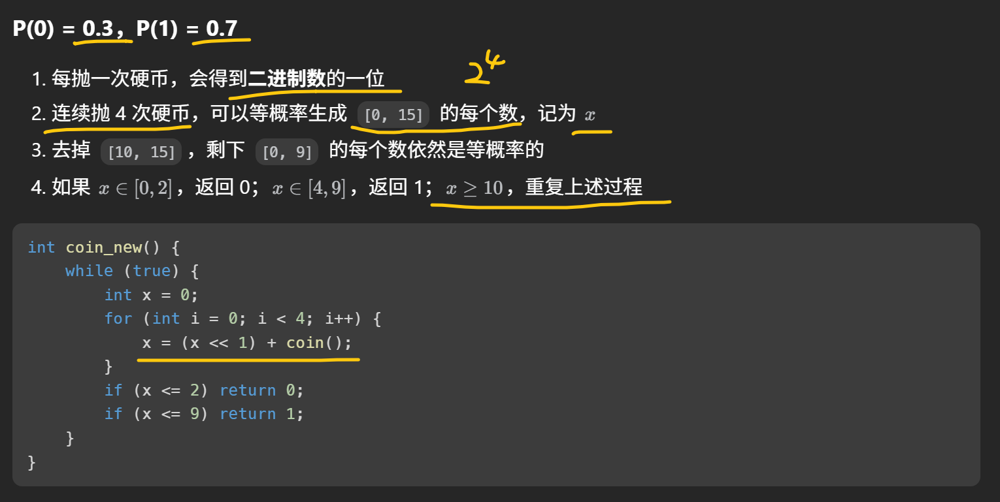


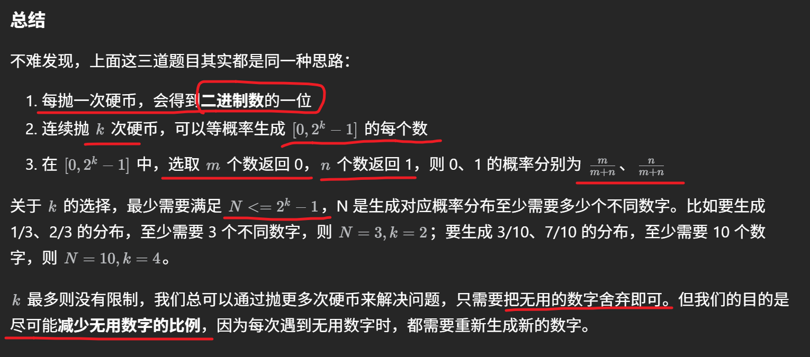


## Rand7 生成 Rand10

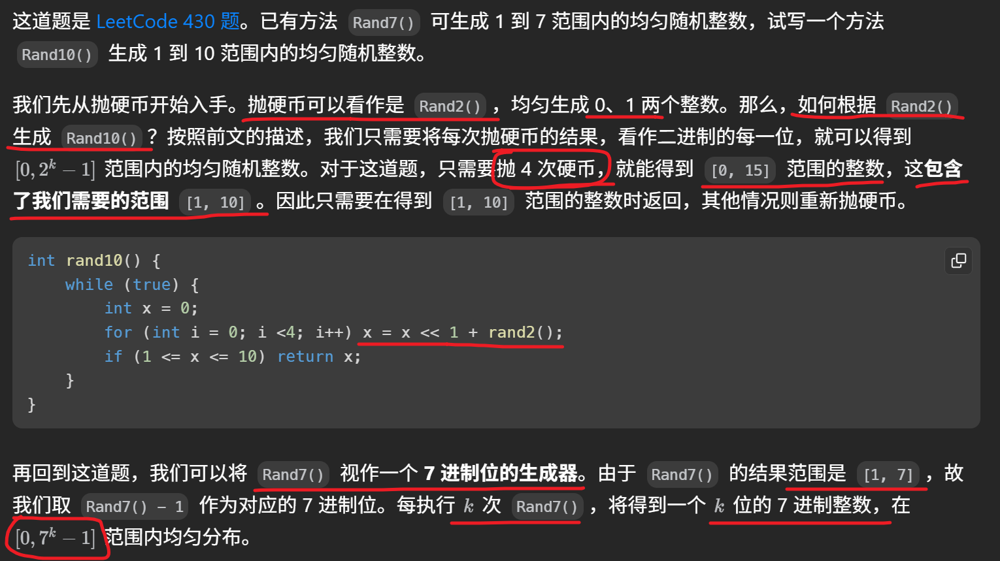

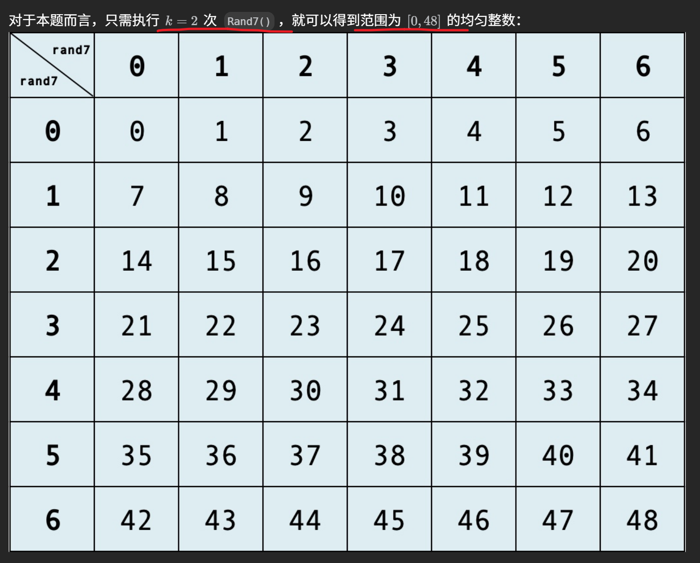

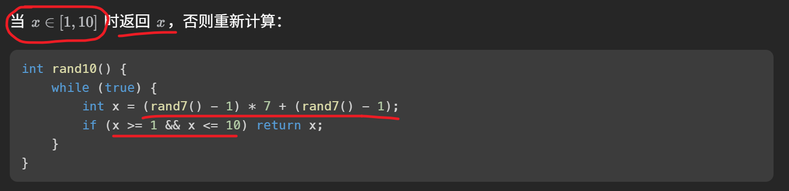

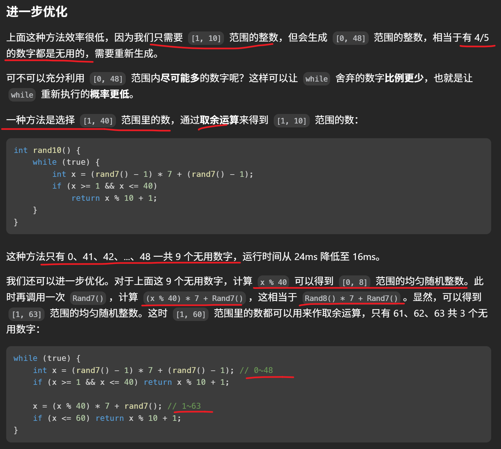

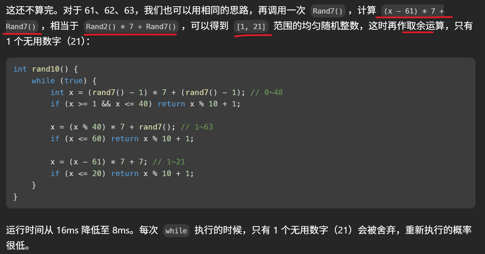

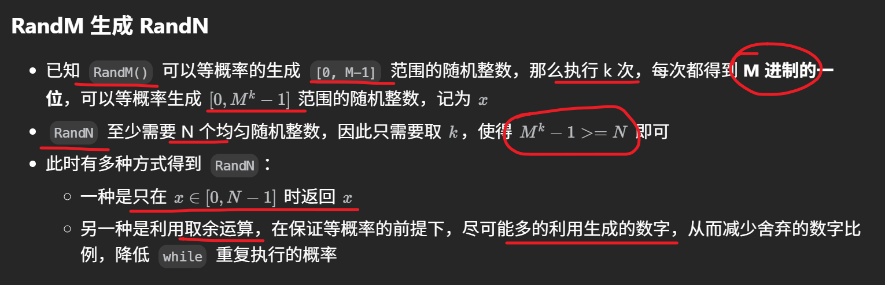


> 优化没看懂，再议

~~~C++
class Solution {
public:
    // rand7 相当于是7进制位的生成器，执行两次能生成 0 ~ 7^2-1 范围的数

    int rand10() {
        while(true)
        {
            int x = (rand7() - 1) * 7 + (rand7() - 1); // rand7执行两次
            if (x >= 1 && x <= 10)  return x;// 只返回 0 - 10 范围的数
        }
    }
};
~~~


# 128 [最长连续序列](https://leetcode.cn/problems/longest-consecutive-sequence/?envType=study-plan-v2&envId=top-100-liked)

@ 哈希

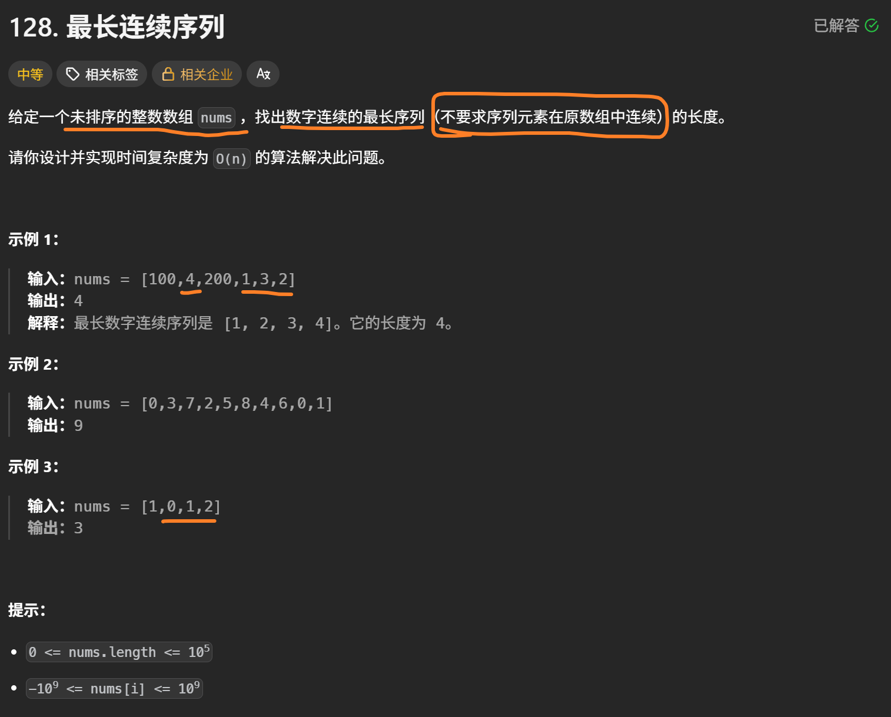

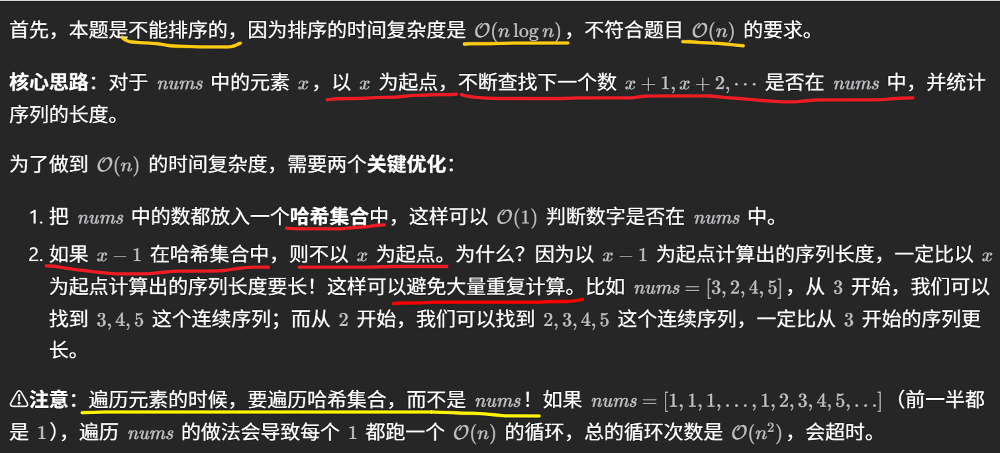

`contains()` 是 C++20 引入的成员函数，用于判断某个元素是否存在于关联容器中。

将数组 nums 中的所有元素存入一个**哈希集合 st**，这样可以在 **O(1)** 时间内判断某个数是否存在。


~~~C++
class Solution {
public:
    int longestConsecutive(vector<int>& nums) {

        int ans = 0;

        // 把nums转成哈希集合 （无序不重复）
        unordered_set<int> st(nums.begin(), nums.end());

        // 注意：这里遍历的是集合，不是原数组
        for (int x : st)
        {
            // 如果 x-1 在集合中，说明 x 不是某个连续序列的起点，跳过
            if (st.contains(x - 1))	continue;

            // x 是序列的起点，不断向后查找下一个数是否在哈希集合中
            int y = x + 1;
            while (st.contains(y))	y++;

            // 一直找知道找不到下一个连续的数为止，此时的 y 是第一个不在集合中的数
            // y - 1 就是最后一个在哈希集合中的数

            // 更新长度
            ans = max(ans, y - x); // [x, y-1]是一个连续序列，长度是 y - x
        }

        return ans;
    }
};
~~~


# 110 [平衡二叉树](https://leetcode.cn/problems/balanced-binary-tree/description/)

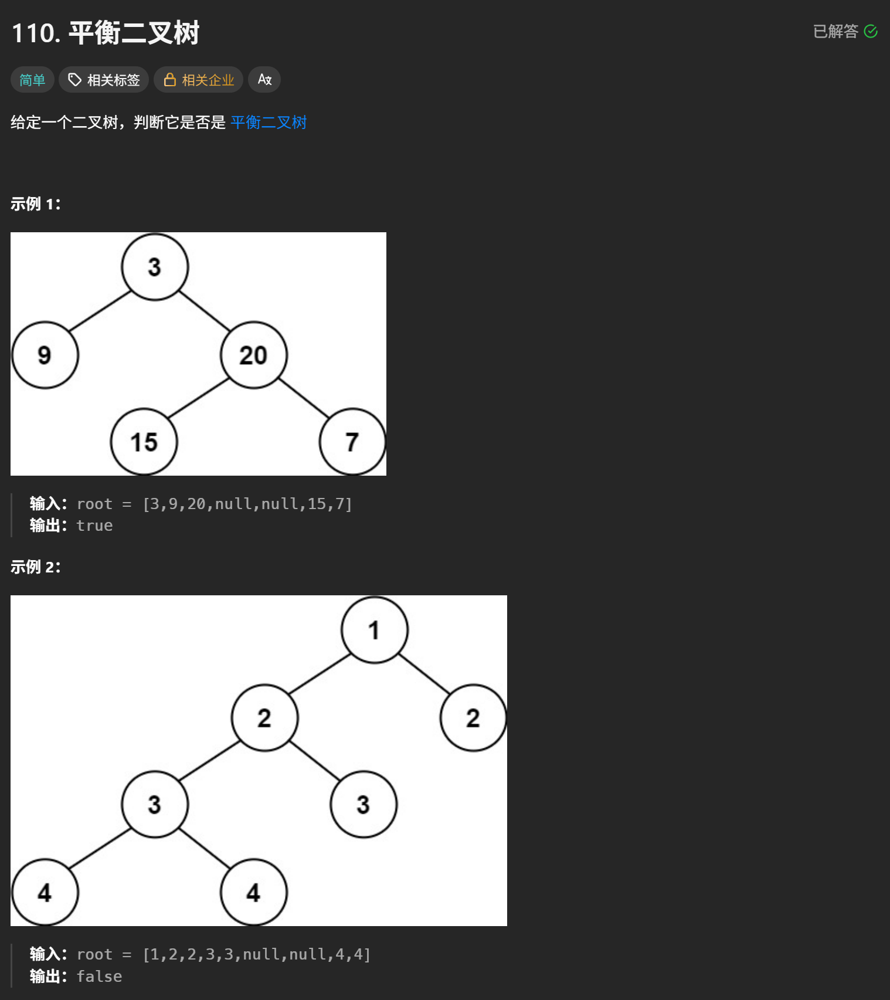

平衡二叉树：树所有节点的左右子树的高度相差不超过 1。

递归，左右树高度比较

~~~C++
/**
 * Definition for a binary tree node.
 * struct TreeNode {
 *     int val;
 *     TreeNode *left;
 *     TreeNode *right;
 *     TreeNode() : val(0), left(nullptr), right(nullptr) {}
 *     TreeNode(int x) : val(x), left(nullptr), right(nullptr) {}
 *     TreeNode(int x, TreeNode *left, TreeNode *right) : val(x), left(left), right(right) {}
 * };
 */
class Solution {
public:
    
    int get_Height(TreeNode* node)
    {
        if (node == nullptr)    return 0;

        // 递归求左右子树的高度
        int leftHeight = get_Height(node->left);
        int rightHeight = get_Height(node->right);
        
        // 不平衡，返回 -1
        if (leftHeight == -1 || rightHeight == -1 ||  // 左或右树不平衡
            abs(leftHeight - rightHeight) > 1) // 或者node左右高度差超过 1
        {
            return -1; 
        }

        // 都平衡，返回node节点的高度
        return max(leftHeight, rightHeight) + 1;
    }


    bool isBalanced(TreeNode* root) {
        return get_Height(root) == -1 ? false : true;
    }
};
~~~


# 144 [前序遍历](https://leetcode.cn/problems/binary-tree-preorder-traversal/description/)


## 递归


~~~C++
/**
 * Definition for a binary tree node.
 * struct TreeNode {
 *     int val;
 *     TreeNode *left;
 *     TreeNode *right;
 *     TreeNode() : val(0), left(nullptr), right(nullptr) {}
 *     TreeNode(int x) : val(x), left(nullptr), right(nullptr) {}
 *     TreeNode(int x, TreeNode *left, TreeNode *right) : val(x), left(left), right(right) {}
 * };
 */
class Solution {
public:
    // 递归
    void traversal(TreeNode* cur, vector<int>& vec)
    {
        // 终止条件
        if (cur == nullptr) return;

        // 单层逻辑
        vec.push_back(cur->val);    // 中
        traversal(cur->left, vec);  // 左
        traversal(cur->right, vec); // 右
    }


    vector<int> preorderTraversal(TreeNode* root) {

        vector<int> result;
        traversal(root, result);

        return result;    
    }
};
~~~

时间复杂度：O(n)，其中 n 是二叉树的节点数。每一个节点恰好被遍历一次。

空间复杂度：O(n)，为递归过程中栈的开销，平均情况下为 O(logn)，最坏情况下树呈现链状，为 O(n)。


## 迭代（栈）


~~~C++
class Solution {
public:
    vector<int> preorderTraversal(TreeNode* root) {
        vector<int> result;
        if (root == nullptr)    return result;

        stack<TreeNode*> st;
        st.push(root);
        while (!st.empty())
        {
            TreeNode* node = st.top(); // 中
            st.pop();
            result.push_back(node->val); // 收集

            // 先入右，后入左，这样出栈正好是 中-左-右
            if (node->right)    st.push(node->right);   // 右
            if (node->left)     st.push(node->left);    // 左
        }

        return result;     
    }
};
~~~


# 122 [买卖股票 II](https://leetcode.cn/problems/best-time-to-buy-and-sell-stock-ii/description/)

买卖多次  

@ 贪心  @ 动规


> **121 是只能买卖一次，122 是可以买卖多次，获取多次利润**

## 贪心

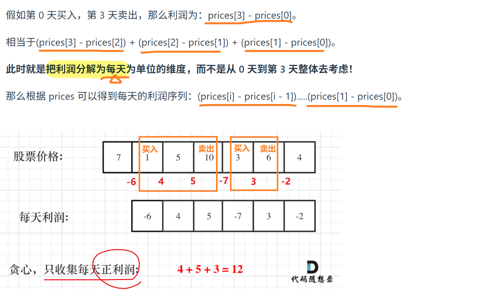

~~~C++
class Solution {
public:
    int maxProfit(vector<int>& prices) {
        // 利润拆成【每天 - 前一天】的差值，只收集正利润 
        
        // 只需要最终利润，不需要知道具体哪天买卖的

        int result = 0;
        for (int i = 1; i < prices.size(); i++)
        {
            result += max(prices[i] - prices[i - 1], 0); // 只加正利润
        }

        return result;   
    }
};
~~~


## 动规


~~~C++
class Solution {
public:
    int maxProfit(vector<int>& prices) {
        
        int len = prices.size();

        // dp[i][0] - 持有    dp[i][1] - 不持有
        vector<vector<int>> dp(len, vector<int>(2, 0));

        dp[0][0] = -prices[0];
        dp[0][1] = 0;

        for (int i = 1; i < len; i++)
        {
            dp[i][0] = max(dp[i - 1][0], dp[i - 1][1] - prices[i]); // 和121的区别
            dp[i][1] = max(dp[i - 1][1], dp[i - 1][0] + prices[i]);
        }

        return dp[len - 1][1];        
    }
};
~~~


# 211 [最大正方形](https://leetcode.cn/problems/maximal-square/)❓

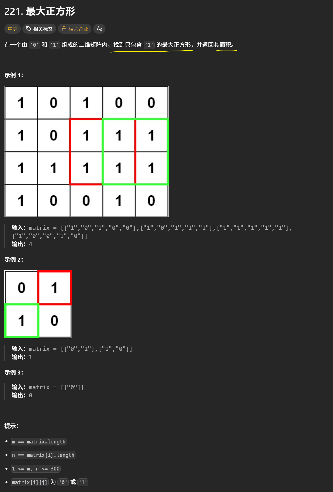


# 234 [回文链表](https://leetcode.cn/problems/palindrome-linked-list/description/?envType=study-plan-v2&envId=top-100-liked)

@ 中间节点 + @ 反转链表

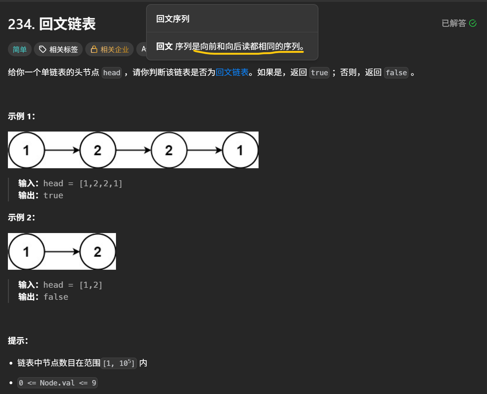


### 1、O(1) 空间做法  ✔️

**找中间节点 + 反转**

> [**灵茶山艾府 O(1) 空间做法：寻找中间节点+反转链表**](https://leetcode.cn/problems/palindrome-linked-list/solutions/2952645/o1-kong-jian-zuo-fa-xun-zhao-zhong-jian-rv0f3/?envType=study-plan-v2&envId=top-100-liked) 

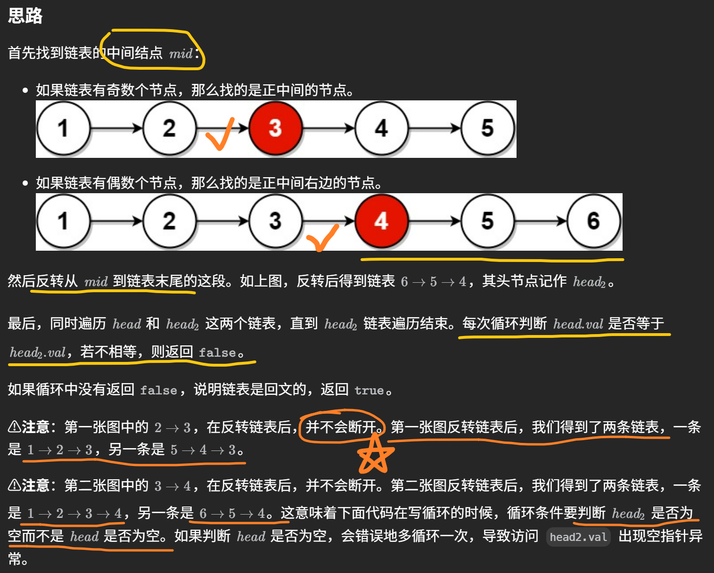

时间复杂度：O(*n*)，其中 *n* 是链表的长度（节点个数）。

空间复杂度：O(1)。

~~~C++
/**
 * Definition for singly-linked list.
 * struct ListNode {
 *     int val;
 *     ListNode *next;
 *     ListNode() : val(0), next(nullptr) {}
 *     ListNode(int x) : val(x), next(nullptr) {}
 *     ListNode(int x, ListNode *next) : val(x), next(next) {}
 * };
 */
class Solution {
public:
    // 876 链表的中间节点
    ListNode* middleNode(ListNode* head)
    {
        ListNode* slow = head, *fast = head;
        while (fast && fast->next)
        {
            slow = slow->next;
            fast = fast->next->next;
        }
        return slow;
    }

    // 206 反转链表
    ListNode* reverseList(ListNode* head)
    {
        ListNode* tmp;
        ListNode* cur = head;
        ListNode* pre = nullptr;
        while (cur)
        {
            tmp = cur->next;
            cur->next = pre;

            pre = cur;
            cur = tmp;
        }
        return pre;
    }


    bool isPalindrome(ListNode* head) {

        // 找中间节点，反转比较

        ListNode* mid = middleNode(head);
        ListNode* head2 = reverseList(mid); // 注意，mid和原链表前面的节点没有断开

        //                                  head                 head2
        // 1 -> 2 -> 3 -> 4 -> 5        =>  1 -> 2 -> 3          5 -> 4 -> 3
        // 1 -> 2 -> 3 -> 4 -> 5 -> 6   =>  1 -> 2 -> 3 - > 4    6 -> 5 -> 4 

        while (head2) // 偶数节点时，head2要比head少一个节点
        {
            if (head->val != head2->val)    return false;

            head = head->next;
            head2 = head2->next;
        }

        return true;     
    }
};
~~~


### 2、利用数组

~~~C++
/**
 * Definition for singly-linked list.
 * struct ListNode {
 *     int val;
 *     ListNode *next;
 *     ListNode() : val(0), next(nullptr) {}
 *     ListNode(int x) : val(x), next(nullptr) {}
 *     ListNode(int x, ListNode *next) : val(x), next(next) {}
 * };
 */
class Solution {
public:
    bool isPalindrome(ListNode* head) {
        
        // 链表值放入数组，再判断数组是否回文
        vector<int> vec;
        ListNode* cur = head;
        while (cur)
        {
            vec.push_back(cur->val);
            cur = cur->next;
        }

        for (int i = 0, j = vec.size() - 1; i < j; i++, j--)
        {
            if (vec[i] != vec[j])   return false;
        }

        return true;    
    }
};
~~~

时间复杂度：*O*(*n*)，其中 *n* 指的是链表的元素个数。

空间复杂度：*O*(*n*)，其中 *n* 指的是链表的元素个数，使用了一个数组列表存放链表的元素值。


# 48 [旋转图像](https://leetcode.cn/problems/rotate-image/description/?envType=study-plan-v2&envId=top-100-liked)

@ 转置 + 水平翻转

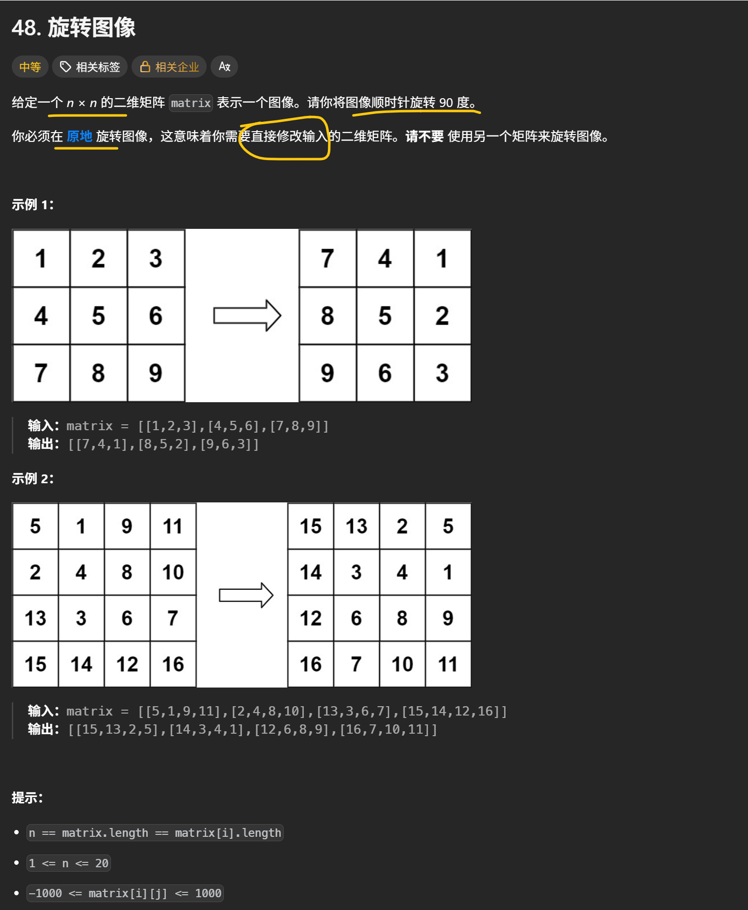

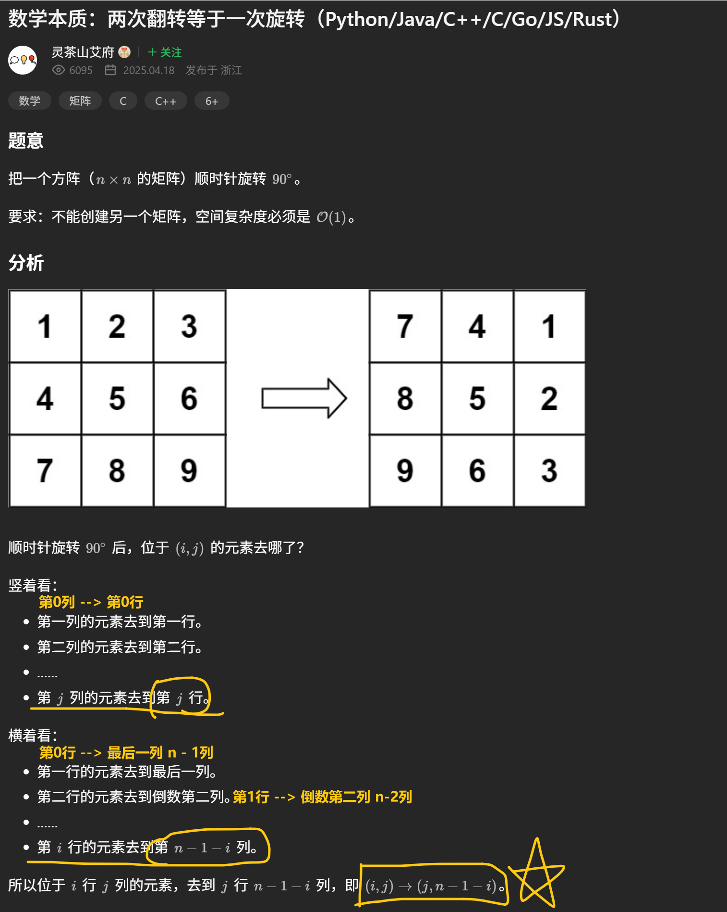


- **转置:  主对角线翻转，(i, j) —> (j, i)**

- **顺时针90°：转置 + 水平镜像（垂直中轴翻转）**
- **逆时针90°：转置 + 垂直镜像（水平中轴翻转）**
- **顺时针180°：水平镜像 + 垂直镜像**


~~~C++
class Solution {
public:
    void rotate(vector<vector<int>>& matrix) {

        // 两次翻转：(i,j) --> (j,i) --> (j,n−1−i)
        // - 转置：按照主对角线翻转， (i,j) --> (j,i)
        // - 行翻转：每一行的内部元素对称翻转，(j,i) --> (j,n−1−i)

        int n = matrix.size();

        // 第一步：主对角线翻转 (i, j) --> (j, i)
        for (int i = 0; i < n; i++)
        {
            for (int j = 0; j < i; j++) // 找主对角线下方的元素
            {
                swap(matrix[i][j], matrix[j][i]);
            }
        }

        // 第二步：每一行行内对称翻转 (i, j) --> (i,n−1−j) 注意下标是i还是j！！！
        for (auto& row : matrix)
        {
            reverse(row.begin(), row.end());
        }
   
    }
};

        // 第二步如果直接写普通循环  （注意下标是i还是j！！！）
        // for (int i = 0; i < n; i++)
        // {
        //     for (int j = 0; j < (n/2); j++)
        //     {
        //         swap(matrix[i][j], matrix[i][n - 1 -j]);
        //     }
        // }
        // 
        // 或者 （推荐）
        // for (int i = 0; i < matrix.size(); i++) 
        // {
        //     int left = 0;
        //     int right = matrix[i].size() - 1;
        //     while (left < right) 
        //     {
        //         swap(matrix[i][left], matrix[i][right]);
        //         left++;
        //         right--;
        //     }
        // }


~~~


关于` for (auto& row : matrix)` 这里为什么用 `&` ？

**如果不用 `&`，操作只作用在副本上**，原矩阵完全不变。只有用 `&`，才能让 `reverse` 直接作用在 `matrix` 里。

> for 循环的三种写法区别
>
> (1) `for (auto row : matrix)`
>
> - `row` 是 **拷贝** 出来的一行（`vector<int>` 的副本）。
> - `ranges::reverse(row)` **只会反转副本**，不会影响 `matrix` 里的数据。整个操作对 `matrix` 无效。
>
> (2) `for (auto& row : matrix)` ✅
>
> - `row` 是对 `matrix` 中行的 **引用**。
> - `ranges::reverse(row)` 会**直接修改 `matrix` 里对应的那一行**。
>
> (3) `for (const auto& row : matrix)`
>
> - `row` 是常量引用，不允许修改。
> - 在这里会报错，因为 `reverse` 需要修改内容。


# 695 [岛屿的最大面积](https://leetcode.cn/problems/max-area-of-island/description/)

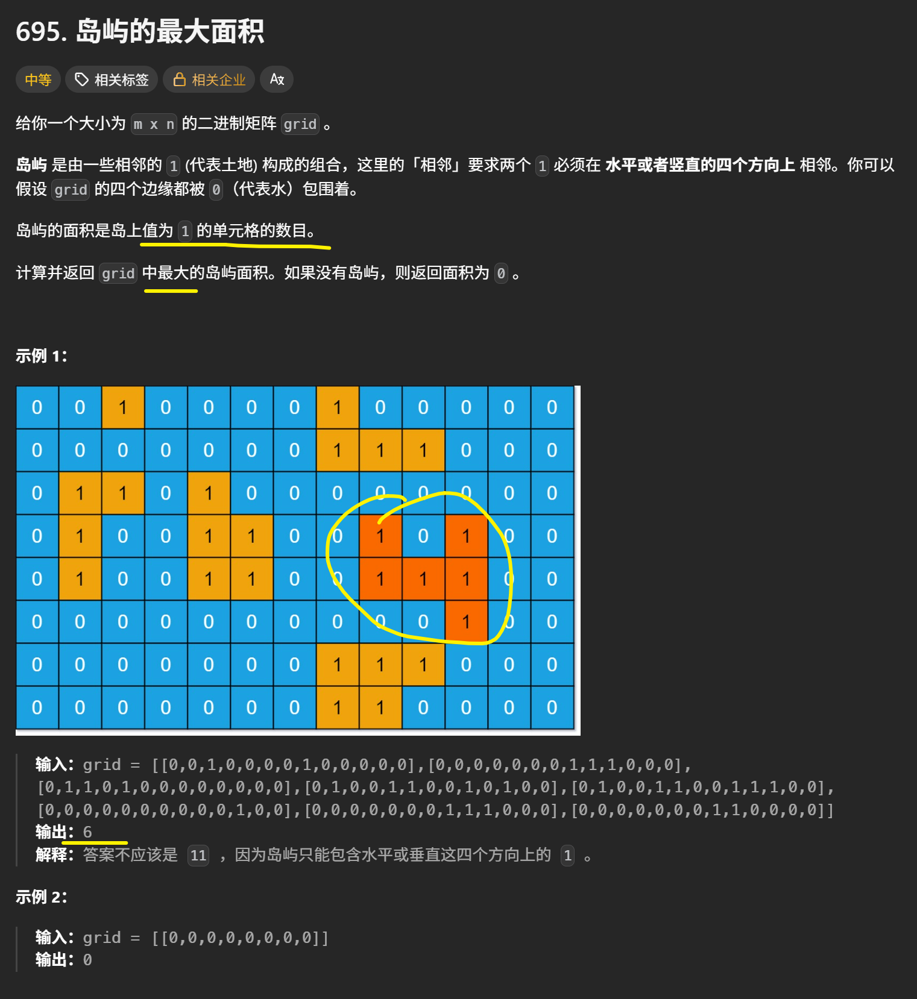


## dfs 直接标记（灵神）

~~~C++
class Solution {
public:
    int dir[4][2] = {0, 1, 0, -1, 1, 0, -1, 0};

    int maxAreaOfIsland(vector<vector<int>>& grid) {
        
        int m = grid.size(), n = grid[0].size();

        auto dfs = [&](this auto&& dfs, int i, int j) -> int 
        {
            int area = 1; // 先算上(i,j)这个格子

            grid[i][j] = 0; // 直接改成海水，作为标记，下次就会被跳过

            for (int k = 0; k < 4; k++) // 4 个方向处理
            {
                int nextx = i + dir[k][0];
                int nexty = j + dir[k][1];
                // 没越界且是陆地
                if (0 <= nextx && nextx < m && 0 <= nexty && nexty < n 
                    && grid[nextx][nexty]) 
                {
                    area += dfs(nextx, nexty); // 递归 加上下一个节点的area
                }
            }

            return area;
        };

        int maxArea = 0;
        for (int i = 0; i < m; i++)
        {
            for (int j = 0; j < n; j++)
            {
                // 是陆地，且没被访问过，取每个(i, j)能连接的面积的最大值
                if (grid[i][j]) maxArea = max(maxArea, dfs(i, j));
            }
        }

        return maxArea;
    }
};
~~~


## dfs + visited另外标记

dfs 标记 (x, y) 能连接的陆地，并记录这块岛屿的面积area

~~~C++
class Solution {
public:
    int dir[4][2] = {0, 1, 0, -1, 1, 0, -1, 0};

    // dfs 标记(x, y)能连接的陆地，并记录这块岛屿的面积area
    void dfs(vector<vector<int>>& grid, vector<vector<bool>>& vistited, int& area, int x, int y)
    {
        if (vistited[x][y] || grid[x][y] == 0)   return; // 终止

        vistited[x][y] = true;
        area++; // 连上这一块陆地，面积+1 

        for (int i = 0; i < 4; i++)
        {
            int nextx = x + dir[i][0];
            int nexty = y + dir[i][1];

            if (nextx < 0 || nextx >= grid.size() || nexty < 0 || nexty >= grid[0].size())    
            {
                continue;
            }

            dfs(grid, vistited, area, nextx, nexty);               
        }
    }


    int maxAreaOfIsland(vector<vector<int>>& grid) {
        int n = grid.size();
        int m = grid[0].size();

        vector<vector<bool>> vistited(n, vector<bool>(m, false));

        int maxArea = 0;
        for (int i = 0; i < n; i++)
        {
            for (int j = 0; j < m; j++)
            {
                if (!vistited[i][j] && grid[i][j] == 1)
                {
                    int area = 0; // // 当前这个起点(i, j)连接的岛屿面积是area
                    dfs(grid, vistited, area, i, j);

                    // (i, j)作为起点的岛屿已经dfs完了，这块面积也计算完了，和前面的取max
                    maxArea = max(maxArea, area); 
                }
            }
        }

        return maxArea;
    }
};
~~~


# 240 [搜索二维矩阵II](https://leetcode.cn/problems/search-a-2d-matrix-ii/description/)

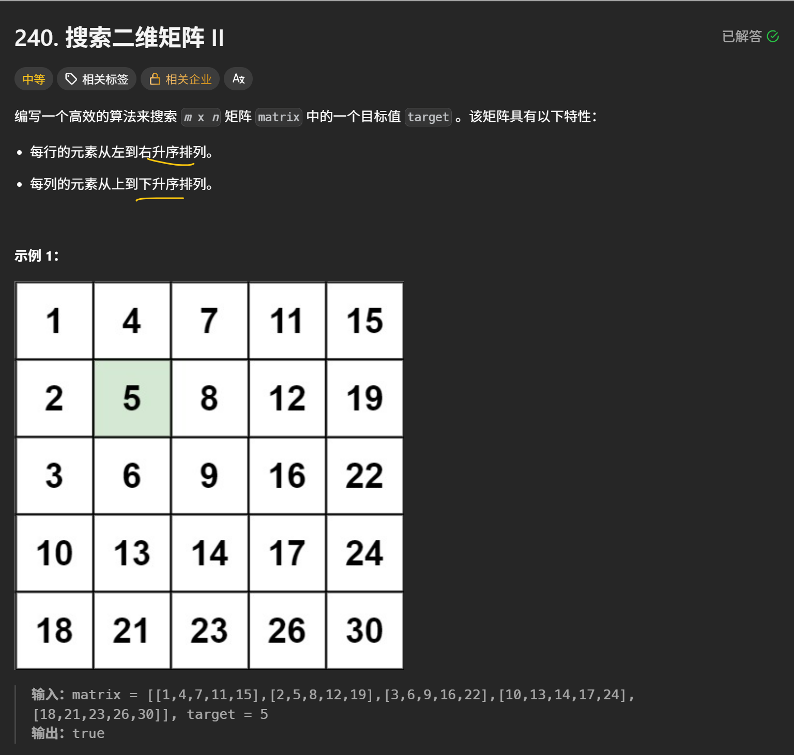

依旧是灵神！！！

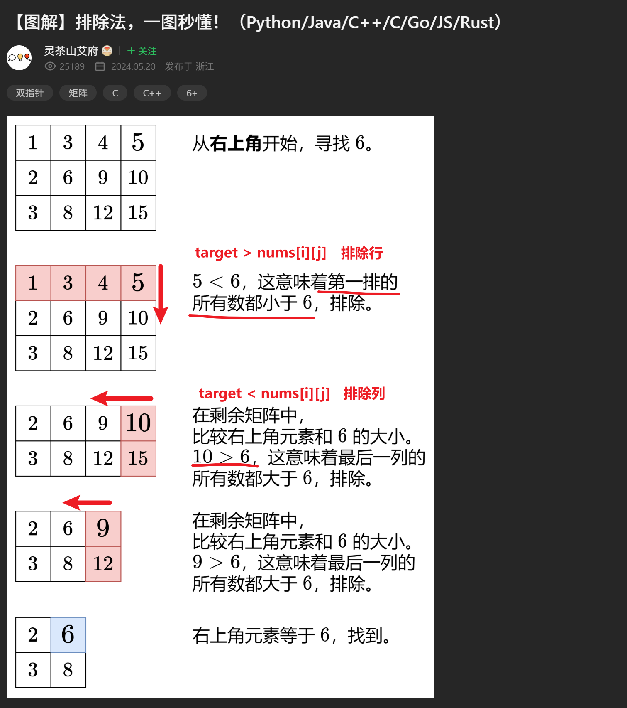

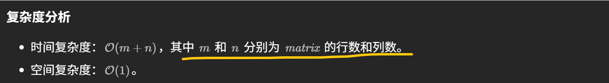


~~~C++
class Solution {
public:
    bool searchMatrix(vector<vector<int>>& matrix, int target) {

        // 比较右上角，target大删行，target小删列

        int m = matrix.size(), n = matrix[0].size();
        
        int i = 0, j = n - 1; // 右上角

        while (i < m && j >= 0)
        {
            if      (target < matrix[i][j]) j--; // target小，去前一列
            else if (target > matrix[i][j]) i++; // target大，去下一行
            else    return true;// 找到
        }
        
        return false;
    }
};
~~~


# 98 [验证二叉搜索树](https://leetcode.cn/problems/validate-binary-search-tree/description/?envType=study-plan-v2&envId=top-100-liked)

@ 中序递归 @左小右大

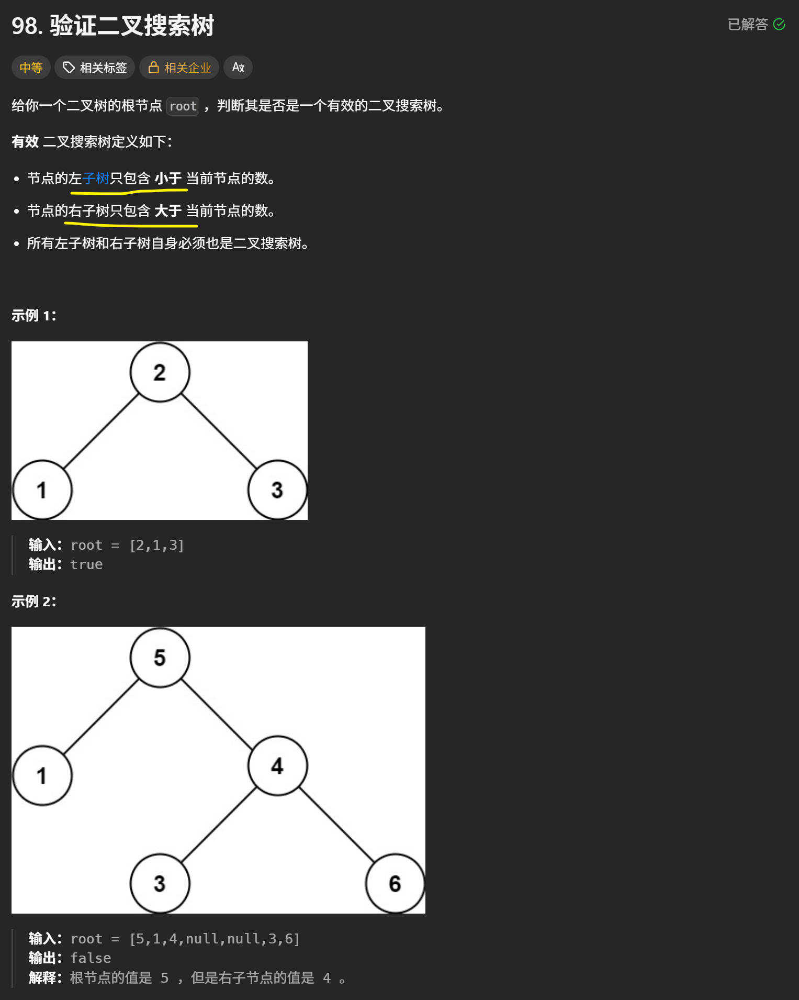

**注意：**

- 要比较的是 **左子树**所有节点小于中间节点，**右子树**所有节点大于中间节点

- 不能单纯的比较左节点小于中间节点，右节点大于中间节点


### 1、中序递归 + 数组

搜索树，左小右大，中序存下来的值应该是升序

~~~C++
/**
 * Definition for a binary tree node.
 * struct TreeNode {
 *     int val;
 *     TreeNode *left;
 *     TreeNode *right;
 *     TreeNode() : val(0), left(nullptr), right(nullptr) {}
 *     TreeNode(int x) : val(x), left(nullptr), right(nullptr) {}
 *     TreeNode(int x, TreeNode *left, TreeNode *right) : val(x), left(left), right(right) {}
 * };
 */
class Solution {
private:

    // 存储节点值 (递归中序)
    vector<int> vec; 
    void traversal(TreeNode* root)
    {
        if (root == nullptr)    return;
        traversal(root->left);      // 左
        vec.push_back(root->val);   // 中
        traversal(root->right);     // 右
    }

    // 搜索树，左小右大，中序存下来的值应该是升序

public:
    bool isValidBST(TreeNode* root) {
        vec.clear();
        traversal(root);

        // 判断vec是不是升序
        for (int i = 1; i < vec.size(); i++)
        {
            // 搜索树里不能有相等的元素，所以要 <=
            if (vec[i] <= vec[i - 1])   return false;
        }

        return true;
        
    }
};
~~~


### 2、中序递归 +  pre保存前一个节点，比较是否升序

~~~C++
class Solution {
public:

    TreeNode* pre = nullptr; // pre 记录前一个节点

    bool isValidBST(TreeNode* root) {

        if (root == nullptr)    return true;

        bool left = isValidBST(root->left);     // 左

        if (pre != nullptr && pre->val >= root->val)    return false;
        pre = root; // 记录前一个节点             // 中

        bool right = isValidBST(root->right);   // 右
        
        return left && right;
    }
};
~~~

时间：O(N)

空间：O(N)


### 3、前序 + 判断节点范围 

> [灵神](https://leetcode.cn/problems/validate-binary-search-tree/solutions/2020306/qian-xu-zhong-xu-hou-xu-san-chong-fang-f-yxvh/?envType=study-plan-v2&envId=top-100-liked)，这怎么能想出来的？

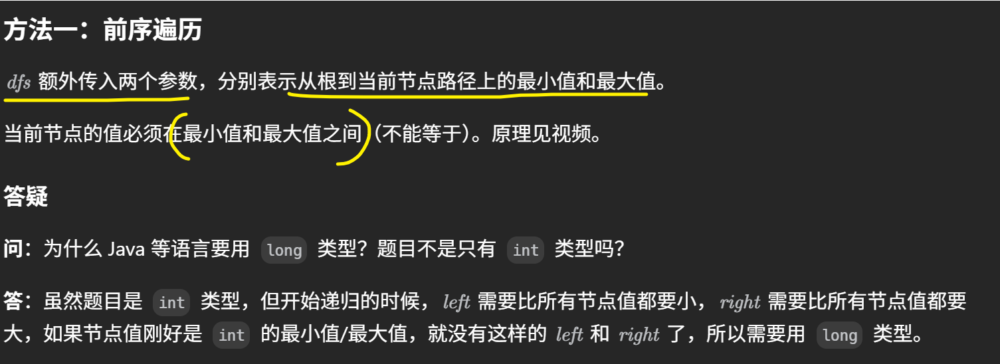

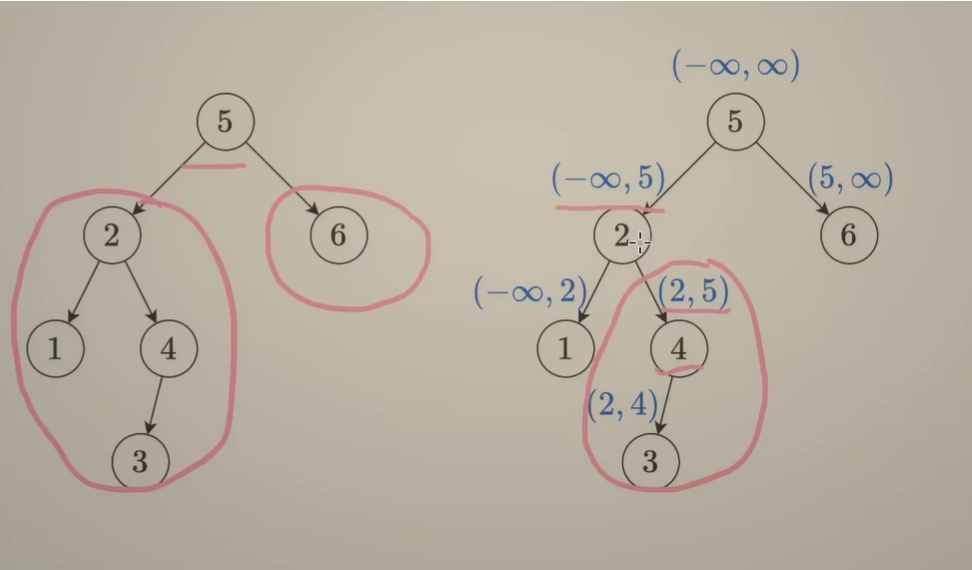

**前序：先访问节点值，再递归子树**

**根据上一层来更新下一层的节点值应该在的范围，走到下一层判断是否合法**

**往左走，更新右边界，往右走，更新左边界**


~~~C++
class Solution {
public:
    bool isValidBST(TreeNode* root, long long left = LLONG_MIN, long long right = LLONG_MAX) {

        // 前序 + 边界 
        // 最开始root所处范围是 （-无穷，+无穷）

        if (root == nullptr)    return true;

        long long x = root->val; // 前序，先访问节点值，再递归子树

        return left < x && x < right && // 判断节点值要处于正确的边界范围内
               isValidBST(root->left, left, x) && // 更新右边界
               isValidBST(root->right, x, right); // 更新左边界
    }
};
~~~

时间：O(N)

空间：O(N)


# 543 [二叉树的直径](https://leetcode.cn/problems/diameter-of-binary-tree/description/?envType=study-plan-v2&envId=top-100-liked)

@ 递归

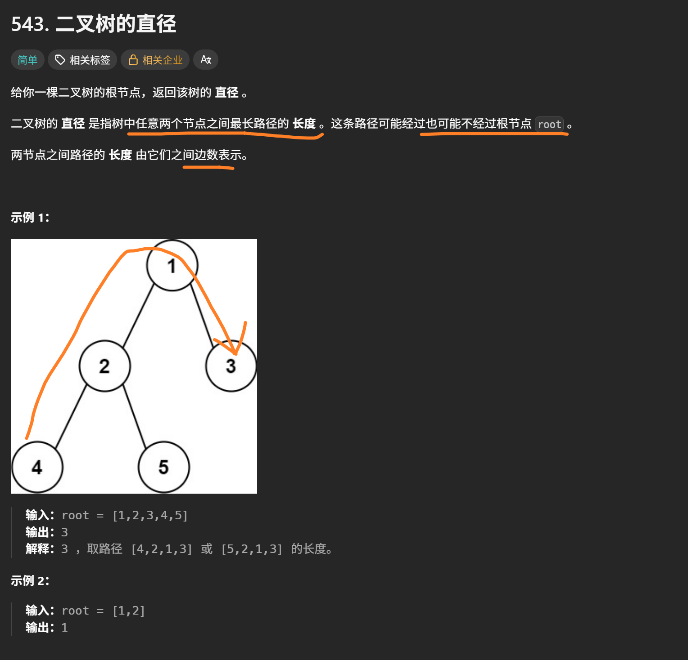

[树形 DP：树的直径【基础算法精讲 23】](https://www.bilibili.com/video/BV17o4y187h1/?vd_source=7369d5f08520f2fc3601caee93963ffa)


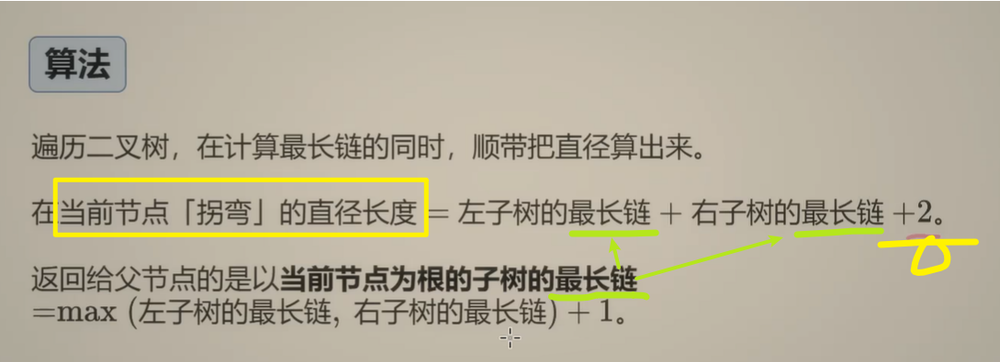

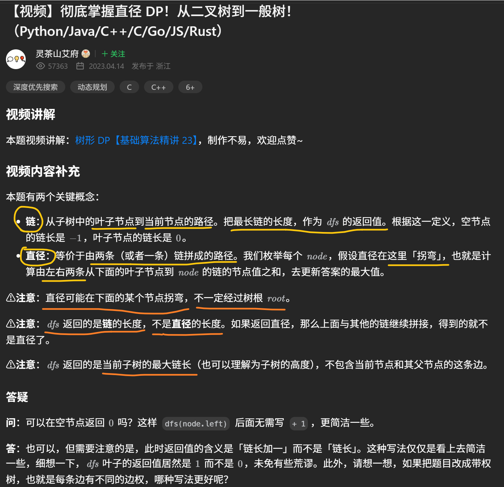

~~~C++
/**
 * Definition for a binary tree node.
 * struct TreeNode {
 *     int val;
 *     TreeNode *left;
 *     TreeNode *right;
 *     TreeNode() : val(0), left(nullptr), right(nullptr) {}
 *     TreeNode(int x) : val(x), left(nullptr), right(nullptr) {}
 *     TreeNode(int x, TreeNode *left, TreeNode *right) : val(x), left(left), right(right) {}
 * };
 */
class Solution {
public:
    int diameterOfBinaryTree(TreeNode* root) {

        int ans = 0;

        // 递归
        auto dfs = [&](this auto&& dfs, TreeNode* node) ->int {
            if (node == nullptr)    return -1; // 叶子节点，链长就是-1 + 1 = 0
            
            int l_len = dfs(node->left) + 1;  // 左子树最大链长 + 1 （加1连到自己）
            int r_len = dfs(node->right) + 1; // 右子树最大链长 + 1

            // 两条链拼成路径（直径）
            ans = max(ans, l_len + r_len); 
            
            return max(l_len, r_len); // 递归返回的是当前子树的最大链长
        };

        dfs(root);
        return ans;
    }
};
~~~

 `this auto&& dfs`

- **C++20 起支持**：lambda 参数中使用 `this auto&&` 允许 lambda **递归调用自身**。
- `this` 说明它是 **递归 lambda** 的特殊用法，编译器会在调用时把当前 lambda 自己传进来。
- `dfs` 是 lambda 的“自身引用”，相当于给自己起了个名字，可以在内部递归调用。

~~~C++
auto dfs = [&](this auto&& dfs, TreeNode* node) -> int{...};
~~~

定义了一个**可以递归调用自身的深度优先搜索函数**，在函数体中递归地访问左右子树，并计算“以该节点为中心的最长路径”。

等价于：

~~~C++
auto dfs = [&](auto&& dfs, TreeNode* node) -> int { ... };
~~~

调用时需要手动传入自己`dfs`

~~~C++
dfs(dfs, root);
~~~

而`this auto&&` 直接帮你把`dfs`传给自己了，调用时只用写：

~~~C++
dfs(root);
~~~


普通写法：

~~~C++
class Solution {
public:
    int maxDiameter = 0;

    int dfs(TreeNode* node) {
        if (node == nullptr) return -1;

        int left = dfs(node->left) + 1;
        int right = dfs(node->right) + 1;

        maxDiameter = max(maxDiameter, left + right); // 两条链拼成路径（直径）

        return max(left, right); // 递归返回的是当前子树的最大链长
    }


    int diameterOfBinaryTree(TreeNode* root) {

        dfs(root);
        return maxDiameter;
    }
};
~~~


# end

