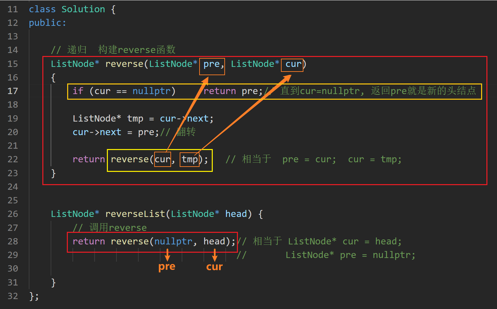
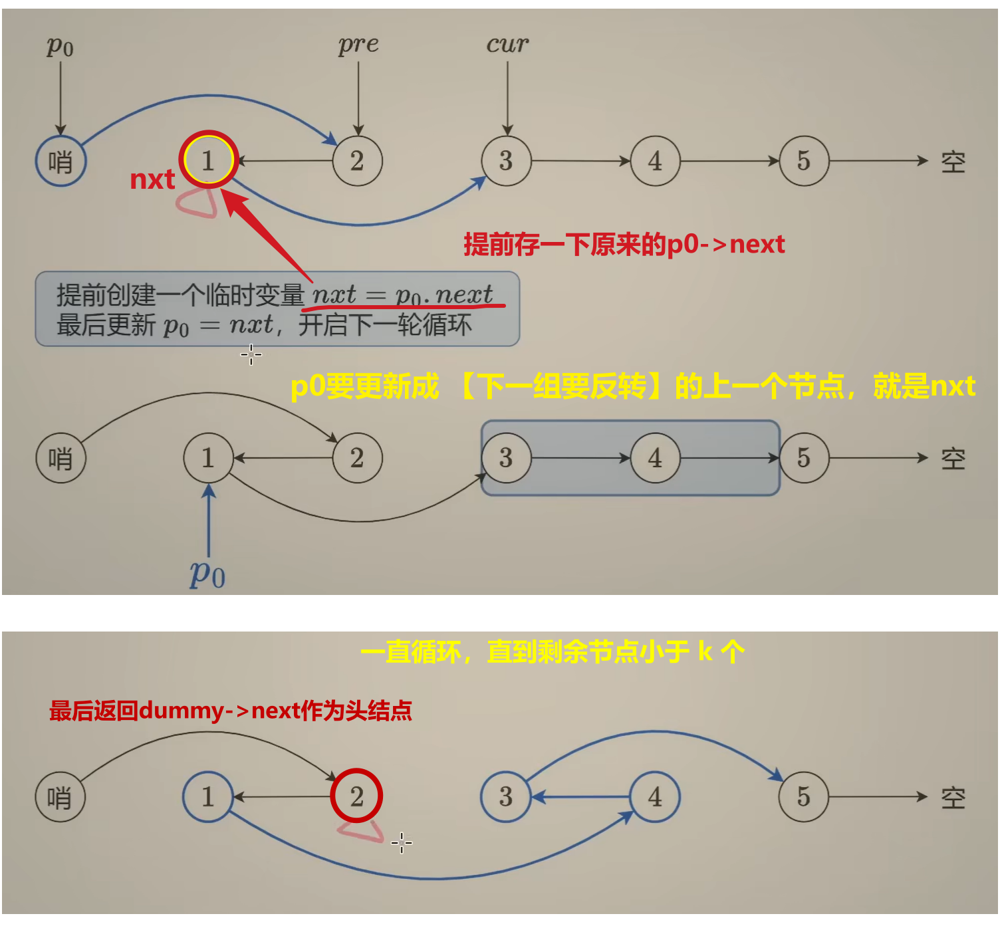
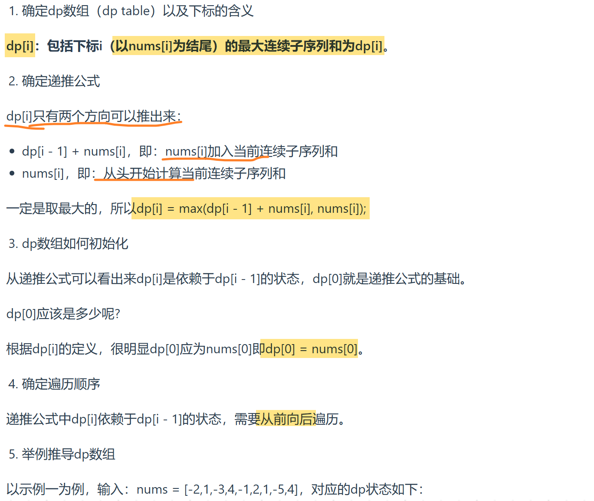
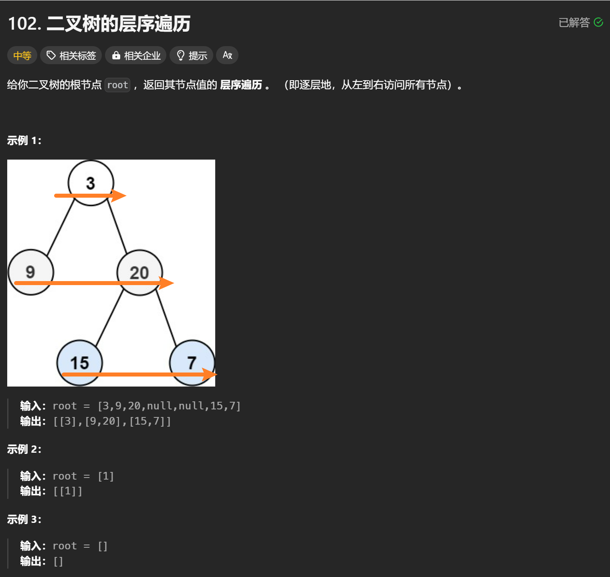
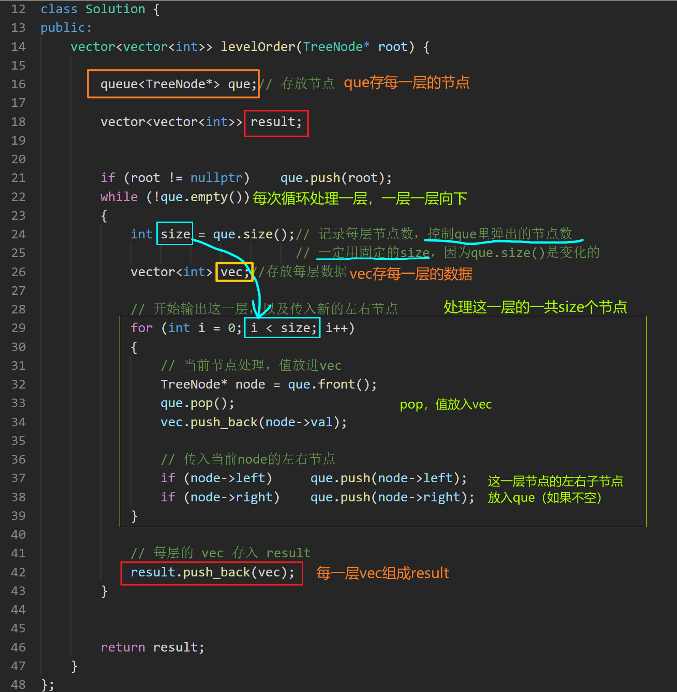
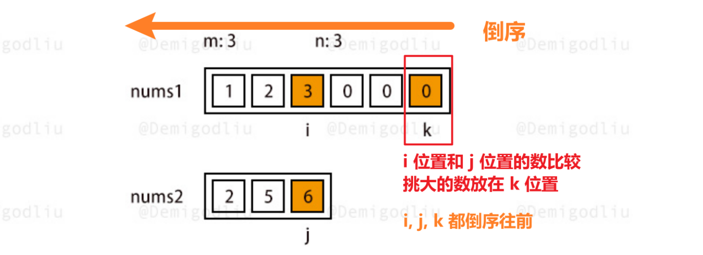
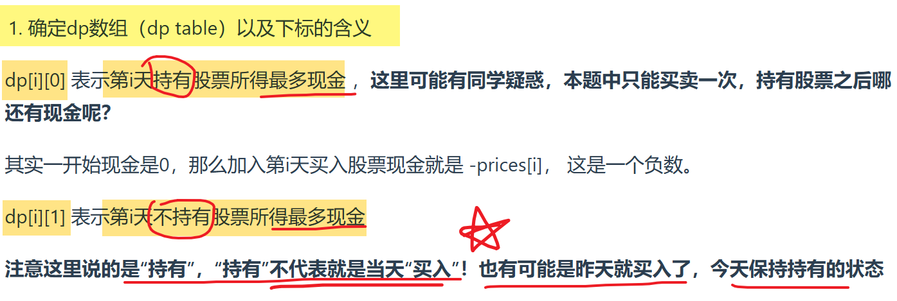
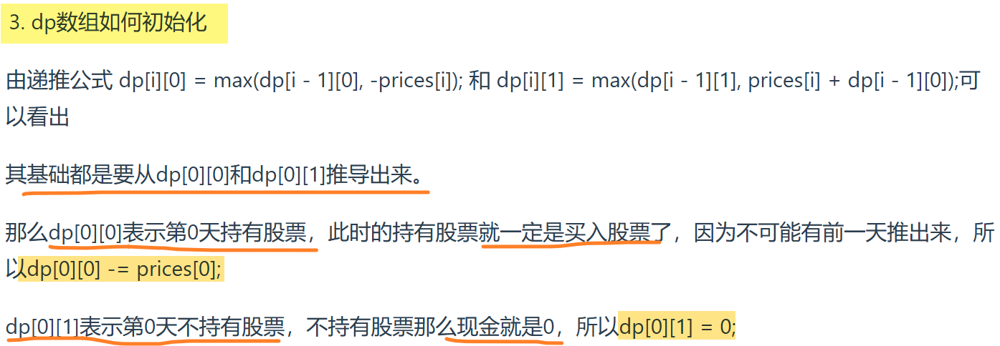
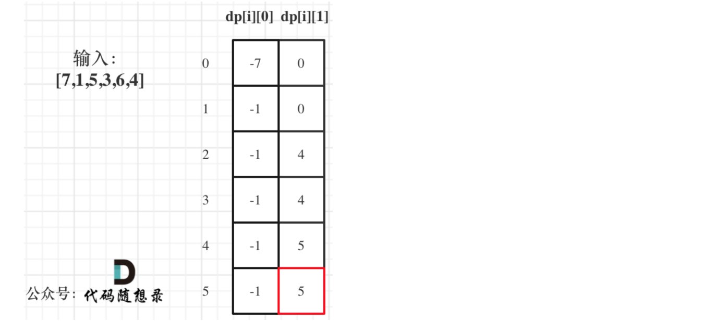

> 来自 [codetop](https://codetop.cc/home)，按频度排序

# 3 [无重复字符的最长子串](https://leetcode.cn/problems/longest-substring-without-repeating-characters/description/?envType=study-plan-v2&envId=top-100-liked)

@滑动窗口 + map

滑动窗口 + unordered_map计数字符次数

滑动窗口向后移动（right++），遇到重复字符，收缩窗口（left++）

~~~C++
class Solution {
public:
    int lengthOfLongestSubstring(string s) {

        int n = s.size();
        int ans = 0; // 窗口长度，即最长不重复子串长度

        // 窗口 [left, right]
        int left = 0;
        int right = 0;

        unordered_map<char, int> cnt; // cnt <出现的字符，字符出现的次数>

        for (right = 0; right < n; right++) // right++, 窗口右移
        { 
            char c = s[right];
            cnt[c]++; // 遇到的字符，次数+1

            // cnt[c] > 1 说明有重复字符
            while (cnt[c] > 1)
            {
                cnt[s[left]]--; // 左边界收缩，去除一个左边界字符的数量
                left++; // 缩小窗口
            }

            ans = max(ans, right - left + 1); // 更新窗口长度最大值
        }

        return ans;    
    }
};
~~~

# 146 [LRU缓存](https://leetcode.cn/problems/lru-cache/description/?envType=study-plan-v2&envId=top-100-liked)

@ 双向环形链表

**双向环形链表：**

- <key, value>
- prev，next

**LRUcache 需要的成员变量：**

- dummy head
- capacity
- unordered_map <key, value> 

**LRUcache 三个辅助函数：**

- 移除一本书`remove(node)` 
- 把一本新书放在最上面 `push_front(newNode)`
- 抽出一本书放在最上面 `get_node(key)`

**LRUcache 题目要求的函数：**

- 构造函数 `LRUCache()`，初始化虚拟节点，cache容量
- 把一本书抽出来放在最上面 `get(key)`
- 放入一本新书 `put(key, value)`
  - 覆盖性插入，如果有这个node，修改值；
  - 如果没有，放在最上面（超过容量的话，移除最下面的书 `dummy->prev`）

~~~C++
// 构造双向链表（存key，value，前后向指针）
// 删除节点 remove() + 最上面添加节点 push_front() + 抽出key节点，移到头部 get_node()

class Node // 构造双向链表
{
public:
    int key;
    int value;
    Node* prev;
    Node* next;

    Node(int k = 0, int v = 0) : key(k), value(v) {}
};

class LRUCache {
private:
    int capacity;
    Node* dummy; 
    unordered_map<int, Node*> key_to_node; // <key, node>

    // 删除一个节点（抽出一本书）
    void remove(Node* x)
    {
        x->prev->next = x->next;
        x->next->prev = x->prev; 
    }

    // 插入节点到链表头部（dummy后面）（把一本书放在最上面）
    void push_front(Node* x)
    {
        x->prev = dummy;
        x->next = dummy->next;
        x->prev->next = x;
        x->next->prev = x;
    }

    // 获取 key 对应的节点返回，并移到链表头部（抽出一本书放在最上面）
    Node* get_node(int key)
    {
        auto it = key_to_node.find(key);

        // 没有这本书
        if (it == key_to_node.end())    return nullptr; 

        // 有这本书
        Node* node = it->second; 
        remove(node);     // 抽出这本书
        push_front(node); // 放在最上面

        return node;
    }

public:
    LRUCache(int capacity) 
        : capacity(capacity), dummy(new Node())
    {
        dummy->prev = dummy;
        dummy->next = dummy;// 初始都指向自己
    }
    

    int get(int key) {
        // 如果关键字 key 存在于缓存中，则返回关键字的值，否则返回 -1 
        Node* node = get_node(key);
        return node ? node->value : -1;
    }
    
    
    void put(int key, int value) {
        // 如果关键字 key 已经存在，则变更其数据值 value 
        // 如果不存在，则向缓存中插入该组 key-value 
        // 如果插入操作导致关键字数量超过 capacity ，则应该 逐出 最久未使用的关键字
        
        Node* node = get_node(key);// get_node 会把对应节点移到链表头部
        // 节点存在，更新value，移到头部（有这本书）
        if (node) 
        {
            node->value = value; 
            return;
        }

        // 节点不存在，创建新节点插入头部（新书）
        Node* newnode = new Node(key, value);
        key_to_node[key] = newnode;
        push_front(newnode); 

        // 节点插入后，容量爆了，移除最后节点（移除最下面的书）
        if (key_to_node.size() > capacity) 
        {
            Node* back_node = dummy->prev; // 环形双向链表，直接找到最下面节点
            
            key_to_node.erase(back_node->key); // map中删除 <key, back_node>
            remove(back_node); 				   // 链表删除节点
            
            delete back_node; // 释放内存
        }
    }
    
};

/**
 * Your LRUCache object will be instantiated and called as such:
 * LRUCache* obj = new LRUCache(capacity);
 * int param_1 = obj->get(key);
 * obj->put(key,value);
 */
~~~

- 时间复杂度：所有操作均为 O(1)。
- 空间复杂度：O(min(*p*,*capacity*))，其中 *p* 为 put 的调用次数。

# 206 [反转链表](https://leetcode.cn/problems/reverse-linked-list/description/?envType=study-plan-v2&envId=top-100-liked)

## 1、双指针

~~~C++
class Solution {
public:
    ListNode* reverseList(ListNode* head) {
        
        // 双指针

        ListNode* tmp;
        ListNode* cur = head;
        ListNode* pre = nullptr;

        while (cur)
        {
            tmp = cur->next;
            cur->next = pre; // 断开cur和cur->next，反转

            // 后移pre和cur
            pre = cur;
            cur = tmp;
        }

        return pre;// 新的头节点
        
    }
};
~~~

## 2、递归

~~~C++
/**
 * Definition for singly-linked list.
 * struct ListNode {
 *     int val;
 *     ListNode *next;
 *     ListNode() : val(0), next(nullptr) {}
 *     ListNode(int x) : val(x), next(nullptr) {}
 *     ListNode(int x, ListNode *next) : val(x), next(next) {}
 * };
 */
class Solution {
public:
    // 递归 构建reverse函数
    ListNode* reverse(ListNode* pre, ListNode* cur)
    {
        if (cur == nullptr) return pre; // 直到cur = nullptr，返回pre就是新的头节点

        ListNode* tmp = cur->next;
        cur->next = pre; // 反转

        return reverse(cur, tmp); // 相当于 pre = cur, cur = tmp
    }

    ListNode* reverseList(ListNode* head) {
        return reverse(nullptr, head); // 初始 cur = head, pre = nullpt  
    }
};
~~~

# 215 [数组中的第 K 个最大元素](https://leetcode.cn/problems/kth-largest-element-in-an-array/submissions/649625107/?envType=study-plan-v2&envId=top-100-liked)

@ 快排

~~~C++
class Solution {
public:
    // 基于快排的快速选择
    int quickSelect(vector<int>& nums, int k)
    {        
        // 随机选择基准数字
        int p = nums[rand() % nums.size()];

        // 将大于等于小于基准的元素，分别放入三个数组
        vector<int> big, equal, small;
        for (int a : nums)
        {
            if (a < p)      small.push_back(a);
            else if (a > p) big.push_back(a);
            else            equal.push_back(a);
        }

        // 第 k 大元素在big 中，按递归划分
        if (k <= big.size())    
        {
            return quickSelect(big, k);
        }

        // 第 k 大元素在 small 中，递归划分
        if (k > big.size() + equal.size())
        {
            return quickSelect(small, k - (big.size() + equal.size()));
            // 在small里面就是第 [k - (big.size() + equal.size())] 个大的元素
        }

        // 第 k 大元素在 equal 中，找到，返回p
        return p;
    }

    int findKthLargest(vector<int>& nums, int k) {

        return quickSelect(nums, k);        
    }
};
~~~

# 25 [K个一组翻转链表](https://leetcode.cn/problems/reverse-nodes-in-k-group/description/?envType=study-plan-v2&envId=top-100-liked)

@ 反转链表

**计数节点数count —— dummy，pre，cur，p0(当前反转组的前一个)**

**普通反转链表，成组反转 + 连接头尾**

[题解：灵茶山艾府](https://www.bilibili.com/video/BV1sd4y1x7KN/?vd_source=7369d5f08520f2fc3601caee93963ffa)

~~~C++
/**
 * Definition for singly-linked list.
 * struct ListNode {
 *     int val;
 *     ListNode *next;
 *     ListNode() : val(0), next(nullptr) {}
 *     ListNode(int x) : val(x), next(nullptr) {}
 *     ListNode(int x, ListNode *next) : val(x), next(next) {}
 * };
 */
class Solution {
public:
    ListNode* reverseKGroup(ListNode* head, int k) {

        // 统计节点个数
        int n = 0;
        ListNode* node = head;
        while (node)
        {
            n++;
            node = node->next;
        }
        
        ListNode* dummyHead = new ListNode(0);
        dummyHead->next = head;
        
        ListNode* p0 = dummyHead; // p0 作为 [下一组要反转的k个节点的] 上一个节点
        ListNode* pre = nullptr;
        ListNode* cur = head;

        // 剩余节点足够 k 个
        while (n >= k)
        {
            // k 个一组处理
            for (int i = 0; i < k; i++) // 206 普通反转链表
            {
                ListNode* tmp = cur->next;
                cur->next = pre;
                pre = cur;
                cur = tmp;
            }

            // 连接头尾
            ListNode* nxt = p0->next;
            p0->next->next = cur;
            p0->next = pre;
            p0 = nxt; // 更新p0

            // n 更新
            n -= k;
            
            pre = nullptr; // 可以不重置，重置好理解一些
        }

        return dummyHead->next;

    }
};
~~~

- 时间复杂度：O(*n*)，其中 *n* 为链表节点个数。
- 空间复杂度：O(1)，仅用到若干额外变量。

# 15 [三数之和](https://leetcode.cn/problems/3sum/description/?envType=study-plan-v2&envId=top-100-liked)

@双指针收缩

**双指针收缩，大了往左，小了往右 + 去重**

~~~C++
class Solution {
public:
    vector<vector<int>> threeSum(vector<int>& nums) {

        // 先排序nums
        sort(nums.begin(), nums.end());
        
        vector<vector<int>> result;
        
        for (int i = 0; i < nums.size(); i++)
        {
            // 排序后第一个元素已经大于0，不可能凑成三元组
            if (nums[i] > 0)    break;
            
            // 去重 a
            // 如果i和i-1元素相同，说明后面遍历组合的三数之和在nums[i-1]的时候被组合过了，跳过
            if (i > 0 && nums[i] == nums[i - 1])    continue;

            // a = nums[i]  b = nums[left]  c = nums[right]   固定i，移动left right
            int left = i + 1;
            int right = nums.size() - 1;
            while(left < right) 
            {
                // 三数之和 > 0，right向左移动，让和变小
                if (nums[i] + nums[left] + nums[right] > 0) right--;
                
                // 三数之和 < 0，left向右移动，让和变大
                else if (nums[i] + nums[left] + nums[right] < 0) left++;
                
                // 三数之和 = 0，找到一个三元组
                else 
                {
                    // 收集三元组
                    result.push_back(vector<int>{nums[i], nums[left], nums[right]});
                    
                    // 去重b和c，向里收缩
                    while (right > left && nums[right] == nums[right - 1])	right--;
                    while (right > left && nums[left] == nums[left + 1])	left++;
                    
                    // 找到一组三元组后，left和right同时向里收缩，寻找下一组
                    right--;
                    left++;
                }
                
            }
        }

        return result;        
    }
};
~~~

时间复杂度：*O*(*n*2)

空间复杂度：O(1)

# 53 [最大子数组和](https://leetcode.cn/problems/maximum-subarray/description/?envType=study-plan-v2&envId=top-100-liked)

@贪心 @动态规划 

## 贪心

~~~C++
class Solution {
public:
    int maxSubArray(vector<int>& nums) {

        // 贪心

        // 注意找的只是 【最大和】，没让找子数组

        // 主要思路：负数只会拖累加和，所以遇到和变成负的，舍弃，负的只会减小后面的加和
        
        int result = INT32_MIN;
        int count = 0;

        // 记录连续和count，如果count < 0，舍弃，再从下一个数开始计和
        for (int i = 0; i < nums.size(); i++)
        {
            count += nums[i];
            result = max(count, result); // 更新result，取大的count
            
            if (count <= 0)	count = 0; // 舍弃，从下一个数nums[i + 1]重新加和
        }

        return result;
    }
};
~~~

## 动态规划

~~~C++
class Solution {
public:
    int maxSubArray(vector<int>& nums) {
        
        if (nums.size() == 0)   return 0;
        
        // 动态规划

        // dp[i] - 以nums[i]结尾(包括)的最大连续子序列和为dp[i]
        vector<int> dp(nums.size());

        // 初始化
        dp[0] = nums[0];

        int result = dp[0];

        // 递推
        for (int i = 1; i < nums.size(); i++)
        {
            dp[i] = max(dp[i - 1] + nums[i], nums[i]);// 两种推出dp[i]的方式，取max

            if (dp[i] > result) result = dp[i]; // 取dp[i]的最大值返回
        }

        return result;  
    }
};
~~~

# 102 [二叉树的层序遍历](https://leetcode.cn/problems/binary-tree-level-order-traversal/description/?envType=study-plan-v2&envId=top-100-liked)

@ 队列

~~~c++
/**
 * Definition for a binary tree node.
 * struct TreeNode {
 *     int val;
 *     TreeNode *left;
 *     TreeNode *right;
 *     TreeNode() : val(0), left(nullptr), right(nullptr) {}
 *     TreeNode(int x) : val(x), left(nullptr), right(nullptr) {}
 *     TreeNode(int x, TreeNode *left, TreeNode *right) : val(x), left(left), right(right) {}
 * };
 */
class Solution {
public:
    vector<vector<int>> levelOrder(TreeNode* root) {

        queue<TreeNode*> que; // 存放每层的节点

        vector<vector<int>> result;

        if (root)   que.push(root);
        while (!que.empty())
        {
            int size = que.size(); // 记录每层节点数，控制que里弹出的节点数
                                   // 一定用固定的size，因为que.size()是变化的
            
            vector<int> vec; // 存放当前层的数据

            // 开始输出这一层，以及传入新的左右节点
            for (int i = 0; i < size; i++)
            {
                // 当前节点处理，值放进vec
                TreeNode* node = que.front();
                que.pop();
                vec.push_back(node->val);

                // 传入当前node的左右节点
                if (node->left)     que.push(node->left);
                if (node->right)    que.push(node->right);
            }

            // 每层vec存入result
            result.push_back(vec);
        }

        return result;      
    }
};
~~~

时间复杂度：O(N)

空间复杂度：O(N)

# 1 [两数之和](https://leetcode.cn/problems/two-sum/description/?envType=study-plan-v2&envId=top-100-liked)

@哈希 @数组

遍历数组，需要一个集合**存放【遍历过的元素】**，在遍历数组nums的时候，同时去这个组合中寻找，某元素【 target - 当前遍历元素 nums[i] 】是否出现过。

因为最后要找到这个元素是否出现过，还需要得到这个元素的下标，需要使用key-value结构存放：

**< key: 元素nums[i]， value：下标 i >**

判断元素是否出现过，那么元素就要作为key，通过元素找下标，下标作为value。

> std::unordered_map 底层实现为哈希表，std::map 和std::multimap 的底层实现是红黑树。
>
> std::map 和std::multimap 的key也是有序的,**这道题目中并不需要key有序，选择std::unordered_map 效率更高！** 

~~~C++
class Solution {
public:
    vector<int> twoSum(vector<int>& nums, int target) {
        
        // unordered_map 不重复 无序key 存放遍历过的元素
        unordered_map<int, int> umap; // < nums[i], 下标 i>

        for (int i = 0; i < nums.size(); i++)
        {
            //find 查找 target - nums[i] 在不在 umap中
            if (umap.find(target - nums[i]) != umap.end()) 
            {
                return {umap[target - nums[i]], i}; // 找到，直接返回下标数组
            }
            umap.insert(pair<int, int>(nums[i], i));// 没找到，就存到umap里
        }

        return {}; // 没符合条件的，返回空数组
        
    }
};
~~~

时间复杂度：O(N)

空间复杂度：O(N)

# 33 [搜索旋转排序数组](https://leetcode.cn/problems/search-in-rotated-sorted-array/description/?envType=study-plan-v2&envId=top-100-liked)

@ 分段二分  @153 旋转数组最小值 + 普通找target二分

> 前提题目：可以先看 162 峰值，153 寻找旋转排序数组的最小值

## 1、两次二分

~~~C++
class Solution {
public:
    // 找旋转排序数组的最小值下标（153）
    int findMin(vector<int>& nums) {
        int n = nums.size();
        int left = 0;
        int right = n - 1;
        while (left <= right)
        {
            int mid = left + ((right - left) / 2);
            if (nums[mid] > nums[n - 1])    left = mid + 1;// mid在第一段，min在第二段
            else    right = mid - 1; // mid 和 min 在同一段，且 min 在左
        }
        return left; 
    }

    // [left, right]二分，找target下标
    int searchTarget(vector<int>& nums, int target, int left, int right) {
        while (left <= right)
        {
            int mid = left + ((right - left) / 2); 
            if      (nums[mid] > target)    right = mid - 1;
            else if (nums[mid] < target)    left = mid + 1;
            else    return mid;
        }
        return -1; // 没找到返回-1  
    }

    
    int search(vector<int>& nums, int target) {
        int n = nums.size();
        int ans = 0;
        int left = 0;
        int right = n - 1;

        int min_index = findMin(nums); // 找到最小值，区分第一段第二段

        if (target > nums[n - 1])  // target 在第一段，[0, min_index-1], 向左收缩 
        { 
            right = min_index - 1;
            ans = searchTarget(nums, target, left, right);         
        }
        else // target <= nums[n - 1] target 在第二段，[min_index, n-1]，向右收缩  
        {
            left = min_index;
            ans = searchTarget(nums, target, left, right);

            // 注意这里要带着min判断, target有可能就是min
        }

        return ans;        
    }
};
~~~

## 2、一次二分(推荐)

直接判断 target 和 mid 的左右关系，分成target和mid在不在同一段两种情况

- 不在同一段，分 mid 在 target 左还是右
- 在同一段，就是普通二分查找了

~~~C++
class Solution {
public:
    int search(vector<int>& nums, int target) {

        int n = nums.size();
        int end = nums[n - 1]; // 还是和最后一个数比较，判断在哪一段
        
        int left = 0;
        int right = n - 1;

        while (left <= right)
        {
            int mid = left + (right - left) / 2;

            // target 和 mid 不在同一段
            if (nums[mid] > end && target <= end) 	   // target在右半部分，mid在左
            {
                left = mid + 1;
            }
            else if (target > end && nums[mid] <= end) // target在左半部分，mid在右
            {
                right = mid - 1;
            }
            else // target 和 mid 在同一段（也包括了只有一段的情况） 普通二分
            {
                if (target < nums[mid])         right = mid - 1;
                else if (target > nums[mid])    left = mid + 1;
                else    return mid;
            }
        }
        
        return -1;        
    }
};
~~~

# 200

# 46

# 88 [合并两个有序数组](https://leetcode.cn/problems/merge-sorted-array/description/?envType=study-plan-v2&envId=top-interview-150)

主要思路：

- 从后往前确定两组中该用哪个数字
- 结束条件是第二组数全都插入 `j < 0`

~~~C++
class Solution {
public:
    void merge(vector<int>& nums1, int m, vector<int>& nums2, int n) {

        int i = m - 1; // nums1最后一个数
        int j = n - 1; // nums2最后一个数

        int k = m + n - 1; // 合并后的末尾

        while (j >= 0)
        {
            // 取大的数放在 k
            if (i >= 0 && nums1[i] > nums2[j])  
            {
                nums1[k] = nums1[i];
                k--;
                i--;
            }
            else 
            {
                nums1[k] = nums2[j];
                k--;
                j--;
            }

        }  

    }
};
~~~

- 时间复杂度：O(*m*+*n*)。最坏情况形如 *nums*1=[4,5,6,∗,∗,∗],*nums*2=[1,2,3]，每个数都需要移动一次。
- 空间复杂度：O(1)。仅用到若干额外变量

# 20

# 121 [买卖股票的最佳时机](https://leetcode.cn/problems/best-time-to-buy-and-sell-stock/description/?envType=study-plan-v2&envId=top-100-liked)

@ 贪心 @ 动规

### 贪心

~~~C++
class Solution {
public:
    int maxProfit(vector<int>& prices) {

        // prices[i] 股票第 i 天的价格
        int low = prices[0];
        int result = 0;
        for (int i = 0; i < prices.size(); i++)
        {
            low = min(low, prices[i]); // 取最左最小价格
            result = max(result, prices[i] - low); // 直接取最大差
        }

        return result;
    }
};
~~~

ACM 

~~~C++
#include <vector>
#include <iostream>
using namespace std;

// 121 买卖股票的最佳时机

int maxProfit(vector<int>& prices)  // prices[i] 股票第 i 天的价格
{ 
    int result = 0;
    int low = prices[0];
    
    for (int i = 0; i < prices.size(); i++)
    {
        low = min(low, prices[i]); // 取最左最小价格
        result = max(result, prices[i] - low); // 直接取最大差
    }
    return result;
    
}

int main()
{
    vector<int> prices = {7, 1, 5, 3, 6, 4};
    int result = maxProfit(prices);
    cout << result << endl;

    return 0;
}
~~~

### 动规

~~~C++
class Solution {
public:
    int maxProfit(vector<int>& prices) {

        int len = prices.size();

        // dp[i][0] - 第i天持有股票所得最多现金   
        // dp[i][1] - 第i天不持有股票所得最多现金
        vector<vector<int>> dp(len, vector<int>(2, 0));

        dp[0][0] = -prices[0];
        dp[0][1] = 0;

        for (int i = 1; i < prices.size(); i++)
        {
            dp[i][0] = max(dp[i - 1][0], -prices[i]);
            dp[i][1] = max(dp[i - 1][1], dp[i - 1][0] + prices[i]);
        }

        return dp[len - 1][1]; // 一定是最后不持有，钱多   
    }
};
~~~

时间复杂度：O(n)

空间复杂度：O(n)

**优化空间复杂度**

# 103

# 236

# end

