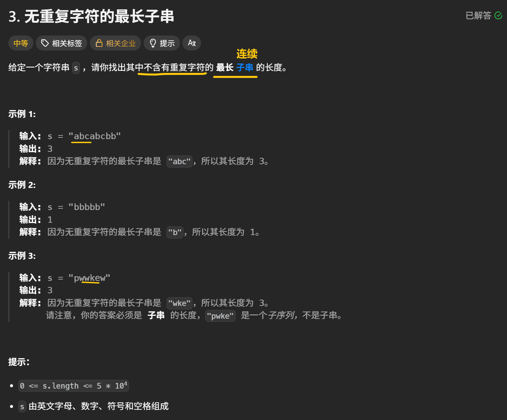
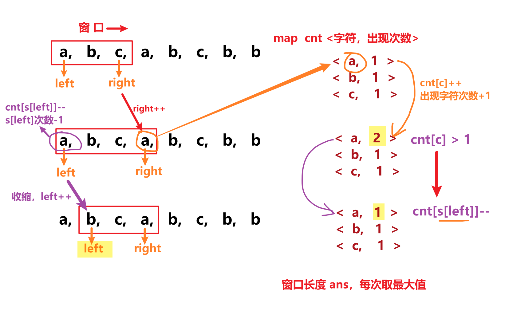
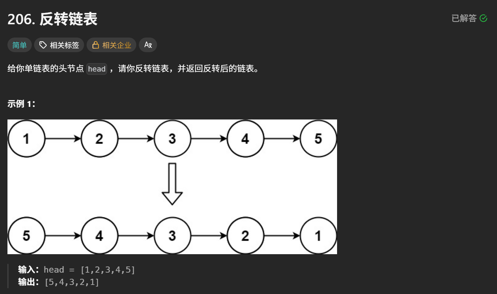
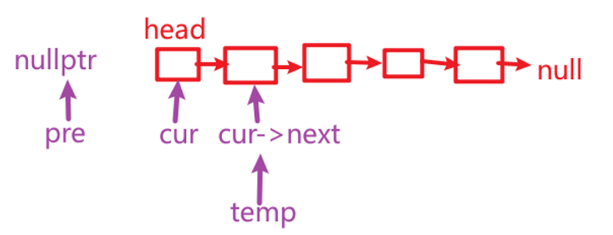
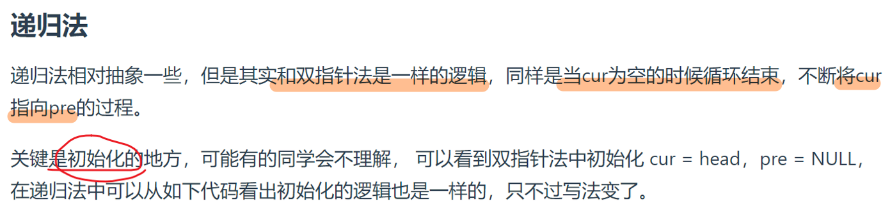
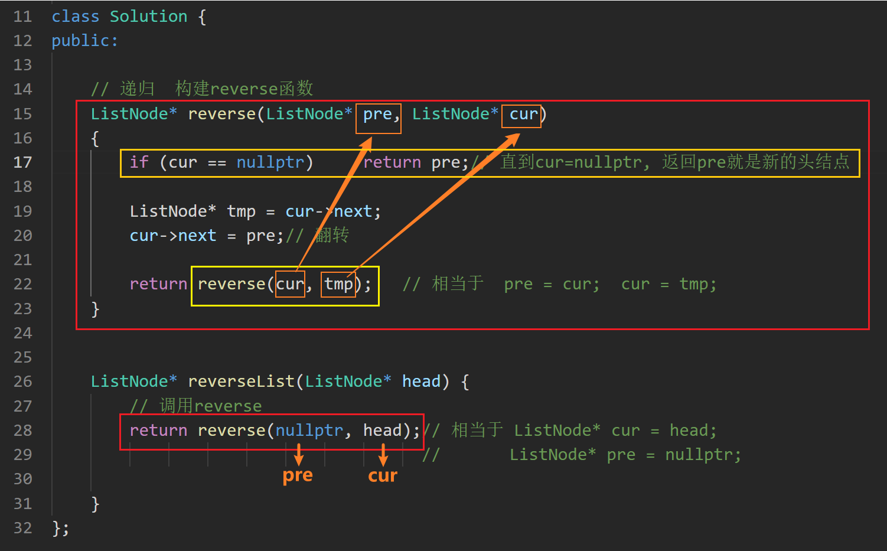

> 来自 [codetop](https://codetop.cc/home)，按频度排序

# 3 [无重复字符的最长子串](https://leetcode.cn/problems/longest-substring-without-repeating-characters/description/?envType=study-plan-v2&envId=top-100-liked)

@滑动窗口 + map

滑动窗口 + unordered_map计数字符次数

滑动窗口向后移动（right++），遇到重复字符，收缩窗口（left++）

~~~C++
class Solution {
public:
    int lengthOfLongestSubstring(string s) {

        int n = s.size();
        int ans = 0; // 窗口长度，即最长不重复子串长度

        // 窗口 [left, right]
        int left = 0;
        int right = 0;

        unordered_map<char, int> cnt; // cnt <出现的字符，字符出现的次数>

        for (right = 0; right < n; right++) // right++, 窗口右移
        { 
            char c = s[right];
            cnt[c]++; // 遇到的字符，次数+1

            // cnt[c] > 1 说明有重复字符
            while (cnt[c] > 1)
            {
                cnt[s[left]]--; // 左边界收缩，去除一个左边界字符的数量
                left++; // 缩小窗口
            }

            ans = max(ans, right - left + 1); // 更新窗口长度最大值
        }

        return ans;    
    }
};
~~~

# 146 [LRU缓存](https://leetcode.cn/problems/lru-cache/description/?envType=study-plan-v2&envId=top-100-liked)

@ 双向环形链表

**双向环形链表：**

- <key, value>
- prev，next

**LRUcache 需要的成员变量：**

- dummy head
- capacity
- unordered_map <key, value> 

**LRUcache 三个辅助函数：**

- 移除一本书`remove(node)` 
- 把一本新书放在最上面 `push_front(newNode)`
- 抽出一本书放在最上面 `get_node(key)`

**LRUcache 题目要求的函数：**

- 构造函数 `LRUCache()`，初始化虚拟节点，cache容量
- 把一本书抽出来放在最上面 `get(key)`
- 放入一本新书 `put(key, value)`
  - 覆盖性插入，如果有这个node，修改值；
  - 如果没有，放在最上面（超过容量的话，移除最下面的书 `dummy->prev`）

~~~C++
// 构造双向链表（存key，value，前后向指针）
// 删除节点 remove() + 最上面添加节点 push_front() + 抽出key节点，移到头部 get_node()

class Node // 构造双向链表
{
public:
    int key;
    int value;
    Node* prev;
    Node* next;

    Node(int k = 0, int v = 0) : key(k), value(v) {}
};

class LRUCache {
private:
    int capacity;
    Node* dummy; 
    unordered_map<int, Node*> key_to_node; // <key, node>

    // 删除一个节点（抽出一本书）
    void remove(Node* x)
    {
        x->prev->next = x->next;
        x->next->prev = x->prev; 
    }

    // 插入节点到链表头部（dummy后面）（把一本书放在最上面）
    void push_front(Node* x)
    {
        x->prev = dummy;
        x->next = dummy->next;
        x->prev->next = x;
        x->next->prev = x;
    }

    // 获取 key 对应的节点返回，并移到链表头部（抽出一本书放在最上面）
    Node* get_node(int key)
    {
        auto it = key_to_node.find(key);

        // 没有这本书
        if (it == key_to_node.end())    return nullptr; 

        // 有这本书
        Node* node = it->second; 
        remove(node);     // 抽出这本书
        push_front(node); // 放在最上面

        return node;
    }

public:
    LRUCache(int capacity) 
        : capacity(capacity), dummy(new Node())
    {
        dummy->prev = dummy;
        dummy->next = dummy;// 初始都指向自己
    }
    

    int get(int key) {
        // 如果关键字 key 存在于缓存中，则返回关键字的值，否则返回 -1 
        Node* node = get_node(key);
        return node ? node->value : -1;
    }
    
    
    void put(int key, int value) {
        // 如果关键字 key 已经存在，则变更其数据值 value 
        // 如果不存在，则向缓存中插入该组 key-value 
        // 如果插入操作导致关键字数量超过 capacity ，则应该 逐出 最久未使用的关键字
        
        Node* node = get_node(key);// get_node 会把对应节点移到链表头部
        // 节点存在，更新value，移到头部（有这本书）
        if (node) 
        {
            node->value = value; 
            return;
        }

        // 节点不存在，创建新节点插入头部（新书）
        Node* newnode = new Node(key, value);
        key_to_node[key] = newnode;
        push_front(newnode); 

        // 节点插入后，容量爆了，移除最后节点（移除最下面的书）
        if (key_to_node.size() > capacity) 
        {
            Node* back_node = dummy->prev; // 环形双向链表，直接找到最下面节点
            
            key_to_node.erase(back_node->key); // map中删除 <key, back_node>
            remove(back_node); 				   // 链表删除节点
            
            delete back_node; // 释放内存
        }
    }
    
};

/**
 * Your LRUCache object will be instantiated and called as such:
 * LRUCache* obj = new LRUCache(capacity);
 * int param_1 = obj->get(key);
 * obj->put(key,value);
 */
~~~

- 时间复杂度：所有操作均为 O(1)。
- 空间复杂度：O(min(*p*,*capacity*))，其中 *p* 为 put 的调用次数。

# 206 [反转链表](https://leetcode.cn/problems/reverse-linked-list/description/?envType=study-plan-v2&envId=top-100-liked)

## 1、双指针

~~~C++
class Solution {
public:
    ListNode* reverseList(ListNode* head) {
        
        // 双指针

        ListNode* tmp;
        ListNode* cur = head;
        ListNode* pre = nullptr;

        while (cur)
        {
            tmp = cur->next;
            cur->next = pre; // 断开cur和cur->next，反转

            // 后移pre和cur
            pre = cur;
            cur = tmp;
        }

        return pre;// 新的头节点
        
    }
};
~~~

## 2、递归

~~~C++
/**
 * Definition for singly-linked list.
 * struct ListNode {
 *     int val;
 *     ListNode *next;
 *     ListNode() : val(0), next(nullptr) {}
 *     ListNode(int x) : val(x), next(nullptr) {}
 *     ListNode(int x, ListNode *next) : val(x), next(next) {}
 * };
 */
class Solution {
public:
    // 递归 构建reverse函数
    ListNode* reverse(ListNode* pre, ListNode* cur)
    {
        if (cur == nullptr) return pre; // 直到cur = nullptr，返回pre就是新的头节点

        ListNode* tmp = cur->next;
        cur->next = pre; // 反转

        return reverse(cur, tmp); // 相当于 pre = cur, cur = tmp
    }

    ListNode* reverseList(ListNode* head) {
        return reverse(nullptr, head); // 初始 cur = head, pre = nullpt  
    }
};
~~~

# 215 [数组中的第 K 个最大元素](https://leetcode.cn/problems/kth-largest-element-in-an-array/submissions/649625107/?envType=study-plan-v2&envId=top-100-liked)

@ 快排

~~~C++
class Solution {
public:
    // 基于快排的快速选择
    int quickSelect(vector<int>& nums, int k)
    {        
        // 随机选择基准数字
        int p = nums[rand() % nums.size()];

        // 将大于等于小于基准的元素，分别放入三个数组
        vector<int> big, equal, small;
        for (int a : nums)
        {
            if (a < p)      small.push_back(a);
            else if (a > p) big.push_back(a);
            else            equal.push_back(a);
        }

        // 第 k 大元素在big 中，按递归划分
        if (k <= big.size())    
        {
            return quickSelect(big, k);
        }

        // 第 k 大元素在 small 中，递归划分
        if (k > big.size() + equal.size())
        {
            return quickSelect(small, k - (big.size() + equal.size()));
            // 在small里面就是第 [k - (big.size() + equal.size())] 个大的元素
        }

        // 第 k 大元素在 equal 中，找到，返回p
        return p;
    }

    int findKthLargest(vector<int>& nums, int k) {

        return quickSelect(nums, k);        
    }
};
~~~

