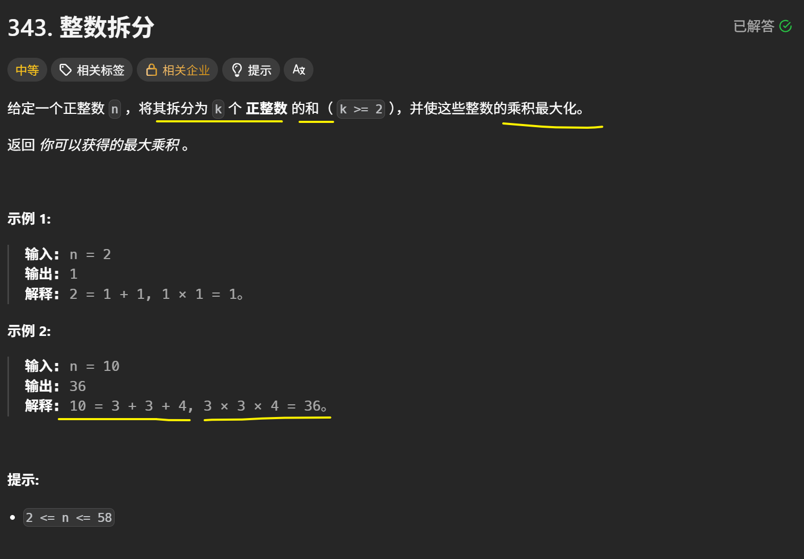
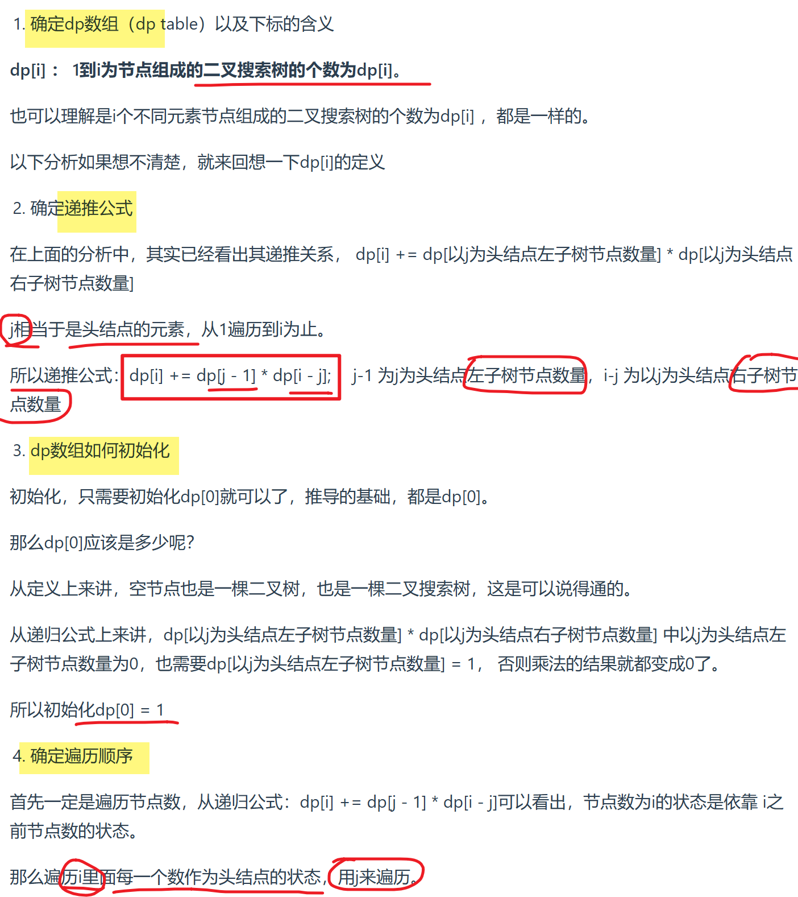
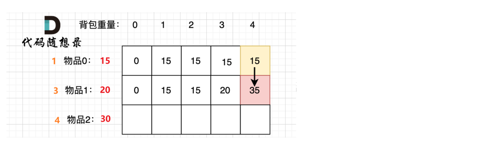

> from [代码随想录](https://programmercarl.com/)，和其他一些力扣题解区大神的题解

# 数组

## [27 移除元素（双指针）](https://leetcode.cn/problems/remove-element/description/)

~~~C++
class Solution {
public:
    int removeElement(vector<int>& nums, int val) {

        // 快慢指针

        int slow = 0;
        for (int fast = 0; fast < nums.size(); fast++)
        {
            if (nums[fast] != val)
            {
                // fast 对应的值 不等于val时，赋值给slow对应的位置
                nums[slow] = nums[fast];
                slow++;
            }
            // fast对应位置 = val时，不更新，slow不懂，fast++
        }

        return slow; // nums中不等于val的元素个数
    }
};
~~~

ACM

~~~C++
#include <iostream>
#include <vector>
using namespace std;

// 功能函数：移除元素 val，返回新长度
int removeElement(vector<int>& nums, int val) {
    int slow = 0;
    for (int fast = 0; fast < nums.size(); ++fast) {
        if (nums[fast] != val) {
            nums[slow++] = nums[fast];
        }
    }
    return slow;
}

int main() {
    int n, val;
    cin >> n >> val; // 输入数组大小和目标值
    vector<int> nums(n);

    for (int i = 0; i < n; ++i) {
        cin >> nums[i]; // 输入数组元素
    }

    int newLength = removeElement(nums, val);

    // 输出结果：移除目标值后的前 newLength 项
    for (int i = 0; i < newLength; ++i) {
        cout << nums[i] << " ";
    }
    cout << endl;

    return 0;
}

~~~

示例输入：

~~~C++
6 3
3 2 2 3 4 5
~~~

输出：

~~~C++
2 2 4 5
~~~

# 二分查找

## 704 [二分查找](https://leetcode.cn/problems/binary-search/)

注意区间的开闭！

~~~C++
class Solution {
public:
    int search(vector<int>& nums, int target) {
        int left = 0;
        int right = nums.size() - 1;// 定义target在左闭右闭的区间里 [left, right]

        while (left <= right) {
            int mid = left + ((right - left) / 2);// 防止溢出，等同于(left + right)/2
            // target在左区间
            if (nums[mid] > target) {
                right = mid - 1; // [left, mid - 1]
            }
            // target在右区间
            else if (nums[mid] < target) {
                left = mid + 1; // [mid + 1, right]
            }
            // nums[mid] = target 找到目标值
            else {
                return mid;
            }
        }

        return -1; // 未找到目标值
    }
};
~~~

acm：

~~~C++
#include <iostream>
#include <vector>
using namespace std;

int search(vector<int>& nums, int target)
{
	int left = 0;
	int right = nums.size();

	while (left <= right)
	{
		int mid = left + ((right - left) / 2);
		if (nums[mid] > target) {
			right = mid - 1; // [left, mid - 1]
		}
		else if (nums[mid] < target) {
			left = mid + 1; // [mid + 1, right]
		} 
		else {
            return mid;
		}
	}

	return -1;

} 

int main() 
{ 
	int n, target; // 数组长度n， 目标值target
	// 输入数组长度，目标值
	cin >> n >> target; 

	vector<int> nums(n);
	// 输入数组
    for (int i = 0; i < n; i++) {
		cin >> nums[i];
	}

	int result = search(nums, target);
    cout << result << endl;

	return 0;
}
~~~

示例输入：

~~~C++
6 9
-1 0 3 5 9 12
~~~

示例输出：

~~~C++
4
~~~

## 162 [寻找峰值](https://leetcode.cn/problems/find-peak-element/description/)

**主要思路：中点二分，找上坡，收缩范围，最后left停在峰顶**

**1、为什么找上坡？**

**数组两边都是负无穷，中间一定存在一个山峰，找上坡，上坡一直一定会有山峰**

**2、为什么最后一个数不纳入二分范围？**

>  注意：「答案所在的范围」和「二分的范围」是两个概念
>
>  最后一个数只是不在二分区间里了，不代表不在nums找的区间里了

最后一个数肯定是【峰值or峰值右侧】，也就是目标值的右侧，可以直接分成到峰值右侧，二分范围的外面

同时，如果有且仅有一个峰值，且就是最后一个数的话(下标 n−1)，闭区间right从n-1开始会导致mid+1 数组越界

~~~C++
class Solution {
public:
    int findPeakElement(vector<int>& nums) {

        int left = 0;
        int right = nums.size() - 2;

        while (left <= right)
        {
            int mid = left + ((right - left) / 2);
            if (nums[mid] > nums[mid + 1]) // 说明mid是峰顶 或者 峰顶在mid左侧
            {
                right = mid - 1;// 向左缩小范围，找上坡
            }
            else // nums[mid] <= nums[mid + 1]  说明峰顶在mid右侧
            {
                left = mid + 1; // 向右缩小范围，找上坡
            }

        }

        return left; // 最后left停在峰顶
        
    }
};
~~~

# 前缀和

## 303 [区域和检索 - 数组不可变](https://leetcode.cn/problems/range-sum-query-immutable/description/)

~~~C++
class NumArray {
    vector<int> s;

public:
    NumArray(vector<int>& nums) {
        s.resize(nums.size() + 1);
        for (int i = 0; i < nums.size(); i++)
        {
            s[i + 1] = s[i] + nums[i]; // 前缀和
        }
    }
    
    int sumRange(int left, int right) {
        return s[right + 1] - s[left];// nums中 [left, right] 部分的和        
    }
};

/**
 * Your NumArray object will be instantiated and called as such:
 * NumArray* obj = new NumArray(nums);
 * int param_1 = obj->sumRange(left,right);
 */
~~~

# 链表

## 链表结构

~~~C++
struct ListNode {
    int val;
    ListNode *next;
    ListNode(int x) : val(x), next(nullptr) {}
};
~~~

## [92 反转链表II](https://leetcode.cn/problems/reverse-linked-list-ii/description/)

~~~C++
/**
 * Definition for singly-linked list.
 * struct ListNode {
 *     int val;
 *     ListNode *next;
 *     ListNode() : val(0), next(nullptr) {}
 *     ListNode(int x) : val(x), next(nullptr) {}
 *     ListNode(int x, ListNode *next) : val(x), next(next) {}
 * };
 */
class Solution {
public:
    ListNode* reverseBetween(ListNode* head, int left, int right) {

        ListNode* dummyHead = new ListNode(0);
        dummyHead->next = head;

        // p0 指向 left 前一个
        ListNode* p0 = dummyHead;
        for (int i = 0; i < left - 1; i++)
        {
            p0 = p0->next; // 移动到left前一个
        }

        // 反转 [left, right] 部分 
        ListNode* pre = nullptr;
        ListNode* cur = p0->next;
        for (int i = 0; i < right - left + 1; i++) // 206 普通反转
        {
            ListNode* tmp = cur->next;
            cur->next = pre;
            pre = cur;
            cur = tmp;
        }

        // 最后 cur 指向反转部分的下一个节点（尾部）
        // pre 指向反转部分的头节点，即原right

        // 连接头尾
        p0->next->next = cur;
        p0->next = pre;

        return dummyHead->next;
        
    }
};
~~~

- 时间复杂度：O(*right*)
- 空间复杂度：O(1)

## [876 链表的中间结点](https://leetcode.cn/problems/middle-of-the-linked-list/description/)

@快慢指针

~~~C++
/**
 * Definition for singly-linked list.
 * struct ListNode {
 *     int val;
 *     ListNode *next;
 *     ListNode() : val(0), next(nullptr) {}
 *     ListNode(int x) : val(x), next(nullptr) {}
 *     ListNode(int x, ListNode *next) : val(x), next(next) {}
 * };
 */
class Solution {
public:
    ListNode* middleNode(ListNode* head) {

        ListNode* slow = head;
        ListNode* fast = head;

        while (fast && fast->next) 
        {
            // fast走2步，slow走1步
            fast = fast->next->next;
            slow = slow->next; // slow 停在中间节点
        }

        return slow;
        
    }
};
~~~

如果最后while条件是

~~~C++
while (fast->next && fast->next->next)
~~~

slow会停在mid的前一个

## 146 [LRU缓存](https://leetcode.cn/problems/lru-cache/description/?envType=study-plan-v2&envId=top-100-liked)

~~~C++
// 构造双向链表（存key，value，前后向指针）
// 删除节点 remove() + 最上面添加节点 push_front() + 抽出key节点，移到头部 get_node()

class Node // 构造双向链表
{
public:
    int key;
    int value;
    Node* prev;
    Node* next;

    Node(int k = 0, int v = 0) : key(k), value(v) {}
};

class LRUCache {
private:
    int capacity;
    Node* dummy; 
    unordered_map<int, Node*> key_to_node; // <key, node>

    // 删除一个节点（抽出一本书）
    void remove(Node* x)
    {
        x->prev->next = x->next;
        x->next->prev = x->prev; 
    }

    // 插入节点到链表头部（dummy后面）（把一本书放在最上面）
    void push_front(Node* x)
    {
        x->prev = dummy;
        x->next = dummy->next;
        x->prev->next = x;
        x->next->prev = x;
    }

    // 获取 key 对应的节点返回，并移到链表头部（抽出一本书放在最上面）
    Node* get_node(int key)
    {
        auto it = key_to_node.find(key);

        // 没有这本书
        if (it == key_to_node.end())    return nullptr; 

        // 有这本书
        Node* node = it->second; 
        remove(node);     // 抽出这本书
        push_front(node); // 放在最上面

        return node;
    }

public:
    LRUCache(int capacity) 
        : capacity(capacity), dummy(new Node())
    {
        dummy->prev = dummy;
        dummy->next = dummy;// 初始都指向自己
    }
    

    int get(int key) {
        // 如果关键字 key 存在于缓存中，则返回关键字的值，否则返回 -1 
        Node* node = get_node(key);
        return node ? node->value : -1;
    }
    
    
    void put(int key, int value) {
        // 如果关键字 key 已经存在，则变更其数据值 value 
        // 如果不存在，则向缓存中插入该组 key-value 
        // 如果插入操作导致关键字数量超过 capacity ，则应该 逐出 最久未使用的关键字
        
        Node* node = get_node(key);// get_node 会把对应节点移到链表头部
        // 节点存在，更新value，移到头部（有这本书）
        if (node) 
        {
            node->value = value; 
            return;
        }

        // 节点不存在，创建新节点插入头部（新书）
        Node* newnode = new Node(key, value);
        key_to_node[key] = newnode;
        push_front(newnode); 

        // 节点插入后，容量爆了，移除最后节点（移除最下面的书）
        if (key_to_node.size() > capacity) 
        {
            Node* back_node = dummy->prev; // 环形双向链表，直接找到最下面节点
            
            key_to_node.erase(back_node->key); // map中删除 <key, back_node>
            remove(back_node); 				   // 链表删除节点
            
            delete back_node; // 释放内存
        }
    }
    
};

/**
 * Your LRUCache object will be instantiated and called as such:
 * LRUCache* obj = new LRUCache(capacity);
 * int param_1 = obj->get(key);
 * obj->put(key,value);
 */
~~~

- 时间复杂度：所有操作均为 O(1)。
- 空间复杂度：O(min(*p*,*capacity*))，其中 *p* 为 put 的调用次数。

# 哈希

# 字符串

# 滑动窗口

# 双指针

# 栈和队列

## [239 滑动窗口最大值](https://leetcode.cn/problems/sliding-window-maximum/description/?envType=study-plan-v2&envId=top-100-liked)

@单调队列

~~~C++
class Solution {
private:
    // deque实现单调队列 从大到小
    class MyQueue
    {
    public:
        deque<int> que; // 使用deque实现单调队列

        // push
        void push(int value)
        {
            // 即将放进que的value > back入口数值，就将que后端的数值弹出，直到value < 入口
            // 保证队列前面都是比value大的值，才能从大到小
            while (!que.empty() && value > que.back())  que.pop_back();
            que.push_back(value);
        }

        // pop
        void pop(int value)
        {
            // 每次pop比较要弹出的数值，是否等于que出口的数值，如果相等则弹出
            if (!que.empty() && value == que.front())   que.pop_front();
        }

        // getMaxvalue 查询当前队列里的最大值，直接返回que的front
        int getMax()
        {
            return que.front();
        }
    };

public:
    vector<int> maxSlidingWindow(vector<int>& nums, int k) {

        vector<int> result;

        MyQueue que; // 创建单调队列
        
        // 前k个元素（第一个窗口）放入que
        for (int i = 0; i < k; i++)
        {
            que.push(nums[i]); // push的时候已经保证了单调
        }
        result.push_back(que.getMax()); // result 记录第一个窗口最大值

        // 继续计算后面的窗口
        for (int i = k; i < nums.size(); i++)
        {
            que.pop(nums[i - k]); // 移动窗口，pop出que中当前窗口的第一个元素
            que.push(nums[i]); // 新元素push进新窗口

            result.push_back(que.getMax()); // 记录当前窗口内的最大值
        }
        
        return result;
        
    }
};
~~~

ACM

~~~C++
#include <iostream>
#include <deque>
#include <vector>

using namespace std;

// 单调队列类
class MyQueue
{
public:
    deque<int> que;
    
    // push 保证从大到小
    void push(int value)
    {
        while (!que.empty() && value > que.back()) // 如果value > que.back() 就弹出原来较小的back
        {
            que.pop_back();
        }
        que.push_back(value); // 新值放进去，队列前面是比value大的值，才能从大到小
    }

    // pop 窗口滑出元素与队头相等时弹出
    void pop(int value)
    {
        if (!que.empty() && value == que.front())
        {
            que.pop_front();
        }
    }

    // getMax 返回当前窗口的最大值（就是队列的front）
    int getMax()
    {
        return que.front();
    }

};

// 返回滑动窗口中的最大值
vector<int> maxSlidingWindow(const vector<int>& nums, int k)
{
    vector<int> result;
    MyQueue que;

    // 初始化前k个元素（第一个窗口）
    for (int i = 0; i < k; i++)
    {
        que.push(nums[i]);
    }
    result.push_back(que.getMax());

    // 开始滑动窗口
    for (int i = k; i < nums.size(); i++)
    {
        que.pop(nums[i - k]);
        que.push(nums[i]);
        result.push_back(que.getMax());
    }

    return result;
}

int main()
{
    int n, k;
    cin >> n >> k; // 输入nums元素个数，和窗口大小k

    vector<int> nums(n);
    for (int i = 0; i < n; i++)
    {
        cin >> nums[i]; // 输入nums元素
    }

    vector<int> ans = maxSlidingWindow(nums, k);
    for (int x : ans)
    {
        cout << x << " ";
    }
    cout << endl;

    return 0;
}
~~~

示例输入：

~~~C++
8 3 
1 3 -1 -3 5 3 6 7
~~~

输出：

~~~C++
3 3 5 5 6 7 
~~~

## 480 [滑动窗口和中位数](https://leetcode.cn/problems/sliding-window-median/description/)

# 堆

# 二叉树

## 二叉树结构

~~~C++
struct TreeNode
{
    int val;
    TreeNode* left;
    TreeNode* right;
    TreeNode(int x) : val(x), left(nullptr), right(nullptr) {}
};

// 层序遍历（用于输出）
vector<int> levelOrder(TreeNode* root) 
{
    vector<int> result;
    if (!root) return result;

    queue<TreeNode*> q;
    q.push(root);

    while (!q.empty()) {
        TreeNode* node = q.front(); 
        q.pop();
        result.push_back(node->val);

        if (node->left)  q.push(node->left);
        if (node->right) q.push(node->right);
    }

    return result;
}

int main()
{
    // 构造树
    TreeNode* root = new TreeNode(-10);
    root->left = new TreeNode(9);
    root->right = new TreeNode(20);

    root->right->left = new TreeNode(15);
    root->right->right = new TreeNode(7);
    
    
    // ... 题目函数处理
    
    
    vector<int> output = levelOrder(root);
    // 输出
    for (auto val : output)
    {
        cout << val << " ";
    }
    
    return 0;    
}
~~~

## [144 前序遍历](https://leetcode.cn/problems/binary-tree-preorder-traversal/description/)

### 递归

~~~C++
/**
 * Definition for a binary tree node.
 * struct TreeNode {
 *     int val;
 *     TreeNode *left;
 *     TreeNode *right;
 *     TreeNode() : val(0), left(nullptr), right(nullptr) {}
 *     TreeNode(int x) : val(x), left(nullptr), right(nullptr) {}
 *     TreeNode(int x, TreeNode *left, TreeNode *right) : val(x), left(left), right(right) {}
 * };
 */
class Solution {
public:
    // 递归
    void traversal(TreeNode* cur, vector<int>& vec)
    {
        // 终止条件
        if (cur == nullptr) return;

        // 单层逻辑
        vec.push_back(cur->val);    // 中
        traversal(cur->left, vec);  // 左
        traversal(cur->right, vec); // 右
    }

    vector<int> preorderTraversal(TreeNode* root) {

        vector<int> result;
        traversal(root, result);

        return result;    
    }
};
~~~

时间复杂度：O(n)，其中 n 是二叉树的节点数。每一个节点恰好被遍历一次。

空间复杂度：O(n)，为递归过程中栈的开销，平均情况下为 O(logn)，最坏情况下树呈现链状，为 O(n)。

### 迭代

~~~C++
class Solution {
public:
    vector<int> preorderTraversal(TreeNode* root) {
        vector<int> result;
        if (root == nullptr)    return result;

        stack<TreeNode*> st;
        st.push(root);
        while (!st.empty())
        {
            TreeNode* node = st.top(); // 中
            st.pop();
            result.push_back(node->val); // 收集

            // 先入右，后入左，这样出栈正好是 中-左-右
            if (node->right)    st.push(node->right);   // 右
            if (node->left)     st.push(node->left);    // 左
        }

        return result;     
    }
};
~~~

### ACM

~~~C++
#include <iostream>
#include <vector>
using namespace std;

// 144 二叉树前序遍历

// 结构树
struct TreeNode
{
    int val;
    TreeNode* left;
    TreeNode* right;
    TreeNode(int x) : val(x), left(nullptr), right(nullptr) {}
};

// 递归前序遍历 中-左-右
void preorderTraversal(TreeNode* cur, vector<int>& vec)
{
    if (!cur)   return;

    vec.push_back(cur->val);            // 中
    preorderTraversal(cur->left, vec);  // 左
    preorderTraversal(cur->right, vec); // 右
}

int main()
{
    // 构建如下二叉树：
    //           1
    //         /   \
    //        2     3
    //       / \     \
    //      4   5     8
    //         / \   /
    //        6   7 9

    TreeNode* root = new TreeNode(1);
    root->left = new TreeNode(2);
    root->right = new TreeNode(3);

    root->left->left = new TreeNode(4);
    root->left->right = new TreeNode(5);
    root->left->right->left = new TreeNode(6);
    root->left->right->right = new TreeNode(7);

    root->right->right = new TreeNode(8);
    root->right->right->left = new TreeNode(9);

    vector<int> result;
    preorderTraversal(root, result); // 1 2 4 5 6 7 3 8 9 

    // 输出
    for (int val : result)
    {
        cout << val << " ";
    }
    cout << endl;

    return 0;
}

~~~

## 145 后序遍历

### 递归

~~~C++
/**
 * Definition for a binary tree node.
 * struct TreeNode {
 *     int val;
 *     TreeNode *left;
 *     TreeNode *right;
 *     TreeNode() : val(0), left(nullptr), right(nullptr) {}
 *     TreeNode(int x) : val(x), left(nullptr), right(nullptr) {}
 *     TreeNode(int x, TreeNode *left, TreeNode *right) : val(x), left(left), right(right) {}
 * };
 */
class Solution {
public:
    // 递归
    void traversal(TreeNode* cur, vector<int>& vec)
    {
        if (cur == nullptr) return;

        traversal(cur->left, vec);  // 左
        traversal(cur->right, vec); // 右
        vec.push_back(cur->val);    // 中
    }

    vector<int> postorderTraversal(TreeNode* root) {
        vector<int> result;
        traversal(root, result);

        return result;
        
    }
};
~~~

### 迭代

~~~C++
class Solution {
public:
    vector<int> postorderTraversal(TreeNode* root) {

        vector<int> result;
        if (root == nullptr)    return result;

        stack<TreeNode*> st;
        st.push(root);
        while (!st.empty())
        {
            TreeNode* node = st.top(); // 中
            st.pop();
            result.push_back(node->val);

            // 先入左，后入右，出栈正好是 中--右--左
            if (node->left)     st.push(node->left);
            if (node->right)    st.push(node->right);
        }

        // 出栈是 中--右--左，反转是 左--右--中
        reverse(result.begin(), result.end());
        
        return result;
    }
};
~~~

### ACM 

~~~C++
#include <iostream>
#include <vector>
using namespace std;

// 145 二叉树后序遍历

// 结构树
struct TreeNode
{
    int val;
    TreeNode* left;
    TreeNode* right;
    TreeNode(int x) : val(x), left(nullptr), right(nullptr) {}
};

// 递归后序遍历 左-右-中
void postorderTraversal(TreeNode* cur, vector<int>& vec)
{
    if (cur == nullptr) return;

    postorderTraversal(cur->left, vec);  // 左
    postorderTraversal(cur->right, vec); // 右
    vec.push_back(cur->val);             // 中
}

int main()
{
    // 构建如下二叉树：
    //           1
    //         /   \
    //        2     3
    //       / \     \
    //      4   5     8
    //         / \   /
    //        6   7 9

    TreeNode* root = new TreeNode(1);
    root->left = new TreeNode(2);
    root->right = new TreeNode(3);

    root->left->left = new TreeNode(4);
    root->left->right = new TreeNode(5);
    root->left->right->left = new TreeNode(6);
    root->left->right->right = new TreeNode(7);

    root->right->right = new TreeNode(8);
    root->right->right->left = new TreeNode(9);

    vector<int> result;
    postorderTraversal(root, result); // 4 6 7 5 2 9 8 3 1 

    // 输出
    for (int val : result)
    {
        cout << val << " ";
    }
    cout << endl;

    return 0;
}
~~~

## [94 中序遍历](https://leetcode.cn/problems/binary-tree-inorder-traversal/?envType=study-plan-v2&envId=top-100-liked)

### 递归

~~~C++
/**
 * Definition for a binary tree node.
 * struct TreeNode {
 *     int val;
 *     TreeNode *left;
 *     TreeNode *right;
 *     TreeNode() : val(0), left(nullptr), right(nullptr) {}
 *     TreeNode(int x) : val(x), left(nullptr), right(nullptr) {}
 *     TreeNode(int x, TreeNode *left, TreeNode *right) : val(x), left(left), right(right) {}
 * };
 */
class Solution {
public:
    // 递归
    void traversal(TreeNode* cur, vector<int>& vec)
    {
        if (cur == nullptr) return;

        traversal(cur->left, vec);  // 左
        vec.push_back(cur->val);    // 中
        traversal(cur->right, vec); // 右
    }

    vector<int> inorderTraversal(TreeNode* root) {
        
        vector<int> result;
        traversal(root, result);

        return result;
        
    }
};
~~~

### 迭代

画图吧！！！

~~~C++
class Solution {
public:
    vector<int> inorderTraversal(TreeNode* root) {

        vector<int> result;

        stack<TreeNode*> st;
        TreeNode* cur = root;

        while (cur || !st.empty())
        {
            if (cur)
            {
                // 指针来访问节点，节点放入栈，先左边，一直到左边最底层
                st.push(cur);
                cur = cur->left;
            }
            else // cur = nullptr 走到左边最低
            {
                cur = st.top(); // 要处理的节点
                st.pop();

                // 当前节点值放进result
                result.push_back(cur->val); // 中
                
                // 转向当前节点的右节点
                cur = cur->right;           // 右
            }
        }

        return result;        
    }
};
~~~

### ACM

~~~C++
#include <iostream>
#include <vector>
using namespace std;

// 93 二叉树中序遍历

// 结构树
struct TreeNode
{
    int val;
    TreeNode* left;
    TreeNode* right;
    TreeNode(int x) : val(x), left(nullptr), right(nullptr) {}
};

// 递归中序遍历 左-中-右
void inorderTraversal(TreeNode* cur, vector<int>& vec)
{
    if (!cur)   return;

    inorderTraversal(cur->left, vec);  // 左
    vec.push_back(cur->val);           // 中
    inorderTraversal(cur->right, vec); // 右
}

int main()
{
    // 构建如下二叉树：
    //           1
    //         /   \
    //        2     3
    //       / \     \
    //      4   5     8
    //         / \   /
    //        6   7 9

    TreeNode* root = new TreeNode(1);
    root->left = new TreeNode(2);
    root->right = new TreeNode(3);

    root->left->left = new TreeNode(4);
    root->left->right = new TreeNode(5);
    root->left->right->left = new TreeNode(6);
    root->left->right->right = new TreeNode(7);

    root->right->right = new TreeNode(8);
    root->right->right->left = new TreeNode(9);

    vector<int> result;
    inorderTraversal(root, result); // 4 2 6 5 7 1 3 9 8

    // 输出
    for (int val : result)
    {
        cout << val << " ";
    }
    cout << endl;

    return 0;
}

~~~

## [102 二叉树的层序遍历](https://leetcode.cn/problems/binary-tree-level-order-traversal/description/?envType=study-plan-v2&envId=top-100-liked)

~~~c++
/**
 * Definition for a binary tree node.
 * struct TreeNode {
 *     int val;
 *     TreeNode *left;
 *     TreeNode *right;
 *     TreeNode() : val(0), left(nullptr), right(nullptr) {}
 *     TreeNode(int x) : val(x), left(nullptr), right(nullptr) {}
 *     TreeNode(int x, TreeNode *left, TreeNode *right) : val(x), left(left), right(right) {}
 * };
 */
class Solution {
public:
    vector<vector<int>> levelOrder(TreeNode* root) {

        queue<TreeNode*> que; // 存放每层的节点

        vector<vector<int>> result;

        if (root)   que.push(root);
        while (!que.empty())
        {
            int size = que.size(); // 记录每层节点数，控制que里弹出的节点数
                                   // 一定用固定的size，因为que.size()是变化的
            
            vector<int> vec; // 存放当前层的数据

            // 开始输出这一层，以及传入新的左右节点
            for (int i = 0; i < size; i++)
            {
                // 当前节点处理，值放进vec
                TreeNode* node = que.front();
                que.pop();
                vec.push_back(node->val);

                // 传入当前node的左右节点
                if (node->left)     que.push(node->left);
                if (node->right)    que.push(node->right);
            }

            // 每层vec存入result
            result.push_back(vec);
        }

        return result;      
    }
};
~~~

ACM 

~~~c++
#include <iostream>
#include <vector>
#include <queue>

using namespace std;

// 102 二叉树的层序遍历
// 时间复杂度：O(n)
// 空间复杂度：O(n)

struct TreeNode
{
    int val;
    TreeNode* left;
    TreeNode* right;
    TreeNode(int x) : val(x), left(nullptr), right(nullptr) {}
};

vector<vector<int>> levelOrder(TreeNode* root)
{
    vector<vector<int>> result;

    queue<TreeNode*> que;
    if (root)   que.push(root);
    while (!que.empty())
    {
        int size = que.size();
        vector<int> vec;

        for (int i = 0; i < size; i++)
        {
            TreeNode* node = que.front();
            que.pop();
            vec.push_back(node->val);

            if (node->left)     que.push(node->left);
            if (node->right)    que.push(node->right);
        }

        result.push_back(vec);
    }

    return result;
}

int main()
{
    TreeNode* root = new TreeNode(3);
    root->left = new TreeNode(9);
    root->right = new TreeNode(20);

    root->right->left = new TreeNode(15);
    root->right->right = new TreeNode(7);

    vector<vector<int>> result = levelOrder(root);
    for (const auto& level : result)
    {
        for (int val : level)
        {
            cout << val << " ";
        }
        cout << endl;
    }

    return 0;
}
~~~

输出：

~~~c++
3
9 20
15 7
~~~

## 二叉搜索树

左小右大

## [106 从中序与后序遍历构造二叉树](https://leetcode.cn/problems/construct-binary-tree-from-inorder-and-postorder-traversal/description/)

**构造树一般采用的是前序遍历**，先构造中间节点，然后递归构造左子树和右子树

~~~C++
/**
 * Definition for a binary tree node.
 * struct TreeNode {
 *     int val;
 *     TreeNode *left;
 *     TreeNode *right;
 *     TreeNode() : val(0), left(nullptr), right(nullptr) {}
 *     TreeNode(int x) : val(x), left(nullptr), right(nullptr) {}
 *     TreeNode(int x, TreeNode *left, TreeNode *right) : val(x), left(left), right(right) {}
 * };
 */
class Solution {
public:

    TreeNode* traversal(vector<int>& inorder, vector<int>& postorder)
    {
        if (postorder.size() == 0)  return nullptr;

        // 后序数组的最后一个数字，就是当前根节点
        int rootValue = postorder[postorder.size() - 1];
        TreeNode* root = new TreeNode(rootValue);

        if (postorder.size() == 1)  return root; // 叶子节点

        
        int delimiterIndex = 0; // 找中序数组的切割点
        for (delimiterIndex = 0; delimiterIndex < inorder.size(); delimiterIndex++)
        {
            if (inorder[delimiterIndex] == rootValue)   break;
        }

        // 切割中序 —— 左树数组 | 中 | 右树数组
        // 左闭右开 [0, delimiterIndex)
        vector<int> leftInorder(inorder.begin(), inorder.begin() + delimiterIndex);
        vector<int> rightInorder(inorder.begin() + delimiterIndex + 1, inorder.end());

        
        postorder.resize(postorder.size() - 1); // postorder 舍弃末尾数字

        // 切割后序 —— 左树数组 | 右树数组
        // 使用 左中序 数组大小作为切割点 [0, delimiterIndex)
        vector<int> leftPostorder(postorder.begin(), postorder.begin() + leftInorder.size());
        vector<int> rightPostorder(postorder.begin() + leftInorder.size(), postorder.end());

        // 递归
        root->left = traversal(leftInorder, leftPostorder);
        root->right = traversal(rightInorder, rightPostorder);

        return root;
    }

    TreeNode* buildTree(vector<int>& inorder, vector<int>& postorder) {

        if (inorder.size() == 0 || postorder.size() == 0)   return nullptr;
        return traversal(inorder, postorder);
        
    }
};
~~~

~~~C++
class Solution {
private:
    // 中序区间 [inorderBegin, inorderEnd]   后序区间 [postorderBegin, postorderEnd]
    // 递归更新区间
    TreeNode* traversal(vector<int>& inorder, int inorderBegin, int inorderEnd,
                        vector<int>& postorder, int postorderBegin, int postorderEnd) {
        
        if (postorderBegin == postorderEnd)  return nullptr;
        
        // 后序遍历数组中最后一个数字，就是当前的根节点
        int rootValue = postorder[postorderEnd - 1];
        TreeNode* root = new TreeNode(rootValue);// 根节点

        if (postorderEnd - postorderBegin == 1)  return root; // 叶子节点

        // 找中序的切割点
        int delimiterIndex;
        for (delimiterIndex = inorderBegin; delimiterIndex < inorderEnd; delimiterIndex++) {
            if (inorder[delimiterIndex] == rootValue)   break;
        }
        
        // 切割中序 —— 左树数组 | 中 | 右树数组
        // 左中序   [leftInorderBegin, leftInorderEnd)
        int leftInorderBegin = inorderBegin;
        int leftInorderEnd = delimiterIndex;
        // 右中序   [rightInorderBegin, rightInorderEnd)
        int rightInorderBegin = delimiterIndex + 1;
        int rightInorderEnd = inorderEnd;

        // 切割后序 —— 左树数组 | 右树数组 | 中
        // 使用 左中序 数组大小作为切割点
        // 左后序  [leftPostorderBegin, leftPostorderEnd)
        int leftPostorderBegin = postorderBegin;
        int leftPostorderEnd = postorderBegin + (delimiterIndex - inorderBegin);
        // 右后序  [rightPostorderBegin, rightPostorderEnd)
        int rightPostorderBegin = postorderBegin + (delimiterIndex - inorderBegin);
        int rightPostorderEnd = postorderEnd - 1;// 排除最后一个元素，已经作为节点了

        // 递归
        root->left = traversal(inorder, leftInorderBegin, leftInorderEnd, 
                               postorder, leftPostorderBegin, leftPostorderEnd);
        root->right = traversal(inorder, rightInorderBegin, rightInorderEnd,
                                postorder, rightPostorderBegin, rightPostorderEnd);

        return root;
    }
    
public:
    TreeNode* buildTree(vector<int>& inorder, vector<int>& postorder) {
        
        if (inorder.size() == 0 || postorder.size() == 0)   return nullptr;
        // 左闭右开
        return traversal(inorder, 0, inorder.size(), postorder, 0, postorder.size());
    }
};
~~~

# 回溯

**回溯是递归的副产品，只要有递归，就会有回溯**

**回溯法解决的问题：==在集合中查找子集==**

> **注意：组合无序，排列有序**

回溯法解决的问题都可以**抽象成树结构**

- 集合的大小 -- 树的宽度
- 递归的深度 -- 树的深度

**回溯法模板**

- **函数返回值和参数**

  - 返回值一般为 void

  - 参数，一般先写逻辑，需要什么参数再填

    ~~~C++
    void backtracking(参数)
    ~~~

- **终止条件**

  - 一般到达树的叶子节点，就找到了满足条件的一个答案，存起来，然后结束本层递归

    ~~~C++
    if (终止条件：叶子节点)
    {
        存放结果;
        return;
    }
    ~~~

- **回溯搜索的遍历过程（遍历树）**

  

  for 循环就是遍历集合区间，可以理解为一个节点有多少个孩子，这个for循环就执行几次

  > for 循环是横向遍历，递归backtracking是纵向

  ~~~C++
  for (选择：本层集合中的元素（树中节点孩子的数量就是集合的大小）)
  {
      处理节点;
      backtracking(路径，选择列表); // 递归
      撤销处理结果; // 回溯
  }
  ~~~

  

**整体模版：**

~~~C++
void backtracking(参数)
{
    if (终止条件：叶子节点)
    {
        存放结果;
        return;
    }
    
    for (选择：本层集合中的元素（树中节点孩子的数量就是集合的大小）)
    {
        处理节点;
        backtracking(路径，选择列表); // 递归
        撤销处理结果; // 回溯
    }
}
~~~

### 77 [组合](https://leetcode.cn/problems/combinations/description/)

### 回溯

**构造树：比如 n = 4, k = 2**

~~~C++
class Solution {
public:
    vector<int> path; // 单次符合条件的结果
    vector<vector<int>> result; // 收集所有结果

    void backtracking(int n, int k, int statIndex)
    {
        // 终止条件，path大小为k
        if (path.size() == k)
        {
            result.push_back(path); // 收集这次结果
            return; // 返回
        }

        // 单层逻辑
        for (int i = statIndex; i <= n; i++)
        {
            path.push_back(i); // 处理节点
            backtracking(n, k, i + 1); // 递归，从 i + 1 开始
            path.pop_back(); // 回溯
        }
    }

    vector<vector<int>> combine(int n, int k) {

        result.clear();// 可以不写
        path.clear();  // 可以不写

        backtracking(n, k, 1);
        return result;
        
    }
};
~~~

### 回溯剪枝

> 剪枝就是从遍历条件里减去那些肯定不会符合要求的路线

~~~C++
class Solution {
public:
    vector<int> path; 
    vector<vector<int>> result;

    void backtracking(int n, int k, int statIndex)
    {
        if (path.size() == k)
        {
            result.push_back(path); 
            return; 
        }
        
        for (int i = statIndex; i <= n - (k - path.size()) + 1; i++) // 剪枝
        {
            path.push_back(i); 
            backtracking(n, k, i + 1);
            path.pop_back(); 
        }
    }

    vector<vector<int>> combine(int n, int k) {
        result.clear();
        path.clear();  

        backtracking(n, k, 1);
        return result;     
    }
};
~~~

# 贪心

## 买卖股票

### [121 买卖股票的最佳时机](https://leetcode.cn/problems/best-time-to-buy-and-sell-stock/description/?envType=study-plan-v2&envId=top-100-liked)

**只能买卖一次，一次交易**

~~~C++
class Solution {
public:
    int maxProfit(vector<int>& prices) {

        // prices[i] 股票第 i 天的价格
        int low = prices[0];
        int result = 0;
        for (int i = 0; i < prices.size(); i++)
        {
            low = min(low, prices[i]); // 取最左最小价格
            result = max(result, prices[i] - low); // 直接取最大差
        }

        return result;
    }
};
~~~

### [122 买卖股票的最佳时机 II](https://leetcode.cn/problems/best-time-to-buy-and-sell-stock-ii/description/)

> **121 是只能买卖一次，122 是可以买卖多次，获取多次利润**

~~~C++
class Solution {
public:
    int maxProfit(vector<int>& prices) {
        // 利润拆成每天减前一天的差值，只收集正利润 
        
        // 只需要最终利润，不需要知道具体哪天买卖的

        int result = 0;
        for (int i = 1; i < prices.size(); i++)
        {
            result += max(prices[i] - prices[i - 1], 0); // 只加正利润
        }

        return result;   
    }
};
~~~

# 动态规划DP

**动态规划** **DP** -- Dynamic Programming

- 如果某问题有很多**重叠子问题**，使用动态规划是最有效的
- **每一个状态，由上一个状态推导**出来

 

**解题步骤：**

- 确定dp数组，以及下标的意义
- 确定递推公式
- dp数组如何初始化
- 确定遍历顺序
- 举例推导dp数组

 

**主要题目：**

- 基础问题
- 背包
- 打家劫舍
- 股票
- 子序列

## 509 [斐波那契数](https://leetcode.cn/problems/fibonacci-number/description/)

### 递归

~~~C++
class Solution {
public:
    int fib(int n) {
        // 递归
        if (n < 2)  return n;
        return fib(n - 1) + fib(n - 2);
        
    }
};
~~~

### 动归

~~~C++
class Solution {
public:
    int fib(int n) {
        
        if (n <= 1) return n;

        // dp 数组 dp[i] 第i个斐波那契数
        vector<int> dp(n + 1); 

        // 初始化
        dp[0] = 0;
        dp[1] = 1;

        // 遍历
        for (int i = 2; i <= n; i++)
        {
            dp[i] = dp[i - 1] + dp[i - 2];
        }

        return dp[n];
    }
};
~~~

优化：`dp[]`只维护两个数

~~~C++
class Solution {
public:
    int fib(int n) {
        
        if (n <= 1) return n;

        vector<int> dp(2); // dp只维护2个数值，不需要记录整个序列

        dp[0] = 0;
        dp[1] = 1;

        // 遍历
        for (int i = 2; i <= n; i++)
        {
            int sum = dp[0] + dp[1];
            dp[0] = dp[1];
            dp[1] = sum;
        }

        return dp[1];
    }
};
~~~

## 62 [不同路径](https://leetcode.cn/problems/unique-paths/description/)

~~~C++
class Solution {
public:
    int uniquePaths(int m, int n) {

        // dp[i][j]: 从(0,0)到(i,j)一共有dp[i][j]条路径
        vector<vector<int>> dp(m, vector<int>(n, 0));

        // 初始化  第一行和第一列需要初始化，都只有一条路径
        for (int i = 0; i < m; i++) dp[i][0] = 1;
        for (int j = 0; j < n; j++) dp[0][j] = 1;
        
        // 递推
        for (int i = 1; i < m; i++)
        {
            for (int j = 1; j < n; j++)
            {
                dp[i][j] = dp[i - 1][j] + dp[i][j - 1]; // 两个方向的路径数相加
            }
        }

        return dp[m - 1][n - 1];
    }
};
~~~

## 63 不同路径II

比 62、不同路径多了障碍判断条件

~~~C++
class Solution {
public:
    int uniquePathsWithObstacles(vector<vector<int>>& obstacleGrid) {
        int m = obstacleGrid.size();
        int n = obstacleGrid[0].size();

        // 如果起点或终点是障碍，直接返回0
        if (obstacleGrid[0][0] == 1 || obstacleGrid[m - 1][n - 1] == 1) return 0;

        
        // dp[i][j]: 从(0, 0)到(i, j)有dp[i][j]条路径
        vector<vector<int>> dp(m, vector<int>(n, 0));

        // 初始化首行首列为1，但遇到障碍就停止
        for (int i = 0; i < m && obstacleGrid[i][0] == 0; i++)  dp[i][0] = 1;
        for (int j = 0; j < n && obstacleGrid[0][j] == 0; j++)  dp[0][j] = 1;

        // 递推
        for (int i = 1; i < m; i++)
        {
            for (int j = 1; j < n; j++)
            {
                if (obstacleGrid[i][j] == 0) // 加条件，不是障碍才进行推导
                {
                    dp[i][j] = dp[i - 1][j] + dp[i][j - 1];
                }
            }
        }

        return dp[m - 1][n - 1];        
    }
};
~~~

## 343 [整数拆分](https://leetcode.cn/problems/integer-break/description/)

~~~C++
class Solution {
public:
    int integerBreak(int n) {

        // dp[i] 数字 i 拆分，可达到的最大乘积
        vector<int> dp(n + 1);

        // 初始化
        dp[2] = 1; // 题中说明 n >= 2

        for (int i = 3; i <= n; i++)
        {
            for (int j = 1; j < i - 1; j++) // j遍历到小于i的值
            {
                dp[i] = max(dp[i], max(j * (i - j), j * dp[i - j]));
            }
        }
        
        return dp[n];
    }
};
~~~

## 96 不同的二叉搜索树

~~~C++
class Solution {
public:
    int numTrees(int n) {

        // dp[i] - i 个不同元素（1 到 i）能组成二叉搜索树多少种
        vector<int> dp(n + 1);

        dp[0] = 1;

        for (int i = 1; i <= n; i++)
        {
            for (int j = 1; j <= i; j++)
            {
                dp[i] += dp[j - 1] * dp[i - j];
                // i个节点中，节点 j 作为头节点
                // 左树有 j - 1 个节点，右树有 i - j 个节点
            }
        }
        
        return dp[n];
    }
};
~~~

## 打家劫舍

递推：偷，和不偷（选和不选）

### 198 [打家劫舍](https://leetcode.cn/problems/house-robber/description/?envType=study-plan-v2&envId=top-100-liked)

~~~C++
class Solution {
public:
    int rob(vector<int>& nums) {

        if (nums.size() == 0)   return 0;
        if (nums.size() == 1)   return nums[0];

        // dp[i]: 考虑下标i（包括i）以内的房屋，最多可以偷窃的金额为dp[i]
        vector<int> dp(nums.size());

        dp[0] = nums[0];
        dp[1] = max(nums[0], nums[1]);

        for (int i = 2; i < nums.size(); i++)
        {
            // 决定dp[i]的因素 -- 第i间偷还是不偷
            dp[i] = max(dp[i - 2] + nums[i], // 偷第i间
                        dp[i - 1]); // 不偷第i间
        }

        return dp[nums.size() - 1];        
    }
};
~~~

ACM

~~~C++
#include <vector>
#include <iostream>
using namespace std;

// 198 打家劫舍

int rob(vector<int>& nums)
{
    if (nums.size() == 0)   return 0;
    if (nums.size() == 1)   return nums[0];

    // dp[i]: 考虑下标i（包括i）以内的房屋，最多可以偷窃的金额为dp[i]
    vector<int> dp(nums.size());

    dp[0] = nums[0];
    dp[1] = max(nums[0], nums[1]);

    for (int i = 2; i < nums.size(); i++)
    {
        // 决定dp[i]的因素 -- 第i间偷还是不偷
        dp[i] = max(dp[i - 2] + nums[i], // 偷第i间
                    dp[i - 1]); // 不偷第i间
    }

    return dp[nums.size() - 1];        
}

int main()
{
    vector<int> nums = {1, 2, 3, 1};
    int ans = rob(nums);
    cout << ans << endl;

    return 0;
}
~~~

## 01背包

### 理论

#### 二维dp\[i][j]

#### 一维dp[j]

### 416 [分割等和子集](https://leetcode.cn/problems/partition-equal-subset-sum/?envType=study-plan-v2&envId=top-100-liked)

@ 01背包

**注意：物品的重量和价值都是【元素数值】**

~~~C++
class Solution {
public:
    bool canPartition(vector<int>& nums) {

        int sum = 0;

        // 注意：物品的重量和价值都是【元素数值】

        // 背包的体积为 sum/2  -- 对应物品的重量是 元素数值
        // 物品的价值也是 元素数值

        // dp[j] 背包容量(能装的总重量)是j，放进物品后背包的最大重量为dp[j]
        vector<int> dp(10001, 0);

        for (int i = 0; i < nums.size(); i++)
        {
            sum += nums[i];
        }
        if (sum % 2 == 1)   return false;
        int target = sum / 2; // 找dp[target] == target

        // 递推填补dp
        for (int i = 0; i < nums.size(); i++) // 先物品
        {
            for (int j = target; j >= nums[i]; j--) // 后背包，从大到小
            {
                dp[j] = max(dp[j], dp[j - nums[i]] + nums[i]);
            }
        }

        // sum/2体积的背包，正好装了sum/2重量
        if (dp[target] == target)   return true; 
        
        return false;
    }
};
~~~

### 1049 最后一块石头的重量II

~~~C++
class Solution {
public:
    int lastStoneWeightII(vector<int>& stones) {

        // dp[j] 容量为j的背包，最多可以背的重量为dp[j]
        vector<int> dp(15001, 0);

        int sum = 0;
        for (int i = 0; i < stones.size(); i++)
        {
            sum += stones[i];
        }
        int target = sum / 2;

        // 递推
        for (int i = 0; i < stones.size(); i++)
        {
            for (int j = target; j >= stones[i]; j--)
            {
                dp[j] = max(dp[j], dp[j - stones[i]] + stones[i]);
            }
        }

        // 最后分成的两堆石头对撞，消去重叠的重量
        return (sum - dp[target]) - dp[target];
        
    }
};
~~~

### 494 目标和

## 完全背包

### 518 零钱对换II

### 377 组合总和IV

### 322 零钱兑换

### 279 [完全平方数](https://leetcode.cn/problems/perfect-squares/description/?envType=study-plan-v2&envId=top-100-liked)

@完全背包

~~~C++
class Solution {
public:
    int numSquares(int n) {

        // dp[j] 和为j的完全平方数的最少数量为dp[j]
        vector<uint64_t>  dp(n + 1, INT_MAX);

        dp[0] = 0;

        for (int i = 0; i * i <= n; i++) // 先物品（完全平方数 1,4,9,...）
        {
            for (int j = i * i; j <= n; j++) // 后背包
            {
                dp[j] = min(dp[j], dp[j - i * i] + 1); 
            }
        }

        return dp[n];        
    }
};
~~~

`uint64_t` 是 C++ 标准库中定义的 **无符号 64 位整数类型**，定义在头文件 `<cstdint>` 或 `<stdint.h>` 中。其取值范围为：

~~~C++
0 ~ 2^64 - 1 （即 0 ~ 18,446,744,073,709,551,615）
~~~

为什么 `dp` 要使用 `uint64_t`？**防止整型溢出**。

~~~C++
vector<uint64_t>  dp(n + 1, INT_MAX);
~~~

 `dp` 数组初始化时，每个元素都被设为 `INT_MAX`，而 `INT_MAX` 是一个 `int` 类型的最大值，即：

~~~C++
INT_MAX = 2,147,483,647
~~~

后续这行代码可能导致溢出:

~~~C++
dp[j] = min(dp[j], dp[j - i * i] + 1);
~~~

这里 `dp[j - i * i]` 的初始值可能是 `INT_MAX`，如果你再加上 `1`，就可能发生溢出：

~~~C++
INT_MAX + 1 ==> 溢出为负数（int 类型）
~~~

如果 `dp` 数组是 `int` 类型，`dp[j - i*i] + 1` 这一步可能变成负值，从而使 `dp[j]` 得到错误的最小值（变成负数的结果参与 `min()` 比较），导致最终答案错误。

而使用 `uint64_t`（更大范围的无符号整型）能有效避免这个溢出问题。

如果直接用`int`类型，需要加判断：

~~~C++
vector<int> dp(n + 1, INT_MAX);
// .......
if (dp[j - i * i] != INT_MAX)
    dp[j] = min(dp[j], dp[j - i * i] + 1);
~~~

使用 `uint64_t` 就相当于规避了这个判断逻辑，程序更简洁，**以空间换时间/逻辑复杂度**。

# 单调栈

# 位运算

## 136 只出现一次的数字

异或运算满足**交换律** a⊕b=b⊕a ，即以上运算结果与 nums 的元素顺序无关。

~~~C++
class Solution {
public:
    int singleNumber(vector<int>& nums) {
        
        // 异或 消除相同的数字

        int ans = 0;
        for (int val : nums)
        {
            ans ^= val; // 遍历nums 执行异或，最后留下的就是出现一次的数字
        }

        return ans;
    }
};
~~~

# 其他

## 169 [多数元素](https://leetcode.cn/problems/majority-element/description/?envType=study-plan-v2&envId=top-100-liked)

### 1、哈希表

~~~C++
class Solution {
public:
    int majorityElement(vector<int>& nums) {

        unordered_map<int, int> counts;// 存储每个元素出现的次数
        
        int majority = 0; // 出现最多的元素
        int cnt = 0;      // 出现最多的次数

        for (int num : nums)
        {
            counts[num]++; // 计数
            if (counts[num] > cnt)
            {
                majority = num;
                cnt = counts[num];
            }
        }

        return majority;        
    }
};
~~~

时间复杂度：O(n)

空间复杂度：O(n)

### 2、排序

~~~C++
class Solution {
public:
    int majorityElement(vector<int>& nums) {
        
        // 排序
        sort(nums.begin(), nums.end());
        return nums[nums.size() / 2]; // 下标[n/2]处是众数
    }
};
~~~

时间复杂度：O(nlogn)。

空间复杂度：O(logn)。如果使用语言自带的排序算法，需要使用 O(logn) 的栈空间。如果自己编写堆排序，则只需要使用 O(1) 的额外空间。

### 3、摩尔投票

记住结论就好

~~~C++
class Solution {
public:
    int majorityElement(vector<int>& nums) {

        // 摩尔投票（直接记住方法）

        int candidate = 0; // 候选众数
        int votes = 0; // 投票

        for (int num : nums)
        {
            if (votes == 0) candidate = num; // 每当votes=0，更新候选众数
            votes += (num == candidate ? 1 : -1); // num = candidate 投票+1，否则-1
        }

        return candidate;    
    }
};
~~~

## 75 [颜色分类](https://leetcode.cn/problems/sort-colors/description/?envType=study-plan-v2&envId=top-100-liked)

复杂度分析

- 时间复杂度：O(*n*)，其中 *n* 是 *nums* 的长度。
- 空间复杂度：O(1)。

**模拟向 nums 有序的 [0, i-1] 范围，插入nums[i]，然后变成有序的 [0, i] 范围**，向后遍历，直到nums最后。

**三个位置：**

- p0 ：维护 0 的个数，表示下一个要插入0 的位置
- p1：维护 1 的个数，表示下一个要插入1的位置
- i ： 遍历下标，插入nums[i]后的有序范围就是 [0, i]，也就是目前有序数组的最后一个位置，表示要改成2的位置

**1、插入值，直接改最后一个值为2**——  `nums[i] = 2`

> 因为 2 位置前是包括0 和 1 和 2 的，所以插0插1插2都要动这个位置

- 如果插入的是2，那正好 2 应该放在最后
- 如果插入的不是2，下面的 `if 0 or 1` 会覆盖前面应该是 0 or 1的位置，也相当于把2挪到了最后

**2、如果插入的是 0 或 1 —— 修改 p1 位置为1，并后移 p1**  `nums[p1++] = 1`

> 因为 p1 位置前是包括0 和 1 的，所以插0插1都要动这个位置

- 如果插的是1，改完这个位置，结束
- 如果插的是0，下面的`if 0` 会覆盖前面应该是 0 的位置，也相当于把 1 后移了

**3、如果插入的是0 —— 修改 p0 位置为0，并后移 p0** `nums[p0++] = 0`

- 直接改 p0 位置，需要后移的 1 和 2 都在上面处理了

~~~C++
class Solution {
public:
    void sortColors(vector<int>& nums) {

        int p0 = 0; // 维护0的个数（下标）
        int p1 = 0; // 维护1的个数（下标）

        
        for (int i = 0; i < nums.size(); i++)
        {
            int x = nums[i]; // 不断向nums的[0, i-1] 中插入当前 nums[i]

            nums[i] = 2;                // 直接最后一个位置改为2，2始终在最后
            if (x <= 1) nums[p1++] = 1; // 插入的是 0 或 1 
            if (x == 0) nums[p0++] = 0; // 插入的是 0
        }
        
    }
};
~~~

## 31 [下一个排列](https://leetcode.cn/problems/next-permutation/description/?envType=study-plan-v2&envId=top-100-liked)

垃圾题目描述

评论区给的示例：[1, 2, 3] 排列组合，从小到大

[1, 2, 3] 123
[1, 3, 2] 132
[2, 1, 3] 213
[2, 3, 1] 231
[3, 1, 2] 312
[3, 2, 1] 321

[1,2,3]下一个就是[1, 3, 2]
[2, 3, 1]的下一个就是[3, 1, 2]
[3, 2, 1]的下一个是[1, 2, 3] 回到起点

~~~C++
class Solution {
public:
    void nextPermutation(vector<int>& nums) {

        int n = nums.size();

        // [1, 3, 5, 4, 2] 排列组合里面的数字，找下一个比13542大的组合

        // 1. 从右向左找到第一个小于右侧相邻数字的数 nums[i] (3)
        int i = n - 2;
        while (i >=0 && nums[i] >= nums[i + 1]) i--;

        // 找到，进入第2步；否则(i < 0)跳过第2步，说明现在排列递减，是最大数        
        if (i >= 0) 
        {
            // 2. 从右向左，找到 i 右侧第一个大于 nums[i](3) 的数 nums[j](4)，交换
            int j = n - 1;
            while (j > i && nums[i] >= nums[j])  j--;
  
            swap(nums[i], nums[j]); // [1, 4, 5, 3, 2]
        }

        // 3 反转 新nums[i] 后面的数 -  [1, 4, 2, 3, 5]
        reverse(nums.begin() + i + 1, nums.end());
        
    }
};
~~~

复杂度分析

- 时间复杂度：O(*n*)，其中 *n* 是 *nums* 的长度。最坏情况下需要遍历整个 *nums* 数组。
- 空间复杂度：O(1)。

