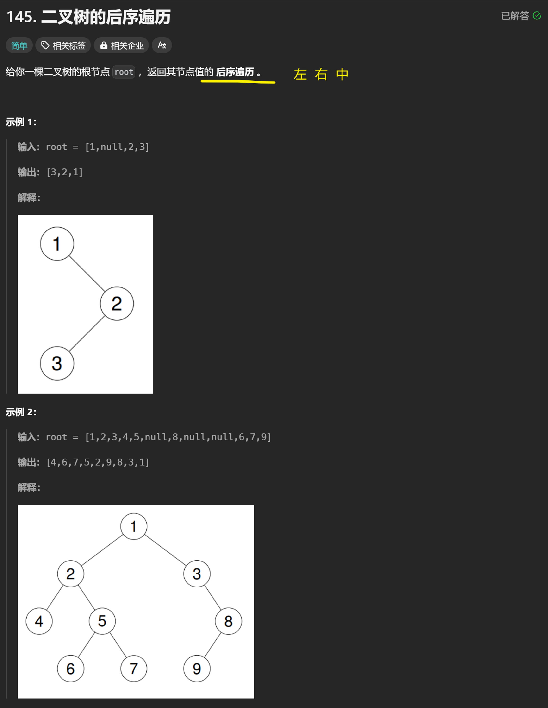
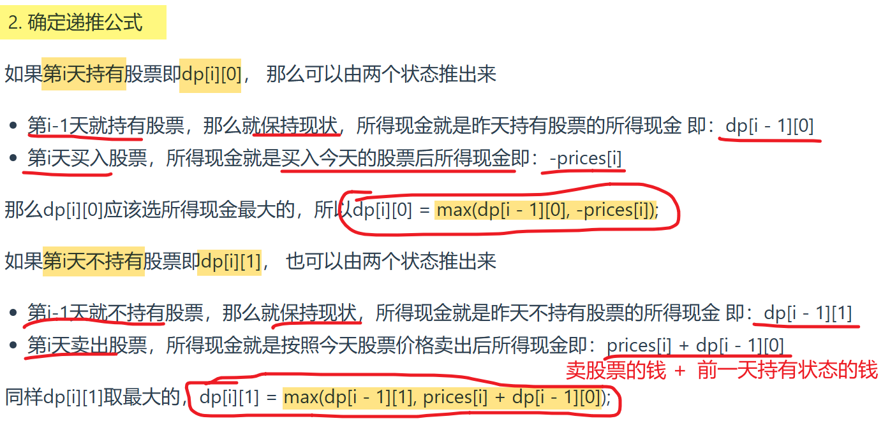
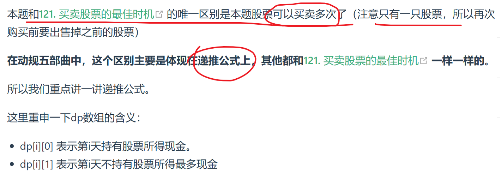
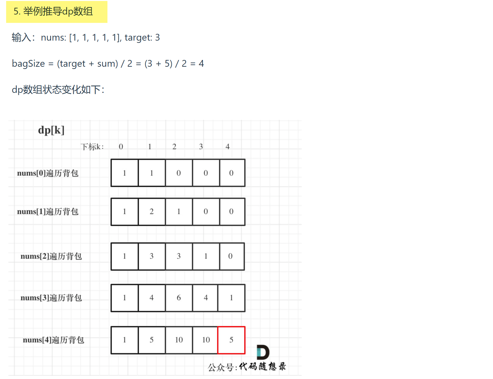
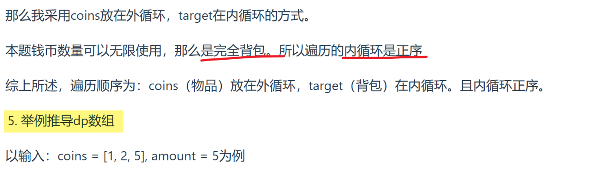
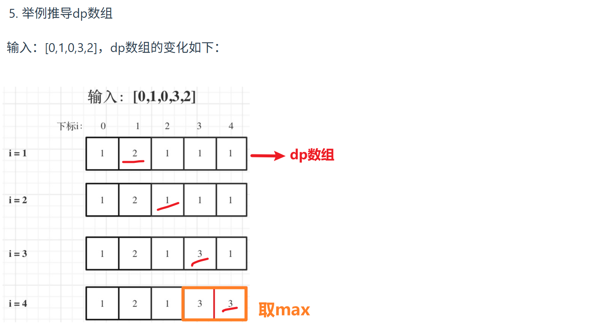
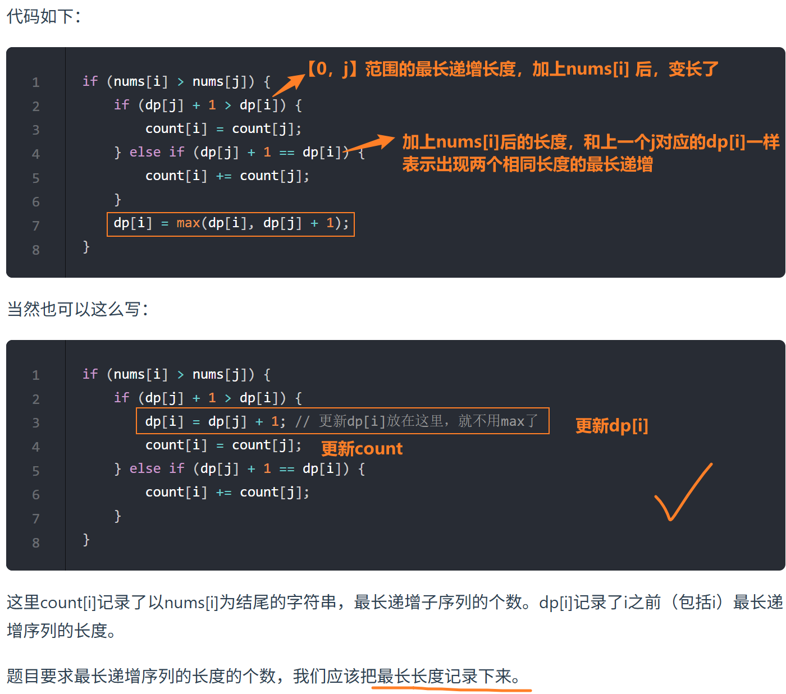

> from [代码随想录](https://programmercarl.com/)，和其他一些力扣题解区大神的题解

# 数组 ✅

## 27 [移除元素（双指针）](https://leetcode.cn/problems/remove-element/description/)

~~~C++
class Solution {
public:
    int removeElement(vector<int>& nums, int val) {

        // 快慢指针

        int slow = 0;
        for (int fast = 0; fast < nums.size(); fast++)
        {
            if (nums[fast] != val)
            {
                // fast 对应的值 不等于val时，赋值给slow对应的位置
                nums[slow] = nums[fast];
                slow++;
            }
            // fast对应位置 = val时，不更新，slow不懂，fast++
        }

        return slow; // nums中不等于val的元素个数
    }
};
~~~

ACM

~~~C++
#include <iostream>
#include <vector>
using namespace std;

// 功能函数：移除元素 val，返回新长度
int removeElement(vector<int>& nums, int val) {
    int slow = 0;
    for (int fast = 0; fast < nums.size(); ++fast) {
        if (nums[fast] != val) {
            nums[slow++] = nums[fast];
        }
    }
    return slow;
}

int main() {
    int n, val;
    cin >> n >> val; // 输入数组大小和目标值
    vector<int> nums(n);

    for (int i = 0; i < n; ++i) {
        cin >> nums[i]; // 输入数组元素
    }

    int newLength = removeElement(nums, val);

    // 输出结果：移除目标值后的前 newLength 项
    for (int i = 0; i < newLength; ++i) {
        cout << nums[i] << " ";
    }
    cout << endl;

    return 0;
}

~~~

示例输入：

~~~C++
6 3
3 2 2 3 4 5
~~~

输出：

~~~C++
2 2 4 5
~~~

## 88 [合并两个有序数组](https://leetcode.cn/problems/merge-sorted-array/description/?envType=study-plan-v2&envId=top-interview-150)

主要思路：

- 从后往前确定两组中该用哪个数字
- 结束条件是第二组数全都插入 `j < 0`

~~~C++
class Solution {
public:
    void merge(vector<int>& nums1, int m, vector<int>& nums2, int n) {

        int i = m - 1; // nums1最后一个数
        int j = n - 1; // nums2最后一个数

        int k = m + n - 1; // 合并后的末尾

        while (j >= 0)
        {
            // 取大的数放在 k
            if (i >= 0 && nums1[i] > nums2[j])  
            {
                nums1[k] = nums1[i];
                k--;
                i--;
            }
            else 
            {
                nums1[k] = nums2[j];
                k--;
                j--;
            }

        }  

    }
};
~~~

- 时间复杂度：O(*m*+*n*)。最坏情况形如 *nums*1=[4,5,6,∗,∗,∗],*nums*2=[1,2,3]，每个数都需要移动一次。
- 空间复杂度：O(1)。仅用到若干额外变量

# 二分查找✅

## 704 [二分查找](https://leetcode.cn/problems/binary-search/)

注意区间的开闭！

~~~C++
class Solution {
public:
    int search(vector<int>& nums, int target) {
        int left = 0;
        int right = nums.size() - 1;// 定义target在左闭右闭的区间里 [left, right]

        while (left <= right) {
            int mid = left + ((right - left) / 2);// 防止溢出，等同于(left + right)/2
            // target在左区间
            if (nums[mid] > target) {
                right = mid - 1; // [left, mid - 1]
            }
            // target在右区间
            else if (nums[mid] < target) {
                left = mid + 1; // [mid + 1, right]
            }
            // nums[mid] = target 找到目标值
            else {
                return mid;
            }
        }

        return -1; // 未找到目标值
    }
};
~~~

acm：

~~~C++
#include <iostream>
#include <vector>
using namespace std;

int search(vector<int>& nums, int target)
{
	int left = 0;
	int right = nums.size();

	while (left <= right)
	{
		int mid = left + ((right - left) / 2);
		if (nums[mid] > target) {
			right = mid - 1; // [left, mid - 1]
		}
		else if (nums[mid] < target) {
			left = mid + 1; // [mid + 1, right]
		} 
		else {
            return mid;
		}
	}

	return -1;

} 

int main() 
{ 
	int n, target; // 数组长度n， 目标值target
	// 输入数组长度，目标值
	cin >> n >> target; 

	vector<int> nums(n);
	// 输入数组
    for (int i = 0; i < n; i++) {
		cin >> nums[i];
	}

	int result = search(nums, target);
    cout << result << endl;

	return 0;
}
~~~

示例输入：

~~~C++
6 9
-1 0 3 5 9 12
~~~

示例输出：

~~~C++
4
~~~

## 162 [寻找峰值](https://leetcode.cn/problems/find-peak-element/description/)

**主要思路：中点二分，找上坡，收缩范围，最后left停在峰顶**

**1、为什么找上坡？**

**数组两边都是负无穷，中间一定存在一个山峰，==找上坡，上坡一定会有山峰==**

**2、为什么最后一个数不纳入二分范围？**

> 注意：「答案所在的范围」和「二分的范围」是两个概念
>
> 最后一个数只是不在二分区间里了，不代表不在nums找的区间里了

最后一个数肯定是【峰值or峰值右侧】，也就是目标值的右侧，可以直接分成到峰值右侧，二分范围的外面

同时，如果有且仅有一个峰值，且就是最后一个数的话(下标 n−1)，闭区间right从n-1开始会导致mid+1 数组越界

~~~C++
class Solution {
public:
    int findPeakElement(vector<int>& nums) {

        int left = 0;
        int right = nums.size() - 2;

        while (left <= right)
        {
            int mid = left + ((right - left) / 2);
            if (nums[mid] > nums[mid + 1]) // 说明mid是峰顶 或者 峰顶在mid左侧
            {
                right = mid - 1;// 向左缩小范围，找上坡
            }
            else // nums[mid] <= nums[mid + 1]  说明峰顶在mid右侧
            {
                left = mid + 1; // 向右缩小范围，找上坡
            }

        }

        return left; // 最后left停在峰顶
        
    }
};
~~~

## 153 [寻找旋转排序数组中的最小值](https://leetcode.cn/problems/find-minimum-in-rotated-sorted-array/description/?envType=study-plan-v2&envId=top-100-liked)

@分段二分

可以先看 [162 峰值](#162 [寻找峰值](https://leetcode.cn/problems/find-peak-element/description/))

**主要思路：比较 nums[mid] 和最后一个数，判断 mid 和 最小值 的位置，二分收缩**

- nums[mid] > 最后一个数：
  - nums 一定是两个上升段，第一段  >  第二段
  - **mid 在第一段，min 在第二段**，min 一定在 mid 的**右边**  –>  向右收缩
- nums[mid] <= 最后一个数：
  - mid 在第二段（或者 nums 只有一段，一样的），或者说 **mid 和 min 在同一段**
  - **min 一定在mid 左侧**，或者就是mid –> 向左收缩

~~~C++
class Solution {
public:
    int findMin(vector<int>& nums) {

        int n = nums.size();
        int left = 0;
        int right = n - 1;

        while (left <= right)
        {
            int mid = left + ((right - left) / 2);

            if (nums[mid] > nums[n - 1])    left = mid + 1;// mid在第一段，min在第二段
            else    right = mid - 1; // mid 和 min 在同一段，且 min 在左

        }

        return nums[left]; 
    }
};
~~~

## 33 [搜索旋转排序数组](https://leetcode.cn/problems/search-in-rotated-sorted-array/description/?envType=study-plan-v2&envId=top-100-liked)

@ 分段二分  @153 旋转数组最小值 + 普通找target二分

> 前提题目：可以先看 162 峰值，153 寻找旋转排序数组的最小值

### 1、两次二分

~~~C++
class Solution {
public:
    // 找旋转排序数组的最小值下标（153）
    int findMin(vector<int>& nums) {
        int n = nums.size();
        int left = 0;
        int right = n - 1;
        while (left <= right)
        {
            int mid = left + ((right - left) / 2);
            if (nums[mid] > nums[n - 1])    left = mid + 1;// mid在第一段，min在第二段
            else    right = mid - 1; // mid 和 min 在同一段，且 min 在左
        }
        return left; 
    }

    // [left, right]二分，找target下标
    int searchTarget(vector<int>& nums, int target, int left, int right) {
        while (left <= right)
        {
            int mid = left + ((right - left) / 2); 
            if      (nums[mid] > target)    right = mid - 1;
            else if (nums[mid] < target)    left = mid + 1;
            else    return mid;
        }
        return -1; // 没找到返回-1  
    }

    
    int search(vector<int>& nums, int target) {
        int n = nums.size();
        int ans = 0;
        int left = 0;
        int right = n - 1;

        int min_index = findMin(nums); // 找到最小值，区分第一段第二段

        if (target > nums[n - 1])  // target 在第一段，[0, min_index-1], 向左收缩 
        { 
            right = min_index - 1;
            ans = searchTarget(nums, target, left, right);         
        }
        else // target <= nums[n - 1] target 在第二段，[min_index, n-1]，向右收缩  
        {
            left = min_index;
            ans = searchTarget(nums, target, left, right);

            // 注意这里要带着min判断, target有可能就是min
        }

        return ans;        
    }
};
~~~

### 2、一次二分(推荐)

直接判断 target 和 mid 的左右关系，分成target和mid在不在同一段两种情况

- 不在同一段，分 mid 在 target 左还是右
- 在同一段，就是普通二分查找了

~~~C++
class Solution {
public:
    int search(vector<int>& nums, int target) {

        int n = nums.size();
        int end = nums[n - 1]; // 还是和最后一个数比较，判断在哪一段
        
        int left = 0;
        int right = n - 1;

        while (left <= right)
        {
            int mid = left + (right - left) / 2;

            // target 和 mid 不在同一段
            if (nums[mid] > end && target <= end) 	   // target在右半部分，mid在左
            {
                left = mid + 1;
            }
            else if (target > end && nums[mid] <= end) // target在左半部分，mid在右
            {
                right = mid - 1;
            }
            else // target 和 mid 在同一段（也包括了只有一段的情况） 普通二分
            {
                if (target < nums[mid])         right = mid - 1;
                else if (target > nums[mid])    left = mid + 1;
                else    return mid;
            }
        }
        
        return -1;        
    }
};
~~~

# 前缀和✅

## 303 [区域和检索 - 数组不可变](https://leetcode.cn/problems/range-sum-query-immutable/description/)

~~~C++
class NumArray {
    vector<int> s;

public:
    NumArray(vector<int>& nums) {
        s.resize(nums.size() + 1);
        for (int i = 0; i < nums.size(); i++)
        {
            s[i + 1] = s[i] + nums[i]; // 前缀和
        }
    }
    
    int sumRange(int left, int right) {
        return s[right + 1] - s[left];// nums中 [left, right] 部分的和        
    }
};

/**
 * Your NumArray object will be instantiated and called as such:
 * NumArray* obj = new NumArray(nums);
 * int param_1 = obj->sumRange(left,right);
 */
~~~

# 链表✅

## 链表结构

~~~C++
struct ListNode {
    int val;
    ListNode *next;
    ListNode(int x) : val(x), next(nullptr) {}
};
~~~

## [92 反转链表II](https://leetcode.cn/problems/reverse-linked-list-ii/description/)

~~~C++
/**
 * Definition for singly-linked list.
 * struct ListNode {
 *     int val;
 *     ListNode *next;
 *     ListNode() : val(0), next(nullptr) {}
 *     ListNode(int x) : val(x), next(nullptr) {}
 *     ListNode(int x, ListNode *next) : val(x), next(next) {}
 * };
 */
class Solution {
public:
    ListNode* reverseBetween(ListNode* head, int left, int right) {

        ListNode* dummyHead = new ListNode(0);
        dummyHead->next = head;

        // p0 指向 left 前一个
        ListNode* p0 = dummyHead;
        for (int i = 0; i < left - 1; i++)
        {
            p0 = p0->next; // 移动到left前一个
        }

        // 反转 [left, right] 部分 
        ListNode* pre = nullptr;
        ListNode* cur = p0->next;
        for (int i = 0; i < right - left + 1; i++) // 206 普通反转
        {
            ListNode* tmp = cur->next;
            cur->next = pre;
            pre = cur;
            cur = tmp;
        }

        // 最后 cur 指向反转部分的下一个节点（尾部）
        // pre 指向反转部分的头节点，即原right

        // 连接头尾
        p0->next->next = cur;
        p0->next = pre;

        return dummyHead->next;
        
    }
};
~~~

- 时间复杂度：O(*right*)
- 空间复杂度：O(1)

## [876 链表的中间结点](https://leetcode.cn/problems/middle-of-the-linked-list/description/)

@快慢指针

~~~C++
/**
 * Definition for singly-linked list.
 * struct ListNode {
 *     int val;
 *     ListNode *next;
 *     ListNode() : val(0), next(nullptr) {}
 *     ListNode(int x) : val(x), next(nullptr) {}
 *     ListNode(int x, ListNode *next) : val(x), next(next) {}
 * };
 */
class Solution {
public:
    ListNode* middleNode(ListNode* head) {

        ListNode* slow = head;
        ListNode* fast = head;

        while (fast && fast->next) 
        {
            // fast走2步，slow走1步
            fast = fast->next->next;
            slow = slow->next; // slow 停在中间节点
        }

        return slow;
        
    }
};
~~~

如果最后while条件是

~~~C++
while (fast->next && fast->next->next)
~~~

slow会停在mid的前一个

## [25 K个一组翻转链表](https://leetcode.cn/problems/reverse-nodes-in-k-group/description/?envType=study-plan-v2&envId=top-100-liked)

[题解：灵茶山艾府](https://www.bilibili.com/video/BV1sd4y1x7KN/?vd_source=7369d5f08520f2fc3601caee93963ffa)

~~~C++
/**
 * Definition for singly-linked list.
 * struct ListNode {
 *     int val;
 *     ListNode *next;
 *     ListNode() : val(0), next(nullptr) {}
 *     ListNode(int x) : val(x), next(nullptr) {}
 *     ListNode(int x, ListNode *next) : val(x), next(next) {}
 * };
 */
class Solution {
public:
    ListNode* reverseKGroup(ListNode* head, int k) {

        // 统计节点个数
        int n = 0;
        ListNode* node = head;
        while (node)
        {
            n++;
            node = node->next;
        }
        
        ListNode* dummyHead = new ListNode(0);
        dummyHead->next = head;
        
        ListNode* p0 = dummyHead; // p0 作为 [下一组要反转的k个节点的] 上一个节点
        ListNode* pre = nullptr;
        ListNode* cur = head;

        // 剩余节点足够 k 个
        while (n >= k)
        {
            // k 个一组处理
            for (int i = 0; i < k; i++) // 206 普通反转链表
            {
                ListNode* tmp = cur->next;
                cur->next = pre;
                pre = cur;
                cur = tmp;
            }

            // 连接头尾
            ListNode* nxt = p0->next;
            p0->next->next = cur;
            p0->next = pre;
            p0 = nxt; // 更新p0

            // n 更新
            n -= k;
            
            pre = nullptr; // 可以不重置，重置好理解一些
        }

        return dummyHead->next;

    }
};
~~~

- 时间复杂度：O(*n*)，其中 *n* 为链表节点个数。
- 空间复杂度：O(1)，仅用到若干额外变量。

## 21 [合并两个有序链表](https://leetcode.cn/problems/merge-two-sorted-lists/description/?envType=study-plan-v2&envId=top-100-liked)

~~~C++
/**
 * Definition for singly-linked list.
 * struct ListNode {
 *     int val;
 *     ListNode *next;
 *     ListNode() : val(0), next(nullptr) {}
 *     ListNode(int x) : val(x), next(nullptr) {}
 *     ListNode(int x, ListNode *next) : val(x), next(next) {}
 * };
 */
class Solution {
public:
    ListNode* mergeTwoLists(ListNode* list1, ListNode* list2) {

        ListNode* dummyHead = new ListNode(0);
        ListNode* cur = dummyHead;
        while (list1 && list2)
        {
            if (list1->val < list2->val)
            {
                cur->next = list1; // 取小的节点拼接在cur后面
                list1 = list1->next;
            }
            else
            {
                cur->next = list2;
                list2 = list2->next;
            }

            cur = cur->next;
        }

        // 上面while终止，是由于list1或list2为nullptr
        // 判断是哪个终止了，将另一个链表的剩下部分也拼接上
        cur->next = (list1 != nullptr) ? list1 : list2;

        return dummyHead->next; // 返回真正的头节点
        
    }
};
~~~

时间复杂度 O(M+N) ：M，N是两个链表的长度，合并操作需要操作两链表

空间复杂度 O(1)：节点引用dummyHead，cur使用常数大小的额外空间

## 146 [LRU缓存](https://leetcode.cn/problems/lru-cache/description/?envType=study-plan-v2&envId=top-100-liked)

~~~C++
// 构造双向链表（存key，value，前后向指针）
// 删除节点 remove() + 最上面添加节点 push_front() + 抽出key节点，移到头部 get_node()

class Node // 构造双向链表
{
public:
    int key;
    int value;
    Node* prev;
    Node* next;

    Node(int k = 0, int v = 0) : key(k), value(v) {}
};

class LRUCache {
private:
    int capacity;
    Node* dummy; 
    unordered_map<int, Node*> key_to_node; // <key, node>

    // 删除一个节点（抽出一本书）
    void remove(Node* x)
    {
        x->prev->next = x->next;
        x->next->prev = x->prev; 
    }

    // 插入节点到链表头部（dummy后面）（把一本书放在最上面）
    void push_front(Node* x)
    {
        x->prev = dummy;
        x->next = dummy->next;
        x->prev->next = x;
        x->next->prev = x;
    }

    // 获取 key 对应的节点返回，并移到链表头部（抽出一本书放在最上面）
    Node* get_node(int key)
    {
        auto it = key_to_node.find(key);

        // 没有这本书
        if (it == key_to_node.end())    return nullptr; 

        // 有这本书
        Node* node = it->second; 
        remove(node);     // 抽出这本书
        push_front(node); // 放在最上面

        return node;
    }

public:
    LRUCache(int capacity) 
        : capacity(capacity), dummy(new Node())
    {
        dummy->prev = dummy;
        dummy->next = dummy;// 初始都指向自己
    }
    

    int get(int key) {
        // 如果关键字 key 存在于缓存中，则返回关键字的值，否则返回 -1 
        Node* node = get_node(key);
        return node ? node->value : -1;
    }
    
    
    void put(int key, int value) {
        // 如果关键字 key 已经存在，则变更其数据值 value 
        // 如果不存在，则向缓存中插入该组 key-value 
        // 如果插入操作导致关键字数量超过 capacity ，则应该 逐出 最久未使用的关键字
        
        Node* node = get_node(key);// get_node 会把对应节点移到链表头部
        // 节点存在，更新value，移到头部（有这本书）
        if (node) 
        {
            node->value = value; 
            return;
        }

        // 节点不存在，创建新节点插入头部（新书）
        Node* newnode = new Node(key, value);
        key_to_node[key] = newnode;
        push_front(newnode); 

        // 节点插入后，容量爆了，移除最后节点（移除最下面的书）
        if (key_to_node.size() > capacity) 
        {
            Node* back_node = dummy->prev; // 环形双向链表，直接找到最下面节点
            
            key_to_node.erase(back_node->key); // map中删除 <key, back_node>
            remove(back_node); 				   // 链表删除节点
            
            delete back_node; // 释放内存
        }
    }
    
};

/**
 * Your LRUCache object will be instantiated and called as such:
 * LRUCache* obj = new LRUCache(capacity);
 * int param_1 = obj->get(key);
 * obj->put(key,value);
 */
~~~

- 时间复杂度：所有操作均为 O(1)。
- 空间复杂度：O(min(*p*,*capacity*))，其中 *p* 为 put 的调用次数。

# 哈希✅

## 1 [两数之和](https://leetcode.cn/problems/two-sum/description/?envType=study-plan-v2&envId=top-100-liked)

@哈希 @数组

遍历数组，需要一个集合**存放【遍历过的元素】**，在遍历数组nums的时候，同时去这个组合中寻找，某元素【 target - 当前遍历元素 nums[i] 】是否出现过。

因为最后要找到这个元素是否出现过，还需要得到这个元素的下标，需要使用key-value结构存放：

**< key: 元素nums[i]， value：下标 i >**

判断元素是否出现过，那么元素就要作为key，通过元素找下标，下标作为value。

> std::unordered_map 底层实现为哈希表，std::map 和std::multimap 的底层实现是红黑树。
>
> std::map 和std::multimap 的key也是有序的,**这道题目中并不需要key有序，选择std::unordered_map 效率更高！**

~~~C++
class Solution {
public:
    vector<int> twoSum(vector<int>& nums, int target) {
        
        // unordered_map 不重复 无序key 存放遍历过的元素
        unordered_map<int, int> umap; // < nums[i], 下标 i>

        for (int i = 0; i < nums.size(); i++)
        {
            //find 查找 target - nums[i] 在不在 umap中
            if (umap.find(target - nums[i]) != umap.end()) 
            {
                return {umap[target - nums[i]], i}; // 找到，直接返回下标数组
            }
            umap.insert(pair<int, int>(nums[i], i));// 没找到，就存到umap里
        }

        return {}; // 没符合条件的，返回空数组
        
    }
};
~~~

时间复杂度：O(N)

空间复杂度：O(N)

# 字符串✅

# 滑动窗口✅

# 双指针✅

## [15 三数之和（收缩）](https://leetcode.cn/problems/3sum/description/?envType=study-plan-v2&envId=top-100-liked)

@双指针收缩

双指针收缩，大了往左，小了往右

~~~C++
class Solution {
public:
    vector<vector<int>> threeSum(vector<int>& nums) {

        // 先排序nums
        sort(nums.begin(), nums.end());
        
        vector<vector<int>> result;
        
        for (int i = 0; i < nums.size(); i++)
        {
            // 排序后第一个元素已经大于0，不可能凑成三元组
            if (nums[i] > 0)    break;
            
            // 去重 a
            // 如果i和i-1元素相同，说明后面遍历组合的三数之和在nums[i-1]的时候被组合过了，跳过
            if (i > 0 && nums[i] == nums[i - 1])    continue;

            // a = nums[i]  b = nums[left]  c = nums[right]   固定i，移动left right
            int left = i + 1;
            int right = nums.size() - 1;
            while(left < right) 
            {
                // 三数之和 > 0，right向左移动，让和变小
                if (nums[i] + nums[left] + nums[right] > 0) right--;
                
                // 三数之和 < 0，left向右移动，让和变大
                else if (nums[i] + nums[left] + nums[right] < 0) left++;
                
                // 三数之和 = 0，找到一个三元组
                else 
                {
                    // 收集三元组
                    result.push_back(vector<int>{nums[i], nums[left], nums[right]});
                    
                    // 去重b和c，向里收缩
                    while (right > left && nums[right] == nums[right - 1])	right--;
                    while (right > left && nums[left] == nums[left + 1])	left++;
                    
                    // 找到一组三元组后，left和right同时向里收缩，寻找下一组
                    right--;
                    left++;
                }
                
            }
        }

        return result;        
    }
};
~~~

时间复杂度：*O*(*n*2)

空间复杂度：O(1)

# 栈和队列✅

## [239 滑动窗口最大值](https://leetcode.cn/problems/sliding-window-maximum/description/?envType=study-plan-v2&envId=top-100-liked)

@单调队列

~~~C++
class Solution {
private:
    // deque实现单调队列 从大到小
    class MyQueue
    {
    public:
        deque<int> que; // 使用deque实现单调队列

        // push
        void push(int value)
        {
            // 即将放进que的value > back入口数值，就将que后端的数值弹出，直到value < 入口
            // 保证队列前面都是比value大的值，才能从大到小
            while (!que.empty() && value > que.back())  que.pop_back();
            que.push_back(value);
        }

        // pop
        void pop(int value)
        {
            // 每次pop比较要弹出的数值，是否等于que出口的数值，如果相等则弹出
            if (!que.empty() && value == que.front())   que.pop_front();
        }

        // getMaxvalue 查询当前队列里的最大值，直接返回que的front
        int getMax()
        {
            return que.front();
        }
    };

public:
    vector<int> maxSlidingWindow(vector<int>& nums, int k) {

        vector<int> result;

        MyQueue que; // 创建单调队列
        
        // 前k个元素（第一个窗口）放入que
        for (int i = 0; i < k; i++)
        {
            que.push(nums[i]); // push的时候已经保证了单调
        }
        result.push_back(que.getMax()); // result 记录第一个窗口最大值

        // 继续计算后面的窗口
        for (int i = k; i < nums.size(); i++)
        {
            que.pop(nums[i - k]); // 移动窗口，pop出que中当前窗口的第一个元素
            que.push(nums[i]); // 新元素push进新窗口

            result.push_back(que.getMax()); // 记录当前窗口内的最大值
        }
        
        return result;
        
    }
};
~~~

ACM

~~~C++
#include <iostream>
#include <deque>
#include <vector>

using namespace std;

// 单调队列类
class MyQueue
{
public:
    deque<int> que;
    
    // push 保证从大到小
    void push(int value)
    {
        while (!que.empty() && value > que.back()) // 如果value > que.back() 就弹出原来较小的back
        {
            que.pop_back();
        }
        que.push_back(value); // 新值放进去，队列前面是比value大的值，才能从大到小
    }

    // pop 窗口滑出元素与队头相等时弹出
    void pop(int value)
    {
        if (!que.empty() && value == que.front())
        {
            que.pop_front();
        }
    }

    // getMax 返回当前窗口的最大值（就是队列的front）
    int getMax()
    {
        return que.front();
    }

};

// 返回滑动窗口中的最大值
vector<int> maxSlidingWindow(const vector<int>& nums, int k)
{
    vector<int> result;
    MyQueue que;

    // 初始化前k个元素（第一个窗口）
    for (int i = 0; i < k; i++)
    {
        que.push(nums[i]);
    }
    result.push_back(que.getMax());

    // 开始滑动窗口
    for (int i = k; i < nums.size(); i++)
    {
        que.pop(nums[i - k]);
        que.push(nums[i]);
        result.push_back(que.getMax());
    }

    return result;
}

int main()
{
    int n, k;
    cin >> n >> k; // 输入nums元素个数，和窗口大小k

    vector<int> nums(n);
    for (int i = 0; i < n; i++)
    {
        cin >> nums[i]; // 输入nums元素
    }

    vector<int> ans = maxSlidingWindow(nums, k);
    for (int x : ans)
    {
        cout << x << " ";
    }
    cout << endl;

    return 0;
}
~~~

示例输入：

~~~C++
8 3 
1 3 -1 -3 5 3 6 7
~~~

输出：

~~~C++
3 3 5 5 6 7 
~~~

## 480 [滑动窗口和中位数](https://leetcode.cn/problems/sliding-window-median/description/)

# 堆✅

## 215 [数组中的第 K 个最大元素](https://leetcode.cn/problems/kth-largest-element-in-an-array/submissions/649625107/?envType=study-plan-v2&envId=top-100-liked)

~~~C++
class Solution {
public:
    // 基于快排的快速选择
    int quickSelect(vector<int>& nums, int k)
    {        
        // 随机选择基准数字
        int p = nums[rand() % nums.size()];

        // 将大于等于小于基准的元素，分别放入三个数组
        vector<int> big, equal, small;
        for (int a : nums)
        {
            if (a < p)      small.push_back(a);
            else if (a > p) big.push_back(a);
            else            equal.push_back(a);
        }

        // 第 k 大元素在big 中，按递归划分
        if (k <= big.size())    
        {
            return quickSelect(big, k);
        }

        // 第 k 大元素在 small 中，递归划分
        if (k > big.size() + equal.size())
        {
            return quickSelect(small, k - (big.size() + equal.size()));
            // 在small里面就是第 [k - (big.size() + equal.size())] 个大的元素
        }

        // 第 k 大元素在 equal 中，找到，返回p
        return p;
    }

    int findKthLargest(vector<int>& nums, int k) {

        return quickSelect(nums, k);        
    }
};
~~~

# 二叉树✅

## 二叉树结构

~~~C++
struct TreeNode
{
    int val;
    TreeNode* left;
    TreeNode* right;
    TreeNode(int x) : val(x), left(nullptr), right(nullptr) {}
};

// 层序遍历（用于输出）
vector<int> levelOrder(TreeNode* root) 
{
    vector<int> result;
    if (!root) return result;

    queue<TreeNode*> q;
    q.push(root);

    while (!q.empty()) {
        TreeNode* node = q.front(); 
        q.pop();
        result.push_back(node->val);

        if (node->left)  q.push(node->left);
        if (node->right) q.push(node->right);
    }

    return result;
}

int main()
{
    // 构造树
    TreeNode* root = new TreeNode(-10);
    root->left = new TreeNode(9);
    root->right = new TreeNode(20);

    root->right->left = new TreeNode(15);
    root->right->right = new TreeNode(7);
    
    
    // ... 题目函数处理
    
    
    vector<int> output = levelOrder(root);
    // 输出
    for (auto val : output)
    {
        cout << val << " ";
    }
    
    return 0;    
}
~~~

## [144 前序遍历](https://leetcode.cn/problems/binary-tree-preorder-traversal/description/)

### 递归

~~~C++
/**
 * Definition for a binary tree node.
 * struct TreeNode {
 *     int val;
 *     TreeNode *left;
 *     TreeNode *right;
 *     TreeNode() : val(0), left(nullptr), right(nullptr) {}
 *     TreeNode(int x) : val(x), left(nullptr), right(nullptr) {}
 *     TreeNode(int x, TreeNode *left, TreeNode *right) : val(x), left(left), right(right) {}
 * };
 */
class Solution {
public:
    // 递归
    void traversal(TreeNode* cur, vector<int>& vec)
    {
        // 终止条件
        if (cur == nullptr) return;

        // 单层逻辑
        vec.push_back(cur->val);    // 中
        traversal(cur->left, vec);  // 左
        traversal(cur->right, vec); // 右
    }

    vector<int> preorderTraversal(TreeNode* root) {

        vector<int> result;
        traversal(root, result);

        return result;    
    }
};
~~~

时间复杂度：O(n)，其中 n 是二叉树的节点数。每一个节点恰好被遍历一次。

空间复杂度：O(n)，为递归过程中栈的开销，平均情况下为 O(logn)，最坏情况下树呈现链状，为 O(n)。

### 迭代

~~~C++
class Solution {
public:
    vector<int> preorderTraversal(TreeNode* root) {
        vector<int> result;
        if (root == nullptr)    return result;

        stack<TreeNode*> st;
        st.push(root);
        while (!st.empty())
        {
            TreeNode* node = st.top(); // 中
            st.pop();
            result.push_back(node->val); // 收集

            // 先入右，后入左，这样出栈正好是 中-左-右
            if (node->right)    st.push(node->right);   // 右
            if (node->left)     st.push(node->left);    // 左
        }

        return result;     
    }
};
~~~

### ACM

~~~C++
#include <iostream>
#include <vector>
using namespace std;

// 144 二叉树前序遍历

// 结构树
struct TreeNode
{
    int val;
    TreeNode* left;
    TreeNode* right;
    TreeNode(int x) : val(x), left(nullptr), right(nullptr) {}
};

// 递归前序遍历 中-左-右
void preorderTraversal(TreeNode* cur, vector<int>& vec)
{
    if (!cur)   return;

    vec.push_back(cur->val);            // 中
    preorderTraversal(cur->left, vec);  // 左
    preorderTraversal(cur->right, vec); // 右
}

int main()
{
    // 构建如下二叉树：
    //           1
    //         /   \
    //        2     3
    //       / \     \
    //      4   5     8
    //         / \   /
    //        6   7 9

    TreeNode* root = new TreeNode(1);
    root->left = new TreeNode(2);
    root->right = new TreeNode(3);

    root->left->left = new TreeNode(4);
    root->left->right = new TreeNode(5);
    root->left->right->left = new TreeNode(6);
    root->left->right->right = new TreeNode(7);

    root->right->right = new TreeNode(8);
    root->right->right->left = new TreeNode(9);

    vector<int> result;
    preorderTraversal(root, result); // 1 2 4 5 6 7 3 8 9 

    // 输出
    for (int val : result)
    {
        cout << val << " ";
    }
    cout << endl;

    return 0;
}

~~~

## 145 后序遍历

### 递归

~~~C++
/**
 * Definition for a binary tree node.
 * struct TreeNode {
 *     int val;
 *     TreeNode *left;
 *     TreeNode *right;
 *     TreeNode() : val(0), left(nullptr), right(nullptr) {}
 *     TreeNode(int x) : val(x), left(nullptr), right(nullptr) {}
 *     TreeNode(int x, TreeNode *left, TreeNode *right) : val(x), left(left), right(right) {}
 * };
 */
class Solution {
public:
    // 递归
    void traversal(TreeNode* cur, vector<int>& vec)
    {
        if (cur == nullptr) return;

        traversal(cur->left, vec);  // 左
        traversal(cur->right, vec); // 右
        vec.push_back(cur->val);    // 中
    }

    vector<int> postorderTraversal(TreeNode* root) {
        vector<int> result;
        traversal(root, result);

        return result;
        
    }
};
~~~

### 迭代

~~~C++
class Solution {
public:
    vector<int> postorderTraversal(TreeNode* root) {

        vector<int> result;
        if (root == nullptr)    return result;

        stack<TreeNode*> st;
        st.push(root);
        while (!st.empty())
        {
            TreeNode* node = st.top(); // 中
            st.pop();
            result.push_back(node->val);

            // 先入左，后入右，出栈正好是 中--右--左
            if (node->left)     st.push(node->left);
            if (node->right)    st.push(node->right);
        }

        // 出栈是 中--右--左，反转是 左--右--中
        reverse(result.begin(), result.end());
        
        return result;
    }
};
~~~

### ACM

~~~C++
#include <iostream>
#include <vector>
using namespace std;

// 145 二叉树后序遍历

// 结构树
struct TreeNode
{
    int val;
    TreeNode* left;
    TreeNode* right;
    TreeNode(int x) : val(x), left(nullptr), right(nullptr) {}
};

// 递归后序遍历 左-右-中
void postorderTraversal(TreeNode* cur, vector<int>& vec)
{
    if (cur == nullptr) return;

    postorderTraversal(cur->left, vec);  // 左
    postorderTraversal(cur->right, vec); // 右
    vec.push_back(cur->val);             // 中
}

int main()
{
    // 构建如下二叉树：
    //           1
    //         /   \
    //        2     3
    //       / \     \
    //      4   5     8
    //         / \   /
    //        6   7 9

    TreeNode* root = new TreeNode(1);
    root->left = new TreeNode(2);
    root->right = new TreeNode(3);

    root->left->left = new TreeNode(4);
    root->left->right = new TreeNode(5);
    root->left->right->left = new TreeNode(6);
    root->left->right->right = new TreeNode(7);

    root->right->right = new TreeNode(8);
    root->right->right->left = new TreeNode(9);

    vector<int> result;
    postorderTraversal(root, result); // 4 6 7 5 2 9 8 3 1 

    // 输出
    for (int val : result)
    {
        cout << val << " ";
    }
    cout << endl;

    return 0;
}
~~~

## [94 中序遍历](https://leetcode.cn/problems/binary-tree-inorder-traversal/?envType=study-plan-v2&envId=top-100-liked)

### 递归

~~~C++
/**
 * Definition for a binary tree node.
 * struct TreeNode {
 *     int val;
 *     TreeNode *left;
 *     TreeNode *right;
 *     TreeNode() : val(0), left(nullptr), right(nullptr) {}
 *     TreeNode(int x) : val(x), left(nullptr), right(nullptr) {}
 *     TreeNode(int x, TreeNode *left, TreeNode *right) : val(x), left(left), right(right) {}
 * };
 */
class Solution {
public:
    // 递归
    void traversal(TreeNode* cur, vector<int>& vec)
    {
        if (cur == nullptr) return;

        traversal(cur->left, vec);  // 左
        vec.push_back(cur->val);    // 中
        traversal(cur->right, vec); // 右
    }

    vector<int> inorderTraversal(TreeNode* root) {
        
        vector<int> result;
        traversal(root, result);

        return result;
        
    }
};
~~~

### 迭代

画图吧！！！

~~~C++
class Solution {
public:
    vector<int> inorderTraversal(TreeNode* root) {

        vector<int> result;

        stack<TreeNode*> st;
        TreeNode* cur = root;

        while (cur || !st.empty())
        {
            if (cur)
            {
                // 指针来访问节点，节点放入栈，先左边，一直到左边最底层
                st.push(cur);
                cur = cur->left;
            }
            else // cur = nullptr 走到左边最低
            {
                cur = st.top(); // 要处理的节点
                st.pop();

                // 当前节点值放进result
                result.push_back(cur->val); // 中
                
                // 转向当前节点的右节点
                cur = cur->right;           // 右
            }
        }

        return result;        
    }
};
~~~

### ACM

~~~C++
#include <iostream>
#include <vector>
using namespace std;

// 93 二叉树中序遍历

// 结构树
struct TreeNode
{
    int val;
    TreeNode* left;
    TreeNode* right;
    TreeNode(int x) : val(x), left(nullptr), right(nullptr) {}
};

// 递归中序遍历 左-中-右
void inorderTraversal(TreeNode* cur, vector<int>& vec)
{
    if (!cur)   return;

    inorderTraversal(cur->left, vec);  // 左
    vec.push_back(cur->val);           // 中
    inorderTraversal(cur->right, vec); // 右
}

int main()
{
    // 构建如下二叉树：
    //           1
    //         /   \
    //        2     3
    //       / \     \
    //      4   5     8
    //         / \   /
    //        6   7 9

    TreeNode* root = new TreeNode(1);
    root->left = new TreeNode(2);
    root->right = new TreeNode(3);

    root->left->left = new TreeNode(4);
    root->left->right = new TreeNode(5);
    root->left->right->left = new TreeNode(6);
    root->left->right->right = new TreeNode(7);

    root->right->right = new TreeNode(8);
    root->right->right->left = new TreeNode(9);

    vector<int> result;
    inorderTraversal(root, result); // 4 2 6 5 7 1 3 9 8

    // 输出
    for (int val : result)
    {
        cout << val << " ";
    }
    cout << endl;

    return 0;
}

~~~

## 102 [二叉树的层序遍历](https://leetcode.cn/problems/binary-tree-level-order-traversal/description/?envType=study-plan-v2&envId=top-100-liked)

@ 队列

~~~c++
/**
 * Definition for a binary tree node.
 * struct TreeNode {
 *     int val;
 *     TreeNode *left;
 *     TreeNode *right;
 *     TreeNode() : val(0), left(nullptr), right(nullptr) {}
 *     TreeNode(int x) : val(x), left(nullptr), right(nullptr) {}
 *     TreeNode(int x, TreeNode *left, TreeNode *right) : val(x), left(left), right(right) {}
 * };
 */
class Solution {
public:
    vector<vector<int>> levelOrder(TreeNode* root) {

        queue<TreeNode*> que; // 存放每层的节点

        vector<vector<int>> result;

        if (root)   que.push(root);
        while (!que.empty())
        {
            int size = que.size(); // 记录每层节点数，控制que里弹出的节点数
                                   // 一定用固定的size，因为que.size()是变化的
            
            vector<int> vec; // 存放当前层的数据

            // 开始输出这一层，以及传入新的左右节点
            for (int i = 0; i < size; i++)
            {
                // 当前节点处理，值放进vec
                TreeNode* node = que.front();
                que.pop();
                vec.push_back(node->val);

                // 传入当前node的左右节点
                if (node->left)     que.push(node->left);
                if (node->right)    que.push(node->right);
            }

            // 每层vec存入result
            result.push_back(vec);
        }

        return result;      
    }
};
~~~

时间复杂度：O(N)

空间复杂度：O(N)

ACM

~~~c++
#include <iostream>
#include <vector>
#include <queue>

using namespace std;

// 102 二叉树的层序遍历
// 时间复杂度：O(n)
// 空间复杂度：O(n)

struct TreeNode
{
    int val;
    TreeNode* left;
    TreeNode* right;
    TreeNode(int x) : val(x), left(nullptr), right(nullptr) {}
};

vector<vector<int>> levelOrder(TreeNode* root)
{
    vector<vector<int>> result;

    queue<TreeNode*> que;
    if (root)   que.push(root);
    while (!que.empty())
    {
        int size = que.size();
        vector<int> vec;

        for (int i = 0; i < size; i++)
        {
            TreeNode* node = que.front();
            que.pop();
            vec.push_back(node->val);

            if (node->left)     que.push(node->left);
            if (node->right)    que.push(node->right);
        }

        result.push_back(vec);
    }

    return result;
}

int main()
{
    TreeNode* root = new TreeNode(3);
    root->left = new TreeNode(9);
    root->right = new TreeNode(20);

    root->right->left = new TreeNode(15);
    root->right->right = new TreeNode(7);

    vector<vector<int>> result = levelOrder(root);
    for (const auto& level : result)
    {
        for (int val : level)
        {
            cout << val << " ";
        }
        cout << endl;
    }

    return 0;
}
~~~

输出：

~~~c++
3
9 20
15 7
~~~

## 二叉搜索树

左小右大

## [106 从中序与后序遍历构造二叉树](https://leetcode.cn/problems/construct-binary-tree-from-inorder-and-postorder-traversal/description/)

**构造树一般采用的是前序遍历**，先构造中间节点，然后递归构造左子树和右子树

~~~C++
/**
 * Definition for a binary tree node.
 * struct TreeNode {
 *     int val;
 *     TreeNode *left;
 *     TreeNode *right;
 *     TreeNode() : val(0), left(nullptr), right(nullptr) {}
 *     TreeNode(int x) : val(x), left(nullptr), right(nullptr) {}
 *     TreeNode(int x, TreeNode *left, TreeNode *right) : val(x), left(left), right(right) {}
 * };
 */
class Solution {
public:

    TreeNode* traversal(vector<int>& inorder, vector<int>& postorder)
    {
        if (postorder.size() == 0)  return nullptr;

        // 后序数组的最后一个数字，就是当前根节点
        int rootValue = postorder[postorder.size() - 1];
        TreeNode* root = new TreeNode(rootValue);

        if (postorder.size() == 1)  return root; // 叶子节点

        
        int delimiterIndex = 0; // 找中序数组的切割点
        for (delimiterIndex = 0; delimiterIndex < inorder.size(); delimiterIndex++)
        {
            if (inorder[delimiterIndex] == rootValue)   break;
        }

        // 切割中序 —— 左树数组 | 中 | 右树数组
        // 左闭右开 [0, delimiterIndex)
        vector<int> leftInorder(inorder.begin(), inorder.begin() + delimiterIndex);
        vector<int> rightInorder(inorder.begin() + delimiterIndex + 1, inorder.end());

        
        postorder.resize(postorder.size() - 1); // postorder 舍弃末尾数字

        // 切割后序 —— 左树数组 | 右树数组
        // 使用 左中序 数组大小作为切割点 [0, delimiterIndex)
        vector<int> leftPostorder(postorder.begin(), postorder.begin() + leftInorder.size());
        vector<int> rightPostorder(postorder.begin() + leftInorder.size(), postorder.end());

        // 递归
        root->left = traversal(leftInorder, leftPostorder);
        root->right = traversal(rightInorder, rightPostorder);

        return root;
    }

    TreeNode* buildTree(vector<int>& inorder, vector<int>& postorder) {

        if (inorder.size() == 0 || postorder.size() == 0)   return nullptr;
        return traversal(inorder, postorder);
        
    }
};
~~~

~~~C++
class Solution {
private:
    // 中序区间 [inorderBegin, inorderEnd]   后序区间 [postorderBegin, postorderEnd]
    // 递归更新区间
    TreeNode* traversal(vector<int>& inorder, int inorderBegin, int inorderEnd,
                        vector<int>& postorder, int postorderBegin, int postorderEnd) {
        
        if (postorderBegin == postorderEnd)  return nullptr;
        
        // 后序遍历数组中最后一个数字，就是当前的根节点
        int rootValue = postorder[postorderEnd - 1];
        TreeNode* root = new TreeNode(rootValue);// 根节点

        if (postorderEnd - postorderBegin == 1)  return root; // 叶子节点

        // 找中序的切割点
        int delimiterIndex;
        for (delimiterIndex = inorderBegin; delimiterIndex < inorderEnd; delimiterIndex++) {
            if (inorder[delimiterIndex] == rootValue)   break;
        }
        
        // 切割中序 —— 左树数组 | 中 | 右树数组
        // 左中序   [leftInorderBegin, leftInorderEnd)
        int leftInorderBegin = inorderBegin;
        int leftInorderEnd = delimiterIndex;
        // 右中序   [rightInorderBegin, rightInorderEnd)
        int rightInorderBegin = delimiterIndex + 1;
        int rightInorderEnd = inorderEnd;

        // 切割后序 —— 左树数组 | 右树数组 | 中
        // 使用 左中序 数组大小作为切割点
        // 左后序  [leftPostorderBegin, leftPostorderEnd)
        int leftPostorderBegin = postorderBegin;
        int leftPostorderEnd = postorderBegin + (delimiterIndex - inorderBegin);
        // 右后序  [rightPostorderBegin, rightPostorderEnd)
        int rightPostorderBegin = postorderBegin + (delimiterIndex - inorderBegin);
        int rightPostorderEnd = postorderEnd - 1;// 排除最后一个元素，已经作为节点了

        // 递归
        root->left = traversal(inorder, leftInorderBegin, leftInorderEnd, 
                               postorder, leftPostorderBegin, leftPostorderEnd);
        root->right = traversal(inorder, rightInorderBegin, rightInorderEnd,
                                postorder, rightPostorderBegin, rightPostorderEnd);

        return root;
    }
    
public:
    TreeNode* buildTree(vector<int>& inorder, vector<int>& postorder) {
        
        if (inorder.size() == 0 || postorder.size() == 0)   return nullptr;
        // 左闭右开
        return traversal(inorder, 0, inorder.size(), postorder, 0, postorder.size());
    }
};
~~~

# 回溯✅

**回溯是递归的副产品，只要有递归，就会有回溯**

**回溯法解决的问题：==在集合中查找子集==**

> **注意：组合无序，排列有序**

回溯法解决的问题都可以**抽象成树结构**

- 集合的大小 -- 树的宽度
- 递归的深度 -- 树的深度

**回溯法模板**

- **函数返回值和参数**

  - 返回值一般为 void

  - 参数，一般先写逻辑，需要什么参数再填

    ~~~C++
    void backtracking(参数)
    ~~~

- **终止条件**

  - 一般到达树的叶子节点，就找到了满足条件的一个答案，存起来，然后结束本层递归

    ~~~C++
    if (终止条件：叶子节点)
    {
        存放结果;
        return;
    }
    ~~~

- **回溯搜索的遍历过程（遍历树）**

  

  for 循环就是遍历集合区间，可以理解为一个节点有多少个孩子，这个for循环就执行几次

  > for 循环是横向遍历，递归backtracking是纵向

  ~~~C++
  for (选择：本层集合中的元素（树中节点孩子的数量就是集合的大小）)
  {
      处理节点;
      backtracking(路径，选择列表); // 递归
      撤销处理结果; // 回溯
  }
  ~~~

  

**整体模版：**

~~~C++
void backtracking(参数)
{
    if (终止条件：叶子节点)
    {
        存放结果;
        return;
    }
    
    for (选择：本层集合中的元素（树中节点孩子的数量就是集合的大小）)
    {
        处理节点;
        backtracking(路径，选择列表); // 递归
        撤销处理结果; // 回溯
    }
}
~~~

## 77 [组合](https://leetcode.cn/problems/combinations/description/)

### 回溯

**构造树：比如 n = 4, k = 2**

~~~C++
class Solution {
public:
    vector<int> path; // 单次符合条件的结果
    vector<vector<int>> result; // 收集所有结果

    void backtracking(int n, int k, int statIndex)
    {
        // 终止条件，path大小为k
        if (path.size() == k)
        {
            result.push_back(path); // 收集这次结果
            return; // 返回
        }

        // 单层逻辑
        for (int i = statIndex; i <= n; i++)
        {
            path.push_back(i); // 处理节点
            backtracking(n, k, i + 1); // 递归，从 i + 1 开始
            path.pop_back(); // 回溯
        }
    }

    vector<vector<int>> combine(int n, int k) {

        result.clear();// 可以不写
        path.clear();  // 可以不写

        backtracking(n, k, 1);
        return result;
        
    }
};
~~~

### 回溯剪枝

> 剪枝就是从遍历条件里减去那些肯定不会符合要求的路线

~~~C++
class Solution {
public:
    vector<int> path; 
    vector<vector<int>> result;

    void backtracking(int n, int k, int statIndex)
    {
        if (path.size() == k)
        {
            result.push_back(path); 
            return; 
        }
        
        for (int i = statIndex; i <= n - (k - path.size()) + 1; i++) // 剪枝
        {
            path.push_back(i); 
            backtracking(n, k, i + 1);
            path.pop_back(); 
        }
    }

    vector<vector<int>> combine(int n, int k) {
        result.clear();
        path.clear();  

        backtracking(n, k, 1);
        return result;     
    }
};
~~~

## 22 [括号生成](https://leetcode.cn/problems/generate-parentheses/description/?envType=study-plan-v2&envId=top-100-liked)

==**重点：右括号个数 <= 左括号个数 ！！！！！！**==

### 1、选或不选

这里是直接覆盖旧值的，相当于原来的【撤销 + 插入新值】了。

~~~C++
class Solution {
public:
    vector<string> generateParenthesis(int n) {
        vector<string> ans;
        string path(n * 2, 0); // n对括号

        // left right 是左右括号的数量
        auto dfs = [&](this auto&& dfs, int left, int right) ->void
        {
            // 终止：右括号填了n个，左括号一定也填了n个，所以此时填完2n个括号
            if (right == n) 
            {
                ans.emplace_back(path);
                return;
            }
            
            if (left < n) // 左括号少于n个，可以填左括号
            {
                path[left + right] = '('; // 直接覆盖
                dfs(left + 1, right);
            }
            if (right < left) // 可以填右括号
            {
                path[left + right] = ')'; // 直接覆盖
                dfs(left, right + 1);
            }
        };

        dfs(0, 0);
        return ans;
    }
};
~~~

### 2、枚举右括号个数，确定下一个左括号位置

**重点：右括号个数 <= 左括号个数 ！！！！！！**

balance =  已填的左括号的个数 - 右括号的个数，为了保证**【右括号个数 <= 左括号个数】**

~~~C++
class Solution {
public:
    vector<string> generateParenthesis(int n) {

        vector<string> ans;
        vector<int> leftIndex; // 记录左括号的下标

        // i:       目前填了 i 个括号
        // balance: 这 i 个括号中, 左括号个数 - 右括号个数 = balance，为了保证左括号 > 右
        auto dfs = [&](this auto&& dfs, int i, int balance)
        {
            // 终止：左括号下标的个数 = n，左括号确定了 n 个位置，填充左括号
            if (leftIndex.size() == n) 
            {
                string s(n * 2, ')');
                for (int j : leftIndex)  s[j] = '('; // 左括号下标处改成 '('

                ans.emplace_back(s); // 收集
                return;
            }

            // 枚举填 right = 0,1,2,3...,balance 个右括号
            // balance 约束  右括号的个数，一定要 <= 左括号，
            // 在 balance 的约束下，枚举填 1 个 ')'，填 2 个 ')', ... 之后，左括号的下标
            for (int right = 0; right <= balance; right++)
            {
                // 先填 right 个右括号，然后填 1 个左括号，记录左括号的下标 i + right
                leftIndex.push_back(i + right);
                dfs(i + right + 1, balance + (1 - right));
                leftIndex.pop_back();
            }
        };

        dfs(0, 0);
        return ans;        
    }
};
~~~

# 贪心✅

## 53 [最大子数组和](https://leetcode.cn/problems/maximum-subarray/description/?envType=study-plan-v2&envId=top-100-liked)

@动态规划 @贪心

### 贪心

~~~C++
class Solution {
public:
    int maxSubArray(vector<int>& nums) {

        // 贪心

        // 注意找的只是 【最大和】，没让找子数组

        // 主要思路：负数只会拖累加和，所以遇到和变成负的，舍弃，负的只会减小后面的加和
        
        int result = INT32_MIN;
        int count = 0;

        // 记录连续和count，如果count < 0，舍弃，再从下一个数开始计和
        for (int i = 0; i < nums.size(); i++)
        {
            count += nums[i];
            result = max(count, result); // 更新result，取大的count
            
            if (count <= 0)	count = 0; // 舍弃，从下一个数nums[i + 1]重新加和
        }

        return result;
    }
};
~~~

### 动态规划

~~~C++
class Solution {
public:
    int maxSubArray(vector<int>& nums) {
        
        if (nums.size() == 0)   return 0;
        
        // 动态规划

        // dp[i] - 以nums[i]结尾(包括)的最大连续子序列和为dp[i]
        vector<int> dp(nums.size());

        // 初始化
        dp[0] = nums[0];

        int result = dp[0];

        // 递推
        for (int i = 1; i < nums.size(); i++)
        {
            dp[i] = max(dp[i - 1] + nums[i], nums[i]);// 两种推出dp[i]的方式，取max

            if (dp[i] > result) result = dp[i]; // 取dp[i]的最大值返回
        }

        return result;  
    }
};
~~~

## 买卖股票

### 121 [买卖股票的最佳时机](https://leetcode.cn/problems/best-time-to-buy-and-sell-stock/description/?envType=study-plan-v2&envId=top-100-liked)

@ 贪心  @ 动规（动规解法看dp部分）

**只能买卖一次，一次交易**

~~~C++
class Solution {
public:
    int maxProfit(vector<int>& prices) {

        // prices[i] 股票第 i 天的价格
        int low = prices[0];
        int result = 0;
        for (int i = 0; i < prices.size(); i++)
        {
            low = min(low, prices[i]); // 取最左最小价格
            result = max(result, prices[i] - low); // 直接取最大差
        }

        return result;
    }
};
~~~

### 122 [买卖股票的最佳时机 II](https://leetcode.cn/problems/best-time-to-buy-and-sell-stock-ii/description/)

@ 贪心  @ 动规（动规解法看dp部分）

> **121 是只能买卖一次，122 是可以买卖多次，获取多次利润**

~~~C++
class Solution {
public:
    int maxProfit(vector<int>& prices) {
        // 利润拆成每天减前一天的差值，只收集正利润 
        
        // 只需要最终利润，不需要知道具体哪天买卖的

        int result = 0;
        for (int i = 1; i < prices.size(); i++)
        {
            result += max(prices[i] - prices[i - 1], 0); // 只加正利润
        }

        return result;   
    }
};
~~~

# 动态规划DP✅

**动态规划** **DP** -- Dynamic Programming

- 如果某问题有很多**重叠子问题**，使用动态规划是最有效的
- **每一个状态，由上一个状态推导**出来

**解题步骤：**

- 确定dp数组，以及下标的意义
- 确定递推公式
- dp数组如何初始化
- 确定遍历顺序
- 举例推导dp数组

**主要题目：**

- 基础问题
- 背包
- 打家劫舍
- 股票
- 子序列

## 509 [斐波那契数](https://leetcode.cn/problems/fibonacci-number/description/)

### 递归

~~~C++
class Solution {
public:
    int fib(int n) {
        // 递归
        if (n < 2)  return n;
        return fib(n - 1) + fib(n - 2);
        
    }
};
~~~

### 动归

~~~C++
class Solution {
public:
    int fib(int n) {
        
        if (n <= 1) return n;

        // dp 数组 dp[i] 第i个斐波那契数
        vector<int> dp(n + 1); 

        // 初始化
        dp[0] = 0;
        dp[1] = 1;

        // 遍历
        for (int i = 2; i <= n; i++)
        {
            dp[i] = dp[i - 1] + dp[i - 2];
        }

        return dp[n];
    }
};
~~~

优化：`dp[]`只维护两个数

~~~C++
class Solution {
public:
    int fib(int n) {
        
        if (n <= 1) return n;

        vector<int> dp(2); // dp只维护2个数值，不需要记录整个序列

        dp[0] = 0;
        dp[1] = 1;

        // 遍历
        for (int i = 2; i <= n; i++)
        {
            int sum = dp[0] + dp[1];
            dp[0] = dp[1];
            dp[1] = sum;
        }

        return dp[1];
    }
};
~~~

## 70 [爬楼梯](https://leetcode.cn/problems/climbing-stairs/description/?envType=study-plan-v2&envId=top-100-liked)

### 基本

~~~C++
class Solution {
public:
    int climbStairs(int n) {
        
        if (n <= 1) return n;
        
        vector<int> dp(n + 1); // dp[i] 爬到第i个台阶，有多少种方法

        dp[1] = 1;
        dp[2] = 2;

        for (int i = 3; i <= n; i++)
        {
            dp[i] = dp[i - 1] + dp[i - 2];
        }

        return dp[n];
        
    }
};
~~~

时间复杂度 O(n)

优化：dp[3]

~~~C++
class Solution {
public:
    int climbStairs(int n) {
        
        if (n <= 1) return n;
        
        int dp[3]; // 只维护3个

        dp[1] = 1;
        dp[2] = 2;

        for (int i = 3; i <= n; i++)
        {
            int sum = dp[1] + dp[2];
            dp[1] = dp[2];
            dp[2] = sum;
        }

        return dp[2];
        
    }
};
~~~

时间复杂度 O(n) ： 计算 f(n) 需循环 n 次，每轮循环内计算操作使用 O(1) 。
空间复杂度 O(1) ： 几个标志变量使用常数大小的额外空间。

### 进阶（377 组合总和IV）

## 62 [不同路径](https://leetcode.cn/problems/unique-paths/description/)

~~~C++
class Solution {
public:
    int uniquePaths(int m, int n) {

        // dp[i][j]: 从(0,0)到(i,j)一共有dp[i][j]条路径
        vector<vector<int>> dp(m, vector<int>(n, 0));

        // 初始化  第一行和第一列需要初始化，都只有一条路径
        for (int i = 0; i < m; i++) dp[i][0] = 1;
        for (int j = 0; j < n; j++) dp[0][j] = 1;
        
        // 递推
        for (int i = 1; i < m; i++)
        {
            for (int j = 1; j < n; j++)
            {
                dp[i][j] = dp[i - 1][j] + dp[i][j - 1]; // 两个方向的路径数相加
            }
        }

        return dp[m - 1][n - 1];
    }
};
~~~

## 63 不同路径II

比 62、不同路径多了障碍判断条件

~~~C++
class Solution {
public:
    int uniquePathsWithObstacles(vector<vector<int>>& obstacleGrid) {
        int m = obstacleGrid.size();
        int n = obstacleGrid[0].size();

        // 如果起点或终点是障碍，直接返回0
        if (obstacleGrid[0][0] == 1 || obstacleGrid[m - 1][n - 1] == 1) return 0;

        
        // dp[i][j]: 从(0, 0)到(i, j)有dp[i][j]条路径
        vector<vector<int>> dp(m, vector<int>(n, 0));

        // 初始化首行首列为1，但遇到障碍就停止
        for (int i = 0; i < m && obstacleGrid[i][0] == 0; i++)  dp[i][0] = 1;
        for (int j = 0; j < n && obstacleGrid[0][j] == 0; j++)  dp[0][j] = 1;

        // 递推
        for (int i = 1; i < m; i++)
        {
            for (int j = 1; j < n; j++)
            {
                if (obstacleGrid[i][j] == 0) // 加条件，不是障碍才进行推导
                {
                    dp[i][j] = dp[i - 1][j] + dp[i][j - 1];
                }
            }
        }

        return dp[m - 1][n - 1];        
    }
};
~~~

## 343 [整数拆分](https://leetcode.cn/problems/integer-break/description/)

~~~C++
class Solution {
public:
    int integerBreak(int n) {

        // dp[i] 数字 i 拆分，可达到的最大乘积
        vector<int> dp(n + 1);

        // 初始化
        dp[2] = 1; // 题中说明 n >= 2

        for (int i = 3; i <= n; i++)
        {
            for (int j = 1; j < i - 1; j++) // j遍历到小于i的值
            {
                dp[i] = max(dp[i], max(j * (i - j), j * dp[i - j]));
            }
        }
        
        return dp[n];
    }
};
~~~

## 96 不同的二叉搜索树

~~~C++
class Solution {
public:
    int numTrees(int n) {

        // dp[i] - i 个不同元素（1 到 i）能组成二叉搜索树多少种
        vector<int> dp(n + 1);

        dp[0] = 1;

        for (int i = 1; i <= n; i++)
        {
            for (int j = 1; j <= i; j++)
            {
                dp[i] += dp[j - 1] * dp[i - j];
                // i个节点中，节点 j 作为头节点
                // 左树有 j - 1 个节点，右树有 i - j 个节点
            }
        }
        
        return dp[n];
    }
};
~~~

## 打家劫舍

偷，和不偷（选和不选）

### 198 [打家劫舍](https://leetcode.cn/problems/house-robber/description/?envType=study-plan-v2&envId=top-100-liked)

相邻不能偷

~~~C++
class Solution {
public:
    int rob(vector<int>& nums) {

        if (nums.size() == 0)   return 0;
        if (nums.size() == 1)   return nums[0];

        // dp[i]: 考虑下标i（包括i）以内的房屋，最多可以偷窃的金额为dp[i]
        vector<int> dp(nums.size());

        dp[0] = nums[0];
        dp[1] = max(nums[0], nums[1]);

        for (int i = 2; i < nums.size(); i++)
        {
            // 决定dp[i]的因素 -- 第i间偷还是不偷
            dp[i] = max(dp[i - 2] + nums[i], // 偷第i间
                        dp[i - 1]); // 不偷第i间
        }

        return dp[nums.size() - 1];        
    }
};
~~~

ACM

~~~C++
#include <vector>
#include <iostream>
using namespace std;

// 198 打家劫舍

int rob(vector<int>& nums)
{
    if (nums.size() == 0)   return 0;
    if (nums.size() == 1)   return nums[0];

    // dp[i]: 考虑下标i（包括i）以内的房屋，最多可以偷窃的金额为dp[i]
    vector<int> dp(nums.size());

    dp[0] = nums[0];
    dp[1] = max(nums[0], nums[1]);

    for (int i = 2; i < nums.size(); i++)
    {
        // 决定dp[i]的因素 -- 第i间偷还是不偷
        dp[i] = max(dp[i - 2] + nums[i], // 偷第i间
                    dp[i - 1]); // 不偷第i间
    }

    return dp[nums.size() - 1];        
}

int main()
{
    vector<int> nums = {1, 2, 3, 1};
    int ans = rob(nums);
    cout << ans << endl;

    return 0;
}
~~~

### 213 [打家劫舍II](https://leetcode.cn/problems/house-robber-ii/description/)

相邻不能偷，但房屋围成一圈

利用198 打家劫舍的逻辑，把首尾断开，分成两种情况

~~~C++
class Solution {
public:

    // 198 打家劫舍   start end - 起始坐标
    int robRange(vector<int>& nums, int start, int end)
    {
        if (end == start)   return nums[start];

        // dp[i] - [start, end]范围中，考虑i（包括i）以内的房屋，最多能偷窃的金额为dp[i]
        vector<int> dp(nums.size()); 
        dp[start] = nums[start];
        dp[start + 1] = max(nums[start], nums[start + 1]);

        for (int i = start + 2; i <= end; i++)
        {
            dp[i] = max(nums[i] + dp[i - 2], dp[i - 1]);
        }

        return dp[end];
    }

    int rob(vector<int>& nums) {

        if (nums.size() == 0)   return 0;
        if (nums.size() == 1)   return nums[0];

        // 情况2，考虑首，不考虑尾
        int result1 = robRange(nums, 0, nums.size() - 2);
        // 情况3，考虑尾，不考虑首
        int result2 = robRange(nums, 1, nums.size() - 1);
        
        return max(result1, result2);
    }
};
~~~

### 337 [打家劫舍III](https://leetcode.cn/problems/house-robber-iii/)

树dp，不偷相连节点

~~~C++
/**
 * Definition for a binary tree node.
 * struct TreeNode {
 *     int val;
 *     TreeNode *left;
 *     TreeNode *right;
 *     TreeNode() : val(0), left(nullptr), right(nullptr) {}
 *     TreeNode(int x) : val(x), left(nullptr), right(nullptr) {}
 *     TreeNode(int x, TreeNode *left, TreeNode *right) : val(x), left(left), right(right) {}
 * };
 */
class Solution {
public:
    // 后序递归
    // 返回长度为2的数组：{ dp[0]不偷cur,  dp[1]偷cur }
    // dp[0] - 不偷当前节点的最大金钱  dp[1] - 偷当前节点的最大金钱
    vector<int> robTree(TreeNode* cur)
    {
        // 终止
        if (cur == nullptr) return vector<int>{0, 0};

        vector<int> left = robTree(cur->left);   // 左
        vector<int> right = robTree(cur->right); // 右

        // 偷cur，就不能偷左右子节点
        int val1 = cur->val + left[0] + right[0];

        // 不偷cur，考虑偷左右子节点，左右树分别取最大值相加
        int val2 = max(left[0], left[1]) + max(right[0], right[1]);

        // 返回 {不偷cur，偷cur}，在主函数中取max
        return {val2, val1}; // 注意顺序
    }

    int rob(TreeNode* root) {

        vector<int> result = robTree(root);
        return max(result[0], result[1]);          
    }
};
~~~

## 买卖股票

### 121 [买卖股票的最佳时机](https://leetcode.cn/problems/best-time-to-buy-and-sell-stock/description/?envType=study-plan-v2&envId=top-100-liked)

买卖一次

#### 贪心

~~~C++
class Solution {
public:
    int maxProfit(vector<int>& prices) {

        int low = prices[0];
        int result = 0;
        
        // 遍历prices[i] 维护 prices[i] - low 的最大值
        for (int i = 0; i < prices.size(); i++)
        {
            low = min(low, prices[i]); // 取prices[i]左侧最小价格
            result = max(result, prices[i] - low); // 直接取最大差
        }

        return result;
    }
};
~~~

#### 动规

~~~C++
class Solution {
public:
    int maxProfit(vector<int>& prices) {

        int len = prices.size();

        // dp[i][0] - 第i天持有股票所得最多现金   
        // dp[i][1] - 第i天不持有股票所得最多现金
        vector<vector<int>> dp(len, vector<int>(2, 0));

        dp[0][0] = -prices[0];
        dp[0][1] = 0;

        for (int i = 1; i < prices.size(); i++)
        {
            dp[i][0] = max(dp[i - 1][0], -prices[i]);
            dp[i][1] = max(dp[i - 1][1], dp[i - 1][0] + prices[i]);
        }

        return dp[len - 1][1]; // 一定是最后不持有，钱多   
    }
};
~~~

时间复杂度：O(n)

空间复杂度：O(n)

**优化空间复杂度**（不必要，看看就好）

### 122 [买卖股票 II](https://leetcode.cn/problems/best-time-to-buy-and-sell-stock-ii/description/)

买卖多次  

@ 贪心  @ 动规

> **121 是只能买卖一次，122 是可以买卖多次，获取多次利润**

#### 贪心

~~~C++
class Solution {
public:
    int maxProfit(vector<int>& prices) {
        // 利润拆成【每天 - 前一天】的差值，只收集正利润 
        
        // 只需要最终利润，不需要知道具体哪天买卖的

        int result = 0;
        for (int i = 1; i < prices.size(); i++)
        {
            result += max(prices[i] - prices[i - 1], 0); // 只加正利润
        }

        return result;   
    }
};
~~~

#### 动规

~~~C++
class Solution {
public:
    int maxProfit(vector<int>& prices) {
        
        int len = prices.size();

        // dp[i][0] - 持有    dp[i][1] - 不持有
        vector<vector<int>> dp(len, vector<int>(2, 0));

        dp[0][0] = -prices[0];
        dp[0][1] = 0;

        for (int i = 1; i < len; i++)
        {
            dp[i][0] = max(dp[i - 1][0], dp[i - 1][1] - prices[i]); // 和121的区别
            dp[i][1] = max(dp[i - 1][1], dp[i - 1][0] + prices[i]);
        }

        return dp[len - 1][1];        
    }
};
~~~

### 123 [买卖股票 III](https://leetcode.cn/problems/best-time-to-buy-and-sell-stock-iii/description/)

买卖两次

~~~C++
class Solution {
public:
    int maxProfit(vector<int>& prices) {

        // dp[i][j] - 第i天，状态j，所剩最大金额
        vector<vector<int>> dp(prices.size(), vector<int>(5, 0));

        dp[0][0] = 0;   // 无操作
        dp[0][1] = -prices[0];  // 第一次持有
        dp[0][2] = 0;           // 第一次不持有（相当于第0天，同一天买卖）
        dp[0][3] = -prices[0];  // 第二次持有（相当于第0天，买卖一次，再买入）
        dp[0][4] = 0;           // 第二次不持有（相当于第0天，买卖两次）

        for (int i = 1; i < prices.size(); i++)
        {
            dp[i][0] = dp[i - 1][0]; // 无操作（其实就是0，也可以不特意写出来）

            dp[i][1] = max(dp[i - 1][1], dp[i - 1][0] - prices[i]); // 第一次持有
                  //   max(dp[i - 1][1], -prices[0]);       
            dp[i][2] = max(dp[i - 1][2], dp[i - 1][1] + prices[i]); // 第一次不持有

            dp[i][3] = max(dp[i - 1][3], dp[i - 1][2] - prices[i]); // 第二次持有
            dp[i][4] = max(dp[i - 1][4], dp[i - 1][3] + prices[i]); // 第二次不持有
        }

        return dp[prices.size() - 1][4]; // 一定是完成两次买卖的钱最多
                                         // 只买卖一次可以当作在当天又买卖了一次
        
    }
};
~~~

### 188 [买卖股票 IV](https://leetcode.cn/problems/best-time-to-buy-and-sell-stock-iv/description/)

买卖k次

~~~C++
class Solution {
public:
    int maxProfit(int k, vector<int>& prices) {

        // dp[i][j] - 第i天，状态j，最多剩余的钱，一共 2*k + 1 个状态
        vector<vector<int>> dp(prices.size(), vector<int>(2 * k + 1, 0));

        // 初始化
        for (int j = 1; j < 2 * k; j += 2)
        {
            dp[0][j] = -prices[0]; // 奇数状态，持有
        }

        for (int i = 1; i < prices.size(); i++)
        {
            for (int j = 0; j < 2 * k; j += 2)
            {
                // 奇数j，持有
                dp[i][j + 1] = max(dp[i - 1][j + 1], dp[i - 1][j] - prices[i]);
                
                // 偶数j，不持有
                dp[i][j + 2] = max(dp[i - 1][j + 2], dp[i - 1][j + 1] + prices[i]);
            }
        }

        return dp[prices.size() - 1][2 * k];
    }
};
~~~

## 01背包

### 理论

#### 二维dp\[i][j]

#### 一维dp[j]

### 416 [分割等和子集](https://leetcode.cn/problems/partition-equal-subset-sum/?envType=study-plan-v2&envId=top-100-liked)

@ 01背包

**注意：物品的重量和价值都是【元素数值】**

~~~C++
class Solution {
public:
    bool canPartition(vector<int>& nums) {

        int sum = 0;

        // 注意：物品的重量和价值都是【元素数值】

        // 背包的体积为 sum/2  -- 对应物品的重量是 元素数值
        // 物品的价值也是 元素数值

        // dp[j] 背包容量(能装的总重量)是j，放进物品后背包的最大重量为dp[j]
        vector<int> dp(10001, 0);

        for (int i = 0; i < nums.size(); i++)
        {
            sum += nums[i];
        }
        if (sum % 2 == 1)   return false;
        int target = sum / 2; // 找dp[target] == target

        // 递推填补dp
        for (int i = 0; i < nums.size(); i++) // 先物品
        {
            for (int j = target; j >= nums[i]; j--) // 后背包，从大到小
            {
                dp[j] = max(dp[j], dp[j - nums[i]] + nums[i]);
            }
        }

        // sum/2体积的背包，正好装了sum/2重量
        if (dp[target] == target)   return true; 
        
        return false;
    }
};
~~~

### 1049 最后一块石头的重量II

~~~C++
class Solution {
public:
    int lastStoneWeightII(vector<int>& stones) {

        // dp[j] 容量为j的背包，最多可以背的重量为dp[j]
        vector<int> dp(15001, 0);

        int sum = 0;
        for (int i = 0; i < stones.size(); i++)
        {
            sum += stones[i];
        }
        int target = sum / 2;

        // 递推
        for (int i = 0; i < stones.size(); i++)
        {
            for (int j = target; j >= stones[i]; j--)
            {
                dp[j] = max(dp[j], dp[j - stones[i]] + stones[i]);
            }
        }

        // 最后分成的两堆石头对撞，消去重叠的重量
        return (sum - dp[target]) - dp[target];
        
    }
};
~~~

### 494 目标和

#### 二维dp

~~~C++
class Solution {
public:
    int findTargetSumWays(vector<int>& nums, int target) {

        int sum = 0;
        for (int val : nums)    sum += val;

        if (abs(target) > sum)  return 0; // Target超出sum，没有方案
        
        // 正数和 x，负数和 sum - x  => target = x - (sum-x) => x = (target + sum)/2
        // 问题转为：用nums装满容量为 x 的背包，有几种方法

        if ((target + sum) % 2 == 1)    return 0; // 没有方案
        int bagSize = (target + sum) / 2;

        
        // dp[i][j] 用下标 0 - i 部分的nums，装满容量为 j 的背包，有dp[i][j]种方法
        vector<vector<int>> dp(nums.size(), vector<int>(bagSize + 1, 0)); // 必须写范围！

        // 初始化 第一行dp[0][j]
        if (nums[0] <= bagSize) dp[0][nums[0]] = 1;

        // 初始化 第一列dp[i][0]
        int numsZero = 0;
        for (int i = 0; i < nums.size(); i++) 
        {
            if (nums[i] == 0)   numsZero++;
            dp[i][0] = (int) pow(2.0, numsZero);  // 可替换为 dp[i][0] = 1 << numsZero;
            // 如果nums中有多个0，2^numsZero 种0的组合方式
            // 如果都是非零元素，填满容量为0的背包，方法都是一种(2^0) dp[i][0] = 1
        }

        // 递推
        for (int i = 1; i < nums.size(); i++)
        {
            for (int j = 0; j <= bagSize; j++)
            {
                if (nums[i] > j)  dp[i][j] = dp[i - 1][j]; // nums[i] 超出容量
                else              dp[i][j] = dp[i - 1][j] + dp[i - 1][j - nums[i]];
            }
        }

        return dp[nums.size() - 1][bagSize];        
    }
};
~~~

#### 一维dp

前面都一样，`bagsize = (target + sum) / 2`

~~~C++
class Solution {
public:
    int findTargetSumWays(vector<int>& nums, int target) {

        int sum = 0;
        for (int val : nums)    sum += val;

        if (abs(target) > sum)  return 0;
        if ((target + sum) % 2 == 1)    return 0;

        int bagsize = (target + sum) / 2;

        // dp[j] - 填满容量为 j 的背包，有 dp[j] 种方法
        vector<int> dp(bagsize + 1, 0);
        dp[0] = 1;

        for (int i = 0; i < nums.size(); i++)
        {
            for (int j = bagsize; j >= nums[i]; j--) // 倒序
            {
                dp[j] = dp[j] + dp[j - nums[i]];
            }
        }

        return dp[bagsize];
        
    }
};
~~~

### 474 一和零

@ 两个维度的dp

**注意这里其实==不是二维dp==！！！而是==两个维度的背包==（装满0，装满1），背包在计算两个 “容量“**。

~~~C++
class Solution {
public:
    int findMaxForm(vector<string>& strs, int m, int n) {

        // 两个维度的dp：装满0，装满1（注意不是二维dp！！！）

        // dp[i][j] - 最多有 i个0，j个1 的strs最大子集的大小为 dp[i][j]
        vector<vector<int>> dp(m + 1, vector<int>(n + 1, 0));

        // 递推 
        for (string str : strs) // 先物品（str） 
        {
            // 统计当前str的0和1的个数（每个物品的重量）
            int oneNum = 0;
            int zeroNum = 0;
            for (char c : str) 
            {
                if (c == '0')   zeroNum++;
                else            oneNum++;
            }

            // 后背包（i，j 背包容量） 倒序
            for (int i = m; i >= zeroNum; i--) // 两个for可交换
            {
                for (int j = n; j >= oneNum; j--)
                {
                    // dp = max( 不放str， 放str )
                    dp[i][j] = max(dp[i][j], dp[i - zeroNum][j - oneNum] + 1);
                }
            }

        }

        return dp[m][n];
        
    }
};
~~~

## 完全背包

### 518 零钱对换II

#### 一维

~~~C++
class Solution {
public:
    int change(int amount, vector<int>& coins) {

        // dp[j] - 凑成总金额 j 的货币组合数为 dp[j]
        vector<uint64_t> dp(amount + 1, 0);
        dp[0] = 1;

        for (int i = 0; i < coins.size(); i++) // 先物品
        {
            for (int j = coins[i]; j <= amount; j++) // 后背包
            {
                dp[j] += dp[j - coins[i]];
            }
        }

        return dp[amount];        
    }
};
~~~

> 用`uint64_t` ：C++测试用例有两个数相加超过int的数据

如果直接用`int`，可以在dp计算前加上 `if (dp[j] < INT_MAX - dp[j - coins[i]])`

防止相加的数超过int

#### 二维dp

~~~C++
class Solution {
public:
    int change(int amount, vector<int>& coins) {

        int bagSize = amount;
        
        // dp[i][j] - 使用下标[0,i]的coins，凑满容量 j 的货币组合数为 dp[i][j]
        vector<vector<uint64_t>> dp(coins.size(), vector<uint64_t>(bagSize + 1, 0));

        // 初始化 首行dp[0][j]
        for (int j = 0; j <= bagSize; j++)
        {
            if (j % coins[0] == 0)  dp[0][j] = 1; // coins[0]装满j
        }

        // 初始化 首列dp[i][0]
        for (int i = 0; i < coins.size(); i++)
        {
            dp[i][0] = 1; // 装满0容量的背包
        }

        for (int i = 1; i < coins.size(); i++) // 先物品，后背包（正序），可颠倒
        {
            for (int j = 0; j <= bagSize; j++)
            {
                if (coins[i] > j)   dp[i][j] = dp[i - 1][j]; // coins[i]超过容量
                else                dp[i][j] = dp[i - 1][j] + dp[i][j - coins[i]];
            }
        }

        return dp[coins.size() - 1][bagSize];        
    }
};
~~~

### 377 组合总和IV

### 322 零钱兑换

@ 完全背包

**物品——硬币；背包重量——总金额；完全背包——硬币无限**

~~~C++
class Solution {
public:
    int coinChange(vector<int>& coins, int amount) {

        // dp[j] 凑足总额为 j，所需最少硬币个数为 dp[j]
        vector<int> dp(amount + 1, INT_MAX);
        dp[0] = 0;

        // 先物品，后背包（可调换）
        for (int i = 0; i < coins.size(); i++)
        {
            for (int j = coins[i]; j <= amount; j++) // 完全背包，正序
            {
                if (dp[j - coins[i]] != INT_MAX)// 如果dp[j - coins[i]是初始值，跳过
                {
                    dp[j] = min(dp[j], dp[j - coins[i]] + 1);
                }
            }
        }

        if (dp[amount] == INT_MAX)  return -1; // 没有组合

        return dp[amount];
        
    }
};
~~~

### 377 [组合总和 IV](https://leetcode.cn/problems/combination-sum-iv/description/)

~~~C++
class Solution {
public:
    int combinationSum4(vector<int>& nums, int target) {

        // dp[j] - 凑成目标正整数为j的排列个数为dp[j]
        vector<uint64_t> dp(target + 1, 0);

        dp[0] = 1; // 为了递推，没有意义可解释

        // 求排列 - 先背包，后物品
        for (int j = 0; j <= target; j++)
        {
            for (int i = 0; i < nums.size(); i++)
            {
                if (j - nums[i] >= 0)   dp[j] += dp[j - nums[i]];
            }
        }

        return dp[target];        
    }
};
~~~

### 279 [完全平方数](https://leetcode.cn/problems/perfect-squares/description/?envType=study-plan-v2&envId=top-100-liked)

@完全背包

~~~C++
class Solution {
public:
    int numSquares(int n) {

        // dp[j] 和为j的完全平方数的最少数量为dp[j]
        vector<uint64_t>  dp(n + 1, INT_MAX);

        dp[0] = 0;

        for (int i = 0; i * i <= n; i++) // 先物品（完全平方数 1,4,9,...）
        {
            for (int j = i * i; j <= n; j++) // 后背包
            {
                dp[j] = min(dp[j], dp[j - i * i] + 1); 
            }
        }

        return dp[n];        
    }
};
~~~

`uint64_t` 是 C++ 标准库中定义的 **无符号 64 位整数类型**，定义在头文件 `<cstdint>` 或 `<stdint.h>` 中。其取值范围为：

~~~C++
0 ~ 2^64 - 1 （即 0 ~ 18,446,744,073,709,551,615）
~~~

为什么 `dp` 要使用 `uint64_t`？**防止整型溢出**。

~~~C++
vector<uint64_t>  dp(n + 1, INT_MAX);
~~~

 `dp` 数组初始化时，每个元素都被设为 `INT_MAX`，而 `INT_MAX` 是一个 `int` 类型的最大值，即：

~~~C++
INT_MAX = 2,147,483,647
~~~

后续这行代码可能导致溢出:

~~~C++
dp[j] = min(dp[j], dp[j - i * i] + 1);
~~~

这里 `dp[j - i * i]` 的初始值可能是 `INT_MAX`，如果你再加上 `1`，就可能发生溢出：

~~~C++
INT_MAX + 1 ==> 溢出为负数（int 类型）
~~~

如果 `dp` 数组是 `int` 类型，`dp[j - i*i] + 1` 这一步可能变成负值，从而使 `dp[j]` 得到错误的最小值（变成负数的结果参与 `min()` 比较），导致最终答案错误。

而使用 `uint64_t`（更大范围的无符号整型）能有效避免这个溢出问题。

如果直接用`int`类型，需要加判断：

~~~C++
vector<int> dp(n + 1, INT_MAX);
// .......
if (dp[j - i * i] != INT_MAX)
    dp[j] = min(dp[j], dp[j - i * i] + 1);
~~~

使用 `uint64_t` 就相当于规避了这个判断逻辑，程序更简洁，**以空间换时间/逻辑复杂度**。

### 139 单词拆分

@完全背包

~~~C++
class Solution {
public:
    bool wordBreak(string s, vector<string>& wordDict) {

        // 字典wordDict 转为set
        unordered_set<string> wordSet(wordDict.begin(), wordDict.end());

        // dp[j] - 字符串长度为j ( s的[0, j-1]部分 )，dp[j]为true
        vector<bool> dp(s.size() + 1, false);
        dp[0] = true; // 无意义，纯为了递推

        // 排列(组成s的字符串是有顺序的) - 先背包，后物品
        for (int j = 1; j <= s.size(); j++)
        {
            for (int i = 0; i < j; i++)
            {
                string word = s.substr(i, j - i); // 截取s[i, j-1] 

                // [i, j-1]在字典里，且dp[i]，也就是[0, i-1]部分是true => [0, j-1] true
                if (wordSet.find(word) != wordSet.end() && dp[i])   dp[j] = true;
            }
        }

        return dp[s.size()];      
    }
};
~~~

## 背包总结

## 子序列 子数组

子序列：不用连续，保持原数组的顺序 [ 1, 2, 3, 4, 5 ] —> [ 1, 3, 5 ]

子数组、子串：截取的原数组，连续 [ 1, 2, 3, 4, 5 ] —> [ 1, 2, 3 ]

### 300 [最长递增子序列](https://leetcode.cn/problems/longest-increasing-subsequence/description/)

~~~C++
class Solution {
public:
    int lengthOfLIS(vector<int>& nums) {

        if (nums.size() <= 1)   return nums.size();

        // dp[i] - nums中，以nums[i]结尾的最长递增子序列的长度
        vector<int> dp(nums.size(), 1);

        int result = 0;
        for (int i = 1; i < nums.size(); i++) // 以nums[i]结尾
        {
            for (int j = 0; j < i; j++) // j 从 0 到 i-1
            {
                if(nums[i] > nums[j])   dp[i] = max(dp[i], dp[j] + 1);
            }

            if (dp[i] > result) result = dp[i]; // 取dp最大值
                                                // 注意最大值不一定是dp[最后一个]
        }

        return result;
    }
};
~~~

### 673 [最长递增子序列的个数](https://leetcode.cn/problems/number-of-longest-increasing-subsequence/description/)

~~~C++
class Solution {
public:
    int findNumberOfLIS(vector<int>& nums) {

        if (nums.size() <= 1)   return nums.size();

        // dp[i] - 以nums[i]结尾的最长递增子序列的【长度】
        vector<int> dp(nums.size(), 1);

        // count[i] - 以nums[i]结尾的字符串，最长递增【子序列个数】为count[i]
        vector<int> count(nums.size(), 1);

        int maxLength = 0; // 最长递增子序列的长度

        for (int i = 1; i < nums.size(); i++)
        {
            for (int j = 0; j < i; j++) // j遍历 [0, i - 1]
            {
                if (nums[i] > nums[j])
                {
                    // 当前j下，新的更长的dp[i]长度
                    if (dp[j] + 1 > dp[i]) 
                    {
                        dp[i] = dp[j] + 1;      // 更新dp[i]
                        count[i] = count[j];    // 更新count[i]
                    }  

                    // 当前j下，dp[i]没有更长，找到了两个相同长度
                    else if (dp[j] + 1 == dp[i]) 
                    {
                        count[i] += count[j]; // 只增加count[i]
                    }
                }
            }

            if (dp[i] > maxLength)  maxLength = dp[i]; // 记录最长递增子序列长度
        }

        int result = 0;
        for (int i = 0; i < nums.size(); i++)
        {
            if (maxLength == dp[i]) result += count[i]; // 累加所有最长长度对应的个数

            // nums  = [0 1 0 3 2]
            // dp    = [1 2 1 3 3] 最长长度是 3 （只是以不同nums[i]结尾）
            // count = [1 1 1 1 1] 把最后两个1加起来（两种情况下的最长递增子序列个数）
        }

        return result;        
    }
};
~~~

# 单调栈✅

# 位运算✅

## 136 只出现一次的数字

异或运算满足**交换律** a⊕b=b⊕a ，即以上运算结果与 nums 的元素顺序无关。

~~~C++
class Solution {
public:
    int singleNumber(vector<int>& nums) {
        
        // 异或 消除相同的数字

        int ans = 0;
        for (int val : nums)
        {
            ans ^= val; // 遍历nums 执行异或，最后留下的就是出现一次的数字
        }

        return ans;
    }
};
~~~

# 图 ✅

## 深搜 dfs

dfs 一直搜索一个方向，并需要回溯，所以用递归的方式来实现是最方便的。

回溯算法，其实就是 dfs 的过程，这里给出完整的 dfs 代码框架：

~~~C++
void dfs(参数) {
    if (终止条件) {
        存放结果;
        return;
    }

    for (选择：本节点所连接的其他节点) {
        处理节点;
        dfs(图，选择的节点); // 递归
        回溯，撤销处理结果
    }
}
~~~

dfs 三部曲：

**1、确认递归函数，参数**

~~~C++
void dfs(参数)
~~~

一般情况，深搜需要 **二维数组 保存所有路径**，需要**一维数组保存单一路径**，这种保存结果的数组，我们可以定义一个全局变量，避免让我们的函数参数过多。

~~~C++
vector<vector<int>> result; // 保存符合条件的所有路径
vector<int> path; 			// 起点到终点的路径
void dfs (图，目前搜索的节点)  
~~~

**2、确认终止条件**

~~~C++
if (终止条件) {
    存放结果;
    return;
}
~~~

终止条件就是什么时候走到底，这时候结束本层递归，收获结果。

另外，其实很多dfs写法，没有写终止条件，其实终止条件写在了， 隐藏在下面dfs递归的逻辑里了，也就是不符合条件，直接不会向下递归。

**3、处理目前搜索节点出发的路径**

一般这里就是一个for循环的操作，去遍历 目前搜索节点 所能到的所有节点。

~~~C++
for (选择：本节点所连接的其他节点) {
    处理节点;
    dfs(图，选择的节点); // 递归
    回溯，撤销处理结果
}
~~~

## 广搜 bfs

> dfs 和 bfs 的区别：广搜（bfs）是一圈一圈的搜索过程，和深搜（dfs）是一条路跑到黑然后再回溯。

广搜的搜索方式就适合于解决**两个点之间的最短路径**问题。

因为广搜是从起点出发，以起始点为中心**一圈一圈进行搜索**，一旦遇到终点，记录之前走过的节点就是一条最短路。

用一个**方格地图**，假如每次搜索的方向为 **上下左右**（不包含斜上方），那么给出一个**start起始位置**，那么BFS就是从四个方向走出第一步。

如果加上一个**end终止位置**，那么使用BFS的搜索过程如图所示：

从start起点开始，是一圈一圈，向外搜索，方格编号1为第一步遍历的节点，方格编号2为第二步遍历的节点，第四步的时候我们找到终止点end。

正是因为BFS一圈一圈的遍历方式，所以**一旦遇到终止点，那么一定是一条最短路径**。

而且地图还可以有**障碍**，如图所示：

如果添加了障碍，我们是第六步才能走到end终点。

**代码框架**

> 这一圈一圈的搜索过程是怎么做到的，是放在什么容器里，才能这样去遍历？
>
> 其实，我们仅仅需要一个容器，能**保存遍历过的元素就可以**，那么用**队列，还是用栈，甚至用数组**，都是可以的。

**用队列的话，就是保证每一圈都是一个方向去转，例如统一顺时针或者逆时针**。

因为队列是先进先出，加入元素和弹出元素的顺序是没有改变的。

**如果用栈的话，就是第一圈顺时针遍历，第二圈逆时针遍历，第三圈有顺时针遍历**。

因为栈是先进后出，加入元素和弹出元素的顺序改变了。

那么广搜需要注意 转圈搜索的顺序吗？ 不需要！所以用队列，还是用栈都是可以的，但大家都习惯用队列了。

下面给出广搜代码模板，该模板针对的就是，上面的四方格的地图： （详细注释）

~~~C++
// 表示四个方向     x  y
int dir[4][2] = { 0, 1, 
                  1, 0, 
                 -1, 0, 
                  0, -1}; 

// grid 是地图，也就是一个二维数组
// visited标记访问过的节点，不要重复访问
// x,y 表示开始搜索节点的下标
void bfs(vector<vector<char>>& grid, vector<vector<bool>>& visited, int x, int y) 
{
    queue<pair<int, int>> que; 	// 定义队列
    que.push({x, y}); 			// 起始节点加入队列
    
    visited[x][y] = true; // 只要加入队列，立刻标记为访问过的节点
    
    // 开始遍历队列里的元素
    while(!que.empty()) 
    { 
        pair<int ,int> cur = que.front(); // 从队列取元素
        que.pop(); 
        
        int curx = cur.first;
        int cury = cur.second; // 当前节点坐标
        
        // 开始向当前节点的四个方向左右上下去遍历
        for (int i = 0; i < 4; i++) 
        { 
            int nextx = curx + dir[i][0];
            int nexty = cury + dir[i][1]; // 获取周边四个方向的坐标
            
            // 坐标越界了，直接跳过
            if (nextx < 0 || nextx >= grid.size() || 
                nexty < 0 || nexty >= grid[0].size()) 
            {
                continue;  
            }
            
            if (!visited[nextx][nexty]) // 如果节点没被访问过
            { 
                que.push({nextx, nexty});     // 加入队列
                visited[nextx][nexty] = true; // 标记，避免重复访问
            }
        }
    }

}
~~~

## 797 [所有可能的路径](https://leetcode.cn/problems/all-paths-from-source-to-target/description/)

@dfs

### 力扣

n个节点，

直接给的 `graph` ，是节点值组成的二维数组，从节点 `i` 到节点 `graph[i][j]`存在一条有向边

~~~C++
class Solution {
public:
    // graph = [[1,2],  // 0-1  0-2
    //          [3],    // 1-3
    //          [3],    // 2-3
    //          []]     // 3
    
    // 起点graph[0]  终点graph[graph.size() - 1]

    vector<vector<int>> result;
    vector<int> path;

    void dfs(const vector<vector<int>>& graph, int x) // x 当前遍历的节点值
    {
        // 终止
        if (x == graph.size() - 1)  
        {
            result.push_back(path);
            return;
        }

        // 处理graph里存的与 x 连接的节点 i
        for (int i = 0; i < graph[x].size(); i++) 
        {
            path.push_back(graph[x][i]);  // path收集 x 连接的节点
            dfs(graph, graph[x][i]);      // 下一层递归
            path.pop_back();    // 回溯
        }
    }

    vector<vector<int>> allPathsSourceTarget(vector<vector<int>>& graph) {
        path.push_back(0); // 起点先放进path，每条路径起点都是0
        dfs(graph, 0);
        return result;        
        
    }
};
~~~

### ACM

邻接矩阵写法

~~~C++
#include <iostream>
#include <vector>
using namespace std;

vector<vector<int>> result; // 收集所有路径
vector<int> path; // 收集单条路径

void dfs(const vector<vector<int>>& graph, int x, int n)
{
    // x: 目前遍历的节点
    // n: 终点

    // 终止条件：遍历到了终点
    if (x == n)
    {
        result.push_back(path); // 收集当前这条path
        return;
    }

    // 处理当前节点连接的所有节点
    for (int i = 1; i <= n; i++)
    {
        if (graph[x][i]) // 当前x有连接的点
        {
            path.push_back(i);  // 遍历到的节点加入到当前path
            dfs(graph, i, n);   // 下一层递归，当前节点是i

            path.pop_back();    // 回溯，撤销本节点
        }
    }
}

int main()
{
    // 处理输入
    int n = 0; // n个节点
    int m = 0; // m条边
    cin >> n >> m;

    int s = 0, t = 0; // s节点到t节点有连接

    // 邻接矩阵 (n * n 二维数组) 节点编号从1到n，所以申请 n+1 这么大的数组
    vector<vector<int>> graph(n + 1, vector<int>(n + 1, 0));
    while (m--)
    {
        cin >> s >> t;
        graph[s][t] = 1; // 1 记录 节点s 指向 节点t
    }

    path.push_back(1); // 先把起点放进path，每条路径都从1开始
    dfs(graph, 1, n);  // 开始搜索

    // 输出
    if (result.size() == 0) cout << -1 << endl;

    for (const vector<int>& pa : result)
    {
        for (int i = 0; i < pa.size() - 1; i++)
        {
            cout << pa[i] << " ";
        }
        cout << pa[pa.size() - 1] << endl; // 最后一个节点后没有空格
    }

    return 0;
}
~~~

邻接表写法

~~~C++
#include <iostream>
#include <vector>
#include <list>
using namespace std;

vector<vector<int>> result; 
vector<int> path;

void dfs(const vector<list<int>>& graph, int x, int n)
{
    // x: 目前遍历的节点
    // n: 终点

    // 终止条件：遍历到了终点
    if (x == n)
    {
        result.push_back(path); 
        return;
    }

    // 处理当前节点连接的所有节点
    for (int i : graph[x])  // i在x的链表里，就是和x有连接的点
    {
        path.push_back(i); 
        dfs(graph, i, n);   
        path.pop_back();   
        
    }
}

int main()
{
    int n = 0; 
    int m = 0; 
    cin >> n >> m;
    int s = 0, t = 0; 

    // 邻接表 (n * n 二维数组) 
    vector<list<int>> graph(n + 1);
    while (m--)
    {
        cin >> s >> t;
        graph[s].push_back(t); // 1 记录 节点s 指向 节点t
    }

    path.push_back(1); // 先把起点放进path，每条路径都从1开始
    dfs(graph, 1, n);  // 开始搜索

    // 输出
    if (result.size() == 0) cout << -1 << endl;

    for (const vector<int>& pa : result)
    {
        for (int i = 0; i < pa.size() - 1; i++)
        {
            cout << pa[i] << " ";
        }
        cout << pa[pa.size() - 1] << endl;
    }

    return 0;
}
~~~

## 200 [岛屿数量](https://leetcode.cn/problems/number-of-islands/description/)

本题思路：**遇到一个没有遍历过的陆地，计数器就加一**，然后把**该节点陆地所能遍历到的陆地都标记**上。

在遇到标记过的陆地节点和海洋节点的时候直接跳过。 这样**计数器就是最终岛屿的数量**。

### 深搜dfs

**`result` 作为岛屿计数器。遍历`grid`每个节点：每个未标记新陆地都是新岛屿起点**

- 遇到新的未标记陆地，先标记`visited`，然后计数`result + 1`，表示遇到了新岛屿的起始点

- dfs 主要用来标记这块新岛屿能连接上的所有陆地 `visited[][]`，走完这一层dfs，也就标记完了这块岛屿

- 这样在下一轮，再遇到新的未标记陆地，又可以作为新岛屿的起始，`result + 1`

~~~C++
class Solution {
public:
    int dir[4][2] = {0,1, 1,0, -1,0, 0,-1}; // 四个方向

    void dfs(vector<vector<char>>& grid, vector<vector<bool>>& visited, int x, int y)
    {
        // {x, y} 当前节点的坐标，第x行，第y列
        
        // 遍历当前节点{x, y}的四个方向
        for (int i = 0; i < 4; i++)
        {
            int nextx = x + dir[i][0];
            int nexty = y + dir[i][1];

            if (nextx < 0 || nextx >= grid.size() ||
                nexty < 0 || nexty >= grid[0].size())
            {
                continue; // 超出界限，直接跳过
            }

            // 是陆地且没被访问过
            if (!visited[nextx][nexty] && grid[nextx][nexty] == '1') 
            {
                visited[nextx][nexty] = true;
                dfs(grid, visited, nextx, nexty); // 递归
            }

        }
    }

    int numIslands(vector<vector<char>>& grid) {
        int n = grid.size();   // n行
        int m = grid[0].size();// m列

        vector<vector<bool>> visited(n, vector<bool>(m, false)); // 标记是否访问过

        int result = 0;
        // result记录遇到的符合的新岛屿的个数，dfs用来标记这块岛屿能连接上的所有陆地
        
        // 遍历grid每个节点，每个未标记陆地都是新岛屿起始点
        for (int i = 0; i < n; i++)
        {
            for (int j = 0; j < m; j++)
            {
                if (!visited[i][j] && grid[i][j] == '1')
                {
                    visited[i][j] = true;
                    result++; // 遇到新岛屿起始点[i, j]，岛屿数量+1

                    dfs(grid, visited, i, j); // 将与 [i, j] 连接上的陆地都标记上
                }
            }
        }

        return result;
    }
    
};
~~~

上面的终止条件就写在了 调用dfs的地方，如果遇到不合法的方向，直接不会去调用dfs。

也可以明确在dfs开头写上终止条件

~~~C++
void dfs(vector<vector<char>>& grid, vector<vector<bool>>& visited, int x, int y)
{
    // 终止：节点访问过，或者是海水
    if (visited[x][y] || grid[x][y] == '0') return; 

    visited[x][y] = true; // 标记     

    for (int i = 0; i < 4; i++)
    {
        int nextx = x + dir[i][0];
        int nexty = y + dir[i][1];

        if (nextx < 0 || nextx >= grid.size() ||
            nexty < 0 || nexty >= grid[0].size())
        {
            continue; 
        }

        dfs(grid, visited, nextx, nexty); // 判断条件放到前面去了，这里直接递归
    }
}
~~~

版本一中 调用dfs 的条件，放在了 版本二 的 终止条件位置上。

版本一的写法是 ：下一个节点是否能合法已经判断完了，只要调用dfs就是可以合法的节点。

版本二的写法是：不管节点是否合法，上来就dfs，然后在终止条件的地方进行判断，不合法再return。

理论上来讲，版本一的效率更高一些，因为避免了 没有意义的递归调用，在调用dfs之前，就做合法性判断。 但从写法来说，可能版本二 更利于理解一些。（不过其实都差不太多）

**ACM（kama 99）**

~~~C++
#include <iostream>
#include <vector>
using namespace std;

int dir[4][2] = {0, 1, 0, -1, 1, 0, -1, 0};
void dfs(const vector<vector<int>>& grid, vector<vector<bool>>& visited, int x, int y)
{
    for (int i = 0; i < 4; i++)
    {
        int nextx = x + dir[i][0];
        int nexty = y + dir[i][1];
        if (nextx < 0 || nextx >= grid.size() ||
            nexty < 0 || nexty >= grid[0].size())
        {
            continue;
        }

        if (!visited[nextx][nexty] && grid[nextx][nexty] == 1)
        {
            visited[nextx][nexty] = true;
            dfs(grid, visited, nextx, nexty);
        }
    }
}

int main()
{
    int n = 0, m = 0; // n行  m列
    cin >> n >> m;

    vector<vector<int>> grid(n, vector<int>(m, 0));
    for (int i = 0; i < n; i++)
    {
        for (int j = 0; j < m; j++)
        {
            cin >> grid[i][j];
        }
    }

    vector<vector<bool>> visited(n, vector<bool>(m, false));
    int result = 0;
    for (int i = 0; i < n; i++)
    {
        for (int j = 0; j < m; j++)
        {
            if (!visited[i][j] && grid[i][j] == 1)
            {
                visited[i][j] = true;
                result++;
                dfs(grid, visited, i, j);
            }
        }
    }

    cout << result << endl;

    return 0;
}
~~~

### 广搜bfs

**dfs 换成 bfs，queue存放走过的节点坐标**

- 遇到新的未标记陆地，就是新的岛屿，直接计数`result + 1`

- 进入 bfs 标记这块新岛屿能连接上的所有陆地 `visited[][]`
  - 取出que中节点，标记4个方向，符合的陆地节点**加入队列，代表走过，需要标记**（而不是从队列拿出来的时候再去标记走过），循环这个过程，直到que中没有节点（当前这块岛屿标记完成）
- 再遍历遇到新的未标记陆地，再 `result + 1`，再bfs标记这块新岛屿

~~~C++
class Solution {
public:
    int dir[4][2] = {0,1, 1,0, -1,0, 0,-1}; // 四个方向

    void bfs(vector<vector<char>>& grid, vector<vector<bool>>& visited, int x, int y)
    {
        queue<pair<int, int>> que; // 存放已经走过的坐标 {x, y}
        que.push({x, y});

        visited[x][y] = true; // 只要加入队列，就标记

        while (!que.empty())
        {
            pair<int, int> cur = que.front();
            que.pop();

            int curx = cur.first;
            int cury = cur.second;

            // 处理cur的4个方向
            for (int i = 0; i < 4; i++)
            {
                int nextx = curx + dir[i][0];
                int nexty = cury + dir[i][1];
                if (nextx < 0 || nextx >= grid.size() ||
                    nexty < 0 || nexty >= grid[0].size())
                {
                    continue;
                }

                if (!visited[nextx][nexty] && grid[nextx][nexty] == '1')
                {
                    que.push({nextx, nexty});     // 加入队列
                    visited[nextx][nexty] = true; // 标记
                }
            }
        }
    }

    int numIslands(vector<vector<char>>& grid) {
        int n = grid.size();   // n行
        int m = grid[0].size();// m列

        vector<vector<bool>> visited(n, vector<bool>(m, false)); // 标记是否访问过

        int result = 0; // result记录遇到的符合的新岛屿的个数
        
        // 换成 bfs 来标记这块岛屿能连接上的所有陆地
        for (int i = 0; i < n; i++)
        {
            for (int j = 0; j < m; j++)
            {
                if (!visited[i][j] && grid[i][j] == '1')
                {
                    result++; // 遇到新岛屿起始点[i, j]，岛屿数量+1
                    bfs(grid, visited, i, j); // 将与 [i, j] 连接上的陆地都标记上
                }
            }
        }

        return result;       
    }
};
~~~

**注意：标记的时机**

如果从队列拿出节点，再去标记这个节点走过，就会发生下图所示的结果，会导致很多节点重复加入队列。

ACM

~~~C++
#include <iostream>
#include <vector>
#include <queue>
using namespace std;

int dir[4][2] = {0, 1, 0, -1, 1, 0, -1, 0};

void bfs(const vector<vector<int>>& grid, vector<vector<bool>>& visited, int x, int y)
{
    queue<pair<int, int>> que;
    que.push({x, y});
    visited[x][y] = true;

    while (!que.empty())
    {
        pair<int, int> cur = que.front();
        que.pop();

        int curx = cur.first;
        int cury = cur.second;

        for (int i = 0; i < 4; i++)
        {
            int nextx = curx + dir[i][0];
            int nexty = cury + dir[i][1];
            if (nextx < 0 || nextx >= grid.size() || 
                nexty < 0 || nexty >= grid[0].size())
            {
                continue;
            }

            if (!visited[nextx][nexty] && grid[nextx][nexty] == 1)
            {
                que.push({nextx, nexty});
                visited[nextx][nexty] = true;
            }

        }
    }
}

int main()
{
    int n = 0, m = 0; // n行  m列
    cin >> n >> m;

    vector<vector<int>> grid(n, vector<int>(m, 0));
    for (int i = 0; i < n; i++)
    {
        for (int j = 0; j < m; j++)
        {
            cin >> grid[i][j];
        }
    }

    vector<vector<bool>> visited(n, vector<bool>(m, false));
    int result = 0;
    for (int i = 0; i < n; i++)
    {
        for (int j = 0; j < m; j++)
        {
            if (!visited[i][j] && grid[i][j] == 1)
            {
                result++;
                bfs(grid, visited, i, j);
            }
        }
    }

    cout << result << endl;

    return 0;
}
~~~

# 其他✅

## 169 [多数元素](https://leetcode.cn/problems/majority-element/description/?envType=study-plan-v2&envId=top-100-liked)

### 1、哈希表

~~~C++
class Solution {
public:
    int majorityElement(vector<int>& nums) {

        unordered_map<int, int> counts;// 存储每个元素出现的次数
        
        int majority = 0; // 出现最多的元素
        int cnt = 0;      // 出现最多的次数

        for (int num : nums)
        {
            counts[num]++; // 计数
            if (counts[num] > cnt)
            {
                majority = num;
                cnt = counts[num];
            }
        }

        return majority;        
    }
};
~~~

时间复杂度：O(n)

空间复杂度：O(n)

### 2、排序

~~~C++
class Solution {
public:
    int majorityElement(vector<int>& nums) {
        
        // 排序
        sort(nums.begin(), nums.end());
        return nums[nums.size() / 2]; // 下标[n/2]处是众数
    }
};
~~~

时间复杂度：O(nlogn)。

空间复杂度：O(logn)。如果使用语言自带的排序算法，需要使用 O(logn) 的栈空间。如果自己编写堆排序，则只需要使用 O(1) 的额外空间。

### 3、摩尔投票

记住结论就好

~~~C++
class Solution {
public:
    int majorityElement(vector<int>& nums) {

        // 摩尔投票（直接记住方法）

        int candidate = 0; // 候选众数
        int votes = 0; // 投票

        for (int num : nums)
        {
            if (votes == 0) candidate = num; // 每当votes=0，更新候选众数
            votes += (num == candidate ? 1 : -1); // num = candidate 投票+1，否则-1
        }

        return candidate;    
    }
};
~~~

## 75 [颜色分类](https://leetcode.cn/problems/sort-colors/description/?envType=study-plan-v2&envId=top-100-liked)

复杂度分析

- 时间复杂度：O(*n*)，其中 *n* 是 *nums* 的长度。
- 空间复杂度：O(1)。

**模拟向 nums 有序的 [0, i-1] 范围，插入nums[i]，然后变成有序的 [0, i] 范围**，向后遍历，直到nums最后。

**三个位置：**

- p0 ：维护 0 的个数，表示下一个要插入0 的位置
- p1：维护 1 的个数，表示下一个要插入1的位置
- i ： 遍历下标，插入nums[i]后的有序范围就是 [0, i]，也就是目前有序数组的最后一个位置，表示要改成2的位置

**1、插入值，直接改最后一个值为2**——  `nums[i] = 2`

> 因为 2 位置前是包括0 和 1 和 2 的，所以插0插1插2都要动这个位置

- 如果插入的是2，那正好 2 应该放在最后
- 如果插入的不是2，下面的 `if 0 or 1` 会覆盖前面应该是 0 or 1的位置，也相当于把2挪到了最后

**2、如果插入的是 0 或 1 —— 修改 p1 位置为1，并后移 p1**  `nums[p1++] = 1`

> 因为 p1 位置前是包括0 和 1 的，所以插0插1都要动这个位置

- 如果插的是1，改完这个位置，结束
- 如果插的是0，下面的`if 0` 会覆盖前面应该是 0 的位置，也相当于把 1 后移了

**3、如果插入的是0 —— 修改 p0 位置为0，并后移 p0** `nums[p0++] = 0`

- 直接改 p0 位置，需要后移的 1 和 2 都在上面处理了

~~~C++
class Solution {
public:
    void sortColors(vector<int>& nums) {

        int p0 = 0; // 维护0的个数（下标）
        int p1 = 0; // 维护1的个数（下标）

        
        for (int i = 0; i < nums.size(); i++)
        {
            int x = nums[i]; // 不断向nums的[0, i-1] 中插入当前 nums[i]

            nums[i] = 2;                // 直接最后一个位置改为2，2始终在最后
            if (x <= 1) nums[p1++] = 1; // 插入的是 0 或 1 
            if (x == 0) nums[p0++] = 0; // 插入的是 0
        }
        
    }
};
~~~

## 31 [下一个排列](https://leetcode.cn/problems/next-permutation/description/?envType=study-plan-v2&envId=top-100-liked)

垃圾题目描述

评论区给的示例：[1, 2, 3] 排列组合，从小到大

[1, 2, 3] 123
[1, 3, 2] 132
[2, 1, 3] 213
[2, 3, 1] 231
[3, 1, 2] 312
[3, 2, 1] 321

[1,2,3]下一个就是[1, 3, 2]
[2, 3, 1]的下一个就是[3, 1, 2]
[3, 2, 1]的下一个是[1, 2, 3] 回到起点

~~~C++
class Solution {
public:
    void nextPermutation(vector<int>& nums) {

        int n = nums.size();

        // [1, 3, 5, 4, 2] 排列组合里面的数字，找下一个比13542大的组合

        // 1. 从右向左找到第一个小于右侧相邻数字的数 nums[i] (3)
        int i = n - 2;
        while (i >=0 && nums[i] >= nums[i + 1]) i--;

        // 找到，进入第2步；否则(i < 0)跳过第2步，说明现在排列递减，是最大数        
        if (i >= 0) 
        {
            // 2. 从右向左，找到 i 右侧第一个大于 nums[i](3) 的数 nums[j](4)，交换
            int j = n - 1;
            while (j > i && nums[i] >= nums[j])  j--;
  
            swap(nums[i], nums[j]); // [1, 4, 5, 3, 2]
        }

        // 3 反转 新nums[i] 后面的数 -  [1, 4, 2, 3, 5]
        reverse(nums.begin() + i + 1, nums.end());
        
    }
};
~~~

复杂度分析

- 时间复杂度：O(*n*)，其中 *n* 是 *nums* 的长度。最坏情况下需要遍历整个 *nums* 数组。
- 空间复杂度：O(1)。

