> 力扣hot100总结，主è¦å‚考[代ç éšæƒ³å½•](https://programmercarl.com/)和力扣题解区å„ä½å¤§ç¥çš„题解以åŠgpt
>
> 完结啦 ğŸ‰ğŸ‰ğŸ‰


# 哈希 ✅

> ***需è¦æŸ¥è¯¢ä¸€ä¸ªå…ƒç´ æ˜¯å¦å‡ºç°è¿‡ï¼Œæˆ–者一个元素是å¦åœ¨é›†åˆé‡Œçš„时候，就è¦ç¬¬ä¸€æ—¶é—´æƒ³åˆ°å“ˆå¸Œæ³•***

## 1 [两数之和](https://leetcode.cn/problems/two-sum/description/?envType=study-plan-v2&envId=top-100-liked)

@哈希 @数组


éå†æ•°ç»„，需è¦ä¸€ä¸ªé›†åˆ**存放ã€éå†è¿‡çš„元素】**，在éå†æ•°ç»„nums的时候，åŒæ—¶å»è¿™ä¸ªç»„åˆä¸­å¯»æ‰¾ï¼ŒæŸå…ƒç´ ã€ target - 当å‰éå†å…ƒç´  nums[i] 】是å¦å‡ºç°è¿‡ã€‚

因为最åè¦æ‰¾åˆ°è¿™ä¸ªå…ƒç´ æ˜¯å¦å‡ºç°è¿‡ï¼Œè¿˜éœ€è¦å¾—到这个元素的下标，需è¦ä½¿ç”¨key-value结æ„存放：

**< key: 元素nums[i]， value：下标 i >**

判断元素是å¦å‡ºç°è¿‡ï¼Œé‚£ä¹ˆå…ƒç´ å°±è¦ä½œä¸ºkey，通过元素找下标，下标作为value。

> std::unordered_map 底层å®ç°ä¸ºå“ˆå¸Œè¡¨ï¼Œstd::map å’Œstd::multimap 的底层å®ç°æ˜¯çº¢é»‘树。
>
> std::map å’Œstd::multimap çš„key也是有åºçš„,**è¿™é“题目中并ä¸éœ€è¦key有åºï¼Œé€‰æ‹©std::unordered_map 效ç‡æ›´é«˜ï¼** 


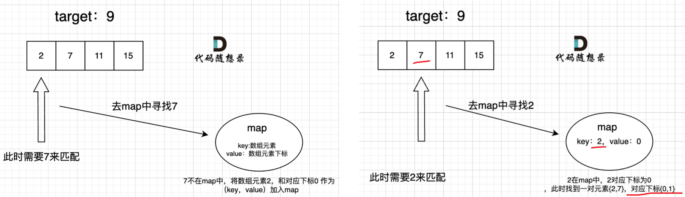

~~~C++
class Solution {
public:
    vector<int> twoSum(vector<int>& nums, int target) {
        
        // unordered_map ä¸é‡å¤ æ— åºkey 存放éå†è¿‡çš„元素
        unordered_map<int, int> umap; // < nums[i], 下标 i>

        for (int i = 0; i < nums.size(); i++)
        {
            //find 查找 target - nums[i] 在ä¸åœ¨ umap中
            if (umap.find(target - nums[i]) != umap.end()) 
            {
                return {umap[target - nums[i]], i}; // 找到，直æ¥è¿”å›ä¸‹æ ‡æ•°ç»„
            }
            umap.insert(pair<int, int>(nums[i], i));// 没找到，就存到umap里
        }

        return {}; // 没符åˆæ¡ä»¶çš„，返å›ç©ºæ•°ç»„
        
    }
};
~~~

时间å¤æ‚度：O(N)

空间å¤æ‚度：O(N)


**ACM** 

~~~C++
#include <iostream>
#include <vector>
#include <unordered_map>

using namespace std;

vector<int> twoSum(vector<int>& nums, int target)
{
	unordered_map<int, int> umap;
	for (int i = 0; i < nums.size(); i++)
	{
		if (umap.find(target - nums[i]) != umap.end())
		{
			return { umap[target - nums[i]], i };
		}
		umap.insert(pair<int, int>(nums[i], i));
	}
	
	return {};
}

int main() {
	int n, target; // 数组长度n，目标值target
	cin >> n >> target;
	vector<int> nums(n);

	for (int i = 0; i < n; i++) {
		cin >> nums[i]; // 输入数组元素
	}

	vector<int> result = twoSum(nums, target);

	if (!result.empty()) {
		cout << result[0] << " " << result[1] << endl;
	}
	else {
		cout << "No result" << endl;
	}

	return 0;

}
~~~

 示例输入：

~~~C++
4 9
2 7 11 15
~~~

示例输出：

~~~C++
0 1
~~~


## [49 å­—æ¯å¼‚ä½è¯åˆ†ç»„](https://leetcode.cn/problems/group-anagrams/description/?envType=study-plan-v2&envId=top-100-liked)


~~~C++
class Solution {
public:
    vector<vector<string>> groupAnagrams(vector<string>& strs) {

        // 哈希 
        // key: æ’åºå的字符串（异ä½è¯æ’åºå结æœç›¸åŒï¼‰
        // value: åŸå§‹å­—符串组æˆçš„列表（å±äºåŒä¸€ç»„的异ä½è¯ç»„åˆï¼‰--> å³ç­”案

        unordered_map<string, vector<string>> umap;

        for (string& s : strs)
        {
            // æ’åºstrs中æ¯ä¸€ä¸ªå­—符串
            string sorted_s = s;
            ranges::sort(sorted_s);// 按照ASCII值æ’åºs，æ’åºå异ä½è¯ä¼šå˜æˆç›¸åŒçš„字符串

            // sorted_s 相åŒçš„åŸå­—符串，归到一组
            umap[sorted_s].push_back(s);
        }

        // æ•´ç†è¿”å›çš„字符串数组
        vector<vector<string>> ans;
        ans.reserve(umap.size()); // 预分é…空间

        for (auto& [_, value] : umap) // éå†umap，解æ„umap，åªå…³å¿ƒvalue的值
        {
            ans.push_back(value); // æ¯ä¸ªåˆ†ç»„列表加入结æœ
        }

        return ans;    
    }
};
~~~


ACM

~~~C++
#include <iostream>
#include <vector>
#include <string>
#include <unordered_map>
#include <algorithm>

using namespace std;

vector<vector<string>> groupAnagrams(const vector<string>& strs)
{
    unordered_map<string, vector<string>> umap;

    for (const string& s : strs)
    {
        string sorted_s = s;
        // æ’åº åˆ†ç»„
        sort(sorted_s.begin(), sorted_s.end()); // 或者ranges::sort(sorted_s);
        umap[sorted_s].push_back(s);
    }

    vector<vector<string>> ans;
    ans.reserve(umap.size());
    for (auto& [_, value] : umap) 
    {
        ans.push_back(value);
    }

    return ans;
}

int main()
{
    int n; // 字符串数é‡
    cin >> n;
    vector<string> inputStr(n); // 字符串
    for (int i = 0; i < n; i++)
    {
        cin >> inputStr[i];
    }

    // 调用函数
    vector<vector<string>> result = groupAnagrams(inputStr);

    // 输出
    for (const auto& group : result)
    {
        for (const string& word : group)
        {
            cout << word << " ";
        }
        cout << endl;
    }

    return 0;
}
~~~

示例输入：

~~~C++
6
eat tea tan ate nat bat
~~~

示例输出：

~~~C++
eat tea ate 
tan nat 
bat 
~~~


## [128 最长è¿ç»­åºåˆ—](https://leetcode.cn/problems/longest-consecutive-sequence/?envType=study-plan-v2&envId=top-100-liked)


`contains()` 是 C++20 引入的æˆå‘˜å‡½æ•°ï¼Œç”¨äºåˆ¤æ–­æŸä¸ªå…ƒç´ æ˜¯å¦å­˜åœ¨äºå…³è”容器中。

将数组 nums ä¸­çš„æ‰€æœ‰å…ƒç´ å­˜å…¥ä¸€ä¸ªå“ˆå¸Œé›†åˆ st，这样å¯ä»¥åœ¨ **O(1)** 时间内判断æŸä¸ªæ•°æ˜¯å¦å­˜åœ¨ã€‚


~~~C++
class Solution {
public:
    int longestConsecutive(vector<int>& nums) {

        int ans = 0;

        // 把nums转æˆå“ˆå¸Œé›†åˆ （无åºä¸é‡å¤ï¼‰
        unordered_set<int> st(nums.begin(), nums.end());

        // 注æ„：这里éå†çš„是集åˆï¼Œä¸æ˜¯åŸæ•°ç»„
        for (int x : st)
        {
            // å¦‚æœ x-1 在集åˆä¸­ï¼Œè¯´æ˜ x ä¸æ˜¯æŸä¸ªè¿ç»­åºåˆ—的起点，跳过
            if (st.contains(x - 1))
            {
                continue;
            }

            // x 是åºåˆ—的起点
            int y = x + 1;
            while (st.contains(y)) // ä¸æ–­å‘å查找下一个数是å¦åœ¨å“ˆå¸Œé›†åˆä¸­
            {
                y++;
            }

            // 一直找知é“找ä¸åˆ°ä¸‹ä¸€ä¸ªè¿ç»­çš„数为止，此时的 y 是第一个ä¸åœ¨é›†åˆä¸­çš„æ•°
            // y - 1 就是最å一个在哈希集åˆä¸­çš„æ•°

            // 更新长度
            ans = max(ans, y - x); // [x, y-1]是一个è¿ç»­åºåˆ—，长度是 y - x
        }

        return ans;
    }
};
~~~

ACM 模å¼ï¼š

~~~C++
#include <vector>
#include <unordered_set>
#include <iostream>
#include <algorithm>


int longestConsecutive(const std::vector<int>& nums)
{
    int ans = 0;

    std::unordered_set<int> st(nums.begin(), nums.end()); // æ— åºä¸é‡å¤
    for (int x : st)
    {
        // å¦‚æœ x ä¸æ˜¯è¿ç»­åºåˆ—的起点，跳过
        if (st.find(x - 1) != st.end())
        {
            continue;
        }
        // x 是è¿ç»­åºåˆ—的起点，ä¸æ–­å‘å寻找下一个数
        int y = x + 1;
        while (st.find(y) != st.end())
        {
            y++;
        }

        ans = std::max(ans, y - x); // æ›´æ–°è¿ç»­åºåˆ—最大长度
    }

    return ans;
}


int main()
{
    int n;
    std::cin >> n; // 输入数字个数

    std::vector<int> nums(n);
    for (int i = 0; i < n; i++)
    {
        std::cin >> nums[i]; // 输入数组 nums
    }

    int result = longestConsecutive(nums);
    std::cout << result << std::endl;

    return 0;
}
~~~


# åŒæŒ‡é’ˆ ✅

## [283 移动零（快慢指针）](https://leetcode.cn/problems/move-zeroes/?envType=study-plan-v2&envId=top-100-liked)

@快慢指针


**å’Œ 27ã€ç§»é™¤å…ƒç´  相åŒï¼Œå¤šä¸€æ­¥slowåŠslow之å置零**

~~~C++
class Solution {
public:
    void moveZeroes(vector<int>& nums) {
        // 快慢指针

        int slowIndex = 0;
        int fastIndex = 0;

        for (fastIndex = 0; fastIndex < nums.size(); fastIndex++)
        {
            if (nums[fastIndex] != 0)
            {
                nums[slowIndex++] = nums[fastIndex]; // 覆盖 0
            }
        }

        // å°†slowIndexåŠslowIndex之å的元素都置零
        for (int i = slowIndex; i < nums.size(); i++)
        {
            nums[i] = 0;
        }

    }
};
~~~


ACM

~~~C++
#include <iostream>
#include <vector>

using namespace std;

void moveZero(vector<int>& nums)
{
    int slowIndex = 0;
    int fastIndex = 0;

    for (fastIndex = 0; fastIndex < nums.size(); fastIndex++)
    {
        if (nums[fastIndex] != 0)
        {
            nums[slowIndex++] = nums[fastIndex]; // åŸåœ°å‘å‰è¦†ç›–0
        }
    }

    for (int i = slowIndex; i < nums.size(); i++)
    {
        nums[i] = 0;
    }
}


int main() 
{
    int n;
    cin >> n; // 输入数组个数

    vector<int> nums(n);
    for (int i = 0; i < n; i++)
    {
        cin >> nums[i]; // 输入数组元素
    }

    moveZero(nums); // 移动 0

    for (int i = 0; i < n; i++)
    {
        cout << nums[i] << " "; // 输出移动0åçš„nums
    }
    cout << endl;

    return 0;
}
~~~

示例输入：

~~~C++
6
0 1 0 3 12 0
~~~

输出：

~~~C++
1 3 12 0 0 0
~~~


## [11 盛最多水的容器（收缩）](https://leetcode.cn/problems/container-with-most-water/description/?envType=study-plan-v2&envId=top-100-liked)

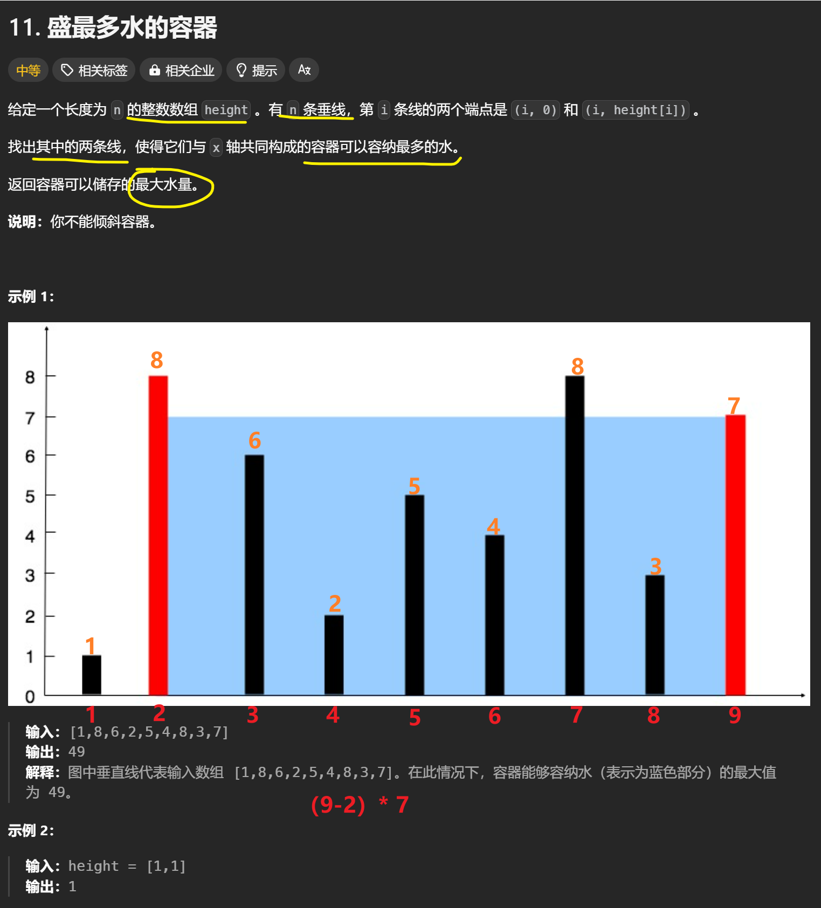


~~~C++
class Solution {
public:
    int maxArea(vector<int>& height) {

        // åŒæŒ‡é’ˆ 收缩
        
        int ans = 0;

        int left = 0;
        int right = height.size() - 1;

        while(left < right) // åªè¦ left < right 就还能æ„æˆçŸ©å½¢é¢ç§¯
        {
            int area = (right - left) * min(height[left], height[right]); // 矩形é¢ç§¯
            ans = max(ans, area); // ansä¿æŒæœ€å¤§å€¼

            // 移动短边
            height[left] < height[right] ? left++ : right--;

            // 因为短边能æ„æˆçš„最大的é¢ç§¯ï¼Œå°±æ˜¯area
        }
        
        return ans;
    }
};
~~~


ACM

~~~C++
#include <iostream>
#include <vector>

using namespace std;

int maxArea(vector<int>& height)
{
    int ans = 0;

    int left = 0;
    int right = height.size() - 1;

    while (left < right)
    {
        int area = (right - left) * min(height[left], height[right]);
        ans = max(ans, area);

        // 移动短边
        height[left] < height[right] ? left++ : right--;
    }

    return ans;
}

int main()
{
    int n;
    cin >> n; // height数组长度（柱å­æ•°é‡ï¼‰

    vector<int> height(n);
    for (int i = 0; i < n; i++)
    {
        cin >> height[i]; // 输入æ¯æ ¹æŸ±å­çš„高度
    }

    int result = maxArea(height);
    cout << result << endl; // 输出最大盛水é¢ç§¯

    return 0;
}
~~~

示例输入：

~~~C++
9
1 8 6 2 5 4 8 3 7
~~~

输出：

~~~C++
49
~~~


## [15 三数之和（收缩）](https://leetcode.cn/problems/3sum/description/?envType=study-plan-v2&envId=top-100-liked)

@åŒæŒ‡é’ˆæ”¶ç¼©


åŒæŒ‡é’ˆæ”¶ç¼©ï¼Œå¤§äº†å¾€å·¦ï¼Œå°äº†å¾€å³


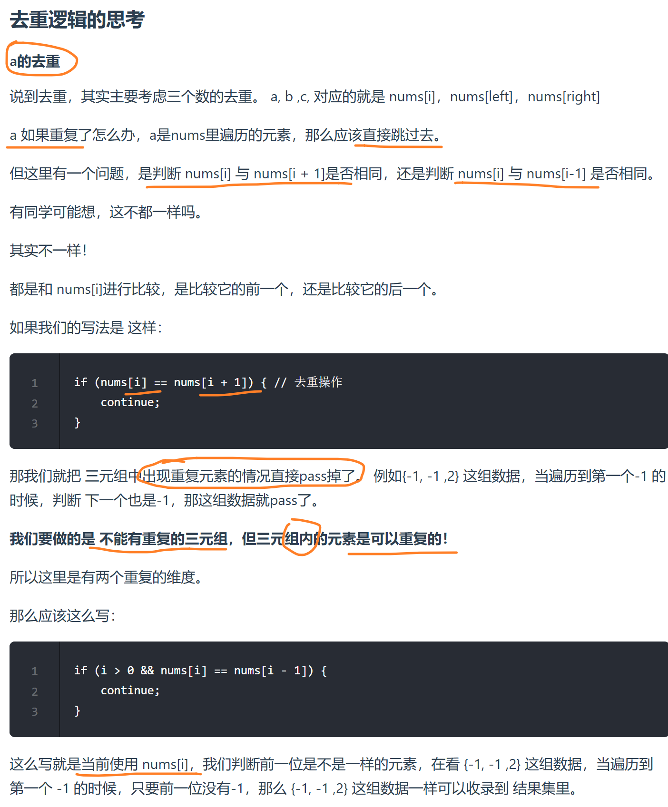


~~~C++
class Solution {
public:
    vector<vector<int>> threeSum(vector<int>& nums) {

        // å…ˆæ’åºnums
        sort(nums.begin(), nums.end());
        
        vector<vector<int>> result;
        
        for (int i = 0; i < nums.size(); i++)
        {
            // æ’åºå第一个元素已ç»å¤§äº0，ä¸å¯èƒ½å‡‘æˆä¸‰å…ƒç»„
            if (nums[i] > 0)    break;
            
            // å»é‡ a
            // 如æœiå’Œi-1元素相åŒï¼Œè¯´æ˜åé¢éå†ç»„åˆçš„三数之和在nums[i-1]的时候被组åˆè¿‡äº†ï¼Œè·³è¿‡
            if (i > 0 && nums[i] == nums[i - 1])    continue;

            // a = nums[i]  b = nums[left]  c = nums[right]   固定i，移动left right
            int left = i + 1;
            int right = nums.size() - 1;
            while(left < right) 
            {
                // 三数之和 > 0，rightå‘左移动，让和å˜å°
                if (nums[i] + nums[left] + nums[right] > 0) right--;
                
                // 三数之和 < 0，leftå‘å³ç§»åŠ¨ï¼Œè®©å’Œå˜å¤§
                else if (nums[i] + nums[left] + nums[right] < 0) left++;
                
                // 三数之和 = 0，找到一个三元组
                else 
                {
                    // 收集三元组
                    result.push_back(vector<int>{nums[i], nums[left], nums[right]});
                    
                    // å»é‡bå’Œc，å‘里收缩
                    while (right > left && nums[right] == nums[right - 1])	right--;
                    while (right > left && nums[left] == nums[left + 1])	left++;
                    
                    // 找到一组三元组å，leftå’ŒrightåŒæ—¶å‘里收缩，寻找下一组
                    right--;
                    left++;
                }
                
            }
        }

        return result;        
    }
};
~~~

时间å¤æ‚度：*O*(*n*2)

空间å¤æ‚度：O(1)


ACM

~~~C++
#include <iostream>
#include <vector>
#include <algorithm>

using namespace std;

vector<vector<int>> threeSum(vector<int>& nums) 
{
    vector<vector<int>> result;
    
    // æ’åºnums
    sort(nums.begin(), nums.end());

    // a = nums[i]  b = nums[left]   c = nums[right]
    for (int i = 0; i < nums.size(); i++)
    {
        // æ’åºå第一个元素已ç»å¤§äº0，ä¸å¯èƒ½å‡‘æˆä¸‰å…ƒç»„
        if (nums[i] > 0)    break;
        
        // å»é‡ a
        if (i > 0 && nums[i] == nums[i - 1])    continue;

        // 移动left right 判断三数之和
        int left = i + 1;
        int right = nums.size() - 1;
        while(left < right)
        {
            if (nums[i] + nums[left] + nums[right] > 0) right--;
            else if (nums[i] + nums[left] + nums[right] < 0) left++;
            else // 三数之和 = 0，找到一个三元组
            {
                // 收集三元组
                result.push_back(vector<int>{nums[i], nums[left], nums[right]});
                // å»é‡bå’Œc，å‘里收缩
                while (right > left && nums[right] == nums[right - 1])
                {
                    right--;
                }
                while (right > left && nums[left] == nums[left + 1])
                {
                    left++;
                }
                // 找到一组三元组å，leftå’ŒrightåŒæ—¶å‘里收缩，寻找下一组
                right--;
                left++;
            }
        }
    }
    return result;        
}


int main()
{
    int n;
    cin >> n; // nums数组长度

    vector<int> nums(n);
    for (int i = 0; i < n; i++)
    {
        cin >> nums[i]; // 输入nums数组
    }

    vector<vector<int>> result = threeSum(nums);

    for (int i = 0; i < result.size(); i++)
    {
        for (int j = 0; j < result[i].size(); j++)
        {
            cout << result[i][j] << " ";
        }
        cout << endl;
    }
    
    return 0;
}
~~~


## 42 [æ¥é›¨æ°´](https://leetcode.cn/problems/trapping-rain-water/description/?envType=study-plan-v2&envId=top-100-liked)

@å‰ç¼€å’Œ @åŒæŒ‡é’ˆæ”¶ç¼©


### 1ã€å‰å缀分离

分割æˆæ¯ä¸ª height[i] 一å—，把æ¯å—看æˆæ˜¯å®½åº¦æ˜¯1，高度为 height[i] 的水桶，能盛多少水，**å–决äºå·¦å³ä¸¤è¾¹æŒ¡æ¿çš„短æ¿æœ‰å¤šé«˜**，也就是当å‰height[i]**å‰å的最高高度å–较å°å€¼**。


height[i] çš„**ã€å·¦è¾¹æœ€é«˜é«˜åº¦ï¼Œå³è¾¹æœ€é«˜é«˜åº¦ã€‘å–最å°å€¼**，å†**å‡å» height[i]** 就是当å‰è¿™ä¸ªå—能盛的水的高度，也å³é¢ç§¯ï¼ˆåº•éƒ¨å®½åº¦ä¸º1）。

~~~C++
ans += min(pre_max[i], suf_max[i]) - height[i]; // æ¯å—çš„é¢ç§¯ï¼Œå®½åº¦æ˜¯1
~~~

~~~C++
class Solution {
public:
    int trap(vector<int>& height) {
        
        // å‰å缀分离
		// 时间å¤æ‚度 O(n)   空间å¤æ‚度 O(n)
        int n = height.size();

        // ä» height[0] 到 height[i] 的最大值，ä»å‰å‘å
        vector<int> pre_max(n); 
        pre_max[0] = height[0];
        for (int i = 1; i < n; i++)	pre_max[i] = max(pre_max[i - 1], height[i]);
        
        // ä» height[n-1] 到 height[i] 的最大值，ä»åå‘å‰
        vector<int> suf_max(n); 
        suf_max[n - 1] = height[n - 1];
        for (int i = n - 2; i >= 0; i--)	suf_max[i] = max(suf_max[i + 1], height[i]);
        

        int ans = 0;
        for (int i = 0; i < n; i++)
        {
            // å– å‰ç¼€å缀的较å°å€¼ - height[i] 作为当å‰ç››æ°´çš„高度
            ans += min(pre_max[i], suf_max[i]) - height[i]; // æ¯å—çš„é¢ç§¯ï¼Œå®½åº¦æ˜¯1
        }

        return ans;
    }
};
~~~


ACM：

~~~C++
#include <iostream>
#include <vector>
#include <algorithm>

using namespace std;

int trap(vector<int>& height) 
{
    int n = height.size();

    // å‰ç¼€æœ€å¤§å€¼
    vector<int> pre_max(n);
    pre_max[0] = height[0];
    for (int i = 1; i < n; i++)
    {
        pre_max[i] = max(pre_max[i - 1], height[i]);
    }
    // å缀最大值
    vector<int> suf_max(n);
    suf_max[n - 1] = height[n - 1];
    for (int i = n - 2; i >= 0; i--)
    {
        suf_max[i] = max(suf_max[i + 1], height[i]);
    }

    int ans = 0;
    for (int i = 0; i < n; i++)
    {
        ans += min(suf_max[i], pre_max[i]) - height[i]; // 累加é¢ç§¯
    }
    return ans;
    
}

int main()
{
    int n;
    cin >> n; // 输入height长度

    vector<int> height(n);
    for (int i = 0; i < n; i++)
    {
        cin >> height[i]; // 输入height数组
    }

    int result = trap(height);
    cout << result << endl;

    return 0;
}
~~~

示例输入：

~~~C++
12
0 1 0 2 1 0 1 3 2 1 2 1
~~~

输出：

~~~C++
6
~~~


### 2ã€ç›¸å‘åŒæŒ‡é’ˆ


**总结：**æ¥æ°´å¤šå°‘ç”±**短的木æ¿**决定，left right指针å‘中间收缩

æ¥æ°´çš„高度由å‰ç¼€æœ€å¤§å€¼å’Œå缀最大值中的**较å°å€¼**决定，左å³æŒ‡é’ˆè°å°è°ç§»åŠ¨ï¼Œç›¸é‡ä½ç½®ä¼šæ˜¯æœ€é«˜

- 如æœ**å‰ç¼€æœ€å¤§å€¼ < å缀最大值**，这个木桶的容é‡å°±æ˜¯**å‰ç¼€æœ€å¤§å€¼-height[left]**，算完之åleft指针**å‘å³**ï¼›
- 如æœ**å缀最大值 < å‰ç¼€æœ€å¤§å€¼**，这个木桶的容é‡å°±æ˜¯**å缀最大值-height[right]**，算完之åright指针**å‘å·¦**

~~~C++
class Solution {
public:
    int trap(vector<int>& height) {

        // 相å‘åŒæŒ‡é’ˆ
        // 时间å¤æ‚度 O(n)   空间å¤æ‚度 O(1)
        int ans = 0;

        int left = 0, right = height.size() - 1; // å·¦å³æŒ‡é’ˆï¼Œå‘中间移动

        int pre_max = 0, suf_max = 0; // å‰å缀最大值

        while (left < right) // å¯ä»¥ä¸åŠ ç­‰å·ï¼Œå› ä¸ºåœ¨ã€Œè°å°ç§»åŠ¨è°ã€çš„规则下，相é‡çš„ä½ç½®ä¸€å®šæ˜¯æœ€é«˜çš„柱å­ï¼Œè¿™ä¸ªæŸ±å­æ˜¯æ— æ³•æ¥æ°´çš„
        {
            pre_max = max(pre_max, height[left]);
            suf_max = max(suf_max, height[right]);

            // 找能确定的较短的柱å­
            if (pre_max < suf_max)
            {
                ans += pre_max - height[left];
                left++; 
            }
            else
            {
                ans += suf_max - height[right];
                right--;
            }
        }

        return ans;        
    }
};
~~~


# æ»‘åŠ¨çª—å£ âœ…

## 3 [æ— é‡å¤å­—符的最长å­ä¸²](https://leetcode.cn/problems/longest-substring-without-repeating-characters/description/?envType=study-plan-v2&envId=top-100-liked)

@滑动窗å£


~~~C++
class Solution {
public:
    int lengthOfLongestSubstring(string s) {

        int n = s.size();
        int ans = 0; // 窗å£é•¿åº¦ï¼Œå³æœ€é•¿ä¸é‡å¤å­ä¸²é•¿åº¦

        // çª—å£ [left, right]
        int left = 0;
        int right = 0;

        unordered_map<char, int> cnt; // cnt <出ç°çš„字符，字符出ç°çš„次数>

        for (right = 0; right < n; right++) // right++, 窗å£å³ç§»
        { 
            char c = s[right];
            cnt[c]++; // é‡åˆ°çš„字符，次数+1

            // cnt[c] > 1 说æ˜æœ‰é‡å¤å­—符
            while (cnt[c] > 1)
            {
                cnt[s[left]]--; // 左边界收缩，å»é™¤ä¸€ä¸ªå·¦è¾¹ç•Œå­—符的数é‡
                left++; // 缩å°çª—å£
            }

            ans = max(ans, right - left + 1); // 更新窗å£é•¿åº¦æœ€å¤§å€¼
        }

        return ans;    
    }
};
~~~


ACM 

~~~C++
#include <iostream>
#include <string>
#include <unordered_map>

using namespace std;

int lengthOfLongestSubstring(const string& s)
{
    int ans = 0;

    int left = 0; 
    int right = 0;

    unordered_map<char, int> cnt; // <字符，字符出ç°æ¬¡æ•°>

    for (right = 0; right < s.size(); right++)
    {
        char c = s[right];
        cnt[c]++; // 统计字符出ç°æ¬¡æ•°

        while (cnt[c] > 1)
        {
            cnt[s[left]]--;
            left++;
        }

        ans = max(ans, right - left + 1);
    }

    return ans;
}

int main()
{
    string s;
    cin >> s; // 输入字符串

    int result = lengthOfLongestSubstring(s);
    cout << result << endl;

    return 0;
}
~~~

示例输入：

~~~C++
abcabcbb
~~~

输出：

~~~C++
3
~~~


## 438 [找到字符串中所有的字æ¯å¼‚ä½è¯](https://leetcode.cn/problems/find-all-anagrams-in-a-string/description/?envType=study-plan-v2&envId=top-100-liked)

@滑动窗å£


### 1ã€å®šé•¿çª—å£ï¼ˆæ¨è）


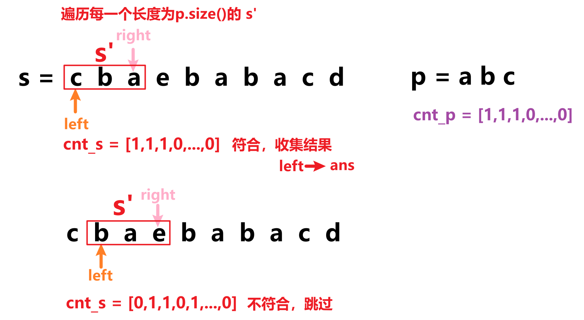

~~~C++
class Solution {
public:
    vector<int> findAnagrams(string s, string p) { // s = "cbaebabacd", p = "abc"

        // 定长滑动窗å£s'  窗å£é•¿åº¦æ˜¯p.size()

        vector<int> ans;

        vector<int> cnt_p(26); // p 中的æ¯ä¸ªå­—æ¯å‡ºç°æ¬¡æ•°
        vector<int> cnt_s(26); // 窗å£å­ä¸² s'çš„æ¯ä¸ªå­—æ¯å‡ºç°æ¬¡æ•°

        for (char c : p)
        {
            cnt_p[c - 'a']++; // å­—æ¯å¯¹åº”下标ä½ç½®çš„æ•°++
        }

        for (int right = 0; right < s.size(); right++) // å³è¾¹ç•Œ++
        {
            cnt_s[s[right] - 'a']++; // å³è¾¹ç•Œå­—æ¯è¿›å…¥çª—å£ s'
            int left = right - p.size() + 1;// 左边界 窗å£é•¿åº¦æ˜¯p.size()

            // 窗å£é•¿åº¦ä¸å¤Ÿp.size() 跳过
            if (left < 0)   continue; 

            // s'å’Œ p çš„æ¯ç§å­—æ¯å‡ºç°æ¬¡æ•°ç›¸åŒï¼Œæ”¶é›†ç»“æœ
            if (cnt_s == cnt_p)
            {
                ans.push_back(left); // s'的左边界下标加入结æœ
            }

            cnt_s[s[left] - 'a']--; // æ¥ä¸‹æ¥è¿›å…¥ä¸‹ä¸€ç»„s', 左边界字æ¯ç¦»å¼€çª—å£ï¼Œæ¬¡æ•°--
        }

        return ans;  
    }
};
~~~


ACM

~~~C++
#include <vector>
#include <string>
#include <iostream>

using namespace std;

// s = "cbaebabacd", p = "abc"
vector<int> findAnagrams(const string& s, const string& p)
{
    vector<int> ans;

    vector<int> cnt_s(26);
    vector<int> cnt_p(26);

    for (char c : p)
    {
        cnt_p[c - 'a']++;
    }

    for (int right = 0; right < s.size(); right++)
    {
        cnt_s[s[right] - 'a']++;
        int left = right - p.size() + 1;

        if(left < 0)    continue;

        if (cnt_s == cnt_p)
        {
            ans.push_back(left);
        }

        cnt_s[s[left] - 'a']--;
    }

    return ans;
}


int main()
{
    string s;
    string p;
    cin >> s >> p; // 输入字符串 s p

    vector<int> result = findAnagrams(s, p);
    for (int idx : result)
    {
        cout << idx << " ";
    }
    cout << endl;
    
    return 0;
}
~~~

示例输入：

~~~C++
cbaebabacd abc
~~~

输出：

~~~C++
0 6
~~~


### 2ã€å˜é•¿çª—å£


~~~C++
class Solution {
public:
    vector<int> findAnagrams(string s, string p) { // s = "cbaebabacd", p = "abc"

        // ä¸å®šé•¿çª—å£

        vector<int> ans;

        vector<int> cnt(26); // 统计字æ¯ï¼Œåˆå¹¶äº† cnt_s å’Œ cnt_p

        for (char c : p)
        {
            cnt[c - 'a']++;
        }

        int left = 0;
        for (int right = 0; right < s.size(); right++)
        {
            int c = s[right] - 'a';
            cnt[c]--; // å³ç«¯å­—符进入窗å£ï¼Œæ¶ˆå»å¯¹åº”字符在cnt中的个数

            // 窗å£é‡Œcnt[c]对应字符消å»å¤ªå¤šäº†ï¼Œè¶…过了p的需求，收缩左边界，直到cnt>=0
            while (cnt[c] < 0)
            {
                cnt[s[left] - 'a']++; // 左端点离开，次数å†è¡¥ç»™cnt
                left++;
            }

            // 因为当出ç°ä¸å±äºp的字符，或者字符é‡å¤æ—¶ï¼Œçª—å£å·²ç»è¢«ä¸Šé¢çš„while处ç†äº†
            // 根本到ä¸äº† 窗å£é•¿åº¦ = p.size() 这一步

            // 所以åªè¦é‡åˆ° 窗å£é•¿åº¦ = p.size()，就说æ˜å½“å‰çª—å£æ‰¾åˆ°äº†ç»“æœ
            if (right - left + 1 == p.size())
            {
                ans.push_back(left);
            }
        }

        return ans;
    }
};
~~~


# å­ä¸² ✅

## [560 和为kçš„å­æ•°ç»„](https://leetcode.cn/problems/subarray-sum-equals-k/description/?envType=study-plan-v2&envId=top-100-liked)

@å‰ç¼€å’Œ


**å­æ•°ç»„çš„å’Œå¯ä»¥ç”±==两个å‰ç¼€å’Œä¹‹å·®==表示**


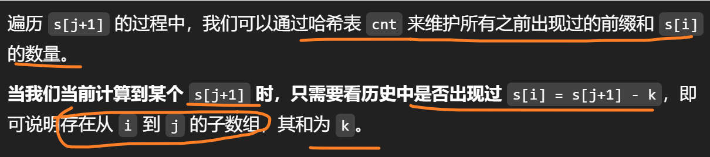


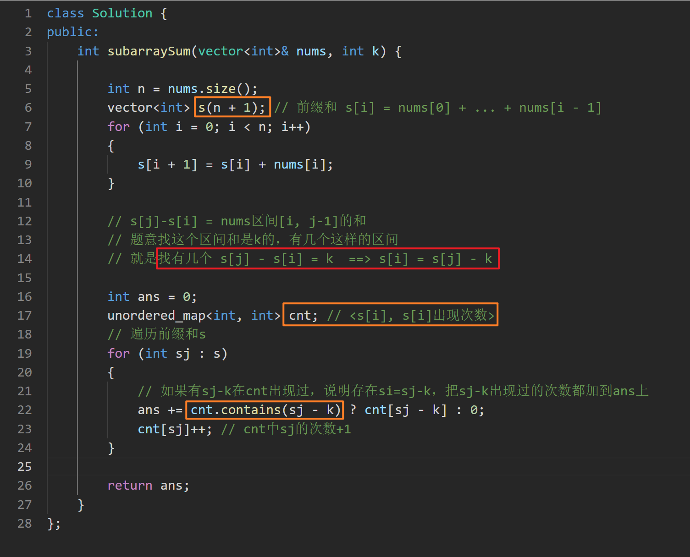

~~~C++
class Solution {
public:
    int subarraySum(vector<int>& nums, int k) {

        int n = nums.size();
        vector<int> s(n + 1); // å‰ç¼€å’Œ s[i] = nums[0] + ... + nums[i - 1]
        for (int i = 0; i < n; i++)
        {
            s[i + 1] = s[i] + nums[i];
        }

        // s[j] - s[i] = nums区间[i, j-1]的和
        // 题æ„找这个区间和是k的，有几个这样的区间
        // 就是找有几个 s[j] - s[i] = k ==> s[i] = s[j] - k

        int ans = 0;
        unordered_map<int, int> cnt; // <s[i], s[i]出ç°æ¬¡æ•°>

        // 注æ„ï¼ï¼ï¼éå†çš„是å‰ç¼€å’Œ s
        for (int sj : s)
        {
            // 如æœæœ‰ sj - k 在cnt出ç°è¿‡ï¼Œè¯´æ˜å­˜åœ¨ si = sj - k，把 sj - k 出ç°è¿‡çš„次数都加到ans上
            ans += cnt.contains(sj - k) ? cnt[sj - k] : 0;
            cnt[sj]++; // cnt中当å‰sj的次数+1
        }
        
        return ans;
    }
};
~~~


ACM

~~~C++
#include <vector>
#include <unordered_map>
#include <iostream>

using namespace std;

int subarraySum(const vector<int>& nums, int k)
{
    int n = nums.size();

    vector<int> s(n + 1, 0); // å‰ç¼€å’Œ
    for (int i = 0; i < n; i++)
    {
        s[i + 1] = s[i] + nums[i];
    }

    // s[j] - s[i] = k => s[i] = s[j] - k

    int ans = 0;
    unordered_map<int, int> cnt; // <s[i], s[i]出ç°çš„次数>
    for (int sj : s)
    {
        if (cnt.count(sj - k))
        {
            ans += cnt[sj - k];
        }
        cnt[sj]++;
    }
    
    return ans;
}


int main() 
{
    int n, k;
    cin >> n >> k; // 输入nums长度 和 k

    vector<int> nums(n);
    for (int i = 0; i < n; i++)
    {
        cin >> nums[i]; // 输入nums
    }

    int result = subarraySum(nums, k);
    cout << result << endl;

    return 0;
}
~~~

示例输入：

~~~C++
3 2
1 1 1
~~~

输出：

~~~C++
2
~~~


## [239 滑动窗å£æœ€å¤§å€¼](https://leetcode.cn/problems/sliding-window-maximum/description/?envType=study-plan-v2&envId=top-100-liked)

@å•è°ƒé˜Ÿåˆ—


~~~C++
class Solution {
private:
    // dequeå®ç°å•è°ƒé˜Ÿåˆ— ä»å¤§åˆ°å°
    class MyQueue
    {
    public:
        deque<int> que; // 使用dequeå®ç°å•è°ƒé˜Ÿåˆ—

        // push
        void push(int value)
        {
            // å³å°†æ”¾è¿›queçš„value > backå…¥å£æ•°å€¼ï¼Œå°±å°†queå端的数值弹出，直到value < å…¥å£
            // ä¿è¯é˜Ÿåˆ—å‰é¢éƒ½æ˜¯æ¯”value大的值，æ‰èƒ½ä»å¤§åˆ°å°
            while (!que.empty() && value > que.back())  que.pop_back();
            que.push_back(value);
        }

        // pop
        void pop(int value)
        {
            // æ¯æ¬¡pop比较è¦å¼¹å‡ºçš„数值，是å¦ç­‰äºque出å£çš„数值，如æœç›¸ç­‰åˆ™å¼¹å‡º
            if (!que.empty() && value == que.front())   que.pop_front();
        }

        // getMaxvalue 查询当å‰é˜Ÿåˆ—里的最大值，直æ¥è¿”å›queçš„front
        int getMax()
        {
            return que.front();
        }
    };


public:
    vector<int> maxSlidingWindow(vector<int>& nums, int k) {

        vector<int> result;

        MyQueue que; // 创建å•è°ƒé˜Ÿåˆ—
        
        // å‰k个元素（第一个窗å£ï¼‰æ”¾å…¥que
        for (int i = 0; i < k; i++)
        {
            que.push(nums[i]); // push的时候已ç»ä¿è¯äº†å•è°ƒ
        }
        result.push_back(que.getMax()); // result 记录第一个窗å£æœ€å¤§å€¼

        // 继续计算åé¢çš„窗å£
        for (int i = k; i < nums.size(); i++)
        {
            que.pop(nums[i - k]); // 移动窗å£ï¼Œpop出que中当å‰çª—å£çš„第一个元素
            que.push(nums[i]); // 新元素push进新窗å£

            result.push_back(que.getMax()); // 记录当å‰çª—å£å†…的最大值
        }
        
        return result;
        
    }
};
~~~


ACM

~~~C++
#include <iostream>
#include <deque>
#include <vector>

using namespace std;

// å•è°ƒé˜Ÿåˆ—ç±»
class MyQueue
{
public:
    deque<int> que;
    
    // push ä¿è¯ä»å¤§åˆ°å°
    void push(int value)
    {
        while (!que.empty() && value > que.back()) // 如æœvalue > que.back() 就弹出åŸæ¥è¾ƒå°çš„back
        {
            que.pop_back();
        }
        que.push_back(value); // 新值放进å»ï¼Œé˜Ÿåˆ—å‰é¢æ˜¯æ¯”value大的值，æ‰èƒ½ä»å¤§åˆ°å°
    }

    // pop 窗å£æ»‘出元素ä¸é˜Ÿå¤´ç›¸ç­‰æ—¶å¼¹å‡º
    void pop(int value)
    {
        if (!que.empty() && value == que.front())
        {
            que.pop_front();
        }
    }

    // getMax è¿”å›å½“å‰çª—å£çš„最大值（就是队列的front）
    int getMax()
    {
        return que.front();
    }

};

// è¿”å›æ»‘动窗å£ä¸­çš„最大值
vector<int> maxSlidingWindow(const vector<int>& nums, int k)
{
    vector<int> result;
    MyQueue que;

    // åˆå§‹åŒ–å‰k个元素（第一个窗å£ï¼‰
    for (int i = 0; i < k; i++)
    {
        que.push(nums[i]);
    }
    result.push_back(que.getMax());

    // 开始滑动窗å£
    for (int i = k; i < nums.size(); i++)
    {
        que.pop(nums[i - k]);
        que.push(nums[i]);
        result.push_back(que.getMax());
    }

    return result;
}

int main()
{
    int n, k;
    cin >> n >> k; // 输入nums元素个数，和窗å£å¤§å°k

    vector<int> nums(n);
    for (int i = 0; i < n; i++)
    {
        cin >> nums[i]; // 输入nums元素
    }

    vector<int> ans = maxSlidingWindow(nums, k);
    for (int x : ans)
    {
        cout << x << " ";
    }
    cout << endl;

    return 0;
}
~~~

示例输入：

~~~C++
8 3 
1 3 -1 -3 5 3 6 7
~~~

输出：

~~~C++
3 3 5 5 6 7 
~~~


## 76 [最å°è¦†ç›–å­ä¸²](https://leetcode.cn/problems/minimum-window-substring/?envType=study-plan-v2&envId=top-100-liked)

@滑动窗å£

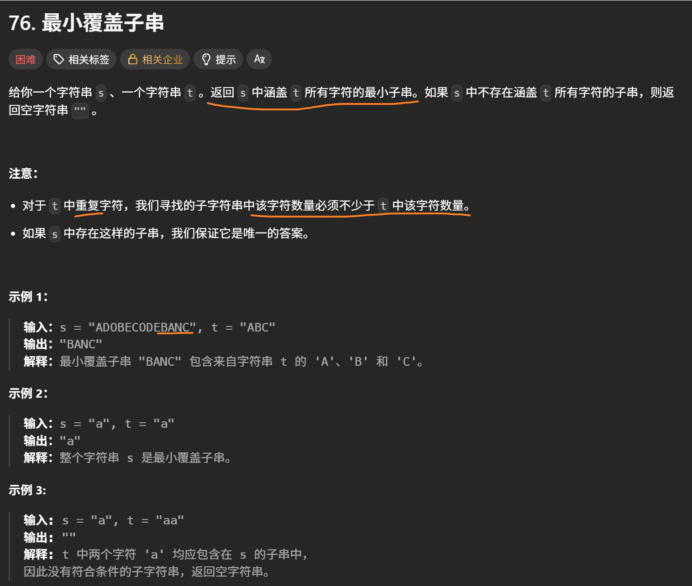		


~~~C++
class Solution {
public:
    // 判断å­ä¸²æ˜¯å¦è¦†ç›–（字æ¯å‡ºç°æ¬¡æ•°ï¼‰
    bool is_covered(int cnt_s[], int cnt_t[]) 
    {
        for (int i = 'A'; i <= 'Z'; i++)
        {
            if (cnt_s[i] < cnt_t[i])
            {
                return false;
            }
        }

        for (int i = 'a'; i <= 'z'; i++)
        {
            if (cnt_s[i] < cnt_t[i])
            {
                return false;
            }
        }
        
        return true;
    }

    string minWindow(string s, string t) {
        
        int m = s.length();

        int ans_left = -1, ans_right = m; // 最短å­ä¸²çš„å·¦å³ç«¯ç‚¹

        int cnt_s[128]{}; // s å­ä¸²å­—æ¯çš„出ç°æ¬¡æ•°
        int cnt_t[128]{}; // t 中字æ¯çš„出ç°æ¬¡æ•°
        for (char c : t)
        {
            cnt_t[c]++;
        }

        // éå† s
        int left = 0;
        for (int right = 0; right < m; right++)
        {
            cnt_s[s[right]]++; // å³ç«¯ç‚¹å­—æ¯ç§»å…¥å­ä¸²
            
            while (is_covered(cnt_s, cnt_t)) // så­ä¸²æ¶µç›–t
            {
                if (right - left < ans_right - ans_left) // 当å‰å­ä¸²æ›´çŸ­ï¼Œæ›´æ–°ç«¯ç‚¹
                {
                    ans_left = left;
                    ans_right = right; 
                }

                cnt_s[s[left]]--; // 左端点字æ¯ç§»å‡ºå­ä¸²
                left++;
            }
        }

        // è¿”å›å­ä¸²
        return ans_left < 0 ? "" : s.substr(ans_left, ans_right - ans_left + 1);
        
    }
};
~~~


ACM

~~~C++
#include <string>
#include <iostream>

using namespace std;

// 判断å­ä¸²æ˜¯å¦è¦†ç›– t 中所有字符
bool is_covered(int cnt_s[], int cnt_t[])
{
    for (int i = 'A'; i <= 'Z'; i++) 
    {
        if (cnt_s[i] < cnt_t[i]) return false;
    }

    for (int i = 'a'; i <= 'z'; i++) 
    {
        if (cnt_s[i] < cnt_t[i]) return false;
    }

    return true;
}

// 求最å°è¦†ç›–å­ä¸²
string minWindow(const string& s, const string& t)
{
    int m = s.length();

    int ans_left = -1, ans_right = m;

    int cnt_s[128] = {0};
    int cnt_t[128] = {0};
    for (char c : t)
    {
        cnt_t[c]++;
    }

    // éå† s
    int left = 0;
    for (int right = 0; right < m; right++)
    {
        cnt_s[s[right]]++;

        // 如æœç¬¦åˆè¦†ç›–，更新最短å­ä¸²ç«¯ç‚¹ï¼Œå·¦ç§»left
        while (is_covered(cnt_s, cnt_t))
        {
            if (right - left < ans_right - ans_left)
            {
                ans_left = left;
                ans_right = right;
            }

            cnt_s[s[left]]--;
            left++;
        }
    }

    return (ans_left < 0) ? "" : s.substr(ans_left, ans_right - ans_left + 1);
}


int main()
{
    string s, t;
    cin >> s >> t;

    string result = minWindow(s, t);
    cout << result << endl;

    return 0;
}
~~~

示例输入：

~~~C++
ADOBECODEBANC ABC
~~~

输出：

~~~C++
BANC
~~~


# 普通数组 ✅


## 53 [最大å­æ•°ç»„å’Œ](https://leetcode.cn/problems/maximum-subarray/description/?envType=study-plan-v2&envId=top-100-liked)

@动æ€è§„划 @贪心


### 贪心

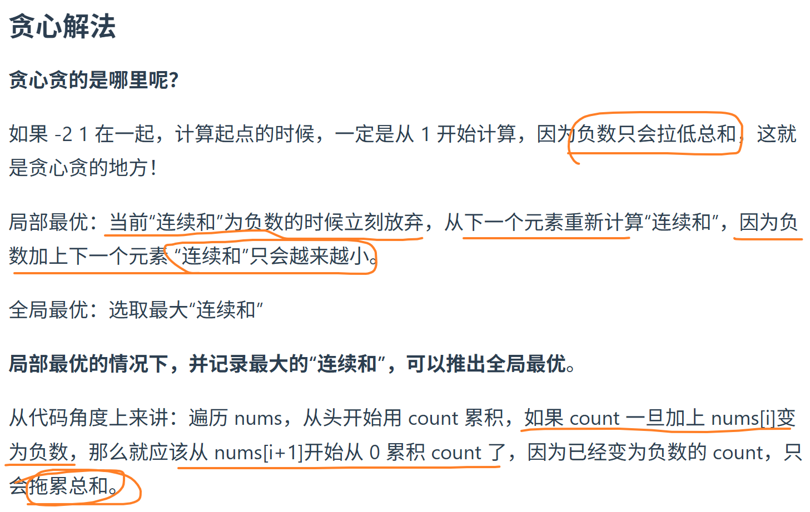


~~~C++
class Solution {
public:
    int maxSubArray(vector<int>& nums) {

        // 贪心

        // 注æ„找的åªæ˜¯ ã€æœ€å¤§å’Œã€‘，没让找å­æ•°ç»„

        // 主è¦æ€è·¯ï¼šè´Ÿæ•°åªä¼šæ‹–累加和，所以é‡åˆ°å’Œå˜æˆè´Ÿçš„，èˆå¼ƒï¼Œè´Ÿçš„åªä¼šå‡å°åé¢çš„加和
        
        int result = INT32_MIN;
        int count = 0;

        // 记录è¿ç»­å’Œcount，如æœcount < 0，èˆå¼ƒï¼Œå†ä»ä¸‹ä¸€ä¸ªæ•°å¼€å§‹è®¡å’Œ
        for (int i = 0; i < nums.size(); i++)
        {
            count += nums[i];
            result = max(count, result); // æ›´æ–°result，å–大的count
            
            if (count <= 0)	count = 0; // èˆå¼ƒï¼Œä»ä¸‹ä¸€ä¸ªæ•°nums[i + 1]é‡æ–°åŠ å’Œ
        }

        return result;
    }
};
~~~


### 动æ€è§„划


~~~C++
class Solution {
public:
    int maxSubArray(vector<int>& nums) {
        
        if (nums.size() == 0)   return 0;
        
        // 动æ€è§„划

        // dp[i] - 以nums[i]结尾(包括)的最大è¿ç»­å­åºåˆ—和为dp[i]
        vector<int> dp(nums.size());

        // åˆå§‹åŒ–
        dp[0] = nums[0];

        int result = dp[0];

        // 递æ¨
        for (int i = 1; i < nums.size(); i++)
        {
            dp[i] = max(dp[i - 1] + nums[i], nums[i]);// 两ç§æ¨å‡ºdp[i]çš„æ–¹å¼ï¼Œå–max

            if (dp[i] > result) result = dp[i]; // å–dp[i]的最大值返å›
        }

        return result;  
    }
};
~~~


ACM

~~~C++
#include <iostream>
#include <vector>
#include <algorithm>
#include <cstdint>

using namespace std;

// 力扣53 最大å­æ•°ç»„å’Œ

/**************  动æ€è§„划 *****************/ 
// int maxSubArray(const vector<int>& nums)
// {
//     if (nums.size() == 0)   return 0;

//     // 动æ€è§„划
//     vector<int> dp(nums.size()); // 以nums[i]结尾(包括)的最大è¿ç»­å­åºåˆ—和为dp[i]
//     dp[0] = nums[0];

//     int result = dp[0];

//     for (int i = 1; i < nums.size(); i++)
//     {
//         dp[i] = max(dp[i - 1] + nums[i], nums[i]);
//         result = max(result, dp[i]);
//     }

//     return result;
// }


/**************  贪心 *****************/ 
int maxSubArray(const vector<int>& nums)
{
    int result = INT32_MIN;
    int count = 0;

    // 记录è¿ç»­å’Œcount，如æœcount < 0，èˆå¼ƒï¼Œå†ä»ä¸‹ä¸€ä¸ªæ•°å¼€å§‹è®¡å’Œ (è´Ÿçš„åªä¼šå‡å°åé¢çš„加和)
    for (int i = 0; i < nums.size(); i++)
    {
        count += nums[i];
        if (result < count) result = count;
        if (count <= 0)  count = 0; // èˆå¼ƒï¼Œä»ä¸‹ä¸€ä¸ªæ•°nums[i + 1]é‡æ–°åŠ å’Œ
    }

    return result;
}


int main()
{
    int n;
    cin >> n; // 输入数组元素个数

    vector<int> nums(n);
    for (int i = 0; i < n; i++)
    {
        cin >> nums[i]; // 输入数组
    }

    int result = maxSubArray(nums);
    cout << result << endl;

    return 0;
}

~~~

示例输入：

~~~shell
9
-2 1 -3 4 -1 2 1 -5 4
~~~

输出：

~~~shell
6 #对应 [4, -1, 2, 1]
~~~


## 56 [åˆå¹¶åŒºé—´](https://leetcode.cn/problems/merge-intervals/description/?envType=study-plan-v2&envId=top-100-liked)

@贪心


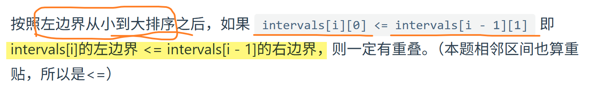


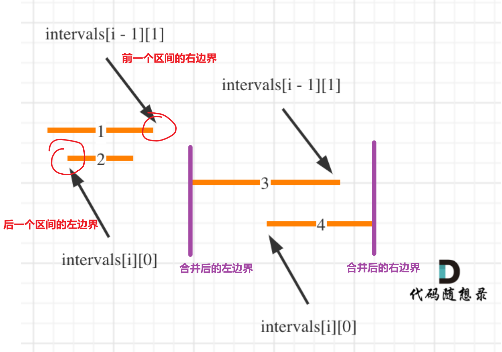


~~~C++
class Solution {
public:
    vector<vector<int>> merge(vector<vector<int>>& intervals) {

        if (intervals.size() == 0)  return intervals;

        // 先按左边界æ’åºï¼Œä»å°åˆ°å¤§ (lambda)
        sort(intervals.begin(), intervals.end(),
                [](const vector<int>& a, const vector<int>& b) {return a[0] < b[0];} );

        vector<vector<int>> result;
        result.push_back(intervals[0]); // 第一个区间放进result
        for (int i = 1; i < intervals.size(); i++)
        {
            // 有é‡å ï¼Œæ›´æ–°å‰ä¸€ä¸ªèŒƒå›´çš„å³è¾¹ç•Œ 
            if (intervals[i][0] <= result.back()[1]) // 需è¦<=，边界é‡å ä¹Ÿç®—
            {
                // æ›´æ–°å³è¾¹ç•Œï¼Œè¦æ¯”较å–较大值，ä¸èƒ½ç›´æ¥å–æ–°çš„intervals[i][1]
                result.back()[1] = max(result.back()[1], intervals[i][1]); 
            }
            // æ— é‡å ï¼Œç›´æ¥æ”¾è¿›result
            else 
            {
                result.push_back(intervals[i]);
            }
        }

        return result;  
    }
};
~~~


lambda表达å¼ï¼š

~~~C++
  // 先按左边界æ’åºï¼Œä»å°åˆ°å¤§ (lambda)
  sort(intervals.begin(), intervals.end(),
          [](const vector<int>& a, const vector<int>& b) {return a[0] < b[0];});
~~~

如æœç”¨ä»¿å‡½æ•°ï¼š

~~~C++
class Solution {
public:
    // 仿函数
    static bool cmp (const vector<int>& a, const vector<int>& b)
    {
        return a[0] < b[0];
    }

    vector<vector<int>> merge(vector<vector<int>>& intervals) {

        if (intervals.size() == 0)  return intervals;

        // 先按左边界æ’åºï¼Œä»å°åˆ°å¤§ (lambda)
        sort(intervals.begin(), intervals.end(), cmp); // 替æ¢æˆ cmp
		
        // ...
    }
};
~~~


ACM

~~~C++
#include <iostream>
#include <vector>
#include <algorithm>

using namespace std;

vector<vector<int>> merge(vector<vector<int>>& intervals)
{
    if (intervals.size() == 0)  return intervals;

    // 按左边界æ’åº ä»å°åˆ°å¤§
    sort(intervals.begin(), intervals.end(),
        [](const vector<int>& a, const vector<int>& b) {return a[0] < b[0];} );

    vector<vector<int>> result;
    result.push_back(intervals[0]);
    for (int i = 1; i < intervals.size(); i++)
    {
        if (result.back()[1] >= intervals[i][0]) // 有é‡å ï¼Œæ›´æ–°å³è¾¹ç•Œ
        {
            result.back()[1] = max(result.back()[1], intervals[i][1]);
        }
        else // æ— é‡å ï¼Œç›´æ¥æ”¾è¿›result
        {
            result.push_back(intervals[i]);
        }
    }

    return result;
}


int main()
{
    int n;
    cin >> n; // intervals数组元素个数 (区间个数)

    vector<vector<int>> intervals(n, vector<int>(2));
    for (int i = 0; i < n; i++)
    {
        cin >> intervals[i][0] >> intervals[i][1];// 输入æ¯ä¸ªåŒºé—´å·¦å³ç«¯ç‚¹
    }

    vector<vector<int>> result = merge(intervals);
    for (const auto& interval : result)
    {
        cout << interval[0] << " " << interval[1] << endl;
    }

    return 0;
}
~~~

示例输入：

~~~C++
4
1 3
2 6
8 10
15 18
~~~

输出：

~~~C++
1 6
8 10
15 18
~~~


## [189 轮转数组](https://leetcode.cn/problems/rotate-array/description/?envType=study-plan-v2&envId=top-100-liked)


~~~C++
class Solution {
public:
    void rotate(vector<int>& nums, int k) {
        // [1,2,3,4,5,6,7] k = 3

        k = k % nums.size(); // å¦‚æœ k 超过nums.size()çš„è¯

        reverse(nums.begin(), nums.end());      // 整体å转      [7,6,5,4,3,2,1]
        reverse(nums.begin(), nums.begin() + k);// å转å‰k个     [5,6,7,4,3,2,1]
        reverse(nums.begin() + k, nums.end());  // å转k+1到最å [5,6,7,1,2,3,4]
        
    }
};
~~~


ACM

~~~c++
#include <iostream>
#include <vector>
#include <algorithm>

using namespace std;


// 轮转数组函数
void rotate(vector<int>& nums, int k)
{
    if (nums.size() == 0)   return;

    k = k % nums.size();

    // 三次å转
    reverse(nums.begin(), nums.end());
    reverse(nums.begin(), nums.begin() + k);
    reverse(nums.begin() + k, nums.end());
}


int main()
{
    int n, k;
    cin >> n >> k; // 输入数组长度 和轮转步数k

    vector<int> nums(n);
    for (int i = 0; i < n; i++)
    {
        cin >> nums[i]; // 输入数组元素
    }

    rotate(nums, k);

    for (int x : nums)
    {
        cout << x << " ";
    }
    cout << endl;

    return 0;
}
~~~

示例输入：

~~~c++
7 3
1 2 3 4 5 6 7
~~~

输出：
~~~
5 6 7 1 2 3 4
~~~


## [238 除自身以外数组的乘积](https://leetcode.cn/problems/product-of-array-except-self/description/?envType=study-plan-v2&envId=top-100-liked)

@å‰ç¼€@å缀乘积


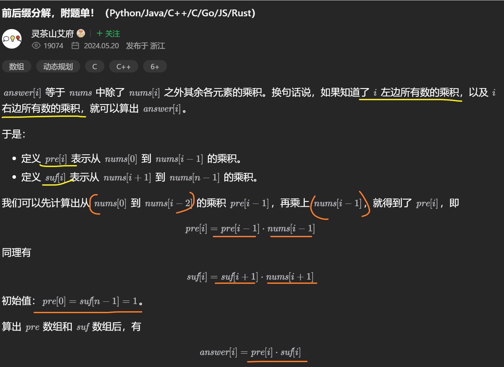

~~~C++
class Solution {
public:
    vector<int> productExceptSelf(vector<int>& nums) {

        // nums[i]å‰çš„乘积 * nums[i]å的乘积

        int n = nums.size();

        // nums[i]å‰çš„乘积  nums[0]*nums[1]*...*nums[i-1]
        vector<int> pre(n, 1);
        for (int i = 1; i < n; i++)
        {
            pre[i] = pre[i - 1] * nums[i - 1];
        }

        // nums[i]å的乘积 nums[i+1]*nums[i+2]*...*nums[n-1]
        vector<int> suf(n, 1);
        for (int i = n - 2; i >= 0; i--)
        {
            suf[i] = suf[i + 1] * nums[i + 1]; // ä»åå‘å‰ä¹˜
        }

        vector<int> ans(n);
        for (int i = 0; i < n; i++)
        {
            ans[i] = pre[i] * suf[i];
        }

        return ans;
    }
};
~~~


~~~C++
class Solution {
public:
    vector<int> productExceptSelf(vector<int>& nums) {

        // nums[i]å‰çš„乘积 * nums[i]å的乘积

        // 优化

        int n = nums.size();

        vector<int> suf(n);
        suf[n - 1] = 1;
        for (int i = n - 2; i >= 0; i--)
        {
            suf[i] = suf[i + 1] * nums[i + 1];
        }

        int pre = 1;
        for (int i = 0; i < n; i++)
        {
            // 此时 pre 为 nums[0] 到 nums[i-1] 的乘积，直æ¥ä¹˜åˆ° suf[i] 中
            suf[i] *= pre;
            pre *= nums[i];
        }

        return suf; // sufå·²ç»ä¹˜ä¸Šäº†pre，就是ans
    }
};
~~~


ACM

~~~C++
#include <iostream>
#include <vector>

using namespace std;


vector<int> productExceptSelf(const vector<int>& nums)
{
    int n = nums.size();

    // nums[i]å‰çš„乘积 * nums[i]å的乘积

    // pre[i] = nums[0]*nums[1]*...*nums[i-1]
    vector<int> pre(n, 1);
    for (int i = 1; i < n; i++)
    {
        pre[i] = pre[i - 1] * nums[i - 1];
    }

    // suf[i] = nums[i+1]*nums[i+2]*...*nums[n-1]
    vector<int> suf(n, 1);
    for (int i = n - 2; i >= 0; i--)
    {
        suf[i]  = suf[i + 1] * nums[i + 1]; // ä»åå‘å‰ä¹˜
    }

    vector<int> ans(n);
    for (int i = 0; i < n; i++)
    {
        ans[i] = pre[i] * suf[i];
    }

    return ans;
}


int main()
{
    int n;
    cin >> n;// nums元素个数

    vector<int> nums(n);
    for (int i = 0; i < n; i++)
    {
        cin >> nums[i];// 输入数组
    }

    vector<int> result = productExceptSelf(nums);
    for (int x : result)
    {
        cout << x << " ";
    }
    cout << endl;

    return 0;
}
~~~

示例输入：

~~~C++
4
1 2 3 4
~~~

输出：

~~~C++
24 12 8 6
~~~


## [41 缺失的第一个正数](https://leetcode.cn/problems/first-missing-positive/description/?envType=study-plan-v2&envId=top-100-liked)

@哈希

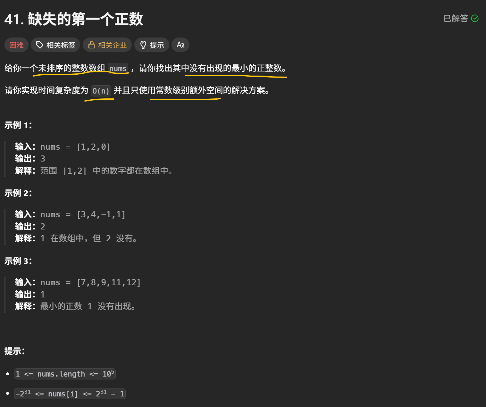


https://leetcode.cn/problems/first-missing-positive/solutions/7703/tong-pai-xu-python-dai-ma-by-liweiwei1419

本题的难点在：åªèƒ½ä½¿ç”¨å¸¸æ•°çº§åˆ«çš„é¢å¤–空间，在这个é™åˆ¶ä¸‹æœ¬é¢˜çš„æ€è·¯æœ‰ä¸€ä¸ªéæ­£å¼çš„å称：**åŸåœ°å“ˆå¸Œ**。


~~~C++
class Solution {
public:
    int firstMissingPositive(vector<int>& nums) {

        // 如æœä¸ç¼ºå¤±æ­£æ•°ï¼šä¸‹æ ‡içš„ä½ç½®ï¼Œæ”¾çš„应该是i+1，å³nums[i] = i + 1
        // nums = [1, 2, 3, 4, ...]
        // 下标    0  1  2  3 ...

        // 当下标 i ä½ç½®çš„数，ä¸æ˜¯ i+1 æ—¶(nums[i] != i + 1)，i+1 就是缺失的最å°æ­£æ•°

        // 注æ„是把数放到正确ä½ç½®ï¼Œæ•°æ‰¾ä½ç½®ï¼Œè€Œä¸æ˜¯ä½ç½®æ‰¾æ•°ï¼ï¼ï¼


        // éå†nums，给æ¯ä¸ªnums[i]找正确的ä½ç½®
        for (int i = 0; i < nums.size(); i++)
        {
            // ç»™nums[i]找ä½ç½®ï¼Œäº¤æ¢åçš„nums[i]å¯èƒ½ä½ç½®ä¹Ÿä¸å¯¹ï¼Œæ‰€ä»¥while直到ä½ç½®æ­£ç¡®
            while (nums[i] != i + 1)
            {
                if (nums[i] <= 0 ||               // 负数或0
                    nums[i] > nums.size() ||      // 超过数组长度的数
                    nums[i] == nums[nums[i] - 1]) // nums[i]é‡å¤ï¼Œnums[i]该在的ä½ç½®å·²ç»æœ‰æ­£ç¡®çš„数了
                {
                    break; // 这三ç§æƒ…况ä¸ç§»åŠ¨
                }

                // å°†nums[i]放到对应ä½ç½®ï¼ˆå³äº¤æ¢ nums[i] ä¸ nums[nums[i] - 1]）
                int idx = nums[i] - 1;
                swap(nums[i], nums[idx]); 
            }
        }


        // 查找第一个ä¸æ»¡è¶³ nums[i] == i + 1 çš„ä½ç½®
        for (int i = 0; i < nums.size(); i++)
        {
            if (nums[i] != i + 1)   return i + 1;
        }

        // 如æœæ‰€æœ‰éƒ½ç›¸ç¬¦ï¼Œç¼ºå°‘的就是最å一个数的下一个 [1, 2, 3, 4, ..., n-1]  n = nums.size()
        return (nums.size() + 1);
        
    }
};
~~~


ACM

~~~C++
#include <iostream>
#include <vector>

using namespace std;


int firstMissingPositive(vector<int>& nums)
{
    int n = nums.size();

    // 把æ¯ä¸ªæ•°æ”¾åˆ°æ­£ç¡®çš„ä½ç½®ä¸Šï¼ˆå³ nums[i] 应该在 下标为nums[i] - 1 ä½ç½®ä¸Šï¼‰
    for (int i = 0; i < n; i++)
    {
        while (nums[i] != i + 1)
        {
            if (nums[i] < 0 || nums[i] > n || nums[i] == nums[nums[i] - 1]) 
            {
                break; // é法数字或é‡å¤ï¼Œä¸å¤„ç†
            }

            // 把nums[i]交æ¢åˆ°æ­£ç¡®ä½ç½®
            int idx = nums[i] - 1;
            swap(nums[i], nums[idx]);
        }
    }

    // 查找第一个ä¸æ»¡è¶³ nums[i] == i + 1 çš„ä½ç½®
    for (int i = 0; i < n; i++)
    {
        if (nums[i] != i + 1)   return i + 1;
    }

    // æ‰€æœ‰éƒ½æ»¡è¶³ï¼Œè¿”å› n + 1
    return n + 1;
}

int main()
{
    int n;
    cin >> n; // 输入nums元素个数

    vector<int> nums(n);
    for (int i = 0; i < n; i++)
    {
        cin >> nums[i]; // 输入数组
    }

    int result = firstMissingPositive(nums);
    cout << result << endl;

}
~~~

示例输入：

~~~C++
5
3 4 -1 1 2
~~~

输出：

~~~C++
5
~~~


# 矩阵 ✅


## [73 矩阵置零](https://leetcode.cn/problems/set-matrix-zeroes/description/?envType=study-plan-v2&envId=top-100-liked)


~~~C++
class Solution {
public:
    void setZeroes(vector<vector<int>>& matrix) {

        if (matrix.size() == 0) return;

        const int m = matrix.size();    // 有几行
        const int n = matrix[0].size(); // 有几列

        bool firstRow = false; // 记录第一行是å¦æœ‰0
        bool firstCol = false; // 记录第一列是å¦æœ‰0

        // éå†æ‰€æœ‰å…ƒç´ ï¼Œå°† 0 所在行列的第一个元素（å³ç¬¬ä¸€è¡Œå’Œç¬¬ä¸€åˆ—的元素置零）
        for (int i = 0; i < m; i++) // 行
        {
            for (int j = 0; j < n; j++)
            {
                const int item = matrix[i][j];
                if (item == 0) 
                {
                    if (i == 0) firstRow = true; // 如æœæ˜¯ç¬¬ä¸€è¡Œçš„元素是0，记录
                    if (j == 0) firstCol = true; // 如æœæ˜¯ç¬¬ä¸€åˆ—的元素是0，记录

                    // 将对应第一行第一列的元素置零，作为修改其他行列的标志
                    matrix[0][j] = 0;
                    matrix[i][0] = 0;
                }
            }
        }

        // å†æ ¹æ®ç¬¬ä¸€è¡Œå’Œç¬¬ä¸€åˆ—的数，置零其他行列的元素
        for (int i = 1; i < m; i++)
        {
            for (int j = 1; j < n; j++)
            {
                const int item = matrix[i][j];
                // 如æœå½“å‰å…ƒç´ æ‰€åœ¨è¡Œåˆ—的第一行或第一列中有0，则置零当å‰å…ƒç´ 
                if (matrix[0][j] == 0 || matrix[i][0] == 0)
                {
                    matrix[i][j] = 0;
                }
            }
        }

        
        // 最å修改第一行 第一列（如æœç¬¬ä¸€è¡Œæˆ–第一列中有0）
        if (firstRow) 
        {
            for (int j = 0; j < n; j++)
            {
                matrix[0][j] = 0; // 第一行全部置零
            }
        }
        if (firstCol)
        {
            for (int i = 0; i < m; i++)
            {
                matrix[i][0] = 0; // 第一列全部置零
            }
        }

    }
};
~~~


ACM 

~~~C++
#include <vector>
#include <iostream>

using namespace std;


// åŸåœ°å°†çŸ©é˜µä¸­åŒ…å«0的行列全置0
void setZeroes(vector<vector<int>>& matrix)
{
    if (matrix.size() == 0) return;

    const int m = matrix.size();    // 行数
    const int n = matrix[0].size(); // 列数

    bool firstRow = false; // 第一行是å¦åŒ…å«0
    bool firstCol = false; // 第一列是å¦åŒ…å«0

    // 标记行列
    for (int i = 0; i < m; i++)
    {
        for (int j = 0; j < n; j++)
        {
            if (matrix[i][j] == 0)
            {
                if (i == 0) firstRow = true; // 第一行的元素
                if (j == 0) firstCol = true; // 第一列的元素
                matrix[0][j] = 0; // 标记列
                matrix[i][0] = 0; // 标记行
            }
        }
    }

     // éå†é首行首列，使用首行首列的0标记清零
     for (int i = 1; i < m; i++)
     {
        for (int j = 1; j < n; j++)
        {
            if (matrix[0][j] == 0 || matrix[i][0] == 0)     matrix[i][j] = 0;
        }
     }

     // æ ¹æ® firstRow firstCol 处ç†ç¬¬ä¸€è¡Œå’Œç¬¬ä¸€åˆ—
     if (firstRow)
     {
        for (int j = 0; j < n; j++)
        {
            matrix[0][j] = 0;
        }
     }
     if (firstCol)
     {
        for (int i = 0; i < m; i++)
        {
            matrix[i][0] = 0;
        }
     }

}


int main()
{
    int m, n;
    cin >> m >> n; // 输入行列数

    vector<vector<int>> matrix(m, vector<int>(n));
    for (int i = 0; i < m; i++)
    {
        for (int j = 0; j < n; j++)
        {
            cin >> matrix[i][j]; // 输入矩阵
        }
    }

    cout << endl;
    
    setZeroes(matrix);
    for (int i = 0; i < m; i++) {
        for (int j = 0; j < n; j++) {
            cout << matrix[i][j] << " "; // 输出结æœ
        }
        cout << endl;
    }

    return 0;
}
~~~


示例输入：

~~~C++
3 4
1 1 1 0
1 0 1 1
1 1 1 1
~~~

输出

~~~C++
0 0 0 0
0 0 0 0
1 0 1 0
~~~


## [èºæ—‹çŸ©é˜µ](https://leetcode.cn/problems/spiral-matrix/description/?envType=study-plan-v2&envId=top-100-liked)


### 1ã€æ ‡è®° + æ–¹å‘数组


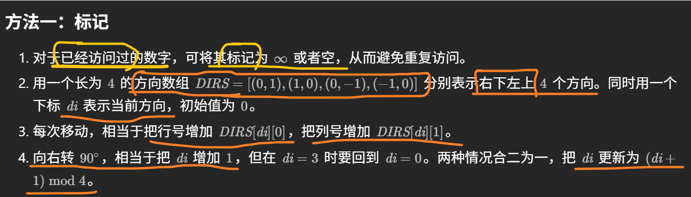


~~~C++
class Solution {
	// æ–¹å‘数组，注æ„顺åºï¼ï¼ï¼ï¼
    static constexpr int DIRS[4][2] = {
        {0, 1},   // å‘å³
        {1, 0},   // å‘下
        {0, -1},  // å‘å·¦
        {-1, 0}   // å‘上
	};

public:
    vector<int> spiralOrder(vector<vector<int>>& matrix) {
        int m = matrix.size();    // 行数
        int n = matrix[0].size(); // 列数

        vector<int> ans(m * n);

        int i = 0, j = 0, di = 0; // åˆå§‹è¡Œå·ï¼Œåˆ—å·ï¼Œå‰è¿›æ–¹å‘
        for (int k = 0 ; k < m * n; k++) // 一共走m*n步，收集m*n个数æ®ä¸ºæ­¢
        {
            ans[k] = matrix[i][j];  // 收集
            matrix[i][j] = INT_MAX; // 标记，表示已ç»è®¿é—®è¿‡ï¼ŒåŠ å…¥åˆ°ans里

            // (x, y) 是下一步的ä½ç½®ï¼Œå‰è¿›æ–¹å‘是 DIRS[i]
            int x = i + DIRS[di][0]; // ç§»åŠ¨ï¼Œè¡Œå· + DIRS[di][0]
            int y = j + DIRS[di][1]; // ç§»åŠ¨ï¼Œåˆ—å· + DIRS[di][1]

            // 先判断 (x, y) 是å¦å‡ºç•Œæˆ–者已ç»è®¿é—®è¿‡
            if (x < 0 || x >= m || y < 0 || y >= n || matrix[x][y] == INT_MAX)
            {
                di = (di + 1) % 4; // å³è½¬90度
            }

            // 确定下一个ä½ç½®
            i += DIRS[di][0]; 
            j += DIRS[di][1];
        }

        return ans;       
    }
};
~~~


`constexpr`是 C++11 引入的一个关键字，用æ¥å£°æ˜â€œå¸¸é‡è¡¨è¾¾å¼â€ã€‚它的核心作用是：**在编译期就能确定结æœ**。


### 2ã€æ”¶ç¼©è¾¹ç•Œ


~~~C++
class Solution {
public:
    vector<int> spiralOrder(vector<vector<int>>& matrix) {

        vector <int> ans;
        if(matrix.empty()) return ans; //若数组为空，直æ¥è¿”å›ç­”案

        int u = 0; //赋值上下左å³è¾¹ç•Œ
        int d = matrix.size() - 1;
        int l = 0;
        int r = matrix[0].size() - 1;

        while(true)
        {
            // å‘å³ç§»åŠ¨ç›´åˆ°æœ€å³
            for(int i = l; i <= r; ++i) ans.push_back(matrix[u][i]);
            if(++ u > d) break; //é‡æ–°è®¾å®šä¸Šè¾¹ç•Œï¼Œè‹¥ä¸Šè¾¹ç•Œå¤§äºä¸‹è¾¹ç•Œï¼Œåˆ™éå†å®Œæˆï¼Œä¸‹åŒ
            
            // å‘下
            for(int i = u; i <= d; ++i) ans.push_back(matrix[i][r]); 
            if(-- r < l) break; //é‡æ–°è®¾å®šå³è¾¹ç•Œ

            // å‘å·¦
            for(int i = r; i >= l; --i) ans.push_back(matrix[d][i]); 
            if(-- d < u) break; //é‡æ–°è®¾å®šä¸‹è¾¹ç•Œ

            // å‘上
            for(int i = d; i >= u; --i) ans.push_back(matrix[i][l]); 
            if(++ l > r) break; //é‡æ–°è®¾å®šå·¦è¾¹ç•Œ
        }


        return ans;
    }
};
~~~

**`++u` 先自å¢ï¼Œå†æ¯”较**

~~~C++
if (++u > d) 
~~~


ACM 

~~~C++
#include <iostream>
#include <vector>
#include <climits>

using namespace std;

static constexpr int DIRS[4][2] = {
    {0, 1},   // å‘å³
    {1, 0},   // å‘下
    {0, -1},  // å‘å·¦
    {-1, 0}   // å‘上
};

// è¿”å›çŸ©é˜µçš„èºæ—‹éå†é¡ºåº
vector<int> spiralOrder(vector<vector<int>>& matrix) {
    int m = matrix.size();        // 行数
    int n = matrix[0].size();     // 列数
    vector<int> ans(m * n);

    int i = 0, j = 0, di = 0;     // 当å‰åæ ‡ (i, j)，方å‘索引 di

    for (int k = 0; k < m * n; k++) {
        ans[k] = matrix[i][j];      // 收集当å‰å…ƒç´ 
        matrix[i][j] = INT_MAX;     // 标记访问

        int x = i + DIRS[di][0];    // 下一行
        int y = j + DIRS[di][1];    // 下一列

        // 出界或已访问，å³è½¬
        if (x < 0 || x >= m || y < 0 || y >= n || matrix[x][y] == INT_MAX) {
            di = (di + 1) % 4;
        }

        i += DIRS[di][0];
        j += DIRS[di][1];
    }

    return ans;
}

int main() {
    int m, n;
    cin >> m >> n; // 输入矩阵行列数

    vector<vector<int>> matrix(m, vector<int>(n));
    for (int i = 0; i < m; ++i) {
        for (int j = 0; j < n; ++j) {
            cin >> matrix[i][j];
        }
    }

    vector<int> result = spiralOrder(matrix);
    for (int x : result) {
        cout << x << " ";
    }
    cout << endl;

    return 0;
}
~~~

示例输入：

~~~C++
3 3
1 2 3
4 5 6
7 8 9
~~~

输出：

~~~C++
1 2 3 6 9 8 7 4 5
~~~


## [48 旋转图åƒ](https://leetcode.cn/problems/rotate-image/description/?envType=study-plan-v2&envId=top-100-liked)


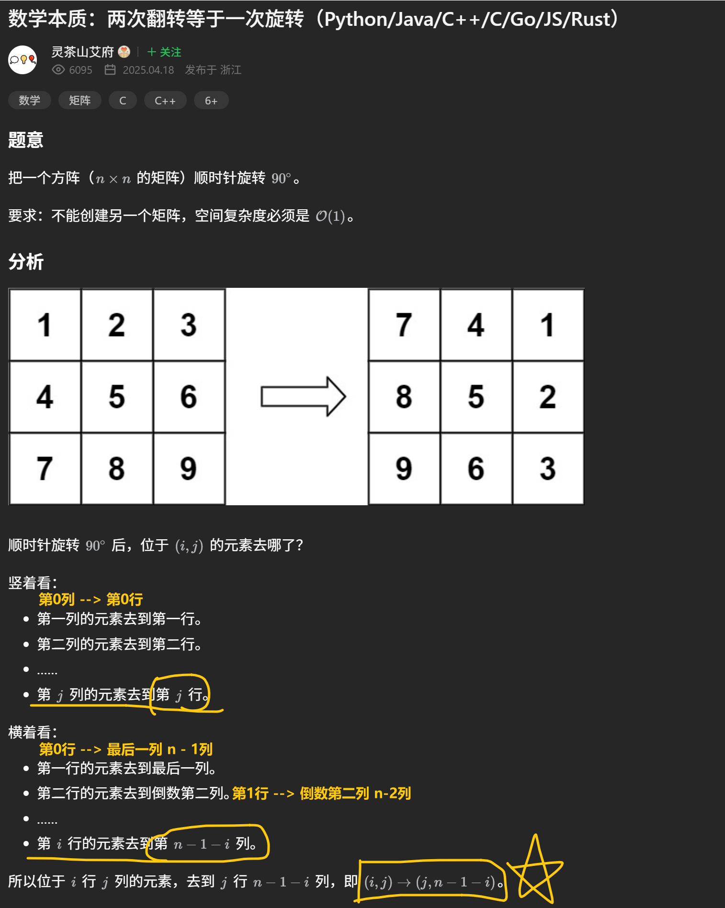


~~~C++
class Solution {
public:
    void rotate(vector<vector<int>>& matrix) {

        // 两次翻转：(i,j) --> (j,i) --> (j,n−1−i)
        // - 转置：按照主对角线翻转， (i,j) --> (j,i)
        // - 行翻转：æ¯ä¸€è¡Œçš„内部元素对称翻转，(j,i) --> (j,n−1−i)

        int n = matrix.size();

        // 第一步：主对角线翻转 (i, j) --> (j, i)
        for (int i = 0; i < n; i++)
        {
            for (int j = 0; j < i; j++) // 找主对角线下方的元素
            {
                swap(matrix[i][j], matrix[j][i]);
            }
        }

        // 第二步：行内对称翻转 (i, j) --> (i,n−1−j) 注æ„下标是i还是jï¼ï¼ï¼
        for (auto& row : matrix)
        {
            ranges::reverse(row); // 或者reverse(row.begin(), row.end());
        }
   
    }
};

        // 第二步如æœç›´æ¥å†™æ™®é€šå¾ªç¯  （注æ„下标是i还是jï¼ï¼ï¼ï¼‰
        // for (int i = 0; i < n; i++)
        // {
        //     for (int j = 0; j < (n/2); j++)
        //     {
        //         swap(matrix[i][j], matrix[i][n - 1 -j]);
        //     }
        // }
        // 
        // 或者 （æ¨è）
        // for (int i = 0; i < matrix.size(); i++) 
        // {
        //     int left = 0;
        //     int right = matrix[i].size() - 1;
        //     while (left < right) 
        //     {
        //         swap(matrix[i][left], matrix[i][right]);
        //         left++;
        //         right--;
        //     }
        // }


~~~


ACM：

~~~C++
#include <iostream>
#include <vector>
#include <algorithm> // for std::swap, std::ranges::reverse

using namespace std;

// 将矩阵åŸåœ°é¡ºæ—¶é’ˆæ—‹è½¬90度
void rotate(vector<vector<int>>& matrix) {
    int n = matrix.size();

    // 第一步：主对角线翻转 (i, j) -> (j, i)
    for (int i = 0; i < n; i++) {
        for (int j = 0; j < i; j++) {
            swap(matrix[i][j], matrix[j][i]);
        }
    }

    // 第二步：æ¯è¡Œå·¦å³ç¿»è½¬ (j, i) -> (j, n-1-i)
    for (auto& row : matrix) {
        reverse(row.begin(), row.end());  // 使用 std::reverse 替代 ranges::reverse
    }
}

int main() {
    int n;
    cin >> n; // 输入矩阵大å°ï¼ˆn x n）

    vector<vector<int>> matrix(n, vector<int>(n));
    for (int i = 0; i < n; i++) 
    {
        for (int j = 0; j < n; j++) 
        {
            cin >> matrix[i][j]; // 输入矩阵
        }
    }

    rotate(matrix);

    // 输出旋转å的矩阵
    for (const auto& row : matrix) 
    {
        for (int x : row) 
        {
            cout << x << " ";
        }
        cout << endl;
    }

    return 0;
}

~~~

输入：

~~~C++
3
1 2 3
4 5 6
7 8 9
~~~

输出：

~~~C++
7 4 1
8 5 2
9 6 3
~~~


## 240 æœç´¢äºŒç»´çŸ©é˜µII

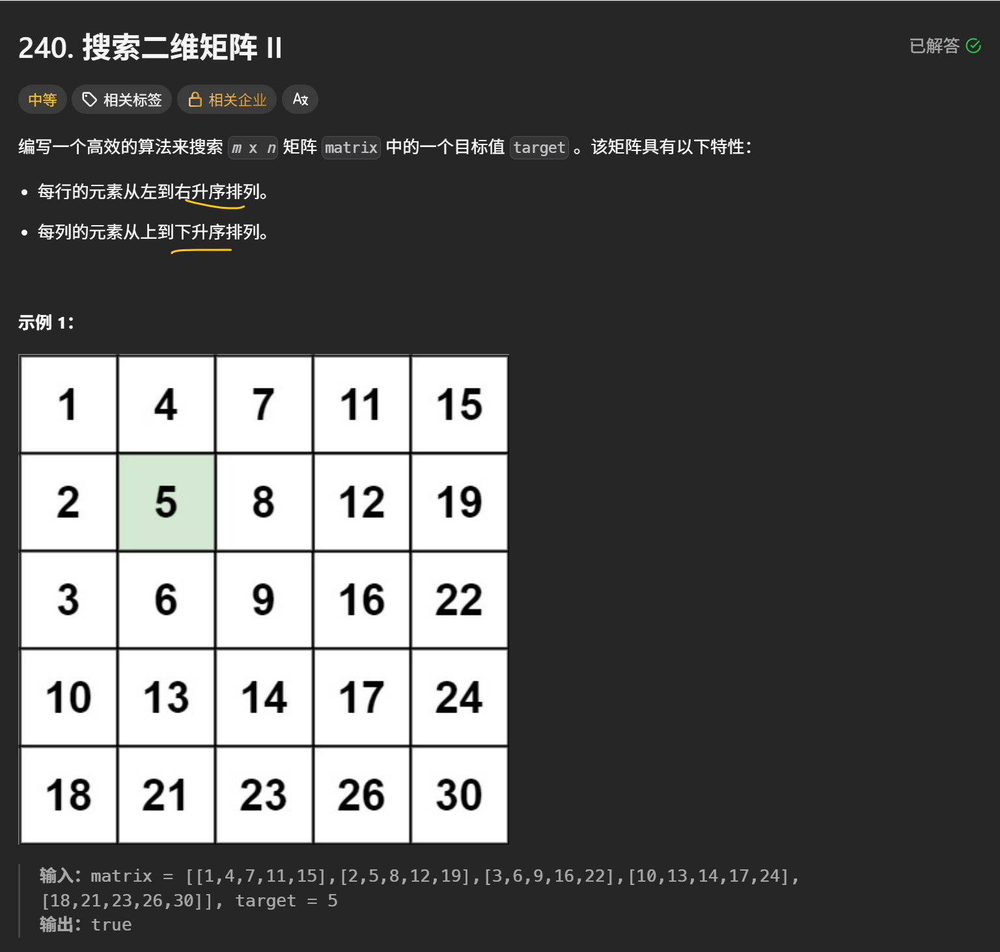

ä¾æ—§æ˜¯çµç¥ï¼ï¼ï¼


~~~C++
class Solution {
public:
    bool searchMatrix(vector<vector<int>>& matrix, int target) {

        // 比较å³ä¸Šè§’，target大删行，targetå°åˆ åˆ—

        int m = matrix.size(), n = matrix[0].size();
        
        int i = 0, j = n - 1; // å³ä¸Šè§’

        while (i < m && j >= 0)
        {
            if (target == matrix[i][j]) return true; // 找到
            
            if (target > matrix[i][j])  i++; // target大，å»ä¸‹ä¸€è¡Œ
            else                        j--; // targetå°ï¼Œå»å‰ä¸€åˆ—
        }
        
        return false;
    }
};
~~~


ACM

~~~C++
#include <iostream>
#include <ratio>
#include <vector>

using namespace std;


bool searchMatrix(vector<vector<int>>& matrix, int target) {

    // 比较å³ä¸Šè§’，target大删行，targetå°åˆ åˆ—

    int m = matrix.size(), n = matrix[0].size();
    
    int i = 0, j = n - 1; // å³ä¸Šè§’

    while (i < m && j >= 0)
    {
        if (target == matrix[i][j]) return true; // 找到
        
        if (target > matrix[i][j])  i++; // target大，å»ä¸‹ä¸€è¡Œ
        else                        j--; // targetå°ï¼Œå»å‰ä¸€åˆ—
    }
    
    return false;
}


int main()
{
    int m, n, target;
    cin >> m >> n >> target; // 输入矩阵行数，列数，目标值

    vector<vector<int>> matrix(m, vector<int>(n));
    for (int i = 0; i < m; i++)
    {
        for (int j = 0; j < n; j++)
        {
            cin >> matrix[i][j]; // 输入矩阵元素
        }
    }

    bool found = searchMatrix(matrix, target);
    cout << (found ? "true" : "false") << endl;


    return 0;
}
~~~

输入：

~~~C++
3 4 5
1 4 7 11
2 5 8 12
3 6 9 16
~~~

输出：

~~~C++
true
~~~


# 链表 ✅

## 基本ACM结æ„

~~~C++
#include <iostream>
using namespace std;

// 定义å•é“¾è¡¨ç»“æ„体
struct ListNode {
    int val;
    ListNode *next;
    ListNode(int x) : val(x), next(nullptr) {}
};


// 工具函数：尾æ’法æ„å»ºé“¾è¡¨ï¼ˆä» vector<int>）
ListNode* buildList(const vector<int>& nums) 
{
    if (nums.empty()) return nullptr;
    ListNode* head = new ListNode(nums[0]);
    ListNode* cur = head;
    for (int i = 1; i < nums.size(); i++) 
    {
        cur->next = new ListNode(nums[i]);
        cur = cur->next;
    }
    return head;
}

// 工具函数：打å°é“¾è¡¨
void printList(ListNode* head) 
{
    while (head) {
        cout << head->val;
        if (head->next) cout << " -> ";
        head = head->next;
    }
    cout << endl;
}


// æ ¹æ®é¢˜ç›®éœ€æ±‚定义函数，比如å转链表
ListNode* solve(ListNode* head) {
   
}


// 主函数：读å–输入，调用逻辑，输出结æœ
int main() {
    int n;
    cin >> n;  // 输入链表长度
    
    vector<int> nums(n);
    for (int i = 0; i < n; i++) {
        cin >> nums[i]; // 输入æ¯ä¸ªèŠ‚点值
    }
    ListNode* head = buildList(nums); // æ„建链表

    ListNode* result = solve(head); // 调用题解逻辑
    printList(result); // 输出结æœé“¾è¡¨

    return 0;
}

~~~

如æœä¸æ„建工具函数：

~~~C++
#include <iostream>
using namespace std;

// 定义å•é“¾è¡¨ç»“æ„体
struct ListNode {
    int val;
    ListNode *next;
    ListNode(int x) : val(x), next(nullptr) {}
};


// æ ¹æ®é¢˜ç›®éœ€æ±‚定义函数
ListNode* solve(ListNode* head) {
    
}


int main()
{
    // ç›´æ¥æ„建链表
    ListNode* head = new ListNode(1);
    head->next = new ListNode(2);
    head->next->next = new ListNode(3);
    ...
    // 执行题目逻辑
    ListNode* result = solve(head);
    
    // 打å°
    while (head)
    {
        cout << result->val << endl;
        result = result->next;
    }
    
    return 0;
}
~~~


## 160 [相交链表](https://leetcode.cn/problems/intersection-of-two-linked-lists/description/?envType=study-plan-v2&envId=top-100-liked)


==**注æ„是指针相等ï¼ï¼ï¼** **ä¸æ˜¯æ•°å€¼ç›¸ç­‰ï¼ï¼**==


### 1ã€æ‹¼æ¥é“¾è¡¨ï¼ˆæ¨èï¼ï¼‰

> [Krahets 题解](https://leetcode.cn/problems/intersection-of-two-linked-lists/solutions/12624/intersection-of-two-linked-lists-shuang-zhi-zhen-l/?envType=study-plan-v2&envId=top-100-liked)

- å‡è®¾æ‹¼æ¥ä¸¤ä¸ªé“¾è¡¨ 分别**BA拼æ¥ï¼ŒAB拼æ¥**，拼æ¥å两链表长度肯定相åŒ
- 如æœAå’ŒB有相交，则 **BA å’Œ AB** çš„**末尾几ä½è‚¯å®šæ˜¯ç›¸åŒçš„**
- 这样的两个å åŠ é“¾è¡¨åŒæ—¶éå†åˆ°æœ‰ç›¸åŒèŠ‚点的时候，一定一边是A 链表一边是 B 链表
- 相交节点开始到结尾的节点都相åŒï¼Œæ‰€ä»¥**第一个相åŒçš„节点**就是 A 链表和 B 链表的交点

 


~~~C++
/**
 * Definition for singly-linked list.
 * struct ListNode {
 *     int val;
 *     ListNode *next;
 *     ListNode(int x) : val(x), next(NULL) {}
 * };
 */
class Solution {
public:
    ListNode *getIntersectionNode(ListNode *headA, ListNode *headB) {

        ListNode* curA = headA;
        ListNode* curB = headB;
        
        // curA 走 A->B, curB 走 B->A，直到 curA = curB
        while (curA != curB)
        {  
            curA = curA  ? curA->next : headB;// curA走到null，å†ç»§ç»­èµ°B，相当äºæ‹¼æ¥ A->B           
            curB = curB  ? curB->next : headA;// curB走到null，å†ç»§ç»­èµ°A，相当äºæ‹¼æ¥ B->A
        }
        
        return curA; // 最å两个指针é‡åˆ curA = curB
        
        // 有交点，返å›äº¤ç‚¹
        // 无交点，curA å’Œ curB 会一起走到nullptr，返å›çš„也就是 curA = nullptr  
    }
};
~~~


### 2ã€å¯¹é½å°¾éƒ¨ï¼ˆå¸¸è§„）

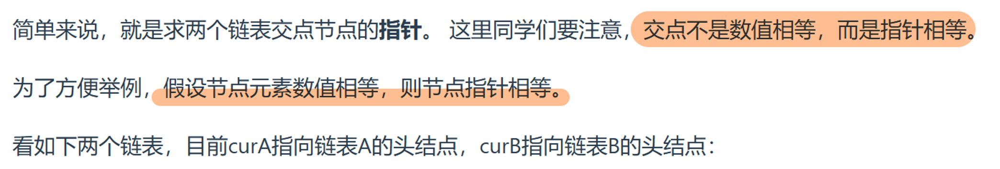


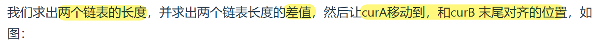

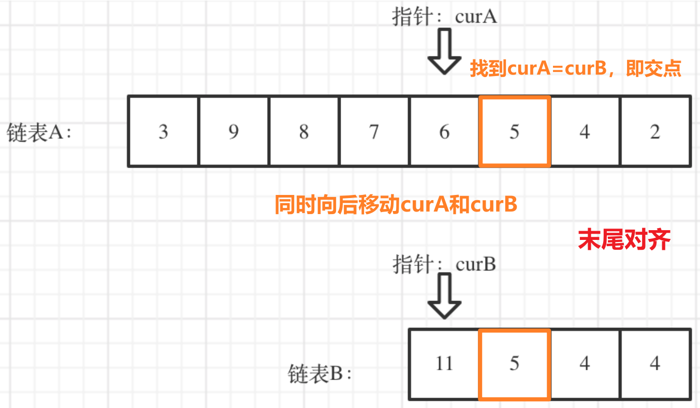


**注æ„最å比较的一定是 `curA == curB` ，<span style="color:#CC0000;">节点相等，包括数值相等，内存ä½ç½®ç›¸åŒ</span>**

~~~C++
/**
 * Definition for singly-linked list.
 * struct ListNode {
 *     int val;
 *     ListNode *next;
 *     ListNode(int x) : val(x), next(NULL) {}
 * };
 */
class Solution {
public:
    ListNode *getIntersectionNode(ListNode *headA, ListNode *headB) {

        ListNode* curA = headA;
        ListNode* curB = headB;

        // 求链表A和链表B的长度
        int lenA = 0, lenB = 0;
        while (curA != nullptr)
        {
            lenA++;
            curA = curA->next;
        }
        while (curB != nullptr)
        {
            lenB++;
            curB = curB->next;
        }

        // curå†ç§»å›å¤´èŠ‚点
        curA = headA;
        curB = headB;

        // 让curA称为较长链表的头，lenA为其长度
        if (lenB > lenA)
        {
            swap(lenA, lenB);
            swap(curA, curB);
        }

        // 末尾对é½ï¼Œç§»åŠ¨curA到ä¸curB相对应的ä½ç½®
        int gap = lenA - lenB;
        while (gap--)	curA = curA->next;

        // 然å curA curB åŒæ—¶å‘å移动，é‡åˆ°ç›¸åŒèŠ‚点å³ç›¸äº¤èŠ‚点
        while (curA != nullptr)
        {
            if (curA == curB)   return curA; // 注æ„是指针相等，ä¸æ˜¯æ•°å€¼ç›¸ç­‰ï¼ï¼ï¼

            curA = curA->next;
            curB = curB->next;
        }

        return nullptr; // 无相交节点
    }
};
~~~


### ACM

~~~C++
#include <iostream>

using namespace std;

struct ListNode
{
    int val;
    ListNode* next;
    ListNode(int x) : val(x), next(nullptr) {}
};

ListNode* getIntersectionNode(ListNode* headA, ListNode* headB)
{
    
    ListNode* curA = headA;
    ListNode* curB = headB;

    // 求链表A和链表B的长度
    int lenA = 0, lenB = 0;
    while (curA != nullptr)
    {
        lenA++;
        curA = curA->next;
    }
    while (curB != nullptr)
    {
        lenB++;
        curB = curB->next;
    }

    // curå†ç§»å›å¤´èŠ‚点
    curA = headA;
    curB = headB;

    // 让curA称为较长链表的头，lenA为其长度
    if (lenB > lenA)
    {
        swap(lenA, lenB);
        swap(curA, curB);
    }

    // 末尾对é½ï¼Œç§»åŠ¨curA到ä¸curB相对应的ä½ç½®
    int gap = lenA - lenB;
    while (gap--)
    {
        curA = curA->next;
    }

    // 然å curA curB åŒæ—¶å‘å移动，é‡åˆ°ç›¸åŒèŠ‚点å³ç›¸äº¤èŠ‚点
    while (curA != nullptr)
    {
        if (curA == curB)   return curA; // 注æ„是指针相等，ä¸æ˜¯æ•°å€¼ç›¸ç­‰ï¼ï¼ï¼

        curA = curA->next;
        curB = curB->next;
    }

    return nullptr; // 无相交节点
        
}


int main()
{
    // æ„建链表 A: 4 -> 1 -> [8 -> 4 -> 5]
    ListNode* a1 = new ListNode(4);
    ListNode* a2 = new ListNode(1);
    ListNode* a3 = new ListNode(8);
    ListNode* a4 = new ListNode(4);
    ListNode* a5 = new ListNode(5);
    a1->next = a2;
    a2->next = a3;
    a3->next = a4;
    a4->next = a5;


    // æ„建链表 B: 5 -> 0 -> 1 -> [8 -> 4 -> 5]
    ListNode* b1 = new ListNode(5);
    ListNode* b2 = new ListNode(0);
    ListNode* b3 = new ListNode(1);
    b1->next = b2;
    b2->next = b3;
    b3->next = a3; // ç›´æ¥è¿åœ¨A中的节点 ä¸é“¾è¡¨ A 相交äºèŠ‚点值 8

    ListNode* result = getIntersectionNode(a1, b1);

    if (result) cout << result->val << endl; // 输出相交节点值
    else        cout << "null" << endl;

    
    return 0;
}
~~~

输出：

~~~C++
8
~~~


## 206 [å转链表](https://leetcode.cn/problems/reverse-linked-list/description/?envType=study-plan-v2&envId=top-100-liked)


### 1ã€åŒæŒ‡é’ˆ


~~~C++
class Solution {
public:
    ListNode* reverseList(ListNode* head) {
        
        // åŒæŒ‡é’ˆ

        ListNode* tmp;
        ListNode* cur = head;
        ListNode* pre = nullptr;

        while (cur)
        {
            tmp = cur->next;
            cur->next = pre; // æ–­å¼€curå’Œcur->next，å转

            // å移preå’Œcur
            pre = cur;
            cur = tmp;
        }

        return pre;// 新的头节点
        
    }
};
~~~


### 2ã€é€’å½’


~~~C++
/**
 * Definition for singly-linked list.
 * struct ListNode {
 *     int val;
 *     ListNode *next;
 *     ListNode() : val(0), next(nullptr) {}
 *     ListNode(int x) : val(x), next(nullptr) {}
 *     ListNode(int x, ListNode *next) : val(x), next(next) {}
 * };
 */
class Solution {
public:
    // 递归 æ„建reverse函数
    ListNode* reverse(ListNode* pre, ListNode* cur)
    {
        if (cur == nullptr) return pre; // 直到cur = nullptr，返å›pre就是新的头节点

        ListNode* tmp = cur->next;
        cur->next = pre; // å转

        return reverse(cur, tmp); // ç›¸å½“äº pre = cur, cur = tmp
    }


    ListNode* reverseList(ListNode* head) {
        return reverse(nullptr, head); // åˆå§‹ cur = head, pre = nullpt  
    }
};
~~~


### ACM

~~~C++
#include <cstddef>
#include <iostream>
using namespace std;

// 链表结æ„
struct ListNode
{
    int val;
    ListNode* next;
    ListNode(int x) : val(x), next(nullptr) {}
};

// å转链表
ListNode* reverseList(ListNode* head)
{
    // åŒæŒ‡é’ˆ
    ListNode* tmp;
    ListNode* cur = head;
    ListNode* pre = nullptr;

    while (cur)
    {
        tmp = cur->next;
        cur->next = pre;

        pre = cur;
        cur = tmp;
    }

    return pre;
}


int main()
{
    ListNode* head = new ListNode(1);
    head->next = new ListNode(2);
    head->next->next = new ListNode(3);
    head->next->next->next = new ListNode(4);

    ListNode* result = reverseList(head);

    while (result)
    {
        cout << result->val << endl;
        result = result->next;
    }


    return 0;

}
~~~

输出：

~~~C++
4
3
2
1
~~~


## [234 å›æ–‡é“¾è¡¨](https://leetcode.cn/problems/palindrome-linked-list/description/?envType=study-plan-v2&envId=top-100-liked)

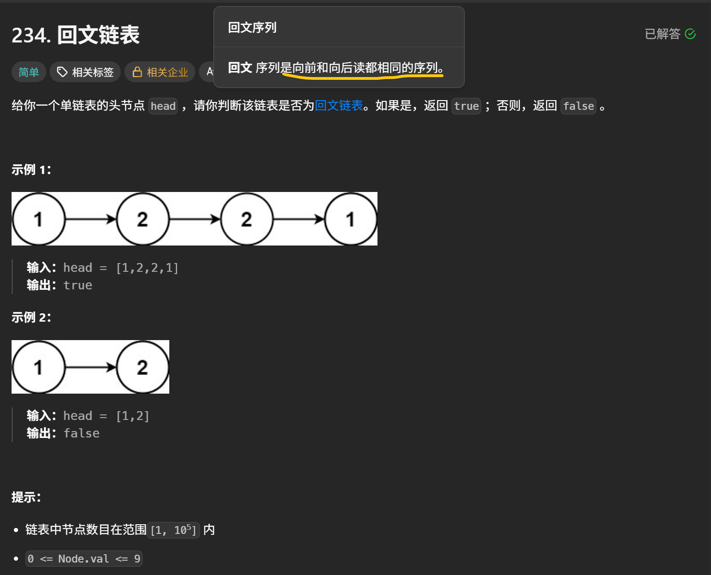

### 1ã€åˆ©ç”¨æ•°ç»„

~~~C++
/**
 * Definition for singly-linked list.
 * struct ListNode {
 *     int val;
 *     ListNode *next;
 *     ListNode() : val(0), next(nullptr) {}
 *     ListNode(int x) : val(x), next(nullptr) {}
 *     ListNode(int x, ListNode *next) : val(x), next(next) {}
 * };
 */
class Solution {
public:
    bool isPalindrome(ListNode* head) {
        
        // 链表值放入数组，å†åˆ¤æ–­æ•°ç»„是å¦å›æ–‡
        vector<int> vec;
        ListNode* cur = head;
        while (cur)
        {
            vec.push_back(cur->val);
            cur = cur->next;
        }

        for (int i = 0, j = vec.size() - 1; i < j; i++, j--)
        {
            if (vec[i] != vec[j])   return false;
        }

        return true;    
    }
};
~~~

时间å¤æ‚度：*O*(*n*)，其中 *n* 指的是链表的元素个数。

空间å¤æ‚度：*O*(*n*)，其中 *n* 指的是链表的元素个数，使用了一个数组列表存放链表的元素值。


### 2ã€*O*(*1*)空间åšæ³•ï¼š

> [**çµèŒ¶å±±è‰¾åºœ O(1) 空间åšæ³•ï¼šå¯»æ‰¾ä¸­é—´èŠ‚点+å转链表**](https://leetcode.cn/problems/palindrome-linked-list/solutions/2952645/o1-kong-jian-zuo-fa-xun-zhao-zhong-jian-rv0f3/?envType=study-plan-v2&envId=top-100-liked) 

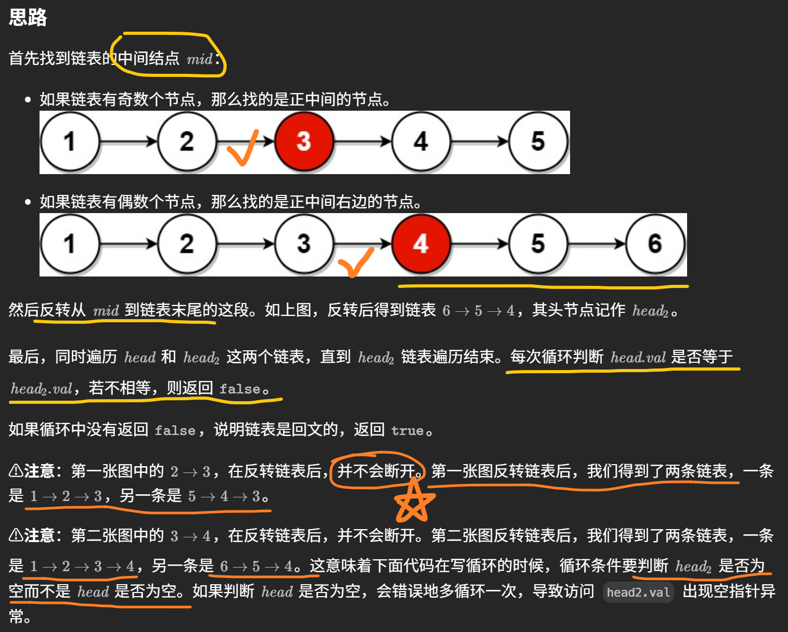

时间å¤æ‚度：O(*n*)，其中 *n* 是链表的长度（节点个数）。

空间å¤æ‚度：O(1)。

~~~C++
/**
 * Definition for singly-linked list.
 * struct ListNode {
 *     int val;
 *     ListNode *next;
 *     ListNode() : val(0), next(nullptr) {}
 *     ListNode(int x) : val(x), next(nullptr) {}
 *     ListNode(int x, ListNode *next) : val(x), next(next) {}
 * };
 */
class Solution {
public:
    // 876 链表的中间节点
    ListNode* middleNode(ListNode* head)
    {
        ListNode* slow = head, *fast = head;
        while (fast && fast->next)
        {
            slow = slow->next;
            fast = fast->next->next;
        }
        return slow;
    }

    // 206 å转链表
    ListNode* reverseList(ListNode* head)
    {
        ListNode* tmp;
        ListNode* cur = head;
        ListNode* pre = nullptr;
        while (cur)
        {
            tmp = cur->next;
            cur->next = pre;

            pre = cur;
            cur = tmp;
        }
        return pre;
    }


    bool isPalindrome(ListNode* head) {

        // 找中间节点，å转比较

        ListNode* mid = middleNode(head);
        ListNode* head2 = reverseList(mid); // 注æ„，midå’ŒåŸé“¾è¡¨å‰é¢çš„节点没有断开

        //                                  head                 head2
        // 1 -> 2 -> 3 -> 4 -> 5        =>  1 -> 2 -> 3          5 -> 4 -> 3
        // 1 -> 2 -> 3 -> 4 -> 5 -> 6   =>  1 -> 2 -> 3 - > 4    6 -> 5 -> 4 

        while (head2) // å¶æ•°èŠ‚点时，head2è¦æ¯”head少一个节点
        {
            if (head->val != head2->val)    return false;

            head = head->next;
            head2 = head2->next;
        }

        return true;     
    }
};
~~~


### ACM

~~~C++
#include <cstddef>
#include <iostream>
using namespace std;

// 234 å›æ–‡é“¾è¡¨ï¼šä¸­é—´èŠ‚点 + å转
// 时间å¤æ‚度: O(n)
// 空间å¤æ‚度: O(1)

// 链表结æ„定义
struct ListNode
{
    int val;
    ListNode* next;
    ListNode(int x) : val(x), next(nullptr) {};
};


// 876 找中间节点
ListNode* middleNode(ListNode* head)
{
    ListNode* slow = head;
    ListNode* fast = head;
    while (fast && fast->next)
    {
        slow = slow->next;
        fast = fast->next->next;
    }

    return slow;
}

// 206 å转链表
ListNode* reverseList(ListNode* head)
{
    ListNode* tmp;
    ListNode* cur = head;
    ListNode* pre = nullptr;

    while (cur)
    {
        tmp = cur->next;
        cur->next = pre;

        pre = cur;
        cur = tmp;
    }

    return pre;
}


// å›æ–‡
bool isPalindrome(ListNode* head)
{
    ListNode* mid = middleNode(head);
    ListNode* head2 = reverseList(mid);

    while(head2)
    {
        if (head->val != head2->val)    return false;
        head = head->next;
        head2 = head2->next;
    }

    return true;
}


int main()
{
    int n;
    cin >> n; // 链表长度
    if (n <= 0)
    {
        cout << "false" << endl;
        return 0;
    }

    // æ„建链表
    int x;
    cin >> x;
    ListNode* head = new ListNode(x);
    ListNode* cur = head;
    for (int i = 1; i < n; i++)
    {
        cin >> x;
        cur->next = new ListNode(x);
        cur = cur->next;
    }

    bool result = isPalindrome(head);
    cout << (result ? "true" : "false") << endl;

    
    return 0;
}
~~~

输入：

~~~C++
5
1 2 3 2 1
~~~

输出：

~~~C++
true
~~~


## 141 [ç¯å½¢é“¾è¡¨](https://leetcode.cn/problems/linked-list-cycle/description/?envType=study-plan-v2&envId=top-100-liked)

@åˆ¤æ–­æœ‰æ²¡æœ‰ç¯   @快慢指针

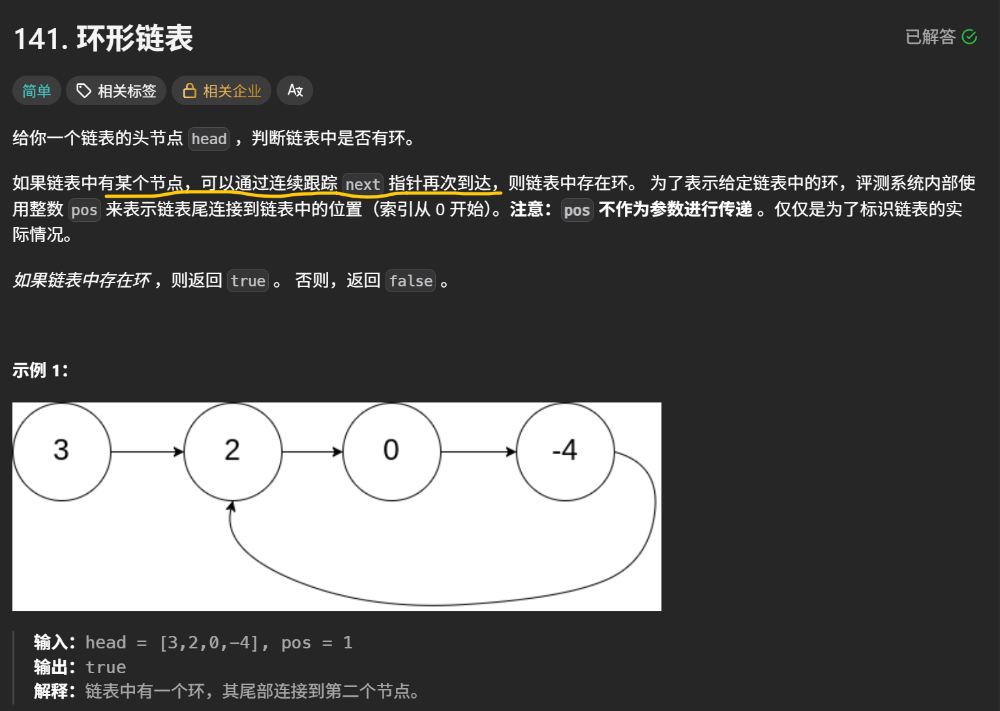


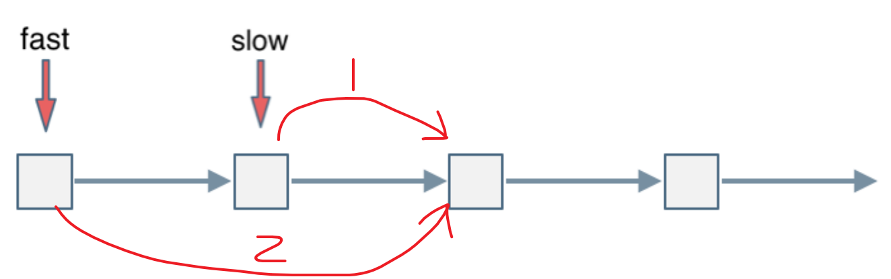


- 时间å¤æ‚度：O(*n*)，其中 *n* 为链表的长度。
- 空间å¤æ‚度：O(1)，仅用到若干é¢å¤–å˜é‡ã€‚

~~~C++
/**
 * Definition for singly-linked list.
 * struct ListNode {
 *     int val;
 *     ListNode *next;
 *     ListNode(int x) : val(x), next(NULL) {}
 * };
 */
class Solution {
public:
    bool hasCycle(ListNode *head) {

        // 快慢指针
        ListNode* fast = head;
        ListNode* slow = head;

        while (fast && fast->next)
        {
            slow = slow->next;      // slow 走一步
            fast = fast->next->next;// fast 走两步

            if (slow == fast)   return true; // 相é‡ï¼Œè¯´æ˜æœ‰ç¯
        }

        return false;
        
    }
};
~~~


ACM

~~~C++
#include <iostream>
using namespace std;

// 141 ç¯å½¢é“¾è¡¨ （快慢指针相é‡ï¼‰
// 时间å¤æ‚度: O(n)
// 空间å¤æ‚度: O(1)

// 定义链表节点结æ„
struct ListNode {
    int val;
    ListNode* next;
    ListNode(int x) : val(x), next(nullptr) {}
};

// 判断链表是å¦æœ‰ç¯
bool hasCycle(ListNode* head) 
{
    ListNode* fast = head;
    ListNode* slow = head;
    while (fast && fast->next) 
    {
        slow = slow->next;       // slow 走一步
        fast = fast->next->next; // fast 走两步
        if (slow == fast) return true; // 快慢指针相é‡è¯´æ˜æœ‰ç¯
    }

    return false;
}


int main() {
    // æ„建链表 3 -> 2 -> 0 -> -4
    ListNode* n1 = new ListNode(3);
    ListNode* n2 = new ListNode(2);
    ListNode* n3 = new ListNode(0);
    ListNode* n4 = new ListNode(4);

    n1->next = n2;
    n2->next = n3;
    n3->next = n4;
    n4->next = n2;  // 制造ç¯ï¼Œä½¿å¾— -4 æŒ‡å‘ 2，形æˆç¯

    if (hasCycle(n1)) {
        cout << "true" << endl;
    } else {
        cout << "false" << endl;
    }

    return 0;
}
~~~

输出：

~~~C++
true
~~~


## 142 [ç¯å½¢é“¾è¡¨II](https://leetcode.cn/problems/linked-list-cycle-ii/description/?envType=study-plan-v2&envId=top-100-liked)

@ 找到入ç¯çš„节点


**1ã€åˆ¤æ–­æ˜¯å¦æœ‰ç¯ slow fast**

- slow走1，fast走2
- 如æœæœ‰ç¯ï¼Œslow会和fast相é‡ï¼ˆå¹¶ç›¸é‡åœ¨ç¯ä¸­ï¼‰
- æ— ç¯ï¼Œfast走到nullptrå³ç»“æŸ

**2ã€slow = fast有ç¯ï¼ŒæŸ¥æ‰¾å…¥å£**

- index1 ä»ç›¸é‡ç‚¹èµ°ï¼Œèµ°z + n圈
- index2 ä»head走，走x
- 会在入å£ç›¸é‡


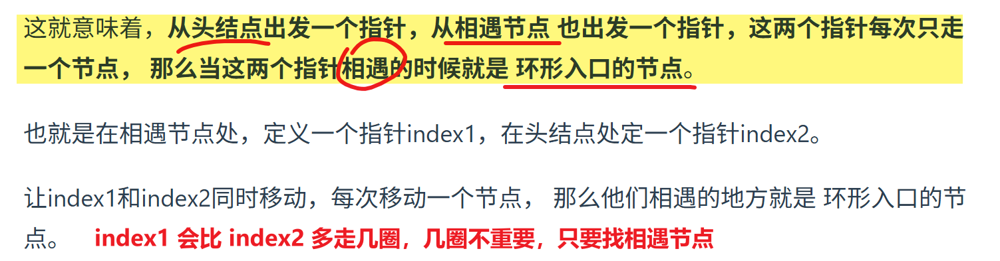


~~~C++
/**
 * Definition for singly-linked list.
 * struct ListNode {
 *     int val;
 *     ListNode *next;
 *     ListNode(int x) : val(x), next(NULL) {}
 * };
 */
class Solution {
public:
    ListNode *detectCycle(ListNode *head) {

        // 1 是å¦æœ‰ç¯
        ListNode* slow = head;
        ListNode* fast = head;
        while (fast && fast->next)
        {
            slow = slow->next;
            fast = fast->next->next;

            // 如æœæ²¡ç¯ï¼Œfast走到null结æŸ

            // 2 有ç¯ï¼Œfast = slow  查找入å£
            if (slow == fast)
            {
                ListNode* index1 = fast; // ä»ç›¸é‡ç‚¹å¼€å§‹
                ListNode* index2 = head; // ä»å¤´å¼€å§‹

                // index1 å’Œ index2 æ¯æ¬¡èµ°ä¸€æ­¥ï¼Œç›´åˆ°ç›¸é‡ï¼Œå³å…¥ç¯å£
                while (index1 != index2)
                {
                    index1 = index1->next;// åªä¸è¿‡index1会比index2多走几圈
                    index2 = index2->next; 
                }

                return index2; // è¿”å›ç›¸é‡ç‚¹ï¼Œå³å…¥å£
            }
        }

        return nullptr;
    }
};
~~~


## 21 [åˆå¹¶ä¸¤ä¸ªæœ‰åºé“¾è¡¨](https://leetcode.cn/problems/merge-two-sorted-lists/description/?envType=study-plan-v2&envId=top-100-liked)


~~~C++
/**
 * Definition for singly-linked list.
 * struct ListNode {
 *     int val;
 *     ListNode *next;
 *     ListNode() : val(0), next(nullptr) {}
 *     ListNode(int x) : val(x), next(nullptr) {}
 *     ListNode(int x, ListNode *next) : val(x), next(next) {}
 * };
 */
class Solution {
public:
    ListNode* mergeTwoLists(ListNode* list1, ListNode* list2) {

        ListNode* dummyHead = new ListNode(0);
        ListNode* cur = dummyHead;
        while (list1 && list2)
        {
            if (list1->val < list2->val)
            {
                cur->next = list1; // å–å°çš„节点拼æ¥åœ¨curåé¢
                list1 = list1->next;
            }
            else
            {
                cur->next = list2;
                list2 = list2->next;
            }

            cur = cur->next;
        }

        // 上é¢while终止，是由äºlist1或list2为nullptr
        // 判断是哪个终止了，将å¦ä¸€ä¸ªé“¾è¡¨çš„剩下部分也拼æ¥ä¸Š
        cur->next = (list1 != nullptr) ? list1 : list2;

        return dummyHead->next; // è¿”å›çœŸæ­£çš„头节点
        
    }
};
~~~

时间å¤æ‚度 O(M+N) ：M，N是两个链表的长度，åˆå¹¶æ“作需è¦æ“作两链表

空间å¤æ‚度 O(1)：节点引用dummyHead，cur使用常数大å°çš„é¢å¤–空间


ACM

~~~C++
#include <iostream>
using namespace std;

// 21 åˆå¹¶ä¸¤ä¸ªæœ‰åºé“¾è¡¨
// 时间å¤æ‚度：O(n + m)
// 空间å¤æ‚度：O(1)

struct ListNode
{
    int val;
    ListNode* next;
    ListNode(int x) : val(x), next(nullptr) {}
};

// åˆå¹¶
ListNode* mergeTwoLists(ListNode* list1, ListNode* list2)
{
    ListNode* dummyHead = new ListNode(0);
    ListNode* cur = dummyHead;

    while (list1 && list2)
    {
        if (list1->val < list2->val)
        {
            cur->next = list1;
            list1 = list1->next;
        }
        else 
        {
            cur->next = list2;
            list2 = list2->next;
        }
        
        cur = cur->next;
    }

    cur->next = (list1 != nullptr) ? list1 : list2;

    return dummyHead->next;
}


int main()
{
    // æ„建链表 list1: 1 -> 2 -> 4
    ListNode* list1 = new ListNode(1);
    list1->next = new ListNode(2);
    list1->next->next = new ListNode(4);

    // æ„建链表 list2: 1 -> 3 -> 4
    ListNode* list2 = new ListNode(1);
    list2->next = new ListNode(3);
    list2->next->next = new ListNode(4);

    // åˆå¹¶é“¾è¡¨
    ListNode* mergeNode = mergeTwoLists(list1, list2);

    // 打å°
    while (mergeNode)
    {
        cout << mergeNode->val << " ";
        mergeNode = mergeNode->next;
    }
    cout << endl;

    return 0;
}
~~~


## 2 [两数相加](https://leetcode.cn/problems/add-two-numbers/description/?envType=study-plan-v2&envId=top-100-liked)


题解：[将链表å过æ¥çœ‹](https://leetcode.cn/problems/add-two-numbers/solutions/2826226/jiang-lian-biao-fan-guo-lai-kan-jiu-bu-b-mfhh/?envType=study-plan-v2&envId=top-100-liked)


~~~C++
/**
 * Definition for singly-linked list.
 * struct ListNode {
 *     int val;
 *     ListNode *next;
 *     ListNode() : val(0), next(nullptr) {}
 *     ListNode(int x) : val(x), next(nullptr) {}
 *     ListNode(int x, ListNode *next) : val(x), next(next) {}
 * };
 */
class Solution {
public:
    ListNode* addTwoNumbers(ListNode* l1, ListNode* l2) {

        ListNode* dummyHead = new ListNode(0);
        ListNode* node = dummyHead;

        int carrier = 0; // è¿›ä½

        // åªè¦2个链表中有没走到尽头的，或者进ä½ä¸ä¸º0，就一直å‰è¿›
        while (l1 || l2 || carrier)
        {
            // 求和 
            int sum = (l1 ? l1->val : 0) + (l2 ? l2->val : 0) + carrier;

            // 在尾部添加新节点
            node->next = new ListNode(sum % 10); // 对10å–余（å–个ä½ï¼‰
            
            // æ›´æ–°è¿›ä½
            carrier = sum / 10;

            // 往下走，加下一ä½
            node = node->next;
            if (l1) l1 = l1->next;
            if (l2) l2 = l2->next;
        }

        return dummyHead->next;        
    }
};
~~~


ACM

~~~C++
#include <iostream>
using namespace std;

// 2 两数之和
// 时间å¤æ‚度：O(m + n)
// 空间å¤æ‚度：O(1)

struct ListNode
{
    int val;
    ListNode* next;
    ListNode(int x) : val(x), next(nullptr) {}
};


ListNode* addTwoNumbers(ListNode* l1, ListNode* l2)
{
    ListNode* dummyHead = new ListNode(0);
    ListNode* node = dummyHead;

    int carrier = 0;
    while (l1 || l2 || carrier)
    {
        int sum = (l1 ? l1->val : 0) + (l2 ? l2->val : 0) + carrier;

        node->next = new ListNode(sum % 10);
        carrier = sum / 10;

        node = node->next;
        if (l1)     l1 = l1->next;
        if (l2)     l2 = l2->next;
    }

    return dummyHead->next;
}


int main()
{
    // æ„建链表 l1: 2 -> 4 -> 3 （表示数字342）注æ„顺åº
    ListNode* l1 = new ListNode(2);
    l1->next = new ListNode(4);
    l1->next->next = new ListNode(3);

    // æ„建链表 l2: 5 -> 6 -> 4 （表示数字465）
    ListNode* l2 = new ListNode(5);
    l2->next = new ListNode(6);
    l2->next->next = new ListNode(4);

    // 相加 
    //      3 <- 4 <- 2 
    // +    4 <- 6 <- 5
    // =    8 <- 0 <- 7
    ListNode* result = addTwoNumbers(l1, l2);

    // 输出
    while (result)
    {
        cout << result->val;
        if (result->next)   cout << "->";
        result = result->next;
    }

    cout << endl;


    return  0;
}
~~~

输出：

~~~C++
7->0->8
~~~


## 19 [删除链表的倒数第N个节点](https://leetcode.cn/problems/remove-nth-node-from-end-of-list/description/?envType=study-plan-v2&envId=top-100-liked)


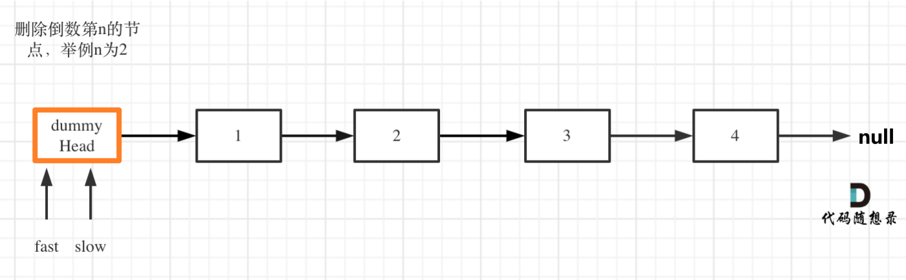


~~~C++
/**
 * Definition for singly-linked list.
 * struct ListNode {
 *     int val;
 *     ListNode *next;
 *     ListNode() : val(0), next(nullptr) {}
 *     ListNode(int x) : val(x), next(nullptr) {}
 *     ListNode(int x, ListNode *next) : val(x), next(next) {}
 * };
 */
class Solution {
public:
    ListNode* removeNthFromEnd(ListNode* head, int n) {

        ListNode* dummyHead = new ListNode(0);
        dummyHead->next = head;

        ListNode* slow = dummyHead;
        ListNode* fast = dummyHead;

        // fast 先走 n 步，为了ä¿è¯ fast å’Œ slow ä¹‹é—´éš”ç€ n 
        while (n--)	fast = fast->next;
            

        // slow å’Œ fast 一起å移，fast->next 指å‘null，slow正好指å‘倒数ã€ç¬¬n个节点的å‰ä¸€ä¸ªã€‘
        while (fast->next != nullptr)
        {
            slow = slow->next;
            fast = fast->next;
        }

        // 跳过åŸæ¥çš„slow->next (å³å€’数第n个节点)
        ListNode* tmp = slow->next;
        slow->next = tmp->next;
        delete tmp;

        return dummyHead->next;
    }
};
~~~

时间å¤æ‚度：O(N) N为链表长度
空间å¤æ‚度：O(1)


ACM

~~~C++
#include <iostream>
using namespace std;

// 19 删除链表的倒数第n个节点
// 时间å¤æ‚度：O(N) N为链表长度
// 空间å¤æ‚度：O(1)

struct ListNode
{
    int val;
    ListNode* next;
    ListNode(int x) : val(x), next(nullptr) {}
};


ListNode* removeNthFromEnd(ListNode* head, int n)
{
    ListNode* dummyHead = new ListNode(0);
    dummyHead->next = head;

    ListNode* slow = dummyHead;
    ListNode* fast = dummyHead;

    // fast 先走 n + 1 步
    while (n-- && fast)
    {
        fast = fast->next;
    }
    fast = fast->next;
    // for (int i = 0; i <= n; ++i) {
    //    fast = fast->next;
    // }

    // slow 和 fast 一起移动
    while (fast)
    {
        slow = slow->next;
        fast = fast->next;
    }

    // 删除 slow->next
    ListNode* tmp = slow->next;
    slow->next = tmp->next;
    delete tmp;

    return dummyHead->next;
}


int main()
{
    // æ„建链表：1 -> 2 -> 3 -> 4 -> 5
    ListNode* head = new ListNode(1);
    head->next = new ListNode(2);
    head->next->next = new ListNode(3);
    head->next->next->next = new ListNode(4);
    head->next->next->next->next = new ListNode(5);

    int n = 2;// 删除倒数第2个

    ListNode* result = removeNthFromEnd(head, n);

    // 输出
    while (result)
    {
        cout << result->val;
        if (result->next)   cout << "->";
        result = result->next;
    }
    cout << endl;


    return 0;
}
~~~

输出：

~~~C++
1->2->3->5
~~~


## [24 两两交æ¢é“¾è¡¨ä¸­çš„节点](https://leetcode.cn/problems/swap-nodes-in-pairs/description/?envType=study-plan-v2&envId=top-100-liked)


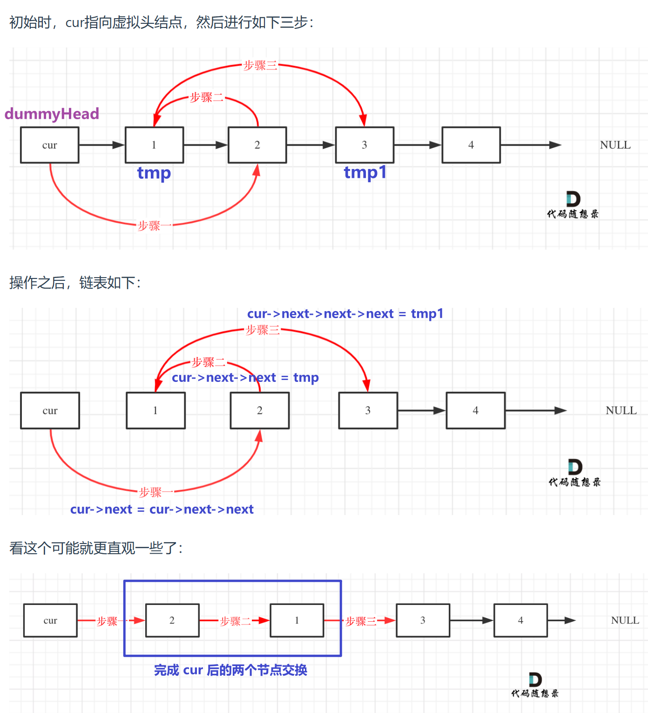


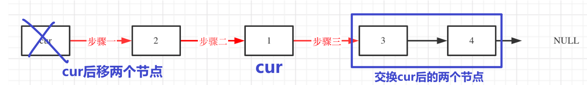


~~~C++
/**
 * Definition for singly-linked list.
 * struct ListNode {
 *     int val;
 *     ListNode *next;
 *     ListNode() : val(0), next(nullptr) {}
 *     ListNode(int x) : val(x), next(nullptr) {}
 *     ListNode(int x, ListNode *next) : val(x), next(next) {}
 * };
 */
class Solution {
public:
    ListNode* swapPairs(ListNode* head) {

        ListNode* dummyHead = new ListNode(0);
        dummyHead->next = head;

        ListNode* cur = dummyHead; 

        while (cur->next && cur->next->next)
        {
            ListNode* tmp = cur->next; // ä¿å­˜åŸ cur->next
            ListNode* tmp1 = cur->next->next->next; // ä¿å­˜åŸcur->next->next->next

            // 交æ¢curå的两个节点
            cur->next = cur->next->next;
            cur->next->next = tmp;
            cur->next->next->next = tmp1;

            // cur å移两ä½
            cur = cur->next->next;
        }

        return dummyHead->next;
        
    }
};
~~~

时间å¤æ‚度：O(N) N为链表长度
空间å¤æ‚度：O(1)


ACM

~~~C++
#include <iostream>
using namespace std;

// 24 两两交æ¢é“¾è¡¨ä¸­çš„节点
// 时间å¤æ‚度：O(N) N为链表长度
// 空间å¤æ‚度：O(1)

struct ListNode
{
    int val;
    ListNode* next;
    ListNode(int x) : val(x), next(nullptr) {}
};


ListNode* swapPairs(ListNode* head)
{
    ListNode* dummyHead = new ListNode(0);
    dummyHead->next = head;

    ListNode* cur = dummyHead;

    while (cur->next && cur->next->next)
    {
        ListNode* tmp = cur->next;
        ListNode* tmp1 = cur->next->next->next;

        // 交æ¢curå的两个节点
        cur->next = cur->next->next;
        cur->next->next = tmp;
        cur->next->next->next = tmp1;

        // cur å移两个ä½ç½®
        cur = cur->next->next;
    }

    return dummyHead->next;
}


int main()
{
    // æ„建链表: 1 -> 2 -> 3 -> 4
    ListNode* head = new ListNode(1);
    head->next = new ListNode(2);
    head->next->next = new ListNode(3);
    head->next->next->next = new ListNode(4);

    ListNode* newHead = swapPairs(head);

    while (newHead)
    {
        cout << newHead->val << " ";
        newHead = newHead->next;
    }
    cout << endl;

    return 0;
}
~~~

输出：
~~~
2 1 4 3 
~~~


## [25 K个一组翻转链表](https://leetcode.cn/problems/reverse-nodes-in-k-group/description/?envType=study-plan-v2&envId=top-100-liked)


[题解：çµèŒ¶å±±è‰¾åºœ](https://www.bilibili.com/video/BV1sd4y1x7KN/?vd_source=7369d5f08520f2fc3601caee93963ffa)


~~~C++
/**
 * Definition for singly-linked list.
 * struct ListNode {
 *     int val;
 *     ListNode *next;
 *     ListNode() : val(0), next(nullptr) {}
 *     ListNode(int x) : val(x), next(nullptr) {}
 *     ListNode(int x, ListNode *next) : val(x), next(next) {}
 * };
 */
class Solution {
public:
    ListNode* reverseKGroup(ListNode* head, int k) {

        // 统计节点个数
        int n = 0;
        ListNode* node = head;
        while (node)
        {
            n++;
            node = node->next;
        }
        
        ListNode* dummyHead = new ListNode(0);
        dummyHead->next = head;
        
        ListNode* p0 = dummyHead; // p0 作为 [下一组è¦å转的k个节点的] 上一个节点
        ListNode* pre = nullptr;
        ListNode* cur = head;

        // 剩余节点足够 k 个
        while (n >= k)
        {
            // k 个一组处ç†
            for (int i = 0; i < k; i++) // 206 普通å转链表
            {
                ListNode* tmp = cur->next;
                cur->next = pre;
                pre = cur;
                cur = tmp;
            }

            // è¿æ¥å¤´å°¾
            ListNode* nxt = p0->next;
            p0->next->next = cur;
            p0->next = pre;
            p0 = nxt; // æ›´æ–°p0

            // n æ›´æ–°
            n -= k;
            
            pre = nullptr; // å¯ä»¥ä¸é‡ç½®ï¼Œé‡ç½®å¥½ç†è§£ä¸€äº›
        }

        return dummyHead->next;

    }
};
~~~

- 时间å¤æ‚度：O(*n*)，其中 *n* 为链表节点个数。
- 空间å¤æ‚度：O(1)，仅用到若干é¢å¤–å˜é‡ã€‚


ACM

~~~C++
#include <iostream>
using namespace std;

// 25 k个一组翻转链表
// 时间å¤æ‚度：O(n)，其中 n 为链表节点个数。
// 空间å¤æ‚度：O(1)，仅用到若干é¢å¤–å˜é‡ã€‚

struct ListNode
{
    int val;
    ListNode* next;
    ListNode(int x) : val(x), next(nullptr) {}
};


ListNode* reverseKGroup(ListNode* head, int k)
{
    // 统计链表长度
    int n = 0;
    ListNode* node = head;
    while (node)
    {
        n++;
        node = node->next;
    }

    ListNode* dummyHead = new ListNode(0);
    dummyHead->next = head;

    ListNode* p0 = dummyHead; // p0 作为 [下一组è¦å转的k个节点的] 上一个节点
    ListNode* pre = nullptr;
    ListNode* cur = head;

    while (n >= k)
    {
        // å转当å‰è¿™k个节点
        for (int i = 0; i < k; i++)
        {
            ListNode* tmp = cur->next;
            cur->next = pre;
            pre = cur;
            cur = tmp;
        }

        // è¿æ¥å‰å
        ListNode* nxt = p0->next;
        p0->next->next = cur;
        p0->next = pre;
        p0 = nxt; // æ›´æ–°p0

        // æ›´æ–° n
        n -= k;

        pre = nullptr; // å¯ä»¥ä¸é‡ç½®ï¼Œé‡ç½®å¥½ç†è§£ä¸€äº›
    
    }

    return dummyHead->next;
}


int main()
{
    // æ„建链表: 1 -> 2 -> 3 -> 4 -> 5
    ListNode* head = new ListNode(1);
    head->next = new ListNode(2);
    head->next->next = new ListNode(3);
    head->next->next->next = new ListNode(4);
    head->next->next->next->next = new ListNode(5);

    int k = 2;

    // 执行K个一组翻转
    ListNode* newHead = reverseKGroup(head, k);

    // 输出结æœé“¾è¡¨
    while (newHead) {
        cout << newHead->val << " ";
        newHead = newHead->next;
    }
    cout << endl;


    return 0;
}
~~~

输出：

~~~C++
2 1 4 3 5 
~~~


## [138 éšæœºé“¾è¡¨çš„å¤åˆ¶](https://leetcode.cn/problems/copy-list-with-random-pointer/description/?envType=study-plan-v2&envId=top-100-liked)


[题解：Krahets](https://leetcode.cn/problems/copy-list-with-random-pointer/solutions/2361362/138-fu-zhi-dai-sui-ji-zhi-zhen-de-lian-b-6jeo/?envType=study-plan-v2&envId=top-100-liked)

### 1ã€å“ˆå¸Œ <åŸèŠ‚点，新节点>

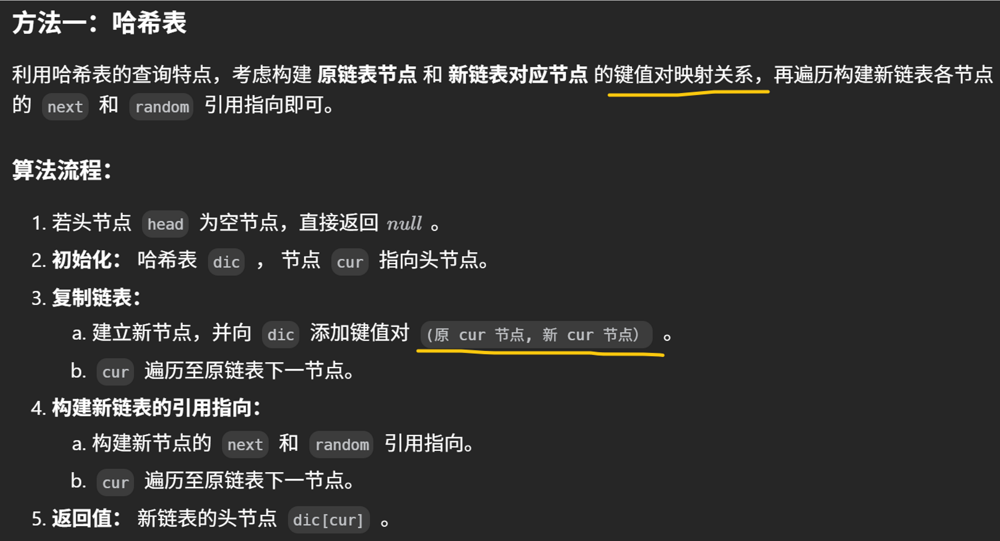


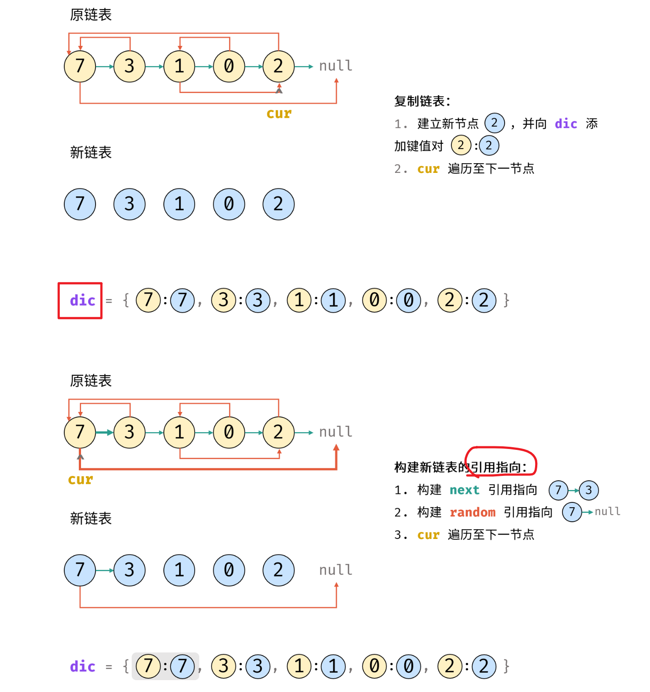

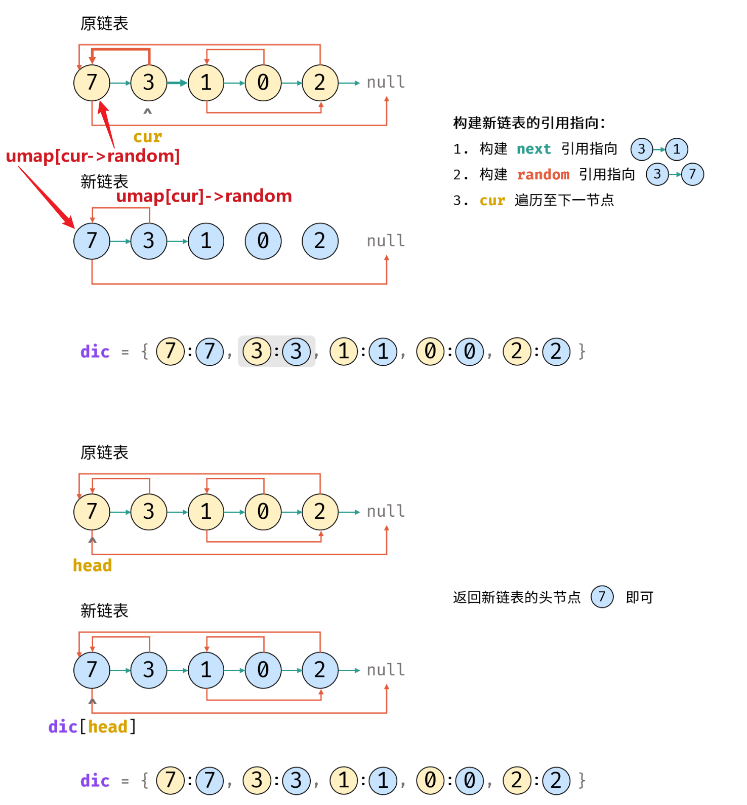

~~~C++
/*
// Definition for a Node.
class Node {
public:
    int val;
    Node* next;
    Node* random;
    
    Node(int _val) {
        val = _val;
        next = NULL;
        random = NULL;  // random_index：éšæœºæŒ‡é’ˆæŒ‡å‘的节点索引
    }
};
*/

class Solution {
public:
    Node* copyRandomList(Node* head) {

        if (head == nullptr)    return nullptr;

        Node* cur = head;
        unordered_map<Node*, Node*> umap; // <åŸèŠ‚点，新节点>

        // å¤åˆ¶å„节点，并建立 “åŸèŠ‚点 -> 新节点†的 Map 映射
        while (cur)
        {
            umap[cur] = new Node(cur->val);
            cur = cur->next;
        }

        // æ„建新链表的 next å’Œ random 指å‘
        cur = head;
        while (cur)
        {
            umap[cur]->next = umap[cur->next];
            umap[cur]->random = umap[cur->random];
            cur = cur->next;
        }

        // 新的头结点
        return umap[head];
    }
};
~~~

时间å¤æ‚度 O(N) ： 两轮éå†é“¾è¡¨ï¼Œä½¿ç”¨ O(N) 时间。

空间å¤æ‚度 O(N) ： 哈希表 dic 使用线性大å°çš„é¢å¤–空间。


### 2ã€æ‹¼æ¥ + 拆分


~~~C++
/*
// Definition for a Node.
class Node {
public:
    int val;
    Node* next;
    Node* random;
    
    Node(int _val) {
        val = _val;
        next = NULL;
        random = NULL;  // random_index：éšæœºæŒ‡é’ˆæŒ‡å‘的节点索引
    }
};
*/

class Solution {
public:
    Node* copyRandomList(Node* head) {

        if (head == nullptr)    return nullptr;

        // 拼æ¥é“¾è¡¨ åŸèŠ‚点 1 -> 新节点 1 -> åŸèŠ‚点 2 -> 新节点 2 -> ……
        Node* cur = head;
        while (cur)
        {
            Node* tmp = new Node(cur->val);
            tmp->next = cur->next;
            cur->next = tmp;

            cur = tmp->next;
        }

        // æ„建å„新节点的 random 指å‘
        cur = head;
        while (cur)
        {
            if (cur->random)
            {
                // 新节点random = åŸèŠ‚点random->next
                cur->next->random = cur->random->next;
            }
            cur = cur->next->next; 
        }

        // 拆分
        Node* pre = head;
        Node* nhead = head->next;
        cur = nhead;
        while (cur->next)
        {
            pre->next = pre->next->next;
            cur->next = cur->next->next;
            pre = pre->next;
            cur = cur->next;
        }

        pre->next = nullptr; // å•ç‹¬å¤„ç†åŸé“¾è¡¨å°¾èŠ‚点
        return nhead;
    }
};
~~~

时间å¤æ‚度 O(N) ： 三轮éå†é“¾è¡¨ï¼Œä½¿ç”¨ O(N) 时间。
空间å¤æ‚度 O(1) ： 节点引用å˜é‡ä½¿ç”¨å¸¸æ•°å¤§å°çš„é¢å¤–空间。


### ACM

~~~C++
#include <iostream>
#include <unordered_map>
using namespace std;

// 链表节点定义
struct Node {
    int val;
    Node* next;
    Node* random; // random_index：éšæœºæŒ‡é’ˆæŒ‡å‘的节点索引

    Node(int _val) : val(_val), next(nullptr), random(nullptr) {}
};


Node* copyRandomList(Node* head)
{
    if (head == nullptr)    return nullptr;

    // umap <åŸèŠ‚点，新节点>
    unordered_map<Node*, Node*> umap;
    Node* cur = head;
    while (cur)
    {
        umap[cur] = new Node(cur->val);
        cur = cur->next;
    }

    // å¤åˆ¶ next å’Œ random 指针
    cur = head;
    while (cur)
    {
        umap[cur]->next = umap[cur->next];
        umap[cur]->random = umap[cur->random];
        cur = cur->next;
    }

    return umap[head];
}


int main()
{
    // æ„建链表: 1 -> 2 -> 3
    Node* node1 = new Node(1);
    Node* node2 = new Node(2);
    Node* node3 = new Node(3);
    node1->next = node2;
    node2->next = node3;

    // 设置 random 指针
    node1->random = node3; // 1->random->3
    node2->random = node1; // 2->random->1
    node3->random = node2; // 3->random->2

    Node* copiedHead = copyRandomList(node1);


    // 打å°ç»“æœï¼ˆval å’Œ random->val）
    Node* p = copiedHead;
    while (p) 
    {
        cout << "val: " << p->val;
        if (p->random)
        {
            cout << ", random: " << p->random->val << endl;
        }
        else
        {
            cout << ", random: NULL" << endl;
        }
        p = p->next;
    }

    return 0;
}
~~~

输出：

~~~C++
val: 1, random: 3
val: 2, random: 1
val: 3, random: 2
~~~


## 148 [æ’åºé“¾è¡¨](https://leetcode.cn/problems/sort-list/description/?envType=study-plan-v2&envId=top-100-liked)


çµç¥é¢˜è§£ï¼š[两ç§æ–¹æ³•ï¼šåˆ†æ²»/迭代，模å—化设计，代ç å¯è¯»æ€§é«˜ï¼ˆPython/Java/C++/C/Go/JS/Rust）](https://leetcode.cn/problems/sort-list/solutions/2993518/liang-chong-fang-fa-fen-zhi-die-dai-mo-k-caei/?envType=study-plan-v2&envId=top-100-liked)


### 1ã€å½’并æ’åº-分治递归

æ¨è


~~~C++
/**
 * Definition for singly-linked list.
 * struct ListNode {
 *     int val;
 *     ListNode *next;
 *     ListNode() : val(0), next(nullptr) {}
 *     ListNode(int x) : val(x), next(nullptr) {}
 *     ListNode(int x, ListNode *next) : val(x), next(next) {}
 * };
 */
class Solution {
public:
    // 876. 找链表中间节点断开（快慢指针）
    ListNode* middleNode(ListNode* head)
    {
        ListNode* slow = head;
        ListNode* fast = head;
        while (fast->next && fast->next->next)
        {
            slow = slow->next;// 中间节点的å‰ä¸€ä¸ª
            fast = fast->next->next;
        }

        ListNode* mid = slow->next;
        slow->next = nullptr; // æ–­å¼€
        return mid;
    }

    // 21 åˆå¹¶ä¸¤ä¸ªæœ‰åºé“¾è¡¨ï¼ˆå¿«æ…¢æŒ‡é’ˆï¼‰
    ListNode* mergerTwoLists(ListNode* list1, ListNode* list2)
    {
        ListNode* dummy = new ListNode(0);
        ListNode* cur = dummy;
        while (list1 && list2)
        {
            if (list1->val < list2->val)
            {
                cur->next = list1;
                list1 = list1->next;
            }
            else
            {
                cur->next = list2;
                list2 = list2->next;
            }

            cur = cur->next;
        }

        cur->next = (list1 != nullptr) ? list1 : list2;
        return dummy->next;
    }


    ListNode* sortList(ListNode* head) {

        if (head == nullptr || head->next == nullptr)   return head;

        // 找中点断开
        // 比如 head=[4,2,1,3]，那么 middleNode 调用结æŸå head=[4,2] head2=[1,3]
        ListNode* head2 = middleNode(head);

        // 分治 递归 分别æ’åº headå’Œhead2
        head = sortList(head);
        head2 = sortList(head2);
        
        // åˆå¹¶
        return mergerTwoLists(head, head2);
       
    }
};
~~~

时间å¤æ‚度：O(nlogn)，其中 n æ˜¯é“¾è¡¨é•¿åº¦ã€‚é€’å½’å¼ T(n)=2T(n/2)+O(n)，由主定ç†å¯å¾—时间å¤æ‚度为 O(nlogn)。
空间å¤æ‚度：O(logn)ã€‚é€’å½’éœ€è¦ O(logn) 的栈开销。


### 2ã€å½’并æ’åº-迭代

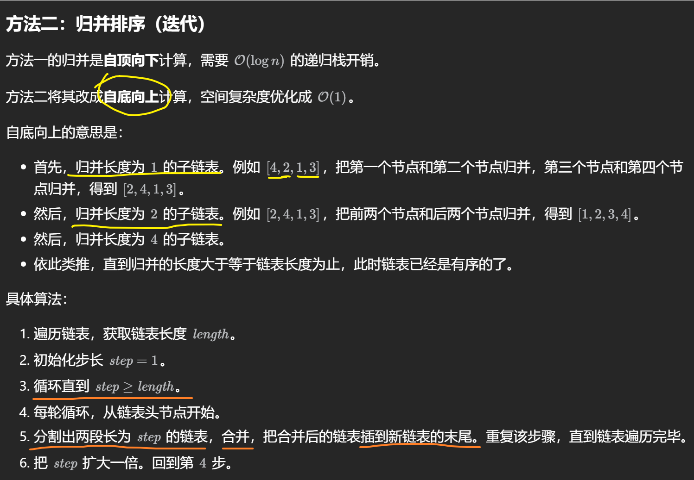

两两åˆå¹¶ï¼Œå››å››åˆå¹¶ï¼Œå…«å…«åˆå¹¶â€¦â€¦

**画图å§**


~~~C++
/**
 * Definition for singly-linked list.
 * struct ListNode {
 *     int val;
 *     ListNode *next;
 *     ListNode() : val(0), next(nullptr) {}
 *     ListNode(int x) : val(x), next(nullptr) {}
 *     ListNode(int x, ListNode *next) : val(x), next(next) {}
 * };
 */
class Solution {
public:
    // è·å–链表长度
    int getLength(ListNode* head)
    {
        int length = 0;
        while (head)
        {
            length++;
            head = head->next;
        }
        return length;
    }

    // 分割链表，分割å‰size个，返å›å‰©ä½™é“¾è¡¨çš„头结点
    ListNode* splitList(ListNode* head, int size)
    {
        ListNode* cur = head;

        // curèµ°size步，åœåœ¨å‰size个节点的最å一个
        for (int i = 0; i < size - 1 && cur; i++)   cur = cur->next;

        // 链表长度 <= size, ä¸æ“作，返å›null
        if (cur == nullptr || cur->next == nullptr) return nullptr;

        // 链表长度 >  size，把链表的å‰size个节点分割出æ¥ï¼ˆæ–­å¼€ï¼‰ï¼Œè¿”å›å‰©ä½™é“¾è¡¨çš„头结点
        ListNode* next_head = cur->next;
        cur->next = nullptr; // æ–­å¼€

        return next_head; 
    }

    
    // 21.åˆå¹¶ä¸¤ä¸ªæœ‰åºé“¾è¡¨ï¼Œè¿”å›åˆå¹¶åçš„ <头结点，尾节点>
    pair<ListNode*, ListNode*> mergeTwoLists(ListNode* l1, ListNode* l2)
    {
        ListNode* dummy = new ListNode(0);
        ListNode* cur = dummy;
        while (l1 && l2)
        {
            if (l1->val < l2->val)
            {
                cur->next = l1;
                l1 = l1->next;
            }
            else 
            {
                cur->next = l2;
                l2 = l2->next;
            }
            cur = cur->next;
        }
        cur->next = l1 ? l1 : l2;

        while (cur->next)   cur = cur->next; // 移动cur到尾节点
        return {dummy->next, cur}; // è¿”å›åˆå¹¶åçš„ <头结点，尾节点>
    }


    ListNode* sortList(ListNode* head) {

        int length = getLength(head);

        ListNode* dummy = new ListNode(0);
        dummy->next = head;

        // step 为步长，å³å‚ä¸åˆå¹¶çš„链表长度，step = 1, 2, 4, 8, ...
        for (int step = 1; step < length; step *= 2)
        {
            // ä» step = 1 开始：step = 1, 2, 4, 8, ...
            // æ¯2个ã€1节点】一组åˆå¹¶ï¼Œåˆ°æ¯2个ã€2节点】一组åˆå¹¶ï¼Œå†åˆ°æ¯2个ã€4节点】...

            ListNode* new_list_tail = dummy; // 新链表的末尾
            ListNode* cur = dummy->next;

            // 链表æ¯2个step长的部分，分别åˆå¹¶ï¼Œå†æ‹¼æ¥ï¼Œç›´åˆ°cur=null
            while (cur) 
            {
                // ä»cur开始，分割出两段长为step的链表
                ListNode* head1 = cur;
                ListNode* head2 = splitList(head1, step);
                cur = splitList(head2, step); // 下一轮循ç¯çš„起点，head2也断开了

                // åˆå¹¶ä¸¤æ®µé•¿ä¸ºstep的链表
                auto [merge_head, merge_tail] = mergeTwoLists(head1, head2);

                // åˆå¹¶å的头结点head，æ¥åˆ°new_list_tailçš„åé¢ï¼Œæ›´æ–°æœ«å°¾
                new_list_tail->next = merge_head; 
                new_list_tail = merge_tail;
            }

            // cur == nullptr，step = 2 * step，开始下一轮åˆå¹¶            
        }
        

        return dummy->next;
    }
};
~~~

- 时间å¤æ‚度：O(*n*log*n*)，其中 *n* 是链表长度。
- 空间å¤æ‚度：O(1)。


### ACM

~~~C++
#include <iostream>
using namespace std;

// 148 æ’åºé“¾è¡¨
// 时间å¤æ‚度：O(nlogn)
// 空间å¤æ‚度：O(logn)


struct ListNode 
{
    int val;
    ListNode *next;
    ListNode(int x) : val(x), next(nullptr) {}
};


// 找链表的中间节点并断开，返å›å一åŠçš„头节点
ListNode* middleNode(ListNode* head) 
{
    ListNode* slow = head;
    ListNode* fast = head;
    while (fast->next && fast->next->next) 
    {
        slow = slow->next;
        fast = fast->next->next;
    }

    ListNode* mid = slow->next;
    slow->next = nullptr; // æ–­å¼€å‰åŠéƒ¨åˆ†
    return mid;
}

// åˆå¹¶ä¸¤ä¸ªæœ‰åºé“¾è¡¨
ListNode* mergerTwoLists(ListNode* list1, ListNode* list2) 
{
    ListNode* dummy = new ListNode(0);
    ListNode* cur = dummy;
    while (list1 && list2) 
    {
        if (list1->val < list2->val) 
        {
            cur->next = list1;
            list1 = list1->next;
        } 
        else 
        {
            cur->next = list2;
            list2 = list2->next;
        }
        cur = cur->next;
    }

    cur->next = list1 ? list1 : list2;
    return dummy->next;
}


// æ’åºé“¾è¡¨
ListNode* sortList(ListNode* head) 
{
    if (!head || !head->next) return head;

    ListNode* head2 = middleNode(head);
    head = sortList(head);
    head2 = sortList(head2);

    return mergerTwoLists(head, head2);
}


int main() 
{
    // æ„建链表：4 -> 2 -> 1 -> 3
    ListNode* head = new ListNode(4);
    head->next = new ListNode(2);
    head->next->next = new ListNode(1);
    head->next->next->next = new ListNode(3);

    // æ’åº
    head = sortList(head);

    // 输出结æœ
    while (head) 
    {
        cout << head->val << " ";
        head = head->next;
    }
    cout << endl;

    return 0;
}

~~~

输出：

~~~C++
1 2 3 4 
~~~


## 23 [åˆå¹¶K个å‡åºé“¾è¡¨](https://leetcode.cn/problems/merge-k-sorted-lists/description/?envType=study-plan-v2&envId=top-100-liked)

@最å°å †


### 1ã€æœ€å°å †ï¼ˆæ¨è）


~~~C++
/**
 * Definition for singly-linked list.
 * struct ListNode {
 *     int val;
 *     ListNode *next;
 *     ListNode() : val(0), next(nullptr) {}
 *     ListNode(int x) : val(x), next(nullptr) {}
 *     ListNode(int x, ListNode *next) : val(x), next(next) {}
 * };
 */
class Solution {
public:
    ListNode* mergeKLists(vector<ListNode*>& lists) {

        auto cmp = [](const ListNode* a, const ListNode* b)
        {
            return a->val > b->val; // 最å°å †
            
            // å¦‚æœ cmp(a, b) 为 true，则认为 a 的优先级ä½äº b，所以 a 会在 b çš„åé¢ã€‚
            // return a->val > b->val; å³å¤§çš„æ•°æ’在åé¢ï¼Œå°çš„在å‰
        };

        priority_queue<ListNode*, vector<ListNode*>, decltype(cmp)> pq;
        for (auto head : lists)
        {
            if (head)   pq.push(head); // 先把所有é空链表的头节点入堆
        }
        

        ListNode* dummy = new ListNode(0);// 哨兵节点，作为åˆå¹¶å链表头结点的å‰ä¸€ä¸ªèŠ‚点
        ListNode* cur = dummy;
        
        while (!pq.empty()) // 循ç¯ç›´åˆ°å †ä¸ºç©º
        {
            auto node = pq.top(); // 弹出剩余节点中的最å°èŠ‚点
            pq.pop();
            
            if (node->next) // 如æœä¸‹ä¸€ä¸ªèŠ‚点ä¸ä¸ºç©ºï¼Œæœ‰å¯èƒ½æ˜¯æœ€å°èŠ‚点，入堆自动æ’åº
            {
                pq.push(node->next); 
            }

            cur->next = node; // node添加到新链表的末尾
            cur = cur->next;  // 准备åˆå¹¶ä¸‹ä¸€ä¸ªèŠ‚点
        }

        return dummy->next;
    }
};
~~~

- 时间å¤æ‚度：O(*L*log*m*)，其中 *m* 为 *lists* 的长度，*L* 为所有链表的长度之和。
- 空间å¤æ‚度：O(*m*)。堆中至多有 *m* 个元素。


##### å°é¡¶å †

~~~C++
auto cmp = [](const ListNode* a, const ListNode* b) {
    return a->val > b->val;  // å°çš„优先
};
~~~

`cmp` 是一个 lambda表达å¼ï¼Œå®ƒæ¥å—两个 `ListNode*` ç±»å‹çš„å‚æ•° `a` å’Œ `b`。

è¿”å› `a->val > b->val`，æ„æ€æ˜¯ï¼š

> 在 C++ STL 的 `priority_queue` 中，**比较函数 `cmp(a, b)` 的语义是**：
>
> ​	“ å¦‚æœ `cmp(a, b)` 为 `true`，则认为 `a` 的优先级**ä½äº** `b`，所以 `a` 会在 `b` çš„**åé¢**。â€
>
> 所以 `return a > b;` 表示 `a > b`时，返å›true，大的数在åé¢ï¼Œå°çš„数在å‰ï¼ˆtop）。


对äºè‡ªå®šä¹‰ç±»å‹å¦‚ `ListNode*`，我们用 lambda æ¥å®šåˆ¶æ¯”较逻辑：

~~~C++
priority_queue<ListNode*, vector<ListNode*>, decltype(cmp)> pq(cmp);
~~~

å½“ä½ å‘ `pq` æ’入多个 `ListNode*` æ—¶ï¼Œå®ƒä¼šæ ¹æ® `cmp(a, b)` 的值æ¥ç»´æŠ¤å †åºï¼š

- è‹¥ `a->val > b->val` è¿”å› `true` → `a` 比 `b` 优先级ä½ï¼ˆ `a` 应该在å，å³å¤§çš„节点在å）
- 最终堆顶就是 **当å‰æœ€å°çš„节点**


##### dummy 节点的创建

~~~C++
ListNode dummy{};           // 哨兵节点，作为åˆå¹¶å链表头结点的å‰ä¸€ä¸ªèŠ‚点
auto cur = &dummy;        // 指针 cur æŒ‡å‘ dummy 
~~~

`{}`：这是 C++11 引入的值åˆå§‹åŒ–语法，表示将指针åˆå§‹åŒ–为 `nullptr`（空指针）。

| 写法              | è¯´æ˜                                                         |
| ----------------- | ------------------------------------------------------------ |
| `ListNode dummy;` | 创建了一个å®é™…çš„ **`ListNode` å®ä¾‹**（默认值为0, nullptr） ✅<br />`dummy` 是一个å®é™…存在äº**栈上**çš„ `ListNode` å®ä¾‹<br />访问：`dummy.next`  `dummy.val` |


和常è§å†™æ³•çš„区别：

~~~C++
ListNode* dummy = new ListNode(0); // 使用 new 在堆上创建了一个值为 0 的 ListNode 节点
ListNode* cur = dummy;
~~~

`ListNode* dummy`：声æ˜ä¸€ä¸ª**指针å˜é‡ `dummy`，类å‹æ˜¯ `ListNode*`**，å³æŒ‡å‘ `ListNode` ç±»å‹çš„指针。

功能等价：**逻辑上等价**

- 两者最终目的完全一致：使用一个“哨兵节点â€ä½œä¸ºåˆå¹¶å链表的起点（å ä½å¤´ç»“点），便äºæ„造和返å›ã€‚
- å续都是æ“作 `cur` 指针，无论它指å‘栈上的 `dummy` 还是堆上的 `*dummy`，逻辑无差别。

但**语义和内存管ç†ä¸Šä¸å®Œå…¨ç­‰ä»·**：

| 写法                                 | 存储ä½ç½® | 是å¦éœ€è¦æ‰‹åŠ¨é‡Šæ”¾      | 是å¦æ›´æ¨è   |
| ------------------------------------ | -------- | --------------------- | ------------ |
| `ListNode dummy;`                    | 栈内存   | ⌠ä¸éœ€è¦              | ✅ æ¨è       |
| `ListNode* dummy = new ListNode(0);` | 堆内存   | ✅ éœ€è¦ `delete dummy` | âš ï¸ æ˜“å†…å­˜æ³„æ¼ |

如æœä½ æ˜¯åœ¨å‡½æ•°ä½“内部æ„造链表，ä¸è·¨ä½œç”¨åŸŸã€ä¸éœ€è¦å…±äº«é“¾è¡¨å¤´ï¼Œæ¨è使用 **栈上 dummy 节点写法**：

```
ListNode dummy;
ListNode* cur = &dummy;
```

更安全，ä¸éœ€è¦è€ƒè™‘ `delete`，ä¸ä¼šé€ æˆå†…存泄æ¼ï¼Œè¯­ä¹‰æ¸…晰。


### 2ã€åˆ†æ²»é€’å½’


~~~C++
class Solution {
public:

    // 21 åˆå¹¶ä¸¤ä¸ªæœ‰åºé“¾è¡¨(å‡åº)
    ListNode* mergeTwoLists(ListNode* list1, ListNode* list2)
    {
        ListNode* dummy = new ListNode(0);
        ListNode* cur = dummy;
        while (list1 && list2)
        {
            if (list1->val < list2->val)  
            {
                cur->next = list1;
                list1 = list1->next;
            }
            else
            {
                cur->next = list2;
                list2 = list2->next;
            }

            cur = cur->next;
        }

        cur->next = list1 ? list1 :  list2;
        return dummy->next;
    }


    // åˆå¹¶ä» lists[i] 到 lists[j-1] 的链表，左闭å³å¼€
    ListNode* mergeRange(vector<ListNode*>& lists, int i, int j) 
    {
        int m = j - i; // [i, j)
        if (m == 0) return nullptr;  // 输入的 lists å¯èƒ½æ˜¯ç©ºçš„
        if (m == 1) return lists[i]; // 无需åˆå¹¶ï¼Œç›´æ¥è¿”å›
        
        auto left  = mergeRange(lists, i, i + m / 2); // 递归åˆå¹¶å·¦åŠéƒ¨åˆ†
        auto right = mergeRange(lists, i + m / 2, j); // 递归åˆå¹¶å³åŠéƒ¨åˆ†

        return mergeTwoLists(left, right); // 最å把左和å³ä¸¤åŠåˆå¹¶
    }


    ListNode* mergeKLists(vector<ListNode*>& lists) {

        return mergeRange(lists, 0, lists.size()); // 递归åˆå¹¶
    }
};
~~~

时间å¤æ‚度：O(Llogm)

- 其中 m 为 lists 的长度，L 为所有链表的长度之和。æ¯ä¸ªèŠ‚点å‚ä¸é“¾è¡¨åˆå¹¶çš„次数为 O(logm) 次，一共有 L 个节点，所以总的时间å¤æ‚度为 O(Llogm)。

空间å¤æ‚度：O(logm)

- 递归深度为 O(logm)ï¼Œéœ€è¦ O(logm) 的栈空间。Python 忽略切片产生的é¢å¤–空间。


### ACM

~~~C++
#include <iostream>
#include <vector>
using namespace std;

// 23 åˆå¹¶k个有åºé“¾è¡¨
// 最å°å †ï¼š
//      时间å¤æ‚度：O(Llogm)，其中 m 为 lists 的长度，L 为所有链表的长度之和。
//      空间å¤æ‚度：O(m)。堆中至多有 m 个元素
// 分治递归：
//      时间å¤æ‚度：O(Llogm)，其中 m 为 lists 的长度，L 为所有链表的长度之和。
//      空间å¤æ‚度：O(logm)。递归深度为 O(logm)ï¼Œéœ€è¦ O(logm) 的栈空间。


struct ListNode {
    int val;
    ListNode *next;
    ListNode(int x) : val(x), next(nullptr) {}
};

// 21 åˆå¹¶ä¸¤ä¸ªæœ‰åºé“¾è¡¨(å‡åº)
ListNode* mergeTwoLists(ListNode* list1, ListNode* list2)
{
    ListNode* dummy = new ListNode(0);
    ListNode* cur = dummy;
    while (list1 && list2)
    {
        if (list1->val < list2->val)  
        {
            cur->next = list1;
            list1 = list1->next;
        }
        else
        {
            cur->next = list2;
            list2 = list2->next;
        }

        cur = cur->next;
    }

    cur->next = list1 ? list1 :  list2;
    return dummy->next;
}

// åˆå¹¶ä» lists[i] 到 lists[j-1] 的链表
ListNode* mergeRange(vector<ListNode*>& lists, int i, int j) 
{
    int m = j - i; // [i, j)
    if (m == 0) return nullptr;  // 输入的 lists å¯èƒ½æ˜¯ç©ºçš„
    if (m == 1) return lists[i]; // 无需åˆå¹¶ï¼Œç›´æ¥è¿”å›
    
    auto left  = mergeRange(lists, i, i + m / 2); // åˆå¹¶å·¦åŠéƒ¨åˆ†
    auto right = mergeRange(lists, i + m / 2, j); // åˆå¹¶å³åŠéƒ¨åˆ†

    return mergeTwoLists(left, right); // 最å把左åŠå’Œå³åŠåˆå¹¶
}


// åˆå¹¶k个å‡åºé“¾è¡¨
ListNode* mergeKLists(vector<ListNode*>& lists) 
{
    return mergeRange(lists, 0, lists.size()); // 递归åˆå¹¶
}


int main() 
{
    // æ„建三个有åºé“¾è¡¨
    ListNode* l1 = new ListNode(1); // 1->4->5
    l1->next = new ListNode(4);
    l1->next->next = new ListNode(5);

    ListNode* l2 = new ListNode(1); // 1->3->4
    l2->next = new ListNode(3);
    l2->next->next = new ListNode(4);

    ListNode* l3 = new ListNode(2); // 2->6
    l3->next = new ListNode(6);

    vector<ListNode*> lists = {l1, l2, l3};
    ListNode* merged = mergeKLists(lists); // åˆå¹¶

    while (merged)
    {
        cout << merged->val;
        if (merged->next)   cout << "->";
        merged = merged->next;
    }
    cout << endl;

    return 0;
}
~~~

输出：

~~~C++
1->1->2->3->4->4->5->6
~~~


## [146 LRU缓存](https://leetcode.cn/problems/lru-cache/description/?envType=study-plan-v2&envId=top-100-liked)


~~~C++
// æ„造åŒå‘链表（存key，value，å‰åå‘指针）
// 删除节点 remove() + 最上é¢æ·»åŠ èŠ‚点 push_front() + 抽出key节点，移到头部 get_node()

class Node // æ„造åŒå‘链表
{
public:
    int key;
    int value;
    Node* prev;
    Node* next;

    Node(int k = 0, int v = 0) : key(k), value(v) {}
};


class LRUCache {
private:
    int capacity;
    Node* dummy; 
    unordered_map<int, Node*> key_to_node; // <key, node>

    // 删除一个节点（抽出一本书）
    void remove(Node* x)
    {
        x->prev->next = x->next;
        x->next->prev = x->prev; 
    }


    // æ’入节点到链表头部（dummyåé¢ï¼‰ï¼ˆæŠŠä¸€æœ¬ä¹¦æ”¾åœ¨æœ€ä¸Šé¢ï¼‰
    void push_front(Node* x)
    {
        x->prev = dummy;
        x->next = dummy->next;
        x->prev->next = x;
        x->next->prev = x;
    }


    // è·å– key 对应的节点返å›ï¼Œå¹¶ç§»åˆ°é“¾è¡¨å¤´éƒ¨ï¼ˆæŠ½å‡ºä¸€æœ¬ä¹¦æ”¾åœ¨æœ€ä¸Šé¢ï¼‰
    Node* get_node(int key)
    {
        auto it = key_to_node.find(key);

        // 没有这本书
        if (it == key_to_node.end())    return nullptr; 

        // 有这本书
        Node* node = it->second; 
        remove(node);     // 抽出这本书
        push_front(node); // 放在最上é¢

        return node;
    }


public:
    LRUCache(int capacity) 
        : capacity(capacity), dummy(new Node())
    {
        dummy->prev = dummy;
        dummy->next = dummy;// åˆå§‹éƒ½æŒ‡å‘自己
    }
    

    int get(int key) {
        // 如æœå…³é”®å­— key 存在äºç¼“存中，则返å›å…³é”®å­—的值，å¦åˆ™è¿”å› -1 
        Node* node = get_node(key);
        return node ? node->value : -1;
    }
    
    
    void put(int key, int value) {
        // 如æœå…³é”®å­— key å·²ç»å­˜åœ¨ï¼Œåˆ™å˜æ›´å…¶æ•°æ®å€¼ value 
        // 如æœä¸å­˜åœ¨ï¼Œåˆ™å‘缓存中æ’入该组 key-value 
        // 如æœæ’å…¥æ“作导致关键字数é‡è¶…过 capacity ，则应该 é€å‡º 最久未使用的关键字
        
        Node* node = get_node(key);// get_node 会把对应节点移到链表头部
        // 节点存在，更新value，移到头部（有这本书）
        if (node) 
        {
            node->value = value; 
            return;
        }

        // 节点ä¸å­˜åœ¨ï¼Œåˆ›å»ºæ–°èŠ‚点æ’入头部（新书）
        Node* newnode = new Node(key, value);
        key_to_node[key] = newnode;
        push_front(newnode); 

        // 节点æ’å…¥å，容é‡çˆ†äº†ï¼Œç§»é™¤æœ€å节点（移除最下é¢çš„书）
        if (key_to_node.size() > capacity) 
        {
            Node* back_node = dummy->prev; // ç¯å½¢åŒå‘链表，直æ¥æ‰¾åˆ°æœ€ä¸‹é¢èŠ‚点
            
            key_to_node.erase(back_node->key); // map中删除 <key, back_node>
            remove(back_node); 				   // 链表删除节点
            
            delete back_node; // 释放内存
        }
    }
    
};

/**
 * Your LRUCache object will be instantiated and called as such:
 * LRUCache* obj = new LRUCache(capacity);
 * int param_1 = obj->get(key);
 * obj->put(key,value);
 */
~~~

- 时间å¤æ‚度：所有æ“作å‡ä¸º O(1)。
- 空间å¤æ‚度：O(min(*p*,*capacity*))，其中 *p* 为 put 的调用次数。


ACM

~~~C++
#include <iostream>
#include <unordered_map>
using namespace std;

// 146 LRU缓存
// 时间å¤æ‚度：所有æ“作å‡ä¸º O(1)
// 空间å¤æ‚度：O(min(p,capacity))，其中 p 为 put 的调用次数


// åŒå‘链表结æ„
class Node
{
public:
    int key;
    int value;
    Node* prev;
    Node* next;

    Node(int k = 0, int v = 0) : key(k), value(v), prev(nullptr), next(nullptr) {}
};


class LRUCache
{
private:
    int capacity; // 容é‡
    unordered_map<int, Node*> key_to_node; // <key, node>
    Node* dummy;


    // 删除一个节点（抽出一本书）
    void removeNode(Node* x)
    {
        x->prev->next = x->next;
        x->next->prev = x->prev;
    }

    // æ’入节点到链表头部（dummyåé¢ï¼‰ï¼ˆæŠŠä¸€æœ¬ä¹¦æ”¾åœ¨æœ€ä¸Šé¢ï¼‰
    void push_front(Node* x)
    {
        x->prev = dummy;
        x->next = dummy->next;
        x->prev->next = x;
        x->next->prev = x;
    }

    // è·å– key 节点返å›ï¼Œå¹¶ç§»åŠ¨åˆ°å¤´éƒ¨ï¼ˆæŠ½å‡ºä¸€æœ¬ä¹¦æ”¾åœ¨æœ€ä¸Šé¢ï¼‰
    Node* get_node_push(int key)
    {
        auto it = key_to_node.find(key);

        if (it == key_to_node.end())   return nullptr;

        Node* node = it->second;
        removeNode(node);
        push_front(node);
        return node;
    }


public:
    LRUCache(int capacity) 
        : capacity(capacity), dummy(new Node()) // åˆå§‹åŒ–列表
    {
        dummy->prev = dummy;
        dummy->next = dummy;
    }


    // get() 如æœå…³é”®å­— key 存在äºç¼“存中，则返å›å…³é”®å­—的值，å¦åˆ™è¿”å› -1 
    int get(int key)
    {
        Node* node = get_node_push(key);
        return node ? node->value : -1;
    }


    // 如æœå…³é”®å­— key å·²ç»å­˜åœ¨ï¼Œåˆ™å˜æ›´å…¶æ•°æ®å€¼ value 
    // 如æœä¸å­˜åœ¨ï¼Œåˆ™å‘缓存中æ’入该组 key-value 
    // 如æœæ’å…¥æ“作导致关键字数é‡è¶…过 capacity ，则应该 é€å‡º 最久未使用的关键字
    void put(int key, int value)
    {
        Node* node = get_node_push(key);

        // 节点存在
        if (node)
        {
            node->value = value;
            return;
        }

        // 节点ä¸å­˜åœ¨ï¼Œåˆ›å»ºæ–°èŠ‚点æ’入头部
        Node* new_node = new Node(key, value);
        push_front(new_node);
        key_to_node[key] = new_node;

        // 节点æ’å…¥å，容é‡çˆ†äº†ï¼Œç§»é™¤æœ€å节点
        if (key_to_node.size() > capacity)
        {
            Node* back_node = dummy->prev;
            key_to_node.erase(back_node->key); // 在map删除
            removeNode(back_node);             // 在链表删除

            delete back_node; // 释放内存
        }
    }

};


int main()
{
    LRUCache lru(2); // capacity = 2

    lru.put(1, 1); // {1=1}
    lru.put(2, 2); // {1=1, 2=2}

    cout << "get(1)" << lru.get(1) << endl; // 输出1  {2=2，1=1}

    lru.put(3, 3); // 超出capacity，淘汰key=2  {1=1，3=3}

    cout << "get(2)" << lru.get(2) << endl; // 输出-1

    lru.put(4, 4); // 超出capacity，淘汰key=1  {3=3, 4=4}
    
    cout << "get(1)" << lru.get(1) << endl; // 输出-1
    cout << "get(3)" << lru.get(3) << endl; // 输出 3
    cout << "get(4)" << lru.get(4) << endl; // 输出 4


    return 0;
}
~~~


# 二å‰æ ‘ ✅

## [94 中åºéå†](https://leetcode.cn/problems/binary-tree-inorder-traversal/description/?envType=study-plan-v2&envId=top-100-liked)


### 递归

~~~C++
/**
 * Definition for a binary tree node.
 * struct TreeNode {
 *     int val;
 *     TreeNode *left;
 *     TreeNode *right;
 *     TreeNode() : val(0), left(nullptr), right(nullptr) {}
 *     TreeNode(int x) : val(x), left(nullptr), right(nullptr) {}
 *     TreeNode(int x, TreeNode *left, TreeNode *right) : val(x), left(left), right(right) {}
 * };
 */
class Solution {
public:
    // 递归
    void traversal(TreeNode* cur, vector<int>& vec)
    {
        if (cur == nullptr) return;

        traversal(cur->left, vec);  // å·¦
        vec.push_back(cur->val);    // 中
        traversal(cur->right, vec); // å³
    }


    vector<int> inorderTraversal(TreeNode* root) {
        
        vector<int> result;
        traversal(root, result);

        return result;
        
    }
};
~~~


### 迭代


画图å§ï¼ï¼ï¼

~~~C++
class Solution {
public:
    vector<int> inorderTraversal(TreeNode* root) {

        vector<int> result;

        stack<TreeNode*> st;
        TreeNode* cur = root;

        while (cur || !st.empty())
        {
            if (cur)
            {
                // 指针æ¥è®¿é—®èŠ‚点，节点放入栈，先左边，一直到左边最底层
                st.push(cur);
                cur = cur->left;
            }
            else // cur = nullptr 走到左边最ä½
            {
                cur = st.top(); // è¦å¤„ç†çš„节点
                st.pop();

                // 当å‰èŠ‚点值放进result
                result.push_back(cur->val); // 中
                
                // 转å‘当å‰èŠ‚点的å³èŠ‚点
                cur = cur->right;           // å³
            }
        }

        return result;        
    }
};
~~~


### ACM

~~~C++
#include <iostream>
#include <vector>
using namespace std;

// 93 二å‰æ ‘中åºéå†

// 结æ„æ ‘
struct TreeNode
{
    int val;
    TreeNode* left;
    TreeNode* right;
    TreeNode(int x) : val(x), left(nullptr), right(nullptr) {}
};

// 递归中åºéå† å·¦-中-å³
void inorderTraversal(TreeNode* cur, vector<int>& vec)
{
    if (!cur)   return;

    inorderTraversal(cur->left, vec);  // å·¦
    vec.push_back(cur->val);           // 中
    inorderTraversal(cur->right, vec); // å³
}


int main()
{
    // æ„建如下二å‰æ ‘：
    //           1
    //         /   \
    //        2     3
    //       / \     \
    //      4   5     8
    //         / \   /
    //        6   7 9

    TreeNode* root = new TreeNode(1);
    root->left = new TreeNode(2);
    root->right = new TreeNode(3);

    root->left->left = new TreeNode(4);
    root->left->right = new TreeNode(5);
    root->left->right->left = new TreeNode(6);
    root->left->right->right = new TreeNode(7);

    root->right->right = new TreeNode(8);
    root->right->right->left = new TreeNode(9);

    vector<int> result;
    inorderTraversal(root, result); // 4 2 6 5 7 1 3 9 8

    // 输出
    for (int val : result)
    {
        cout << val << " ";
    }
    cout << endl;


    return 0;
}

~~~


## [二å‰æ ‘的最大深度](https://leetcode.cn/problems/maximum-depth-of-binary-tree/description/?envType=study-plan-v2&envId=top-100-liked)


### 自底å‘上（递归）


~~~C++
class Solution {
public:

    // 递归 
    int getdepth(TreeNode* node)
    {
        if (node == nullptr)    return 0;

        int leftdepth = getdepth(node->left); // å·¦
        int rightdepth = getdepth(node->right); // å³

        // å–å·¦å³å­æ ‘深度的最大值 + 1
        int depth = max(leftdepth, rightdepth) + 1; // 加上自己
        return depth;
    }


    int maxDepth(TreeNode* root) {
        return getdepth(root);
    }
};
~~~

精简：

~~~C++
class Solution {
public:
    int maxDepth(TreeNode* root) {
        // 自底å‘上
        if (!root)  return 0;
        return 1 + max(maxDepth(root->left), maxDepth(root->right));
    }
};
~~~


### 自顶å‘下（递归）

把ç»è¿‡çš„节点数传下å»ï¼ˆä¹Ÿå°±æ˜¯æ·±åº¦ depth），往下走，+1

~~~C++
class Solution {
public:
    int maxDepth(TreeNode* root) {

        // 自顶å‘下
        int ans = 0;

        auto dfs = [&](this auto&& dfs, TreeNode* node, int depth)->void 
        {
            if (node == nullptr)     return;

            depth++; // ä»ä¸Šå¾€ä¸‹å¸¦å‚数（节点数）
            
            ans = max(ans, depth); // æ¯å¾€ä¸‹èµ°ä¸€å±‚，更新深度

            dfs(node->left, depth);
            dfs(node->right, depth);  
        };

        dfs(root, 0);
        return ans;        
    }
};
~~~

> 这里 `auto dfs = [&](this auto&& dfs, TreeNode* node, int depth)->void {}`传的是 `int depth`，**值传递，而ä¸æ˜¯å¼•ç”¨ä¼ é€’，为什么？**
>
> 值传递：
>
> - æ¯æ¬¡ `dfs` 被调用时，`depth` 是**一份新的值**
>
> - `depth++` 是在当å‰è·¯å¾„中修改，ä¸å½±å“兄弟节点；
>
> - 例如 `left` 分支的递归 `depth++` å，`right` 分支ä»ç„¶æ˜¯åŸæ¥çš„ `depth+1`ï¼›
>
>   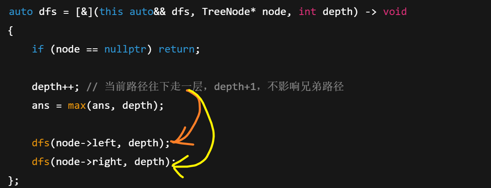
>
> 引用传递：
>
> - 如æœæ”¹æˆå¼•ç”¨ä¼ é€’，æ¯æ¬¡é€’归都是对åŒä¸€ä¸ªå˜é‡ `depth` 的引用，æ¯æ¬¡ `depth++`都会永久修改这个å˜é‡
>
>   
>
> - 引用传递会让所有递归路径共享一个å˜é‡ï¼Œä¸€æ—¦åœ¨æŸä¸€æ”¯ä¸­è¢«ä¿®æ”¹ï¼Œå续所有路径都会“继承â€è¿™ä¸ªå€¼ï¼Œæ— æ³•å映æ¯æ¡è·¯å¾„本应有的独立深度。


### 层åº

最大深度，就是最大层数，æ¯èµ°ä¸€å±‚深度 + 1

~~~C++	
/**
 * Definition for a binary tree node.
 * struct TreeNode {
 *     int val;
 *     TreeNode *left;
 *     TreeNode *right;
 *     TreeNode() : val(0), left(nullptr), right(nullptr) {}
 *     TreeNode(int x) : val(x), left(nullptr), right(nullptr) {}
 *     TreeNode(int x, TreeNode *left, TreeNode *right) : val(x), left(left), right(right) {}
 * };
 */
class Solution {
public:
    int maxDepth(TreeNode* root) {

        if (root == nullptr)   return 0;
        int depth = 0;

        queue<TreeNode*> que;
        que.push(root);

        while (!que.empty())
        {
            int size = que.size();
            depth++; // æ¯èµ°ä¸€å±‚，深度+1

            for (int i = 0; i < size; i++)
            {
                TreeNode* node = que.front();
                que.pop(); // 求深度，ä¸ç”¨æ”¶é›†èŠ‚点值了

                if (node->left)     que.push(node->left);
                if (node->right)    que.push(node->right);
            }
        }

        return depth;        
    }
};
~~~


### ACM

~~~C++	
#include <iostream>
#include <vector>
#include <queue>

using namespace std;

// 104 二å‰æ ‘的最大深度
// 时间å¤æ‚度：O(n)
// 空间å¤æ‚度：O(n)


struct TreeNode
{
    int val;
    TreeNode* left;
    TreeNode* right;
    TreeNode(int x) : val(x), left(nullptr), right(nullptr) {}
};


int maxDepth(TreeNode* root)
{
    if (!root)  return 0;

    queue<TreeNode*> que;
    que.push(root);

    int depth = 0;

    while (!que.empty())
    {
        int size = que.size();
        depth++;

        for (int i = 0; i < size; i++)
        {
            TreeNode* node = que.front();
            que.pop();
            if (node->left)     que.push(node->left);
            if (node->right)    que.push(node->right);
        }
    }

    return depth;
}


int main()
{
    TreeNode* root = new TreeNode(3);
    root->left = new TreeNode(9);
    root->right = new TreeNode(20);

    root->right->left = new TreeNode(15);
    root->right->right = new TreeNode(7);


    int depth = maxDepth(root); // 3
    cout << depth << endl;


    return 0;
}
~~~


## [226 翻转二å‰æ ‘](https://leetcode.cn/problems/invert-binary-tree/description/?envType=study-plan-v2&envId=top-100-liked)

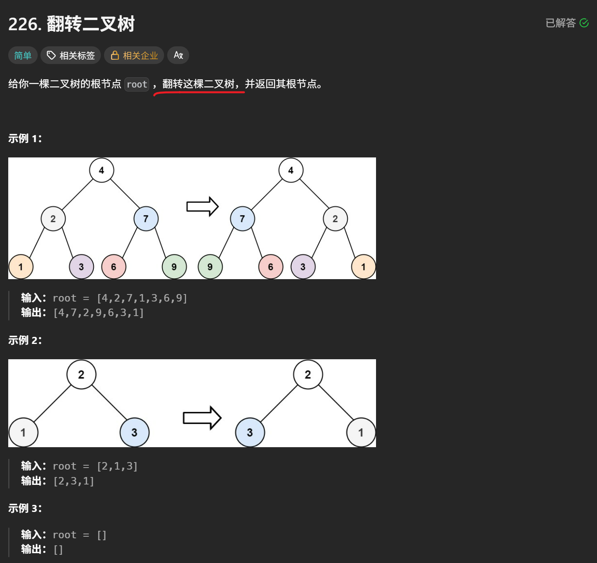


**注æ„交æ¢çš„是节点，ä¸æ˜¯å€¼**


### 1ã€é€’归（å‰åºï¼‰æ¨è

swap ç›´æ¥äº¤æ¢å½“å‰èŠ‚点的左å³å­æ ‘

~~~C++
/**
 * Definition for a binary tree node.
 * struct TreeNode {
 *     int val;
 *     TreeNode *left;
 *     TreeNode *right;
 *     TreeNode() : val(0), left(nullptr), right(nullptr) {}
 *     TreeNode(int x) : val(x), left(nullptr), right(nullptr) {}
 *     TreeNode(int x, TreeNode *left, TreeNode *right) : val(x), left(left), right(right) {}
 * };
 */
class Solution {
public:
    TreeNode* invertTree(TreeNode* root) {

        if (root == nullptr)    return root;

        // ç›´æ¥äº¤æ¢å½“å‰èŠ‚点的左å³å­æ ‘
        swap(root->left, root->right);  // 中
        invertTree(root->left);         // å·¦
        invertTree(root->right);        // å³

        // 交æ¢å·¦å³è¯­å¥çš„顺åºï¼Œå°±æ˜¯ååº

        return root;
    }
};
~~~


### 2ã€è¿­ä»£ï¼ˆå‰åºï¼‰

~~~C++
class Solution {
public:
    TreeNode* invertTree(TreeNode* root) {

        // 迭代 å‰åº
        if (root == nullptr)    return root;

        stack<TreeNode*> st;
        st.push(root);
        while (!st.empty())
        {
            TreeNode* node = st.top();                // 中
            st.pop();
            swap(node->left, node->right);

            if (node->right)    st.push(node->right); // å³
            if (node->left)     st.push(node->left);  // å·¦
        }

        return root;
    }
};
~~~


### 3ã€å±‚åº

~~~C++
class Solution {
public:
    TreeNode* invertTree(TreeNode* root) {

        // 层åº
        queue<TreeNode*> que;
        if (root)  que.push(root);

        while (!que.empty())
        {
            int size = que.size();

            for (int i = 0; i < size; i++)
            {
                TreeNode* node = que.front();
                que.pop();
                swap(node->left, node->right); // 交æ¢

                if (node->left)     que.push(node->left);
                if (node->right)    que.push(node->right);
            }
        }

        return root;
    }
};
~~~


### ACM 

~~~C++
#include <iostream>
#include <vector>
#include <queue>
using namespace std;

// 226 å转二å‰æ ‘
// 时间å¤æ‚度： O(n)
// 空间å¤æ‚度： O(h)，最å情况下递归栈深度为树高 h，最å O(n)ï¼Œå¹³å‡ O(log n)（平衡树）。

struct TreeNode {
    int val;
    TreeNode* left;
    TreeNode* right;
    TreeNode(int x) : val(x), left(nullptr), right(nullptr) {}
};


// 递归 å‰åº
TreeNode* invertTree(TreeNode* root) 
{
    if (root == nullptr)    return root;

    swap(root->left, root->right);      // 中
    invertTree(root->left);             // å·¦
    invertTree(root->right);            // å³

    return root;
}


// 层åºéå†ï¼ˆç”¨äºè¾“出）
vector<int> levelOrder(TreeNode* root) 
{
    vector<int> result;
    if (!root) return result;

    queue<TreeNode*> q;
    q.push(root);

    while (!q.empty()) {
        TreeNode* node = q.front(); 
        q.pop();
        result.push_back(node->val);

        if (node->left)  q.push(node->left);
        if (node->right) q.push(node->right);
    }

    return result;
}


int main()
{
    // æ„建测试树结æ„
    TreeNode* root = new TreeNode(4);
    root->left = new TreeNode(2);
    root->right = new TreeNode(7);

    root->left->left = new TreeNode(1);
    root->left->right = new TreeNode(3);

    root->right->left = new TreeNode(6);
    root->right->right = new TreeNode(9);

    invertTree(root); // å转
    vector<int> output = levelOrder(root);

    // 输出
    for (auto val : output)
    {
        cout << val << " ";
    }

    cout << endl;


    return 0;
}
~~~


输出

~~~C++
4 7 2 9 6 3 1 
~~~


## 101 [对称二å‰æ ‘](https://leetcode.cn/problems/symmetric-tree/description/?envType=study-plan-v2&envId=top-100-liked)


### 递归


~~~C++
/**
 * Definition for a binary tree node.
 * struct TreeNode {
 *     int val;
 *     TreeNode *left;
 *     TreeNode *right;
 *     TreeNode() : val(0), left(nullptr), right(nullptr) {}
 *     TreeNode(int x) : val(x), left(nullptr), right(nullptr) {}
 *     TreeNode(int x, TreeNode *left, TreeNode *right) : val(x), left(left), right(right) {}
 * };
 */
class Solution {
public:
    // 递归
    bool compare(TreeNode* left, TreeNode* right)
    {
        // æ’除节点空的情况
        if      (left == nullptr && right == nullptr)       return true;
    	else if (left == nullptr || right == nullptr)       return false;
        // æ’除节点ä¸ç©ºï¼Œä½†å€¼ä¸åŒçš„情况
        else if (left->val != right->val)   return false;

        // å·¦å³éƒ½ä¸ç©ºï¼Œä¸”值相åŒï¼Œå†åšé€’归下一层        
        // 内外层都相åŒï¼Œæ‰å¯¹ç§°
        return compare(left->left, right->right) && // 外层比较，左树->左，å³æ ‘->å³
               compare(left->right, right->left);	// 内层比较：左树->å³ï¼Œå³æ ‘->å·¦      
    }

    bool isSymmetric(TreeNode* root) {
        if (root == nullptr)    return true;
        return compare(root->left, root->right); // å·¦å³èŠ‚点传入compare，进行递归比较
    }
};
~~~


### ACM

~~~C++
#include <iostream>

using namespace std;


// 101 对称二å‰æ ‘
// 时间å¤æ‚度： O(n)
// 空间å¤æ‚度：
// 		最å情况下为递归栈深度 O(h)，h 为树高；
// 		平衡二å‰æ ‘æ—¶ O(log n)，最å退化为 O(n)。

struct TreeNode
{
    int val;
    TreeNode* left;
    TreeNode* right;
    TreeNode(int x) : val(x), left(nullptr), right(nullptr) {}
};


// 递归比较两棵å­æ ‘是å¦é•œåƒå¯¹ç§°
bool compare(TreeNode* left, TreeNode* right)
{
    // æ’除节点空
    if      (left == nullptr && right == nullptr)       return true;
    else if (left == nullptr || right == nullptr)       return false;
    // æ’除节点ä¸ç©ºï¼Œä½†å€¼ä¸åŒçš„情况
    else if (left->val != right->val)                   return false;

    // 比较外侧和内侧
    return compare(left->left, right->right) && compare(left->right, right->left);
}

// 判断整棵树是å¦å¯¹ç§°
bool isSymmetric(TreeNode* root) 
{
    if (!root) return true;
    return compare(root->left, root->right);
}


int main()
{
    // æ„建对称二å‰æ ‘：
    //         1
    //       /   \
    //      2     2
    //     / \   / \
    //    3   4 4   3
    TreeNode* root = new TreeNode(1);
    root->left = new TreeNode(2);
    root->right = new TreeNode(2);

    root->left->left = new TreeNode(3);
    root->left->right = new TreeNode(4);

    root->right->left = new TreeNode(4);
    root->right->right = new TreeNode(3);

    bool result = isSymmetric(root);
    cout << (result ? "true" : "false") << endl;

    return 0;
}
~~~


## 543 [二å‰æ ‘的直径](https://leetcode.cn/problems/diameter-of-binary-tree/description/?envType=study-plan-v2&envId=top-100-liked)

@ 递归


[æ ‘å½¢ DP：树的直径ã€åŸºç¡€ç®—法精讲 23】](https://www.bilibili.com/video/BV17o4y187h1/?vd_source=7369d5f08520f2fc3601caee93963ffa)


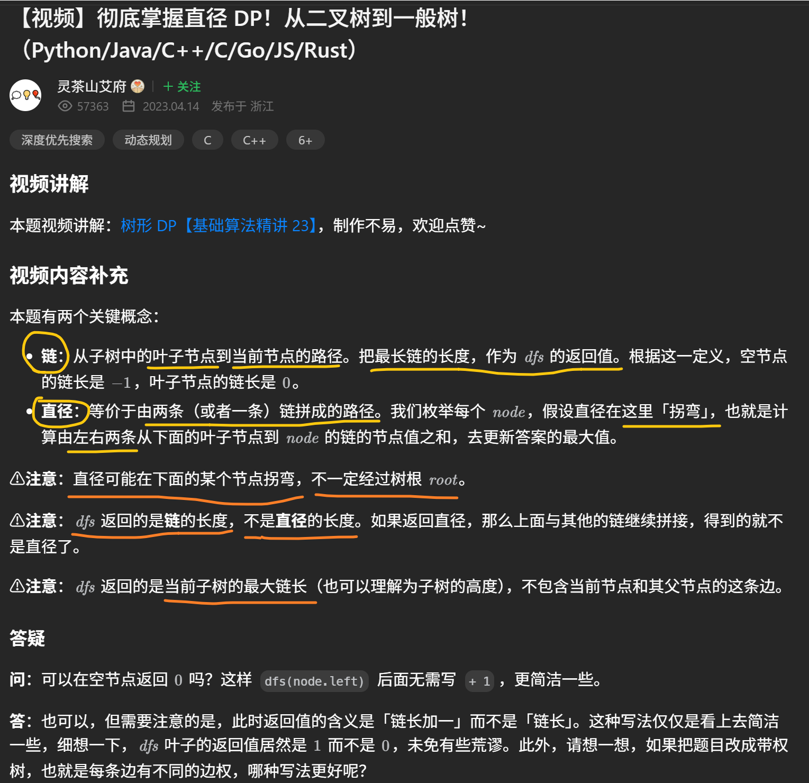

~~~C++
/**
 * Definition for a binary tree node.
 * struct TreeNode {
 *     int val;
 *     TreeNode *left;
 *     TreeNode *right;
 *     TreeNode() : val(0), left(nullptr), right(nullptr) {}
 *     TreeNode(int x) : val(x), left(nullptr), right(nullptr) {}
 *     TreeNode(int x, TreeNode *left, TreeNode *right) : val(x), left(left), right(right) {}
 * };
 */
class Solution {
public:
    int diameterOfBinaryTree(TreeNode* root) {

        int ans = 0;

        // 递归
        auto dfs = [&](this auto&& dfs, TreeNode* node) ->int {
            if (node == nullptr)    return -1; // å¶å­èŠ‚点，链长就是-1 + 1 = 0
            
            int l_len = dfs(node->left) + 1;  // å·¦å­æ ‘最大链长 + 1 （加1è¿åˆ°è‡ªå·±ï¼‰
            int r_len = dfs(node->right) + 1; // å³å­æ ‘最大链长 + 1

            // 两æ¡é“¾æ‹¼æˆè·¯å¾„（直径）
            ans = max(ans, l_len + r_len); 
            
            return max(l_len, r_len); // 递归返å›çš„是当å‰å­æ ‘的最大链长
        };

        dfs(root);
        return ans;
    }
};
~~~

 `this auto&& dfs`

- **C++20 起支æŒ**：lambda å‚数中使用 `this auto&&` å…许 lambda **递归调用自身**。
- `this` 说æ˜å®ƒæ˜¯ **递归 lambda** çš„ç‰¹æ®Šç”¨æ³•ï¼Œç¼–è¯‘å™¨ä¼šåœ¨è°ƒç”¨æ—¶æŠŠå½“å‰ lambda 自己传进æ¥ã€‚
- `dfs` 是 lambda 的“自身引用â€ï¼Œç›¸å½“äºç»™è‡ªå·±èµ·äº†ä¸ªå字，å¯ä»¥åœ¨å†…部递归调用。

~~~C++
auto dfs = [&](this auto&& dfs, TreeNode* node) -> int{...};
~~~

定义了一个**å¯ä»¥é€’归调用自身的深度优先æœç´¢å‡½æ•°**，在函数体中递归地访问左å³å­æ ‘，并计算“以该节点为中心的最长路径â€ã€‚

等价äºï¼š

~~~C++
auto dfs = [&](auto&& dfs, TreeNode* node) -> int { ... };
~~~

调用时需è¦æ‰‹åŠ¨ä¼ å…¥è‡ªå·±`dfs`

~~~C++
dfs(dfs, root);
~~~

而`this auto&&` ç›´æ¥å¸®ä½ æŠŠ`dfs`传给自己了，调用时åªç”¨å†™ï¼š

~~~C++
dfs(root);
~~~


普通写法：

~~~C++
class Solution {
public:
    int maxDiameter = 0;

    int dfs(TreeNode* node) {
        if (node == nullptr) return -1;

        int left = dfs(node->left) + 1;
        int right = dfs(node->right) + 1;

        maxDiameter = max(maxDiameter, left + right); // 两æ¡é“¾æ‹¼æˆè·¯å¾„（直径）

        return max(left, right); // 递归返å›çš„是当å‰å­æ ‘的最大链长
    }


    int diameterOfBinaryTree(TreeNode* root) {

        dfs(root);
        return maxDiameter;
    }
};
~~~


ACM

~~~C++
#include <iostream>
#include <algorithm>
using namespace std;

// 543 二å‰æ ‘的直径


struct TreeNode
{
    int val;
    TreeNode* left;
    TreeNode* right;
    TreeNode(int x) : val(x), left(nullptr), right(nullptr) {}
};


int diameterOfBinaryTree(TreeNode* root)
{
    int ans = 0;

    // 递归 lambda写法，this auto&& å…许递归调用自身 ï¼ˆéœ€è¦ C++23 支æŒï¼‰
    auto dfs = [&](this auto&& dfs, TreeNode* node) ->int {
        if (node == nullptr)    return -1; // å¶å­èŠ‚点，链长就是 -1 + 1 = 0
        
        int l_len = dfs(node->left) + 1;  // 左树最大链长 + 1
        int r_len = dfs(node->right) + 1; // å³æ ‘最大链长 + 1

        // 最大左链 + 最大å³é“¾
        ans = max(ans, l_len + r_len);

        return max(l_len, r_len); // 递归返å›çš„是当å‰å­æ ‘的最大链长
    };

    dfs(root);
    return ans;
}


int main()
{
    // æ„建如下二å‰æ ‘：
    //           1
    //         /   \
    //        2     3
    //       / \     
    //      4   5     

    TreeNode* root = new TreeNode(1);
    root->left = new TreeNode(2);
    root->right = new TreeNode(3);

    root->left->left = new TreeNode(4);
    root->left->right = new TreeNode(5);

    int ans = diameterOfBinaryTree(root); // 3
    cout << ans << endl;


    return 0;
}
~~~


普通写法：

~~~C++
#include <iostream>
#include <algorithm>
using namespace std;

// 543 二å‰æ ‘的直径


struct TreeNode
{
    int val;
    TreeNode* left;
    TreeNode* right;
    TreeNode(int x) : val(x), left(nullptr), right(nullptr) {}
};


int dfs (TreeNode* node, int& maxDiameter)
{
    if (node == nullptr) return -1;
    int left = dfs(node->left, maxDiameter) + 1;
    int right = dfs(node->right, maxDiameter) + 1;

    maxDiameter = max(maxDiameter, left + right); // 两æ¡é“¾æ‹¼æˆè·¯å¾„（直径）

    return max(left, right); // 递归返å›çš„是当å‰å­æ ‘的最大链长
}


int main()
{
    // æ„建如下二å‰æ ‘：
    //           1
    //         /   \
    //        2     3
    //       / \     
    //      4   5     

    TreeNode* root = new TreeNode(1);
    root->left = new TreeNode(2);
    root->right = new TreeNode(3);

    root->left->left = new TreeNode(4);
    root->left->right = new TreeNode(5);

    int maxDiameter = 0;
    dfs(root, maxDiameter);

    cout << maxDiameter << endl;

    return 0;
}
~~~


## 124 [二å‰æ ‘中的最大路径和](https://leetcode.cn/problems/binary-tree-maximum-path-sum/description/?envType=study-plan-v2&envId=top-100-liked)

@ 递归


在 ã€543 二å‰æ ‘的直径】的基础上，改æˆæ±‚节点和


~~~C++
/**
 * Definition for a binary tree node.
 * struct TreeNode {
 *     int val;
 *     TreeNode *left;
 *     TreeNode *right;
 *     TreeNode() : val(0), left(nullptr), right(nullptr) {}
 *     TreeNode(int x) : val(x), left(nullptr), right(nullptr) {}
 *     TreeNode(int x, TreeNode *left, TreeNode *right) : val(x), left(left), right(right) {}
 * };
 */
class Solution {
public:
    int maxPathSum(TreeNode* root) {

        int ans = INT_MIN;
        auto dfs = [&] (this auto&& dfs, TreeNode* node) ->int {
            if (node == nullptr)    return 0;// 没有节点，和为0

            int l_val = dfs(node->left); // 左树最大链和
            int r_val = dfs(node->right); // å³æ ‘最大链和

            ans = max(ans, l_val + r_val + node->val); // 两æ¡é“¾æ‹¼æˆè·¯å¾„（加上当å‰èŠ‚点）
            
            return max( max(l_val, r_val) + node->val, 0 ); // 当å‰å­æ ‘最大链和
                                                            // å’Œ0比较，ä¸å–è´Ÿæ•°
        };

        dfs(root);
        return ans;
        
    }
};
~~~


ä¸ç”¨lambda的写法

~~~C++
/**
 * Definition for a binary tree node.
 * struct TreeNode {
 *     int val;
 *     TreeNode *left;
 *     TreeNode *right;
 *     TreeNode() : val(0), left(nullptr), right(nullptr) {}
 *     TreeNode(int x) : val(x), left(nullptr), right(nullptr) {}
 *     TreeNode(int x, TreeNode *left, TreeNode *right) : val(x), left(left), right(right) {}
 * };
 */
class Solution {
public:
    int ans = INT_MIN;

    int dfs(TreeNode* node) 
    {
        if (node == nullptr)    return 0;// 没有节点，和为0

        int l_val = dfs(node->left);  // 左树最大链和
        int r_val = dfs(node->right); // å³æ ‘最大链和

        ans = max(ans, l_val + r_val + node->val); // 两æ¡é“¾æ‹¼æˆè·¯å¾„（加上当å‰èŠ‚点）
        
        return max( max(l_val, r_val) + node->val, 0 ); // 当å‰å­æ ‘最大链和
                                                      // å’Œ0比较，ä¸å–è´Ÿæ•°
    };

    int maxPathSum(TreeNode* root) {
        dfs(root);
        return ans; 
    }
};
~~~


ACM

~~~C++
#include <iostream>
#include <algorithm>
using namespace std;

// 124 二å‰æ ‘中的最大路径和


struct TreeNode
{
    int val;
    TreeNode* left;
    TreeNode* right;
    TreeNode(int x) : val(x), left(nullptr), right(nullptr) {}
};


int maxPathSum(TreeNode* root) 
{
    int ans = INT_MIN;

    auto dfs = [&] (this auto&& dfs, TreeNode* node) ->int {

        if (node == nullptr)    return 0;// 没有节点，和为0

        int l_val = dfs(node->left); // 左树最大链和
        int r_val = dfs(node->right); // å³æ ‘最大链和

        ans = max(ans, l_val + r_val + node->val); // 两æ¡é“¾æ‹¼æˆè·¯å¾„（加上当å‰èŠ‚点）
        return max(max(l_val, r_val) + node->val, 0); // 当å‰å­æ ‘最大链和
                                                        // å’Œ0比较，ä¸å–è´Ÿæ•°
    };

    dfs(root);
    return ans;
}


int main()
{
    /* æ„建如下二å‰æ ‘：  
        -10
        /   \
       9     20
             / \     
           15    7    
    */ 
    

    TreeNode* root = new TreeNode(-10);
    root->left = new TreeNode(9);
    root->right = new TreeNode(20);

    root->right->left = new TreeNode(15);
    root->right->right = new TreeNode(7);

    int ans = maxPathSum(root); // 42
    cout << ans << endl;


    return 0;
}
~~~


## [108 将有åºæ•°ç»„转为二å‰æœç´¢æ ‘](https://leetcode.cn/problems/convert-sorted-array-to-binary-search-tree/description/?envType=study-plan-v2&envId=top-100-liked)

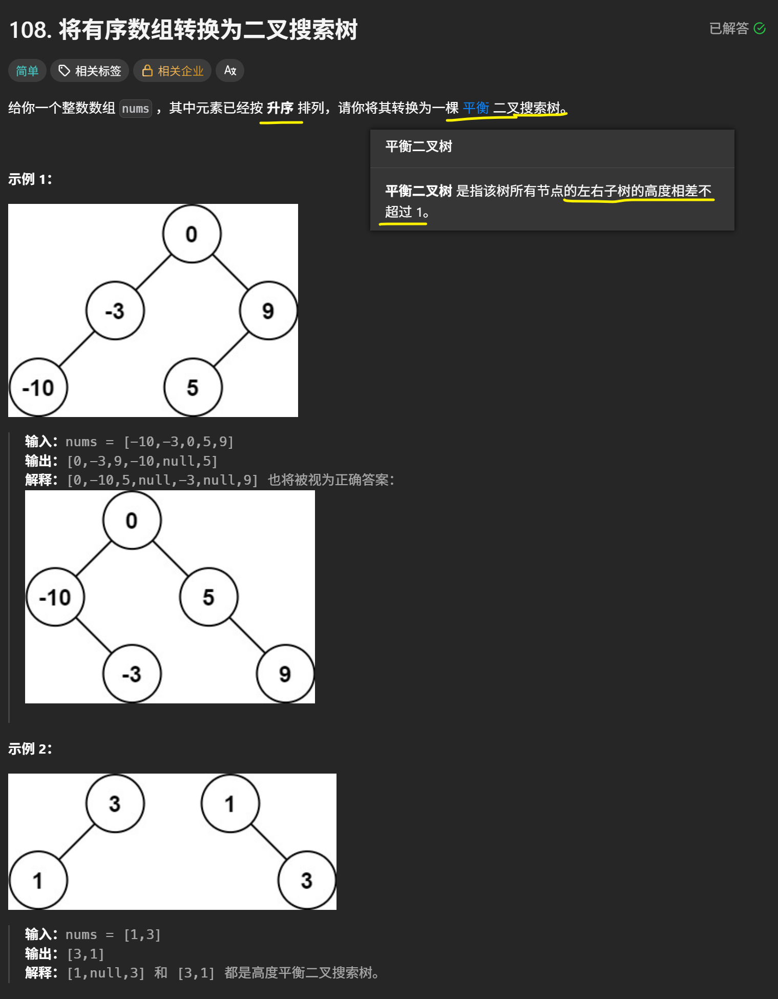


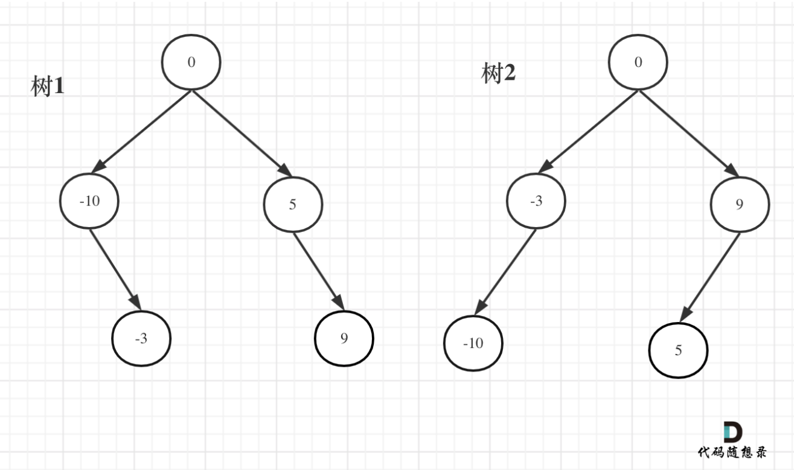


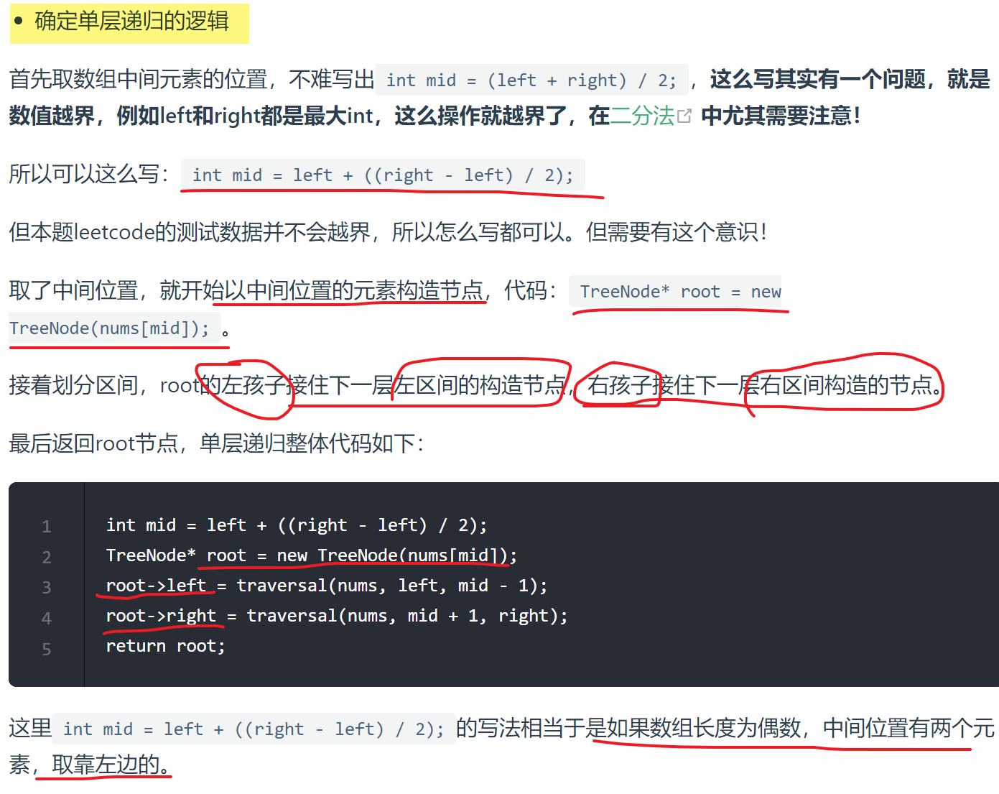


~~~C++
/**
 * Definition for a binary tree node.
 * struct TreeNode {
 *     int val;
 *     TreeNode *left;
 *     TreeNode *right;
 *     TreeNode() : val(0), left(nullptr), right(nullptr) {}
 *     TreeNode(int x) : val(x), left(nullptr), right(nullptr) {}
 *     TreeNode(int x, TreeNode *left, TreeNode *right) : val(x), left(left), right(right) {}
 * };
 */
class Solution {
public:
    // nums[left] 到 nums[right] 转æˆå¹³è¡¡äºŒå‰æœç´¢æ ‘ (左闭å³é—­)
    TreeNode* traversal(vector<int>& nums, int left, int right)
    {
        if (left > right)   return nullptr;

        int mid = left + ((right - left) / 2); 
        TreeNode* root = new TreeNode(nums[mid]); // å–中间值作为root

        root->left = traversal(nums, left, mid - 1);  // root->left æ¥å·¦åŒºé—´æ„造的下一层root
        root->right = traversal(nums, mid + 1, right);// root->right æ¥å³åŒºé—´æ„造的下一层root
        
        return root;
    }


    TreeNode* sortedArrayToBST(vector<int>& nums) {

        TreeNode* root = traversal(nums, 0, nums.size() - 1);
        return root;
        
    }
};
~~~


ACM

~~~C++
#include <vector>
#include <queue>
#include <iostream>

using namespace std;

// 108 将有åºæ•°ç»„转æ¢ä¸ºäºŒå‰æœç´¢æ ‘

struct TreeNode
{
    int val;
    TreeNode* left;
    TreeNode* right;
    TreeNode() : val(0), left(nullptr), right(nullptr) {}
    TreeNode(int x) : val(x), left(nullptr), right(nullptr) {}
    TreeNode(int x, TreeNode* left, TreeNode* right) : val(x), left(left), right(right) {}
};

TreeNode* ArrayToBstTraversal(vector<int>& nums, int left, int right)
{
    if (left > right)   return nullptr;

    int mid = left + ((right - left) / 2);
    TreeNode* root = new TreeNode(nums[mid]);

    root->left = ArrayToBstTraversal(nums, left, mid - 1);
    root->right = ArrayToBstTraversal(nums, mid + 1, right);

    return root;
}


// 层åºéå†ï¼ˆç”¨äºè¾“出）
vector<int> levelOrder(TreeNode* root) 
{
    vector<int> result;
    if (!root)  return result;

    queue<TreeNode*> q;
    q.push(root);
    while (!q.empty())
    {
        TreeNode* node = q.front();
        q.pop();
        result.push_back(node->val);

        if (node->left)     q.push(node->left);
        if (node->right)    q.push(node->right);

    }

    return result;
}


int main()
{
    // nums = [-10,-3,0,5,9]
    vector<int> nums = {-10, -3, 0, 5, 9};

    TreeNode* root = ArrayToBstTraversal(nums, 0, nums.size() - 1);

    // 层åºè¾“出
    vector<int> output = levelOrder(root);
    for (auto val : output) 
    {
        cout << val << " "; // 0 -10 5 -3 9
    }
    cout << endl;


    return 0;
}
~~~


## 98 [验è¯äºŒå‰æœç´¢æ ‘](https://leetcode.cn/problems/validate-binary-search-tree/description/?envType=study-plan-v2&envId=top-100-liked)


**注æ„：**

- è¦æ¯”较的是 **å·¦å­æ ‘**所有节点å°äºä¸­é—´èŠ‚点，**å³å­æ ‘**所有节点大äºä¸­é—´èŠ‚点

- ä¸èƒ½å•çº¯çš„比较左节点å°äºä¸­é—´èŠ‚点，å³èŠ‚点大äºä¸­é—´èŠ‚点


### 1ã€ä¸­åºé€’å½’ + 数组

æœç´¢æ ‘，左å°å³å¤§ï¼Œä¸­åºå­˜ä¸‹æ¥çš„值应该是å‡åº

~~~C++
/**
 * Definition for a binary tree node.
 * struct TreeNode {
 *     int val;
 *     TreeNode *left;
 *     TreeNode *right;
 *     TreeNode() : val(0), left(nullptr), right(nullptr) {}
 *     TreeNode(int x) : val(x), left(nullptr), right(nullptr) {}
 *     TreeNode(int x, TreeNode *left, TreeNode *right) : val(x), left(left), right(right) {}
 * };
 */
class Solution {
private:

    // 存储节点值 (递归中åº)
    vector<int> vec; 
    void traversal(TreeNode* root)
    {
        if (root == nullptr)    return;
        traversal(root->left);      // å·¦
        vec.push_back(root->val);   // 中
        traversal(root->right);     // å³
    }

    // æœç´¢æ ‘，左å°å³å¤§ï¼Œä¸­åºå­˜ä¸‹æ¥çš„值应该是å‡åº

public:
    bool isValidBST(TreeNode* root) {
        vec.clear();
        traversal(root);

        // 判断vec是ä¸æ˜¯å‡åº
        for (int i = 1; i < vec.size(); i++)
        {
            // æœç´¢æ ‘里ä¸èƒ½æœ‰ç›¸ç­‰çš„å…ƒç´ ï¼Œæ‰€ä»¥è¦ <=
            if (vec[i] <= vec[i - 1])   return false;
        }

        return true;
        
    }
};
~~~


### 2ã€ä¸­åºé€’å½’ +  preä¿å­˜å‰ä¸€ä¸ªèŠ‚点，比较是å¦å‡åº

~~~C++
class Solution {
public:

    TreeNode* pre = nullptr; // pre 记录å‰ä¸€ä¸ªèŠ‚点

    bool isValidBST(TreeNode* root) {

        if (root == nullptr)    return true;

        bool left = isValidBST(root->left);     // å·¦

        if (pre != nullptr && pre->val >= root->val)    return false;
        pre = root; // 记录å‰ä¸€ä¸ªèŠ‚点            // 中

        bool right = isValidBST(root->right);   // å³
        
        return left && right;
    }
};
~~~


### 3ã€å‰åº + 判断节点范围 

> [çµç¥](https://leetcode.cn/problems/validate-binary-search-tree/solutions/2020306/qian-xu-zhong-xu-hou-xu-san-chong-fang-f-yxvh/?envType=study-plan-v2&envId=top-100-liked)，这æ€ä¹ˆèƒ½æƒ³å‡ºæ¥çš„？

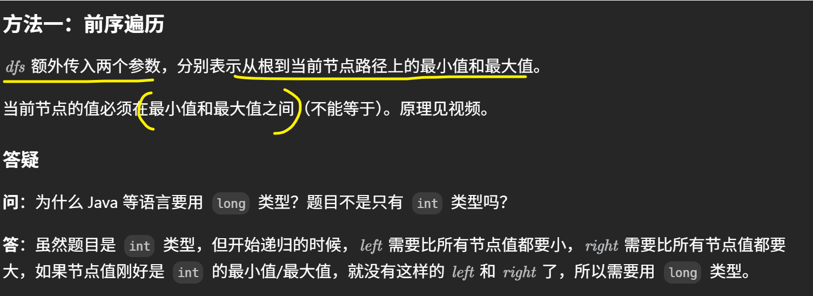


**å‰åºï¼šå…ˆè®¿é—®èŠ‚点值，å†é€’å½’å­æ ‘**

**æ ¹æ®ä¸Šä¸€å±‚æ¥æ›´æ–°ä¸‹ä¸€å±‚的节点值应该在的范围，走到下一层判断是å¦åˆæ³•**

**往左走，更新å³è¾¹ç•Œï¼Œå¾€å³èµ°ï¼Œæ›´æ–°å·¦è¾¹ç•Œ**


~~~C++
class Solution {
public:
    bool isValidBST(TreeNode* root, long long left = LLONG_MIN, long long right = LLONG_MAX) {

        // å‰åº + 边界 
        // 最开始root所处范围是 （-无穷，+无穷）

        if (root == nullptr)    return true;

        long long x = root->val; // å‰åºï¼Œå…ˆè®¿é—®èŠ‚点值，å†é€’å½’å­æ ‘

        return left < x && x < right && // 判断节点值è¦å¤„äºæ­£ç¡®çš„边界范围内
               isValidBST(root->left, left, x) && // æ›´æ–°å³è¾¹ç•Œ
               isValidBST(root->right, x, right); // 更新左边界
    }
};
~~~


### ACM

~~~C++
#include <iostream>
#include <algorithm>
using namespace std;

// 98 验è¯äºŒå‰æœç´¢æ ‘

struct TreeNode
{
    int val;
    TreeNode* left;
    TreeNode* right;
    TreeNode(int x) : val(x), left(nullptr), right(nullptr) {}
};


// 判断是å¦ä¸ºåˆæ³• BST
bool isValidBST(TreeNode* root, TreeNode* pre) 
{
    if (!root) return true;

    if (!isValidBST(root->left, pre)) return false;

    if (pre && pre->val >= root->val) return false;
    pre = root;

    if (!isValidBST(root->right, pre)) return false;

    return true;
}


int main()
{
    /* æ„建如下二å‰æ ‘：  
          5
        /   \
       1     4
            / \     
           3   6    
    */ 
    

    TreeNode* root = new TreeNode(5);
    root->left = new TreeNode(1);
    root->right = new TreeNode(4);

    root->right->left = new TreeNode(3);
    root->right->right = new TreeNode(6);

    TreeNode* pre = nullptr;
    cout << (isValidBST(root, pre) ? "true" : "false") << endl;

    return 0;
}
~~~


## [230 二å‰æœç´¢æ ‘ç§ç¬¬kå°çš„元素](https://leetcode.cn/problems/kth-smallest-element-in-a-bst/description/?envType=study-plan-v2&envId=top-100-liked)


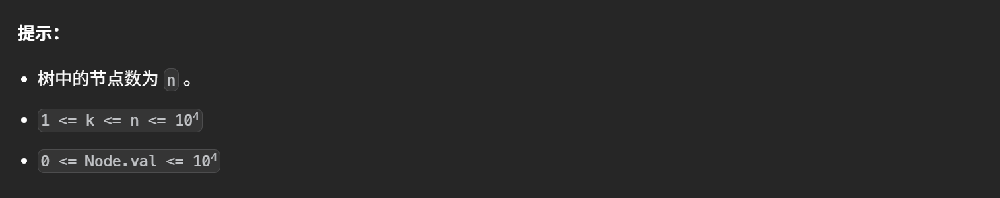

### 1ã€ä¸­åºé€’å½’ + 数组

中åºå­˜ä¸‹æ¥ `vec` 正好是å‡åºï¼Œç¬¬kå°çš„数，就是 vec 第 [k-1] 个数 `vec[k-1]`

~~~C++
/**
 * Definition for a binary tree node.
 * struct TreeNode {
 *     int val;
 *     TreeNode *left;
 *     TreeNode *right;
 *     TreeNode() : val(0), left(nullptr), right(nullptr) {}
 *     TreeNode(int x) : val(x), left(nullptr), right(nullptr) {}
 *     TreeNode(int x, TreeNode *left, TreeNode *right) : val(x), left(left), right(right) {}
 * };
 */
class Solution {
public:

    // 存储节点值 (递归中åº)
    vector<int> vec; 
    void traversal(TreeNode* root)
    {
        if (root == nullptr)    return;
        traversal(root->left);      // å·¦
        vec.push_back(root->val);   // 中
        traversal(root->right);     // å³
    }

    int kthSmallest(TreeNode* root, int k) {

        vec.clear();
        traversal(root); // 中åºå­˜ä¸‹æ¥æ­£å¥½æ˜¯å‡åºï¼Œç¬¬kå°çš„数，就是 vec 第 [k-1] 个数

        return vec[k - 1];
        
    }
};
~~~


### 2ã€ä¸­åºé€’å½’ + ç›´æ¥æ‰¾ç¬¬k个

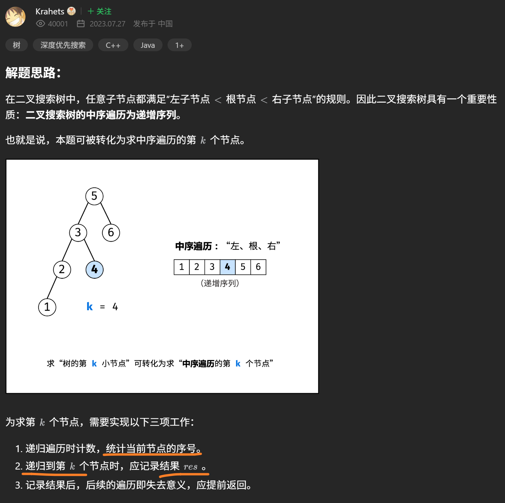

~~~C++
class Solution {
public:

    int ans = 0;
    int k = 1; // ç›´æ¥ç”¨ k 计数

    // 中åºé€’å½’
    void dfs(TreeNode* root)
    {
        if (root == nullptr)    return;

        dfs(root->left);
        
        if (k == 0)     return; // å·²ç»èµ°è¿‡k个，åé¢ä¸ç”¨éå†äº†ï¼Œç›´æ¥return
        if (--k == 0)   ans = root->val; // 记录递归到的第k个，且 k-- 计数

        dfs(root->right);
    }


    int kthSmallest(TreeNode* root, int k) {

        this->k = k;
        dfs(root);
        return ans;  
    }
};
~~~


### ACM

~~~C++
#include <iostream>
using namespace std;

// 230 二å‰æœç´¢æ ‘中第 K å°çš„元素

struct TreeNode
{
    int val;
    TreeNode* left;
    TreeNode* right;
    TreeNode(int x) : val(x), left(nullptr), right(nullptr) {}
};


// 中åºé€’å½’
void dfs(TreeNode* root, int& k, int& ans)
{
    if (root == nullptr)    return;

    dfs(root->left, k, ans);
    
    if (k == 0)     return; // å·²ç»èµ°è¿‡k个，åé¢ä¸ç”¨éå†äº†ï¼Œç›´æ¥return
    if (--k == 0)   ans = root->val; // 记录递归到的第k个，且 k-- 计数

    dfs(root->right, k, ans);
}


int main()
{
    /* æ„建如下二å‰æ ‘：  
                    5
                  /   \
                 3     6
                / \        
               2   4   
              /
             1   
    */ 
    

    TreeNode* root = new TreeNode(5);
    root->left = new TreeNode(3);
    root->right = new TreeNode(6);

    root->left->left = new TreeNode(2);
    root->left->right = new TreeNode(4);

    root->left->left->left = new TreeNode(1);

    int k = 3;
    int ans = 0;
    dfs(root, k, ans);

    cout << ans << endl; // 3

    return 0;
}
~~~


## 199 [二å‰æ ‘çš„å³è§†å›¾](https://leetcode.cn/problems/binary-tree-right-side-view/description/?envType=study-plan-v2&envId=top-100-liked)

@ 层åºéå†æ”¶é›†æ¯å±‚最å一个元素

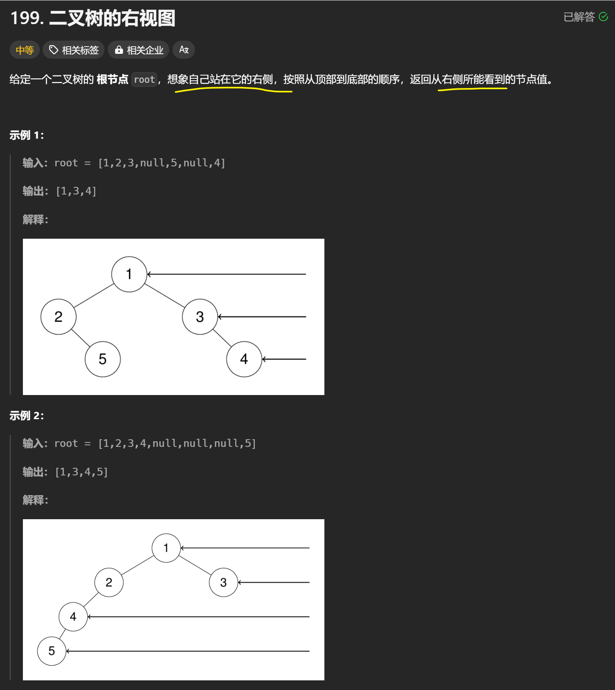


~~~C++
/**
 * Definition for a binary tree node.
 * struct TreeNode {
 *     int val;
 *     TreeNode *left;
 *     TreeNode *right;
 *     TreeNode() : val(0), left(nullptr), right(nullptr) {}
 *     TreeNode(int x) : val(x), left(nullptr), right(nullptr) {}
 *     TreeNode(int x, TreeNode *left, TreeNode *right) : val(x), left(left), right(right) {}
 * };
 */
class Solution {
public:
    vector<int> rightSideView(TreeNode* root) {
        
        vector<int> result;

        // 层åº
        queue<TreeNode*> que;
        if (root != nullptr)    que.push(root);
        while (!que.empty())
        {
            int size = que.size();
            for (int i = 0; i < size; i++)
            {
                TreeNode* node = que.front();
                que.pop();

                // å°†æ¯å±‚的最å一个元素放入result
                if (i == (size - 1))    result.push_back(node->val);

                if (node->left)     que.push(node->left);
                if (node->right)    que.push(node->right);

            }
        }

        return result;
    }
};
~~~


ACM

~~~C++
#include <vector>
#include <queue>
#include <iostream>

using namespace std;


struct TreeNode
{
    int val;
    TreeNode* left;
    TreeNode* right;

    TreeNode(int x) : val(x), left(nullptr), right(nullptr) {}
};


vector<int> rightSideView(TreeNode* root)
{
    vector<int> result;

    queue<TreeNode*> que;
    if (root != nullptr)    que.push(root);
    while (!que.empty())
    {
        int size = que.size();
        for (int i = 0; i < size; i++)
        {
            TreeNode* node = que.front();
            que.pop();

            // å°†æ¯å±‚最å一个元素放进result
            if (i == (size - 1))    result.push_back(node->val);

            if (node->left)     que.push(node->left);
            if (node->right)    que.push(node->right);
        }
    }

    return result;
}


int main()
{
    /* æ„建如下二å‰æ ‘：  
                1
              /   \
             2     3
            /        
           4      
          /
         5   
    */

    TreeNode* root = new TreeNode(1);
    root->left = new TreeNode(2);
    root->right = new TreeNode(3);

    root->left->left = new TreeNode(4);
    root->left->left->left = new TreeNode(5);

    vector<int> result = rightSideView(root); // 1 3 4 5
    for (int val : result)
    {
        cout << val << " ";
    }

    cout << endl;


    return 0;
}
~~~


## 114 [二å‰æ ‘展开为链表](https://leetcode.cn/problems/flatten-binary-tree-to-linked-list/description/?envType=study-plan-v2&envId=top-100-liked)


### 1ã€å¤´æ’法

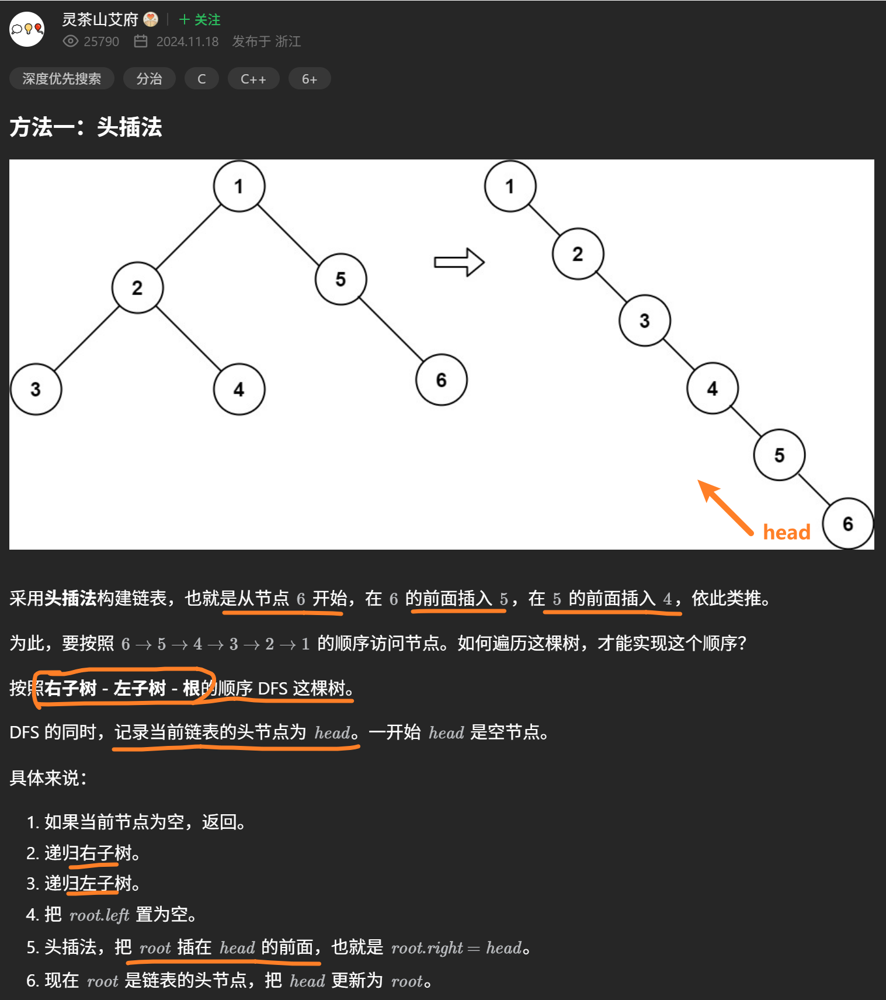


~~~C++
/**
 * Definition for a binary tree node.
 * struct TreeNode {
 *     int val;
 *     TreeNode *left;
 *     TreeNode *right;
 *     TreeNode() : val(0), left(nullptr), right(nullptr) {}
 *     TreeNode(int x) : val(x), left(nullptr), right(nullptr) {}
 *     TreeNode(int x, TreeNode *left, TreeNode *right) : val(x), left(left), right(right) {}
 * };
 */
class Solution {
public:

    TreeNode* head;

    void flatten(TreeNode* root) {

        if (root == nullptr)    return;
        
        // éå†é¡ºåºæ˜¯ å³ - å·¦ - 中
        flatten(root->right); 
        flatten(root->left);

        // 中：处ç†èŠ‚点，左置空，å³æ¥ä¸Šä¸€ä¸ªhead
        root->left = nullptr;
        root->right = head; // 头æ’法，相当äºé“¾è¡¨çš„ root->next = head

        head = root; // æ›´æ–°head，ç°åœ¨é“¾è¡¨å¤´èŠ‚点是 root

        
    }
};
~~~


### 2ã€åˆ†æ²»


~~~C++
class Solution {
public:

    TreeNode* dfs(TreeNode* root)
    {
        if (root == nullptr)    return nullptr;

        TreeNode* left_tail = dfs(root->left);   // 左树链表尾节点
        TreeNode* right_tail = dfs(root->right); // å³æ ‘链表尾节点

        if (left_tail)
        {
            left_tail->right = root->right; // å·¦å­æ ‘链表 -> å³å­æ ‘链表
            root->right = root->left; // 当å‰èŠ‚点 -> å·¦å³åˆå¹¶å的链表

            root->left = nullptr; // root->left 置空
        }

        // è¿”å›çš„是尾节点
        if (right_tail)     return right_tail;
        else if (left_tail) return left_tail;
        else                return root;
    }

    void flatten(TreeNode* root) {
        dfs(root);
    }
};
~~~


### ACM

~~~C++
#include <iostream>

using namespace std;

// 114 二å‰æ ‘展开为链表

struct TreeNode
{
    int val;
    TreeNode* left;
    TreeNode* right;

    TreeNode(int x) : val(x), left(nullptr), right(nullptr) {}
};


void flatten(TreeNode* root, TreeNode*& head) {

    if (root == nullptr)    return;
    
    // éå†é¡ºåºæ˜¯ å³ - å·¦ - 中
    flatten(root->right, head); 
    flatten(root->left, head);

    // 中：处ç†èŠ‚点，左置空，å³æ¥ä¸Šä¸€ä¸ªhead
    root->left = nullptr;
    root->right = head; // 头æ’法，相当äºé“¾è¡¨çš„ root->next = head

    head = root; // æ›´æ–°head，ç°åœ¨é“¾è¡¨å¤´èŠ‚点是 root
}

int main()
{
    /* æ„建如下二å‰æ ‘：  
                1
              /   \
             2     5
            / \     \   
           3   4     6
   
    */

    TreeNode* root = new TreeNode(1);
    root->left = new TreeNode(2);
    root->right = new TreeNode(5);

    root->left->left = new TreeNode(3);
    root->left->right = new TreeNode(4);

    root->right->right = new TreeNode(6);


    TreeNode* head = nullptr;
    flatten(root, head); // 1 2 3 4 5 6
    while (root)
    {
        cout << root->val << " ";
        root = root->right;
    }
    cout << endl;


    return 0;
}

~~~


## [105 ä»å‰åºä¸ä¸­åºéå†åºåˆ—æ„造二å‰æ ‘](https://leetcode.cn/problems/construct-binary-tree-from-preorder-and-inorder-traversal/description/?envType=study-plan-v2&envId=top-100-liked)

å‚考[106 ä»ä¸­åºä¸ååºéå†æ„造二å‰æ ‘](https://leetcode.cn/problems/construct-binary-tree-from-inorder-and-postorder-traversal/description/)


å’Œ106 ä»ä¸­åºä¸ååºéå†æ„造二å‰æ ‘ 一个æ„æ€

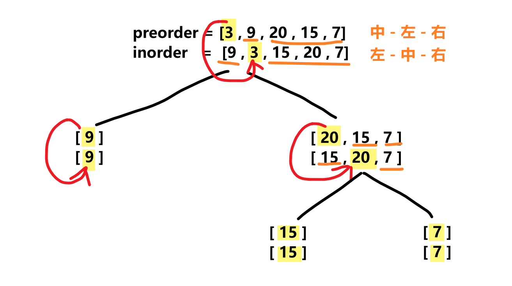

~~~C++
/**
 * Definition for a binary tree node.
 * struct TreeNode {
 *     int val;
 *     TreeNode *left;
 *     TreeNode *right;
 *     TreeNode() : val(0), left(nullptr), right(nullptr) {}
 *     TreeNode(int x) : val(x), left(nullptr), right(nullptr) {}
 *     TreeNode(int x, TreeNode *left, TreeNode *right) : val(x), left(left), right(right) {}
 * };
 */
class Solution {
private:
    TreeNode* traversal(vector<int>& inorder, int inorderBegin, int inorderEnd, 
                        vector<int>& preorder, int preorderBegin, int preorderEnd) {
        
        if (preorderBegin == preorderEnd)   return nullptr;

        // 根节点
        int rootValue = preorder[preorderBegin]; // 注æ„用preorderBegin，ä¸è¦ç”¨0
        TreeNode* root = new TreeNode(rootValue);

        if (preorderEnd - preorderBegin == 1)   return root; // å¶å­èŠ‚点

        // 找中åºçš„切割点
        int delimiterIndex = inorderBegin;
        for (delimiterIndex = inorderBegin; delimiterIndex < inorderEnd; delimiterIndex++)
        {
            if (inorder[delimiterIndex] == rootValue)   break;
        }

        // 中åºåˆ‡å‰² 左闭å³å¼€
        // å·¦ä¸­åº [inorderBegin, delimiterIndex)
        int leftInorderBegin = inorderBegin, leftInorderEnd = delimiterIndex;
        // å³ä¸­åº [delimiterIndex, inorderEnd]
        int rightInorderBegin = delimiterIndex + 1, rightInorderEnd = inorderEnd;

        // å‰åºåˆ‡å‰² 左闭å³å¼€
        // å·¦å‰åº
        int leftPreorderBegin = preorderBegin + 1; // 分离出root
        int leftPreorderEnd = preorderBegin + 1 + (delimiterIndex - inorderBegin);
        // å³å‰åº
        int rightPreorderBegin = preorderBegin + 1 + (delimiterIndex - inorderBegin);
        int rightPreorderEnd = preorderEnd;
        
        
        // 递归 更新区间索引
        root->left = traversal(inorder, leftInorderBegin, leftInorderEnd,
                               preorder, leftPreorderBegin, leftPreorderEnd);
        root->right = traversal(inorder, rightInorderBegin, rightInorderEnd,
                                preorder, rightPreorderBegin, rightPreorderEnd);

        return root;
    }


public:
    TreeNode* buildTree(vector<int>& preorder, vector<int>& inorder) {
        if (inorder.size() == 0 || preorder.size() == 0)    return nullptr;
        // 左闭å³å¼€
        return traversal(inorder, 0, inorder.size(),  
                         preorder, 0, preorder.size());
    }
};
~~~


ACM

~~~C++
#include <iostream>
#include <vector>
#include <queue>

using namespace std;

// 105 ä»å‰åºä¸ä¸­åºéå†åºåˆ—æ„造二å‰æ ‘

struct TreeNode
{
    int val;
    TreeNode* left;
    TreeNode* right;

    TreeNode(int x) : val(x), left(nullptr), right(nullptr) {}
};


TreeNode* traversal(vector<int>& inorder, int inorderBegin, int inorderEnd, 
                    vector<int>& preorder, int preorderBegin, int preorderEnd) 
{
    
    if (preorderBegin == preorderEnd)   return nullptr;

    // 根节点
    int rootValue = preorder[preorderBegin]; // 注æ„用preorderBegin，ä¸è¦ç”¨0
    TreeNode* root = new TreeNode(rootValue);

    if (preorderEnd - preorderBegin == 1)   return root; // å¶å­èŠ‚点

    // 找中åºçš„切割点
    int delimiterIndex = inorderBegin;
    for (delimiterIndex = inorderBegin; delimiterIndex < inorderEnd; delimiterIndex++)
    {
        if (inorder[delimiterIndex] == rootValue)   break;
    }

    // 中åºåˆ‡å‰² 左闭å³å¼€
    // å·¦ä¸­åº [inorderBegin, delimiterIndex)
    int leftInorderBegin = inorderBegin, leftInorderEnd = delimiterIndex;
    // å³ä¸­åº [delimiterIndex, inorderEnd]
    int rightInorderBegin = delimiterIndex + 1, rightInorderEnd = inorderEnd;

    // å‰åºåˆ‡å‰² 左闭å³å¼€
    // å·¦å‰åº
    int leftPreorderBegin = preorderBegin + 1; // 分离出root
    int leftPreorderEnd = preorderBegin + 1 + (delimiterIndex - inorderBegin);
    // å³å‰åº
    int rightPreorderBegin = preorderBegin + 1 + (delimiterIndex - inorderBegin);
    int rightPreorderEnd = preorderEnd;
    
    
    // 递归 更新区间索引
    root->left = traversal(inorder, leftInorderBegin, leftInorderEnd,
                            preorder, leftPreorderBegin, leftPreorderEnd);
    root->right = traversal(inorder, rightInorderBegin, rightInorderEnd,
                            preorder, rightPreorderBegin, rightPreorderEnd);

    return root;
}


TreeNode* buildTree(vector<int>& preorder, vector<int>& inorder) 
{
    if (inorder.size() == 0 || preorder.size() == 0)    return nullptr;
    // 左闭å³å¼€
    return traversal(inorder, 0, inorder.size(),  
                        preorder, 0, preorder.size());
}


// 层åºéå†ï¼ˆç”¨äºè¾“出）
vector<int> levelOrder(TreeNode* root) 
{
    vector<int> result;
    if (!root) return result;

    queue<TreeNode*> q;
    q.push(root);

    while (!q.empty()) {
        TreeNode* node = q.front(); 
        q.pop();
        result.push_back(node->val);

        if (node->left)  q.push(node->left);
        if (node->right) q.push(node->right);
    }

    return result;
}


int main()
{
    vector<int> preorder = {3, 9, 20, 15, 7};
    vector<int> inorder = {9, 3, 15, 20, 7};

    TreeNode* root = buildTree(preorder, inorder);

    // 输出打å°
    vector<int> output = levelOrder(root); // 3 9 20 15 7
    for (auto val : output)
    {
        cout << val << " ";
    }


    return 0;
}

~~~


## [437 路径总和III](https://leetcode.cn/problems/path-sum-iii/description/?envType=study-plan-v2&envId=top-100-liked)


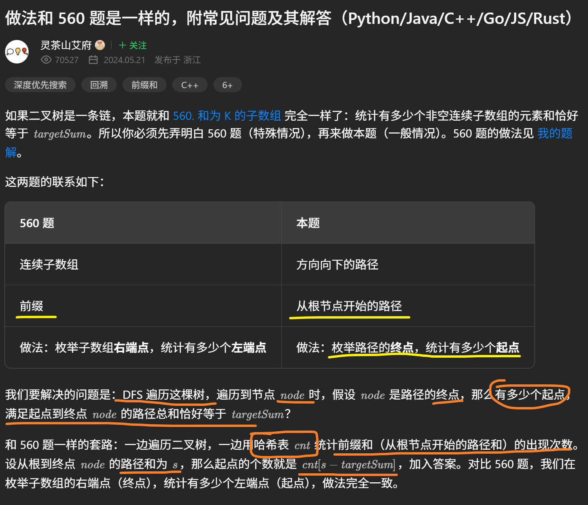

~~~C++
/**
 * Definition for a binary tree node.
 * struct TreeNode {
 *     int val;
 *     TreeNode *left;
 *     TreeNode *right;
 *     TreeNode() : val(0), left(nullptr), right(nullptr) {}
 *     TreeNode(int x) : val(x), left(nullptr), right(nullptr) {}
 *     TreeNode(int x, TreeNode *left, TreeNode *right) : val(x), left(left), right(right) {}
 * };
 */
class Solution {
public:
    int pathSum(TreeNode* root, int targetSum) {

        int ans = 0;
        unordered_map<long long, int> cntmap{{0, 1}}; // <路径和，出ç°æ¬¡æ•°>

        auto dfs = [&](this auto&& dfs, TreeNode* node, long long s)
        {
            if (node == nullptr)    return;

            s += node->val; // 当å‰èŠ‚点的路径和（å‰ç¼€å’Œï¼‰

            // 把node当åšè·¯å¾„终点，统计有多少个起点 (560里的si = sj - k出ç°çš„次数)
            ans += cntmap[s - targetSum]; 

            cntmap[s]++; // 路径和s出ç°æ¬¡æ•°++
            dfs(node->left, s);
            dfs(node->right, s);

            // å›æº¯ æ¢å¤ç°åœºï¼ˆå»æ‰å½“å‰èŠ‚点自身的信æ¯ï¼‰
            cntmap[s]--; 
            // 当å‰èŠ‚点åªèƒ½å½±å“它下层的节点，这些情况在上é¢çš„递归中已ç»å¤„ç†å®Œæ¯•
            // 在退出本层递归时，当å‰èŠ‚点å‰ç¼€å’Œä¸å…¶ä»–分支无关，删除记录消除对其他分支的影å“

            return;
        };

        dfs(root, 0);// 传入当å‰node = root, å‰ç¼€å’Œ 0
        return ans;
    }
};
~~~

å…³äºæœ€åçš„å›æº¯ï¼š `cntmap[s]--; `

当å‰å±‚递归是以当å‰node作为root的，退出本层递归的时候，当å‰èŠ‚点åŠå…¶ä»¥ä¸‹çš„节点都在本层递归完æˆäº†ã€‚

æ¥ä¸‹æ¥è¦è½¬å‘的是node上一层的其他分支，自然è¦å»é™¤nodeçš„ä¿¡æ¯ã€‚

为什么è¦åœ¨é€’归完å³å­æ ‘åæ‰èƒ½æ¢å¤ç°åœºï¼Ÿèƒ½å¦åœ¨é€’归完左å­æ ‘åå°±æ¢å¤ç°åœºå‘¢ï¼Ÿ

ä¸å¯ä»¥ï¼Œå› ä¸ºé€’å½’å·¦å³å­æ ‘都是node作为root的部分，递归nodeå³å­æ ‘也需è¦nodeçš„ä¿¡æ¯ã€‚


ACM

~~~C++
#include <iostream>
#include <unordered_map>
using namespace std;

// 437 路径总和III

struct TreeNode
{
    int val;
    TreeNode* left;
    TreeNode* right;

    TreeNode(int x) : val(x), left(nullptr), right(nullptr) {}
};


// 路径和
int pathSum(TreeNode* root, int targetSum) {

    int ans = 0;
    unordered_map<long long, int> cntmap{{0, 1}}; // <路径和，出ç°æ¬¡æ•°>

    // 递归
    auto dfs = [&](this auto&& dfs, TreeNode* node, long long s)
    {
        if (node == nullptr)    return;

        s += node->val; // 当å‰èŠ‚点的路径和（å‰ç¼€å’Œï¼‰

        // 把node当åšè·¯å¾„终点，统计有多少个起点 (560里的si = sj - k出ç°çš„次数)
        ans += cntmap[s - targetSum]; 

        cntmap[s]++; // 路径和s出ç°æ¬¡æ•°++

        // 递归左å³
        dfs(node->left, s);
        dfs(node->right, s);


        // å›æº¯ æ¢å¤ç°åœºï¼ˆå»æ‰å½“å‰èŠ‚点自身的信æ¯ï¼‰
        cntmap[s]--; 
        // 当å‰èŠ‚点åªèƒ½å½±å“它下层的节点，这些情况在上é¢çš„递归中已ç»å¤„ç†å®Œæ¯•
        // 在退出本层递归时，当å‰èŠ‚点å‰ç¼€å’Œä¸å…¶ä»–分支无关，删除记录消除对其他分支的影å“

        return;
    };


    dfs(root, 0);// 传入当å‰node = root, å‰ç¼€å’Œ 0
    return ans;
}


int main()
{
    /* æ„建如下二å‰æ ‘：  
                 10
               /    \
              5      -3
            /   \      \   
           3     2      11
          / \     \
         3  -2     1   
    */

    TreeNode* root = new TreeNode(10);
    root->left = new TreeNode(5);
    root->right = new TreeNode(-3);

    root->left->left = new TreeNode(3);
    root->left->right = new TreeNode(2);
    root->right->right = new TreeNode(11);
 
    root->left->left->left = new TreeNode(3);
    root->left->left->right = new TreeNode(-2);
    root->left->right->right = new TreeNode(1);

    int targetSum = 8;
    int ans = pathSum(root, targetSum);
    cout << ans << endl;

    return 0;
}

~~~


## 236 [二å‰æ ‘的最近公共祖先](https://leetcode.cn/problems/lowest-common-ancestor-of-a-binary-tree/description/?envType=study-plan-v2&envId=top-100-liked)

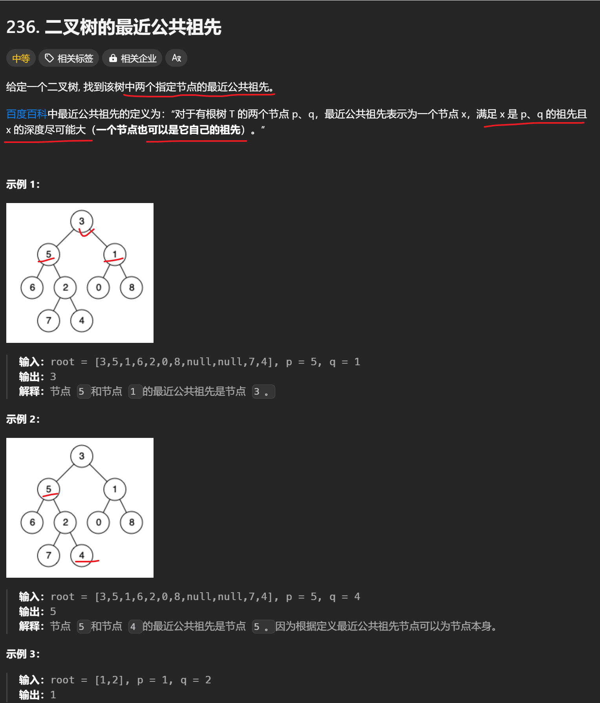


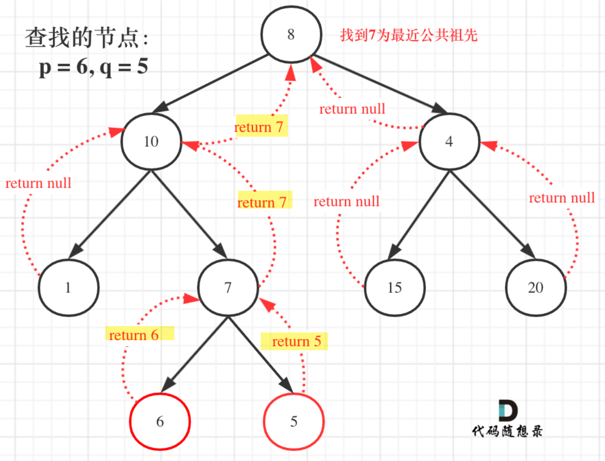

两ç§æƒ…况：

1ã€æ‰¾åˆ°ä¸€ä¸ªèŠ‚点，**其左树出ç°p，å³æ ‘出ç°q**，或者å过æ¥ï¼Œé‚£ä¹ˆè¿™ä¸ªèŠ‚点就是q p 最近公共祖先，返å›è¿™ä¸ªèŠ‚点

- 递归éå†ï¼Œå¦‚æœå­æ ‘é‡åˆ°p，就返å›p，é‡åˆ°q，就返å›q
- 正好左å³æ ‘å„自é‡åˆ°q p，就返å›å½“时的root，å³æœ€è¿‘公共祖先；


2ã€éå†çš„时候，**找到节点就是p 或 q 本身，é‡åˆ°å°±ç›´æ¥è¿”å›è¿™ä¸ªèŠ‚点**（其å®ä¹ŸåŒ…å«åœ¨æƒ…况1里é¢ï¼‰


~~~C++
/**
 * Definition for a binary tree node.
 * struct TreeNode {
 *     int val;
 *     TreeNode *left;
 *     TreeNode *right;
 *     TreeNode(int x) : val(x), left(NULL), right(NULL) {}
 * };
 */
class Solution {
public:
    TreeNode* lowestCommonAncestor(TreeNode* root, TreeNode* p, TreeNode* q) {

        if (root == p || root == q || root == nullptr)  return root;

        TreeNode* left = lowestCommonAncestor(root->left, p, q);   // 往左找
        TreeNode* right = lowestCommonAncestor(root->right, p, q); // å¾€å³æ‰¾

        // è¿”å›
        if (left && right)  return root;          // å·¦å³æ ‘都找到，返å›å½“å‰çš„root
        else if (!left && right)    return right; // åªæœ‰å³æ ‘找到
        else if (left && !right)    return left;  // åªæœ‰å·¦æ ‘找到
        else                        return nullptr; // 都没找到
        // return left ? left : right;
        
    }
};
~~~


> **如æœé€’归函数有返å›å€¼ï¼Œå¦‚何区分è¦æœç´¢ä¸€æ¡è¾¹ï¼Œè¿˜æ˜¯æ•´æ£µæ ‘？？**
>
> 
>
> 


ACM

~~~C++
#include <iostream>
#include <unordered_map>
using namespace std;

// 236 二å‰æ ‘的最近公共祖先

struct TreeNode
{
    int val;
    TreeNode* left;
    TreeNode* right;

    TreeNode(int x) : val(x), left(nullptr), right(nullptr) {}
};


TreeNode* lowestCommonAncestor(TreeNode* root, TreeNode* p, TreeNode* q) 
{
    if (root == p || root == q || root == nullptr)  return root;

    TreeNode* left = lowestCommonAncestor(root->left, p, q);   // 往左找
    TreeNode* right = lowestCommonAncestor(root->right, p, q); // å¾€å³æ‰¾

    // è¿”å›
    if (left && right)  return root;          // å·¦å³æ ‘都找到，返å›å½“å‰çš„root
    else if (!left && right)    return right; // åªæœ‰å³æ ‘找到
    else if (left && !right)    return left;  // åªæœ‰å·¦æ ‘找到
    else                        return nullptr; // 都没找到
    // return left ? left : right;
}


int main()
{
    /* æ„建如下二å‰æ ‘：  
                  3
                /    \
              5        1
            /  \      /  \   
           6    2    0    8
               / \    
              7   4        
    */

    TreeNode* root = new TreeNode(3);
    root->left = new TreeNode(5);
    root->right = new TreeNode(1);

    root->left->left = new TreeNode(6);
    root->left->right = new TreeNode(2);
    root->right->left = new TreeNode(0);
    root->right->right = new TreeNode(8);
 
    root->left->right->left = new TreeNode(7);
    root->left->right->right = new TreeNode(4);


    TreeNode* p = root->left;  // 5
    TreeNode* q = root->right; // 1

    TreeNode* node = lowestCommonAncestor(root, p, q);
    cout << node->val << endl;

    return 0;
}

~~~


# å›æº¯ ✅


## 78 [å­é›†](https://leetcode.cn/problems/subsets/description/?envType=study-plan-v2&envId=top-100-liked)

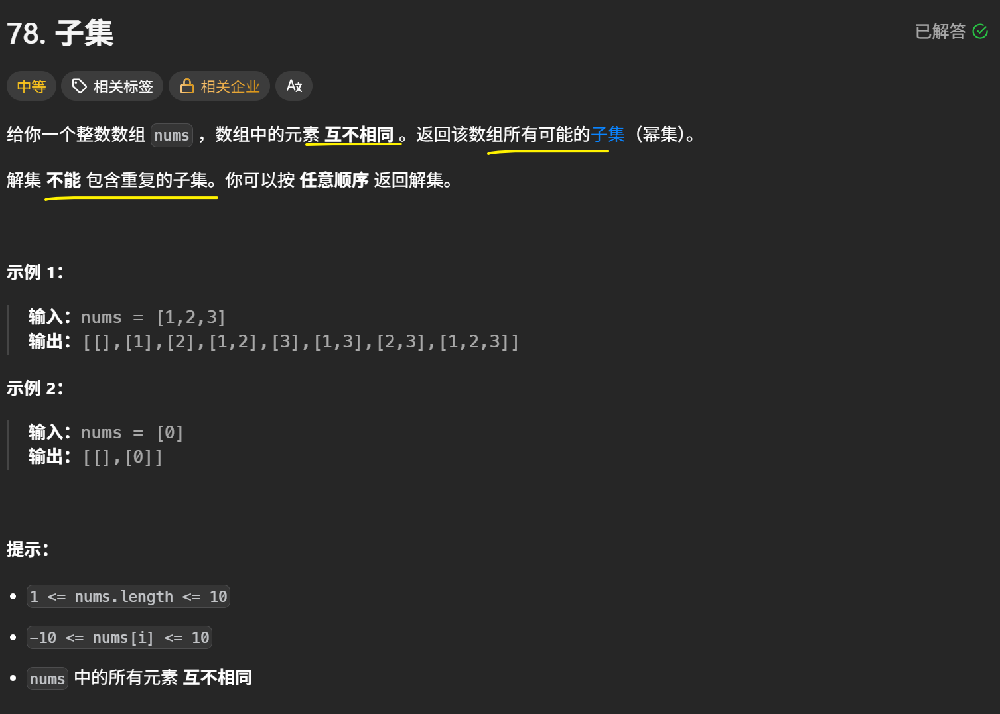

数组的 **å­é›†** 是ä»æ•°ç»„中选择一些元素（å¯èƒ½ä¸ºç©ºï¼‰ã€‚

如æœæŠŠ å­é›†é—®é¢˜ã€ç»„åˆé—®é¢˜ã€åˆ†å‰²é—®é¢˜éƒ½æŠ½è±¡ä¸ºä¸€æ£µæ ‘çš„è¯ï¼Œé‚£ä¹ˆ**组åˆé—®é¢˜å’Œåˆ†å‰²é—®é¢˜éƒ½æ˜¯æ”¶é›†æ ‘çš„å¶å­èŠ‚点**，而**å­é›†é—®é¢˜æ˜¯æ‰¾æ ‘的所有节点**

路径上所有节点都是å­é›†ã€‚


~~~C++
class Solution {
public:
    vector<int> path;
    vector<vector<int>> result;

    void backtracking(vector<int>& nums, int startIndex)
    {
        if (startIndex > nums.size())  return;

        for (int i = startIndex; i < nums.size(); i++)
        {
            path.push_back(nums[i]);
            result.push_back(path); // 处ç†èŠ‚点的时候直æ¥æ”¾è¿›result

            backtracking(nums, i + 1);

            path.pop_back();
        }
    }


    vector<vector<int>> subsets(vector<int>& nums) {

        result.push_back(path); // æå‰æ”¾ä¸€ä¸ªç©ºpathè¿›å»
        backtracking(nums, 0);
        return result; 
    }
};
~~~


或者在 backtracking 里先收集pathå†ç»“æŸï¼Œä¸ä¼šæ¼æ‰ç»“æœï¼Œä¹Ÿä¸ç”¨æå‰æ”¾ä¸€ä¸ªç©ºpath了（好åƒç¬¬ä¸€ç§å¥½ç†è§£ï¼‰

~~~C++
class Solution {
public:
    vector<int> path;
    vector<vector<int>> result;

    void backtracking(vector<int>& nums, int startIndex)
    {
        result.push_back(path); // 进下一层的时候，先收集path
        if (startIndex > nums.size())   return;

        for (int i = startIndex; i < nums.size(); i++)
        {
            path.push_back(nums[i]);
            backtracking(nums, i + 1);
            path.pop_back();
        }
    }

    vector<vector<int>> subsets(vector<int>& nums) {

        backtracking(nums, 0);
        return result;     
    }
};
~~~


## 39 [组åˆæ€»å’Œ](https://leetcode.cn/problems/combination-sum/description/?envType=study-plan-v2&envId=top-100-liked)


数组中数字都ä¸åŒï¼Œä½†æ˜¯å¯ä»¥é‡å¤é€‰ï¼Œæ¯ä¸€å±‚树往下走，éå†çš„数组都是一样的

è¿”å›æ¡ä»¶å°±æ˜¯å–到的和，达到targetç›´æ¥è¿”å›

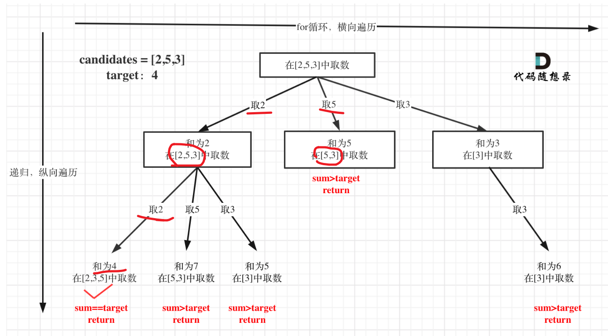


~~~C++
class Solution {
public:
    vector<int> path;
    vector<vector<int>> result;
    void backtracking(vector<int>& candidates, int target, int sum, int startIndex)
    {
        if (sum > target)   return;
        if (sum == target)
        {
            result.push_back(path);
            return;
        }

        for (int i = startIndex; i < candidates.size(); i++)
        {
            sum += candidates[i];
            path.push_back(candidates[i]);

            backtracking(candidates, target, sum, i); // 注æ„å¯ä»¥é‡å¤å–当å‰çš„æ•°

            sum -= candidates[i];
            path.pop_back();
        }
    }

    vector<vector<int>> combinationSum(vector<int>& candidates, int target) {
        // candidates = [2,3,6,7], target = 7
        // [[2,2,3],[7]]

        backtracking(candidates, target, 0, 0);
        return result;  
    }
};
~~~


**剪æ：**

> **在求和问题中，æ’åºä¹‹å加剪æ是常è§çš„套路ï¼**


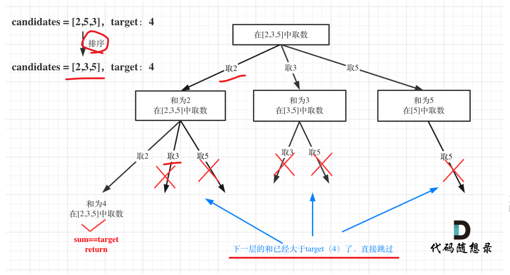

~~~C++
class Solution {
public:
    vector<int> path;
    vector<vector<int>> result;
    void backtracking(vector<int>& candidates, int target, int sum, int startIndex)
    {
        if (sum > target)   return;
        if (sum == target)
        {
            result.push_back(path);
            return;
        }

        for (int i = startIndex; 
             i < candidates.size() && sum + candidates[i] <= target; // 剪æ
             i++)
        {
            sum += candidates[i];
            path.push_back(candidates[i]);

            backtracking(candidates, target, sum, i); // 注æ„å¯ä»¥é‡å¤å–当å‰çš„æ•°

            sum -= candidates[i];
            path.pop_back();
        }
    }

    vector<vector<int>> combinationSum(vector<int>& candidates, int target) {

        sort(candidates.begin(), candidates.end()); // å…ˆæ’åº

        backtracking(candidates, target, 0, 0);
        return result;
        
    }
};
~~~


ACM

~~~C++
#include <vector>
#include <iostream>
using namespace std;

// 39 组åˆæ€»å’Œ


vector<int> path;
vector<vector<int>> result;

void backtracking(vector<int>& candidates, int target, int sum, int startIndex)
{
    if (sum > target)   return;
    if (sum == target)
    {
        result.push_back(path);
        return;
    }

    for (int i = startIndex; i < candidates.size(); i++)
    {
        sum += candidates[i];
        path.push_back(candidates[i]);

        backtracking(candidates, target, sum, i); // 注æ„å¯ä»¥é‡å¤å–当å‰çš„æ•°

        sum -= candidates[i];
        path.pop_back();
    }
}


vector<vector<int>> combinationSum(vector<int>& candidates, int target) {
    // candidates = [2,3,6,7], target = 7
    // [[2,2,3],[7]]

    backtracking(candidates, target, 0, 0);
    return result;  
}


int main()
{
    vector<int> candidates = {2, 3, 6, 7};
    int target = 7;
    vector<vector<int>> result = combinationSum(candidates, target);
    for (int i = 0; i < result.size(); i++)
    {
        for (int val : result[i])
        {
            cout << val << " ";
        }
        cout << endl;
    }


    return 0;
}
~~~


## 17 [电è¯å·ç çš„å­—æ¯ç»„åˆ](https://leetcode.cn/problems/letter-combinations-of-a-phone-number/description/?envType=study-plan-v2&envId=top-100-liked)

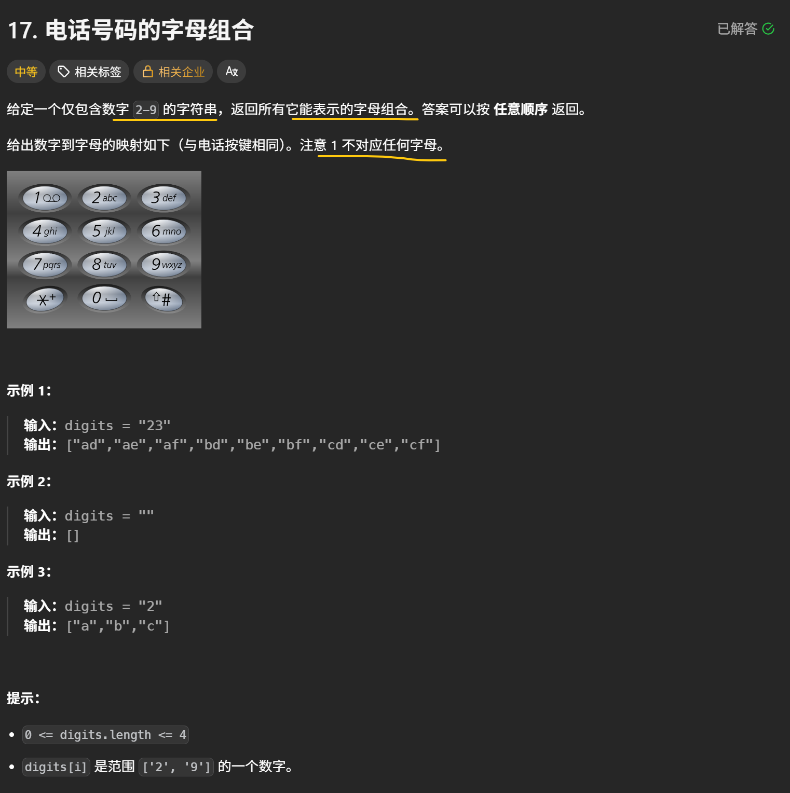

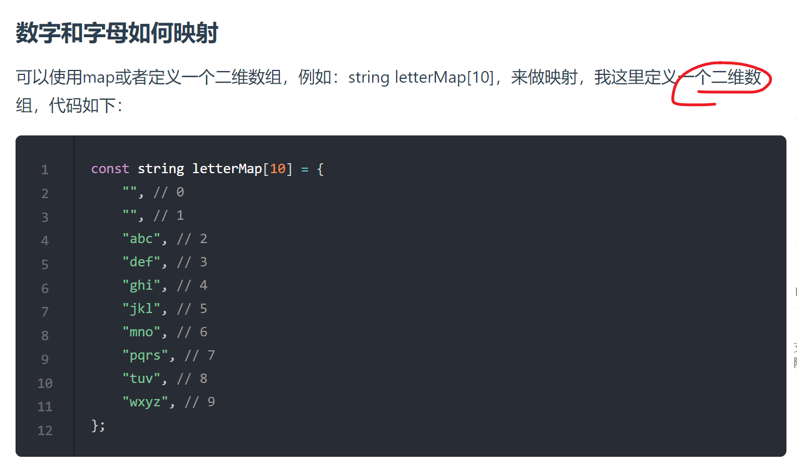

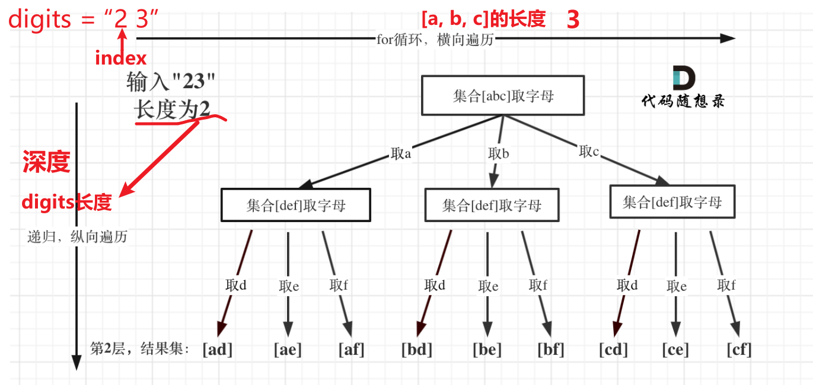


~~~C++
class Solution {
public:

    const string letterMap[10] = {
        "", // 0
        "", // 1
        "abc", // 2
        "def", // 3
        "ghi", // 4
        "jkl", // 5
        "mno", // 6
        "pqrs",// 7
        "tuv", // 8
        "wxyz" // 9
    };


    string path;
    vector<string> result;

    void backtracking(const string& digits, int digitsIndex)
    {
        // digitsIndex 是digits的下标，这里往下走就是å–digits的下一个数，下一个字符组åˆ

        if (digitsIndex == digits.size()) // digitså–到最å一个，终止
        {
            result.push_back(path);
            return;
        }

        int digit = digits[digitsIndex] - '0'; // 把index指å‘的数字（字符å‹ï¼‰è½¬ä¸ºint
        string letters = letterMap[digit]; // å–出对应的字符集

        // 处ç†å•å±‚的字符组åˆ
        for (int i = 0; i < letters.size(); i++)
        {
            path.push_back(letters[i]);
            backtracking(digits, digitsIndex + 1);
            path.pop_back();
        }
    }

    
    vector<string> letterCombinations(string digits) {

        if (digits.size() == 0)  return result; // 这里è¦å†™ï¼Œä¸ç„¶digits = ""输出的ä¸æ˜¯[] 而是""

        backtracking(digits, 0);
        return result;        
    }
};
~~~


ACM

~~~C++
#include <string>
#include <vector>
#include <iostream>
using namespace std;

// 17 电è¯å·ç çš„å­—æ¯ç»„åˆ

const string letterMap[10] = {
    "", // 0
    "", // 1
    "abc", // 2
    "def", // 3
    "ghi", // 4
    "jkl", // 5
    "mno", // 6
    "pqrs",// 7
    "tuv", // 8
    "wxyz" // 9
};


string path;
vector<string> result;


void backtracking(const string& digits, int digitsIndex)
{
    // digitsIndex 是digits的下标，这里往下走就是å–digits的下一个数，下一个字符组åˆ
    if (digitsIndex == digits.size()) // digitså–到最å一个，终止
    {
        result.push_back(path);
        return;
    }
    int digit = digits[digitsIndex] - '0'; // 把index指å‘的数字（字符å‹ï¼‰è½¬ä¸ºint
    string letters = letterMap[digit]; // å–出对应的字符集
    // 处ç†å•å±‚的字符组åˆ
    for (int i = 0; i < letters.size(); i++)
    {
        path.push_back(letters[i]);
        backtracking(digits, digitsIndex + 1);
        path.pop_back();
    }
}

vector<string> letterCombinations(string digits) 
{
    if (digits.size() == 0)  return result;
    backtracking(digits, 0);
    return result;        
}


int main()
{
    string digits = "23";
    vector<string> result = letterCombinations(digits);
    for (string s : result)
    {
        cout << s << ",";
    }
    cout << endl;


    return 0;
}
~~~


## 46 [å…¨æ’列](https://leetcode.cn/problems/permutations/description/?envType=study-plan-v2&envId=top-100-liked)


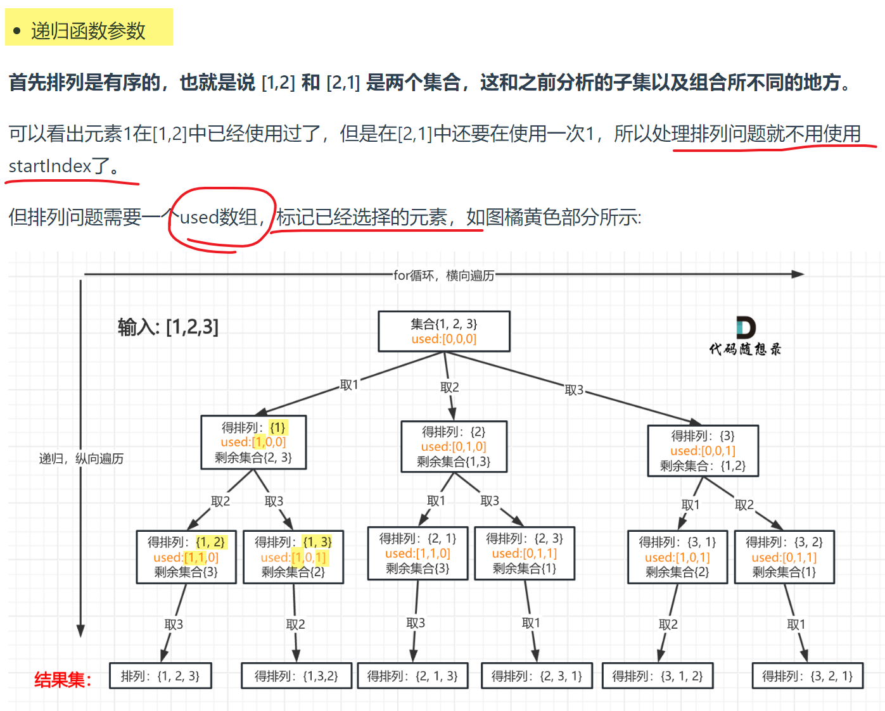


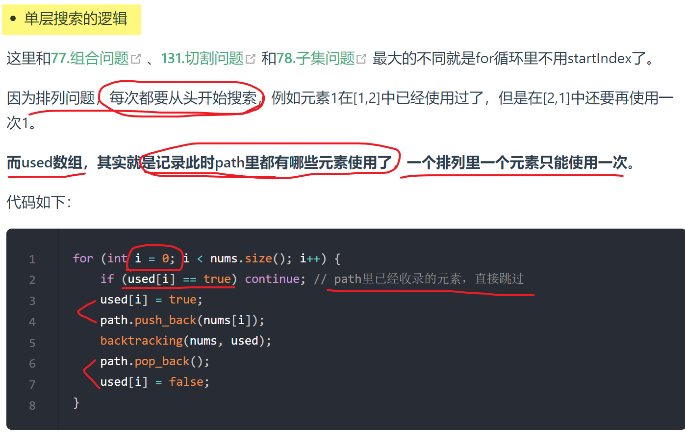

~~~C++
class Solution {
public:
    vector<int> path;
    vector<vector<int>> result;

    // used[i]: 往下走，used 记录这æ¡ä¹‹è·¯ä¸Šnums[i]å·²ç»å–过

    void backtracking(vector<int>& nums, vector<bool>& used) 
    {
        if (path.size() == nums.size()) // å…¨æ’列，所有数字都è¦å–到
        {
            result.push_back(path);
            return;
        }

        for (int i = 0; i < nums.size(); i++) // æ¯æ¬¡éƒ½ä»0开始å–
        {
            // 先判断当å‰nums[i]是å¦å·²ç»å–过了，å–过了就跳过
            if (used[i] == true)    continue;

            path.push_back(nums[i]);
            used[i] = true; 

            backtracking(nums, used);

            path.pop_back();
            used[i] = false; // used也è¦å›æº¯
        }
    }


    vector<vector<int>> permute(vector<int>& nums) {

        vector<bool> used(nums.size(), false);
        backtracking(nums, used);
        return result;        
    }
};
~~~


ACM

~~~C++
#include <vector>
#include <iostream>
using namespace std;


vector<int> path;
vector<vector<int>> result;

void backtracking(vector<int>& nums, vector<bool>& used)
{
    if (path.size() == nums.size())
    {
        result.push_back(path);
        return;
    }

    for (int i = 0; i < nums.size(); i++)
    {
        if (used[i])    continue;

        path.push_back(nums[i]);
        used[i] = true;

        backtracking(nums, used);

        path.pop_back();
        used[i] = false;
    }
}


int main()
{
    vector<int> nums = {1, 2, 3};
    vector<bool> used(nums.size(), false);
    backtracking(nums, used);

    for (int i = 0; i < result.size(); i++)
    {
        for (int val : result[i])
        {
            cout << val << " ";
        }
        cout << endl;
    }

    return 0;
}
~~~


## 131 [分割å›æ–‡ä¸²](https://leetcode.cn/problems/palindrome-partitioning/description/?envType=study-plan-v2&envId=top-100-liked)

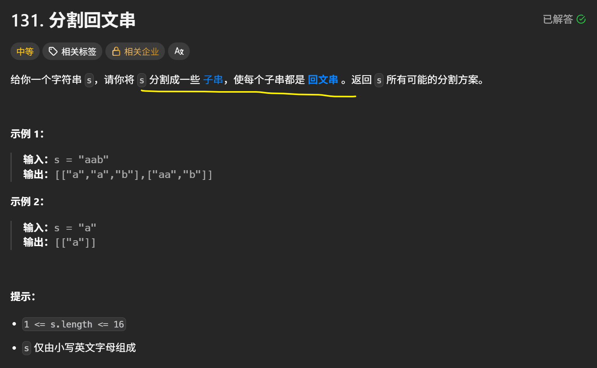


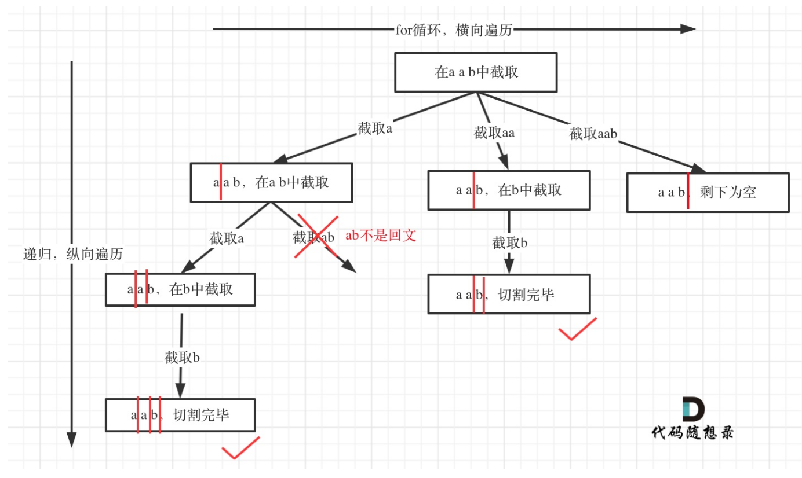

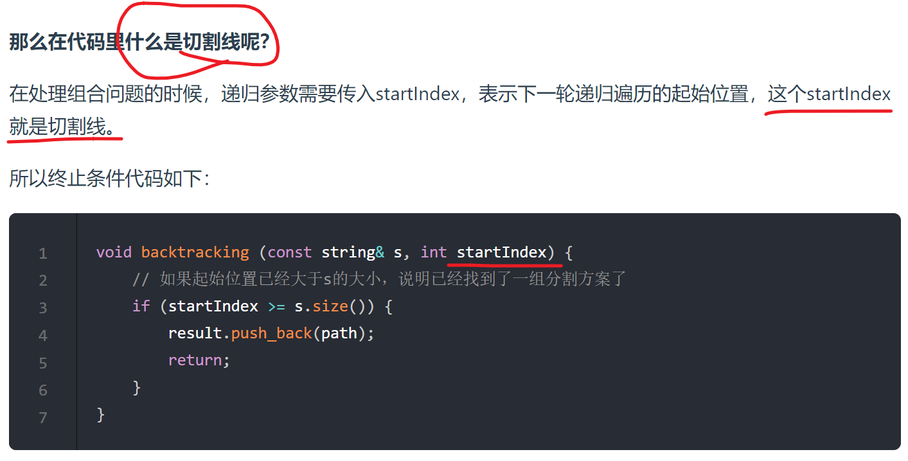

~~~C++
class Solution {
public:

    // 判断å›æ–‡
    bool isPalindrome(const string& s, int start, int end)
    {
        for (int i = start, j = end; i < j; i++, j--)
        {
            if (s[i] != s[j])   return false;
        }

        return true;
    }


    vector<string> path;
    vector<vector<string>> result;

    void backtracking(const string& s, int startIndex) 
    {
        // startIndex 下一轮递归éå†çš„起始ä½ç½®
        // 终止：如æœèµ·å§‹ä½ç½®å·²ç»è¶…出s，说æ˜å·²ç»æ‰¾åˆ°ä¸€ç»„分割方案
        if (startIndex >= s.size())
        {
            result.push_back(path);
            return;
        }

        for (int i = startIndex; i < s.size(); i++)
        {
            if (isPalindrome(s, startIndex, i)) // 判断[startIndex, i]部分是å¦å›æ–‡
            {
                // 是å›æ–‡ï¼Œæˆªå–[startIndex, i]
                string str = s.substr(startIndex, i - startIndex + 1);
                path.push_back(str);
            }
            else    continue; // ä¸æ˜¯å›æ–‡ï¼Œç›´æ¥è·³è¿‡è¿™ä¸€åˆ†æ”¯

            backtracking(s, i + 1);
            path.pop_back();
        }

    }


    vector<vector<string>> partition(string s) {

        backtracking(s, 0);
        return result;        
    }
};
~~~


ACM

~~~C++
#include <iostream>
#include <vector>
#include <string>
using namespace std;

// 131 分割å›æ–‡ä¸²


// 判断å›æ–‡
bool isPalindrome(const string& s, int start, int end)
{
    for (int i = start, j = end; i < j; i++, j--)
    {
        if (s[i] != s[j])   return false;
    }
    return true;
}


vector<string> path;
vector<vector<string>> result;

// 递归
void backtracking(const string& s, int startIndex) 
{
    // startIndex 下一轮递归éå†çš„起始ä½ç½®
    // 终止：如æœèµ·å§‹ä½ç½®å·²ç»è¶…出s，说æ˜å·²ç»æ‰¾åˆ°ä¸€ç»„分割方案
    if (startIndex >= s.size())
    {
        result.push_back(path);
        return;
    }
    for (int i = startIndex; i < s.size(); i++)
    {
        if (isPalindrome(s, startIndex, i)) // 判断[startIndex, i]部分是å¦å›æ–‡
        {
            // 是å›æ–‡ï¼Œæˆªå–[startIndex, i]
            string str = s.substr(startIndex, i - startIndex + 1);
            path.push_back(str);
        }
        else    continue; // ä¸æ˜¯å›æ–‡ï¼Œç›´æ¥è·³è¿‡è¿™ä¸€åˆ†æ”¯
        backtracking(s, i + 1);
        path.pop_back();
    }
}


vector<vector<string>> partition(string s) {
    backtracking(s, 0);
    return result;        
}


int main()
{
    string s = "aab";
    vector<vector<string>> ans = partition(s);
    for (int i = 0; i < ans.size(); i++)
    {
        for (string s : ans[i])     cout << s << " , ";
        cout << endl;
    }

    return 0;
}
~~~


## 51 [N皇å](https://leetcode.cn/problems/n-queens/description/?envType=study-plan-v2&envId=top-100-liked)

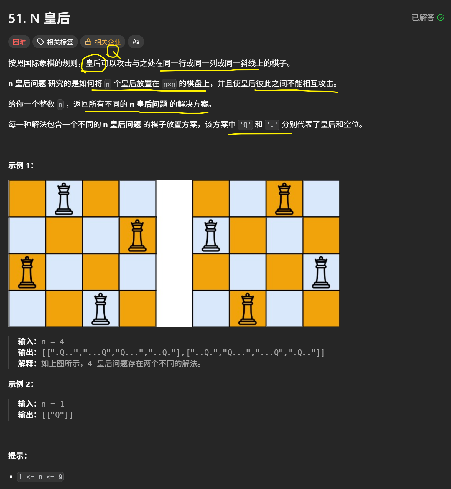

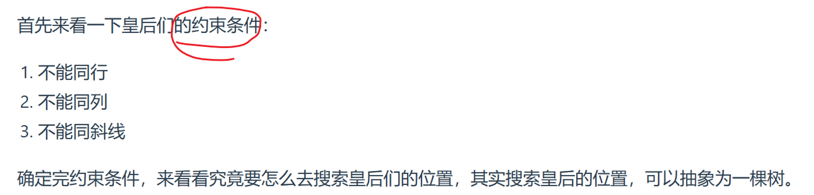

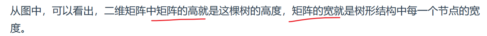

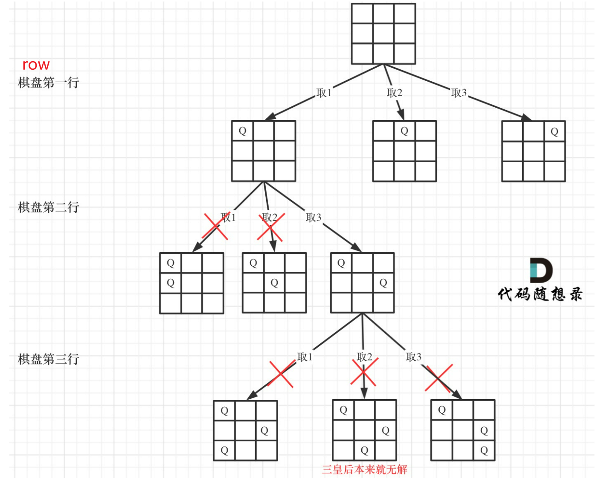


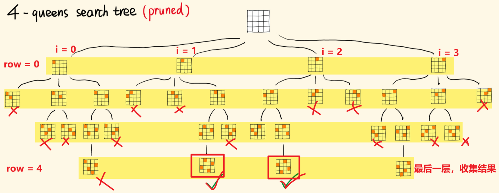

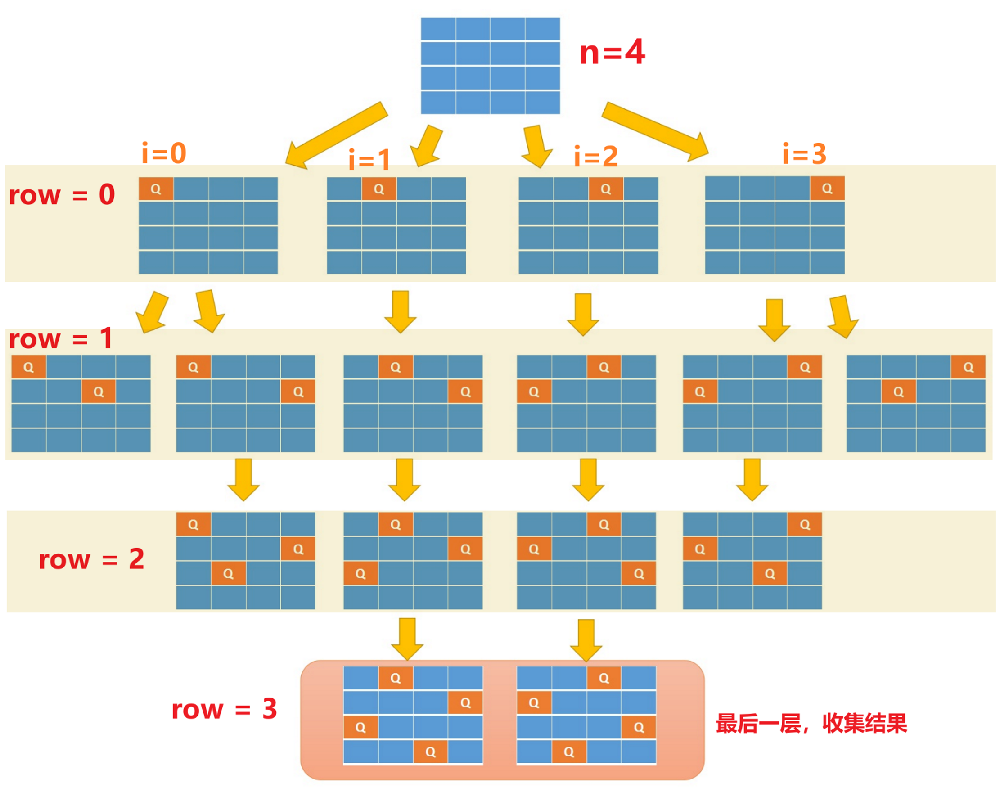


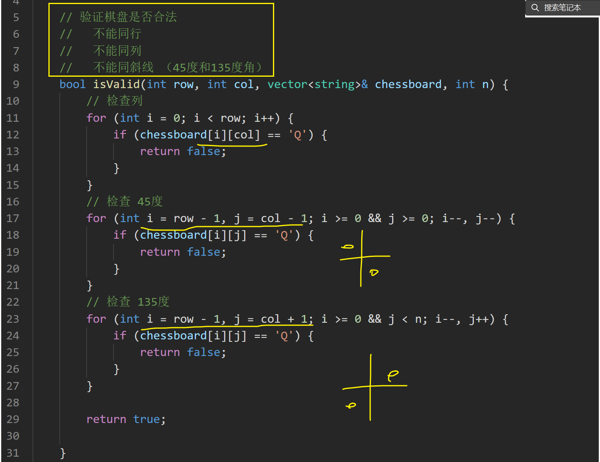


~~~C++
class Solution {
public:

    // 验è¯æ£‹ç›˜æ˜¯å¦åˆæ³•
    // ä¸èƒ½åŒè¡Œ åŒåˆ— åŒæ–œçº¿ï¼ˆ45度和135度角）
    bool isValid(int row, int col, vector<string>& chessboard, int n)
    {
        // chessboard - n * n 棋盘

        // 检查列
        for (int i = 0; i < row; i++)
        {
            if (chessboard[i][col] == 'Q')  return false;
        }
        // 检查 45度
        for (int i = row - 1, j = col - 1; i >= 0 && j >= 0; i--, j--)
        {
            if (chessboard[i][j] == 'Q')    return false;
        }
        // 检查 135度
        for (int i = row - 1, j = col + 1; i >= 0 && j < n; i--, j++)
        {
            if (chessboard[i][j] == 'Q')    return false;
        }
        
        return true;
    }


    vector<vector<string>> result;
    
    void backtracking(int n, int row, vector<string>& chessboard)
    {
        // n - 棋盘大å°
        // row - 当å‰éå†åˆ°æ£‹ç›˜ç¬¬å‡ å±‚了
        // chessboard - n * n 棋盘

        if (row == n) // 终止：éå†åˆ°æœ€å一行
        {
            result.push_back(chessboard);
            return;
        }

        for (int col = 0; col < n; col++) // col éå†æ¯ä¸€åˆ— å¾€å³èµ°
        {
            if (isValid(row, col, chessboard, n))// 当å‰æ£‹ç›˜åˆæ³•ï¼Œç»§ç»­æ”¾ Q
            {
                chessboard[row][col] = 'Q';
                backtracking(n, row + 1, chessboard); // 递归 往下走 row + 1
                chessboard[row][col] = '.'; // å›æº¯
            }

            // 棋盘ä¸åˆæ³•ï¼Œæ”¾å¼ƒå½“å‰åˆ†æ”¯ï¼Œç›´æ¥å¾€å³èµ°
        }
    }


    vector<vector<string>> solveNQueens(int n) {

        vector<string> chessboard(n, string(n, '.')); // åˆå§‹æ£‹ç›˜
        backtracking(n, 0, chessboard);
        return result;        
    }
};
~~~


ACM 

~~~C++
#include <iostream>
#include <vector>
#include <string>
using namespace std;

// 51 N皇å

// 验è¯æ£‹ç›˜æ˜¯å¦åˆæ³•
// ä¸èƒ½åŒè¡Œ åŒåˆ— åŒæ–œçº¿ï¼ˆ45度和135度角）
bool isValid(int row, int col, vector<string>& chessboard, int n)
{
    // chessboard - n * n 棋盘
    // 检查列
    for (int i = 0; i < row; i++)
    {
        if (chessboard[i][col] == 'Q')  return false;
    }
    // 检查 45度
    for (int i = row - 1, j = col - 1; i >= 0 && j >= 0; i--, j--)
    {
        if (chessboard[i][j] == 'Q')    return false;
    }
    // 检查 135度
    for (int i = row - 1, j = col + 1; i >= 0 && j < n; i--, j++)
    {
        if (chessboard[i][j] == 'Q')    return false;
    }
    
    return true;
}


vector<vector<string>> result;
// 递归
void backtracking(int n, int row, vector<string>& chessboard)
{
    // n - 棋盘大å°
    // row - 当å‰éå†åˆ°æ£‹ç›˜ç¬¬å‡ å±‚了
    // chessboard - n * n 棋盘
    if (row == n) // 终止：éå†åˆ°æœ€å一行
    {
        result.push_back(chessboard);
        return;
    }
    for (int col = 0; col < n; col++) // col éå†æ¯ä¸€åˆ— å¾€å³èµ°
    {
        if (isValid(row, col, chessboard, n))// 当å‰æ£‹ç›˜åˆæ³•ï¼Œç»§ç»­æ”¾ Q
        {
            chessboard[row][col] = 'Q';
            backtracking(n, row + 1, chessboard); // 递归 往下走 row + 1
            chessboard[row][col] = '.'; // å›æº¯
        }

        // 棋盘ä¸åˆæ³•ï¼Œæ”¾å¼ƒå½“å‰åˆ†æ”¯ï¼Œç›´æ¥å¾€å³èµ°
    }
}


vector<vector<string>> solveNQueens(int n) {
    vector<string> chessboard(n, string(n, '.')); // åˆå§‹æ£‹ç›˜
    backtracking(n, 0, chessboard);
    return result;        
}

int main()
{
    int n = 4;
    vector<vector<string>> ans = solveNQueens(n);
    for (int i = 0; i < ans.size(); i++)
    {
        for (string s : ans[i])     cout << s << endl;
        cout << endl;
    }

    return 0;
}
~~~


## 22 [括å·ç”Ÿæˆ](https://leetcode.cn/problems/generate-parentheses/description/?envType=study-plan-v2&envId=top-100-liked)


==**é‡ç‚¹ï¼šå³æ‹¬å·ä¸ªæ•° <= 左括å·ä¸ªæ•° ï¼ï¼ï¼ï¼ï¼ï¼**==


### 1ã€é€‰æˆ–ä¸é€‰


这里是直æ¥è¦†ç›–旧值的，相当äºåŸæ¥çš„ã€æ’¤é”€ + æ’入新值】了。


~~~C++
class Solution {
public:
    vector<string> generateParenthesis(int n) {
        vector<string> ans;
        string path(n * 2, 0); // n对括å·

        // left right 是左å³æ‹¬å·çš„æ•°é‡
        auto dfs = [&](this auto&& dfs, int left, int right) ->void
        {
            // 终止：å³æ‹¬å·å¡«äº†n个，左括å·ä¸€å®šä¹Ÿå¡«äº†n个，所以此时填完2n个括å·
            if (right == n) 
            {
                ans.emplace_back(path);
                return;
            }
            
            if (left < n) // 左括å·å°‘äºn个，å¯ä»¥å¡«å·¦æ‹¬å·
            {
                path[left + right] = '('; // ç›´æ¥è¦†ç›–
                dfs(left + 1, right);
            }
            if (right < left) // å¯ä»¥å¡«å³æ‹¬å·
            {
                path[left + right] = ')'; // ç›´æ¥è¦†ç›–
                dfs(left, right + 1);
            }
        };

        dfs(0, 0);
        return ans;
    }
};
~~~


### 2ã€æšä¸¾å³æ‹¬å·ä¸ªæ•°ï¼Œç¡®å®šä¸‹ä¸€ä¸ªå·¦æ‹¬å·ä½ç½®


**é‡ç‚¹ï¼šå³æ‹¬å·ä¸ªæ•° <= 左括å·ä¸ªæ•° ï¼ï¼ï¼ï¼ï¼ï¼**

balance =  已填的左括å·çš„个数 - å³æ‹¬å·çš„个数，为了ä¿è¯**ã€å³æ‹¬å·ä¸ªæ•° <= 左括å·ä¸ªæ•°ã€‘**

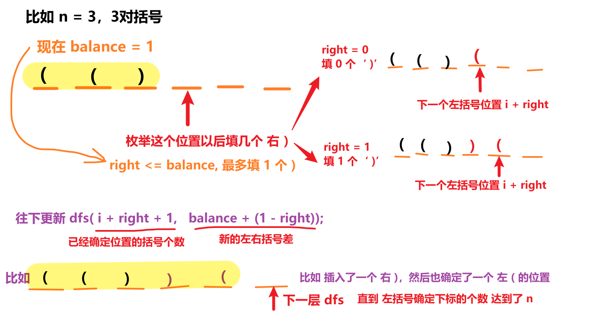

~~~C++
class Solution {
public:
    vector<string> generateParenthesis(int n) {

        vector<string> ans;
        vector<int> leftIndex; // 记录左括å·çš„下标

        // i:       ç›®å‰å¡«äº† i 个括å·
        // balance: è¿™ i 个括å·ä¸­, 左括å·ä¸ªæ•° - å³æ‹¬å·ä¸ªæ•° = balance，为了ä¿è¯å·¦æ‹¬å· > å³
        auto dfs = [&](this auto&& dfs, int i, int balance)
        {
            // 终止：左括å·ä¸‹æ ‡çš„个数 = n，左括å·ç¡®å®šäº† n 个ä½ç½®ï¼Œå¡«å……左括å·
            if (leftIndex.size() == n) 
            {
                string s(n * 2, ')');
                for (int j : leftIndex)  s[j] = '('; // 左括å·ä¸‹æ ‡å¤„æ”¹æˆ '('

                ans.emplace_back(s); // 收集
                return;
            }


            // æšä¸¾å¡« right = 0,1,2,3...,balance 个å³æ‹¬å·
            // balance çº¦æŸ  å³æ‹¬å·çš„ä¸ªæ•°ï¼Œä¸€å®šè¦ <= 左括å·ï¼Œ
            // 在 balance 的约æŸä¸‹ï¼Œæšä¸¾å¡« 1 个 ')'，填 2 个 ')', ... 之å，左括å·çš„下标
            for (int right = 0; right <= balance; right++)
            {
                // 先填 right 个å³æ‹¬å·ï¼Œç„¶åå¡« 1 个左括å·ï¼Œè®°å½•å·¦æ‹¬å·çš„下标 i + right
                leftIndex.push_back(i + right);
                dfs(i + right + 1, balance + (1 - right));
                leftIndex.pop_back();
            }
        };

        dfs(0, 0);
        return ans;        
    }
};
~~~


### ACM

~~~C++
#include <iostream>
#include <vector>
#include <string>
using namespace std;

// 22 括å·ç”Ÿæˆ


vector<string> generateParenthesis(int n) 
{
    vector<string> ans;
    string path(n * 2, 0);

    // 输入已填的 å·¦å³æ‹¬å·æ•°é‡
    auto dfs = [&](this auto&& dfs, int left, int right) ->void 
    {
        // 终止
        if (right == n)
        {
            ans.emplace_back(path);
            return;
        }
        if (left < n)
        {
            path[left + right] = '(';
            dfs(left + 1, right);
        }
        if (right < left)
        {
            path[left + right] = ')';
            dfs(left, right + 1);
        }
    };

    dfs(0, 0);
    return ans;
}

int main()
{
    int n = 3;
    vector<string> ans = generateParenthesis(n);

    for (string s : ans)
    {
        cout << s  << " , ";
    }
    cout << endl;
    
    return 0;
}
~~~


## 79 [å•è¯æœç´¢](https://leetcode.cn/problems/word-search/description/?envType=study-plan-v2&envId=top-100-liked)

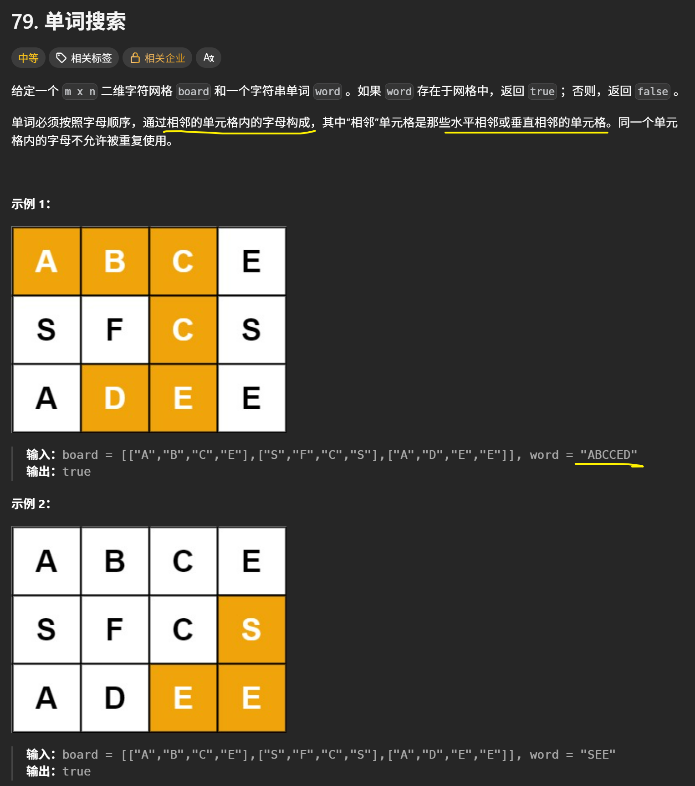

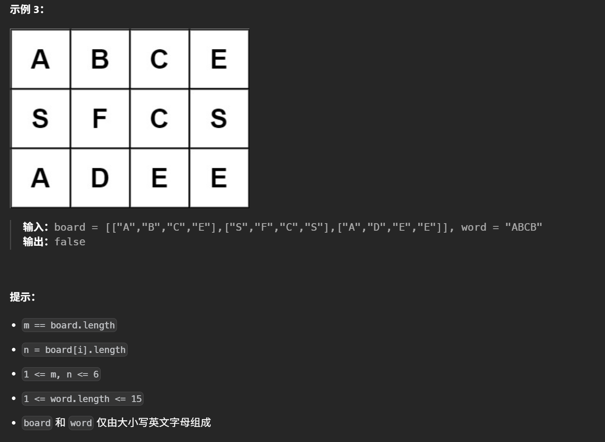


### dfs

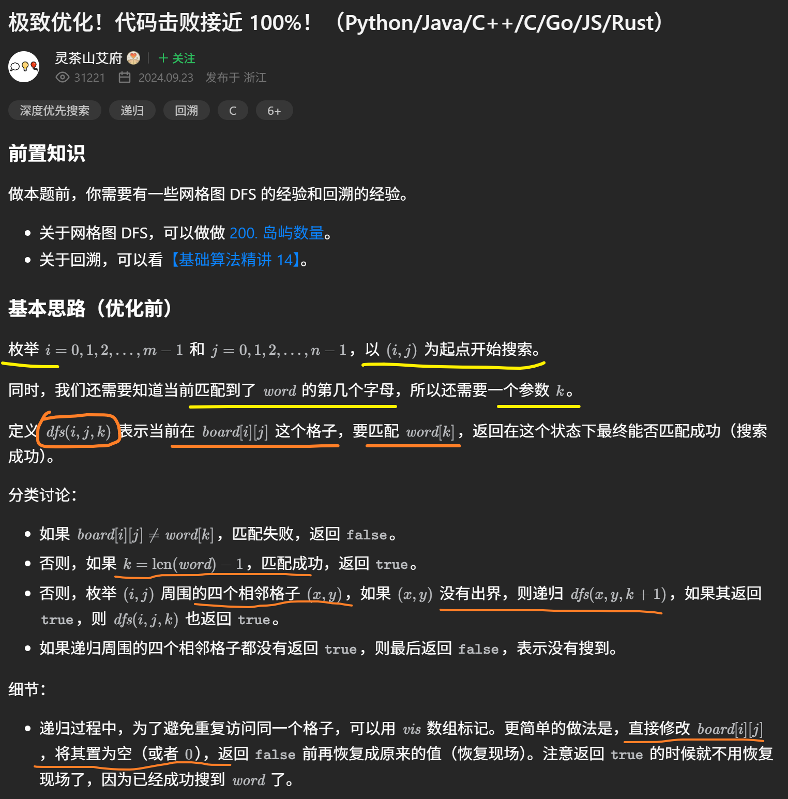


~~~C++	
class Solution {
public:
    // æ–¹å‘数组 下 上 å³ å·¦
    static constexpr int DIRS[4][2] = {{0, 1}, {0, -1}, {1, 0}, {-1, 0}};

    bool exist(vector<vector<char>>& board, string word) {
        int m = board.size();
        int n = board[0].size();
        
        auto dfs = [&](this auto&& dfs, int i, int j, int k)->bool{
            if (board[i][j] != word[k]) return false; // 匹é…失败

            if (k + 1 == word.size())   return true;  // 匹é…æˆåŠŸ

            board[i][j] = 0; // 标记访问过
            for (auto& [dx, dy] : DIRS) // 四个方å‘的相邻格å­
            {
                int x = i + dx, y = j + dy; 
                // 没超过边界，并且ååºå­—æ¯éƒ½æˆåŠŸåŒ¹é…
                if (0 <= x && x < m && 0 <= y && y < n && dfs(x, y, k + 1))
                {
                    return true;
                }
            }

            board[i][j] = word[k]; // æ¢å¤
            
            return false; // 没æœåˆ°
        };


        // æ¯ä¸ªæ ¼å­éƒ½å¯ä»¥ä½œä¸ºèµ·ç‚¹
        for (int i = 0; i < m; i++)
        {
            for (int j = 0; j < n; j++)
            {
                if (dfs(i, j, 0))   return true;// æœåˆ°äº†
            }
        }

        return false; // 没æœåˆ°
        
    }
};
~~~


### 优化剪æ

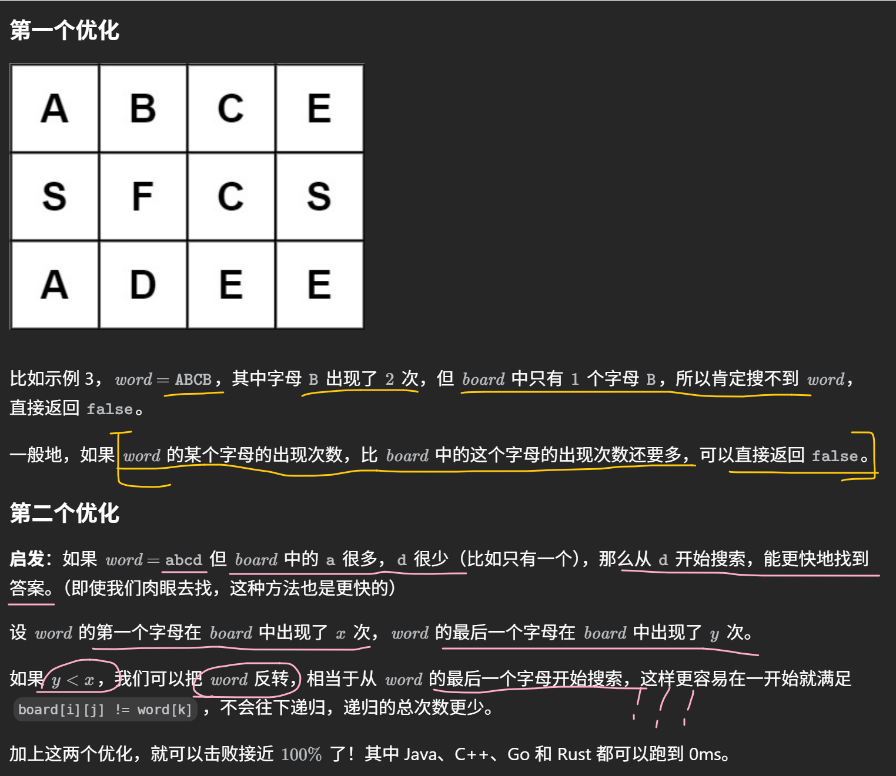


~~~C++	
class Solution {
public:
    static constexpr int DIRS[4][2] = {{0, 1}, {0, -1}, {1, 0}, {-1, 0}};

    bool exist(vector<vector<char>>& board, string word) 
    {
        unordered_map<char, int> board_cnt; // 收集board中æ¯ä¸ªå­—符的个数
        for (int i = 0; i < board.size(); i++)
        {
            for (char c : board[i])  board_cnt[c]++;
        }

        // 优化一：word中æŸä¸ªå­—符c的个数，超过board中这个字符的个数，直æ¥false
        unordered_map<char, int> word_cnt;
        for (char c : word)
        {
            if (++word_cnt[c] > board_cnt[c]) return false; 
        }

        // 优化二：如æœword的最å一个字符，在board中的出ç°æ¬¡æ•°è¾ƒå°‘，å转word进行æœç´¢
        if (board_cnt[word.back()] < board_cnt[word[0]])
        {
            ranges::reverse(word);
        }


        int m = board.size();
        int n = board[0].size();
        
        auto dfs = [&](this auto&& dfs, int i, int j, int k)->bool{
            if (board[i][j] != word[k]) return false; // 匹é…失败

            if (k + 1 == word.size())   return true;  // 匹é…æˆåŠŸ

            board[i][j] = 0; // 标记访问过
            for (auto& [dx, dy] : DIRS) // 四个方å‘的相邻格å­
            {
                int x = i + dx, y = j + dy; 
                // 没超过边界，并且ååºå­—æ¯éƒ½æˆåŠŸåŒ¹é…
                if (0 <= x && x < m && 0 <= y && y < n && dfs(x, y, k + 1))
                {
                    return true;
                }
            }

            board[i][j] = word[k]; // æ¢å¤
            
            return false; // 没æœåˆ°
        };


        // æ¯ä¸ªæ ¼å­éƒ½å¯ä»¥ä½œä¸ºèµ·ç‚¹
        for (int i = 0; i < m; i++)
        {
            for (int j = 0; j < n; j++)
            {
                if (dfs(i, j, 0))   return true;// æœåˆ°äº†
            }
        }

        return false; // 没æœåˆ°
        
    }
};
~~~


### ACM

~~~C++	
#include <iostream>
#include <vector>
#include <string>
#include <unordered_map>
#include <algorithm>
using namespace std;


// 79 å•è¯æœç´¢

const int DIRS[4][2] = {{0, -1}, {0, 1}, {1, 0}, {-1, 0}};

bool existWord(vector<vector<char>>& board, string word)
{
    unordered_map<char, int> board_cnt;
    for (int i = 0; i < board.size(); i++)
    {
        for (char c : board[i])     board_cnt[c]++;
    }

    unordered_map<char, int> word_cnt;
    for (char c : word)
    {
        word_cnt[c]++;
    }

    for (char c : word)
    {
        if (word_cnt[c] > board_cnt[c]) return false;
    }     

    if (board_cnt[word.back()] < board_cnt[word[0]])    reverse(word.begin(), word.end());


    int m = board.size();
    int n = board[0].size();

    auto dfs = [&](this auto&& dfs, int i, int j, int k)->bool
    {
        if (board[i][j] != word[k]) return false;
        if (k == word.size() - 1)   return true;

        board[i][j] = 0;
        for (auto& [dx, dy] : DIRS)
        {
            int x = i + dx, y = j + dy;
            if (0 <= x && x < m && 0 <= y && y < n && dfs(x, y, k + 1))     return true;
        }

        board[i][j] = word[k];
        
        return false;
    };

    for (int i = 0; i < m; i++)
    {
        for (int j = 0; j < n; j++)
        {
            if (dfs(i, j, 0))   return true;
        }
    }

    return false;
}


int main()
{
    vector<vector<char>> board = {
        {'A','B','C','E'},
        {'S','F','C','S'},
        {'A','D','E','E'}};
    
    string word = "ABCCED";
    bool ans = existWord(board, word);
    cout << (ans ? "true" : "false") << endl;

    return 0;
}
~~~


# 二分查找 ✅

## 35 [æœç´¢æ’å…¥ä½ç½®](https://leetcode.cn/problems/search-insert-position/?envType=study-plan-v2&envId=top-100-liked)

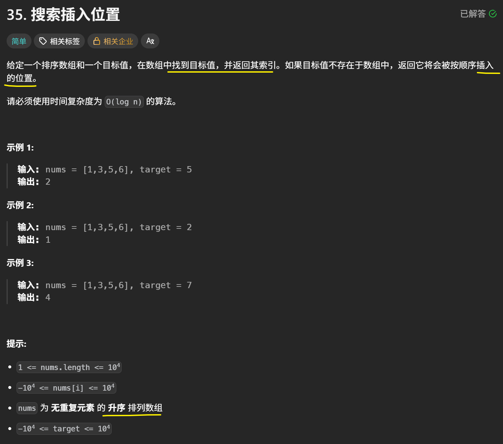

比704ã€äºŒåˆ†æŸ¥æ‰¾å¤šäº†ä¸€ä¸ªè¿”å›æ’å…¥ä½ç½®

~~~C++
class Solution {
public:
    int searchInsert(vector<int>& nums, int target) {
        
        int left = 0;
        int right = nums.size() - 1; // [left, right] 左闭å³é—­

        while (left <= right)
        {
            int mid = left + ((right - left) / 2); // 防溢出

            if      (nums[mid] > target)    right = mid - 1;
            else if (nums[mid] < target)    left = mid + 1;
            else    return mid;
        }

        return right + 1; // è¿”å›æ’å…¥ä½ç½®   
        
        // return left; 也å¯ä»¥

        // 二分查找退出while时的状æ€æ˜¯ left > right
        // left  指å‘æ’å…¥ä½ç½®
        // right 指å‘比targetå°çš„最大值
        // right + 1 ç­‰ä»·ä¸ left  
    }
};
~~~


## 74 [æœç´¢äºŒç»´çŸ©é˜µ](https://leetcode.cn/problems/search-a-2d-matrix/?envType=study-plan-v2&envId=top-100-liked)

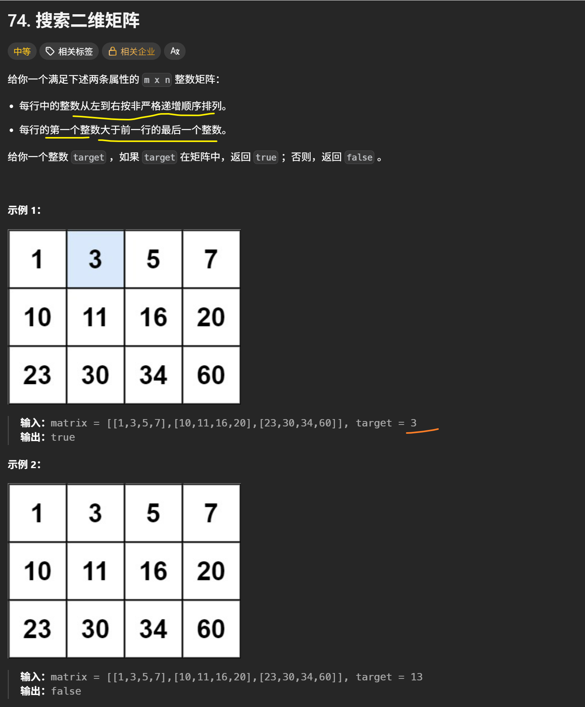

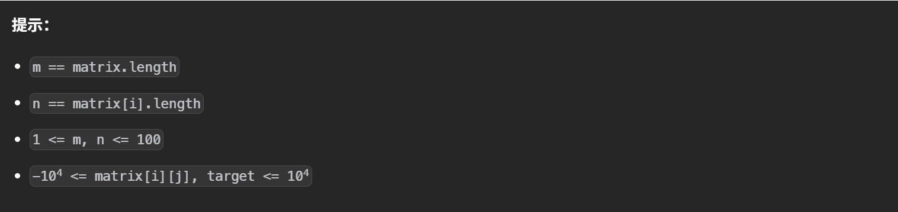

[çµç¥](https://leetcode.cn/problems/search-a-2d-matrix/solutions/2783931/liang-chong-fang-fa-er-fen-cha-zhao-pai-39d74)

### 1ã€äºŒåˆ†

矩阵æ¯ä¸€è¡Œæ‹¼åœ¨ä¸€èµ·ï¼Œæ‹¼æˆä¸€ä¸ªé€’å¢æ•°ç»„，å†äºŒåˆ†ã€‚

但是ä¸ç”¨çœŸæ‹¼æˆä¸€ä¸ªæ•°ç»„，而是用åæ ‡è¿èµ·æ¥

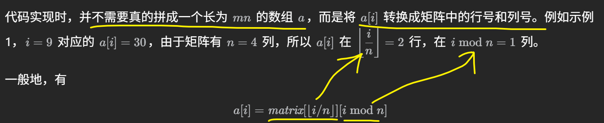

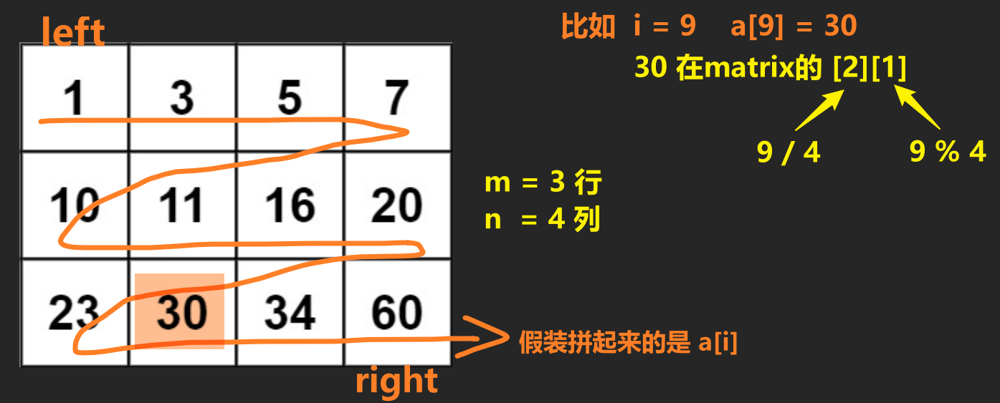

~~~C++
class Solution {
public:
    bool searchMatrix(vector<vector<int>>& matrix, int target) {

        int m = matrix.size();
        int n = matrix[0].size();

        int left = 0;
        int right = m * n - 1; // 相当äºéå†æ‹¼æ¥æˆçš„ a[i] ä» 0 到 m*n 
        while (left <= right)
        {
            int mid = left + ((right - left) / 2);

            int midNum = matrix[mid / n][mid % n];//å–出a[mid] = matrix[mid/n][mid%n]
            
            if (midNum < target)    left = mid + 1;
            else if (midNum > target)   right = mid - 1;
            else    return true;
        }

        return false;
    }
};
~~~

- 时间å¤æ‚度：O(log(*mn*))，其中 *m* å’Œ *n* 分别为 *matrix* 的行数和列数。
- 空间å¤æ‚度：O(1)。


### 2ã€å³ä¸Šè§’æ’除

这里主è¦æ˜¯ä¸ºäº†æ¥ 240ã€æœç´¢äºŒç»´çŸ©é˜µII，还是æ¨è二分法

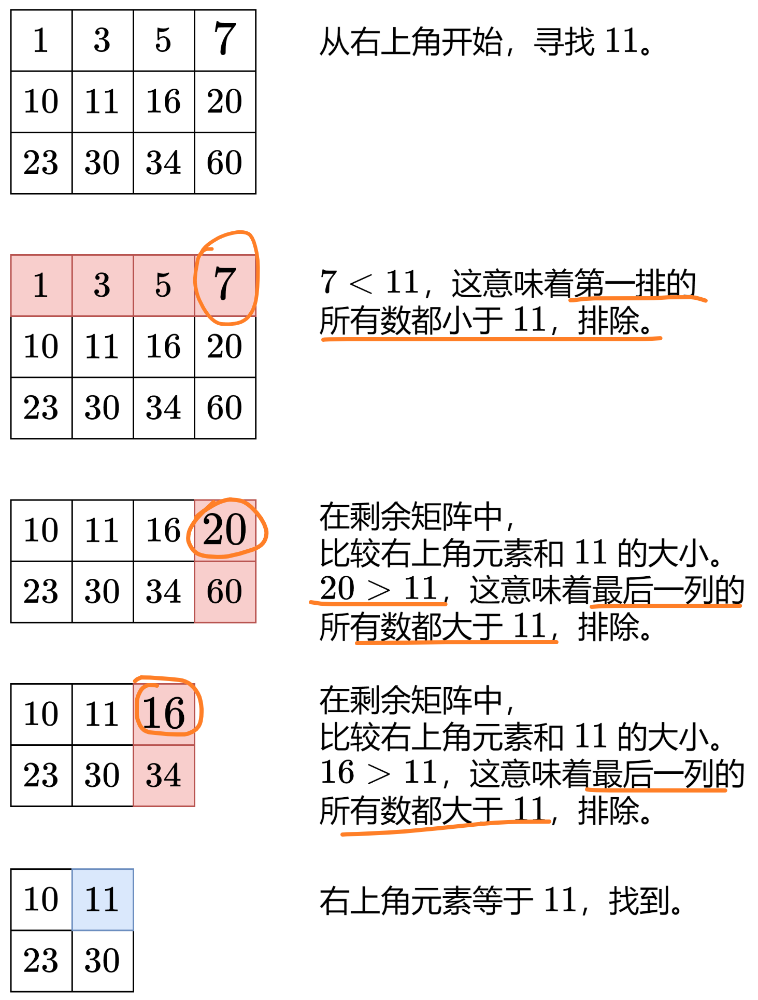

~~~C++
class Solution {
public:
    bool searchMatrix(vector<vector<int>>& matrix, int target) {

        int m = matrix.size();
        int n = matrix[0].size();

        int i = 0;      // 第i行
        int j = n - 1;  // 第j列
        while (i < m && j >= 0)
        {
            
            if      (matrix[i][j] < target)     i++; // 说æ˜è¿™ä¸€è¡Œéƒ½å°äºtarget
            else if (matrix[i][j] > target)     j--; // å¾€å‰èµ°ä¸€åˆ—
            else    return true; // matrix[i][j] == target
        }
        
        return false;
    }
};
~~~

- 时间å¤æ‚度：O(*m*+*n*)，其中 *m* å’Œ *n* 分别为 *matrix* 的行数和列数。
- 空间å¤æ‚度：O(1)。


## 34 [在æ’åºæ•°ç»„中查找第一个和最å一个ä½ç½®](https://leetcode.cn/problems/find-first-and-last-position-of-element-in-sorted-array/?envType=study-plan-v2&envId=top-100-liked)


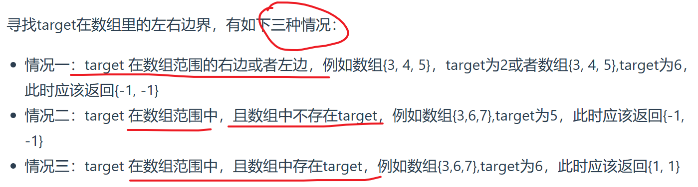


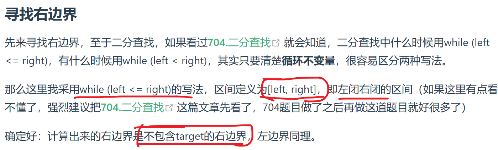

~~~C++
class Solution {
public:

    // nums = [5,  7,  7,  8,  8,  10], target = 8
    //                 |            |
    //            leftBorder     rightBorder


    // 找第一个比 target 大的ä½ç½®
    int getRightBorder(vector<int>& nums, int target)
    {
        int left = 0;
        int right = nums.size() - 1;
        
        // 当å‰ç¬¬ä¸€ä¸ªå¤§äº target çš„ä½ç½®
        int rightBorder = -2; // -2 记录rightBorder没有被赋值的情况
        while (left <= right)
        {
            int mid = left + ((right - left) / 2);
            if (nums[mid] <= target) // å‘å³ç¼©å°èŒƒå›´
            {
                left = mid + 1;
                rightBorder = left;// æ–°çš„left就是下一个å¯èƒ½å¤§äºtargetçš„ä½ç½®
            }
            else 
            {
                right = mid - 1; 
            }
        }
        return rightBorder;
    }

    // 找最å一个比 target å°çš„ä½ç½®
    int getLeftBorder(vector<int>& nums, int target)
    {
        int left = 0;
        int right = nums.size() - 1;
        
        // 最å一个比 target å°çš„ä½ç½®
        int leftBorder = -2; 
        while (left <= right)
        {
            int mid = left + ((right - left) / 2); 
            if (target <= nums[mid]) // å‘左缩å°èŒƒå›´
            {
                right = mid - 1;
                leftBorder = right; // æ–°right 就是下一个å¯èƒ½å°äº target çš„ä½ç½®
            }
            else 
            {
                left = mid + 1;
            }
        }
        return leftBorder;
    }


    vector<int> searchRange(vector<int>& nums, int target) {

        int leftBorder = getLeftBorder(nums, target);
        int rightBorder = getRightBorder(nums, target);


        // 情况一：target 在数组范围的å³è¾¹æˆ–者左边，ä¸å†æ•°ç»„范围中
        if (leftBorder == -2 || rightBorder== -2)   return {-1, -1};

        
        // 情况三：target 在数组范围中，且数组中存在target
        if (rightBorder - leftBorder > 1)   return {leftBorder + 1, rightBorder - 1};
        
        
        // 情况二：target 在数组范围中，且数组中ä¸å­˜åœ¨target
        return {-1, -1};

        
    }
};
~~~


ACM

~~~C++
#include <iostream>
#include <vector>
using namespace std;


// 34. 在æ’åºæ•°ç»„中查找元素的第一个和最å一个ä½ç½®


// nums = [5,  7,  7,  8,  8,  10], target = 8
//                 |            |
//            leftBorder     rightBorder


// 找第一个比 target 大的ä½ç½® rightBorder
int getRightBorder(vector<int>& nums, int target)
{
    int left = 0;
    int right = nums.size() - 1;
    
    // 当å‰ç¬¬ä¸€ä¸ªå¤§äº target çš„ä½ç½®
    int rightBorder = -2; // -2 记录rightBorder没有被赋值的情况
    while (left <= right)
    {
        int mid = left + ((right - left) / 2);
        if (nums[mid] <= target) // å‘å³ç¼©å°èŒƒå›´
        {
            left = mid + 1;
            rightBorder = left;// æ–°çš„left就是下一个å¯èƒ½å¤§äºtargetçš„ä½ç½®
        }
        else 
        {
            right = mid - 1; 
        }
    }
    return rightBorder;
}


// 找最å一个比 target å°çš„ä½ç½® leftBorder
int getLeftBorder(vector<int>& nums, int target)
{
    int left = 0;
    int right = nums.size() - 1;
    
    // 最å一个比 target å°çš„ä½ç½®
    int leftBorder = -2; 
    while (left <= right)
    {
        int mid = left + ((right - left) / 2); 
        if (target <= nums[mid]) // å‘左缩å°èŒƒå›´
        {
            right = mid - 1;
            leftBorder = right; // æ–°right 就是下一个å¯èƒ½å°äº target çš„ä½ç½®
        }
        else 
        {
            left = mid + 1;
        }
    }
    return leftBorder;
}


vector<int> searchRange(vector<int>& nums, int target) 
{
    int leftBorder = getLeftBorder(nums, target);
    int rightBorder = getRightBorder(nums, target);

    // 情况一：target 在数组范围的å³è¾¹æˆ–者左边，ä¸å†æ•°ç»„范围中
    if (leftBorder == -2 || rightBorder== -2)   return {-1, -1};
    
    // 情况三：target 在数组范围中，且数组中存在target
    if (rightBorder - leftBorder > 1)   return {leftBorder + 1, rightBorder - 1};
    
    
    // 情况二：target 在数组范围中，且数组中ä¸å­˜åœ¨target
    return {-1, -1};
    
}

int main()
{
    vector<int> nums = {5, 7, 7, 8, 8, 10};
    int target = 8;
    vector<int> ans = searchRange(nums, target); // [3, 4]
    for (int val : ans)
    {
        cout << val << " ";
    }
    cout << endl;

    return 0;
}
~~~


## 153 [寻找旋转æ’åºæ•°ç»„中的最å°å€¼](https://leetcode.cn/problems/find-minimum-in-rotated-sorted-array/description/?envType=study-plan-v2&envId=top-100-liked)


å¯ä»¥å…ˆçœ‹ [162 峰值](#162 [寻找峰值](https://leetcode.cn/problems/find-peak-element/description/))


**主è¦æ€è·¯ï¼šæ¯”较 nums[mid] 和最å一个数，判断 mid å’Œ 最å°å€¼ çš„ä½ç½®ï¼ŒäºŒåˆ†æ”¶ç¼©**

- nums[mid] > 最å一个数：
  - nums 一定是两个上å‡æ®µï¼Œç¬¬ä¸€æ®µ  >  第二段
  - **mid 在第一段，min 在第二段**，min 一定在 mid çš„**å³è¾¹**  –>  å‘å³æ”¶ç¼©
- nums[mid] <= 最å一个数：
  - mid 在第二段（或者 nums åªæœ‰ä¸€æ®µï¼Œä¸€æ ·çš„），或者说 **mid å’Œ min 在åŒä¸€æ®µ**
  - **min 一定在mid 左侧**，或者就是mid –> å‘左收缩


~~~C++
class Solution {
public:
    int findMin(vector<int>& nums) {

        int n = nums.size();
        int left = 0;
        int right = n - 1;

        while (left <= right)
        {
            int mid = left + ((right - left) / 2);

            if (nums[mid] > nums[n - 1])    left = mid + 1;// mid在第一段，min在第二段
            else    right = mid - 1; // mid å’Œ min 在åŒä¸€æ®µï¼Œä¸” min 在左

        }

        return nums[left]; 
    }
};
~~~


ACM 

~~~C++
#include <iostream>
#include <vector>
using namespace std;

// 153 寻找旋转æ’åºæ•°ç»„中的最å°å€¼


int findMin(vector<int>& nums) {

    int n = nums.size();
    int left = 0;
    int right = n - 1;

    while (left <= right)
    {
        int mid = left + ((right - left) / 2);

        if (nums[mid] > nums[n - 1])    left = mid + 1;// mid在第一段，min在第二段
        else    right = mid - 1; // mid å’Œ min 在åŒä¸€æ®µï¼Œä¸” min 在左

    }

    return nums[left]; 
}


int main()
{
    vector<int> nums = {3, 4, 5, 1, 2};
    int ans = findMin(nums);
    cout << ans << endl;

    return 0;
}
~~~


## 33 [æœç´¢æ—‹è½¬æ’åºæ•°ç»„](https://leetcode.cn/problems/search-in-rotated-sorted-array/description/?envType=study-plan-v2&envId=top-100-liked)

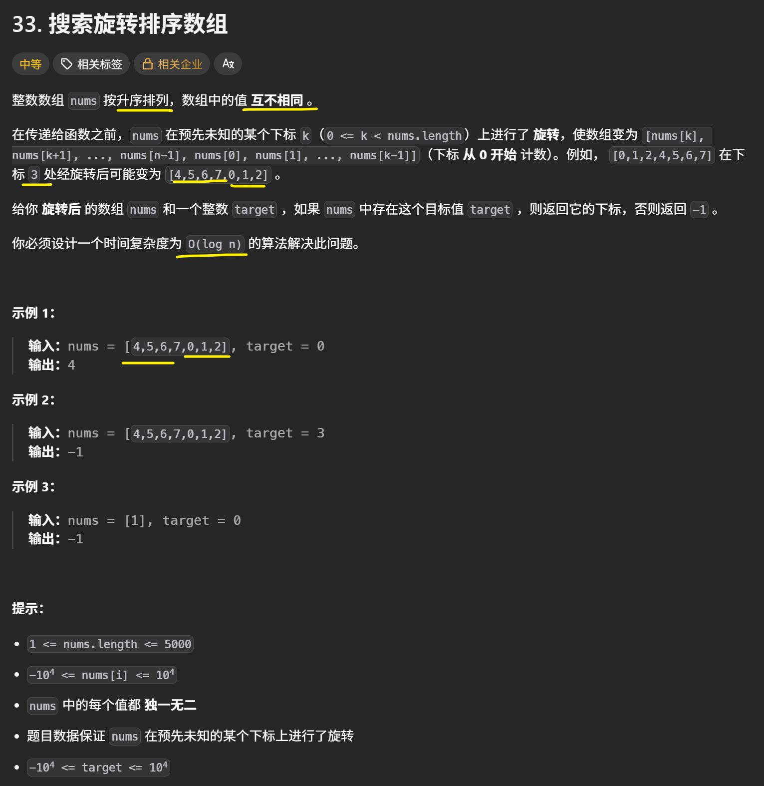

> å‰æ题目：å¯ä»¥å…ˆçœ‹ 162 峰值，153 寻找旋转æ’åºæ•°ç»„的最å°å€¼

### 1ã€ä¸¤æ¬¡äºŒåˆ†

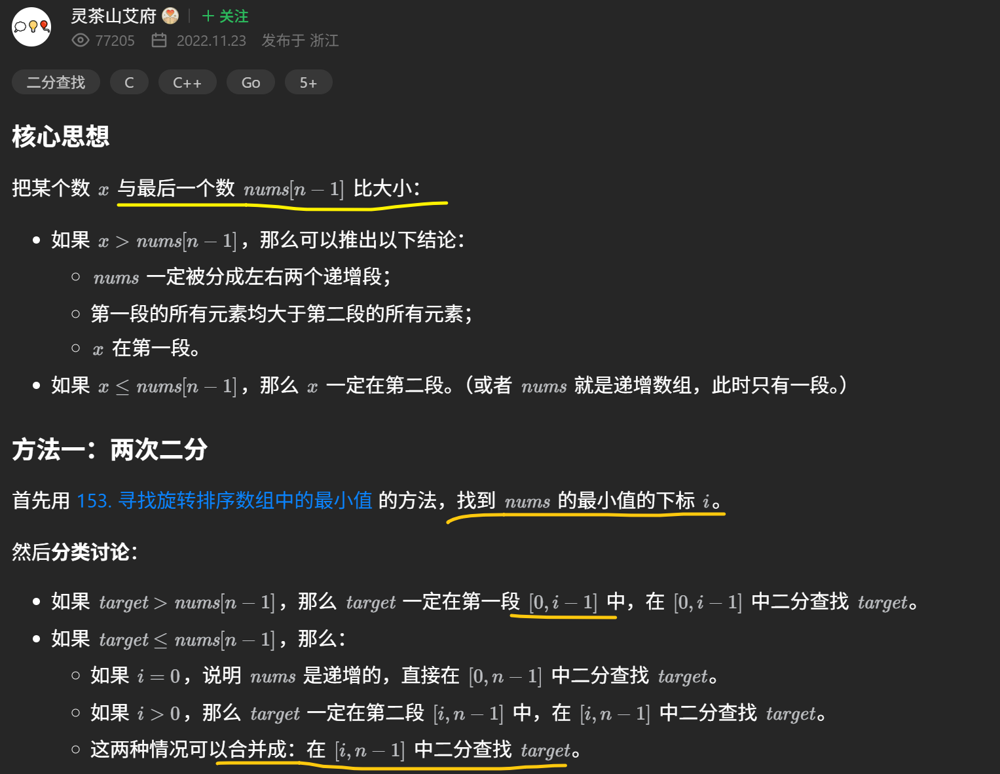

~~~C++
class Solution {
public:
    // 找旋转æ’åºæ•°ç»„的最å°å€¼ä¸‹æ ‡ï¼ˆ153）
    int findMin(vector<int>& nums) {
        int n = nums.size();
        int left = 0;
        int right = n - 1;
        while (left <= right)
        {
            int mid = left + ((right - left) / 2);
            if (nums[mid] > nums[n - 1])    left = mid + 1;// mid在第一段，min在第二段
            else    right = mid - 1; // mid å’Œ min 在åŒä¸€æ®µï¼Œä¸” min 在左
        }
        return left; 
    }

    // [left, right]二分，找target下标
    int searchTarget(vector<int>& nums, int target, int left, int right) {
        while (left <= right)
        {
            int mid = left + ((right - left) / 2); 
            if      (nums[mid] > target)    right = mid - 1;
            else if (nums[mid] < target)    left = mid + 1;
            else    return mid;
        }
        return -1; // 没找到返å›-1  
    }

    
    int search(vector<int>& nums, int target) {
        int n = nums.size();
        int ans = 0;
        int left = 0;
        int right = n - 1;

        int min_index = findMin(nums); // 找到最å°å€¼ï¼ŒåŒºåˆ†ç¬¬ä¸€æ®µç¬¬äºŒæ®µ

        if (target > nums[n - 1])  // target 在第一段，[0, min_index-1], å‘左收缩 
        { 
            right = min_index - 1;
            ans = searchTarget(nums, target, left, right);         
        }
        else // target <= nums[n - 1] target 在第二段，[min_index, n-1]，å‘å³æ”¶ç¼©  
        {
            left = min_index;
            ans = searchTarget(nums, target, left, right);

            // 注æ„这里è¦å¸¦ç€min判断, target有å¯èƒ½å°±æ˜¯min
        }

        return ans;        
    }
};
~~~


### 2ã€ä¸€æ¬¡äºŒåˆ†(æ¨è)

ç›´æ¥åˆ¤æ–­ target å’Œ mid çš„å·¦å³å…³ç³»ï¼Œåˆ†æˆtargetå’Œmid在ä¸åœ¨åŒä¸€æ®µä¸¤ç§æƒ…况

- ä¸åœ¨åŒä¸€æ®µï¼Œåˆ† mid 在 target 左还是å³
- 在åŒä¸€æ®µï¼Œå°±æ˜¯æ™®é€šäºŒåˆ†æŸ¥æ‰¾äº†

~~~C++
class Solution {
public:
    int search(vector<int>& nums, int target) {

        int n = nums.size();
        int end = nums[n - 1];
        int left = 0;
        int right = n - 1;

        while (left <= right)
        {
            int mid = left + (right - left) / 2;

            // target å’Œ mid ä¸åœ¨åŒä¸€æ®µ
            if (target <= end && nums[mid] > end) // target在å³åŠéƒ¨åˆ†ï¼Œmid在左
            {
                left = mid + 1;
            }
            else if (target > end && nums[mid] <= end) // target在左åŠéƒ¨åˆ†ï¼Œmid在å³
            {
                right = mid - 1;
            }
            else // target å’Œ mid 在åŒä¸€æ®µï¼ˆä¹ŸåŒ…括了åªæœ‰ä¸€æ®µçš„情况）
            {
                if (target < nums[mid])         right = mid - 1;
                else if (target > nums[mid])    left = mid + 1;
                else    return mid;
            }
        }
        
        return -1;        
    }
};
~~~


ACM

~~~C++
#include <iostream>
#include <vector>
using namespace std;

// 33 æœç´¢æ—‹è½¬æ’åºæ•°ç»„


int searchTarget(vector<int>& nums, int target) 
{
    int n = nums.size();
    int end = nums[n - 1];
    int left = 0;
    int right = n - 1;

    while (left <= right)
    {
        int mid = left + (right - left) / 2;

        // target å’Œ mid ä¸åœ¨åŒä¸€æ®µ
        if (target <= end && nums[mid] > end) // target在å³åŠéƒ¨åˆ†ï¼Œmid在左
        {
            left = mid + 1;
        }
        else if (target > end && nums[mid] <= end) // target在左åŠéƒ¨åˆ†ï¼Œmid在å³
        {
            right = mid - 1;
        }
        else // target å’Œ mid 在åŒä¸€æ®µï¼ˆä¹ŸåŒ…括了åªæœ‰ä¸€æ®µçš„情况）
        {
            if (target < nums[mid])         right = mid - 1;
            else if (target > nums[mid])    left = mid + 1;
            else    return mid;
        }
    }
    
    return -1;        
}


int main()
{
    vector<int> nums = {4,5,6,7,0,1,2};
    int target = 0;

    int ans = searchTarget(nums, target);
    cout << ans << endl;

    return 0;
}
~~~


## 4 [寻找两个正åºæ•°ç»„的中ä½æ•°](https://leetcode.cn/problems/median-of-two-sorted-arrays/description/?envType=study-plan-v2&envId=top-100-liked)

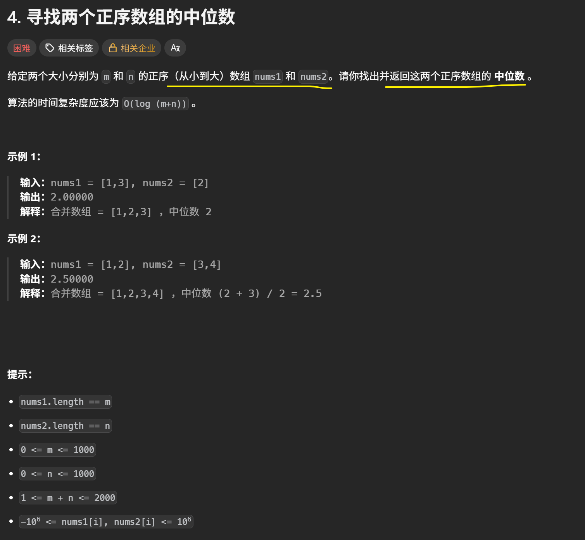

[背å§](https://leetcode.cn/problems/median-of-two-sorted-arrays/solutions/2950686/tu-jie-xun-xu-jian-jin-cong-shuang-zhi-z-p2gd)

好åƒçœ‹æ‡‚了


### 1ã€åŒæŒ‡é’ˆ

**中ä½æ•° —— å‡åˆ†æ•°ç»„，能把一组数平å‡åˆ’分为大å°ç›¸ç­‰çš„两部分。**

å‡è®¾æœ‰**两个新数组**，就是å‡åˆ†å®Œçš„那两个数组，ç°åœ¨åˆ†åˆ«ä»é¢˜ç›®ç»™å®šçš„nums1 å’Œ nums2 中å–数（下é¢ç”¨aå’Œb）。

找中ä½æ•°ï¼Œè¦ä¿è¯**第一个新数组的最大值 <  第二个新数组的最å°å€¼**，æ¥ç¼å¤„就是è¦æ‰¾çš„中ä½æ•°ã€‚

å·¦å³éƒ½æ’å…¥ −∠和 ∠，ä¿è¯æ— è®º a å’Œ b 是什么样的，一定存在一个 i，满足 a i ≤ b j+1  且 a i+1 >b j 。

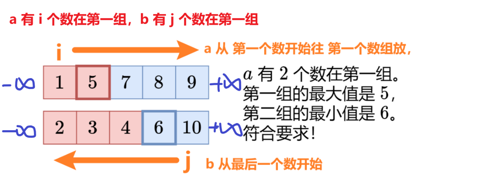


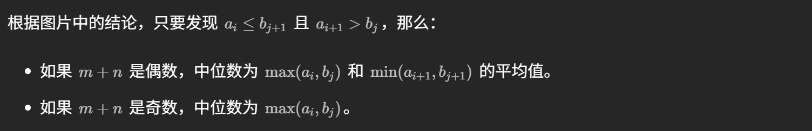

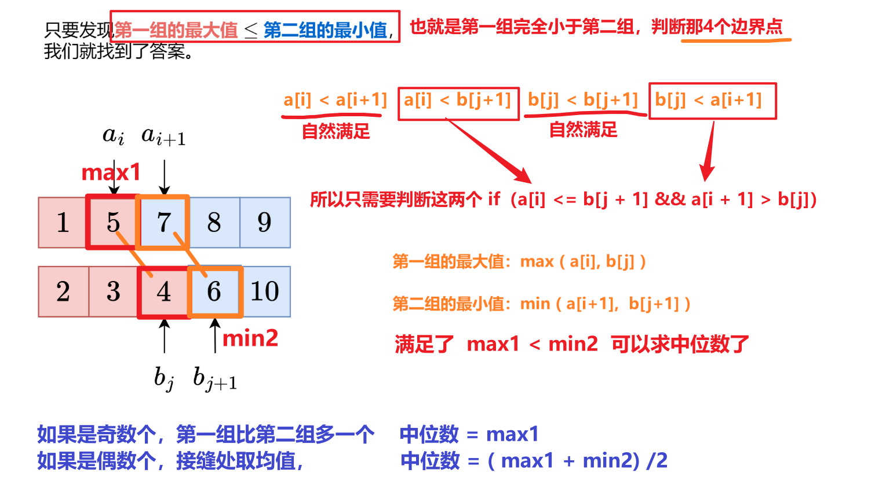

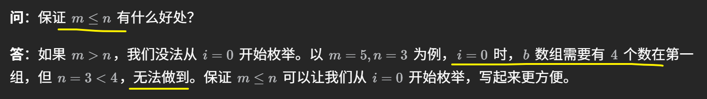

~~~C++
class Solution {
public:
    double findMedianSortedArrays(vector<int>& nums1, vector<int>& nums2) {

        if (nums1.size() > nums2.size())    swap(nums1, nums2); // ä¿è¯nums1是少的那个

        // m < n 
        int m = nums1.size(), n = nums2.size(); 

        // å·¦å³æ’上负无穷，和正无穷
        nums1.insert(nums1.begin(), INT_MIN);
        nums1.push_back(INT_MAX);
        nums2.insert(nums2.begin(), INT_MIN);
        nums2.push_back(INT_MAX);

        // æšä¸¾ nums1 有 i 个数在第一组
        // 那么 nums2 有 j = (m + n + 1) / 2 - i 个数在第一组 
        int i = 0;
        int j = (m + n + 1) / 2;
        while (true)
        {
            // 找到第一组都å°äºç¬¬äºŒç»„的情况
            if (nums1[i] <= nums2[j + 1] && nums1[i + 1] > nums2[j])// 写 >= 也å¯ä»¥
            {
                int max1 = max(nums1[i], nums2[j]);         // 第一组的最大值
                int min2 = min(nums1[i + 1], nums2[j + 1]); // 第二组的最å°å€¼

                if ( (m + n) % 2) // 奇数个，第一组多一个，max1就是中ä½æ•°
                {
                    return max1; 
                }
                else // å¶æ•°ä¸ªï¼Œæ¥ç¼å¤„区å‡å€¼
                {
                    return (max1 + min2) / 2.0;
                }
            }

            // 继续æšä¸¾
            i++;
            j--;
        }        
    }
};
~~~


### 2ã€äºŒåˆ†

æ˜å¤©å†çœ‹ï¼Œç¼“缓脑å­ï¼Œå¤ªç‚¸è£‚了


### ACM

~~~C++
#include <vector>
#include <iostream>
using namespace std;

// 4 寻找两个正åºæ•°ç»„中的中ä½æ•°

double findMedianSortedArrays(vector<int>& nums1, vector<int>& nums2) {

    if (nums1.size() > nums2.size())    swap(nums1, nums2); // ä¿è¯nums1是少的那个

    // m < n 
    int m = nums1.size(), n = nums2.size(); 

    // å·¦å³æ’上负无穷，和正无穷
    nums1.insert(nums1.begin(), INT_MIN);
    nums1.push_back(INT_MAX);
    nums2.insert(nums2.begin(), INT_MIN);
    nums2.push_back(INT_MAX);

    // æšä¸¾ nums1 有 i 个数在第一组
    // 那么 nums2 有 j = (m + n + 1) / 2 - i 个数在第一组 
    int i = 0;
    int j = (m + n + 1) / 2;
    while (true)
    {
        // 找到第一组都å°äºç¬¬äºŒç»„的情况
        if (nums1[i] <= nums2[j + 1] && nums1[i + 1] > nums2[j])// 写 >= 也å¯ä»¥
        {
            int max1 = max(nums1[i], nums2[j]);         // 第一组的最大值
            int min2 = min(nums1[i + 1], nums2[j + 1]); // 第二组的最å°å€¼

            if ( (m + n) % 2) // 奇数个，第一组多一个，max1就是中ä½æ•°
            {
                return max1; 
            }
            else // å¶æ•°ä¸ªï¼Œæ¥ç¼å¤„区å‡å€¼
            {
                return (max1 + min2) / 2.0;
            }
        }

        // 继续æšä¸¾
        i++;
        j--;
    }        
}


int main()
{
    vector<int> nums1 = {1, 2};
    vector<int> nums2 = {3, 4};
    double result = findMedianSortedArrays(nums1, nums2);
    cout << result << endl;
}
~~~


## 69 [x的平方根](https://leetcode.cn/problems/sqrtx/description/)

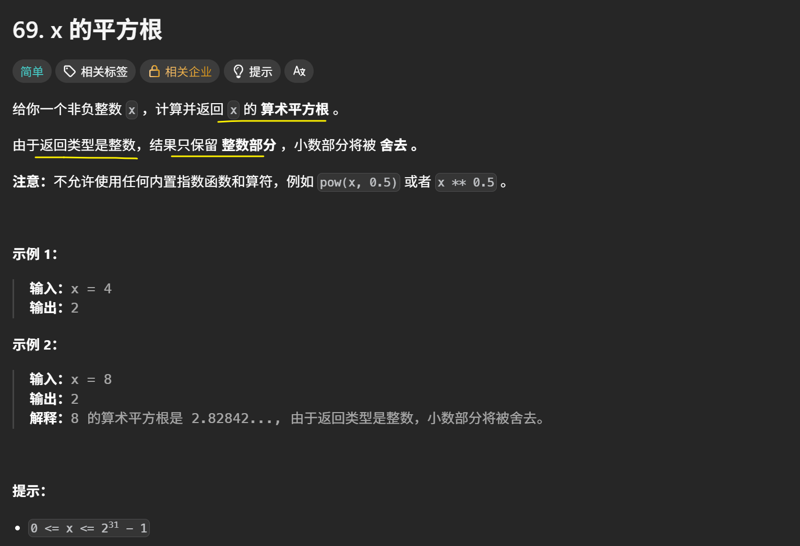

### 1ã€äºŒåˆ†

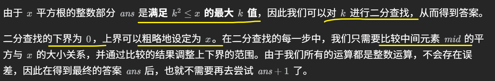

~~~C++
class Solution {
public:
    int mySqrt(int x) {
        
        // 在中间过程计算平方的时候å¯èƒ½å‡ºç°æº¢å‡ºï¼Œæ‰€ä»¥ç”¨long long
        
        // x 平方根的整数部分 ans 是满足 k^2 ≤x 的最大 k 值

        // 二分 0 ~ x，找到最大的 k
        int l = 0, r = x;
        int ans = -1;

        while (l <= r)
        {
            int mid = l + (r - l) / 2;
            if ((long long)mid * mid <= x)
            {
                ans = mid;
                l = mid + 1;
            }
            else 
            {
                r = mid - 1;
            }
        }

        return ans;        
    }
};
~~~


### 2ã€ç‰›é¡¿è¿­ä»£æ³•

利用切线逼近曲线的方程的解   [题解 仗剑骑士](https://leetcode.cn/problems/sqrtx/solutions/1408932/by-zhang-jian-qi-shi-kaxt)


~~~C++
class Solution {
public:
    int mySqrt(int x) {

        int a = x;
        long long ans = x;

        while (ans * ans > x) // æ¨å‡ºæ¥çš„ x_n+1 的递æ¨å…¬å¼ï¼Œé€’æ¨ç›´åˆ°ans*ans<=x
        {
            ans = (ans + a / ans) / 2; 
        }

        return ans;
    }
};
~~~


# 栈 ✅

## 20 [有效的括å·](https://leetcode.cn/problems/valid-parentheses/description/?envType=study-plan-v2&envId=top-100-liked)


> **注æ„看给的示例，题目æè¿°ä¸æ¸…楚**
>
> **必须是 “ ( [ { } ] )  [ ] †这ç§æˆå¯¹çš„顺åºï¼Œä¸èƒ½äº¤å‰æ”¾ä¸åŒç±»å‹çš„æ‹¬å·  “ [ ( ] ) â€**

**æ ˆæ¥å­˜å‚¨å­—符串s里的括å·ï¼š**

éå†s

- æ ¹æ®s里的左括å·ï¼Œå¾€æ ˆé‡Œæ”¾å¯¹åº”çš„å³æ‹¬å·ï¼›

- é‡åˆ°s里的å³æ‹¬å·ï¼Œèƒ½å¯¹åº”上栈顶元素，就弹出栈顶


ä¸åŒ¹é…的情况：

- 左括å·å¤šä½™ —— éå†å®Œå­—符串，但是栈ä¸ä¸ºç©º
- 括å·ä¸åŒ¹é… —— å‘ç°æ ˆé‡Œæ²¡æœ‰è¦åŒ¹é…的字符
- å³æ‹¬å·å¤šä½™ —— éå†å­—符串匹é…的过程中，栈已ç»ä¸ºç©ºäº†

匹é…的表ç°ï¼š

- **字符串éå†å®Œï¼Œæ ˆä¹Ÿæ˜¯ç©ºçš„**


~~~C++
class Solution {
public:
    bool isValid(string s) {

        if (s.size() % 2 != 0)  return false; // å¦‚æœ s 的长度是奇数，一定ä¸åŒ¹é…

        stack<char> st; // æ ¹æ® s 的左括å·ï¼Œæ”¾å…¥ç›¸åº”çš„å³æ‹¬å·
        
        // 三ç§æƒ…况：
        // 1 左括å·å¤šä½™ -- séå†å®Œï¼Œæ ˆä¸ä¸ºç©º
        // 2 括å·ä¸åŒ¹é… -- séå†è¿‡ç¨‹ä¸­ï¼Œæ ˆé¡¶æ‹¬å·ä¸åŒ¹é…
        // 3 å³æ‹¬å·å¤šä½™ -- séå†è¿‡ç¨‹ä¸­ï¼Œæ ˆå·²ç»ç©º

        for (int i = 0; i < s.size(); i++)
        {
            // æ ¹æ® s 里的左括å·ï¼Œå¾€æ ˆé‡ŒåŠ å…¥å¯¹åº”çš„å³æ‹¬å·
            if (s[i] == '(')        st.push(')');
            else if (s[i] == '[')   st.push(']');
            else if (s[i] == '{')   st.push('}');

            // 第3ç§ å’Œ 第2ç§ æƒ…å†µï¼Œç›´æ¥false （注æ„if里顺åºä¸èƒ½æ¢ï¼‰
            else if (st.empty() || st.top() != s[i])    return false; 

            // st.top() == s[i] éå†åˆ°å¯¹åº”çš„å³æ‹¬å·å°±å¼¹å‡ºæ ˆé¡¶
            else    st.pop();
        }

        // 第1ç§ æƒ…å†µï¼Œéå†å®Œs，但栈ä¸ä¸ºç©ºï¼Œè¿™é‡Œå°±è¿”å›false
        // 如æœä¸ºç©ºï¼Œè¯´æ˜ç¬¦åˆè¦æ±‚，返å›çš„是true
        return st.empty();
        
    }
};
~~~


ACM 

~~~C++
#include <string>
#include <iostream>
#include <stack>
using namespace std;

// 20 有效的括å·


bool isValid(string s) 
{
    if (s.size() % 2 != 0)  return false; // å¦‚æœ s 的长度是奇数，一定ä¸åŒ¹é…

    stack<char> st; // æ ¹æ® s 的左括å·ï¼Œæ”¾å…¥ç›¸åº”çš„å³æ‹¬å·
    
    // 三ç§æƒ…况：
    // 1 左括å·å¤šä½™ -- séå†å®Œï¼Œæ ˆä¸ä¸ºç©º
    // 2 括å·ä¸åŒ¹é… -- séå†è¿‡ç¨‹ä¸­ï¼Œæ ˆé¡¶æ‹¬å·ä¸åŒ¹é…
    // 3 å³æ‹¬å·å¤šä½™ -- séå†è¿‡ç¨‹ä¸­ï¼Œæ ˆå·²ç»ç©º

    for (int i = 0; i < s.size(); i++)
    {
        // æ ¹æ® s 里的左括å·ï¼Œå¾€æ ˆé‡ŒåŠ å…¥å¯¹åº”çš„å³æ‹¬å·
        if (s[i] == '(')        st.push(')');
        else if (s[i] == '[')   st.push(']');
        else if (s[i] == '{')   st.push('}');

        // 第3ç§ å’Œ 第2ç§ æƒ…å†µï¼Œç›´æ¥false （注æ„if里顺åºä¸èƒ½æ¢ï¼‰
        else if (st.empty() || st.top() != s[i])    return false; 

        // st.top() == s[i] éå†åˆ°å¯¹åº”çš„å³æ‹¬å·å°±å¼¹å‡ºæ ˆé¡¶
        else    st.pop();
    }

    // 第1ç§ æƒ…å†µï¼Œéå†å®Œs，但栈ä¸ä¸ºç©ºï¼Œè¿™é‡Œå°±è¿”å›false
    // 如æœä¸ºç©ºï¼Œè¯´æ˜ç¬¦åˆè¦æ±‚，返å›çš„是true
    return st.empty();
}


int main()
{
    string s = "()[]{(}";
    bool result = isValid(s);
    cout << (result ? "true" : "false") << endl;

    return 0;
}
~~~


## [155 最å°æ ˆ](https://leetcode.cn/problems/min-stack/description/?envType=study-plan-v2&envId=top-100-liked)

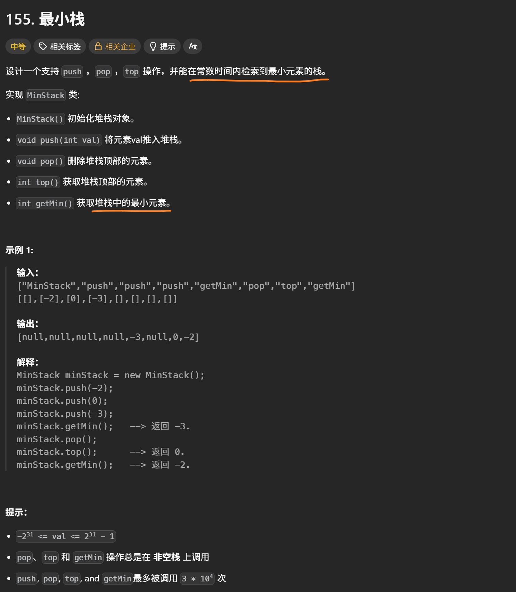

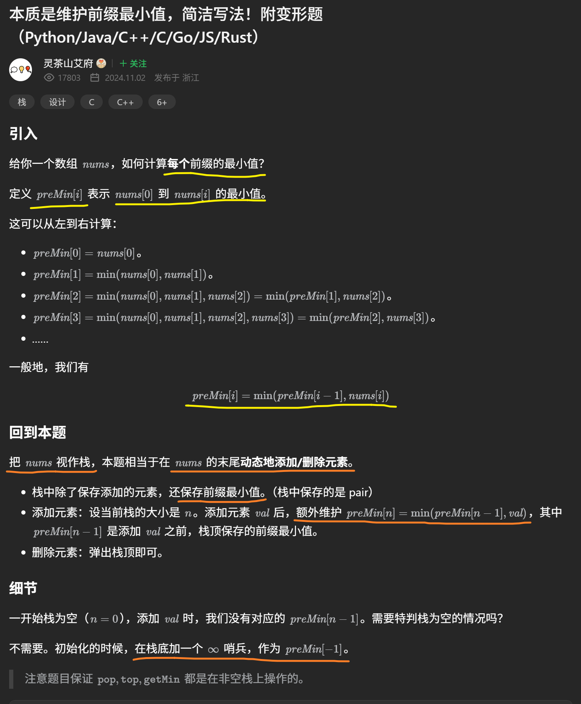


~~~C++
class MinStack {

    stack<pair<int, int>> st;

public:
    // åˆå§‹åŒ–
    MinStack() {
        // 添加栈底哨兵 INT_MAX
        // 这里的 0 写æˆä»»æ„数都å¯ä»¥ï¼Œå正用ä¸åˆ°
        st.emplace(0, INT_MAX); 
    }
    
    void push(int val) {
        st.emplace(val, min(getMin(), val)); // <val, å‰ç¼€æœ€å°å€¼>       
    }
    
    void pop() {
        st.pop();
    }
    
    int top() {
        return st.top().first;
    }
    
    // 最å°å€¼
    int getMin() {
        return st.top().second;        
    }
};

/**
 * Your MinStack object will be instantiated and called as such:
 * MinStack* obj = new MinStack();
 * obj->push(val);
 * obj->pop();
 * int param_3 = obj->top();
 * int param_4 = obj->getMin();
 */
~~~


时间å¤æ‚度：所有æ“作å‡ä¸º O(1)。
空间å¤æ‚度：O(q)。其中 q 是 push 调用的次数。最å情况下，åªæœ‰ push æ“ä½œï¼Œéœ€è¦ O(q) 的空间ä¿å­˜å…ƒç´ ã€‚


ACM

~~~C++
#include <iostream>
#include <stack>

using namespace std;

// 155 最å°æ ˆ

class MinStack 
{

    stack<pair<int, int>> st;

public:
    // åˆå§‹åŒ–
    MinStack() {
        // 添加栈底哨兵 INT_MAX
        // 这里的 0 写æˆä»»æ„数都å¯ä»¥ï¼Œå正用ä¸åˆ°
        st.emplace(0, INT_MAX); 
    }
    
    void push(int val) {
        st.emplace(val, min(getMin(), val)); // <val, å‰ç¼€æœ€å°å€¼>       
    }
    
    void pop() {
        st.pop();
    }
    
    int top() {
        return st.top().first; // val
    }
    
    // 最å°å€¼
    int getMin() {
        return st.top().second; // å‰ç¼€æœ€å°å€¼  
    }
};


int main()
{
    MinStack mt;
    mt.push(-2);
    mt.push(0);
    mt.push(-3);
    cout << "min: " << mt.getMin() << endl;
    mt.pop();
    cout << "st_top: " << mt.top() << endl;

    return 0;

}
~~~


## [394 字符串解ç ](https://leetcode.cn/problems/decode-string/description/?envType=study-plan-v2&envId=top-100-liked)

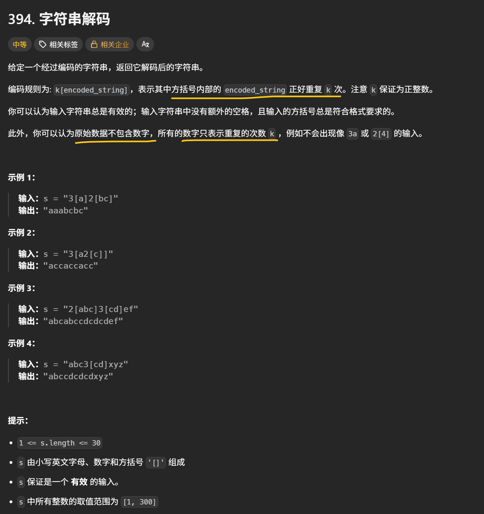

### 1ã€[两个栈](https://leetcode.cn/problems/decode-string/solutions/6274/ti-jie-czhan-by-youlookdeliciousc)

**主è¦æ€è·¯ï¼šä¸¤ä¸ªæ ˆå­˜å·¦æ‹¬å·å‰çš„数字，字符，é‡åˆ°å³æ‹¬å·çš„时候å–出æ¥æ‹¼æ¥**

举个例å­çœ‹å§	

~~~C++
class Solution {
public:
    string decodeString(string s) {
        
        int num = 0;
        stack<int> numStack;    // 存数字

        string res = "";
        stack<string> strStack; // 存字æ¯

        for (int i = 0; i < s.size(); i++)
        {
            // é‡åˆ°æ•°å­—，存在num
            if (s[i] >= '0' && s[i] <= '9') 
            {
                num = num * 10 + s[i] - '0';// 考虑数字å¯èƒ½ä¸åªæ˜¯ä¸ªä½æ•°ï¼Œæ¯”如150[a]
            }
            // å­—æ¯ç›´æ¥æ‹¼åˆ°res
            else if ((s[i] >= 'a' && s[i] <= 'z') || (s[i] >= 'A' && s[i] <= 'Z'))
            {
                res = res + s[i]; 
            }
            // é‡åˆ°'['，将 '[' å‰çš„数字放进numStack，字æ¯å­—符放入strStack
            else if (s[i] == '[') 
            {
                numStack.push(num);
                num = 0;
                strStack.push(res);
                res = "";
            }
            // é‡åˆ° ']' 开始处ç†è¿™ä¸€ç»„ [] 拼æ¥
            else 
            {
                int times = numStack.top(); // 拼æ¥å‡ æ¬¡res
                numStack.pop();

                for (int j = 0; j < times; j++)
                {
                    strStack.top() += res; // strStack顶的字符，拼æ¥res
                }

                res = strStack.top(); // 这里res就是暂时拼æ¥å®Œçš„这一组字符了
                strStack.pop();
            }
        }

        return res; 
    }
};
~~~


### 2ã€[递归](https://leetcode.cn/problems/decode-string/solutions/19447/decode-string-fu-zhu-zhan-fa-di-gui-fa-by-jyd)

å°† `[` å’Œ `]` 分别作为递归的开å¯ä¸ç»ˆæ­¢æ¡ä»¶

-  `s[i] == '['` 时，进入新一层递归，res拼æ¥æ–°å†…层å­ä¸²

-  `s[i] == ']'` 时，结æŸæœ¬å±‚递归，返å›res
- 普通字符直æ¥æ‹¼æ¥res
- éå†å®Œæ¯•åè¿”å› `res`


~~~C++
class Solution {
public:
    // 负责解ç ä»å½“å‰ index 开始的å­å­—符串
    string dfs(const string& s, int& index)
    {
        string res; 	// 当å‰å±‚解ç å的字符串
        int multi = 0;  // 记录数字，[]中的内容的é‡å¤æ¬¡æ•°

        while (index < s.size())
        {
			// 当å‰å­—符是数字，累计multi
            if (s[index] >= '0' && s[index] <= '9')
            {
                multi = multi * 10 + (s[index] - '0');
            }
            // é‡åˆ° [ 就进入递归，开始一个新的被é‡å¤çš„å­ä¸²
            else if (s[index] == '[') 
            {
                index++; // 跳过 [
                string tmp = dfs(s, index); // 递归解æ '[' 之å的内容
                while (multi--) res += tmp; // 拼æ¥è§£æ出的å­ä¸²ï¼Œé‡å¤æ‹¼æ¥multi次
                multi = 0;
            }
            else if (s[index] == ']') // é‡åˆ° ]，表示本次递归结æŸï¼Œè¿”å›å½“å‰æ‹¼æ¥ç»“æœ
            {
                return res;
            }
            else // s[i] == 普通字符
            {
                res += s[index]; // ç›´æ¥åŠ å…¥ç»“æœ
            }

            index++;            
        }

        return res;
    }


    string decodeString(string s) {
        int index = 0;
        return dfs(s, index);
        
    }
};
~~~


用 lambda

~~~C++
class Solution {
public:
    string decodeString(string s) {

        auto dfs = [&](this auto&& dfs, const string& s, int& index) ->string
        {
            string res;
            int multi = 0;
            while (index < s.size())
            {
                if (s[index] >= '0' && s[index] <= '9')
                {
                    multi = multi * 10 + (s[index] - '0');
                }
                else if (s[index] == '[')
                {
                    index++;
                    string tmp = dfs(s, index); // 递归解æ æ–°'['之å的内容
                    while (multi--) res += tmp; // 拼æ¥è§£æ出的å­ä¸²
                    multi = 0;
                }
                else if (s[index] == ']')
                {
                    return res;
                }
                else // 普通字符，直æ¥æ‹¼æ¥res
                {
                    res += s[index];
                }

                index++;
            }
            return res;
        };

        int index = 0;
        return dfs(s, index);
    }
};
~~~


### ACM

~~~C++
#include <iostream>
#include <vector>
#include <string>
#include <stack>
using namespace std;

// 394 字符串解ç 
// 输入：s = "3[a2[c]]"
// 输出："accaccacc"

string decodeString(string s) {
    
    int num = 0;
    stack<int> nums;    // 存数字
    string res = "";
    stack<string> strs; // 存字æ¯

    for (int i = 0; i < s.size(); i++)
    {
        // é‡åˆ°æ•°å­—，存在num
        if (s[i] >= '0' && s[i] <= '9') 
        {
            num = num * 10 + s[i] - '0';// 考虑数字å¯èƒ½ä¸åªæ˜¯ä¸ªä½æ•°ï¼Œæ¯”如150[a]
        }
        // å­—æ¯ç›´æ¥æ‹¼åˆ°res
        else if ((s[i] >= 'a' && s[i] <= 'z') || (s[i] >= 'A' && s[i] <= 'Z'))
        {
            res = res + s[i]; 
        }
        // é‡åˆ°'['，将 '[' å‰çš„数字放进nums栈，字æ¯å­—符放入strsæ ˆ
        else if (s[i] == '[') 
        {
            nums.push(num);
            num = 0;
            strs.push(res);
            res = "";
        }
        // é‡åˆ° ']' 开始处ç†è¿™ä¸€ç»„ [] 拼æ¥
        else 
        {
            int times = nums.top(); // 拼æ¥å‡ æ¬¡res
            nums.pop();
            for (int j = 0; j < times; j++)
            {
                strs.top() += res; // strs顶的字符，拼æ¥res
            }
            res = strs.top(); // 这里res就是暂时拼æ¥å®Œçš„这一组字符了
            strs.pop();
        }
    }
    return res; 
}

int main()
{
    string s = "3[a2[c]]";
    string ans = decodeString(s);
    cout << ans << endl;

    return 0;
}
~~~


## [739 æ¯æ—¥æ¸©åº¦](https://leetcode.cn/problems/daily-temperatures/description/?envType=study-plan-v2&envId=top-100-liked)

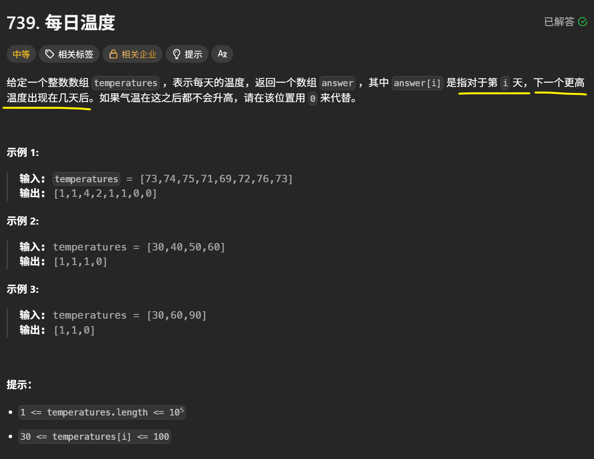

[çµç¥ å•è°ƒæ ˆ](https://www.bilibili.com/video/BV1VN411J7S7/?vd_source=7369d5f08520f2fc3601caee93963ffa)


### 1ã€ä»å³åˆ°å·¦

栈中记录下一个更大元素的「候选项ã€çš„下标。

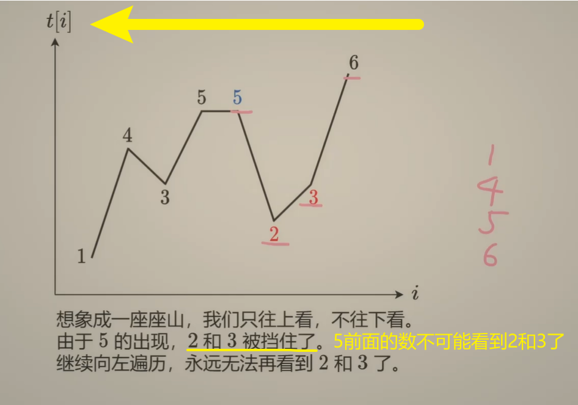

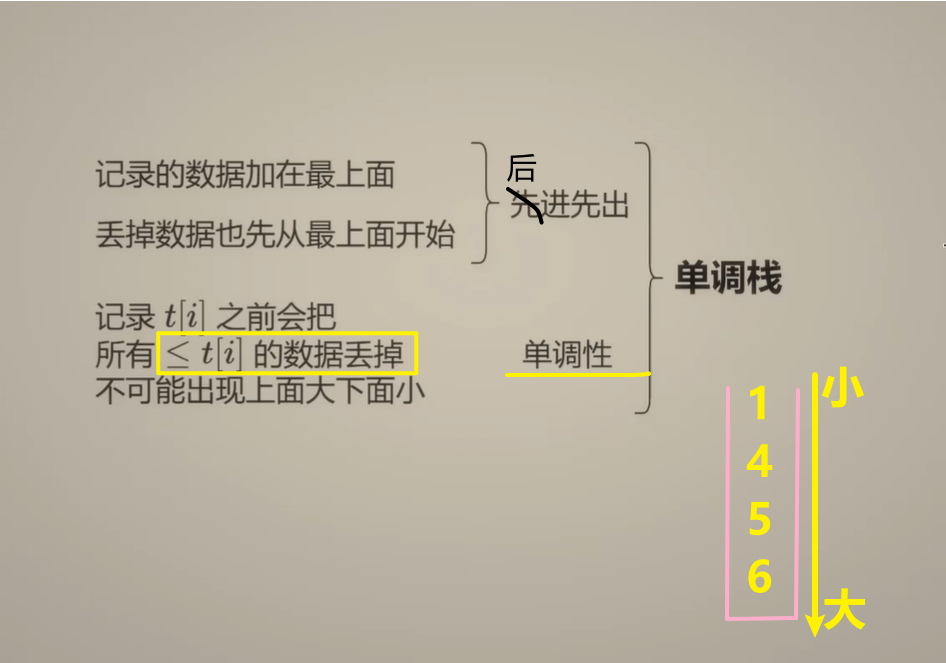

~~~C++
class Solution {
public:
    vector<int> dailyTemperatures(vector<int>& temperatures) {
        // temperatures = [73,74,75,71,69,72,76,73]

        int n = temperatures.size();
        vector<int> ans(n);
        stack<int> st; // 存的是下标

        // ä»å·¦åˆ°å³ç®—，栈顶到栈底递å¢
        for (int i = n - 1; i >= 0; i--)
        {
            int t = temperatures[i];

            // pop出栈里 å°äºå½“å‰æ¸©åº¦ t 的元素
            while (!st.empty() && t >= temperatures[st.top()]) 
            {
                st.pop();
            } 

            // 如æœæ­¤æ—¶ st ä¸ç©ºï¼Œst.top()å°±æ˜¯ç¬¬ä¸€ä¸ªå¤§äº t 的元素，收集下标差
            if (!st.empty()) 
            {
                ans[i] = st.top() - i;
            } // else 如æœæ­¤æ—¶ st ç©ºï¼Œè¯´æ˜ t åé¢æ²¡æœ‰å¤§äºå®ƒçš„元素，ä¿æŒåŸå§‹çš„ 0

            // æ ˆæ”¶é›†å½“å‰ t çš„åæ ‡
            st.push(i);
        }

        return ans;       
    }
};
~~~

时间å¤æ‚度：O(n)，其中 n 为 temperatures 的长度。虽然我们写了个二é‡å¾ªç¯ï¼Œä½†ç«™åœ¨æ¯ä¸ªå…ƒç´ çš„视角看，这个元素在二é‡å¾ªç¯ä¸­æœ€å¤šå…¥æ ˆå‡ºæ ˆå„一次，因此循ç¯æ¬¡æ•°ä¹‹å’Œæ˜¯ O(n)，所以时间å¤æ‚度是 O(n)。
空间å¤æ‚度：O(min(n,U))，其中 U=max(temperatures)−min(temperatures)+1。返å›å€¼ä¸è®¡å…¥ï¼Œä»…考虑栈的最大空间消耗。


### 2ã€ä»å·¦åˆ°å³

栈中记录还没算出下一个更大元素的那些数的下标。

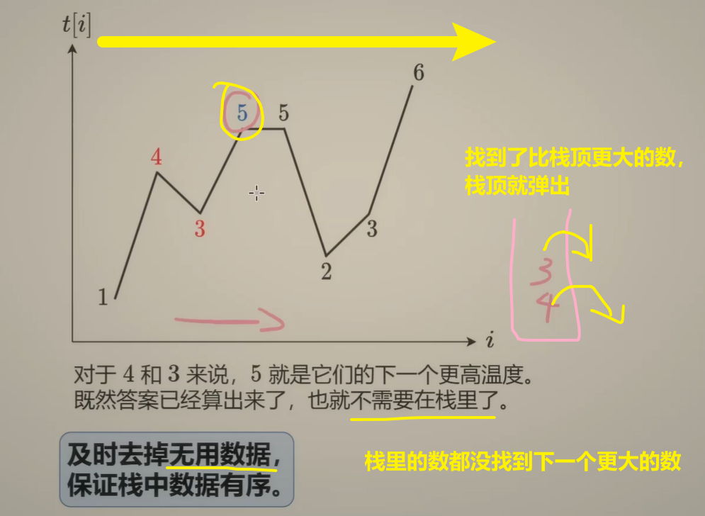

~~~C++
class Solution {
public:
    vector<int> dailyTemperatures(vector<int>& temperatures) {
        // temperatures = [73,74,75,71,69,72,76,73]

        int n = temperatures.size();
        vector<int> ans(n);
        stack<int> st; // 存的是下标 （没找到下一个最大值的数）

        // ä»å·¦å¾€å³ï¼Œæ ˆé¡¶åˆ°æ ˆåº•é€’å¢
        for (int i = 0; i < n; i++)
        {
            int t = temperatures[i];

            // å½“å‰ t 大äºæ ˆé¡¶ï¼Œé‚£ t 就是栈顶的下一个更大值
            while (!st.empty() && t > temperatures[st.top()])
            {
                int j = st.top();
                st.pop();
                ans[j] = i - j; // 注æ„这里收集的是栈顶那个元素对应的 ans[j]
            } 
            
            // t 入栈
            st.push(i);
        }

        return ans;       
    }
};
~~~

时间å¤æ‚度：O(*n*)，其中 *n* 为 *temperatures* 的长度。虽然我们写了个二é‡å¾ªç¯ï¼Œä½†ç«™åœ¨æ¯ä¸ªå…ƒç´ çš„视角看，这个元素在二é‡å¾ªç¯ä¸­æœ€å¤šå…¥æ ˆå‡ºæ ˆå„一次，因此循ç¯æ¬¡æ•°**之和**是 O(*n*)，所以时间å¤æ‚度是 O(*n*)。

空间å¤æ‚度：O(*n*)。注æ„è¿™ç§å†™æ³•æ ˆä¸­å¯ä»¥æœ‰é‡å¤å…ƒç´ ã€‚


### ACM

~~~C++
#include <iostream>
#include <vector>
#include <stack>
using namespace std;

// 739 æ¯æ—¥æ¸©åº¦

vector<int> dailyTemperatures(vector<int>& temperatures) 
{
    // temperatures = [73,74,75,71,69,72,76,73]  找对äºç¬¬ i 天，下一个更高温度出ç°åœ¨å‡ å¤©å

    int n = temperatures.size();
    vector<int> ans(n);
    stack<int> st; // 存的是下标 （没找到下一个最大值的数）

    // ä»å·¦å¾€å³ï¼Œæ ˆé¡¶åˆ°æ ˆåº•é€’å¢
    for (int i = 0; i < n; i++)
    {
        int t = temperatures[i];

        // å½“å‰ t 大äºæ ˆé¡¶ï¼Œé‚£ t 就是栈顶的下一个更大值
        while (!st.empty() && t > temperatures[st.top()])
        {
            int j = st.top();
            st.pop();
            ans[j] = i - j; // 注æ„这里收集的是栈顶那个元素对应的 ans[j]
        } 
        
        // t 入栈
        st.push(i);
    }

    return ans;       
}


int main()
{
    vector<int> temperatures = {73, 74, 75, 71, 69, 72, 76, 73};
    vector<int> ans = dailyTemperatures(temperatures); // 1 1 4 2 1 1 0 0 
    for (int val : ans)
    {
        cout << val << " ";
    }
    cout << endl;

    return 0;
}
~~~


## [84 柱状图中最大的矩形](https://leetcode.cn/problems/largest-rectangle-in-histogram/description/?envType=study-plan-v2&envId=top-100-liked)

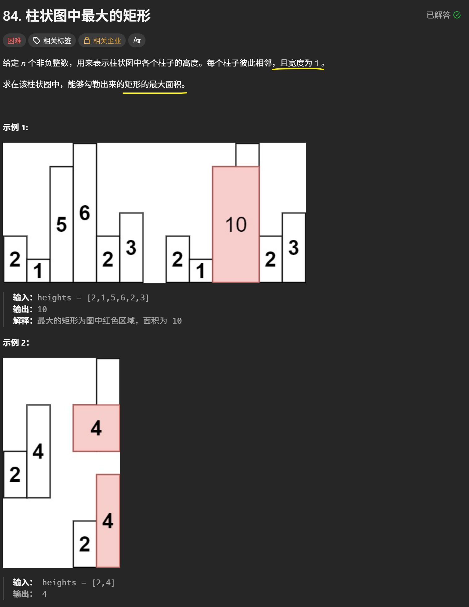

太乱了，想ä¸åˆ°ï¼Œä¸¾ä¾‹å­çœ‹å§


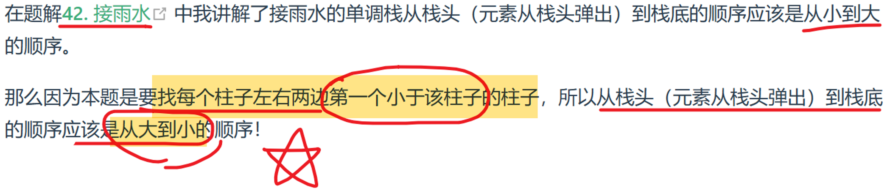

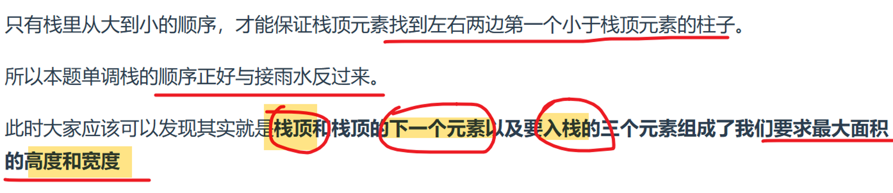


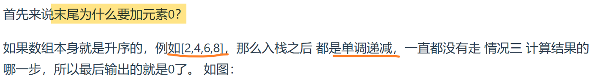

~~~C++
class Solution {
public:
    int largestRectangleArea(vector<int>& heights) {
        
        // 找当å‰æŸ±å­å·¦å³ç¬¬ä¸€ä¸ªæ¯”它å°çš„柱å­ä¸‹æ ‡
        // 计算当å‰æŸ±å­èƒ½æ‰©å±•çš„宽度，å†è®¡ç®—能扩展的é¢ç§¯ï¼Œéå†æ‰¾æœ€å¤§å€¼

        int result = 0;

        stack<int> st; // 栈里存éå†è¿‡çš„待计算é¢ç§¯çš„柱å­
        st.push(0);

        // heights 首尾都æ’å…¥0，为了ä¸ç©ºæ ˆï¼Œå¦‚æœå½“å‰æŸ±å­åªæœ‰è‡ªå·±ä¸€ä¸ªå®½åº¦çš„è¯ï¼Œä¹Ÿè¦èƒ½èµ°åˆ°è®¡ç®—é¢ç§¯é‚£é‡Œ
        heights.insert(heights.begin(), 0);
        heights.insert(heights.end(), 0);

        for (int i = 1; i < heights.size(); i++)
        {
            // heights[i] > 栈顶
            if (heights[i] > heights[st.top()]) 
            {
                st.push(i);
            }
            else if (heights[i] == heights[st.top()])   
            {
                st.pop(); // 也å¯ä»¥ä¸pop，多算一次0
                st.push(i);
            }
            else 
            {
                // heights[i] < 栈顶 é‡åˆ°æ¯”自己（栈顶）å°çš„，就说æ˜æ ˆé¡¶è¿™ä¸ªå…ƒç´ ä¸èƒ½å‘å³æ‰©å±•äº†
                while (!st.empty() && heights[i] < heights[st.top()])
                {
                    int cur = st.top(); // 栈顶，下é¢ç®—得是ã€æ ˆé¡¶å…ƒç´ çš„é¢ç§¯ã€‘
                    st.pop();

                    if (!st.empty())
                    {
                        int left = st.top();
                        int right = i;
                        int w = right - left - 1; // 当å‰æŸ±å­èƒ½æ‰©å±•çš„宽度
                        int h = heights[cur];     // 当å‰æŸ±å­çš„高度

                        result = max(result, h * w); // 更新为所有柱å­ä¸­èƒ½æ‰©å±•çš„é¢ç§¯æœ€å¤§å€¼
                    }
                }

                st.push(i);
            }
        }

        return result;
        
    }
};
~~~


# 堆 ✅

## 215 [数组中的第 K 个最大元素](https://leetcode.cn/problems/kth-largest-element-in-an-array/submissions/649625107/?envType=study-plan-v2&envId=top-100-liked)


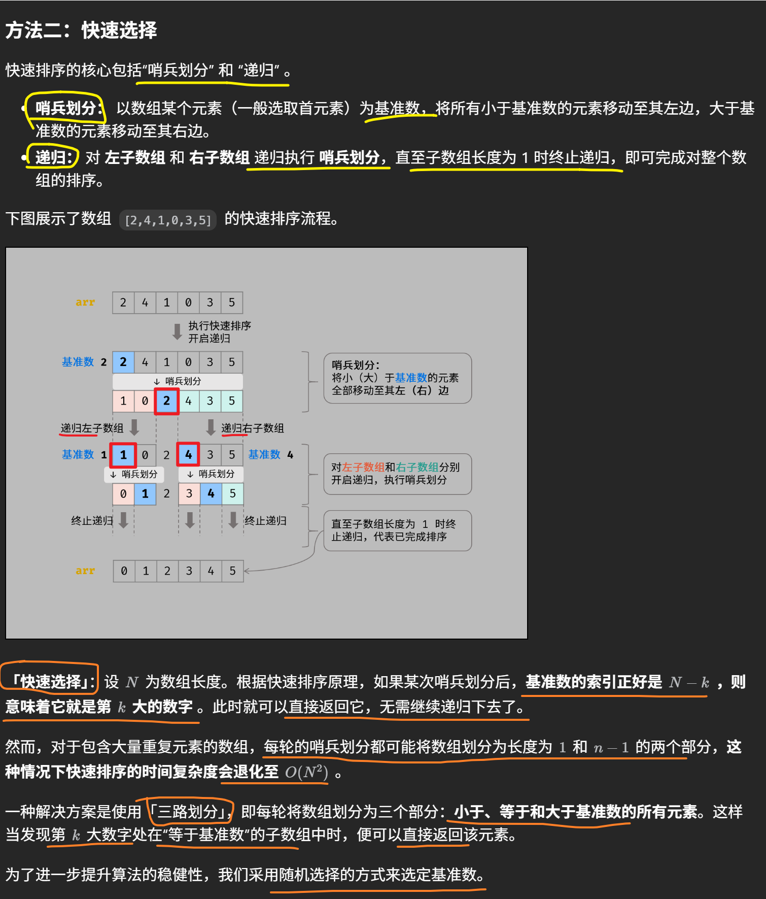

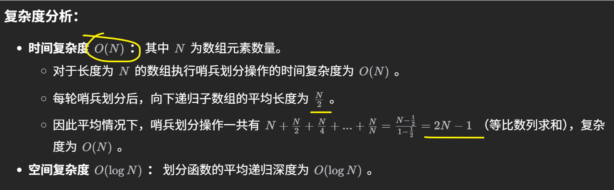


~~~C++
class Solution {
public:
    // 基äºå¿«æ’的快速选择
    int quickSelect(vector<int>& nums, int k)
    {        
        // éšæœºé€‰æ‹©åŸºå‡†æ•°å­—
        int p = nums[rand() % nums.size()];

        // 将大äºç­‰äºå°äºåŸºå‡†çš„元素，分别放入三个数组
        vector<int> big, equal, small;
        for (int a : nums)
        {
            if (a < p)      small.push_back(a);
            else if (a > p) big.push_back(a);
            else            equal.push_back(a);
        }

        // 第 k 大元素在big 中，按递归划分
        if (k <= big.size())    
        {
            return quickSelect(big, k);
        }

        // 第 k 大元素在 small 中，递归划分
        if (k > big.size() + equal.size())
        {
            return quickSelect(small, k - (big.size() + equal.size()));
            // 在small里é¢å°±æ˜¯ç¬¬ [k - (big.size() + equal.size())] 个大的元素
        }

        // 第 k 大元素在 equal 中，找到，返å›p
        return p;
    }


    int findKthLargest(vector<int>& nums, int k) {

        return quickSelect(nums, k);        
    }
};
~~~


ACM

~~~C++
#include <vector>
#include <iostream>
using namespace std;

// 215 数组中的第K个最大元素


// 基äºå¿«æ’的快速选择
int quickSelect(vector<int>& nums, int k)
{        
    // éšæœºé€‰æ‹©åŸºå‡†æ•°å­—
    int p = nums[rand() % nums.size()];

    // 将大äºç­‰äºå°äºåŸºå‡†çš„元素，分别放入三个数组
    vector<int> big, equal, small;
    for (int a : nums)
    {
        if (a < p)      small.push_back(a);
        else if (a > p) big.push_back(a);
        else            equal.push_back(a);
    }

    // 第 k 大元素在big 中，按递归划分
    if (k <= big.size())    
    {
        return quickSelect(big, k);
    }
    // 第 k 大元素在 small 中，递归划分
    if (k > big.size() + equal.size())
    {
        return quickSelect(small, k - (big.size() + equal.size()));
        // 在small里é¢å°±æ˜¯ç¬¬ [k - (big.size() + equal.size())] 个大的元素
    }

    // 第 k 大元素在 equal 中，找到，返å›p
    return p;
}


int main()
{
    vector<int> nums = {3,2,1,5,6,4};
    int k = 2;
    int ans = quickSelect(nums, k);
    cout << ans << endl;

    return 0;
}
~~~


## 347 [å‰ K 个高频元素](https://leetcode.cn/problems/top-k-frequent-elements/description/?envType=study-plan-v2&envId=top-100-liked)

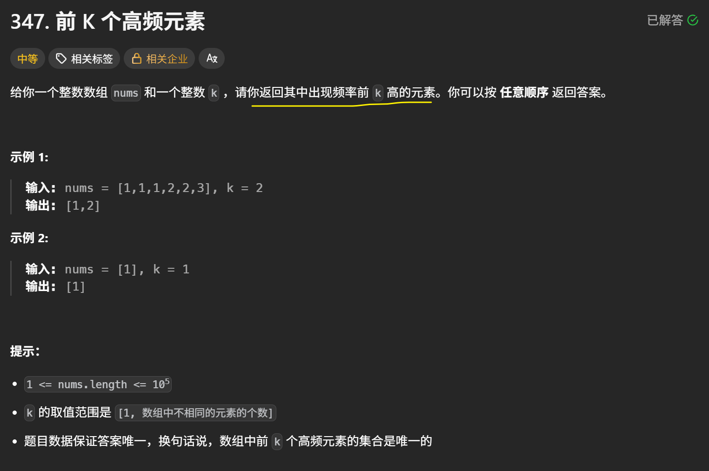


### å°é¡¶å †

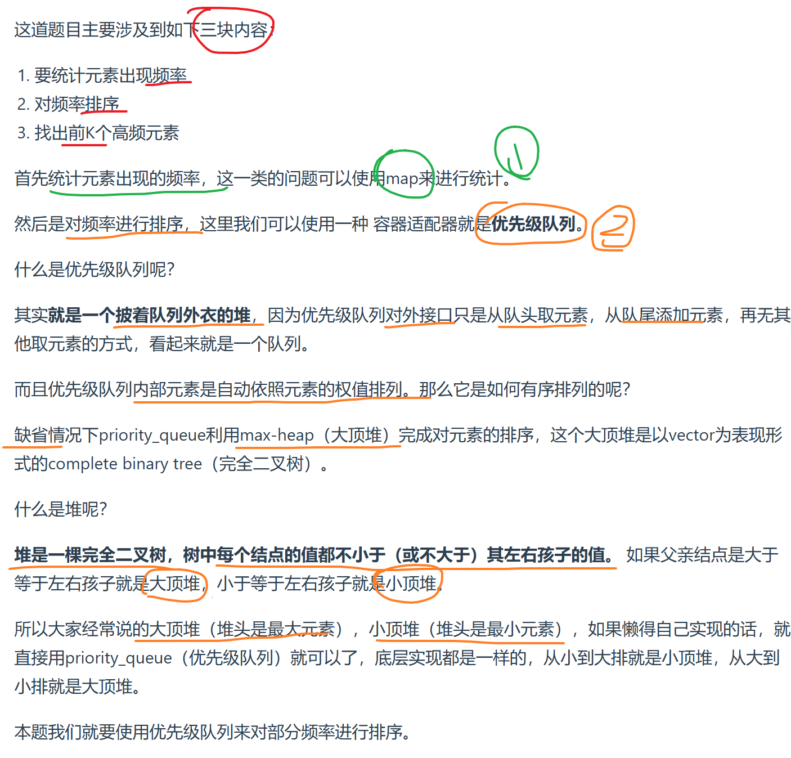

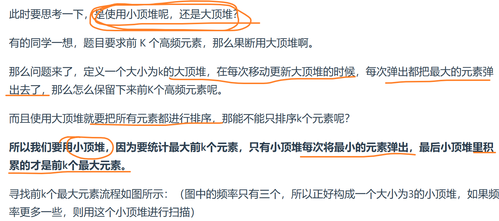

~~~C++	
class Solution {
public:
    // 三å—内容：
    // 1 统计元素出ç°çš„é¢‘ç‡  - map
    // 2 对频ç‡æ’åº         - 优先级队列（å°é¡¶å †ï¼‰
    // 3 æ‰¾å‡ºå‰ k 个高频元素 

    
    // å°é¡¶å †ï¼šä»¿å‡½æ•°æ”¹å˜ priority_queue æ’åº
    class mycomparison{
    public:
        bool operator() (const pair<int, int>& lhs, const pair<int, int>& rhs)
        {
            return lhs.second > rhs.second; // 次åºï¼Œè¾ƒå°çš„在top
        }
    };


    vector<int> topKFrequent(vector<int>& nums, int k) {

        // 1 统计元素出ç°é¢‘ç‡ <nums[i], 出ç°æ¬¡æ•°>
        unordered_map<int, int> cnt_map;
        for (int val : nums)
        {
            cnt_map[val]++;
        }

        // 2 对出ç°æ¬¡æ•°æ’åºï¼šå°é¡¶å † 大å°ä¸ºk
        priority_queue<pair<int, int>, vector<pair<int, int>>, mycomparison> pri_que;

        for (unordered_map<int, int>::iterator it = cnt_map.begin(); it != cnt_map.end(); it++)
        {
            pri_que.push(*it);
            // 如æœå †é‡Œçš„元素超过了k，弹出最å°å…ƒç´ ï¼Œå§‹ç»ˆä¿æŒå †é‡Œæ˜¯å‰k个最大次数
            if (pri_que.size() > k) pri_que.pop(); 
        }

        // 3 æ‰¾å‡ºå‰ k 个高频元素，就是留在pri_que中的k个
        vector<int> result(k);
        for (int i = k - 1; i >= 0; i--) // å°é¡¶å †å…ˆå¼¹å‡ºçš„是最å°çš„，所以倒ç€æ”¾å…¥result
        {
            result[i] = pri_que.top().first; // å–元素
            pri_que.pop();
        }


        return result;    
        
    }
};
~~~


### 桶æ’åº

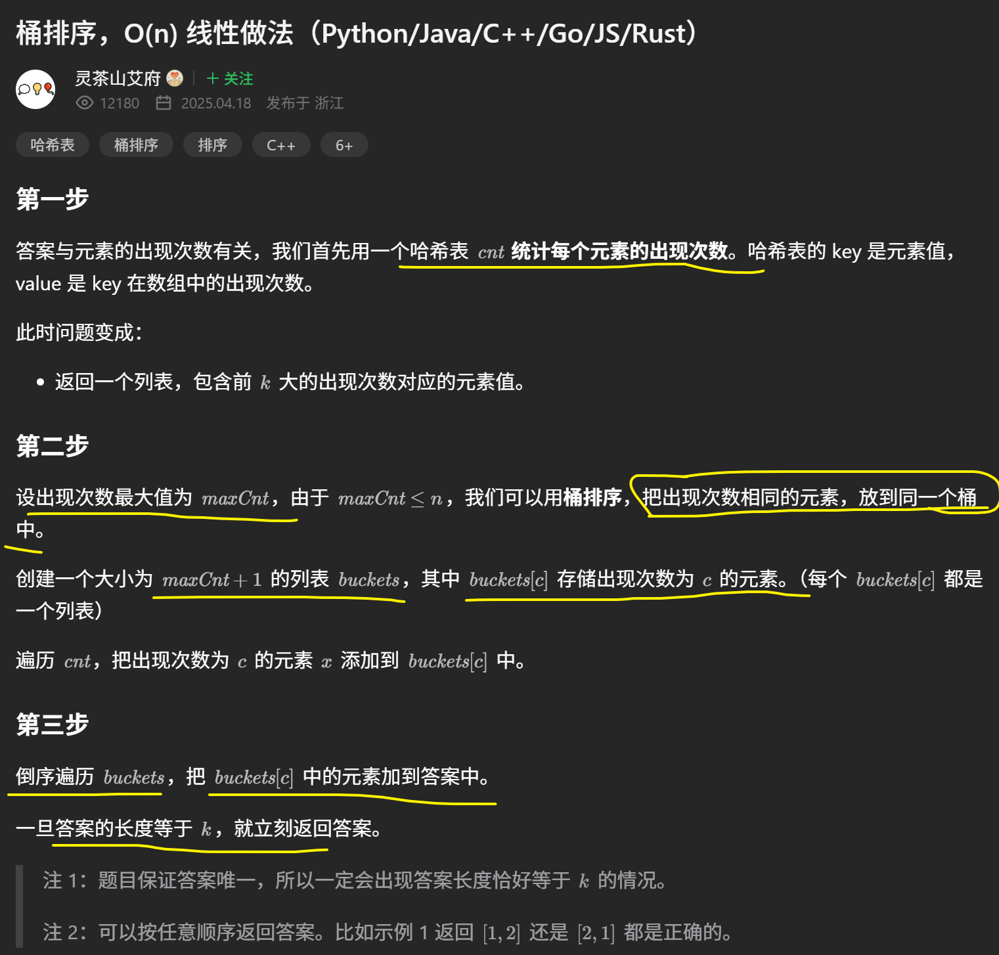

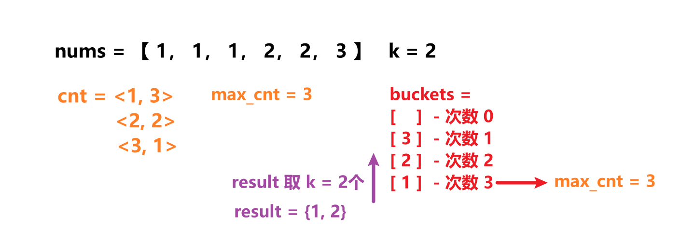

~~~C++	
class Solution {
public:
    vector<int> topKFrequent(vector<int>& nums, int k) {
        // 1 统计æ¯ä¸ªå…ƒç´ çš„出ç°æ¬¡æ•° map
        unordered_map<int, int> cnt;
        int max_cnt = 0;
        for (int x : nums)
        {
            cnt[x]++;
            max_cnt = max(max_cnt, cnt[x]); // 记录最大次数
        }
        
        // 2 把出ç°æ¬¡æ•°ç›¸åŒçš„元素，放进一个桶里
        vector<vector<int>> buckets(max_cnt + 1); 
        for (auto& [x, c] : cnt)
        {
            buckets[c].push_back(x); // 出ç°æ¬¡æ•°ä¸º c 的元素集åˆ

            // 这里用二维数组buckets 是为了比如：nums = [1,2] k = 2 è¿™ç§
        }


        // 3 倒åºéå†buckets，把出ç°æ¬¡æ•°å‰k的元素加入答案
        vector<int> ans;
        for (int i = max_cnt; i >= 0 && ans.size() < k; i--)
        {
            ans.insert(ans.end(), buckets[i].begin(), buckets[i].end());
        }

        return ans;
    }
};
~~~

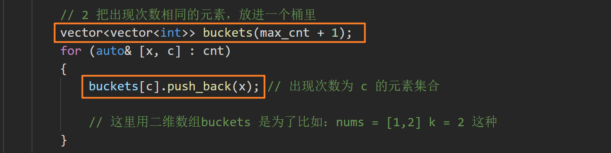

这里 `buckets` 需è¦ç”¨äºŒç»´æ•°ç»„，收集**次数相åŒçš„元素集åˆ**，比如 `nums = [1, 2]`  ，`k = 2` è¿™ç§æƒ…况：

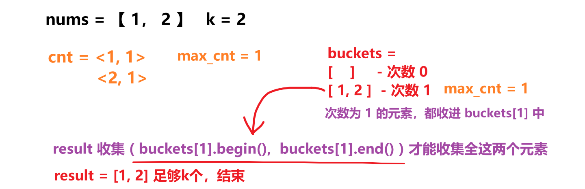


## 295 [æ•°æ®æµä¸­çš„中ä½æ•°](https://leetcode.cn/problems/find-median-from-data-stream/?envType=study-plan-v2&envId=top-100-liked)

@ 中ä½æ•° @ å°é¡¶å †

删除æ“作å¯ä»¥çœ‹ 480 滑动窗å£ä¸­ä½æ•°

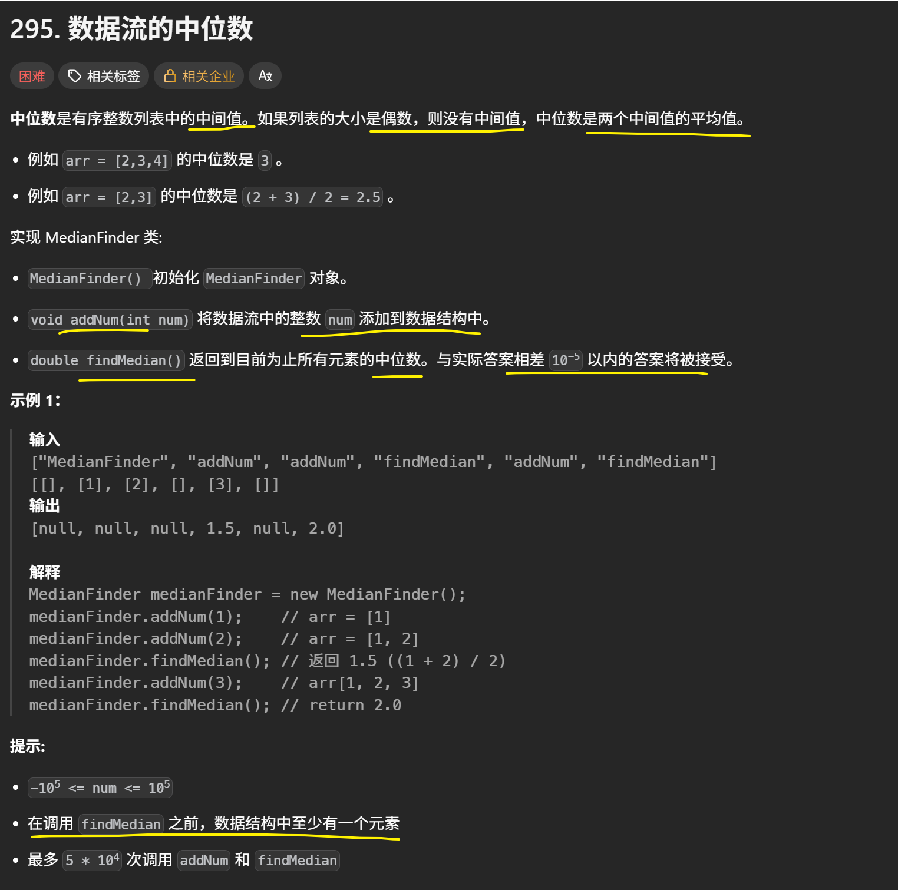

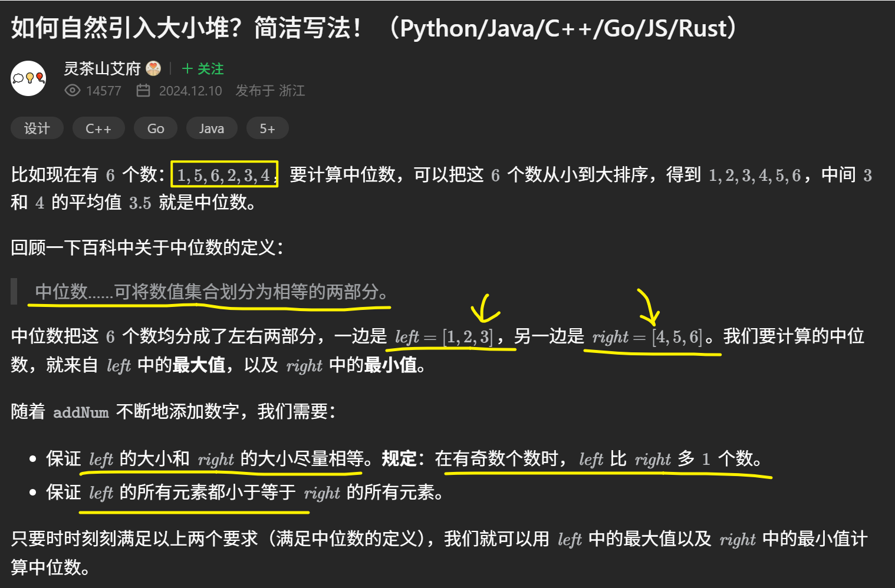

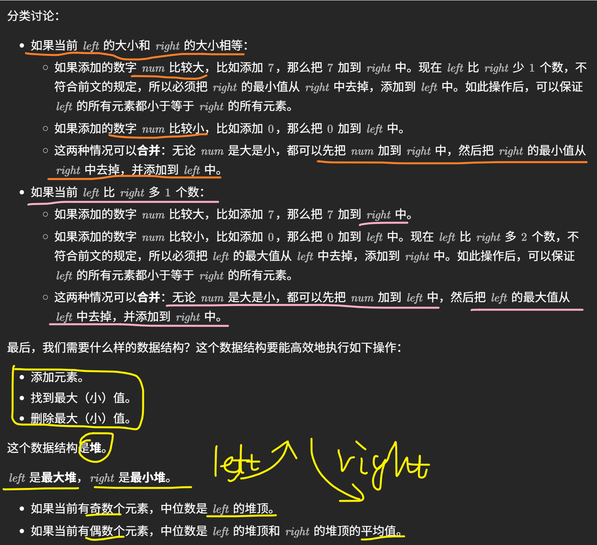


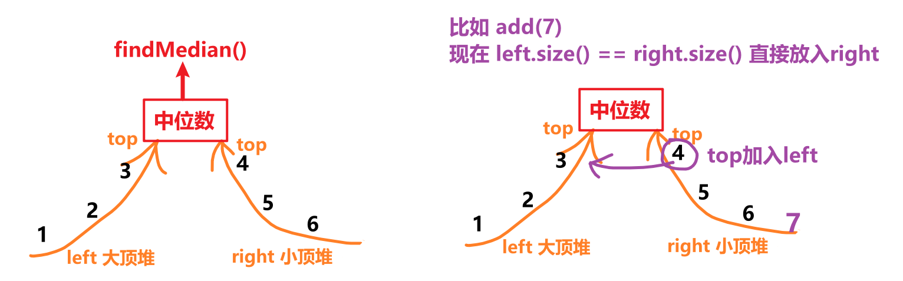

~~~C++
class MedianFinder {
    priority_queue<int> left; // 大顶堆（默认），存较å°çš„一åŠ
    priority_queue<int, vector<int>, greater<int>> right; // å°é¡¶å †ï¼Œå­˜è¾ƒå¤§çš„一åŠ
    
public:
    MedianFinder() {
        
    }
    
    void addNum(int num) {

        if (left.size() == right.size()) // 两边数é‡ç›¸ç­‰ï¼Œç›´æ¥åŠ å…¥å³è¾¹
        {
            right.push(num);
            left.push(right.top()); // å³è¾¹å¼¹å‡ºæ¥æœ€å°çš„一个，加入left
            right.pop();
        }
        else // 左边数é‡å¤šï¼Œç›´æ¥åŠ å…¥å·¦è¾¹ï¼Œå·¦è¾¹å¼¹å‡ºæ¥å†ç»™å³è¾¹
        {
            left.push(num);
            right.push(left.top()); // 左边弹出æ¥æœ€å¤§çš„一个，加入right
            left.pop();
        }        
    }
    
    double findMedian() {
        if (left.size() > right.size()) return left.top();
        else                            return (left.top() + right.top()) / 2.0;

    }
};

/**
 * Your MedianFinder object will be instantiated and called as such:
 * MedianFinder* obj = new MedianFinder();
 * obj->addNum(num);
 * double param_2 = obj->findMedian();
 */
~~~


ACM

~~~C++
#include <vector>
#include <queue>
#include <iostream>
using namespace std;

// 295 æ•°æ®æµçš„中ä½æ•°


class MedianFinder {
    priority_queue<int> left; // 大顶堆（默认），存较å°çš„一åŠ
    priority_queue<int, vector<int>, greater<int>> right; // å°é¡¶å †ï¼Œå­˜è¾ƒå¤§çš„一åŠ
    
public:
    MedianFinder() {}
    
    void addNum(int num) {

        if (left.size() == right.size()) // 两边数é‡ç›¸ç­‰ï¼Œç›´æ¥åŠ å…¥å³è¾¹
        {
            right.push(num);
            left.push(right.top()); // å³è¾¹å¼¹å‡ºæ¥æœ€å°çš„一个，加入left
            right.pop();
        }
        else // 左边数é‡å¤šï¼Œç›´æ¥åŠ å…¥å·¦è¾¹ï¼Œå·¦è¾¹å¼¹å‡ºæ¥å†ç»™å³è¾¹
        {
            left.push(num);
            right.push(left.top()); // 左边弹出æ¥æœ€å¤§çš„一个，加入right
            left.pop();
        }        
    }
    
    double findMedian() {
        if (left.size() > right.size()) return left.top();
        else                            return (left.top() + right.top()) / 2.0;

    }
};


int main()
{
    MedianFinder mymid;
    mymid.addNum(1);
    mymid.addNum(2);
    cout << mymid.findMedian() << endl;
    mymid.addNum(3);
    cout << mymid.findMedian() << endl;

    return 0;
}
~~~


# 贪心 ✅

## 121 [ä¹°å–股票的最佳时机](https://leetcode.cn/problems/best-time-to-buy-and-sell-stock/description/?envType=study-plan-v2&envId=top-100-liked)


### 贪心


~~~C++
class Solution {
public:
    int maxProfit(vector<int>& prices) {

        // prices[i] 股票第 i 天的价格
        int low = prices[0];
        int result = 0;
        for (int i = 0; i < prices.size(); i++)
        {
            low = min(low, prices[i]); // å–最左最å°ä»·æ ¼
            result = max(result, prices[i] - low); // ç›´æ¥å–最大差
        }

        return result;
    }
};
~~~


ACM 

~~~C++
#include <vector>
#include <iostream>
using namespace std;

// 121 ä¹°å–股票的最佳时机


int maxProfit(vector<int>& prices)  // prices[i] 股票第 i 天的价格
{ 
    int result = 0;
    int low = prices[0];
    
    for (int i = 0; i < prices.size(); i++)
    {
        low = min(low, prices[i]); // å–最左最å°ä»·æ ¼
        result = max(result, prices[i] - low); // ç›´æ¥å–最大差
    }
    return result;
    
}


int main()
{
    vector<int> prices = {7, 1, 5, 3, 6, 4};
    int result = maxProfit(prices);
    cout << result << endl;

    return 0;
}
~~~


### 动规


~~~C++
class Solution {
public:
    int maxProfit(vector<int>& prices) {

        int len = prices.size();

        // dp[i][0] - 第i天æŒæœ‰è‚¡ç¥¨æ‰€å¾—最多ç°é‡‘   
        // dp[i][1] - 第i天ä¸æŒæœ‰è‚¡ç¥¨æ‰€å¾—最多ç°é‡‘
        vector<vector<int>> dp(len, vector<int>(2, 0));

        dp[0][0] = -prices[0];
        dp[0][1] = 0;

        for (int i = 1; i < prices.size(); i++)
        {
            dp[i][0] = max(dp[i - 1][0], -prices[i]);
            dp[i][1] = max(dp[i - 1][1], dp[i - 1][0] + prices[i]);
        }

        return dp[len - 1][1]; // 一定是最åä¸æŒæœ‰ï¼Œé’±å¤š   
    }
};
~~~

时间å¤æ‚度：O(n)

空间å¤æ‚度：O(n)


**优化空间å¤æ‚度**


## [55 跳跃游æˆ](https://leetcode.cn/problems/jump-game/description/?envType=study-plan-v2&envId=top-100-liked)


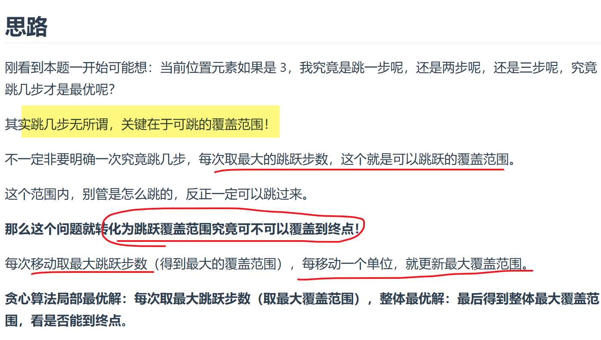

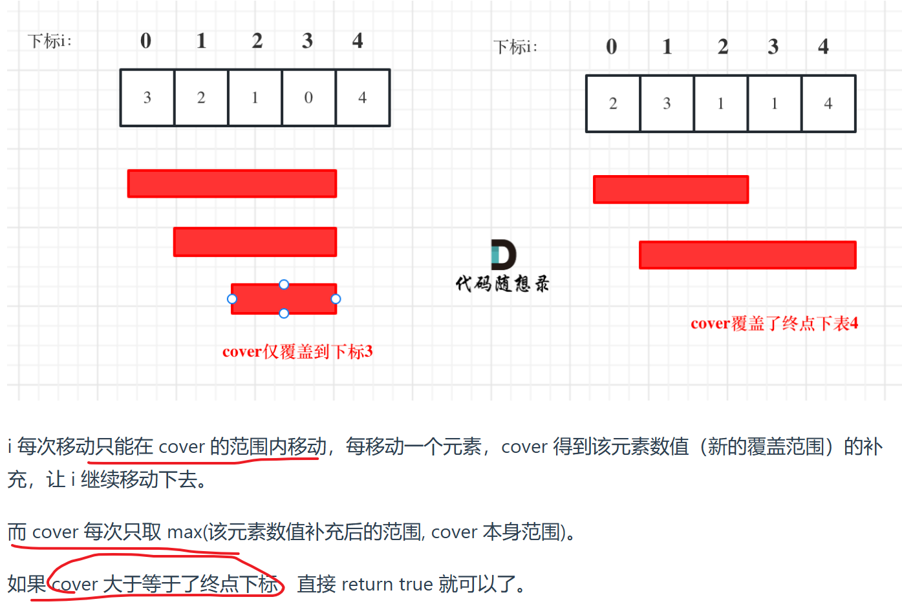

~~~C++
class Solution {
public:
    bool canJump(vector<int>& nums) {

        // 转æ¢ä¸ºè·³è·ƒèŒƒå›´èƒ½å¦è¦†ç›–到终点
        
        if (nums.size() == 1)   return true;

        int cover = 0; // 最å³è¾¹ç•Œ
        for (int i = 0; i <= cover; i++)  // 注æ„是在cover里往åå–
        {
            cover = max(i + nums[i], cover); // 更新最大覆盖范围（最大å³è¾¹ç•Œï¼‰
            if (cover >= nums.size() - 1) // 覆盖到终点了，返å›true
            {
                return true; 
            }  
        }

        return false;       
    }
};
~~~


ACM

~~~C++
#include <vector>
#include <iostream>
using namespace std;

// 55 跳跃游æˆ

bool canJump(vector<int>& nums)
{
    if (nums.size() == 1) return true;

    int cover = 0;
    for (int i = 0; i <= cover; i++)
    {
        cover = max(cover, i + nums[i]); // 更新最大覆盖范围
        if (cover >= nums.size() - 1)   return true;
    }

    return false;
}


int main()
{
    vector<int> nums = {2, 3, 1, 1, 4};
    bool ans = canJump(nums);
    cout << (ans ? "true" : "false") << endl;

    return 0;
}
~~~


## 45 跳跃游æˆII


在 55 的基础上求最å°è·³è·ƒæ¬¡æ•°

题目ä¿è¯å¯ä»¥è·³åˆ°æœ€å，也就是以最å°çš„步数，å¢åŠ è¦†ç›–范围，直到终点。

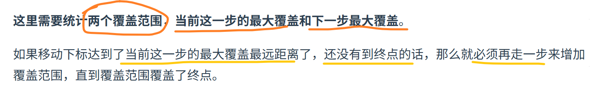


覆盖范围已ç»èƒ½åˆ°ç»ˆç‚¹äº†ï¼Œæœ€å¤šä¸¤æ­¥è‚¯å®šèƒ½è·³åˆ°ç»ˆç‚¹ï¼Œ**ä¸ç”¨æ±‚具体æ€ä¹ˆè·³**。

移动下标达到了当å‰è¦†ç›–的最远è·ç¦»ä¸‹æ ‡æ—¶ï¼Œ**如æœæ²¡è¦†ç›–终点，步数就è¦åŠ ä¸€**，æ¥å¢åŠ è¦†ç›–è·ç¦»ï¼Œå†èµ°ä¸‹ä¸€ä¸ªçš„最大覆盖范围。

所以就是求**更新了几次覆盖范围**。

~~~C++
class Solution {
public:
    int jump(vector<int>& nums) {

        // 求更新几次覆盖范围

        if (nums.size() == 1)   return 0;

        int ans = 0; // 记录跳跃次数（更新几次覆盖范围）

        int curDistance = 0;  // 当å‰æœ€è¿œè¦†ç›–的下标
        int nextDistance = 0; // 下一步最远覆盖的下标

        for (int i = 0; i < nums.size(); i++)
        {
            nextDistance = max(nextDistance, i + nums[i]);

            // i å·²ç»èµ°åˆ°äº†å½“å‰èƒ½èµ°çš„最远ä½ç½®ï¼Œå¿…é¡»è¦å†èµ°ä¸€æ­¥äº†
            if (i == curDistance) 
            {
                ans++; // 跳跃次数 + 1 (更新覆盖范围次数 + 1)
                curDistance = nextDistance; // 更新当å‰è¦†ç›–

                // 更新完curå·²ç»èƒ½è¦†ç›–了，这次的步数也加上了，ä¸ç”¨å†è·³ä¸‹ä¸€æ¬¡ï¼Œç›´æ¥ç»“æŸ
                if (curDistance >= nums.size() - 1) break; 
            }
        }

        return ans;        
    }
};
~~~


ACM

~~~C++
#include <vector>
#include <iostream>
using namespace std;

// 45 è·³è·ƒæ¸¸æˆ II (最å°è·³è·ƒæ¬¡æ•°)

int jumpCount(vector<int>& nums)
{
    if (nums.size() == 1)   return 0;

    int ans = 0;
    int curDistance = 0;
    int nextDistance = 0;

    for (int i = 0; i < nums.size(); i++)
    {
        nextDistance = max(nextDistance, i + nums[i]);

        if (i == curDistance)
        {
            ans++;
            curDistance = nextDistance;

            if (curDistance >= nums.size() - 1) break;
        }
    }

    return ans;
}


int main()
{
    vector<int> nums = {2, 3, 1, 1, 4};
    int ans = jumpCount(nums);
    cout << ans << endl;

    return 0;
}
~~~


## [763 划分字æ¯åŒºé—´](https://leetcode.cn/problems/partition-labels/description/?envType=study-plan-v2&envId=top-100-liked)


**找æ¯ä¸ªå­—æ¯çš„最远出ç°çš„下标，分割**


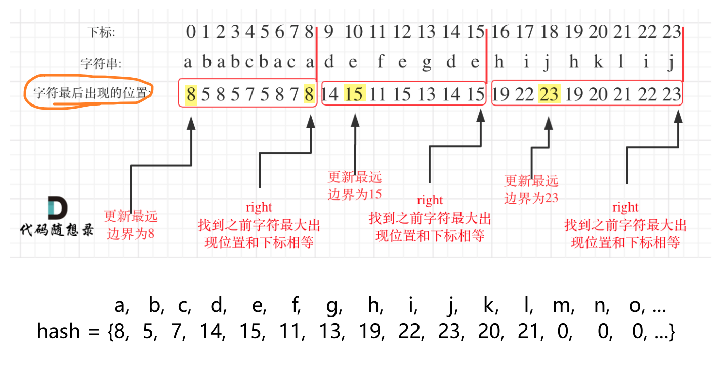

~~~C++
class Solution {
public:
    vector<int> partitionLabels(string s) {

        // 统计æ¯ä¸ªå­—æ¯çš„下标

        // hash[i] - æ¯ä¸ªå­—æ¯æœ€å出ç°çš„ä½ç½®
        int hash[27] = {0};
        for (int i = 0; i < s.size(); i++) // éå†s，i 是 s 中的下标
        {
            hash[s[i] - 'a'] = i; // 存的内容是 s 中的下标
        }

        //  ç›´æ¥ç”¨ASCIIç , 
        //  hash[s[0] - 'a'] = hash['a' - 'a'] = hash[0] 最å更新为 8，å³a最远下标是8 

        //  hash[0] = 8 --- a  
        //  hash[1] = 5 --- b
        //  hash[2] = 7 --- c
        //  hash[3] = 14 -- d
        //  ...
        
        //          a, b, c, d,  e,  f,  g,  h,  i,  j,  k,  l,  m, n, o, ...
        //  hash = {8, 5, 7, 14, 15, 11, 13, 19, 22, 23, 20, 21, 0, 0, 0, ...}

        vector<int> result;
        int left = 0;
        int right = 0;
        for (int i = 0; i < s.size(); i++) // éå†çš„还是 s
        {
            right = max(right, hash[s[i] - 'a']); // 始终是i之å‰å­—æ¯æœ€è¿œè¾¹ç•Œä¸­çš„最大值

            if (i == right) // i 正好走到了 i 之å‰æ‰€æœ‰å­—æ¯ä¸­çš„最远下标
            {
                result.push_back(right - left + 1); // 收集该è·ç¦»
                left = i + 1; // 更新left，开始下一组
            }
        }

        return result;

    }
};
~~~


ACM

~~~C++
#include <vector>
#include <iostream>
#include <string>
using namespace std;


vector<int> partitionLabels(string s) {
    // 统计æ¯ä¸ªå­—æ¯çš„下标
    // hash[i] - æ¯ä¸ªå­—æ¯æœ€å出ç°çš„ä½ç½®
    int hash[27] = {0};
    for (int i = 0; i < s.size(); i++) // éå†s，i 是 s 中的下标
    {
        hash[s[i] - 'a'] = i; // 存的内容是 s 中的下标
    }
    //  ç›´æ¥ç”¨ASCIIç , 
    //  hash[s[0] - 'a'] = hash['a' - 'a'] = hash[0] 最å更新为 8，å³a最远下标是8 
    //  hash[0] = 8 --- a  
    //  hash[1] = 5 --- b
    //  hash[2] = 7 --- c
    //  hash[3] = 14 -- d
    //  ...
    
    //          a, b, c, d,  e,  f,  g,  h,  i,  j,  k,  l,  m, n, o, ...
    //  hash = {8, 5, 7, 14, 15, 11, 13, 19, 22, 23, 20, 21, 0, 0, 0, ...}


    vector<int> result;

    int left = 0;
    int right = 0;
    for (int i = 0; i < s.size(); i++) // éå†çš„还是 s
    {
        right = max(right, hash[s[i] - 'a']); // 始终是i之å‰å­—æ¯æœ€è¿œè¾¹ç•Œä¸­çš„最大值

        if (i == right) // i 正好走到了 i 之å‰æ‰€æœ‰å­—æ¯ä¸­çš„最远下标
        {
            result.push_back(right - left + 1); // 收集该è·ç¦»
            left = i + 1; // 更新left，开始下一组
        }
    }
 

    return result;
}


int main()
{
    string s = "ababcbacadefegdehijhklij";
    vector<int> result = partitionLabels(s);

    for (int val : result)
    {
        cout << val << " "; // 9 7 8
    }
    cout << endl;

    return 0;
}
~~~


# 动æ€è§„划 ✅

@ 背包   @ æ‰“å®¶åŠ«èˆ   @ 股票  @ å­åºåˆ—å­æ•°ç»„ 

## 70 [爬楼梯](https://leetcode.cn/problems/climbing-stairs/description/?envType=study-plan-v2&envId=top-100-liked)


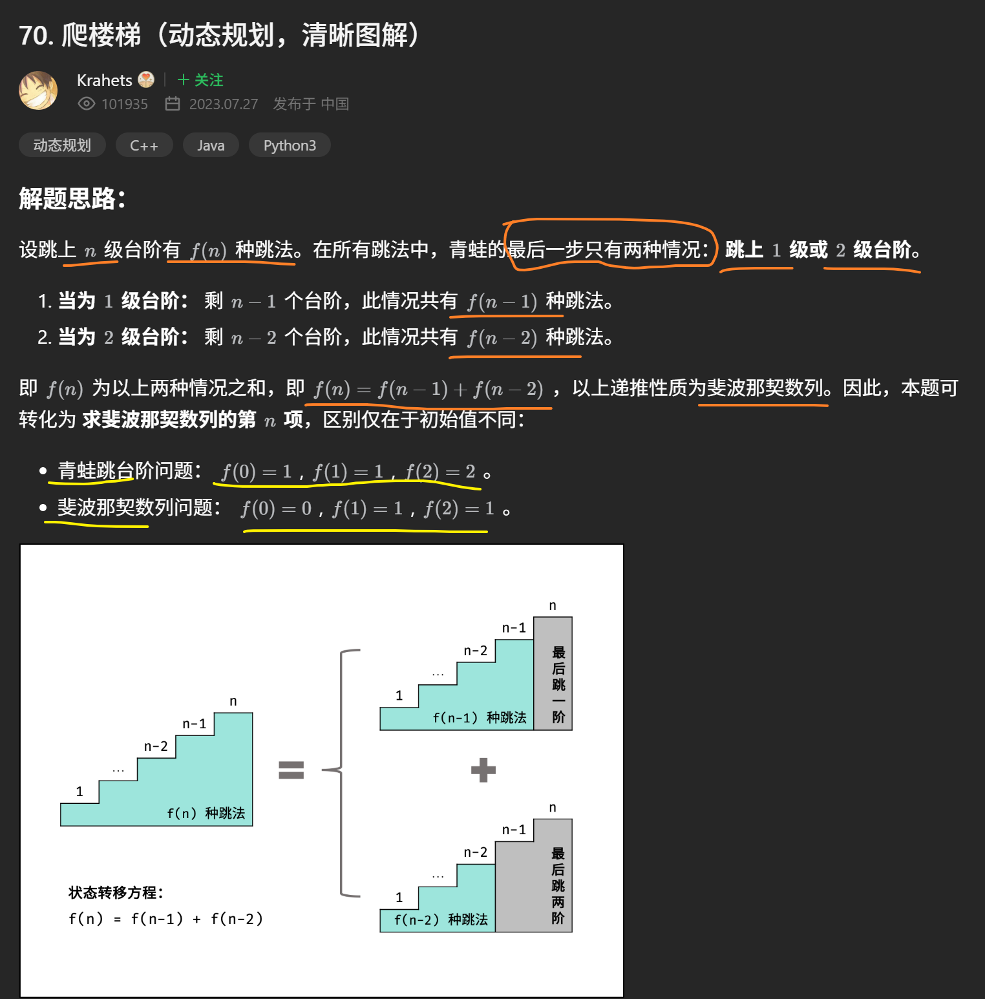


~~~C++
class Solution {
public:
    int climbStairs(int n) {
        
        if (n <= 1) return n;
        
        vector<int> dp(n + 1); // dp[i] 爬到第i个å°é˜¶ï¼Œæœ‰å¤šå°‘ç§æ–¹æ³•

        dp[1] = 1;
        dp[2] = 2;

        for (int i = 3; i <= n; i++)
        {
            dp[i] = dp[i - 1] + dp[i - 2];
        }

        return dp[n];
        
    }
};
~~~

时间å¤æ‚度 O(n)


优化：dp[3]

~~~C++
class Solution {
public:
    int climbStairs(int n) {
        
        if (n <= 1) return n;
        
        int dp[3]; // åªç»´æŠ¤3个

        dp[1] = 1;
        dp[2] = 2;

        for (int i = 3; i <= n; i++)
        {
            int sum = dp[1] + dp[2];
            dp[1] = dp[2];
            dp[2] = sum;
        }

        return dp[2];
        
    }
};
~~~

时间å¤æ‚度 O(n) ： 计算 f(n) éœ€å¾ªç¯ n 次，æ¯è½®å¾ªç¯å†…计算æ“作使用 O(1) 。
空间å¤æ‚度 O(1) ： 几个标志å˜é‡ä½¿ç”¨å¸¸æ•°å¤§å°çš„é¢å¤–空间。


ACM

~~~C++
#include <iostream>
#include <vector>
using namespace std;


// 70 爬楼梯

int climbStairs(int n) {
    
    if (n <= 1) return n;
    
    vector<int> dp(n + 1); // dp[i] 爬到第i个å°é˜¶ï¼Œæœ‰å¤šå°‘ç§æ–¹æ³•

    dp[1] = 1;
    dp[2] = 2;

    for (int i = 3; i <= n; i++)
    {
        dp[i] = dp[i - 1] + dp[i - 2];
    }

    return dp[n];
    
}

int main()
{
    int n = 3;
    int ans = climbStairs(n);
    cout << ans << endl;

    return 0;
}
~~~


## 118 [æ¨è¾‰ä¸‰è§’](https://leetcode.cn/problems/pascals-triangle/description/?envType=study-plan-v2&envId=top-100-liked)

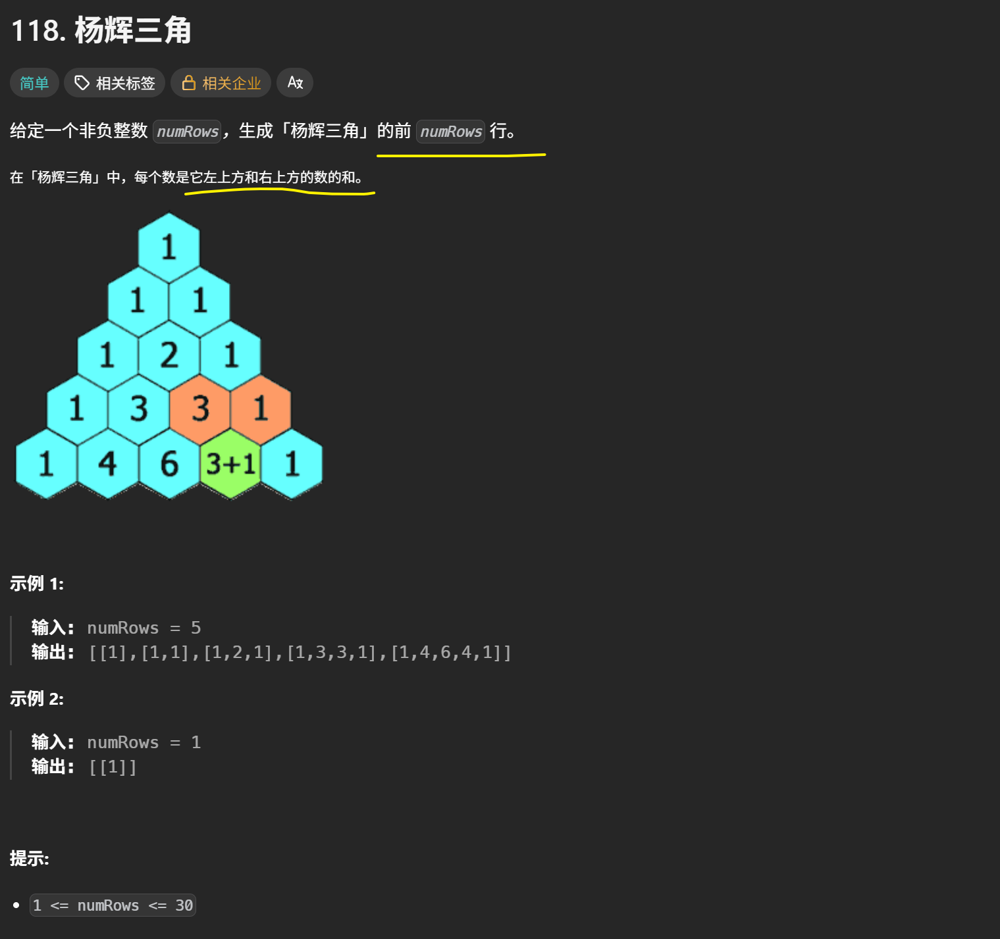

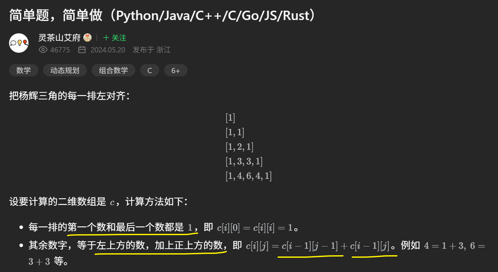

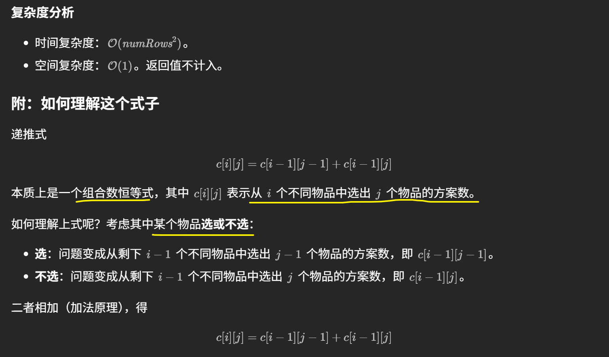

~~~C++
class Solution {
public:
    vector<vector<int>> generate(int numRows) {    
        // [1]
        // [1, 1]
        // [1, 2, 1]
        // [1, 3, 3, 1]
        // [1, 4, 6, 4, 1]

        vector<vector<int>> c(numRows);
        for (int i = 0; i < numRows; i++)
        {
            c[i].resize(i + 1, 1); // 第i行有i+1个数，æ¯ä¸€è¡Œèµ·å§‹éƒ½æ˜¯1
            for (int j = 1; j < i; j++) 
            {
                // 左上方的数 + å³ä¸Šæ–¹çš„æ•°
                c[i][j] = c[i - 1][j - 1] + c[i - 1][j];
            }
        }

        return c;        
    }
};
~~~


ACM

~~~C++
#include <vector>
#include <iostream>
using namespace std;

// 118 æ¨è¾‰ä¸‰è§’

// [1]
// [1, 1]
// [1, 2, 1]
// [1, 3, 3, 1]
// [1, 4, 6, 4, 1]

vector<vector<int>> generate(int numRows)
{
    vector<vector<int>> c(numRows);
    
    for (int i = 0; i < numRows; i++)
    {
        c[i].resize(i + 1, 1);

        for (int j = 1; j < i; j++)
        {
            c[i][j] = c[i - 1][j - 1] + c[i - 1][j];
        }
    }

    return c;
}


int main()
{
    int numRows = 5;
    vector<vector<int>> ans = generate(numRows);
    for (int i = 0; i < ans.size(); i++)
    {
        for (int val : ans[i])  cout << val << " ";
        cout << endl;
    }
    
    return 0;
}
~~~


## 198 [打家劫èˆ](https://leetcode.cn/problems/house-robber/description/?envType=study-plan-v2&envId=top-100-liked)


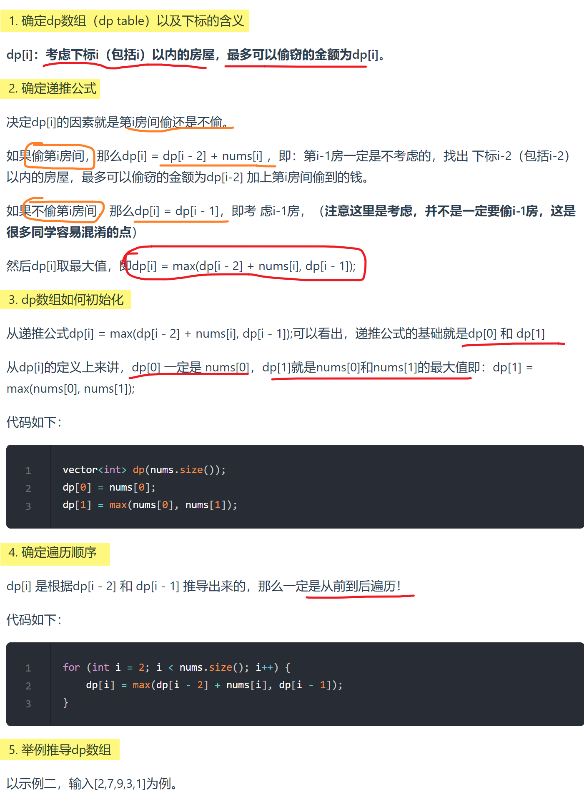

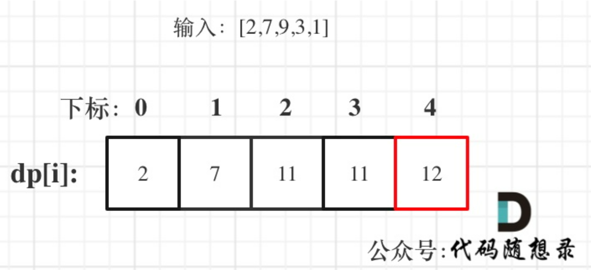

~~~C++
class Solution {
public:
    int rob(vector<int>& nums) {

        if (nums.size() == 0)   return 0;
        if (nums.size() == 1)   return nums[0];

        // dp[i]: 考虑下标i（包括i）以内的房屋，最多å¯ä»¥å·çªƒçš„金é¢ä¸ºdp[i]
        vector<int> dp(nums.size());

        dp[0] = nums[0];
        dp[1] = max(nums[0], nums[1]);

        for (int i = 2; i < nums.size(); i++)
        {
            // 决定dp[i]çš„å› ç´  -- 第ié—´å·è¿˜æ˜¯ä¸å·
            dp[i] = max(dp[i - 2] + nums[i], // å·ç¬¬ié—´
                        dp[i - 1]); // ä¸å·ç¬¬ié—´
        }

        return dp[nums.size() - 1];        
    }
};
~~~


ACM

~~~C++
#include <vector>
#include <iostream>
using namespace std;

// 198 打家劫èˆ

int rob(vector<int>& nums)
{
    if (nums.size() == 0)   return 0;
    if (nums.size() == 1)   return nums[0];

    // dp[i]: 考虑下标i（包括i）以内的房屋，最多å¯ä»¥å·çªƒçš„金é¢ä¸ºdp[i]
    vector<int> dp(nums.size());

    dp[0] = nums[0];
    dp[1] = max(nums[0], nums[1]);

    for (int i = 2; i < nums.size(); i++)
    {
        // 决定dp[i]çš„å› ç´  -- 第ié—´å·è¿˜æ˜¯ä¸å·
        dp[i] = max(dp[i - 2] + nums[i], // å·ç¬¬ié—´
                    dp[i - 1]); // ä¸å·ç¬¬ié—´
    }

    return dp[nums.size() - 1];        
}


int main()
{
    vector<int> nums = {1, 2, 3, 1};
    int ans = rob(nums);
    cout << ans << endl;

    return 0;
}
~~~


## 279 [完全平方数](https://leetcode.cn/problems/perfect-squares/description/?envType=study-plan-v2&envId=top-100-liked)

@完全背包


~~~C++
class Solution {
public:
    int numSquares(int n) {

        // dp[j] 和为j的完全平方数的最少数é‡ä¸ºdp[j]
        vector<uint64_t>  dp(n + 1, INT_MAX);

        dp[0] = 0;

        for (int i = 0; i * i <= n; i++) // 先物å“（完全平方数 1,4,9,...）
        {
            for (int j = i * i; j <= n; j++) // å背包
            {
                dp[j] = min(dp[j], dp[j - i * i] + 1); 
            }
        }

        return dp[n];        
    }
};
~~~


`uint64_t` 是 C++ 标准库中定义的 **æ— ç¬¦å· 64 ä½æ•´æ•°ç±»å‹**，定义在头文件 `<cstdint>` 或 `<stdint.h>` 中。其å–值范围为：

~~~C++
0 ~ 2^64 - 1 ï¼ˆå³ 0 ~ 18,446,744,073,709,551,615）
~~~

为什么 `dp` è¦ä½¿ç”¨ `uint64_t`？**防止整å‹æº¢å‡º**。

~~~C++
vector<uint64_t>  dp(n + 1, INT_MAX);
~~~

 `dp` 数组åˆå§‹åŒ–时，æ¯ä¸ªå…ƒç´ éƒ½è¢«è®¾ä¸º `INT_MAX`，而 `INT_MAX` 是一个 `int` ç±»å‹çš„最大值，å³ï¼š

~~~C++
INT_MAX = 2,147,483,647
~~~

å续这行代ç å¯èƒ½å¯¼è‡´æº¢å‡º:

~~~C++
dp[j] = min(dp[j], dp[j - i * i] + 1);
~~~

这里 `dp[j - i * i]` çš„åˆå§‹å€¼å¯èƒ½æ˜¯ `INT_MAX`，如æœä½ å†åŠ ä¸Š `1`，就å¯èƒ½å‘生溢出：

~~~C++
INT_MAX + 1 ==> 溢出为负数（int ç±»å‹ï¼‰
~~~

å¦‚æœ `dp` 数组是 `int` ç±»å‹ï¼Œ`dp[j - i*i] + 1` 这一步å¯èƒ½å˜æˆè´Ÿå€¼ï¼Œä»è€Œä½¿ `dp[j]` 得到错误的最å°å€¼ï¼ˆå˜æˆè´Ÿæ•°çš„结æœå‚ä¸ `min()` 比较），导致最终答案错误。

而使用 `uint64_t`（更大范围的无符å·æ•´å‹ï¼‰èƒ½æœ‰æ•ˆé¿å…这个溢出问题。


如æœç›´æ¥ç”¨`int`ç±»å‹ï¼Œéœ€è¦åŠ åˆ¤æ–­ï¼š

~~~C++
vector<int> dp(n + 1, INT_MAX);
// .......
if (dp[j - i * i] != INT_MAX)
    dp[j] = min(dp[j], dp[j - i * i] + 1);
~~~

使用 `uint64_t` 就相当äºè§„é¿äº†è¿™ä¸ªåˆ¤æ–­é€»è¾‘，程åºæ›´ç®€æ´ï¼Œ**以空间æ¢æ—¶é—´/逻辑å¤æ‚度**。


ACM 

~~~C++
#include <iostream>
#include <vector>
using namespace std;

// 279 完全平方数


int numSquares(int n) {
    // dp[j] 和为j的完全平方数的最少数é‡ä¸ºdp[j]
    vector<uint64_t>  dp(n + 1, INT_MAX);
    dp[0] = 0;

    for (int i = 0; i * i <= n; i++) // 先物å“（完全平方数 1,4,9,...）
    {
        for (int j = i * i; j <= n; j++) // å背包
        {
            dp[j] = min(dp[j], dp[j - i * i] + 1); 
        }
    }

    return dp[n];        
}

int main()
{
    int n = 13;
    int ans = numSquares(n);
    cout << ans << endl;

}
~~~


## 322 é›¶é’±å…‘æ¢ 

@ 完全背包


**物å“——硬å¸ï¼›èƒŒåŒ…é‡é‡â€”—总金é¢ï¼›å®Œå…¨èƒŒåŒ…——硬å¸æ— é™**

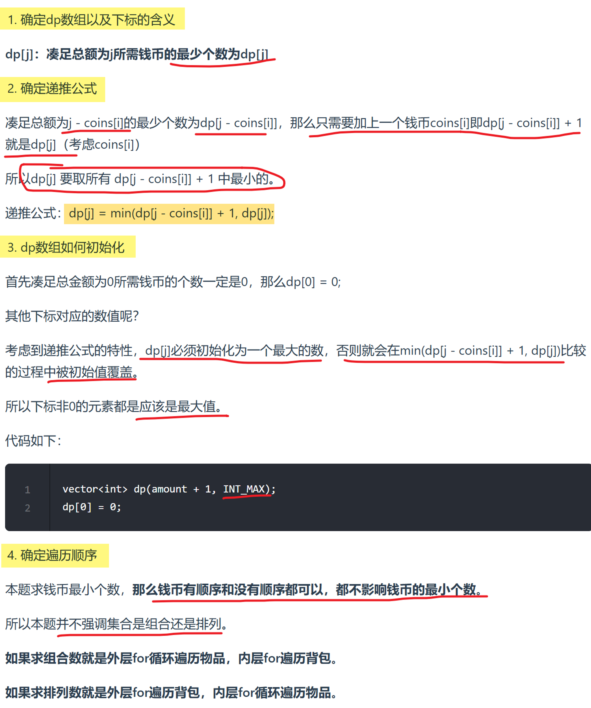


~~~C++
class Solution {
public:
    int coinChange(vector<int>& coins, int amount) {

        // dp[j] 凑足总é¢ä¸º j，所需最少硬å¸ä¸ªæ•°ä¸º dp[j]
        vector<int> dp(amount + 1, INT_MAX);
        dp[0] = 0;

        // 先物å“，å背包（å¯è°ƒæ¢ï¼‰
        for (int i = 0; i < coins.size(); i++)
        {
            for (int j = coins[i]; j <= amount; j++) // 完全背包，正åº
            {
                if (dp[j - coins[i]] != INT_MAX)// 如æœdp[j - coins[i]是åˆå§‹å€¼ï¼Œè·³è¿‡
                {
                    dp[j] = min(dp[j], dp[j - coins[i]] + 1);
                }
            }
        }

        if (dp[amount] == INT_MAX)  return -1; // 没有组åˆ

        return dp[amount];
        
    }
};
~~~


## 139 å•è¯æ‹†åˆ†

@完全背包


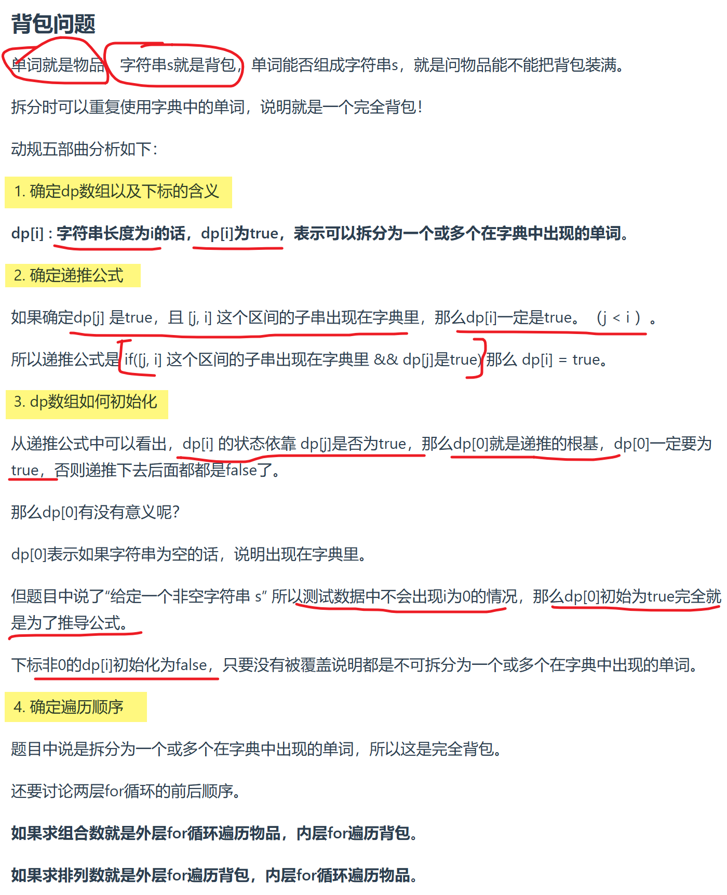

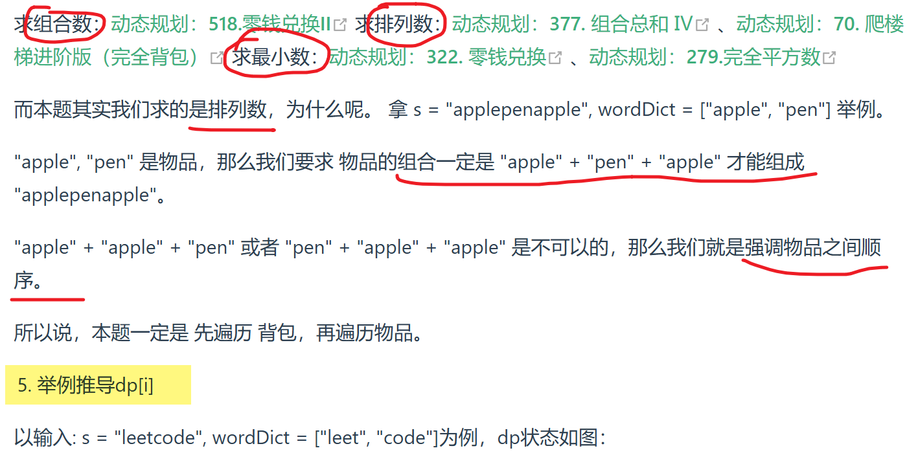

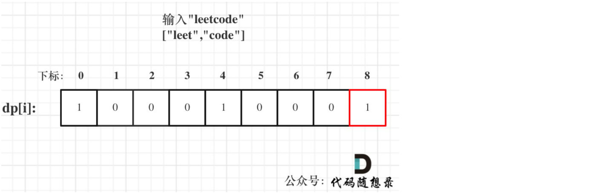


~~~C++
class Solution {
public:
    bool wordBreak(string s, vector<string>& wordDict) {

        // 字典wordDict 转为set
        unordered_set<string> wordSet(wordDict.begin(), wordDict.end());

        // dp[j] - 字符串长度为j ( s的[0, j-1]部分 )，dp[j]为true
        vector<bool> dp(s.size() + 1, false);
        dp[0] = true; // æ— æ„义，纯为了递æ¨


        // æ’列(组æˆs的字符串是有顺åºçš„) - 先背包，å物å“
        for (int j = 1; j <= s.size(); j++)
        {
            for (int i = 0; i < j; i++)
            {
                string word = s.substr(i, j - i); // 截å–s[i, j-1] 

                // [i, j-1]在字典里，且dp[i]，也就是[0, i-1]部分是true => [0, j-1] true
                if (wordSet.find(word) != wordSet.end() && dp[i])   dp[j] = true;
            }
        }

        return dp[s.size()];      
    }
};
~~~


## 300 [最长递å¢å­åºåˆ—](https://leetcode.cn/problems/longest-increasing-subsequence/description/)

@ å­åºåˆ— dp


~~~C++
class Solution {
public:
    int lengthOfLIS(vector<int>& nums) {

        if (nums.size() <= 1)   return nums.size();

        // dp[i] - 以nums[i]结尾的最长递å¢å­åºåˆ—的长度
        vector<int> dp(nums.size(), 1);

        int result = 0;
        for (int i = 1; i < nums.size(); i++) // 以nums[i]结尾
        {
            for (int j = 0; j < i; j++) // j ä» 0 到 i-1
            {
                if(nums[i] > nums[j])   dp[i] = max(dp[i], dp[j] + 1);
            }

            if (dp[i] > result) result = dp[i]; // å–dp最大值
                                                // 注æ„最大值ä¸ä¸€å®šæ˜¯dp[最å一个]
        }

        return result;
    }
};
~~~


## 152 [乘积最大å­æ•°ç»„](https://leetcode.cn/problems/maximum-product-subarray/description/?envType=study-plan-v2&envId=top-100-liked)

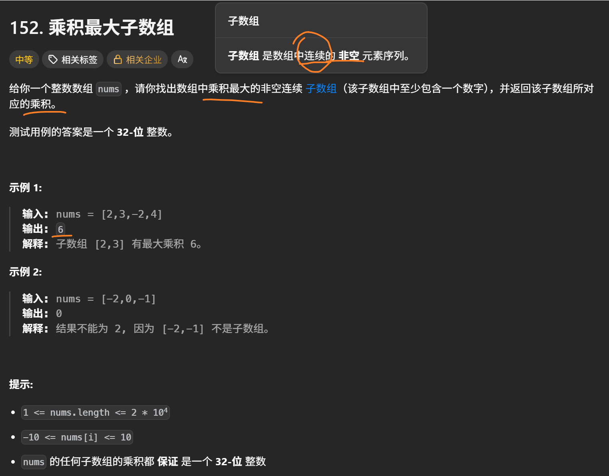

ä¾æ—§æ˜¯çµç¥

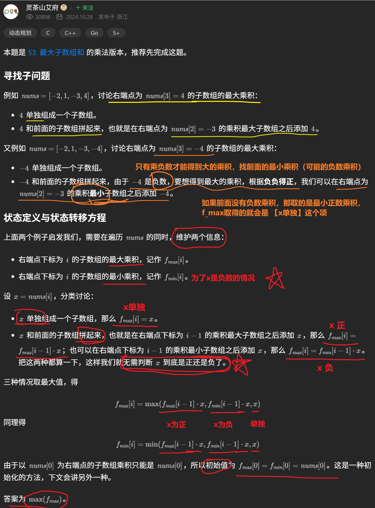

~~~C++
class Solution {
public:
    int maxProduct(vector<int>& nums) {

        int n = nums.size();

        // 以nums[i]结尾的å­æ•°ç»„的最大乘积，最å°ä¹˜ç§¯
        vector<int> f_max(n), f_min(n);

        f_max[0] = nums[0];
        f_min[0] = nums[0];

        for (int i = 1; i < n; i++)
        {
            int x = nums[i];
            // ã€xå•ç‹¬ã€‘  ã€ä»¥nums[i-1]结尾的最大乘积 * x】  ã€æœ€å°ä¹˜ç§¯ * x】
            f_max[i] = max({x, f_max[i - 1] * x, f_min[i - 1] * x});
            f_min[i] = min({x, f_max[i - 1] * x, f_min[i - 1] * x});
        }

        return ranges::max(f_max); // ranges 里的max函数，直æ¥å–容器最大值
        
    }
};
~~~

- 时间å¤æ‚度：O(n)，其中 n 是 nums 的长度。
- 空间å¤æ‚度：O(n)。


**空间优化（看看）**

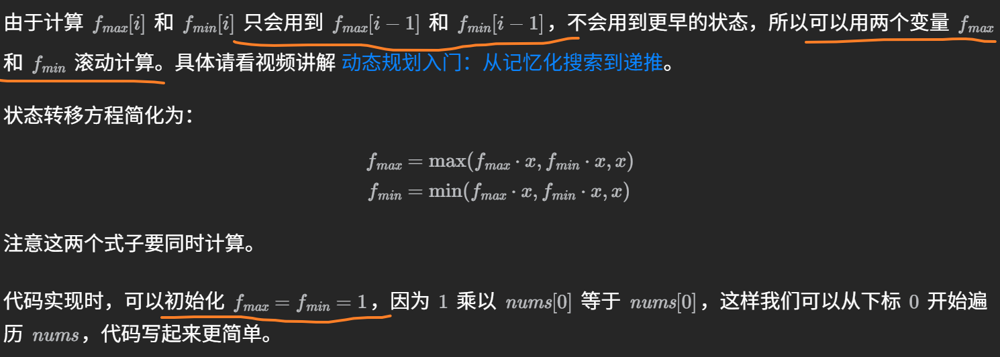

~~~C++
class Solution {
public:
    int maxProduct(vector<int>& nums) {

        int ans = INT_MIN; // 注æ„å¯èƒ½æœ‰è´Ÿæ•°

        int f_max = 1, f_min = 1; // åªç”¨ä¸¤ä¸ªå˜é‡ï¼Œæ»šåŠ¨è®¡ç®—
        for (int x : nums)
        {
            int mx = f_max; // 记一下åŸæ¥çš„f_max，è¦ä¸ç„¶ä¸‹ä¸€æ­¥å°±è¢«èµ‹å€¼æ–°çš„数了
            f_max = max({f_max * x, f_min * x, x});
            f_min = min({mx * x, f_min * x, x});
            
            ans = max(ans, f_max); // 更新最大乘积
        }

        return ans;
    }
};
~~~

- 时间å¤æ‚度：O(*n*)，其中 *n* 是 *nums* 的长度。
- 空间å¤æ‚度：O(1)。


## 416 [分割等和å­é›†](https://leetcode.cn/problems/partition-equal-subset-sum/?envType=study-plan-v2&envId=top-100-liked)

@ 01背包


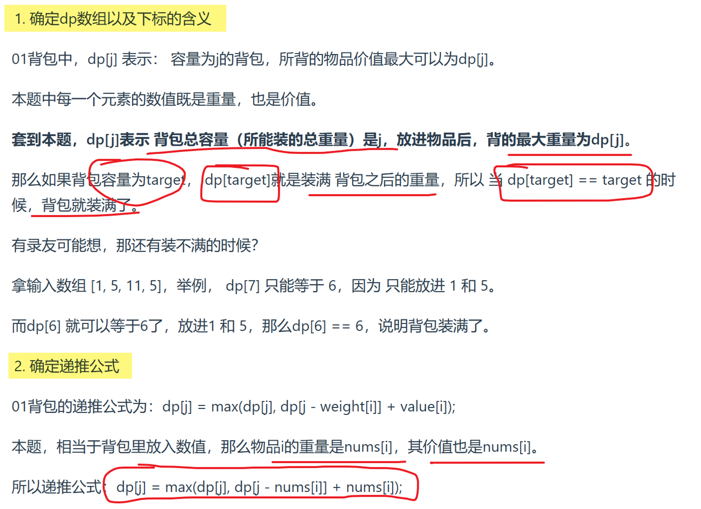


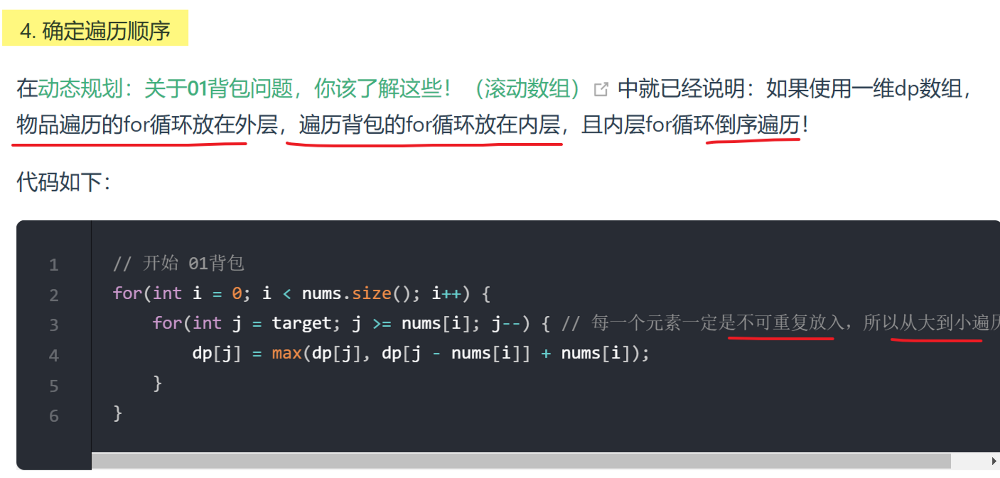


**注æ„：物å“çš„é‡é‡å’Œä»·å€¼éƒ½æ˜¯ã€å…ƒç´ æ•°å€¼ã€‘**

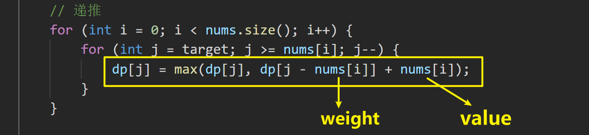

~~~C++
class Solution {
public:
    bool canPartition(vector<int>& nums) {

        int sum = 0;

        // 注æ„：物å“çš„é‡é‡å’Œä»·å€¼éƒ½æ˜¯ã€å…ƒç´ æ•°å€¼ã€‘

        // 背包的体积为 sum/2  -- 对应物å“çš„é‡é‡æ˜¯ 元素数值
        // 物å“的价值也是 元素数值

        // dp[j] 背包容é‡(能装的总é‡é‡)是j，放进物å“å背包的最大é‡é‡ä¸ºdp[j]
        vector<int> dp(10001, 0);

        for (int i = 0; i < nums.size(); i++)
        {
            sum += nums[i];
        }
        if (sum % 2 == 1)   return false;
        int target = sum / 2; // 找dp[target] == target

        // 递æ¨å¡«è¡¥dp
        for (int i = 0; i < nums.size(); i++) // 先物å“
        {
            for (int j = target; j >= nums[i]; j--) // å背包，ä»å¤§åˆ°å°
            {
                dp[j] = max(dp[j], dp[j - nums[i]] + nums[i]);
            }
        }

        // sum/2体积的背包，正好装了sum/2é‡é‡
        if (dp[target] == target)   return true; 
        
        return false;
    }
};
~~~


ACM

~~~C++
#include <vector>
#include <iostream>
using namespace std;

// 416 分割等和å­é›†ï¼ˆ01背包）


bool canPartition(vector<int>& nums) {
    int sum = 0;
    // 注æ„：物å“çš„é‡é‡å’Œä»·å€¼éƒ½æ˜¯ã€å…ƒç´ æ•°å€¼ã€‘

    // 背包的体积为 sum/2  -- 对应物å“çš„é‡é‡æ˜¯ 元素数值
    // 物å“的价值也是 元素数值

    // dp[j] 背包容é‡(能装的总é‡é‡)是j，放进物å“å背包的最大é‡é‡ä¸ºdp[j]
    vector<int> dp(10001, 0);

    for (int i = 0; i < nums.size(); i++)
    {
        sum += nums[i];
    }
    if (sum % 2 == 1)   return false;
    int target = sum / 2; // 找dp[target] == target


    // 递æ¨å¡«è¡¥dp
    for (int i = 0; i < nums.size(); i++) // 先物å“
    {
        for (int j = target; j >= nums[i]; j--) // å背包，ä»å¤§åˆ°å°
        {
            dp[j] = max(dp[j], dp[j - nums[i]] + nums[i]);
        }
    }

    // sum/2体积的背包，正好装了sum/2é‡é‡
    if (dp[target] == target)   return true; 
    
    return false;
}

int main()
{
    vector<int> nums = {1, 5, 11, 5};
    bool ans = canPartition(nums);
    cout << (ans ? "true" : "false") << endl;

    return 0;
}
~~~


## 32 [最长有效括å·](https://leetcode.cn/problems/longest-valid-parentheses/description/?envType=study-plan-v2&envId=top-100-liked)

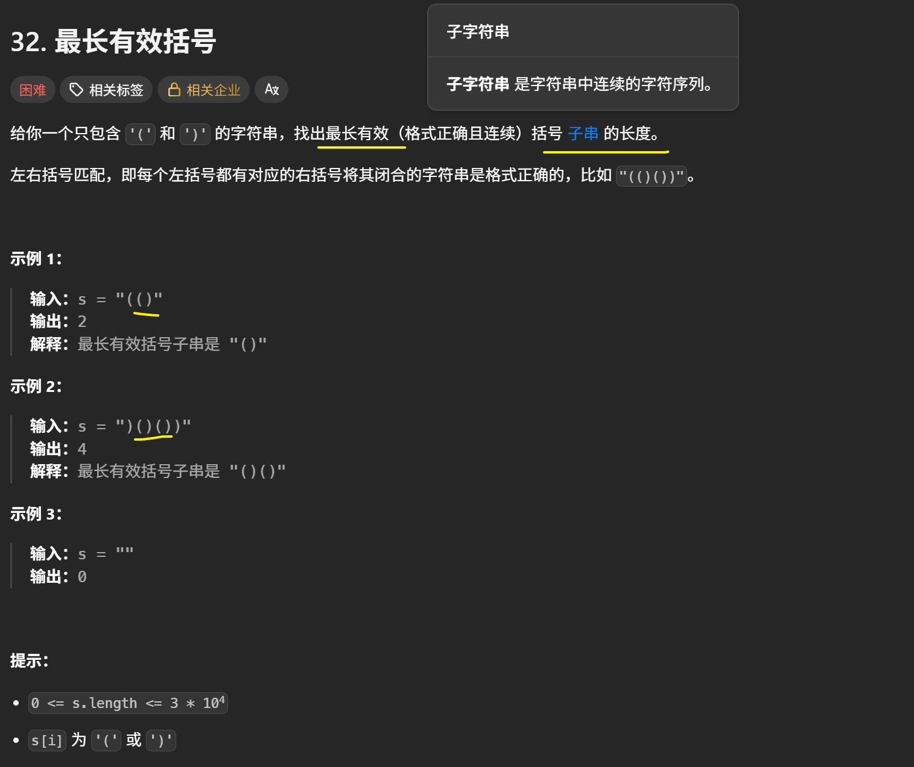

### 动规

[åŸé¢˜è§£](https://leetcode.cn/problems/longest-valid-parentheses/solutions/206995/dong-tai-gui-hua-si-lu-xiang-jie-c-by-zhanganan042)  å¤§ç¥ ã€‚ã€‚ã€‚


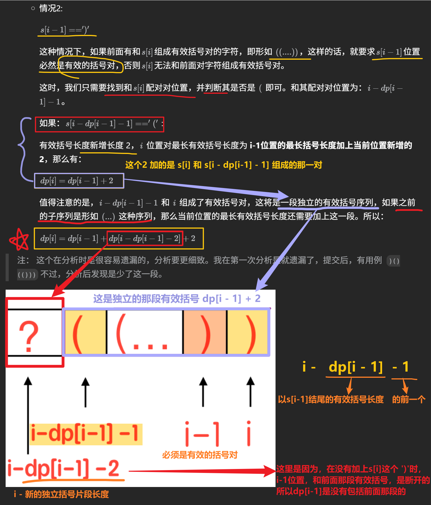

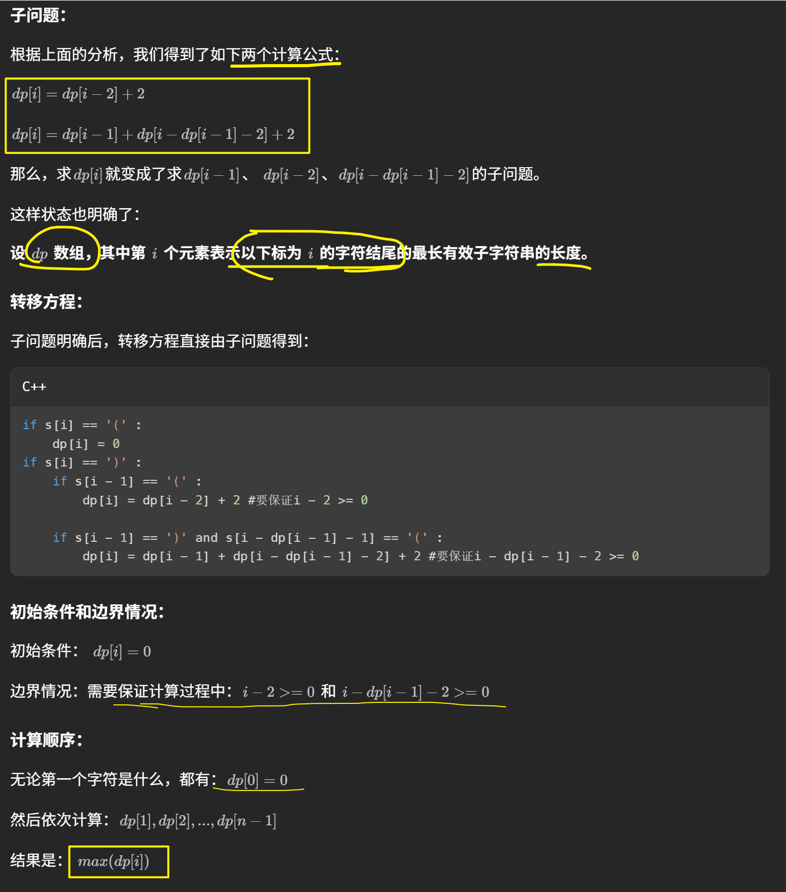

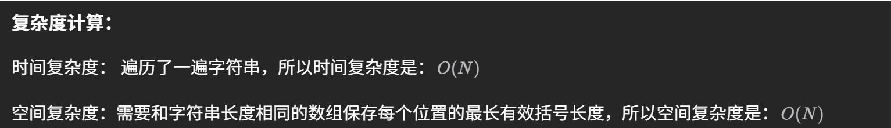


~~~C++
class Solution {
public:
    int longestValidParentheses(string s) {

        // dp[i] - 以s[i]结尾的最长有效括å·çš„长度
        vector<int> dp(s.size(), 0);

        int maxLength = 0;
        for (int i = 1; i < s.size(); i++)
        {
            // 以'('结尾，组ä¸æˆæœ‰æ•ˆæ‹¬å· (å¯ä»¥ä¸ç‰¹æ„写出æ¥)
            if (s[i] == '(')  dp[i] = 0; 

            // 以')'结尾，考虑å‰ä¸€ä¸ªæ‹¬å· s[i-1]
            else if (s[i] == ')') 
            {
                if (s[i - 1] == '(') // 最å两个就能组æˆä¸€å¯¹æ‹¬å· ____ ()
                {
                    if (i - 2 >= 0) dp[i] = dp[i - 2] + 2; // _____ ()
                    else            dp[i] = 2;             // ()
                }
                else // s[i - 1】 == ')'   ____ )) å¾€å‰æ‰¾å’Œiä½ç½®çš„')'对应的
                {
                    // 以s[i-1]结尾的必须是有效括å·å¯¹ï¼Œ___(__))  æ‰èƒ½å†å¾€å‰æ‰¾å’Œi对应的
                    if (dp[i - 1] > 0)   
                    {
                        // å’Œ i çš„')'对应的ä½ç½®s[i - dp[i-1] - 1] 必须是'('   ___((_))
                        if ((i - dp[i-1]-1) >= 0 && s[i - dp[i-1] - 1] == '(')
                        {
                            if (i - dp[i - 1] - 2 >= 0) // 新片段å‰é¢è¿˜æœ‰(______)((_))
                            {
                                dp[i] = dp[i-1] + 2 + dp[i - dp[i-1] - 2];
                            }
                            else // 新片段å‰é¢æ²¡æœ‰äº† ((_))
                            {
                                dp[i] = dp[i - 1] + 2;
                            } 
                        }
                    }
                }
            }

            maxLength = max(maxLength, dp[i]); // å–最大长度
        }

        return maxLength;  
    }
};
~~~


### æ ˆ

> å‚考 ： [æ—å°é¹¿](https://leetcode.cn/u/lin-shen-shi-jian-lu-k/)     [我è¦å‡ºå»ä¹±è¯´](https://leetcode.cn/u/wo-yao-chu-qu-luan-shuo/)

å¯ä»¥ä¸¾ä¾‹å­çœ‹ä¸€ä¸‹

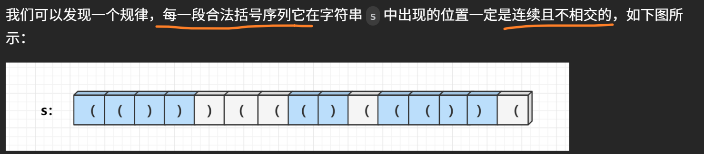


# 多维动æ€è§„划 ✅

## 62 [ä¸åŒè·¯å¾„](https://leetcode.cn/problems/unique-paths/description/)


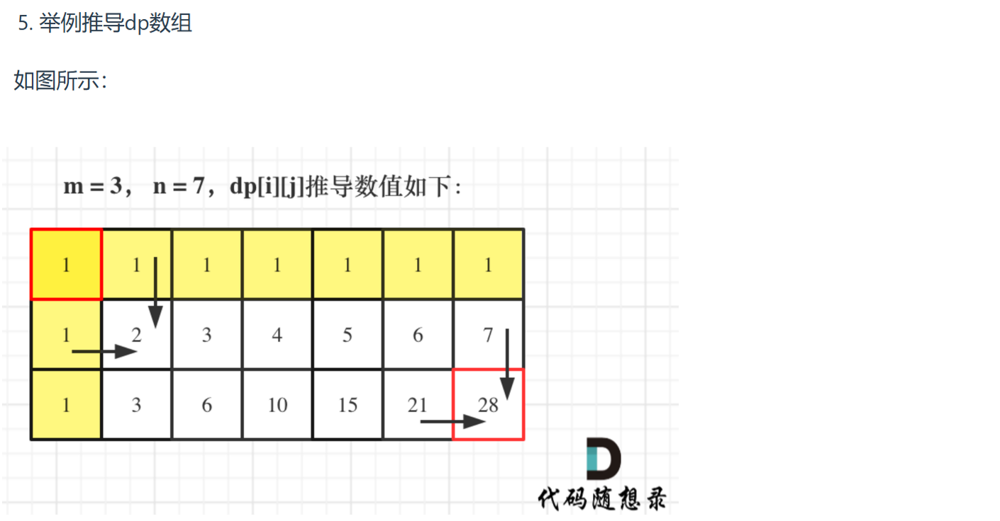

~~~C++
class Solution {
public:
    int uniquePaths(int m, int n) {

        // dp[i][j]: ä»(0,0)到(i,j)一共有dp[i][j]æ¡è·¯å¾„
        vector<vector<int>> dp(m, vector<int>(n, 0));

        // åˆå§‹åŒ–  第一行和第一列需è¦åˆå§‹åŒ–，都åªæœ‰ä¸€æ¡è·¯å¾„
        for (int i = 0; i < m; i++) dp[i][0] = 1;
        for (int j = 0; j < n; j++) dp[0][j] = 1;
        
        // 递æ¨
        for (int i = 1; i < m; i++)
        {
            for (int j = 1; j < n; j++)
            {
                dp[i][j] = dp[i - 1][j] + dp[i][j - 1]; // 两个方å‘的路径数相加
            }
        }

        return dp[m - 1][n - 1];
    }
};
~~~


ACM

~~~C++
#include <iostream>
#include <vector>
using namespace std;


int uniquePaths(int m, int n) 
{
    // dp[i][j]: ä»(0,0)到(i,j)一共有dp[i][j]æ¡è·¯å¾„
    vector<vector<int>> dp(m, vector<int>(n, 0));

    // åˆå§‹åŒ–  第一行和第一列需è¦åˆå§‹åŒ–，都åªæœ‰ä¸€æ¡è·¯å¾„
    for (int i = 0; i < m; i++) dp[i][0] = 1;
    for (int j = 0; j < n; j++) dp[0][j] = 1;
    
    // 递æ¨
    for (int i = 1; i < m; i++)
    {
        for (int j = 1; j < n; j++)
        {
            dp[i][j] = dp[i - 1][j] + dp[i][j - 1]; // 两个方å‘的路径数相加
        }
    }

    return dp[m - 1][n - 1];
}


int main()
{
    int m = 3, n = 7;
    int ans = uniquePaths(m, n);
    cout << ans << endl;
    
    return 0;
}
~~~


## 64 [最å°è·¯å¾„å’Œ](https://leetcode.cn/problems/minimum-path-sum/description/?envType=study-plan-v2&envId=top-100-liked)

@递归  @ 动规


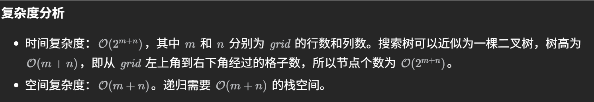

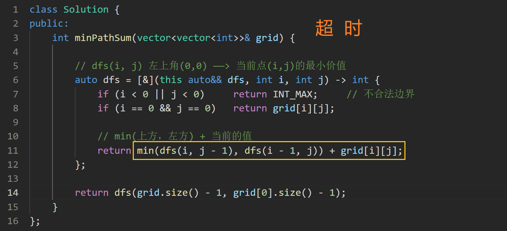


### 递归（æ¨è）


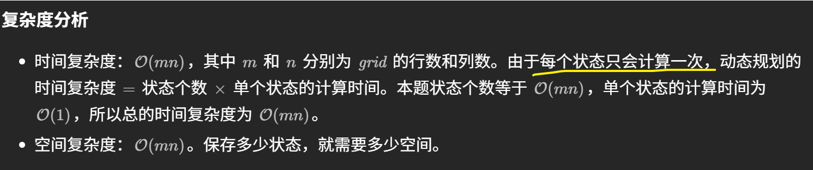

~~~C++
class Solution {
public:
    int minPathSum(vector<vector<int>>& grid) {

        int m = grid.size();
        int n = grid[0].size();

        // 记录当å‰dfs是ä¸æ˜¯è°ƒç”¨è¿‡ï¼Œåˆå§‹ -1 表示未调用
        vector<vector<int>> memo(m, vector<int>(n, -1)); 

        // dfs(i, j) 左上角(0,0) ——> 当å‰ç‚¹(i,j)的最å°ä»·å€¼
        auto dfs = [&](this auto&& dfs, int i, int j) -> int {
            if (i < 0 || j < 0)     return INT_MAX;   
            if (i == 0 && j == 0)   return grid[i][j];  

            // int& res = memo[i][j];
            if (memo[i][j] != -1)  return memo[i][j]; // 之å‰è®¡ç®—过，直æ¥è¿”å›ç»“æœ

            return memo[i][j] = min(dfs(i, j - 1), dfs(i - 1, j)) + grid[i][j]; // 未计算过
        };

        return dfs(grid.size() - 1, grid[0].size() - 1);  
    }
};
~~~


### 动规


~~~C++
class Solution {
public:
    int minPathSum(vector<vector<int>>& grid) {

        int m = grid.size();
        int n = grid[0].size();

        // dp[i+1][j+1] - ä»å·¦ä¸Šè§’到(i,j)的最å°å’Œ
        vector<vector<int>> dp(m + 1, vector<int>(n + 1, INT_MAX));

        // +1 ç›¸å½“äº dp 在åŸgrid范围上最左和最上加了一层，把越界的无穷情况直æ¥åŠ è¿›æ¥äº†
        // 但是 +1，åªæ˜¯åœ¨dp上加的，ä¸å½±å“åŸgrid，加的还是éå†åˆ°çš„åŸ(i,j)ä½ç½®çš„值

        for (int i = 0; i < m; i++)
        {
            for (int j = 0; j < n; j++)
            {
                if (i == 0 && j == 0)   dp[1][1] = grid[i][j];
                else 
                {
                    dp[i + 1][j + 1] = min(dp[i+1][j], dp[i][j+1]) + grid[i][j];
                }
            }
        }

        return dp[m][n];
    }
};
~~~


把 `dp[0][1]`或者  `dp[1][0]` åˆå§‹åŒ–æˆ0，这样 `dp[1][1]` å¯ä»¥ç”¨é€’æ¨å¼è®¡ç®—了，无需特判。

åªèƒ½åˆå§‹åŒ–一个，因为è¦å– min，å–`0 + grid[0][0] = dp[1][1]`

**最终版**

~~~C++
class Solution {
public:
    int minPathSum(vector<vector<int>>& grid) {

        int m = grid.size();
        int n = grid[0].size();

        // dp[i+1][j+1] - ä»å·¦ä¸Šè§’到(i,j)的最å°å’Œ
        vector<vector<int>> dp(m + 1, vector<int>(n + 1, INT_MAX));
        dp[0][1] = 0;

        // +1 ç›¸å½“äº dp 在åŸgrid范围上最左和最上加了一层，把越界的无穷情况直æ¥åŠ è¿›æ¥äº†
        // 但是 +1，åªæ˜¯åœ¨dp上加的，ä¸å½±å“åŸgrid，加的还是éå†åˆ°çš„åŸ(i,j)ä½ç½®çš„值

        for (int i = 0; i < m; i++)
        {
            for (int j = 0; j < n; j++)
            {
                dp[i + 1][j + 1] = min(dp[i+1][j], dp[i][j+1]) + grid[i][j];
            }
        }

        return dp[m][n];
    }
};
~~~


## 5 [最长å›æ–‡å­ä¸²](https://leetcode.cn/problems/longest-palindromic-substring/description/?envType=study-plan-v2&envId=top-100-liked)


### 动æ€è§„划

> 647 å›æ–‡å­ä¸²æ˜¯æ±‚个数，5 是求最长长度

`dp[i][j]` —ã€i, j】范围的s是å¦ä¸ºå›æ–‡å­ä¸² +  记录最长å›æ–‡å­ä¸²èŒƒå›´ 

~~~C++
class Solution {
public:
    string longestPalindrome(string s) {

        // dp[i][j] - 范围[i, j]çš„så­ä¸²æ˜¯å¦æ˜¯å›æ–‡å­ä¸²
        vector<vector<bool>> dp(s.size(), vector<bool>(s.size(), false));

        int maxLength = 0; // 记录最长å›æ–‡å­ä¸²é•¿åº¦
        int left = 0;
        int right = 0;

        for (int i = s.size(); i >= 0; i--)
        {
            for (int j = i; j < s.size(); j++)
            {
                if (s[i] == s[j])
                {
                    if (j - i <= 1)             dp[i][j] = true; // 'a' 或 'aa'
                    else if (dp[i + 1][j - 1])  dp[i][j] = true; // 'a _ _ _ a'
                }


                if (dp[i][j] && j - i + 1 > maxLength) // 更新最长长度
                {
                    maxLength = j - i + 1;
                    left = i;
                    right = j;
                }
            }
        }

        return s.substr(left, maxLength); // 截å–å­ä¸²        
    }
};
~~~

时间å¤æ‚度：$O(N^2)$ 

空间å¤æ‚度：$O(N^2)$ 


### åŒæŒ‡é’ˆ

以 s çš„æ¯ä¸ªå­—符为中心，å‘两边进行扩展 extend()，得到最长å›æ–‡èŒƒå›´

但是è¦æ³¨æ„在éå†ä¸­å¿ƒç‚¹çš„两ç§æƒ…况：一个元素å¯ä»¥ä½œä¸ºä¸­å¿ƒç‚¹ï¼Œä¸¤ä¸ªå…ƒç´ ä¹Ÿå¯ä»¥ä½œä¸ºä¸­å¿ƒç‚¹ã€‚

比如 ：`___b a b___`  `___b a a b___`

~~~C++
class Solution {
public:

    int left = 0;
    int right = 0;
    int maxLength = 0;

    // å›æ–‡æ‰©å±•ï¼šä»ç»™å®šçš„中心 [i, j] å‘两边扩展，直到é‡åˆ°ä¸åŒçš„字符为止，记录最长扩展长度
    void extend(const string& s, int i, int j, int n)
    {
        while (i >= 0 && j < n && s[i] == s[j])
        {
            if (j - i + 1 > maxLength)
            {
                left = i;
                right = j;
                maxLength = j - i + 1;
            }

            i--;
            j++; // å‘两边扩展
        }
    }


    string longestPalindrome(string s) {
        
        int result = 0;

        // å°†sçš„æ¯ä¸ªå­—符，作为å›æ–‡ä¸­å¿ƒï¼Œå‘两边扩展，记录æ¯ä¸ªs[i]能扩展的长度
        for (int i = 0; i < s.size(); i++)
        {
            // 注æ„中心点的两ç§æƒ…况
            extend(s, i, i, s.size());     // 以 i 为中心          '__ b a b __'
            extend(s, i, i + 1, s.size()); // 以 i 和 i + 1 为中心 '__ b a a b __'
        }

        return s.substr(left, maxLength);        
    }
};
~~~

时间å¤æ‚度：$O(N^2)$ 

空间å¤æ‚度：O(1)


## 1143 [最长公共å­åºåˆ—](https://leetcode.cn/problems/longest-common-subsequence/description/?envType=study-plan-v2&envId=top-100-liked)

@ dp 最左最上扩充


**dp 最左和最上扩充，é¿å…å•ç‹¬å¤„ç†é¦–行首列，和 718 类似**


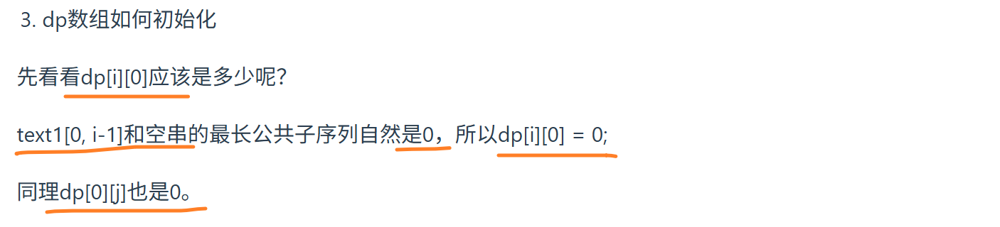


~~~C++
class Solution {
public:
    int longestCommonSubsequence(string text1, string text2) {

        // dp[i][j] - text1çš„[0, i-1]范围 å’Œ text2çš„[0, j-1]范围 的最长公共å­åºåˆ—
        vector<vector<int>> dp(text1.size() + 1, vector<int>(text2.size() + 1, 0));

        for (int i = 1; i <= text1.size(); i++)
        {
            for (int j = 1; j <= text2.size(); j++)
            {
                if (text1[i - 1] == text2[j - 1])
                {
                    dp[i][j] = dp[i - 1][j - 1] + 1;
                }
                else // text1[i] != text2[j]
                {
                    dp[i][j] = max(dp[i - 1][j], dp[i][j - 1]);
                }
            }
        }

        return dp[text1.size()][text2.size()];
    }
};
~~~


如æœå®šä¹‰dp数组：

`dp[i][j] ` 表示 **text1[0, i] å’Œ text2[0, j]** 范围的最长公共å­åºåˆ—，**dp大å°ä¸ºï¼ˆtext1.size(), test2.size()）**

**如æœä¸åˆå§‹åŒ–，需è¦å•ç‹¬å¤„ç†é¦–行首列**

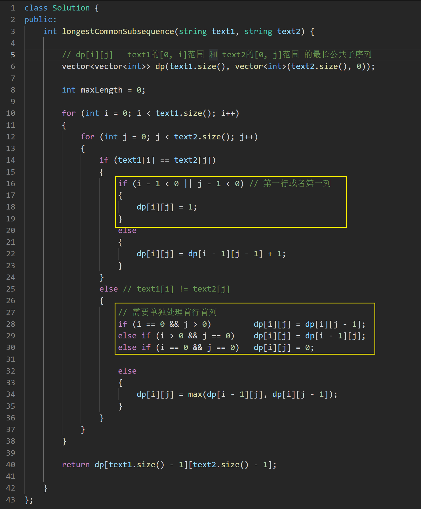

**对第一行第一列åˆå§‹åŒ–**

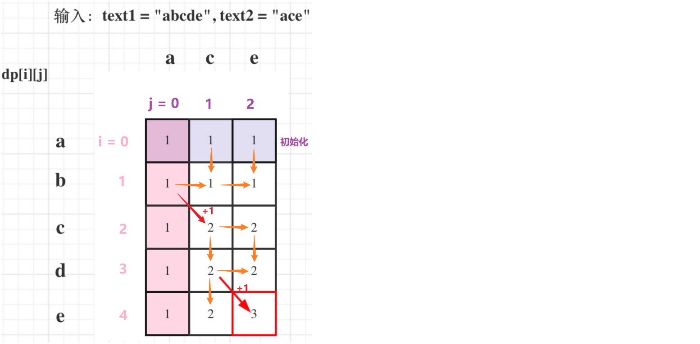


## 72 [编辑è·ç¦»](https://leetcode.cn/problems/edit-distance/description/?envType=study-plan-v2&envId=top-100-liked)

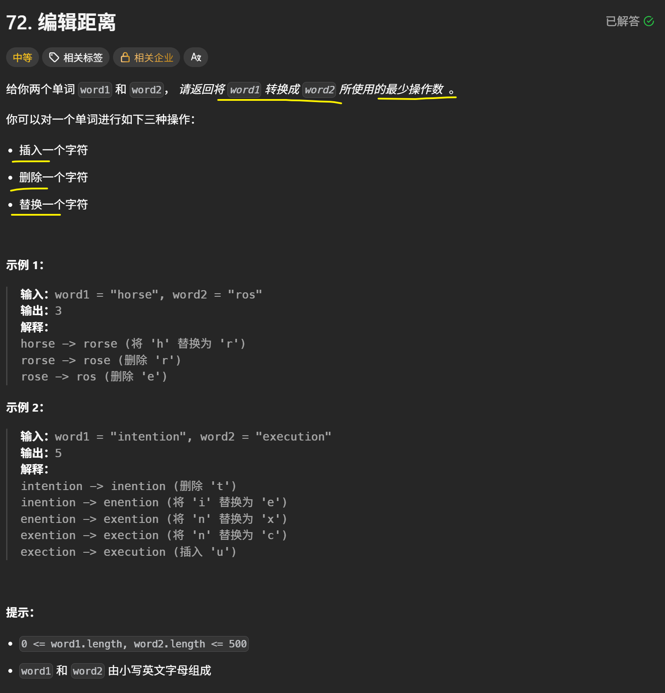

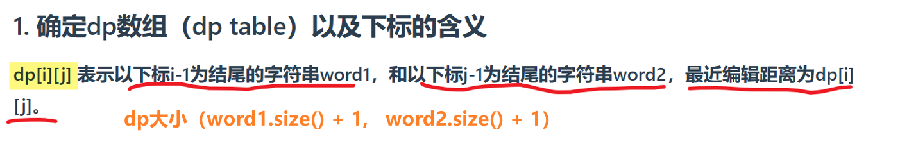

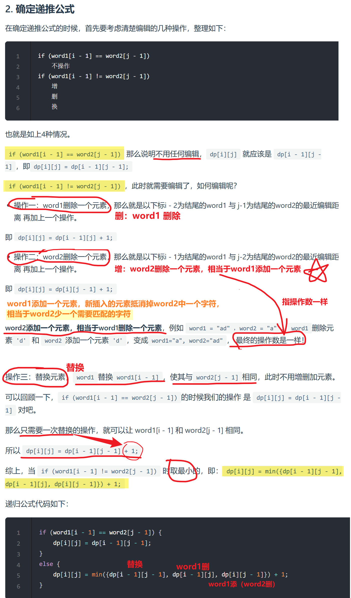


~~~C++
class Solution {
public:
    int minDistance(string word1, string word2) {

        // word1 = "horse", word2 = "ros"

        // dp[i][j] - 以word1[i-1]结尾，和以word2[j-1]结尾的部分，最近编辑è·ç¦»ä¸ºdp[i][j]
        vector<vector<int>> dp(word1.size() + 1, vector<int>(word2.size() + 1, 0));

        // åˆå§‹åŒ–
        for (int i = 0; i <= word1.size(); i++)  dp[i][0] = i; // word1 和 空word2
        for (int j = 0; j <= word2.size(); j++)  dp[0][j] = j; // 空word1 和 word1


        for (int i = 1; i <= word1.size(); i++)
        {
            for (int j = 1; j <= word2.size(); j++)
            {
                // 相åŒï¼Œä¸éœ€è¦æ“ä½œï¼Œå»¶ç»­ä¸Šä¸€ä¸ªç»“æœ 
                if (word1[i - 1] == word2[j - 1])  
                {
                    dp[i][j] = dp[i - 1][j - 1]; 
                }
                else // word1[i - 1] != word2[j - 1]  固定对 word1 å¢ åˆ  改
                {
                    dp[i][j] = min({dp[i - 1][j] + 1,  // word1删一个
                                    dp[i][j - 1] + 1,  // word2删一个 <==> word1å¢åŠ 
                                    dp[i - 1][j - 1] + 1}); // 替æ¢word1[i-1]
                }
            }
        }

        return dp[word1.size()][word2.size()];
    }
};
~~~


# 图论 ✅

## 200 [岛屿数é‡](https://leetcode.cn/problems/number-of-islands/description/)

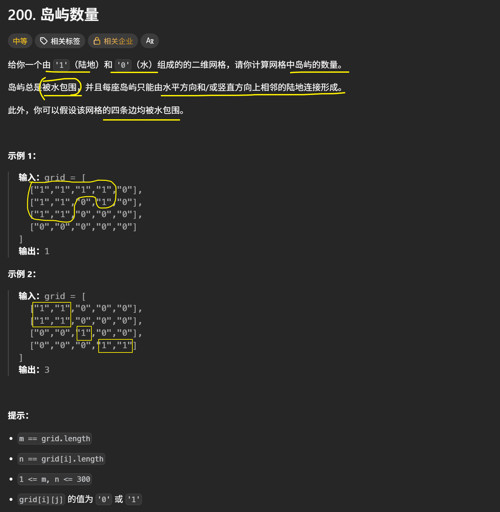


本题æ€è·¯ï¼š**é‡åˆ°ä¸€ä¸ªæ²¡æœ‰éå†è¿‡çš„陆地，计数器就加一**，然å把**该节点陆地所能éå†åˆ°çš„陆地都标记**上。

在é‡åˆ°æ ‡è®°è¿‡çš„陆地节点和海洋节点的时候直æ¥è·³è¿‡ã€‚ 这样**计数器就是最终岛屿的数é‡**。


### æ·±æœdfs

**`result` 作为岛屿计数器。éå†`grid`æ¯ä¸ªèŠ‚点：æ¯ä¸ªæœªæ ‡è®°æ–°é™†åœ°éƒ½æ˜¯æ–°å²›å±¿èµ·ç‚¹**

- é‡åˆ°æ–°çš„未标记陆地，先标记`visited`，然å计数`result + 1`，表示é‡åˆ°äº†æ–°å²›å±¿çš„起始点

- dfs 主è¦ç”¨æ¥æ ‡è®°è¿™å—新岛屿能è¿æ¥ä¸Šçš„所有陆地 `visited[][]`，走完这一层dfs，也就标记完了这å—岛屿

- 这样在下一轮，å†é‡åˆ°æ–°çš„未标记陆地，åˆå¯ä»¥ä½œä¸ºæ–°å²›å±¿çš„起始，`result + 1`

~~~C++
class Solution {
public:
    int dir[4][2] = {0,1, 1,0, -1,0, 0,-1}; // 四个方å‘

    void dfs(vector<vector<char>>& grid, vector<vector<bool>>& visited, int x, int y)
    {
        // {x, y} 当å‰èŠ‚点的å标，第x行，第y列
        
        // éå†å½“å‰èŠ‚点{x, y}的四个方å‘
        for (int i = 0; i < 4; i++)
        {
            int nextx = x + dir[i][0];
            int nexty = y + dir[i][1];

            if (nextx < 0 || nextx >= grid.size() ||
                nexty < 0 || nexty >= grid[0].size())
            {
                continue; // 超出界é™ï¼Œç›´æ¥è·³è¿‡
            }

            // 是陆地且没被访问过
            if (!visited[nextx][nexty] && grid[nextx][nexty] == '1') 
            {
                visited[nextx][nexty] = true;
                dfs(grid, visited, nextx, nexty); // 递归
            }

        }
    }

    int numIslands(vector<vector<char>>& grid) {
        int n = grid.size();   // n行
        int m = grid[0].size();// m列

        vector<vector<bool>> visited(n, vector<bool>(m, false)); // 标记是å¦è®¿é—®è¿‡

        int result = 0;
        // result记录é‡åˆ°çš„符åˆçš„新岛屿的个数，dfs用æ¥æ ‡è®°è¿™å—岛屿能è¿æ¥ä¸Šçš„所有陆地
        
        // éå†gridæ¯ä¸ªèŠ‚点，æ¯ä¸ªæœªæ ‡è®°é™†åœ°éƒ½æ˜¯æ–°å²›å±¿èµ·å§‹ç‚¹
        for (int i = 0; i < n; i++)
        {
            for (int j = 0; j < m; j++)
            {
                if (!visited[i][j] && grid[i][j] == '1')
                {
                    visited[i][j] = true;
                    result++; // é‡åˆ°æ–°å²›å±¿èµ·å§‹ç‚¹[i, j]，岛屿数é‡+1

                    dfs(grid, visited, i, j); // å°†ä¸ [i, j] è¿æ¥ä¸Šçš„陆地都标记上
                }
            }
        }

        return result;
    }
    
};
~~~

上é¢çš„终止æ¡ä»¶å°±å†™åœ¨äº† 调用dfs的地方，如æœé‡åˆ°ä¸åˆæ³•çš„æ–¹å‘，直æ¥ä¸ä¼šå»è°ƒç”¨dfs。

也å¯ä»¥æ˜ç¡®åœ¨dfs开头写上终止æ¡ä»¶

~~~C++
void dfs(vector<vector<char>>& grid, vector<vector<bool>>& visited, int x, int y)
{
    // 终止：节点访问过，或者是海水
    if (visited[x][y] || grid[x][y] == '0') return; 

    visited[x][y] = true; // 标记     

    for (int i = 0; i < 4; i++)
    {
        int nextx = x + dir[i][0];
        int nexty = y + dir[i][1];

        if (nextx < 0 || nextx >= grid.size() ||
            nexty < 0 || nexty >= grid[0].size())
        {
            continue; 
        }

        dfs(grid, visited, nextx, nexty); // 判断æ¡ä»¶æ”¾åˆ°å‰é¢å»äº†ï¼Œè¿™é‡Œç›´æ¥é€’å½’
    }
}
~~~

版本一中 调用dfs çš„æ¡ä»¶ï¼Œæ”¾åœ¨äº† 版本二 çš„ 终止æ¡ä»¶ä½ç½®ä¸Šã€‚

版本一的写法是 ：下一个节点是å¦èƒ½åˆæ³•å·²ç»åˆ¤æ–­å®Œäº†ï¼Œåªè¦è°ƒç”¨dfs就是å¯ä»¥åˆæ³•çš„节点。

版本二的写法是：ä¸ç®¡èŠ‚点是å¦åˆæ³•ï¼Œä¸Šæ¥å°±dfs，然å在终止æ¡ä»¶çš„地方进行判断，ä¸åˆæ³•å†return。

ç†è®ºä¸Šæ¥è®²ï¼Œç‰ˆæœ¬ä¸€çš„效ç‡æ›´é«˜ä¸€äº›ï¼Œå› ä¸ºé¿å…了 没有æ„义的递归调用，在调用dfs之å‰ï¼Œå°±åšåˆæ³•æ€§åˆ¤æ–­ã€‚ 但ä»å†™æ³•æ¥è¯´ï¼Œå¯èƒ½ç‰ˆæœ¬äºŒ 更利äºç†è§£ä¸€äº›ã€‚（ä¸è¿‡å…¶å®éƒ½å·®ä¸å¤ªå¤šï¼‰


**ACM（kama 99）**


~~~C++
#include <iostream>
#include <vector>
using namespace std;

int dir[4][2] = {0, 1, 0, -1, 1, 0, -1, 0};
void dfs(const vector<vector<int>>& grid, vector<vector<bool>>& visited, int x, int y)
{
    for (int i = 0; i < 4; i++)
    {
        int nextx = x + dir[i][0];
        int nexty = y + dir[i][1];
        if (nextx < 0 || nextx >= grid.size() ||
            nexty < 0 || nexty >= grid[0].size())
        {
            continue;
        }

        if (!visited[nextx][nexty] && grid[nextx][nexty] == 1)
        {
            visited[nextx][nexty] = true;
            dfs(grid, visited, nextx, nexty);
        }
    }
}


int main()
{
    int n = 0, m = 0; // n行  m列
    cin >> n >> m;

    vector<vector<int>> grid(n, vector<int>(m, 0));
    for (int i = 0; i < n; i++)
    {
        for (int j = 0; j < m; j++)
        {
            cin >> grid[i][j];
        }
    }

    vector<vector<bool>> visited(n, vector<bool>(m, false));
    int result = 0;
    for (int i = 0; i < n; i++)
    {
        for (int j = 0; j < m; j++)
        {
            if (!visited[i][j] && grid[i][j] == 1)
            {
                visited[i][j] = true;
                result++;
                dfs(grid, visited, i, j);
            }
        }
    }

    cout << result << endl;


    return 0;
}
~~~


### 广æœbfs

**dfs æ¢æˆ bfs，queue存放走过的节点åæ ‡**

- é‡åˆ°æ–°çš„未标记陆地，就是新的岛屿，直æ¥è®¡æ•°`result + 1`

- 进入 bfs 标记这å—新岛屿能è¿æ¥ä¸Šçš„所有陆地 `visited[][]`
  - å–出que中节点，标记4个方å‘，符åˆçš„陆地节点**加入队列，代表走过，需è¦æ ‡è®°**（而ä¸æ˜¯ä»é˜Ÿåˆ—拿出æ¥çš„时候å†å»æ ‡è®°èµ°è¿‡ï¼‰ï¼Œå¾ªç¯è¿™ä¸ªè¿‡ç¨‹ï¼Œç›´åˆ°que中没有节点（当å‰è¿™å—岛屿标记完æˆï¼‰
- å†éå†é‡åˆ°æ–°çš„æœªæ ‡è®°é™†åœ°ï¼Œå† `result + 1`，å†bfs标记这å—新岛屿


~~~C++
class Solution {
public:
    int dir[4][2] = {0,1, 1,0, -1,0, 0,-1}; // 四个方å‘

    void bfs(vector<vector<char>>& grid, vector<vector<bool>>& visited, int x, int y)
    {
        queue<pair<int, int>> que; // 存放已ç»èµ°è¿‡çš„åæ ‡ {x, y}
        que.push({x, y});

        visited[x][y] = true; // åªè¦åŠ å…¥é˜Ÿåˆ—，就标记

        while (!que.empty())
        {
            pair<int, int> cur = que.front();
            que.pop();

            int curx = cur.first;
            int cury = cur.second;

            // 处ç†curçš„4个方å‘
            for (int i = 0; i < 4; i++)
            {
                int nextx = curx + dir[i][0];
                int nexty = cury + dir[i][1];
                if (nextx < 0 || nextx >= grid.size() ||
                    nexty < 0 || nexty >= grid[0].size())
                {
                    continue;
                }

                if (!visited[nextx][nexty] && grid[nextx][nexty] == '1')
                {
                    que.push({nextx, nexty});     // 加入队列
                    visited[nextx][nexty] = true; // 标记
                }
            }
        }
    }

    int numIslands(vector<vector<char>>& grid) {
        int n = grid.size();   // n行
        int m = grid[0].size();// m列

        vector<vector<bool>> visited(n, vector<bool>(m, false)); // 标记是å¦è®¿é—®è¿‡

        int result = 0; // result记录é‡åˆ°çš„符åˆçš„新岛屿的个数
        
        // æ¢æˆ bfs æ¥æ ‡è®°è¿™å—岛屿能è¿æ¥ä¸Šçš„所有陆地
        for (int i = 0; i < n; i++)
        {
            for (int j = 0; j < m; j++)
            {
                if (!visited[i][j] && grid[i][j] == '1')
                {
                    result++; // é‡åˆ°æ–°å²›å±¿èµ·å§‹ç‚¹[i, j]，岛屿数é‡+1
                    bfs(grid, visited, i, j); // å°†ä¸ [i, j] è¿æ¥ä¸Šçš„陆地都标记上
                }
            }
        }

        return result;       
    }
};
~~~


**注æ„：标记的时机**

如æœä»é˜Ÿåˆ—拿出节点，å†å»æ ‡è®°è¿™ä¸ªèŠ‚点走过，就会å‘生下图所示的结æœï¼Œä¼šå¯¼è‡´å¾ˆå¤šèŠ‚点é‡å¤åŠ å…¥é˜Ÿåˆ—。

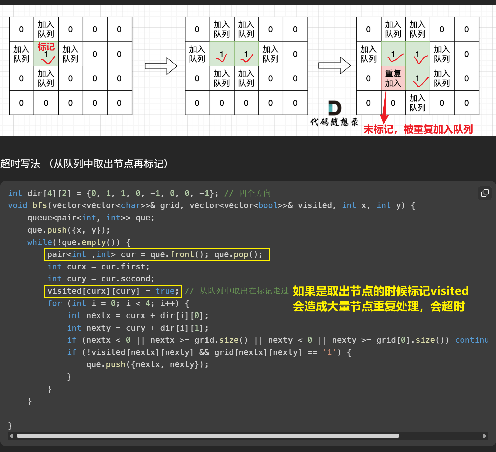


ACM

~~~C++
#include <iostream>
#include <vector>
#include <queue>
using namespace std;

int dir[4][2] = {0, 1, 0, -1, 1, 0, -1, 0};

void bfs(const vector<vector<int>>& grid, vector<vector<bool>>& visited, int x, int y)
{
    queue<pair<int, int>> que;
    que.push({x, y});
    visited[x][y] = true;

    while (!que.empty())
    {
        pair<int, int> cur = que.front();
        que.pop();

        int curx = cur.first;
        int cury = cur.second;

        for (int i = 0; i < 4; i++)
        {
            int nextx = curx + dir[i][0];
            int nexty = cury + dir[i][1];
            if (nextx < 0 || nextx >= grid.size() || 
                nexty < 0 || nexty >= grid[0].size())
            {
                continue;
            }

            if (!visited[nextx][nexty] && grid[nextx][nexty] == 1)
            {
                que.push({nextx, nexty});
                visited[nextx][nexty] = true;
            }

        }
    }
}


int main()
{
    int n = 0, m = 0; // n行  m列
    cin >> n >> m;

    vector<vector<int>> grid(n, vector<int>(m, 0));
    for (int i = 0; i < n; i++)
    {
        for (int j = 0; j < m; j++)
        {
            cin >> grid[i][j];
        }
    }

    vector<vector<bool>> visited(n, vector<bool>(m, false));
    int result = 0;
    for (int i = 0; i < n; i++)
    {
        for (int j = 0; j < m; j++)
        {
            if (!visited[i][j] && grid[i][j] == 1)
            {
                result++;
                bfs(grid, visited, i, j);
            }
        }
    }

    cout << result << endl;

    return 0;
}
~~~


## 994 [è…烂的橘å­](https://leetcode.cn/problems/rotting-oranges/description/?envType=study-plan-v2&envId=top-100-liked)

@ bfs

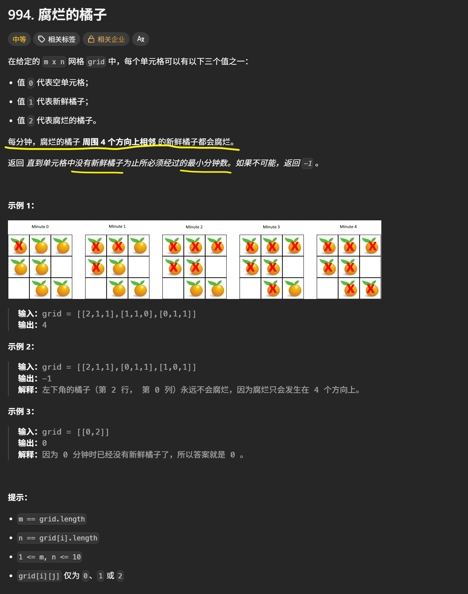


**注æ„：**

`while (fresh && !que.empty()) ` 里，è¦è®°å½•æ¯å±‚que的大å°ï¼Œè¦æŠŠå½“å‰que中的ã€æ‰€æœ‰çš„è…烂橘å­ã€‘的四个方å‘都污染了，æ‰ç®—这层结æŸï¼›

如æœä¸åŠ è¿™ä¸ª `int sz = que.size();  for (int k = 0; k < sz; k++) {}` ，这样处ç†çš„åªæ˜¯ä¸€ä¸ªè…烂橘å­

~~~C++
class Solution {
public:
    // bfs

    int dir[4][2] = {0, 1, 0, -1, 1, 0, -1, 0};
    
    int orangesRotting(vector<vector<int>>& grid) {

        int m = grid.size();
        int n = grid[0].size();

        int ans = 0; 	// 全部è…烂的分钟数
        int fresh = 0; 	// 新鲜橘å­ä¸ªæ•°
        
        queue<pair<int, int>> que; // 存放已ç»è…烂的橘å­åæ ‡
        
        for (int i = 0; i < m; i++)
        {
            for (int j = 0; j < n; j++)
            {
                if (grid[i][j] == 1)        fresh++; // 收集åˆå§‹çš„新鲜橘å­ä¸ªæ•°
                else if (grid[i][j] == 2)   que.push({i, j}); //一开始就è…烂的橘å­
            }
        }


        while (fresh && !que.empty()) 
        {
            ans++; // ç»è¿‡ä¸€åˆ†é’Ÿ
            
            // 这一分钟è…烂，è¦å»æ±¡æŸ“当å‰que中ã€æ‰€æœ‰çš„è…烂橘å­ã€‘çš„å‘¨å›´å››ä¸ªæ–¹å‘ ï¼ï¼ï¼

            int sz = que.size(); // 当å‰å±‚çš„è…烂橘å­æ•°é‡ï¼Œæ¯ä¸ªéƒ½è¦å»æ±¡æŸ“4ä¸ªæ–¹å‘ ï¼ï¼ï¼
            for (int k = 0; k < sz; k++) 
            {
                auto [curx, cury] = que.front(); // å–出è…çƒ‚æ©˜å­ cur
                que.pop();

                for (int i = 0; i < 4; i++) // å»æ±¡æŸ“ cur 的四个方å‘上的新鲜橘å­
                {
                    int nextx = curx + dir[i][0];
                    int nexty = cury + dir[i][1];

                    // 越界，跳过
                    if (nextx < 0 || nextx >= m || nexty < 0 || nexty >= n) continue;

                    // é‡åˆ°æ–°é²œæ©˜å­
                    if (grid[nextx][nexty] == 1) 
                    {
                        fresh--;                  // 新鲜橘å­è®¡æ•°-1
                        grid[nextx][nexty] = 2;   // å˜æˆè…烂橘å­ï¼Œé¿å…é‡å¤å¤„ç†
                        que.push({nextx, nexty}); // 加入è…烂队列
                    }
                }
            
            }
        }


        // 如æœæœ€å fresh = 0 æ‰è¯´æ˜æ²¡æœ‰æ–°é²œæ©˜å­äº†
        return fresh ? -1 : ans;
    }
};
~~~


## 207 [课程表](https://leetcode.cn/problems/course-schedule/description/?envType=study-plan-v2&envId=top-100-liked)

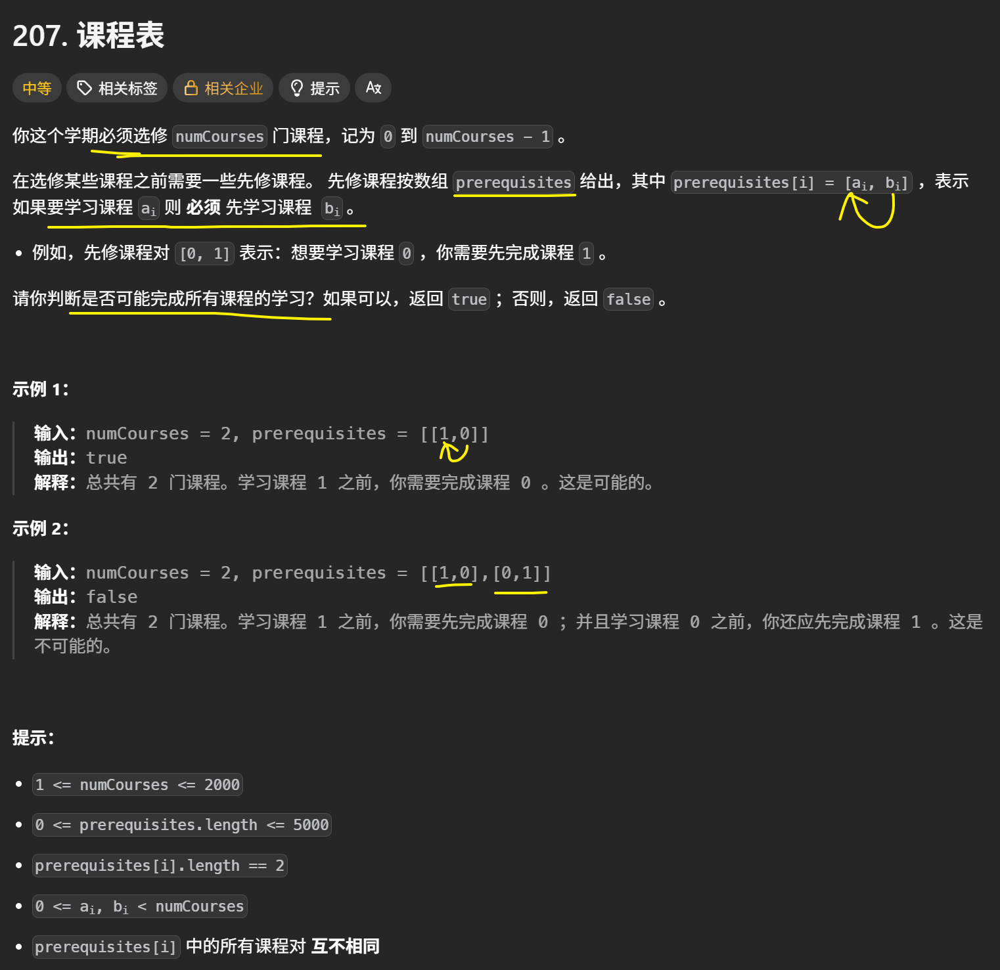

æ¯é—¨è¯¾ç¨‹ç›¸å½“äºæ˜¯èŠ‚点，ä¾èµ–关系是边，二者æ„æˆäº†ä¸€ä¸ªæœ‰å‘图。

本题转化为**判断有å‘图中是å¦å­˜åœ¨ç¯**。

举例å­çœ‹å§


### 1ã€æ‹“扑æ’åº ï¼ˆæ¨è）

æ€è·¯æ›´æ¸…æ™°

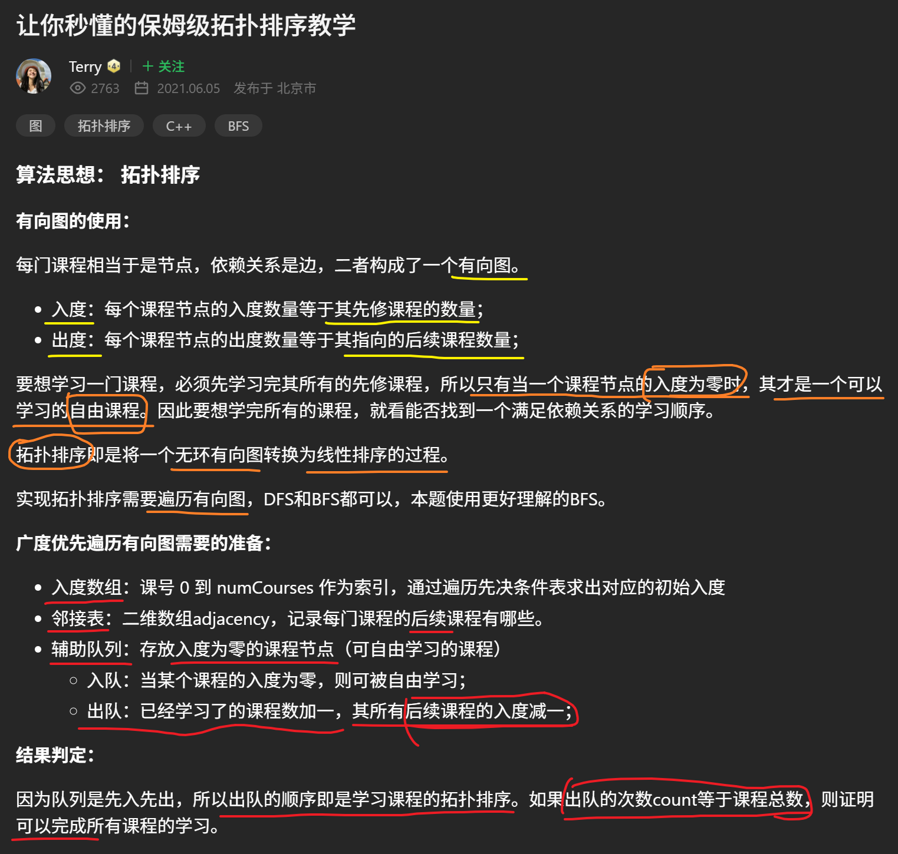


canLearn 收集自由课程

模拟学习过程，ä»è‡ªç”±è¯¾ç¨‹å¼€å§‹å­¦ä¹ ï¼Œä¸æ–­å‡å°‘其他课程的先修带æ¥çš„入度，直到å˜æˆè‡ªç”±è¯¾ç¨‹

最å比较 已学课程数 == 所有课程数？相等则能完æˆå­¦ä¹ ä»»åŠ¡

~~~C++
class Solution {
public:
    bool canFinish(int numCourses, vector<vector<int>>& prerequisites) {

        int n = prerequisites.size();

        if (n == 0) return true; // 没有ä¾èµ–关系，直æ¥è¿”å›true

        vector<int> indegree(numCourses);          // æ¯ä¸ªèŠ‚点的入度
        vector<vector<int>> adjacency(numCourses); // é‚»æ¥çŸ©é˜µï¼šå…ˆä¿®è¯¾ç¨‹-->å续课程集åˆ

        // 统计所有节点的入度，æ„建邻æ¥çŸ©é˜µ
        for (int i = 0; i < n; i++)
        {
            indegree[prerequisites[i][0]]++; 
            adjacency[prerequisites[i][1]].push_back(prerequisites[i][0]);
        }

        
        // canLearn 收集入度为 0 的节点（入度 = 0表示这门课ç°åœ¨æ˜¯è‡ªç”±è¯¾ç¨‹ï¼Œä¸å—先修é™åˆ¶ï¼‰
        queue<int> canLearn; 
        for (int i = 0; i < numCourses; i++)
        {
            if (indegree[i] == 0)   canLearn.push(i);
        }


        // 模拟学习过程，ä»è‡ªç”±è¯¾ç¨‹å¼€å§‹å­¦ä¹ ï¼š
        // ä»canLearn中å–出课程 A 学习，并å‡å°‘以A作为先åºçš„其他课程的入度
        // 当一门课的入度å‡å°‘为0，那么它也å¯ä»¥åŠ å…¥canLearn

        int learned_count = 0; // 记录已学的课程数
        while (!canLearn.empty())
        {
            int learned = canLearn.front(); // å–出å¯å­¦ä¹ è¯¾ç¨‹
            canLearn.pop();
            learned_count++;

            // 这门课学完了，那么以这门课为先修的其他课程节点，å¯ä»¥å‡å°‘一个入度
            for (int i = 0; i < adjacency[learned].size(); i++)
            {
                indegree[adjacency[learned][i]]--;

                // 有å续课程的入度å‡ä¸ºé›¶äº†ï¼Œåˆ™å…¶å˜ä¸ºäº†è‡ªç”±è¯¾ç¨‹ï¼ŒåŠ å…¥canLearn
                if (indegree[adjacency[learned][i]] == 0)
                {
                    canLearn.push(adjacency[learned][i]);
                }
            }

        }

        // 最å，如æœå·²å­¦çš„课程数 = 课程总数，说æ˜å­¦ä¹ å®Œæˆ
        return learned_count == numCourses;        
    }
};
~~~


### 2ã€æ ‡è®° + dfs

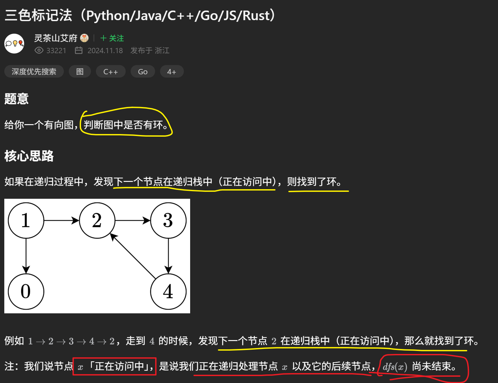

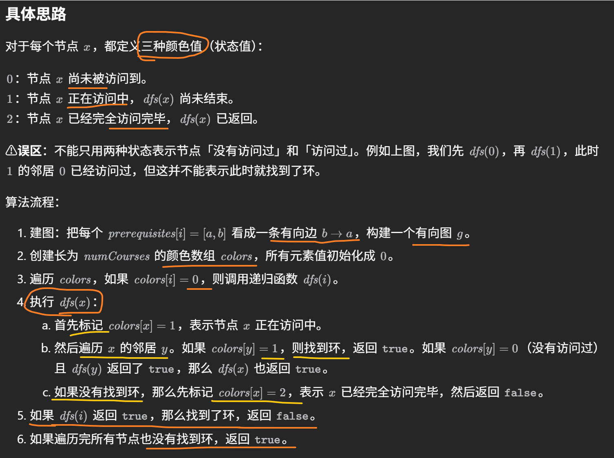


~~~C++
class Solution {
public:
    bool canFinish(int numCourses, vector<vector<int>>& prerequisites) {

        // æ ¹æ®prerequisites创建有å‘图grid，pre[a, b] æ–¹å‘是 b-->a
        vector<vector<int>> grid(numCourses);
        for (auto& p : prerequisites)
        {
            grid[p[1]].push_back(p[0]); // p[1]-->p[0]  p[1]是gridåæ ‡
        }

        // colors 记录节点状æ€ï¼š
        // 0 - 未访问
        // 1 - 节点的邻居正在访问
        // 2 - 节点的所有邻居访问完
        vector<int> colors(numCourses); 
        
        // dfsè¿”å›true，表示在节点 x 的关系里，找到了ç¯
        auto dfs = [&](this auto&& dfs, int x)->bool {

            colors[x] = 1; // 节点 x 的邻居正在访问

            // éå† x 的邻居，也就是grid[x]里存的数组元素
            for (int y : grid[x]) 
            {
                if (colors[y] == 1 || // 作为x邻居之å‰ï¼Œyå·²ç»æ­£åœ¨å¤„ç†è‡ªå·±çš„关系，æ’链æ¡äº†
                    colors[y] == 0 && dfs(y)) // y未访问，递归进入dfs(y)
                {
                    return true;
                }
            }

            colors[x] = 2; // xåŠx的邻居访问完毕
            
            return false; // 未找到ç¯
        };


        // éå†èŠ‚点，æ¯ä¸ªi都走一édfs，i的所有关系里存ä¸å­˜åœ¨ç¯
        for (int i = 0; i < numCourses; i++)
        {
            if (colors[i] == 0 && dfs(i))   return false ;
        }

        return true;     // 题目中无ç¯æ˜¯è¿”å›true   
    }
};
~~~


## 208 [å®ç°Trie （å‰ç¼€æ ‘）](https://leetcode.cn/problems/implement-trie-prefix-tree/description/?envType=study-plan-v2&envId=top-100-liked)

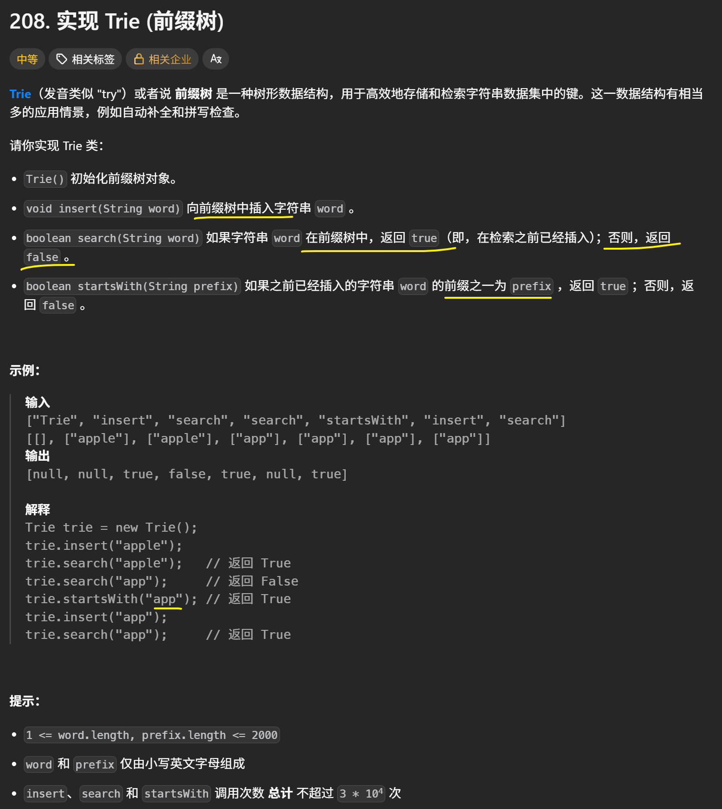

题解æ¥è‡ª [@负雪æ˜çƒ›](https://leetcode.cn/problems/implement-trie-prefix-tree/solutions/721050/fu-xue-ming-zhu-cong-er-cha-shu-shuo-qi-628gs)  [@路漫漫我ä¸ç•](https://leetcode.cn/problems/implement-trie-prefix-tree/solutions/98390/trie-tree-de-shi-xian-gua-he-chu-xue-zhe-by-huwt)


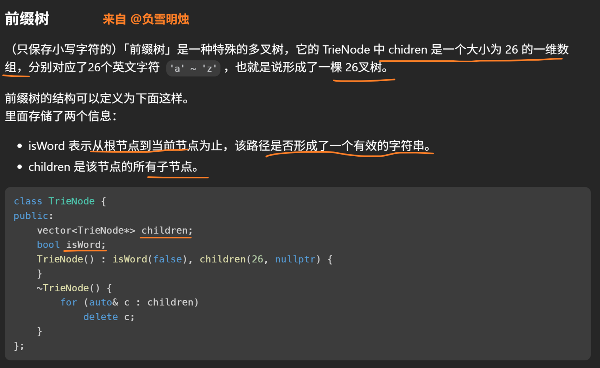

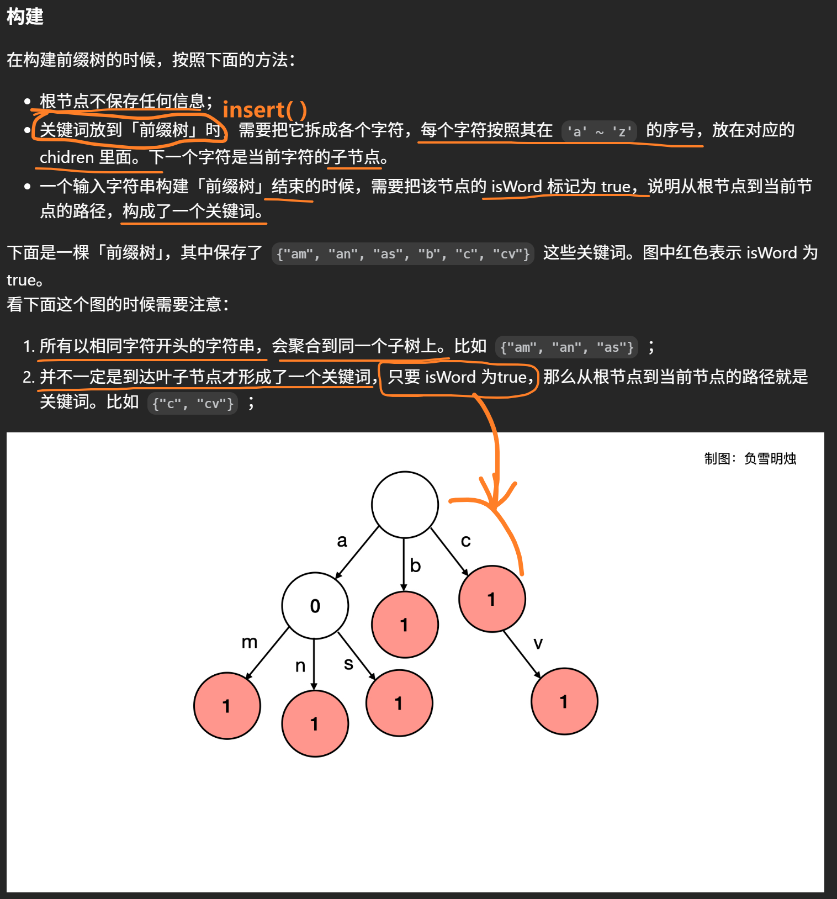


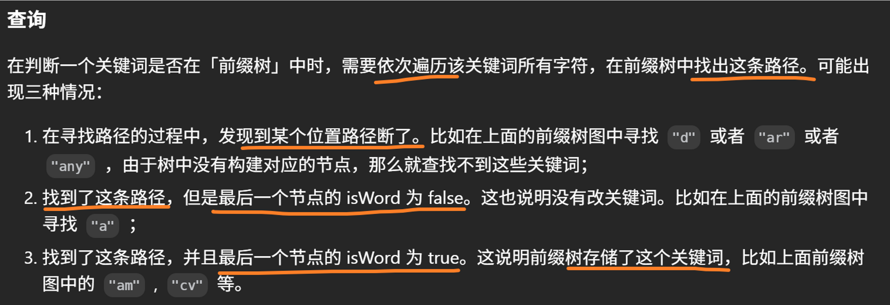


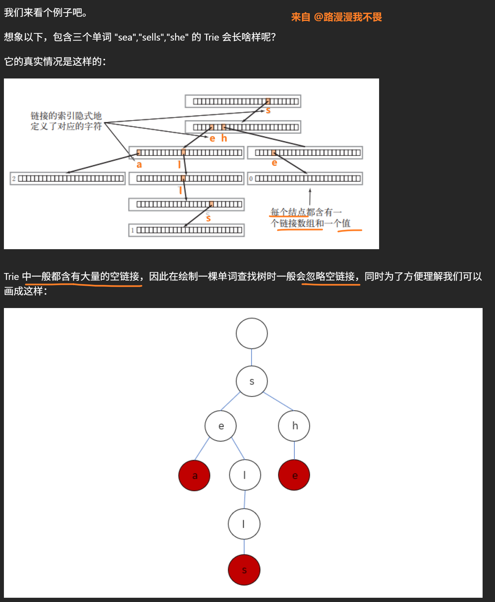


~~~C++
class TrieNode
{
public:
    vector<TrieNode*> children;
    bool isWord;

    TrieNode() : isWord(false), children(26, nullptr) {}

    ~TrieNode() {
        for (auto& c : children)    delete c;
    }
};


class Trie {
private:
    TrieNode* root;

public:
    Trie() {
        root = new TrieNode();
    }
    ~Trie() {
        delete root;  // 会递归释放整棵树
    }
    
    void insert(string word) {
        TrieNode* cur = root; // ä»æ ¹èŠ‚点开始匹é…wordçš„æ¯ä¸ªå­—符
        for (char c : word)
        {
            if (cur->children[c - 'a'] == nullptr) // ä¸åœ¨æ ‘上，æ’å…¥
            {
                cur->children[c - 'a'] = new TrieNode;
            } 
            cur = cur->children[c - 'a'];
        }

        cur->isWord = true; // 结尾
    }


    
    bool search(string word) {

        TrieNode* cur = root; // ä»æ ¹èŠ‚点开始匹é…wordçš„æ¯ä¸ªå­—符
        for (char c : word)
        {
            if (cur->children[c - 'a'] == nullptr) // wordæŸä¸ªå­—符ä¸åœ¨æ ‘上
            {
                return false;
            }  
            cur = cur->children[c - 'a'];
        }

        return cur->isWord; // cur走到结尾，æ‰ç®—整个wordåŒ¹é…    
    }
    


    bool startsWith(string prefix) { // 类似serch(word)，cur最åå¯ä»¥ä¸æ˜¯ç»“å°¾
        TrieNode* cur = root;
        for (char c : prefix)
        {
            if (cur->children[c - 'a'] == nullptr)  return false;
            cur = cur->children[c - 'a'];
        }

        return true;        
    }
};

/**
 * Your Trie object will be instantiated and called as such:
 * Trie* obj = new Trie();
 * obj->insert(word);
 * bool param_2 = obj->search(word);
 * bool param_3 = obj->startsWith(prefix);
 */
~~~


资æºé‡Šæ”¾é—®é¢˜ï¼Œæ”¹ç”¨æ™ºèƒ½æŒ‡é’ˆ

~~~C++
class TrieNode
{
public:
    vector<unique_ptr<TrieNode>> children;
    bool isWord;

    TrieNode() : isWord(false), children(26) {}
    // ä¸éœ€è¦æ‰‹å†™ææ„函数，unique_ptr 会自动递归释放
};


class Trie {
private:
    unique_ptr<TrieNode> root;

public:
    Trie() {
        root = make_unique<TrieNode>();
    }
    
    void insert(string word) {
        TrieNode* cur = root.get(); // å–裸指针æ“作
        for (char c : word)
        {
            if (!cur->children[c - 'a']) // ä¸åœ¨æ ‘上，æ’å…¥
            {
                cur->children[c - 'a'] = make_unique<TrieNode>();
            }
            cur = cur->children[c - 'a'].get();
        }

        cur->isWord = true;
    }

    bool search(string word) {
        TrieNode* cur = root.get();
        for (char c : word)
        {
            if (!cur->children[c - 'a']) // ä¸å­˜åœ¨
            {
                return false;
            }  
            cur = cur->children[c - 'a'].get();
        }

        return cur->isWord;  
    }
    
    bool startsWith(string prefix) {
        TrieNode* cur = root.get();
        for (char c : prefix)
        {
            if (!cur->children[c - 'a']) return false;
            cur = cur->children[c - 'a'].get();
        }

        return true;        
    }
};
~~~


# 技巧 ✅

## 136 åªå‡ºç°ä¸€æ¬¡çš„æ•°å­—


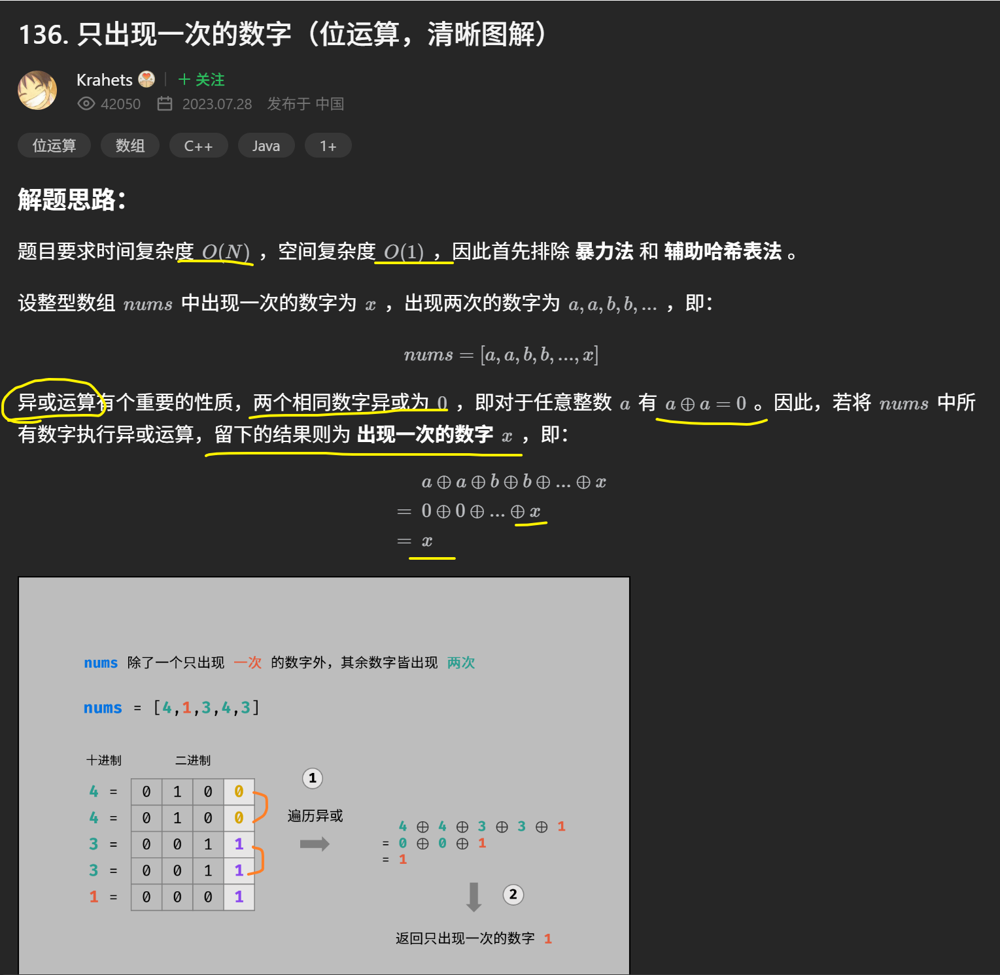

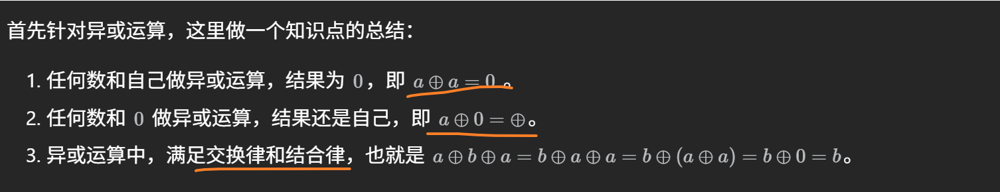

异或è¿ç®—满足**交æ¢å¾‹** a⊕b=b⊕a ，å³ä»¥ä¸Šè¿ç®—结æœä¸ nums 的元素顺åºæ— å…³ã€‚

~~~C++
class Solution {
public:
    int singleNumber(vector<int>& nums) {
        
        // 异或 消除相åŒçš„æ•°å­—

        int ans = 0;
        for (int val : nums)
        {
            ans ^= val; // éå†nums 执行异或，最å留下的就是出ç°ä¸€æ¬¡çš„æ•°å­—
        }

        return ans;
    }
};
~~~


ACM 

~~~C++
#include <vector>
#include <iostream>

using namespace std;

// 136 åªå‡ºç°ä¸€æ¬¡çš„æ•°å­—

int singleNumber(vector<int>& nums) {
    
    // 异或 消除相åŒçš„æ•°å­—

    int ans = 0;
    for (int val : nums)
    {
        ans ^= val; // éå†nums 执行异或，最å留下的就是出ç°ä¸€æ¬¡çš„æ•°å­—
    }

    return ans;
}

int main()
{
    vector<int> nums = {2, 2, 3, 3, 4};
    int ans = singleNumber(nums);
    cout << ans << endl;
    
    return 0;
}
~~~


## 169 [多数元素](https://leetcode.cn/problems/majority-element/description/?envType=study-plan-v2&envId=top-100-liked)

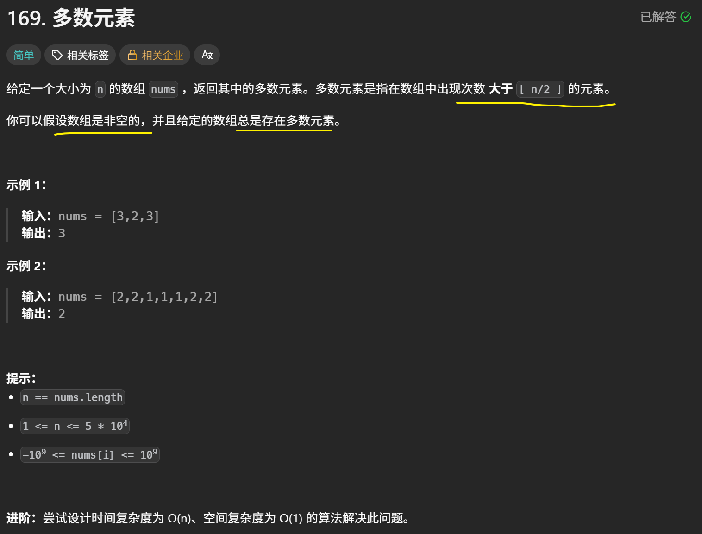


### 1ã€å“ˆå¸Œè¡¨

~~~C++
class Solution {
public:
    int majorityElement(vector<int>& nums) {


        unordered_map<int, int> counts;// 存储æ¯ä¸ªå…ƒç´ å‡ºç°çš„次数
        
        int majority = 0; // 出ç°æœ€å¤šçš„元素
        int cnt = 0;      // 出ç°æœ€å¤šçš„次数

        for (int num : nums)
        {
            counts[num]++; // 计数
            if (counts[num] > cnt)
            {
                majority = num;
                cnt = counts[num];
            }
        }

        return majority;        
    }
};
~~~

时间å¤æ‚度：O(n)

空间å¤æ‚度：O(n)


### 2ã€æ’åº


~~~C++
class Solution {
public:
    int majorityElement(vector<int>& nums) {
        
        // æ’åº
        sort(nums.begin(), nums.end());
        return nums[nums.size() / 2]; // 下标[n/2]处是众数
    }
};
~~~

时间å¤æ‚度：O(nlogn)。

空间å¤æ‚度：O(logn)。如æœä½¿ç”¨è¯­è¨€è‡ªå¸¦çš„æ’åºç®—法，需è¦ä½¿ç”¨ O(logn) 的栈空间。如æœè‡ªå·±ç¼–写堆æ’åºï¼Œåˆ™åªéœ€è¦ä½¿ç”¨ O(1) çš„é¢å¤–空间。


### 3ã€æ‘©å°”投票

è®°ä½ç»“论就好

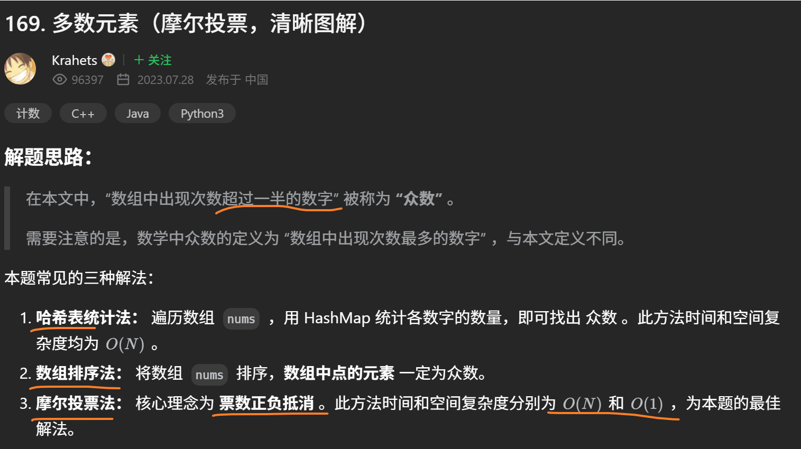


~~~C++
class Solution {
public:
    int majorityElement(vector<int>& nums) {

        // 摩尔投票（直æ¥è®°ä½æ–¹æ³•ï¼‰

        int candidate = 0; // 候选众数
        int votes = 0; // 投票

        for (int num : nums)
        {
            if (votes == 0) candidate = num; // æ¯å½“votes=0，更新候选众数
            votes += (num == candidate ? 1 : -1); // num = candidate 投票+1，å¦åˆ™-1
        }

        return candidate;    
    }
};
~~~


### ACM

~~~C++
#include <vector>
#include <iostream>
using namespace std;

// 169 多数元素

int majorityElement(vector<int>& nums) {

    // 摩尔投票

    int candidate = 0; // 候选众数
    int votes = 0; // 投票

    for (int num : nums)
    {
        if (votes == 0) candidate = num; // æ¯å½“votes=0，更新候选众数
        votes += (num == candidate ? 1 : -1); // num = candidate 投票+1，å¦åˆ™-1
    }

    return candidate;
}


int main()
{
    vector<int> nums = {2,2,1,1,1,2,2};
    int ans = majorityElement(nums);

    cout << ans << endl;

    return 0;
}
~~~


## 75 [颜色分类](https://leetcode.cn/problems/sort-colors/description/?envType=study-plan-v2&envId=top-100-liked)

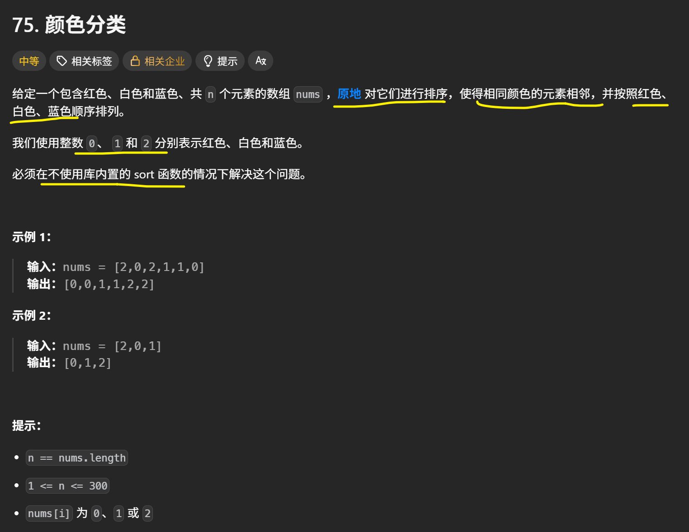


å¤æ‚度分æ

- 时间å¤æ‚度：O(*n*)，其中 *n* 是 *nums* 的长度。
- 空间å¤æ‚度：O(1)。


**æ¨¡æ‹Ÿå‘ nums 有åºçš„ [0, i-1] 范围，æ’å…¥nums[i]，然åå˜æˆæœ‰åºçš„ [0, i] 范围**，å‘åéå†ï¼Œç›´åˆ°nums最å。

**三个ä½ç½®ï¼š**

- p0 ：维护 0 的个数，表示下一个è¦æ’å…¥0 çš„ä½ç½®
- p1：维护 1 的个数，表示下一个è¦æ’å…¥1çš„ä½ç½®
- i ： éå†ä¸‹æ ‡ï¼Œæ’å…¥nums[i]å的有åºèŒƒå›´å°±æ˜¯ [0, i]，也就是目å‰æœ‰åºæ•°ç»„的最å一个ä½ç½®ï¼Œè¡¨ç¤ºè¦æ”¹æˆ2çš„ä½ç½®

**1ã€æ’入值，直æ¥æ”¹æœ€å一个值为2**——  `nums[i] = 2`

> 因为 2 ä½ç½®å‰æ˜¯åŒ…括0 å’Œ 1 å’Œ 2 的，所以æ’0æ’1æ’2都è¦åŠ¨è¿™ä¸ªä½ç½®

- 如æœæ’入的是2，那正好 2 应该放在最å
- 如æœæ’入的ä¸æ˜¯2，下é¢çš„ `if 0 or 1` 会覆盖å‰é¢åº”该是 0 or 1çš„ä½ç½®ï¼Œä¹Ÿç›¸å½“äºæŠŠ2挪到了最å

**2ã€å¦‚æœæ’入的是 0 或 1 —— 修改 p1 ä½ç½®ä¸º1，并å移 p1**  `nums[p1++] = 1`

> 因为 p1 ä½ç½®å‰æ˜¯åŒ…括0 å’Œ 1 的，所以æ’0æ’1都è¦åŠ¨è¿™ä¸ªä½ç½®

- 如æœæ’的是1，改完这个ä½ç½®ï¼Œç»“æŸ
- 如æœæ’的是0，下é¢çš„`if 0` 会覆盖å‰é¢åº”该是 0 çš„ä½ç½®ï¼Œä¹Ÿç›¸å½“äºæŠŠ 1 å移了

**3ã€å¦‚æœæ’入的是0 —— 修改 p0 ä½ç½®ä¸º0，并å移 p0** `nums[p0++] = 0`

- ç›´æ¥æ”¹ p0 ä½ç½®ï¼Œéœ€è¦å移的 1 å’Œ 2 都在上é¢å¤„ç†äº†


~~~C++
class Solution {
public:
    void sortColors(vector<int>& nums) {

        int p0 = 0; // 维护0的个数（下标）
        int p1 = 0; // 维护1的个数（下标）

        
        for (int i = 0; i < nums.size(); i++)
        {
            int x = nums[i]; // ä¸æ–­å‘numsçš„[0, i-1] 中æ’å…¥å½“å‰ nums[i]

            nums[i] = 2;                // ç›´æ¥æœ€å一个ä½ç½®æ”¹ä¸º2，2始终在最å
            if (x <= 1) nums[p1++] = 1; // æ’入的是 0 或 1 
            if (x == 0) nums[p0++] = 0; // æ’入的是 0
        }
        
    }
};
~~~


ACM

~~~C++
#include <vector>
#include <iostream>
using namespace std;

// 75 颜色分类

void sortColors(vector<int>& nums) {

    int p0 = 0; // 维护0的个数（下标）
    int p1 = 0; // 维护1的个数（下标）

    
    for (int i = 0; i < nums.size(); i++)
    {
        int x = nums[i]; // ä¸æ–­å‘numsçš„[0, i-1] 中æ’å…¥å½“å‰ nums[i]

        nums[i] = 2;                // ç›´æ¥æœ€å一个ä½ç½®æ”¹ä¸º2，2始终在最å
        if (x <= 1) nums[p1++] = 1; // æ’入的是 0 或 1 
        if (x == 0) nums[p0++] = 0; // æ’入的是 0
    }
    
}


int main()
{
    vector<int> nums = {2, 0, 2, 1, 1, 0};
    sortColors(nums);
    for (int val : nums)
    {
        cout << val << " ";
    }
    cout << endl;

    return 0;
}

~~~


## 31 [下一个æ’列](https://leetcode.cn/problems/next-permutation/description/?envType=study-plan-v2&envId=top-100-liked)


åƒåœ¾é¢˜ç›®æè¿°

评论区给的示例：[1, 2, 3] æ’列组åˆï¼Œä»å°åˆ°å¤§

[1, 2, 3] 123
[1, 3, 2] 132
[2, 1, 3] 213
[2, 3, 1] 231
[3, 1, 2] 312
[3, 2, 1] 321

[1,2,3]下一个就是[1, 3, 2]
[2, 3, 1]的下一个就是[3, 1, 2]
[3, 2, 1]的下一个是[1, 2, 3] å›åˆ°èµ·ç‚¹


~~~C++
class Solution {
public:
    void nextPermutation(vector<int>& nums) {

        int n = nums.size();

        // [1, 3, 5, 4, 2] æ’列组åˆé‡Œé¢çš„数字，找下一个比13542大的组åˆ

        // 1. ä»å³å‘左找到第一个å°äºå³ä¾§ç›¸é‚»æ•°å­—çš„æ•° nums[i] (3)
        int i = n - 2;
        while (i >=0 && nums[i] >= nums[i + 1]) i--;


        // 找到，进入第2步；å¦åˆ™(i < 0)跳过第2步，说æ˜ç°åœ¨æ’列递å‡ï¼Œæ˜¯æœ€å¤§æ•°        
        if (i >= 0) 
        {
            // 2. ä»å³å‘左，找到 i å³ä¾§ç¬¬ä¸€ä¸ªå¤§äº nums[i](3) çš„æ•° nums[j](4)，交æ¢
            int j = n - 1;
            while (j > i && nums[i] >= nums[j])  j--;
  
            swap(nums[i], nums[j]); // [1, 4, 5, 3, 2]
        }


        // 3 å转 æ–°nums[i] åé¢çš„æ•° -  [1, 4, 2, 3, 5]
        reverse(nums.begin() + i + 1, nums.end());
        
    }
};
~~~

å¤æ‚度分æ

- 时间å¤æ‚度：O(*n*)，其中 *n* 是 *nums* 的长度。最å情况下需è¦éå†æ•´ä¸ª *nums* 数组。
- 空间å¤æ‚度：O(1)。


ACM

~~~C++
#include <vector>
#include <iostream>
using namespace std;

// 31 下一个æ’列


void nextPermutation(vector<int>& nums) {

    int n = nums.size();

    // [1, 3, 5, 4, 2] æ’列组åˆé‡Œé¢çš„数字，找下一个比13542大的组åˆ

    // 1. ä»å³å‘左找到第一个å°äºå³ä¾§ç›¸é‚»æ•°å­—çš„æ•° nums[i] (3)
    int i = n - 2;
    while (i >=0 && nums[i] >= nums[i + 1]) i--;


    // 找到，进入第2步；å¦åˆ™(i < 0)跳过第2步，说æ˜ç°åœ¨æ’列递å‡ï¼Œæ˜¯æœ€å¤§æ•°        
    if (i >= 0) 
    {
        // 2. ä»å³å‘左，找到 i å³ä¾§ç¬¬ä¸€ä¸ªå¤§äº nums[i](3) çš„æ•° nums[j](4)，交æ¢
        int j = n - 1;
        while (j > i && nums[i] >= nums[j])  j--;

        swap(nums[i], nums[j]); // [1, 4, 5, 3, 2]
    }


    // 3 å转 æ–°nums[i] åé¢çš„æ•° -  [1, 4, 2, 3, 5]
    reverse(nums.begin() + i + 1, nums.end());
    
}


int main()
{
    vector<int> nums = {1, 2, 3};
    nextPermutation(nums);
    for (int val : nums)    cout << val << " ";
    cout << endl;

    return 0;
}
~~~


## 287 [寻找é‡å¤æ•°](https://leetcode.cn/problems/find-the-duplicate-number/description/?envType=study-plan-v2&envId=top-100-liked)

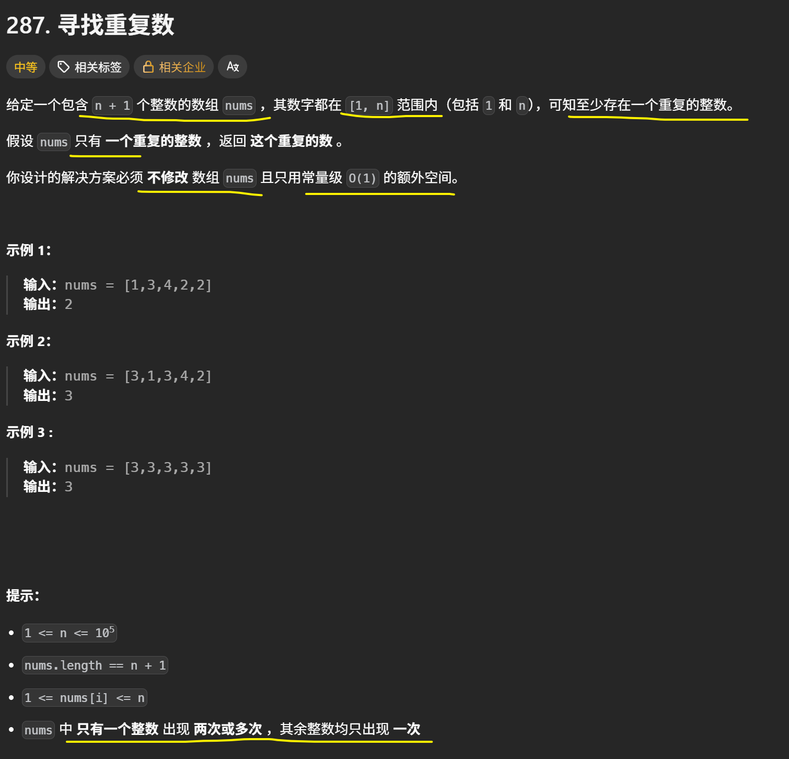


自己写的，但是ä¸è®©ä¿®æ”¹åŸæ•°ç»„，ä¸èƒ½æ’åºï¼Œç®—了

二分比较真正的中间值，和å®é™…的中间值，举个例å­çœ‹

时间å¤æ‚度：O(nlogn)

空间å¤æ‚度：O(1)

~~~C++
class Solution {
public:
    int findDuplicate(vector<int>& nums) {
    
        sort(nums.begin(), nums.end());

        // [1, 2, 2, 3, 4] 对应的没有é‡å¤çš„数组：
        // [1, 2, 3, 4, 5]
        
        // 比较中间值，二分

        int left = 0;
        int right = nums.size() - 1; // åæ ‡

        while (left <= right)
        {
            int midnum = ((left + 1) + (right + 1)) / 2; // 真正的中间值[3] 
            int midIndex = left + ((right - left) / 2); 
            
            if (nums[midIndex] >= midnum) // å¾€å³æ‰¾ 
            {
                left = midIndex + 1;
            }
            else // 往左找 [2] < [3]
            {
                right = midIndex - 1;
            }
        }

        return nums[right];
        
    }
};
~~~


### 1ã€äºŒåˆ†

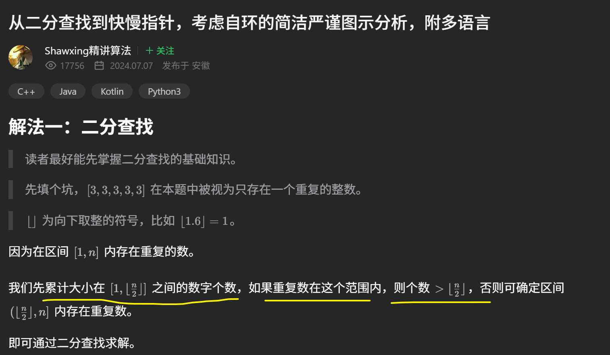


~~~C++
class Solution {
public:
    int findDuplicate(vector<int>& nums) {
        // [1, 3, 4, 2, 2]

        // 数值范围 min，max 是 1 到 n  [1,4]
        int min = 1; 
        int max = nums.size(); 

        while (min < max)
        {
            int mid = (min + max) / 2; // 数值的中间值 (1 + 4)/2 = 2

            // 统计[1,n/2]范围的数字个数 [1,2]
            int cnt = 0; 
            for (int v : nums)
            {
                if (v >= min && v <= mid)    cnt++; 
            }

            // 个数超过范围应有的长度，å³å­˜åœ¨é‡å¤æ•° （[1,2]应该åªæœ‰ä¸¤ä¸ªæ•°ï¼Œä½†nums中有3个）
            if (cnt > mid - min + 1)    max = mid;
            else                        min = mid + 1;
        }
        
        return min; // 最åminåœåœ¨ç›®æ ‡æ•°å­—上
    }
};
~~~

