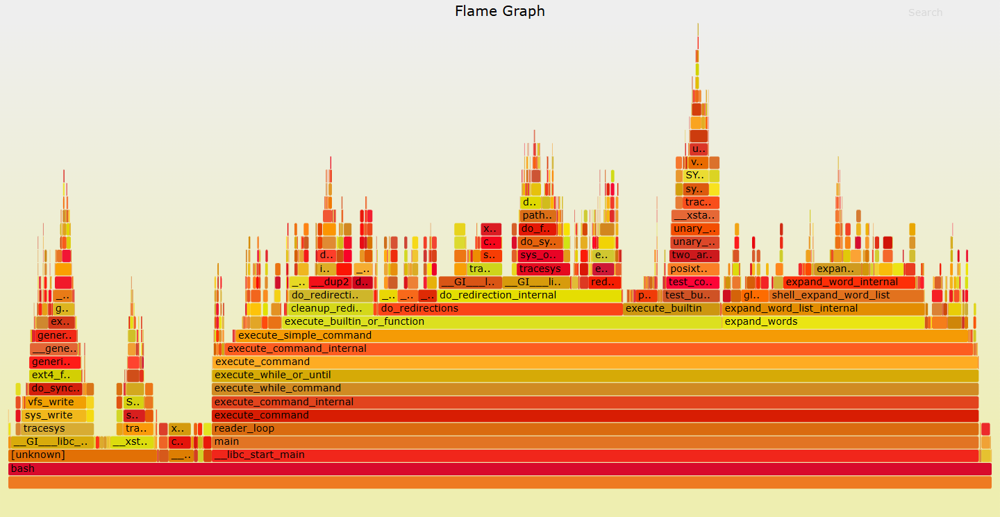
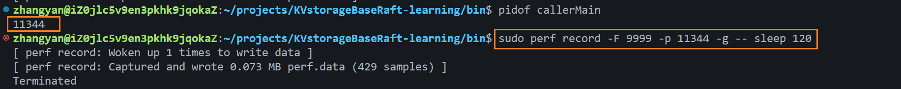
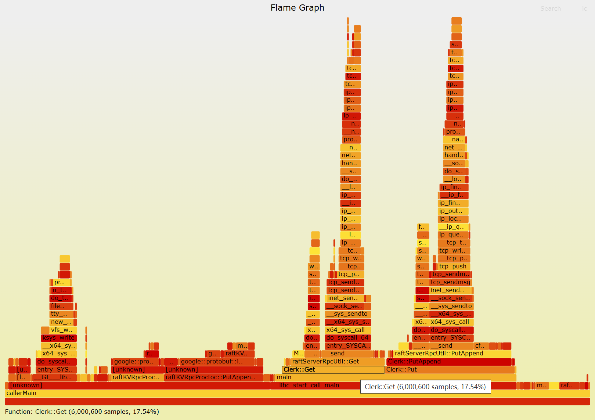

> [火焰图官方介绍](https://www.brendangregg.com/flamegraphs.html)
>
> 火焰图的生成原理与构建方式 - 博客园[ wsg_blog  ](https://home.cnblogs.com/u/go-ahead-wsg/)
>
> 火焰图生成与分析 - 知乎[沃德锅](https://www.zhihu.com/people/Linuxer-cc)


# 火焰图介绍

火焰图是一种性能分析工具，用 “火焰形状” 展示**程序调用栈和耗时**的图表，能直观地告诉你程序 **CPU 时间都花在哪儿**，帮助快速找到性能瓶颈。




火焰图能做什么：

- 可以分析函数执行的频繁程度
- 可以分析哪些函数经常阻塞
- 可以分析哪些函数频繁分配内存


## 火焰图类型

常见的火焰图类型有 On-CPU，Off-CPU，还有 Memory，Hot/Cold，Differential 等等。它们有各自适合处理的场景。

| 火焰图类型 | 横轴含义                  | 纵轴含义 | 解决问题                                                     | 采样方式                                                   |
| ---------- | ------------------------- | -------- | ------------------------------------------------------------ | ---------------------------------------------------------- |
| on-cpu     | cpu占用时间               | 调用栈   | 找出**cpu占用高**的问题函数；分析代码热路径                  | 固定频率**采样cpu**调用栈                                  |
| off-cpu    | 阻塞时间                  | 调用栈   | i/o、网络等**阻塞**场景导致的性能下降；**锁竞争、死锁**导致的性能下降问题 | 固定频率**采样阻塞事件**调用栈                             |
| 内存       | 内存申请/释放函数调用次数 | 调用栈   | 内存泄漏问题；内存占用高的对象/申请内存多的函数；虚拟内存或物理内存泄漏问题 | 有四种方式：跟踪malloc/free；跟踪brk；跟踪mmap；跟踪页错误 |
| Hot/Cold   | on-cpu和off-cpu综合展示   | 调用栈   | 需要结合cpu占用以及阻塞分析的场景；off-cpu火焰图无法直观判断的场景 | on-cpu火焰图和off-cpu火焰图结合                            |


**什么时候使用 On-CPU 火焰图? 什么时候使用 Off-CPU 火焰图呢?**

取决于当前的瓶颈到底是什么：

- 如果是 CPU 则使用 On-CPU 火焰图；如果是 IO 或锁则使用 Off-CPU 火焰图
- 如果无法确定, 那么可以通过压测工具来确认
- 通过压测工具看看能否让 **CPU 使用率趋于饱和**，如果能那么使用 On-CPU 火焰图
- 如果不管怎么压，**CPU 使用率始终上不来**, 那么多半说明程序**被 IO 或锁卡住了**, 此时适合使用 Off-CPU 火焰图
- 如果还是确认不了, 那么不妨 On-CPU 火焰图和 Off-CPU 火焰图都搞搞, 正常情况下它们的差异会比较大, 如果两张火焰图长得差不多, 那么通常认为 CPU 被其它进程抢占了.


## 特征与分析

**火焰图的特征（这里以 on-cpu 火焰图为例）：**

- 每一列代表一个调用栈，每一个格子代表一个函数

- y 轴：表示调用栈, 每一层都是一个函数. 调用栈越深, 火焰就越高, 顶部就是正在执行的函数, 下方都是它的父函数

- x 轴：表示抽样数, 如果一个函数在 x 轴占据的宽度越宽，就表示它被抽到的次数多，即执行的时间长

  > 注意 x 轴不代表时间，而是所有的调用栈合并后，按字母顺序排列的

- 横轴格子的宽度：代表其在采样中出现频率，所以一个格子的宽度越大，说明它是瓶颈原因的可能性就越大。

- 火焰图格子的颜色是随机的暖色调，方便区分各个调用信息。

- 其他的采样方式也可以使用火焰图， on-cpu 火焰图横轴是指 cpu 占用时间，off-cpu 火焰图横轴则代表阻塞时间。

- 采样可以是单线程、多线程、多进程甚至是多 host


**火焰图分析**

- 纵轴代表调用栈的深度（栈桢数），函数间调用关系：<span style="color:#0000FF;">下面的函数是上面函数的父函数</span>。
- 横轴代表调用频次，<span style="color:#0000FF;">一个格子的宽度越大</span>，越说明其可能是瓶颈原因。
- **底部的方块**：表示程序的入口函数，比如 `main`。
- **往上的方块**：表示调用链，谁调用了谁。
- **方块的宽度**：表示这个函数及它的子函数一共花了多少 CPU 时间（如果是on-cpu），越宽耗时越长。


**火焰图就是看<span style="color:#CC0000;">顶层的哪个函数占据的宽度最大</span>，只要有 “平顶”(plateaus)，就表示该函数可能存在性能问题。**


**无意义的事情：**

- 横向先后顺序是为了聚合，跟函数间依赖或调用关系无关；
- 火焰图各种颜色是为方便区分，本身不具有特殊含义


# 具体操作 perf + FlameGraph 

## 安装工具

### perf

 perf 是 Linux 系统原生提供的性能分析工具, 会返回 CPU 正在执行的函数名以及调用栈(stack)

~~~shell
sudo apt-get update
sudo apt-get install linux-tools-common linux-tools-generic linux-tools-$(uname -r)
~~~

> `linux-tools-common`
>
> - 提供 perf 工具的基础组件（一些通用脚本和配置）。
>
> `linux-tools-generic`
>
> - 提供一个“通用版本”的 perf 工具包，适配大部分内核版本。
>
> `linux-tools-$(uname -r)`
>
> - `$(uname -r)` 会被 shell 替换成当前正在运行的 Linux 内核版本号

安装好后测试，成功则输出版本号

~~~shell
perf --version
~~~


#### perf 的原理

每隔一个固定的时间，就在CPU上（每个核上都有）产生一个**中断**，在中断上看看，当前是哪个pid，哪个函数，然后给对应的pid和函数加一个统计值，这样，我们就知道CPU**有百分几的时间在某个pid，或者某个函数上了**。

`perf` 的采样是**基于进程（PID）**的，它会自动把该进程内的所有线程都采样到。


#### perf 常用命令

perf功能非常强大，我们这里只关注**record和report**功能，record和report也可以继续通过二级命令查询帮助文档。

~~~shell
perf -h
~~~

常用的五个命令

- perf list：查看当前软硬件环境支持的性能事件
- perf stat：分析指定程序的性能概况
- perf top：实时显示系统/进程的性能统计信息
- perf record：记录一段时间内系统/进程的性能事件
- perf report：读取perf record生成的perf.data文件，并显示分析数据（生成火焰图用的采集命令）


#### perf 采集数据

~~~shell
perf record -F 99 -p 3887 -g -- sleep 30
~~~

- `perf record` 表示采集系统事件, 没有使用 -e 指定采集事件, 则默认采集 cycles(即 CPU clock 周期)
- `-F 99` 表示每秒 99 次
- `-p 13204` 是进程号, 即对哪个进程进行分析
- `-g` 表示记录调用栈
- `sleep 30` 则是持续 30 秒.

> -F 指定采样频率为 99Hz(每秒99次)，如果 99次 都返回同一个函数名，那就说明 CPU 这一秒钟都在执行同一个函数，可能存在性能问题.

运行后会产生一个庞大的文本文件，如果一台服务器有 16 个 CPU，每秒抽样 99 次，持续 30 秒，就得到 47,520 个调用栈， 长达几十万甚至上百万行。

为了便于阅读，perf record 命令可以统计每个调用栈出现的百分比，然后从高到低排列

~~~shell
perf report -n --stdio
~~~


### FlameGraph 工具集

Brendan D. Gregg 的 Flame Graph 工程实现了一套生成火焰图的脚本。Flame Graph 项目位于 GitHub上

> https://github.com/brendangregg/FlameGraph 需要自己 clone

~~~shell
git clone git@github.com:brendangregg/FlameGraph.git
~~~


不同的 trace 工具抓取到的信息不同, 因此 Flame Graph 提供了一系列的 stackcollapse 工具。

**查看帮助**

~~~
./FlameGraph/flamegraph.pl -h
~~~


### 其他工具

**调试符号包（可选但推荐）**

- 让火焰图显示函数名，而不是地址。

- 安装对应的调试符号包（Ubuntu 系列）：

  ```
  sudo apt-get install libc6-dbg gdb
  ```

**hotspot**（GUI 工具，火焰图可视化）：

```
sudo apt-get install hotspot
```


## 生成火焰图步骤

### 基本步骤

| 流程       | 描述                                                         | 脚本                               |
| ---------- | ------------------------------------------------------------ | ---------------------------------- |
| 捕获堆栈   | 使用 perf/systemtap/dtrace 等工具**抓取程序的运行堆栈**      | perf/systemtap/dtrace              |
| 折叠堆栈   | trace 工具抓取的系统和程序运行每一时刻的堆栈信息, 需要对他们进行分析组合, 将**重复的堆栈累计在一起**, 从而体现出负载和关键路径 | FlameGraph 中的 stackcollapse 程序 |
| 生成火焰图 | 分析 stackcollapse 输出的堆栈信息生成火焰图                  | flamegraph.pl                      |

**流程总结：**

1. `perf record` → 采样生成 `perf.data`
2. `perf script > out.perf` → 转成可读的调用栈格式
3. `stackcollapse-perf.pl` → 折叠调用栈，得到 `out.folded`
4. `flamegraph.pl` → 生成 `flamegraph.svg`


### 示例

> 以项目“分布式kv存储”为例

#### 修改CMakeLists.txt

首先在顶层CMakeLists.txt中添加

~~~bash
# 调试 火焰图
set(CMAKE_CXX_FLAGS "${CMAKE_CXX_FLAGS} -g -O2 -fno-omit-frame-pointer")
~~~

- `-g`：保留调试符号（看到函数名）
- `-O2`：有优化，运行更接近真实场景
- `-fno-omit-frame-pointer`：保留栈指针，方便 perf 采样调用栈

编译完后，`./build/` 里的二进制文件就能被 perf 使用。

#### 启动项目

~~~bash
./rpcprovider 					# 开启rpc 服务
./raftCoreRun -n 3 -f test.conf # 开启 raft 集群（3个节点）
./callerMain 					# 模拟客户端持续向集群发送 Put 和 Get 请求
~~~

可以让客户端持续（但是进程会改变，再议）

~~~bash
while true; do ./callerMain; sleep 0.1; done
~~~


#### 1、确认目标进程 PID

火焰图要对这个进程采样CPU占用情况（`./callerMain` 模拟客户端持续向集群发送 Put 和 Get 请求）

~~~bash
pidof callerMain # callerMain 的进程
~~~




#### 2、perf 采样 –>  `perf.data`

这种是直接挂在已有线程（刚才的callerMain的1344）上来采样：

```bash
sudo timeout 60 perf record -F 9999 -g -p 11344
```

- `timeout 60`：让 perf 在 60 秒后自动停止，如果不加就手动停止
- `perf record`：启动性能采样。
  - `-F 99`：采样频率 99Hz（即每秒 99 次，常用值）看情况调整
  - `-p 11344`：让 perf 附加到 PID=11344 的进程上
  - `-g`：收集调用栈信息（生成火焰图需要）


或者直接写成执行新命令，并采样它：

~~~bash
perf record -F 99 -g -- ./callerMain
~~~

- perf 会直接启动 `./callerMain` 并监控它的生命周期

- `--` 之后是新启动的命令

- 默认会一直采样，直到你 `Ctrl+C` 结束

- 如果只想采样 60 秒，也可以加 `timeout 60`

  ~~~bash
  sudo timeout 60 perf record -F 99 -g -p 11344
  ~~~

  

采样结束后，会在当前目录生成一个 **`perf.data` 文件**。


#### 3、生成 perf script   `perf.data` ➡️ `out.perf`

把 `perf.data` 转换为可读格式：

~~~bash
sudo perf script > out.perf
~~~


#### 4、用 `FlameGraph` 工具生成火焰图

> 已经下载了 Brendan Gregg 的 [FlameGraph 工具](https://github.com/brendangregg/FlameGraph)，并放在 `~/FlameGraph/` 目录下。

执行：

~~~bash
cat out.perf | ~/FlameGraph/stackcollapse-perf.pl > out.folded
cat out.folded | ~/FlameGraph/flamegraph.pl > flamegraph.svg
~~~

第一步：**格式转换和折叠调用栈**， `perf script` 原始采样 ➡️ FlameGraph 可用统计文件 `out.folded` 

- `cat out.perf`   读取 `perf script` 的结果文件（`out.perf`，里面是采样得到的调用栈信息）

- `|`（管道）  把前一个命令的输出传给后一个命令

- `~/FlameGraph/stackcollapse-perf.pl`  这是 FlameGraph 提供的一个 Perl 脚本，作用是把 perf 的原始调用栈输出“压缩折叠”成 flamegraph 能识别的格式

  > 例如，把多次相同的调用栈合并成一行，并统计它出现的次数。

- `> out.folded`  把处理后的结果保存到 **`out.folded` 文件**中。这个文件就是 flamegraph 的输入。

第二步：**根据调用栈统计数据生成 SVG 格式的火焰图**  `out.folded` ➡️`flamegraph.svg`

- `cat out.folded` 读取刚才生成的折叠调用栈文件。
- `| ~/FlameGraph/flamegraph.pl` 再传给 FlameGraph 的主脚本 `flamegraph.pl`，它会根据调用栈统计数据生成 SVG 格式的火焰图。
- `> flamegraph.svg` 输出最终的火焰图文件，保存为 `flamegraph.svg`。


#### 5、火焰图分析

火焰图已经生成在 `flamegraph.svg`，你可以**用浏览器直接打开它**（vscode远程里下载到本地再拖到浏览器里打开），进行放大、搜索，查看 CPU 的热点函数和调用路径。



- **鼠标悬浮** ：火焰的每一层都会标注函数名，鼠标悬浮时会显示完整的函数名、抽样抽中的次数、占据总抽样次数的百分比。
- **点击放大** ：在某一层点击，火焰图会水平放大，该层会占据所有宽度，显示详细信息
- **左上角会同时显示"Reset Zoom**"，点击该链接，图片就会恢复原样
- **搜索**：按下 Ctrl + F 会显示一个搜索框，用户可以输入关键词或正则表达式，所有符合条件的函数名会高亮显示。


