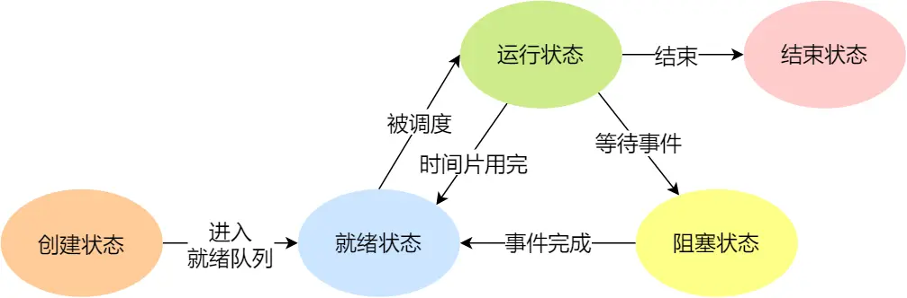
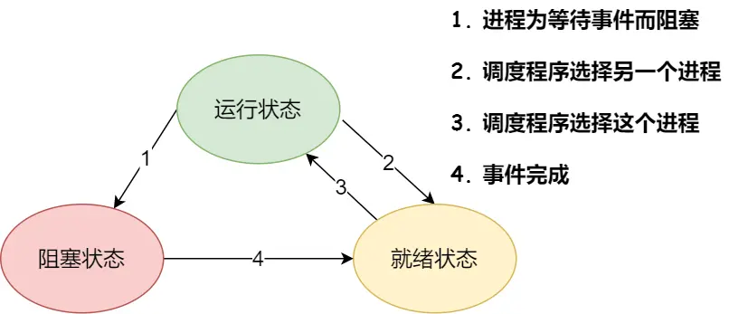

# 线程进程

## 进程

进程**资源分配**的基本单位。

运行一个可执行程序，会创建一个或多个进程。**进程就是运行起来的可执行程序。**

**进程的状态：创建，就绪，运行，阻塞，结束**

**基本状态：**

- 创建状态 New
  - 进程正在被创建
- 结束状态 Exit
  - 进程正在从系统中消失

**活动期间：**

- 运行状态 Running
  - 该时刻进程占用CPU
- 就绪状态 Ready
  - 可运行，由于其他程序处于运行状态，而暂时停止运行

- 阻塞状态 
  - 该进程正在等待某一事件发生（比如等待输入输出的完成），而暂时停止运行
  - 这时即使给它CPU的控制权，也无法运行

## 线程

线程是**资源调度**的基本单位，程序执行的基本单位。

进程中的一条执行流程。

一个进程可以运行多个线程，每个进程中都有唯一的主线程。

线程之间可以并发运行，共享相同的地址空间。

## 进程、线程、协程

**进程：**

- 进程是程序**资源分配**的最小单位。

- 进程是操作系统进行资源分配和调度的一个独立单位，是**程序执行的实例**。每个进程都有自己的独立内存空间和系统资源。

**线程：**

- 线程是**资源调度**的最小单位。

- 线程是**进程中的一个执行单元**，也是处理器调度和分派的基本单位。
- 一个进程可以包含多个线程，所有线程共享进程的资源，如内存空间和文件描述符等。

**协程：**

- 协程是一种**用户态的轻量级线程**，协程的调度完全由用户控制。

- 协程能保留上一次调用时的状态，每次过程重入时，就相当于进入上一次调用的状态。

**进程和线程的主要区别在于它们的内存空间：**

- 进程有自己独立的地址空间，每启动一个进程，系统就会为它分配地址空间，一个进程无法直接访问另一个进程的变量和数据结构，需要通过进程间通信机制（如管道、信号、套接字等）来实现

- 而同一进程下的所有线程共享同一地址空间和系统资源。

**线程和协程的主要区别**

- 协程的调度由**用户**自己控制

- 而线程的调度由**操作系统内核**负责

## Linux信号是？

是Linux进程通信的一种方式，用于通知接收进程，某个事件已经发生，比如按下Ctrl + C就是信号。

## 信号量的处理

信号量是Linux进程通信的一种方式。

信号量是一个计数器，可以用来控制多个仅对共享资源的访问。

常作为一种锁机制，实现进程、线程对临界区的同步及互斥访问

## Gil锁  Global Interpreter Lock

是一种在解释器中使用的机制，作用是在任何时刻限制解释器在一个进程中只能执行一个线程。

作用：

- 线程安全

  - GIL确保了在任何给定时间点，只有一个线程可以执行Python字节码。

  - 这简化了解释器的实现，因为开发者不需要担心多个线程同时操作Python对象时的线程安全问题。

- 简化内存管理
  - 特别是对于垃圾收集和引用计数，GIL减少了并发执行时复杂的同步和锁定需求。

局限：多核利用不足，性能问题

应对策略：使用多进程

### 多线程库有哪些？

POSIX Threads（Pthreads）

C++ 11 （及以上版本）标准线程库

OpenMP（Open Multi-Processing）

Intel Threading Building Blocks（TBB）

Boost.Thread
