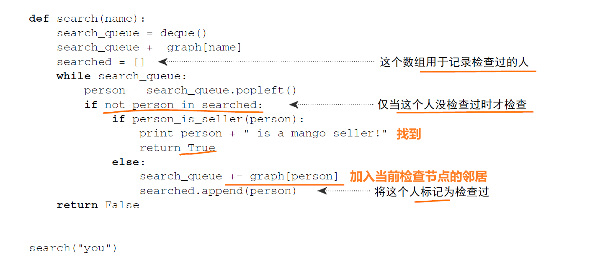
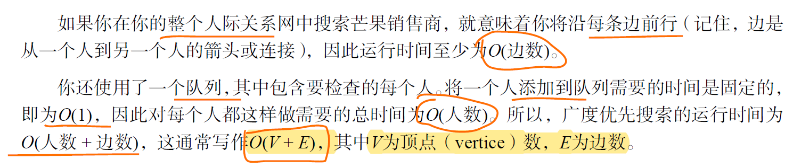

# 复杂度

## 时间复杂度

时间复杂度分析统计的**不是算法运行时间**，而是算法运行**时间随着数据量变大时的增长趋势**。

### 常见复杂度

#### O(1) O(n) O($n^2$)

#### 指数阶 O($2^n$)

#### 对数阶 O(log n)

#### 线性对数阶 O(n log n)

#### 阶乘阶 O(n!)

### 常见结构和算法的复杂度

## 空间复杂度

### 常见类型

# 二叉搜索树 BST

**二叉搜索树 BST：**左子树的节点值都小于根节点，右子树的节点值都大于根节点

> **平衡二叉树 AVL（**平衡二叉搜索树）：带有平衡的二叉搜索树

**BST的缺点**：

**二叉搜索树在不断插入的时候，可能会退化成链表：**

比如 BST树的节点正好从大到小的插入，那就会一路向左下插入，此时树的结构类似链表，查找或写入的耗时与链表也相同。

**为了避免这种情况，引入了 平衡二叉树 和 红黑树**

都是通过自身的建树原则来控制树的层数和节点位置，且红黑树是从AVL树演变过来的。

# 平衡二叉树 AVL

**AVL 树本质上是带了平衡功能的二叉搜索树**：

- 拥有二叉搜索树的性质，左子树 < root < 右子树

- 其任何子树也都是AVL树
- 带有平衡条件，即每个节点的左右子树高度差最多为1

在插入、删除树节点的时候，如果破坏了以上的原则，**AVL树会自动进行调整**使得以上三条原则仍然成立。

## AVL树插入节点

AVL树插入新节点后可能会失衡，所以这也是AVL树处理插入节点的操作。

### 平衡因子

BF （Balance Factor）平衡因子 = **左子树高度 - 右子树高度**

一般来说 BF 的绝对值大于 1，,平衡树二叉树就失衡

### 失衡判断

比如图中树插入一个新节点 key = 1 后，接在节点2的左侧，现在就违反了高度差最多为1

**失衡场景有 4 种：**

- 左左结构失衡  LL
- 右右结构失衡  RR
- 左右结构失衡  LR
- 右左结构失衡  RL

此时 AVL 树会通过 **节点的旋转** 来恢复平衡 —— 左旋、右旋

### 旋转恢复平衡

旋转之前要找到**最小失衡树**：在新插入节点向上找，第一个不平衡的树（BF > 1）。

确定**旋转支点 pivot**：

- pivot 就是失衡的这部分树，要进行旋转的支点，也是调整后新树的新根节点。

- pivot 是要**旋转的那部分树，根节点的左或者右子节点**（左边失衡找左子节点，右边失衡找右）

**任何情况的失衡都可以用左旋和右旋来调整，旋转就是以pivot为支点进行旋转。**

旋转在图上像是**将pivot(支点)节点向上提**（将它提升为root节点），而后两边的节点会物理的分布在新root节点的两边，然后按照【左子树 <  root  <  右子树】的规则，再调整其他节点。

> 在考虑旋转的时候，只关注失衡子树，不要扩大到整棵树，容易混乱
>
> 左旋就是逆时针转，右旋就是顺时针转
>
> 旋转的方向，与失衡的方向相反

#### LL 型失衡 —— 右旋

不平衡子树在root的左侧，插入的元素也在不平衡元素的左侧

- 以root 的左子节点为支点pivot，进行右旋，pivot作为新root

- pivot的父节点 root，旋转为自己的右子树；pivot的右子树，变成原 root的左子树

~~~C++
Node* RightRotate(Node* root)
{
    if(nullptr == root) return nullptr;
    Node* p = root->left;
    Node* q = root;
    q->left = p->right;
    p->right = q;
    return p; // pivot
}
~~~

#### RR 型失衡 —— 左旋

不平衡子树在root右侧，插入的元素也在不平衡子树的右侧

- 以root 的右子节点为支点 pivot，进行左旋
- pivot的父节点 root，旋转为自己的左子树；pivot的左子树，变成原 root的右子树

~~~C++
Node* LeftRotate(Node* root)
{
    if(nullptr == root) return nullptr;
    Node* q = root->right;
    Node* p = root;
    p->right = q->left;
    q->left = p;
    return q; // pivot
}
~~~

#### LR 型失衡 —— 左旋 + 右旋

不平衡子树在root左侧，但是新插入元素在不平衡子树的右侧

> 旋转的反向，**与失衡的方向相反**，LR型，对应先右旋，后左旋，
>
> 但是要先旋转底部（R —— 左旋），再转顶部 （L —— 右旋）

**先左旋不平衡子树，后右旋整体**

~~~C++
Node* LeftRightRotate(Node* root)
{
    if(nullptr == root) return nullptr;
    Node* k = root;
    Node* p = root->left;
    Node* q = p->right;
    k->left = LeftRotate(p); // 左旋root->left
    return RightRotate(k); // 右旋root
}
~~~

#### RL 型失衡 —— 右旋 + 左旋

不平衡子树在root右侧，但是新插入元素在不平衡子树的左侧

> 旋转的反向，**与失衡的方向相反**，RL型，对应先左旋，后右旋
>
> 但是要先旋转底部（L —— 右旋），再转顶部 （R —— 左旋），看图！看图！看图！

所以是 **先右旋不平衡子树，后左旋整体**

~~~C++
Node* RightLeftRotate(Node* root){
    if(nullptr == root) return nullptr;
    Node* k = root;
    Node* p = root->right;
    Node* q = p->left;
    k->right = RightRotate(p); // 右旋 root->right
    return LeftRotate(k); // 左旋 root
}
~~~

## AVL树的删除

 AVL 树在删除节点后需要**重新检查平衡性并修正**，同时，删除操作与插入操作后的平衡修正区别在于，插入操作后只需要对插入栈中的弹出的第一个非平衡节点进行修正，而**删除操作需要修正栈中的所有非平衡节点**。

**主要考虑两个问题**

要删除的节点是什么类型的节点？删除后是否会破坏平衡 ？

**删除的节点类型**

1. 叶子节点
2. 节点只有左子树，或只有右子树 
3. 左右子树都有

**删除操作**

1. 删除叶子节点，直接删除
   - 依次往上判断父节点是否失衡，直到根节点
   - 遇到非平衡节点，则判断失衡类型（LL、LR、RR、RL），进行旋转
2. 删除节点只有左子树或只有右子树，将节点删除
   - 直接用左子树或右子树进行代替
   - 进行相应的平衡判断，若失衡则调整，一直到根节点 
3. 删除节点既有左子树又有右子树
   - 该节点为根结点的**右子树的最小值**代替当前节点
   - 再判断是否失衡，然后根据失衡情况调整，直到根节点

## 代码总结

树结构

判断是否是平衡二叉树

~~~C++
int depth(TreeNode* root)
{
    if(nullptr == root) return 0;
    int leftdepth = depth(root->left)+1;
    int rightdepth = depth(root->right)+1;
    return max(leftdepth, rightdepth); // 当前节点的高度
}

bool isBalanced(TreeNode* root) 
{
    if(root == nullptr) return true;
    int balancee_factor = depth(root->left) - depth(root->right); // 平衡因子
    
    if(nullptr != root->left){
       if(!isBalanced(root->left)) return false; // 递归判断左树
    }
    if(nullptr != root->right){
        if(!isBalanced(root->right)) return false; // 递归判断右树
    }
    
    return balancee_factor >= -1 && balancee_factor <= 1; // 平衡因子都小于1
}
~~~

平衡处理（判断 + 旋转）

~~~C++
int depth(Node* root)
{
    if(nullptr == root) return nullptr;
    return max(depth(root->left), depth(root->right))+1; // 高度
}

int BalancedFactory(Node* root)
{
    return depth(root->left)-depth(root->right); // 平衡因子
}

// 判断是否失衡，并进行旋转
Node* Balance(Node* root)
{
    int bf = BalancedFactory(root);
    
    // 左 - 右 = 2，处理root左边 —— L
    if(bf == 2) {
        if(BalancedFactory(root->left) == 1)	RightRotate(root)     // LL —— 右旋
        else									LeftRightRotate(root);// LR —— 左旋+右旋
    }
    // 右 - 左 = 2，处理root右边 —— R
    else if(bf == -2)
    {
        if(BalancedFactory(root->right) == -1)	LeftRotate(root); // RR —— 左旋
        else	RightLeftRotate(root); // RL —— 右旋 + 左旋
    }
    return root;
}
~~~

插入节点

~~~C++
Node* Add(Node* node, int val) // root 新节点值
{
    if(node == nullptr)	return new Node(val);
    
    // 递归插入
    if(val < node->val)	node->left = Add(node->left, val);
    else				node->right = Add(node->right, val);
    
    Balance(node); // 判断是否失衡，并进行旋转
    return node;
}
~~~

删除节点

~~~C++
Node* Del(Node* node, int val)
{
    if(nullptr == root) return nullptr;
    
    // 要删除的就是当前节点
    if(node->val == val)
    {
        if(nullptr==node->right && nullptr==node->left){ // 叶子节点  
            delete node;
            return nullptr;
        }
        
        if(nullptr == node->right){ // 右子树为空，直接使用待删除节点的左节点代替该结点
            Node* p = node->left;
            delete node;
            return p;
        }
        
        if(nullptr == node->left){ // 左子树为空，直接使用待删除节点的右节点代替该结点
            Node* p = node->right;
            delete node;
            return p;
        }
        
        // 左右子树都有，使用该节点为根结点的右子树的最小值代替当前节点
        Node* maxNode =  Min(node->right);
        node->val = maxNode->val;
        node->right = Del(node->right, maxNode->val); // 递归删除右子树最小值那个点
    }
    // 要删除的节点是在左侧，递归删除
    else if(node->val > val) {
        node->left == Del(node->left, val);
    }
    // 要删除的节点在右侧，递归删除
    else {
        node->right == Del(node->right, val);
    }
    
    return Balanced(node);// 平衡处理
}
~~~

## AVL树的缺点

虽然AVL树最坏情况的时间复杂度O(logn) ，要低于普通二叉树BST和链表的最坏情况O(n)。

但是AVL树必须保证左右子树平衡，**在插入的时候很容易出现不平衡**的情况，需要进行旋转以求达到平衡。

这会导致**AVL需要花大量时间在调整上**，故AVL树一般使用场景在于**查询场景**， 而不是 **增加删除频繁**的场景。

红黑树(rbt) 继承了AVL可自平衡的优点，同时, 红黑树(rbt)在**查询速率和平衡调整**中寻找平衡，放宽了**树的平衡条件**，从而可以用于 **增加删除频繁**的场景。

在实际应用中，红黑树的使用要多得多。

# 红黑树 RBT

> 参考：[红黑树图解](https://www.cnblogs.com/crazymakercircle/p/16320430.html)

红黑树（Red Black Tree）也是一种自平衡二叉查找树，与AVL树类似，都在添加和删除的时候通过旋转操作保持二叉树的平衡，以求更高效的查询性能。

与AVL树相比，**红黑树牺牲了部分平衡性**，以换取插入/删除操作时**较少的旋转**操作，整体来说性能要优于AVL树。

虽然红黑树更加复杂，但最坏情况运行时间也表现良好，实践中依然是高效的，它可以在**O(log n)**时间内做查找、插入和删除，n 是树中元素的数目。

红黑树是实际应用中最常用的平衡二叉查找树，它不严格的具有平衡属性，但平均的使用性能非常良好。

## 特性

在红黑树节点上，增加了 **颜色属性的数据**，节点被标记为红色和黑色两种颜色。

**一棵合法的红黑树必须遵循以下性质：**

- 节点非黑即红
- root 是黑色
- 叶子节点 NIL 是黑色
- 红色属性：**红节点的两个子节点都为黑节点**（从每个叶子到根的所有路径上不能有两个连续的红色节点）
- 黑色属性：任一节点，到任一叶子节点的所有路径，都包含**相同数目的黑色节点**

> 黑色属性，可以理解为**平衡特征**， 如果满足不了平衡特征，就要进行平衡操作

> 基于这些规则，一般在插入红黑树节点的时候，会将这个节点设置为红色：
>
> 因为根据最后一条规则，红色破坏原则的可能性最小，如果是黑色可能导致这条之路的黑色节点超过其他之路。

RBT有点属于一种**空间换时间**类型的优化，节点上增加了 **颜色属性的数据**，相当于增加了空间的消耗。 通过颜色属性的增加， 换取后面平衡操作的次数减少。

## 黑色完美平衡

红黑树并不是一颗AVL平衡二叉搜索树，平衡条件并不是用高度差来约束的，而是**以黑色节点的高度来约束**。

> 特性5：到叶子节点的路径，黑节点数目都相同

RBT的左子树和右子树的**黑节点的层数是相等的**，称红黑树这种平衡为 **黑色完美平衡**。

如果去掉其中的红节点，会得到：

## 红黑树恢复平衡

如果红黑树有不满足特性的情况，视为平衡被打破。

恢复平衡的三种操作：

- 变色
  - 红变黑，黑变红
- 左旋
  - pivot的父节点 root，旋转为自己的左子树；pivot的左子树，变成原 root的右子树
- 右旋
  - pivot的父节点 root，旋转为自己的右子树；pivot的右子树，变成原 root的左子树

## 插入节点分析

以HashMap中的红黑树的结构定义为例子：

~~~C++
static class Node<K,V> implements Map.Entry<K,V> {
    final int hash;
    final K key;
    volatile V val;
    volatile Node<K,V> next;
}

/**
 * Nodes for use in TreeBins
 */
static final class TreeNode<K,V> extends Node<K,V> {
    TreeNode<K,V> parent;  // red-black tree links
    TreeNode<K,V> left;
    TreeNode<K,V> right;
    TreeNode<K,V> prev;    // needed to unlink next upon deletion
    boolean red; // 默认红色

    TreeNode(int hash, K key, V val, Node<K,V> next,
             TreeNode<K,V> parent) {
        super(hash, key, val, next);
        this.parent = parent;
}
~~~

**默认新插入的节点为红色：**因为父节点为黑色的概率较大，插入新节点为红色，可以避免颜色冲突。

### 场景1：红黑树为空树

直接插入作为根节点，设置为黑色

### 场景2：插入节点的key已经存在

更新key节点的值，为插入节点的值

### 场景3：插入节点的父节点是黑色

由于插入的节点是红色的，当插入节点的父节点是黑色时，不会影响平衡。

所以可以直接插入，不需要自平衡

### 场景4：插入节点的父节点是红色

根据性质2，根节点是黑色 —— 如果插入节点的父节点是红色，那这个父节点不会是根节点，所以插入节点上层总是存在祖父节点。

根据性质4，每个红节点的子节点一定是黑色 —— 不能有两个红色相连

此时会出现两种状态：

- 父节点，叔节点都为红色

- 父节点红，叔节点黑

#### 4.1 父节点，叔节点都为红色

根据性质4，红色节点不能相连 —— 那祖父节点一定是黑色节点。

如果直接插入，从祖父到新节点，会出现 【黑 — 红 — 红（新节点）】的情况，需要进行**变色**。

变色处理：黑红红 — 红黑红

- 将F和V节点改为黑色
- 将P改为红色
- 将P设置为当前节点，进行后续处理

如果**P的父节点是黑色**，那么无需做处理；

但如果P的父节点是红色，就又违反红黑树性质了，所以需要将P设置为当前节点，继续插入操作，作自平衡处理，直到整体平衡为止。

#### 4.2 父节点红，叔节点黑

##### 情况1：LL型失衡

插入后变成LL型失衡

自平衡处理：**变色父节点，右旋祖父节点**

##### 情况2：LR型失衡

插入后变成LR型失衡。

自平衡处理：**左旋父节点，变成LL —— 变色—— 右旋**

##### 情况3：RR型失衡

自平衡处理：父节点变黑，祖父节点变红 —— 左旋祖父节点

##### 情况3：RL型失衡

自平衡处理：右旋父节点，变成RR情况 —— 变色，左旋祖父节点

## 红黑树和AVL的区别

**1、调整平衡的实现机制不同**

红黑树根据路径上黑色节点数目一致，来确定是否失衡，如果失衡，就通过变色和旋转来恢复。

AVL根据树的平衡因子(所有节点的左右子树高度差的绝对值不超过1)，来确定是否失衡，如果失衡，就通过旋转来恢复。

**2、红黑树的插入效率更高**

红黑树是用**非严格的平衡**来换取增删节点时候旋转次数的降低，**任何不平衡都会在三次旋转之内解决**，红黑树并不追求“完全平衡”，它只要求部分地达到平衡要求，降低了对旋转的要求，从而提高了性能。

而AVL是**严格平衡树**(高度平衡的二叉搜索树)，因此在增加或者删除节点的时候，根据不同情况，旋转的次数比红黑树要多。

所以红黑树的插入效率更高。

**3、红黑树统计性能比AVL树更高**

红黑树能够以**O(log n)** 的时间复杂度进行查询、插入、删除操作。

AVL树查找、插入和删除在平均和最坏情况下都是**O(log n)**。

红黑树的算法时间复杂度和AVL相同，**但统计性能比AVL树更高**，

**4、适用性：AVL查找效率高**

如果你的应用中，**查询的次数远远大于插入和删除，那么选择AVL树**，如果查询和插入删除次数几乎差不多，应选择红黑树。

即，有时仅为了排序（建立-遍历-删除），不查找或查找次数很少，R-B树合算一些。

# 图相关

## 图

图模拟一组连接，由【**节点node**】和【**边 edge**】组成。

每个节点与邻近的节点用边相连，相连的节点称为**邻居**。

利用散列表表示这种关系，包含当前节点的邻居。

**有向图：**边有箭头，箭头的方向指定了关系的方向，关系是单向的

**无向图：**边没有箭头，关系是双向的，直接相连的节点互为邻居

## 广度优先搜索

### 算法过程

是一种用于图的查找算法。

回答两类问题：

- 从节点A出发，有前往节点B的路径吗？ —— 遍历整个图
- 从节点A出发，前往节点B的路径中哪条最短？ —— 从起点向外延伸搜索

过程：

- 从起点开始，加入起点的邻居到**队列**，按**加入顺序**查找这些节点（否则不是最短，所以用队列）；

- 如果当前查找的节点不是目标，把当前查找的节点的邻居都加入队列，直到找到目标节点。
- 为了避免出现**无限循环**，对已经检查过的节点进行记录

### 运行时间 O(V + E)

## 加权图

每条边上都有关联数字，这些数字称为权重，有权重的图是加权图。

## 狄克斯特拉算法

> 计算非加权图的最短路径——广度优先搜索
>
> 计算加权图的最短路径（最快）—— 狄克斯特拉算法

狄克斯特拉算法，就是找**总权重最小**的路径（最快路径）。

绕环的路径不可能是最短路径，狄克斯特拉算法**只适用于有向无环图**DAG。

> 狄克斯特拉算法这样假设：**对于处理过的海报节点，没有前往该节点的更短路径。**
>
> 这种假设仅在**没有负权边**时才成立。因此，不能将狄克斯特拉算法用于包含负权边的图。
>
> 在包含负权边的图中，要找出最短路径，可用另一种算法——贝尔曼福德算法（Bellman-Ford
> algorithm）。

所以狄克斯特拉算法针对的是：**有向、无环、无负权边**的图。

**实现步骤：**

- 找出“最便宜”的节点，即可在最短时间内到达的节点
- 更新该节点的邻居的开销
- 重复这个过程，直到对图中的每个节点都这样做了
- 计算最终路径

以下面图为例：

需要三个散列表：

- GRAPH 表示整个图的散列表 
- GOSTS 存储每个节点的开销（从起点出发到该节点的花费）
- PARENTS 存储父节点的散列表

