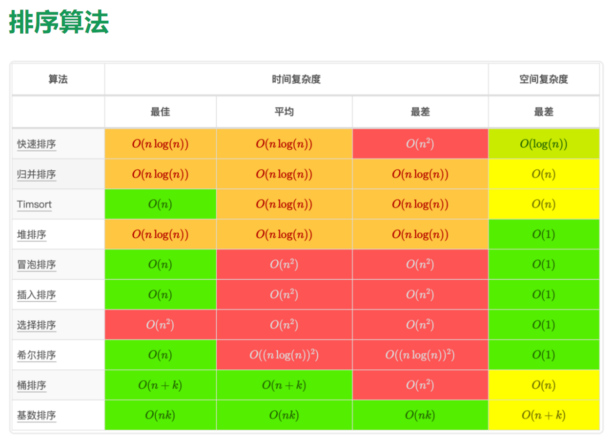

# 时间复杂度

时间复杂度分析统计的**不是算法运行时间**，而是算法运行**时间随着数据量变大时的增长趋势**。

## 常见复杂度

### O(1) O(n) O($n^2$)

### 指数阶 O($2^n$)

### 对数阶 O(log n)

### 线性对数阶 O(n log n)

### 阶乘阶 O(n!)

## 常见结构和算法的复杂度

# 空间复杂度

## 常见类型

