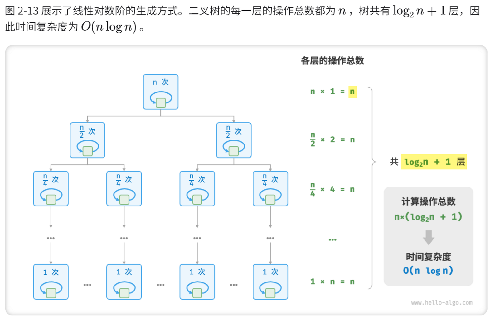
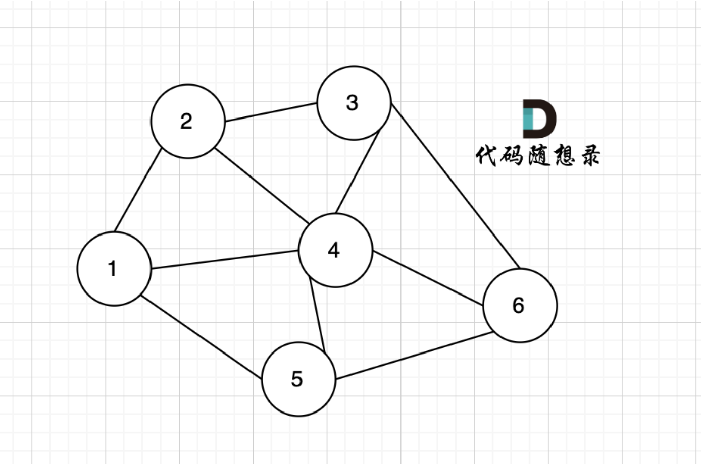
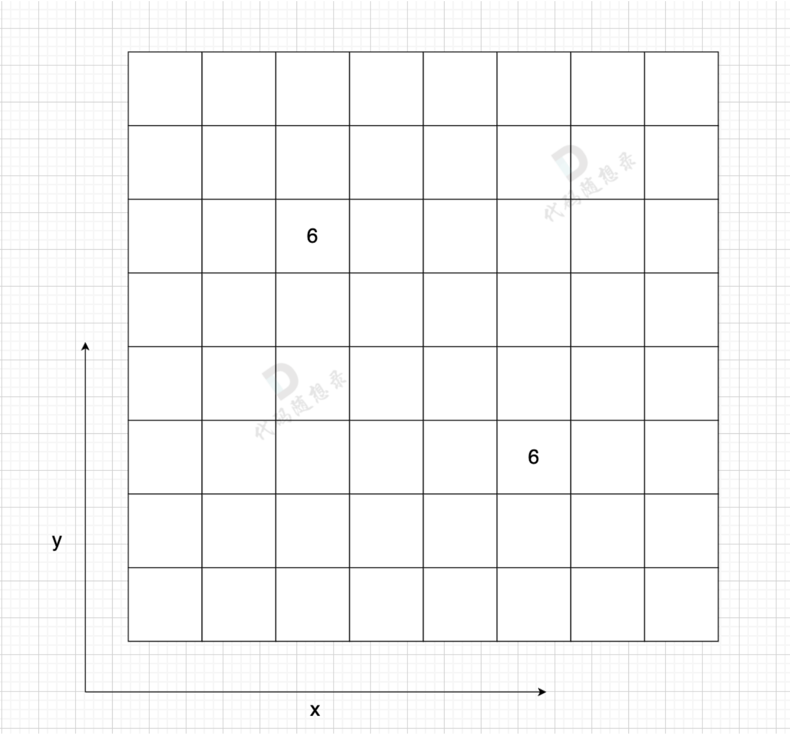
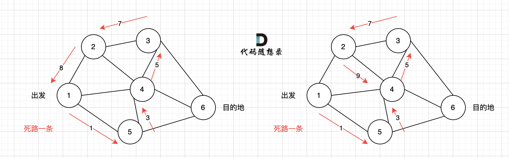

# 复杂度

## 时间复杂度

时间复杂度分析统计的**不是算法运行时间**，而是算法运行**时间随着数据量变大时的增长趋势**。

### 常见复杂度

#### O(1) O(n) O($n^2$)

#### 指数阶 O($2^n$)

#### 对数阶 O(log n)

#### 线性对数阶 O(n log n)

#### 阶乘阶 O(n!)

### 常见结构和算法的复杂度

## 空间复杂度

### 常见类型

# 二叉搜索树 BST

**二叉搜索树 BST：**左子树的节点值都小于根节点，右子树的节点值都大于根节点

> **平衡二叉树 AVL（**平衡二叉搜索树）：带有平衡的二叉搜索树

**BST的缺点**：

**二叉搜索树在不断插入的时候，可能会退化成链表：**

比如 BST树的节点正好从大到小的插入，那就会一路向左下插入，此时树的结构类似链表，查找或写入的耗时与链表也相同。

**为了避免这种情况，引入了 平衡二叉树 和 红黑树**

都是通过自身的建树原则来控制树的层数和节点位置，且红黑树是从AVL树演变过来的。

# 平衡二叉树 AVL

**AVL 树本质上是带了平衡功能的二叉搜索树**：

- 拥有二叉搜索树的性质，左子树 < root < 右子树

- 其任何子树也都是AVL树
- 带有平衡条件，即每个节点的左右子树高度差最多为1

在插入、删除树节点的时候，如果破坏了以上的原则，**AVL树会自动进行调整**使得以上三条原则仍然成立。

## AVL树插入节点

AVL树插入新节点后可能会失衡，所以这也是AVL树处理插入节点的操作。

### 平衡因子

BF （Balance Factor）平衡因子 = **左子树高度 - 右子树高度**

一般来说 BF 的绝对值大于 1，,平衡树二叉树就失衡

### 失衡判断

比如图中树插入一个新节点 key = 1 后，接在节点2的左侧，现在就违反了高度差最多为1

**失衡场景有 4 种：**

- 左左结构失衡  LL
- 右右结构失衡  RR
- 左右结构失衡  LR
- 右左结构失衡  RL

此时 AVL 树会通过 **节点的旋转** 来恢复平衡 —— 左旋、右旋

### 旋转恢复平衡

旋转之前要找到**最小失衡树**：在新插入节点向上找，第一个不平衡的树（BF > 1）。

确定**旋转支点 pivot**：

- pivot 就是失衡的这部分树，要进行旋转的支点，也是调整后新树的新根节点。

- pivot 是要**旋转的那部分树，根节点的左或者右子节点**（左边失衡找左子节点，右边失衡找右）

**任何情况的失衡都可以用左旋和右旋来调整，旋转就是以pivot为支点进行旋转。**

旋转在图上像是**将pivot(支点)节点向上提**（将它提升为root节点），而后两边的节点会物理的分布在新root节点的两边，然后按照【左子树 <  root  <  右子树】的规则，再调整其他节点。

> 在考虑旋转的时候，只关注失衡子树，不要扩大到整棵树，容易混乱
>
> 左旋就是逆时针转，右旋就是顺时针转
>
> 旋转的方向，与失衡的方向相反

#### LL 型失衡 —— 右旋

不平衡子树在root的左侧，插入的元素也在不平衡元素的左侧

- 以root 的左子节点为支点pivot，进行右旋，pivot作为新root

- pivot的父节点 root，旋转为自己的右子树；pivot的右子树，变成原 root的左子树

~~~C++
Node* RightRotate(Node* root)
{
    if(nullptr == root) return nullptr;
    Node* p = root->left;
    Node* q = root;
    q->left = p->right;
    p->right = q;
    return p; // pivot
}
~~~

#### RR 型失衡 —— 左旋

不平衡子树在root右侧，插入的元素也在不平衡子树的右侧

- 以root 的右子节点为支点 pivot，进行左旋
- pivot的父节点 root，旋转为自己的左子树；pivot的左子树，变成原 root的右子树

~~~C++
Node* LeftRotate(Node* root)
{
    if(nullptr == root) return nullptr;
    Node* q = root->right;
    Node* p = root;
    p->right = q->left;
    q->left = p;
    return q; // pivot
}
~~~

#### LR 型失衡 —— 左旋 + 右旋

不平衡子树在root左侧，但是新插入元素在不平衡子树的右侧

> 旋转的反向，**与失衡的方向相反**，LR型，对应先右旋，后左旋，
>
> 但是要先旋转底部（R —— 左旋），再转顶部 （L —— 右旋）

**先左旋不平衡子树，后右旋整体**

~~~C++
Node* LeftRightRotate(Node* root)
{
    if(nullptr == root) return nullptr;
    Node* k = root;
    Node* p = root->left;
    Node* q = p->right;
    k->left = LeftRotate(p); // 左旋root->left
    return RightRotate(k); // 右旋root
}
~~~

#### RL 型失衡 —— 右旋 + 左旋

不平衡子树在root右侧，但是新插入元素在不平衡子树的左侧

> 旋转的反向，**与失衡的方向相反**，RL型，对应先左旋，后右旋
>
> 但是要先旋转底部（L —— 右旋），再转顶部 （R —— 左旋），看图！看图！看图！

所以是 **先右旋不平衡子树，后左旋整体**

~~~C++
Node* RightLeftRotate(Node* root){
    if(nullptr == root) return nullptr;
    Node* k = root;
    Node* p = root->right;
    Node* q = p->left;
    k->right = RightRotate(p); // 右旋 root->right
    return LeftRotate(k); // 左旋 root
}
~~~

## AVL树的删除

 AVL 树在删除节点后需要**重新检查平衡性并修正**，同时，删除操作与插入操作后的平衡修正区别在于，插入操作后只需要对插入栈中的弹出的第一个非平衡节点进行修正，而**删除操作需要修正栈中的所有非平衡节点**。

**主要考虑两个问题**

要删除的节点是什么类型的节点？删除后是否会破坏平衡 ？

**删除的节点类型**

1. 叶子节点
2. 节点只有左子树，或只有右子树 
3. 左右子树都有

**删除操作**

1. 删除叶子节点，直接删除
   - 依次往上判断父节点是否失衡，直到根节点
   - 遇到非平衡节点，则判断失衡类型（LL、LR、RR、RL），进行旋转
2. 删除节点只有左子树或只有右子树，将节点删除
   - 直接用左子树或右子树进行代替
   - 进行相应的平衡判断，若失衡则调整，一直到根节点 
3. 删除节点既有左子树又有右子树
   - 该节点为根结点的**右子树的最小值**代替当前节点
   - 再判断是否失衡，然后根据失衡情况调整，直到根节点

## 代码总结

树结构

判断是否是平衡二叉树

~~~C++
int depth(TreeNode* root)
{
    if(nullptr == root) return 0;
    int leftdepth = depth(root->left)+1;
    int rightdepth = depth(root->right)+1;
    return max(leftdepth, rightdepth); // 当前节点的高度
}

bool isBalanced(TreeNode* root) 
{
    if(root == nullptr) return true;
    int balancee_factor = depth(root->left) - depth(root->right); // 平衡因子
    
    if(nullptr != root->left){
       if(!isBalanced(root->left)) return false; // 递归判断左树
    }
    if(nullptr != root->right){
        if(!isBalanced(root->right)) return false; // 递归判断右树
    }
    
    return balancee_factor >= -1 && balancee_factor <= 1; // 平衡因子都小于1
}
~~~

平衡处理（判断 + 旋转）

~~~C++
int depth(Node* root)
{
    if(nullptr == root) return nullptr;
    return max(depth(root->left), depth(root->right))+1; // 高度
}

int BalancedFactory(Node* root)
{
    return depth(root->left)-depth(root->right); // 平衡因子
}

// 判断是否失衡，并进行旋转
Node* Balance(Node* root)
{
    int bf = BalancedFactory(root);
    
    // 左 - 右 = 2，处理root左边 —— L
    if(bf == 2) {
        if(BalancedFactory(root->left) == 1)	RightRotate(root)     // LL —— 右旋
        else									LeftRightRotate(root);// LR —— 左旋+右旋
    }
    // 右 - 左 = 2，处理root右边 —— R
    else if(bf == -2)
    {
        if(BalancedFactory(root->right) == -1)	LeftRotate(root); // RR —— 左旋
        else	RightLeftRotate(root); // RL —— 右旋 + 左旋
    }
    return root;
}
~~~

插入节点

~~~C++
Node* Add(Node* node, int val) // root 新节点值
{
    if(node == nullptr)	return new Node(val);
    
    // 递归插入
    if(val < node->val)	node->left = Add(node->left, val);
    else				node->right = Add(node->right, val);
    
    Balance(node); // 判断是否失衡，并进行旋转
    return node;
}
~~~

删除节点

~~~C++
Node* Del(Node* node, int val)
{
    if(nullptr == root) return nullptr;
    
    // 要删除的就是当前节点
    if(node->val == val)
    {
        if(nullptr==node->right && nullptr==node->left){ // 叶子节点  
            delete node;
            return nullptr;
        }
        
        if(nullptr == node->right){ // 右子树为空，直接使用待删除节点的左节点代替该结点
            Node* p = node->left;
            delete node;
            return p;
        }
        
        if(nullptr == node->left){ // 左子树为空，直接使用待删除节点的右节点代替该结点
            Node* p = node->right;
            delete node;
            return p;
        }
        
        // 左右子树都有，使用该节点为根结点的右子树的最小值代替当前节点
        Node* maxNode =  Min(node->right);
        node->val = maxNode->val;
        node->right = Del(node->right, maxNode->val); // 递归删除右子树最小值那个点
    }
    // 要删除的节点是在左侧，递归删除
    else if(node->val > val) {
        node->left == Del(node->left, val);
    }
    // 要删除的节点在右侧，递归删除
    else {
        node->right == Del(node->right, val);
    }
    
    return Balanced(node);// 平衡处理
}
~~~

## AVL树的缺点

虽然AVL树最坏情况的时间复杂度O(logn) ，要低于普通二叉树BST和链表的最坏情况O(n)。

但是AVL树必须保证左右子树平衡，**在插入的时候很容易出现不平衡**的情况，需要进行旋转以求达到平衡。

这会导致**AVL需要花大量时间在调整上**，故AVL树一般使用场景在于**查询场景**， 而不是 **增加删除频繁**的场景。

红黑树(rbt) 继承了AVL可自平衡的优点，同时, 红黑树(rbt)在**查询速率和平衡调整**中寻找平衡，放宽了**树的平衡条件**，从而可以用于 **增加删除频繁**的场景。

在实际应用中，红黑树的使用要多得多。

# 红黑树 RBT

> 参考：[红黑树图解](https://www.cnblogs.com/crazymakercircle/p/16320430.html)

红黑树（Red Black Tree）也是一种自平衡二叉查找树，与AVL树类似，都在添加和删除的时候通过旋转操作保持二叉树的平衡，以求更高效的查询性能。

与AVL树相比，**红黑树牺牲了部分平衡性**，以换取插入/删除操作时**较少的旋转**操作，整体来说性能要优于AVL树。

虽然红黑树更加复杂，但最坏情况运行时间也表现良好，实践中依然是高效的，它可以在**O(log n)**时间内做查找、插入和删除，n 是树中元素的数目。

红黑树是实际应用中最常用的平衡二叉查找树，它不严格的具有平衡属性，但平均的使用性能非常良好。

## 特性

在红黑树节点上，增加了 **颜色属性的数据**，节点被标记为红色和黑色两种颜色。

**一棵合法的红黑树必须遵循以下性质：**

- 节点非黑即红
- root 是黑色
- 叶子节点 NIL 是黑色
- 红色属性：**红节点的两个子节点都为黑节点**（从每个叶子到根的所有路径上不能有两个连续的红色节点）
- 黑色属性：任一节点，到任一叶子节点的所有路径，都包含**相同数目的黑色节点**

> 黑色属性，可以理解为**平衡特征**， 如果满足不了平衡特征，就要进行平衡操作

> 基于这些规则，一般在插入红黑树节点的时候，会将这个节点设置为红色：
>
> 因为根据最后一条规则，红色破坏原则的可能性最小，如果是黑色可能导致这条之路的黑色节点超过其他之路。

RBT有点属于一种**空间换时间**类型的优化，节点上增加了 **颜色属性的数据**，相当于增加了空间的消耗。 通过颜色属性的增加， 换取后面平衡操作的次数减少。

## 黑色完美平衡

红黑树并不是一颗AVL平衡二叉搜索树，平衡条件并不是用高度差来约束的，而是**以黑色节点的高度来约束**。

> 特性5：到叶子节点的路径，黑节点数目都相同

RBT的左子树和右子树的**黑节点的层数是相等的**，称红黑树这种平衡为 **黑色完美平衡**。

如果去掉其中的红节点，会得到：

## 红黑树恢复平衡

如果红黑树有不满足特性的情况，视为平衡被打破。

恢复平衡的三种操作：

- 变色
  - 红变黑，黑变红
- 左旋
  - pivot的父节点 root，旋转为自己的左子树；pivot的左子树，变成原 root的右子树
- 右旋
  - pivot的父节点 root，旋转为自己的右子树；pivot的右子树，变成原 root的左子树

## 插入节点分析

以HashMap中的红黑树的结构定义为例子：

~~~C++
static class Node<K,V> implements Map.Entry<K,V> {
    final int hash;
    final K key;
    volatile V val;
    volatile Node<K,V> next;
}

/**
 * Nodes for use in TreeBins
 */
static final class TreeNode<K,V> extends Node<K,V> {
    TreeNode<K,V> parent;  // red-black tree links
    TreeNode<K,V> left;
    TreeNode<K,V> right;
    TreeNode<K,V> prev;    // needed to unlink next upon deletion
    boolean red; // 默认红色

    TreeNode(int hash, K key, V val, Node<K,V> next,
             TreeNode<K,V> parent) {
        super(hash, key, val, next);
        this.parent = parent;
}
~~~

**默认新插入的节点为红色：**因为父节点为黑色的概率较大，插入新节点为红色，可以避免颜色冲突。

### 场景1：红黑树为空树

直接插入作为根节点，设置为黑色

### 场景2：插入节点的key已经存在

更新key节点的值，为插入节点的值

### 场景3：插入节点的父节点是黑色

由于插入的节点是红色的，当插入节点的父节点是黑色时，不会影响平衡。

所以可以直接插入，不需要自平衡

### 场景4：插入节点的父节点是红色

根据性质2，根节点是黑色 —— 如果插入节点的父节点是红色，那这个父节点不会是根节点，所以插入节点上层总是存在祖父节点。

根据性质4，每个红节点的子节点一定是黑色 —— 不能有两个红色相连

此时会出现两种状态：

- 父节点，叔节点都为红色

- 父节点红，叔节点黑

#### 4.1 父节点，叔节点都为红色

根据性质4，红色节点不能相连 —— 那祖父节点一定是黑色节点。

如果直接插入，从祖父到新节点，会出现 【黑 — 红 — 红（新节点）】的情况，需要进行**变色**。

变色处理：黑红红 — 红黑红

- 将F和V节点改为黑色
- 将P改为红色
- 将P设置为当前节点，进行后续处理

如果**P的父节点是黑色**，那么无需做处理；

但如果P的父节点是红色，就又违反红黑树性质了，所以需要将P设置为当前节点，继续插入操作，作自平衡处理，直到整体平衡为止。

#### 4.2 父节点红，叔节点黑

##### 情况1：LL型失衡

插入后变成LL型失衡

自平衡处理：**变色父节点，右旋祖父节点**

##### 情况2：LR型失衡

插入后变成LR型失衡。

自平衡处理：**左旋父节点，变成LL —— 变色—— 右旋**

##### 情况3：RR型失衡

自平衡处理：父节点变黑，祖父节点变红 —— 左旋祖父节点

##### 情况3：RL型失衡

自平衡处理：右旋父节点，变成RR情况 —— 变色，左旋祖父节点

## 红黑树和AVL的区别

**1、调整平衡的实现机制不同**

红黑树根据路径上黑色节点数目一致，来确定是否失衡，如果失衡，就通过变色和旋转来恢复。

AVL根据树的平衡因子(所有节点的左右子树高度差的绝对值不超过1)，来确定是否失衡，如果失衡，就通过旋转来恢复。

**2、红黑树的插入效率更高**

红黑树是用**非严格的平衡**来换取增删节点时候旋转次数的降低，**任何不平衡都会在三次旋转之内解决**，红黑树并不追求“完全平衡”，它只要求部分地达到平衡要求，降低了对旋转的要求，从而提高了性能。

而AVL是**严格平衡树**(高度平衡的二叉搜索树)，因此在增加或者删除节点的时候，根据不同情况，旋转的次数比红黑树要多。

所以红黑树的插入效率更高。

**3、红黑树统计性能比AVL树更高**

红黑树能够以**O(log n)** 的时间复杂度进行查询、插入、删除操作。

AVL树查找、插入和删除在平均和最坏情况下都是**O(log n)**。

红黑树的算法时间复杂度和AVL相同，**但统计性能比AVL树更高**，

**4、适用性：AVL查找效率高**

如果你的应用中，**查询的次数远远大于插入和删除，那么选择AVL树**，如果查询和插入删除次数几乎差不多，应选择红黑树。

即，有时仅为了排序（建立-遍历-删除），不查找或查找次数很少，R-B树合算一些。

# 图相关

> 参考：
>
> 《算法图解》
>
> [代码随想录 图论部分](https://programmercarl.com/kamacoder/%E5%9B%BE%E8%AE%BA%E7%90%86%E8%AE%BA%E5%9F%BA%E7%A1%80.html#%E5%9B%BE%E7%9A%84%E5%9F%BA%E6%9C%AC%E6%A6%82%E5%BF%B5)

## 图基础

图模拟一组连接，由【**节点node**】和【**边 edge**】组成。

每个节点与邻近的节点用边相连，相连的节点称为**邻居**。

利用散列表表示这种关系，包含当前节点的邻居。

### 有向图和无向图

**有向图：**边有箭头，箭头的方向指定了关系的方向，关系是单向的

**无向图：**边没有箭头，关系是双向的，直接相连的节点互为邻居

### 加权图

每条边上都有关联数字，这些数字称为权重，有权重的图是加权图。

### 连通图（无向）

在无向图中，任何两个节点都是可以到达的，我们称之为连通图

如果有节点不能到达其他节点，则为非连通图，比如下图，节点1不能到达节点4

#### 连通分量

在无向图中的**极大连通子图**称之为该图的一个连通分量。

该无向图中 节点1、节点2、节点5 构成的子图就是 该无向图中的一个连通分量，该子图所有节点都是相互可达到的。

同理，节点3、节点4、节点6 构成的子图 也是该无向图中的一个连通分量。

### 强联通图（有向）

在有向图中，任何两个节点是可以**相互到达**的，我们称之为 强连通图。

注意是相互到达,有向图中**任何两个节点是可以相互到达**

#### 强连通分量

在有向图中**极大强连通子图**称之为该图的强连通分量。

节点1、节点2、节点3、节点4、节点5 构成的子图是强连通分量，因为这是强连通图，也是极大图。

节点6、节点7、节点8 构成的子图 不是强连通分量，因为这不是强连通图，节点8 不能达到节点6。

## 图的构造

一般使用邻接表、邻接矩阵 或者用类来表示图。

三种方式：朴素存储（代码随想录）、邻接表、邻接矩阵

### 1、朴素矩阵（存所有边）

图中有8条边，我们就定义 8 * 2的数组，即有 **n条边** 就申请 **n * 2** 这么大的数组：

可以不用数组，用map，或者用 类 到可以表示出 这种边的关系。

这种表示方式的好处就是直观，把节点与节点之间关系很容易展现出来。

但是如果我们想知道 节点1 和 节点6 是否相连，我们就需要把存储空间都枚举一遍才行。

这是明显的缺点，同时，我们在深搜和广搜的时候，都不会使用这种存储方式。

因为 搜索中，需要知道 节点与其他节点的链接情况，而这种朴素存储，都需要全部枚举才知道链接情况。

### 2、邻接矩阵

邻接矩阵 使用 **二维数组**来表示图结构。 邻接矩阵是从节点的角度来表示图，**有多少节点就申请多大的二维数组**。

例如：

在一个 **n （节点数）**为 8 的图中，就需要申请 8 * 8 **（n * n）**这么大的空间。

 `grid [2][5] = 6`，表示 节点 2 连接 节点5 为有向图，节点2 指向 节点5，边的权值为6。

如果想表示无向图，即：`grid[2][5] = 6  grid[5][2] = 6`，表示节点2 与 节点5 相互连通，权值为6。

这种表达方式（邻接矩阵） 在 **边少，节点多**的情况下，会**导致申请过大的二维数组**，造成空间浪费。

而且在寻找节点连接情况的时候，需要遍历整个矩阵，即 n * n 的时间复杂度，同样造成时间浪费。

邻接矩阵的**优点**：

- 表达方式简单，易于理解
- 检查任意两个顶点间是否存在边的操作非常快
- 适合稠密图，在边数接近顶点数平方的图中，邻接矩阵是一种空间效率较高的表示方法。

**缺点**：

- 遇到稀疏图，会导致申请过大的二维数组造成空间浪费 且遍历 边 的时候需要遍历整个n * n矩阵，造成时间浪费

### 3、邻接表

邻接表 使用 **数组 + 链表**的方式来表示。 邻接表是从**边的数量**来表示图，有多少边才会申请对应大小的链表。

**有多少边**，邻接表才会申请**多少个对应的链表节点**。

邻接表的优点：

- 对于稀疏图的存储，只需要存储边，空间利用率高
- 遍历节点连接情况相对容易

缺点：

- 检查任意两个节点间是否存在边，效率相对低，需要 O(V)时间，V表示某节点连接其他节点的数量。
- 实现相对复杂，不易理解

## 深度优先搜索 dfs

> dfs 和 bfs 的区别：广搜（bfs）是一圈一圈的搜索过程，和深搜（dfs）是一条路跑到黑然后再回溯。

### dfs 搜索过程

- 搜索方向，是认准一个方向搜，直到碰壁之后再换方向
- 换方向是撤销原路径，改为节点链接的下一个路径，回溯的过程。

如图一，是一个无向图，我们要搜索从**节点1到节点6的所有路径**。

那么dfs搜索的第一条路径是这样的： （假设第一次延默认方向，就找到了节点6），图二

此时我们找到了节点6，（遇到黄河了，是不是应该回头了），那么应该再去搜索其他方向了。 如图三：

路径2撤销了，改变了方向，走路径3（红色线）， 接着也找到终点6。 那么撤销路径2，改为路径3，在dfs中其实就是**回溯的过程**。

又找到了一条从节点1到节点6的路径，又到黄河了，此时再回头，下图图四中，路径4撤销（回溯的过程），改为路径5。

又找到了一条从节点1到节点6的路径，又到黄河了，此时再回头，下图图五，路径6撤销（回溯的过程），改为路径7，路径8 和 路径7，路径9， 结果发现死路一条，都走到了自己走过的节点。

那么节点2所连接路径和节点3所链接的路径 都走过了，**撤销路径只能向上回退**，去选择撤销当初节点4的选择，也就是撤销路径5，改为路径10 。 如图图六：

### 代码框架

dfs 搜索一个方向，并需要回溯，所以用递归的方式来实现是最方便的。

回溯算法，其实就是 dfs 的过程，这里给出完整的 dfs 代码框架：

~~~C++
void dfs(参数) {
    if (终止条件) {
        存放结果;
        return;
    }

    for (选择：本节点所连接的其他节点) {
        处理节点;
        dfs(图，选择的节点); // 递归
        回溯，撤销处理结果
    }
}
~~~

dfs 三部曲：

**1、确认递归函数，参数**

~~~C++
void dfs(参数)
~~~

一般情况，深搜需要 **二维数组 保存所有路径**，需要**一维数组保存单一路径**，这种保存结果的数组，我们可以定义一个全局变量，避免让我们的函数参数过多。

~~~C++
vector<vector<int>> result; // 保存符合条件的所有路径
vector<int> path; 			// 起点到终点的路径
void dfs (图，目前搜索的节点)  
~~~

**2、确认终止条件**

~~~C++
if (终止条件) {
    存放结果;
    return;
}
~~~

终止条件就是什么时候走到底，这时候结束本层递归，收获结果。

另外，其实很多dfs写法，没有写终止条件，其实终止条件写在了， 隐藏在下面dfs递归的逻辑里了，也就是不符合条件，直接不会向下递归。

**3、处理目前搜索节点出发的路径**

一般这里就是一个for循环的操作，去遍历 目前搜索节点 所能到的所有节点。

~~~C++
for (选择：本节点所连接的其他节点) {
    处理节点;
    dfs(图，选择的节点); // 递归
    回溯，撤销处理结果
}
~~~

## 广度优先搜索 bfs

### 基本思想

回答两类问题：

- 从节点A出发，有前往节点B的路径吗？ —— 遍历整个图
- 从节点A出发，前往节点B的路径中哪条**最短**？ —— 从起点向外延伸搜索

过程：

- 从起点开始，加入起点的邻居到**队列**，按**加入顺序**查找这些节点（否则不是最短，所以用队列）；

- 如果当前查找的节点不是目标，**把当前查找的节点的邻居都加入队列**，直到找到目标节点。
- 为了避免出现**无限循环**，对已经检查过的节点进行记录

### bfs 搜索过程

> dfs 和 bfs 的区别：广搜（bfs）是一圈一圈的搜索过程，和深搜（dfs）是一条路跑到黑然后再回溯。

广搜的搜索方式就适合于解决**两个点之间的最短路径**问题。

因为广搜是从起点出发，以起始点为中心一圈一圈进行搜索，一旦遇到终点，记录之前走过的节点就是一条最短路。

用一个**方格地图**，假如每次搜索的方向为 **上下左右**（不包含斜上方），那么给出一个**start起始位置**，那么BFS就是从四个方向走出第一步。

如果加上一个**end终止位置**，那么使用BFS的搜索过程如图所示：

从start起点开始，是一圈一圈，向外搜索，方格编号1为第一步遍历的节点，方格编号2为第二步遍历的节点，第四步的时候我们找到终止点end。

正是因为BFS一圈一圈的遍历方式，所以**一旦遇到终止点，那么一定是一条最短路径**。

而且地图还可以有**障碍**，如图所示：

如果添加了障碍，我们是第六步才能走到end终点。

### 代码框架

> 这一圈一圈的搜索过程是怎么做到的，是放在什么容器里，才能这样去遍历？
>
> 其实，我们仅仅需要一个容器，能**保存遍历过的元素就可以**，那么用**队列，还是用栈，甚至用数组**，都是可以的。

**用队列的话，就是保证每一圈都是一个方向去转，例如统一顺时针或者逆时针**。

因为队列是先进先出，加入元素和弹出元素的顺序是没有改变的。

**如果用栈的话，就是第一圈顺时针遍历，第二圈逆时针遍历，第三圈有顺时针遍历**。

因为栈是先进后出，加入元素和弹出元素的顺序改变了。

那么广搜需要注意 转圈搜索的顺序吗？ 不需要！

所以用队列，还是用栈都是可以的，但大家都习惯用队列了。

下面给出广搜代码模板，该模板针对的就是，上面的四方格的地图： （详细注释）

~~~C++
// 表示四个方向     x  y
int dir[4][2] = { 0, 1, 
                  1, 0, 
                 -1, 0, 
                  0, -1}; 

// grid 是地图，也就是一个二维数组
// visited标记访问过的节点，不要重复访问
// x,y 表示开始搜索节点的下标
void bfs(vector<vector<char>>& grid, vector<vector<bool>>& visited, int x, int y) 
{
    queue<pair<int, int>> que; 	// 定义队列
    que.push({x, y}); 			// 起始节点加入队列
    
    visited[x][y] = true; // 只要加入队列，立刻标记为访问过的节点
    
    // 开始遍历队列里的元素
    while(!que.empty()) 
    { 
        pair<int ,int> cur = que.front(); // 从队列取元素
        que.pop(); 
        
        int curx = cur.first;
        int cury = cur.second; // 当前节点坐标
        
        // 开始向当前节点的四个方向左右上下去遍历
        for (int i = 0; i < 4; i++) 
        { 
            int nextx = curx + dir[i][0];
            int nexty = cury + dir[i][1]; // 获取周边四个方向的坐标
            
            // 坐标越界了，直接跳过
            if (nextx < 0 || nextx >= grid.size() || 
                nexty < 0 || nexty >= grid[0].size()) 
            {
                continue;  
            }
            
            if (!visited[nextx][nexty]) // 如果节点没被访问过
            { 
                que.push({nextx, nexty});     // 加入队列
                visited[nextx][nexty] = true; // 标记，避免重复访问
            }
        }
    }

}
~~~

## 狄克斯特拉算法

> 计算非加权图的最短路径——广度优先搜索
>
> 计算加权图的最短路径（最快）—— 狄克斯特拉算法

狄克斯特拉算法，就是找**总权重最小**的路径（最快路径）。

绕环的路径不可能是最短路径，狄克斯特拉算法**只适用于有向无环图**DAG。

> 狄克斯特拉算法这样假设：**对于处理过的海报节点，没有前往该节点的更短路径。**
>
> 这种假设仅在**没有负权边**时才成立。因此，不能将狄克斯特拉算法用于包含负权边的图。
>
> 在包含负权边的图中，要找出最短路径，可用另一种算法——贝尔曼福德算法（Bellman-Ford
> algorithm）。

所以狄克斯特拉算法针对的是：**有向、无环、无负权边**的图。

**实现步骤：**

- 找出“最便宜”的节点，即可在最短时间内到达的节点
- 更新该节点的邻居的开销
- 重复这个过程，直到对图中的每个节点都这样做了
- 计算最终路径

以下面图为例：

需要三个散列表：

- GRAPH 表示整个图的散列表 
- GOSTS 存储每个节点的开销（从起点出发到该节点的花费）
- PARENTS 存储父节点的散列表

