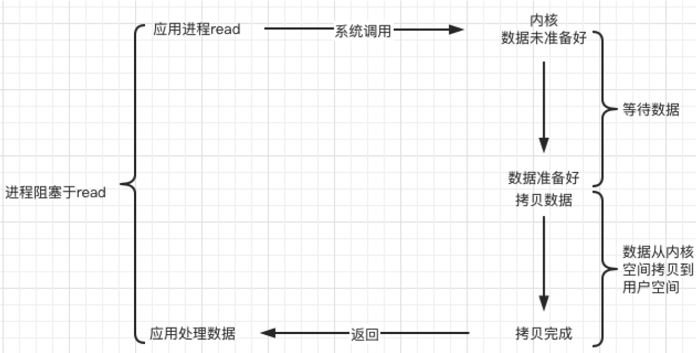
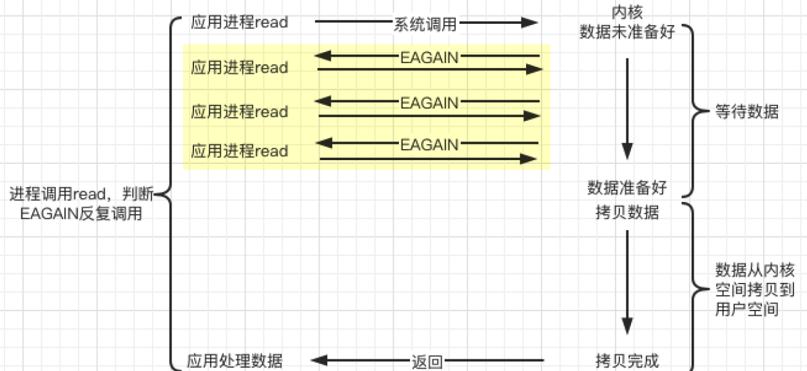
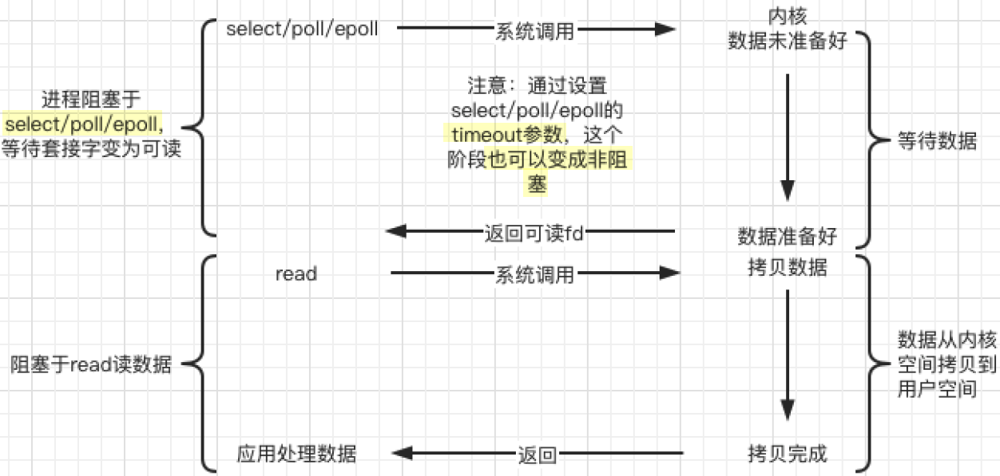
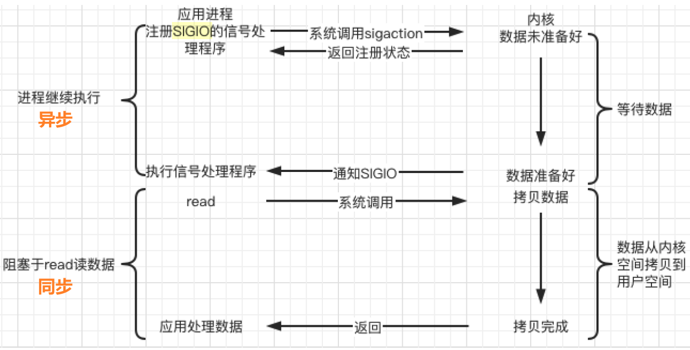
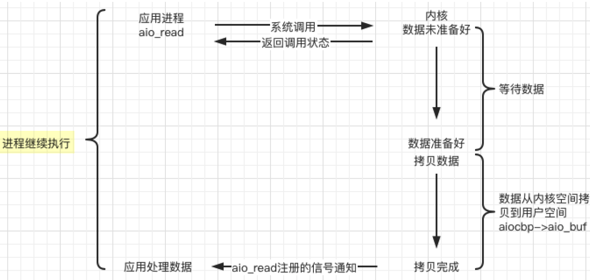
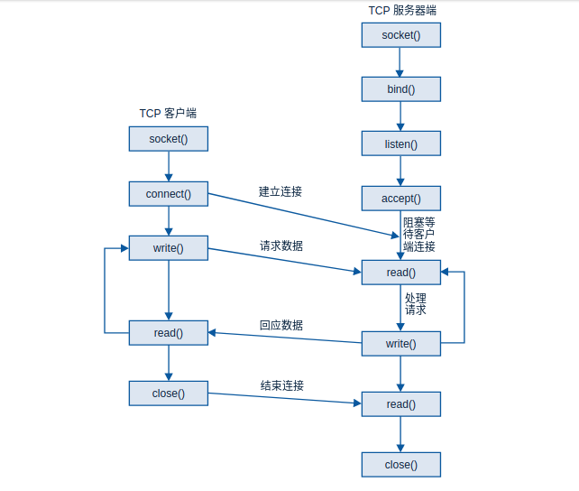
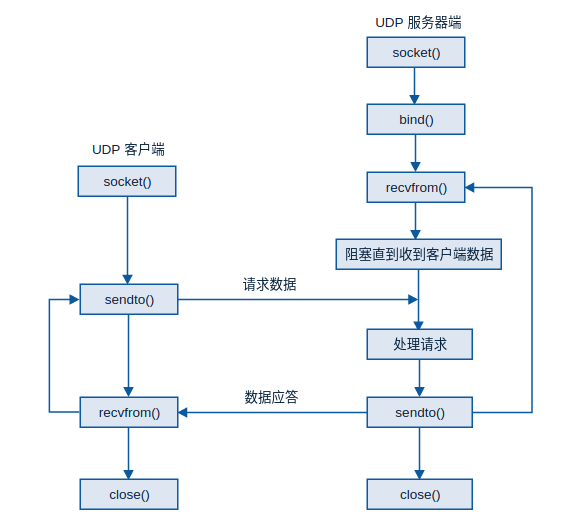

# 网络模型

> 参考：
>
> 《Linux 高性能服务器编程》游双
>
> 重写 moduo 库 施磊
>
> [小林 coding 高性能网络模式：Reactor 和 Proactor](https://xiaolincoding.com/os/8_network_system/reactor.html)
>
> [小林 coding socket 网络模型过度到 I/O 多路复用](https://xiaolincoding.com/os/8_network_system/selete_poll_epoll.html#%E6%9C%80%E5%9F%BA%E6%9C%AC%E7%9A%84-socket-%E6%A8%A1%E5%9E%8B)
>
> [Socket 网络编程 syxdevcode 博客](https://blogs.hdvr.top/2021/09/13/Socket%E7%BD%91%E7%BB%9C%E7%BC%96%E7%A8%8B/)
>
> [C#网络编程二：Socket 编程](https://www.cnblogs.com/dotnet261010/p/6211900.html)
>
> [C++高性能网络编程 Jack Huang’s Blog](https://huangwang.github.io/)  
>
> [登龙（DLonng）Linux 高级编程 - Socket 编程基础（TCP，UDP）](https://dlonng.com/posts/tcp_udp)
>
> [C++socket 编程  kcep 云呓](https://blog.csdn.net/k16li/article/details/141070741?ops_request_misc=%257B%2522request%255Fid%2522%253A%25228428ccc2f37922cca728d06f3c56ebe8%2522%252C%2522scm%2522%253A%252220140713.130102334.pc%255Fall.%2522%257D&request_id=8428ccc2f37922cca728d06f3c56ebe8&biz_id=0&utm_medium=distribute.pc_search_result.none-task-blog-2~all~first_rank_ecpm_v1~hot_rank-2-141070741-null-null.142^v102^control&utm_term=C%2B%2B%20Socket%E7%BC%96%E7%A8%8B&spm=1018.2226.3001.4187)


## 一些概念

### 什么是网络模型？

可以简单的理解为计算机如何处理网络数据。

常见的网络模型：

- 同步阻塞（Blocking I/O）：请求数据–繁忙–数据返回
- 同步非阻塞（Non-blocking I/O）：不断查询
- 多线程（Thread-per-Connection）：每个网络连接创建一个线程
- Reactor：有网络事件发生时，EventLoop 安排合适的 Channel 去处理


### 文件描述符 fd（File Descriptor）

- 操作系统分配的“号码牌”，用于标识打开的文件、网络连接等。

- 示例：

  ~~~C++
  int fd = open("data.txt", O_RDONLY);  // 打开文件时，操作系统会返回一个 fd，假设返回 fd = 3
  read(fd, buffer, 100);  // 通过 fd 读取文件
  close(fd);  			// 关闭文件，释放 fd，其他进程就可以用“3”这个 fd 了
  ~~~

  - 打开文件时，操作系统会返回一个 fd，可以通过这个 fd 来读写文件、网络连接等，关闭文件时，fd 就被释放。

  - 不管是打开文件，还是建立网络连接，它们都会被操作系统当做“文件”来管理，并分配一个 fd。


### 什么是 socket？

- 在同一设备或不同设备的进程间通信，需要创建一个 socket，提供统一接口。

- `socket`（套接字）就是一个 **特殊的文件描述符**，专门用来 **进行网络通信**。


### Channel？Poller？EventLoop？

**Channel**

- Channel 是文件描述符 **fd 的管理者**，负责监听 socket 是否有数据可读，是否可以写入等事件。

**Poller**

- Poller 是事件监听器，监听多个 socket 是否发生了网络事件（如数据可读、可写）。

- Poller 底层使用 epoll（高效的 I/O 复用技术）来监听事件。

**EventLoop**

- EventLoop 是事件循环，不断询问 Poller 是否有新事件，然后调度 Channel 处理这些事件。


## IO：阻塞、非阻塞、同步、异步

> 阻塞、非阻塞、同步、异步，描述的都是 IO 的一些状态。
>
> 典型的一次 IO（包括网络 IO）的两个阶段：① **数据准备**（数据是否就绪），② **数据读写**


### 数据准备—— 阻塞，非阻塞

根据系统 IO 操作的就绪状态

> 远端有没有数据过来，内核相应的 sockfd 对应的 TCP 接收缓冲区是否有数据可读。
>
> 数据就绪阶段分为阻塞和非阻塞，表现得结果是 **阻塞当前线程，或是直接返回。**

- **阻塞**

  当这个 IO 工作在阻塞模式下，调用 receive 接口时，如果数据没有就绪，receive 会 **阻塞当前这个进程**。

- **非阻塞**

  如果是非阻塞状态下，调用 receive 时，会 **立即返回**，根据返回值来判断非阻塞状态。


### 数据读写——同步，异步

根据应用程序和内核的交互方式

> 如果数据就绪了，开始读写了

- **同步：**

  - 应用层调用 receive 这个接口会继续，相当于 **花应用程序自己的时间**
  - 把这个 sockfd 上的数据从内核的 TCP 接收缓冲区，拷贝到给 receive 传的应用程序缓冲区 buf 中，拷贝数据过程中，应用程序 **一直等待** 数据拷贝完成以后，receive 才返回的

- **异步：**

  - 调用异步 IO 接口时，需要 **传 sockfd**，对应一个 TCP 缓冲区；
  - 还有 **buf**，如果 sockfd 上有数据可读，要把这个内核缓冲区的数据搬到应用程序的哪一块 buf 中；
  - 还有 **通知方式（异步的特点）**，可以通过信号告诉异步 IO，负责 **帮我监听** sockfd 上是否有数据可读，有的话就帮我把数据从内核的 TCP 缓冲区搬到我给你传的 buf 里。
  
  - 然后 **应用程序就可以处理其他事情了**。
  - 最后通过事先约定好的通知方式，来通知我应用程序，应用程序就可以处理这个事件了，数据也已经收到了。


**以上是系统 IO 方面的同步和异步，业务层面的同步和异步，主要原理是一样的。**

> 同步：表示 A 向 B 请求调用一个网络 IO 接口时（或者调用某个业务逻辑 API 接口时），A 一直在等待 B 完成以后返回，数据的读写都是由请求方 A 自己来完成的（不管是阻塞还是非阻塞）；
>
> 异步：表示 A 向 B 请求调用一个网络 IO 接口时（或者调用某个业务逻辑 API 接口时），**向 B 传入请求的事件以及事件发生时通知的方式**，A 就可以处理其它逻辑了，当 B 监听到事件处理完成后，会用事先约定好的通知方式，通知 A 处理结果。
>
> *站在系统 IO 的角度，A 就是应用程序，B 就是操作系统*


> ***陈硕：在处理 IO 的时候，阻塞和非阻塞都是同步 IO，只有使用了特殊 API 才是异步 IO。***
>
>  


## Unix/Linux 上的五种 IO 模型

### 同步阻塞




### 同步非阻塞

数据未就绪的状态下，也是有不断返回的




### IO 复用 ⭐

> 同步




和上面的区别是，从数据未就绪到就绪，只调用 read 换成了调用 **IO 复用接口**。

**一个线程调用一个 IO 复用接口，一个 IO 复用可以监听很多个 socket**（上面的同步阻塞和非阻塞一次只能处理一个 socket）

当多个 socket 有数据可操作的话，IO 复用会给应用程序 **返回有可操作数据的这些 socket 的列表**，再根据这些事件的 fd，进行相应的操作。

通过多路 IO 复用，能使得 **一个进程同时处理多路 IO**。


### 信号驱动

> linux 系统特有



内核在 **第一个阶段是异步，第二个阶段是同步**。

与非阻塞 IO 的区别在于它提供了 **消息通知机制**（SIGIO），不需要用户进程不断的轮询检查，减少了系统 API 的调用次数，提高了效率。


### 异步 asynchronous

> 异步非阻塞是最典型的
>
> Linux 也提供了 aio_read 和 aio_write




## 多进程 and 多线程并发

### 多进程并发

多进程并发模型在同步阻塞迭代模型的基础上进行了一些改进，以避免是程序阻塞在 read 系统调用上。

~~~C++
bind(srvfd);
listen(srvfd);
for(;;){
clifd = accept(srvfd,...); //开始接受客户端来的连接

ret = fork(); // 新进程
switch( ret )
{
    case -1 :
        do_err_handler();
        break;
    case 0: // 子进程
        client_handler(clifd);
        break ;
    default : // 父进程
        close(clifd);
        continue ;
}
}
void client_handler(clifd)
{
    read(clifd, buf,...); //从客户端读取数据
    dosomthingonbuf(buf);
    write(clifd, buf)//发送数据到客户端
}
~~~

在 accept 系统调用时，如果没有客户端来建立连接，会阻塞在 accept 处。一旦某个客户端连接建立起来，则立即开启一个新的进程来处理与这个客户的数据交互。避免程序阻塞在 read 调用，而影响其他客户端的连接。


### 多线程并发

在多进程并发模型中，每一个客户端连接开启 fork 一个进程，若客户端连接较大，则系统依然将不堪负重。

通过多线程(或线程池)并发模型，可以在一定程度上改善这一问题。

**在服务端的线程模型实现方式** 一般有三种：

- 按需生成(来一个连接生成一个线程)
- 线程池(预先生成很多线程)
- Leader follower（LF）

以第一种为例，其核心代码如下：

~~~C++
void *thread_callback( void * args ) //线程回调函数
{
    int clifd = *(int *)args ;
    client_handler(clifd);
}

void client_handler(clifd)
{
    read(clifd, buf,...); //从客户端读取数据
    dosomthingonbuf(buf);
    write(clifd, buf)//发送数据到客户端
}
bind(srvfd);
listen(srvfd);
for(;;)
{
    clifd = accept(); // 主线程负责 accept
    pthread_create(..., thread_callback,&clifd);
}
~~~

服务端分为 **主线程** 和 **工作线程**

- 主线程负责 accept()连接
- 工作线程负责处理业务逻辑和流的读取等。

因此，即使在工作线程阻塞的情况下，也只是阻塞在线程范围内，对继续接受新的客户端连接不会有影响。


第二种实现方式，通过线程池的引入可以避免频繁的创建、销毁线程，能在很大程序上提升性能。


但多线程模型先天具有如下缺点：

- 稳定性相对较差。一个线程的崩溃会导致整个程序崩溃。
- 临界资源的访问控制，在加大程序复杂性的同时，锁机制的引入会是严重降低程序的性能。性能上可能会出现“辛辛苦苦好几年，一夜回到解放前”的情况。


## IO 多路复用

多进程模型和多线程(线程池)模型每个进程/线程只能处理一路 IO，在服务器并发数较高的情况下，过多的进程/线程会使得服务器性能下降。

通过多路 IO 复用，能使得 **一个进程同时处理多路 IO**


IO 复用的实现方式目前主要有 **select、poll 和 epoll**

- select 和 poll 的原理基本相同：
  - 注册待侦听的 fd(这里的 fd 创建时最好使用非阻塞)
  - 每次调用都去检查这些 fd 的状态，当有一个或者多个 fd 就绪的时候返回
  - 返回结果中包括已就绪和未就绪的 fd

相比 select，**poll 解决了单个进程能够打开的文件描述符数量有限制这个问题**：select 受限于 FD_SIZE 的限制，如果修改则需要修改这个宏重新编译内核；而 poll 通过一个 pollfd 数组向内核传递需要关注的事件，避开了文件描述符数量限制。

此外，select 和 poll 共同具有的一个很大的缺点就是 **包含大量 fd 的数组被整体复制于用户态和内核态地址空间之间**，开销会随着 fd 数量增多而线性增大。


**epoll 的出现，解决了 select、poll 的缺点：**

- 基于事件驱动的方式，避免了每次都要把所有 fd 都扫描一遍。
- epoll_wait 只返回就绪的 fd。
- epoll 使用 nmap 内存映射技术避免了内存复制的开销。
- epoll 的 fd 数量上限是操作系统的最大文件句柄数目, 这个数目一般和内存有关，通常远大于 1024。


总结：

- select：支持注册 FD_SETSIZE(1024) 个 socket。
- poll： poll 作为 select 的替代者，最大的区别就是，poll 不再限制 socket 数量。
- epoll：epoll 能直接返回具体的准备好的通道，时间复杂度 O(1)。


## One loop per thread

> 在这个多核时代，服务端网络编程如何选择线程模型呢？**One loop per thread**

**one loop per thread** 指的是：

- **一个线程只能有一个事件循环（EventLoop）**
- **一个文件描述符（file descriptor，通常简称 fd）只能由一个线程进行读写，** 换句话说就是一个 TCP 连接必须归属于某个 EventLoop 管理。但返过来不一样，一个线程却可以管理多个 fd。

这样多线程服务端编程的问题就转换为 **如何设计一个高效且易于使用的 event loop**，然后 **每个线程 run 一个 event loop** 就行了。（当然线程间的同步、互斥少不了，还有其它的耗时事件需要起另外的线程来做）

event loop 是 non-blocking 网络编程的核心，在现实生活中，**non-blocking 几乎总是和 IO multiplexing 一起使用**，原因有两点：

- 没有人真的会用轮询 (busy-pooling) 来检查某个 non-blocking IO 操作是否完成，这样太浪费 CPU 资源了
- IO-multiplex 一般不能和 blocking IO 用在一起，因为 blocking IO 中 read()/write()/accept()/connect() 都有可能阻塞当前线程，这样线程就没办法处理其他 socket 上的 IO 事件了。

当我们提到 non-blocking 的时候，实际上指的是 **non-blocking + IO-multiplexing (+线程池)**，单用其中任何一个都没有办法很好的实现功能。


> epoll + fork 不如 epoll + pthread？
> 强大的 nginx 服务器采用了 epoll+fork 模型作为网络模块的架构设计，实现了简单好用的负载算法，使各个 fork 网络进程不会忙的越忙、闲的越闲，并且通过引入一把乐观锁解决了该模型导致的服务器惊群现象，功能十分强大。


## Reactor 模型

> 反应器（Reactor）设计模式是一种事件处理模式，用于处理由一个或多个输入并发传递到服务处理器的服务请求。服务处理器对接收到的请求进行分发（demultiplexing），并同步调度到相应的请求处理器进行处理。

muduo 项目采用主从 **多 Reactor 多线程** 模型

**MainReactor** 只负责监听派发新连接，在 MainReactor 中通过 **Acceptor** 接收新连接，并通过设计好的轮询算法派发给 **SubReactor**，SubReactor 负责此连接的读写事件。

调用 **TcpServer** 的 start 函数后，会内部创建线程池。每个线程独立的运行一个事件循环，即 **SubReactor**。

**MainReactor 从线程池中轮询获取 SubReactor 并派发给它新连接，处理读写事件的 SubReactor 个数一般和 CPU 核心数相等。**

使用主从 Reactor 模型有诸多优点：

1. 响应快，不必为单个同步事件所阻塞，虽然 Reactor 本身依然是同步的；
2. 可以最大程度避免复杂的多线程及同步问题，并且避免多线程/进程的切换；
3. 扩展性好，可以方便通过增加 Reactor 实例个数充分利用 CPU 资源；
4. 复用性好，Reactor 模型本身与具体事件处理逻辑无关，具有很高的复用性；

**重要组件：**

- Event 事件
- Reactor 反应堆
- Demultiplex 事件分发器
- Eventhandler 事件处理器


**调用关系**

- 将事件及其处理方法，注册到 Reactor，Reactor 中主要存储了事件和事件对应的处理器
- Reactor 向其所对应的 Demultiplex 去注册相应的 connfd + 事件，启动反应堆
- 当 Demultiplex 检测到 connfd 上有事件发生，就会返回相应事件
- Reactor 根据事件去调用对应的 EventHandler


**muduo 库** 的 Multiple Reactors 模型如下：

> 这里的 Reactor 相当于上面的 Reactor 和 Demultiplex 的合体


## 常用服务器应用分类


# epoll ⭐

`epoll` 是 Linux 内核提供的高效 I/O 事件通知机制，用于处理大量并发连接。

- **注册监听事件**（如可读、可写）
- **等待事件发生**（阻塞或非阻塞方式）
- **获取就绪的文件描述符**（仅返回有事件的，不需要遍历全部）

它的核心作用是 **监听多个文件描述符（如套接字）是否有事件发生，并高效返回就绪的文件描述符**，避免了传统 `select/poll` 方式的低效轮询。

就像一个 **智能消息通知系统**，你告诉它要关注哪些文件（比如网络连接），它会在这些文件有变化（比如数据可读）时 **只通知你有变化的那些**，而不是让你一个个去检查。这样能 **高效处理大量并发连接**，比如服务器同时和成千上万的客户端通信。


## select

**`select`** 也是 Linux 提供的 **I/O 多路复用** 机制，用于同时监听多个文件描述符的事件（如可读、可写）。它的主要特点是：

- 使用 `fd_set` 位图存储文件描述符，需要手动设置和检查每个文件描述符的状态。
- 最大支持 1024/2048 个文件描述符（具体取决于系统）。
- 每次调用 `select` 都要重新填充 `fd_set` 并遍历整个列表，即使只有少数文件描述符有事件，效率低。

**select 的缺点**

- 单个进程能够监视的文件描述符的数量存在最大限制，通常是 1024，当然可以更改数量，但由于 select 采用轮询的方式扫描文件描述符，文件描述符数量越多，性能越差；在 linux 内核头文件中，有这样的定义：#define __FD_SETSIZE 1024

- 内核 / 用户空间内存拷贝问题，select 需要复制大量的句柄数据结构，产生巨大的开销
- select 返回的是含有整个句柄的数组，应用程序需要遍历整个数组才能发现哪些句柄发生了事件
- select 的触发方式是水平触发，应用程序如果没有完成对一个已经就绪的文件描述符进行 IO 操作，那么之后每次 select 调用还是会将这些文件描述符通知进程

相比 select 模型，**poll 使用链表保存文件描述符，因此没有了监视文件数量的限制**，但其他三个缺点依然存在。

**epoll 的实现机制与 select/poll 机制完全不同，它们的缺点在 epoll 上不复存在。**


## Epoll 的原理及优势


## sys/epoll.h

该头文件定义了 Linux 下 **epoll 的核心接口和数据结构**，是高性能 I/O 多路复用的重要基础设施之一。

~~~C++
/* Copyright (C) 2002-2022 Free Software Foundation, Inc.
   This file is part of the GNU C Library.

   The GNU C Library is free software; you can redistribute it and/or
   modify it under the terms of the GNU Lesser General Public
   License as published by the Free Software Foundation; either
   version 2.1 of the License, or (at your option) any later version.

   The GNU C Library is distributed in the hope that it will be useful,
   but WITHOUT ANY WARRANTY; without even the implied warranty of
   MERCHANTABILITY or FITNESS FOR A PARTICULAR PURPOSE.  See the GNU
   Lesser General Public License for more details.

   You should have received a copy of the GNU Lesser General Public
   License along with the GNU C Library; if not, see
   <https://www.gnu.org/licenses/>.  */

#ifndef	_SYS_EPOLL_H
#define	_SYS_EPOLL_H	1  // 防止头文件被重复包含

#include <stdint.h>		// 提供 uint32_t、uint64_t 等固定宽度整数类型
#include <sys/types.h>	// 提供 size_t、pid_t 等通用类型

#include <bits/types/sigset_t.h>		// 信号掩码类型定义
#include <bits/types/struct_timespec.h> // timespec 结构体定义，用于高精度时间

/* Get the platform-dependent flags.  */
#include <bits/epoll.h> // 平台相关的 epoll 常量和实现定义

/* 数据结构打包宏 */
#ifndef __EPOLL_PACKED	// 条件定义 __ EPOLL_PACKED，可用于结构体内存对齐优化（目前未具体实现）
# define __EPOLL_PACKED
#endif


/* EPOLL 事件常量枚举 */
// 这些常量是 epoll_event.events 中使用的位掩码，用于标识感兴趣的 I/O 事件
enum EPOLL_EVENTS
  {
    EPOLLIN = 0x001,	 // 有数据可读
#define EPOLLIN EPOLLIN
    EPOLLPRI = 0x002,	 // 有紧急数据可读
#define EPOLLPRI EPOLLPRI
    EPOLLOUT = 0x004,	 // 有数据可写
#define EPOLLOUT EPOLLOUT
    EPOLLRDNORM = 0x040, // 普通可读数据（与 EPOLLIN 重合）
#define EPOLLRDNORM EPOLLRDNORM
    EPOLLRDBAND = 0x080, // 优先级带可读数据
#define EPOLLRDBAND EPOLLRDBAND
    EPOLLWRNORM = 0x100, // 普通可写数据
#define EPOLLWRNORM EPOLLWRNORM
    EPOLLWRBAND = 0x200, // 优先级带可写数据
#define EPOLLWRBAND EPOLLWRBAND
    EPOLLMSG = 0x400,	 // 保留位，未被使用
#define EPOLLMSG EPOLLMSG
    EPOLLERR = 0x008,	 // 出错事件（读写都会触发）
#define EPOLLERR EPOLLERR
    EPOLLHUP = 0x010,	// 对端关闭连接（挂起）
#define EPOLLHUP EPOLLHUP
    EPOLLRDHUP = 0x2000,// 对端关闭了读操作
#define EPOLLRDHUP EPOLLRDHUP
    EPOLLEXCLUSIVE = 1u << 28,	// 仅用于 epoll 实现的锁优化（不能用户级设置）
#define EPOLLEXCLUSIVE EPOLLEXCLUSIVE
    EPOLLWAKEUP = 1u << 29,		// 防止系统挂起（需要 CAP_BLOCK_SUSPEND 权限）
#define EPOLLWAKEUP EPOLLWAKEUP
    EPOLLONESHOT = 1u << 30,	// 一次触发事件后必须重新注册
#define EPOLLONESHOT EPOLLONESHOT
    EPOLLET = 1u << 31			// 边沿触发，高性能但复杂
#define EPOLLET EPOLLET
  };


/**
* epoll_ctl 是用于控制 epoll 实例的系统调用
* 其操作码（operation code）用于指定你想对 epoll 实例执行的操作
*/

/* Valid opcodes ( "op" parameter ) to issue to epoll_ctl(). epoll_ctl 操作码 */
// 注册新的 fd 到 epoll 实例
#define EPOLL_CTL_ADD 1	/* Add a file descriptor to the interface.  */
// 从 epoll 实例移除 fd
#define EPOLL_CTL_DEL 2	/* Remove a file descriptor from the interface.  */
// 修改 fd 的监听事件
#define EPOLL_CTL_MOD 3	/* Change file descriptor epoll_event structure.  */


// 用户自定义数据，用于 epoll 事件附带的数据，用户可自由使用
typedef union epoll_data
{
  void *ptr;	
  int fd;		
  uint32_t u32;
  uint64_t u64;
} epoll_data_t;


// 核心事件结构体，用户在调用 epoll_ctl 和 epoll_wait 是传入或接收该结构体
struct epoll_event
{
  uint32_t events;	/* Epoll events 事件掩码（EPOLLIN 等）*/
  epoll_data_t data;	/* User data variable 用户数据*/
} __EPOLL_PACKED;


__BEGIN_DECLS // C 语言兼容标记，用于兼容 C++，声明 extern "C"


// 创建 epoll 实例
/* Creates an epoll instance.  Returns an fd for the new instance.
   The "size" parameter is a hint specifying the number of file
   descriptors to be associated with the new instance.  The fd
   returned by epoll_create() should be closed with close().  */
extern int epoll_create (int __size) __ THROW;

// 创建带标志位的 epoll 实例
/* Same as epoll_create but with an FLAGS parameter.  The unused SIZE
   parameter has been dropped.  */
extern int epoll_create1 (int __flags) __ THROW;


// 注册/删除/修改 epoll 事件
/* Manipulate an epoll instance "epfd". Returns 0 in case of success,
   -1 in case of error ( the "errno" variable will contain the
   specific error code ) The "op" parameter is one of the EPOLL_CTL_*
   constants defined above. The "fd" parameter is the target of the
   operation. The "event" parameter describes which events the caller
   is interested in and any associated user data.  */
extern int epoll_ctl (
    int __epfd, 
    int __op, 
    int __fd,	      
    struct epoll_event *__event
) __THROW;


/* Wait for events on an epoll instance "epfd". Returns the number of
   triggered events returned in "events" buffer. Or -1 in case of
   error with the "errno" variable set to the specific error code. The
   "events" parameter is a buffer that will contain triggered
   events. The "maxevents" is the maximum number of events to be
   returned ( usually size of "events" ). The "timeout" parameter
   specifies the maximum wait time in milliseconds (-1 == infinite).

   This function is a cancellation point and therefore not marked with
   __THROW.  */
extern int epoll_wait (
    int __epfd, 
    struct epoll_event *__events,
    int __maxevents, 
    int __timeout
);


/* Same as epoll_wait, but the thread's signal mask is temporarily
   and atomically replaced with the one provided as parameter.

   This function is a cancellation point and therefore not marked with
   __THROW.  */
extern int epoll_pwait (int __epfd, struct epoll_event *__events,
			int __maxevents, int __ timeout,
			const __sigset_t *__ss);

/* Same as epoll_pwait, but the timeout as a timespec.

   This function is a cancellation point and therefore not marked with
   __THROW.  */
#ifndef __USE_TIME_BITS64
extern int epoll_pwait2 (int __epfd, struct epoll_event *__events,
			 int __maxevents, const struct timespec *__timeout,
			 const __sigset_t *__ss);
#else
# ifdef __REDIRECT
extern int __REDIRECT (epoll_pwait2, (int __ epfd, struct epoll_event *__ev,
				      int __maxevs,
				      const struct timespec *__timeout,
				      const __sigset_t *__ss),
		       __epoll_pwait2_time64);
# else
#  define epoll_pwait2 __epoll_pwait2_time64
# endif
#endif

__END_DECLS

#endif /* sys/epoll.h */

~~~


### epoll_event

~~~C++
// 用户自定义数据，用于 epoll 事件附带的数据，用户可自由使用 
typedef union epoll_data
{
  void *ptr;	// 用户可以传入一个指针，用来在回调时识别来源	
  int fd;		
  uint32_t u32; 
  uint64_t u64;
} epoll_data_t;
~~~

`epoll_data` 是一个 C 语言联合体，用于存放用户自定义的信息，这个信息会随着事件一起返回。

epoll 不关心你到底存了什么，它只是“**帮你带回来**”

epoll_wait 返回事件时，你就可以从 `epoll_event.data` 中拿到之前存的数据，来判断“是哪个 fd 触发的”或“这个 fd 对应哪个连接”等信息。

~~~C++
// epoll 核心事件结构体，用户在调用 epoll_ctl 和 epoll_wait 是传入或接收该结构体
struct epoll_event
{
  uint32_t events;	 // 关心的事件
  epoll_data_t data; // 用户数据，可以传一个 fd、指针等，epoll_wait 会返回它
} __EPOLL_PACKED;
~~~

`events` 支持的宏（掩码）常用的如下：

- `EPOLLIN`：可读
- `EPOLLOUT`：可写
- `EPOLLET`：边缘触发
- `EPOLLONESHOT`：只触发一次
- `EPOLLHUP`：挂起
- `EPOLLERR`：错误

**用到的事件类型 `EPOLLIN`、`EPOLLPRI`、`EPOLLOUT`**

这些宏定义来自 `<sys/epoll.h>`，用于表示 **内核态监听文件描述符（fd）上发生的事件类型**。

~~~C++
// epoll.h 中
enum EPOLL_EVENTS
  {
    EPOLLIN = 0x001,		// 0000 0001
#define EPOLLIN EPOLLIN		// 对应的 fd 上有数据可读（包括对端关闭的情况）
    
    EPOLLPRI = 0x002,		// 0000 0010
#define EPOLLPRI EPOLLPRI	// 对应的 fd 有紧急数据可读（带外数据）一般用于 TCP 的紧急数据（少见）
    
    EPOLLOUT = 0x004,		// 0000 0100
#define EPOLLOUT EPOLLOUT	// 对应的 fd 可以进行 非阻塞写操作
    ...
	}
~~~

| 宏常量     | 十六进制值 | 意义             | 用途                         |
| ---------- | ---------- | ---------------- | ---------------------------- |
| `EPOLLIN`  | `0x001`    | 有数据可读       | TCP 收数据、accept 新连接    |
| `EPOLLPRI` | `0x002`    | 有紧急数据可读   | 带外数据（OOB），较少用      |
| `EPOLLOUT` | `0x004`    | 可写入（不阻塞） | 发送数据、非阻塞连接建立完成 |


### epoll 生命周期

~~~C++
1. 创建 epoll 实例
   ┌─────────────────────────────┐
   │ epollfd = epoll_create1()   │  → 创建成功后返回一个 epoll 实例的 fd
   └─────────────────────────────┘

2. 注册 / 修改 / 删除感兴趣的事件（对应的 fd）
   ┌────────────────────────────────────────────────────────────────┐
   │ epoll_ctl(epollfd, EPOLL_CTL_ADD / MOD / DEL, fd, &event)      │
   └────────────────────────────────────────────────────────────────┘

3. 等待事件（阻塞/非阻塞）
   ┌────────────────────────────────────────────────────────────┐
   │ int n = epoll_wait(epollfd, events, maxEvents, timeoutMs); │
   └────────────────────────────────────────────────────────────┘
     - `events` 是 epoll_event 的数组
     - `n` 表示有多少事件发生了，需遍历处理

4. 关闭 epoll 实例（资源释放）
   ┌──────────────────────┐
   │ close(epollfd)       │
   └──────────────────────┘
~~~


### epoll_create1() 创建 epoll 实例

`epoll_create1` 是 Linux 下用于 **创建一个 epoll 实例** 的系统调用。该实例可以用于异步监听多个文件描述符（如 socket）的读写事件。

创建成功后，**返回一个指向该 epoll 实例的 文件描述符（fd）**，后续操作（如 `epoll_ctl`、`epoll_wait`）都基于这个 fd。

~~~C++
#include <sys/epoll.h>

int epoll_create1(int flags); //flags 是控制 epoll 实例行为的标志位，常用值为 EPOLL_CLOEXEC
~~~

**参数 `flags`** ：

- 控制 epoll 实例行为的标志位

- 常见的 `flags`：

  - `EPOLL_CLOEXEC` ：设置 close-on-exec 标志，当调用 `exec()` 系列函数时，该 fd 会自动关闭，防止 fd 泄漏到子进程中

  - 如果不需要特殊行为，可以传 `0`

**返回值：**

- `>=0`  创建成功，返回 epoll 实例的 fd
- `<0`   创建失败，返回 `-1` ，并设置 `errno` 错误码

**常见错误码 `errno`：**

| errno 值 | 含义                       |
| -------- | -------------------------- |
| `EINVAL` | 传入的 flag 不合法         |
| `EMFILE` | 进程已打开文件数达上限     |
| `ENFILE` | 系统级文件描述符总数达上限 |
| `ENOMEM` | 内存不足，无法分配资源     |

 **与旧接口 `epoll_create` 的区别：**

| 特性    | `epoll_create`         | `epoll_create1`          |
| ------- | ---------------------- | ------------------------ |
| 参数    | 需要指定容量（被忽略） | 使用 `flags`             |
| CLOEXEC | 需要手动设置（fcntl）  | 支持内建 `EPOLL_CLOEXEC` |
| 推荐性  | 已弃用（glibc 说明）   | ✅ 建议优先使用           |


**epoll_create() 创建 epoll 实例（已经不推荐使用了）**

创建一个 epoll 实例，创建成功会返回一个文件描述符（epfd）。

~~~C++
#include <sys/epoll.h>

int epoll_create(int size);
~~~

该 epoll 实例内部维护一个“红黑树”（用于注册 fd）和一个“就绪链表”（用于返回事件）。这些细节由内核管理。

参数 `size`：**早期内核的提示参数**，用于指定将要监视的最大文件描述符数量的“建议值”。

局限：

- 参数 `size` 被忽略，容易误导开发者。
- 不支持设置 epoll 实例的行为（如 `EPOLL_CLOEXEC`）。


### epoll_ctl() 添加/修改/删除 fd

对 epoll 实例添加/修改/删除监听的 fd。

> 在内核中，使用红黑树存储 fd → event 的映射关系，实现高效查找和修改。就绪事件存在一个链表中。

~~~C++
#include <sys/epoll.h>

int epoll_ctl(int epfd, 
              int op,  // 操作类型 add/del/mod
              int fd, 
              struct epoll_event *event);
~~~

**参数：**

- `epfd`   由 `epoll_create1` 返回的 epoll 文件描述符

- `op` 操作类型（操作码）

  ~~~C++
  #define EPOLL_CTL_ADD 1 // 注册新的 fd 到 epoll 实例
  #define EPOLL_CTL_DEL 2	// 从 epoll 实例移除 fd
  #define EPOLL_CTL_MOD 3 // 修改 fd 的监听事件
  ~~~

- `fd`  目标文件描述符

- `event`  关注的事件集和附加数据（如 `data.ptr`）

> `epfd` 是通过 `epoll_create()` 或 `epoll_create1()` 返回的 **文件描述符**，它就像其他的 `fd`（如 socket、文件）一样，是一个整数，但这个整数只是一个索引，**指向内核空间中的一个 epoll 实例结构体**。
>
> 调用 `epoll_ctl(epfd, EPOLL_CTL_ADD, fd, ...)` 时，内核会根据 `epfd` 定位对应的 epoll 实例对象，并将该 `fd` 添加到它的内部结构中。
>
> 一个 `epfd` 可以管理 多个 `fd`

**返回值：**

- 成功返回 0，失败返回 -1

错误码（部分）：

- `EBADF`：`epfd` 或 `fd` 非法
- `EEXIST`：重复添加

- `ENOENT`：修改或删除了未注册的 fd

- `EINVAL`：事件非法或操作错误


### epoll_wait() 等待事件

等待 epoll 实例中发生的 I/O 事件。将发生的事件存入 `events` 数组，返回发生事件数量。

~~~C++
int epoll_wait(int epfd, 
               struct epoll_event *events,
               int maxevents, 
               int timeout);
~~~

> 将就绪事件从就绪链表（rdlist）复制到用户传入的 `events` 缓冲区。
>
> 如果没有事件，根据 `timeout` 阻塞/轮询。
>
> 在内核中，使用 `poll_schedule_timeout` 等函数处理等待逻辑

**参数：**

- `epfd`：epoll 实例文件描述符
- `events`：输出数组，保存发生的事件 （指向 `epoll_event` 的数组首地址指针）
- `maxevents`：`events` 数组大小（> 0）
- `timeout`：等待时间
  - `-1`：无限等待
  - `0`：立即返回
  - `> 0`：等待的毫秒数

**返回值：**

- 成功：返回事件数量（0 表示超时）
- 失败：返回 -1，设置 `errno`

**错误码：**

- `EINTR`：被信号打断
- `EINVAL`：参数非法


### close() 关闭 epoll 实例

[`close()`](#close())用于 **关闭一个打开的文件描述符**，释放与之相关的所有内核资源。头文件 `<unistd.h>`

~~~C++
#include <unistd.h>
int close(int fd);
~~~

**参数：**

- `fd` 要关闭的文件描述符

**返回值：**

- 成功返回 0
- 失败返回 -1 ，并设置 `errno`，常见错误：
  - `EBADF`：传入的 `fd` 无效，可能已关闭或未打开
  - `EINTR`：被信号中断

在 epoll 相关上下文中，例如：

- 关闭通过 `epoll_create1()` 创建的 epoll 实例 fd；
- 关闭注册到 epoll 的普通 socket 或文件 fd；

~~~C++
int epfd = epoll_create1(0);
// ... epoll_ctl 添加或等待事件

close(epfd);  // 关闭 epoll 实例，释放内核资源
~~~

`close(epfd)` 会触发内核将该 epoll 实例释放，同时注销其上挂载的所有 fd 和事件

如果 **忘记 close**：

- 内核资源泄漏（epoll 结构未释放）
- 系统文件描述符耗尽（EMFILE）
- 类似内存泄漏但是“内核泄漏”


# socket ⭐

> 插座？ 接口？反正不叫套接字

## socket 基础

### 什么是 Socket？

> 客户端和服务器能在网络中通信，需要使用 Socket 编程。

**Socket 是进程间通信的方式、接口**

Socket 是操作系统提供的一种通信机制，为 **进程间通信** 提供统一的 **接口**。

应用程序通过创建一个 socket 连接到网络，就像插头插入插座一样，与其他进程通信。

Socket 利用 **三元组（ip 地址，协议，端口）** 就可以唯一标识网络中的进程，网络中的进程通信可以利用这个标志与其它进程进行交互。


**Socket 封装 TCP/IP 协议族，对应用程序提供接口**

> 操作系统需要实现一组 **系统调用**，使得 **应用程序能访问网络协议提供的服务**，实现这组系统调用的 **API**（应用程序编程接口），主要有两套：**Socket**，XTI（基本不用）

Socket 是对 TCP/IP 协议族的一种封装，是应用层与 TCP/IP 协议族通信的中间软件抽象层，是一组接口。


从设计模式的角度看来，Socket 其实就是一个门面模式，它 **把复杂的 TCP/IP 协议族隐藏在 Socket 接口后面**，对用户来说，一组简单的接口就是全部，让 Socket 去组织数据，以符合指定的协议。


**由 Socket 定义的这一组 API 提供的两点功能：**

- 将应用程序数据，从用户缓冲区，复制到 TCP/UDP 内核发送缓冲区，以交付内核来发送数据；或者是从内核 TCP/UDP 接收区中复制数据到用户缓冲区
- 应用程序可以通过他们来修改内核中各层协议的某些头部信息或其他数据结构，控制底层通信的行为


> Socket 起源于 Unix ，Unix/Linux 基本哲学之一就是“一切皆文件”，都可以用“打开(open) –> 读写(write/read) –> 关闭(close)”模式来进行操作。因此 **Socket 也被处理为一种特殊的文件**。


### Socket 分类

- SOCK_STREAM 流式：提供一种 **可靠的、面向连接的双向** 数据通信，底层是 TCP 协议
- SOCK_DGRAM 数据报：提供一种 **无连接、不可靠的双向** 数据通信，底层是 UDP
- SOCK_RAW 原始套接字：允许对 **较低层协议（如 IP 或 ICMP）** 进行直接访问，能指定 IP 头部
  
  

### Socket 用到的概念

#### 端口

- 在 Internet 上有很多这样的主机，这些主机一般运行了多个服务软件，同时提供几种服务。
- **每种服务都打开一个 Socket，并绑定到一个端口上**，不同的端口对应于不同的服务（应用程序）
- 因此，在网络协议中使用 **端口号识别主机上不同的进程**。

> 例如：http 使用 80 端口，FTP 使用 21 端口，SSH 使用 22 端口，DNS 使用 53 端口，TelNet 使用 23 端口。


#### 协议

- **TCP：面向连接的、可靠的，基于字节流的传输层通信协议。**
  - 工作过程：
    - 建立连接：三次握手
    - 传输数据
    - 断开连接：四次握手
  - 特点：
    - 面向连接
    - 端到端，只能一对一，不能一对多
    - 高可靠
    - 全双工方式传输
    - 数据以字节流的方式传输，传输的数据无消息边界
  - 同步与异步
    - 同步工作方式是指利用 TCP 编写的程序执行到监听或接收语句时，在未完成工作（侦听到连接请求或收到对方发来的数据）前不再继续往下执行，线程处于阻塞状态，直到该语句完成相应的工作后才继续执行下一条语句。
    - 异步工作方式是指程序执行到监听或接收语句时，不论工作是否完成，都会继续往下执行。

- **UDP：面向数据报的无连接的协议，提供的是不一定可靠的传输服务**
  - 无连接
    - 是指在正式通信前不必与对方先建立连接，不管对方状态如何都直接发送过去。
    - 这与发手机短信非常相似，只要知道对方的手机号就可以了，不要考虑对方手机处于什么状态。
    - UDP 虽然不能保证数据传输的可靠性，但数据传输的效率较高。
  - UDP 和 TCP 的区别
    - UDP 不可靠
    - UDP 不能保证有序传输
  - UDP 的优势
    - UDP 速度更快，不需要连接，也不需要传输确认
    - UDP 有消息边界
    - UDP 可以一对多


#### 字节序

> 不同的计算机对数据的存储格式不一样，比如 32 位的整数 0x12345678，可以在内存里从高到低存储为 12-34-56-78（大端） 或者从低到高存储为 78-56-34-12（小端）。
>
> 但是这对于网络中的数据来说就带来了一个严重的问题，当机器从网络中收到 12-34-56-78 的数据时，它怎么知道这个数据到底是什么意思？
>
> 解决的方案也比较简单，在传输数据之前和接受数据之后，必须调用 **htonl/htons 或 ntohl/ntohs** 先把数据转换成网络字节序或者把网络字节序转换为机器的字节序。

**网络字节序：** 大端

**本地字节序：** 小端

~~~C++
// 假设你传入端口 `port = 0x1F90`（十进制 8080），

// 在本地 x86 主机（小端）内存里：
0x90 0x1F
// 使用 htons(port)后（大端）:
0x1F 0x90 
~~~


## 模型 C/S

在网络编程中，最常见的是 **客户端 / 服务器（C/S）模型**：（Client - Server）

Socket 一般应用模式也是这种。


**两个角色**：

- 客户端 Client
  - 主动发起请求
  - 必须提前知道服务端的 IP 地址和通讯端口
- 服务端 Server
  - 等待客户端的连接，为客户端提供服务
  - 不需要知道客户端的IP

**服务端主要职责**：

- 创建 socket
- 绑定地址 `bind()`
- 开始监听 `listen()`
- 接受连接 `accept()`
- 通信读写 `read() / write()`
- 关闭连接 `close()`

**客户端主要职责**：

- 创建 socket
- 连接服务器 `connect()`
- 通信读写  `read() / write()`
- 关闭连接 `close()`


## Socket 通信基本流程

### TCP Socket



【服务端】：

- **创建 Socket**：使用 `socket()` 创建用于监听连接的 Socket
- **绑定地址**：使用 `bind()` 将 Socket 绑定到指定的监听 ip 和 端口
- **开始监听**：使用 `listen()` 开始监听客户端连接
- **接收客户端的连接**：使用 `accept()` 接收客户端的连接请求
- **关闭 Socket**：通信结束后，使用 `close()` 关闭 socket

【客户端】：

- **创建 Socket**：使用 `socket()` 创建 Socket
- **连接服务器**：使用 `connect()` 向服务器发出连接请求
- **数据发送**：使用 `send()` 和 `recv()` 进行对服务器的数据收发
- **关闭 Socket**：通信结束后，使用 `close()` 关闭 socket


**TCP Socket 编程流程**

服务端：

~~~C++
int sockfd = socket(AF_INET, SOCK_STREAM, 0); // 1. 创建 socket

sockaddr_in addr; // 地址结构
addr.sin_family = AF_INET;
addr.sin_port = htons(8080);
addr.sin_addr.s_addr = INADDR_ANY;
bind(sockfd, (sockaddr*)&addr, sizeof(addr)); // 2. 绑定本地地址

listen(sockfd, SOMAXCONN);                    // 3. 开始监听

int connfd = accept(sockfd, NULL, NULL);      // 4. 接受客户端连接

char buffer [1024];
read(connfd, buffer, sizeof(buffer));         // 5. 接收客户端数据

write(connfd, "OK", 2);                        // 6. 回复客户端

close(connfd);                                 // 7. 关闭连接
close(sockfd);
~~~

客户端：

~~~C++
int sockfd = socket(AF_INET, SOCK_STREAM, 0);   // 1. 创建 socket
connect(sockfd, ...);                           // 2. 主动连接服务端
write(sockfd, ...);                             // 3. 发送数据
read(sockfd, ...);                              // 4. 接收数据
shutdown(sockfd, SHUT_WR);                      // 5. 可选：关闭写
close(sockfd);                                  // 6. 关闭连接
~~~


### UDP Socket




## 地址结构 sockaddr

### sockaddr_in

`sockaddr_in` 是 C/C++ socket 编程中用于 **描述一个 IPv4 的通信地址（IP+端口）的结构体**。直接用。

定义在 `<netinet/in.h>` 中。用于指定 **IP 地址 + 端口号**，比如 `192.168.1.100:8080`。

**结构定义**

~~~C++
struct sockaddr_in {
    sa_family_t    sin_family;    // 地址族，必须是 AF_INET（IPv4）
    in_port_t      sin_port;      // 端口号（16位，网络字节序，大端）
    struct in_addr sin_addr;      // IP 地址（32位，网络字节序）
    char           sin_zero [8];  // 填充字段，保持与 sockaddr 结构体大小一致
};
~~~

| 字段          | 类型                 | 作用             | 说明                                         |
| ------------- | -------------------- | ---------------- | -------------------------------------------- |
| `sin_family`  | `sa_family_t`        | 协议族           | 必须设置为 `AF_INET`，表示 IPv4              |
| `sin_port`    | `in_port_t` (16-bit) | 端口号           | 需要使用 `htons()` 转为网络字节序（大端序）  |
| `sin_addr`    | `struct in_addr`     | IPv4 地址        | 需要使用 `inet_addr()`、`inet_pton()` 等赋值 |
| `sin_zero[8]` | 填充                 | 保持结构大小一致 | 一般用 `memset()` 将整个结构清零             |


**in_addr**

~~~C++
struct sockaddr_in {
    sa_family_t    sin_family;  
    in_port_t      sin_port;    
    struct in_addr sin_addr;    // ⭐ IP 地址  in_addr结构
    ...
};

struct in_addr {
    in_addr_t s_addr;           // ⭐⭐ 32 位 IP 地址（uint32_t）
};
~~~


**系统 socket API 使用 `struct sockaddr`地址结构**，作用场景：

- **服务器**：用 `bind()` 把 socket 和一个本地 【IP+端口】绑定
- **客户端**：用 `connect()` 发起连接请求到目标 【IP+端口】

比如`connect()`：

`connect()` 用于客户端向服务器发起连接请求。它告诉操作系统：“我要连接到这个 IP + 端口，请帮我建立 TCP 连接。”

~~~C++
// sockadr 对象 addr 传入 connect()
int connect(int sockfd, const struct sockaddr *addr, socklen_t addrlen);
// addr   指向目标服务器地址结构（如 sockaddr_in）
// addrlen 地址结构的大小
~~~

很多 socket API 用的是 `struct sockaddr*`，这是为了兼容 IPv4/IPv6。

`sockaddr_in` 是 `sockaddr` 的子类型，可通过类型转换使用：

~~~C++
connect(sockfd, (struct sockaddr*)&addr, sizeof(addr));
~~~


### sockaddr

`sockaddr` 是一个通用结构体，是 `bind()` 这样的系统调用所要求的接口；

`sockaddr_in` 是一个具体结构体，包含 IPv4 地址、端口等；是 `sockaddr` 的子类型

可以理解为：`sockaddr_in` 是 `sockaddr` 的 “特化形式”，专门用于 IPv4。

> sockaddr_in 用于 IPv4，sockaddr_in6 用于 IPv6

~~~c++
// 通用地址结构体
struct sockaddr {
 sa_family_t sa_family;    // 地址族，比如 AF_INET (Ipv4)
 char        sa_data [14]; // 原始地址数据（IP + 端口）
};

// IPv4 地址结构体
struct sockaddr_in {
 sa_family_t    sin_family;  // 地址族（AF_INET）
 uint16_t       sin_port;    // 端口（网络字节序）
 struct in_addr sin_addr;    // IP 地址
 char           sin_zero [8]; // 填充字节
};
~~~


### 字节序函数

~~~C++
htons() - Host to Network Short
	•	功能: 将 16 位短整数（short）从主机字节序 ➡️ 转换为网络字节序。
	•	原型: uint16_t htons(uint16_t hostshort);

htonl() - Host to Network Long
	•	功能: 将 32 位长整数（long）从主机字节序 ➡️ 转换为网络字节序。
	•	原型: uint32_t htonl(uint32_t hostlong);

ntohs() - Network to Host Short
	•	功能: 将 16 位短整数从网络字节序转换为主机字节序。
	•	原型: uint16_t ntohs(uint16_t netshort);

ntohl() - Network to Host Long
	•	功能: 将 32 位长整数从网络字节序转换为主机字节序。
	•	原型: uint32_t ntohl(uint32_t netlong);
~~~


## socket API

| 分类         | 函数名                          | 作用说明                                                     | 适用对象      |
| ------------ | ------------------------------- | ------------------------------------------------------------ | ------------- |
| 创建         | `socket()`                      | 创建一个 socket，返回文件描述符（fd）                        | 服务端/客户端 |
| 绑定         | `bind()`                        | 将 socket 与本地 IP+端口绑定                                 | 服务端        |
| 监听         | `listen()`                      | 将 socket 设置为监听状态，准备接收连接                       | 服务端        |
| 接收连接     | `accept()`                      | 接受客户端连接，返回一个新的连接 socket（connfd）            | 服务端        |
| 发起连接     | `connect()`                     | 主动向服务端发起 TCP 连接请求                                | 客户端        |
| 读写         | `read()` / `write()`            | 从 socket 读/写数据（字节流）                                | 双方          |
| 读写（增强） | `send()`/`recv()` /             | TCP 专用，发送接收数据<br />与 `read` / `write` 类似，可带 flags 控制行为 | 双方          |
|              | `sendto()` / `recvfrom()`       | UDP 专用，发送接收数据，指定端口和 ip                         | 双方          |
| 地址处理     | `getsockname()`                 | 获取本端 socket 绑定的地址信息                               | 双方          |
| 地址处理     | `getpeername()`                 | 获取对端（peer）socket 地址信息                              | 双方          |
| 参数设置     | `setsockopt()`                  | 设置 socket 选项（如：TCP_NODELAY, SO_REUSEADDR）            | 双方          |
| 参数获取     | `getsockopt()`                  | 获取 socket 参数                                             | 双方          |
| 关闭连接     | `shutdown()`                    | 半关闭连接（只关读/只关写）                                  | 双方          |
| 关闭 socket  | `close()`                       | 关闭 socket，释放资源                                        | 双方          |
| I/O 多路复用 | `select()` / `poll()` / `epoll` | 等待 socket 可读/可写事件                                    | 双方          |


### socket()

 Linux/POSIX 系统提供的 **系统调用**，用于创建一个 socket，即**通信端点**。

`socket()` 是网络通信的第一步，它**创建了一个 socket 描述符 fd**。此描述符随后可用于：绑定（`bind()`）、监听（`listen()`）、接收连接（`accept()`）、主动发起连接（`connect()`）等操作。

~~~C++
int socket(int domain, int type, int protocol);
//         协议族       Socket类型       具体协议
~~~

**参数：**

- `domain` 协议族：

  | 宏名         | 描述                                        | 场景举例           |
  | ------------ | ------------------------------------------- | ------------------ |
  | `AF_INET`    | IPv4 协议族（常用）                         | 互联网通信（HTTP） |
  | `AF_INET6`   | IPv6 协议族                                 | 未来网络           |
  | `AF_UNIX`    | 本地 UNIX 域协议，用于本地进程间通信（IPC） | 本机 socket 通信   |
  | `AF_PACKET`  | 底层原始数据包接口（Linux）                 | 抓包、实现网桥等   |
  | `AF_NETLINK` | 内核与用户空间通信                          | 网络管理、内核控制 |

- `type`   Socket类型：

  | 宏名             | 描述                                                         | 应用场景                    |
  | ---------------- | ------------------------------------------------------------ | --------------------------- |
  | `SOCK_STREAM`    | **面向连接**、可靠的**字节流**，有序、无重复（基于 **TCP**） | Web、数据库                 |
  | `SOCK_DGRAM`     | **无连接** 的**数据报**，不可靠但开销小（基于 **UDP**）      | DNS、视频流、VoIP           |
  | `SOCK_SEQPACKET` | 面向连接、消息边界保留、可靠（用于 `AF_UNIX`）               | 某些系统级通信              |
  | `SOCK_RAW`       | 原始套接字，可自定义协议头，需特权（用于协议栈研究、抓包）   | Wireshark、Ping、Traceroute |
  | `SOCK_NONBLOCK`  | 设置 socket 为 **非阻塞** 模式（可通过按位或使用）           | 高性能网络服务器            |
  | `SOCK_CLOEXEC`   | 设置 close-on-exec，防止文件描述符在 exec 后泄露             | 安全型多进程程序            |

- `protocol`  具体协议，通常填 0，系统自动选择

  | 值             | 描述                                       | 适用场景                 |
  | -------------- | ------------------------------------------ | ------------------------ |
  | `0`            | 自适应协议，自动选择协议（通常为 TCP/UDP） | 推荐设置                 |
  | `IPPROTO_TCP`  | 明确指定 TCP 协议                          | 通常和`SOCK_STREAM` 使用 |
  | `IPPROTO_UDP`  | 明确指定 UDP 协议                          | 通常和`SOCK_DGRAM` 使用  |
  | `IPPROTO_ICMP` | ICMP 协议（Ping）                          | 通常和 `SOCK_RAW`使用    |
  | `IPPROTO_RAW`  | 原始 IP 协议                               | 安全工具/研究            |

**返回值：**

- 成功：返回一个 **文件描述符 fd**（int 类型），代表该 socket。
- 失败：返回 -1，并设置全局变量 `errno`，描述具体错误原因（例如 `EMFILE`, `EACCES`, 等）。

**示例：**

~~~C++
int sockfd = :: socket(AF_INET, 		// 使用 IPv4 协议
                       SOCK_STREAM | 	// 使用 TCP，可靠、面向连接的字节流通信
                       SOCK_NONBLOCK |  // 非阻塞模式，避免 `accept()`、`read()` 等阻塞当前线程
                       SOCK_CLOEXEC, 	// 在调用 `exec()` 族函数时自动关闭该描述符，防止 fd 泄漏
                       IPPROTO_TCP);	// 指定使用 TCP 协议
~~~


### bind()

服务端调用，将已创建的 **socket fd 绑定到一个本地地址**。

告诉操作系统：**这个 socket 要在哪个 IP 和端口上接收数据或连接**。

~~~c++
int bind(int sockfd, const struct sockaddr *addr, socklen_t addrlen);
~~~

**参数：**

- `sockfd` ：通过 `socket()` 创建得到的 socket fd
- `addr` ：指向本地地址结构体的指针（通常是 `sockaddr_in` 或 `sockaddr_in6`），Socketfd绑定这个地址
- `addrlen` ：本地地址结构体的字节大小，如 `sizeof(sockaddr_in)`

> 第二个参数要注意，参数指定的是 `struct sockaddr *` 类型，，一般不直接使用这个结构，这个类型在 Linux 上有许多的变种，比如 `sockaddr_in`(IPv4) ，在 bind 是强制转换成 `struct sockaddr *` 类型：

**返回值**

- 成功返回 0
- 失败返回 -1，并设置 erron

**IP 是 “本地网卡的地址”**，比如：

- `127.0.0.1`：本机环回地址，仅本地访问
- `0.0.0.0`：绑定到所有本地网卡地址
- `192.168.1.100`：绑定到指定网卡的 IP

**端口 是 “应用程序监听的编号”：**

- 一个端口对应一个网络服务（例如 80 是 HTTP，22 是 SSH）
- 如果不绑定端口，系统不知道哪个程序处理该服务


对于**服务端**，必须通过 `bind()` 将 socket 绑定到特定的 【IP: Port 组合】，才能接受客户端连接。

当调用 `bind()`，实际上是向操作系统注册这个 `socket`，即 ”**这个 socket 以后负责处理发往 `IP: Port` 的数据**“

**示例**：

假设你写了一个 Web 服务器，要监听 `127.0.0.1:8080`：

- 创建 socket

  ~~~c++
  int sockfd = socket(AF_INET, SOCK_STREAM, 0);
  ~~~

- 准备地址并调用 bind

  ~~~c++
  sockaddr_in addr;
  addr.sin_family = AF_INET; 	// 地址族 IPv4
  addr.sin_port = htons(8080);// 端口号（要转一下网络字节序）
  inet_pton(AF_INET, "127.0.0.1", &addr.sin_addr); // ip：点分十进制 --> 网络二进制
  
  bind(sockfd, (sockaddr*)&addr, sizeof(addr));
  ~~~

  此时系统就知道：这个 socket 负责监听 127.0.0.1:8080

  任何来自浏览器的 `http://127.0.0.1:8080` 请求，最终都会被这个 socket 接收。


### listen()

 服务端调用，用于将一个已绑定的 socket 转为 **监听状态**，以便接收传入的 TCP 连接.

~~~c++
int listen(int sockfd, int backlog);
~~~

**参数：**

- `sockfd` ：已经绑定本地地址之后的服务端 sockfd
- `backlog` ：未 accept 的连接请求最大数量
  - 操作系统维护一个**队列**，用于存放已完成三次握手但尚未被 accept 的连接
  - 超过此数量，新的连接请求会被拒绝

**返回值：**

- 成功返回 `0`；
- 失败返回 `-1`，常见错误包括：
  - `EINVAL`：socket 未绑定或已处于监听状态；
  - `ENOTSOCK`：不是 socket；
  - `EOPNOTSUPP`：协议不支持监听（如 UDP）；

**示例过程（完整服务器 socket 生命周期）**

~~~c++
int sockfd = socket(AF_INET, SOCK_STREAM, 0); // 创建
bind(sockfd, ...);                            // 绑定 IP 和端口
listen(sockfd, 1024);                         // 开始监听，最大连接数1024
int connfd = accept(sockfd, ...);             // 接收连接
~~~


### accept()

服务端调用，`accept()` 用于从监听sockfd 中 **接受一个新连接**， `accept4()` 是对传统 `accept()` 的增强版。

#### 传统 `accept()`

~~~c++
#include <sys/types.h>   
#include <sys/socket.h>

/*
 * sockfd: 已经创建的本地正在监听的 socket
 * addr: 保存连接的客户端的地址信息
 * addrlen: sockaddr 的长度指针
 *
 * return: 成功返回新连接的客户端的 socket fd；失败返回 -1，设置 erron
 */
int accept(int sockfd, struct sockaddr *addr, socklen_t *addrlen);
~~~

后两个参数我们需要定义，但是不需要初始化，在连接成功后客户端的 socket 信息会自动地填入第 3 个结构中。

示例：

~~~c++
struct sockaddr_in clientaddr;
int clientaddr_len = sizeof(clientaddr);

// 建立连接请求
int client_fd = accept(server_fd, (struct sockaddr *)&clientaddr, &clientaddr_len);
if(client_fd == -1) {
    perror("accept error") ;
    exit(1) ;
}

// socket fd 使用完毕也必须关闭
close(client_fd);
~~~


#### `accept4()`  

`accept4()`  不仅接受连接，还能 **直接为新连接设置属性**，比如非阻塞（`O_NONBLOCK`）和关闭继承（`O_CLOEXEC`）。

~~~c++
#include <sys/types.h>   
#include <sys/socket.h>

/*
 * flags：额外设置的 socket 属性，可选项如下：
 		 SOCK_NONBLOCK：设置返回的连接为非阻塞；
 		 SOCK_CLOEXEC：子进程不会继承这个 socket（避免资源泄露）
 
 * return: 成功返回新连接的客户端的 socket fd；失败返回 -1，设置 erron
 */

int accept4(int sockfd, struct sockaddr *addr, socklen_t * addrlen, int flags);
~~~

标志位 flags

| 标志            | 用途说明                              | 是否可被继承 | 替代方式（手动设置）             | 推荐用途                          |
| --------------- | ------------------------------------- | ------------ | -------------------------------- | --------------------------------- |
| `SOCK_NONBLOCK` | 设置 socket 为 **非阻塞模式**         | ✅            | `fcntl(fd, F_SETFL, O_NONBLOCK)` | epoll / Reactor 模型              |
| `SOCK_CLOEXEC`  | 在 `exec()` 时 **自动关闭文件描述符** | ❌            | `fcntl(fd, F_SETFD, FD_CLOEXEC)` | 防止子进程继承 socket、提高安全性 |


### connect()

客户端调用，`connect()` 用于向服务器发起连接请求。

它告诉操作系统：“**我要连接到这个 IP + 端口，请帮我建立 TCP 连接**。”

~~~C++
#include <sys/socket.h>

int connect(int sockfd, const struct sockaddr *addr, socklen_t addrlen);
// sockfd 通过 socket()创建的套接字描述符
// addr   指向目标服务器地址结构（如 sockaddr_in）
// addrlen 地址结构的大小

// 返回值  成功返回 0，失败返回-1，并设置 error
~~~


### send() 、sendto()

双方可调用，在建立连接之后，要发送数据，既然 socket 也是文件，发送数据其实也就是写文件，我们使用 send 函数来发送 socket 数据：

~~~c++
#include <sys/types.h>
#include <sys/socket.h>

/*
 * sockfd: 接受数据的 socket
 * buf: 发送的数据
 * len: 数据长度
 * flags: 当这个参数为 0，该函数等价与 write
 * return: 成功返回发送的字节数，失败返回 -1，并设置 erron
 */
ssize_t send(int sockfd, const void *buf, size_t len, int flags);

/* sendto 功能是将数据发送到指定的地址 dest_addr，其他参数基本相同 */
ssize_t sendto(int sockfd, const void *buf, size_t len, int flags,
               const struct sockaddr *dest_addr, socklen_t addrlen);
~~~

例如服务器在建立连接后发送一个字符串到客户端：

~~~c++
char msg[] = "Hello Client."
send(client_fd, msg, strlen(msg), 0);

sendto(client_fd, msg, strlen(msg), 0,
      (struct sockaddr*)&dest_addr, sizeof(dest_addr));
~~~


### recv() 、recvfrom()

双方可调用，用于接收数据，与 send 类似，recv 的功能也跟 read 几乎相同：

```C++
#include <sys/types.h>
#include <sys/socket.h>

/*
 * sockfd: 接收的 socket fd
 * buf: 接收缓冲区
 * len: 缓冲区长度
 * flags: 当这个参数为 0，该函数等价与 read
 * return: 成功返回接受的字节数，失败返回 -1，并设置 erron
 */
ssize_t recv(int sockfd, void *buf, size_t len, int flags);

/* recvfrom 从指定的地址 src_addr 接收数据，其他参数与 recv 类似 */
ssize_t recvfrom(int sockfd, void *buf, size_t len, int flags,
                 struct sockaddr *src_addr, socklen_t *addrlen);
```

例如接受服务器发送的字符串：

~~~C++
char msg_buf[100] = { 0 };
recv(server_fd, msg_buf, 100, 0);

int srcaddr_len = sizeof(src_addr);
recvfrom(server_fd, msg_buf, 100, 0,
        (struct sockaddr*)&src_addr, &srcaddr_len);
~~~


### read()

从文件描述符 fd 中读取 count 字节数据，读到用户提供的缓冲区 buf 中。

~~~C++
ssize_t read(int fd, void *buf, size_t count);

// fd：要读取的文件描述符
// buf：用于存放读入数据的内存地址
// count：最多读多少字节
~~~

返回值：

- 成功返回实际读取的字节数
- 失败返回-1，并设置 `errno`
- 读到 EOF：返回 0 （例如从文件末尾读）


### write()

将数据写入文件描述符，通常用于向文件、socket、eventfd 等对象传递数据。

~~~C++
ssize_t write(int fd, const void *buf, size_t count);

// fd：要写入的文件描述符
// buf：指向写入数据的内存地址
// count：要写入的字节数
~~~

返回值：

- 成功返回实际写入的字节数
- 失败返回-1，并设置 `errno`

特点：

- 写入的数据长度可能小于 `count`（短写）。
- 如果文件描述符是非阻塞的，可能立即返回。


### close()

 Linux 中专门用于 **关闭文件描述符 fd 的系统调用**，释放系统资源。头文件 `<unistd.h>`

~~~C++
#include <unistd.h>

int close(int fd);
~~~

**参数 fd：**

- 是一个非负整数，用来标识内核中打开的一个文件对象。
- 不仅代表“文件”，也可以是普通文件、Socket、epoll 实例等

| fd 类型       | 说明                                        |
| ------------- | ------------------------------------------- |
| 普通文件      | 关闭打开的文件，释放文件表和内核 inode 引用 |
| socket        | 关闭网络连接，触发 FIN（TCP）               |
| epoll 实例    | 删除 epoll 对象，释放与之绑定的资源         |
| 管道          | 关闭一端，可能导致另一端读/写出错           |
| 终端/设备文件 | 释放设备资源                                |

返回值：

- 成功：返回 `0`
- 失败：返回 `-1`，并设置 `errno` 表示错误原因

**常见错误码包括：**

| 错误码  | 含义说明                               |
| ------- | -------------------------------------- |
| `EBADF` | 参数 `fd` 不是一个有效的打开文件描述符 |
| `EIO`   | 关闭设备时发生 I/O 错误                |

**作用：**

✅ 释放系统资源（文件表、内核对象）

- 每个打开的文件/句柄都占用系统资源。
- 若不及时关闭，可能导致 **资源泄露**（特别是长运行的服务进程）。

✅ 标记文件描述符为可复用

- 文件描述符是有限的（受限于 `ulimit -n`，通常默认是 1024）。
- `close(fd)` 之后，操作系统可以复用该编号，避免句柄耗尽。

✅ 对 epoll/fd/socket 等资源来说，是 **必须的清理操作**

- 比如：若 `epollfd_` 没有关闭，内核中 epoll 实例会一直存在，即使程序已经不再使用。

**`::close()`：**

- 在 C++ 中，为了 **避免与类中可能定义的 `close()` 成员函数发生冲突**，经常使用 `::close()` 显式表示

- 调用的是 **全局** 命名空间下的 C 函数 `close()`，即 `unistd.h` 中的系统调用


### setsockopt()

 **用于设置 socket 选项的系统调用**，它允许你为 socket 打开、关闭或配置各种传输层和协议栈相关的参数。

~~~c++
#include <sys/socket.h>
int setsockopt(int sockfd, 			// 创建的 socket 的 fd
               int level, 			// 设置的协议层
               int optname,			// 具体的选项名称
               const void *optval, 	// 指向设置值的指针 通常是 int*
               socklen_t optlen);	// optval 所指数据的字节大小
~~~

`level` 协议层，常见取值有：

- `SOL_SOCKET` 通用 socket 选项
- `IPPROTO_TCP` TCP 层选项

`optname` 选项名称，常见选项有：

| 选项名称       | 协议层        | 含义和用途                                                   |
| -------------- | ------------- | ------------------------------------------------------------ |
| `SO_REUSEADDR` | `SOL_SOCKET`  | **地址复用**。允许在 `TIME_WAIT` 状态下端口被立即重用。常用于服务端快速重启绑定同一端口。 |
| `SO_REUSEPORT` | `SOL_SOCKET`  | **端口复用**。多个 socket 可绑定同一个端口，操作系统将连接均衡分发，常用于多线程/多进程服务器。Linux 3.9+ 支持。 |
| `SO_KEEPALIVE` | `SOL_SOCKET`  | **TCP 保活**。周期性检测连接是否仍然有效。用于长连接检测对端是否崩溃或掉线。默认超时时间较长（一般 > 2 小时）。 |
| `TCP_NODELAY`  | `IPPROTO_TCP` | **禁用 Nagle 算法**。Nagle 用于减少网络中的小包数量。禁用后小数据包立即发送，适用于对延迟敏感的应用，如 IM、游戏。 |
| `SO_ERROR`     | `SOL_SOCKET`  | **获取 socket 上的错误状态**。返回 socket 对象最近一次发生的 socket 级错误码 |
| `SO_LINGER`    | `SOL_SOCKET`  | 控制 `close()` 调用后是否立即返回，以及内核是否丢弃未发送数据。适用于连接关闭时的数据处理策略控制。 |
| `SO_RCVBUF`    | `SOL_SOCKET`  | 设置接收缓冲区大小。影响 `recv()` 缓存能力。                 |
| `SO_SNDBUF`    | `SOL_SOCKET`  | 设置发送缓冲区大小。影响 `send()` 性能。                     |

**应用场景举例：**

- **Web 服务器重启绑定端口失败？**
  - 使用 `SO_REUSEADDR` 解决。

- **多线程高并发接入同一端口？**
  - 使用 `SO_REUSEPORT`，操作系统自动负载均衡。

- **防止长连接对端掉线而服务器不知？**
  - 使用 `SO_KEEPALIVE`，定期检查连接状态。

- **需要低延迟实时通信？**
  - 使用 `TCP_NODELAY` 禁用 Nagle，减少发送延迟。

**注意：**

- 所有选项都应在绑定或监听之前设置
- `TCP_NODELAY` 仅适用于 TCP socket，不适用于 UDP


### getSockname()

`::getsockname()` 是一个 系统调用，用于获取一个已绑定 socket 的 **本地地址信息**（IP + 端口）。

~~~C++
int getsockname(int sockfd, struct sockaddr * addr, socklen_t* addrlen);
~~~

参数：

- `sockfd`  已连接的 socket 描述符，通常是 `accept()` 或 `socket()` 返回的。
- `addr`  用于返回 socket 的本地地址信息（IP + 端口）。
- `addrlen`
  - 调用前：设为 `*addr` 的结构体长度（如 `sizeof(sockaddr_in)`）。
  - 调用后：系统会更新这个值为实际写入的长度


## Socket 编程示例

### 服务端

~~~C++
#include <iostream>
#include <cstring>
#include <unistd.h>
#include <arpa/inet.h>
 
int main() {

    // 创建 Socket
    int server_socket = socket(AF_INET, SOCK_STREAM, 0);
    if (server_socket == -1) {
        std::cerr << "无法创建 Socket\n";
        return 1;
    }
 
    // 把服务端用于通信的 IP + 端口 绑定到socket上
    sockaddr_in server_addr{};                // 存放服务端IP和端口的数据结构
    server_addr.sin_family = AF_INET;         // IPv4
    server_addr.sin_addr.s_addr = INADDR_ANY; // IP 地址 监听所有网络接口（服务端任意网卡的IP都可以用于通讯）
    server_addr.sin_port = htons(12345);      // 指定监听端口 12345
 
    if (bind(server_socket, (struct sockaddr*)&server_addr, sizeof(server_addr))) {
        std::cerr << "绑定失败\n";
        close(server_socket);
        return 1;
    }
 
    // Socket 开启监听 
    if (listen(server_socket, 5) == -1) {
        std::cerr << "监听失败\n";
        close(server_socket);
        return 1;
    }
 
    std::cout << "服务器正在监听端口 12345...\n"; // 监听到 127.0.0.1 : 12345 有新连接
 
    // 接收客户端的连接请求  如果没有客户端连上来，accept()函数将阻塞等待
    sockaddr_in client_addr{};
    socklen_t client_addr_len = sizeof(client_addr);
    int client_socket = accept(server_socket, (struct sockaddr*)&client_addr, &client_addr_len);
    if (client_socket == -1) {
        std::cerr << "接受连接失败\n";
        close(server_socket);
        return 1;
    }
 
    std::cout << "客户端已连接\n";

 
    // 接收客户端数据 存到 buffer
    char buffer[1024];
    int bytes_received = recv(client_socket, buffer, sizeof(buffer), 0);
    if (bytes_received == -1) {
        std::cerr << "接收数据失败\n";
    } else {
        buffer[bytes_received] = '\0';
        std::cout << "收到数据: " << buffer << std::endl;
    }
 
    // 向客户端发送数据
    const char* response = "你好，客户端！";
    send(client_socket, response, strlen(response), 0);
 
    // 关闭 Socket
    close(client_socket);
    close(server_socket);
 
    return 0;
}
~~~


### 客户端

~~~C++
#include <iostream>
#include <cstring>
#include <unistd.h>
#include <arpa/inet.h>
 
int main() {

    // 创建 Socket
    int client_socket = socket(AF_INET, SOCK_STREAM, 0);
    if (client_socket == -1) {
        std::cerr << "无法创建 Socket\n";
        return 1;
    }
 
    // 向服务器发起连接请求 127.0.0.1:12345
    sockaddr_in server_addr{}; // 存放服务端IP和端口的结构体
    server_addr.sin_family = AF_INET;
    server_addr.sin_port = htons(12345);                    // 服务器端口
    inet_pton(AF_INET, "127.0.0.1", &server_addr.sin_addr); // 服务器 IP 地址

    if (connect(client_socket, (struct sockaddr*)&server_addr, sizeof(server_addr))) { // 请求连接 Socket 和 服务端
        std::cerr << "连接服务器失败\n";
        close(client_socket);
        return 1;
    }
 
    std::cout << "已连接到服务器\n"; // 服务器接收连接，连接成功，可以收发数据了
 
    // 发送数据
    const char* message = "你好，服务器！";
    send(client_socket, message, strlen(message), 0);
 
    // 接收数据
    char buffer[1024];
    int bytes_received = recv(client_socket, buffer, sizeof(buffer), 0);
    if (bytes_received == -1) {
        std::cerr << "接收数据失败\n";
    } else {
        buffer[bytes_received] = '\0';
        std::cout << "收到数据: " << buffer << std::endl;
    }
 
    // 关闭 Socket
    close(client_socket);
 
    return 0;
}
~~~


运行结果


