> 参考：
>
> 《Linux 高性能服务器编程》游双
>
> 重写 moduo 库 施磊
>
> [小林 coding 高性能网络模式：Reactor 和 Proactor](https://xiaolincoding.com/os/8_network_system/reactor.html)
>
> [小林 coding socket 网络模型过度到 I/O 多路复用](https://xiaolincoding.com/os/8_network_system/selete_poll_epoll.html#%E6%9C%80%E5%9F%BA%E6%9C%AC%E7%9A%84-socket-%E6%A8%A1%E5%9E%8B)
>
> [Socket 网络编程 syxdevcode 博客](https://blogs.hdvr.top/2021/09/13/Socket%E7%BD%91%E7%BB%9C%E7%BC%96%E7%A8%8B/)
>
> [C#网络编程二：Socket 编程](https://www.cnblogs.com/dotnet261010/p/6211900.html)
>
> [C++高性能网络编程 Jack Huang’s Blog](https://huangwang.github.io/)  
>
> [登龙（DLonng）Linux 高级编程 - Socket 编程基础（TCP，UDP）](https://dlonng.com/posts/tcp_udp)
>
> [C++socket 编程  kcep 云呓](https://blog.csdn.net/k16li/article/details/141070741?ops_request_misc=%257B%2522request%255Fid%2522%253A%25228428ccc2f37922cca728d06f3c56ebe8%2522%252C%2522scm%2522%253A%252220140713.130102334.pc%255Fall.%2522%257D&request_id=8428ccc2f37922cca728d06f3c56ebe8&biz_id=0&utm_medium=distribute.pc_search_result.none-task-blog-2~all~first_rank_ecpm_v1~hot_rank-2-141070741-null-null.142^v102^control&utm_term=C%2B%2B%20Socket%E7%BC%96%E7%A8%8B&spm=1018.2226.3001.4187)


# 一些概念

## 什么是网络模型？

可以简单的理解为计算机如何处理网络数据。

阻塞or非阻塞，同步or异步，多线程or单线程


## 文件描述符 fd（File Descriptor）

- 操作系统分配的“号码牌”，用于标识打开的文件、网络连接等。

- 示例：

  ~~~C++
  int fd = open("data.txt", O_RDONLY);  // 打开文件时，操作系统会返回一个 fd，假设返回 fd = 3
  read(fd, buffer, 100);  // 通过 fd 读取文件
  close(fd);  			// 关闭文件，释放 fd，其他进程就可以用“3”这个 fd 了
  ~~~

  - **打开文件时，操作系统会返回一个 fd**，可以通过这个 fd 来读写文件、网络连接等，关闭文件时，fd 就被释放。

  - 不管是打开文件，还是建立网络连接，它们都会被操作系统当做“文件”来管理，并分配一个 fd。


## 什么是 socket？

- 在同一设备或不同设备的进程间通信，需要创建一个 socket，提供统一接口。

- `socket`（套接字）就是一个 **特殊的文件描述符**，专门用来 **进行网络通信**。


## Channel？Poller？EventLoop？

**Channel**

- Channel 是文件描述符 **fd 的管理者**，负责监听 socket 是否有数据可读，是否可以写入等事件。

**Poller**

- Poller 是事件监听器，监听多个 socket 是否发生了网络事件（如数据可读、可写）。

- Poller 底层使用 epoll（高效的 I/O 复用技术）来监听事件。

**EventLoop**

- EventLoop 是事件循环，不断询问 Poller 是否有新事件，然后调度 Channel 处理这些事件。


## 常用服务器应用分类

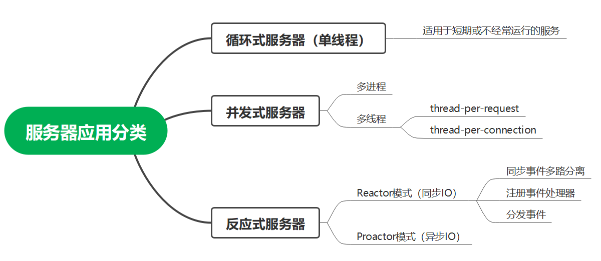


# socket ⭐

> 插座？ 接口？反正不叫套接字

## socket 基础

### 什么是 Socket？

> 客户端和服务器能在网络中通信，需要使用 Socket 编程。

**Socket 是进程间通信的方式、接口**

Socket 是操作系统提供的一种通信机制，为 **进程间通信** 提供统一的 **接口**。

应用程序通过创建一个 socket 连接到网络，就像插头插入插座一样，与其他进程通信。

Socket 利用 **<span style="color:#0000FF;">三元组（ip 地址，协议，端口）</span>** 就可以唯一标识网络中的**进程**，网络中的进程通信可以利用这个标志与其它进程进行交互。


**Socket 封装 TCP/IP 协议族，对应用程序提供接口**

> 操作系统需要实现一组 **系统调用**，使得 **应用程序能访问网络协议提供的服务**，实现这组系统调用的 **API**（应用程序编程接口），主要有两套：**Socket**，XTI（基本不用）

Socket 是对 TCP/IP 协议族的一种封装，是**应用层与 TCP/IP 协议族通信的中间软件抽象层**，是一组接口。


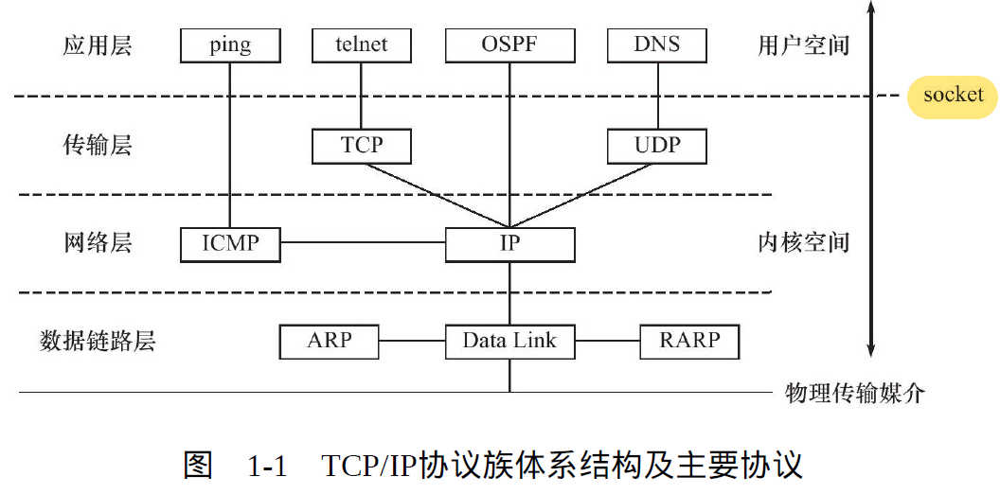

从设计模式的角度看来，Socket 其实就是一个门面模式，它 **把复杂的 TCP/IP 协议族隐藏在 Socket 接口后面**，对用户来说，一组简单的接口就是全部，让 Socket 去组织数据，以符合指定的协议。


**由 Socket 定义的这一组 API 提供的两点功能：**

- 将应用程序数据，从用户缓冲区，复制到 TCP/UDP 内核发送缓冲区，以交付内核来发送数据；或者是从内核 TCP/UDP 接收区中复制数据到用户缓冲区
- 应用程序可以通过他们来修改内核中各层协议的某些头部信息或其他数据结构，控制底层通信的行为


> Socket 起源于 Unix ，Unix/Linux 基本哲学之一就是“一切皆文件”，都可以用“打开(open) –> 读写(write/read) –> 关闭(close)”模式来进行操作。因此 **Socket 也被处理为一种特殊的文件**。


### Socket 分类

- SOCK_STREAM 流式：提供一种 **可靠的、面向连接的双向** 数据通信，底层是 TCP 协议

- SOCK_DGRAM 数据报：提供一种 **无连接、不可靠的双向** 数据通信，底层是 UDP

- SOCK_RAW 原始套接字：允许对 **较低层协议（如 IP 或 ICMP）** 进行直接访问，能指定 IP 头部

  

### Socket 用到的概念

#### 端口

- 在 Internet 上有很多这样的主机，这些主机一般运行了多个服务软件，同时提供几种服务。
- **每种服务都打开一个 Socket，并绑定到一个端口上**，不同的端口对应于不同的服务（应用程序）
- 因此，在网络协议中使用 **端口号识别主机上不同的进程**。

> 例如：http 使用 80 端口，FTP 使用 21 端口，SSH 使用 22 端口，DNS 使用 53 端口，TelNet 使用 23 端口。


#### 协议

- **TCP：面向连接的、可靠的，基于字节流的传输层通信协议。**
  - 工作过程：
    - 建立连接：三次握手
    - 传输数据
    - 断开连接：四次握手
  - 特点：
    - 面向连接
    - 端到端，只能一对一，不能一对多
    - 高可靠
    - 全双工方式传输
    - 数据以字节流的方式传输，传输的数据无消息边界
  - 同步与异步
    - 同步工作方式：是指利用 TCP 编写的程序执行到监听或接收语句时，在未完成工作（侦听到连接请求或收到对方发来的数据）前不再继续往下执行，线程处于**阻塞**状态，直到该语句完成相应的工作后才继续执行下一条语句。
    - 异步工作方式：是指程序执行到监听或接收语句时，不论工作是否完成，都会**继续**往下执行。

- **UDP：面向数据报的无连接的协议，提供的是不一定可靠的传输服务**
  - 无连接
    - 是指在正式通信前不必与对方先建立连接，不管对方状态如何都直接发送过去。
    - 这与发手机短信非常相似，只要知道对方的手机号就可以了，不要考虑对方手机处于什么状态。
    - UDP 虽然不能保证数据传输的可靠性，但数据传输的效率较高。
  - UDP 和 TCP 的区别
    - UDP 不可靠
    - UDP 不能保证有序传输
  - UDP 的优势
    - UDP 速度更快，不需要连接，也不需要传输确认
    - UDP 有消息边界
    - UDP 可以一对多


#### 字节序

> 不同的计算机对数据的存储格式不一样，比如 32 位的整数 0x12345678，可以在内存里从高到低存储为 12-34-56-78（大端） 或者从低到高存储为 78-56-34-12（小端）。
>
> 但是这对于网络中的数据来说就带来了一个严重的问题，当机器从网络中收到 12-34-56-78 的数据时，它怎么知道这个数据到底是什么意思？
>
> 解决的方案也比较简单，在传输数据之前和接受数据之后，必须调用 **htonl/htons 或 ntohl/ntohs** 先把数据转换成网络字节序或者把网络字节序转换为机器的字节序。

**网络字节序：** 大端

**本地字节序：** 小端

~~~C++
// 假设你传入端口 `port = 0x1F90`（十进制 8080），

// 在本地 x86 主机（小端）内存里：
0x90 0x1F
// 使用 htons(port)后（大端）:
0x1F 0x90 
~~~


## 模型 C/S

在网络编程中，最常见的是 **客户端 / 服务器（C/S）模型**：（Client - Server）

Socket 一般应用模式也是这种。

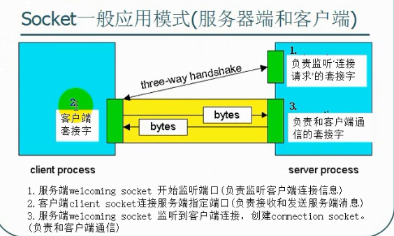

**两个角色**：

- 客户端 Client
  - 主动发起请求
  - 必须提前知道服务端的 IP 地址和通讯端口
- 服务端 Server
  - 等待客户端的连接，为客户端提供服务
  - 不需要知道客户端的IP

**服务端主要职责**：

- 创建 socket
- 绑定地址 `bind()`
- 开始监听 `listen()`
- 接受连接 `accept()`
- 通信读写 `read() / write()`
- 关闭连接 `close()`

**客户端主要职责**：

- 创建 socket
- 连接服务器 `connect()`
- 通信读写  `read() / write()`
- 关闭连接 `close()`


## Socket 通信流程（TCP）

> 最基础的 TCP 的 Socket 编程，它是阻塞 I/O 模型，基本上只能一对一通信

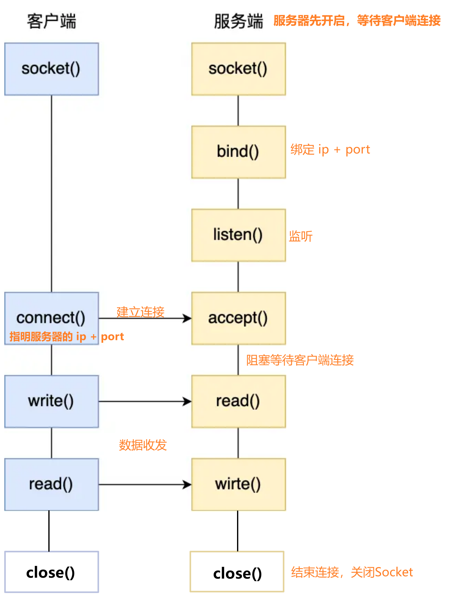

服务器的程序要先跑起来，然后等待客户端的连接和数据。

【**服务端**】：

- **创建 Socket**：使用 `socket()` 创建用于监听连接的 Socket

- **绑定地址**：使用 `bind()` 将 Socket 绑定到指定的监听 <span style="color:#CC0000;">【ip 和 端口】</span>

  > **绑定端口的目的**：当内核收到 TCP 报文，通过 TCP 头里面的端口号，来找到我们的应用程序，然后把数据传递给我们。
  >
  > **绑定 IP 地址的目的**：一台机器是可以有多个网卡的，每个网卡都有对应的 IP 地址，当绑定一个网卡时，内核在收到该网卡上的包，才会发给我们；

- **开始监听**：使用 `listen()` 开始监听客户端连接

  > 如果要判定服务器中一个网络程序有没有启动，可以通过 `netstat` 命令查看对应的端口号是否有被监听。

- **接收客户端的连接**：使用 `accept()` 接收客户端的连接请求

- **关闭 Socket**：通信结束后，使用 `close()` 关闭 socket

  

【**客户端**】：

- **创建 Socket**：使用 `socket()` 创建 Socket

- **连接服务器**：使用 `connect()` 向服务器发出连接请求，该函数的参数要指明服务端的 <span style="color:#CC0000;">【IP 和端口号】</span>

  > 然后 TCP 三次握手就开始了

- **数据发送**：使用 `read()` 和 `write()` 进行对服务器的数据收发

- **关闭 Socket**：通信结束后，使用 `close()` 关闭 socket


在 TCP 连接的过程中，**服务器的内核实际上为每个 Socket 维护了两个队列**：

- 一个是「还没完全建立」连接的队列，称为 **<span style="color:#0000FF;">TCP 半连接队列</span>**，这个队列都是没有完成三次握手的连接，此时服务端处于 `syn_rcvd` 的状态；
- 一个是「已经建立」连接的队列，称为 **<span style="color:#0000FF;">TCP 全连接队列</span>**，这个队列都是完成了三次握手的连接，此时服务端处于 `established` 状态；

当 TCP 全连接队列不为空后，服务端的 `accept()` 函数，就会从内核中的 TCP 全连接队列里**拿出一个已经完成连接的 Socket** 返回应用程序，**后续数据传输都用这个 Socket**。


**注意，<span style="color:#CC0000;">监听的 Socket 和真正用来传数据的 Socket 是两个</span>：**

- 一个叫作**监听 Socket**；
- 一个叫作**已连接 Socket**；


连接建立后，客户端和服务端就开始相互传输数据了，双方都可以通过 `read()` 和 `write()` 函数来读写数据。


**TCP Socket 编程流程**

服务端：

~~~C++
int sockfd = socket(AF_INET, SOCK_STREAM, 0); // 1. 创建 socket（IPv4，TCP）

sockaddr_in addr; // 地址结构
addr.sin_family = AF_INET;
addr.sin_port = htons(8080);
addr.sin_addr.s_addr = INADDR_ANY;

bind(sockfd, (sockaddr*)&addr, sizeof(addr)); // 2. 绑定本地地址 【所有ip ：8080】

listen(sockfd, SOMAXCONN);                    // 3. 开始监听

int connfd = accept(sockfd, NULL, NULL);      // 4. 接受客户端连接 connfd接收客户端的Sockfd

char buffer [1024];
read(connfd, buffer, sizeof(buffer));         // 5. 接收客户端数据

write(connfd, "OK", 2);                        // 6. 回复客户端

close(connfd);                                 // 7. 关闭连接
close(sockfd);
~~~

客户端：

~~~C++
int sockfd = socket(AF_INET, SOCK_STREAM, 0);   // 1. 创建 socket
connect(sockfd, server_addr, ...);              // 2. 主动连接服务端，指明服务端的 IP 和端口号
write(sockfd, ...);                             // 3. 发送数据
read(sockfd, ...);                              // 4. 接收数据
shutdown(sockfd, SHUT_WR);                      // 5. 可选：关闭写
close(sockfd);                                  // 6. 关闭连接
~~~


## Socket 也是【文件】

读写 Socket 的方式，好像读写文件一样。

是的，基于 **Linux 一切皆文件**的理念，在内核中 Socket 也是以「文件」的形式存在的，也是有对应的文件描述符。

**文件描述符 fd ：**

每一个进程都有一个数据结构 `task_struct`，该结构体里有一个指向「**文件描述符数组**」的成员指针。

「文件描述符数组」里列出这个进程打开的所有文件的文件描述符。

- 数组的下标是文件描述符，是一个整数，
- 而数组的内容是一个指针，指向内核中所有打开的文件的列表

也就是说**内核可以通过文件描述符找到对应打开的文件**。


然后每个文件都有一个 **inode**，Socket 文件的 inode **指向了内核中的 Socket 结构**，在这个结构体里有两个队列，分别是**发送队列**和**接收队列**，这个两个队列里面保存的是一个个 `struct sk_buff`，用链表的组织形式串起来。

**sk_buff** 可以表示各个层的数据包，在应用层数据包叫 data，在 TCP 层我们称为 segment，在 IP 层我们叫 packet，在数据链路层称为 frame。

> **为什么全部数据包只用一个结构体来描述呢？**
>
> 协议栈采用的是分层结构，上层向下层传递数据时需要增加**包头**，下层向上层数据时又需要去掉包头，如果每一层都用一个结构体，那在层之间传递数据的时候，就要发生多次拷贝，这将大大降低 CPU 效率。
>
> 于是，为了在层级之间传递数据时，**不发生拷贝**，只用 sk_buff 一个结构体来描述所有的网络包，那它是如何做到的呢？
>
> 是通过调整 sk_buff 中 `data` 的指针，比如：
>
> - 当接收报文时，从网卡驱动开始，通过协议栈层层往上传送数据报，通过增加 skb->data 的值，来逐步剥离协议首部。
> - 当要发送报文时，创建 sk_buff 结构体，数据缓存区的头部预留足够的空间，用来填充各层首部，在经过各下层协议时，通过减少 skb->data 的值来增加协议首部。


## 地址结构 sockaddr

### sockaddr_in

`sockaddr_in` 是 C/C++ socket 编程中用于 **描述一个 IPv4 的通信地址（IP+端口）的结构体**。直接用。

定义在 `<netinet/in.h>` 中。用于指定 **IP 地址 + 端口号**，比如 `192.168.1.100:8080`。

**结构定义**

~~~C++
struct sockaddr_in {
    sa_family_t    sin_family;    // 地址族，必须是 AF_INET（IPv4）
    in_port_t      sin_port;      // 端口号（16位，网络字节序，大端）
    struct in_addr sin_addr;      // IP 地址（32位，网络字节序）
    char           sin_zero [8];  // 填充字段，保持与 sockaddr 结构体大小一致
};
~~~

| 字段          | 类型                 | 作用             | 说明                                         |
| ------------- | -------------------- | ---------------- | -------------------------------------------- |
| `sin_family`  | `sa_family_t`        | 协议族           | 必须设置为 `AF_INET`，表示 IPv4              |
| `sin_port`    | `in_port_t` (16-bit) | 端口号           | 需要使用 `htons()` 转为网络字节序（大端序）  |
| `sin_addr`    | `struct in_addr`     | IPv4 地址        | 需要使用 `inet_addr()`、`inet_pton()` 等赋值 |
| `sin_zero[8]` | 填充                 | 保持结构大小一致 | 一般用 `memset()` 将整个结构清零             |


**in_addr**

~~~C++
struct sockaddr_in {
    sa_family_t    sin_family;  
    in_port_t      sin_port;    
    struct in_addr sin_addr;    // ⭐ IP 地址  in_addr结构
    ...
};

struct in_addr {
    in_addr_t s_addr;           // ⭐⭐ 32 位 IP 地址（uint32_t）
};
~~~


**系统 socket API 使用 `struct sockaddr`地址结构**，作用场景：

- **服务器**：用 `bind()` 把 socket 和一个本地 【IP+端口】绑定
- **客户端**：用 `connect()` 发起连接请求到目标 【IP+端口】

比如`connect()`：

`connect()` 用于客户端向服务器发起连接请求。它告诉操作系统：“我要连接到这个 IP + 端口，请帮我建立 TCP 连接。”

~~~C++
// sockadr 对象 addr 传入 connect()
int connect(int sockfd, const struct sockaddr *addr, socklen_t addrlen);
// addr   指向目标服务器地址结构（如 sockaddr_in）
// addrlen 地址结构的大小
~~~

很多 socket API 用的是 `struct sockaddr*`，这是为了兼容 IPv4/IPv6。

`sockaddr_in` 是 `sockaddr` 的子类型，可通过类型转换使用：

~~~C++
connect(sockfd, (struct sockaddr*)&addr, sizeof(addr));
~~~


### sockaddr

`sockaddr` 是一个通用结构体，是 `bind()` 这样的系统调用所要求的接口；

`sockaddr_in` 是一个具体结构体，包含 IPv4 地址、端口等；是 `sockaddr` 的子类型

可以理解为：`sockaddr_in` 是 `sockaddr` 的 “特化形式”，专门用于 IPv4。

> sockaddr_in 用于 IPv4，sockaddr_in6 用于 IPv6

~~~c++
// 通用地址结构体
struct sockaddr {
 sa_family_t sa_family;    // 地址族，比如 AF_INET (Ipv4)
 char        sa_data [14]; // 原始地址数据（IP + 端口）
};

// IPv4 地址结构体
struct sockaddr_in {
 sa_family_t    sin_family;  // 地址族（AF_INET）
 uint16_t       sin_port;    // 端口（网络字节序）
 struct in_addr sin_addr;    // IP 地址
 char           sin_zero [8]; // 填充字节
};
~~~


### 字节序函数

~~~C++
htons() - Host to Network Short
	•	功能: 将 16 位短整数（short）从主机字节序 ➡️ 转换为网络字节序。
	•	原型: uint16_t htons(uint16_t hostshort);

ntohs() - Network to Host Short
	•	功能: 将 16 位短整数从网络字节序 ➡️ 转换为主机字节序。
	•	原型: uint16_t ntohs(uint16_t netshort);

htonl() - Host to Network Long
	•	功能: 将 32 位长整数（long）从主机字节序 ➡️ 转换为网络字节序。
	•	原型: uint32_t htonl(uint32_t hostlong);

ntohl() - Network to Host Long
	•	功能: 将 32 位长整数从网络字节序 ➡️ 转换为主机字节序。
	•	原型: uint32_t ntohl(uint32_t netlong);
~~~


## socket API

| 分类         | 函数名                          | 作用说明                                                     | 适用对象      |
| ------------ | ------------------------------- | ------------------------------------------------------------ | ------------- |
| 创建         | `socket()`                      | 创建一个 socket，返回文件描述符（fd）                        | 服务端/客户端 |
| 绑定         | `bind()`                        | 将 socket 与本地 IP+端口绑定                                 | 服务端        |
| 监听         | `listen()`                      | 将 socket 设置为监听状态，准备接收连接                       | 服务端        |
| 接收连接     | `accept()`                      | 接受客户端连接，返回一个新的连接 socket（connfd）            | 服务端        |
| 发起连接     | `connect()`                     | 主动向服务端发起 TCP 连接请求                                | 客户端        |
| 读写         | `read()` / `write()`            | 从 socket 读/写数据（字节流）                                | 双方          |
| 读写（增强） | `send()`/`recv()` /             | TCP 专用，发送接收数据<br />与 `read` / `write` 类似，可带 flags 控制行为 | 双方          |
|              | `sendto()` / `recvfrom()`       | UDP 专用，发送接收数据，指定端口和 ip                        | 双方          |
| 地址处理     | `getsockname()`                 | 获取本端 socket 绑定的地址信息                               | 双方          |
| 地址处理     | `getpeername()`                 | 获取对端（peer）socket 地址信息                              | 双方          |
| 参数设置     | `setsockopt()`                  | 设置 socket 选项（如：TCP_NODELAY, SO_REUSEADDR）            | 双方          |
| 参数获取     | `getsockopt()`                  | 获取 socket 参数                                             | 双方          |
| 关闭连接     | `shutdown()`                    | 半关闭连接（只关读/只关写）                                  | 双方          |
| 关闭 socket  | `close()`                       | 关闭 socket，释放资源                                        | 双方          |
| I/O 多路复用 | `select()` / `poll()` / `epoll` | 等待 socket 可读/可写事件                                    | 双方          |


### socket()

 Linux/POSIX 系统提供的 **系统调用**，用于创建一个 socket，即**通信端点**。

`socket()` 是网络通信的第一步，它**创建了一个 socket 描述符 fd**。此描述符随后可用于：绑定（`bind()`）、监听（`listen()`）、接收连接（`accept()`）、主动发起连接（`connect()`）等操作。

~~~C++
int socket(int domain, int type, int protocol);
//         协议族       Socket类型       具体协议
~~~

**参数：**

- `domain` 协议族：

  | 宏名         | 描述                                        | 场景举例           |
  | ------------ | ------------------------------------------- | ------------------ |
  | `AF_INET`    | **IPv4 协议族（常用**）                     | 互联网通信（HTTP） |
  | `AF_INET6`   | IPv6 协议族                                 | 未来网络           |
  | `AF_UNIX`    | 本地 UNIX 域协议，用于本地进程间通信（IPC） | 本机 socket 通信   |
  | `AF_PACKET`  | 底层原始数据包接口（Linux）                 | 抓包、实现网桥等   |
  | `AF_NETLINK` | 内核与用户空间通信                          | 网络管理、内核控制 |

- `type`   Socket类型：

  | 宏名             | 描述                                                         | 应用场景                    |
  | ---------------- | ------------------------------------------------------------ | --------------------------- |
  | `SOCK_STREAM`    | **面向连接**、可靠的**字节流**，有序、无重复（基于 **TCP**） | Web、数据库                 |
  | `SOCK_DGRAM`     | **无连接** 的**数据报**，不可靠但开销小（基于 **UDP**）      | DNS、视频流、VoIP           |
  | `SOCK_SEQPACKET` | 面向连接、消息边界保留、可靠（用于 `AF_UNIX`）               | 某些系统级通信              |
  | `SOCK_RAW`       | 原始套接字，可自定义协议头，需特权（用于协议栈研究、抓包）   | Wireshark、Ping、Traceroute |
  | `SOCK_NONBLOCK`  | 设置 socket 为 **非阻塞** 模式（可通过按位或使用）           | 高性能网络服务器            |
  | `SOCK_CLOEXEC`   | 设置 close-on-exec，防止文件描述符在 exec 后泄露             | 安全型多进程程序            |

- `protocol`  具体协议，通常填 0，系统自动选择

  | 值             | 描述                                       | 适用场景                 |
  | -------------- | ------------------------------------------ | ------------------------ |
  | `0`            | 自适应协议，自动选择协议（通常为 TCP/UDP） | 推荐设置                 |
  | `IPPROTO_TCP`  | 明确指定 TCP 协议                          | 通常和`SOCK_STREAM` 使用 |
  | `IPPROTO_UDP`  | 明确指定 UDP 协议                          | 通常和`SOCK_DGRAM` 使用  |
  | `IPPROTO_ICMP` | ICMP 协议（Ping）                          | 通常和 `SOCK_RAW`使用    |
  | `IPPROTO_RAW`  | 原始 IP 协议                               | 安全工具/研究            |

**返回值：**

- 成功：返回一个 **文件描述符 fd**（int 类型），代表该 socket。
- 失败：返回 -1，并设置全局变量 `errno`，描述具体错误原因（例如 `EMFILE`, `EACCES`, 等）。

**示例：**

~~~C++
int sockfd = :: socket(AF_INET, 		// 使用 IPv4 协议
                       SOCK_STREAM | 	// 使用 TCP，可靠、面向连接的字节流通信
                       SOCK_NONBLOCK |  // 非阻塞模式，避免 `accept()`、`read()` 等阻塞当前线程
                       SOCK_CLOEXEC, 	// 在调用 `exec()` 族函数时自动关闭该描述符，防止 fd 泄漏
                       IPPROTO_TCP);	// 指定使用 TCP 协议
~~~


### bind()

服务端调用，将已创建的 **socket fd 绑定到一个本地地址**。

告诉操作系统：**这个 socket 要在哪个 IP 和端口上接收数据或连接**。

~~~c++
int bind(int sockfd, const struct sockaddr *addr, socklen_t addrlen);
~~~

**参数：**

- `sockfd` ：通过 `socket()` 创建得到的 socket fd
- `addr` ：指向本地地址结构体的指针（通常是 `sockaddr_in` 或 `sockaddr_in6`），Socketfd绑定这个地址
- `addrlen` ：本地地址结构体的字节大小，如 `sizeof(sockaddr_in)`

> 第二个参数要注意，参数指定的是 `struct sockaddr *` 类型，，一般不直接使用这个结构，这个类型在 Linux 上有许多的变种，比如 `sockaddr_in`(IPv4) ，在 bind 是强制转换成 `struct sockaddr *` 类型：

**返回值**

- 成功返回 0
- 失败返回 -1，并设置 erron

**IP 是 “本地网卡的地址”**，比如：

- `127.0.0.1`：本机环回地址，仅本地访问
- `0.0.0.0`：绑定到所有本地网卡地址
- `192.168.1.100`：绑定到指定网卡的 IP

**端口 是 “应用程序监听的编号”：**

- 一个端口对应一个网络服务（例如 80 是 HTTP，22 是 SSH）
- 如果不绑定端口，系统不知道哪个程序处理该服务


对于**服务端**，必须通过 `bind()` 将 socket 绑定到特定的 【IP: Port 组合】，才能接受客户端连接。

当调用 `bind()`，实际上是向操作系统注册这个 `socket`，即 ”**这个 socket 以后负责处理发往 `IP: Port` 的数据**“

**示例**：

假设你写了一个 Web 服务器，要监听 `127.0.0.1:8080`：

- 创建 socket

  ~~~c++
  int sockfd = socket(AF_INET, SOCK_STREAM, 0);
  ~~~

- 准备地址并调用 bind

  ~~~c++
  sockaddr_in addr;
  addr.sin_family = AF_INET; 	// 地址族 IPv4
  addr.sin_port = htons(8080);// 端口号（要转一下网络字节序）
  inet_pton(AF_INET, "127.0.0.1", &addr.sin_addr); // ip：点分十进制 --> 网络二进制
  
  bind(sockfd, (sockaddr*)&addr, sizeof(addr));
  ~~~

  此时系统就知道：这个 socket 负责监听 127.0.0.1:8080

  任何来自浏览器的 `http://127.0.0.1:8080` 请求，最终都会被这个 socket 接收。


### listen()

 服务端调用，用于将一个已绑定的 socket 转为 **监听状态**，以便接收传入的 TCP 连接.

~~~c++
int listen(int sockfd, int backlog);
~~~

**参数：**

- `sockfd` ：已经绑定本地地址之后的服务端 sockfd
- `backlog` ：未 accept 的连接请求最大数量
  - 操作系统维护一个**队列**，用于存放**已完成三次握手但尚未被 accept 的连接**
  - 超过此数量，新的连接请求会被拒绝

**返回值：**

- 成功返回 `0`；
- 失败返回 `-1`，常见错误包括：
  - `EINVAL`：socket 未绑定或已处于监听状态；
  - `ENOTSOCK`：不是 socket；
  - `EOPNOTSUPP`：协议不支持监听（如 UDP）；

**示例过程（完整服务器 socket 生命周期）**

~~~c++
int sockfd = socket(AF_INET, SOCK_STREAM, 0); // 创建
bind(sockfd, ...);                            // 绑定 IP 和端口
listen(sockfd, 1024);                         // 开始监听，最大连接数1024
int connfd = accept(sockfd, ...);             // 接收连接
~~~


### accept()

服务端调用，`accept()` 用于从监听sockfd 中 **接受一个新连接**， `accept4()` 是对传统 `accept()` 的增强版。

#### 传统 `accept()`

~~~c++
#include <sys/types.h>   
#include <sys/socket.h>

/*
 * sockfd: 已经创建的本地正在监听的 socket
 * addr: 保存连接的客户端的地址信息
 * addrlen: sockaddr 的长度指针
 *
 * return: 成功返回新连接的客户端的 socket fd；失败返回 -1，设置 erron
 */
int accept(int sockfd, struct sockaddr *addr, socklen_t *addrlen);
~~~

后两个参数我们需要定义，但是不需要初始化，在连接成功后客户端的 socket 信息会自动地填入第 3 个结构中。

示例：

~~~c++
struct sockaddr_in clientaddr;
int clientaddr_len = sizeof(clientaddr);

// 建立连接请求
int client_fd = accept(server_fd, (struct sockaddr *)&clientaddr, &clientaddr_len);
if(client_fd == -1) {
    perror("accept error") ;
    exit(1) ;
}

// socket fd 使用完毕也必须关闭
close(client_fd);
~~~


#### `accept4()`  

`accept4()`  不仅接受连接，还能 **直接为新连接设置属性**，比如非阻塞（`O_NONBLOCK`）和关闭继承（`O_CLOEXEC`）。

~~~c++
#include <sys/types.h>   
#include <sys/socket.h>

/*
 * flags：额外设置的 socket 属性，可选项如下：
 		 SOCK_NONBLOCK：设置返回的连接为非阻塞；
 		 SOCK_CLOEXEC：子进程不会继承这个 socket（避免资源泄露）
 
 * return: 成功返回新连接的客户端的 socket fd；失败返回 -1，设置 erron
 */

int accept4(int sockfd, struct sockaddr *addr, socklen_t * addrlen, int flags);
~~~

标志位 flags

| 标志            | 用途说明                              | 是否可被继承 | 替代方式（手动设置）             | 推荐用途                          |
| --------------- | ------------------------------------- | ------------ | -------------------------------- | --------------------------------- |
| `SOCK_NONBLOCK` | 设置 socket 为 **非阻塞模式**         | ✅            | `fcntl(fd, F_SETFL, O_NONBLOCK)` | epoll / Reactor 模型              |
| `SOCK_CLOEXEC`  | 在 `exec()` 时 **自动关闭文件描述符** | ❌            | `fcntl(fd, F_SETFD, FD_CLOEXEC)` | 防止子进程继承 socket、提高安全性 |


### connect()

客户端调用，`connect()` 用于向服务器发起连接请求。

它告诉操作系统：“**我要连接到这个 IP + 端口，请帮我建立 TCP 连接**。”

~~~C++
#include <sys/socket.h>

int connect(int sockfd, const struct sockaddr *addr, socklen_t addrlen);
// sockfd 通过 socket()创建的套接字描述符
// addr   指向目标服务器地址结构（如 sockaddr_in）
// addrlen 地址结构的大小

// 返回值  成功返回 0，失败返回-1，并设置 error
~~~


### send() 、sendto()

双方可调用，在建立连接之后，要发送数据，既然 socket 也是文件，发送数据其实也就是写文件，我们使用 send 函数来发送 socket 数据：

~~~c++
#include <sys/types.h>
#include <sys/socket.h>

/*
 * sockfd: 接受数据的 socket
 * buf: 发送的数据
 * len: 数据长度
 * flags: 当这个参数为 0，该函数等价与 write
 * return: 成功返回发送的字节数，失败返回 -1，并设置 erron
 */
ssize_t send(int sockfd, const void *buf, size_t len, int flags);

/* sendto 功能是将数据发送到指定的地址 dest_addr，其他参数基本相同 */
ssize_t sendto(int sockfd, const void *buf, size_t len, int flags,
               const struct sockaddr *dest_addr, socklen_t addrlen);
~~~

例如服务器在建立连接后发送一个字符串到客户端：

~~~c++
char msg[] = "Hello Client."
send(client_fd, msg, strlen(msg), 0);

sendto(client_fd, msg, strlen(msg), 0,
      (struct sockaddr*)&dest_addr, sizeof(dest_addr));
~~~


### recv() 、recvfrom()

双方可调用，用于接收数据，与 send 类似，recv 的功能也跟 read 几乎相同：

```C++
#include <sys/types.h>
#include <sys/socket.h>

/*
 * sockfd: 接收的 socket fd
 * buf: 接收缓冲区
 * len: 缓冲区长度
 * flags: 当这个参数为 0，该函数等价与 read
 * return: 成功返回接受的字节数，失败返回 -1，并设置 erron
 */
ssize_t recv(int sockfd, void *buf, size_t len, int flags);

/* recvfrom 从指定的地址 src_addr 接收数据，其他参数与 recv 类似 */
ssize_t recvfrom(int sockfd, void *buf, size_t len, int flags,
                 struct sockaddr *src_addr, socklen_t *addrlen);
```

例如接受服务器发送的字符串：

~~~C++
char msg_buf[100] = { 0 };
recv(server_fd, msg_buf, 100, 0);

int srcaddr_len = sizeof(src_addr);
recvfrom(server_fd, msg_buf, 100, 0,
        (struct sockaddr*)&src_addr, &srcaddr_len);
~~~


### read()

从文件描述符 fd 中读取 count 字节数据，读到用户提供的缓冲区 buf 中。

~~~C++
ssize_t read(int fd, void *buf, size_t count);

// fd：要读取的文件描述符
// buf：用于存放读入数据的内存地址
// count：最多读多少字节
~~~

返回值：

- 成功返回实际读取的字节数
- 失败返回-1，并设置 `errno`
- 读到 EOF：返回 0 （例如从文件末尾读）


### write()

将数据写入文件描述符，通常用于向文件、socket、eventfd 等对象传递数据。

~~~C++
ssize_t write(int fd, const void *buf, size_t count);

// fd：要写入的文件描述符
// buf：指向写入数据的内存地址
// count：要写入的字节数
~~~

返回值：

- 成功返回实际写入的字节数
- 失败返回-1，并设置 `errno`

特点：

- 写入的数据长度可能小于 `count`（短写）。
- 如果文件描述符是非阻塞的，可能立即返回。


### close()

 Linux 中专门用于 **关闭文件描述符 fd 的系统调用**，释放系统资源。头文件 `<unistd.h>`

~~~C++
#include <unistd.h>

int close(int fd);
~~~

**参数 fd：**

- 是一个非负整数，用来标识内核中打开的一个文件对象。
- 不仅代表“文件”，也可以是普通文件、Socket、epoll 实例等

| fd 类型       | 说明                                        |
| ------------- | ------------------------------------------- |
| 普通文件      | 关闭打开的文件，释放文件表和内核 inode 引用 |
| socket        | 关闭网络连接，触发 FIN（TCP）               |
| epoll 实例    | 删除 epoll 对象，释放与之绑定的资源         |
| 管道          | 关闭一端，可能导致另一端读/写出错           |
| 终端/设备文件 | 释放设备资源                                |

返回值：

- 成功：返回 `0`
- 失败：返回 `-1`，并设置 `errno` 表示错误原因

**常见错误码包括：**

| 错误码  | 含义说明                               |
| ------- | -------------------------------------- |
| `EBADF` | 参数 `fd` 不是一个有效的打开文件描述符 |
| `EIO`   | 关闭设备时发生 I/O 错误                |

**作用：**

✅ 释放系统资源（文件表、内核对象）

- 每个打开的文件/句柄都占用系统资源。
- 若不及时关闭，可能导致 **资源泄露**（特别是长运行的服务进程）。

✅ 标记文件描述符为可复用

- 文件描述符是有限的（受限于 `ulimit -n`，通常默认是 1024）。
- `close(fd)` 之后，操作系统可以复用该编号，避免句柄耗尽。

✅ 对 epoll/fd/socket 等资源来说，是 **必须的清理操作**

- 比如：若 `epollfd_` 没有关闭，内核中 epoll 实例会一直存在，即使程序已经不再使用。

**`::close()`：**

- 在 C++ 中，为了 **避免与类中可能定义的 `close()` 成员函数发生冲突**，经常使用 `::close()` 显式表示

- 调用的是 **全局** 命名空间下的 C 函数 `close()`，即 `unistd.h` 中的系统调用


### setsockopt()

 **用于设置 socket 选项的系统调用**，它允许你为 socket 打开、关闭或配置各种传输层和协议栈相关的参数。

~~~c++
#include <sys/socket.h>
int setsockopt(int sockfd, 			// 创建的 socket 的 fd
               int level, 			// 设置的协议层
               int optname,			// 具体的选项名称
               const void *optval, 	// 指向设置值的指针 通常是 int*
               socklen_t optlen);	// optval 所指数据的字节大小
~~~

`level` 协议层，常见取值有：

- `SOL_SOCKET` 通用 socket 选项
- `IPPROTO_TCP` TCP 层选项

`optname` 选项名称，常见选项有：

| 选项名称       | 协议层        | 含义和用途                                                   |
| -------------- | ------------- | ------------------------------------------------------------ |
| `SO_REUSEADDR` | `SOL_SOCKET`  | **地址复用**。允许在 `TIME_WAIT` 状态下端口被立即重用。常用于服务端快速重启绑定同一端口。 |
| `SO_REUSEPORT` | `SOL_SOCKET`  | **端口复用**。多个 socket 可绑定同一个端口，操作系统将连接均衡分发，常用于多线程/多进程服务器。Linux 3.9+ 支持。 |
| `SO_KEEPALIVE` | `SOL_SOCKET`  | **TCP 保活**。周期性检测连接是否仍然有效。用于长连接检测对端是否崩溃或掉线。默认超时时间较长（一般 > 2 小时）。 |
| `TCP_NODELAY`  | `IPPROTO_TCP` | **禁用 Nagle 算法**。Nagle 用于减少网络中的小包数量。禁用后小数据包立即发送，适用于对延迟敏感的应用，如 IM、游戏。 |
| `SO_ERROR`     | `SOL_SOCKET`  | **获取 socket 上的错误状态**。返回 socket 对象最近一次发生的 socket 级错误码 |
| `SO_LINGER`    | `SOL_SOCKET`  | 控制 `close()` 调用后是否立即返回，以及内核是否丢弃未发送数据。适用于连接关闭时的数据处理策略控制。 |
| `SO_RCVBUF`    | `SOL_SOCKET`  | 设置接收缓冲区大小。影响 `recv()` 缓存能力。                 |
| `SO_SNDBUF`    | `SOL_SOCKET`  | 设置发送缓冲区大小。影响 `send()` 性能。                     |

**应用场景举例：**

- **Web 服务器重启绑定端口失败？**
  - 使用 `SO_REUSEADDR` 解决。

- **多线程高并发接入同一端口？**
  - 使用 `SO_REUSEPORT`，操作系统自动负载均衡。

- **防止长连接对端掉线而服务器不知？**
  - 使用 `SO_KEEPALIVE`，定期检查连接状态。

- **需要低延迟实时通信？**
  - 使用 `TCP_NODELAY` 禁用 Nagle，减少发送延迟。

**注意：**

- 所有选项都应在绑定或监听之前设置
- `TCP_NODELAY` 仅适用于 TCP socket，不适用于 UDP


### getSockname()

`::getsockname()` 是一个 系统调用，用于获取一个已绑定 socket 的 **本地地址信息**（IP + 端口）。

~~~C++
int getsockname(int sockfd, struct sockaddr * addr, socklen_t* addrlen);
~~~

参数：

- `sockfd`  已连接的 socket 描述符，通常是 `accept()` 或 `socket()` 返回的。
- `addr`  用于返回 socket 的本地地址信息（IP + 端口）。
- `addrlen`
  - 调用前：设为 `*addr` 的结构体长度（如 `sizeof(sockaddr_in)`）。
  - 调用后：系统会更新这个值为实际写入的长度


## Socket 编程示例

### 服务端

~~~C++
#include <iostream>
#include <cstring>
#include <unistd.h>
#include <arpa/inet.h>
 
int main() {

    // 创建 Socket
    int server_socket = socket(AF_INET, SOCK_STREAM, 0);
    if (server_socket == -1) {
        std::cerr << "无法创建 Socket\n";
        return 1;
    }
 
    // 把服务端用于通信的 IP + 端口【所有ip：12345】 绑定到socket上
    sockaddr_in server_addr{};                // 存放服务端IP和端口的数据结构
    server_addr.sin_family = AF_INET;         // IPv4
    server_addr.sin_addr.s_addr = INADDR_ANY; // IP 地址 监听所有网络接口（服务端任意网卡的IP都可以用于通讯）
    server_addr.sin_port = htons(12345);      // 指定监听端口 12345
 
    if (bind(server_socket, (struct sockaddr*)&server_addr, sizeof(server_addr))) {
        std::cerr << "绑定失败\n";
        close(server_socket);
        return 1;
    }
 
    // Socket 开启监听 
    if (listen(server_socket, 5) == -1) {
        std::cerr << "监听失败\n";
        close(server_socket);
        return 1;
    }
 
    std::cout << "服务器正在监听端口 12345...\n"; // 监听到 127.0.0.1 : 12345 有新连接
 
    // 接收客户端的连接请求  如果没有客户端连上来，accept()函数将阻塞等待！！！！！！
    sockaddr_in client_addr{};
    socklen_t client_addr_len = sizeof(client_addr);
    int client_socket = accept(server_socket, (struct sockaddr*)&client_addr, &client_addr_len);
    if (client_socket == -1) {
        std::cerr << "接受连接失败\n";
        close(server_socket);
        return 1;
    }
 
    std::cout << "客户端已连接\n";

 
    // 接收客户端数据 存到 buffer
    char buffer[1024];
    int bytes_received = recv(client_socket, buffer, sizeof(buffer), 0);
    if (bytes_received == -1) {
        std::cerr << "接收数据失败\n";
    } else {
        buffer[bytes_received] = '\0';
        std::cout << "收到数据: " << buffer << std::endl;
    }
 
    // 向客户端发送数据
    const char* response = "你好，客户端！";
    send(client_socket, response, strlen(response), 0);
 
    // 关闭 Socket
    close(client_socket);
    close(server_socket);
 
    return 0;
}
~~~


### 客户端

~~~C++
#include <iostream>
#include <cstring>
#include <unistd.h>
#include <arpa/inet.h>
 
int main() {

    // 创建 Socket
    int client_socket = socket(AF_INET, SOCK_STREAM, 0);
    if (client_socket == -1) {
        std::cerr << "无法创建 Socket\n";
        return 1;
    }
 
    // 向服务器发起连接请求 【127.0.0.1:12345】
    sockaddr_in server_addr{}; // 存放服务端IP和端口的结构体
    server_addr.sin_family = AF_INET;
    server_addr.sin_port = htons(12345);                    // 服务器端口
    inet_pton(AF_INET, "127.0.0.1", &server_addr.sin_addr); // 服务器 IP 地址

    // connect 指明服务端的 IP 和端口号
    if (connect(client_socket, (struct sockaddr*)&server_addr, sizeof(server_addr))) { // 请求连接 Socket 和 服务端
        std::cerr << "连接服务器失败\n";
        close(client_socket);
        return 1;
    }
 
    std::cout << "已连接到服务器\n"; // 服务器接收连接，连接成功，可以收发数据了
 
    // 发送数据
    const char* message = "你好，服务器！";
    send(client_socket, message, strlen(message), 0);
 
    // 接收数据
    char buffer[1024];
    int bytes_received = recv(client_socket, buffer, sizeof(buffer), 0);
    if (bytes_received == -1) {
        std::cerr << "接收数据失败\n";
    } else {
        buffer[bytes_received] = '\0';
        std::cout << "收到数据: " << buffer << std::endl;
    }
 
    // 关闭 Socket
    close(client_socket);
 
    return 0;
}
~~~


运行结果

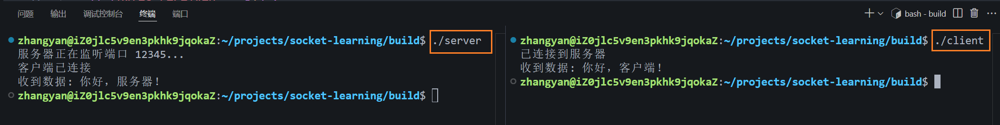


# 如何服务更多的用户？

前面提到的 <span style="color:#CC0000;">**TCP Socket**</span> 调用流程是最简单、最基本的，它基本**只能一对一通信**，因为使用的是**<span style="color:#CC0000;">同步阻塞</span>**的方式，当服务端在还没处理完一个客户端的网络 I/O 时，或者 读写操作发生阻塞时，其他客户端是无法与服务端连接的。

可如果我们服务器只能服务一个客户，那这样就太浪费资源了，于是我们要改进这个网络 I/O 模型，以支持更多的客户端。


*在改进网络 I/O 模型前，先考虑一个问题，**服务器单机理论最大能连接多少个客户端？***

TCP 连接是由四元组唯一确认的：<span style="color:#CC0000;">【**本机IP, 本机端口, 对端IP, 对端端口**】</span>

服务器作为服务方，通常会在本地固定监听一个端口，等待客户端的连接。因此服务器的本地 IP 和端口是固定的，于是对于服务端 TCP 连接的四元组只有对端 IP 和端口是会变化的，所以**<span style="color:#CC0000;">最大 TCP 连接数 = 客户端 IP 数×客户端端口数</span>**。

对于 IPv4，客户端的 IP 数最多为 2 的 32 次方，客户端的端口数最多为 2 的 16 次方，也就是**服务端单机最大 TCP 连接数约为 <span style="color:#CC0000;">2 的 48 次方</span>**。

这个理论值相当“丰满”，但是服务器肯定承载不了那么大的连接数，**主要会受两个方面的限制**：

- **文件描述符**，Socket 实际上是一个文件，也就会对应一个文件描述符。在 Linux 下，单个进程打开的文件描述符数是有限制的，没有经过修改的值一般都是 1024，不过我们可以通过 ulimit 增大文件描述符的数目；
- **系统内存**，每个 TCP 连接在内核中都有对应的数据结构，意味着每个连接都是会占用一定内存的；


***那如果服务器的内存只有 2 GB，网卡是千兆的，能支持并发 1 万请求吗？***

并发 1 万请求，也就是经典的 C10K 问题 ，C 是 Client 单词首字母缩写，C10K 就是**单机同时处理 1 万个请求**的问题。

从硬件资源角度看，对于 2GB 内存千兆网卡的服务器，如果每个请求处理占用不到 200KB 的内存和 100Kbit 的网络带宽就可以满足并发 1 万个请求。

不过，要想真正实现 C10K 的服务器，要考虑的地方在于服务器的网络 I/O 模型，效率低的模型，会加重系统开销，从而会离 C10K 的目标越来越远。


# 多进程模型

基于最原始的阻塞网络 I/O， 如果服务器要支持多个客户端，其中比较传统的方式，就是使用**多进程模型**，也就是为**<span style="color:#0000FF;">每个客户端分配一个进程</span>**来处理请求。

服务器的**<span style="color:#0000FF;">主进程</span>负责监听客户的连接**，一旦与客户端连接完成，accept() 函数就会返回一个「**已连接 Socket**」，这时就通过 `fork()` 函数创建一个**<span style="color:#0000FF;">子进程</span>**，实际上就把父进程所有相关的东西都**复制**一份，包括文件描述符、内存地址空间、程序计数器、执行的代码等。

这两个进程刚复制完的时候，几乎一模一样。不过，会根据**返回值**来区分是父进程还是子进程，如果返回值是 0，则是子进程；如果返回值是其他的整数，就是父进程。

正因为子进程会**复制父进程的文件描述符**，于是就可以直接使用「已连接 Socket 」和客户端通信了。

可以发现，子进程不需要关心「监听 Socket」，只需要关心「已连接 Socket」；父进程则相反，将客户服务交给子进程来处理，因此父进程不需要关心「已连接 Socket」，只需要关心「监听 Socket」。

下面这张图描述了从连接请求到连接建立，父进程创建生子进程为客户服务。

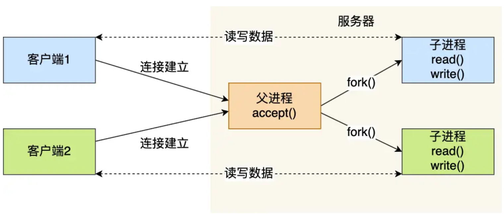


另外，当「子进程」退出时，实际上内核里还会保留该进程的一些信息，也是会占用内存的，如果不做好“回收”工作，就会变成**僵尸进程**，随着僵尸进程越多，会慢慢耗尽我们的系统资源。

因此，**父进程要“善后”好自己的孩子，怎么善后呢？**

那么有两种方式可以在子进程退出后回收资源，分别是调用 `wait()` 和 `waitpid()` 函数。


这种用多个进程来应付多个客户端的方式，在应对 100 个客户端还是可行的，但是当客户端数量高达一万时，肯定扛不住的，因为**每产生一个进程，必会占据一定的系统资源**，而且**进程间上下文切换**的“包袱”是很重的，性能会大打折扣。

进程的上下文切换不仅包含了虚拟内存、栈、全局变量等用户空间的资源，还包括了内核堆栈、寄存器等内核空间的资源。


# 多线程模型

既然进程间上下文切换的“包袱”很重，那我们就搞个比较轻量级的模型来应对多用户的请求 —— **多线程模型**。

**线程是运行在进程中的一个“逻辑流”**，单进程中可以运行多个线程，**同进程里的线程可以共享进程的部分资源**，比如文件描述符列表、进程空间、代码、全局数据、堆、共享库等，这些共享些资源在上下文切换时不需要切换，而只需要切换线程的私有数据、寄存器等不共享的数据，因此同一个进程下的线程上下文切换的开销要比进程小得多。

当服务器与客户端 TCP 完成连接后，通过 `pthread_create()` 函数创建线程，然后**将「已连接 Socket」的文件描述符传递给线程函数**，接着**在线程里和客户端进行通信**，从而达到并发处理的目的。


如果每来一个连接就创建一个线程，线程运行完后，还得操作系统还得销毁线程，虽说线程切换的上写文开销不大，但是如果**频繁创建和销毁线程，系统开销也是不小的**。

那么，我们可以使用**<span style="color:#CC0000;">线程池</span>**的方式来避免线程的频繁创建和销毁

- 提前创建若干个线程
- 这样当由新连接建立时，将这个已连接的 Socket 放入到一个队列里
- 然后线程池里的线程负责从队列中取出「已连接 Socket 」进行处理

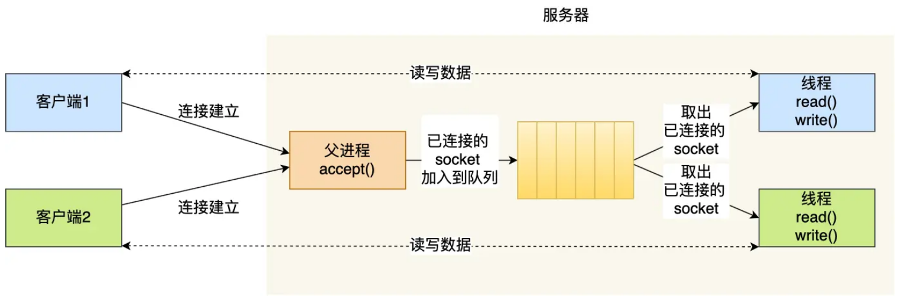

需要注意的是，这个队列是全局的，每个线程都会操作，为了避免多线程竞争，<span style="color:#CC0000;">线程在操作这个队列前要加锁</span>。


#  I/O 多路复用

> 上面**基于进程或者线程模型的，每个进程/线程只能处理一路 IO**，在服务器并发数较高的情况下，过多的进程/线程会使得服务器性能下降。
>
> 新到来一个 TCP 连接，就需要分配一个进程或者线程，那么如果要达到 C10K，意味着要一台机器维护 1 万个连接，相当于要维护 1 万个进程/线程，操作系统就算死扛也是扛不住的。
>
> 通过多路 IO 复用，能使得 **一个进程同时处理多路 IO**

既然为每个请求分配一个进程/线程的方式不合适，那**有没有可能只使用一个进程来维护多个 Socket 呢？**答案是有的，那就是 **I/O 多路复用**技术。

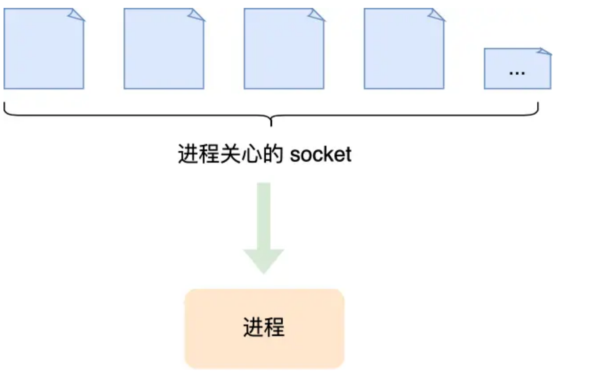

一个进程虽然任一时刻只能处理一个请求，但是处理每个请求的事件时，**耗时控制在 1 毫秒以内，这样 1 秒内就可以处理上千个请求**，把时间拉长来看，**多个请求复用了一个进程**，这就是多路复用，这种思想很类似一个 CPU 并发多个进程，所以也叫做时分多路复用。


Linux 下有三种提供 I/O 多路复用的 API，分别是：**<span style="color:#0000FF;">select、poll、epoll</span>**，是内核提供给用户态的多路复用系统调用，进程可以通过一个系统调用函数从内核中获取多个事件。

select/poll/epoll 是如何获取网络事件的呢？

在获取事件时，**先把所有连接（文件描述符）传给内核，再由内核返回产生了事件的连接**，然后在用户态中再处理这些连接对应的请求即可。


## select/poll

select  poll 都是 Linux 提供的 I/O 多路复用机制。

**select/poll 实现多路复用的方式**：

- 将已连接的 Socket 都放到一个【Socket集合】
- 然后通过 select/poll 系统调用，将【Socket集合】从用户态**拷贝到内核**
- 让内核来检查是否有网络事件产生，检查的方式就是通过**遍历** 【Socket集合】
- 当检查到有事件产生后，将此 Socket 标记为可读或可写
- 再把整个【Socket集合】**拷贝回用户态**里
- 用户态还需要再**遍历**整个【Socket集合】找到可读或可写的 Socket，然后再对其处理。


所以需要进行 **<span style="color:#0000FF;">2 次「遍历」文件描述符集合</span>**，一次是在内核态里，一个次是在用户态里 ;

而且还会发生 **<span style="color:#0000FF;">2 次「拷贝」文件描述符集合</span>**，先从用户空间传入内核空间，由内核修改后，再传到用户空间。


**select** 使用固定长度的 **BitsMap** 表示 Socket集合，而且**所支持的文件描述符的个数是有限制的**，在 Linux 系统中，由内核中的 FD_SETSIZE 限制， 默认最大值为 `1024`，**只能监听 0~1023 的文件描述符**。

**poll** 不再用 BitsMap 来存储所关注的Socket集合，取而代之用**动态数组**，以链表形式来组织，突破了 select 的文件描述符个数限制，当然还会**受到系统文件描述符限制**。


所以，poll 和 select 并没有太大的本质区别，都是**使用「线性结构」存储进程关注的 Socket 集合**，因此都需要**遍历** Socket 集合来找到可读或可写的 Socket，时间复杂度为 O(n)；而且也需要在用户态与内核态之间**拷贝**Socket 集合，这种方式随着并发数上来，性能的损耗会呈指数级增长。


当客户端越多，也就是 Socket 集合越大，**Socket 集合的遍历和拷贝会带来很大的开销**，因此也很难应对 C10K。


## epoll ⭐

`epoll` 是 Linux 内核提供的高效 I/O 事件通知机制，用于处理大量并发连接。

### 基本流程

- **注册监听事件**（如可读、可写）
- **等待事件发生**（阻塞或非阻塞方式）
- **获取就绪的文件描述符**（仅返回有事件的，不需要遍历全部）


它的核心作用是 **监听多个文件描述符（如Socketfd）是否有事件发生，并高效返回就绪的文件描述符**，避免了传统 `select/poll` 方式的低效轮询。

> 就像一个 **智能消息通知系统**，你告诉它要关注哪些文件（比如网络连接），它会在这些文件有变化（比如数据可读）时 **只通知你有变化的那些**，而不是让你一个个去检查。这样能 **高效处理大量并发连接**，比如服务器同时和成千上万的客户端通信。
>


**epoll 的用法**：

如下的代码中，先用epoll_create 创建一个 epoll对象 **epfd**，再通过 epoll_ctl 将需要监视的 socket 添加到epfd中，最后调用 epoll_wait 等待数据。

```c
int s = socket(AF_INET, SOCK_STREAM, 0);
bind(s, ...);
listen(s, ...)

int epfd = epoll_create(...); // 创建一个 epoll对象 epfd
epoll_ctl(epfd, ...); 		  // 将所有需要监听的socket添加到epfd中

while(1) {
    int n = epoll_wait(...);  // 调用 epoll_wait 等待数据
    for(接收到数据的socket){
        //处理
    }
}
```


### 红黑树和事件驱动

epoll 通过两个方面，很好解决了 select/poll 的问题。

- **第一点，红黑树**
  - epoll 在内核里使用**红黑树来跟踪进程所有待检测的文件描述字**，把需要监控的 socket 通过 `epoll_ctl()` 函数加入内核中的红黑树里
  - 红黑树是个高效的数据结构，增删改一般时间复杂度是 `O(logn)`
  - 而 select/poll 内核里没有类似 epoll 红黑树这种保存所有待检测的 socket 的数据结构，所以 select/poll 每次操作时都传入整个 socket 集合给内核
  - 而 epoll 因为在内核维护了红黑树，可以**保存所有待检测的 socket** ，所以只需要传入一个待检测的 socket，减少了内核和用户空间大量的数据拷贝和内存分配。

- **第二点， 事件驱动**
  - epoll 使用**事件驱动**的机制，内核里维护了一个**链表来记录就绪事件**
  - 当某个 socket 有事件发生时，通过**回调函数**，内核会将其加入到这个就绪事件列表中
  - 当用户调用 `epoll_wait()` 函数时，只会**返回有事件发生的文件描述符的个数**，不需要像 select/poll 那样轮询扫描整个 socket 集合，大大提高了检测的效率。


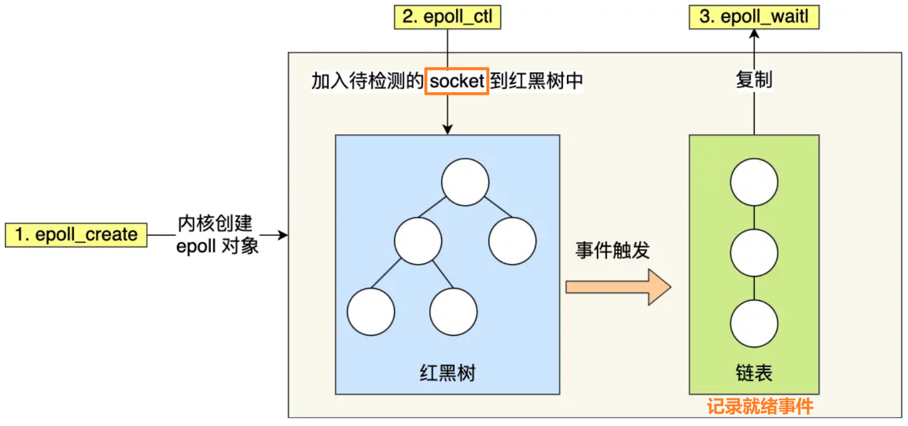


epoll 的方式即使监听的 Socket 数量越多的时候，效率不会大幅度降低，能够同时监听的 Socket 的数目也非常的多了，**上限就为系统定义的进程打开的最大文件描述符个数**。因而，**epoll 被称为解决 C10K 问题的利器**。


插个题外话，网上文章不少说，`epoll_wait` 返回时，对于就绪的事件，epoll 使用的是共享内存的方式，即用户态和内核态都指向了就绪链表，所以就避免了内存拷贝消耗。

这是错的！看过 epoll 内核源码的都知道，**压根就没有使用共享内存这个玩意**。你可以从下面这份代码看到， epoll_wait 实现的内核代码中调用了 `__put_user` 函数，这个函数就是将数据**从内核拷贝到用户空间**。

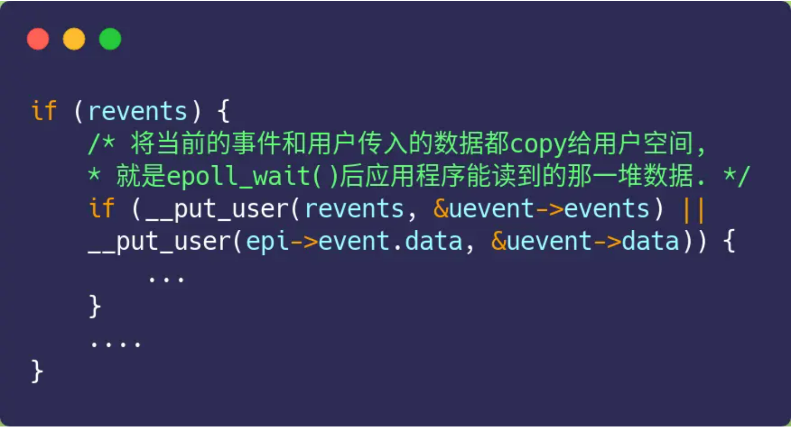


### 边沿触发 ET 和 水平触发 LT

epoll 支持两种事件触发模式，分别是边缘触发（edge-triggered，ET）和水平触发（level-triggered，LT）。

**水平触发**：是只要满足事件的条件，比如内核中有数据需要读，就**一直不断地把这个事件传递给用户**；

**边缘触发**：是**只有第一次满足条件的时候才触发**，之后就不会再传递同样的事件了。


当被监控的 Socket fd 上有可读事件发生时：

- 使用边缘触发：
  - **服务器端只会从 epoll_wait 中苏醒一次**
  - 即使进程没有调用 read 函数从内核读取数据，也依然只苏醒一次，因此我们程序要保证一次性将内核缓冲区的数据读取完
- 使用水平触发：
  - **服务器端不断地从 epoll_wait 中苏醒，直到内核缓冲区数据被 read 函数读完才结束**，目的是**告诉我们有数据需要读取**


> 举个例子，你的快递被放到了一个快递箱里，如果快递箱只会通过短信通知你一次，即使你一直没有去取，它也不会再发送第二条短信提醒你，这个方式就是边缘触发；如果快递箱发现你的快递没有被取出，它就会不停地发短信通知你，直到你取出了快递，它才消停，这个就是水平触发的方式。


**如果使用水平触发模式**：

当内核通知文件描述符可读写时，**接下来还可以继续去检测它的状态**，看它是否依然可读或可写。所以在收到通知后，**没必要一次执行尽可能多的读写操作**。


**如果使用边缘触发模式**：

I/O 事件发生时只会通知一次，而且我们不知道到底能读写多少数据，所以在**收到通知后应尽可能地读写数据**，以免错失读写的机会。因此，我们会**循环**从文件描述符读写数据，那么如果文件描述符是阻塞的，没有数据可读写时，进程会阻塞在读写函数那里，程序就没办法继续往下执行。

所以，边缘触发模式**一般和非阻塞 I/O 搭配使用**，程序会**一直执行 I/O 操作**，直到系统调用（如 `read` 和 `write`）返回错误，错误类型为 `EAGAIN` 或 `EWOULDBLOCK`。


**一般来说，边缘触发的效率比水平触发的效率要高**，因为边缘触发可以减少 epoll_wait 的系统调用次数，系统调用也是有一定的开销的的，毕竟也存在上下文的切换。


**select/poll 只有水平触发模式**，**epoll 默认的触发是水平触发**，但是可以根据应用场景设置为边缘触发模式。


另外，**使用 I/O 多路复用时，最好搭配非阻塞 I/O 一起使用**，Linux 手册关于 select 的内容中有如下说明：

> 在Linux下，select() 可能会将一个 socket 文件描述符报告为 "准备读取"，而后续的读取块却没有。例如，当数据已经到达，但经检查后发现有错误的校验和而被丢弃时，就会发生这种情况。也有可能在其他情况下，文件描述符被错误地报告为就绪。因此，在不应该阻塞的 socket 上使用 O_NONBLOCK 可能更安全。

简单点理解，就是**多路复用 API 返回的事件并不一定可读写的**，如果使用阻塞 I/O， 那么在调用 read/write 时则会发生程序阻塞，因此最好搭配非阻塞 I/O，以便应对极少数的特殊情况。


### epoll API

#### sys/epoll.h

该头文件定义了 Linux 下 **epoll 的核心接口和数据结构**，是高性能 I/O 多路复用的重要基础设施之一。

~~~C++
/* Copyright (C) 2002-2022 Free Software Foundation, Inc.
   This file is part of the GNU C Library.

   The GNU C Library is free software; you can redistribute it and/or
   modify it under the terms of the GNU Lesser General Public
   License as published by the Free Software Foundation; either
   version 2.1 of the License, or (at your option) any later version.

   The GNU C Library is distributed in the hope that it will be useful,
   but WITHOUT ANY WARRANTY; without even the implied warranty of
   MERCHANTABILITY or FITNESS FOR A PARTICULAR PURPOSE.  See the GNU
   Lesser General Public License for more details.

   You should have received a copy of the GNU Lesser General Public
   License along with the GNU C Library; if not, see
   <https://www.gnu.org/licenses/>.  */

#ifndef	_SYS_EPOLL_H
#define	_SYS_EPOLL_H	1  // 防止头文件被重复包含

#include <stdint.h>		// 提供 uint32_t、uint64_t 等固定宽度整数类型
#include <sys/types.h>	// 提供 size_t、pid_t 等通用类型

#include <bits/types/sigset_t.h>		// 信号掩码类型定义
#include <bits/types/struct_timespec.h> // timespec 结构体定义，用于高精度时间

/* Get the platform-dependent flags.  */
#include <bits/epoll.h> // 平台相关的 epoll 常量和实现定义

/* 数据结构打包宏 */
#ifndef __EPOLL_PACKED	// 条件定义 __ EPOLL_PACKED，可用于结构体内存对齐优化（目前未具体实现）
# define __EPOLL_PACKED
#endif


/* EPOLL 事件常量枚举 */
// 这些常量是 epoll_event.events 中使用的位掩码，用于标识感兴趣的 I/O 事件
enum EPOLL_EVENTS
  {
    EPOLLIN = 0x001,	 // 有数据可读
#define EPOLLIN EPOLLIN
    EPOLLPRI = 0x002,	 // 有紧急数据可读
#define EPOLLPRI EPOLLPRI
    EPOLLOUT = 0x004,	 // 有数据可写
#define EPOLLOUT EPOLLOUT
    EPOLLRDNORM = 0x040, // 普通可读数据（与 EPOLLIN 重合）
#define EPOLLRDNORM EPOLLRDNORM
    EPOLLRDBAND = 0x080, // 优先级带可读数据
#define EPOLLRDBAND EPOLLRDBAND
    EPOLLWRNORM = 0x100, // 普通可写数据
#define EPOLLWRNORM EPOLLWRNORM
    EPOLLWRBAND = 0x200, // 优先级带可写数据
#define EPOLLWRBAND EPOLLWRBAND
    EPOLLMSG = 0x400,	 // 保留位，未被使用
#define EPOLLMSG EPOLLMSG
    EPOLLERR = 0x008,	 // 出错事件（读写都会触发）
#define EPOLLERR EPOLLERR
    EPOLLHUP = 0x010,	// 对端关闭连接（挂起）
#define EPOLLHUP EPOLLHUP
    EPOLLRDHUP = 0x2000,// 对端关闭了读操作
#define EPOLLRDHUP EPOLLRDHUP
    EPOLLEXCLUSIVE = 1u << 28,	// 仅用于 epoll 实现的锁优化（不能用户级设置）
#define EPOLLEXCLUSIVE EPOLLEXCLUSIVE
    EPOLLWAKEUP = 1u << 29,		// 防止系统挂起（需要 CAP_BLOCK_SUSPEND 权限）
#define EPOLLWAKEUP EPOLLWAKEUP
    EPOLLONESHOT = 1u << 30,	// 一次触发事件后必须重新注册
#define EPOLLONESHOT EPOLLONESHOT
    EPOLLET = 1u << 31			// 边沿触发，高性能但复杂
#define EPOLLET EPOLLET
  };


/**
* epoll_ctl 是用于控制 epoll 实例的系统调用
* 其操作码（operation code）用于指定你想对 epoll 实例执行的操作
*/

/* Valid opcodes ( "op" parameter ) to issue to epoll_ctl(). epoll_ctl 操作码 */
// 注册新的 fd 到 epoll 实例
#define EPOLL_CTL_ADD 1	/* Add a file descriptor to the interface.  */
// 从 epoll 实例移除 fd
#define EPOLL_CTL_DEL 2	/* Remove a file descriptor from the interface.  */
// 修改 fd 的监听事件
#define EPOLL_CTL_MOD 3	/* Change file descriptor epoll_event structure.  */


// 用户自定义数据，用于 epoll 事件附带的数据，用户可自由使用
typedef union epoll_data
{
  void *ptr;	
  int fd;		
  uint32_t u32;
  uint64_t u64;
} epoll_data_t;


// 核心事件结构体，用户在调用 epoll_ctl 和 epoll_wait 是传入或接收该结构体
struct epoll_event
{
  uint32_t events;	/* Epoll events 事件掩码（EPOLLIN 等）*/
  epoll_data_t data;	/* User data variable 用户数据*/
} __EPOLL_PACKED;


__BEGIN_DECLS // C 语言兼容标记，用于兼容 C++，声明 extern "C"


// 创建 epoll 实例
/* Creates an epoll instance.  Returns an fd for the new instance.
   The "size" parameter is a hint specifying the number of file
   descriptors to be associated with the new instance.  The fd
   returned by epoll_create() should be closed with close().  */
extern int epoll_create (int __size) __ THROW;

// 创建带标志位的 epoll 实例
/* Same as epoll_create but with an FLAGS parameter.  The unused SIZE
   parameter has been dropped.  */
extern int epoll_create1 (int __flags) __ THROW;


// 注册/删除/修改 epoll 事件
/* Manipulate an epoll instance "epfd". Returns 0 in case of success,
   -1 in case of error ( the "errno" variable will contain the
   specific error code ) The "op" parameter is one of the EPOLL_CTL_*
   constants defined above. The "fd" parameter is the target of the
   operation. The "event" parameter describes which events the caller
   is interested in and any associated user data.  */
extern int epoll_ctl (
    int __epfd, 
    int __op, 
    int __fd,	      
    struct epoll_event *__event
) __THROW;


/* Wait for events on an epoll instance "epfd". Returns the number of
   triggered events returned in "events" buffer. Or -1 in case of
   error with the "errno" variable set to the specific error code. The
   "events" parameter is a buffer that will contain triggered
   events. The "maxevents" is the maximum number of events to be
   returned ( usually size of "events" ). The "timeout" parameter
   specifies the maximum wait time in milliseconds (-1 == infinite).

   This function is a cancellation point and therefore not marked with
   __THROW.  */
extern int epoll_wait (
    int __epfd, 
    struct epoll_event *__events,
    int __maxevents, 
    int __timeout
);


/* Same as epoll_wait, but the thread's signal mask is temporarily
   and atomically replaced with the one provided as parameter.

   This function is a cancellation point and therefore not marked with
   __THROW.  */
extern int epoll_pwait (int __epfd, struct epoll_event *__events,
			int __maxevents, int __ timeout,
			const __sigset_t *__ss);

/* Same as epoll_pwait, but the timeout as a timespec.

   This function is a cancellation point and therefore not marked with
   __THROW.  */
#ifndef __USE_TIME_BITS64
extern int epoll_pwait2 (int __epfd, struct epoll_event *__events,
			 int __maxevents, const struct timespec *__timeout,
			 const __sigset_t *__ss);
#else
# ifdef __REDIRECT
extern int __REDIRECT (epoll_pwait2, (int __ epfd, struct epoll_event *__ev,
				      int __maxevs,
				      const struct timespec *__timeout,
				      const __sigset_t *__ss),
		       __epoll_pwait2_time64);
# else
#  define epoll_pwait2 __epoll_pwait2_time64
# endif
#endif

__END_DECLS

#endif /* sys/epoll.h */

~~~


#### epoll_event

~~~C++
// 用户自定义数据，用于 epoll 事件附带的数据，用户可自由使用 
typedef union epoll_data
{
  void *ptr;	// 用户可以传入一个指针，用来在回调时识别来源	
  int fd;		
  uint32_t u32; 
  uint64_t u64;
} epoll_data_t;
~~~

`epoll_data` 是一个 C 语言联合体，用于存放用户自定义的信息，这个信息会随着事件一起返回。

epoll 不关心你到底存了什么，它只是“**帮你带回来**”

epoll_wait 返回事件时，你就可以从 `epoll_event.data` 中拿到之前存的数据，来判断“是哪个 fd 触发的”或“这个 fd 对应哪个连接”等信息。

~~~C++
// epoll 核心事件结构体，用户在调用 epoll_ctl 和 epoll_wait 是传入或接收该结构体
struct epoll_event
{
  uint32_t events;	 // 关心的事件
  epoll_data_t data; // epoll附带数据，用户自定义，可以传一个 fd、指针等，epoll_wait 会返回它
} __EPOLL_PACKED;
~~~

`events` 支持的宏（掩码）常用的如下：

- `EPOLLIN`：可读
- `EPOLLOUT`：可写
- `EPOLLET`：边缘触发
- `EPOLLONESHOT`：只触发一次
- `EPOLLHUP`：挂起
- `EPOLLERR`：错误

**用到的事件类型 `EPOLLIN`、`EPOLLPRI`、`EPOLLOUT`**

这些宏定义来自 `<sys/epoll.h>`，用于表示 **内核态监听文件描述符（fd）上发生的事件类型**。

~~~C++
// epoll.h 中
enum EPOLL_EVENTS
  {
    EPOLLIN = 0x001,		// 0000 0001
#define EPOLLIN EPOLLIN		// 对应的 fd 上有数据可读（包括对端关闭的情况）
    
    EPOLLPRI = 0x002,		// 0000 0010
#define EPOLLPRI EPOLLPRI	// 对应的 fd 有紧急数据可读（带外数据）一般用于 TCP 的紧急数据（少见）
    
    EPOLLOUT = 0x004,		// 0000 0100
#define EPOLLOUT EPOLLOUT	// 对应的 fd 可以进行 非阻塞写操作
    ...
	}
~~~

| 宏常量     | 十六进制值 | 意义             | 用途                         |
| ---------- | ---------- | ---------------- | ---------------------------- |
| `EPOLLIN`  | `0x001`    | 有数据可读       | TCP 收数据、accept 新连接    |
| `EPOLLPRI` | `0x002`    | 有紧急数据可读   | 带外数据（OOB），较少用      |
| `EPOLLOUT` | `0x004`    | 可写入（不阻塞） | 发送数据、非阻塞连接建立完成 |


#### epoll 生命周期

~~~C++
1. 创建 epoll 实例
   ┌─────────────────────────────┐
   │ epollfd = epoll_create1()   │  → 创建成功后返回一个 epoll 实例的 fd
   └─────────────────────────────┘

2. 注册 / 修改 / 删除感兴趣的事件（对应的 fd）
   ┌────────────────────────────────────────────────────────────────┐
   │ epoll_ctl(epollfd, EPOLL_CTL_ADD / MOD / DEL, fd, &event)      │
   └────────────────────────────────────────────────────────────────┘

3. 等待事件（阻塞/非阻塞）
   ┌────────────────────────────────────────────────────────────┐
   │ int n = epoll_wait(epollfd, events, maxEvents, timeoutMs); │
   └────────────────────────────────────────────────────────────┘
     - `events` 是 epoll_event 的数组
     - `n` 表示有多少事件发生了，需遍历处理

4. 关闭 epoll 实例（资源释放）
   ┌──────────────────────┐
   │ close(epollfd)       │
   └──────────────────────┘
~~~


#### epoll_create1() 创建 epoll 实例

`epoll_create1` 是 Linux 下用于 **创建一个 epoll 实例** 的系统调用。该实例可以用于异步监听多个文件描述符（如 socket）的读写事件。

创建成功后，**返回一个指向该 epoll 实例的 文件描述符（fd）**，后续操作（如 `epoll_ctl`、`epoll_wait`）都基于这个 fd。

~~~C++
#include <sys/epoll.h>

int epoll_create1(int flags); //flags 是控制 epoll 实例行为的标志位，常用值为 EPOLL_CLOEXEC
~~~

**参数 `flags`** ：

- 控制 epoll 实例行为的标志位

- 常见的 `flags`：

  - `EPOLL_CLOEXEC` ：设置 close-on-exec 标志，当调用 `exec()` 系列函数时，该 fd 会自动关闭，防止 fd 泄漏到子进程中

  - 如果不需要特殊行为，可以传 `0`

**返回值：**

- `>=0`  创建成功，返回 epoll 实例的 fd
- `<0`   创建失败，返回 `-1` ，并设置 `errno` 错误码

**常见错误码 `errno`：**

| errno 值 | 含义                       |
| -------- | -------------------------- |
| `EINVAL` | 传入的 flag 不合法         |
| `EMFILE` | 进程已打开文件数达上限     |
| `ENFILE` | 系统级文件描述符总数达上限 |
| `ENOMEM` | 内存不足，无法分配资源     |

 **与旧接口 `epoll_create` 的区别：**

| 特性    | `epoll_create`         | `epoll_create1`          |
| ------- | ---------------------- | ------------------------ |
| 参数    | 需要指定容量（被忽略） | 使用 `flags`             |
| CLOEXEC | 需要手动设置（fcntl）  | 支持内建 `EPOLL_CLOEXEC` |
| 推荐性  | 已弃用（glibc 说明）   | ✅ 建议优先使用           |


**epoll_create() 创建 epoll 实例（已经不推荐使用了）**

创建一个 epoll 实例，创建成功会返回一个文件描述符（epfd）。

~~~C++
#include <sys/epoll.h>

int epoll_create(int size);
~~~

该 epoll 实例内部维护一个“红黑树”（用于注册 fd）和一个“就绪链表”（用于返回事件）。这些细节由内核管理。

参数 `size`：**早期内核的提示参数**，用于指定将要监视的最大文件描述符数量的“建议值”。

局限：

- 参数 `size` 被忽略，容易误导开发者。
- 不支持设置 epoll 实例的行为（如 `EPOLL_CLOEXEC`）。


#### epoll_ctl() 添加/修改/删除 fd

对 epoll 实例添加/修改/删除监听的 fd。

> 在内核中，使用红黑树存储 fd → event 的映射关系，实现高效查找和修改。就绪事件存在一个链表中。

~~~C++
#include <sys/epoll.h>

int epoll_ctl(int epfd, 
              int op,  // 操作类型 add/del/mod
              int fd, 
              struct epoll_event *event);
~~~

**参数：**

- `epfd`   由 `epoll_create1` 返回的 epoll 文件描述符

- `op` 操作类型（操作码）

  ~~~C++
  #define EPOLL_CTL_ADD 1 // 注册新的 fd 到 epoll 实例
  #define EPOLL_CTL_DEL 2	// 从 epoll 实例移除 fd
  #define EPOLL_CTL_MOD 3 // 修改 fd 的监听事件
  ~~~

- `fd`  目标文件描述符

- `event`  关注的事件集和附加数据（如 `data.ptr`）

> `epfd` 是通过 `epoll_create()` 或 `epoll_create1()` 返回的 **文件描述符**，它就像其他的 `fd`（如 socket、文件）一样，是一个整数，但这个整数只是一个索引，**指向内核空间中的一个 epoll 实例结构体**。
>
> 调用 `epoll_ctl(epfd, EPOLL_CTL_ADD, fd, ...)` 时，内核会根据 `epfd` 定位对应的 epoll 实例对象，并将该 `fd` 添加到它的内部结构中。
>
> 一个 `epfd` 可以管理 多个 `fd`

**返回值：**

- 成功返回 0，失败返回 -1

错误码（部分）：

- `EBADF`：`epfd` 或 `fd` 非法
- `EEXIST`：重复添加

- `ENOENT`：修改或删除了未注册的 fd

- `EINVAL`：事件非法或操作错误


#### epoll_wait() 等待事件

等待 epoll 实例中发生的 I/O 事件。将发生的事件存入 `events` 数组，返回发生事件数量。

~~~C++
int epoll_wait(int epfd, 
               struct epoll_event *events,
               int maxevents, 
               int timeout);
~~~

> 将就绪事件从就绪链表（rdlist）复制到用户传入的 `events` 缓冲区。
>
> 如果没有事件，根据 `timeout` 阻塞/轮询。
>
> 在内核中，使用 `poll_schedule_timeout` 等函数处理等待逻辑

**参数：**

- `epfd`：epoll 实例文件描述符
- `events`：输出数组，保存发生的事件 （指向 `epoll_event` 的数组首地址指针）
- `maxevents`：`events` 数组大小（> 0）
- `timeout`：等待时间
  - `-1`：无限等待
  - `0`：立即返回
  - `> 0`：等待的毫秒数

**返回值：**

- 成功：返回事件数量（0 表示超时）
- 失败：返回 -1，设置 `errno`

**错误码：**

- `EINTR`：被信号打断
- `EINVAL`：参数非法


#### close() 关闭 epoll 实例

[`close()`](#close())用于 **关闭一个打开的文件描述符**，释放与之相关的所有内核资源。头文件 `<unistd.h>`

~~~C++
#include <unistd.h>
int close(int fd);
~~~

**参数：**

- `fd` 要关闭的文件描述符

**返回值：**

- 成功返回 0
- 失败返回 -1 ，并设置 `errno`，常见错误：
  - `EBADF`：传入的 `fd` 无效，可能已关闭或未打开
  - `EINTR`：被信号中断

在 epoll 相关上下文中，例如：

- 关闭通过 `epoll_create1()` 创建的 epoll 实例 fd；
- 关闭注册到 epoll 的普通 socket 或文件 fd；

~~~C++
int epfd = epoll_create1(0);
// ... epoll_ctl 添加或等待事件

close(epfd);  // 关闭 epoll 实例，释放内核资源
~~~

`close(epfd)` 会触发内核将该 epoll 实例释放，同时注销其上挂载的所有 fd 和事件

如果 **忘记 close**：

- 内核资源泄漏（epoll 结构未释放）
- 系统文件描述符耗尽（EMFILE）
- 类似内存泄漏但是“内核泄漏”


# Reactor ⭐和 Proactor

> [小林 coding](https://xiaolincoding.com/os/8_network_system/reactor.html#%E6%BC%94%E8%BF%9B)

## 演进

**如果要让服务器服务多个客户端，那么最直接的方式就是为每一条连接创建线程。**

> 其实创建进程也是可以的，原理是一样的，进程和线程的区别在于线程比较轻量级些，线程的创建和线程间切换的成本要小些，为了描述简述，后面都以线程为例。

处理完业务逻辑后，随着连接关闭后线程也同样要销毁了，但是这样不停地创建和销毁线程，不仅会带来性能开销，也会造成浪费资源，而且如果要连接几万条连接，创建几万个线程去应对也是不现实的。


要这么解决这个问题呢？我们可以使用**<span style="color:#3333FF;">「资源复用」</span>**的方式。

也就是不用再为每个连接创建线程，而是创建一个「**<span style="color:#0000FF;">线程池</span>**」，将连接分配给线程，然后**一个线程可以处理多个连接的业务**。


不过，这样又引来一个新的问题，**线程怎样才能高效地处理多个连接的业务？**

当一个连接对应一个线程时，线程一般采用「read -> 业务处理 -> send」的处理流程，如果当前连接没有数据可读，那么线程会阻塞在 `read` 操作上（ socket 默认情况是阻塞 I/O），不过这种阻塞方式并不影响其他线程。

但是引入了线程池，那么一个线程要处理多个连接的业务，线程在处理某个连接的 `read` 操作时，如果遇到没有数据可读，就会发生**阻塞**，那么线程就没办法继续处理其他连接的业务。


要解决这一个问题，最简单的方式就是**将 socket 改成非阻塞**，然后线程不断地**轮询调用 `read`** 操作来判断是否有数据，这种方式虽然该能够解决阻塞的问题，但是解决的方式比较粗暴，因为轮询是要消耗 CPU 的，而且随着一个 线程处理的连接越多，轮询的效率就会越低。


上面的问题在于，**线程并不知道当前连接是否有数据可读，从而需要每次通过 `read` 去试探。**

那有没有办法在**只有当连接上有数据的时候**，线程才去发起读请求呢？答案是有的，实现这一技术的就是 **<span style="color:#3333FF;">I/O 多路复用</span>**。

I/O 多路复用技术会用一个系统调用函数来**监听**我们所有关心的连接，也就说可以在一个**监控线程**里面监控很多的连接。


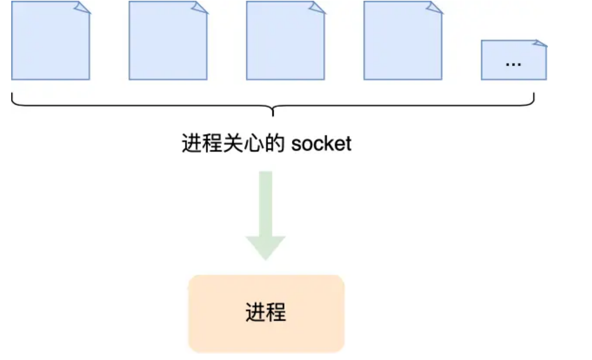

select/poll/epoll 就是内核提供给用户态的多路复用系统调用，线程可以通过一个系统调用函数从内核中获取多个事件。


**select/poll/epoll 是如何获取网络事件的呢？**

在获取事件时，先把我们要关心的连接传给内核，再由内核检测：

- 如果没有事件发生，线程只需阻塞在这个系统调用，而无需像前面的线程池方案那样轮询调用 read 操作来判断是否有数据。
- 如果有事件发生，**内核会返回产生了事件的连接**，线程就会从阻塞状态返回，然后在用户态中再处理这些连接对应的业务即可。


**当下开源软件能做到网络高性能的原因就是 I/O 多路复用吗？**

是的，基本是基于 I/O 多路复用，用过 I/O 多路复用接口写网络程序的同学，肯定知道是面向过程的方式写代码的，这样的开发的效率不高。

于是，大佬们<span style="color:#0000FF;">基于**面向对象的思想，对 I/O 多路复用作了一层封装**</span>，让使用者不用考虑底层网络 API 的细节，只需要关注应用代码的编写。

大佬们还为这种模式取了个让人第一时间难以理解的名字：**<span style="color:#3333FF;">Reactor 模式</span>**。


## Reactor

Reactor 翻译过来的意思是「反应堆」，这里的反应指的是「**对事件反应**」，也就是**来了一个事件，Reactor 就有相对应的反应/响应**。

事实上，Reactor 模式也叫 `Dispatcher` <span style="color:#0000FF;">调度模式</span>，即 I/O 多路复用监听事件，收到事件后，**根据事件类型分配（Dispatch）给某个进程 / 线程**。


Reactor 模式主要由 **<span style="color:#0000FF;">Reactor</span>** 和 **<span style="color:#0000FF;">处理资源池</span>** 这两个核心部分组成，它俩负责的事情如下：

- Reactor ：负责监听和分发事件，事件类型包含连接事件、读写事件
- 处理资源池：负责处理事件，如 read -> 业务逻辑 -> send


Reactor 模式是灵活多变的，可以应对不同的业务场景，灵活在于：

- Reactor 的数量可以只有一个，也可以有多个；
- 处理资源池可以是单个进程 / 线程，也可以是多个进程 /线程；

将上面的两个因素排列组设一下，理论上就可以有 **4 种方案选择**：

- 单 Reactor 单进程 / 线程；
- 单 Reactor 多进程 / 线程；
- 多 Reactor 单进程 / 线程；
- 多 Reactor 多进程 / 线程；

其中，「多 Reactor 单进程 / 线程」实现方案相比「单 Reactor 单进程 / 线程」方案，不仅复杂而且也没有性能优势，因此实际中并没有应用。


剩下的 3 个方案都是比较经典的，且都有应用在实际的项目中：

- **单 Reactor 单进程 / 线程；**
- **单 Reactor 多进程 / 线程；**
- **多 Reactor 多进程 / 线程；**

方案具体使用进程还是线程，要看使用的编程语言以及平台有关：

- Java 语言一般使用线程，比如 Netty;
- C 语言使用进程和线程都可以，例如 Nginx 使用的是进程，Memcache 使用的是线程。

接下来，分别介绍这三个经典的 Reactor 方案。


### 单 Reactor 单进程

我们来看看「**单 Reactor 单进程**」的方案示意图：

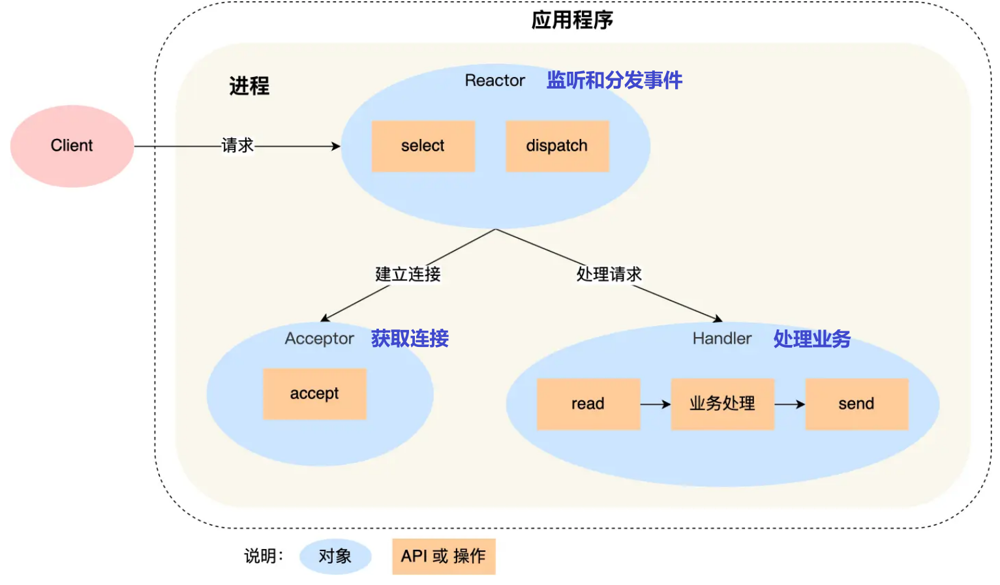


进程里有 **Reactor、Acceptor、Handler** 这三个对象：

- Reactor 对象的作用是监听和分发事件；
- Acceptor 对象的作用是获取连接；
- Handler 对象的作用是处理业务；


对象里的 select、accept、read、send 是系统调用函数，dispatch 和 「业务处理」是需要完成的操作，其中 dispatch 是分发事件操作。


接下来，介绍下「单 Reactor 单进程」这个方案：

- Reactor 对象通过 **select （IO 多路复用接口） 监听事件**，收到事件后通过 **dispatch 进行分发**，具体分发给 Acceptor 对象还是 Handler 对象，还要看收到的事件类型；
- 如果是**连接建立**的事件，则交由 **Acceptor** 对象进行处理，Acceptor 对象会通过 accept 方法 获取连接，并创建一个 Handler 对象来处理后续的响应事件；
- 如果**不是连接建立**事件， 则交由当前连接对应的 **Handler 对象**来进行响应；
- Handler 对象通过 read -> 业务处理 -> send 的流程来完成完整的业务流程。


单 Reactor 单进程的方案因为全部工作都在**同一个进程内完成**，所以实现起来比较简单，不需要考虑进程间通信，也不用担心多进程竞争。


但是，这种方案存在 **2 个缺点**：

- 第一个缺点，因为只有一个进程，**无法充分利用 多核 CPU 的性能**；
- 第二个缺点，Handler 对象在业务处理时，整个进程是无法处理其他连接的事件的，**如果业务处理耗时比较长，那么就造成响应的延迟**；

所以，单 Reactor 单进程的方案**不适用计算机密集型的场景，只适用于业务处理非常快速的场景**。


Redis 是由 C 语言实现的，在 Redis 6.0 版本之前采用的正是「单 Reactor 单进程」的方案，因为 Redis 业务处理主要是在内存中完成，操作的速度是很快的，性能瓶颈不在 CPU 上，所以 Redis 对于命令的处理是单进程的方案。


### 单 Reactor 多线程

如果要克服「单 Reactor 单线程 / 进程」方案的缺点，那么就需要引入多线程 / 多进程，这样就产生了**单 Reactor 多线程 / 多进程**的方案。

先来看看「单 Reactor 多线程」方案的示意图如下：

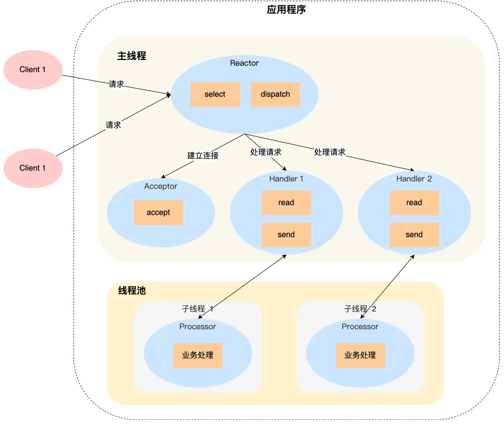


详细说一下这个方案：

- Reactor 对象通过 select （IO 多路复用接口） 监听事件，收到事件后通过 dispatch 进行分发，具体分发给 Acceptor 对象还是 Handler 对象，还要看收到的事件类型；
- 如果是**连接建立**的事件，则交由 **Acceptor 对象**进行处理，Acceptor 对象会通过 accept 方法 获取连接，并创建一个 Handler 对象来处理后续的响应事件；
- 如果**不是连接建立**事件， 则交由当前连接对应的 **Handler 对象**来进行响应；

上面的三个步骤和单 Reactor 单线程方案是一样的，接下来的步骤就开始不一样了：

- **<span style="color:#0000FF;">Handler 对象不再负责业务处理，只负责数据的接收和发送</span>**，Handler 对象通过 read 读取到数据后，会将数据发给子线程里的 Processor 对象进行业务处理；
- **<span style="color:#0000FF;">子线程里的 Processor 对象就进行业务处理</span>**，处理完后，将结果发给主线程中的 Handler 对象，接着由 Handler 通过 send 方法将响应结果发送给 client；


单 Reator 多线程的方案优势在于**能够充分利用多核 CPU 的能**，那既然引入多线程，那么自然就带来了多线程竞争资源的问题。

例如，子线程完成业务处理后，要把结果传递给主线程的 Handler 进行发送，这里涉及**<span style="color:#0000FF;">共享数据的竞争</span>**。

要避免多线程由于竞争共享资源而导致数据错乱的问题，就需要在操作共享资源前加上**互斥锁**，以**保证任意时间里只有一个线程在操作共享资源**，待该线程操作完释放互斥锁后，其他线程才有机会操作共享数据。


> 聊完单 Reactor 多线程的方案，接着来看看**单 Reactor 多进程**的方案。
>
> 事实上，单 Reactor 多进程相比单 Reactor 多线程实现起来很麻烦，主要因为要考虑子进程 <-> 父进程的双向通信，并且父进程还得知道子进程要将数据发送给哪个客户端。
>
> 而多线程间可以共享数据，虽然要额外考虑并发问题，但是这远比进程间通信的复杂度低得多，因此**实际应用中也看不到单 Reactor 多进程的模式。**


另外，「单 Reactor」的模式还有个问题，因为**一个 Reactor 对象承担所有事件的监听和响应**，而且**只在主线程**中运行，在面对**瞬间高并发**的场景时，容易成为性能的瓶颈的地方。


### 多 Reactor 多进程 / 线程

要解决「单 Reactor」的问题，就是将「单 Reactor」实现成「多 Reactor」，这样就产生了第 **多 Reactor 多进程 / 线程**的方案。

多 Reactor 多进程 / 线程方案的示意图如下（以线程为例）：

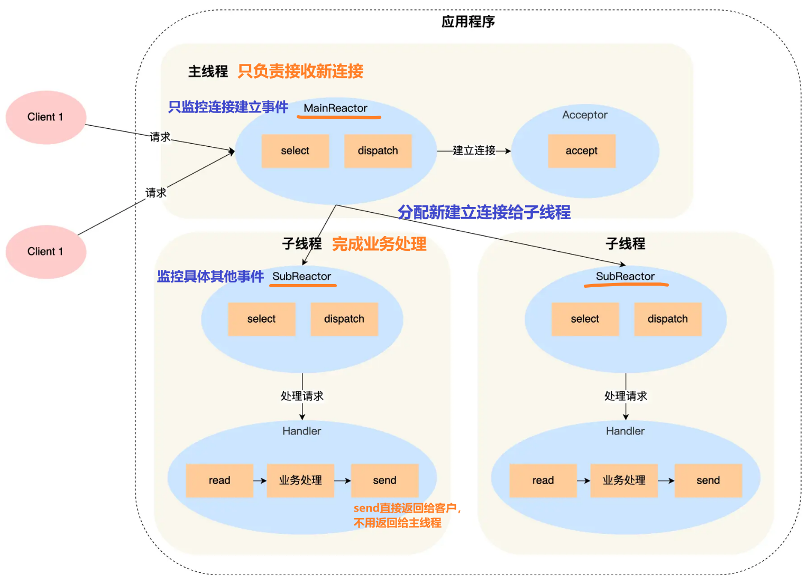


方案详细说明如下：

- 主线程中的【**<span style="color:#0000FF;">MainReactor</span>**】对象通过 **select 监控连接建立**事件，收到事件后通过 Acceptor 对象中的 accept 获取连接，将**新的连接分配给某个子线程**；
- 子线程中的 【**<span style="color:#0000FF;">SubReactor</span>**】 对象将 MainReactor 对象分配的**连接加入 select 继续进行监听**，并创建一个 Handler 用于处理连接的响应事件。
- 如果有新的事件发生时，SubReactor 对象会调用当前连接对应的 Handler 对象来进行响应。
- Handler 对象通过 read -> 业务处理 -> send 的流程来完成完整的业务流程。


多 Reactor 多线程的方案虽然看起来复杂的，但是实际实现时比单 Reactor 多线程的方案要简单的多，原因如下：

- 主线程和子线程分工明确，<span style="color:#0000FF;">**主线程只负责接收新连接**，**子线程负责完成后续的业务处理**</span>。
- 主线程和子线程的交互很简单，**主线程只需要把新连接传给子线程**，子线程无须返回数据，直接就**可以在子线程将处理结果发送给客户端。**


> 大名鼎鼎的两个开源软件 Netty 和 Memcache 都采用了「多 Reactor 多线程」的方案。
>
> 采用了「多 Reactor 多进程」方案的开源软件是 Nginx，不过方案与标准的多 Reactor 多进程有些差异。
>
> 具体差异表现在主进程中仅仅用来初始化 socket，并没有创建 mainReactor 来 accept 连接，而是由子进程的 Reactor 来 accept 连接，通过锁来控制一次只有一个子进程进行 accept（防止出现惊群现象），子进程 accept 新连接后就放到自己的 Reactor 进行处理，不会再分配给其他子进程。


### 总结

常见的 Reactor 实现方案有三种。

- 第一种方案单 Reactor 单进程 / 线程
  - 不用考虑进程间通信以及数据同步的问题，因此实现起来比较简单
  - 这种方案的缺陷在于无法充分利用多核 CPU，而且处理业务逻辑的时间不能太长，否则会延迟响应，所以不适用于计算机密集型的场景，适用于业务处理快速的场景，比如 Redis（6.0之前 ） 采用的是单 Reactor 单进程的方案。

- 第二种方案单 Reactor 多线程
  - 通过多线程的方式解决了方案一的缺陷，但它离高并发还差一点距离，差在只有一个 Reactor 对象来承担所有事件的监听和响应，而且只在主线程中运行，在面对瞬间高并发的场景时，容易成为性能的瓶颈的地方。

- 第三种方案多 Reactor 多进程 / 线程
  - 通过多个 Reactor 来解决了方案二的缺陷，主 Reactor 只负责监听事件，响应事件的工作交给了从 Reactor，Netty 和 Memcache 都采用了「多 Reactor 多线程」的方案，Nginx 则采用了类似于 「多 Reactor 多进程」的方案。


## Proactor

前面提到的 **Reactor 是非阻塞同步**网络模式，而 **Proactor 是异步网络模式**。


### 复习 I/O

#### 阻塞 I/O

先来看看**阻塞 I/O**，当用户程序执行 `read` ，线程会被阻塞，一直**等到内核数据准备好**，并把数据**从内核缓冲区拷贝到应用程序的缓冲区中**，当拷贝过程完成，`read` 才会返回。

注意，**<span style="color:#CC0000;">阻塞等待的是「内核数据准备好」和「数据从内核态拷贝到用户态」这两个过程</span>**。过程如下图：

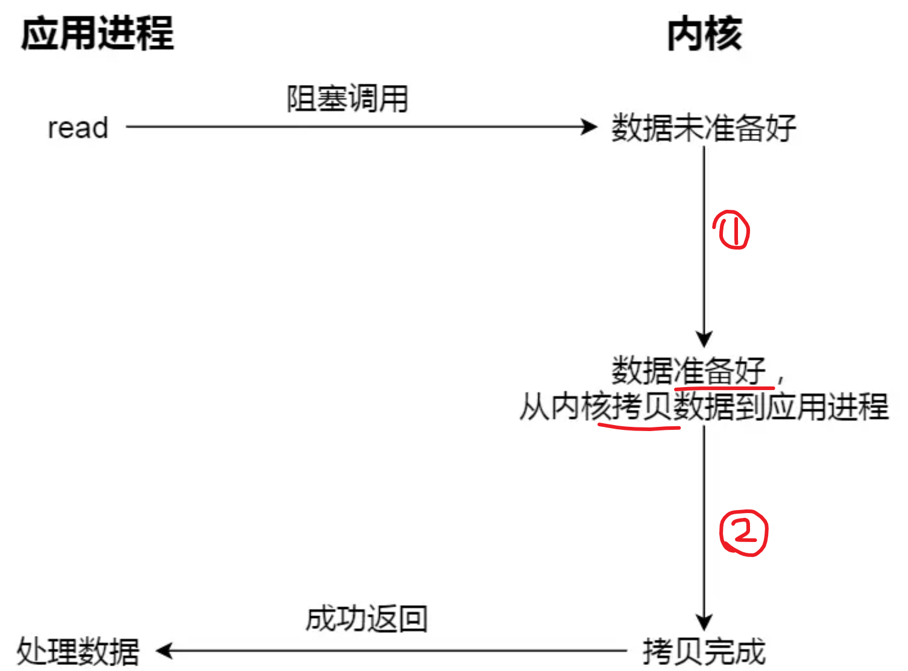


#### 非阻塞 I/O

非阻塞的 read 请求在数据未准备好的情况下**立即返回**，**可以继续往下执行**，此时应用程序**不断轮询内核**，直到数据准备好，内核将数据拷贝到应用程序缓冲区，`read` 调用才可以获取到结果。过程如下图：

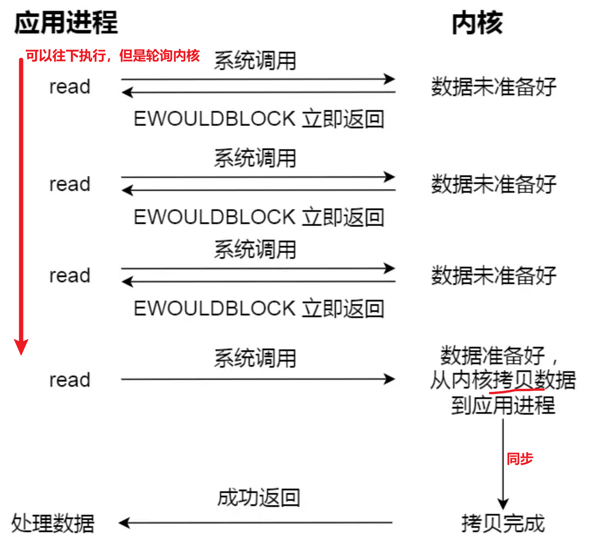


注意，这里**最后一次 read 调用，获取数据的过程，是一个同步的过程**，是**需要等待**的过程。这里的同步指的是内核态的数据拷贝到用户程序的缓存区这个过程。


> 举个例子，如果 socket 设置了 `O_NONBLOCK` 标志，那么就表示使用的是非阻塞 I/O 的方式访问，而不做任何设置的话，默认是阻塞 I/O。


因此，<span style="color:#CC0000;">无论 read 和 send 是阻塞 I/O，还是非阻塞 I/O **都是同步调用**</span>。因为在 read 调用时，**内核将数据从内核空间拷贝到用户空间的过程都是需要等待的**，也就是说这个过程是同步的，如果内核实现的拷贝效率不高，read 调用就会在这个同步过程中等待比较长的时间。


而<span style="color:#CC0000;">真正的**异步 I/O** 是「内核数据准备好」和「数据从内核态拷贝到用户态」这**两个过程都不用等待**。</span>


#### 异步 I/O

当我们发起 `aio_read` （异步 I/O） 之后，就**立即返回**，内核自动将数据从内核空间拷贝到用户空间，这个拷贝过程同样是异步的，**内核自动完成的**，和前面的同步操作不一样，**应用程序并不需要主动发起拷贝动作**。过程如下图：

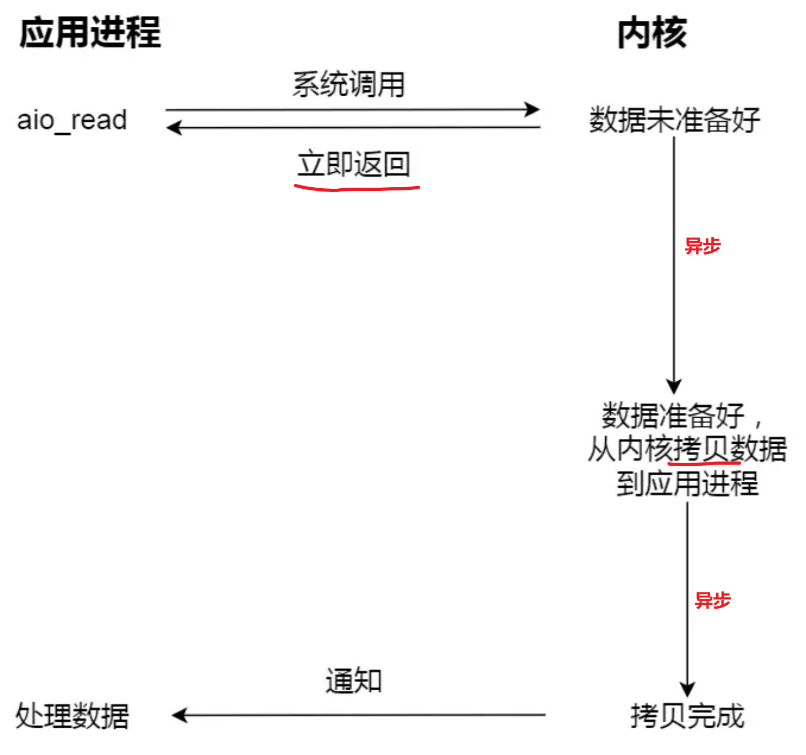


> 举个你去饭堂吃饭的例子，你好比应用程序，饭堂好比操作系统。
>
> 阻塞 I/O 好比，你去饭堂吃饭，但是饭堂的菜还没做好，然后你就一直在那里等啊等，等了好长一段时间终于等到饭堂阿姨把菜端了出来（数据准备的过程），但是你还得继续等阿姨把菜（内核空间）打到你的饭盒里（用户空间），经历完这两个过程，你才可以离开。
>
> 非阻塞 I/O 好比，你去了饭堂，问阿姨菜做好了没有，阿姨告诉你没，你就离开了，过几十分钟，你又来饭堂问阿姨，阿姨说做好了，于是阿姨帮你把菜打到你的饭盒里，这个过程你是得等待的。
>
> 异步 I/O 好比，你让饭堂阿姨将菜做好并把菜打到饭盒里后，把饭盒送到你面前，**整个过程你都不需要任何等待。**


> ***陈硕：在处理 IO 的时候，阻塞和非阻塞都是同步 IO，只有使用了特殊 API 才是异步 IO。***
>
> 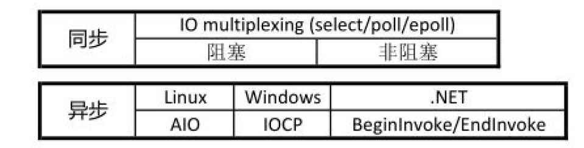


很明显，异步 I/O 比同步 I/O 性能更好，因为异步 I/O 在「内核数据准备好」和「数据从内核空间拷贝到用户空间」这两个过程都不用等待。

**Proactor 正是采用了异步 I/O 技术**，所以被称为异步网络模型。


### Proactor 模型

现在我们再来理解 Reactor 和 Proactor 的区别，就比较清晰了。

- **Reactor 是非阻塞同步网络模式，感知的是就绪可读写事件**。
  - 在每次感知到有事件发生（比如可读就绪事件）后，就需要**应用进程主动调用 read** 方法来完成数据的读取，也就是要应用进程主动将 socket 接收缓存中的数据读到应用进程内存中，这个过程是同步的，读取完数据后应用进程才能处理数据。
- **Proactor 是异步网络模式， 感知的是已完成的读写事件**。
  - 在发起异步读写请求时，需要传入数据缓冲区的地址（用来存放结果数据）等信息，这样系统内核才可以自动帮我们把数据的读写工作完成，这里的**读写工作全程由操作系统来做**，并不需要像 Reactor 那样还需要应用进程主动发起 read/write 来读写数据，操作系统完成读写工作后，就会通知应用进程直接处理数据。


因此，<span style="color:#CC0000;">**Reactor 可以理解为「来了事件，操作系统通知应用进程，让应用进程来处理」**，而 **Proactor 可以理解为「来了事件操作系统来处理，处理完再通知应用进程」**</span>。

这里的「事件」就是有新连接、有数据可读、有数据可写的这些 I/O 事件，这里的「处理」包含从驱动读取到内核以及从内核读取到用户空间。


无论是 Reactor，还是 Proactor，都是一种**基于「事件分发」的网络编程模式**，区别在于 **Reactor 模式是基于「待完成」的 I/O 事件，而 Proactor 模式则是基于「已完成」的 I/O 事件**。


 Proactor 模式的示意图：

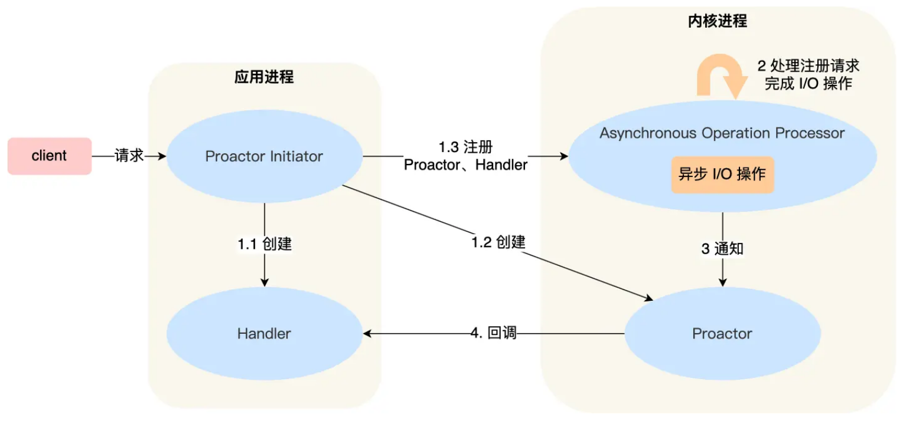

介绍一下 Proactor 模式的工作流程：

- Proactor Initiator 负责创建 Proactor 和 Handler 对象，并将 Proactor 和 Handler 都通过 Asynchronous Operation Processor 注册到内核；
- Asynchronous Operation Processor 负责处理注册请求，并处理 I/O 操作；
- Asynchronous Operation Processor 完成 I/O 操作后**通知 Proactor**；
- Proactor 根据不同的事件类型回调不同的 Handler 进行业务处理；
- Handler 完成业务处理；


可惜的是，**在 Linux 下的异步 I/O 是不完善的**， `aio` 系列函数是由 POSIX 定义的异步操作接口，不是真正的操作系统级别支持的，而是在用户空间模拟出来的异步，并且仅仅支持基于本地文件的 aio 异步操作，网络编程中的 socket 是不支持的，这也使得**<span style="color:#0000FF;">基于 Linux 的高性能网络程序都是使用 Reactor 方案</span>**。

而 Windows 里实现了一套完整的支持 socket 的异步编程接口，这套接口就是 `IOCP`，是由操作系统级别实现的异步 I/O，真正意义上异步 I/O，因此**在 Windows 里实现高性能网络程序可以使用效率更高的 Proactor 方案**。


## 总结

Reactor 可以理解为「来了事件，操作系统通知应用进程，让应用进程来处理」，而 Proactor 可以理解为「**来了事件操作系统来处理，处理完再通知应用进程**」。

因此，真正的大杀器还是 Proactor，它是采用异步 I/O 实现的异步网络模型，感知的是已完成的读写事件，而不需要像 Reactor 感知到事件后，还需要调用 read 来从内核中获取数据。


不过，无论是 Reactor，还是 Proactor，都是一种**基于「事件分发」的网络编程模式**，区别在于 Reactor 模式是基于「待完成」的 I/O 事件，而 Proactor 模式则是基于「已完成」的 I/O 事件。


# One loop per thread

> 在这个多核时代，服务端网络编程如何选择线程模型呢？**One loop per thread**

**one loop per thread** 指的是：

- <span style="color:#0000FF;">一个线程只能有一个事件循环</span>（EventLoop）
- <span style="color:#0000FF;">一个文件描述符fd 只能由一个线程进行读写</span>， 换句话说就是一个 TCP 连接必须归属于某个 EventLoop 管理。但反过来不一样，一个线程却可以管理多个 fd。

这样多线程服务端编程的问题就转换为 **如何设计一个高效且易于使用的 event loop**，然后 **每个线程 run 一个 event loop** 就行了。（当然线程间的同步、互斥少不了，还有其它的耗时事件需要起另外的线程来做）

event loop 是 non-blocking 网络编程的核心，在现实生活中，**non-blocking 几乎总是和 IO 多路复用 一起使用**，原因有两点：

- 没有人真的会用轮询 (busy-pooling) 来检查某个 non-blocking IO 操作是否完成，这样太浪费 CPU 资源了
- IO-multiplex 一般不能和 blocking IO 用在一起，因为 blocking IO 中 read()/write()/accept()/connect() 都有可能阻塞当前线程，这样线程就没办法处理其他 socket 上的 IO 事件了。

当我们提到 non-blocking 的时候，实际上指的是 **<span style="color:#0000FF;">non-blocking + IO-multiplexing (+线程池)</span>**，单用其中任何一个都没有办法很好的实现功能。


> epoll + fork 不如 epoll + pthread？
> 强大的 nginx 服务器采用了 epoll+fork 模型作为网络模块的架构设计，实现了简单好用的负载算法，使各个 fork 网络进程不会忙的越忙、闲的越闲，并且通过引入一把乐观锁解决了该模型导致的服务器惊群现象，功能十分强大。


## muduo 用的是 Reactor

muduo 项目采用主从 **多 Reactor 多线程** 模型

**MainReactor** 只负责监听派发新连接，在 MainReactor 中通过 **Acceptor** 接收新连接，并通过设计好的轮询算法派发给 **SubReactor**，SubReactor 负责此连接的读写事件。

调用 **TcpServer** 的 start 函数后，会内部创建**线程池**。每个线程独立的运行一个事件循环，即 **SubReactor**。

MainReactor 从线程池中轮询获取 SubReactor 并派发给它新连接，处理读写事件的 SubReactor 个数一般和 CPU 核心数相等。


**重要组件：**

- Event 事件
- Reactor 反应堆
- Demultiplex 事件分发器
- Eventhandler 事件处理器


**调用关系**

- 将事件及其处理方法，注册到 Reactor，Reactor 中主要存储了事件和事件对应的处理器
- Reactor 向其所对应的 Demultiplex 去注册相应的 connfd + 事件，启动反应堆
- 当 Demultiplex 检测到 connfd 上有事件发生，就会返回相应事件
- Reactor 根据事件去调用对应的 EventHandler

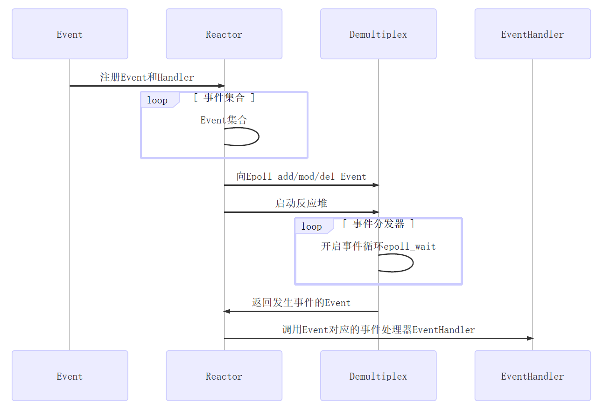


**muduo 库** 的 Multiple Reactors 模型如下：

> 这里的 Reactor 相当于上面的 Reactor 和 Demultiplex 的合体


# end
