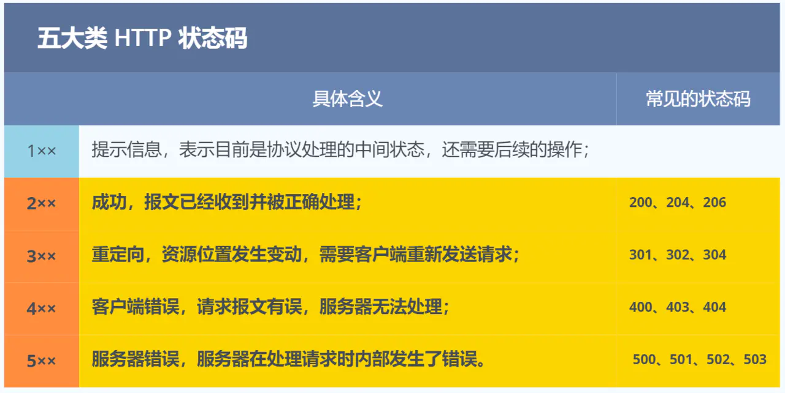

> 参考：
>
> 小林coding [图解网络](https://xiaolincoding.com/network/1_base/tcp_ip_model.html#%E5%BA%94%E7%94%A8%E5%B1%82)
>
> [深入浅出计算机网络_湖科大 B站](https://www.bilibili.com/video/BV1NT411g7n6/?spm_id_from=333.788.videopod.episodes&vd_source=7369d5f08520f2fc3601caee93963ffa&p=2)


# 网络分层模型

## 三种分层模型


## 每层的封装格式


网络接口层——帧 frame

网络层（IP层）—— 包 packet

传输层（TCP层）—— 段 segment

应用层（HTTP）—— 消息或报文


# 经典问题

## 键入网址到网页显示，期间发生了什么？


### 解析URL，生成HTTP请求消息 ✅

图中的长长的 URL 实际上是请求服务器里的文件资源。

当没有路径名时，就代表访问根目录下事先设置的**默认文件**，也就是 `/index.html` 或者 `/default.html` 这些文件，这样就不会发生混乱了。


对 `URL` 进行解析之后，浏览器确定了 **Web 服务器和文件名**，接下来就是根据这些信息来生成 HTTP 请求消息了。


### 地址查询 DNS ——服务器IP✅

通过浏览器解析 URL 并生成 HTTP 消息后，需要**委托操作系统**将消息发送给 **`Web` 服务器**。

发送之前，需要先查询**服务器域名对应的 IP 地址**。

有一种服务器专门保存了 `Web` 服务器域名与 `IP` 的对应关系，它就是 **`DNS` 服务器**。


#### 域名的层级关系

DNS 中的域名都是用**句点**来分隔的，比如 `www.server.com`，这里的句点代表了不同层次之间的**界限**。

在域名中，**越靠右**的位置表示其层级**越高**。

实际上域名最后还有一个点，比如 `www.server.com.`，这个最后的一个点代表**根域名**。也就是`.` 根域是在最顶层，它的下一层就是 `.com` 顶级域，再下面是 `server.com`。

所以域名的层级关系类似一个树状结构：

- 根 DNS 服务器（.）
- 顶级域 DNS 服务器（.com）
- 权威 DNS 服务器（server.com）


**根域的 DNS 服务器信息**保存在互联网中**所有的 DNS 服务器**中。

这样一来，任何 DNS 服务器就都可以找到并访问根域 DNS 服务器了。

因此，客户端只要能够找到任意一台 DNS 服务器，就可以通过它找到根域 DNS 服务器，然后再一路顺藤摸瓜找到位于下层的某台目标 DNS 服务器。


#### DNS 解析域名


1. 客户端首先会发出一个 DNS 请求，问 www.server.com 的 IP 是啥，并发给**本地 DNS 服务器**（也就是客户端的 TCP/IP 设置中填写的 DNS 服务器地址）。
2. 本地域名服务器收到客户端的请求后，如果**缓存**里的表格能找到 www.server.com，则它直接返回 IP 地址。如果没有，本地 DNS 会去问它的**根域名服务器**：“老大， 能告诉我 www.server.com 的 IP 地址吗？” 根域名服务器是最高层次的，它不直接用于域名解析，但能指明一条道路。
3. 根 DNS 收到来自本地 DNS 的请求后，发现后置是 .com，说：“www.server.com 这个域名归 .com 区域管理”，我给你 .com 顶级域名服务器地址给你，你去问问它吧。”
4. 本地 DNS 收到**顶级域名服务器**的地址后，发起请求问“老二， 你能告诉我 www.server.com 的 IP 地址吗？”
5. 顶级域名服务器说：“我给你负责 www.server.com 区域的权威 DNS 服务器的地址，你去问它应该能问到”。
6. 本地 DNS 于是转向问**权威 DNS 服务器**：“老三，www.server.com对应的IP是啥呀？” server.com 的权威 DNS 服务器，它是域名解析结果的原出处。为啥叫权威呢？就是我的域名我做主。
7. 权威 DNS 服务器查询后将对应的 IP 地址 X.X.X.X 告诉本地 DNS。
8. 本地 DNS 再将 IP 地址返回客户端，客户端和目标建立连接。


**并不是每次都必须进行这些步骤——>缓存**

**浏览器会先看自身有没有对这个域名的缓存**，如果有，就直接返回，如果没有，就去问操作系统；**操作系统也会去看自己的缓存**，如果有，就直接返回，如果没有，**再去 hosts 文件看**，也没有，才会去问「本地 DNS 服务器」。


### 协议栈

通过DNS获取到IP后，就可以把**HTTP的传输工作交给操作系统中的协议栈**。

协议栈的内部分为几个部分，分别承担不同的工作。上下关系是有一定的规则的，上面的部分会向下面的部分委托工作，下面的部分收到委托的工作并执行。


应用程序（浏览器）通过调用 Socket 库，来委托协议栈工作。

协议栈的上半部分有两块，分别是负责收发数据的 **<span style="color:#0000FF;">TCP 和 UDP 协议</span>**，这两个传输协议会接受应用层的委托执行收发数据的操作。

协议栈的下面一半是用 **<span style="color:#0000FF;">IP协议</span>** 控制网络包收发操作，在互联网上传数据时，数据会被切分成一块块的网络包，而将网络包发送给对方的操作就是由 IP 负责的。

此外 IP 中还包括 `ICMP` 协议和 `ARP` 协议。

- `ICMP` 用于告知网络包传送过程中产生的错误以及各种控制信息。
- `ARP` 用于根据 IP 地址查询相应的以太网 MAC 地址。

IP下面的**网卡驱动程序**负责控制网卡硬件，最下面的**网卡**负责完成实际的收发操作，也就是对网线中的信号执行发送和接收操作。


### 可靠传输 TCP✅

HTTP 是基于 TCP 协议传输的，所以在这我们先了解下 TCP 协议。

#### TCP 报文头部的格式


首先，**<span style="color:#0000FF;">源端口号</span>**和**<span style="color:#0000FF;">目标端口</span>**号是不可少的，如果没有这两个端口号，数据就不知道应该发给哪个应用。

接下来有包的<span style="color:#0000FF;">**序号**</span>，这个是为了解决包乱序的问题。

还有应该有的是**<span style="color:#0000FF;">确认号</span>**，目的是确认发出去对方是否有收到。如果没有收到就应该重新发送，直到送达，这个是为了解决丢包的问题。

接下来还有一些**<span style="color:#0000FF;">状态位</span>**。例如 `SYN` 是发起一个连接，`ACK` 是回复，`RST` 是重新连接，`FIN` 是结束连接等。TCP 是面向连接的，因而双方要维护连接的状态，这些带状态位的包的发送，会引起双方的状态变更。

还有一个重要的就是**<span style="color:#0000FF;">窗口大小</span>**。TCP 要做**流量控制**，通信双方各声明一个窗口（缓存大小），标识自己当前能够的处理能力，别发送的太快，撑死我，也别发的太慢，饿死我。

除了做流量控制以外，TCP还会做**拥塞控制**，对于真正的通路堵车不堵车，它无能为力，唯一能做的就是控制自己，也即控制发送的速度。不能改变世界，就改变自己嘛。


#### TCP建立连接——三次握手

在 HTTP 传输数据之前，首先需要 TCP 建立连接，TCP 连接的建立，通常称为**三次握手**。

三次握手目的是**保证双方都有发送和接收的能力**。

所谓的「连接」，只是双方计算机里维护一个状态机，在连接建立的过程中，双方的状态变化时序图就像这样。


- 一开始，客户端和服务端都处于 `CLOSED` 状态。先是服务端主动监听某个端口，处于 `LISTEN` 状态。
- 然后客户端主动发起连接 `SYN`，之后处于 `SYN-SENT` 状态。
- 服务端收到发起的连接，返回 `SYN`，并且 `ACK` 客户端的 `SYN`，之后处于 `SYN-RCVD` 状态。
- 客户端收到服务端发送的 `SYN` 和 `ACK` 之后，发送对 `SYN` 确认的 `ACK`，之后处于 `ESTABLISHED` 状态，因为它一发一收成功了。
- 服务端收到 `ACK` 的 `ACK` 之后，处于 `ESTABLISHED` 状态，因为它也一发一收了。


#### 如何查看 TCP 的连接状态？

~~~shell
netstat -napt
~~~


#### TCP 分割数据

如果 HTTP 请求消息比较长，超过了 `MSS` 的长度，这时 TCP 就需要把 HTTP 的数据拆解成一块块的数据发送，而不是一次性发送所有数据。


- `MTU`：一个网络包的最大长度，以太网中一般为 `1500` 字节。
- `MSS`：除去 IP 和 TCP 头部之后，一个网络包所能容纳的 TCP 数据的最大长度。


**数据会被以 `MSS` 的长度为单位进行拆分**，拆分出来的**每一块数据都会被放进单独的网络包中**。也就是在每个被拆分的数据加上 TCP 头信息，然后交给 IP 模块来发送数据。


#### TCP 报文生成

TCP 协议里面会有两个端口，一个是<span style="color:#0000FF;">浏览器监听的端口</span>（通常是随机生成的），一个是<span style="color:#0000FF;"> Web 服务器监听的端口</span>（HTTP 默认端口号是 `80`， HTTPS 默认端口号是 `443`）。

在双方建立了连接后，**TCP 报文中的数据部分**就是存放 **HTTP 头部 + 数据**，组装好 TCP 报文之后，就需交给下面的网络层处理。

至此，网络包的报文如下图。


### 远程定位 IP✅

TCP 模块在执行连接、收发、断开等各阶段操作时，都需要委托 IP 模块将数据封装成**网络包**发送给通信对象。


#### IP 报文头部格式


在 IP 协议里面需要有**源地址 IP** 和 **目标地址 IP**：

- 源地址IP，即是客户端输出的 IP 地址；
- 目标地址，即通过 DNS 域名解析得到的 Web 服务器 IP。


因为 HTTP 是经过 TCP 传输的，所以在 IP 包头的**协议号**，要填写为 `06`（十六进制），表示协议为 TCP。


#### 多个网卡时选择IP——路由表

假设客户端有多个网卡，就会有多个 IP 地址，在填写源地址 IP 时，就需要判断到底应该填写哪个地址。这个判断相当于**在多块网卡中判断应该使用哪个一块网卡来发送包。**

这个时候就需要根据**<span style="color:#0000FF;">路由表</span>**规则，来**判断哪一个网卡作为源地址 IP**。

在 Linux 操作系统，我们可以使用 `route -n` 命令查看当前系统的路由表。


举个例子，根据上面的路由表，我们假设 Web 服务器的目标地址是 `192.168.10.200`。

1. 首先先和第一条目的子网掩码（`Genmask`）进行 **与运算**，得到结果为 `192.168.10.0`，但是第一个条目的 `Destination` 是 `192.168.3.0`，两者不一致所以匹配失败。
2. 再与第二条目的子网掩码进行 **与运算**，得到的结果为 `192.168.10.0`，与第二条目的 `Destination 192.168.10.0` 匹配成功，所以将使用 `eth1` 网卡的 IP 地址作为 IP 包头的源地址。


那么假设 Web 服务器的目标地址是 `10.100.20.100`，那么依然依照上面的路由表规则判断，判断后的结果是和第三条目匹配。

第三条目比较特殊，它目标地址和子网掩码都是 `0.0.0.0`，这表示**<span style="color:#0000FF;">默认网关</span>**，如果其他所有条目都无法匹配，就会自动匹配这一行。并且后续就把包发给路由器，`Gateway` 即是路由器的 IP 地址。


#### IP 报文生成

至此，网络包的报文如下图。


### 两点传输 MAC✅

生成了 IP 头部之后，接下来网络包还需要在 IP 头部的前面加上 **MAC 头部**。


#### MAC 包头格式

MAC 头部是以太网使用的头部，它包含了接收方和发送方的 MAC 地址等信息。


在 MAC 包头里需要**发送方 MAC 地址**和**接收方目标 MAC 地址**，用于**<span style="color:#0000FF;">两点之间的传输</span>**。

一般在 TCP/IP 通信里，MAC 包头的**协议类型**只使用：

- `0800` ： IP 协议
- `0806` ： ARP 协议


#### MAC 发送方和接收方如何确认? ——ARP

**发送方**的 MAC 地址获取就比较简单了，MAC 地址是在**网卡生产时写入到 ROM 里的**，只要将这个值读取出来写入到 MAC 头部就可以了。

**接收方**的 MAC 地址就有点复杂了。

先得搞清楚应该把包发给谁（IP），这个只要查一下路由表就知道了。在路由表中找到相匹配的条目，然后把包发给 `Gateway` 列中的 IP 地址就可以了。


**此时需要 <span style="color:#0000FF;">`ARP` 协议</span>帮我们找到路由器的 MAC 地址**。

ARP 协议会在以太网中以**广播**的形式，对以太网所有的设备喊出：“这个 IP 地址是谁的？请把你的 MAC 地址告诉我”。

然后就会有人回答：“这个 IP 地址是我的，我的 MAC 地址是 XXXX”。

如果对方和自己处于同一个子网中，那么通过上面的操作就可以得到对方的 MAC 地址。然后，我们将这个 MAC 地址写入 MAC 头部，MAC 头部就完成了。


#### ARP 缓存

在后续操作系统会把本次查询结果放到一块叫做 **<span style="color:#0000FF;">ARP 缓存</span>**的内存空间留着以后用，不过缓存的时间就几分钟。

也就是说，在发包时：

- **先查询 ARP 缓存**，如果其中已经保存了对方的 MAC 地址，就不需要发送 ARP 查询，直接使用 ARP 缓存中的地址。
- 而当 ARP 缓存中不存在对方 MAC 地址时，则**发送 ARP 广播查询**。


在 Linux 系统中，我们可以使用 `arp -a` 命令来查看 ARP 缓存的内容。


#### MAC 报文生成

至此，网络包的报文如下图。


### 出口 —— 网卡✅

网络包只是存放在内存中的一串二进制数字信息，没有办法直接发送给对方。因此，我们需要将**数字信息转换为电信号**，才能在**网线上传输**，也就是说，这才是真正的数据发送过程。

负责执行这一操作的是**<span style="color:#0000FF;">网卡</span>**，要控制网卡还需要靠**<span style="color:#0000FF;">网卡驱动程序</span>**。

网卡驱动获取网络包之后，会将其**复制**到网卡内的缓存区中，接着会在其**开头加上<span style="color:#0000FF;">报头</span>和<span style="color:#0000FF;">起始帧分界符</span>，在末尾加上用于检测错误的<span style="color:#0000FF;">帧校验序列</span>**。


- 起始帧分界符是一个用来表示包起始位置的标记
- 末尾的 `FCS`（帧校验序列）用来检查包传输过程是否有损坏

最后网卡会将包转为电信号，通过网线发送出去。


###  送别者 —— 交换机✅

下面来看一下包是如何通过交换机的。交换机的设计是将网络包**原样**转发到目的地。<span style="color:#0000FF;">交换机工作在 MAC 层</span>，也称为**二层网络设备**。


#### 交换机的包接收操作

首先，电信号到达**网线接口**，交换机里的模块进行接收，接下来交换机里的模块将**电信号转换为数字信号**。

然后通过包末尾的 `FCS` 校验错误，如果没问题则**放到缓冲区**。

这部分操作基本和计算机的网卡相同，但交换机的工作方式和网卡不同。

> 计算机的网卡本身具有 MAC 地址，并通过核对收到的包的接收方 MAC 地址判断是不是发给自己的，如果不是发给自己的则丢弃；相对地，**交换机的端口不核对接收方 MAC 地址**，而是**直接接收所有的包并存放到缓冲区中**。因此，和网卡不同，**交换机的端口不具有 MAC 地址**。

将包存入缓冲区后，接下来需要查询一下这个包的接收方 MAC 地址是否已经在 MAC 地址表中有记录了。

交换机的 **<span style="color:#0000FF;">MAC 地址表</span>**主要包含两个信息：

- 一个是设备的 MAC 地址
- 另一个是该设备连接在交换机的哪个端口上


举个例子，如果收到的包的接收方 MAC 地址为 `00-02-B3-1C-9C-F9`，则与图中表中的第 3 行匹配，根据端口列的信息，可知这个地址位于 `3` 号端口上，然后就可以通过交换电路将包发送到相应的端口了。

所以，**交换机根据 MAC 地址表查找 MAC 地址，然后将信号发送到相应的端口**。


#### 当 MAC 地址表找不到指定的 MAC 地址会怎么样？

地址表中找不到指定的 MAC 地址。这可能是因为具有该地址的设备还没有向交换机发送过包，或者这个设备一段时间没有工作导致地址被从地址表中删除了。

这种情况下，交换机无法判断应该把包转发到哪个端口，**只能将包转发到除了源端口之外的<span style="color:#0000FF;">所有端口上</span>**，无论该设备连接在哪个端口上都能收到这个包。

这样做不会产生什么问题，因为以太网的设计本来就是将包发送到整个网络的，然后**只有相应的接收者才接收包，而其他设备则会忽略这个包**。

有人会说：“这样做会发送多余的包，会不会造成网络拥塞呢？”

其实完全不用过于担心，因为**发送了包之后目标设备会作出响应**，只要返回了响应包，交换机就可以**将它的地址写入 MAC 地址表**，下次也就不需要把包发到所有端口了。

局域网中每秒可以传输上千个包，多出一两个包并无大碍。

此外，如果接收方 MAC 地址是一个**广播地址**，那么交换机会将包发送到除源端口之外的所有端口。

以下两个属于**<span style="color:#0000FF;">广播地址</span>**：

- MAC 地址中的 `FF:FF:FF:FF:FF:FF`
- IP 地址中的 `255.255.255.255`


数据包通过交换机转发抵达了路由器，准备要离开土生土长的子网了。


### 出境大门 —— 路由器✅

#### 路由器与交换机的区别

网络包经过交换机之后，现在到达了**路由器**，并在此被转发到下一个路由器或目标设备。

这一步转发的工作原理和交换机类似，也是通过**查表**判断包转发的目标。

不过在具体的操作过程上，路由器和交换机是有区别的。

- 因为<span style="color:#0000FF;">**路由器**是基于 IP 设计的</span>，俗称**三层**网络设备，路由器的各个端口都具有 MAC 地址和 IP 地址；
- 而<span style="color:#0000FF;">**交换机**是基于以太网设计</span>的，俗称**二层**网络设备，交换机的端口不具有 MAC 地址。


#### 路由器基本原理

路由器的端口**具有 MAC 地址**，因此它就能够成为以太网的发送方和接收方；**同时还具有 IP 地址**，从这个意义上来说，它和计算机的网卡是一样的。

当转发包时，首先路由器端口会接收发给自己的以太网包，然后**路由表**查询转发目标，再由相应的端口作为发送方将以太网包发送出去。


#### 路由器的包接收操作

首先，电信号到达网线接口部分，路由器中的模块会将**电信号转成数字信号**，然后通过包末尾的 `FCS` 进行错误校验。

如果没问题则检查 MAC 头部中的**接收方 MAC 地址**，看看是不是发给自己的包，如果是就放到接收缓冲区中，否则就丢弃这个包。

总的来说，路由器的端口都具有 MAC 地址，<span style="color:#0000FF;">只接收与自身地址匹配的包，遇到不匹配的包则直接丢弃</span>。


#### 查询路由表确定输出端口

完成包接收操作之后，路由器就会**去掉**包开头的 MAC 头部。

**MAC 头部的作用就是将包送达路由器**，其中的接收方 MAC 地址就是路由器端口的 MAC 地址。因此，当包到达路由器之后，MAC 头部的任务就完成了，于是 MAC 头部就会**被丢弃**。

接下来，路由器会根据 MAC 头部后方的 `IP` 头部中的内容进行包的转发操作。

转发操作分为几个阶段，首先是查询**路由表**判断转发目标。


具体的工作流程根据上图，举个例子。

假设地址为 `10.10.1.101` 的计算机要向地址为 `192.168.1.100` 的服务器发送一个包，这个包先到达图中的路由器。

判断转发目标的第一步，就是根据包的接收方 IP 地址**查询路由表**中的目标地址栏，以找到相匹配的记录。

路由匹配和前面讲的一样，每个条目的子网掩码和 `192.168.1.100` IP 做 **& 与运算**后，得到的结果与对应条目的目标地址进行匹配，如果匹配就会作为候选转发目标，如果不匹配就继续与下个条目进行路由匹配。

如第二条目的子网掩码 `255.255.255.0` 与 `192.168.1.100` IP 做 **& 与运算**后，得到结果是 `192.168.1.0` ，这与第二条目的目标地址 `192.168.1.0` 匹配，该第二条目记录就会被作为转发目标。

实在找不到匹配路由时，就会选择**默认路由**，路由表中子网掩码为 `0.0.0.0` 的记录表示「默认路由」。


#### 路由器的发送操作

首先，我们需要根据**路由表的网关列**判断对方的地址。

- **如果网关是一个 IP 地址**，则这个IP 地址就是我们要转发到的目标地址，**还未抵达终点**，还需继续需要路由器转发。
- **如果网关为空**，则 IP 头部中的<span style="color:#0000FF;">接收方 IP 地址</span>就是要转发到的目标地址，也是就终于<span style="color:#0000FF;">找到 IP 包头里的目标地址了</span>，说明**已抵达终点**。


知道对方的 IP 地址之后，接下来需要**通过 `ARP` 协议根据 IP 地址查询 MAC 地址**，并将查询的结果作为接收方 MAC 地址。

路由器也有 ARP 缓存，因此首先会在 ARP 缓存中查询，如果找不到则发送 ARP 查询请求。

接下来是**发送方 MAC 地址字段**，这里填写输出端口的 MAC 地址。还有一个以太类型字段，填写 `0800` （十六进制）表示 IP 协议。

**网络包完成后**，接下来会将其**转换成电信号**并通过端口发送出去。这一步的工作过程和计算机也是相同的。


发送出去的网络包会通过**交换机**到达**下一个路由器**。由于接收方 MAC 地址就是下一个路由器的地址，所以交换机会根据这一地址将包传输到下一个路由器。

接下来，下一个路由器会将包转发给再下一个路由器，**经过层层转发之后，网络包就到达了最终的目的地**。


在网络包传输的过程中，**<span style="color:#CC0000;">源 IP 和目标 IP 始终是不会变的，一直变化的是 MAC 地址</span>**，因为需要 MAC 地址在以太网内进行**两个设备**之间的包传输。


### 服务端响应✅


**数据包抵达服务器后**，服务器会先扒开数据包的 MAC 头部，**查看是否和服务器自己的 MAC 地址符合**，符合就将包收起来。

接着继续扒开数据包的 IP 头，发现 **IP 地址符合**，根据 IP 头中协议项，知道自己上层是 **TCP 协议**。

于是，扒开 TCP 的头，里面有序列号，需要**看一看这个序列包是不是我想要的**，如果是就放入缓存中然后返回一个 <span style="color:#0000FF;">**ACK**</span>，如果不是就丢弃。TCP头部里面还有<span style="color:#0000FF;">**端口号**</span>， **HTTP 的服务器正在监听这个端口号**。

于是，服务器自然就知道是 **HTTP 进程想要这个包，于是就<span style="color:#0000FF;">将包发给 HTTP 进程</span>**。


**服务器的 HTTP 进程**看到，原来这个请求是要访问一个页面，于是就**把这个网页封装在 <span style="color:#0000FF;">HTTP 响应报文</span>里**。

HTTP 响应报文也需要穿上 TCP、IP、MAC 头部，不过这次是源地址是服务器 IP 地址，目的地址是客户端 IP 地址。

穿好头部衣服后，从网卡出去，交由交换机转发到出城的路由器，路由器就把响应数据包发到了下一个路由器，就这样跳啊跳。

最后跳到了客户端的城门把守的路由器，路由器扒开 IP 头部发现是要找城内的人，于是又把包发给了城内的交换机，再由交换机转发到客户端。

客户端收到了服务器的响应数据包后，把收到的数据包的皮扒剩 **HTTP 响应报文**后，交给浏览器去渲染页面，一份特别的数据包快递，就这样显示出来了！


最后，客户端要离开了，向服务器发起了 **<span style="color:#0000FF;">TCP 四次挥手</span>**，至此双方的连接就断开了。


# 应用层 

## HTTP⭐

### HTTP 是什么？

**超文本传输协议**，也就是**H**yperText **T**ransfer **P**rotocol。

**HTTP 是一个在计算机世界里专门在<span style="color:#0000FF;">「两点」之间「传输」</span>文字、图片、音频、视频等<span style="color:#0000FF;">「超文本」</span>数据的<span style="color:#0000FF;">「约定和规范」</span>。**

HTTP 协议是一个**双向协议**。专门用来在**两点之间传输数据**的约定和规范。

我们在上网冲浪时，浏览器是请求方 A，百度网站就是应答方 B。双方约定用 HTTP 协议来通信，于是浏览器把请求数据发送给网站，网站再把一些数据返回给浏览器，最后由浏览器渲染在屏幕，就可以看到图片、视频了。

数据虽然是在 A 和 B 之间传输，但允许中间有**中转或接力**。在 HTTP 里，需要中间人遵从 HTTP 协议，只要不打扰基本的数据传输，就可以添加任意额外的东西。


HTTP 传输的内容是「**<span style="color:#0000FF;">超文本</span>**」。

先来理解「文本」，在互联网早期的时候只是简单的字符文字，但现在「文本」的涵义已经可以扩展为图片、视频、压缩包等，在 HTTP 眼里这些都算作「文本」。

再来理解「超文本」，它就是**超越了普通文本的文本**，它是**文字、图片、视频等的混合体**，最关键有**超链接**，能从一个超文本跳转到另外一个超文本。

HTML 就是最常见的超文本了，它本身只是纯文字文件，但内部用很多标签定义了图片、视频等的链接，再经过浏览器的解释，呈现给我们的就是一个文字、有画面的网页了。


### HTTP 常见的状态码？




**`1xx` 类状态码属于提示信息，是协议处理中的一种中间状态，实际用到的比较少。**


**`2xx` 类状态码表示服务器<span style="color:#0000FF;">成功</span>处理了客户端的请求，也是我们最愿意看到的状态。**

- 「**200 OK**」是最常见的成功状态码，表示一切正常。如果是非 `HEAD` 请求，服务器返回的响应头都会有 body 数据。
- 「**204 No Content**」也是常见的成功状态码，与 200 OK 基本相同，但响应头没有 body 数据。
- 「**206 Partial Content**」是应用于 HTTP 分块下载或断点续传，表示响应返回的 body 数据并不是资源的全部，而是其中的一部分，也是服务器处理成功的状态。


**`3xx` 类状态码表示客户端请求的<span style="color:#0000FF;">资源发生了变动</span>，需要客户端用新 URL <span style="color:#0000FF;">重新发送请求</span>获取资源，也就是<span style="color:#0000FF;">重定向</span>。**

- 「**301 Moved Permanently**」表示永久重定向，说明请求的资源已经不存在了，需改用新的 URL 再次访问。
- 「**302 Found**」表示临时重定向，说明请求的资源还在，但暂时需要用另一个 URL 来访问。

301 和 302 都会在响应头里使用字段 `Location`，指明后续要跳转的 URL，浏览器会自动重定向新的 URL。

- 「**304 Not Modified**」不具有跳转的含义，表示资源未修改，重定向已存在的缓冲文件，也称缓存重定向，也就是告诉客户端可以继续使用缓存资源，用于缓存控制。


**`4xx` 类状态码表示客户端<span style="color:#0000FF;">请求报文有误</span>，服务器无法处理。**

- 「**400 Bad Request**」表示客户端请求的报文有错误，但只是个笼统的错误。
- 「**403 Forbidden**」表示服务器禁止访问资源，并不是客户端的请求出错。
- 「**404 Not Found**」表示请求的资源在服务器上不存在或未找到，所以无法提供给客户端。


**`5xx` 类状态码表示客户端请求报文正确，但是<span style="color:#0000FF;">服务器处理时内部发生了错误</span>，属于服务器端的错误码。**

- 「**500 Internal Server Error**」与 400 类型，是个笼统通用的错误码，服务器发生了什么错误，我们并不知道。
- 「**501 Not Implemented**」表示客户端请求的功能还不支持，类似“即将开业，敬请期待”的意思。
- 「**502 Bad Gateway**」通常是服务器作为网关或代理时返回的错误码，表示服务器自身工作正常，访问后端服务器发生了错误。
- 「**503 Service Unavailable**」表示服务器当前很忙，暂时无法响应客户端，类似“网络服务正忙，请稍后重试”的意思。


### HTTP 常见字段有哪些？

#### Host 字段 —— 域名

客户端发送请求时，用来指定**<span style="color:#0000FF;">服务器的域名</span>**。

有了 `Host` 字段，就可以将请求发往**「同一台」服务器上的不同网站**。

~~~text
Host: www.A.com
~~~


#### Content-Length 字段 —— 回应的长度

服务器在返回数据时，会有 `Content-Length` 字段，表明<span style="color:#0000FF;">**本次回应的数据长度**</span>。

```text
Content-Length: 1000
```


如上面则是告诉浏览器，本次服务器回应的数据长度是 1000 个字节，后面的字节就属于下一个回应了。


HTTP 是基于 TCP 传输协议进行通信的，而使用了 TCP 传输协议，就会存在一个**<span style="color:#0000FF;">“粘包”</span>**的问题：

- HTTP 协议通过设置回车符、换行符作为 <span style="color:#0000FF;">HTTP header 的边界</span>
- 通过 Content-Length 字段作为 <span style="color:#0000FF;">HTTP body 的边界</span>

这两个方式都是为了解决“粘包”的问题。


#### Connection 字段 ——长连接

`Connection` 字段最常用于客户端要求服务器使用「**HTTP 长连接**」机制，以便其他请求复用。

HTTP 长连接的特点是，只要任意一端没有明确提出断开连接，则保持 TCP 连接状态。


HTTP/1.1 版本的默认连接都是长连接，但为了兼容老版本的 HTTP，需要指定 `Connection` 首部字段的值为 `Keep-Alive`。

```text
Connection: Keep-Alive
```

开启了 HTTP Keep-Alive 机制后， 连接就不会中断，而是保持连接。当客户端发送另一个请求时，它会使用同一个连接，一直持续到客户端或服务器端提出断开连接。

> 不要把 HTTP Keep-Alive 和 TCP Keepalive 搞混了，这两个虽然长的像，但是不是一个东西


#### Content-Type 字段 —— 响应数据的格式

`Content-Type` 字段用于服务器回应时，告诉客户端，本次数据是什么格式。


上面的类型表明，发送的是网页，而且编码是UTF-8。

```text
Content-Type: text/html; Charset=utf-8
```

客户端请求的时候，可以使用 `Accept` 字段声明自己可以接受哪些数据格式。比如：下面表示客户端声明自己可以接受任何格式的数据。

```text
Accept: */*
```


#### Content-Encoding 字段 —— 响应数据的压缩格式

`Content-Encoding` 字段说明<span style="color:#0000FF;">**数据的压缩方法**</span>。表示服务器返回的数据使用了什么压缩格式


上面表示服务器返回的数据采用了 gzip 方式压缩，告知客户端需要用此方式解压。

```text
Content-Encoding: gzip
```

客户端在请求时，用 `Accept-Encoding` 字段说明自己可以接受哪些压缩方法。

```text
Accept-Encoding: gzip, deflate
```


### GET 与 POST

#### GET 和 POST 有什么区别？

根据 RFC 规范，**<span style="color:#0000FF;">GET 的语义是从服务器获取指定的资源</span>**，这个资源可以是静态的文本、页面、图片视频等。

**GET 请求的参数位置一般是写在 <span style="color:#0000FF;">URL</span> 中**，URL 规定只能支持 ASCII，所以 GET 请求的参数只允许 ASCII 字符 ，而且浏览器会对 URL 的长度有限制（HTTP协议本身对 URL长度并没有做任何规定）。


根据 RFC 规范，**<span style="color:#0000FF;">POST 的语义是根据请求负荷（报文body）对指定的资源做出处理</span>**，具体的处理方式视资源类型而不同。主要是**<span style="color:#0000FF;">新增或提交数据</span>**的操作。

**POST 请求携带数据的位置一般是写在<span style="color:#0000FF;">报文 body</span> 中**，body 中的数据可以是任意格式的数据，只要客户端与服务端协商好即可，而且浏览器不会对 body 大小做限制。


#### GET 和 POST 方法都是安全和幂等的吗？

**安全和幂等：**

- 在 HTTP 协议里，**<span style="color:#0000FF;">安全</span>**是指**请求方法不会「破坏」服务器上的资源**。
- **<span style="color:#0000FF;">幂等</span>**，意思是**多次执行相同的操作，结果都是「相同」的**。


**如果从 RFC 规范定义的语义来看：**

- **<span style="color:#0000FF;">GET 方法就是安全且幂等的</span>**
  - 因为它是「**只读**」操作，无论操作多少次，服务器上的数据都是安全的，且每次的结果都是相同的。
  - 所以，可以对 GET 请求的数据做**缓存**，这个缓存可以做到浏览器本身上（彻底避免浏览器发请求），也可以做到代理上（如nginx），而且在浏览器中 GET 请求**可以保存为书签**。
- **<span style="color:#0000FF;">POST 不安全，不幂等</span>**
  - 因为是「新增或提交数据」的操作，会修改服务器上的资源，所以是**不安全**的
  - 且多次提交数据就会创建多个资源，所以**不是幂等**的。
  - 所以，浏览器一般不会缓存 POST 请求，也不能把 POST 请求保存为书签。


注意， 上面是从 RFC 规范定义的语义来分析的。实际过程中，开发者不一定会按照 RFC 规范定义的语义来实现 GET 和 POST 方法。

> 比如：
>
> - 可以用 GET 方法实现新增或删除数据的请求，这样实现的 GET 方法自然就不是安全和幂等。
> - 可以用 POST 方法实现查询数据的请求，这样实现的 POST 方法自然就是安全和幂等。


如果「安全」放入概念，是指信息是否会被泄漏的话，虽然 **POST 用 body 传输数据，而 GET 用 URL 传输**，这样数据会在浏览器地址拦容易看到，但是**并不能说 GET 不如 POST 安全的**。

因为 HTTP 传输的内容都是明文的，虽然在浏览器地址拦看不到 POST 提交的 body 数据，但是只要抓个包就都能看到了。

所以，**要避免传输过程中数据被窃取，就要使用 HTTPS 协议**，这样所有 HTTP 的数据都会被加密传输。


#### GET 请求可以带 body 吗？

RFC 规范并没有规定 GET 请求不能带 body 的。**理论上，任何请求都可以带 body 的**。

只是因为 RFC 规范定义的 GET 请求是获取资源，所以根据这个语义不需要用到 body。

另外，URL 中的查询参数也不是 GET 所独有的，POST 请求的 URL 中也可以有参数的。


### HTTP 缓存技术

对于一些具有重复性的 HTTP 请求，比如每次请求得到的数据都一样的，我们可以把这对「<span style="color:#0000FF;">请求-响应</span>」的数据都**<span style="color:#0000FF;">缓存在本地</span>**，那么下次就直接读取本地的数据，不必在通过网络获取服务器的响应了，这样的话 HTTP/1.1 的性能肯定肉眼可见的提升。

所以，**避免发送 HTTP 请求的方法就是通过缓存技术**，HTTP 设计者早在之前就考虑到了这点，因此 HTTP 协议的头部有不少是针对缓存的字段。

HTTP 缓存有两种实现方式，分别是**<span style="color:#0000FF;">强制缓存</span>**和**<span style="color:#0000FF;">协商缓存</span>**。


#### 强制缓存

强缓存指的是只要浏览器判断缓存没有过期，则直接使用浏览器的本地缓存，决定是否使用缓存的主动性在于浏览器这边。


#### 协商缓存


# 运输层 - TCP

## TCP 基础

### 什么是TCP？

**面向连接、可靠的、基于字节流**的传输层通信协议。

- 面向连接
  - 只能一对一

- 可靠
  - 无论的网络链路中出现了怎样的链路变化，TCP 都可以保证一个报文一定能够到达接收端
- 字节流
  - 用户消息通过 TCP 协议传输时，消息可能会被操作系统「分组」成多个的 TCP 报文
  - 如果接收方的程序如果不知道「消息的边界」，是无法读出一个有效的用户消息的。
  - 并且 TCP 报文是「有序的」，当「前一个」TCP 报文没有收到的时候，即使它先收到了后面的 TCP 报文，那么也不能扔给应用层去处理，同时对「重复」的 TCP 报文会自动丢弃。


### TCP 头格式


**序列号**：

- 在建立连接时由计算机生成的随机数作为其初始值，通过 SYN 包传给接收端主机，每发送一次数据，就「累加」一次该「数据字节数」的大小。**用来解决网络包乱序问题。**

**确认应答号**：

- 指下一次「期望」收到的数据的序列号，发送端收到这个确认应答以后<span style="color:#CC0000;">可以认为在这个序号以前的数据都已经被正常接收</span>。**用来解决丢包的问题。**

**控制位：**

- *ACK*：该位为 `1` 时，「**确认应答**」的字段变为有效，TCP 规定除了最初建立连接时的 `SYN` 包之外该位必须设置为 `1` 。
- *RST*：该位为 `1` 时，表示 TCP 连接中出现**异常**必须**强制断开**连接。
- *SYN*：该位为 `1` 时，表示**希望建立连接**，并在其「序列号」的字段进行序列号初始值的设定。
- *FIN*：该位为 `1` 时，表示今后不会再有数据发送，**希望断开连接**。当通信结束希望断开连接时，通信双方的主机之间就可以相互交换 `FIN` 位为 1 的 TCP 段。


### 为什么需要 TCP 协议？ TCP 工作在哪一层？

**`IP` 层（网络层）是「不可靠」的**，它不保证网络包的交付、不保证网络包的按序交付、也不保证网络包中的数据的完整性。

如果需要保障网络数据包的可靠性，那么就需要由上层（传输层）的 `TCP` 协议来负责。

因为 TCP 是一个工作在**传输层**的**可靠**数据传输的服务，它能确保接收端接收的网络包是**无损坏、无间隔、非冗余和按序的。**


### 什么是TCP连接？

**用于保证可靠性和流量控制维护的<span style="color:#0000FF;">某些状态信息</span>，这些信息的组合，包括 <span style="color:#0000FF;">Socket、序列号、窗口大小</span>称为连接。**

建立一个 TCP 连接是需要客户端与服务端达成上述三个信息的共识：

- **Socket**：由 IP 地址和端口号组成
- **序列号**：用来解决乱序问题等
- **窗口大小**：用来做流量控制


### 如何唯一确定一个 TCP 连接呢？

TCP 四元组可以唯一的确定一个连接，四元组包括如下：

- 源地址
- 源端口
- 目的地址
- 目的端口


源地址和目的地址的字段（32 位）是在 IP 头部中，作用是通过 IP 协议发送报文给对方主机。

源端口和目的端口的字段（16 位）是在 TCP 头部中，作用是告诉 TCP 协议应该把报文发给哪个进程。


### 有一个 IP 的服务端监听了一个端口，它的 TCP 的最大连接数是多少？

服务端通常固定在某个本地端口上监听，等待客户端的连接请求。

因此，**客户端 IP 和端口是可变的**，其理论值计算公式如下:


对 IPv4，客户端的 IP 数最多为 `2` 的 `32` 次方，客户端的端口数最多为 `2` 的 `16` 次方，也就是服务端单机最大 TCP 连接数，<span style="color:#0000FF;">约为 `2` 的 `48` 次方</span>。

​                                               

当然，服务端最大并发 TCP 连接数远不能达到理论上限，会受以下因素影响：

- **文件描述符限制**，每个 TCP 连接都是一个文件，如果文件描述符被占满了，会发生 Too many open files。Linux 对可打开的文件描述符的数量分别作了三个方面的限制：
  - **系统级**：当前系统可打开的最大数量，通过 `cat /proc/sys/fs/file-max` 查看；
  - **用户级**：指定用户可打开的最大数量，通过 `cat /etc/security/limits.conf` 查看；
  - **进程级**：单个进程可打开的最大数量，通过 `cat /proc/sys/fs/nr_open` 查看；
- **内存限制**，每个 TCP 连接都要占用一定内存，操作系统的内存是有限的，如果内存资源被占满后，会发生 OOM。


### 在 Linux 系统中查看 TCP 状态？netstat -napt

TCP 的连接状态查看，在 Linux 可以通过 `netstat -napt` 命令查看。


### UDP 和TCP 的区别

UDP 不提供复杂的控制机制，利用 IP 提供面向「无连接」的通信服务。

UDP 协议真的非常简，头部只有 `8` 个字节（64 位），UDP 的头部格式如下：


- 目标和源端口：主要是告诉 UDP 协议应该把报文发给哪个进程。
- 包长度：该字段保存了 UDP 首部的长度跟数据的长度之和。
- 校验和：校验和是为了提供可靠的 UDP 首部和数据而设计，防止收到在网络传输中受损的 UDP 包。

**TCP 和 UDP 区别：**

1. 连接

   - <span style="color:#0000FF;">TCP 是面向连接</span>的传输层协议，传输数据前先要建立连接。

   - UDP 是不需要连接，即刻传输数据。

2. 服务对象

   - <span style="color:#0000FF;">TCP 是一对一</span>的两点服务，即一条连接只有两个端点。

   - UDP 支持一对一、一对多、多对多的交互通信

3. 可靠性

   - <span style="color:#0000FF;">TCP 是可靠交付数据的</span>，数据可以无差错、不丢失、不重复、按序到达。

   - UDP 是尽最大努力交付，不保证可靠交付数据。

4. 拥塞控制、流量控制

   - <span style="color:#0000FF;">TCP 有拥塞控制和流量控制机制</span>，保证数据传输的安全性。

   - UDP 则没有，即使网络非常拥堵了，也不会影响 UDP 的发送速率。

5. 首部开销

   - <span style="color:#0000FF;">TCP 首部长度较长，会有一定的开销</span>，首部在没有使用「选项」字段时是 `20` 个字节，如果使用了「选项」字段则会变长的。

   - UDP 首部只有 8 个字节，并且是固定不变的，开销较小。

6. 传输方式

   - <span style="color:#0000FF;">TCP 是流式传输</span>，没有边界，但保证顺序和可靠。

   - UDP 是一个包一个包的发送，是有边界的，但可能会丢包和乱序。

7. 分片不同

   - TCP 的数据大小如果大于 MSS 大小，则会<span style="color:#0000FF;">在传输层进行分片</span>，目标主机收到后，也同样<span style="color:#0000FF;">在传输层组装 </span>TCP 数据包，如果中途丢失了一个分片，只需要传输丢失的这个分片。

   - UDP 的数据大小如果大于 MTU 大小，则会在 IP 层进行分片，目标主机收到后，在 IP 层组装完数据，接着再传给传输层。


**应用场景：**

由于 TCP 是面向连接，能保证数据的可靠性交付，因此经常用于：

- `FTP` 文件传输；
- HTTP / HTTPS；

由于 UDP 面向无连接，它可以随时发送数据，再加上 UDP 本身的处理既简单又高效，因此经常用于：

- 包总量较少的通信，如 `DNS` 、`SNMP` 等；
- 视频、音频等多媒体通信；
- 广播通信；


**为什么 UDP 头部没有「首部长度」字段，而 TCP 头部有「首部长度」字段呢？**

TCP 有**可变长**的「选项」字段，而 UDP 头部长度则是**不会变化**的，无需多一个字段去记录 UDP 的首部长度。


**为什么 UDP 头部有「包长度」字段，而 TCP 头部则没有「包长度」字段呢？**

先说说 TCP 是如何计算负载数据长度：


其中 IP 总长度 和 IP 首部长度，在 IP 首部格式是已知的。TCP 首部长度，则是在 TCP 首部格式已知的，所以就可以求得 TCP 数据的长度。

UDP 也是基于 IP 层的，那 UDP 的数据长度也可以通过这个公式计算呀？ 为何还要有「包长度」呢？

有两个比较靠谱的说法：

- 第一种说法：因为为了网络设备硬件设计和处理方便，**首部长度需要是 `4` 字节的整数倍**。如果去掉 UDP 的「包长度」字段，那 UDP 首部长度就不是 `4` 字节的整数倍了，所以我觉得这可能是为了补全 UDP 首部长度是 `4` 字节的整数倍，才补充了「包长度」字段。
- 第二种说法：如今的 UDP 协议是基于 IP 协议发展的，而当年可能并非如此，依赖的可能是别的不提供自身报文长度或首部长度的网络层协议，因此 UDP 报文首部需要有长度字段以供计算。


### TCP 和 UDP 可以使用同一个端口吗？ 可以

在数据链路层中，通过 **MAC** 地址来寻找局域网中的主机。

在网际层中，通过 **IP** 地址来寻找网络中互连的主机或路由器。

在传输层中，需要通过**<span style="color:#0000FF;">端口</span>**进行寻址，来识别同一计算机中同时通信的**<span style="color:#0000FF;">不同应用程序</span>**。

所以，传输层的「端口号」的作用，是为了**区分同一个主机上不同应用程序的数据包**。


传输层有两个传输协议分别是 TCP 和 UDP，在内核中是两个**完全独立**的软件模块。


当主机收到数据包后，可以在 <span style="color:#0000FF;">IP 包头的「协议号」</span>字段知道该数据包是 <span style="color:#0000FF;">TCP/UDP</span>，所以可以根据这个信息确定送给哪个模块（TCP/UDP）处理，送给 TCP/UDP 模块的报文根据「端口号」确定送给哪个应用程序处理。

因此，**<span style="color:#0000FF;">TCP/UDP 各自的端口号也相互独立</span>**，如 TCP 有一个 80 号端口，UDP 也可以有一个 80 号端口，二者并不冲突。


## 连接建立，连接断开

### 三次握手

TCP 是面向连接的协议，所以使用 TCP 前必须先建立连接，而**建立连接是通过三次握手来进行的**。三次握手的过程如下图：**连接请求➡️请求确认➡️确认的确认**


- 一开始，客户端和服务端都处于 `CLOSE` 状态。先是**服务端主动监听某个端口，处于 `LISTEN` 状态**

- **<span style="color:#0000FF;">客户端发起连接</span>** —— **同步已发送 SYN-SENT**
  - 客户端会随机初始化<span style="color:#0000FF;">序号（`client_isn`）</span>，将此序号置于 TCP 首部的「<span style="color:#0000FF;">序号</span>」字段中，同时把 <span style="color:#0000FF;">`SYN` 标志位置为 `1`</span>，表示 `SYN` 报文。
  - 接着把第一个 SYN 报文发送给服务端，表示向服务端发起连接，该报文不包含应用层数据，之后客户端处于 `SYN-SENT` 状态。


- **<span style="color:#0000FF;">服务端确认连接请求</span>** —— **同步已接收 SYN-RCVD**
  - 服务端收到客户端的 `SYN` 报文后，首先服务端也随机初始化自己的<span style="color:#0000FF;">序号</span>（`server_isn`），将此序号填入 TCP 首部的「序号」字段中，其次把 TCP 首部的「<span style="color:#0000FF;">确认应答号</span>」字段填入 `client_isn + 1`, 接着把 `SYN` 和 `ACK` 标志位置为 `1`。
  - 最后把该报文发给客户端，该报文也不包含应用层数据，之后服务端处于 `SYN-RCVD` 状态。


- **<span style="color:#0000FF;">客户端确认 [来自服务端的确认]</span> —— 连接建立 ESTABLISHED**
  - 客户端收到服务端报文后，还要向服务端回应最后一个应答报文，首先该应答报文 TCP 首部<span style="color:#0000FF;"> `ACK` 标志位置为 `1` </span>，其次「<span style="color:#0000FF;">确认应答号</span>」字段填入 `server_isn + 1` ，最后把报文发送给服务端，
  - <span style="color:#CC0000;">这次报文可以携带客户到服务端的数据</span>，之后客户端处于 `ESTABLISHED` 状态。


- **<span style="color:#0000FF;">服务端收到客户端的确认</span> —— 连接建立 ESTABLISHED**
  - 服务端收到客户端的应答报文后，也进入 `ESTABLISHED` 状态。

一旦完成三次握手，双方都处于 `ESTABLISHED` 状态，此时**连接就已建立完成**，客户端和服务端就可以相互发送数据了


> 从上面的过程可以发现**<span style="color:#CC0000;">第三次握手是可以携带数据的，前两次握手是不可以携带数据的</span>**，这也是面试常问的题。


### 四次挥手

TCP 断开连接是通过**四次挥手**方式。**断开请求➡️对端请求确认➡️对端断开请求➡️请求确认**

双方都可以主动断开连接，断开连接后主机中的「资源」将被释放。


- ➡️**客户端发送关闭请求 —— 终止等待1 FIN_WAIT_1**
  - 发送一个 TCP 首部 `FIN` 标志位被置为 `1` 的报文，也即 `FIN` 报文，之后客户端进入 `FIN_WAIT_1` 状态。
- **服务端应答 —— 关闭等待 CLOSE_WAIT**
  - 服务端收到该报文后，就向客户端发送 `ACK` 应答报文，接着服务端进入 `CLOSE_WAIT` 状态。
- **客户端收到应答 —— 终止等待2 FIN_WAIT_2**
  - 客户端收到服务端的 `ACK` 应答报文后，之后进入 `FIN_WAIT_2` 状态。
- ➡️**服务端发送关闭请求 —— 最后确认 LAST_ACK**
  - 等待服务端处理完数据后，也向客户端发送 `FIN` 报文，之后服务端进入 `LAST_ACK` 状态。
- **客户端应答 —— <span style="color:#CC0000;">时间等待 TIME_WAIT</span>**
  - 客户端收到服务端的 `FIN` 报文后，回一个 `ACK` 应答报文，之后进入 `TIME_WAIT` 状态
- **服务端收到应答 —— 关闭 CLOSE**
  - 服务端收到了 `ACK` 应答报文后，就进入了 `CLOSE` 状态，至此服务端已经完成连接的关闭。
- <span style="color:#CC0000;">客户端在经过 `2MSL` 一段时间后，自动进入 `CLOSE` 状态</span>，至此客户端也完成连接的关闭。


> MSL —— 最长报文段寿命


每个方向都需要**一个 FIN 和一个 ACK**，因此通常被称为**四次挥手**。

这里一点需要注意是：**<span style="color:#CC0000;">主动关闭连接的，才有 TIME_WAIT 状态</span>。**


### 为什么是三次握手？不是两次、四次？

在前面我们知道了什么是 **TCP 连接**：

- 用于保证可靠性和流量控制维护的某些状态信息，这些信息的组合，包括 **Socket、序列号和窗口大小**称为连接。

所以，重要的是**为什么三次握手才可以初始化 Socket、序列号和窗口大小并建立 TCP 连接。**


**以三个方面分析三次握手的原因**：

- 三次握手才可以<span style="color:#CC0000;">阻止重复历史连接的初始化</span>（主要原因）
- 三次握手才可以同步双方的<span style="color:#CC0000;">初始序列号</span>
- 三次握手才可以避免<span style="color:#CC0000;">资源浪费</span>


**先上结论：**

TCP 建立连接时，通过三次握手**能防止历史连接的建立，能减少双方不必要的资源开销，能帮助双方同步初始化序列号**。序列号能够保证数据包不重复、不丢弃和按序传输。

- 「两次握手」：无法防止历史连接的建立，会造成双方资源的浪费，也无法可靠的同步双方序列号；
- 「四次握手」：三次握手就已经理论上最少可靠连接建立，所以不需要使用更多的通信次数。


#### <span style="color:#CC0000;">原因一：防止旧的重复连接初始化造成混乱</span>

考虑一个场景，客户端先发送了 SYN（seq = 90）报文，然后**客户端宕机了**，而且这个 SYN 报文还被网络阻塞了，服务端并没有收到，**接着客户端重启后，又重新向服务端建立连接**，发送了 SYN（seq = 100）报文（*注意！**不是重传 SYN**，重传的 SYN 的序列号是一样的*）。

看看三次握手是如何阻止历史连接的：


客户端连续发送多次 SYN（都是同一个四元组）建立连接的报文，在**网络拥堵**情况下：

- 如果一个「旧 SYN 报文」比「最新的 SYN」 报文早到达了服务端，那么此时服务端就会回一个 `SYN + ACK` 报文给客户端，此报文中的确认号是 91（90+1）。
- 客户端收到后，发现<span style="color:#CC0000;">自己期望收到的确认号</span>应该是 100 + 1，而不是 90 + 1，于是就会回 <span style="color:#CC0000;">RST 报文</span>。
- 服务端收到 RST 报文后，就会释放连接。
- 后续最新的 SYN 抵达了服务端后，客户端与服务端就可以正常的完成三次握手了。

上述中的「旧 SYN 报文」称为历史连接，TCP 使用三次握手建立连接的**最主要原因就是防止「历史连接」初始化了连接**。


**为什么 TCP 两次握手为什么无法阻止历史连接呢？**

主要是因为在两次握手的情况下，<span style="color:#0000FF;">服务端没有中间状态给客户端来阻止历史连接</span>，导致服务端可能建立一个历史连接，造成资源浪费。

如果采用两次握手建立 TCP 连接的场景下，<span style="color:#0000FF;">服务端在向客户端发送数据前，并没有阻止掉历史连接</span>，导致服务端建立了一个历史连接，又白白发送了数据，妥妥地浪费了服务端的资源。


要解决这种现象，最好就是在服务端发送数据前，也就是<span style="color:#CC0000;">**建立连接之前，要阻止掉历史连接**</span>，这样就不会造成资源浪费，而要实现这个功能，就需要三次握手。


#### 原因二：同步双方初始序列号

TCP 协议的通信双方， 都必须维护一个「序列号」， 序列号是可靠传输的一个关键因素，它的作用：

- 接收方可以去除重复的数据；
- 接收方可以根据数据包的序列号按序接收；
- 可以标识发送出去的数据包中， 哪些是已经被对方收到的（通过 ACK 报文中的序列号知道）；


当客户端发送携带「初始序列号」的 `SYN` 报文的时候，需要服务端回一个 `ACK` 应答报文，表示客户端的 SYN 报文已被服务端成功接收，那当服务端发送「初始序列号」给客户端的时候，依然也要得到客户端的应答回应，**这样一来一回，才能确保双方的初始序列号能被可靠的同步。**


四次握手其实也能够可靠的同步双方的初始化序号，但由于**第二步和第三步可以优化成一步**，所以就成了「三次握手」。

而两次握手只保证了一方的初始序列号能被对方成功接收，没办法保证双方的初始序列号都能被确认接收。


#### 原因三：避免资源浪费

如果只有「两次握手」，当客户端发生的 `SYN` 报文在网络中阻塞，客户端没有接收到 `ACK` 报文，就会重新发送 `SYN` ，由于没有第三次握手，服务端不清楚客户端是否收到了自己回复的 `ACK` 报文，所以**服务端每收到一个 `SYN` 就只能先主动建立一个连接**，这会造成什么情况呢？

如果客户端发送的 `SYN` 报文在网络中阻塞了，重复发送多次 `SYN` 报文，那么服务端在收到请求后就会**建立多个冗余的无效链接，造成不必要的资源浪费。**


### 为什么挥手需要四次？

- 关闭连接时，客户端向服务端发送 `FIN` 时，**仅仅表示客户端不再发送数据了但是还能接收数据**。
- 服务端收到客户端的 `FIN` 报文时，先回一个 `ACK` 应答报文，而**服务端可能还有数据需要处理和发送**，等服务端不再发送数据时，才发送 `FIN` 报文给客户端来表示同意现在关闭连接。

从上面过程可知，**服务端通常需要等待完成数据的发送和处理**，所以<span style="color:#CC0000;">服务端的 `ACK` 和 `FIN` 一般都会分开发送</span>，因此是需要四次挥手。


### 为什么需要 TIME_WAIT 状态？


需要 TIME-WAIT 状态，主要是两个原因：

- 防止历史连接中的数据，被后面相同四元组的连接错误的接收；
- 保证「被动关闭连接」的一方，能被正确的关闭；


TIME_WAIT 状态，状态会持续 `2MSL` 时长，这个时间**足以让两个方向上的数据包都被丢弃，使得原来连接的数据包在网络中都自然消失，再出现的数据包一定都是新建立连接所产生的。**


## 重传机制

TCP 实现可靠传输的方式之一，是通过<span style="color:#CC0000;">序列号</span>与<span style="color:#CC0000;">确认应答</span>。

在错综复杂的网络，并不一定能那么顺利能正常的数据传输，万一数据在传输过程中丢失了呢？

所以 TCP 针对数据包丢失的情况，会用**<span style="color:#CC0000;">重传机制</span>**解决。常见的重传机制：

- 超时重传
- 快速重传
- SACK
- D-SACK


### 超时重传 —— 超时时间

在发送数据时，设定一个定时器，**当超过指定的时间后**，没有收到对方的 `ACK` 确认应答报文，就会重发该数据，

TCP 会在以下两种情况发生超时重传：

- 数据包丢失
- 确认应答丢失


#### 超时时间 RTO 应该设置为多少？

超时重传时间以 <span style="color:#7F00FF;">`RTO` （Retransmission Timeout 超时重传时间）</span>表示。

先来了解一下什么是<span style="color:#7F00FF;"> `RTT`（Round-Trip Time 往返时延）</span>：`RTT` 指的是数据发送时刻——>到接收到确认的时刻的差值，也就是包的往返时间。


**假设在重传的情况下，超时时间 `RTO` 「较长或较短」时，会发生什么事情呢？**

- RTO 较长：重发就慢，丢了好久才重发，效率低，性能差
- RTO 较短：可能还没丢就重发，重发的快，会增加网络堵塞，导致更多的超时，超时导致更多的重发


根据上述的两种情况，我们可以得知，**超时重传时间 RTO 的值应该<span style="color:#CC0000;">略大于报文往返 RTT 的值</span>**。


实际上**「报文往返 RTT 的值」是经常变化的**，因为我们的网络也是时常变化的。也就因为「报文往返 RTT 的值」 是经常波动变化的，所以「超时重传时间 RTO 的值」应该是一个**动态变化的值**。


#### Linux 是如何计算 `RTO` 的？

估计往返时间，通常需要采样以下两个：

- 需要 TCP 通过采样 RTT 的时间，然后进行加权平均，算出一个平滑 RTT 的值，而且这个值还是要不断变化的，因为网络状况不断地变化。
- 除了采样 RTT，还要采样 RTT 的波动范围，这样就避免如果 RTT 有一个大的波动的话，很难被发现的情况。


其中 `SRTT` 是计算平滑的RTT ，`DevRTR` 是计算平滑的RTT 与 最新 RTT 的差距。

在 Linux 下，**α = 0.125，β = 0.25， μ = 1，∂ = 4**。别问怎么来的，问就是大量实验中调出来的。


如果超时重发的数据，再次超时的时候，又需要重传的时候，TCP 的策略是**超时间隔加倍。**

也就是**每当遇到一次超时重传的时候，都会将下一次超时时间间隔设为<span style="color:#0000FF;">先前值的两倍</span>。两次超时，就说明网络环境差，不宜频繁反复发送。**


超时触发重传存在的问题是，<span style="color:#0000FF;">超时周期可能相对较长</span>。那是不是可以有更快的方式呢？

于是就可以用「快速重传」机制来解决超时重发的时间等待。


### 快速重传 —— 三个相同ACK

快速重传（Fast Retransmit）机制，不以时间为驱动，而是<span style="color:#0000FF;">以数据驱动</span>重传。

快速重传的工作方式是当收到<span style="color:#0000FF;">**三个相同的 ACK 报文**</span>时，会在定时器过期之前，重传丢失的报文段。


比如，发送方发出了 1，2，3，4，5 份数据：

- 第一份 Seq1 先送到了，于是就 Ack 回 2；
- 结果 Seq2 因为某些原因没收到，Seq3 到达了，于是还是 Ack 回 2；
- 后面的 Seq4 和 Seq5 都到了，但还是 Ack 回 2，因为 Seq2 还是没有收到；
- **发送端收到了三个 Ack = 2 的确认，知道了 Seq2 还没有收到，就会在定时器过期之前，重传丢失的 Seq2。**
- 最后，收到了 Seq2，此时因为 Seq3，Seq4，Seq5 都收到了，**于是 Ack 回 6** 。


快速重传机制只解决了一个问题，就是**超时时间的问题**，但是它依然面临着另外一个问题。就是**<span style="color:#0000FF;">重传的时候，是重传一个，还是重传所有的问题</span>。**

假设发送方发了 6 个数据，编号的顺序是 Seq1 ~ Seq6 ，但是 Seq2、Seq3 都丢失了

- 那么接收方在收到 Seq4、Seq5、Seq6 时，都是回复 ACK2 给发送方
- 但是发送方并不清楚这连续的 ACK2 是接收方收到哪个报文而回复的
- 那是**选择重传 Seq2 一个报文，还是重传 Seq2 之后已发送的所有报文呢**（Seq2、Seq3、 Seq4、Seq5、 Seq6） 呢？

- 如果只选择重传 Seq2 一个报文，那么**重传的效率很低**。因为对于丢失的 Seq3 报文，还得在后续收到三个重复的 ACK3 才能触发重传。

- 如果选择重传 Seq2 之后已发送的所有报文，虽然能同时重传已丢失的 Seq2 和 Seq3 报文，但是 Seq4、Seq5、Seq6 的报文是已经被接收过了，对于重传 Seq4 ～Seq6 折部分数据相当于做了一次无用功，**浪费资源。**


可以看到，不管是重传一个报文，还是重传已发送的报文，都存在问题。

**为了解决不知道该重传哪些 TCP 报文，于是就有 `SACK` 方法。**


### SACK 方法 —— SACK记录已发送数据

`SACK`（ Selective Acknowledgment）， **选择性确认**

这种方式需要在 **TCP 头部「选项」**字段里加一个<span style="color:#0000FF;"> `SACK`</span> 的东西，它**可以<span style="color:#0000FF;">将已收到的数据的信息发送给「发送方」</span>**，这样发送方就可以知道哪些数据收到了，哪些数据没收到，知道了这些信息，就可以**只重传丢失的数据**。

如下图，发送方收到了**三次同样的 ACK 确认报文**，于是就会**触发快速重发**机制，通过 `SACK` 信息发现只有 `200~299` 这段数据丢失，则重发时，就只选择了这个 TCP 段进行重复。


**<span style="color:#0000FF;">D-SACK</span>**

Duplicate SACK 又称 `D-SACK`，其主要**使用了 SACK 来告诉「发送方」有哪些数据被重复接收了。**

1. 可以让「发送方」知道，是发出去的包丢了，还是接收方回应的 ACK 包丢了;
2. 可以知道是不是「发送方」的数据包被网络延迟了;
3. 可以知道网络中是不是把「发送方」的数据包给复制了;


## 滑动窗口

TCP 是每发送一个数据，都要进行一次确认应答。当上一个数据包收到了应答了， 再发送下一个。

这样的传输方式有一个缺点：数据包的**往返时间越长，通信的效率就越低**。

为解决这个问题，TCP 引入了**<span style="color:#0000FF;">窗口</span>**这个概念。即使在往返时间较长的情况下，它也不会降低网络通信的效率。


**<span style="color:#0000FF;">窗口大小</span>**就是指**<span style="color:#0000FF;">无需等待确认应答，而可以继续发送数据的最大值</span>**。

窗口的实现实际上是操作系统开辟的一个**缓存空间**，发送方主机在等到确认应答返回之前，必须在缓冲区中保留已发送的数据。如果按期收到确认应答，此时数据就可以从缓存区清除。


假设窗口大小为 `3` 个 TCP 段，那么发送方就**可以「连续发送」 `3` 个 TCP 段**，并且中途若有 ACK 丢失，可以通过「下一个确认应答进行确认」。如下图：


图中的 ACK 600 确认应答报文丢失，也没关系，因为可以通过下一个确认应答进行确认，<span style="color:#0000FF;">只要发送方收到了 ACK 700 确认应答，就意味着 700 之前的所有数据「接收方」都收到了</span>。这个模式就叫**<span style="color:#0000FF;">累计确认</span>**或者**<span style="color:#0000FF;">累计应答</span>**。


### 窗口大小由哪一方决定？接收方

TCP 头里有一个字段叫 `Window`，也就是窗口大小。

这个字段是**接收端告诉发送端自己还有多少缓冲区可以接收数据**。于是发送端就可以根据这个接收端的处理能力来发送数据，而不会导致接收端处理不过来。

所以，通常窗口的大小是由**<span style="color:#0000FF;">接收方的窗口大小</span>**来决定的。

发送方发送的数据大小，不能超过接收方的窗口大小，否则接收方就无法正常接收到数据。


### 发送方的滑动窗口


当发送方把数据「全部」都一下发送出去后，可用窗口的大小就为 0 了，表明可用窗口耗尽，在没收到 ACK 确认之前是无法继续发送数据了。


当收到之前发送的数据 `32~36` 字节的 ACK 确认应答后，如果发送窗口的大小没有变化，则**滑动窗口往右边移动 5 个字节，因为有 5 个字节的数据被应答确认**，接下来 `52~56` 字节又变成了可用窗口，那么后续也就可以发送 `52~56` 这 5 个字节的数据了。


**程序是如何表示发送方的四个部分的呢？**

TCP 滑动窗口方案使用**<span style="color:#0000FF;">三个指针</span>**来跟踪在四个传输类别中的每一个类别中的字节。其中两个指针是绝对指针（指特定的序列号），一个是相对指针（需要做偏移）。

- `SND.WND`：表示发送窗口的大小（大小是由接收方指定的）；
- `SND.UNA`（*Send Unacknoleged*）：是一个绝对指针，它指向的是已发送但未收到确认的第一个字节的序列号，也就是 #2 的第一个字节。
- `SND.NXT`：也是一个绝对指针，它指向未发送但可发送范围的第一个字节的序列号，也就是 #3 的第一个字节。
- 指向 #4 的第一个字节是个相对指针，它需要 `SND.UNA` 指针加上 `SND.WND` 大小的偏移量，就可以指向 #4 的第一个字节了。

**<span style="color:#0000FF;">可用窗口大小 = SND.WND -（SND.NXT - SND.UNA）</span>**


### 接收方的滑动窗口


其中三个接收部分，使用两个指针进行划分:

- `RCV.WND`：表示接收窗口的大小，它会通告给发送方。
- `RCV.NXT`：是一个指针，它指向期望从发送方发送来的下一个数据字节的序列号，也就是 #3 的第一个字节。
- 指向 #4 的第一个字节是个相对指针，它需要 `RCV.NXT` 指针加上 `RCV.WND` 大小的偏移量，就可以指向 #4 的第一个字节了。


### 接收窗口和发送窗口的大小是相等的吗？

并不是完全相等，接收窗口的大小是**<span style="color:#0000FF;">约等于</span>**发送窗口的大小的。

因为**滑动窗口并不是一成不变的**。

比如，当接收方的应用进程读取数据的速度非常快的话，这样的话接收窗口可以很快的就空缺出来。那么新的接收窗口大小，是**通过 TCP 报文中的 Windows 字段来告诉发送方**。那么这个传输过程是存在**时延**的，所以接收窗口和发送窗口是约等于的关系。


## 流量控制

发送方不能无脑的发数据给接收方，要考虑接收方处理能力。

TCP 提供一种机制可以让<span style="color:#0000FF;">**「发送方」根据「接收方」的实际接收能力控制发送的数据量**</span>，这就是所谓的流量控制。

**接收方调整接收窗口大小，来控制发送方的发送窗口**，达到流量控制。


### 滑动窗口调整

**假设以下场景：当应用程序没有及时读取缓存时，发送窗口和接收窗口的变化。**

- 客户端作为发送方，服务端作为接收方，发送窗口和接收窗口初始大小为 `360`；
- 服务端非常的繁忙，当收到客户端的数据时，应用层不能及时读取数据。


可见最后窗口都收缩为 0 了，也就是发生了窗口关闭。当发送方可用窗口变为 0 时，发送方实际上会**<span style="color:#7F00FF;">定时发送窗口探测报文</span>**，以便知道接收方的窗口是否发生了改变，这个内容后面会说，这里先简单提一下。


当服务端系统资源非常紧张的时候，操作系统可能会直接减少了接收缓冲区大小，这时应用程序又无法及时读取缓存数据，那么这时候就有严重的事情发生了，会出现**<span style="color:#0000FF;">数据包丢失</span>**的现象。


如果发生了**先减少缓存，再收缩窗口，就会出现丢包**的现象。

为了防止这种情况发生，<span style="color:#CC0000;">**TCP 规定是不允许同时减少缓存又收缩窗口的**</span>，而是采用**<span style="color:#CC0000;">先收缩窗口，过段时间再减少缓存</span>**，这样就可以避免了丢包情况。


### 窗口关闭 —— 死锁

TCP 通过让接收方指明希望从发送方接收的数据大小（窗口大小）来进行流量控制。

**如果<span style="color:#0000FF;">窗口大小为 0</span> 时，就会阻止发送方给接收方传递数据，直到窗口变为非 0 为止，这就是窗口关闭。**


接收方向发送方通告窗口大小时，是通过 `ACK` 报文来通告的。

那么，当发生窗口关闭时，接收方处理完数据后，会向发送方通告一个<span style="color:#0000FF;">窗口非 0 的 ACK 报文</span>。

**如果这个通告窗口的 ACK 报文在网络中<span style="color:#0000FF;">丢失了</span>**，这会导致发送方一直等待接收方的非 0 窗口通知，接收方也一直等待发送方的数据，如不采取措施，这种相互等待的过程，会造成了**<span style="color:#0000FF;">死锁</span>**的现象。


**为了解决这个问题，TCP 为每个连接设有一个<span style="color:#7F00FF;">持续定时器</span>，只要 TCP 连接一方收到对方的零窗口通知，就启动持续计时器。**

如果持续计时器超时，就会发送**<span style="color:#7F00FF;">窗口探测 ( Window probe ) 报文</span>**，而对方在确认这个探测报文时，给出自己现在的接收窗口大小。

- 如果接收窗口仍然为 0，那么收到这个报文的一方就会重新启动持续计时器；
- 如果接收窗口不是 0，那么死锁的局面就可以被打破了。


窗口探测的次数**一般为 3 次**，每次大约 30-60 秒（不同的实现可能会不一样）。如果 3 次过后接收窗口还是 0 的话，有的 TCP 实现就会发 `RST` 报文来中断连接。


### 糊涂窗口综合症

如果接收方太忙了，来不及取走接收窗口里的数据，那么就会导致发送方的发送窗口越来越小。

到最后，**如果接收方腾出几个字节并告诉发送方现在有几个字节的窗口，而发送方会义无反顾地发送这几个字节，这就是糊涂窗口综合症**。

要知道，我们的 `TCP + IP` 头有 `40` 个字节，为了传输那几个字节的数据，要搭上这么大的开销，这太不经济了。


糊涂窗口综合症的现象是可以发生在发送方和接收方：

- 接收方可以通告一个小的窗口
- 而发送方可以发送小数据

于是，要解决糊涂窗口综合症，就要同时解决上面两个问题就可以了：

- **让接收方不通告小窗口给发送方**
- **让发送方避免发送小数据**


**接收方通常的策略如下:**

当「窗口大小」小于 min( MSS，缓存空间/2 ) ，也就是小于 MSS 与 1/2 缓存大小中的最小值时，就会向发送方通告窗口为 `0`，也就阻止了发送方再发数据过来。

等到接收方处理了一些数据后，窗口大小 >= MSS，或者接收方缓存空间有一半可以使用，就可以把窗口打开让发送方发送数据过来。


**发送方通常的策略如下:**

使用<span style="color:#0000FF;"> Nagle 算法</span>，该算法的思路是延时处理，只有满足下面两个条件中的任意一个条件，才可以发送数据：

- 条件一：要等到窗口大小 >= `MSS` 并且 数据大小 >= `MSS`；
- 条件二：收到之前发送数据的 `ack` 回包；

只要上面两个条件都不满足，发送方一直在囤积数据，直到满足上面的发送条件。

```c
if 有数据要发送 {
    if 可用窗口大小 >= MSS and 可发送的数据 >= MSS {
    	立刻发送MSS大小的数据
    } else {
        if 有未确认的数据 {
            将数据放入缓存等待接收ACK
        } else {
            立刻发送数据
        }
    }
}
```


注意，如果接收方不能满足「不通告小窗口给发送方」，那么即使开了 Nagle 算法，也无法避免糊涂窗口综合症。因为如果对端 ACK 回复很快的话（达到 Nagle 算法的条件二），Nagle 算法就不会拼接太多的数据包，这种情况下依然会有小数据包的传输，网络总体的利用率依然很低。


所以，**<span style="color:#0000FF;">接收方得满足「不通告小窗口给发送方」+ 发送方开启 Nagle 算法</span>，才能避免糊涂窗口综合症**。


另外，Nagle 算法默认是打开的，如果对于一些需要小数据包交互的场景的程序，比如，telnet 或 ssh 这样的交互性比较强的程序，则需要关闭 Nagle 算法。

> 可以在 Socket 设置 `TCP_NODELAY` 选项来关闭这个算法（关闭 Nagle 算法没有全局参数，需要根据每个应用自己的特点来关闭）
>
> ```c
> setsockopt(sock_fd, IPPROTO_TCP, TCP_NODELAY, (char *)&value, sizeof(int));
> ```


## 拥塞控制

### 为什么要有拥塞控制，不是有流量控制了吗？

**<span style="color:#0000FF;">流量控制</span>是为了<span style="color:#0000FF;">避免「发送方」的数据填满「接收方」的缓存</span>**，但是并不知道网络的中发生了什么。

在网络出现拥堵时，如果继续发送大量数据包，可能会导致数据包时延、丢失等，这时 TCP 就会重传数据，但是一重传就会导致网络的负担更重，于是会导致更大的延迟以及更多的丢包，这个情况就会进入恶性循环被不断地放大....

所以，**TCP 不能忽略网络上发生的事**，它被设计成一个无私的协议，当网络发送拥塞时，TCP 会自我牺牲，降低发送的数据量。

于是，就有了**<span style="color:#0000FF;">拥塞控制</span>**，控制的目的就是**<span style="color:#0000FF;">避免「发送方」的数据填满整个网络</span>。**


### 拥塞窗口 cwnd

**拥塞窗口 cwnd**是发送方维护的一个的状态变量，它会根据**网络的拥塞程度动态变化的**。

发送窗口 `swnd` 和接收窗口 `rwnd` 是约等于的关系，那么由于加入了拥塞窗口的概念后，此时**<span style="color:#0000FF;">发送窗口</span>的值是swnd = min(cwnd, rwnd)**，也就是<span style="color:#0000FF;">**拥塞窗口和接收窗口中的最小值**</span>。


**拥塞窗口 `cwnd` 变化的规则：**

- 只要网络中没有出现拥塞，`cwnd` 就会增大；
- 但网络中出现了拥塞，`cwnd` 就减少；


### 怎么知道当前网络是否出现了拥塞呢？

只要「发送方」没有在规定时间内接收到 ACK 应答报文，也就是**发生了超时重传，就会认为网络出现了拥塞。**


### 拥塞控制的控制算法

- 慢启动
- 拥塞避免
- 拥塞发生（快重传）
- 快速恢复


#### 慢启动

> 刚建立连接时，慢慢的提高发送数据包的量，指数增长
>
> cwnd超过门限，进入拥塞避免

TCP 在刚建立连接完成后，首先是有个慢启动的过程，这个慢启动的意思就是**一点一点的提高发送数据包的数量**。

慢启动的算法记住一个规则就行：**<span style="color:#0000FF;">当发送方每收到一个 ACK，拥塞窗口 cwnd 的大小就会加 1</span>。**


这里假定拥塞窗口 `cwnd` 和发送窗口 `swnd` 相等，下面举个栗子：

- 连接建立完成后，一开始初始化 `cwnd = 1`，表示可以传一个 `MSS` 大小的数据

- 当收到一个 ACK 确认应答后，cwnd 增加 1，于是一次能够发送 2 个

- 当收到 2 个的 ACK 确认应答后， cwnd 增加 2，于是就可以比之前多发2 个，所以这一次能够发送 4 个

- 当这 4 个的 ACK 确认到来的时候，每个确认 cwnd 增加 1， 4 个确认 cwnd 增加 4，于是就可以比之前多发 4 个，所以这一次能够发送 8 个。

可以看出慢启动算法，<span style="color:#0000FF;">发包的个数是**指数性的增长**</span>。


那慢启动涨到什么时候是个头呢？—— <span style="color:#0000FF;">**慢启动门限 `ssthresh`** </span>（slow start threshold）

一般来说 `ssthresh` 的大小是 `65535` 字节。

- 当 `cwnd` < `ssthresh` 时，使用慢启动算法。
- 当 `cwnd` >= `ssthresh` 时，就会使用「**拥塞避免算法**」。


#### 拥塞避免算法

> cwnd超过慢启动门限，进入拥塞避免，改为每当收到一个 ACK 时，cwnd 增加 1/cwnd，线性增长

当拥塞窗口 `cwnd` 「超过」慢启动门限 `ssthresh` 就会进入拥塞避免算法。

进入拥塞避免算法后，它的规则是：**<span style="color:#0000FF;">每当收到一个 ACK 时，cwnd 增加 1/cwnd</span>。**


接上前面的慢启动的栗子，现假定 `ssthresh` 为 `8`：

- 当 8 个 ACK 应答确认到来时，每个确认增加 1/8，8 个 ACK 确认 cwnd 一共增加 1，于是这一次能够发送 9 个 `MSS` 大小的数据，变成了**线性增长。**


拥塞避免算法就是将原本慢启动算法的指数增长变成了线性增长，还是增长阶段，但是**增长速度缓慢了一些**。

就这么**<span style="color:#0000FF;">一直增长着后，网络肯定就会慢慢进入了拥塞的状况了</span>**，于是就会出现**丢包**现象，这时就需要对丢失的数据包进行重传。

当触发了**重传机制**，也就进入了**「拥塞发生算法」**。


#### 拥塞发生（重传）

> cwnd 一直增长，肯定会进入拥塞，出现丢包，丢包就要重传（主要是快传），重传就会进入拥塞发生算法
>
> 重置cwnd 减为一半，门限ssthresh = cwnd，进入快恢复

当网络出现拥塞，也就是会发生数据包重传，重传机制主要有两种：

- 超时重传
- 快速重传


##### 发生超时重传的拥塞发生算法

当发生了「超时重传」，则就会使用拥塞发生算法。

这个时候，ssthresh 和 cwnd 的值会发生变化：

- `ssthresh` 设为 `cwnd/2`，
- <span style="color:#0000FF;">`cwnd` 重置为 `1` </span>（是恢复为 cwnd 初始化值，我这里假定 cwnd 初始化值 1）


拥塞发生算法的变化如下图


接着，就**重新开始慢启动，慢启动是会突然减少数据流的**。但是这种方式太激进了，反应也很强烈，**<span style="color:#0000FF;">会造成网络卡顿</span>。**


> 怎么查看系统的 cwnd 初始化值？
>
> Linux 针对每一个 TCP 连接的 cwnd 初始化值是 10，也就是 10 个 MSS，我们可以用 ss -nli 命令查看每一个 TCP 连接的 cwnd 初始化值，如下图
>
> 


##### 发生快重传的拥塞发生算法

还有更好的方式，前面我们讲过「快速重传算法」。当接收方发现丢了一个中间包的时候，发送三次前一个包的 ACK，于是发送端就会快速地重传，不必等待超时再重传。

TCP 认为这种情况不严重，因为大部分没丢，只丢了一小部分，则 `ssthresh` 和 `cwnd` 变化如下：

- <span style="color:#0000FF;">`cwnd = cwnd/2` ，也就是设置为原来的一半</span>;
- <span style="color:#0000FF;">`ssthresh = cwnd`;</span>
- 进入快速恢复算法


#### 快速恢复

> 快传之后，进入快恢复， `cwnd = ssthresh + 3` 

快速重传和快速恢复算法一般同时使用，快速恢复算法是认为，你还能收到 3 个重复 ACK 说明网络也不那么糟糕，所以没有必要像 `RTO` 超时那么强烈。

**进入快速恢复之前，`cwnd` 和 `ssthresh` 已被更新了：**

- `cwnd = cwnd/2` ，也就是设置为原来的一半;
- `ssthresh = cwnd`;

**进入快速恢复算法如下**：

- <span style="color:#0000FF;">拥塞窗口 `cwnd = ssthresh + 3` </span>（ 3 的意思是确认有 3 个数据包被收到了）；
- 重传丢失的数据包；
- 如果再收到<span style="color:#0000FF;">重复的 ACK</span>，那么 cwnd 增加 1；
- 如果收到<span style="color:#0000FF;">新数据的 ACK 后</span>，把 cwnd 设置为第一步中的 ssthresh 的值，
  - 原因是该 ACK 确认了新的数据，说明从 duplicated ACK 时的数据都已收到，该恢复过程已经结束，可以回到恢复之前的状态了，也即**再次进入拥塞避免状态**；


***<span style="color:#0000FF;">为什么收到新的数据后，cwnd 设置回了 ssthresh ？</span>***

- 在快速恢复的过程中，首先 ssthresh = cwnd/2，然后 cwnd = ssthresh + 3，
  - 表示网络可能出现了阻塞，所以需要减小 cwnd 以避免
  - 加 3 代表快速重传时已经确认接收到了 3 个重复的数据包；

- 随后继续重传丢失的数据包，如果再收到重复的 ACK，那么 cwnd 增加 1。
  - 加 1 代表每个收到的重复的 ACK 包，都已经离开了网络。
  - 这个过程的目的是尽快将丢失的数据包发给目标。

- 如果收到新数据的 ACK 后，把 cwnd 设置为第一步中的 ssthresh 的值，恢复过程结束。

快速恢复是拥塞发生后慢启动的优化，其首要目的仍然是**降低 cwnd 来减缓拥塞，所以必然会出现 cwnd 从大到小的改变。**

其次，过程2（cwnd逐渐加1）的存在是为了**尽快将丢失的数据包发给目标，从而解决拥塞的根本问题**（三次相同的 ACK 导致的快速重传），所以这一过程中 cwnd 反而是逐渐增大的。


# 网络层


# 链路层


# 物理层