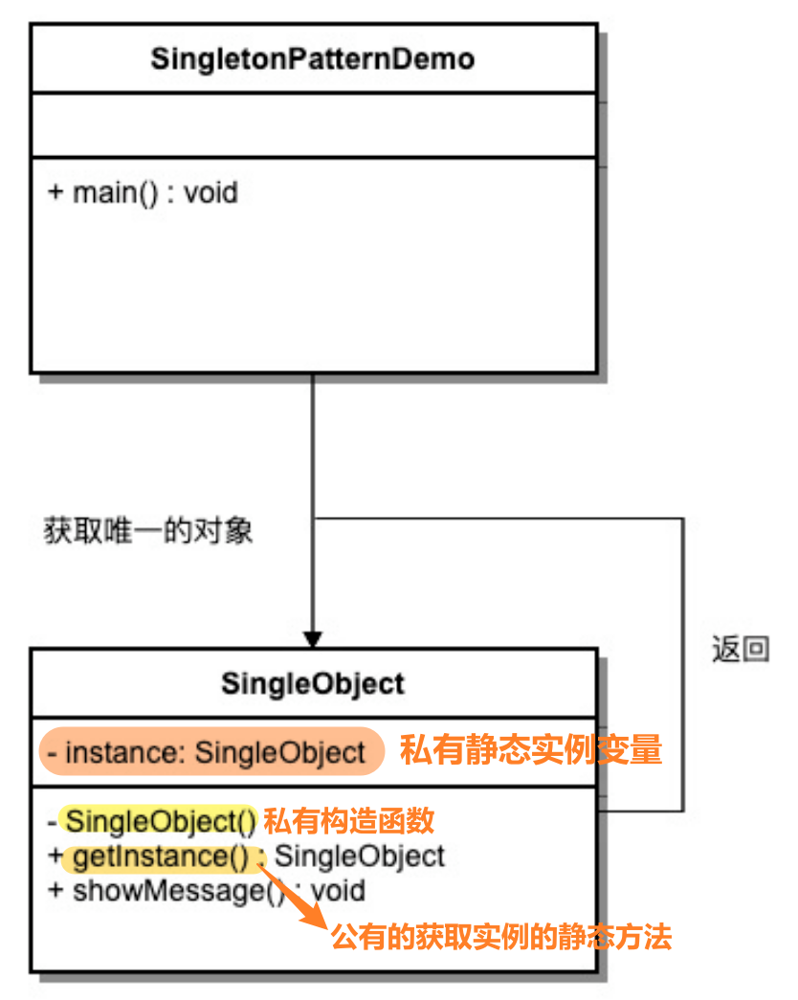
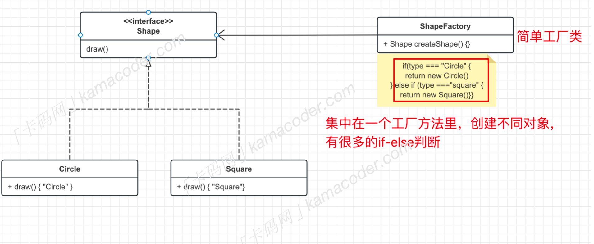
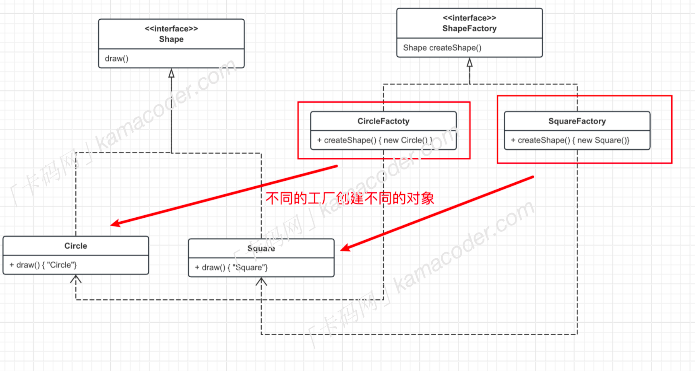
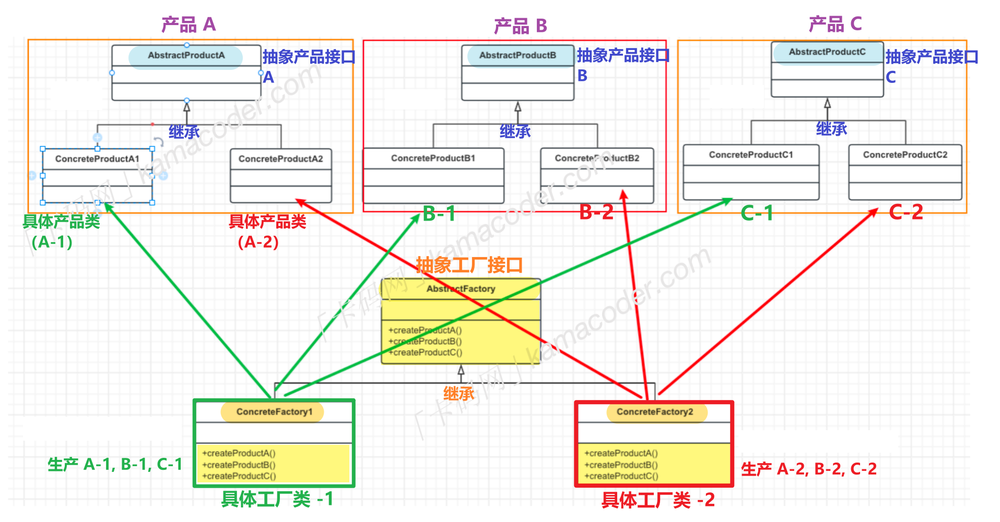

# 设计模式

> 参考：https://github.com/youngyangyang04/kama-DesignPattern

## 什么是设计模式

设计模式（Design pattern）代表了最佳的实践，通常被有经验的面向对象的软件开发人员所采用。设计模式是软件开发人员在软件开发过程中面临的一般问题的解决方案。这些解决方案是众多软件开发人员经过相当长的一段时间的试验和错误总结出来的。

设计模式是一套被反复使用的、多数人知晓的、经过分类编目的、代码设计经验的总结。

使用设计模式是为了重用代码、让代码更容易被他人理解、保证代码可靠性。 

## 设计模式的类型

根据设计模式的参考书 **Design Patterns - Elements of Reusable Object-Oriented Software（中文译名：设计模式 - 可复用的面向对象软件元素）** 中所提到的，总共有 23 种设计模式。

这些模式可以分为三大类：创建型模式（Creational Patterns）、结构型模式（Structural Patterns）、行为型模式（Behavioral Patterns）。

创造型：单例、工厂、建造者、原型

结构型：适配器、代理、桥接、外观、组合、装饰、享元、

行为型：观察者、策略、命令、中介者、备忘录、模板方法、迭代器、状态、责任链、解释器、访问者

## 设计模式的六大原则

**1、开闭原则（Open Close Principle）**

开闭原则的意思是：**对扩展开放，对修改关闭**。

在程序需要进行拓展的时候，不能去修改原有的代码，实现一个**热插拔**的效果。简言之，是为了使程序的扩展性好，易于维护和升级。想要达到这样的效果，我们需要使用接口和抽象类。

**2、里氏代换原则（Liskov Substitution Principle）**

里氏代换原则是面向对象设计的基本原则之一。 

里氏代换原则中说，**任何基类可以出现的地方，子类一定可以出现。**

LSP 是继承复用的基石，只有当派生类可以替换掉基类，且软件单位的功能不受到影响时，基类才能真正被复用，而派生类也能够在基类的基础上增加新的行为。

**3、依赖倒转原则（Dependence Inversion Principle）**

这个原则是开闭原则的基础，具体内容：针对接口编程，依赖于抽象而不依赖于具体。

**4、接口隔离原则（Interface Segregation Principle）**

使用多个隔离的接口，比使用单个接口要好。

它还有另外一个意思是：降低类之间的耦合度。由此可见，其实设计模式就是从大型软件架构出发、便于升级和维护的软件设计思想，它强调降低依赖，降低耦合。

**5、迪米特法则，又称最少知道原则（Demeter Principle）**

指一个实体应当尽量少地与其他实体之间发生相互作用，使得系统功能模块相对独立。

**6、合成复用原则（Composite Reuse Principle）**

合成复用原则是指：尽量使用合成/聚合的方式，而不是使用继承。

# 单例模式

## 核心思想

属于创建型模式，核心思想：**保证一个类仅有一个实例，提供一个访问它的全局访问点**

> 只有一个实例的意思是，在整个应用程序中，只存在该类的一个实例对象，而不是创建多个相同类型的对象。
>
> 全局访问点，是为了让其他类能获取到这个唯一实例，通常是一个静态方法

注意：

- 单例类只能有一个实例
- 单例类必须**自己创建自己**的唯一实例
- 单例类必须给所有其他对象提供这一实例

主要针对的情况：

- 频繁创建和销毁全局使用的类实例的问题
- 需要控制实例数目，节省系统资源时，可以使用

应用实例：

- 设备管理器为单例模式，例如电脑有两台打印机，避免同时打印同一个文件
- Windows 在多进程多线程环境下操作文件时，避免多个进程或线程同时操作一个文件，需要通过唯一实例进行处理。

## 实现

> 关键代码：**构造函数是私有的**

**主要角色：**

- 单例类
  - **私有构造函数**：防止外部代码创建单例类的其他实例
  - 静态成员变量
  - 公有静态方法：通过公有静态方法来获取这一实例
- 线程安全处理

**实现方式：**

- **懒汉式**——只有在请求实例时，才创建这个实例（请求时已经创建了，就返回已有实例）
- **饿汉式**——在类加载时，就已经完成了实例的创建（不管后面有没有使用，先创建再说）

## **例题**：[1 小明的购物车](https://kamacoder.com/problempage.php?pid=1074)

~~~C++
#include <iostream>
#include <map>
using namespace std;

class ShoppingCartManager
{
public:
    // 获取购物车实例 - 获取唯一实例的公有静态方法 ✅
    static ShoppingCartManager& getInstance()
    {
        static ShoppingCartManager instance;
        return instance;
    }

    // 添加商品到购物车
    void addToCart(const string& itemName, int quantity)
    {
        cart[itemName] += quantity;
    }
    // 查看购物车
    void viewCart() const {
        for (const auto& item : cart)
        {
            cout << item.first << " " << item.second << endl;
        }
    }

private:
    // 私有构造函数 ✅
    ShoppingCartManager() {}

    map<string, int> cart; // <车里存储商品，商品数量>
};

int main()
{
    string itemName;
    int quantity = 0;

    while (cin >> itemName >> quantity)
    {
        // 获取唯一实例
        ShoppingCartManager& cart = ShoppingCartManager::getInstance(); 
        cart.addToCart(itemName, quantity); // 添加
    }

    const ShoppingCartManager& cart = ShoppingCartManager::getInstance();
    cart.viewCart(); // 输出购物车内容

    return 0;
}
~~~

## 优缺点

优点：

- 全局控制，只有一个实例，就可以严格控制客户怎样访问它，以及何时访问它
- 节省资源，避免多次创建相同的对象，多个模块还可以通过这一个实例共享数据
- 懒加载：只有在需要时才进行实例化，提高程序的性能

缺点：

- 没有接口，不能继承
- 与单一职责原则冲突，一个类应该只关心内部逻辑，而不关心实例化方法

# 工厂模式

## 工厂模式的类型

- **简单工厂模式（Simple Factory Pattern）**
- **工厂方法模式（Factory Method Pattern）**
- **抽象工厂模式（Abstract Factory Pattern）**

> **简单工厂模式**（不是一个正式的设计模式，只是一种习惯，是工厂模式的基础）
>
> 核心思想：将产品的创建过程封装在一个工厂类中，把创建对象的流程集中在这个工厂类里
>
> - 主要用于创建对象
>
> - **用一个工厂来根据输入的条件产生不同的类**
>
> - 根据不同类的虚函数得到不同的结果
>
>
> 三个主要角色：
>
> - 工厂类
> - 抽象产品 —— 描述产品的通用行为
> - 具体产品 —— 实现抽闲产品接口，或继承抽象产品类，通过类里的if-else来实例化
>
> 
>
> 简单工厂模式只有一个工厂类，负责创建所有产品，如果要添加新的产品，通常需要修改工厂类的代码。

## 核心思想

**定义一个创建对象的接口，让其子类决定实例化哪一个具体的类。**工厂模式使对象的创建过程延迟到子类。

工厂方法模式也是一种创建型设计模式，提供了一种创建对象的方式，**无需指定要创建的具体类**，使得创建对象的过程与使用对象的过程分离。

**主要角色：**

- 抽象产品：定义产品的接口 
- 具体产品：实现了抽象产品接口，**定义了具体产品的特定行为和属性**

- 抽象工厂：声明创建产品的抽象方法

- 具体工厂：实现抽象工厂接口，**创建具体的产品**

  

## **例题**：[2 积木工厂](https://kamacoder.com/problempage.php?pid=1076)

~~~C++
#include <iostream>
#include <vector>
 

// 抽象积木接口 —— 抽象产品(产品表现，积木的行为和属性)
class Block {
public:
    virtual void produce() = 0;
};
 
class CircleBlock : public Block { // 具体圆形积木实现 —— 具体产品
public:
    void produce() override {
        std::cout << "Circle Block" << std::endl;
    }
};
 
class SquareBlock : public Block { // 具体方形积木实现 —— 具体产品
public:
    void produce() override {
        std::cout << "Square Block" << std::endl;
    }
};
 

// 抽象积木工厂接口 —— 抽象工厂(创建刚才定义过的产品)
class BlockFactory {
public:
    virtual Block* createBlock() = 0;
};
 
class CircleBlockFactory : public BlockFactory { // 具体圆形积木工厂实现 —— 创建圆形积木
public:
    Block* createBlock() override {
        return new CircleBlock();
    }
};

class SquareBlockFactory : public BlockFactory { // 具体方形积木工厂实现 —— 创建方形积木
public:
    Block* createBlock() override {
        return new SquareBlock();
    }
};
 

// 积木工厂系统
class BlockFactorySystem {
private:
    std::vector<Block*> blocks;
 
public:
    void produceBlocks(BlockFactory* factory, int quantity) // 根据工厂，创建积木
    {
        for (int i = 0; i < quantity; i++) { 
            Block* block = factory->createBlock(); 
            blocks.push_back(block);
            block->produce();
        }
    }
 
    const std::vector<Block*>& getBlocks() const {
        return blocks;
    }
 
    ~BlockFactorySystem() {
        // 释放所有动态分配的积木对象
        for (Block* block : blocks) {
            delete block;
        }
    }
};
 

int main() {
    // 创建积木工厂系统
    BlockFactorySystem factorySystem;
 
    // 读取生产次数
    int productionCount;
    std::cin >> productionCount;
 
    // 读取每次生产的积木类型和数量
    for (int i = 0; i < productionCount; i++) {
        std::string blockType;
        int quantity;
        std::cin >> blockType >> quantity;
 		
        // 根据 输入的积木形状，选择具体的积木创建
        if (blockType == "Circle") {
            factorySystem.produceBlocks(new CircleBlockFactory(), quantity);
        } 
        else if (blockType == "Square") {
            factorySystem.produceBlocks(new SquareBlockFactory(), quantity);
        }
    }
 
    return 0;
}
~~~

# 抽象工厂模式

抽象工厂模式（Abstract Factory Pattern）属于创建型模式，是围绕一个**超级工厂**创建其他工厂。该超级工厂又称为其他**工厂的工厂**。

> **之前我们已经介绍了“工厂方法模式”，那为什么还有要抽象工厂模式呢？**
>
> 这就涉及到创建“多类”对象了。
>
> 在**工厂方法模式**中，每个具体工厂只负责创建**单一**的产品。
>
> **抽象工厂模式可以确保一系列相关的产品被一起创建，这些产品能够相互配合使用**，再举个例子，有一些家具，比如沙发、茶几、椅子，都具有古典风格的和现代风格的，抽象工厂模式可以将生产现代风格的家具放在一个工厂类中，将生产古典风格的家具放在另一个工厂类中，这样每个工厂类就可以生产一系列的家具。

## 核心思想

抽象工厂模式提供了一种**创建【一系列相关或相互依赖对象】的接口**。

**接口**负责创建一个相关对象的工厂，**不需要显式指定它们的类**，每个生成的工厂都能按照工厂模式提供对象。

抽象工厂模式可以确保**一系列相关的产品**被**一起创建**，这些产品能够**相互配合使用**。

> 通过使用抽象工厂模式，可以将客户端与具体产品的创建过程解耦，使得客户端可以通过工厂接口来**创建一族产品。**

**适用场景**：当系统需要创建多个相关或依赖的对象，而不需要指定具体类时。

**解决方案**：在一个**产品族**中定义**多个产品**，由具体工厂实现创建这些产品的方法。

## 实现

**关键代码：在一个工厂中聚合多个同类产品的创建方法。**

抽象工厂模式包含多个抽象产品接口，多个具体产品类，一个抽象工厂接口和多个具体工厂，每个具体工厂负责创建一组相关的产品。

### 基本结构

> 具体工厂 —— 古典、现代；
>
> 产品 ——沙发，椅子，茶几…… 

- 抽象产品接口：
  - 定义一组产品的共同接口
  - 沙发的接口，椅子的接口，茶几的接口…….
- 具体产品类：
  - 实现抽闲产品接口，**定义每种产品的具体属性和行为**
  - 古典沙发什么表现，现代沙发怎么表现，古典椅子怎么表现 ……
- 抽象工厂接口：
  - **声明一组用于创建产品对象的方法**，每个方法对应一种品类
  - 创建沙发的接口，创建椅子的接口……

- 具体工厂类：
  - 分别实现抽象工厂接口中的方法，每个方法负责**创建一组具体的产品实例**
  - 古风工厂类创建一组古风家具，现代工厂类创建一组现代风格家具……

抽象工厂模式通常涉及**一族相关的产品**，每个具体工厂类负责创建该族中的具体产品。

客户端通过使用**抽象工厂接口**来创建产品对象，而不需要直接使用具体产品的实现类。

### 实现过程

- 定义抽象产品接口（可以有多个），接口中声明产品的公共方法
- 实现具体产品类，在类中实现抽象产品接口中的方法。
- 定义抽象工厂接口，声明一组用于创建产品的方法。
- 实现具体工厂类，分别实现抽象工厂接口中的方法，每个方法负责创建一组相关的产品。
- 在客户端中**使用抽象工厂和抽象产品，而不直接使用具体产品的类名**。

~~~java
// 1. 定义抽象产品
interface ProductA { // 抽象产品A —— 沙发
    void display();
}
interface ProductB { // 抽象产品B —— 椅子
    void show();
}

// 2. 实现具体产品类：每种产品属性和行为
class ConcreteProductA1 implements ProductA { // 具体产品A1 —— 古典沙发
    @Override
    public void display() {
        System.out.println("Concrete Product A1");
    }
}
class ConcreteProductA2 implements ProductA { // 具体产品A2 —— 现代沙发
    @Override
    public void display() {
        System.out.println("Concrete Product A2");
    }
}

class ConcreteProductB1 implements ProductB { // 具体产品B1 —— 古典椅子
    @Override
    public void show() {
        System.out.println("Concrete Product B1");
    }
}
class ConcreteProductB2 implements ProductB { // 具体产品B2 —— 现代椅子
    @Override
    public void show() {
        System.out.println("Concrete Product B2");
    }
}

// 3. 定义抽象工厂接口：声明一组用于创建产品的方法
interface AbstractFactory {
    ProductA createProductA(); // 创建产品A —— 创建沙发
    ProductB createProductB(); // 创建产品B —— 创建椅子
}

// 4. 实现具体工厂类：实现createProductA()和createProductB()，每个方法负责创建一组相关的产品

// 具体工厂1，生产产品A1和B1 —— 创建古典工厂的【古典沙发】【古典椅子】
class ConcreteFactory1 implements AbstractFactory { 
    @Override
    public ProductA createProductA() {
        return new ConcreteProductA1(); // 调用具体的创建对象接口
    }

    @Override
    public ProductB createProductB() {
        return new ConcreteProductB1();
    }
}
// 具体工厂2,生产产品A2和B2 —— 创建现代工厂的【现代沙发】【现代椅子】
class ConcreteFactory2 implements AbstractFactory { 
    @Override
    public ProductA createProductA() {
        return new ConcreteProductA2();
    }

    @Override
    public ProductB createProductB() {
        return new ConcreteProductB2();
    }
}

// 客户端代码 使用抽象工厂接口 --------------------------------------------------
public class AbstractFactoryExample 
{
    public static void main(String[] args) 
    {
        // 使用工厂1创建产品A1和产品B1
        AbstractFactory factory1 = new ConcreteFactory1(); // 工厂1 —— 古典工厂
        ProductA productA1 = factory1.createProductA(); // 创建产品A1 
        ProductB productB1 = factory1.createProductB(); // 创建产品B1
        productA1.display();
        productB1.show();

        // 使用工厂2创建产品A2和产品B2
        AbstractFactory factory2 = new ConcreteFactory2(); // 工厂2 —— 现代工厂
        ProductA productA2 = factory2.createProductA();	// 创建产品 A2
        ProductB productB2 = factory2.createProductB(); // 创建产品 B2
        productA2.display();
        productB2.show();
    }
}
~~~

## 应用场景

抽象工厂模式能够保证**一系列相关的产品一起使用**，并且在不修改客户端代码的情况下，可以方便地替换整个产品系列。

但是当需要增加新的产品类时，除了要增加新的具体产品类，还需要修改抽象工厂接口及其所有的具体工厂类，**扩展性相对较差**。

因此抽象工厂模式特别适用于一系列相关或相互依赖的产品**被一起创建**的情况，典型的应用场景是使用抽象工厂模式来**创建与不同数据库的连接对象**。

## 简单工厂、工厂方法、抽象工厂的区别

- 简单工厂模式：一个工厂方法创建**所有**具体产品

- 工厂方法模式：一个工厂方法创建**一个**具体产品

- 抽象工厂模式：一个工厂方法可以创建**一类**具体产品

## 例题：[3 家具工厂](https://kamacoder.com/problempage.php?pid=1077)

> 小明家新开了两个工厂用来生产家具，一个生产现代风格的沙发和椅子，一个生产古典风格的沙发和椅子，现在工厂收到了一笔订单，请你帮他设计一个系统，描述订单需要生产家具的信息。

~~~C++
#include <iostream>
#include <string>
 
// 抽象椅子接口 showInfo
class Chair {
public:
    virtual void showInfo() = 0;
};
 
class ModernChair : public Chair { // 具体现代椅子
public:
    void showInfo() override {
        std::cout << "modern chair" << std::endl;
    }
};
 
class ClassicalChair : public Chair { // 具体古典椅子
public:
    void showInfo() override {
        std::cout << "classical chair" << std::endl;
    }
};
 
// 抽象沙发接口 displayInfo()
class Sofa {
public:
    virtual void displayInfo() = 0;
};
 
class ModernSofa : public Sofa { // 具体现代沙发
public:
    void displayInfo() override {
        std::cout << "modern sofa" << std::endl;
    }
};
 
class ClassicalSofa : public Sofa { // 具体古典沙发
public:
    void displayInfo() override {
        std::cout << "classical sofa" << std::endl;
    }
};
 

// 抽象家居工厂接口 -------------------------------------------------------------
class FurnitureFactory {
public:
    virtual Chair* createChair() = 0; // 创建椅子
    virtual Sofa* createSofa() = 0;	  // 创建沙发
};

class ModernFurnitureFactory : public FurnitureFactory { // 具体现代工厂
public:
    Chair* createChair() override { // 创建现代椅子
        return new ModernChair(); 
    }
 
    Sofa* createSofa() override {  // 创建现代沙发
        return new ModernSofa();
    }
};

class ClassicalFurnitureFactory : public FurnitureFactory { // 具体古典工厂
public:
    Chair* createChair() override { // 创建古典椅子
        return new ClassicalChair();
    }
 
    Sofa* createSofa() override { // 创建古典沙发
        return new ClassicalSofa();
    }
};
 
int main() {
    // 读取订单数量
    int N;
    std::cin >> N;
 
    // 处理每个订单
    for (int i = 0; i < N; i++) {
        // 读取家具类型（工厂类型）
        std::string furnitureType;
        std::cin >> furnitureType;
 
        // 根据输入选择创建哪种家居工厂
        FurnitureFactory* factory = nullptr;
        if (furnitureType == "modern") {
            factory = new ModernFurnitureFactory();
        } else if (furnitureType == "classical") {
            factory = new ClassicalFurnitureFactory();
        }
 
        // 根据工厂生产椅子和沙发
        Chair* chair = factory->createChair();
        Sofa* sofa = factory->createSofa();
 
        // 输出家具信息
        chair->showInfo();
        sofa->displayInfo();

        delete chair;
        delete sofa;
        delete factory;
    }
 
    return 0;
}
~~~

# 建造者模式

建造者模式是一种创建型设计模式，它允许你**创建复杂对象的步骤与表示方式相分离**。

# 原型模式

# 适配器模式

# 适配器模式

