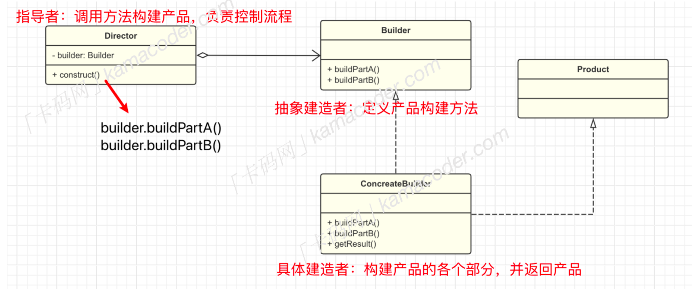
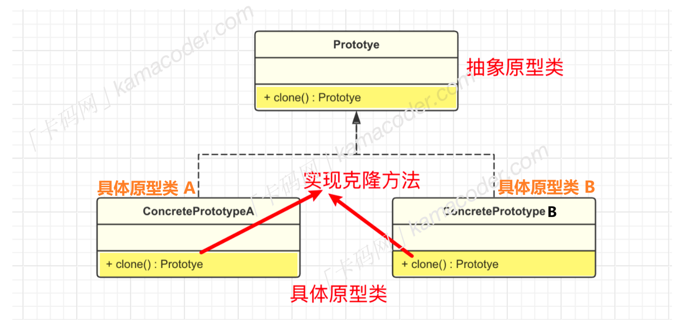
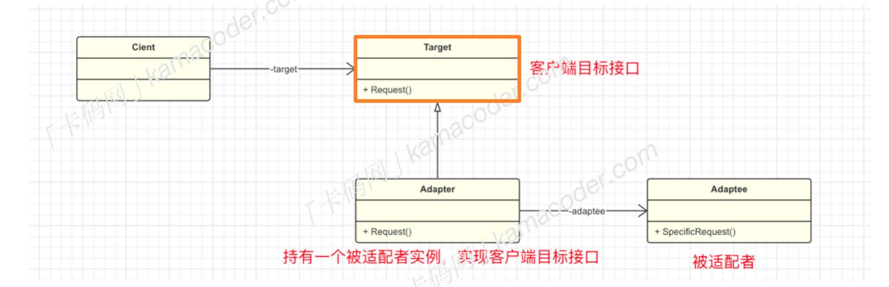

# 设计模式

> 参考：https://github.com/youngyangyang04/kama-DesignPattern

## 什么是设计模式

设计模式（Design pattern）代表了最佳的实践，通常被有经验的面向对象的软件开发人员所采用。设计模式是软件开发人员在软件开发过程中面临的一般问题的解决方案。这些解决方案是众多软件开发人员经过相当长的一段时间的试验和错误总结出来的。

设计模式是一套被反复使用的、多数人知晓的、经过分类编目的、代码设计经验的总结。

使用设计模式是为了重用代码、让代码更容易被他人理解、保证代码可靠性。 


## 设计模式的类型

根据设计模式的参考书 Design Patterns - Elements of Reusable Object-Oriented Software（中文译名：设计模式 - 可复用的面向对象软件元素） 中所提到的，总共有 **23 种**设计模式。

这些模式可以分为三大类：**创建型模式（Creational Patterns）、结构型模式（Structural Patterns）、行为型模式（Behavioral Patterns）。**

- **创造型**：单例、工厂、抽象工厂、建造者、原型
- **结构型**：适配器、代理、桥接、外观、组合、装饰、享元、
- **行为型**：观察者、策略、命令、中介者、备忘录、模板方法、迭代器、状态、责任链、解释器、访问者


## 设计模式的六大原则

**1、开闭原则（Open Close Principle）**

开闭原则的意思是：**对扩展开放，对修改关闭**。

在程序需要进行拓展的时候，不能去修改原有的代码，实现一个**热插拔**的效果。简言之，是为了使程序的扩展性好，易于维护和升级。想要达到这样的效果，我们需要使用接口和抽象类。

**2、里氏代换原则（Liskov Substitution Principle）**

里氏代换原则是面向对象设计的基本原则之一。 

里氏代换原则中说，**任何基类可以出现的地方，子类一定可以出现。**

LSP 是继承复用的基石，只有当派生类可以替换掉基类，且软件单位的功能不受到影响时，基类才能真正被复用，而派生类也能够在基类的基础上增加新的行为。

**3、依赖倒转原则（Dependence Inversion Principle）**

这个原则是开闭原则的基础，具体内容：针对接口编程，依赖于抽象而不依赖于具体。

**4、接口隔离原则（Interface Segregation Principle）**

使用多个隔离的接口，比使用单个接口要好。

它还有另外一个意思是：降低类之间的耦合度。由此可见，其实设计模式就是从大型软件架构出发、便于升级和维护的软件设计思想，它强调降低依赖，降低耦合。

**5、迪米特法则，又称最少知道原则（Demeter Principle）**

指一个实体应当尽量少地与其他实体之间发生相互作用，使得系统功能模块相对独立。

**6、合成复用原则（Composite Reuse Principle）**

合成复用原则是指：尽量使用合成/聚合的方式，而不是使用继承。


# ✅创造型 


## 单例模式

### 核心思想

属于创建型模式，核心思想：**保证一个类仅有一个实例，提供一个访问它的全局访问点**

> 只有一个实例的意思是，在整个应用程序中，只存在该类的一个实例对象，而不是创建多个相同类型的对象。
>
> 全局访问点，是为了让其他类能获取到这个唯一实例，通常是一个静态方法

注意：

- 单例类只能有一个实例
- 单例类必须**自己创建自己**的唯一实例
- 单例类必须给所有其他对象提供这一实例

主要针对的情况：

- 频繁创建和销毁全局使用的类实例的问题
- 需要控制实例数目，节省系统资源时，可以使用

应用实例：

- 设备管理器为单例模式，例如电脑有两台打印机，避免同时打印同一个文件
- Windows 在多进程多线程环境下操作文件时，避免多个进程或线程同时操作一个文件，需要通过唯一实例进行处理。

### 实现

> 关键代码：**构造函数是私有的**

**主要角色：**

- 单例类
  - **私有构造函数**：防止外部代码创建单例类的其他实例
  - 静态成员变量
  - 公有静态方法：通过公有静态方法来获取这一实例
- 线程安全处理


**实现方式：**

- **懒汉式**——只有在请求实例时，才创建这个实例（请求时已经创建了，就返回已有实例）
- **饿汉式**——在类加载时，就已经完成了实例的创建（不管后面有没有使用，先创建再说）


### 例题：[1 小明的购物车](https://kamacoder.com/problempage.php?pid=1074)

~~~C++
#include <iostream>
#include <map>
using namespace std;

class ShoppingCartManager
{
public:
    // 获取购物车实例 - 获取唯一实例的公有静态方法 ✅
    static ShoppingCartManager& getInstance()
    {
        static ShoppingCartManager instance;
        return instance;
    }

    // 添加商品到购物车
    void addToCart(const string& itemName, int quantity)
    {
        cart[itemName] += quantity;
    }
    // 查看购物车
    void viewCart() const {
        for (const auto& item : cart)
        {
            cout << item.first << " " << item.second << endl;
        }
    }


private:
    // 私有构造函数 ✅
    ShoppingCartManager() {}

    map<string, int> cart; // <车里存储商品，商品数量>
};


int main()
{
    string itemName;
    int quantity = 0;

    while (cin >> itemName >> quantity)
    {
        // 获取唯一实例
        ShoppingCartManager& cart = ShoppingCartManager::getInstance(); 
        cart.addToCart(itemName, quantity); // 添加
    }

    const ShoppingCartManager& cart = ShoppingCartManager::getInstance();
    cart.viewCart(); // 输出购物车内容

    return 0;
}
~~~


### 优缺点

优点：

- 全局控制，只有一个实例，就可以严格控制客户怎样访问它，以及何时访问它
- 节省资源，避免多次创建相同的对象，多个模块还可以通过这一个实例共享数据
- 懒加载：只有在需要时才进行实例化，提高程序的性能

缺点：

- 没有接口，不能继承
- 与单一职责原则冲突，一个类应该只关心内部逻辑，而不关心实例化方法


## 工厂模式

### 工厂模式的类型

- **简单工厂模式（Simple Factory Pattern）**
- **工厂方法模式（Factory Method Pattern）**
- **抽象工厂模式（Abstract Factory Pattern）**

> **简单工厂模式**（不是一个正式的设计模式，只是一种习惯，是工厂模式的基础）
>
> 核心思想：将产品的创建过程封装在一个工厂类中，把创建对象的流程集中在这个工厂类里
>
> - 主要用于创建对象
>
> - **用一个工厂来根据输入的条件产生不同的类**
>
> - 根据不同类的虚函数得到不同的结果
>
>
> 三个主要角色：
>
> - 工厂类
> - 抽象产品 —— 描述产品的通用行为
> - 具体产品 —— 实现抽闲产品接口，或继承抽象产品类，通过类里的if-else来实例化
>
> 
>
> 简单工厂模式只有一个工厂类，负责创建所有产品，如果要添加新的产品，通常需要修改工厂类的代码。

### 核心思想

**定义一个创建对象的接口，让其子类决定实例化哪一个具体的类。**工厂模式使对象的创建过程延迟到子类。

工厂方法模式也是一种创建型设计模式，提供了一种创建对象的方式，**无需指定要创建的具体类**，使得创建对象的过程与使用对象的过程分离。


### 实现

**主要角色：**

- 抽象产品：定义产品的接口 
- 具体产品：实现了抽象产品接口，**定义了具体产品的特定行为和属性**

- 抽象工厂：声明创建产品的抽象方法

- 具体工厂：实现抽象工厂接口，**创建具体的产品**

  


### 例题：[2 积木工厂](https://kamacoder.com/problempage.php?pid=1076)

~~~C++
#include <iostream>
#include <vector>
 

// 抽象积木接口 —— 抽象产品(产品表现，积木的行为和属性)
class Block {
public:
    virtual void produce() = 0;
};
 
class CircleBlock : public Block { // 具体圆形积木实现 —— 具体产品
public:
    void produce() override {
        std::cout << "Circle Block" << std::endl;
    }
};
 
class SquareBlock : public Block { // 具体方形积木实现 —— 具体产品
public:
    void produce() override {
        std::cout << "Square Block" << std::endl;
    }
};
 


// 抽象积木工厂接口 —— 抽象工厂(创建刚才定义过的产品)
class BlockFactory {
public:
    virtual Block* createBlock() = 0;
};
 
class CircleBlockFactory : public BlockFactory { // 具体圆形积木工厂实现 —— 创建圆形积木
public:
    Block* createBlock() override {
        return new CircleBlock();
    }
};

class SquareBlockFactory : public BlockFactory { // 具体方形积木工厂实现 —— 创建方形积木
public:
    Block* createBlock() override {
        return new SquareBlock();
    }
};
 


// 积木工厂系统
class BlockFactorySystem {
private:
    std::vector<Block*> blocks;
 
public:
    void produceBlocks(BlockFactory* factory, int quantity) // 根据工厂，创建积木
    {
        for (int i = 0; i < quantity; i++) { 
            Block* block = factory->createBlock(); 
            blocks.push_back(block);
            block->produce();
        }
    }
 
    const std::vector<Block*>& getBlocks() const {
        return blocks;
    }
 
    ~BlockFactorySystem() {
        // 释放所有动态分配的积木对象
        for (Block* block : blocks) {
            delete block;
        }
    }
};
 

int main() {
    // 创建积木工厂系统
    BlockFactorySystem factorySystem;
 
    // 读取生产次数
    int productionCount;
    std::cin >> productionCount;
 
    // 读取每次生产的积木类型和数量
    for (int i = 0; i < productionCount; i++) {
        std::string blockType;
        int quantity;
        std::cin >> blockType >> quantity;
 		
        // 根据 输入的积木形状，选择具体的积木创建
        if (blockType == "Circle") {
            factorySystem.produceBlocks(new CircleBlockFactory(), quantity);
        } 
        else if (blockType == "Square") {
            factorySystem.produceBlocks(new SquareBlockFactory(), quantity);
        }
    }
 
    return 0;
}
~~~


## 抽象工厂模式

抽象工厂模式（Abstract Factory Pattern）属于创建型模式，是围绕一个**超级工厂**创建其他工厂。该超级工厂又称为其他**工厂的工厂**。


> **之前我们已经介绍了“工厂方法模式”，那为什么还有要抽象工厂模式呢？**
>
> 这就涉及到创建“多类”对象了。
>
> 在**工厂方法模式**中，每个具体工厂只负责创建**单一**的产品。
>
> **抽象工厂模式可以确保一系列相关的产品被一起创建，这些产品能够相互配合使用**，再举个例子，有一些家具，比如沙发、茶几、椅子，都具有古典风格的和现代风格的，抽象工厂模式可以将生产现代风格的家具放在一个工厂类中，将生产古典风格的家具放在另一个工厂类中，这样每个工厂类就可以生产一系列的家具。


### 核心思想

抽象工厂模式提供了一种**创建【一系列相关或相互依赖对象】的接口**。

**接口**负责创建一个相关对象的工厂，**不需要显式指定它们的类**，每个生成的工厂都能按照工厂模式提供对象。

抽象工厂模式可以确保**一系列相关的产品**被**一起创建**，这些产品能够**相互配合使用**。


> 通过使用抽象工厂模式，可以将客户端与具体产品的创建过程解耦，使得客户端可以通过工厂接口来**创建一族产品。**


**适用场景**：当系统需要创建多个相关或依赖的对象，而不需要指定具体类时。

**解决方案**：在一个**产品族**中定义**多个产品**，由具体工厂实现创建这些产品的方法。


### 实现

**关键代码：在一个工厂中聚合多个同类产品的创建方法。**

抽象工厂模式包含多个抽象产品接口，多个具体产品类，一个抽象工厂接口和多个具体工厂，每个具体工厂负责创建一组相关的产品。


**基本结构：**

> 具体工厂 —— 古典、现代；
>
> 产品 ——沙发，椅子，茶几…… 

- 抽象产品接口：
  - 定义一组产品的共同接口
  - 沙发的接口，椅子的接口，茶几的接口…….
- 具体产品类：
  - 实现抽闲产品接口，**定义每种产品的具体属性和行为**
  - 古典沙发什么表现，现代沙发怎么表现，古典椅子怎么表现 ……
- 抽象工厂接口：
  - **声明一组用于创建产品对象的方法**，每个方法对应一种品类
  - 创建沙发的接口，创建椅子的接口……

- 具体工厂类：
  - 分别实现抽象工厂接口中的方法，每个方法负责**创建一组具体的产品实例**
  - 古风工厂类创建一组古风家具，现代工厂类创建一组现代风格家具……


抽象工厂模式通常涉及**一族相关的产品**，每个具体工厂类负责创建该族中的具体产品。

客户端通过使用**抽象工厂接口**来创建产品对象，而不需要直接使用具体产品的实现类。


**实现过程：**

- 定义抽象产品接口（可以有多个），接口中声明产品的公共方法
- 实现具体产品类，在类中实现抽象产品接口中的方法。
- 定义抽象工厂接口，声明一组用于创建产品的方法。
- 实现具体工厂类，分别实现抽象工厂接口中的方法，每个方法负责创建一组相关的产品。
- 在客户端中**使用抽象工厂和抽象产品，而不直接使用具体产品的类名**。


~~~java
// 1. 定义抽象产品
interface ProductA { // 抽象产品A —— 沙发
    void display();
}
interface ProductB { // 抽象产品B —— 椅子
    void show();
}


// 2. 实现具体产品类：每种产品属性和行为
class ConcreteProductA1 implements ProductA { // 具体产品A1 —— 古典沙发
    @Override
    public void display() {
        System.out.println("Concrete Product A1");
    }
}
class ConcreteProductA2 implements ProductA { // 具体产品A2 —— 现代沙发
    @Override
    public void display() {
        System.out.println("Concrete Product A2");
    }
}

class ConcreteProductB1 implements ProductB { // 具体产品B1 —— 古典椅子
    @Override
    public void show() {
        System.out.println("Concrete Product B1");
    }
}
class ConcreteProductB2 implements ProductB { // 具体产品B2 —— 现代椅子
    @Override
    public void show() {
        System.out.println("Concrete Product B2");
    }
}


// 3. 定义抽象工厂接口：声明一组用于创建产品的方法
interface AbstractFactory {
    ProductA createProductA(); // 创建产品A —— 创建沙发
    ProductB createProductB(); // 创建产品B —— 创建椅子
}

// 4. 实现具体工厂类：实现createProductA()和createProductB()，每个方法负责创建一组相关的产品

// 具体工厂1，生产产品A1和B1 —— 创建古典工厂的【古典沙发】【古典椅子】
class ConcreteFactory1 implements AbstractFactory { 
    @Override
    public ProductA createProductA() {
        return new ConcreteProductA1(); // 调用具体的创建对象接口
    }

    @Override
    public ProductB createProductB() {
        return new ConcreteProductB1();
    }
}
// 具体工厂2,生产产品A2和B2 —— 创建现代工厂的【现代沙发】【现代椅子】
class ConcreteFactory2 implements AbstractFactory { 
    @Override
    public ProductA createProductA() {
        return new ConcreteProductA2();
    }

    @Override
    public ProductB createProductB() {
        return new ConcreteProductB2();
    }
}


// 客户端代码 使用抽象工厂接口 --------------------------------------------------
public class AbstractFactoryExample 
{
    public static void main(String[] args) 
    {
        // 使用工厂1创建产品A1和产品B1
        AbstractFactory factory1 = new ConcreteFactory1(); // 工厂1 —— 古典工厂
        ProductA productA1 = factory1.createProductA(); // 创建产品A1 
        ProductB productB1 = factory1.createProductB(); // 创建产品B1
        productA1.display();
        productB1.show();

        // 使用工厂2创建产品A2和产品B2
        AbstractFactory factory2 = new ConcreteFactory2(); // 工厂2 —— 现代工厂
        ProductA productA2 = factory2.createProductA();	// 创建产品 A2
        ProductB productB2 = factory2.createProductB(); // 创建产品 B2
        productA2.display();
        productB2.show();
    }
}
~~~


### 应用场景

抽象工厂模式能够保证**一系列相关的产品一起使用**，并且在不修改客户端代码的情况下，可以方便地替换整个产品系列。

但是当需要增加新的产品类时，除了要增加新的具体产品类，还需要修改抽象工厂接口及其所有的具体工厂类，**扩展性相对较差**。

因此抽象工厂模式特别适用于一系列相关或相互依赖的产品**被一起创建**的情况，典型的应用场景是使用抽象工厂模式来**创建与不同数据库的连接对象**。


### 简单工厂、工厂方法、抽象工厂的区别

- 简单工厂模式：一个工厂方法创建**所有**具体产品

- 工厂方法模式：一个工厂方法创建**一个**具体产品

- 抽象工厂模式：一个工厂方法可以创建**一类**具体产品


### 例题：[3 家具工厂](https://kamacoder.com/problempage.php?pid=1077)

> 小明家新开了两个工厂用来生产家具，一个生产现代风格的沙发和椅子，一个生产古典风格的沙发和椅子，现在工厂收到了一笔订单，请你帮他设计一个系统，描述订单需要生产家具的信息。

~~~C++
#include <iostream>
#include <string>
 
// 抽象椅子接口 showInfo
class Chair {
public:
    virtual void showInfo() = 0;
};
 
class ModernChair : public Chair { // 具体现代椅子
public:
    void showInfo() override {
        std::cout << "modern chair" << std::endl;
    }
};
 
class ClassicalChair : public Chair { // 具体古典椅子
public:
    void showInfo() override {
        std::cout << "classical chair" << std::endl;
    }
};
 
// 抽象沙发接口 displayInfo()
class Sofa {
public:
    virtual void displayInfo() = 0;
};
 
class ModernSofa : public Sofa { // 具体现代沙发
public:
    void displayInfo() override {
        std::cout << "modern sofa" << std::endl;
    }
};
 
class ClassicalSofa : public Sofa { // 具体古典沙发
public:
    void displayInfo() override {
        std::cout << "classical sofa" << std::endl;
    }
};
 

// 抽象家居工厂接口 -------------------------------------------------------------
class FurnitureFactory {
public:
    virtual Chair* createChair() = 0; // 创建椅子
    virtual Sofa* createSofa() = 0;	  // 创建沙发
};

class ModernFurnitureFactory : public FurnitureFactory { // 具体现代工厂
public:
    Chair* createChair() override { // 创建现代椅子
        return new ModernChair(); 
    }
 
    Sofa* createSofa() override {  // 创建现代沙发
        return new ModernSofa();
    }
};

class ClassicalFurnitureFactory : public FurnitureFactory { // 具体古典工厂
public:
    Chair* createChair() override { // 创建古典椅子
        return new ClassicalChair();
    }
 
    Sofa* createSofa() override { // 创建古典沙发
        return new ClassicalSofa();
    }
};
 
int main() {
    // 读取订单数量
    int N;
    std::cin >> N;
 
    // 处理每个订单
    for (int i = 0; i < N; i++) {
        // 读取家具类型（工厂类型）
        std::string furnitureType;
        std::cin >> furnitureType;
 
        // 根据输入选择创建哪种家居工厂
        FurnitureFactory* factory = nullptr;
        if (furnitureType == "modern") {
            factory = new ModernFurnitureFactory();
        } else if (furnitureType == "classical") {
            factory = new ClassicalFurnitureFactory();
        }
 
        // 根据工厂生产椅子和沙发
        Chair* chair = factory->createChair();
        Sofa* sofa = factory->createSofa();
 
        // 输出家具信息
        chair->showInfo();
        sofa->displayInfo();

        delete chair;
        delete sofa;
        delete factory;
    }
 
    return 0;
}
~~~


## 建造者模式

建造者模式是一种创建型设计模式，它允许你**创建复杂对象的步骤与表示方式相分离**。

### 核心思想

**将对象的构建过程分为多个步骤，并为每个步骤定义一个抽象的接口**。

具体的构建过程由实现了这些接口的**具体建造者类**来完成。同时有一个**指导者类**负责协调建造者的工作，按照一定的顺序或逻辑来执行构建步骤，最终生成产品。

用户通过指导者，来创建不同类型的复杂对象。

**适用情况**：

在软件系统中，一个复杂对象的创建通常由多个部分组成，这些部分的组合经常变化，但组合的算法相对稳定。

当一些基本部件不变，而其组合经常变化时。**将变与不变的部分分离**。


>示例：**计算机由很多组件组成，例如 CPU、内存、硬盘、显卡等**。
>
>每个组件可能有不同的型号、配置和制造，这个时候**计算机就可以被视为一个复杂对象**，构建过程相对复杂.
>
>使用建造者模式将计算机的构建过程封装在一个**具体的建造者类**中，而**指导者类**则负责指导构建的步骤和顺序。
>
>每个具体的**建造者类可以负责构建不同型号或配置的计算机**，客户端代码可以通过**选择不同的建造者**来创建不同类型的计算机，这样就可以根据需要构建不同表示的复杂对象，更加灵活。
>
>
>
>示例：肯德基，汉堡、可乐、薯条、炸鸡翅等是不变的，而其组合是经常变化的，生成出不同的"套餐"。


### 实现

**关键代码：**

- 建造者——创建并提出实例
- 指导者——管理建造出来的实例的依赖关系，和控制构建过程

**基本结构：**

- **产品 Product**：被构建的复杂对象，包含多个组成部分或属性
- **抽象建造者 Builder**：定义构建**产品各个部分的抽象接口**，包括构建产品的各个部分的方法
- **具体建造者 Concrete Builder**：实现抽象建造者接口，具体确定**如何构建产品的各个部分**，并负责返回最终构建的产品
- **指导者 Director**：负责调用建造者的方法来**构建产品**，指导者并不了解具体的构建过程，只关心产品的构建顺序和方式。


在客户端中，通过**指导者**来构建产品，而并不和具体建造者进行直接的交互。




**实现步骤：**

1、定义产品类：产品的属性和方法

~~~java
// 产品类
class Product {
    private String part1;
    private String part2;

    public void setPart1(String part1) {
        this.part1 = part1;
    }

    public void setPart2(String part2) {
        this.part2 = part2;
    }

    // 其他属性和方法
}
~~~

2、定义抽象建造者接口：包含构建产品各个部分的抽象方法，通常用于设置产品的各个属性。

~~~java
// 抽象建造者接口 （c++ 中是抽象类）
interface Builder {
    void buildPart1(String part1);
    void buildPart2(String part2);
    Product getResult();
}
~~~

3、创建具体建造者类：实现抽象建造者接口，构建具体的产品并返回

~~~java
// 具体建造者类
class ConcreteBuilder implements Builder {
    private Product product = new Product();

    @Override
    public void buildPart1(String part1) { // 设置属性1
        product.setPart1(part1);
    }

    @Override
    public void buildPart2(String part2) { // 设置属性2
        product.setPart2(part2);
    }

    @Override
    public Product getResult() { // 返回构建的产品
        return product;
    }
}
~~~

4、创建指导者类：控制构建产品的顺序和步骤

~~~java
// 指导者类
class Director {
    private Builder builder;

    public Director(Builder builder) { // 传入Builder
        this.builder = builder;
    }
	// 调用方法构建产品
    public void construct() {
        builder.buildPart1("Part1");
        builder.buildPart2("Part2");
    }
}
~~~

5、客户端使用建造者模式：在客户端中创建【具体建造者对象】和【指导者对象】，通过指导者来构建产品。

~~~java
// 客户端代码
public class Main{
    public static void main(String[] args) {
        
        Builder builder = new ConcreteBuilder(); // 创建具体建造者 
        Director director = new Director(builder); // 创建指导者

        
        director.construct();// 指导者构建产品

        Product product = builder.getResult();// 指导者返回构建好的产品
        
        // 输出产品信息
        System.out.println(product);
    }
}
~~~


### 使用场景

建造者模式优点：

- 可以**将【一个复杂对象的构建】与其【表示】分离，**通过将**构建复杂对象的过程抽象出来**，可以使客户端代码与具体的构建过程解耦

- **同样的构建过程可以创建不同的表示**，可以有**多个具体的建造者**(相互独立），可以更加灵活地创建不同组合的对象。

对应的，建造者模式**适用于复杂对象的创建**，当对象构建过程相对复杂时可以考虑使用建造者模式，但是当产品的构建过程发生变化时，可能需要同时修改指导类和建造者类，这就使得重构变得相对困难。

建造者模式在现有的工具和库中也有着广泛的应用，比如JUnit 中的测试构建器`TestBuilder`就采用了建造者模式，用于构建测试对象。


### 例题：[4 自行车加工](https://kamacoder.com/problempage.php?pid=1084)

> 小明家新开了一家自行车工厂，用于**使用自行车配件（车架 frame 和车轮 tires ）进行组装定制不同的自行车，包括山地车和公路车。**
>
> 山地车使用的是Aluminum Frame（铝制车架）和 Knobby Tires（可抓地轮胎），
>
> 公路车使用的是 Carbon Frame （碳车架）和 Slim Tries。
>
> 现在它收到了一笔订单，要求定制一批自行车，请你使用【建造者模式】告诉小明这笔订单需要使用那些自行车配置吧。
>
> ###### 输入示例
>
> ```
> 3
> mountain
> road
> mountain
> ```
>
> ###### 输出示例
>
> ```
> Aluminum Frame Knobby Tires
> Carbon Frame Slim Tires
> Aluminum Frame Knobby Tires
> ```

产品：自行车

建造者：山地车建造者，公路车建造者


~~~C++
#include <iostream>
#include <string>

// 产品：自行车
class Bike
{
public:
    std::string frame;
    std::string tires;

    void setFrame(const std::string& frame) // 设置车架
    {
        this->frame = frame;
    }

    void setTires(const std::string& tires) // 设置轮胎
    {
        this->tires = tires;
    }

    friend std::ostream& operator<<(std::ostream& os, const Bike& bike)
    {
        os << bike.frame << " " << bike.tires;
        return os;
    }
};


// 建造者抽象类
class BikeBuilder
{
public:
    virtual void buildFrame() = 0;
    virtual void buildTires() = 0;
    virtual Bike getResult() = 0;
    
    virtual ~BikeBuilder() = default; // 虚析构，保证派生类正确析构
};


// 具体 山地车建造者
class MountainBikeBuilder : public BikeBuilder
{
private:
    Bike bike; // 创建产品 bike

public:
    void buildFrame() override { // 设置山地车的框架和轮胎
        bike.setFrame("Aluminum Frame");
    }
    void buildTires() override {
        bike.setTires("Knobby Tires");
    }

    Bike getResult() override { // 返回设置好的bike
        return bike;
    }
};

// 具体 公路车建造者
class RoadBikeBuilder : public BikeBuilder
{
private:
    Bike bike;

public:
    void buildFrame() override {
        bike.setFrame("Carbon Frame");
    }
    void buildTires() override {
        bike.setTires("Slim Tires");
    }

    Bike getResult() override {
        return bike;
    }
};


// 指导者
class BikeDirector
{
public:
    Bike construct(BikeBuilder& builder) // 根据传进来的Builder设置
    {
        builder.buildFrame();
        builder.buildTires();
        return builder.getResult();
    }
};


int main()
{
    int N;
    std::cin >> N; // 订单数量

    BikeDirector director;// 创建指导者

    for (int i = 0; i < N; i++)
    {
        std::string bikeType;
        std::cin >> bikeType; 

        BikeBuilder* builder; // 声明一个指向基类BikeBuilder的指针
        // 可以改成用 unique_ptr 管理内存
        // std::unique_ptr<BikeBuilder> builder;

        // 根据输入的自行车类型，创建不同类型的具体建造者
        if (bikeType == "mountain") {
            builder = new MountainBikeBuilder(); // 堆上创建一个 山地车建造者 对象
        }
        else {
            builder = new RoadBikeBuilder();
        }

        // director 负责指导生产产品
        Bike bike = director.construct(*builder); // 传入builder
        std::cout << bike << std::endl;

        // 释放动态分配的对象
        delete builder;
    }

    return 0;
}
~~~


> **关于多态+动态分配**
>
> ~~~C++
> BikeBuilder* builder;
> 
> if (bikeType == "mountain") {
>     builder = new MountainBikeBuilder();
> } else {
>     builder = new RoadBikeBuilder();
> }
> 
> Bike bike = director.construct(*builder); // 传入builder
> delete builder;
> ~~~
>
> **`BikeBuilder`是抽象基类**，不能直接创建对象，但可以通过它的指针or引用指向派生类对象。
>
> ~~~C++
> BikeBuilder* builder;
> ~~~
>
> 声明了一个指向 基类`BikeBuilder`的指针，后面它会指向不同的具体建造者对象。
>
> ~~~C++
> builder = new MountainBikeBuilder();
> ~~~
>
> `new` 会在**堆上**创建一个山地车建造者对象，并返回一个指向它的指针，类型时`MountainBikeBuilder*`
>
> 由于`MountainBikeBuilder`继承自`BikeBuilder`，并且编译器允许**派生类指针向基类指针的隐式转换**，所以返回值可以直接赋给 `BikeBuilder* builder`。
>
> 
>
> ~~~C++
> Bike bike = director.construct(*builder); // 传入具体builder
> ~~~
>
> `*builder` 把指针解引用，得到一个 `BikeBuilder&`（引用），现在的`builder`已经是具体建造者了。
>
> `construct()` 参数是 `BikeBuilder&`，所以无论它实际是 `MountainBikeBuilder` 还是 `RoadBikeBuilder`，都会正确调用**派生类重写的 `buildFrame()`、`buildTires()`**（虚函数机制）。
>
> 
>
> ~~~C++
> delete builder;
> ~~~
>
> 因为 `new` 在堆上分配了内存，所以要手动 `delete` 释放。


> **可以改成用 `unique_ptr` 管理内存**
>
> ~~~C++
> // 用 unique_ptr 管理内存
> std::unique_ptr<BikeBuilder> builder;
> 
> if (bikeType == "mountain") {
>     builder = std::make_unique<MountainBikeBuilder>();
> } else {
>     builder = std::make_unique<RoadBikeBuilder>();
> }
> 
> Bike bike = director.construct(*builder);
> ~~~
>
> **`std::unique_ptr`**
>
> - 自动管理内存，无需手动 `delete`。
> - 防止内存泄漏，异常安全。


> **为什么不直接写 `MountainBikeBuilder builder;`？**
>
> - 如果用对象而不是指针，那么 `builder` 的类型必须固定（编译期确定）。
> - 而这里，我们根据用户输入 `bikeType` 决定用哪种建造者，这就需要 **运行时决定对象类型**。
> - 所以：用基类指针or引用接收派生类对象，通过虚函数调用实现不同的构造过程


## 原型模式

原型模式（Prototype Pattern）是用于**创建重复的对象**，同时又能保证性能。属于创建型模式。

这种模式是实现了一个**原型接口**，该接口用于**创建当前对象的克隆**。


### 核心思想

**基于现有的对象创建新的对象，而不是从头开始创建。**

在原型模式中，通常有一个原型对象，它被用作创建新对象的模板。**新对象通过复制原型对象的属性和状态来创建**，而无需知道具体的创建细节。


**适用情况：**如果一个对象的创建过程比较复杂时（比如需要经过一系列的计算和资源消耗），那每次创建该对象都需要消耗资源，而通过原型模式就可以复制现有的一个对象来迅速创建/克隆一个新对象，不必关心具体的创建细节，可以降低对象创建的成本。


### 实现

实现原型模式需要给【**原型对象**】声明一个**克隆方法**，执行该方法会创建一个当前类的新对象，并将原始对象中的成员变量复制到新生成的对象中，而不必实例化。并且在这个过程中只需要调用原型对象的克隆方法，而无需知道原型对象的具体类型。

**基本结构：**

- 抽象原型接口 prototype：声明一个克隆自身的接口 `clone()`
- 具体原型类 ConcretePrototype：实现 `clone()` 方法，复制当前对象并返回一个新对象

在客户端代码中，可以声明一个具体原型类的对象，然后调用`clone()`方法复制原对象生成一个新的对象。



**实现过程：**

- 创建一个抽象类或接口，声明一个克隆方法`clone`
- 实现具体原型类，重写克隆方法 `clone`
- 客户端中实例化具体原型类的对象，并调用其克隆方法来创建新的对象。

~~~java
// 1. 定义抽象原型类
public abstract class Prototype implements Cloneable {
    public abstract Prototype clone(); // clone方法
}

// 2. 创建具体原型类
public class ConcretePrototype extends Prototype {
    private String data;

    public ConcretePrototype(String data) {
        this.data = data;
    }

    @Override
    public Prototype clone() { // clone方法
        return new ConcretePrototype(this.data);
    }

    public String getData() {
        return data;
    }
}

// 3. 客户端代码
public class Client {
    public static void main(String[] args) {
        // 创建原型对象
        Prototype original = new ConcretePrototype("Original Data");

        // 克隆原型对象
        Prototype clone = original.clone();

        System.out.println("Clone Data: " + ((ConcretePrototype) clone).getData());
    }
}
~~~


### 使用场景

相比于直接实例化对象，通过原型模式复制对象可以**减少资源消耗，提高性能**，尤其在对象的创建过程复杂或对象的创建代价较大的情况下。

**当需要频繁创建相似对象**、并且可以通过克隆**避免重复初始化工作**的场景时可以考虑使用原型模式，在克隆对象的时候还可以动态地添加或删除原型对象的属性，创造出相似但不完全相同的对象，提高了灵活性。

但是使用原型模式也需要考虑到如果对象的内部状态包含了引用类型的成员变量，那么实现深拷贝就会变得较为复杂，**需要考虑引用类型对象的克隆问题**。

原型模式在现有的很多语言中都有应用，比如以下几个经典例子。

- Java 提供了 `Object` 类的 `clone()` 方法，可以实现对象的浅拷贝。类需要实现 `Cloneable` 接口并重写 `clone()` 方法。

- 在 .NET 中，`ICloneable` 接口提供了 `Clone` 方法，可以用于实现对象的克隆。

- Spring 框架中的 Bean 的作用域之一是原型作用域（Prototype Scope），在这个作用域下，Spring 框架会为每次请求创建一个新的 Bean 实例，类似于原型模式。


### 例题：[5 矩形原型](https://kamacoder.com/problempage.php?pid=1083)

> 公司正在开发一个图形设计软件，其中有一个常用的图形元素是矩形。设计师在工作时可能需要频繁地创建相似的矩形，而这些矩形的**基本属性是相同的**（颜色、宽度、高度），为了提高设计师的工作效率，请你使用原型模式设计一个矩形对象的原型。使用该原型可以**快速克隆生成新的矩形对象**。


~~~C++
#include <iostream>
#include <string>
#include <vector>

// 抽象原型类
class Prototype
{
public:
    virtual Prototype* clone() const = 0; // 克隆方法clone
    virtual std::string getDetails() const = 0; // 输出详细信息
    virtual ~Prototype() {}
};


// 具体矩形原型类
class RectanglePrototype : public Prototype // 继承
{
private:
    std::string color;
    int width;
    int height;

public:
    // 构造
    RectanglePrototype(std::string color, int width, int height) 
        : color(color), width(width), height(height) {}

    // 克隆方法
    Prototype* clone() const override 
    {
        return new RectanglePrototype(*this);
    }

    // 获取矩形的详细信息
    std::string getDetails() const override
    {
        return "Color: " + color + ", Width: " + std::to_string(width) + ", Height: " + std::to_string(height);
    }
    
};


// 客户端程序
int main()
{
    // 读取矩形的属性信息
    std::string color;
    int width, height;
    std::cin >> color >> width >> height;

    // 创建原型对象
    Prototype* originalRectangle = new RectanglePrototype(color, width, height);

    int N; 
    std::cin >> N; // 读取需要创建的矩形数量


    // 克隆 N 个对象
    for (int i = 0; i < N; i++)
    {
        Prototype* cloneRectangle = originalRectangle->clone(); // 克隆
        std::cout << cloneRectangle->getDetails() << std::endl;
        delete cloneRectangle;
    }
    
    delete originalRectangle;

    return 0;
}
~~~


# ✅结构型

## 适配器模式

### 核心思想

适配器模式`Adapter`是一种结构型设计模式，**充当两个不同接口之间的桥梁**。

通过一个**中间件（适配器）**，将一个类的接口转换成客户期望的另一个接口，使原本不能一起工作的类能够协同工作。

> 可以把适配器模式理解成**拓展坞**，起到转接的作用，原有的接口是USB，但是客户端需要使用`type-c`， 便使用拓展坞提供一个`type-c`接口给客户端使用

**主要解决的问题**：在软件系统中，需要将现有的对象放入新环境，而新环境要求的接口与现有对象不匹配。


### 实现

适配器通过继承或依赖现有对象，并实现所需的目标接口。

**基本结构**：

- **目标接口 Target**：定义客户端希望使用的接口
- **适配器类 Adapter**：实现客户端使用的目标接口，持有一个需要适配的类实例
- **适配者类 Adaptee**：需要被适配的类

客户端就可以使用目标接口，而不需要对原来的`Adaptee`进行修改，`Adapter`起到一个转接扩展的作用。




**基本实现：**

~~~java
// 目标接口
interface Target {
    void request();
}

// 被适配者类
class Adaptee {
    void specificRequest() {
        System.out.println("Specific request");
    }
}

// 适配器类
class Adapter implements Target {
    
    private Adaptee adaptee; // 持有一个被适配者实例

    public Adapter(Adaptee adaptee) {
        this.adaptee = adaptee; 
    }

    @Override
    public void request() {
        adaptee.specificRequest(); // 调用被适配者类的方法
    }
}

// 客户端代码
public class Client {
    public static void main(String[] args) {
        Target target = new Adapter(new Adaptee()); // 适配器
        target.request();
    }
}
~~~


### 应用场景

在开发过程中，适配器模式往往扮演者“**补救**”和“**扩展**”的角色：

- 当使用一个已经存在的类，但是它的接口与你的代码不兼容时，可以使用适配器模式。

- 在系统扩展阶段需要增加新的类时，并且类的接口和系统现有的类不一致时，可以使用适配器模式。


使用适配器模式可以**将客户端代码与具体的类解耦**，客户端不需要知道被适配者的细节，客户端代码也不需要修改，这使得它具有良好的扩展性，但是这也势必导致系统变得更加复杂。


具体来说，适配器模式有着以下应用：

- 不同的项目和库可能使用不同的日志框架，不同的日志框架提供的API也不同，因此引入了适配器模式使得不同的API适配为统一接口。

- Spring MVC中，`HandlerAdapter` 接口是适配器模式的一种应用。它负责将处理器（Handler）适配到框架中，使得不同类型的处理器能够统一处理请求。
- 在`.NET`中，`DataAdapter` 用于在数据源（如数据库）和 `DataSet` 之间建立适配器，将数据从数据源适配到 `DataSet` 中，以便在.NET应用程序中使用。


### 例题：[6 拓展坞](https://kamacoder.com/problempage.php?pid=1085)

> ###### 题目描述
>
> 小明购买了一台新电脑，该电脑使用 TypeC 接口，他已经有了一个USB接口的充电器和数据线，为了确保新电脑可以使用现有的USB接口充电器和数据线，他购买了一个TypeC到USB的扩展坞。
>
> 请你使用适配器模式设计并实现这个扩展坞系统，确保小明的新电脑既可以通过扩展坞使用现有的USB接口充电线和数据线，也可以使用TypeC接口充电。
>
> ###### 输入描述
>
> 题目包含多行输入，第一行输入一个数字 N （1 < N <= 20)，表示后面有N组测试数据。
>
> 之后N行都是一个整数，1表示使用电脑本身的TypeC接口，2表示使用扩展坞的USB接口充电。


~~~c++
#include <iostream>


// Type C 接口  --- 目标接口
class TypeC
{
public:
    virtual void chargeWithTypeC() = 0;
};


// 新电脑类 使用typec
class NewComputer : public TypeC
{
public:
    void chargeWithTypeC() override
    {
        std::cout << "TypeC" << std::endl;
    }
};


// USB 接口 
class USB
{
public:
    virtual void chargeWithUSB() = 0;    
};

// 充电器类 使用 USB
class USBCharger : public USB
{
public:
    void chargeWithUSB() override
    {
        std::cout << "USB Adapter" << std::endl;
    }
};


// TypeC到USB的扩展坞，作为适配器
class TypeCToUSBAdapter : public TypeC 
{
private:
    USB* usbDevice; // 持有一个被适配者实例 USB 

public:
    TypeCToUSBAdapter(USB* usbDevice) : usbDevice(usbDevice) {}

    void chargeWithTypeC() override // 重写 typec 接口
    {
        usbDevice->chargeWithUSB(); // 接到 usb 
    }
};


int main()
{
    int N;
    std::cin >> N; // 读取连接次数
    std::cin.ignore(); // 消耗换行符

    NewComputer* newComputer = new NewComputer(); // 新电脑
    USBCharger* usbCharger = new USBCharger(); // USB充电器

    TypeCToUSBAdapter* adapter = new TypeCToUSBAdapter(usbCharger); // typec到usb的拓展坞

    for (int i = 0; i < N; i++)
    {
        int choice;
        std::cin >> choice;

        if (choice == 1)
        {
            newComputer->chargeWithTypeC(); // 直接用typec  
        }
        else if (choice == 2)
        {
            adapter->chargeWithTypeC(); // 用带适配器的usb
        }
    }

    delete newComputer;
    delete adapter;
    delete usbCharger;

    return 0;
}
~~~


## 代理模式


## 桥接模式


## 装饰模式


## 外观模式


## 组合模式


## 享元模式


# ✅行为型


